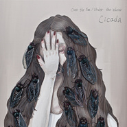

Over the Sea / Under the Water
============================

|  |  |
| :--: | :-- |
| [ Over the Sea / Under the Water](https://emumo.xiami.com/album/405201) | **艺人**: [Cicada](../index.md) **语种**: 纯音乐 **唱片公司**: StreetVoice **发行时间**: 2010年08月13日 **专辑类别**: EP, 单曲 **专辑风格**: 后摇 Post-Rock, 古典跨界 Classical Crossover **播放数**: 1791831 **收藏数**: 2769 **评论数**: 171  |

## 简介

这张手工EP，滴点着Cicada的轮廓：夜晚人行道上的小猫，从执娇、残伤、至重新适应，由她窗，以钢琴抚出离家时雀跃脚步的音弧。回忆里，相聚不易的家族旅行，喜悦振膊高飞，感情倏地俯冲。习将过往乐音存录，不愿以小调述悲伤，也不见大调说愉乐。没有情绪是完整无缺，有砂、雾糊，亦不纯粹。人永远在过去和当下间拉扯，即使故事伤挫，不满其意，仍要勇敢地继续走下去。  
  
Cicada始由江致洁，曾做过五年的流行乐手，却坚决应该走出自己的路，寻找欣赏自己的听众。有两年，她将钢琴紧阖，尘漫，像只待蜕的秋蝉，来些晚、也待些慢。直至那夜，邂逅了捷运站的家猫，从此开启了与音乐的另一段旅程，崭新之扉页。2010年三月，首次亚洲巡回的O'lafur Arnalds来台演出，同为首演的Cicada，即担纲开场的重要角色。  
  
〈竹围小猫〉记录一只猫的流浪，作者和牠交会，亦是她与音乐的再遇；〈浮游在海上的岛屿／潜伏于水下的人们〉，悼念莫拉克水灾的亡灵和悲恸；〈用羽毛织出一条淡蓝色的小径〉曲调欢悦，是件久违家族旅行的小品；〈以一种假装放荡的矜持 与你告别〉的情思饱满，有怨、有慕，有泣、也有诉，其灵感来自刘盈君的诗句，与〈告别／再见〉及〈最后 仍在一起〉等三首，堪称作者的感情自传。  
  
秋蝉拨开两载冻土，从平时生活和层层记忆之中，理出方向，溯出创作的灵感。因缘际会下，渐聚集一群志同道合的战友。其实，这群人非音乐科班出身，各自也尘封过心中的那把琴。然而，EP的出世，不就证明着她们蜕变，叼整着翅膀，开始振翅遨游？Cicada的宣告成立，不也为最明白、最诚实的表述吗？  
  
文／林正尉  
  
Cicada from Taiwan was formed in 2009 consists of violin, cello, acoustic guitar, and piano. It's named after Cicada because people are aware of cicada's existence by their sound instead of forms.   
  
“Over the Sea/Under the Water” is the debut EP of Cicada. Recorded live in the living room, the EP was hand crafted by Jesy Chiang. Narrative is one of the subjects in Cicada's music and inspiration normally came from daily life. The opening is a tribute to the Morakot typhoon victims as well as an expression toward Taiwanese political standing. The last three songs tell a story from a couple's separation to reunion. Throughout the naming, orchestration, and the composition, Cicada's music creates beautiful images for audiences.

## 曲目

## 评论

|  |  |  |  |
| :-- | :-- | :-- | :-- |
|  [虾米用户](https://emumo.xiami.com/u/346236642) 我还没想好要写什么... 2020-08-15 14:07 赞(0) 踩(0) | 
love
 |
|  [虾米用户](https://emumo.xiami.com/u/379162683) 我想要记住你们，我想要你... 2020-06-19 07:23 赞(0) 踩(0) | 

 |
|  [虾米用户](https://emumo.xiami.com/u/435393120)  2020-02-04 22:49 赞(1) 踩(0) | 
嗯
 |
|  [虾米用户](https://emumo.xiami.com/u/288664) hello小鱼 2019-09-08 08:24 赞(0) 踩(0) | 
很喜欢封面，虽然音乐不是很喜欢
 |
|  [虾米用户](https://emumo.xiami.com/u/411162059)  2019-07-06 22:12 赞(0) 踩(0) | 
我的夏天啊
 |
|  [虾米用户](https://emumo.xiami.com/u/366654504) EBIFA 2019-03-17 16:54 赞(1) 踩(0) | 
"EP封面中的长发女孩掩面又带伤痕，头发上的蝉就像在抚慰着她，单色的背景似乎也呈现她与世隔绝的内倾姿态"
 |
|  [虾米用户](https://emumo.xiami.com/u/316813193) 我不喜欢你会飞 2019-02-27 10:00 赞(0) 踩(0) | 
calmness.
 |
|  [虾米用户](https://emumo.xiami.com/u/42963872) 我还没想好要写什么... 2019-01-03 04:40 赞(0) 踩(0) | 
-
 |
|  [虾米用户](https://emumo.xiami.com/u/322523580) 夜空 总有更大密度的蓝色 2018-11-30 00:37 赞(0) 踩(0) | 
就你来见证我周四到周五的这个熬夜吧
 |
|  [虾米用户](https://emumo.xiami.com/u/310995587) illusion 2018-09-15 11:49 赞(0) 踩(0) | 
最後 仍在一起 是人類的烏托邦
 |
|  [虾米用户](https://emumo.xiami.com/u/49640493) 网易云SAINTDONT... 2018-08-20 01:33 赞(0) 踩(0) | 
爱
 |
|  [虾米用户](https://emumo.xiami.com/u/33611592) 音乐是药 2018-06-27 22:34 赞(0) 踩(0) | 
就是封面太不好了
 |
|  [虾米用户](https://emumo.xiami.com/u/339191478)   2018-06-24 19:19 赞(0) 踩(0) | 
:-)
 |
|  [虾米用户](https://emumo.xiami.com/u/8479114) 真正的悲剧可以无限续杯 2018-06-01 16:52 赞(2) 踩(0) | 
为什么封面的头发上有这么苍蝇...
 |
| ⇒ |  [虾米用户](https://emumo.xiami.com/u/339191478)   2018-06-24 19:20 赞(0) 踩(0) | 
那是蝉，因为这个乐队就叫做&amp;ldquo;蝉&amp;rdquo;
 |
| ⇒ |  [虾米用户](https://emumo.xiami.com/u/8479114) 真正的悲剧可以无限续杯 2018-06-25 17:05 赞(0) 踩(0) | 
<q><b>然而说：</b></q>
 |
|  [虾米用户](https://emumo.xiami.com/u/37555293)   2018-01-25 19:10 赞(0) 踩(0) | 
好喜欢
 |
|  [虾米用户](https://emumo.xiami.com/u/244162410) . 2018-01-06 18:09 赞(0) 踩(0) | 
感恩
 |
|  [虾米用户](https://emumo.xiami.com/u/244162410) . 2018-01-04 17:12 赞(0) 踩(0) | 
幸好幸好
 |
|  [虾米用户](https://emumo.xiami.com/u/1009164) 我还没想好要写什么... 2017-12-06 10:53 赞(0) 踩(0) | 
这张听了那么久，居然没留过言&amp;hellip;&amp;hellip;
 |
|  [虾米用户](https://emumo.xiami.com/u/320496273)  2017-12-04 10:53 赞(4) 踩(0) | 
网易和QQ都把这张专下了 过来避难
 |
| ⇒ |  [虾米用户](https://emumo.xiami.com/u/322758022) 我还没想好要写什么... 2017-12-04 12:50 赞(0) 踩(0) | 
一样  突然发现歌单没有了
 |
|  [虾米用户](https://emumo.xiami.com/u/9535207)  2017-10-30 10:10 赞(2) 踩(0) | 
不管做什麼樣的事，不管我現在有多麼急躁，這張專輯，或者是說Cicada創作音樂的那份真誠，都能讓我平靜，讓我安穩，不用一些讓人刻苦銘心的歌詞，什麼愛啊、悲傷啊，我喜歡他們只選擇用樂器去表達他們的心情，用Cicada的方式來跟我們說話。
 |
|  [虾米用户](https://emumo.xiami.com/u/270263664) . 2017-09-18 17:42 赞(1) 踩(0) | 
这张专简直神了
 |
|  [虾米用户](https://emumo.xiami.com/u/260123122)   2017-07-13 07:39 赞(1) 踩(0) | 
/
 |
|  [虾米用户](https://emumo.xiami.com/u/300886465) 最后 仍在一起 2017-07-11 12:45 赞(1) 踩(0) | 
安妮的味道。
 |
|  [虾米用户](https://emumo.xiami.com/u/47570236)  　⠀ 2017-06-26 11:39 赞(0) 踩(0) | 

 |
|  [虾米用户](https://emumo.xiami.com/u/2627008) 再见了，朋友们 2017-05-15 10:58 赞(1) 踩(0) | 
咦，这封面太可怕
 |
|  [虾米用户](https://emumo.xiami.com/u/3871700)  2017-04-17 23:56 赞(0) 踩(0) | 
如此认真，如此投入。
 |
|  [虾米用户](https://emumo.xiami.com/u/21167653)  2016-12-01 17:59 赞(0) 踩(0) | 
第二首名字很喜欢，曾经模仿此曲取豆瓣相册的名字，整张专辑洋溢着美好和意味深长的氛围，令人沉醉
 |
|  [虾米用户](https://emumo.xiami.com/u/201391232) 谢谢虾米，你们是我。 2016-10-17 23:45 赞(1) 踩(0) | 
與你告別
 |
|  [虾米用户](https://emumo.xiami.com/u/17916955) 不食巫师 2016-08-08 16:54 赞(16) 踩(0) | 
高一时陷入温暖的恋慕，明知无法企及仍然美好地向往着 那时这里所有的音乐陪伴我在画室静驻，在夜色中回家
 |
|  [虾米用户](https://emumo.xiami.com/u/30617820) 窝列大窝列大哟 2016-07-21 22:36 赞(0) 踩(0) | 
＝＝
 |
|  [虾米用户](https://emumo.xiami.com/u/8468754) @ddazedconfu... 2016-07-02 22:08 赞(0) 踩(0) | 
nice
 |
|  [虾米用户](https://emumo.xiami.com/u/5800966) Comedy biaaa... 2016-05-14 18:48 赞(0) 踩(0) | 
真好啊
 |
|  [虾米用户](https://emumo.xiami.com/u/20004733) soojong 2016-05-09 22:46 赞(1) 踩(0) | 
一张伤心的专辑
 |
|  [虾米用户](https://emumo.xiami.com/u/20004733) soojong 2016-05-09 22:46 赞(0) 踩(0) | 
名字都有故事
 |
|  [虾米用户](https://emumo.xiami.com/u/45686456) 生活本该如此 2016-04-10 12:51 赞(3) 踩(0) | 
歌名顺着看下来，竟想要流泪
 |
|  [虾米用户](https://emumo.xiami.com/u/6393573) 我还没想好要写什么... 2016-03-10 11:42 赞(0) 踩(0) | 
▲
 |
|  [虾米用户](https://emumo.xiami.com/u/7661454) 为宝我的爱 2016-03-10 05:38 赞(1) 踩(0) | 
封面无法直视
 |
|  [虾米用户](https://emumo.xiami.com/u/4179114) 有点傻，不太乖～ 2016-03-03 12:50 赞(1) 踩(0) | 
以假装放荡的矜持与你告别
 |
|  [虾米用户](https://emumo.xiami.com/u/45621221) 卸载状态。 2016-01-24 10:12 赞(0) 踩(0) | 
=
 |
|  [虾米用户](https://emumo.xiami.com/u/9768883) 见未必为实，听也非为虚 2016-01-16 19:03 赞(3) 踩(0) | 
昨天发现WAV可以单独购买，谁知道入了以后频谱检测和320K的MP3一样。这是怎么回事？上架前不做检测吗？
 |
| ⇒ |  [虾米用户](https://emumo.xiami.com/u/13992891)  2016-04-15 23:00 赞(0) 踩(0) | 
虾米上面，比如，原声碟的音质都炒鸡差，很多音乐根本无高音质的
 |
| ⇒ |  [虾米用户](https://emumo.xiami.com/u/6975678) 生命如此短暂我比烟花灿烂 2016-07-02 02:24 赞(0) 踩(0) | 
<q><b>sherring说：</b></q>
 |
|  [虾米用户](https://emumo.xiami.com/u/6975678) 生命如此短暂我比烟花灿烂 2016-01-15 23:55 赞(0) 踩(0) | 
#小雨音乐茶座# Rest In Harmony.
 |
|  [虾米用户](https://emumo.xiami.com/u/44835257) 用音乐控诉神灵 2016-01-12 22:30 赞(0) 踩(0) | 
难怪一耳喜欢，原来月风随了rachel's
 |
|  [虾米用户](https://emumo.xiami.com/u/10110042)  2015-12-16 18:10 赞(0) 踩(0) | 
古典跨越
 |
|  [虾米用户](https://emumo.xiami.com/u/235050) 我就说我是穷逼嘛~ 2015-12-04 22:33 赞(1) 踩(0) | 
特别想买这一张啊！咋没带来现场
 |
|  [虾米用户](https://emumo.xiami.com/u/49374694) 喜乐 2015-11-06 15:25 赞(1) 踩(0) | 
都是故事
 |
|  [虾米用户](https://emumo.xiami.com/u/50650703) ROCK MY LIFE 2015-11-03 20:31 赞(0) 踩(0) | 
not bad!
 |
|  [虾米用户](https://emumo.xiami.com/u/66959550)  2015-09-19 01:11 赞(0) 踩(0) | 
classic
 |
|  [虾米用户](https://emumo.xiami.com/u/8226204) ≡ 2015-08-25 12:38 赞(0) 踩(0) | 
美
 |
|  [虾米用户](https://emumo.xiami.com/u/8010989)  2015-08-10 09:56 赞(0) 踩(0) | 
   
 |
|  [虾米用户](https://emumo.xiami.com/u/24002083) 迷津欲有問 2015-08-06 10:28 赞(0) 踩(0) | 
再来。
 |
|  [虾米用户](https://emumo.xiami.com/u/44870079) 诗酒趁年华 2015-08-02 09:26 赞(0) 踩(0) | 
什么鬼封面
 |
| ⇒ |  [虾米用户](https://emumo.xiami.com/u/49075530) 极致 2015-10-18 21:34 赞(0) 踩(0) | 

 |
| ⇒ |  [虾米用户](https://emumo.xiami.com/u/49075530) 极致 2015-10-18 21:34 赞(0) 踩(0) | 

 |
|  [虾米用户](https://emumo.xiami.com/u/47421433) 群居动物 2015-07-30 17:22 赞(0) 踩(0) | 
密集恐惧症的不要点看封面.
 |
|  [虾米用户](https://emumo.xiami.com/u/6171336) 谢谢9年陪伴，你依然是我... 2015-07-29 21:13 赞(0) 踩(0) | 
哎我天 还以为一封面的苍蝇
 |
|  [虾米用户](https://emumo.xiami.com/u/8944564) morbid. 2015-07-23 20:39 赞(0) 踩(0) | 
夏。蝉。
 |
|  [虾米用户](https://emumo.xiami.com/u/8944564) morbid. 2015-07-23 20:39 赞(0) 踩(0) | 
夏。蝉。
 |
|  [虾米用户](https://emumo.xiami.com/u/7322777) ∮ 2015-07-23 17:50 赞(2) 踩(0) | 
...A...
 |
|  [虾米用户](https://emumo.xiami.com/u/8226204) ≡ 2015-07-23 14:39 赞(0) 踩(0) | 
有了。
 |
|  [虾米用户](https://emumo.xiami.com/u/9193511)  2015-06-08 09:58 赞(0) 踩(0) | 
没有为什么呀
 |
|  [虾米用户](https://emumo.xiami.com/u/43658868)  2015-05-07 17:30 赞(1) 踩(0) | 
一支台湾新古典弦乐乐队，cicada，蝉。因人们觉察到蝉的出现，往往是因为听到了他们的声音，而不是看见其形体                                        。
 |
|  [虾米用户](https://emumo.xiami.com/u/752865)  2015-05-02 19:35 赞(0) 踩(0) | 
最近的距離 最強的心跳
 |
|  [虾米用户](https://emumo.xiami.com/u/40935203)  2015-04-30 11:30 赞(0) 踩(0) | 
nice
 |
|  [虾米用户](https://emumo.xiami.com/u/49496906)  2015-04-23 14:54 赞(0) 踩(0) | 
美
 |
|  [虾米用户](https://emumo.xiami.com/u/9154037) 到水星散心去了。 2015-04-17 00:24 赞(0) 踩(0) | 
曲名像是一个个小故事。
 |
|  [虾米用户](https://emumo.xiami.com/u/5721676) 瀑瀑是最棒的！ 2015-03-13 10:28 赞(0) 踩(0) | 
<a href="http://emumo.xiami.com/u/33323040" target="_blank" rel="nofollow" name_card="33323040">@西美娘</a>
 |
|  [虾米用户](https://emumo.xiami.com/u/11082993) 暂无签名~ 2015-02-05 22:08 赞(0) 踩(0) | 
不能分享到qq，满满的感动给我气没了
 |
|  [虾米用户](https://emumo.xiami.com/u/4768008) 我还没想好要写什么... 2015-01-19 01:15 赞(0) 踩(0) | 
失眠的夜里格外的填充。
 |
|  [虾米用户](https://emumo.xiami.com/u/4369590)  2014-10-26 15:07 赞(0) 踩(0) | 
温暖如诗的岛屿啊，让我投入你的乡
 |
|  [虾米用户](https://emumo.xiami.com/u/4369590)  2014-10-25 00:58 赞(0) 踩(0) | 
温暖的岛屿呀，让我投入你的怀抱，
 |
|  [虾米用户](https://emumo.xiami.com/u/40116911)   2014-08-25 20:41 赞(0) 踩(0) | 
非常清新特别的弦乐小队
 |
|  [虾米用户](https://emumo.xiami.com/u/33078) soul 2014-08-17 07:17 赞(0) 踩(0) | 
情不自禁跟着旋转……告白……
 |
|  [虾米用户](https://emumo.xiami.com/u/20588948) 非善戲 無端正 2014-08-08 22:46 赞(0) 踩(0) | 
蝉
 |
|  [虾米用户](https://emumo.xiami.com/u/8616577)  2014-08-02 09:05 赞(0) 踩(0) | 
很消暑
 |
|  [虾米用户](https://emumo.xiami.com/u/39361203) 等你 2014-07-30 21:13 赞(0) 踩(0) | 
窥见了  整个宇宙
 |
|  [虾米用户](https://emumo.xiami.com/u/3632275) 我还没想好要写什么... 2014-07-26 23:21 赞(1) 踩(0) | 
耳边听到的是过往，眼睛看到的是当下，巧合的是，两件都略带伤感的气味，庆幸的是后者多了勇敢的心。
 |
|  [虾米用户](https://emumo.xiami.com/u/32176686) Hugs to ashe... 2014-07-25 05:45 赞(0) 踩(0) | 
世界走远了
 |
|  [虾米用户](https://emumo.xiami.com/u/1685002) 以身外身 做梦中梦. 2014-06-06 19:54 赞(0) 踩(0) | 
2014年6月6日
 |
|  [虾米用户](https://emumo.xiami.com/u/2366190)   2014-05-28 22:03 赞(0) 踩(0) | 
正好契合现在的心境。2014年5月28日。
 |
|  [虾米用户](https://emumo.xiami.com/u/3442087) Dust To Dust 2014-05-13 15:40 赞(0) 踩(0) | 
~~~
 |
|  [虾米用户](https://emumo.xiami.com/u/7510020) 超越自卑和自尊。 2014-04-06 12:50 赞(0) 踩(0) | 
没有办法抵抗。
 |
|  [虾米用户](https://emumo.xiami.com/u/5173120)  2014-03-24 14:55 赞(0) 踩(0) | 
Cicada是一支来自台北的室内弦乐乐团，这里集中了6首很办的纯。音。乐。
 |
|  [虾米用户](https://emumo.xiami.com/u/23485757)  2014-03-17 10:58 赞(0) 踩(0) | 
好聽
 |
|  [虾米用户](https://emumo.xiami.com/u/1609946) 一即一切 2014-03-01 16:05 赞(0) 踩(0) | 
心 境不二
 |
|  [虾米用户](https://emumo.xiami.com/u/8643123) 我还没想好要写什么... 2014-02-12 20:46 赞(0) 踩(0) | 
好砖
 |
|  [虾米用户](https://emumo.xiami.com/u/4357310) 音乐是我用来诠释世界的方... 2014-01-05 22:07 赞(0) 踩(0) | 
如此宁静而安稳，就像已埋进心里的幸福。
 |
|  [虾米用户](https://emumo.xiami.com/u/15263057)  2013-12-18 00:27 赞(0) 踩(0) | 
cicada华人中比较少见的新古典、后摇、流行乐为风格的组合～这张专辑是她们刚刚出道的专辑，今年8月2号，她们出了第四张专辑《边境消逝》～
 |
|  [虾米用户](https://emumo.xiami.com/u/2208776)  2013-12-08 20:52 赞(0) 踩(0) | 
quite
 |
|  [虾米用户](https://emumo.xiami.com/u/21612519)  2013-12-03 22:54 赞(0) 踩(0) | 
这只蝉张开了翅膀，然后我的眼前浮现出一只蝴蝶
 |
|  [虾米用户](https://emumo.xiami.com/u/3229152)  2013-09-26 11:48 赞(0) 踩(0) | 
钢琴
 |
|  [虾米用户](https://emumo.xiami.com/u/3764546) 你拥抱的并不也总是拥抱你 2013-09-25 20:52 赞(0) 踩(0) | 
这个后摇团他好了，一男三女，真好
 |
|  [虾米用户](https://emumo.xiami.com/u/3229301)  2013-09-05 11:50 赞(0) 踩(0) | 
乐声直抵内心深处
 |
|  [虾米用户](https://emumo.xiami.com/u/8924325)  2013-08-26 12:24 赞(0) 踩(0) | 
蝉是一种生命短暂的生物，但是在他有限的生命里，从来没有放弃过鸣叫！请记住，人活着不该成为一条狗，而应做一只用生命鸣叫的蝉！
 |
|  [虾米用户](https://emumo.xiami.com/u/6594496)  2013-08-14 19:29 赞(0) 踩(0) | 
午后的一记镇静剂。
 |
|  [虾米用户](https://emumo.xiami.com/u/7945794)  2013-08-09 13:20 赞(0) 踩(0) | 
夏虫不可语于冰。
 |
|  [虾米用户](https://emumo.xiami.com/u/5151546) 那么近又那么远 2013-07-16 21:44 赞(0) 踩(0) | 
歌名很特别，整张专辑像一个故事
 |
|  [虾米用户](https://emumo.xiami.com/u/1268101)  2013-05-05 11:34 赞(0) 踩(0) | 
宁静。
 |
|  [虾米用户](https://emumo.xiami.com/u/5721676) 瀑瀑是最棒的！ 2013-04-14 10:20 赞(0) 踩(0) | 
突然看见了  听了就想收下。
 |
|  [虾米用户](https://emumo.xiami.com/u/9094389)  2013-04-03 23:13 赞(0) 踩(0) | 
隨著緩緩的旋律，想起很多往事
 |
|  [虾米用户](https://emumo.xiami.com/u/225462)  2013-03-17 00:03 赞(0) 踩(0) | 
是演奏的问题？录音的问题？或者是我耳机的问题？感觉这小提琴是便宜货
 |
|  [虾米用户](https://emumo.xiami.com/u/7730510) 虾听而已 2013-03-14 14:53 赞(0) 踩(0) | 
like
 |
|  [虾米用户](https://emumo.xiami.com/u/4701048)  2013-03-01 15:15 赞(0) 踩(0) | 
《告别》的大提琴好好听！
 |
|  [虾米用户](https://emumo.xiami.com/u/13244360)  2013-02-27 18:57 赞(0) 踩(0) | 
還是可以的
 |
|  [虾米用户](https://emumo.xiami.com/u/9026935) 路，还是那条路，只是每天... 2013-02-23 17:04 赞(0) 踩(0) | 
哇，大知LE !
 |
|  [虾米用户](https://emumo.xiami.com/u/1211082)   2013-01-09 00:07 赞(0) 踩(0) | 
潜沉
 |
|  [虾米用户](https://emumo.xiami.com/u/6248192) bullshit.☢ 2013-01-07 00:22 赞(0) 踩(0) | 
M
 |
|  [虾米用户](https://emumo.xiami.com/u/1292094)  2012-12-25 04:39 赞(0) 踩(0) | 
飞
 |
|  [虾米用户](https://emumo.xiami.com/u/11420216)  2012-12-15 03:22 赞(0) 踩(0) | 
我爱着你却不知道，幽静而凄婉的心。听到 告别/再见 让我如此感受。
 |
|  [虾米用户](https://emumo.xiami.com/u/3333818) 生命不止音乐不断 2012-11-22 12:22 赞(1) 踩(0) | 
Cicada意为“蝉”，他们的音乐也与蝉音一般洋溢着静谧和优雅。首张EP包括了6首纯器乐曲子，纯手工制作并在著名的独立厂牌——小白兔橘子下发行。
 |
|  [虾米用户](https://emumo.xiami.com/u/391693)  2012-11-16 06:46 赞(0) 踩(0) | 
小推一下这张专辑 晚上憋在屋子里时听听是不错的
 |
|  [虾米用户](https://emumo.xiami.com/u/6515158) weibo：杯砸_aer... 2012-11-14 22:16 赞(1) 踩(0) | 
0 0
 |
|  [虾米用户](https://emumo.xiami.com/u/3857236) 猫. 2012-11-14 15:07 赞(0) 踩(0) | 
舒服
 |
|  [虾米用户](https://emumo.xiami.com/u/8345353)  2012-10-31 09:41 赞(0) 踩(0) | 
非常值得一听的音乐，让心有个安静的角落
 |
|  [虾米用户](https://emumo.xiami.com/u/9271393)  2012-10-16 04:23 赞(0) 踩(0) | 
今日最好听
 |
|  [虾米用户](https://emumo.xiami.com/u/5883409)   2012-10-07 01:39 赞(0) 踩(0) | 
难得有这么直接地把夏天的清风吹到耳边的音乐作品，我爱。
 |
|  [虾米用户](https://emumo.xiami.com/u/2800823) 蝉鸣的季节从今天开始 2012-08-25 21:32 赞(0) 踩(0) | 
用心，纯净，美
 |
|  [虾米用户](https://emumo.xiami.com/u/9499552)  2012-08-19 10:40 赞(0) 踩(0) | 
嗯，蛮好的
 |
|  [虾米用户](https://emumo.xiami.com/u/8153182)  2012-07-02 02:28 赞(0) 踩(0) | 
like it
 |
|  [虾米用户](https://emumo.xiami.com/u/7345277)  2012-06-23 20:58 赞(0) 踩(0) | 
有雷光夏的感觉 但是更纯粹了
 |
|  [虾米用户](https://emumo.xiami.com/u/6279685) 她会有多幸运. 2012-06-23 20:49 赞(0) 踩(0) | 
我爱上她们了。
 |
|  [虾米用户](https://emumo.xiami.com/u/3235848)  2012-05-29 01:00 赞(0) 踩(0) | 
睡前听一下
 |
|  [虾米用户](https://emumo.xiami.com/u/398868)  2012-05-09 17:13 赞(0) 踩(0) | 
很丰富
 |
|  [虾米用户](https://emumo.xiami.com/u/3993752)  2012-04-19 21:30 赞(0) 踩(0) | 
漂浮在海上的岛屿/浅沉于水下的人们/用羽毛织出一条淡蓝色的小径/竹围小猫/以一种假装放荡的矜持与你告别/告别/再见/最后仍在一起/ 好听的歌名，纯器乐。
 |
|  [虾米用户](https://emumo.xiami.com/u/3993752)  2012-04-19 21:28 赞(0) 踩(0) | 
漂浮在海上的岛屿/浅沉于水下的人们/用羽毛织出一条淡蓝色的小径/竹围小猫/以一种假装放荡的矜持与你告别/告别/再见/最后仍在一起/  好听的歌名，纯器乐。
 |
|  [虾米用户](https://emumo.xiami.com/u/398493) 我还没想好要写什么... 2012-03-25 13:57 赞(0) 踩(0) | 
很真诚，但是感情没有全情投入
 |
|  [虾米用户](https://emumo.xiami.com/u/3042816)  NingPo 2012-03-25 13:14 赞(0) 踩(0) | 
好好听
 |
|  [虾米用户](https://emumo.xiami.com/u/899643) 引力 2012-03-11 00:03 赞(0) 踩(0) | 
完全对大提琴没有抵抗力。
 |
|  [虾米用户](https://emumo.xiami.com/u/899643) 引力 2012-03-11 00:02 赞(0) 踩(0) | 
完全对大提琴没有抵抗力。
 |
|  [虾米用户](https://emumo.xiami.com/u/8350639)  2012-03-09 08:46 赞(0) 踩(0) | 
恋爱的滋味
 |
|  [虾米用户](https://emumo.xiami.com/u/7271034) 吃饭不积极思想有问题 2012-02-27 17:24 赞(0) 踩(0) | 
爱
 |
|  [虾米用户](https://emumo.xiami.com/u/4166639)  2011-12-29 19:41 赞(0) 踩(0) | 
这恐怕是我最喜欢的中国乐队了。。。
 |
|  [虾米用户](https://emumo.xiami.com/u/4088703) Never Stop T... 2011-12-07 21:25 赞(0) 踩(0) | 
喜爱~
 |
|  [虾米用户](https://emumo.xiami.com/u/5971113)  2011-12-05 22:40 赞(0) 踩(0) | 
加油！
 |
|  [虾米用户](https://emumo.xiami.com/u/6995058)  2011-11-27 23:13 赞(0) 踩(0) | 
以一种假装放荡的矜持与你告别、
 |
|  [虾米用户](https://emumo.xiami.com/u/1396206) 聆听月升 2011-11-12 16:16 赞(0) 踩(0) | 
初次听到，很惊喜
 |
|  [虾米用户](https://emumo.xiami.com/u/4996952)  2011-10-25 12:14 赞(0) 踩(0) | 
封面的蝉，活生生就是我的小黑嘛 &amp;gt;..&amp;lt;
 |
|  [虾米用户](https://emumo.xiami.com/u/1534987)  2011-10-24 11:13 赞(0) 踩(0) | 
以一种假装放荡的矜持与你告别
 |
|  [虾米用户](https://emumo.xiami.com/u/161788) 总是在清晨出走 2011-10-06 12:02 赞(0) 踩(0) | 
美～
 |
|  [虾米用户](https://emumo.xiami.com/u/4190379)  2011-08-28 00:43 赞(0) 踩(0) | 
有前途。
 |
|  [虾米用户](https://emumo.xiami.com/u/3864707)  2011-07-31 01:10 赞(0) 踩(0) | 
很喜欢这种风格,支持
 |
|  [虾米用户](https://emumo.xiami.com/u/1537990)  2011-07-30 01:25 赞(0) 踩(0) | 
感觉不错，收藏了慢慢听
 |
|  [虾米用户](https://emumo.xiami.com/u/141825) drowned. 2011-07-29 19:13 赞(0) 踩(0) | 
很不错的一张台湾新古典/后摇，隐隐约约有ashram的味道。
 |
|  [虾米用户](https://emumo.xiami.com/u/1196231)  2011-07-04 18:24 赞(0) 踩(0) | 
名字都好美
 |
|  [虾米用户](https://emumo.xiami.com/u/1373260) 嘻嘻嘻 2011-07-02 22:54 赞(0) 踩(0) | 
<a href="http://music.douban.com/subject/5042204/" target="_blank" rel="nofollow noreferrer noopener">http://music.douban.com/subject/5042204/</a>这封面不对啊。。。我在豆瓣收藏这张就是冲着这封面来的啊。。。肿么回事！！！！！
 |
| ⇒ |  [虾米用户](https://emumo.xiami.com/u/884979)  2011-07-05 21:10 赞(0) 踩(0) | 
这张貌似再版了，豆瓣那个是新封面，小白兔第一版就是这样的，是手工制作的~
 |
| ⇒ |  [虾米用户](https://emumo.xiami.com/u/1373260) 嘻嘻嘻 2011-07-06 00:16 赞(0) 踩(0) | 
<q><b>Aldus说：</b></q>
 |
|  [虾米用户](https://emumo.xiami.com/u/2113266)  2011-05-16 21:38 赞(0) 踩(0) | 
朋友創辦的樂團~ 一定要頂的啊~
 |
|  [虾米用户](https://emumo.xiami.com/u/1375845)  2011-04-23 20:39 赞(0) 踩(0) | 
就为了两首曲子  第一和最末
 |
|  [虾米用户](https://emumo.xiami.com/u/1764476)  2011-04-05 17:17 赞(0) 踩(0) | 
层层铺开
 |
|  [虾米用户](https://emumo.xiami.com/u/2102919)  2011-03-14 17:53 赞(0) 踩(0) | 
因为是。。。
 |
|  [虾米用户](https://emumo.xiami.com/u/1099784)  2011-03-03 10:29 赞(0) 踩(0) | 
台湾第一支室内乐编制的后摇滚乐团Cicada，首张EP共有六首歌，他们在录制这张EP的时候是采用同步录音的方式，两把小提琴，一支大提琴，一台真实钢琴，还有木吉他，所有乐器一起同步录音。完美和声中的弦律线。
 |
|  [虾米用户](https://emumo.xiami.com/u/2962458)  2011-02-24 18:28 赞(0) 踩(0) | 
海水的颜色，最近的最爱
 |
|  [虾米用户](https://emumo.xiami.com/u/2899083)  2011-02-19 14:03 赞(0) 踩(0) | 
韩亮说催眠用的
 |
|  [虾米用户](https://emumo.xiami.com/u/2762619)  2011-02-07 21:22 赞(0) 踩(0) | 
******
 |
|  [虾米用户](https://emumo.xiami.com/u/2704503)  2011-02-04 03:12 赞(0) 踩(0) | 
非常有故事感的专辑
 |
|  [虾米用户](https://emumo.xiami.com/u/2204550) 大石碎胸口 2011-01-27 12:00 赞(0) 踩(0) | 
适合睡觉听
 |
|  [虾米用户](https://emumo.xiami.com/u/2204550) 大石碎胸口 2011-01-27 11:38 赞(0) 踩(0) | 
不错
 |
|  [虾米用户](https://emumo.xiami.com/u/2635341)  2011-01-27 00:44 赞(0) 踩(0) | 
用到的乐器都是喜欢的 很赞
 |
|  [虾米用户](https://emumo.xiami.com/u/2149744) 暂无签名~ 2011-01-21 16:01 赞(0) 踩(0) | 
喜欢就是感觉对了
 |
|  [虾米用户](https://emumo.xiami.com/u/1532700)  2011-01-12 12:01 赞(0) 踩(0) | 
那些炙热的漂浮的 、都可沉淀进 凉而透亮发光的 蓝色水底那些稚嫩的掩埋的 、都可露出水面 重新呼吸 略咸的 湿润空气
 |
|  [虾米用户](https://emumo.xiami.com/u/190144)  2010-12-09 23:34 赞(0) 踩(0) | 
潜水的人偷着乐呢，别这样
 |
|  [虾米用户](https://emumo.xiami.com/u/269625)  2010-11-11 22:33 赞(0) 踩(0) | 
很安静的音乐 有点怀旧让我想起某个 下雨的下午 淅淅沥沥的不停
 |
|  [虾米用户](https://emumo.xiami.com/u/1746148)  2010-10-26 23:16 赞(0) 踩(0) | 
音樂沒錯喔，我第一次聽的時候也以為聽錯。下面是這張專輯的介紹：CICADA首張EP共有六首歌，他們在錄製這張EP的時候是採用同步錄音的方式，兩把小提琴，一支大提琴，一台真實鋼琴，還有木吉他，所有樂器一起同步錄音；我們可以從他們的EP中感受到一種「生活的動力」，即便有一些地方略有小瑕疵，但我覺得完全不是缺點，而是完整保留了錄音當時的氣氛－發出了一個樂團基本的共鳴，以及最好聽的音樂。雖然樂團成員多是音樂學院出身，但是和我刻板中「學院派」的印象差很多，沒有拘束，創作能力反而更游刃有餘，可千萬別說他們跨界，在我的耳朵裡，CICADA是搖滾樂團！
 |
|  [虾米用户](https://emumo.xiami.com/u/405162)  2010-10-09 18:09 赞(0) 踩(0) | 
弄错了吧   这张是台湾后摇团的作品 出品公司是小白兔橘子这里的cicada可是美国的电音团啊
 |
| ⇒ |  [虾米用户](https://emumo.xiami.com/u/620947)   2010-10-17 16:22 赞(0) 踩(0) | 
这张专辑豆瓣都搜不到呢……具体是什么名字啊
 |
| ⇒ |  [虾米用户](https://emumo.xiami.com/u/106403)  2010-10-18 00:27 赞(0) 踩(0) | 
<q><b>whale说：</b></q>
 |
