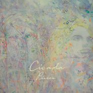

散落的时光Pieces
============================

|  |  |
| :--: | :-- |
| [ 散落的时光Pieces](https://emumo.xiami.com/album/466621) | **艺人**: [Cicada](../index.md) **语种**: 国语 **唱片公司**: 小白兔唱片 **发行时间**: 2011年09月10日 **专辑类别**: 录音室专辑 **专辑风格**: 后摇 Post-Rock, 古典跨界 Classical Crossover **播放数**: 2740260 **收藏数**: 2459 **评论数**: 120  |

## 简介

 

★近未来四件式古典编制，温柔而坚毅，由女性主导的创作乐团。
 

★一张追寻心灵自省、探索、独立的过程，展现著坚强与温柔的专辑。
 

★Cicada的每一张专辑封面，都邀请台湾女性艺术家绘制，「散落的时光」为台湾新锐画家高雅婷之作品。
 

★悠扬带着叙事的弦律，诗一般的质感。
 

 
 

於是她决定分手
 

和自己在一起
 

 
 

听见声音，却始终看不到身影；一个以蝉为名的乐团，捡拾起一地《散落的时光 / Pieces》，串成一张让耳朵开出鲜嫩花朵的专辑，应该是这个夏天最让人欣慰的事情。
 

 
 

Cicada由大提琴、小提琴、钢琴、民谣吉他三女一男的四件式近未来古典编制呈现，歌曲环绕着以女性为主导与出发点，发挥出其独特的温柔而抚慰的阴性力量，在独立音乐圈中，掀起一阵旋风。
 

 
 

从2010出道的第一场公开演出，为冰岛钢琴作曲家Olafur Arnalds在台北的演奏会开场，紧接着和台湾知名的爆炸系后摇滚乐团「阿飞西雅」合奏，倍受瞩目。并参与郑宜农 - 海王星之专辑编曲与演出，与郑宜农合作巡演许多曲目，展现出Cicada的柔和弹性和融入之适性。
 

 
 

《散落的时光》这张专辑，延续2010《Over The Sea/Under The Water》EP的概念，改编EP中的「最后 &nbsp;仍在一起」一曲为小调，歌名也改为「晨雾」，借用爱情破裂的印象，说明一段女性的心灵自省、探索、寻求独立的过程。其实，Cicada 的音乐唤起了我对一个名叫Rachel’s的美国乐团的回忆，不过比起实验性较强、偶尔稍微深邃晦涩的Rachel’s，Cicada拥有的是一张更温柔的面孔，情绪的起伏也较为平缓，并未流露过多的哀伤或忿怨，而是填充著纤细的思绪、冷静的情感与回忆的气息。
 

 
 

自组团之初，Cicada便决定，唱片封面皆要采用台湾女性艺术家的画作，《散落的时光》封面便采用了高雅婷的作品，抽象与具象的交融、看似青涩却又沁人的色彩，带着淡淡忧郁的蓝，点缀几许缤纷却又飘渺的嫣红奼紫，女性的生命，正是如此美丽、纤细，却又深深烙印在灵魂之中。
 

## 曲目

## 评论

|  |  |  |  |
| :-- | :-- | :-- | :-- |
|  [虾米用户](https://emumo.xiami.com/u/445814545) R.I.P 2020-11-08 17:50 赞(0) 踩(0) | 

 |
|  [虾米用户](https://emumo.xiami.com/u/379162683) 我想要记住你们，我想要你... 2020-10-14 23:57 赞(0) 踩(0) | 

 |
|  [虾米用户](https://emumo.xiami.com/u/279828134) 再 会   2020-07-17 20:19 赞(1) 踩(0) | 
◈
 |
|  [虾米用户](https://emumo.xiami.com/u/405858695) 快乐听歌 2020-07-17 09:05 赞(0) 踩(0) | 
跌宕起伏的情緒，終歸是情緒
 |
|  [虾米用户](https://emumo.xiami.com/u/435393120)  2020-02-04 22:49 赞(2) 踩(0) | 
嗯
 |
|  [虾米用户](https://emumo.xiami.com/u/403112183) 我还没想好要写什么... 2019-11-22 12:13 赞(0) 踩(0) | 
bye
 |
|  [虾米用户](https://emumo.xiami.com/u/99209370) viva la vida 2019-09-23 16:13 赞(0) 踩(0) | 
我终于挣脱你了，我的尸体已冷，你再也读不出我任何欲望。晨雾弥散在湖面的尽头，时间来不及了，能说的不多了。那些散落的时光里，阳光下你灿烂的笑脸已经失去了温度。和你在一起之后......
 |
|  [虾米用户](https://emumo.xiami.com/u/3583995) 一個人的戰爭 2019-05-17 05:56 赞(2) 踩(0) | 
.
 |
|  [虾米用户](https://emumo.xiami.com/u/43937617) 永远爱虾米 2019-04-27 07:33 赞(2) 踩(0) | 

 |
|  [虾米用户](https://emumo.xiami.com/u/422796737)  2019-04-07 22:06 赞(1) 踩(0) | 
优美舒心的旋律 非常适合看书学习 也是很好的睡前音乐 让人静心放松
 |
|  [虾米用户](https://emumo.xiami.com/u/10471420) one last day... 2019-02-10 15:10 赞(1) 踩(0) | 
新的一年。春节放假最后一天，坐车回去上班的路上，不舍离家 
 |
|  [虾米用户](https://emumo.xiami.com/u/191947882) 點擊編輯 2019-02-02 11:31 赞(1) 踩(0) | 
不同于其他的后摇体验
 |
|  [虾米用户](https://emumo.xiami.com/u/42963872) 我还没想好要写什么... 2019-01-03 04:40 赞(1) 踩(0) | 
-
 |
|  [虾米用户](https://emumo.xiami.com/u/4098694) ɪ ғᴇᴇʟ ᴘᴀɪɴғ... 2018-12-31 19:29 赞(0) 踩(0) | 
.
 |
|  [虾米用户](https://emumo.xiami.com/u/33611592) 音乐是药 2018-06-23 21:26 赞(0) 踩(0) | 
非常静谧
 |
|  [虾米用户](https://emumo.xiami.com/u/339191478)   2018-05-28 17:26 赞(0) 踩(0) | 
:-)
 |
|  [虾米用户](https://emumo.xiami.com/u/260123122)   2018-03-25 13:17 赞(1) 踩(0) | 
_
 |
|  [虾米用户](https://emumo.xiami.com/u/71178106) 塵世や 酒、風呂を抜け ... 2018-01-28 11:02 赞(1) 踩(0) | 
♡
 |
|  [虾米用户](https://emumo.xiami.com/u/225730375) 我爱你. zl 2018-01-15 20:01 赞(1) 踩(0) | 
听了现场 才知道 这张专辑 讲的是两个女孩子的爱情 正如封面
 |
|  [虾米用户](https://emumo.xiami.com/u/244162410) . 2018-01-01 17:24 赞(1) 踩(0) | 
能说的不多了
 |
|  [虾米用户](https://emumo.xiami.com/u/327623455) 就是这样。 2017-12-21 01:21 赞(0) 踩(0) | 
这是一个很适合写作的专辑，想起很多往事，笔尖就迫不及待地要快速移动了。
 |
|  [虾米用户](https://emumo.xiami.com/u/42796114) 我去过的每一个地方，走的... 2017-12-03 19:04 赞(0) 踩(0) | 
入坑专辑     
 |
|  [虾米用户](https://emumo.xiami.com/u/66823378)  2017-11-25 13:30 赞(2) 踩(0) | 

 |
|  [虾米用户](https://emumo.xiami.com/u/51850646) 我好帅 2017-10-28 00:01 赞(0) 踩(0) | 
好喜欢
 |
|  [虾米用户](https://emumo.xiami.com/u/15270473) 听到喜欢的歌 身体不跟着... 2017-10-01 21:42 赞(0) 踩(0) | 
-
 |
|  [虾米用户](https://emumo.xiami.com/u/47762018) 虾米我永远爱你 2017-09-04 17:18 赞(0) 踩(0) | 

 |
|  [虾米用户](https://emumo.xiami.com/u/11856207) 水泥中的蝴蝶之谜 2017-08-30 09:24 赞(0) 踩(0) | 
补标
 |
|  [虾米用户](https://emumo.xiami.com/u/47762018) 虾米我永远爱你 2017-08-12 10:42 赞(0) 踩(0) | 
/
 |
|  [虾米用户](https://emumo.xiami.com/u/45052758) 我还没想好要写什么... 2017-03-21 11:35 赞(0) 踩(0) | 
[带墨镜笑]
 |
|  [虾米用户](https://emumo.xiami.com/u/52506830) 再见 2017-02-24 20:17 赞(0) 踩(0) | 

 |
|  [虾米用户](https://emumo.xiami.com/u/252406760) ジャンクと言われた日々 2017-02-16 23:33 赞(0) 踩(0) | 
☆
 |
|  [虾米用户](https://emumo.xiami.com/u/118464492) 我也是。 2017-01-31 11:28 赞(1) 踩(0) | 
可能因为在一起之后，发现并没有那么快乐吧，人的感情是会疲惫的嘛。
 |
|  [虾米用户](https://emumo.xiami.com/u/34936363) adios 2016-10-29 10:46 赞(0) 踩(0) | 
念念不忘
 |
|  [虾米用户](https://emumo.xiami.com/u/28381021) 所有人都跟我没关系 2016-08-19 17:17 赞(0) 踩(0) | 
*//
 |
|  [虾米用户](https://emumo.xiami.com/u/55280080)   2016-05-29 07:39 赞(0) 踩(0) | 
封面真美
 |
|  [虾米用户](https://emumo.xiami.com/u/55137249)  2016-05-14 16:25 赞(0) 踩(0) | 
.
 |
|  [虾米用户](https://emumo.xiami.com/u/9154037) 到水星散心去了。 2016-05-11 18:48 赞(20) 踩(0) | 
10年的那张专辑最后一首曲子叫做《最后仍在一起》，这张的第一首名字叫做《一起之后...》，感觉这些曲子是连续的，共同构成了一个不太开心的故事。
 |
| ⇒ |  [虾米用户](https://emumo.xiami.com/u/867739) Instagram：MO... 2016-06-11 01:17 赞(0) 踩(0) | 
在一起又能怎样 幸运在于这么多年 悲哀也在于这么多年
 |
| ⇒ |  [虾米用户](https://emumo.xiami.com/u/353434678) Ain't try to... 2019-05-23 22:45 赞(0) 踩(0) | 
那首曲子在這張專輯改名叫晨霧了 
 |
|  [虾米用户](https://emumo.xiami.com/u/7719989) 保持距離。 2016-04-06 19:23 赞(0) 踩(0) | 

 |
|  [虾米用户](https://emumo.xiami.com/u/8226204) ≡ 2016-01-29 18:13 赞(0) 踩(0) | 
美
 |
|  [虾米用户](https://emumo.xiami.com/u/13704947) 豆瓣见：无悲渊。 2016-01-06 13:12 赞(1) 踩(0) | 
这张太满足了，嘤嘤嘤，感动。
 |
|  [虾米用户](https://emumo.xiami.com/u/18134180)   2015-12-05 23:40 赞(0) 踩(0) | 

 |
|  [虾米用户](https://emumo.xiami.com/u/4205171)  2015-11-04 22:41 赞(19) 踩(0) | 
阳光下，你灿烂地笑，这一幕也只能重现在那散落的时光中。而那句“一起之后。。”却再也找不到依存，晨雾，弥漫在湖面的尽头，而我的灵魂早已失温，所以能说的不多了，从意识里挣脱而出的仅有一句”你再也读不出我任何欲望“——”pieces&amp;quot; Cicada
 |
|  [虾米用户](https://emumo.xiami.com/u/464312) Heyoo, 2015-08-26 09:30 赞(0) 踩(0) | 
越眠
 |
|  [虾米用户](https://emumo.xiami.com/u/34936363) adios 2015-07-30 09:14 赞(0) 踩(0) | 
賣光了⋯桑心
 |
| ⇒ |  [虾米用户](https://emumo.xiami.com/u/5951266) 一颗小熊软糖。 2015-11-18 21:46 赞(0) 踩(0) | 
我最喜欢这张了
 |
| ⇒ |  [虾米用户](https://emumo.xiami.com/u/34936363) adios 2015-11-18 21:48 赞(0) 踩(0) | 
<q><b>Ruru是绿色的说：</b></q>
 |
|  [虾米用户](https://emumo.xiami.com/u/34936363) adios 2015-07-18 20:36 赞(0) 踩(0) | 
不知道现在去诚品，还能否找到这张砖？
 |
|  [虾米用户](https://emumo.xiami.com/u/15448741) 轻音乐神马的最爱了～ 2015-06-21 17:30 赞(0) 踩(0) | 
清越
 |
|  [虾米用户](https://emumo.xiami.com/u/8946950) 灌不饱的耳朵 2015-06-17 16:28 赞(1) 踩(0) | 
乍一看封面以为印象派哪个画家的画作。
 |
|  [虾米用户](https://emumo.xiami.com/u/9193511)  2015-06-08 10:50 赞(0) 踩(0) | 
夏天的余温
 |
|  [虾米用户](https://emumo.xiami.com/u/9327823) 头像是我画的 2015-05-13 16:58 赞(0) 踩(0) | 
不如前作惊艳 但适合做阅读BGM
 |
|  [虾米用户](https://emumo.xiami.com/u/12378408)   2015-03-31 18:04 赞(0) 踩(0) | 
喜欢到没有言语来表达喜欢
 |
|  [虾米用户](https://emumo.xiami.com/u/10344340) 迷失的世界里，只有你。—... 2015-03-18 15:50 赞(0) 踩(0) | 
心境，被洗礼了
 |
|  [虾米用户](https://emumo.xiami.com/u/38674805) BAT 2014-11-08 01:36 赞(0) 踩(0) | 
心境
 |
|  [虾米用户](https://emumo.xiami.com/u/3430255) 多思多致幻/少言少焦虑☽ 2014-09-17 02:52 赞(0) 踩(0) | 

 |
|  [虾米用户](https://emumo.xiami.com/u/14423500) 我爱虾米 至死不渝 2014-09-07 14:53 赞(0) 踩(0) | 
每次听此砖都无法思考，忍不住轻轻皱起眉头
 |
|  [虾米用户](https://emumo.xiami.com/u/16396825) do you ? 2014-08-25 15:17 赞(0) 踩(0) | 
~
 |
|  [虾米用户](https://emumo.xiami.com/u/5604492) ‪‪♬✧訂閱號：Morn... 2014-08-05 18:14 赞(0) 踩(0) | 
你读不出我任何欲望
 |
|  [虾米用户](https://emumo.xiami.com/u/34936363) adios 2014-06-13 20:23 赞(0) 踩(0) | 
~
 |
|  [虾米用户](https://emumo.xiami.com/u/34936363) adios 2014-05-28 21:23 赞(0) 踩(0) | 
美，喜欢.
 |
|  [虾米用户](https://emumo.xiami.com/u/36614424)  2014-05-20 23:38 赞(0) 踩(0) | 
喜欢
 |
|  [虾米用户](https://emumo.xiami.com/u/17916955) 不食巫师 2014-05-11 13:39 赞(0) 踩(0) | 
优美的幻游与狂想
 |
|  [虾米用户](https://emumo.xiami.com/u/23485757)  2014-03-17 10:56 赞(0) 踩(0) | 
好聽
 |
|  [虾米用户](https://emumo.xiami.com/u/15477519) 爱  是生命的和弦，而不... 2014-03-09 18:12 赞(0) 踩(0) | 
一直喜欢的大碟...
 |
|  [虾米用户](https://emumo.xiami.com/u/1609946) 一即一切 2014-03-06 16:11 赞(0) 踩(0) | 
心 境不二
 |
|  [虾米用户](https://emumo.xiami.com/u/6819958)  2014-01-15 15:24 赞(0) 踩(0) | 
台湾 Cicada
 |
|  [虾米用户](https://emumo.xiami.com/u/28987183)  2013-12-03 23:18 赞(1) 踩(0) | 
不要觉得它的名字俗气，选择不去听；就像不要看一个人外表糟糕，而远离。
 |
|  [虾米用户](https://emumo.xiami.com/u/5162515) 不満は意志の衰弱である 2013-11-18 01:50 赞(0) 踩(0) | 
哀愁忿怨莫不如细腻却冷静的那些回想...
 |
|  [虾米用户](https://emumo.xiami.com/u/391355)  2013-08-29 16:41 赞(0) 踩(0) | 
平静
 |
|  [虾米用户](https://emumo.xiami.com/u/19152275) 你只是个听众 而不是创造... 2013-08-24 20:31 赞(0) 踩(0) | 
封面让我想起了梵高
 |
|  [虾米用户](https://emumo.xiami.com/u/8989007) 老无所依 2013-08-16 17:24 赞(0) 踩(0) | 
这张最温柔如水啊QAQ
 |
|  [虾米用户](https://emumo.xiami.com/u/6594496)  2013-08-14 19:51 赞(0) 踩(0) | 
继续分享。
 |
|  [虾米用户](https://emumo.xiami.com/u/8408612)  2013-08-02 19:32 赞(0) 踩(0) | 
有故事的钢琴声
 |
|  [虾米用户](https://emumo.xiami.com/u/11257500)  2013-05-06 04:44 赞(0) 踩(0) | 
因为心有事
 |
|  [虾米用户](https://emumo.xiami.com/u/13955529) 你微微地笑着 不同我说什 2013-04-27 15:07 赞(0) 踩(0) | 
..
 |
|  [虾米用户](https://emumo.xiami.com/u/11033250) T.T LOL 2013-04-16 04:00 赞(0) 踩(0) | 
太美了
 |
|  [虾米用户](https://emumo.xiami.com/u/11463932) Tolie 2013-03-11 23:40 赞(0) 踩(0) | 
Pieces
 |
|  [虾米用户](https://emumo.xiami.com/u/4701048)  2013-03-01 23:48 赞(0) 踩(0) | 
March, On My Own.
 |
|  [虾米用户](https://emumo.xiami.com/u/2362692) 擅長製造混亂 2013-02-14 16:01 赞(1) 踩(0) | 
在我看来，成立于09年底的台湾乐团Cicada绝对是被忽略的好乐团之一。Cicada是一支室内弦乐团，受Philip Glass与Sigur Rós影响颇深，风格主要是后摇、室内流行与新古典，你没看错，后摇。歌名非常小清新——“用羽毛织出一条淡蓝色的小径“⋯⋯最喜欢《Pieces》这张，在圣瓦伦丁节读瓦尔登湖，刚刚好。
 |
|  [虾米用户](https://emumo.xiami.com/u/8491368)  2013-02-01 23:58 赞(0) 踩(0) | 
非常适合看书
 |
|  [虾米用户](https://emumo.xiami.com/u/11420216)  2013-01-23 07:25 赞(0) 踩(0) | 
以前以为是单曲，结果，结果有这么一整张专辑，感觉太棒了。你能听见的不只是音乐。
 |
|  [虾米用户](https://emumo.xiami.com/u/1442825) 我还没想好要写什么... 2012-12-15 13:59 赞(0) 踩(0) | 
提琴稍弱
 |
|  [虾米用户](https://emumo.xiami.com/u/7777946)   2012-12-09 21:44 赞(0) 踩(0) | 
沉醉其中
 |
|  [虾米用户](https://emumo.xiami.com/u/10955589) 听了这么多，然而并没有什... 2012-11-24 10:17 赞(0) 踩(0) | 
何事秋风悲画扇
 |
|  [虾米用户](https://emumo.xiami.com/u/5544026)  2012-11-17 15:22 赞(0) 踩(0) | 
很安静的一张专辑浮躁的时候最爱她
 |
|  [虾米用户](https://emumo.xiami.com/u/129393)  2012-11-17 00:10 赞(0) 踩(0) | 
永遠不退流行的旋律
 |
|  [虾米用户](https://emumo.xiami.com/u/8517829)   2012-09-27 21:59 赞(0) 踩(0) | 
一起之后…… 阳光下，你灿烂地笑 散落的时光 失温 你再也读不出我任何欲望 能说的不多了 晨雾 挣脱 湖面的尽头。
 |
|  [虾米用户](https://emumo.xiami.com/u/6102226) 约等于加减乘除 2012-09-23 04:39 赞(0) 踩(0) | 
少年不识愁滋味，为赋新词强说愁。不过，作为气氛，好听。
 |
|  [虾米用户](https://emumo.xiami.com/u/9941334) 爱自己 2012-07-24 16:03 赞(0) 踩(0) | 
感觉像沐浴在风中
 |
|  [虾米用户](https://emumo.xiami.com/u/1965495)  2012-07-16 18:59 赞(0) 踩(0) | 
太美了
 |
|  [虾米用户](https://emumo.xiami.com/u/236866)  2012-07-09 17:07 赞(0) 踩(0) | 
传递一种温柔平静的情绪……
 |
|  [虾米用户](https://emumo.xiami.com/u/8153182)  2012-07-02 02:28 赞(0) 踩(0) | 
~~
 |
|  [虾米用户](https://emumo.xiami.com/u/231797) 活着真好 好好活着 2012-06-20 17:34 赞(0) 踩(0) | 
好~
 |
|  [虾米用户](https://emumo.xiami.com/u/2461610) 暂无签名~ 2012-06-16 20:32 赞(0) 踩(0) | 
阳光下 你灿烂的笑
 |
|  [虾米用户](https://emumo.xiami.com/u/8355193) 我还没想好要写什么... 2012-05-23 17:43 赞(0) 踩(0) | 
纯粹，清新
 |
|  [虾米用户](https://emumo.xiami.com/u/664700) 音楽と喫茶店:) 2012-05-22 15:15 赞(0) 踩(0) | 
nice
 |
|  [虾米用户](https://emumo.xiami.com/u/433370) 听个虾米 2012-05-12 08:00 赞(0) 踩(0) | 
感动，诠释感情很到位
 |
|  [虾米用户](https://emumo.xiami.com/u/433370) 听个虾米 2012-05-12 07:59 赞(0) 踩(0) | 
竟然将生活诠释得这么到位，感动死了
 |
|  [虾米用户](https://emumo.xiami.com/u/2847516)  ἀπο θανεῖν ... 2012-05-01 10:56 赞(0) 踩(0) | 
一半post-rock，一半neo-classic
 |
|  [虾米用户](https://emumo.xiami.com/u/900457) 我还没想好要写什么... 2012-04-21 20:19 赞(0) 踩(0) | 
纯粹的，直抵内心
 |
|  [虾米用户](https://emumo.xiami.com/u/8350639)  2012-03-09 08:44 赞(0) 踩(0) | 
恋爱的滋味
 |
|  [虾米用户](https://emumo.xiami.com/u/150706) 我们....都回不去了 2012-02-24 19:39 赞(0) 踩(0) | 
很喜欢这支台湾乐队，有点Ólafur Arnalds的影子。这样的乐队国内真少的可怜。
 |
|  [虾米用户](https://emumo.xiami.com/u/2857420) 昨天晚上我梦见你 2012-02-21 11:42 赞(0) 踩(0) | 
大爱不解释··
 |
|  [虾米用户](https://emumo.xiami.com/u/2735596)  2012-02-20 20:04 赞(0) 踩(0) | 
安静~让人沉醉~
 |
|  [虾米用户](https://emumo.xiami.com/u/7941886)  2012-02-07 17:04 赞(0) 踩(0) | 
推荐给了好几个朋友了 都觉得不错
 |
|  [虾米用户](https://emumo.xiami.com/u/2803251) 2020年12月樂隊近日... 2011-11-30 15:59 赞(1) 踩(0) | 
一直也很期待這張專輯。相比上一張專輯，這次的新古典氣味更濃，當然也能說是更大氣、更成熟了。大量原音樂器的演奏，鋼琴配上弦樂的氛圍，那種美就像在清澈的湖面上看到皎潔的明亮一樣，冷冷的藍色曲子。台灣新古典樂團「Cicada」專輯《Pieces》一曲 -《你再也读不出我任何欲望》。
 |
|  [虾米用户](https://emumo.xiami.com/u/6995058)  2011-11-27 23:15 赞(0) 踩(0) | 
Cicada
 |
|  [虾米用户](https://emumo.xiami.com/u/140387)  2011-11-17 12:29 赞(1) 踩(0) | 
同样是台湾的最喜欢的新古典乐队，大提琴，小提琴，钢琴编织成的新古典氛围音乐。效率有点让人惊讶，去年刚推出的处女作，今年就发第二张了。
 |
|  [虾米用户](https://emumo.xiami.com/u/6672248)   2011-11-13 14:07 赞(0) 踩(0) | 
安静，放松。
 |
|  [虾米用户](https://emumo.xiami.com/u/38876)  2011-10-23 23:41 赞(1) 踩(0) | 
這應該算是台灣少見的小樂團，音樂有Ólafur Arnalds哀傷的氛圍，沒有vocal，純粹的小提琴、大提琴、木吉他、鋼琴，希望他們能夠發展得很好
 |
|  [虾米用户](https://emumo.xiami.com/u/1657927) 我还没想好要写什么... 2011-10-14 16:33 赞(0) 踩(0) | 
没有为什么（喜欢） 很久没有听过纯音乐了 耳朵发亮了
 |
|  [虾米用户](https://emumo.xiami.com/u/1656884) 甚记忆而美。 2011-10-13 00:36 赞(0) 踩(0) | 
台湾 新古典氛围
 |
|  [虾米用户](https://emumo.xiami.com/u/4733623) 我还没想好要写什么... 2011-10-10 09:09 赞(0) 踩(0) | 
潜、
 |
|  [虾米用户](https://emumo.xiami.com/u/2030423)  2011-09-29 20:19 赞(0) 踩(0) | 
一直等着，很喜欢~
 |
|  [虾米用户](https://emumo.xiami.com/u/4280028)  2011-09-22 17:04 赞(0) 踩(0) | 
新专辑
 |
|  [虾米用户](https://emumo.xiami.com/u/932908)  2011-09-20 22:20 赞(0) 踩(0) | 
很豐富但也很安寧~享受閉上嘴仔細聽曲子的時間
 |
|  [虾米用户](https://emumo.xiami.com/u/1375845)  2011-09-20 19:05 赞(0) 踩(0) | 
千等万盼总算是把你们的新专辑等来了~   清晨一杯牛奶  午后一杯咖啡  黄昏一杯清茶
 |
|  [虾米用户](https://emumo.xiami.com/u/2113266)  2011-09-20 16:40 赞(0) 踩(0) | 
（大讚！！！！
 |
