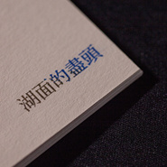

湖面的尽头Lake's End​-​Quintet
============================

|  |  |
| :--: | :-- |
| [ 湖面的尽头Lake's End​-​Quintet](https://emumo.xiami.com/album/625868313) | **艺人**: [Cicada](../index.md) **语种**: 国语 **唱片公司**: 独立发行 **发行时间**: 2015年01月10日 **专辑类别**: EP, 单曲 **专辑风格**: 现代古典 Modern Classical, 古典跨界 Classical Crossover, 室内乐 / 重奏 Chamber Music **播放数**: 108026 **收藏数**: 284 **评论数**: 32  |

## 简介

 
 

2014年的絃乐新版本，钢琴独奏版收录於2011年的专辑《散落的时光》。
 

 
 

 

## 曲目

## 评论

|  |  |  |
| :-- | :-- | :-- |
|  [虾米用户](https://emumo.xiami.com/u/42963872) 我还没想好要写什么... 2019-01-03 04:39 赞(0) 踩(0) | 
-
 |
|  [虾米用户](https://emumo.xiami.com/u/339191478)   2018-06-24 19:21 赞(0) 踩(0) | 
:-)
 |
|  [虾米用户](https://emumo.xiami.com/u/33624375)  2016-05-25 21:33 赞(0) 踩(0) | 
练习中～
 |
|  [虾米用户](https://emumo.xiami.com/u/6707214) Weibo@Yoen 2016-04-27 13:48 赞(0) 踩(0) | 
有中!!!!
 |
|  [虾米用户](https://emumo.xiami.com/u/24002083) 迷津欲有問 2015-08-13 08:55 赞(0) 踩(0) | 
《pieces》里面是独奏，这次是合奏。创造之初就有合奏的版本，不过一直没录。
 |
|  [虾米用户](https://emumo.xiami.com/u/7322777) ∮ 2015-07-23 18:33 赞(0) 踩(0) | 
...A...
 |
|  [虾米用户](https://emumo.xiami.com/u/42725114) ThistheshitI... 2015-07-23 11:22 赞(0) 踩(0) | 

 |
|  [虾米用户](https://emumo.xiami.com/u/1695352) 我还没想好要写什么... 2015-06-11 10:29 赞(2) 踩(0) | 
他们的音乐都好好听～特别有画面感
 |
|  [虾米用户](https://emumo.xiami.com/u/49496906)  2015-04-23 15:28 赞(0) 踩(0) | 
养心
 |
|  [虾米用户](https://emumo.xiami.com/u/11844821) 快高考了哭哭哭 2015-04-02 23:48 赞(1) 踩(0) | 
要高考了不能再刷歌！！
 |
|  [虾米用户](https://emumo.xiami.com/u/14423500) 我爱虾米 至死不渝 2015-03-19 18:32 赞(0) 踩(0) | 
这不是新歌啊
 |
| ⇒ |  [虾米用户](https://emumo.xiami.com/u/24002083) 迷津欲有問 2015-03-21 11:06 赞(0) 踩(0) | 
?
 |
| ⇒ |  [虾米用户](https://emumo.xiami.com/u/14423500) 我爱虾米 至死不渝 2015-03-21 11:09 赞(0) 踩(0) | 
<q><b>ciooju说：</b></q>
 |
|  [虾米用户](https://emumo.xiami.com/u/10424669) 猫背少女 2015-03-17 22:04 赞(0) 踩(0) | 
终于又有新歌了
 |
|  [虾米用户](https://emumo.xiami.com/u/9396011) 如果我開了咖啡店 請你一... 2015-03-17 14:21 赞(0) 踩(0) | 
慢
 |
|  [虾米用户](https://emumo.xiami.com/u/12766094) 傲娇的孤独患者。 2015-03-13 00:22 赞(0) 踩(0) | 
再来
 |
| ⇒ |  [虾米用户](https://emumo.xiami.com/u/13482737) 一个喜欢后摇，古典音乐为... 2015-03-22 07:46 赞(0) 踩(0) | 
抓到你拉
 |
| ⇒ |  [虾米用户](https://emumo.xiami.com/u/12766094) 傲娇的孤独患者。 2015-03-23 00:09 赞(0) 踩(0) | 
<q><b>玛奇朵飘浮说：</b></q>
 |
| ⇒ |  [虾米用户](https://emumo.xiami.com/u/13482737) 一个喜欢后摇，古典音乐为... 2015-04-05 09:32 赞(0) 踩(0) | 
<q><b>路小旅说：</b></q>
 |
|  [虾米用户](https://emumo.xiami.com/u/11420216)  2015-03-12 17:55 赞(0) 踩(0) | 
藏在时间里，静静流淌地美丽。
 |
|  [虾米用户](https://emumo.xiami.com/u/6844618) Love never f... 2015-03-11 22:25 赞(0) 踩(0) | 
新版的感觉更棒了~
 |
|  [虾米用户](https://emumo.xiami.com/u/3543573) 的确如此 2015-03-11 19:37 赞(0) 踩(0) | 
喜迎新曲
 |
|  [虾米用户](https://emumo.xiami.com/u/17372130) 谢谢你虾米。晚安虾米。 2015-03-10 21:59 赞(0) 踩(0) | 
许久没听了
 |
|  [虾米用户](https://emumo.xiami.com/u/26070224) 你不要吃我，我唱好听的歌... 2015-03-10 19:51 赞(0) 踩(0) | 
出过了……(´･_･`)
 |
|  [虾米用户](https://emumo.xiami.com/u/672488) 偶尔上来听听歌的懒人 2015-03-10 18:02 赞(0) 踩(0) | 
听了以后安静下来了！
 |
|  [虾米用户](https://emumo.xiami.com/u/39193470) 大抵浮生若梦，姑且此处销... 2015-03-10 13:48 赞(0) 踩(0) | 
。。。。
 |
|  [虾米用户](https://emumo.xiami.com/u/134697)  2015-03-10 12:43 赞(0) 踩(0) | 
^_^
 |
|  [虾米用户](https://emumo.xiami.com/u/34936363) adios 2015-03-10 12:25 赞(0) 踩(0) | 
出了耶~
 |
|  [虾米用户](https://emumo.xiami.com/u/990478) 「但愿人长久」 2015-03-10 11:32 赞(1) 踩(0) | 
咿 ~
 |
|  [虾米用户](https://emumo.xiami.com/u/561397)  2015-03-10 11:30 赞(0) 踩(0) | 
yeah
 |
|  [虾米用户](https://emumo.xiami.com/u/12168682) 我还没想好要写什么... 2015-03-10 11:20 赞(0) 踩(0) | 
loving
 |
|  [虾米用户](https://emumo.xiami.com/u/2288372) 我还没想好要写什么... 2015-03-10 11:17 赞(0) 踩(0) | 
哟哟哟= =
 |
