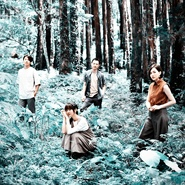

Cicada
============================

|  |  |
| :--: | :-- |
| [ Cicada](https://i.xiami.com/cicadatw) | **地区**: Taiwan, PRC 中国台湾 **风格**: 现代古典 Modern Classical, 古典跨界 Classical Crossover, 室内乐 / 重奏 Chamber Music **播放数**: 5893798 **粉丝数**: 13995 **评论数**: 518  |

## 档案

成軍於2009年，Cicada以鋼琴、木吉他、小提琴、大提琴五種樂器交織而成。之所以取名為Cicada（蟬）是因為，人們察覺到蟬的出現，往往是聽到牠們的聲音，而不是看見其形體。
  2013年，Cicada開始為台灣的土地創作，《邊境消逝》的主題是西海岸，《仰望海平面》描繪的則是台灣的東海岸，以及包圍東部小島的太平洋，這兩張專輯皆用一種擬人化的方式，想像這片土地面對各種變遷時的心路歷程，並集結為《Ocean》，由日本廠牌Flau發行。  2016年，以「告別」為主題的合輯《Farewell》，從EP《Over the Sea/Under the Water》（2010）、專輯《散落的時光》（2011）與《一起走吧》（2012）自選十四首曲子，重新編寫與錄製。  2017年，Cicada試著描述人類與海洋的關係，以及動物們的處境，在專輯《不在的你們都去了哪裡》中，不僅有來自海洋的鯨豚、珊瑚與海龜，也有居住在城市的貓與山林中的鳥。  在邁入成團第十年之際，Cicada從海洋走向高山，於2019年推出以台灣的山林為主題的《走入有霧的森林》。此專輯如同透過音樂撰寫的登山日記，試圖用更遼闊的視野，描繪他們的家園。  Cicada from Taiwan was formed in 2009 consists of violin, cello, acoustic guitar, and piano. It's named after Cicada because people are aware of cicada's existence by their sound instead of forms.   In 2013, Cicada began to compose for Taiwan. The theme of “Coastland” was the west coastland in Taiwan, and “Light Shining Through the Sea” was inspired by the east coast of Taiwan and the Pacific Ocean. These two albums personify the land and portray the feeling undergoing all the changes and damages. We later collaborated with the Japanese label flau to release “Ocean” based on these two albums.  In 2016, Cicada selected 14 songs from “Over the Sea/Under the Water”, “Pieces” and “Let’s Go!” with the new recording and production to make the album “Farewell”.   In 2017, “White Forest” was dedicated to animals including coral reefs, sea turtles, humpback whales, dolphins, as well as cats in the city and birds in the mountains.   Cicada walked into the mountain from the ocean on the 10th year and released “Hiking in the Mist”. It's their hiking journal with intention to depict their homeland with expansive views.

## 专辑

| 名称 | 语种 | 唱片公司 | 发行时间 | 专辑类别 | 专辑风格 |
| :--: | :-- | :-- | :-- | :-- | :-- |
| [ 走入有雾的森林](./albums/2105365904.md) | 纯音乐 | 风潮音乐 | 2019年10月30日 | 录音室专辑 |  |
| [ 不在的你们都去了哪里](./albums/2102924869.md) | 国语 | StreetVoice | 2017年11月23日 | 录音室专辑 | 现代古典 Modern Classical, 室内乐 / 重奏 Chamber Music |
| [ 自画像 电影原声带The Last Painting(Original Motion Picture Soundtrack)](./albums/2103491177.md) | 纯音乐 | 风和日丽 | 2017年09月22日 | 原声带, 影视音乐 |  |
| [ Farewell自選合輯2009–2012](./albums/2103491180.md) | 纯音乐 | 独立发行 | 2016年03月10日 | 录音室专辑 | 古典跨界 Classical Crossover, 室内乐 / 重奏 Chamber Music, 现代古典 Modern Classical |
| [ 仰望海平面](./albums/2100222790.md) | 国语 | StreetVoice | 2015年10月19日 | 录音室专辑 | 现代古典 Modern Classical, 室内乐 / 重奏 Chamber Music |
| [ 湖面的尽头Lake's End​-​Quintet](./albums/625868313.md) | 国语 | 独立发行 | 2015年01月10日 | EP, 单曲 | 现代古典 Modern Classical, 古典跨界 Classical Crossover, 室内乐 / 重奏 Chamber Music |
| [ 边境消逝Coastland](./albums/274649726.md) | 其他 | StreetVoice | 2013年08月02日 | 录音室专辑 | 现代古典 Modern Classical, 室内乐 / 重奏 Chamber Music |
| [ 一起走吧Let’s Go](./albums/523625.md) | 其他 | StreetVoice | 2012年07月01日 | 录音室专辑 | 古典跨界 Classical Crossover, 室内乐 / 重奏 Chamber Music |
| [ 散落的时光Pieces](./albums/466621.md) | 国语 | 小白兔唱片 | 2011年09月10日 | 录音室专辑 | 后摇 Post-Rock, 古典跨界 Classical Crossover |
| [ Over the Sea / Under the Water](./albums/405201.md) | 纯音乐 | StreetVoice | 2010年08月13日 | EP, 单曲 | 后摇 Post-Rock, 古典跨界 Classical Crossover |

## 评论

|  |  |  |
| :-- | :-- | :-- |
|  [虾米用户](https://emumo.xiami.com/u/41839709) 血肉構建你我，理智遺忘一... 2020-11-30 02:58 赞(3) 踩(0) | 
聽說蝦米明年就要關閉了，我很害怕
 |
| ⇒ |  [虾米用户](https://emumo.xiami.com/u/405858695) 快乐听歌 2020-12-14 18:44 赞(0) 踩(0) | 
我也是
 |
|  [虾米用户](https://emumo.xiami.com/u/290256884) 网易云同名 2020-11-24 15:17 赞(0) 踩(0) | 
喜欢
 |
|  [虾米用户](https://emumo.xiami.com/u/310995587) illusion 2020-11-19 18:37 赞(1) 踩(0) | 
刚好一年过去了 下次又是什么时候才会见面
 |
|  [虾米用户](https://emumo.xiami.com/u/114514078) ♛ 2020-11-12 21:37 赞(0) 踩(0) | 
宝藏！！！
 |
|  [虾米用户](https://emumo.xiami.com/u/379162683) 我想要记住你们，我想要你... 2020-10-08 00:33 赞(0) 踩(0) | 

 |
|  [虾米用户](https://emumo.xiami.com/u/110088060) 作为报答、我吔给泥放点、... 2020-08-19 18:15 赞(1) 踩(0) | 
.
 |
|  [虾米用户](https://emumo.xiami.com/u/435393120)  2020-02-04 22:48 赞(1) 踩(0) | 
嗯
 |
|  [虾米用户](https://emumo.xiami.com/u/4715251) 愿屁屁在喵星开开心心还有... 2020-01-06 19:38 赞(0) 踩(0) | 
！
 |
|  [虾米用户](https://emumo.xiami.com/u/246689266)  2019-12-01 14:06 赞(0) 踩(0) | 
你好;-)
 |
|  [虾米用户](https://emumo.xiami.com/u/49655313) 除了再见还可以说些什么呢 2019-11-18 02:25 赞(1) 踩(0) | 
意外的气氛很欢快 大家都好活泼啊
 |
|  [虾米用户](https://emumo.xiami.com/u/225730375) 我爱你. zl 2019-11-17 23:26 赞(0) 踩(0) | 
第二次听你们的live啦 这次合了影～ 山脉 海洋 森林 下次会是星空吗
 |
|  [虾米用户](https://emumo.xiami.com/u/49655313) 除了再见还可以说些什么呢 2019-11-16 19:04 赞(0) 踩(0) | 
待会儿见
 |
|  [虾米用户](https://emumo.xiami.com/u/10643094) 要加组织的朋友发站内信 2019-11-14 08:54 赞(0) 踩(0) | 
又来啦
 |
|  [虾米用户](https://emumo.xiami.com/u/5931356)  2019-11-12 22:55 赞(1) 踩(0) | 

 |
|  [虾米用户](https://emumo.xiami.com/u/98832320)  2019-11-07 03:59 赞(0) 踩(0) | 
介绍里说，钢琴，木吉他，小提琴，大提琴，五种乐器。五种？？？？？
 |
| ⇒ |  [虾米用户](https://emumo.xiami.com/u/225730375) 我爱你. zl 2019-11-12 13:09 赞(0) 踩(0) | 
原来还有个中提
 |
|  [虾米用户](https://emumo.xiami.com/u/637570)  2019-11-06 08:37 赞(0) 踩(0) | 
今年继续来重庆啊，拜托拜托，还记得上次的美好记忆。
 |
|  [虾米用户](https://emumo.xiami.com/u/52326881)  2019-11-05 10:13 赞(4) 踩(0) | 
下週我們的專輯巡演即將展開，期待見到大家：） 購票請至秀動喔：<a href="https://www.showstart.com/artist/23469" target="_blank" rel="nofollow noreferrer noopener">https://www.showstart.com/artist/23469</a>  【Cicada《走入有霧的森林》2019 專輯巡演場次】 11.15　北京　@疆进酒OMNISPACE 11.16　西安　@西安果核剧场 11.17　上海　@万代南梦宫上海文化中心 11.19　杭州　@MAOLivehouse杭州 11.20　南京　@欧拉艺术空间 11.22　武汉　@VOXLIVEHOUSE 11.23　深圳　@B10现场 11.24　广州　@TU凸空间
 |
|  [虾米用户](https://emumo.xiami.com/u/221940611) 氛围   摇滚  后摇 ... 2019-11-04 10:24 赞(0) 踩(0) | 
宝藏
 |
|  [虾米用户](https://emumo.xiami.com/u/33611592) 音乐是药 2019-11-03 14:16 赞(1) 踩(0) | 
还记得他们那张可怕的专辑封面
 |
|  [虾米用户](https://emumo.xiami.com/u/310995587) illusion 2019-11-02 01:02 赞(0) 踩(0) | 
新专虾米咋还没有
 |
|  [虾米用户](https://emumo.xiami.com/u/8226204) ≡ 2019-10-23 11:00 赞(3) 踩(0) | 
他们把歌词藏在歌名里。
 |
|  [虾米用户](https://emumo.xiami.com/u/49655313) 除了再见还可以说些什么呢 2019-09-04 20:46 赞(0) 踩(0) | 
西安见
 |
|  [虾米用户](https://emumo.xiami.com/u/89578716)   2019-08-30 21:52 赞(0) 踩(0) | 
出点无损音质的啊
 |
|  [虾米用户](https://emumo.xiami.com/u/142169512) 点击编辑 2019-08-16 09:03 赞(1) 踩(0) | 
等待十一月
 |
|  [虾米用户](https://emumo.xiami.com/u/31399475) 我还没想好要写什么... 2019-08-15 20:30 赞(1) 踩(0) | 
1115北京见～
 |
|  [虾米用户](https://emumo.xiami.com/u/235050) 我就说我是穷逼嘛~ 2019-08-14 20:15 赞(3) 踩(0) | 
2019年乐队巡演安排：北京 2019.11.15 周五：疆进酒  西安 2019.11.16 周六：果核剧场  上海 2019.11.17 周日：万代南梦宫上海文化中心  杭州 2019.11.19 周二：Mao Live House  南京 2019.11.20 周三：Ola艺术空间  武汉 2019.11.22 周五：Vox 武昌  深圳 2019.11.23 周六：B10  广州 2019.11.24 周日：TU凸空间
 |
|  [虾米用户](https://emumo.xiami.com/u/225730375) 我爱你. zl 2019-08-14 16:03 赞(1) 踩(0) | 
内容已删除
 |
| ⇒ |  [虾米用户](https://emumo.xiami.com/u/235050) 我就说我是穷逼嘛~ 2019-08-14 20:15 赞(0) 踩(0) | 
喜大普奔！！！！！！！！
 |
|  [虾米用户](https://emumo.xiami.com/u/225730375) 我爱你. zl 2019-08-14 15:59 赞(3) 踩(0) | 
啊啊啊啊啊！ 北京 2019.11.15 周五：疆进酒 西安 2019.11.16 周六：果核剧场 上海 2019.11.17 周日：万代南梦宫上海文化中心 杭州 2019.11.19 周二：Mao Live House 南京 2019.11.20 周三：Ola艺术空间 武汉 2019.11.22 周五：Vox 武昌 深圳 2019.11.23 周六：B10 广州 2019.11.24 周日：TU凸空间
 |
| ⇒ |  [虾米用户](https://emumo.xiami.com/u/94369766) 我还没想好要写什么... 2019-11-03 07:52 赞(0) 踩(0) | 
请问一下在哪里买票啊～广州场次还有票吗
 |
| ⇒ |  [虾米用户](https://emumo.xiami.com/u/225730375) 我爱你. zl 2019-11-03 10:05 赞(0) 踩(0) | 
<q><b>伊耿巴彦说：</b></q>
 |
| ⇒ |  [虾米用户](https://emumo.xiami.com/u/94369766) 我还没想好要写什么... 2019-11-03 10:45 赞(0) 踩(0) | 
<q><b>虾米我爱你说：</b></q>
 |
| ⇒ |  [虾米用户](https://emumo.xiami.com/u/50010285)  2019-11-05 15:36 赞(0) 踩(0) | 
来成都吧~
 |
|  [虾米用户](https://emumo.xiami.com/u/9352515) 哦？ 2019-08-03 02:02 赞(1) 踩(0) | 
19年来石家庄好不好！！！
 |
|  [虾米用户](https://emumo.xiami.com/u/9523997) 天地为炉 2019-07-18 20:02 赞(2) 踩(0) | 
再次确信 你们的独特唯一 不可代替 演出安排下吧
 |
| ⇒ |  [虾米用户](https://emumo.xiami.com/u/9523997) 天地为炉 2019-08-31 13:27 赞(0) 踩(0) | 
成真了╮(￣▽￣"")╭ 下一个想看
 |
|  [虾米用户](https://emumo.xiami.com/u/113941394)  2019-05-10 09:34 赞(1) 踩(0) | 
什么时候才能归来？求新专
 |
|  [虾米用户](https://emumo.xiami.com/u/996277) ‏‏ 2019-05-04 11:28 赞(1) 踩(0) | 
哎 一直特意回避着他们
 |
|  [虾米用户](https://emumo.xiami.com/u/325374787)  2019-04-25 09:12 赞(1) 踩(0) | 
好
 |
|  [虾米用户](https://emumo.xiami.com/u/47262914) 我舍不得。 2019-04-20 01:03 赞(2) 踩(0) | 
不在的你们都去了哪里。
 |
|  [虾米用户](https://emumo.xiami.com/u/51795971) ️️NEMESIS  2019-03-14 17:34 赞(2) 踩(0) | 
2019有没有演出
 |
|  [虾米用户](https://emumo.xiami.com/u/369419725)  2019-01-29 00:45 赞(2) 踩(0) | 
♥
 |
|  [虾米用户](https://emumo.xiami.com/u/42963872) 我还没想好要写什么... 2019-01-03 04:38 赞(2) 踩(0) | 
-
 |
|  [虾米用户](https://emumo.xiami.com/u/44240710) 我还没想好要写什么... 2019-01-02 14:48 赞(4) 踩(0) | 
2019年来北京好不好
 |
|  [虾米用户](https://emumo.xiami.com/u/366654504) EBIFA 2018-12-15 09:54 赞(1) 踩(0) | 
cicada exist by their sound instead of forms
 |
|  [虾米用户](https://emumo.xiami.com/u/34339123) 他从黑暗中生还。 2018-11-11 15:03 赞(0) 踩(0) | 
真是宝岛啊...
 |
|  [虾米用户](https://emumo.xiami.com/u/42405531) 再见虾米 2018-10-29 16:50 赞(0) 踩(0) | 
我还以为是后摇嘞...
 |
| ⇒ |  [虾米用户](https://emumo.xiami.com/u/312012518) 月明如素愁不眠 2018-11-02 16:15 赞(0) 踩(0) | 
后摇氛围古典傻傻分不清。hh
 |
| ⇒ |  [虾米用户](https://emumo.xiami.com/u/42405531) 再见虾米 2018-11-19 21:32 赞(0) 踩(0) | 
<q><b>余说：</b></q>
 |
|  [虾米用户](https://emumo.xiami.com/u/354181908) kiss 2018-10-08 23:48 赞(2) 踩(0) | 
看到有巡演还想着去订票 结果一看是2018年 不是2019年
 |
|  [虾米用户](https://emumo.xiami.com/u/27627285) 揪心的玩笑与漫长的白日梦 2018-09-02 11:13 赞(0) 踩(0) | 
九月的早晨，从昏沉的梦醒来，告别和重逢，阳光湖面岛屿晨雾，蝉鸣消失，我失去了整个夏天。
 |
|  [虾米用户](https://emumo.xiami.com/u/347206698) Le vent se l... 2018-08-17 09:23 赞(1) 踩(0) | 
❤️很喜欢.期待未来的相遇
 |
|  [虾米用户](https://emumo.xiami.com/u/401477564)  2018-08-15 12:45 赞(0) 踩(0) | 
去星野微博找到的
 |
|  [虾米用户](https://emumo.xiami.com/u/194717784)   2018-07-16 23:26 赞(0) 踩(0) | 
几年前偶然发现
 |
|  [虾米用户](https://emumo.xiami.com/u/5197526) 我是王，微笑是我的城邦。 2018-07-12 01:11 赞(14) 踩(0) | 
湖面的尽头 汇流向海 浮游在海上的岛屿 潜沉于水下的人们 鲸 在无垠世界的海边相聚  当海潮涌向礁岩 浪沫抚过砾石滩  当群鸟飞过天际 用羽毛织出一条淡蓝色的小径 沿着风与沙 越过海岸山脉 飞往山的另一头  挣脱 等待再一次跃出水面 游向那片被丢弃的海 潜入太平洋  不在的你们都去了哪里 我们到了 原本是家的地方  &amp;mdash;&amp;mdash; 2018.07.12深夜
 |
|  [虾米用户](https://emumo.xiami.com/u/10170789) ig：gim_x  网易... 2018-07-09 06:17 赞(0) 踩(0) | 

 |
|  [虾米用户](https://emumo.xiami.com/u/121910914) 我想好好睡个觉 2018-06-30 08:43 赞(1) 踩(0) | 
i
 |
|  [虾米用户](https://emumo.xiami.com/u/12501921) 众生轮回 因果循环 2018-06-27 09:59 赞(0) 踩(0) | 
棒
 |
|  [虾米用户](https://emumo.xiami.com/u/225730375) 我爱你. zl 2018-06-17 21:24 赞(50) 踩(0) | 
我們的中提琴手漁靜決定離開Cicada了。昨天我們一起爬合歡山北峰與東峰，突然覺得有一點像是畢業旅行，當下開心地玩，沒有感覺到即將離別。  謝謝漁靜這六年來的陪伴，我們會很想念妳溫柔而充滿思緒的琴音，也期待漁靜未來在不同領域帶給我們的驚喜。  Cicada之後將以四個人的編制繼續，目前正在醞釀下 ​​​...
 |
|  [虾米用户](https://emumo.xiami.com/u/310995587) illusion 2018-05-27 17:25 赞(0) 踩(0) | 
我不得不为这个没有生殖后期的动物建个歌单了
 |
|  [虾米用户](https://emumo.xiami.com/u/349299788) 我们就要相爱 不可思愚。 2018-05-13 00:00 赞(2) 踩(0) | 
今夏听到的第一只蝉 那时 会有多开心呢
 |
|  [虾米用户](https://emumo.xiami.com/u/339191478)   2018-05-05 20:05 赞(2) 踩(0) | 
:-)
 |
| ⇒ |  [虾米用户](https://emumo.xiami.com/u/349299788) 我们就要相爱 不可思愚。 2018-05-12 22:55 赞(0) 踩(0) | 
呀 你好。
 |
| ⇒ |  [虾米用户](https://emumo.xiami.com/u/339191478)   2018-05-12 23:20 赞(0) 踩(0) | 
<q><b>随喜他善说：</b></q>
 |
| ⇒ |  [虾米用户](https://emumo.xiami.com/u/349299788) 我们就要相爱 不可思愚。 2018-05-12 23:22 赞(0) 踩(0) | 
<q><b>然而说：</b></q>
 |
| ⇒ |  [虾米用户](https://emumo.xiami.com/u/339191478)   2018-05-12 23:26 赞(0) 踩(0) | 
<q><b>随喜他善说：</b></q>
 |
| ⇒ |  [虾米用户](https://emumo.xiami.com/u/349299788) 我们就要相爱 不可思愚。 2018-05-13 00:00 赞(0) 踩(0) | 
<q><b>然而说：</b></q>
 |
| ⇒ |  [虾米用户](https://emumo.xiami.com/u/42405531) 再见虾米 2018-11-19 21:41 赞(0) 踩(0) | 
<q><b>然而说：</b></q>
 |
| ⇒ |  [虾米用户](https://emumo.xiami.com/u/339191478)   2018-11-19 23:01 赞(0) 踩(0) | 
<q><b>我是虾米大王说：</b></q>
 |
| ⇒ |  [虾米用户](https://emumo.xiami.com/u/85389256) 我是失去了悲痛的悲剧作家 2019-05-19 15:38 赞(0) 踩(0) | 
<q><b>随喜他善说：</b></q>
 |
|  [虾米用户](https://emumo.xiami.com/u/221054870) rika 2018-04-16 17:04 赞(0) 踩(0) | 
很好听的乐队
 |
|  [虾米用户](https://emumo.xiami.com/u/2596779) 404 2018-04-16 00:55 赞(2) 踩(0) | 
用歌名能排列组合出情节各异故事的乐队
 |
|  [虾米用户](https://emumo.xiami.com/u/45830411) 我还没想好要写什么... 2018-04-07 22:38 赞(1) 踩(0) | 
get
 |
|  [虾米用户](https://emumo.xiami.com/u/27807938) 不屑 无奈 无知 自大 ... 2018-02-10 18:54 赞(1) 踩(0) | 
大提琴拉嘞不孬嘞
 |
|  [虾米用户](https://emumo.xiami.com/u/39256343) 网易云账号：ViaMis... 2018-02-07 20:48 赞(0) 踩(0) | 
&amp;asymp;
 |
|  [虾米用户](https://emumo.xiami.com/u/11824157) 始终爱陈绮贞，走不出我的... 2018-01-28 11:13 赞(2) 踩(0) | 
偷偷爱着你们，你们的音乐让我觉得，自己被看透了。只敢一个人呆着的时候戴耳机听。像是在剖析自己，刨析一直故意忽略的想要忘记的错误。
 |
|  [虾米用户](https://emumo.xiami.com/u/37555293)   2018-01-25 14:11 赞(0) 踩(0) | 
错过了成都场  今年还会来吗？ 
 |
|  [虾米用户](https://emumo.xiami.com/u/37555293)   2018-01-25 14:06 赞(0) 踩(0) | 
错过了 
 |
|  [虾米用户](https://emumo.xiami.com/u/11548296) Believe in m... 2018-01-21 00:11 赞(3) 踩(0) | 
#2018的第2个现场# cicada /sɪkɑːdə/ n.蝉 来自台湾的古典乐团 在未曾谋面前听到的第一首叫做 『你再也读不出我任何欲望』 从来没试过听乐团的现场 整场都是演奏而没有唱的形式 大提琴 中提琴 键盘 吉他 听众都沉浸在弦乐重奏交织编出的世界 没有人大声说话 也没有办法合唱 大家都只是安静地听着 他们写海 写动物 写台湾的土地 他们在每首歌前认真介绍曲子的由来 神情略微羞怯腼腆 声音温柔 安静 认真 软软的 却有一种打动人心的力量 听他们的演奏仿佛真能让人片刻抽离 瞬间置换到山里 湖边 海岸旁  今天现场最喜欢这首 像是隔着这么远 也能看到太平洋的海水在阳光下蔚蓝❤️
 |
|  [虾米用户](https://emumo.xiami.com/u/28794047) ✨ 2018-01-19 14:54 赞(0) 踩(0) | 
才知道明天成都场。。去不了了 
 |
|  [虾米用户](https://emumo.xiami.com/u/4727415) swallowyours... 2018-01-18 02:07 赞(0) 踩(0) | 
Cicada（Taiwan） 分享了 Stranded Whale 的活动 1 小时 &amp;middot; 默默進行好一陣子的計畫，終於可以公佈囉，我們二月將到香港參加「自由約 Freespace Happening」，與之前一起合作過〈Grey〉的香港樂團 Stranded Whale 合演幾首歌曲，也會演出一些Cicada新專輯的曲目喔！ 歡迎香港的朋友來玩 更多活動詳情 <a href="https://www.facebook.com/events/547183658968377/" target="_blank" rel="nofollow noreferrer noopener">https://www.facebook.com/events/547183658968377/</a> 名稱：自由約 Freespace Happening 日期：2018年2月11日 時間：17:25 - 18:05 地點：西九
 |
|  [虾米用户](https://emumo.xiami.com/u/47026156) I am not a m... 2018-01-15 19:46 赞(3) 踩(0) | 
音乐是药，其中Cicada是镇定剂。
 |
|  [虾米用户](https://emumo.xiami.com/u/6005918) 网易云账号同名：pans... 2018-01-15 00:39 赞(0) 踩(0) | 
每首曲子前都有用心的解说，超棒的~小哥哥小姐姐们颜值都超高(&amp;ge;3&amp;le;)
 |
|  [虾米用户](https://emumo.xiami.com/u/89295132) from scratch... 2018-01-15 00:32 赞(0) 踩(0) | 
没有Farewell？
 |
|  [虾米用户](https://emumo.xiami.com/u/71478) 这里住着未在任何世界露脸... 2018-01-14 01:51 赞(0) 踩(0) | 
看了深圳場和廣州場，從喜歡你們的音樂，到喜歡你們對自然的態度
 |
|  [虾米用户](https://emumo.xiami.com/u/17372130)  2018-01-13 23:50 赞(3) 踩(0) | 
今天这场live好赞啊~琴声表露出录制版没有的一种，面对面的交流的感觉~曲目间的介绍也让自己对部分曲子有了新的认识和感受~
 |
|  [虾米用户](https://emumo.xiami.com/u/92686490)  2018-01-13 23:42 赞(1) 踩(0) | 
今晚很棒
 |
|  [虾米用户](https://emumo.xiami.com/u/2438033)  2018-01-13 23:11 赞(1) 踩(0) | 
今天超超超级棒的 爱你们❤❤❤
 |
|  [虾米用户](https://emumo.xiami.com/u/956662) 祭…毕竟什么都逃不过时间 2018-01-12 21:19 赞(0) 踩(0) | 
起个外号没意见吧，HI!斯柯达!
 |
|  [虾米用户](https://emumo.xiami.com/u/39988409) 一方面怨自己孤独，一方面... 2018-01-11 22:05 赞(1) 踩(0) | 
明天 
 |
|  [虾米用户](https://emumo.xiami.com/u/8542277) 一 2018-01-11 15:20 赞(0) 踩(0) | 
睡个觉
 |
|  [虾米用户](https://emumo.xiami.com/u/279814569) 我会如鹰。 2018-01-11 12:50 赞(1) 踩(0) | 
应该有这样一个下午，日光不噪，微风正好。那个下午应该交给Cicada。
 |
|  [虾米用户](https://emumo.xiami.com/u/3256844) 恩斯波肯 多姆 2018-01-11 02:32 赞(0) 踩(0) | 
在认识你之前，我从没觉得钢琴这么好听。
 |
|  [虾米用户](https://emumo.xiami.com/u/148657)   2018-01-11 00:12 赞(0) 踩(0) | 
到北京来吧 好想听
 |
|  [虾米用户](https://emumo.xiami.com/u/4727415) swallowyours... 2018-01-08 00:47 赞(2) 踩(0) | 
Cicada（Taiwan） 1 小时 &amp;middot; 最近會較密集更新StreetVoice，我們將在這裡分享一些重點曲目、製作過程中的Demo，以及演出的錄音，歡迎大家有空也來逛逛喔 :-) :-) <a href="https://streetvoice.com/Cicadatw" target="_blank" rel="nofollow noreferrer noopener">https://streetvoice.com/Cicadatw</a> 這首曲子〈不在的你們都去了哪裡〉描寫的是珊瑚白化的過程，從一開始產卵的夢幻畫面，到最後漸漸白化、死亡，有如一片佈滿枯骨的墓園，而這也是專輯英文名稱White Forest的由來。 此版本是2017年三月剛完成編曲時，團員們一起在家裡錄的Demo，還沒有在尾段加入電子聲響，大家可以聽聽看這個原始的版本。
 |
|  [虾米用户](https://emumo.xiami.com/u/67297)  2018-01-07 12:52 赞(0) 踩(0) | 
期待来无锡
 |
|  [虾米用户](https://emumo.xiami.com/u/254107371)  2018-01-04 21:31 赞(0) 踩(0) | 
1 14上海站 将被丑逼舍友拉去听
 |
|  [虾米用户](https://emumo.xiami.com/u/3901960) 0305 2017-12-24 16:40 赞(0) 踩(0) | 
0305我们到时见
 |
|  [虾米用户](https://emumo.xiami.com/u/11856095) 正 是 2017-12-22 11:40 赞(1) 踩(0) | 
1/20成都有约吗 
 |
|  [虾米用户](https://emumo.xiami.com/u/9288193) 2020年弃用虾米，20... 2017-12-15 20:56 赞(0) 踩(0) | 
～
 |
|  [虾米用户](https://emumo.xiami.com/u/312469412)  2017-12-15 13:15 赞(0) 踩(0) | 
感谢你们的歌曲，给我带来了无前所未有的感动    
 |
|  [虾米用户](https://emumo.xiami.com/u/312469412)  2017-12-15 13:13 赞(0) 踩(0) | 
激动，也会在成都巡演啊   
 |
|  [虾米用户](https://emumo.xiami.com/u/6037389)   2017-12-07 00:11 赞(0) 踩(0) | 
期待深圳场的到来
 |
|  [虾米用户](https://emumo.xiami.com/u/8192862) 诗人和先知。vchat:... 2017-12-06 12:22 赞(0) 踩(0) | 
喵喵喵？提前泄露？
 |
|  [虾米用户](https://emumo.xiami.com/u/4727415) swallowyours... 2017-12-03 20:33 赞(2) 踩(0) | 
Cicada 1 小时 &amp;middot; 分享一些設計的過程。專輯由朱疋設計，包括內頁插畫也是由她繪製。今年夏天的某個下午，我和朱疋一邊聽這張專輯，一邊向她說明每首曲子的故事。 我原先設想了一個方向：封面有不同動物並存於同一個空間中，牠們可以只出現局部的身體，也不區分是在陸地或海中，可說是比較和樂融融的感覺；然而打開第一頁後，希望能呈現其棲地受到人類影響後的樣貌。內頁冊子則想讓每首曲子都有代表性的插畫，傳達其各自的處境。 原本我想像的也許是較為具象的場景，不過朱疋說：「雖然海很大，但是在海裡的感覺卻很輕盈⋯⋯因為一直想像著在海裡那種朦朧的隔絕感，所以用比較少的線條來表現。」看到最後完成的畫作，我非常喜歡。
 |
|  [虾米用户](https://emumo.xiami.com/u/9260656) whatever 2017-11-24 06:59 赞(0) 踩(0) | 
广州见！
 |
|  [虾米用户](https://emumo.xiami.com/u/71478) 这里住着未在任何世界露脸... 2017-11-23 23:34 赞(2) 踩(0) | 
被首页鲸鱼吸引进来，然后爱上了哈哈，人在广州考虑去深圳场，因为凸tu现场音响实在太烂了
 |
| ⇒ |  [虾米用户](https://emumo.xiami.com/u/3815293) baby Jesus s... 2017-12-02 20:57 赞(0) 踩(0) | 
明智之选
 |
|  [虾米用户](https://emumo.xiami.com/u/4727415) swallowyours... 2017-11-23 22:40 赞(0) 踩(0) | 
風和日麗唱片行 10 小时 &amp;middot; Cicada（Taiwan）的新專輯《不在的你們都去了哪裡》在今天正式發行了，收到專輯的那天從新歌到專輯設計連連驚喜，他們用純器樂演奏描述了我們忽略的環境，以及共同生存在這塊土地上動物們的處境，讓人深刻感受到Cicada的細膩觀察。上週日的首賣演出前，Cicada也釋出了專輯試聽，搭配專輯設計師為每首歌曲繪製的內頁插畫，歌曲也更加生動，一起來聽聽吧！ 錯過上週日首賣的朋友，今天開始在風和日麗唱片行的實體通路及特殊通路都可以購買到Cicada的《不在的你們都去了哪裡》喔！ 購買通路 <a href="http://www.agoodday.com/blog/?page_id=7" target="_blank" rel="nofollow noreferrer noopener">http://www.agoodday.com/blog/?page_id=7</a>
 |
|  [虾米用户](https://emumo.xiami.com/u/305596933)  2017-11-23 03:32 赞(0) 踩(0) | 
脱帽
 |
|  [虾米用户](https://emumo.xiami.com/u/54302732) 就像一个多鸟的夏天 2017-11-18 16:25 赞(0) 踩(0) | 
明年听的第一次现场会是你们喔
 |
|  [虾米用户](https://emumo.xiami.com/u/4727415) swallowyours... 2017-11-16 16:56 赞(0) 踩(0) | 
Cicada（Taiwan） 3小时 &amp;middot; 這裡可以試聽我們的專輯《不在的你們都去了哪裡》，配圖是設計師朱疋為每首歌繪製的內頁插畫喔！以下是每一首歌所描繪的對象 等待再一次躍出水面 ── 東海岸的海豚們 不在的你們都去了哪裡 ── 珊瑚白化的過程 原本是家的地方 ── 西海岸的白海豚 游向那片被丟棄的海 ── 在塑膠海中游泳的海龜 鯨 ── 大翅鯨媽媽與孩子 ::: Cicada 最新專輯 不在的你們都去了哪裡 White Forest ::: 11/11開始預購．11/23正式發行 博客來：<a href="https://goo.gl/XbxyPu" target="_blank" rel="nofollow noreferrer noopener">https://goo.gl/XbxyPu</a> 誠品：<a href="https://goo.gl/4o3sRb" target="_blank" rel="nofollow noreferrer noopener">https://goo.gl/4o3sRb</a>
 |
| ⇒ |  [虾米用户](https://emumo.xiami.com/u/9327823) 头像是我画的 2017-11-23 17:36 赞(0) 踩(0) | 
发google的短连接可能打不开
 |
| ⇒ |  [虾米用户](https://emumo.xiami.com/u/4727415) swallowyours... 2017-11-26 05:02 赞(0) 踩(0) | 
<q><b>west说：</b></q>
 |
|  [虾米用户](https://emumo.xiami.com/u/4727415) swallowyours... 2017-11-15 10:42 赞(1) 踩(0) | 
Cicada（Taiwan） 10小时 &amp;middot; 這陣子除了忙專輯外，我們還很努力在改版網站。終於完成了，非常感謝Cath Ko，幫我們做了這麼美的網站，歡迎大家有空來逛逛！裡面還匯集了過去散落各處的專輯製作故事喔，未來一定會努力更新喔（跟自己說）٩(๑❛ᴗ❛๑)۶：<a href="http://cicada-tw.com" target="_blank" rel="nofollow noreferrer noopener">http://cicada-tw.com</a>
 |
|  [虾米用户](https://emumo.xiami.com/u/9154037) 到水星散心去了。 2017-11-01 15:09 赞(1) 踩(0) | 
因为北京冷所以就不来了吗？
 |
|  [虾米用户](https://emumo.xiami.com/u/36576635) 冰岛游客热带地区唯一指定... 2017-10-31 20:44 赞(0) 踩(0) | 
没！有！北！京！ 
 |
|  [虾米用户](https://emumo.xiami.com/u/39988409) 一方面怨自己孤独，一方面... 2017-10-30 23:39 赞(0) 踩(0) | 
哇，终于可以听现场了，我后摇最喜欢的三大乐队之一 
 |
|  [虾米用户](https://emumo.xiami.com/u/235050) 我就说我是穷逼嘛~ 2017-10-30 20:03 赞(2) 踩(0) | 
没。有。北。京。（ ・_・。）ノ
 |
|  [虾米用户](https://emumo.xiami.com/u/6634459)   2017-10-30 18:53 赞(0) 踩(0) | 
终于能在重庆看到了 
 |
|  [虾米用户](https://emumo.xiami.com/u/7107) 。 2017-10-30 17:56 赞(0) 踩(0) | 
新砖要来了
 |
|  [虾米用户](https://emumo.xiami.com/u/1237101) 游离于3次元外的存在~~ 2017-10-28 00:37 赞(0) 踩(0) | 
每首曲子都像在述说一段微故事一般，每每听完总有种难言的思绪浮于心表，却又缥缈得如往事尘烟一般让人觉得近在眼前但却触碰不到
 |
|  [虾米用户](https://emumo.xiami.com/u/5488867) 在东南亚打工的射手座男生 2017-10-28 00:32 赞(0) 踩(0) | 
有几首还不错的音乐，台北的文艺小清新...名字cicada也很有诗意：人们发觉蝉(cicada)的存在往往是因为听到它们的声音。
 |
|  [虾米用户](https://emumo.xiami.com/u/34339123) 他从黑暗中生还。 2017-10-19 20:58 赞(1) 踩(0) | 
如果1.14我期末考试结束的话！
 |
|  [虾米用户](https://emumo.xiami.com/u/199210) 祈福蝦米不要倒閉⋯ 2017-10-18 11:24 赞(0) 踩(0) | 
成都来吧！
 |
|  [虾米用户](https://emumo.xiami.com/u/287224005) keep you com... 2017-10-15 11:58 赞(0) 踩(0) | 
每次听他们的歌就会有鸡皮疙瘩，然后久久不消，头皮发麻。 这可能就是共鸣吧。
 |
|  [虾米用户](https://emumo.xiami.com/u/17691156) あなたに出会えて よかっ... 2017-10-09 12:37 赞(0) 踩(0) | 
廣州！！
 |
|  [虾米用户](https://emumo.xiami.com/u/47762018) 虾米我永远爱你 2017-10-07 00:01 赞(0) 踩(0) | 
杭州来啦！
 |
|  [虾米用户](https://emumo.xiami.com/u/4727415) swallowyours... 2017-10-06 23:59 赞(47) 踩(0) | 
Cicada台灣 今天 15:56 我們的巡演日期終於確定啦：2018年1/12深圳、1/13廣州、1/14上海、1/16杭州、1/19重慶、1/20成都。請大家先把時間空下來，很期待能和大家見面，完整資訊將在月底公佈（這是Cicada將在11月底發行的新專輯封面，看得出這次是什麼主題嗎？） ​​​​
 |
| ⇒ |  [虾米用户](https://emumo.xiami.com/u/17372274) 喜欢做梦的浪漫小阿姨～ 2017-11-01 22:50 赞(0) 踩(0) | 
我已经买了1月13号广州的现场啦 哈哈哈哈哈哈 期待哦    
 |
| ⇒ |  [虾米用户](https://emumo.xiami.com/u/30578138) 不开心可不行 2017-11-22 20:52 赞(0) 踩(0) | 
没有西安吗
 |
| ⇒ |  [虾米用户](https://emumo.xiami.com/u/300886465) 最后 仍在一起 2017-11-23 10:07 赞(0) 踩(0) | 
高三党想哭
 |
| ⇒ |  [虾米用户](https://emumo.xiami.com/u/34473970) 我还没想好要写什么... 2017-12-05 23:30 赞(0) 踩(0) | 
为什么不来长沙演出啊！
 |
| ⇒ |  [虾米用户](https://emumo.xiami.com/u/1370295)  2018-01-12 23:09 赞(0) 踩(0) | 
明天见啦
 |
| ⇒ |  [虾米用户](https://emumo.xiami.com/u/319688840) 你是一封信 2018-01-13 20:30 赞(0) 踩(0) | 
此刻正在TU凸空间
 |
| ⇒ |  [虾米用户](https://emumo.xiami.com/u/142169512) 点击编辑 2018-02-20 10:51 赞(0) 踩(0) | 
<q><b>山野芜旷说：</b></q>
 |
|  [虾米用户](https://emumo.xiami.com/u/9028760) 豆瓣见 spotify ... 2017-09-29 18:03 赞(0) 踩(0) | 
◡̈⃝♡mark
 |
|  [虾米用户](https://emumo.xiami.com/u/4727415) swallowyours... 2017-09-20 20:00 赞(2) 踩(0) | 
iNDIEVOX 57分钟 &amp;middot; 由 Cicada 製作及演奏的電影原聲帶專輯出爐了。 謝謝 Cicada（Taiwan），9/22 也別忘了進戲院支持電影 自畫像 The Last Painting 唷！ - 《自畫像》獲得西班牙格拉納達電影節最佳影片，入選第46屆鹿特丹國際影展競賽。擔任2017 金馬奇幻影展 開幕片、第45屆台北電影獎競賽。
 |
|  [虾米用户](https://emumo.xiami.com/u/225730375) 我爱你. zl 2017-09-20 16:51 赞(0) 踩(0) | 
什么时候再来
 |
|  [虾米用户](https://emumo.xiami.com/u/119765674) 我还没想好要写什么... 2017-09-14 11:40 赞(0) 踩(0) | 
大爱，深深的被这音乐吸引
 |
|  [虾米用户](https://emumo.xiami.com/u/28087988) 枯乏無味的陌生人 2017-09-12 23:40 赞(1) 踩(0) | 
(ง ᐛ )ว今年可能会有巡演哦～希望大家都去微博关注一下他们的消息！今年走的应该不会是高冷的北上广路线。作为两年前飞过去看现场的人我只想说真的、真的非常非常值得一看！所以我们现场见喽！
 |
|  [虾米用户](https://emumo.xiami.com/u/25052720) 想要沉淪與想要躲藏的念頭... 2017-09-12 17:27 赞(0) 踩(0) | 
入秋却还热得如同夏天的天气里，发现了最后一只蝉的声音
 |
|  [虾米用户](https://emumo.xiami.com/u/25794316) 坠入湖底的松子石/染黑了... 2017-09-05 02:15 赞(0) 踩(0) | 
夏天的即将结束，春天来临前的最后一场雪&amp;hellip;
 |
|  [虾米用户](https://emumo.xiami.com/u/6005918) 网易云账号同名：pans... 2017-09-03 12:00 赞(1) 踩(0) | 
2年前没去看演出的我真想一巴掌拍死自己&amp;hellip;&amp;hellip;希望尽快有巡演
 |
|  [虾米用户](https://emumo.xiami.com/u/14423500) 常乐 2017-08-18 11:12 赞(0) 踩(0) | 
什么时候出新专什么时候巡演啊想你们了诶
 |
|  [虾米用户](https://emumo.xiami.com/u/5607746) stay with me 2017-06-25 19:14 赞(0) 踩(0) | 
好想看这只的live啊
 |
|  [虾米用户](https://emumo.xiami.com/u/10229815) 停车坐爱枫林晚 2017-06-20 14:21 赞(1) 踩(0) | 
一种温柔的忧郁
 |
|  [虾米用户](https://emumo.xiami.com/u/31399475) 我还没想好要写什么... 2017-06-17 02:29 赞(0) 踩(0) | 
两年没有新动态了  上一次2015的演出我还未进京。纵使寻声而来，但也愿在2019年前，能看见蝉。
 |
| ⇒ |  [虾米用户](https://emumo.xiami.com/u/225730375) 我爱你. zl 2018-01-14 11:20 赞(0) 踩(0) | 
可是这次不在京
 |
| ⇒ |  [虾米用户](https://emumo.xiami.com/u/31399475) 我还没想好要写什么... 2018-01-14 11:40 赞(0) 踩(0) | 
<q><b>虾米我爱你说：</b></q>
 |
|  [虾米用户](https://emumo.xiami.com/u/47236359)   2017-06-12 10:30 赞(0) 踩(0) | 
I listen I imagine
 |
|  [虾米用户](https://emumo.xiami.com/u/47236359)   2017-06-12 10:27 赞(0) 踩(0) | 
l listen I imagine
 |
|  [虾米用户](https://emumo.xiami.com/u/4195148) 热爱生活的普通人 2017-05-21 12:05 赞(0) 踩(0) | 
曲名的重要性
 |
|  [虾米用户](https://emumo.xiami.com/u/34339123) 他从黑暗中生还。 2017-05-10 09:32 赞(0) 踩(0) | 
17年能不能看到演出
 |
| ⇒ |  [虾米用户](https://emumo.xiami.com/u/142169512) 点击编辑 2017-05-14 00:02 赞(0) 踩(0) | 
有可能 他们微博在征集城市意见了
 |
| ⇒ |  [虾米用户](https://emumo.xiami.com/u/34339123) 他从黑暗中生还。 2017-05-14 09:25 赞(0) 踩(0) | 
<q><b>菊刀人说：</b></q>
 |
| ⇒ |  [虾米用户](https://emumo.xiami.com/u/31399475) 我还没想好要写什么... 2017-06-17 02:30 赞(0) 踩(0) | 
<q><b>菊刀人说：</b></q>
 |
|  [虾米用户](https://emumo.xiami.com/u/140911) endless 2017-05-07 03:12 赞(0) 踩(0) | 
 
 |
|  [虾米用户](https://emumo.xiami.com/u/142169512) 点击编辑 2017-04-19 11:53 赞(0) 踩(0) | 
人们意识到蝉的存在，并不是因为它的形体，而是因为它的声音。
 |
|  [虾米用户](https://emumo.xiami.com/u/73790620)  2017-04-14 23:52 赞(0) 踩(0) | 
什么时候再有演出？
 |
|  [虾米用户](https://emumo.xiami.com/u/56623480)  2017-04-09 20:44 赞(0) 踩(0) | 
你在逗我吗。吓到我了，这真的是你的作品？
 |
|  [虾米用户](https://emumo.xiami.com/u/47491624) 你要告别了 /  你会快... 2017-04-04 18:05 赞(0) 踩(0) | 
特别特别好
 |
|  [虾米用户](https://emumo.xiami.com/u/13521777) MussEissSien 2017-04-01 10:36 赞(0) 踩(0) | 
啊，发现新乐队。我好爱。
 |
|  [虾米用户](https://emumo.xiami.com/u/35564165) 这家伙很聪明什么也没留下... 2017-04-01 00:46 赞(0) 踩(0) | 

 |
|  [虾米用户](https://emumo.xiami.com/u/45052758) 我还没想好要写什么... 2017-03-16 20:59 赞(0) 踩(0) | 
四五年前就遇到过 没想到今天又见面了
 |
|  [虾米用户](https://emumo.xiami.com/u/39988409) 一方面怨自己孤独，一方面... 2017-03-10 19:13 赞(0) 踩(0) | 
♡♡♡
 |
|  [虾米用户](https://emumo.xiami.com/u/38820405) 悲伤有多大 2017-02-28 00:10 赞(0) 踩(0) | 

 |
|  [虾米用户](https://emumo.xiami.com/u/252406760) ジャンクと言われた日々 2017-02-16 23:33 赞(0) 踩(0) | 
☆
 |
|  [虾米用户](https://emumo.xiami.com/u/31861737)   2017-02-15 22:47 赞(2) 踩(0) | 
为毛我才听到这个团.......我不能在一打开虾米就mono 了.......
 |
|  [虾米用户](https://emumo.xiami.com/u/51996767) 情歌2021.01.05... 2017-02-12 15:19 赞(0) 踩(0) | 
蝉
 |
|  [虾米用户](https://emumo.xiami.com/u/48274031) 慎獨 2017-02-07 01:16 赞(0) 踩(0) | 
-
 |
|  [虾米用户](https://emumo.xiami.com/u/2217131) 音樂是剝離現實的世外桃源 2017-02-03 04:15 赞(1) 踩(0) | 
感觉自己在读很美的诗
 |
|  [虾米用户](https://emumo.xiami.com/u/47434225)  be in silen... 2017-01-21 23:52 赞(0) 踩(0) | 
//
 |
|  [虾米用户](https://emumo.xiami.com/u/2782231) :-( 2017-01-18 16:56 赞(0) 踩(0) | 
错过了15年的演出 不知道啥时候还会再来
 |
|  [虾米用户](https://emumo.xiami.com/u/52506830) 再见 2016-12-01 21:24 赞(0) 踩(0) | 
≈
 |
|  [虾米用户](https://emumo.xiami.com/u/45110439) 祸福悲喜。都只因你。 2016-11-16 05:16 赞(0) 踩(0) | 
超棒(/ω＼)
 |
|  [虾米用户](https://emumo.xiami.com/u/46109920) 想要变得像米扎一样坚不可... 2016-11-14 19:25 赞(0) 踩(0) | 
只有一张专可以下载了是吗:（
 |
|  [虾米用户](https://emumo.xiami.com/u/51810006)  2016-11-13 01:40 赞(12) 踩(0) | 
有一种感觉他不属于悲伤，或者说根本不知道可以为什么而悲伤，只是感觉，像是在一个狭小的房间里，望着多云的窗外，明明有太多的事情可以做，却只能看着自己默默无为，无可奈何。时间总是过得很快，但在脑海中，却像一尊透明的雕像，既不美观，又挡住了去路，好一个难以还击的冷嘲热讽
 |
| ⇒ |  [虾米用户](https://emumo.xiami.com/u/35547923) Now u come 2017-02-18 01:27 赞(0) 踩(0) | 
<q><b>枯木说：</b></q>
 |
| ⇒ |  [虾米用户](https://emumo.xiami.com/u/228980771)  2017-10-28 00:28 赞(0) 踩(0) | 
有一种感觉它不属于悲伤，或者说根本不知道可以为什么悲伤，只是感觉，像是在一个狭小的缝隙里，望着窗外的蓝天，明明有很多事情需要去做，却任由自己默默无为，无可奈何。时间过的很快，但自己的世界却像一墙透明的玻璃，既不美观，又挡住了去路，好一个冷嘲热讽。
 |
|  [虾米用户](https://emumo.xiami.com/u/49700107) 怕人类 2016-10-23 20:04 赞(0) 踩(0) | 
  
 |
|  [虾米用户](https://emumo.xiami.com/u/1292094)  2016-10-19 13:59 赞(0) 踩(0) | 
16年有大陆的演出计划吗？
 |
|  [虾米用户](https://emumo.xiami.com/u/201391232) 最快的方法是先抱抱 2016-10-17 23:39 赞(1) 踩(0) | 

 |
|  [虾米用户](https://emumo.xiami.com/u/41163024) I’m done. 2016-09-16 21:20 赞(0) 踩(0) | 
❤️
 |
|  [虾米用户](https://emumo.xiami.com/u/16745497) 我还没想好要写什么... 2016-09-11 00:47 赞(0) 踩(0) | 
算了额，我去网易听下载无损去了
 |
|  [虾米用户](https://emumo.xiami.com/u/16745497) 我还没想好要写什么... 2016-09-11 00:41 赞(0) 踩(0) | 
沉醉の飞起
 |
|  [虾米用户](https://emumo.xiami.com/u/42704537) Decay or com... 2016-08-21 01:04 赞(0) 踩(0) | 
好喜欢泥萌
 |
|  [虾米用户](https://emumo.xiami.com/u/30617820) 窝列大窝列大哟 2016-07-21 22:36 赞(0) 踩(0) | 
＝＝
 |
|  [虾米用户](https://emumo.xiami.com/u/199406221) 谁的头顶上没有灰尘. 2016-07-17 14:21 赞(0) 踩(0) | 
蝉
 |
|  [虾米用户](https://emumo.xiami.com/u/13984281) 庙小妖风大！ 2016-07-13 03:22 赞(0) 踩(0) | 

 |
|  [虾米用户](https://emumo.xiami.com/u/126655808)  2016-06-20 11:32 赞(0) 踩(0) | 
轻柔而动人，仿佛能治愈心灵
 |
|  [虾米用户](https://emumo.xiami.com/u/1431969)   2016-06-14 13:49 赞(0) 踩(0) | 
很细腻
 |
|  [虾米用户](https://emumo.xiami.com/u/97747450) 我还没想好要写什么... 2016-06-12 23:47 赞(0) 踩(0) | 
1243
 |
|  [虾米用户](https://emumo.xiami.com/u/53812585)   2016-06-12 02:45 赞(1) 踩(0) | 
wao 为什么没早点发现T T
 |
|  [虾米用户](https://emumo.xiami.com/u/72615532) 八堵第一美！ 2016-06-05 22:20 赞(0) 踩(0) | 

 |
|  [虾米用户](https://emumo.xiami.com/u/35207884) 杂食 2016-06-05 04:45 赞(0) 踩(0) | 

 |
|  [虾米用户](https://emumo.xiami.com/u/36057872) 网易/BC: Breat... 2016-05-31 12:57 赞(0) 踩(0) | 
Farewell什么时候上传呀~~
 |
| ⇒ |  [虾米用户](https://emumo.xiami.com/u/8047078) 陪着你你都不会知 2016-07-01 01:51 赞(0) 踩(0) | 
因为Cicada（Taiwan）已经入驻虾米网, 专辑资料将由其自己编辑发布。  得通知他们自己来……
 |
| ⇒ |  [虾米用户](https://emumo.xiami.com/u/36057872) 网易/BC: Breat... 2016-07-01 01:59 赞(0) 踩(0) | 
<q><b>NuageL说：</b></q>
 |
| ⇒ |  [虾米用户](https://emumo.xiami.com/u/8047078) 陪着你你都不会知 2016-07-03 00:44 赞(0) 踩(0) | 
<q><b>扎扎~说：</b></q>
 |
| ⇒ |  [虾米用户](https://emumo.xiami.com/u/36057872) 网易/BC: Breat... 2016-07-03 00:54 赞(0) 踩(0) | 
<q><b>NuageL说：</b></q>
 |
| ⇒ |  [虾米用户](https://emumo.xiami.com/u/8047078) 陪着你你都不会知 2016-07-05 01:03 赞(0) 踩(0) | 
<q><b>扎扎~说：</b></q>
 |
| ⇒ |  [虾米用户](https://emumo.xiami.com/u/36057872) 网易/BC: Breat... 2016-07-05 01:08 赞(0) 踩(0) | 
<q><b>NuageL说：</b></q>
 |
|  [虾米用户](https://emumo.xiami.com/u/125488788) 当感受内心  话语便显苍... 2016-05-30 17:22 赞(0) 踩(0) | 

 |
|  [虾米用户](https://emumo.xiami.com/u/47711130) 让她降落。 2016-05-21 13:40 赞(0) 踩(0) | 
好舒服
 |
|  [虾米用户](https://emumo.xiami.com/u/10471420)  2016-05-10 09:16 赞(0) 踩(0) | 
散落的时光很好听，，封面也很喜欢
 |
|  [虾米用户](https://emumo.xiami.com/u/36576635) 冰岛游客热带地区唯一指定... 2016-04-27 21:15 赞(0) 踩(0) | 
错过了哇啊啊啊啊啊伤心qwq  感觉不输鲁叔啊某些曲子qaq
 |
|  [虾米用户](https://emumo.xiami.com/u/72330452) 时而滴水不进 时而囫囵吞... 2016-04-23 03:32 赞(0) 踩(0) | 
完全不知道去年的巡演消息，好心痛，不然深圳广州两场我都去
 |
|  [虾米用户](https://emumo.xiami.com/u/49734359) Never Say Go... 2016-04-16 08:21 赞(0) 踩(0) | 

 |
|  [虾米用户](https://emumo.xiami.com/u/43331756) Shoot the po... 2016-04-06 16:50 赞(0) 踩(0) | 

 |
|  [虾米用户](https://emumo.xiami.com/u/8943891) 你咋那么可爱？ 2016-04-03 12:23 赞(0) 踩(0) | 
I
 |
|  [虾米用户](https://emumo.xiami.com/u/2735360) mort au somm... 2016-03-30 19:58 赞(0) 踩(0) | 
<a href="http://www.verymulan.com/story/" target="_blank" rel="nofollow noreferrer noopener">http://www.verymulan.com/story/</a>島嶼忘了海洋　但cicada記得-14223.html?subtag_id=6
 |
|  [虾米用户](https://emumo.xiami.com/u/47862558) we used to h... 2016-03-23 12:09 赞(0) 踩(0) | 
<a href="http://v.youku.com/v_show/id_XMTQ4MDczMTAwOA==.html?from=y1.7-1.2" target="_blank" rel="nofollow noreferrer noopener">http://v.youku.com/v_show/id_XMTQ4MDczMTAwOA==.html?from=y1.7-1.2</a> 这个混剪第三段
 |
|  [虾米用户](https://emumo.xiami.com/u/119958064)  2016-03-12 16:05 赞(0) 踩(0) | 
听着专辑里的歌曲，耳朵简直要怀孕了，真的好喜欢，好感动，一个专辑包括了一段感情故事，作者真的有在用心。推荐，南京哪里可以买到专辑
 |
|  [虾米用户](https://emumo.xiami.com/u/14423500) 常乐 2016-02-26 01:02 赞(0) 踩(0) | 
期待你们的新专辑
 |
|  [虾米用户](https://emumo.xiami.com/u/45741314) Iwannarunawa... 2016-02-16 22:17 赞(0) 踩(0) | 
这个 都是钢琴曲
 |
|  [虾米用户](https://emumo.xiami.com/u/15452208) 虾米是这几年唯一的听歌软... 2016-02-08 23:51 赞(0) 踩(0) | 

 |
|  [虾米用户](https://emumo.xiami.com/u/35585747)   2016-01-22 19:16 赞(0) 踩(0) | 
喜欢死！！
 |
|  [虾米用户](https://emumo.xiami.com/u/1396391)  2016-01-13 22:08 赞(1) 踩(0) | 
为何不来成都！！！！！！！！！！！！
 |
| ⇒ |  [虾米用户](https://emumo.xiami.com/u/13992891)  2016-04-03 16:10 赞(0) 踩(0) | 
看到上海北京深圳巡回演出的通知，我也是相同的感叹！！！
 |
|  [虾米用户](https://emumo.xiami.com/u/49732921) 我还没想好要写什么... 2016-01-08 12:37 赞(0) 踩(0) | 
get
 |
|  [虾米用户](https://emumo.xiami.com/u/50834438)  2016-01-04 23:20 赞(0) 踩(0) | 
******
 |
| ⇒ |  [虾米用户](https://emumo.xiami.com/u/26381576) 我情愿消灭了一切执念，冰... 2016-02-02 03:16 赞(0) 踩(0) | 
为什么要指责，无语ing…   
 |
| ⇒ |  [虾米用户](https://emumo.xiami.com/u/66976486) …… 2016-10-22 14:23 赞(0) 踩(0) | 
为什么要指责?
 |
|  [虾米用户](https://emumo.xiami.com/u/13704947) 豆瓣见：无悲渊。 2015-12-30 14:46 赞(0) 踩(0) | 
嘿，你好。
 |
| ⇒ |  [虾米用户](https://emumo.xiami.com/u/2933707) Live my pace 2016-03-10 10:20 赞(0) 踩(0) | 
你好
 |
| ⇒ |  [虾米用户](https://emumo.xiami.com/u/13704947) 豆瓣见：无悲渊。 2016-03-10 10:52 赞(0) 踩(0) | 
<q><b>Una说：</b></q>
 |
| ⇒ |  [虾米用户](https://emumo.xiami.com/u/2933707) Live my pace 2016-03-10 13:29 赞(0) 踩(0) | 
<q><b>Loveholic说：</b></q>
 |
| ⇒ |  [虾米用户](https://emumo.xiami.com/u/13704947) 豆瓣见：无悲渊。 2016-03-15 23:46 赞(0) 踩(0) | 
<q><b>Una说：</b></q>
 |
| ⇒ |  [虾米用户](https://emumo.xiami.com/u/2933707) Live my pace 2016-03-16 00:28 赞(0) 踩(0) | 
<q><b>Loveholic说：</b></q>
 |
| ⇒ |  [虾米用户](https://emumo.xiami.com/u/13704947) 豆瓣见：无悲渊。 2016-03-16 22:40 赞(0) 踩(0) | 
<q><b>Una说：</b></q>
 |
|  [虾米用户](https://emumo.xiami.com/u/1270619)  2015-12-13 15:03 赞(0) 踩(0) | 
逼格很高啊
 |
|  [虾米用户](https://emumo.xiami.com/u/50792813) 爱你 虾米 2015-12-10 18:38 赞(0) 踩(0) | 
太棒了
 |
|  [虾米用户](https://emumo.xiami.com/u/1954665)  2015-12-09 14:09 赞(1) 踩(0) | 
棒到没朋友好吗。深圳场的来报到。
 |
|  [虾米用户](https://emumo.xiami.com/u/3815293) baby Jesus s... 2015-12-08 22:41 赞(0) 踩(0) | 
为撒每张专 or EP的唱片公司都不同
 |
|  [虾米用户](https://emumo.xiami.com/u/6167521) 说得对 2015-12-07 14:58 赞(1) 踩(0) | 
好萌好萌好萌好萌好萌好萌好萌好萌好萌。
 |
| ⇒ |  [虾米用户](https://emumo.xiami.com/u/6286855) 安静听歌。人生如此无聊，... 2015-12-07 16:19 赞(0) 踩(0) | 
==
 |
|  [虾米用户](https://emumo.xiami.com/u/38836091) …but…why ? 2015-12-06 00:50 赞(0) 踩(0) | 
cicada的每首都是一句破碎诗句，像是散落在海边混在沙中的玻璃，在泪水与阳光中闪烁，迷离…
 |
|  [虾米用户](https://emumo.xiami.com/u/9542797)   2015-12-05 22:08 赞(4) 踩(0) | 
吉他手，为什么你要说：“中国的朋友”这句话？
 |
|  [虾米用户](https://emumo.xiami.com/u/9542797)   2015-12-05 21:23 赞(0) 踩(0) | 
正在浅水湾看你们的演奏！
 |
|  [虾米用户](https://emumo.xiami.com/u/42021985) 生命力内流之人的轻诉 2015-12-05 14:54 赞(0) 踩(0) | 
看到八個月前留的言：快來吧.今天你們真的就要來了
 |
|  [虾米用户](https://emumo.xiami.com/u/534922) 愚蠢的人类 2015-12-05 01:01 赞(25) 踩(0) | 
普通粉转脑残粉了 现场太棒了  （小提琴长得像吴彦祖+张震  看我一眼我都要弯了  妹子们不要错过=w=
 |
| ⇒ |  [虾米用户](https://emumo.xiami.com/u/6167521) 说得对 2015-12-07 16:45 赞(0) 踩(0) | 
公开出柜。
 |
|  [虾米用户](https://emumo.xiami.com/u/28087988) 枯乏無味的陌生人 2015-12-05 00:02 赞(0) 踩(0) | 
＼( '∞')／明天上海站期待期待！！
 |
|  [虾米用户](https://emumo.xiami.com/u/235050) 我就说我是穷逼嘛~ 2015-12-04 22:34 赞(1) 踩(0) | 
现场美到不行，有机会去现场看的千万别犹豫！
 |
|  [虾米用户](https://emumo.xiami.com/u/2581339) Folk Rock Po... 2015-12-04 22:34 赞(0) 踩(0) | 
跟同学星期天去看你们！！！！广州livehouse见~~~
 |
|  [虾米用户](https://emumo.xiami.com/u/7460176) 눈_눈 2015-12-04 17:36 赞(0) 踩(0) | 
为毛不来成都！！！！！！摔！！！！
 |
|  [虾米用户](https://emumo.xiami.com/u/1489142) 我还没想好要写什么... 2015-12-03 23:16 赞(0) 踩(0) | 
后天的广州场求伙伴
 |
|  [虾米用户](https://emumo.xiami.com/u/1688934) 自由鼓捣人。 2015-12-02 23:44 赞(0) 踩(0) | 
我觉得我可以周六晚haggard，周日晚cicada连着一起看，周一早晨坐城轨回去上班....
 |
| ⇒ |  [虾米用户](https://emumo.xiami.com/u/9542797)   2015-12-05 21:24 赞(0) 踩(0) | 
我们就是这样，星期一回昆明！
 |
| ⇒ |  [虾米用户](https://emumo.xiami.com/u/1688934) 自由鼓捣人。 2015-12-06 01:14 赞(0) 踩(0) | 
<q><b>自磊说：</b></q>
 |
|  [虾米用户](https://emumo.xiami.com/u/39271744) 这家伙很聪明什么也没留下... 2015-11-27 15:51 赞(4) 踩(0) | 
即将是我28年中最开心的生日，因为可以听到喜欢的乐团现场演奏。。。4号见。
 |
| ⇒ |  [虾米用户](https://emumo.xiami.com/u/11395216) 少年维持着烦恼。 2015-12-01 17:19 赞(0) 踩(0) | 
也是我的生日唉 演出见
 |
| ⇒ |  [虾米用户](https://emumo.xiami.com/u/39271744) 这家伙很聪明什么也没留下... 2015-12-04 17:08 赞(0) 踩(0) | 
<q><b>Cicada说：</b></q>
 |
|  [虾米用户](https://emumo.xiami.com/u/82910112)  2015-11-19 20:24 赞(0) 踩(0) | 
fd
 |
|  [虾米用户](https://emumo.xiami.com/u/55259409) 我的固执很善良，我的艾菲... 2015-11-17 22:18 赞(0) 踩(0) | 
12月有在广州的音乐会啊，好想去
 |
|  [虾米用户](https://emumo.xiami.com/u/32891241) 狗吃巧克力会死 2015-11-14 00:29 赞(0) 踩(0) | 
感谢今晚TAT 终于看到现场 感动
 |
|  [虾米用户](https://emumo.xiami.com/u/9154037) 到水星散心去了。 2015-11-12 19:30 赞(0) 踩(0) | 
时间是周五...
 |
|  [虾米用户](https://emumo.xiami.com/u/34936363) 零. 2015-11-11 22:27 赞(2) 踩(0) | 
126不见不散。！！
 |
|  [虾米用户](https://emumo.xiami.com/u/14423500) 常乐 2015-11-10 16:02 赞(0) 踩(0) | 
不枉我信息轰炸你们
 |
|  [虾米用户](https://emumo.xiami.com/u/48463556)  2015-11-10 08:57 赞(0) 踩(0) | 
没有武汉.不开森
 |
|  [虾米用户](https://emumo.xiami.com/u/52326881)  2015-11-10 00:09 赞(15) 踩(0) | 
Cicada首次中国大陆巡演，更新售票链接啰：<a href="http://www.showstart.com/event/list?type=1&amp;amp;tag=cicada" target="_blank" rel="nofollow noreferrer noopener">http://www.showstart.com/event/list?type=1&amp;amp;tag=cicada</a>  期待！
 |
|  [虾米用户](https://emumo.xiami.com/u/2288372) 我还没想好要写什么... 2015-11-09 21:59 赞(0) 踩(0) | 
= = 来成都啊。。虽然在西部
 |
|  [虾米用户](https://emumo.xiami.com/u/1375269) 吾识郁 2015-11-09 15:07 赞(0) 踩(0) | 
来广东啊！！
 |
| ⇒ |  [虾米用户](https://emumo.xiami.com/u/4834496)  2015-11-09 15:49 赞(0) 踩(0) | 
12月广州和深圳站啊
 |
| ⇒ |  [虾米用户](https://emumo.xiami.com/u/1375269) 吾识郁 2015-11-10 10:11 赞(0) 踩(0) | 
<q><b>van说：</b></q>
 |
|  [虾米用户](https://emumo.xiami.com/u/42426726)  2015-11-09 03:36 赞(0) 踩(0) | 
!
 |
|  [虾米用户](https://emumo.xiami.com/u/2782231) :-( 2015-11-08 21:04 赞(0) 踩(0) | 
卧槽！！！！！！！！！！厦门人哭死！！！！！！！！！！！！！！！！
 |
|  [虾米用户](https://emumo.xiami.com/u/26070224) 你不要吃我，我唱好听的歌... 2015-11-08 15:13 赞(0) 踩(0) | 
有西安吗
 |
|  [虾米用户](https://emumo.xiami.com/u/1954665)  2015-11-08 14:39 赞(0) 踩(0) | 
请来深圳吧~！
 |
| ⇒ |  [虾米用户](https://emumo.xiami.com/u/4834496)  2015-11-09 15:50 赞(0) 踩(0) | 
深圳站有啊 12月初
 |
|  [虾米用户](https://emumo.xiami.com/u/1292094)  2015-11-08 10:53 赞(1) 踩(0) | 
为什么北京巡演和Chris Garneau巡演同一天！！T-T
 |
|  [虾米用户](https://emumo.xiami.com/u/459558)  2015-11-07 21:23 赞(0) 踩(0) | 
来上海吧~
 |
|  [虾米用户](https://emumo.xiami.com/u/5721676) 瀑瀑是最棒的！ 2015-11-07 15:16 赞(0) 踩(0) | 
看到通知栏的那一刻都快停止呼吸了。。  好开心好开心啊啊终于能见到了
 |
|  [虾米用户](https://emumo.xiami.com/u/460880) 有声读物 2015-11-07 10:28 赞(0) 踩(0) | 
为什么不来杭州：（
 |
| ⇒ |  [虾米用户](https://emumo.xiami.com/u/43083099) 我还没想好要写什么... 2015-11-23 09:45 赞(0) 踩(0) | 
来杭州啊
 |
|  [虾米用户](https://emumo.xiami.com/u/3234339) I'm pickle R... 2015-11-07 10:04 赞(0) 踩(0) | 
为什么不来重庆：（
 |
|  [虾米用户](https://emumo.xiami.com/u/1196231)  2015-11-07 08:24 赞(0) 踩(0) | 
12/06 广州 等
 |
|  [虾米用户](https://emumo.xiami.com/u/7916875) (￣Д￣)ﾉ 2015-10-30 23:33 赞(0) 踩(0) | 
喜欢
 |
|  [虾米用户](https://emumo.xiami.com/u/5442228) 爱。 2015-10-24 23:43 赞(0) 踩(0) | 
咦不知道什么时候关注的。还不错哦
 |
|  [虾米用户](https://emumo.xiami.com/u/8454320) She started ... 2015-10-24 23:36 赞(0) 踩(0) | 
才发现，把甜梅号和cicada搞混了
 |
|  [虾米用户](https://emumo.xiami.com/u/47318067) 暮阳西落半空蓝 2015-10-23 23:33 赞(0) 踩(0) | 
秋末了 他们的曲带给我的印象更加深刻呢    
 |
|  [虾米用户](https://emumo.xiami.com/u/5032986) Private 2015-10-20 19:22 赞(0) 踩(0) | 
！！
 |
|  [虾米用户](https://emumo.xiami.com/u/7402157) 你先让我躺一会 2015-10-15 16:03 赞(0) 踩(0) | 
很好听，期待新作品！
 |
|  [虾米用户](https://emumo.xiami.com/u/10388547) 我还没想好要写什么... 2015-10-07 21:31 赞(0) 踩(0) | 
整体颜值较高
 |
|  [虾米用户](https://emumo.xiami.com/u/33121944) @ @ 2015-10-06 21:39 赞(0) 踩(0) | 
为啥没 新砖！
 |
|  [虾米用户](https://emumo.xiami.com/u/11126711) 845 2015-10-04 11:30 赞(0) 踩(0) | 
新专辑传上来啊
 |
|  [虾米用户](https://emumo.xiami.com/u/22634507) 我不是yeah,我是V 2015-10-03 15:06 赞(1) 踩(0) | 
今天路过高雄in our time，去看cicada[带墨镜笑]
 |
|  [虾米用户](https://emumo.xiami.com/u/49354393) / 2015-10-02 00:46 赞(0) 踩(0) | 
222
 |
|  [虾米用户](https://emumo.xiami.com/u/6393573) 我还没想好要写什么... 2015-09-27 21:00 赞(0) 踩(0) | 
△
 |
|  [虾米用户](https://emumo.xiami.com/u/56085410) nocturna ver... 2015-09-20 01:11 赞(0) 踩(0) | 
夜食冷火 口含砒霜
 |
|  [虾米用户](https://emumo.xiami.com/u/2782231) :-( 2015-09-16 22:06 赞(0) 踩(0) | 
T - T
 |
|  [虾米用户](https://emumo.xiami.com/u/3394194)   2015-09-13 00:12 赞(0) 踩(0) | 
真好 很喜歡   很生活  感覺是從生活中冒出來的各種情緒 不張揚 融合的很好
 |
|  [虾米用户](https://emumo.xiami.com/u/1576407)  2015-09-02 10:52 赞(0) 踩(0) | 
好听
 |
|  [虾米用户](https://emumo.xiami.com/u/31558180) . 2015-08-19 15:42 赞(0) 踩(0) | 
好团
 |
|  [虾米用户](https://emumo.xiami.com/u/2288372) 我还没想好要写什么... 2015-07-22 22:28 赞(0) 踩(0) | 
新专辑快来了= = 9/19 仰望海平面= =
 |
|  [虾米用户](https://emumo.xiami.com/u/48621783) 微信联系 Sacred-... 2015-07-20 14:48 赞(0) 踩(0) | 
√
 |
|  [虾米用户](https://emumo.xiami.com/u/7936487)   2015-07-16 23:29 赞(1) 踩(0) | 
起名字的人有点厉害
 |
|  [虾米用户](https://emumo.xiami.com/u/34936363) 零. 2015-07-12 09:43 赞(0) 踩(0) | 
欢迎欢迎欢迎啊啊啊啊~~！
 |
|  [虾米用户](https://emumo.xiami.com/u/9499877)   2015-07-11 13:31 赞(0) 踩(0) | 
以前听说解散了现在入驻，不攻自破。
 |
|  [虾米用户](https://emumo.xiami.com/u/46076260)  2015-07-11 10:29 赞(0) 踩(0) | 
欢迎入驻
 |
|  [虾米用户](https://emumo.xiami.com/u/780300) 在黎明之前离开 2015-07-11 09:59 赞(0) 踩(0) | 
欢迎入驻！
 |
|  [虾米用户](https://emumo.xiami.com/u/52326881)  2015-07-10 22:49 赞(183) 踩(0) | 
我刚入驻了阿里音乐人，欢迎大家来我的个人主页，收听我的最新音乐
 |
| ⇒ |  [虾米用户](https://emumo.xiami.com/u/17372130)  2015-07-10 23:20 赞(0) 踩(0) | 
啥时候再出个重奏乐曲专辑啊，好期待~
 |
| ⇒ |  [虾米用户](https://emumo.xiami.com/u/2642512)   2015-07-14 08:47 赞(0) 踩(0) | 
么么哒
 |
| ⇒ |  [虾米用户](https://emumo.xiami.com/u/31326273) Into the sta... 2015-07-23 18:55 赞(0) 踩(0) | 
希望快点看到你们在内地的演出 
 |
| ⇒ |  [虾米用户](https://emumo.xiami.com/u/10159960)   2015-09-03 18:40 赞(0) 踩(0) | 
<q><b>说：</b></q>
 |
| ⇒ |  [虾米用户](https://emumo.xiami.com/u/31326273) Into the sta... 2015-09-03 19:25 赞(0) 踩(0) | 
<q><b>sigur说：</b></q>
 |
| ⇒ |  [虾米用户](https://emumo.xiami.com/u/31326273) Into the sta... 2015-09-03 19:28 赞(0) 踩(0) | 
<q><b>sigur说：</b></q>
 |
| ⇒ |  [虾米用户](https://emumo.xiami.com/u/10159960)   2015-09-03 19:43 赞(0) 踩(0) | 
<q><b>kelvin開文说：</b></q>
 |
| ⇒ |  [虾米用户](https://emumo.xiami.com/u/31326273) Into the sta... 2015-09-03 19:56 赞(0) 踩(0) | 
<q><b>sigur说：</b></q>
 |
| ⇒ |  [虾米用户](https://emumo.xiami.com/u/10159960)   2015-09-03 19:58 赞(0) 踩(0) | 
<q><b>kelvin開文说：</b></q>
 |
| ⇒ |  [虾米用户](https://emumo.xiami.com/u/31326273) Into the sta... 2015-09-03 20:08 赞(0) 踩(0) | 
<q><b>sigur说：</b></q>
 |
| ⇒ |  [虾米用户](https://emumo.xiami.com/u/2892750) 如果，你也喜欢。 2015-11-10 19:33 赞(0) 踩(0) | 
这次来不来香港？
 |
| ⇒ |  [虾米用户](https://emumo.xiami.com/u/10147365) 未来，你好！ 2015-12-08 11:43 赞(0) 踩(0) | 
广州现场我也在，并且也拿你们的签名专辑！加油，你们好棒！
 |
| ⇒ |  [虾米用户](https://emumo.xiami.com/u/236466150)   2016-10-14 13:23 赞(0) 踩(0) | 
恭候已久，感谢入驻
 |
| ⇒ |  [虾米用户](https://emumo.xiami.com/u/1197493) 我想我还听的太少 2016-10-18 03:12 赞(0) 踩(0) | 
请问，哪里可以买到你们的正版光碟呢
 |
| ⇒ |  [虾米用户](https://emumo.xiami.com/u/14588169) 鼻之所嗅，暮霭沉沉，炊烟... 2017-01-21 20:20 赞(0) 踩(0) | 
真的是年轻有为啊
 |
| ⇒ |  [虾米用户](https://emumo.xiami.com/u/3268980) 招手不见的云彩 2017-06-14 01:19 赞(0) 踩(0) | 
farewell 沒有在內地發行嗎
 |
| ⇒ |  [虾米用户](https://emumo.xiami.com/u/142169512) 点击编辑 2017-06-24 20:00 赞(0) 踩(0) | 
<q><b>Va___说：</b></q>
 |
| ⇒ |  [虾米用户](https://emumo.xiami.com/u/6645188) 嗨！ 2017-10-27 22:59 赞(0) 踩(0) | 
<a href="http://www.xiami.com/g/thread-12813250?spm=a1z1s.6843761.226669202.6.i5jBl4" target="_blank" rel="nofollow noreferrer noopener">http://www.xiami.com/g/thread-12813250?spm=a1z1s.6843761.226669202.6.i5jBl4</a> 希望能够引起你们的重视。购买音乐已经是发自心底对你们的支持，但是希望你们能够给我们带来有足够质量的音乐。
 |
|  [虾米用户](https://emumo.xiami.com/u/119477) 我还没想好要写什么... 2015-07-10 22:07 赞(0) 踩(0) | 
欢迎
 |
|  [虾米用户](https://emumo.xiami.com/u/2288372) 我还没想好要写什么... 2015-07-10 21:45 赞(0) 踩(0) | 
欢迎入驻！= =
 |
|  [虾米用户](https://emumo.xiami.com/u/8226204) ≡ 2015-07-10 21:32 赞(0) 踩(0) | 
入驻！
 |
|  [虾米用户](https://emumo.xiami.com/u/9154037) 到水星散心去了。 2015-07-10 20:28 赞(0) 踩(0) | 
: )
 |
|  [虾米用户](https://emumo.xiami.com/u/6296683)  2015-07-10 20:22 赞(0) 踩(0) | 
一路走來不容易阿
 |
|  [虾米用户](https://emumo.xiami.com/u/5052969) . 2015-07-10 20:09 赞(0) 踩(0) | 
welcome.
 |
|  [虾米用户](https://emumo.xiami.com/u/141825) drowned. 2015-07-10 20:09 赞(0) 踩(0) | 
噢！欢迎入驻！
 |
|  [虾米用户](https://emumo.xiami.com/u/1814755)  2015-06-11 02:24 赞(1) 踩(0) | 
喜欢
 |
| ⇒ |  [虾米用户](https://emumo.xiami.com/u/3380752) 寻找纳凉处 2015-06-30 21:22 赞(0) 踩(0) | 
什么时候！！
 |
| ⇒ |  [虾米用户](https://emumo.xiami.com/u/1814755)  2015-07-01 12:25 赞(0) 踩(0) | 
<q><b>荃蝉说：</b></q>
 |
|  [虾米用户](https://emumo.xiami.com/u/45766162) 我们永远是自由的。 2015-06-10 09:33 赞(1) 踩(0) | 
封面一股杨丞琳的即视感
 |
|  [虾米用户](https://emumo.xiami.com/u/16255463) @Revolution9... 2015-06-09 23:41 赞(0) 踩(0) | 
优雅
 |
|  [虾米用户](https://emumo.xiami.com/u/47743091) 身可危也，而志不可夺也。 2015-06-06 20:03 赞(0) 踩(0) | 
好有画面感
 |
|  [虾米用户](https://emumo.xiami.com/u/32559558) 浓密云团 2015-06-06 18:55 赞(0) 踩(0) | 
今天发现的。刚好暴雨刚过
 |
|  [虾米用户](https://emumo.xiami.com/u/48023582)  2015-05-30 17:39 赞(0) 踩(0) | 
让人想到久石让
 |
|  [虾米用户](https://emumo.xiami.com/u/1731589) 一起喔喔~~~ 2015-05-29 03:58 赞(0) 踩(0) | 
旋律很有画面感
 |
|  [虾米用户](https://emumo.xiami.com/u/47318067) 暮阳西落半空蓝 2015-05-16 19:25 赞(0) 踩(0) | 
美。
 |
|  [虾米用户](https://emumo.xiami.com/u/9306238) 一念清静，烈焰城池 2015-05-15 22:21 赞(0) 踩(0) | 
听了一整天，做事，看书，所有的情绪被顺理清楚。然后会想象一片茂密的森林，能听见风吹过，树木发出的声音，只有自己置身其中。或者是阳光照耀在身上的温暖和舒服，已经迷上了这种感觉。
 |
|  [虾米用户](https://emumo.xiami.com/u/6773082) 公众号：无闲阶级备忘录 2015-04-29 21:50 赞(0) 踩(0) | 
居高声自远，非是藉秋风。
 |
|  [虾米用户](https://emumo.xiami.com/u/42725114) ThistheshitI... 2015-04-28 01:24 赞(0) 踩(0) | 

 |
|  [虾米用户](https://emumo.xiami.com/u/42021985) 生命力内流之人的轻诉 2015-04-20 21:07 赞(1) 踩(0) | 
快来吧
 |
|  [虾米用户](https://emumo.xiami.com/u/9154037) 到水星散心去了。 2015-04-17 00:30 赞(0) 踩(0) | 
他们的歌曲名字怎么会这么有意思。
 |
|  [虾米用户](https://emumo.xiami.com/u/6108042) 然后呢？那又如何？ 2015-03-24 10:53 赞(0) 踩(0) | 
画面感太强了
 |
|  [虾米用户](https://emumo.xiami.com/u/2581339) Folk Rock Po... 2015-03-22 00:28 赞(0) 踩(0) | 
歌呢
 |
|  [虾米用户](https://emumo.xiami.com/u/14423500) 常乐 2015-03-19 18:33 赞(0) 踩(0) | 
什么时候才能看到你们的现场呢？
 |
|  [虾米用户](https://emumo.xiami.com/u/11157355) 榕树长青 2015-03-10 17:59 赞(0) 踩(0) | 
好资源！
 |
|  [虾米用户](https://emumo.xiami.com/u/43483602) 永远不会变红的绿灯 2015-03-10 02:14 赞(1) 踩(0) | 
在这么一个夜晚听见cicada 先是封面让人心动，而后旋律轻柔起伏 怎么说呢 像是看着电影不知觉趴在桌子上睡着了，配乐远远地缓缓地探进梦里，这时候电影里应该有晃眼的逆光，树叶嫩绿，身材消瘦的少年推着自行车走在河边，田野间，白衬衫一角扬起，姑娘穿着短裙，手不知道该放哪里，低着头。 又好像，是在一个安静的午休时间百无聊赖走进学校的音乐楼，在长长的走廊里传来不知道哪间教室的排练声，那间教室里应该坐着几个长长黑发的女生，光照进来，照出尘埃的游动，照在琴谱的一角，照在睡着的五线谱和音符身上。
 |
|  [虾米用户](https://emumo.xiami.com/u/33472514)  2015-03-05 10:09 赞(0) 踩(0) | 
适合闭上眼睛慢慢听的精致音画音乐
 |
|  [虾米用户](https://emumo.xiami.com/u/7757466) 只想好好当个垃圾✓ 2015-02-17 17:55 赞(0) 踩(0) | 
✡
 |
|  [虾米用户](https://emumo.xiami.com/u/33121944) @ @ 2015-02-10 23:21 赞(0) 踩(0) | 
这么好听的音乐 …
 |
|  [虾米用户](https://emumo.xiami.com/u/9079353) 氓之嗤嗤 2015-02-05 09:15 赞(0) 踩(0) | 
你再也读不出我任何欲望
 |
|  [虾米用户](https://emumo.xiami.com/u/9902531) 浪漫指南 2015-02-02 05:18 赞(0) 踩(0) | 
加油！国产的后摇也很棒！
 |
|  [虾米用户](https://emumo.xiami.com/u/6468726)   2015-01-27 22:57 赞(0) 踩(0) | 
hao
 |
|  [虾米用户](https://emumo.xiami.com/u/1006550) 束缚胜无界 2014-12-27 16:46 赞(0) 踩(0) | 
好
 |
|  [虾米用户](https://emumo.xiami.com/u/31749205)  2014-12-03 16:12 赞(0) 踩(0) | 
******
 |
| ⇒ |  [虾米用户](https://emumo.xiami.com/u/13816404) 可爱的人难道不是我吗 2015-07-23 00:22 赞(0) 踩(0) | 
！！
 |
| ⇒ |  [虾米用户](https://emumo.xiami.com/u/13816404) 可爱的人难道不是我吗 2015-07-23 00:22 赞(0) 踩(0) | 
！！
 |
|  [虾米用户](https://emumo.xiami.com/u/2788810)  2014-11-29 01:11 赞(1) 踩(0) | 
原来是台湾的
 |
|  [虾米用户](https://emumo.xiami.com/u/22356399) 有脾气 2014-11-12 13:22 赞(0) 踩(0) | 
每次听 都觉得自己要融化在不知名的情绪里了 有时候很悲伤 有时候却很开心，有时候很安逸 有时候又很空洞 像是死掉升天了般。
 |
|  [虾米用户](https://emumo.xiami.com/u/30623184) 事发的十九分钟 2014-11-06 23:37 赞(0) 踩(0) | 
我是第150个评论
 |
|  [虾米用户](https://emumo.xiami.com/u/53098) 世界真美，令人心碎。 2014-10-23 09:35 赞(0) 踩(0) | 
诗意……
 |
|  [虾米用户](https://emumo.xiami.com/u/31811417) 我还没想好要写什么... 2014-10-04 12:15 赞(0) 踩(0) | 
一聽就感覺像台灣電影的配樂
 |
|  [虾米用户](https://emumo.xiami.com/u/16008854) 我还没想好要写什么... 2014-09-10 20:40 赞(0) 踩(0) | 
BGM！！
 |
|  [虾米用户](https://emumo.xiami.com/u/12340149)  2014-08-27 11:06 赞(0) 踩(0) | 
听声见形，太棒了。
 |
|  [虾米用户](https://emumo.xiami.com/u/13587371)   2014-08-25 16:04 赞(0) 踩(0) | 
让我想起丁可。
 |
|  [虾米用户](https://emumo.xiami.com/u/32034933)  2014-08-22 14:18 赞(0) 踩(0) | 
台湾室内乐
 |
|  [虾米用户](https://emumo.xiami.com/u/16745497) 我还没想好要写什么... 2014-08-03 14:24 赞(0) 踩(0) | 
...
 |
|  [虾米用户](https://emumo.xiami.com/u/7823666)  2014-07-25 09:27 赞(0) 踩(0) | 
弦乐
 |
|  [虾米用户](https://emumo.xiami.com/u/9595507)  2014-07-23 22:35 赞(0) 踩(0) | 
姗姗推荐
 |
|  [虾米用户](https://emumo.xiami.com/u/9595507)  2014-07-23 22:32 赞(0) 踩(0) | 
姗姗推荐
 |
|  [虾米用户](https://emumo.xiami.com/u/3410768) u never know 2014-07-09 10:06 赞(0) 踩(0) | 
凹
 |
|  [虾米用户](https://emumo.xiami.com/u/5627309)  2014-05-17 22:35 赞(3) 踩(0) | 
人们觉察到蝉的出现，往往是因为听到了他们的声音，而不是看见其形体
 |
|  [虾米用户](https://emumo.xiami.com/u/12378408)   2014-05-15 22:06 赞(0) 踩(0) | 
名字取得好。。
 |
|  [虾米用户](https://emumo.xiami.com/u/3442087) Dust To Dust 2014-05-13 15:40 赞(0) 踩(0) | 
~~~
 |
|  [虾米用户](https://emumo.xiami.com/u/2056961) 杂食动物 2014-05-08 12:50 赞(1) 踩(0) | 
弦乐后摇
 |
|  [虾米用户](https://emumo.xiami.com/u/11157326) 原諒我不羈放縱愛自由 2014-05-04 01:26 赞(0) 踩(0) | 
@mangogo_42
 |
|  [虾米用户](https://emumo.xiami.com/u/3256886)  2014-05-01 21:14 赞(0) 踩(0) | 
歌名起的真好呀~以一种假装放荡的矜持 与你告别 你再也读不出我任何欲望~
 |
|  [虾米用户](https://emumo.xiami.com/u/10547530) 生于白昼，隐与黑夜。 2014-04-30 20:36 赞(1) 踩(0) | 
真好。如时光和自己的对话。一个人坐着。独自沏了一杯茶抑或一杯咖啡的下午。这并非孤独，而是享受着的独处。
 |
|  [虾米用户](https://emumo.xiami.com/u/10410204) ? 2014-04-26 23:08 赞(0) 踩(0) | 
卖萌
 |
|  [虾米用户](https://emumo.xiami.com/u/2551200) 我还没想好要写什么... 2014-04-05 23:22 赞(0) 踩(0) | 
**乐团
 |
|  [虾米用户](https://emumo.xiami.com/u/8225989)  2014-04-05 22:38 赞(0) 踩(0) | 
...这乐队很会起名儿...漂浮在海上的岛屿 / 潜沉于水下的人们
 |
| ⇒ |  [虾米用户](https://emumo.xiami.com/u/307883)   2014-12-01 00:52 赞(0) 踩(0) | 
细细
 |
|  [虾米用户](https://emumo.xiami.com/u/12766094) 傲娇的孤独患者。 2014-04-02 16:30 赞(0) 踩(0) | 
~
 |
|  [虾米用户](https://emumo.xiami.com/u/6248831) 눈_눈 2014-03-22 16:23 赞(0) 踩(0) | 
好棒~纯美的美
 |
|  [虾米用户](https://emumo.xiami.com/u/12352010) 人来疯似地拉着我自己的兔 2014-01-27 00:03 赞(0) 踩(0) | 
台湾的，有点惊讶。宝岛台湾哈。
 |
|  [虾米用户](https://emumo.xiami.com/u/15477519) 爱  是生命的和弦，而不... 2014-01-22 13:39 赞(0) 踩(0) | 
^^
 |
|  [虾米用户](https://emumo.xiami.com/u/6506348)  2013-12-16 20:06 赞(0) 踩(0) | 
音乐如其名。
 |
|  [虾米用户](https://emumo.xiami.com/u/11136632) 度未年 2013-11-03 22:32 赞(0) 踩(0) | 
有feel~~
 |
|  [虾米用户](https://emumo.xiami.com/u/25662854) 我还没想好要写什么... 2013-10-29 20:22 赞(0) 踩(0) | 
纯。
 |
|  [虾米用户](https://emumo.xiami.com/u/3475865)  2013-10-27 20:05 赞(0) 踩(0) | 
喜欢这种安静的曲子
 |
|  [虾米用户](https://emumo.xiami.com/u/5798767) oblivion... 2013-09-18 20:45 赞(0) 踩(0) | 
wonderful~
 |
|  [虾米用户](https://emumo.xiami.com/u/7364236) 到了该思考人生的年纪 2013-09-02 16:17 赞(0) 踩(0) | 
一直寻找的那种声音,
 |
|  [虾米用户](https://emumo.xiami.com/u/7364236) 到了该思考人生的年纪 2013-09-02 16:13 赞(1) 踩(0) | 
正如楼下所说，总有某种氛围，能击中人心里某个曾经美好，但是现下被忽略的部分。 好像明白了什么，仔细回忆，却只有零碎的色块和触觉，或者味道…… 那种怅然若失，与其说是忧伤，不如说是无力捕捉的那份感动…… 有种把干燥的硬面包，沁在想象中的热牛奶里的感觉。
 |
|  [虾米用户](https://emumo.xiami.com/u/7661244)  2013-08-28 09:56 赞(0) 踩(0) | 
名字很吸引我
 |
|  [虾米用户](https://emumo.xiami.com/u/1237565) 阅读时我从不听歌。 2013-08-19 04:26 赞(0) 踩(0) | 
适合晚上听。
 |
|  [虾米用户](https://emumo.xiami.com/u/4985331)  2013-08-15 16:00 赞(0) 踩(0) | 
赞！还有类似风格的艺人嘛？
 |
| ⇒ |  [虾米用户](https://emumo.xiami.com/u/2649706) 我还没想好要写什么... 2014-02-18 12:28 赞(0) 踩(0) | 
<a href="http://www.xiami.com/artist/54025?spm=a1z1s.6928805.1561534521.26.TFt4vs" target="_blank" rel="nofollow noreferrer noopener">http://www.xiami.com/artist/54025?spm=a1z1s.6928805.1561534521.26.TFt4vs</a>
 |
|  [虾米用户](https://emumo.xiami.com/u/12918598)  2013-08-14 13:38 赞(0) 踩(0) | 
很清新的音樂,讓我可以很簡單很輕鬆的聽弦樂,很享受
 |
|  [虾米用户](https://emumo.xiami.com/u/12918598)  2013-08-14 13:38 赞(0) 踩(0) | 
很清新的音樂,讓我可以很簡單很輕鬆的聽弦樂,很享受
 |
|  [虾米用户](https://emumo.xiami.com/u/1611583)  2013-08-14 00:17 赞(0) 踩(0) | 
超赞的
 |
|  [虾米用户](https://emumo.xiami.com/u/1611583)  2013-08-14 00:17 赞(0) 踩(0) | 
超赞的
 |
|  [虾米用户](https://emumo.xiami.com/u/5105646)  2013-08-03 21:53 赞(0) 踩(0) | 
台湾弦乐乐团
 |
|  [虾米用户](https://emumo.xiami.com/u/5705139)  2013-08-02 15:43 赞(0) 踩(0) | 
都是写作业的好歌诶～重点是每首曲子的名字～～
 |
|  [虾米用户](https://emumo.xiami.com/u/701732)  2013-07-12 17:39 赞(0) 踩(0) | 
<a href="http://www.yinyuetai.com/fanclub/20524" target="_blank" rel="nofollow noreferrer noopener">http://www.yinyuetai.com/fanclub/20524</a>
 |
|  [虾米用户](https://emumo.xiami.com/u/14606452) 純粹的坦然 在音樂中相遇 2013-07-05 08:59 赞(0) 踩(0) | 
蟬
 |
|  [虾米用户](https://emumo.xiami.com/u/6281575)  2013-06-29 20:09 赞(0) 踩(0) | 
诗意
 |
|  [虾米用户](https://emumo.xiami.com/u/899643) 引力 2013-06-18 14:46 赞(0) 踩(0) | 
我愿在小提琴声中破碎。
 |
|  [虾米用户](https://emumo.xiami.com/u/7503578) 世界。 2013-06-08 20:19 赞(0) 踩(0) | 
从名字到声音
 |
|  [虾米用户](https://emumo.xiami.com/u/15341999) 怎么可能忘记 2013-05-30 22:55 赞(43) 踩(0) | 
很早以前在多米听到了cicada的音乐，当时只是对他们歌曲的名字十分欣赏，而这种诗意的忧伤是以后渐渐才明白的。蝉不是用眼看见的，是用心听到的，它来自你的心。
 |
| ⇒ |  [虾米用户](https://emumo.xiami.com/u/55259409) 我的固执很善良，我的艾菲... 2015-11-17 22:24 赞(0) 踩(0) | 
我也是在多米听到的，就爱上了
 |
|  [虾米用户](https://emumo.xiami.com/u/15341999) 怎么可能忘记 2013-05-30 22:47 赞(0) 踩(0) | 
以一种假装放荡的矜持 与你告别
 |
|  [虾米用户](https://emumo.xiami.com/u/1431969)   2013-05-30 21:31 赞(0) 踩(0) | 
有点感人
 |
|  [虾米用户](https://emumo.xiami.com/u/2642512)   2013-05-24 15:45 赞(0) 踩(0) | 
《最后 仍在一起》《漂浮在海上的岛屿/潜沉于水下的人们》《晨雾》 明显这三首更突出 但乃们就是喜欢第一的名字是吗。。
 |
| ⇒ |  [虾米用户](https://emumo.xiami.com/u/7974183) Ryo 2013-08-02 12:48 赞(0) 踩(0) | 
喜欢晨雾
 |
|  [虾米用户](https://emumo.xiami.com/u/9281161) 音乐在心 2013-05-24 15:12 赞(0) 踩(0) | 
很有意思
 |
|  [虾米用户](https://emumo.xiami.com/u/11628054) 做个艺术的好梦 2013-05-13 23:38 赞(0) 踩(0) | 
静山花海艺术馆  收集大自然的声音-独立乐团的小清新世界
 |
|  [虾米用户](https://emumo.xiami.com/u/10564312)  2013-05-11 19:15 赞(1) 踩(0) | 
在变身超人的OST里发现了Cicada的挣脱，好听~
 |
|  [虾米用户](https://emumo.xiami.com/u/6116020)  2013-05-06 21:48 赞(0) 踩(0) | 
国人威武，这是艺术。
 |
|  [虾米用户](https://emumo.xiami.com/u/5721676) 瀑瀑是最棒的！ 2013-04-14 10:23 赞(0) 踩(0) | 
不得不说   被 吸引的无法动弹
 |
| ⇒ |  [虾米用户](https://emumo.xiami.com/u/829375) 我还没想好要写什么... 2015-07-21 11:00 赞(0) 踩(0) | 
昨天趁著打折 入手兩張原盤：DD
 |
| ⇒ |  [虾米用户](https://emumo.xiami.com/u/5721676) 瀑瀑是最棒的！ 2015-07-22 14:17 赞(0) 踩(0) | 
<q><b>这.家伙很懒你知嗎说：</b></q>
 |
|  [虾米用户](https://emumo.xiami.com/u/1731098)  2013-04-02 11:40 赞(0) 踩(0) | 
像插画一样丰满又干净
 |
|  [虾米用户](https://emumo.xiami.com/u/13357178) 静静等待…… 2013-03-07 20:27 赞(0) 踩(0) | 
漂亮
 |
|  [虾米用户](https://emumo.xiami.com/u/5966425)  2013-02-09 14:10 赞(0) 踩(0) | 
蝉
 |
|  [虾米用户](https://emumo.xiami.com/u/9364404)  2013-02-01 00:00 赞(0) 踩(0) | 
靜靜的音樂
 |
|  [虾米用户](https://emumo.xiami.com/u/262853) 劳动最光荣 2013-01-31 09:49 赞(0) 踩(0) | 
en//
 |
|  [虾米用户](https://emumo.xiami.com/u/3077874)  2013-01-30 16:37 赞(1) 踩(0) | 
台湾的后摇真多，而且还挺好听的
 |
| ⇒ |  [虾米用户](https://emumo.xiami.com/u/2892750) 如果，你也喜欢。 2013-04-17 10:38 赞(0) 踩(0) | 
这是新古典，应该不能算后摇。
 |
|  [虾米用户](https://emumo.xiami.com/u/6163061)  2013-01-30 15:57 赞(0) 踩(0) | 
突然间，感动了我
 |
|  [虾米用户](https://emumo.xiami.com/u/9327494) http://www.x... 2013-01-27 14:33 赞(0) 踩(0) | 
love
 |
|  [虾米用户](https://emumo.xiami.com/u/672292) 不想只是过往，成吗 2013-01-27 00:24 赞(0) 踩(0) | 
好赞  真好听
 |
|  [虾米用户](https://emumo.xiami.com/u/661017)  2013-01-25 22:32 赞(0) 踩(0) | 
正合我意！
 |
|  [虾米用户](https://emumo.xiami.com/u/1987834)   2013-01-25 21:57 赞(0) 踩(0) | 
这个乐队的歌名都看不懂呢= =
 |
|  [虾米用户](https://emumo.xiami.com/u/2044606)  2013-01-22 14:50 赞(0) 踩(0) | 
爱文案！
 |
|  [虾米用户](https://emumo.xiami.com/u/3672810) we gone 2013-01-22 05:30 赞(0) 踩(0) | 
Cicada
 |
|  [虾米用户](https://emumo.xiami.com/u/12505308)  2013-01-19 01:17 赞(0) 踩(0) | 
台湾 classical classical 呵呵
 |
|  [虾米用户](https://emumo.xiami.com/u/605546)   2013-01-16 09:52 赞(0) 踩(0) | 
@Nancybleu 初中的时候听过但一直都没收 快快 这队正 快到碗里去！
 |
|  [虾米用户](https://emumo.xiami.com/u/12387884)  2013-01-12 21:04 赞(0) 踩(0) | 
很安静
 |
|  [虾米用户](https://emumo.xiami.com/u/9067401)  2013-01-11 23:38 赞(0) 踩(0) | 
难得一见
 |
|  [虾米用户](https://emumo.xiami.com/u/11053536)  2012-12-26 11:29 赞(0) 踩(0) | 
舒服!
 |
|  [虾米用户](https://emumo.xiami.com/u/2902758)  2012-12-19 09:14 赞(0) 踩(0) | 
nice~
 |
|  [虾米用户](https://emumo.xiami.com/u/11420216)  2012-12-15 00:20 赞(0) 踩(0) | 
Be proud of you girls~~.
 |
|  [虾米用户](https://emumo.xiami.com/u/5829969)  2012-12-02 08:25 赞(0) 踩(0) | 
这团我居然到现在都没有收... 来来来，快到碗里来
 |
|  [虾米用户](https://emumo.xiami.com/u/11627854)  2012-11-28 08:57 赞(0) 踩(0) | 
简单的音符 不动声色的 敲进内心
 |
|  [虾米用户](https://emumo.xiami.com/u/11026529)   2012-11-16 20:20 赞(0) 踩(0) | 
纯音乐
 |
|  [虾米用户](https://emumo.xiami.com/u/452356)  2012-11-04 10:23 赞(0) 踩(0) | 
很随性的音乐，想起了燥热城市下的一片树荫
 |
|  [虾米用户](https://emumo.xiami.com/u/9438622) 努力多一点，微笑多一点！ 2012-11-02 17:04 赞(0) 踩(0) | 
我喜欢的音乐风格---新古典 与后摇...
 |
|  [虾米用户](https://emumo.xiami.com/u/8345353)  2012-10-31 09:37 赞(0) 踩(0) | 
超完美，有故事
 |
|  [虾米用户](https://emumo.xiami.com/u/1455789) 我还没想好要写什么... 2012-10-29 16:24 赞(0) 踩(0) | 
牟婷，这个乐团送给你~
 |
|  [虾米用户](https://emumo.xiami.com/u/986217)  2012-10-15 23:40 赞(0) 踩(0) | 
本来音乐节时想买专辑支持的，结果当天钱没带够，沮丧 听了他们的音乐这么久却只是听而已，好过意不去
 |
|  [虾米用户](https://emumo.xiami.com/u/3500240)  2012-10-14 02:22 赞(0) 踩(0) | 
纯乐，的确不错。清晰有力。
 |
|  [虾米用户](https://emumo.xiami.com/u/749146)  2012-10-12 07:54 赞(0) 踩(0) | 
一边听cicada一边看书也是一种享受
 |
|  [虾米用户](https://emumo.xiami.com/u/4205345) 一切都变得好奇怪 2012-09-29 10:09 赞(0) 踩(0) | 
如果有朝一日地球不再转动……那会是很好的一件事！我希望搬到一个每一刻都能看到黄昏的地方去定居。
 |
|  [虾米用户](https://emumo.xiami.com/u/6102226) 约等于加减乘除 2012-09-23 04:29 赞(63) 踩(0) | 
有可能是我沉醉于这样的气氛，不太吵的弦乐与安静得有些单薄的钢琴与吉他之间默契的对话，他们是什么风格我一点兴趣也没有，琴声游移渐渐浸染其中，恍若他们的名字Cicada，听到蝉声会感觉秋天已经不太远了一样……
 |
| ⇒ |  [虾米用户](https://emumo.xiami.com/u/8862875) 不忘初心 2015-09-27 05:58 赞(0) 踩(0) | 
你在三年前我生日那天留言了诶～手动点赞：）
 |
| ⇒ |  [虾米用户](https://emumo.xiami.com/u/6102226) 约等于加减乘除 2019-01-01 05:05 赞(0) 踩(0) | 
<q><b>Piña Colada说：</b></q>
 |
| ⇒ |  [虾米用户](https://emumo.xiami.com/u/8862875) 不忘初心 2019-01-01 11:43 赞(0) 踩(0) | 
<q><b>No.n说：</b></q>
 |
| ⇒ |  [虾米用户](https://emumo.xiami.com/u/6102226) 约等于加减乘除 2019-01-01 18:22 赞(0) 踩(0) | 
<q><b>Piña Colada说：</b></q>
 |
|  [虾米用户](https://emumo.xiami.com/u/9152183)  2012-08-30 10:38 赞(0) 踩(0) | 
重温Cicada，让我回想起那段散落的时光~
 |
|  [虾米用户](https://emumo.xiami.com/u/8404998)  2012-08-18 20:37 赞(0) 踩(0) | 
这个真心不错.
 |
|  [虾米用户](https://emumo.xiami.com/u/2530573)  2012-07-27 13:07 赞(0) 踩(0) | 
sounds great
 |
|  [虾米用户](https://emumo.xiami.com/u/8751214)  2012-07-22 13:13 赞(0) 踩(0) | 
好听
 |
|  [虾米用户](https://emumo.xiami.com/u/8344036) PEACE 2012-07-08 22:05 赞(0) 踩(0) | 
清新 细腻
 |
|  [虾米用户](https://emumo.xiami.com/u/6782980)  2012-07-08 00:16 赞(0) 踩(0) | 
听纯音乐 陶冶陶冶情操 做个有节操的女纸
 |
|  [虾米用户](https://emumo.xiami.com/u/6283584) 陈奕迅在环球的歌也没了那... 2012-07-05 13:23 赞(0) 踩(0) | 
抒发缓解我莫名其妙的低迷情绪
 |
|  [虾米用户](https://emumo.xiami.com/u/3421911)  2012-07-03 22:21 赞(0) 踩(0) | 
我有一个名字叫alife.cicada. Uncle 曾经以为我想说的是 a life of cicada. 他问我是不是因为 cicada不屈不饶的精神。嗯，我觉得他的诠释很妙。不过当初选择alife好像它是某种语言里‘第一（个）’的意思。我当时的用意很小孩子，不解释！
 |
|  [虾米用户](https://emumo.xiami.com/u/8153182)  2012-07-02 02:26 赞(0) 踩(0) | 
~~
 |
|  [虾米用户](https://emumo.xiami.com/u/7814570) 谁念幽寒坐呜呃 2012-06-22 17:44 赞(0) 踩(0) | 
推荐推荐，太赞了！！！！！
 |
|  [虾米用户](https://emumo.xiami.com/u/3235848)  2012-06-18 08:23 赞(0) 踩(0) | 
一不小心又见他们 刚开始是被他们这些歌名吸引的 ～ 慢慢发现音乐也不错^ ^
 |
|  [虾米用户](https://emumo.xiami.com/u/1125489) 啦啦啦~ 我好想你QQ 2012-05-30 09:56 赞(0) 踩(0) | 
实在是太喜欢cicada这个名字了^O^~
 |
|  [虾米用户](https://emumo.xiami.com/u/8372290) take it easy 2012-05-27 00:07 赞(0) 踩(0) | 
因为你的安静。
 |
|  [虾米用户](https://emumo.xiami.com/u/603989)  2012-05-15 16:35 赞(0) 踩(0) | 
期待新砖
 |
|  [虾米用户](https://emumo.xiami.com/u/654245) 不是知音者，难教爱此声。 2012-05-03 19:37 赞(0) 踩(0) | 
细腻着，温柔着，绻缱着。
 |
|  [虾米用户](https://emumo.xiami.com/u/3670865) 我还没想好要写什么... 2012-04-26 15:43 赞(0) 踩(0) | 
Cicada 7月7日有迷你专辑《一起走吧》
 |
|  [虾米用户](https://emumo.xiami.com/u/3833093) 嘿。 2012-04-24 23:30 赞(0) 踩(0) | 
希望，最后 仍在一起。
 |
|  [虾米用户](https://emumo.xiami.com/u/4930881)  2012-04-16 08:33 赞(0) 踩(0) | 
假装矜持的离开了我，某日，你再也读不出我任何欲望。
 |
|  [虾米用户](https://emumo.xiami.com/u/4930881)  2012-04-12 18:43 赞(0) 踩(0) | 
。
 |
|  [虾米用户](https://emumo.xiami.com/u/2642512)   2012-04-11 21:37 赞(0) 踩(0) | 
大爱
 |
|  [虾米用户](https://emumo.xiami.com/u/6005918) 网易云账号同名：pans... 2012-04-07 15:55 赞(0) 踩(0) | 
Cicada - 蝉。意象真好。
 |
|  [虾米用户](https://emumo.xiami.com/u/5937809)  2012-03-28 10:42 赞(0) 踩(0) | 
所有情绪都在里面。
 |
|  [虾米用户](https://emumo.xiami.com/u/8518489)  2012-03-25 21:27 赞(0) 踩(0) | 
室内玄音乐
 |
|  [虾米用户](https://emumo.xiami.com/u/5000769)   2012-03-15 11:00 赞(0) 踩(0) | 
我再也读不出你的任何欲望
 |
|  [虾米用户](https://emumo.xiami.com/u/8350639)  2012-03-08 22:39 赞(0) 踩(0) | 
这种感觉就像我和你在一起
 |
|  [虾米用户](https://emumo.xiami.com/u/7271246)  2012-03-06 18:43 赞(0) 踩(0) | 
like~
 |
|  [虾米用户](https://emumo.xiami.com/u/2202143)  2012-02-08 19:19 赞(0) 踩(0) | 
~~
 |
|  [虾米用户](https://emumo.xiami.com/u/1447058) 已迁移至网易云，祝好——... 2012-01-27 22:48 赞(0) 踩(0) | 
凸
 |
|  [虾米用户](https://emumo.xiami.com/u/6092269)  2012-01-20 20:38 赞(0) 踩(0) | 
一群年轻人玩的流行加古典
 |
|  [虾米用户](https://emumo.xiami.com/u/6000162)  2012-01-04 01:38 赞(0) 踩(0) | 
特别喜欢！
 |
|  [虾米用户](https://emumo.xiami.com/u/1478498) 我还没想好要写什么... 2011-12-28 20:36 赞(0) 踩(0) | 
清凉通透
 |
|  [虾米用户](https://emumo.xiami.com/u/3417733) 吾爱常青 2011-12-26 18:30 赞(0) 踩(0) | 
不光安静而且感觉音乐很干净。没有昏昏欲睡的感觉反倒觉得通透~
 |
|  [虾米用户](https://emumo.xiami.com/u/7072075)  2011-12-03 00:51 赞(0) 踩(0) | 
感覺似乎很不錯的專輯?
 |
|  [虾米用户](https://emumo.xiami.com/u/2892750) 如果，你也喜欢。 2011-11-28 22:52 赞(0) 踩(0) | 
求推荐啊...有没有其他这么棒的音乐呀&amp;gt;&amp;lt;...后摇加新古。。。最爱的两个风格的混合
 |
|  [虾米用户](https://emumo.xiami.com/u/3259974)   2011-11-27 13:17 赞(0) 踩(0) | 
台湾的新古典 不错很少见
 |
|  [虾米用户](https://emumo.xiami.com/u/5014885)  2011-11-10 15:32 赞(0) 踩(0) | 
也許真的不再需要愛。
 |
| ⇒ |  [虾米用户](https://emumo.xiami.com/u/5207838)  2011-11-10 16:01 赞(0) 踩(0) | 
也许时间能抚平伤痛.
 |
|  [虾米用户](https://emumo.xiami.com/u/599631)  2011-11-07 11:07 赞(0) 踩(0) | 
相当不错~
 |
|  [虾米用户](https://emumo.xiami.com/u/4286999) 谁是谁的白日蓝梦   。 2011-10-26 17:34 赞(0) 踩(0) | 
纯音乐。
 |
|  [虾米用户](https://emumo.xiami.com/u/4343187)  2011-10-22 17:48 赞(0) 踩(0) | 
最近的每次周六，都在听～
 |
|  [虾米用户](https://emumo.xiami.com/u/5436699)  2011-10-20 17:41 赞(0) 踩(0) | 
cicada
 |
|  [虾米用户](https://emumo.xiami.com/u/5095954)  2011-10-13 23:51 赞(0) 踩(0) | 
.....
 |
|  [虾米用户](https://emumo.xiami.com/u/2050232) 我还没想好要写什么... 2011-10-13 20:25 赞(0) 踩(0) | 
Cicada
 |
|  [虾米用户](https://emumo.xiami.com/u/2800004)  2011-10-02 14:06 赞(0) 踩(0) | 
Cicada
 |
|  [虾米用户](https://emumo.xiami.com/u/5495661)  2011-09-17 22:03 赞(0) 踩(0) | 
弦樂給人的感覺真是舒服
 |
|  [虾米用户](https://emumo.xiami.com/u/1649854)  2011-09-14 17:02 赞(0) 踩(0) | 
安静
 |
|  [虾米用户](https://emumo.xiami.com/u/681335)  2011-07-30 17:03 赞(0) 踩(0) | 
厚重浓郁的芬芳
 |
|  [虾米用户](https://emumo.xiami.com/u/3543378)  2011-07-22 22:01 赞(0) 踩(0) | 
灵魂深入海底
 |
|  [虾米用户](https://emumo.xiami.com/u/2113266)  2011-04-24 10:06 赞(0) 踩(0) | 
Cicada正在錄新專輯咯~~~ 期待期待~~~~~
 |
|  [虾米用户](https://emumo.xiami.com/u/1375845)  2011-04-23 20:41 赞(0) 踩(0) | 
只因为 听到你 想起了不知名的画面 如此温暖又伤感
 |
|  [虾米用户](https://emumo.xiami.com/u/380249) 没煮过苍蝇的汤我不喝 2011-04-04 11:25 赞(0) 踩(0) | 
感动
 |
|  [虾米用户](https://emumo.xiami.com/u/2413875)  2011-02-28 09:45 赞(0) 踩(0) | 
很有深度
 |
|  [虾米用户](https://emumo.xiami.com/u/1291596) . 2011-02-27 12:02 赞(0) 踩(0) | 
answer yourself
 |
|  [虾米用户](https://emumo.xiami.com/u/1817986)  2011-02-24 20:31 赞(0) 踩(0) | 
站在蜿蜒的河畔..這是對你的告別式..看見陽光灑下...耀眼­的在河面上跳躍著
 |
|  [虾米用户](https://emumo.xiami.com/u/1546736)   2011-02-07 19:27 赞(0) 踩(0) | 
太精彩了，太棒了。
 |
|  [虾米用户](https://emumo.xiami.com/u/1580850)  2010-12-18 11:03 赞(0) 踩(0) | 
超讚的。
 |
| ⇒ |  [虾米用户](https://emumo.xiami.com/u/998987) 有志青年 2011-01-30 00:28 赞(0) 踩(0) | 
嗯嗯~~！在vc听到不过网站被封杀，所以辗转这里
 |
|  [虾米用户](https://emumo.xiami.com/u/838650)  2010-10-24 21:44 赞(0) 踩(0) | 
<a href="http://bitetone.com/2010/10/05/cicada-%E8%9F%AC%E6%A8%82%E5%9C%98/" target="_blank" rel="nofollow noreferrer noopener">http://bitetone.com/2010/10/05/cicada-%E8%9F%AC%E6%A8%82%E5%9C%98/</a> <a href="http://www.facebook.com/cicadataiwan" target="_blank" rel="nofollow noreferrer noopener">http://www.facebook.com/cicadataiwan</a>
 |
