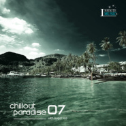

Chillout Paradise Volume 007Compiled By Sugar ice
============================

|  |  |
| :--: | :-- |
| [ Chillout Paradise Volume 007Compiled By Sugar ice](https://emumo.xiami.com/album/1814720943) | **艺人**: [Infinite Music](../index.md) **语种**: 英语 **唱片公司**: Progressive Digital Station **发行时间**: 2014年10月31日 **专辑类别**: 合集, 杂锦 **专辑风格**: 缓拍 Downtempo, 氛围音乐 Ambient **播放数**: 74974 **收藏数**: 122 **评论数**: 9  |

## 简介

 
 

 Chillout Paradise Volume 007 (Compiled By Sugar ice)
 

官方载点&nbsp;<a href="http://bbs.pdstation.com/thread-1884-1-1.html" target="_blank" rel="nofollow noreferrer noopener">http://bbs.pdstation.com/thread-1884-1-1.html</a>
 

 
 

Infinte Music官方群号275160373
 

IM官方微博 <a href="http://weibo.com/InfiniteMusic" target="_blank" rel="nofollow noreferrer noopener">http://weibo.com/InfiniteMusic</a>
 

 
 

 
 

 

## 曲目

## 评论

|  |  |  |
| :-- | :-- | :-- |
|  [虾米用户](https://emumo.xiami.com/u/350970041) 唯乐而动 2020-03-11 04:53 赞(0) 踩(0) | 

 |
|  [虾米用户](https://emumo.xiami.com/u/289020472)  2019-10-15 22:20 赞(1) 踩(0) | 
太美了
 |
|  [虾米用户](https://emumo.xiami.com/u/39861541) 音乐是世界上最美的语言 2017-02-12 12:25 赞(0) 踩(0) | 
个人推荐2， 3， 5， 7， 8， 10
 |
|  [虾米用户](https://emumo.xiami.com/u/7097982) EVERYTHING 2016-06-25 22:21 赞(1) 踩(0) | 
付费
 |
|  [虾米用户](https://emumo.xiami.com/u/4487129)  2016-04-02 11:13 赞(0) 踩(0) | 
！！！
 |
|  [虾米用户](https://emumo.xiami.com/u/49060915) 随风 2015-11-30 00:25 赞(0) 踩(0) | 
弛放 Chillout
 |
|  [虾米用户](https://emumo.xiami.com/u/645218) 任性逍遥于有欲无欲之间 2015-01-24 15:16 赞(0) 踩(0) | 
喜欢这个调调
 |
|  [虾米用户](https://emumo.xiami.com/u/406048)   2015-01-03 13:36 赞(0) 踩(0) | 
精华
 |
|  [虾米用户](https://emumo.xiami.com/u/39235894) 响者，为乐。 2014-11-10 14:13 赞(0) 踩(0) | 
安静，不干扰脑洞，适合午后工作时的背景音乐。
 |
