Infinite Music
============================

|  |  |
| :--: | :-- |
| [ Infinite Music](https://i.xiami.com/infinitemusic) | **播放数**: 5526255 **粉丝数**: 2501 **评论数**: 262 **地区**: China 中国大陆 **风格**: 缓拍 Downtempo, 沙发音乐 Lounge, 氛围音乐 Ambient, 弛放 Chillout  |

## 档案

INFINITE MUSIC [IM - 无限音乐]，它的前身为虚拟厂牌Icecream Recordings，IM于2014年5月正式转型完毕，隶属于电子乐团队Progressive Digital Station [PDS]。 
官方网站BBS 
http://bbs.pdstation.com/ 
INFINITE MUSIC 
[IM]QQ群号:275160373 
Progressive Digital Station 
[PDS]群号 215069413 
关注微博 
http://weibo.com/InfiniteMusic 
http://weibo.com/PDStation

## 专辑

| 名称 | 语种 | 唱片公司 | 发行时间 | 专辑类别 | 专辑风格 |
| :--: | :-- | :-- | :-- | :-- | :-- |
| [ Fly To LifeOn Friskyradio](./albums/2102699685.md) | 英语 | Progressive Digital Station | 2017年02月25日 | 播客 | 缓拍 Downtempo, 弛放 Chillout, 氛围音乐 Ambient |
| [ Catch You Forever (WindWill Edition)Forward](./albums/2100382250.md) | 英语 | 独立发行 | 2016年08月23日 | EP, 单曲 |  |
| [ Summer LoveWindWill](./albums/2100346782.md) | 英语 | 独立发行 | 2016年05月29日 | EP, 单曲 | 缓拍 Downtempo, 氛围音乐 Ambient |
| [ From Chongqing (2016)On Friskyradio](./albums/2100347006.md) | 英语 | Progressive Digital Station | 2016年05月22日 | 播客 | 缓拍 Downtempo, 氛围音乐 Ambient |
| [ Up In The AirOn Friskyradio](./albums/2100305070.md) | 英语 | Progressive Digital Station | 2016年03月27日 | 播客 | 缓拍 Downtempo, 氛围音乐 Ambient |
| [ Beat of TimeWindWill](./albums/2100286910.md) | 英语 | Progressive Digital Station | 2016年02月28日 | 播客 | 缓拍 Downtempo, 氛围音乐 Ambient |
| [ Chill Time 2015 [Chapter 2](Compiled by Justmusic)驰放时代2015【下篇】](./albums/2100270518.md) | 英语 | Progressive Digital Station | 2016年01月23日 | 精选集 | 缓拍 Downtempo, 氛围音乐 Ambient |
| [ Chill Time 2015 [Chapter 1](Compiled by Sugarice)驰放时代2015【上篇】](./albums/2100270506.md) | 英语 | Progressive Digital Station | 2016年01月16日 | 精选集 | 缓拍 Downtempo, 氛围音乐 Ambient |
| [ Memory [2015 Editon] (Beatport Top 20)1st Anniversary：Chillout & Downtempo Year Mix](./albums/2100181864.md) | 英语 | Progressive Digital Station | 2015年07月26日 | 播客 | 缓拍 Downtempo, 氛围音乐 Ambient |
| [ Garden of Eden  (Beatport Top 20)伊甸园](./albums/235978788.md) | 英语 | Progressive Digital Station | 2015年06月28日 | 播客 | 缓拍 Downtempo, 氛围音乐 Ambient |
| [ Live In DeathOn Friskyradio](./albums/330355720.md) | 英语 | Progressive Digital Station | 2015年04月28日 | 播客 | 氛围音乐 Ambient |
| [ Rock The ChillOn Friskyradio](./albums/1527622411.md) | 英语 | Progressive Digital Station | 2015年03月22日 | 精选集 | 氛围音乐 Ambient |
| [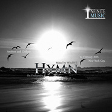 Hymn (Beatport Top 20)WindWill](./albums/1525206500.md) | 英语 | Progressive Digital Station | 2015年02月22日 | 精选集 | 缓拍 Downtempo, 氛围音乐 Ambient |
| [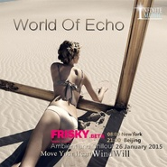 World of Echo Ⅱ (2015 New Year Mix)On Friskyradio](./albums/1322716080.md) | 英语 | Progressive Digital Station | 2015年01月31日 | 精选集 | 氛围音乐 Ambient |
| [ World of EchoⅠ(2015 New Year Mix)On Friskyradio](./albums/922102723.md) | 英语 | Progressive Digital Station | 2015年01月24日 | 精选集 | 缓拍 Downtempo, 氛围音乐 Ambient |
| [ Chillout Paradise Volume 020Compiled By Justmusic](./albums/1820554808.md) | 英语 | Progressive Digital Station | 2015年01月23日 | 合集, 杂锦 | 缓拍 Downtempo, 氛围音乐 Ambient |
| [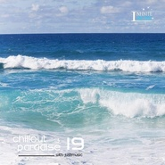 Chillout Paradise Volume 019Compiled By Justmusic](./albums/720553742.md) | 英语 | Progressive Digital Station | 2015年01月16日 | 合集, 杂锦 | 缓拍 Downtempo, 氛围音乐 Ambient |
| [ Chillout Paradise Volume 018Compiled By Justmusic](./albums/818737886.md) | 英语 | Progressive Digital Station | 2015年01月09日 | 合集, 杂锦 | 缓拍 Downtempo, 氛围音乐 Ambient |
| [ Chillout Paradise Volume 017Compiled By Justmusic](./albums/1018570226.md) | 英语 | Progressive Digital Station | 2015年01月03日 | 合集, 杂锦 | 氛围音乐 Ambient |
| [ Chillout Paradise Volume 016Compiled By Sugar ice](./albums/2018567103.md) | 英语 | Progressive Digital Station | 2014年12月27日 | 合集, 杂锦 | 缓拍 Downtempo, 氛围音乐 Ambient |
| [ Chillout Paradise Volume 015Compiled By Sugar ice](./albums/918564623.md) | 英语 | Progressive Digital Station | 2014年12月20日 | 合集, 杂锦 | 缓拍 Downtempo, 氛围音乐 Ambient |
| [ Chillout Paradise Volume 014Compiled By Justmusic](./albums/18392080.md) | 英语 | Progressive Digital Station | 2014年12月12日 | 合集, 杂锦 | 缓拍 Downtempo, 氛围音乐 Ambient |
| [ Revolution of SoulWindWill](./albums/1217850596.md) | 英语 | Progressive Digital Station | 2014年12月06日 | 精选集 | 碎拍 Breakbeat, 氛围音乐 Ambient |
| [ Chillout Paradise Volume 013Compiled By Sugar ice](./albums/1117784993.md) | 英语 | Progressive Digital Station | 2014年12月05日 | 合集, 杂锦 | 缓拍 Downtempo, 氛围音乐 Ambient |
| [ Online DreamsSugar ice](./albums/317297341.md) | 英语 | Progressive Digital Station | 2014年11月30日 | 精选集 | 碎拍 Breakbeat, 氛围音乐 Ambient |
| [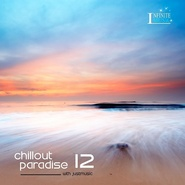 Chillout Paradise Volume 012Compiled By Justmusic](./albums/417078379.md) | 英语 | Progressive Digital Station | 2014年11月28日 | 合集, 杂锦 | 缓拍 Downtempo, 氛围音乐 Ambient |
| [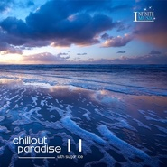 Chillout Paradise Volume 011Compiled By Sugar ice](./albums/2016924032.md) | 英语 | Progressive Digital Station | 2014年11月26日 | 合集, 杂锦 | 缓拍 Downtempo, 氛围音乐 Ambient |
| [ MiracleDJ CicE](./albums/116567730.md) | 英语 | Progressive Digital Station | 2014年11月21日 | 精选集 | 沙发音乐 Lounge, 氛围音乐 Ambient |
| [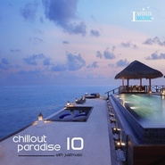 Chillout Paradise Volume 010Compiled By Justmusic](./albums/515189576.md) | 英语 | Progressive Digital Station | 2014年11月05日 | 合集, 杂锦 | 缓拍 Downtempo, 氛围音乐 Ambient |
| [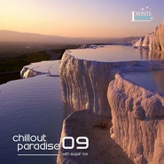 Chillout Paradise Volume 009Compiled By Sugar ice](./albums/1115096393.md) | 英语 | Progressive Digital Station | 2014年11月04日 | 合集, 杂锦 | 缓拍 Downtempo |
| [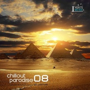 Chillout Paradise Volume 008Compiled By Justmusic](./albums/1414772339.md) | 英语 | Progressive Digital Station | 2014年11月01日 | 合集, 杂锦 | 缓拍 Downtempo, 氛围音乐 Ambient |
| [ Chillout Paradise Volume 007Compiled By Sugar ice](./albums/1814720943.md) | 英语 | Progressive Digital Station | 2014年10月31日 | 合集, 杂锦 | 缓拍 Downtempo, 氛围音乐 Ambient |
| [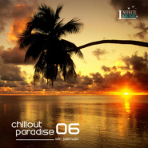 Chillout Paradise Volume 006Compiled By Justmusic](./albums/814566890.md) | 英语 | Progressive Digital Station | 2014年10月29日 | 合集, 杂锦 | 缓拍 Downtempo, 沙发音乐 Lounge |
| [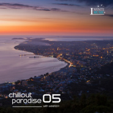 Chillout Paradise Volume 005Compiled by Weareyy](./albums/1614464748.md) | 英语 | Progressive Digital Station | 2014年10月28日 | 合集, 杂锦 | 缓拍 Downtempo, 沙发音乐 Lounge |
| [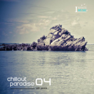 Chillout Paradise Volume 004Compiled by Janice](./albums/1714460653.md) | 英语 | Progressive Digital Station | 2014年10月27日 | 合集, 杂锦 | 缓拍 Downtempo, 氛围音乐 Ambient |
| [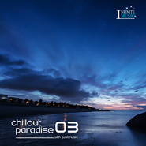 Chillout Paradise Volume 003Compiled by Justmusic](./albums/513426639.md) | 英语 | Progressive Digital Station | 2014年10月16日 | 合集, 杂锦 | 氛围音乐 Ambient, 独立电子乐 Indietronica |
| [ Chill Time 2014Feel Life , Feel Chill](./albums/113170132.md) | 英语 | Progressive Digital Station | 2014年10月13日 | 精选集 | 沙发音乐 Lounge, 氛围音乐 Ambient |
| [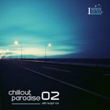 Chillout Paradise Volume 002Compiled by Sugar ice](./albums/712995394.md) | 英语 | Progressive Digital Station | 2014年10月11日 | 合集, 杂锦 | 缓拍 Downtempo, 氛围音乐 Ambient |
| [ Infinite Music September 2014On Friskyradio](./albums/1612902932.md) | 英语 | Progressive Digital Station | 2014年10月10日 | 精选集 | 缓拍 Downtempo, 氛围音乐 Ambient |
| [ Chillout Paradise Volume 001Compiled By Justmusic](./albums/212820861.md) | 英语 | Progressive Digital Station | 2014年10月09日 | 合集, 杂锦 | 沙发音乐 Lounge, 氛围音乐 Ambient |
| [ Infinite Music August 2014On Friskyradio](./albums/2010958348.md) | 英语 | Progressive Digital Station | 2014年08月28日 | 精选集 | 缓拍 Downtempo, 沙发音乐 Lounge, 氛围音乐 Ambient |
| [ Infinite Music July 2014On Friskyradio](./albums/111128250.md) | 英语 | Progressive Digital Station | 2014年07月24日 | 精选集 | 沙发音乐 Lounge, 氛围音乐 Ambient |
| [ Infinite SpaceOn Friskyradio](./albums/1311036812.md) | 英语 | Progressive Digital Station | 2014年06月03日 | 精选集 | 缓拍 Downtempo, 沙发音乐 Lounge, 氛围音乐 Ambient |
| [ Frisky Loves ChinaBeatport Top 33](./albums/1511119868.md) | 英语 | Progressive Digital Station | 2014年04月20日 | EP, 单曲 | 缓拍 Downtempo, 氛围音乐 Ambient |
| [ Vocal Wind](./albums/332458277.md) | 英语 | Progressive Digital Station | 2014年04月01日 | 播客 | 氛围音乐 Ambient |

## 评论

|  |  |  |  |
| :-- | :-- | :-- | :-- |
|  [虾米用户](https://emumo.xiami.com/u/333971984) 音乐才是伴侣 2020-12-20 19:49 赞(0) 踩(0) | 
哈，来虾米3年了，才第一次看评论业 ，以前百度云混日子，YY直播的日子记忆深刻啊，感谢PDS带来的那几年光阴，也有幸认识PDS成员作为朋友，现在的资源方便党都不懂得珍惜
 |
|  [虾米用户](https://emumo.xiami.com/u/342835079) 扬帆，音海远航 2020-12-08 18:45 赞(0) 踩(0) | 
国内大多数而言入门都不够，反而就像多数影视剧一样，反其道而行。
 |
|  [虾米用户](https://emumo.xiami.com/u/379912005) 感谢虾米，永远记得。 2020-11-16 06:43 赞(1) 踩(0) | 
到目前为止，国内的音乐欣赏水平还在入门阶段，大多数人还停留在流行歌曲阶段，甚至不知道世界上还有Chillout，感谢您的团队为国内的音乐爱好者介绍NewAge Music ，尽管不是原创，也是让很多人受益良多！
 |
|  [虾米用户](https://emumo.xiami.com/u/413065923) 音乐无国界 民族的即世界... 2020-11-11 14:18 赞(0) 踩(0) | 
谢谢
 |
|  [虾米用户](https://emumo.xiami.com/u/427384237) 我还没想好要写什么... 2020-10-10 18:09 赞(0) 踩(0) | 
➕
 |
|  [虾米用户](https://emumo.xiami.com/u/4187272) 多洗心灵少洗脑 2020-09-20 00:55 赞(0) 踩(0) | 
还不错 关注了
 |
|  [虾米用户](https://emumo.xiami.com/u/408196155) 我还没想好要写什么... 2020-09-18 07:30 赞(0) 踩(0) | 
这段音乐我早就有了 喜欢的音乐，今天看作者变了
 |
|  [虾米用户](https://emumo.xiami.com/u/408196155) 我还没想好要写什么... 2020-09-18 07:29 赞(0) 踩(0) | 
这是改变了国外的音乐还是把国外的音乐买下来了，算自己创作的 不明白这个人的音乐 是怎么算的，有明白人改讲一下吗
 |
|  [虾米用户](https://emumo.xiami.com/u/274775972) 寻找通往天堂的天籁 2020-08-24 16:49 赞(1) 踩(0) | 
我控制不住自己了，我要爆发了 我就是听歌的，我只对旋律感性趣
 |
|  [虾米用户](https://emumo.xiami.com/u/119577840)  2020-08-12 16:47 赞(0) 踩(0) | 
国货之光
 |
|  [虾米用户](https://emumo.xiami.com/u/351134673) 音乐美化生活 2020-07-24 00:00 赞(1) 踩(0) | 
即使饮一杯岁月中苦涩的羹，也会造就丰富的人生；使人生几多坎坷，走过去，生命也会去担承。心灵安顿了，平衡了，生命也就快乐了，无憾了，如眼前一幅静美的画卷，清幽，温馨与宁静。
 |
|  [虾米用户](https://emumo.xiami.com/u/423010257) 互为人间，不如自成宇宙 2020-03-20 11:59 赞(1) 踩(0) | 
谁能科普一下为什么吵起来啊，音乐那么好听 
 |
|  [虾米用户](https://emumo.xiami.com/u/7488714) 此身不向今生渡更向何时渡... 2020-03-19 18:27 赞(2) 踩(0) | 
怎么加入infinite music  团队呢！  我是chillout   音乐的爱好者！  特喜欢这个类型的音乐
 |
|  [虾米用户](https://emumo.xiami.com/u/356763773) 我还没想好要写什么... 2020-02-02 20:02 赞(0) 踩(0) | 
~
 |
|  [虾米用户](https://emumo.xiami.com/u/24620483)   2020-01-27 14:02 赞(0) 踩(0) | 
jia you
 |
|  [虾米用户](https://emumo.xiami.com/u/84701418)  2019-12-29 16:34 赞(1) 踩(0) | 
为什么拿着别人的音乐要收费？想钱想疯了吧。鄙视！  
 |
|  [虾米用户](https://emumo.xiami.com/u/351134673) 音乐美化生活 2019-12-21 08:39 赞(1) 踩(0) | 
大气，势不可挡！支持你！
 |
|  [虾米用户](https://emumo.xiami.com/u/44161162) 音乐人生 2019-12-07 19:16 赞(0) 踩(0) | 
如果作品是别人，非自己创作，那就要一定要注释清楚，这是尊重原创音乐家！
 |
|  [虾米用户](https://emumo.xiami.com/u/50369682)   2019-11-20 21:41 赞(0) 踩(0) | 

 |
|  [虾米用户](https://emumo.xiami.com/u/23721413) Love Mix 2019-09-04 00:14 赞(2) 踩(0) | 
感谢
 |
|  [虾米用户](https://emumo.xiami.com/u/2062485) 深夜的沿海公路配音乐 2019-08-20 11:40 赞(1) 踩(0) | 
Sorry,来晚了！
 |
|  [虾米用户](https://emumo.xiami.com/u/330900828) 高舉一面五星紅旗在蝦米！ 2019-07-17 22:41 赞(2) 踩(0) | 
唯有极致的睡眠 ，方有欣赏至上音樂的豐滿——音樂向左
 |
|  [虾米用户](https://emumo.xiami.com/u/105451946) 亲们网易云见昵称：摩羯天... 2019-07-05 17:02 赞(1) 踩(0) | 

 |
|  [虾米用户](https://emumo.xiami.com/u/17863029)   2019-06-16 14:32 赞(0) 踩(0) | 
真的是大神作~收藏
 |
|  [虾米用户](https://emumo.xiami.com/u/631574)  2019-05-26 21:48 赞(2) 踩(0) | 
不错，国际水准
 |
|  [虾米用户](https://emumo.xiami.com/u/51868708)  2019-05-24 13:05 赞(2) 踩(0) | 
非常好的普及与推介...高水准音乐需要有品味的人支持...
 |
|  [虾米用户](https://emumo.xiami.com/u/336718945)  2019-05-08 21:02 赞(3) 踩(0) | 
唯美弛放音乐大师    
 |
|  [虾米用户](https://emumo.xiami.com/u/105451946) 亲们网易云见昵称：摩羯天... 2019-04-17 08:14 赞(1) 踩(0) | 

 |
|  [虾米用户](https://emumo.xiami.com/u/356080307) 音符啊～你是風你是雲，你... 2019-04-08 04:24 赞(1) 踩(0) | 
沖刷著，流淌著，柔水漾！
 |
|  [虾米用户](https://emumo.xiami.com/u/97443006)   2019-03-03 13:53 赞(2) 踩(0) | 
支持！混音也是制作！比如八十年代风靡一时的“荷东”，不就是国外曲子重新混音吗？
 |
|  [虾米用户](https://emumo.xiami.com/u/2418238) weibo: @尤米口 2019-02-28 00:32 赞(0) 踩(0) | 

 |
|  [虾米用户](https://emumo.xiami.com/u/407277436)  2019-02-22 09:13 赞(1) 踩(0) | 
6比！
 |
|  [虾米用户](https://emumo.xiami.com/u/276944698) 不要自我设限..... 2019-02-02 12:04 赞(1) 踩(0) | 
-
 |
|  [虾米用户](https://emumo.xiami.com/u/67456948) 步入赤色的火焰中嗤笑着堕... 2019-01-30 23:12 赞(0) 踩(0) | 
？我懵了 
 |
|  [虾米用户](https://emumo.xiami.com/u/7784122) 青鶴鳴 時太平 2019-01-30 11:48 赞(3) 踩(0) | 
今天才才了解到！大吃一惊。。国内的氛围音乐已经玩到国际水平了，实在了不起！  
 |
|  [虾米用户](https://emumo.xiami.com/u/9229615)  2019-01-29 12:17 赞(0) 踩(0) | 
VIP原来也需要花钱买啊，买了!!
 |
|  [虾米用户](https://emumo.xiami.com/u/26568910) 以乐会友，共享美好时光 2019-01-28 21:15 赞(1) 踩(0) | 
不管怎样还是要感谢你为我们带来这么多美妙的作品
 |
|  [虾米用户](https://emumo.xiami.com/u/361287195) 暖暖的幸福(^o^)o甜... 2019-01-07 23:30 赞(1) 踩(0) | 
（   ）
 |
|  [虾米用户](https://emumo.xiami.com/u/20893037) 无聊的音乐美 2018-12-18 22:40 赞(4) 踩(0) | 
我为中国有您们这些音乐人骄傲
 |
|  [虾米用户](https://emumo.xiami.com/u/277351477)  2018-11-20 18:54 赞(1) 踩(0) | 

 |
|  [虾米用户](https://emumo.xiami.com/u/2351903) 你可知我从此居无定所。 2018-10-10 09:38 赞(1) 踩(0) | 
OK的
 |
|  [虾米用户](https://emumo.xiami.com/u/401244775)  2018-09-10 01:52 赞(1) 踩(0) | 
能上传一下Black Rosevil和Color of Destiny吗，跪求...
 |
|  [虾米用户](https://emumo.xiami.com/u/7973634) soundonline ... 2018-08-28 15:11 赞(0) 踩(0) | 
看评论看的都不知道哪些是本作者的音乐了.
 |
|  [虾米用户](https://emumo.xiami.com/u/297440930) 有些情话只想悄悄说给你听 2018-06-30 17:35 赞(0) 踩(0) | 

 |
|  [虾米用户](https://emumo.xiami.com/u/9760096)  2018-06-23 00:29 赞(0) 踩(0) | 
~
 |
|  [虾米用户](https://emumo.xiami.com/u/13152884) chillout/amb... 2018-06-09 20:54 赞(0) 踩(0) | 
待
 |
|  [虾米用户](https://emumo.xiami.com/u/213697462)   2018-04-26 15:07 赞(12) 踩(0) | 
期待继续出新专辑
 |
|  [虾米用户](https://emumo.xiami.com/u/13769202)  2018-04-21 12:11 赞(1) 踩(0) | 
每一曲都收费，也太不要脸了，好象自已的。知道你也不易，好歹他也弄个vip，真的有点太不要脸了。别逼更多人骂你。
 |
| ⇒ |  [虾米用户](https://emumo.xiami.com/u/486995)  2018-04-22 21:02 赞(0) 踩(0) | 
去wangyi
 |
| ⇒ |  [虾米用户](https://emumo.xiami.com/u/13769202)  2018-05-17 13:34 赞(0) 踩(0) | 
<q><b>Infinite Music说：</b></q>
 |
|  [虾米用户](https://emumo.xiami.com/u/24731766) 这家伙懒得写 2018-03-29 21:18 赞(3) 踩(0) | 
有CD卖吗？
 |
|  [虾米用户](https://emumo.xiami.com/u/11741952) 花开花落知多少 2017-12-26 22:08 赞(0) 踩(0) | 
炫音论坛的大神 
 |
|  [虾米用户](https://emumo.xiami.com/u/324879742)   2017-11-08 10:58 赞(3) 踩(0) | 

 |
|  [虾米用户](https://emumo.xiami.com/u/15939861) yk-yt 2017-10-03 21:14 赞(1) 踩(0) | 
新世纪,轻松美妙让人放松
 |
|  [虾米用户](https://emumo.xiami.com/u/144715232)  2017-09-21 21:13 赞(0) 踩(0) | 
 
 |
|  [虾米用户](https://emumo.xiami.com/u/281522911) ！！ 2017-08-02 21:12 赞(2) 踩(0) | 
为你们的音乐加油！你们的音乐不错！但你们到底做了什么，就连国内的百科网站也看不到你们的身影？？？？？？
 |
| ⇒ |  [虾米用户](https://emumo.xiami.com/u/486995)  2017-09-17 22:01 赞(0) 踩(0) | 
国内百度请搜icecream recordings,我能说百度百科都是自己写的吗？有意义？不要把你的无知当成肯定的事实，请以infinitemusic为关键词搜搜全球最大的电子乐网上商店的MIX类别，网址mix.beatport.com，美国纽约Friskyradio网址www.friskyradio.com。你不知道的多了去了，但是不代表没发生
 |
|  [虾米用户](https://emumo.xiami.com/u/10707847)  2017-06-01 01:19 赞(1) 踩(0) | 
非常不错！支持！
 |
|  [虾米用户](https://emumo.xiami.com/u/486995)  2017-05-07 18:53 赞(2) 踩(0) | 
恭喜《Fly to Life》于2017年3月24日在beatport mixes的&amp;ldquo;Top Mixes&amp;rdquo;排行榜取得第4位，这是IM在beatport mixes取得的最好记录。接下来我们将冲击mixcloud的chilout排行榜，争取刷新前15的记录。
 |
|  [虾米用户](https://emumo.xiami.com/u/9926976)  2017-05-01 17:25 赞(0) 踩(0) | 
ok太有才了谢谢！
 |
|  [虾米用户](https://emumo.xiami.com/u/3863543) 用挑剔耳朵寻找沁人心脾的... 2017-03-01 16:07 赞(1) 踩(0) | 
会一如既往的支持你们！
 |
|  [虾米用户](https://emumo.xiami.com/u/42600079) tianxiaweiyi 2016-11-23 00:17 赞(0) 踩(0) | 
等了很久了 期望下一次更新 
 |
|  [虾米用户](https://emumo.xiami.com/u/50506719)   2016-10-11 18:20 赞(1) 踩(0) | 
好久没见新专辑了
 |
|  [虾米用户](https://emumo.xiami.com/u/37289465) 切切切 2016-08-19 04:54 赞(0) 踩(0) | 
～
 |
|  [虾米用户](https://emumo.xiami.com/u/2968301) 电音才是音乐进化的完整体 2016-08-13 16:26 赞(0) 踩(0) | 
真的不要脸 也是够了。
 |
| ⇒ |  [虾米用户](https://emumo.xiami.com/u/486995)  2016-08-28 17:42 赞(0) 踩(0) | 
是的，没有比长城城墙厚的脸皮怎么能突破国内愚蠢的成见，被全球其他国家的音乐人认可，入驻国外电台呢？
 |
| ⇒ |  [虾米用户](https://emumo.xiami.com/u/486995)  2016-08-29 20:48 赞(0) 踩(0) | 
<q><b>David-ALum说：</b></q>
 |
| ⇒ |  [虾米用户](https://emumo.xiami.com/u/4198325) 我还没想好要写什么... 2017-03-20 12:12 赞(0) 踩(0) | 
<q><b>Infinite Music说：</b></q>
 |
| ⇒ |  [虾米用户](https://emumo.xiami.com/u/2968301) 电音才是音乐进化的完整体 2017-10-28 00:29 赞(0) 踩(0) | 
<q><b>Infinite Music说：</b></q>
 |
|  [虾米用户](https://emumo.xiami.com/u/3672650) 我还没想好要写什么... 2016-08-03 11:13 赞(0) 踩(0) | 

 |
|  [虾米用户](https://emumo.xiami.com/u/8092851)  2016-07-25 08:19 赞(0) 踩(0) | 
支持！
 |
|  [虾米用户](https://emumo.xiami.com/u/146370814) 音乐是最纯洁可聽見的聲音 2016-04-21 02:11 赞(0) 踩(0) | 
欢迎你回来
 |
|  [虾米用户](https://emumo.xiami.com/u/2244658)  2016-03-16 22:14 赞(1) 踩(0) | 
这个还可以
 |
|  [虾米用户](https://emumo.xiami.com/u/8332130)  2016-03-12 09:27 赞(1) 踩(0) | 
InfiniteMusic
 |
|  [虾米用户](https://emumo.xiami.com/u/12714877)   2016-03-05 12:24 赞(1) 踩(0) | 
碉堡了
 |
|  [虾米用户](https://emumo.xiami.com/u/77545866)  2016-02-23 03:40 赞(1) 踩(0) | 
大爱
 |
|  [虾米用户](https://emumo.xiami.com/u/874504) 用声音记录地球各地生命的... 2016-02-13 11:48 赞(1) 踩(0) | 
Nice
 |
|  [虾米用户](https://emumo.xiami.com/u/2774453) 暂无签名~ 2016-02-04 17:54 赞(0) 踩(0) | 
欢迎回归！
 |
|  [虾米用户](https://emumo.xiami.com/u/50506719)   2016-01-25 11:10 赞(0) 踩(0) | 
2016期待你的新专辑
 |
|  [虾米用户](https://emumo.xiami.com/u/50506719)   2016-01-17 17:20 赞(0) 踩(0) | 
大爱 
 |
|  [虾米用户](https://emumo.xiami.com/u/42600079) tianxiaweiyi 2016-01-12 00:01 赞(1) 踩(0) | 
Welcome back，Hero！
 |
| ⇒ |  [虾米用户](https://emumo.xiami.com/u/486995)  2016-01-13 20:44 赞(0) 踩(0) | 
感谢你的信任和支持
 |
|  [虾米用户](https://emumo.xiami.com/u/4487129)  2016-01-09 21:49 赞(1) 踩(0) | 
期待更多的精彩。。。。。
 |
| ⇒ |  [虾米用户](https://emumo.xiami.com/u/486995)  2016-01-13 20:43 赞(0) 踩(0) | 
加倍努力中
 |
| ⇒ |  [虾米用户](https://emumo.xiami.com/u/4487129)  2016-01-13 21:58 赞(0) 踩(0) | 
<q><b>Infinite Music说：</b></q>
 |
|  [虾米用户](https://emumo.xiami.com/u/6111314) 夜间飞行 2016-01-09 21:27 赞(0) 踩(0) | 
欢迎回来w
 |
| ⇒ |  [虾米用户](https://emumo.xiami.com/u/486995)  2016-01-13 20:43 赞(0) 踩(0) | 
感谢~
 |
|  [虾米用户](https://emumo.xiami.com/u/486995)  2016-01-09 17:29 赞(61) 踩(0) | 
IM在国外取得的以及对国内的效用就目前而言无人可比，不能让空白继续下去，所有的骂声和疑惑我们来背就是了，我们倒是希望来多点专业的超过我们，还是少说话多做事
 |
| ⇒ |  [虾米用户](https://emumo.xiami.com/u/53834163) 活着，然后堕落吧。↑不听... 2016-01-10 10:36 赞(0) 踩(0) | 
欢迎回来~
 |
| ⇒ |  [虾米用户](https://emumo.xiami.com/u/486995)  2016-01-13 20:44 赞(0) 踩(0) | 
<q><b>C.O.D. IS说：</b></q>
 |
| ⇒ |  [虾米用户](https://emumo.xiami.com/u/201144715) 藏在墨水里，空白的永久填... 2016-12-08 21:29 赞(0) 踩(0) | 
真心喜欢你们做的精选集呢，有些熟悉的节奏在一起的时候，心情瞬间好的不行，支持你2015mix初遇……  
 |
| ⇒ |  [虾米用户](https://emumo.xiami.com/u/213697462)   2018-10-16 03:42 赞(0) 踩(0) | 
到目前为止，国内的音乐欣赏水平还在入门阶段，大多数人还停留在流行歌曲阶段，甚至不知道世界上还有Chillout，感谢您的团队为国内的音乐爱好者介绍NewAge Music ，尽管不是原创，也是让很多人受益良多！
 |
| ⇒ |  [虾米用户](https://emumo.xiami.com/u/308652751) 嗜乐如命之自由灵魂 2019-01-21 01:03 赞(0) 踩(0) | 
支持你们！但不要浪费时间鸡同鸭讲，不要试图叫醒那些装睡的人！我想对那些说风凉话的所谓“同行们”奉劝一句：少说废话，多干实事，是骡子是马拉出来遛遛！很喜欢你们制作的音乐，为我大中国真正的电音制作人点赞！加油！
 |
| ⇒ |  [虾米用户](https://emumo.xiami.com/u/412433718) 我还没想好要写什么... 2019-03-07 19:56 赞(0) 踩(0) | 
老铁怎么联系
 |
|  [虾米用户](https://emumo.xiami.com/u/41163024) I’m done. 2015-12-24 18:41 赞(0) 踩(0) | 
评论真是精彩。。。把人逼走了你们高兴了
 |
| ⇒ |  [虾米用户](https://emumo.xiami.com/u/14091078) 我还没想好要写什么... 2016-04-13 20:48 赞(0) 踩(0) | 
捉
 |
|  [虾米用户](https://emumo.xiami.com/u/8942177) Was mich nic... 2015-12-10 11:00 赞(0) 踩(0) | 
弛放
 |
|  [虾米用户](https://emumo.xiami.com/u/76818958)  2015-10-26 09:53 赞(0) 踩(0) | 
评论这么火
 |
|  [虾米用户](https://emumo.xiami.com/u/2774453) 暂无签名~ 2015-10-20 20:19 赞(0) 踩(0) | 
原来只是过来听音乐，现在才发现这评论也有点意思。。。
 |
|  [虾米用户](https://emumo.xiami.com/u/702742) 生活持有偏見…… 2015-09-16 16:38 赞(0) 踩(0) | 
感謝 你們創作的 「Hymn」
 |
|  [虾米用户](https://emumo.xiami.com/u/702742) 生活持有偏見…… 2015-09-16 16:37 赞(2) 踩(0) | 
IM 說不再在蝦米上傳作品，這點能夠理解和尊重樂隊的但也希望，IM 可以把創作的作品有更多的實體發行。現在 現場的演出氛圍開始上來了，各種音樂節也層出不窮，但實質上也可以看到很尷尬的一個事，就是音樂人和音樂的豐富程度跟不上。而且現場音樂文化遠未普及，觀眾也並沒有太多渠道去接觸。非常希望 IM團隊，在國內可以有更多的現場，特別是給正在崛起的珠三角。非常期待，並持續關注你們。加油，現場見！
 |
| ⇒ |  [虾米用户](https://emumo.xiami.com/u/391795) 夏日虫鸣，隐邃星空 2015-09-16 16:43 赞(0) 踩(0) | 
我相信IM，包括PDS整个团队都会加强考虑现场这方面的安排的！因为听说之前就有考虑~
 |
|  [虾米用户](https://emumo.xiami.com/u/702742) 生活持有偏見…… 2015-09-16 16:31 赞(2) 踩(0) | 
認真地聽了一下午，終於可以回復了……很高興，雖然是因為一場 si B 引起的…認真翻看了所有的評論，其實不難看出仍是那種國人“小農”的劣根性… 也就魯迅先生寫的那些之前並未很多地關注 Chillout 旋律 氛圍 可美可邪惡亦可澎湃國內的創作氣氛確實不那麽好，從不在競爭中進步學習，卻喜歡在競爭中搏發口舌在國內，蝦米算是給大家普及和豐富了音樂的內容… 這點值得認可而作為觀眾，希望逐漸向更多的付費形式去支持音樂，更不必爭執於網絡的資源，真正的音樂絕對是在現場，這是各種介質難以還原的。
 |
|  [虾米用户](https://emumo.xiami.com/u/4028542) 世界万物都是隐喻 2015-09-16 15:11 赞(1) 踩(0) | 
囧。怎么就撕起来了。混音改编应该可以算是原曲再创作吧，如果是这样，以音乐人的角色来发布应该是合理的。但是......<a href="http://www.xiami.com/song/1773686103?spm=a1z1s.6632057.350708705.19.DXmuh4" target="_blank" rel="nofollow noreferrer noopener">http://www.xiami.com/song/1773686103?spm=a1z1s.6632057.350708705.19.DXmuh4</a> 这个是标了Original Mix 版本的。<a href="http://www.xiami.com/song/1774078643?spm=a1z1s.7154410.1996860142.3.qnKXux#wall_list" target="_blank" rel="nofollow noreferrer noopener">http://www.xiami.com/song/1774078643?spm=a1z1s.7154410.1996860142.3.qnKXux#wall_list</a> 这个是没标Original Mix版本的。我委实听不出有差别啊，是同一个资源吗？
 |
|  [虾米用户](https://emumo.xiami.com/u/2102348) 执节者歌 2015-09-16 14:20 赞(0) 踩(0) | 
他说他的，你做你的，好好的关了干嘛
 |
|  [虾米用户](https://emumo.xiami.com/u/391795) 夏日虫鸣，隐邃星空 2015-09-16 09:52 赞(27) 踩(0) | 
封面上是选集的都写了complied，完全参照国外选集系列的发布；是set的都有on friksyraido的标注 或者他们的logo，文字说明也有写，你还想要哪样？在封面上腾出空间来表示“complied by XX表示曲子不是原创”？“set是指***请不要误会成***”？你们看到国外的选集和set封面是怎样的没？你们在这里撕逼的，其中也有发布别人set作品的，如果真是小白，抱着弄清楚的态度也就算了，明明自己应该清楚的，再乱闹那就是有预谋有组织的了。挑事和询问沟通的态度及方式差别很大吧？到你们嘴里别人的贡献都能成了狗屎，真是要多混蛋有多混蛋！
 |
|  [虾米用户](https://emumo.xiami.com/u/9156158) 心 月似钩三星挂 2015-08-24 07:13 赞(5) 踩(0) | 
关于一些人很“高尚”说不是原创的是“盗用”的，正好显示他心胸太狭窄了，音乐的美妙不会被如此扼杀的。
 |
| ⇒ |  [虾米用户](https://emumo.xiami.com/u/486995)  2015-09-12 09:14 赞(0) 踩(0) | 
没事，朋友。他们不懂而已~
 |
|  [虾米用户](https://emumo.xiami.com/u/4028542) 世界万物都是隐喻 2015-08-13 22:28 赞(32) 踩(0) | 
不创造音乐，只做音乐的搬运工。。。。。
 |
| ⇒ |  [虾米用户](https://emumo.xiami.com/u/213697462)   2018-10-16 03:42 赞(0) 踩(0) | 
即使不是原创，也要有感恩之心。上外网甄选音乐也不是一件容易的事，花费时间不算，还要有较深的音乐修养和高度的辨识力，在此向热爱音乐的音乐人致敬！
 |
|  [虾米用户](https://emumo.xiami.com/u/5438072)  2015-07-12 23:57 赞(0) 踩(0) | 
打动你听觉的旋律
 |
|  [虾米用户](https://emumo.xiami.com/u/1550112) 隐藏在旋律中的心绪 2015-07-07 13:00 赞(3) 踩(0) | 
在世界音乐的殿堂里，一听这个是日本人制作的，因为有日本的传统因素。再听一首，恩，是韩国人制作的，因为包含了韩国人的处事思想。什么时候不看制作人简介，一听是中国人，那时候我想是国人真正扬眉吐气的时刻。封面也要，音乐也好，竟然找不到一丝的中国痕迹。
 |
|  [虾米用户](https://emumo.xiami.com/u/37098145) 这个家伙太蠢了不会留下什... 2015-07-02 01:07 赞(0) 踩(0) | 
加油
 |
|  [虾米用户](https://emumo.xiami.com/u/20862728) 柯男 2015-06-25 19:08 赞(0) 踩(0) | 
(๑•̀ㅂ•́)و✧
 |
|  [虾米用户](https://emumo.xiami.com/u/2165528)   2015-06-20 17:25 赞(0) 踩(0) | 
精选集？
 |
|  [虾米用户](https://emumo.xiami.com/u/39861541) 音乐是世界上最美的语言 2015-05-19 01:48 赞(1) 踩(0) | 
哇咧！！！！国人！ ！！！顶顶顶！！！
 |
|  [虾米用户](https://emumo.xiami.com/u/777558)  2015-05-12 23:12 赞(2) 踩(0) | 
超喜欢这种感觉 在这物欲横流的世界里洗涤浮躁 净化隐于市那份安静的心境 默默地感谢你们 更喜欢越来越佳作品呈现出来
 |
| ⇒ |  [虾米用户](https://emumo.xiami.com/u/16216086) . 2015-07-29 00:03 赞(0) 踩(0) | 
别误会，没有任何一首原创，只是盗用别人作品，然后来这儿卖钱而已。
 |
| ⇒ |  [虾米用户](https://emumo.xiami.com/u/16216086) . 2015-07-29 11:42 赞(0) 踩(0) | 
<q><b>说：</b></q>
 |
| ⇒ |  [虾米用户](https://emumo.xiami.com/u/16216086) . 2015-07-29 12:50 赞(0) 踩(0) | 
<q><b>说：</b></q>
 |
| ⇒ |  [虾米用户](https://emumo.xiami.com/u/16216086) . 2015-07-29 12:52 赞(0) 踩(0) | 
<q><b>说：</b></q>
 |
| ⇒ |  [虾米用户](https://emumo.xiami.com/u/16216086) . 2015-07-29 14:10 赞(0) 踩(0) | 
<q><b>说：</b></q>
 |
| ⇒ |  [虾米用户](https://emumo.xiami.com/u/16216086) . 2015-07-29 14:40 赞(0) 踩(0) | 
<q><b>说：</b></q>
 |
| ⇒ |  [虾米用户](https://emumo.xiami.com/u/16216086) . 2015-07-29 15:46 赞(0) 踩(0) | 
<q><b>说：</b></q>
 |
| ⇒ |  [虾米用户](https://emumo.xiami.com/u/777558)  2015-08-07 11:17 赞(0) 踩(0) | 
<q><b>此去經年说：</b></q>
 |
| ⇒ |  [虾米用户](https://emumo.xiami.com/u/9730064) 纯音党 2015-08-18 14:28 赞(0) 踩(0) | 
<q><b>说：</b></q>
 |
| ⇒ |  [虾米用户](https://emumo.xiami.com/u/12877359)  2015-08-18 14:42 赞(0) 踩(0) | 
<q><b>Dance Cat说：</b></q>
 |
| ⇒ |  [虾米用户](https://emumo.xiami.com/u/486995)  2015-09-12 07:31 赞(0) 踩(0) | 
<q><b>说：</b></q>
 |
| ⇒ |  [虾米用户](https://emumo.xiami.com/u/486995)  2015-09-12 07:42 赞(0) 踩(0) | 
<q><b>说：</b></q>
 |
| ⇒ |  [虾米用户](https://emumo.xiami.com/u/486995)  2015-09-12 07:54 赞(0) 踩(0) | 
<q><b>说：</b></q>
 |
| ⇒ |  [虾米用户](https://emumo.xiami.com/u/486995)  2015-09-12 07:59 赞(0) 踩(0) | 
<q><b>说：</b></q>
 |
| ⇒ |  [虾米用户](https://emumo.xiami.com/u/486995)  2015-09-12 08:32 赞(0) 踩(0) | 
<q><b>说：</b></q>
 |
| ⇒ |  [虾米用户](https://emumo.xiami.com/u/9156158) 心 月似钩三星挂 2015-09-12 23:38 赞(0) 踩(0) | 
<q><b>Dance Cat说：</b></q>
 |
| ⇒ |  [虾米用户](https://emumo.xiami.com/u/486995)  2015-09-13 11:27 赞(0) 踩(0) | 
<q><b>Dance Cat说：</b></q>
 |
| ⇒ |  [虾米用户](https://emumo.xiami.com/u/9730064) 纯音党 2015-09-15 12:24 赞(0) 踩(0) | 
<q><b>Infinite Music说：</b></q>
 |
| ⇒ |  [虾米用户](https://emumo.xiami.com/u/9730064) 纯音党 2015-09-15 19:55 赞(0) 踩(0) | 
<q><b>说：</b></q>
 |
| ⇒ |  [虾米用户](https://emumo.xiami.com/u/9730064) 纯音党 2015-09-15 19:57 赞(0) 踩(0) | 
<q><b>Infinite Music说：</b></q>
 |
| ⇒ |  [虾米用户](https://emumo.xiami.com/u/9730064) 纯音党 2015-09-15 20:13 赞(0) 踩(0) | 
<q><b>Infinite Music说：</b></q>
 |
| ⇒ |  [虾米用户](https://emumo.xiami.com/u/9730064) 纯音党 2015-09-15 20:17 赞(0) 踩(0) | 
<q><b>Infinite Music说：</b></q>
 |
| ⇒ |  [虾米用户](https://emumo.xiami.com/u/486995)  2015-09-16 02:30 赞(0) 踩(0) | 
<q><b>Dance Cat说：</b></q>
 |
| ⇒ |  [虾米用户](https://emumo.xiami.com/u/486995)  2015-09-16 04:14 赞(0) 踩(0) | 
<q><b>此去經年说：</b></q>
 |
| ⇒ |  [虾米用户](https://emumo.xiami.com/u/486995)  2015-09-16 04:14 赞(0) 踩(0) | 
<q><b>Dance Cat说：</b></q>
 |
| ⇒ |  [虾米用户](https://emumo.xiami.com/u/9730064) 纯音党 2017-10-27 23:38 赞(0) 踩(0) | 
<q><b>Infinite Music说：</b></q>
 |
| ⇒ |  [虾米用户](https://emumo.xiami.com/u/486995)  2017-10-27 23:38 赞(0) 踩(0) | 
<q><b>Dance Cat说：</b></q>
 |
| ⇒ |  [虾米用户](https://emumo.xiami.com/u/486995)  2017-10-27 23:41 赞(0) 踩(0) | 
<q><b>Dance Cat说：</b></q>
 |
| ⇒ |  [虾米用户](https://emumo.xiami.com/u/486995)  2017-10-27 23:41 赞(0) 踩(0) | 
<q><b>Dance Cat说：</b></q>
 |
| ⇒ |  [虾米用户](https://emumo.xiami.com/u/486995)  2017-10-27 23:41 赞(0) 踩(0) | 
<q><b>Dance Cat说：</b></q>
 |
| ⇒ |  [虾米用户](https://emumo.xiami.com/u/9730064) 纯音党 2017-10-27 23:41 赞(0) 踩(0) | 
<q><b>说：</b></q>
 |
| ⇒ |  [虾米用户](https://emumo.xiami.com/u/16216086) . 2017-10-28 00:00 赞(0) 踩(0) | 
<q><b>说：</b></q>
 |
| ⇒ |  [虾米用户](https://emumo.xiami.com/u/486995)  2017-12-18 22:49 赞(0) 踩(0) | 
<q><b>说：</b></q>
 |
| ⇒ |  [虾米用户](https://emumo.xiami.com/u/405021632)  2019-07-06 10:29 赞(0) 踩(0) | 
<q><b>Infinite Music说：</b></q>
 |
|  [虾米用户](https://emumo.xiami.com/u/21736718)  2015-03-30 20:29 赞(1) 踩(0) | 
了不起！！！
 |
|  [虾米用户](https://emumo.xiami.com/u/4291744) 我还没想好要写什么... 2015-03-22 15:43 赞(0) 踩(0) | 
这些弛放音乐都是国人原创制作的？太牛了！天才啊
 |
| ⇒ |  [虾米用户](https://emumo.xiami.com/u/9285862) 感谢大家的一路支持。今后... 2015-06-19 16:18 赞(0) 踩(0) | 
很遗憾，都不是国人制作的。欧美音乐的精选集而已
 |
| ⇒ |  [虾米用户](https://emumo.xiami.com/u/9156158) 心 月似钩三星挂 2015-10-11 23:29 赞(0) 踩(0) | 
<q><b>littlealone说：</b></q>
 |
| ⇒ |  [虾米用户](https://emumo.xiami.com/u/9285862) 感谢大家的一路支持。今后... 2015-10-12 12:24 赞(0) 踩(0) | 
<q><b>心山说：</b></q>
 |
| ⇒ |  [虾米用户](https://emumo.xiami.com/u/9285862) 感谢大家的一路支持。今后... 2015-10-12 12:37 赞(0) 踩(0) | 
<q><b>心山说：</b></q>
 |
| ⇒ |  [虾米用户](https://emumo.xiami.com/u/9285862) 感谢大家的一路支持。今后... 2015-10-12 12:41 赞(0) 踩(0) | 
<q><b>心山说：</b></q>
 |
| ⇒ |  [虾米用户](https://emumo.xiami.com/u/9156158) 心 月似钩三星挂 2015-10-12 18:39 赞(0) 踩(0) | 
<q><b>littlealone说：</b></q>
 |
| ⇒ |  [虾米用户](https://emumo.xiami.com/u/9285862) 感谢大家的一路支持。今后... 2015-10-12 19:27 赞(0) 踩(0) | 
<q><b>心山说：</b></q>
 |
| ⇒ |  [虾米用户](https://emumo.xiami.com/u/9156158) 心 月似钩三星挂 2015-10-12 19:51 赞(0) 踩(0) | 
<q><b>littlealone说：</b></q>
 |
| ⇒ |  [虾米用户](https://emumo.xiami.com/u/9285862) 感谢大家的一路支持。今后... 2015-10-12 20:04 赞(0) 踩(0) | 
<q><b>心山说：</b></q>
 |
| ⇒ |  [虾米用户](https://emumo.xiami.com/u/9156158) 心 月似钩三星挂 2015-10-12 20:08 赞(0) 踩(0) | 
<q><b>littlealone说：</b></q>
 |
| ⇒ |  [虾米用户](https://emumo.xiami.com/u/9285862) 感谢大家的一路支持。今后... 2015-10-12 20:18 赞(0) 踩(0) | 
<q><b>心山说：</b></q>
 |
| ⇒ |  [虾米用户](https://emumo.xiami.com/u/9285862) 感谢大家的一路支持。今后... 2015-10-12 20:20 赞(0) 踩(0) | 
<q><b>心山说：</b></q>
 |
|  [虾米用户](https://emumo.xiami.com/u/40237242)  2015-03-19 15:56 赞(0) 踩(0) | 
我也会一直支持你们的创作.....我相信你们是非常有潜力的.......
 |
| ⇒ |  [虾米用户](https://emumo.xiami.com/u/16216086) . 2015-07-28 23:58 赞(0) 踩(0) | 
别误会，没有一首是他们创作的，只是搬运工。
 |
|  [虾米用户](https://emumo.xiami.com/u/40237242)  2015-03-19 15:55 赞(0) 踩(0) | 
你们的音乐自从2014.8月的专辑发布以来一直听.....很绚丽..........也很令人动容.....也是只有一些情怀的人能够正真欣赏.....然而.....我所担心的是.....6天发布一张专辑是否质量会下降.....Chillout Paradise Volume 018这张就感觉很明显.....作为一个听客,我想说我们能等......哪怕是制作周期长一点.....但是我们更加希望高质量......chill  out已经在国外十分流行....然而，在中国....只是个开始啊..可能是国人太过浮躁了吧....无法正真静下心来来享受chill..我也很希望中国电音市场能开发出来.....
 |
| ⇒ |  [虾米用户](https://emumo.xiami.com/u/486995)  2015-03-19 16:28 赞(0) 踩(0) | 
朋友 感谢你的支持 你说的那个是选集   这些选集并不是随便拼凑实际上在入驻虾米之前已经做好 尽管如此 非常感谢你的意见  我想不断提高质量 具有更广的视角是我们所追求的
 |
| ⇒ |  [虾米用户](https://emumo.xiami.com/u/16216086) . 2015-07-29 00:07 赞(0) 踩(0) | 
哥们，这个只是在国外网站下载来搬到虾米卖钱而已。只要下载的量足够，别说6天发布一张，就是一天发布6张都没问题啊。
 |
| ⇒ |  [虾米用户](https://emumo.xiami.com/u/486995)  2015-09-10 11:36 赞(0) 踩(0) | 
<q><b>此去經年说：</b></q>
 |
| ⇒ |  [虾米用户](https://emumo.xiami.com/u/9156158) 心 月似钩三星挂 2015-09-16 09:10 赞(0) 踩(0) | 
<q><b>此去經年说：</b></q>
 |
| ⇒ |  [虾米用户](https://emumo.xiami.com/u/391795) 夏日虫鸣，隐邃星空 2015-09-16 09:19 赞(0) 踩(0) | 
<q><b>心山说：</b></q>
 |
| ⇒ |  [虾米用户](https://emumo.xiami.com/u/702742) 生活持有偏見…… 2015-09-16 13:44 赞(0) 踩(0) | 
<q><b>VeronicaVee说：</b></q>
 |
| ⇒ |  [虾米用户](https://emumo.xiami.com/u/702742) 生活持有偏見…… 2015-09-16 13:45 赞(0) 踩(0) | 
<q><b>此去經年说：</b></q>
 |
|  [虾米用户](https://emumo.xiami.com/u/10168877) trancer,stan 2015-02-28 16:40 赞(0) 踩(0) | 
Simon Li！Progressive Digital Station！贴吧来的，特地送祝福！
 |
|  [虾米用户](https://emumo.xiami.com/u/36499035) 靜默遠足 2015-01-20 23:57 赞(0) 踩(0) | 
收穫
 |
|  [虾米用户](https://emumo.xiami.com/u/46228595) 还是一个人听。。。 2015-01-19 14:04 赞(0) 踩(0) | 
just like
 |
|  [虾米用户](https://emumo.xiami.com/u/1700002) V5_ORZZZZZ 2015-01-17 16:00 赞(0) 踩(0) | 
有feel
 |
|  [虾米用户](https://emumo.xiami.com/u/36023770) 作业不听歌，听歌不作业。 2015-01-05 09:52 赞(7) 踩(0) | 
哇撒！国人？
 |
| ⇒ |  [虾米用户](https://emumo.xiami.com/u/621656)  2015-05-04 22:24 赞(0) 踩(0) | 
国人制作的精选
 |
|  [虾米用户](https://emumo.xiami.com/u/15952911) 虾米还能听啥呢 2014-12-21 21:05 赞(1) 踩(0) | 
以前都是听future bass放松的。现在新添了一种，比futurebass还放松的电音
 |
|  [虾米用户](https://emumo.xiami.com/u/3902467) 发烧一枚 2014-12-14 22:26 赞(1) 踩(0) | 
驰放音乐一直在创新 可越听越没味道了
 |
| ⇒ |  [虾米用户](https://emumo.xiami.com/u/486995)  2014-12-15 01:15 赞(0) 踩(0) | 
每个时代总有一种代表特质，我想我们应该把眼光放得更远些，对传统的电气化进行改革和加入新理念未免不是好事，现在chillout更多的主题是在探讨空间与人的关系，我想我们的体验应该从更广的角度去感受，而不是音乐本身
 |
|  [虾米用户](https://emumo.xiami.com/u/16745497) 我还没想好要写什么... 2014-12-03 12:20 赞(0) 踩(0) | 
Good
 |
|  [虾米用户](https://emumo.xiami.com/u/4400366) 再也不见 2014-11-24 15:25 赞(0) 踩(0) | 
。
 |
|  [虾米用户](https://emumo.xiami.com/u/7369629) 还好，有喜欢的音乐陪伴 2014-11-20 15:32 赞(0) 踩(0) | 
谢谢，能帮我找首音乐吗？之前用midomi查找，显示是 if you（Chillout Paradise Volume 008） 但是听了下不是的。<a href="http://www.iqiyi.com/v_19rrnaj0q0.html" target="_blank" rel="nofollow noreferrer noopener">http://www.iqiyi.com/v_19rrnaj0q0.html</a> 6分30秒 开始的背景音乐。
 |
| ⇒ |  [虾米用户](https://emumo.xiami.com/u/9730064) 纯音党 2014-12-07 22:07 赞(0) 踩(0) | 
不错  同求
 |
| ⇒ |  [虾米用户](https://emumo.xiami.com/u/3114479) 慢下来 静下来 2015-01-08 12:15 赞(0) 踩(0) | 
是不是这首：<a href="http://www.xiami.com/song/1772016814" target="_blank" rel="nofollow noreferrer noopener">http://www.xiami.com/song/1772016814</a>
 |
| ⇒ |  [虾米用户](https://emumo.xiami.com/u/3114479) 慢下来 静下来 2015-01-08 14:14 赞(0) 踩(0) | 
<q><b>Dance Cat说：</b></q>
 |
| ⇒ |  [虾米用户](https://emumo.xiami.com/u/9730064) 纯音党 2015-01-08 19:13 赞(0) 踩(0) | 
<q><b>牧心说：</b></q>
 |
| ⇒ |  [虾米用户](https://emumo.xiami.com/u/7369629) 还好，有喜欢的音乐陪伴 2015-01-24 00:51 赞(0) 踩(0) | 
<q><b>牧心说：</b></q>
 |
| ⇒ |  [虾米用户](https://emumo.xiami.com/u/3114479) 慢下来 静下来 2015-01-24 15:09 赞(0) 踩(0) | 
<q><b>迷醉说：</b></q>
 |
| ⇒ |  [虾米用户](https://emumo.xiami.com/u/7369629) 还好，有喜欢的音乐陪伴 2015-01-27 01:14 赞(0) 踩(0) | 
<q><b>牧心说：</b></q>
 |
| ⇒ |  [虾米用户](https://emumo.xiami.com/u/3114479) 慢下来 静下来 2015-02-03 11:45 赞(0) 踩(0) | 
<q><b>迷醉说：</b></q>
 |
|  [虾米用户](https://emumo.xiami.com/u/15315568) 新世纪 2014-11-15 23:59 赞(1) 踩(0) | 
简直不敢相信这些音乐竟然都是大陆艺人的作品，太精彩了！个人认为这是一个中国新世纪音乐里程碑式的团队！
 |
| ⇒ |  [虾米用户](https://emumo.xiami.com/u/9730064) 纯音党 2014-11-19 15:11 赞(0) 踩(0) | 
别误会！这些大部分是合集音乐！并不是大陆作品！
 |
| ⇒ |  [虾米用户](https://emumo.xiami.com/u/9261161) 音乐里流动 2015-01-01 11:01 赞(0) 踩(0) | 
<q><b>Dance Cat说：</b></q>
 |
| ⇒ |  [虾米用户](https://emumo.xiami.com/u/9730064) 纯音党 2015-01-04 00:48 赞(0) 踩(0) | 
<q><b>Kim刈闵说：</b></q>
 |
|  [虾米用户](https://emumo.xiami.com/u/27773113)   2014-11-12 23:23 赞(0) 踩(0) | 
制作水平堪比solarsoul 的 shining sleep
 |
| ⇒ |  [虾米用户](https://emumo.xiami.com/u/3902467) 发烧一枚 2014-12-14 22:27 赞(0) 踩(0) | 
一样没什么区别  关于在于曲子之间的衔接是否合拍 就这
 |
| ⇒ |  [虾米用户](https://emumo.xiami.com/u/27773113)   2014-12-16 15:16 赞(0) 踩(0) | 
<q><b>淡月疏影说：</b></q>
 |
|  [虾米用户](https://emumo.xiami.com/u/707855)   2014-11-07 20:48 赞(0) 踩(0) | 
签名更新啊！我的目标是成为别人的目标！
 |
|  [虾米用户](https://emumo.xiami.com/u/31825593) Miss.D&M 2014-11-05 23:07 赞(0) 踩(0) | 
♡ ♡ ♡
 |
|  [虾米用户](https://emumo.xiami.com/u/29197411) 我还没想好要写什么... 2014-11-01 19:45 赞(0) 踩(0) | 
非常棒啊！支持！
 |
|  [虾米用户](https://emumo.xiami.com/u/32217029) 好的音乐始于痛苦，而归结... 2014-11-01 16:41 赞(0) 踩(0) | 
很喜欢，加油！
 |
|  [虾米用户](https://emumo.xiami.com/u/3863543) 用挑剔耳朵寻找沁人心脾的... 2014-11-01 08:22 赞(0) 踩(0) | 
今早的作品有几首特别喜爱，加油，音乐作品越来越棒，制作也越发精良了，赞~感谢~继续等待好音乐~~~o_O
 |
| ⇒ |  [虾米用户](https://emumo.xiami.com/u/486995)  2014-11-01 09:22 赞(0) 踩(0) | 
感谢支持~
 |
|  [虾米用户](https://emumo.xiami.com/u/13473687)  2014-10-31 16:06 赞(0) 踩(0) | 
俺来捧个场
 |
| ⇒ |  [虾米用户](https://emumo.xiami.com/u/486995)  2014-11-01 00:37 赞(0) 踩(0) | 
谢谢bobo
 |
|  [虾米用户](https://emumo.xiami.com/u/7823952) 心里的海化做旋律里。 2014-10-27 10:40 赞(0) 踩(0) | 
电子驰放迷幻女声，我的大爱，必收。感谢分享，爱你~
 |
| ⇒ |  [虾米用户](https://emumo.xiami.com/u/486995)  2014-10-28 09:02 赞(0) 踩(0) | 
谢谢支持~
 |
|  [虾米用户](https://emumo.xiami.com/u/24230845)  2014-10-22 20:12 赞(0) 踩(0) | 
哇，一段时间没来突然多了好多作品哦，奇怪，我之前的评论呢？还有我喜欢的那首有女声的怎么找不见了
 |
| ⇒ |  [虾米用户](https://emumo.xiami.com/u/486995)  2014-10-22 23:42 赞(0) 踩(0) | 
<a href="http://www.xiami.com/album/1311036812?spm=a1z1s.6632057.350708709.28.JHedUf" target="_blank" rel="nofollow noreferrer noopener">http://www.xiami.com/album/1311036812?spm=a1z1s.6632057.350708709.28.JHedUf</a>
 |
| ⇒ |  [虾米用户](https://emumo.xiami.com/u/24230845)  2014-11-01 15:44 赞(0) 踩(0) | 
<q><b>Infinite Music说：</b></q>
 |
| ⇒ |  [虾米用户](https://emumo.xiami.com/u/7369629) 还好，有喜欢的音乐陪伴 2014-11-20 15:29 赞(0) 踩(0) | 
<q><b>Infinite Music说：</b></q>
 |
|  [虾米用户](https://emumo.xiami.com/u/358502)  2014-10-19 14:37 赞(0) 踩(0) | 
在DIFM听到，速来虾米找。
 |
| ⇒ |  [虾米用户](https://emumo.xiami.com/u/486995)  2014-10-22 23:42 赞(0) 踩(0) | 
感谢支持~
 |
|  [虾米用户](https://emumo.xiami.com/u/3357164)  2014-10-16 16:52 赞(0) 踩(0) | 
支持支持支持
 |
|  [虾米用户](https://emumo.xiami.com/u/3357164)  2014-10-16 16:48 赞(0) 踩(0) | 
以前的ICECREAM？超喜欢SUGAR ICE的精选集啊，\(≧▽≦)/\(≧▽≦)/
 |
| ⇒ |  [虾米用户](https://emumo.xiami.com/u/486995)  2014-10-16 17:27 赞(0) 踩(0) | 
欢迎老乐友
 |
| ⇒ |  [虾米用户](https://emumo.xiami.com/u/3018175) ProgSound 2015-02-06 12:00 赞(0) 踩(0) | 
thank you)))
 |
|  [虾米用户](https://emumo.xiami.com/u/15876860) 音乐如水 2014-10-15 16:46 赞(0) 踩(0) | 
在音乐群里听了，找过来的，清新而迷幻，过耳难忘，好棒，加油哈
 |
| ⇒ |  [虾米用户](https://emumo.xiami.com/u/486995)  2014-10-16 11:14 赞(0) 踩(0) | 
谢谢支持，我们会越做越好
 |
|  [虾米用户](https://emumo.xiami.com/u/29022510)  2014-10-13 13:37 赞(0) 踩(0) | 
nice
 |
| ⇒ |  [虾米用户](https://emumo.xiami.com/u/486995)  2014-10-16 11:14 赞(0) 踩(0) | 
谢谢支持~
 |
|  [虾米用户](https://emumo.xiami.com/u/9730064) 纯音党 2014-10-13 12:16 赞(0) 踩(0) | 
此去经年同学给我分享的音乐人！  我来坐坐！
 |
| ⇒ |  [虾米用户](https://emumo.xiami.com/u/486995)  2014-10-13 12:22 赞(0) 踩(0) | 
感谢~希望能多多交流 共同进步
 |
| ⇒ |  [虾米用户](https://emumo.xiami.com/u/302772) 消失的光 2015-09-16 14:07 赞(0) 踩(0) | 
认真过来围观~~~~自己打脸一定很high(*^__^*)
 |
|  [虾米用户](https://emumo.xiami.com/u/35062303) 一个喜欢唱歌的小女孩 2014-10-12 14:28 赞(0) 踩(0) | 
真棒！赞赏！
 |
| ⇒ |  [虾米用户](https://emumo.xiami.com/u/486995)  2014-10-13 12:22 赞(0) 踩(0) | 
谢谢支持~
 |
|  [虾米用户](https://emumo.xiami.com/u/3863543) 用挑剔耳朵寻找沁人心脾的... 2014-10-11 13:46 赞(1) 踩(0) | 
必须支持，全力支持~~加油^~^
 |
| ⇒ |  [虾米用户](https://emumo.xiami.com/u/486995)  2014-10-11 14:46 赞(0) 踩(0) | 
谢谢支持~
 |
|  [虾米用户](https://emumo.xiami.com/u/16216086) . 2014-10-09 23:56 赞(1) 踩(0) | 
刚在贴吧第一眼看到这名字就误会成了Immediate Music  :D很棒的音乐，加油！
 |
| ⇒ |  [虾米用户](https://emumo.xiami.com/u/486995)  2014-10-10 09:36 赞(0) 踩(0) | 
谢谢支持，我们会继续努力
 |
|  [虾米用户](https://emumo.xiami.com/u/6500137)  2014-10-09 15:28 赞(0) 踩(0) | 
来了来了~我是不经意~
 |
| ⇒ |  [虾米用户](https://emumo.xiami.com/u/486995)  2014-10-10 09:36 赞(0) 踩(0) | 
谢谢支持
 |
|  [虾米用户](https://emumo.xiami.com/u/10337057) 独自穿行于空灵之境 2014-10-09 13:58 赞(0) 踩(0) | 
赞~~~
 |
| ⇒ |  [虾米用户](https://emumo.xiami.com/u/486995)  2014-10-09 14:02 赞(0) 踩(0) | 
感谢支持~
 |
|  [虾米用户](https://emumo.xiami.com/u/3672650) 我还没想好要写什么... 2014-10-04 19:26 赞(1) 踩(0) | 
再顶下。一直很喜欢。
 |
| ⇒ |  [虾米用户](https://emumo.xiami.com/u/486995)  2014-10-09 10:19 赞(0) 踩(0) | 
老乐友了 再次感谢
 |
|  [虾米用户](https://emumo.xiami.com/u/16890935) 自由 2014-10-01 17:50 赞(1) 踩(0) | 
喜欢，好听
 |
| ⇒ |  [虾米用户](https://emumo.xiami.com/u/486995)  2014-10-09 10:19 赞(0) 踩(0) | 
感谢支持
 |
|  [虾米用户](https://emumo.xiami.com/u/29340945) trance 2014-09-20 21:03 赞(1) 踩(0) | 
很棒 超喜欢
 |
| ⇒ |  [虾米用户](https://emumo.xiami.com/u/486995)  2014-10-09 10:19 赞(0) 踩(0) | 
谢谢~
 |
|  [虾米用户](https://emumo.xiami.com/u/36857323) -：music insi... 2014-09-19 22:41 赞(1) 踩(0) | 
-：加油 ，PDS ，很棒
 |
| ⇒ |  [虾米用户](https://emumo.xiami.com/u/486995)  2014-09-20 08:26 赞(0) 踩(0) | 
感谢支持~
 |
|  [虾米用户](https://emumo.xiami.com/u/5429478) 唯有音乐和亲情不可遗落！ 2014-09-19 17:44 赞(1) 踩(0) | 
加油！很好听！
 |
| ⇒ |  [虾米用户](https://emumo.xiami.com/u/486995)  2014-09-19 17:48 赞(0) 踩(0) | 
谢谢支持
 |
|  [虾米用户](https://emumo.xiami.com/u/10166192) 楽 2014-09-19 16:35 赞(1) 踩(0) | 
支持支持！ 火起来！
 |
| ⇒ |  [虾米用户](https://emumo.xiami.com/u/486995)  2014-09-19 16:40 赞(0) 踩(0) | 
感谢，我们会努力
 |
|  [虾米用户](https://emumo.xiami.com/u/3018175) ProgSound 2014-09-19 16:28 赞(0) 踩(0) | 
just被妖精捉走啦
 |
| ⇒ |  [虾米用户](https://emumo.xiami.com/u/486995)  2014-09-19 16:30 赞(0) 踩(0) | 
= =！
 |
|  [虾米用户](https://emumo.xiami.com/u/3672650) 我还没想好要写什么... 2014-09-19 15:53 赞(0) 踩(0) | 
希望越来越红火、
 |
| ⇒ |  [虾米用户](https://emumo.xiami.com/u/486995)  2014-09-19 16:29 赞(0) 踩(0) | 
感谢一直以来的支持
 |
|  [虾米用户](https://emumo.xiami.com/u/3672650) 我还没想好要写什么... 2014-09-19 15:52 赞(0) 踩(0) | 
Infinite Music
 |
|  [虾米用户](https://emumo.xiami.com/u/33419379) 何以解忧，唯有音乐。。 2014-09-19 11:15 赞(1) 踩(0) | 
支持。。。
 |
| ⇒ |  [虾米用户](https://emumo.xiami.com/u/486995)  2014-09-19 16:30 赞(0) 踩(0) | 
感谢~
 |
|  [虾米用户](https://emumo.xiami.com/u/23833842) 是谁扼杀了哀愁 2014-09-17 21:06 赞(0) 踩(0) | 
来了
 |
| ⇒ |  [虾米用户](https://emumo.xiami.com/u/486995)  2014-09-17 21:16 赞(0) 踩(0) | 
感谢长期以来的支持~
 |
|  [虾米用户](https://emumo.xiami.com/u/10994075) wuwang 2014-09-17 19:51 赞(1) 踩(0) | 
顶
 |
| ⇒ |  [虾米用户](https://emumo.xiami.com/u/486995)  2014-09-17 20:28 赞(0) 踩(0) | 
感谢支持~
 |
