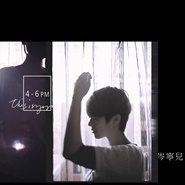

4-6 pm
============================

|  |  |
| :--: | :-- |
| [ 4-6 pm](https://emumo.xiami.com/album/463796) | **艺人**: [岑宁儿](../index.md) **语种**: 国语 **唱片公司**: 东亚唱片 **发行时间**: 2011年09月14日 **专辑类别**: EP, 单曲 **专辑风格**: 国语流行 Mandarin Pop **播放数**: 524698 **收藏数**: 804 **评论数**: 107  |

## 简介

以往只能重复点击她的作品  
留住她天籁般的独特嗓音  
现在，我们终于可以开始悉心珍藏…  
  
<strong>岑宁儿 Yoyo Sham 『4-6 PM』</strong>  
有着一头俏丽短发，皮肤很白、个子很高，笑声十分爽朗的岑宁儿，大家习惯称她Yoyo，天生拥有一副好嗓音，一开口就能吸引全场注目，令人不得不跟她一起投入在她的音乐世界里，在这瞬间，就算万物止息，光她的声音就足够美好了。  
  
长久以来，Yoyo在 StreetVoice 认真经营着属于自己的音乐天地，从不吝惜的和大家分享她的作品，无论是自己一手包办词曲创作与弹唱的歌，或是翻唱的经典曲目，首首都让人回味无穷，不断的Repeat。听似洒脱却涵着许多内敛情感的声音表情，是她一贯的特色，有时觉得她象是一个诗人恣意吟唱着，有时又觉得她更像一个说故事的人，用着独特的口吻唱出了心里、眼里的一切，令人感同身受，试图在她的歌声中找到慰藉。由于Yoyo如此的特别，在StreetVoice早已累积了一群死忠歌迷，随时随地的关注着她的消息，每每放上新作品，点阅率总是高居不下，多少人因着她的歌入眠、多少人因着她的歌失眠。几次来台湾的演出：海边的卡夫卡、河岸留言、简单生活节等，更是让许多人眼睛为之一亮，纷纷打探这个美丽的声音，她动人的嗓音顺理成章的收服了许多严厉刻薄的耳朵，这就是我们期待已久的岑宁儿。  
  
总能在网站的自我介绍中，看到Yoyo写的这句「认真地做喜欢的事」，短短几个字，就可以感受到这位女生对自己的负责与勇敢，虽然生活忙碌，但是却忙得很有意思，这些让她甘之如饴的事包括了：和音演出、编写、录音，以及唱自己的歌、写歌给自己唱。每一件她喜欢做的事都必定全力以赴，即使是担纲众歌手的演唱会和声和一些音乐作品的编写、录制之外，不忘为自己想做的音乐及演出而努力，除了持续在网络上发表作品，甚至是自制手工EP，也和朋友一起练团、表演，在这之前，更曾和朋友组成 A cappella 纯人声团体，用最纯粹的声音传达最直接的音乐态度，找回最单纯的感动，对于“声音”，她总深深着迷。  
  
除此之外，Yoyo也热爱摄影，随着工作前往世界各地旅居，留下了许多十分有味道的照片，构图随性不失细腻，特别能抓住当下的氛围，透过这些照片，可以想象得到Yoyo对于生命的体验和对生活周遭的观察，有着她独特的诠释，那是一种活着的流动感，也许就像她对音乐的热情一般，源源不绝。这次的EP设计，即用了不少Yoyo拍摄的照片，不仅令整张EP的音乐可以跟影像结合得更美好，更让歌迷可以完整的收藏所有Yoyo的一切、了解Yoyo。同时也放入了同样也是香港优秀音乐人–卢凯彤的摄影作品，由于Yoyo和卢凯彤一同担任演唱会乐手时建立了好情谊，卢凯彤不久前也发行了个人摄影集，因此在巡回时，Yoyo特地情商卢凯彤为这张EP操刀拍摄，由兼俱音乐人与摄影师身份的角度捕捉最真实的Yoyo，让这张EP的视觉增添了更多可看性。  
  
有人说，她的歌适合在每天的 4-6 PM 聆听  
那是一段奇幻而美丽的时段  
如同她的歌声、她的音乐  
总是令人惊艳不已  
  
<strong>首张个人单曲 『4-6 PM』。</strong>  
。打破窠臼 与乐手同步录音 挑战自我。  
万众期待已久的首张单曲，终于要正式和大家见面了，这次邀请了–奇哥老师担纲制作人，从编曲到录音，Yoyo都亲自和大家一而再再而三的反覆讨论，可见她对于首张作品的谨慎与用心。  
  
也许是受到截至目前为止的人生经验影响，Yoyo的作品一向很有个人风格和自己的主张，所收录的三首单曲，词曲全出于自己手笔，记录了在她穿梭各城市的风景、体会许多生命奥义后的心情，不局限于小情小爱，而是以一种乘而上的态度在感知自己的一切、这个世界，面对真实的自己，那些在人生中来回交错的历程，反覆遗失、找回、重置、启动。如同经常令人感到沮丧挫败的表象，却能感受到重生的力量，乍听之下也许多了点轻描淡写的陈述口吻，实则满溢了高涨的温度，令人难以忘怀。  
  
这次的编曲及录音，采用了同步进行的方式：Yoyo在录音室里和制作人及乐手老师们讨论出歌曲想要呈现的气氛后，特别在录音前花了许多时间练团，在反覆的团练中也自然的撞出新的火花！编曲也是在这种练团模式时慢慢成型。由于同步录音十分考验乐手的默契，希望录音时能一气呵成，所以录音前的准备功课着实让大家花了许多工夫。之所以会产生这样的想法，是因为希望能在这样的模式之下，原汁原味的表现乐句最自然的呼吸起伏，打造一种Live感。在Live演出时，更可以重现录音时的风貌，让每个人都玩得很愉快，而歌迷即使是回家听CD时，还能感受到Live的亲临感！  
  
暖身推荐主打「Mask」，Yoyo尝试了几乎是清唱的方式表现，搭配自己弹的吉它，同样也是同步录音，因此面对要完美展露嗓音又得兼顾吉它弹奏，让Yoyo产生了不小的压力，不过最后表现十分专业，成果令人十分满意。在只有简单吉它伴奏之下，突显了Vocal的魅力，声音的表现无所遁形，更是让听众清楚听见歌唱实力的机会，对歌手而言是个很大的挑战，但这也是Yoyo最重要的优势与特质，主动为自己打造了一张具有可看性的「名片」，来让所有人认识她。  
  
而首波强力主打「没故事的人」，意境很美，背后的故事更美，虽然歌名是「没故事的人」，意义则是因为在转换不同城市时，到了一个新地方，便将上个城市的故事和自己遗留在当下了，游离之后，最后剩下没故事的人。在这层故事涵义之下，Yoyo选择了收录大量的城市环境音，象是车声、街道嘈杂声等，堆栈出一个符合故事情境的氛围。包括所有的乐器，也是以此基调为主，随之个人对于城市流转的意念，编奏出一个个独特的音符，令人很快的进入这首歌的情绪，更加贴切了EP名称『4-6 PM』的想象。  
  
仅仅是三首歌的EP，却是诚意十足，浓缩了现阶段Yoyo的音乐旅程，也开启了她在台湾新的音乐生命，为台湾乐坛带来难能可贵的好声音。

## 曲目

## 评论

|  |  |  |  |
| :-- | :-- | :-- | :-- |
|  [虾米用户](https://emumo.xiami.com/u/3890206) 那些殺死你的都並不致命 2017-10-28 00:10 赞(0) 踩(0) | 
岑寧兒Yoyo Sham [4-6pm]演出訊息（台灣）10/05(三) 20:00 誠品敦南音樂館10/08(六) 20:00 台中Forro Coffe10/19(三) 20:00 台北 Legacy 傳11/04(五) 20:00 誠品天母忠誠店11/13(日) 15:00 誠品台中園道店3樓文學書區
 |
|  [虾米用户](https://emumo.xiami.com/u/34131579) 是旧日子 2017-10-27 23:58 赞(1) 踩(0) | 
侧脸好像鹿晗哈哈哈哈
 |
| ⇒ |  [虾米用户](https://emumo.xiami.com/u/373008960)  2018-10-07 01:12 赞(0) 踩(0) | 
打你哦哈哈哈哈
 |
| ⇒ |  [虾米用户](https://emumo.xiami.com/u/34131579) 是旧日子 2018-10-07 01:13 赞(0) 踩(0) | 
<q><b>田中小百合说：</b></q>
 |
| ⇒ |  [虾米用户](https://emumo.xiami.com/u/373008960)  2018-10-07 01:17 赞(0) 踩(0) | 
<q><b>其实没有解药说：</b></q>
 |
| ⇒ |  [虾米用户](https://emumo.xiami.com/u/34131579) 是旧日子 2018-10-26 15:38 赞(0) 踩(0) | 
<q><b>田中小百合说：</b></q>
 |
|  [虾米用户](https://emumo.xiami.com/u/2141441) 我还没想好要写什么... 2015-07-07 02:10 赞(1) 踩(0) | 
我爱你
 |
|  [虾米用户](https://emumo.xiami.com/u/3549954)  2015-06-13 00:24 赞(0) 踩(0) | 
现在很烦这种很花的唱法
 |
|  [虾米用户](https://emumo.xiami.com/u/11157355) 榕树长青 2015-04-29 23:13 赞(0) 踩(0) | 
好资源！
 |
|  [虾米用户](https://emumo.xiami.com/u/8444695)  2015-04-09 21:48 赞(1) 踩(0) | 
mask这首歌，听起来很舒服，但是泄露了天蝎座的本性啊！！
 |
|  [虾米用户](https://emumo.xiami.com/u/763459) (๑•̀ㅁ•́ฅ)嗷呜 2015-02-18 15:55 赞(0) 踩(0) | 
确定不是鹿晗？点开大图还是好像。。
 |
|  [虾米用户](https://emumo.xiami.com/u/11180501)  2015-01-18 13:50 赞(0) 踩(0) | 
猜谜
 |
|  [虾米用户](https://emumo.xiami.com/u/1445965)   2014-12-22 00:19 赞(0) 踩(0) | 
这好这舒服
 |
|  [虾米用户](https://emumo.xiami.com/u/3702830) 一片自由的乐土 2014-10-30 20:23 赞(0) 踩(0) | 
最喜欢的声音，总之就是好听^_^
 |
|  [虾米用户](https://emumo.xiami.com/u/14051512) 我还没想好要写什么... 2014-09-04 10:11 赞(0) 踩(0) | 
舒服
 |
|  [虾米用户](https://emumo.xiami.com/u/16793014)  2014-08-28 14:51 赞(0) 踩(0) | 
因为Eason认识你 声音无可挑剔 伴奏更是赞！
 |
|  [虾米用户](https://emumo.xiami.com/u/34555105) 我想只是旅客 2014-05-02 08:53 赞(0) 踩(0) | 
音色很舒服，放松的时候听感觉不错
 |
|  [虾米用户](https://emumo.xiami.com/u/1882463) 我还没想好要写什么... 2014-03-01 10:03 赞(0) 踩(0) | 
简单的吉他伴奏和干净的声音，一听便爱上。
 |
|  [虾米用户](https://emumo.xiami.com/u/20747916)  2013-11-11 14:43 赞(0) 踩(0) | 
她声音好性感，完全把持不住！ &amp;lt;3
 |
|  [虾米用户](https://emumo.xiami.com/u/9919801) cx5115 2013-09-21 10:01 赞(0) 踩(0) | 
纯
 |
|  [虾米用户](https://emumo.xiami.com/u/9519349) 愛與不愛已無所謂。 2013-09-05 09:47 赞(0) 踩(0) | 
清新獨特風格的歌手...沒故事的人太有意境了
 |
|  [虾米用户](https://emumo.xiami.com/u/11574052) 元気 2013-08-20 23:05 赞(0) 踩(0) | 
声音好听
 |
|  [虾米用户](https://emumo.xiami.com/u/11708833)  2013-07-30 13:57 赞(0) 踩(0) | 
舒缓
 |
|  [虾米用户](https://emumo.xiami.com/u/2148649) 当我开始爱自己 2013-06-01 16:18 赞(0) 踩(0) | 
声音很吸引我~
 |
|  [虾米用户](https://emumo.xiami.com/u/14047348)  2013-05-20 00:01 赞(0) 踩(0) | 
适合阿卡贝拉的嗓子！我的菜！:-$
 |
|  [虾米用户](https://emumo.xiami.com/u/2527832) 超越生命 解放自由 2013-03-05 15:27 赞(0) 踩(0) | 
這是你喜歡的嗎?旋律動聽,歌聲很知性
 |
|  [虾米用户](https://emumo.xiami.com/u/1330468)   2013-01-04 22:56 赞(0) 踩(0) | 
我们不用很麻烦很累 就可以成佛
 |
|  [虾米用户](https://emumo.xiami.com/u/6988507)  2012-11-06 15:17 赞(0) 踩(0) | 
[话筒]好听的声音
 |
|  [虾米用户](https://emumo.xiami.com/u/11064903)   2012-10-15 09:26 赞(0) 踩(0) | 
一听到就会被吸住的声音
 |
|  [虾米用户](https://emumo.xiami.com/u/1441057)  2012-09-14 00:03 赞(0) 踩(0) | 
很多人都觉的，岑宁儿的声音很像王若琳。个人认为，岑宁儿更适合一个人听
 |
|  [虾米用户](https://emumo.xiami.com/u/2727482) 番茄好吃么 2012-07-28 01:05 赞(0) 踩(0) | 
lum距 系禁多！
 |
|  [虾米用户](https://emumo.xiami.com/u/2394041)  2012-05-29 11:14 赞(0) 踩(0) | 
哇……
 |
|  [虾米用户](https://emumo.xiami.com/u/6362734)   2012-05-24 00:43 赞(0) 踩(0) | 
好听
 |
|  [虾米用户](https://emumo.xiami.com/u/7295317)  2012-05-21 14:45 赞(0) 踩(0) | 
好声音，人才啊！
 |
|  [虾米用户](https://emumo.xiami.com/u/4085635) 想要清醒可我从未fall... 2012-03-09 21:20 赞(0) 踩(0) | 
声音让人入迷，完全沉醉~
 |
|  [虾米用户](https://emumo.xiami.com/u/1428036)  2012-03-04 22:46 赞(0) 踩(0) | 
。
 |
|  [虾米用户](https://emumo.xiami.com/u/2361171) 音乐响起.又是美好的一天 2012-02-08 21:33 赞(0) 踩(0) | 
必须 收藏!~
 |
|  [虾米用户](https://emumo.xiami.com/u/660663)  2012-01-29 08:28 赞(0) 踩(0) | 
好听 从eason的duo就喜欢上她了
 |
|  [虾米用户](https://emumo.xiami.com/u/108721)  2012-01-10 14:49 赞(0) 踩(0) | 
10分喜欢
 |
|  [虾米用户](https://emumo.xiami.com/u/3845) 音乐就如男人，必需品！ 2012-01-04 10:20 赞(0) 踩(0) | 
岑宁儿，2011年我最惊喜滴女声发现！
 |
| ⇒ |  [虾米用户](https://emumo.xiami.com/u/7295317)  2012-05-21 14:47 赞(0) 踩(0) | 
绝对是好声音啊，值得惊艳！
 |
|  [虾米用户](https://emumo.xiami.com/u/652381) 想要逃離秩序。 2011-12-31 15:50 赞(0) 踩(0) | 
舒服 特别
 |
|  [虾米用户](https://emumo.xiami.com/u/3779453)  2011-12-09 20:27 赞(0) 踩(0) | 
就喜欢
 |
|  [虾米用户](https://emumo.xiami.com/u/2724071)   2011-12-09 00:51 赞(0) 踩(0) | 
我其实喜欢她的词儿多于旋律！赞
 |
|  [虾米用户](https://emumo.xiami.com/u/4479690)  2011-11-30 19:39 赞(0) 踩(0) | 
4-6 PM
 |
|  [虾米用户](https://emumo.xiami.com/u/24743)  2011-11-19 12:02 赞(0) 踩(0) | 
yoyo的声音抗拒不了
 |
|  [虾米用户](https://emumo.xiami.com/u/111193) 微信号toogo1 2011-11-18 15:45 赞(0) 踩(0) | 
我不懂
 |
|  [虾米用户](https://emumo.xiami.com/u/1207263)  2011-11-10 12:34 赞(0) 踩(0) | 
被baby song惊艳 香港才人好多啊！
 |
|  [虾米用户](https://emumo.xiami.com/u/506984)  2011-11-07 01:16 赞(0) 踩(0) | 
要知道真的多爱你，girl...
 |
|  [虾米用户](https://emumo.xiami.com/u/6224193)  2011-11-01 10:50 赞(0) 踩(0) | 
很迷人的声音！
 |
|  [虾米用户](https://emumo.xiami.com/u/5993022)  2011-10-28 04:39 赞(0) 踩(0) | 
你听到了吗， 她在唱歌
 |
|  [虾米用户](https://emumo.xiami.com/u/5993022)  2011-10-28 04:37 赞(0) 踩(0) | 
我到底是有多喜欢抱吉他的女生
 |
|  [虾米用户](https://emumo.xiami.com/u/5993022)  2011-10-28 04:34 赞(0) 踩(0) | 
吉他吉他~淡淡地就走到心里去了
 |
|  [虾米用户](https://emumo.xiami.com/u/151538)  2011-10-27 11:07 赞(0) 踩(0) | 
看好你，爸妈都牛b啊～～ <a href="http://site.douban.com/thisisyoyo/" target="_blank" rel="nofollow noreferrer noopener">http://site.douban.com/thisisyoyo/</a>
 |
|  [虾米用户](https://emumo.xiami.com/u/6168109)  2011-10-08 23:10 赞(0) 踩(0) | 
粗嗓子的孙燕姿……
 |
|  [虾米用户](https://emumo.xiami.com/u/5201278)  2011-10-07 22:40 赞(0) 踩(0) | 
     
 |
|  [虾米用户](https://emumo.xiami.com/u/5201278)  2011-10-07 22:40 赞(0) 踩(0) | 
     
 |
|  [虾米用户](https://emumo.xiami.com/u/6061083)  2011-10-07 22:38 赞(0) 踩(0) | 
啱聽到不得了！
 |
|  [虾米用户](https://emumo.xiami.com/u/3131021)  2011-10-04 20:04 赞(0) 踩(0) | 
被迷住了
 |
|  [虾米用户](https://emumo.xiami.com/u/2033385)  2011-10-04 15:01 赞(0) 踩(0) | 
虽然都听过，支持支持！！！！！
 |
|  [虾米用户](https://emumo.xiami.com/u/3219295)  2011-10-01 20:58 赞(0) 踩(0) | 
听过没
 |
|  [虾米用户](https://emumo.xiami.com/u/5816149)  2011-10-01 04:22 赞(0) 踩(0) | 
香港今年很难的的一把声音，三首歌的ep足以让人惊艳一番
 |
|  [虾米用户](https://emumo.xiami.com/u/5970784)  2011-09-29 14:50 赞(0) 踩(0) | 
第一句就被吸引
 |
|  [虾米用户](https://emumo.xiami.com/u/4795834)  2011-09-28 16:47 赞(0) 踩(0) | 
这个应该是新人吧？真的很不错！！！声音舒服，曲子也安逸，就是歌太少了！！
 |
|  [虾米用户](https://emumo.xiami.com/u/2873465)  2011-09-28 15:52 赞(0) 踩(0) | 
有点小惊艳~~~
 |
|  [虾米用户](https://emumo.xiami.com/u/2032732)   2011-09-28 10:24 赞(0) 踩(0) | 
好安静的声音，很喜欢。。。。
 |
|  [虾米用户](https://emumo.xiami.com/u/3953700)  2011-09-27 23:34 赞(0) 踩(0) | 
好嗓音。赞编曲。
 |
|  [虾米用户](https://emumo.xiami.com/u/354157)  2011-09-26 22:41 赞(0) 踩(0) | 
终于。。。抓住了耳朵。
 |
|  [虾米用户](https://emumo.xiami.com/u/3117389)  2011-09-26 21:59 赞(0) 踩(0) | 
棒
 |
|  [虾米用户](https://emumo.xiami.com/u/2447365)  2011-09-25 21:53 赞(0) 踩(0) | 
好声音！
 |
|  [虾米用户](https://emumo.xiami.com/u/2447365)  2011-09-25 21:50 赞(0) 踩(0) | 
好声音
 |
|  [虾米用户](https://emumo.xiami.com/u/2196355)  2011-09-23 20:49 赞(0) 踩(0) | 
終於有喇！！哇哈哈哈！
 |
|  [虾米用户](https://emumo.xiami.com/u/2125185)  2011-09-21 20:11 赞(0) 踩(0) | 
终于终于！！
 |
|  [虾米用户](https://emumo.xiami.com/u/2125185)  2011-09-21 20:10 赞(0) 踩(0) | 
终于！！
 |
|  [虾米用户](https://emumo.xiami.com/u/5898328)  2011-09-20 13:32 赞(0) 踩(0) | 
終於，
 |
|  [虾米用户](https://emumo.xiami.com/u/5885109)  2011-09-20 10:24 赞(0) 踩(0) | 
喜欢
 |
|  [虾米用户](https://emumo.xiami.com/u/1282316)   2011-09-19 16:48 赞(0) 踩(0) | 
短发妞~~好好听！
 |
|  [虾米用户](https://emumo.xiami.com/u/245653) 我还没想好要写什么... 2011-09-19 09:46 赞(0) 踩(0) | 
岑寧兒，令人心碎的歌声~
 |
|  [虾米用户](https://emumo.xiami.com/u/4769291)  2011-09-18 22:01 赞(0) 踩(0) | 
在EASON的演唱会上听到她的声音的 现在能听到她自己的歌了 赞一个
 |
|  [虾米用户](https://emumo.xiami.com/u/3861810)  2011-09-18 13:18 赞(0) 踩(0) | 
喜欢的风格
 |
|  [虾米用户](https://emumo.xiami.com/u/1211612)  2011-09-18 10:53 赞(0) 踩(0) | 
十分好听！
 |
|  [虾米用户](https://emumo.xiami.com/u/5816149)  2011-09-18 00:10 赞(0) 踩(0) | 
有味道的声音
 |
|  [虾米用户](https://emumo.xiami.com/u/192530)  2011-09-17 16:14 赞(0) 踩(0) | 
总是对声音小沙哑的女声抗拒不了。而且岑宁儿的高音在收尾的时候还有点小抖，这种处理方式特别像莫文蔚。
 |
| ⇒ |  [虾米用户](https://emumo.xiami.com/u/157601)  2011-09-18 11:01 赞(0) 踩(0) | 
ME TOO!!!!!!!
 |
|  [虾米用户](https://emumo.xiami.com/u/1808278) 我还没想好要写什么... 2011-09-17 07:19 赞(0) 踩(0) | 
关注了很久的 ~
 |
|  [虾米用户](https://emumo.xiami.com/u/1808278) 我还没想好要写什么... 2011-09-17 07:17 赞(0) 踩(0) | 
哟兮~在街声 认识的她~哈哈 终于出了属于自己的 专！加油
 |
|  [虾米用户](https://emumo.xiami.com/u/655531) 我还没想好要写什么... 2011-09-16 18:51 赞(0) 踩(0) | 
喜欢
 |
|  [虾米用户](https://emumo.xiami.com/u/3486539)  2011-09-16 16:49 赞(0) 踩(0) | 
好嗓音。
 |
|  [虾米用户](https://emumo.xiami.com/u/3216244)  2011-09-16 11:22 赞(0) 踩(0) | 
好听的嗓音，惊艳！
 |
|  [虾米用户](https://emumo.xiami.com/u/3393023)  2011-09-16 11:14 赞(0) 踩(0) | 
很美的聲音...
 |
|  [虾米用户](https://emumo.xiami.com/u/550576) 我还没想好要写什么... 2011-09-16 10:13 赞(0) 踩(0) | 
终于
 |
|  [虾米用户](https://emumo.xiami.com/u/805092)   2011-09-16 00:20 赞(0) 踩(0) | 
在豆瓣上关注很久了，强烈推荐的女声~
 |
|  [虾米用户](https://emumo.xiami.com/u/847662)  2011-09-15 22:41 赞(0) 踩(0) | 
不一样的音乐！
 |
|  [虾米用户](https://emumo.xiami.com/u/1602997)  2011-09-15 21:02 赞(0) 踩(0) | 
超喜欢啊，宁儿赶紧出专辑吧
 |
|  [虾米用户](https://emumo.xiami.com/u/1602997)  2011-09-15 21:02 赞(0) 踩(0) | 
超喜欢啊，宁儿赶紧出专辑吧
 |
|  [虾米用户](https://emumo.xiami.com/u/1602997)  2011-09-15 21:02 赞(0) 踩(0) | 
超喜欢啊，宁儿赶紧出专辑吧
 |
|  [虾米用户](https://emumo.xiami.com/u/3386525)  2011-09-15 19:47 赞(0) 踩(0) | 
推介哩個女聲，睇開容祖兒同E神演唱會的同學因該不會不熟悉！！在兩年前就已經關注距，家下終於有專輯！！！
 |
|  [虾米用户](https://emumo.xiami.com/u/5058872)   2011-09-15 19:42 赞(0) 踩(0) | 
终于等到ep了
 |
|  [虾米用户](https://emumo.xiami.com/u/1320657)  2011-09-15 19:06 赞(0) 踩(0) | 
爱死了！！！！！！！！！！！！！！
 |
|  [虾米用户](https://emumo.xiami.com/u/769171)   2011-09-15 18:59 赞(0) 踩(0) | 
<a href="http://www.xiami.com/group/44804" target="_blank" rel="nofollow noreferrer noopener">http://www.xiami.com/group/44804</a> 欢迎加入岑宁儿虾米小组哦！
 |
|  [虾米用户](https://emumo.xiami.com/u/535973)  2011-09-15 17:51 赞(0) 踩(0) | 
無法抗拒
 |
|  [虾米用户](https://emumo.xiami.com/u/535973)  2011-09-15 17:45 赞(0) 踩(0) | 
萬分驚喜！第一時間分享俾各位欣賞岑寧兒嘅朋友！
 |
| ⇒ |  [虾米用户](https://emumo.xiami.com/u/769171)   2011-09-15 18:53 赞(0) 踩(0) | 
3q~
 |
|  [虾米用户](https://emumo.xiami.com/u/5758170)  2011-09-15 09:28 赞(0) 踩(0) | 
wanna check it out~
 |
|  [虾米用户](https://emumo.xiami.com/u/1604346) 再見 2011-09-08 21:54 赞(0) 踩(0) | 
wow！
 |
|  [虾米用户](https://emumo.xiami.com/u/3420181)  2011-09-07 12:01 赞(0) 踩(0) | 
谁有啊。。。。喵。。。
 |
|  [虾米用户](https://emumo.xiami.com/u/1574587) 写了简介你也未必可以了解... 2011-09-06 17:35 赞(0) 踩(0) | 
嘿，yoyo！
 |
