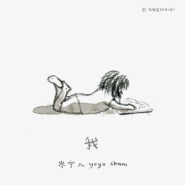

我
============================

|  |  |
| :--: | :-- |
| [ 我](https://emumo.xiami.com/album/5021167701) | **艺人**: [岑宁儿](../index.md) **语种**: 国语 **唱片公司**: StreetVoice, 如此 **发行时间**: 2020年08月06日 **专辑类别**: EP, 单曲 **专辑风格**: 国语流行 Mandarin Pop **播放数**: 565541 **收藏数**: 26 **评论数**: 12  |

## 简介

关于自己的种种念头，总有好多答案。一个简单的我，穿过无数双眼睛，折射成各种颜色。哪一个最像我？我是黑夜里肆意绽放的烟火，还是急速坠落的烟灰，归于黯淡的时候，有谁愿意和我分享我？我站在一个满是镜子的房间，期盼所有的可能，迷惘所有的假装，最难拆穿的，是那个和自己长得一模一样的人。

 

她正对着的其中一面镜子，一个熟悉的小女孩，从镜子深处浮现。她们逐步靠近，依偎着对方。当她对着那个小女孩诚挚歌唱，她们变成了同一个人，拥抱着彼此。昨日的她，今天的她，孩子般天真大笑的她，成熟了些、多了点疤痕的她。此刻她们看起来一样自在、信心满满，不再害怕自己格格不入，不因为和别人不一样而受伤。

 

歌里的吉他和弦乐，像一双温暖的大手，将碎玻璃般的失语悲伤，从飘忽的空气中，接回到一个适切的位置安放。最特别的平凡，最平凡的特别，是能够好好地成为自己就足够了。像一朵珍稀的玫瑰，坦然盛开于沙漠，像天空里什么都没有，却从不质疑自己的宽阔。

 

## 曲目

## 评论

|  |  |  |  |
| :-- | :-- | :-- | :-- |
|  [虾米用户](https://emumo.xiami.com/u/342134803)  2020-09-05 18:32 赞(1) 踩(0) | 
“最荣幸是 谁都是造物者的光荣”
 |
|  [虾米用户](https://emumo.xiami.com/u/326736380) 音乐让我的世界由黑白变成... 2020-08-12 14:11 赞(2) 踩(0) | 
可以循环一万遍
 |
|  [虾米用户](https://emumo.xiami.com/u/8855895)  2020-08-07 23:19 赞(1) 踩(0) | 
用吉他与独特的音调演绎岑宁儿的那首“我”，一份新声代心中的“我”。听着蛮舒服，放松我的心情
 |
|  [虾米用户](https://emumo.xiami.com/u/444438340)  2020-08-07 15:18 赞(2) 踩(0) | 
喜欢我是我 
 |
|  [虾米用户](https://emumo.xiami.com/u/349339882) 后荣迷。努力学习中。 2020-08-07 10:24 赞(2) 踩(0) | 
我永远都爱这样的我~
 |
|  [虾米用户](https://emumo.xiami.com/u/218378303) 静 2020-08-07 09:49 赞(4) 踩(0) | 
Leslie你是否能相信，16年之后还会有人翻唱你的歌。还翻唱得那么好听。
 |
|  [虾米用户](https://emumo.xiami.com/u/430703953) 我还没想好要写什么... 2020-08-07 02:38 赞(1) 踩(0) | 
❤️谢谢你好听的声音
 |
|  [虾米用户](https://emumo.xiami.com/u/30321995) 谢谢你, 给过我答案. ... 2020-08-06 23:25 赞(1) 踩(0) | 
前奏的人声与吉他就像在对话，听到正歌部分发现，哇原来是这首歌！有意思。
 |
|  [虾米用户](https://emumo.xiami.com/u/47494497) 李志、陈升，“虾米也没有... 2020-08-06 19:43 赞(1) 踩(0) | 
你还要好好唱下去
 |
|  [虾米用户](https://emumo.xiami.com/u/12293200) 定破依执，渡人自渡，善源... 2020-08-06 19:03 赞(1) 踩(0) | 
我不是我，我是什么样的我你决定
 |
|  [虾米用户](https://emumo.xiami.com/u/113476928) 饮和食德 2020-08-06 17:54 赞(2) 踩(0) | 
坚定温柔。
 |
|  [虾米用户](https://emumo.xiami.com/u/49656461)   2020-08-06 15:19 赞(1) 踩(0) | 
！
 |
