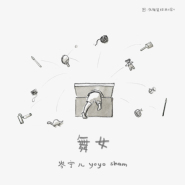

舞女
============================

|  |  |
| :--: | :-- |
| [ 舞女](https://emumo.xiami.com/album/5021200921) | **艺人**: [岑宁儿](../index.md) **语种**: 国语 **唱片公司**: StreetVoice, 如此 **发行时间**: 2020年08月19日 **专辑类别**: EP, 单曲 **专辑风格**: 国语流行 Mandarin Pop **播放数**: 58940 **收藏数**: 21 **评论数**: 5  |

## 简介

这首当年由罗大佑创作演唱，献给其舞蹈家挚友罗曼菲的情深之作，透过yoyo的歌声，多了一份不谙世事的纯真。年久失修的机械发条，梦醒一般开始转动。故事的序幕缓缓拉起，装满儿时回忆的抽屉里，写过的纸条，褪色的画，违抗着地心引力，飘浮在不断旋转的天幕之中。八音盒的声响，或许如今听来，有些笨拙傻气，像排路队，一颗音跟着另一颗音，一段音阶接着下一段音阶，令人联想到法国画家Antoine Caron的《爱的葬礼》（Les Funérailles de l'Amour），赤裸的天使们欢欣成行，飞舞在一个怀表停止行走的奇幻时空。

 

沉睡在回忆中的人，像婴儿躺在摇篮里，她动也不动，眼睛却如此灵动好奇，打量着每一秒都在变幻的宇宙。细看她的手指，轻轻地数落节拍，一切显得单纯无比。当八音盒的声音，开始发瘪消气，不知名的童话故事，又翻飞到了下一个子夜。我们以身体侧转、穿梭于那些凭空出现又消失的妖精之群。怀念的梦翩然，一遍又一遍地重听，旋转的舞步，无始无终，三拍子的歌声，随着乐声澎湃，胸口的期待蓬松着、鼓动着，唱歌的人和听歌的人，都一起飞了起来。

 

## 曲目

## 评论

|  |  |  |
| :-- | :-- | :-- |
|  [虾米用户](https://emumo.xiami.com/u/8855895)  2020-09-01 19:01 赞(0) 踩(0) | 
音乐盒的神奇节奏与俏皮的歌声让一个翩翩起舞的音乐盒上小舞女萦绕在脑海中…
 |
|  [虾米用户](https://emumo.xiami.com/u/444164526)  2020-08-19 14:24 赞(1) 踩(0) | 
哇今天录的 
 |
|  [虾米用户](https://emumo.xiami.com/u/49656461)   2020-08-19 12:46 赞(0) 踩(0) | 
！
 |
|  [虾米用户](https://emumo.xiami.com/u/3553665) We can be He... 2020-08-19 12:10 赞(0) 踩(0) | 
♡
 |
|  [虾米用户](https://emumo.xiami.com/u/289687772)  2020-08-19 12:09 赞(0) 踩(0) | 

 |
