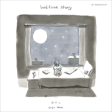

Bedtime Story
============================

|  |  |
| :--: | :-- |
| [ Bedtime Story](https://emumo.xiami.com/album/5021405401) | **艺人**: [岑宁儿](../index.md) **语种**: 国语 **唱片公司**: StreetVoice, 如此 **发行时间**: 2020年09月09日 **专辑类别**: EP, 单曲 **专辑风格**: 国语流行 Mandarin Pop **播放数**: 152988 **收藏数**: 280 **评论数**: 29  |

## 简介

最近世界有点奇怪，像聂鲁达的诗句：「海洋、船只与艳阳，都一起被放逐了」。我们逐渐习惯见面时，只看到彼此一半的脸，我们不再动不动就去公园野餐，不再大方亲吻彼此脸颊，不再站得很近、很近，口沫横飞地说着关于明天的计划。

 

无形的距离在我们之间，包围着我们的黑暗，彷佛意外的日蚀，它的出现，不在任何人预料之中，也破坏了我们对于黑夜过后，太阳总会升起的想象。未知充满了不确定性，过去美好的，停留在回忆里，而现在，yoyo岑宁儿的Mini Album《Bedtime Story》（床边故事）诞生于此时此刻——对某些人来说，a bad time，难以忍受之坏的时光。

 

长夜漫漫，我们仍想靠近梦，安心地依偎在温暖的怀抱里。《Bedtime Story》（床边故事）这张音乐作品，是yoyo对黑暗中的聆听者敞开的拥抱，也是她对所有深藏在大人心中的小孩们，非常诚挚的歌唱。在yoyo小时候，妈妈曾为她在睡前唱摇篮曲、说故事，儿时的她喜欢模仿妈妈说话，如今翻唱妈妈唱过的歌，别有意义。

 

Mini Album中收录的每一首作品，对yoyo来说，都有无可取代的回忆，强大而温柔的力量，在最需要安抚与陪伴的时刻，提醒着她，最重要的价值仍然存在，不因一时的遮蔽而消逝。这些耳熟能详的歌，经过重新编曲与制作，长成了最能表达yoyo感情的独特版本。

 

〈舞女〉中不停旋转的意象，让现实在手舞足蹈的旋律之中，变得奇幻而热情。〈我〉唱出了自信，鼓励自己与听众，仅是勇敢做一回真正的自己，也已经足够。〈常愿意〉令人感动不已，私密而亲昵，曾被捧在怀里呵护的心，如今也是能够守护他人的心。〈抱着你〉有最坚定的陪伴，若挫折在所难免，且相信风雨之中仍有烛光摇曳，穿过暗夜中的微光，我们还能探望着彼此的眼睛。

 

Mini Album发行前，yoyo在她的Facebook与Instagram上，以「Bedtime Story」为主题，连载了十集的床边故事直播。直播中，作为说书人的她，总捧着一本厚厚的故事书，书在她手中发光。那些有趣的、放松的、突如其来，却真实地在听众心中留下了什么的时光，彷佛这张音乐故事Mini Album的前传。也许最美好的安排，像每一回现场直播，像生命本身，永远无法预设准确的走向，但只要继续期待、继续冒险，见光的伤口会得到抚慰，故事的下一个篇章，一定会到来。

 

## 曲目

## 评论

|  |  |  |
| :-- | :-- | :-- |
|  [虾米用户](https://emumo.xiami.com/u/15526338) 来自宇宙深处的喵(^･ｪ... 2020-11-05 05:24 赞(0) 踩(0) | 
非常治愈，可以用在疗愈工作中的一张专辑
 |
|  [虾米用户](https://emumo.xiami.com/u/1549842)  2020-09-17 14:40 赞(1) 踩(0) | 
从《银发白》开始注意到她，之后关注她的歌，发现确是一位值得聆听的歌手。
 |
|  [虾米用户](https://emumo.xiami.com/u/553528) 我还没想好要写什么... 2020-09-15 00:06 赞(1) 踩(0) | 
晚安曲
 |
|  [虾米用户](https://emumo.xiami.com/u/14591053)  2020-09-11 22:46 赞(0) 踩(0) | 
加油啊  一看到我  就先听了
 |
|  [虾米用户](https://emumo.xiami.com/u/251780414) 蓝调,爵士,电子,咽嗓,... 2020-09-11 12:22 赞(1) 踩(0) | 
So graceful u produce this album, shares the warm d positive power at this 2020. Maybe too tough d sadness at these passing months,. We lost many our love d important  peoples. Maybe losing jobs, family, but We still trust love can heal the pain. Keep going ....... We can make a better tomorrow.
 |
|  [虾米用户](https://emumo.xiami.com/u/47673343) 起初不经意的你，和少年不... 2020-09-11 09:47 赞(0) 踩(0) | 
不错的翻唱的专辑，不太了解岑宁儿，以后可以多听一听这位女歌手的歌曲
 |
|  [虾米用户](https://emumo.xiami.com/u/271044601) 姐就是来听歌的。 2020-09-11 08:47 赞(1) 踩(0) | 
真好听！
 |
|  [虾米用户](https://emumo.xiami.com/u/321417284)  2020-09-11 07:21 赞(1) 踩(0) | 
好好听吖，可爱ớ ₃ờ
 |
|  [虾米用户](https://emumo.xiami.com/u/66823378)  2020-09-10 23:17 赞(0) 踩(0) | 

 |
|  [虾米用户](https://emumo.xiami.com/u/427324933)  2020-09-10 21:26 赞(1) 踩(0) | 
慢慢听，慢慢听，度过一段急躁的时光
 |
|  [虾米用户](https://emumo.xiami.com/u/430703953) 我还没想好要写什么... 2020-09-10 15:55 赞(1) 踩(0) | 
喜欢你声音的治愈力
 |
|  [虾米用户](https://emumo.xiami.com/u/2417432)  2020-09-10 14:11 赞(1) 踩(0) | 
好温柔，是给自己也是给妈妈的情书
 |
|  [虾米用户](https://emumo.xiami.com/u/330641651) 我还没想好要写什么... 2020-09-10 08:47 赞(1) 踩(0) | 
太暖了 眼睛流汗
 |
|  [虾米用户](https://emumo.xiami.com/u/267110104) 掌心因此多出一根刺，没有... 2020-09-09 22:28 赞(1) 踩(0) | 
赞！
 |
|  [虾米用户](https://emumo.xiami.com/u/34818689) 我还没想好要写什么... 2020-09-09 19:18 赞(0) 踩(0) | 
平静内心啊~
 |
|  [虾米用户](https://emumo.xiami.com/u/96051990)   2020-09-09 18:50 赞(1) 踩(0) | 
Yoyo巡演搞快点！
 |
|  [虾米用户](https://emumo.xiami.com/u/1549842)  2020-09-09 18:15 赞(0) 踩(0) | 
很不错！
 |
|  [虾米用户](https://emumo.xiami.com/u/5868749) 纵有疾风起，人生不言弃 2020-09-09 18:07 赞(0) 踩(0) | 
好棒，有故事有温度
 |
|  [虾米用户](https://emumo.xiami.com/u/15440308) 隐藏的小虾米 2020-09-09 16:42 赞(1) 踩(0) | 
谢谢宁儿带来夏日小尾巴的些许宁静～
 |
|  [虾米用户](https://emumo.xiami.com/u/195934428)  2020-09-09 16:40 赞(0) 踩(0) | 
温暖如风
 |
|  [虾米用户](https://emumo.xiami.com/u/226777345) 不求不妄，苦乐自当 2020-09-09 15:34 赞(0) 踩(0) | 
喜欢
 |
|  [虾米用户](https://emumo.xiami.com/u/2120953) 虾米难说再见，网易如约相... 2020-09-09 15:10 赞(2) 踩(0) | 
很温暖干净的声音，总能让我想到多年前的某个冬天，冷得刺骨，内心却无比温暖
 |
|  [虾米用户](https://emumo.xiami.com/u/289687772)  2020-09-09 14:57 赞(22) 踩(0) | 
呵呵，叫做趴床难免，有意思。感你未滚得就滚咯。
 |
| ⇒ |  [虾米用户](https://emumo.xiami.com/u/289687772)  2020-09-09 22:44 赞(0) 踩(0) | 
广东话，别想偏了
 |
|  [虾米用户](https://emumo.xiami.com/u/289687772)  2020-09-09 14:56 赞(2) 踩(0) | 
呵呵，叫做趴床难免，有意思。感你未滚得就滚咯。
 |
|  [虾米用户](https://emumo.xiami.com/u/346010126) 我很想记得可是我记不得 2020-09-09 12:57 赞(1) 踩(0) | 
出来了！
 |
|  [虾米用户](https://emumo.xiami.com/u/338436169) PSYCHO 2020-09-09 12:56 赞(0) 踩(0) | 
封面好看
 |
|  [虾米用户](https://emumo.xiami.com/u/74503210)  2020-09-09 12:11 赞(0) 踩(0) | 
好棒
 |
|  [虾米用户](https://emumo.xiami.com/u/270985501) 或到某天，忘掉几岁，终可... 2020-09-09 12:07 赞(0) 踩(0) | 
这一张专辑的第一个打分者和评论者。真的觉得很有意思，很动听，让人放松？
 |
