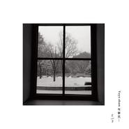

2/2二分之二
============================

|  |  |
| :--: | :-- |
| [ 2/2二分之二](https://emumo.xiami.com/album/514732) | **艺人**: [岑宁儿](../index.md) **语种**: 国语 **唱片公司**: 寰亚唱片 **发行时间**: 2012年05月18日 **专辑类别**: EP, 单曲 **专辑风格**: 独立流行 Indie Pop, 国语流行 Mandarin Pop **播放数**: 565867 **收藏数**: 704 **评论数**: 54  |

## 简介

一个值得注意的新声音： Yoyo Sham 岑宁儿  最新EP{ 2/2 } 
  

Yoyo Sham，岑宁儿。
 

因为喜欢唱歌，她开始写歌。
 

那是07年， 她把歌放上street voice，于是这些歌就像长了翅膀，开始旅行到许多地方；
 

她也开始在许多歌手的演唱会中担任和声，陈奕迅、林忆莲、方大同、蔡健雅…，而许多听众也在这些演唱会中遇见了她的声音。
 

2010年，为了认识更多做音乐的朋友，她搬来台湾，开始做着一场场的LIVE表演， 也开始思考着怎么把这些歌变成录音作品。
 

2011年，她录制了第一张EP{4-6pm}。没有任何广告预算，这张EP在港台两地都在两天内销售一空紧急再版。
 
  

许多人都鼓励她赶快发专辑，赶快站上大舞台。
 

但是Yoyo只是继续在street voice 上发表更多新的创作，继续在其它歌手的演唱会中担任和声，继续做更多自己的 LIVE表演，继续认识更多做音乐的朋友…
 
  

一首歌，跟一个唱歌的人一样，都需要时间去成长，去饱满。
 

每一次的表演中，音乐，和唱歌的人，都会再更长大一点，有更清楚一点的个性和形状。
 

Yoyo选择这样有点简单，却又有点固执的步调。就像一个农夫相信蔬果要经过四季自然有机的长大，才会健康又营养。
 
  

2012年，Yoyo录制了第二张EP{ 2/2 }。
 
  

一首歌。两种版本。 一张EP，两种LIVE。
 

对这个世界不同的观点，使我们成为不同的人。
 
  

比起上一张EP的单纯原音，这一张添加了更细腻的想象和变化。
 

{ 2/2 }，说的是看事情的不同观点。
 

这张EP有两首歌，每首歌有两个版本，当我们用不同的观点去看同一件事情，就产生了不同的心情。
 
  

在这个充满各种主张的年代，她的歌，只是提供了一个中立的空间。
 

没有什么宣言，没有什么姿态，没有要谁跟随谁，
 

但，当然，她有她的观点。
 
  

在每一台电脑前，每个不同思想的我们，都可以坐下来，舒服的听一首歌，
 

听听也许相同，也许不同的观点，度过这舒服的五分钟 。
 

对你来说  她的声音    是半空？ 还是半满？
 

你也可以有自己的观点。

## 曲目

## 评论

|  |  |  |
| :-- | :-- | :-- |
|  [虾米用户](https://emumo.xiami.com/u/344026750) 我还没想好要写什么... 2018-11-07 01:39 赞(0) 踩(0) | 
❤️
 |
|  [虾米用户](https://emumo.xiami.com/u/80854916) 890年代港乐迷，林忆莲... 2017-10-30 09:55 赞(1) 踩(0) | 
又一个值得留意的才女。很用心制作的一张专辑，很明显可以感觉到歌手的态度和风格。歌曲皆可圈可点，值得推荐。四星。
 |
|  [虾米用户](https://emumo.xiami.com/u/52595654) 我还没想好要写什么... 2017-08-31 20:45 赞(0) 踩(0) | 
比较喜欢1/2Cup的编曲 治愈☼
 |
|  [虾米用户](https://emumo.xiami.com/u/7616503) 暂无签名~ 2014-08-14 00:20 赞(0) 踩(0) | 
昨晚在yoyo微博上看到有几首歌的demo可以付费下载，支持yoyo！！
 |
|  [虾米用户](https://emumo.xiami.com/u/7616503) 暂无签名~ 2014-08-14 00:18 赞(1) 踩(0) | 
完全被吸引了，不知不觉就爱了
 |
|  [虾米用户](https://emumo.xiami.com/u/4461490) 烟酒伤身，情歌伤心 2014-07-23 23:44 赞(2) 踩(0) | 
工作时可以一直循环放着她，完全不被打扰
 |
|  [虾米用户](https://emumo.xiami.com/u/37632143)  2014-07-16 00:59 赞(0) 踩(0) | 
好爱，第一次被惊艳是在《一生所爱》的live上，第二次是医生的演唱会今夜终于看见本名了.......
 |
|  [虾米用户](https://emumo.xiami.com/u/4275776) 虾米音质检测督查账号 2014-04-08 19:19 赞(1) 踩(0) | 
原盘压制合格320K，第三首频谱不佳为原盘所致。
 |
|  [虾米用户](https://emumo.xiami.com/u/1182761) 松任谷由实的迷弟 2013-03-30 19:32 赞(0) 踩(0) | 
EP比专辑更讨喜，简直是大势所趋了
 |
|  [虾米用户](https://emumo.xiami.com/u/1182761) 松任谷由实的迷弟 2013-03-30 19:27 赞(1) 踩(0) | 
这张EP简直是我的挚爱
 |
|  [虾米用户](https://emumo.xiami.com/u/8880870) 唔使讲了啩。。。 2013-03-17 05:52 赞(0) 踩(0) | 
也许现在这个女孩子没什么人懂！但是不知为什么，做作业这么累，听到这么美妙的声音。好美满！她叫yoyo，岑宁儿
 |
|  [虾米用户](https://emumo.xiami.com/u/8880870) 唔使讲了啩。。。 2013-03-17 05:43 赞(0) 踩(0) | 
也許現在這個女孩子沒甚麼人懂！但是不知為甚麼，做作業這麼累，聽到這麼美妙的聲音。好美滿！她叫yoyo
 |
|  [虾米用户](https://emumo.xiami.com/u/2527832) 超越生命 解放自由 2013-03-05 15:49 赞(1) 踩(0) | 
一首歌。两种版本。 一张EP，两种LIVE。 对这个世界不同的观点，使我们成为不同的人。
 |
|  [虾米用户](https://emumo.xiami.com/u/11848407)  2012-12-17 23:16 赞(0) 踩(0) | 
好好听，情不自禁喜欢上
 |
|  [虾米用户](https://emumo.xiami.com/u/4018270)  2012-10-08 17:26 赞(0) 踩(0) | 
好想看她的现场T.T
 |
|  [虾米用户](https://emumo.xiami.com/u/250378) 我还没想好要写什么... 2012-08-09 18:51 赞(0) 踩(0) | 
很钟意她
 |
|  [虾米用户](https://emumo.xiami.com/u/2063741) 我还没想好要写什么... 2012-07-14 18:19 赞(0) 踩(0) | 
非常好听啊！诠释得太棒了。编曲膜拜。
 |
|  [虾米用户](https://emumo.xiami.com/u/506984)  2012-07-06 15:24 赞(0) 踩(0) | 
一直很關注yoyio ~~~
 |
|  [虾米用户](https://emumo.xiami.com/u/2078234)  2012-06-26 21:13 赞(0) 踩(0) | 
好声音，好唱功，特色再鲜明点就完美了
 |
|  [虾米用户](https://emumo.xiami.com/u/1420881) 我还没想好要写什么... 2012-06-24 20:40 赞(0) 踩(0) | 
why does the sun go on shining~是的 最早被吸引就是从这里开始
 |
|  [虾米用户](https://emumo.xiami.com/u/1280507) 我还没想好要写什么... 2012-06-22 19:35 赞(0) 踩(0) | 
印象最深的当然是eason duo上面的34.The End Of The World拉~
 |
|  [虾米用户](https://emumo.xiami.com/u/42454) 活着就好 2012-06-10 22:13 赞(0) 踩(0) | 
当时和她一起认识的还有曲婉婷~然后~就没有然后了
 |
|  [虾米用户](https://emumo.xiami.com/u/5154043)   2012-06-06 19:32 赞(0) 踩(0) | 
挺好的嗓音和创作模式
 |
|  [虾米用户](https://emumo.xiami.com/u/8190783) 我还没想好要写什么... 2012-06-06 15:02 赞(0) 踩(0) | 
赞
 |
|  [虾米用户](https://emumo.xiami.com/u/4778406) 我还没想好要写什么... 2012-06-02 22:12 赞(0) 踩(0) | 
喜歡這種聲音質感
 |
|  [虾米用户](https://emumo.xiami.com/u/2727482) 番茄好吃么 2012-06-01 01:39 赞(0) 踩(0) | 
虽然每次都系ep 但系质量几高
 |
|  [虾米用户](https://emumo.xiami.com/u/221849) 不聽音樂會死星人 2012-06-01 01:12 赞(0) 踩(0) | 
在Eason DUO上發現的好聲音，久違了的華語Indie. 帶點實驗意味的EP, 是我可接受的範圍內的，最愛2/2 Cup, Yoyo的聲音中低音好正！！
 |
|  [虾米用户](https://emumo.xiami.com/u/1169390)  2012-05-31 20:15 赞(0) 踩(0) | 
继续热泪盈眶
 |
|  [虾米用户](https://emumo.xiami.com/u/7079265)  2012-05-28 09:55 赞(0) 踩(0) | 
脑残粉不解释。
 |
|  [虾米用户](https://emumo.xiami.com/u/547325)  2012-05-27 01:39 赞(0) 踩(0) | 
贊!⋯
 |
|  [虾米用户](https://emumo.xiami.com/u/3687)  2012-05-26 21:37 赞(0) 踩(0) | 
亚神的风格可真是统一 收
 |
|  [虾米用户](https://emumo.xiami.com/u/3386525)  2012-05-26 01:03 赞(0) 踩(0) | 
一級棒，五星推薦！
 |
|  [虾米用户](https://emumo.xiami.com/u/3152615)  2012-05-25 19:04 赞(0) 踩(0) | 
真的非常得好聽!!!!!!!!!!身心靈都在他的歌聲裡靜止下來
 |
|  [虾米用户](https://emumo.xiami.com/u/161112)  2012-05-25 00:54 赞(0) 踩(0) | 
qin, wanan
 |
|  [虾米用户](https://emumo.xiami.com/u/9270450)  2012-05-24 21:42 赞(0) 踩(0) | 
很有质感的声音下雨的时候听着有种寥落的乱感
 |
|  [虾米用户](https://emumo.xiami.com/u/1010909) 暂无签名~ 2012-05-24 13:00 赞(1) 踩(0) | 
岑宁儿的声音好抓耳 好不容易等到这张碟 比起2/2 cup 我更爱1/2 cup最后钢琴和鼓点的完美搭配
 |
|  [虾米用户](https://emumo.xiami.com/u/6517315)  2012-05-24 03:09 赞(0) 踩(0) | 
bu
 |
|  [虾米用户](https://emumo.xiami.com/u/5035495) 我还没想好要写什么... 2012-05-24 01:11 赞(0) 踩(0) | 
等了好久！！
 |
|  [虾米用户](https://emumo.xiami.com/u/137423)   2012-05-23 22:15 赞(0) 踩(0) | 
要在你还没火到人尽皆知之前 好好珍藏 嗯
 |
|  [虾米用户](https://emumo.xiami.com/u/5898328)  2012-05-23 19:47 赞(0) 踩(0) | 
治愈系.....
 |
|  [虾米用户](https://emumo.xiami.com/u/1010909) 暂无签名~ 2012-05-23 10:30 赞(0) 踩(0) | 
开心！！！
 |
|  [虾米用户](https://emumo.xiami.com/u/3745622) 暂无签名~ 2012-05-23 09:48 赞(0) 踩(0) | 
會唱的人很多，唯獨這聲音溫暖了我一個早上~
 |
|  [虾米用户](https://emumo.xiami.com/u/4282950) 一种生活习惯必须每日听歌... 2012-05-23 09:30 赞(0) 踩(0) | 
哇 yoyo~！！！
 |
|  [虾米用户](https://emumo.xiami.com/u/3129236) 我还没想好要写什么... 2012-05-23 00:38 赞(0) 踩(0) | 
yo!!!
 |
|  [虾米用户](https://emumo.xiami.com/u/5898328)  2012-05-22 22:06 赞(0) 踩(0) | 
yo绝对是精品
 |
|  [虾米用户](https://emumo.xiami.com/u/292218)  2012-05-22 19:49 赞(0) 踩(0) | 
不错
 |
|  [虾米用户](https://emumo.xiami.com/u/1205546) 温澜潮生 2012-05-22 18:46 赞(0) 踩(0) | 
她的声音 就是一把很好的乐器 她对音乐的态度 提醒我们保持我们纯粹
 |
|  [虾米用户](https://emumo.xiami.com/u/1205546) 温澜潮生 2012-05-22 18:46 赞(0) 踩(0) | 
她的声音 就是一把很好的乐器 她对音乐的态度 提醒我们保持我们纯粹 @有腹肌的鸡翼 她终于发布新专辑了
 |
|  [虾米用户](https://emumo.xiami.com/u/4133007)  2012-05-22 16:22 赞(0) 踩(0) | 
清冷
 |
|  [虾米用户](https://emumo.xiami.com/u/959483) 我还没想好要写什么... 2012-05-22 14:15 赞(0) 踩(0) | 
值得期待~~
 |
|  [虾米用户](https://emumo.xiami.com/u/959483) 我还没想好要写什么... 2012-05-22 14:12 赞(0) 踩(0) | 
很棒！！！！写的很有风格！！
 |
|  [虾米用户](https://emumo.xiami.com/u/769171)   2012-05-22 13:43 赞(0) 踩(0) | 
coool
 |
|  [虾米用户](https://emumo.xiami.com/u/812055) 二十二 2012-05-22 13:39 赞(0) 踩(0) | 
等到了~~
 |
|  [虾米用户](https://emumo.xiami.com/u/750489) 然后呢     一起走吧 2012-05-22 12:32 赞(0) 踩(0) | 
=￣ω￣=觉得声音沙哑了············
 |
