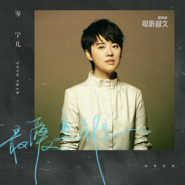
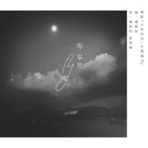
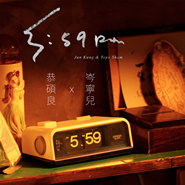
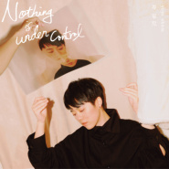
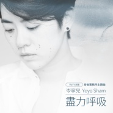
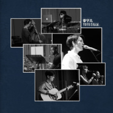
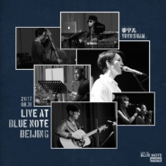
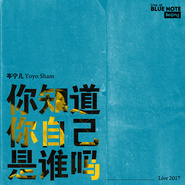
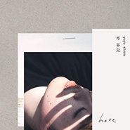
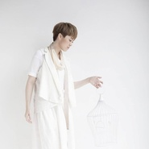

岑宁儿
============================

|  |  |
| :--: | :-- |
| [ 岑宁儿](https://i.xiami.com/thisisyoyo) | **地区**: 中国香港 Hong Kong **风格**: 粤语流行 Cantopop, 流行 Pop, 当代唱作人 Contemporary Singer-Songwriter **播放数**: 21151382 **粉丝数**: 19335 **评论数**: 422  |

## 档案

Yoyo岑宁儿，在香港出生长大，17 岁时前往多伦多求学。毕业后前往北京工作时认识了李宗盛，并在他的鼓励下开始弹吉他和写歌。2010年，Yoyo岑宁儿得到陈奕迅赏识，在其DUO演唱会上担任和声、并独唱〈The End of The World〉后，动人歌声开始为人所知。     2011年，Yoyo岑宁儿下定决心隻身赴台发展，拒绝所有主流及独立品牌的发片邀约，从一场又一场的小型演出中，经营自己与歌迷的关係。同年发行个人EP《4-6PM》，没有广告宣传下，港台首批铺货皆于两天内销售一空。2012年年中发行第二张EP《2/2》，年底即受邀在简单生活节中演出。     2014年，Yoyo 被香港 Time Out 杂志评选为「23位最受瞩目之香港音乐新浪潮」，更在「Project Wao-Women As One女生团结音乐节元年·香港站」上，受邀与林忆莲合唱〈问我〉，林忆莲介绍时亦说到Yoyo是「近年少有的好声音」。除了为陈奕迅、林忆莲、方大同、蔡健雅、容祖儿等天王天后担任演唱会和音，Yoyo近年也为热门电影《中国合伙人》、《单身男女2》献声。     听似洒脱却蕴涵著许多内敛情感的声音表情，是 Yoyo 一贯的特色，有时如诗人恣意吟唱著，有时更像一个说故事的人，用著独特的口吻唱出了心裡、眼裡的一切。2015年1月，首张个人专辑《here》在香港发行首日即Sold Out，创下香港唱片市场近年最惊人纪录，此张专辑不但被KKBOX及Hit Fm选为「2015年度十大专辑」，也让Yoyo接连入围2015第六届金音奖「海外创作音乐奖」、金曲奖「最佳新人」等奖项，更获得第十六届华语音乐传媒大奖「最佳国语女新人奖」、第十一届KKBOX风云榜「年度独立创作精神奖」及第9届城市至尊音乐榜「校园人气创作女歌手奖」等奖项。2017年演唱连续剧《夏至未至》插曲 (追光者) ，单曲下载高达3000万次，成为该年度华语最hit的歌曲， (追光者)亦获得网易云音乐硬地围炉夜年度影视单曲奖。     2018年11月发行个人第二张创作专辑《Nothing is Under Control》，发片数週旋即获得中港台传媒评为『年度十大专辑』、『年度不能错过的十二张华语专辑』、『20张最佳本地专辑选-第1首选』等肯定，同时于香港举办个人专场演唱会，接连两场演出门票皆在数小时之内完售。     2019年《Nothing is Under Control》连续入围第30届金曲奖 [最佳国语女歌手]  及  [最佳专辑製作人]、获得第3届唱工委音乐奖[最佳录音工程入围第10届金音创作奖   [海外创作音乐奖] 。

## 专辑

| 名称 | 语种 | 唱片公司 | 发行时间 | 专辑类别 | 专辑风格 |
| :--: | :-- | :-- | :-- | :-- | :-- |
| [ 我只在乎你《爱的广义相对论》「循环」主题曲](./albums/5021476171.md) | 国语 | StreetVoice, 如此 | 2020年09月24日 | 原声带, 影视音乐 | 原声 Soundtrack |
| [ Bedtime Story](./albums/5021405401.md) | 国语 | StreetVoice, 如此 | 2020年09月09日 | EP, 单曲 | 国语流行 Mandarin Pop |
| [ 抱着你](./albums/5021208008.md) | 国语 | StreetVoice, 如此 | 2020年09月03日 | EP, 单曲 | 国语流行 Mandarin Pop |
| [ 舞女](./albums/5021200921.md) | 国语 | StreetVoice, 如此 | 2020年08月19日 | EP, 单曲 | 国语流行 Mandarin Pop |
| [ 我](./albums/5021167701.md) | 国语 | StreetVoice, 如此 | 2020年08月06日 | EP, 单曲 | 国语流行 Mandarin Pop |
| [ 最爱是谁](./albums/5021180113.md) | 粤语 | 新鲜制造 | 2020年07月27日 | EP, 单曲 | 粤语流行 Cantopop |
| [ 困局 (电视剧「叹息桥」主题曲)](./albums/5020627893.md) | 粤语 | StreetVoice, 如此 | 2020年05月19日 | EP, 单曲 | 粤语流行 Cantopop, 电视原声 Television Music |
| [ Fly电影「少年的你」片尾曲](./albums/2105538155.md) | 国语 | StreetVoice, 人山人海 | 2019年12月05日 | 录音室专辑 | 电影原声 Film Score, 国语流行 Mandarin Pop |
| [ 5:59pm](./albums/2104896819.md) | 粤语 | 太阳娱乐文化 | 2019年05月27日 | EP, 单曲 | 粤语流行 Cantopop |
| [ Nothing is Under Control](./albums/2104210225.md) | 国语 | StreetVoice, 如此 | 2018年11月16日 | 录音室专辑 | 国语流行 Mandarin Pop |
| [ Maybe It's for the Best](./albums/2104157991.md) | 国语 | StreetVoice, 如此 | 2018年10月29日 | EP, 单曲 | 国语流行 Mandarin Pop |
| [ Ride](./albums/2104092511.md) | 英语 | StreetVoice, 如此 | 2018年10月12日 | EP, 单曲 | 民谣 Folk |
| [ 尽力呼吸](./albums/2103952408.md) | 粤语 | StreetVoice, 如此 | 2018年09月03日 | EP, 单曲 | 粤语流行 Cantopop |
| [ 漩涡](./albums/2103826168.md) | 国语 | 腾讯影业 | 2018年07月18日 | EP, 单曲 |  |
| [ 岑宁儿现场录音EP](./albums/2103674945.md) | 国语 | StreetVoice | 2018年04月04日 | 现场专辑 | 独立流行 Indie Pop |
| [ 岑宁儿"Live at Blue Note Beijing"现场录音专辑](./albums/2102972579.md) | 国语 | StreetVoice | 2017年12月12日 | 现场专辑 | 国语流行 Mandarin Pop, 独立流行 Indie Pop |
| [ 你知道你自己是谁吗Live at Blue Note Beijing 2017](./albums/2102966251.md) | 国语 | StreetVoice | 2017年12月04日 | 现场专辑 | 独立流行 Indie Pop |
| [ Baby SongLive at Blue Note Beijing 2017](./albums/2102961685.md) | 国语 | StreetVoice | 2017年11月28日 | EP, 单曲 | 独立流行 Indie Pop |
| [ 如果我是一首歌](./albums/2102817236.md) | 国语 | StreetVoice, 如此 | 2017年08月22日 | EP, 单曲 | 国语流行 Mandarin Pop |
| [ 戒口Food to Eat](./albums/2100280384.md) | 粤语 | StreetVoice, 如此 | 2017年06月01日 | EP, 单曲 | 粤语流行 Cantopop |
| [ Here](./albums/2017686200.md) | 国语 | StreetVoice | 2015年01月15日 | 录音室专辑 | 独立流行 Indie Pop |
| [ 哪里](./albums/721295947.md) | 国语 | StreetVoice | 2014年12月05日 | EP, 单曲 | 国语流行 Mandarin Pop |
| [ 没那么简单](./albums/115929802.md) | 国语 | 寰亚唱片 | 2014年11月11日 | EP, 单曲 | 国语流行 Mandarin Pop |
| [ 2/2二分之二](./albums/514732.md) | 国语 | 寰亚唱片 | 2012年05月18日 | EP, 单曲 | 独立流行 Indie Pop, 国语流行 Mandarin Pop |
| [ 4-6 pm](./albums/463796.md) | 国语 | 东亚唱片 | 2011年09月14日 | EP, 单曲 | 国语流行 Mandarin Pop |

## 评论

|  |  |  |
| :-- | :-- | :-- |
|  [虾米用户](https://emumo.xiami.com/u/327969770)   2020-10-03 14:22 赞(0) 踩(0) | 
所以他是男的还是女的？
 |
| ⇒ |  [虾米用户](https://emumo.xiami.com/u/353477687)  2020-12-04 10:47 赞(0) 踩(0) | 
你怕是个麻瓜哦
 |
|  [虾米用户](https://emumo.xiami.com/u/270612905)  2020-09-27 11:16 赞(0) 踩(0) | 
特别棒
 |
|  [虾米用户](https://emumo.xiami.com/u/444217055)  2020-09-25 06:19 赞(1) 踩(0) | 
为什么简介不写个性别，很难好不好
 |
|  [虾米用户](https://emumo.xiami.com/u/252913452) 烛影摇红天涯远. 2020-09-21 19:27 赞(0) 踩(0) | 
好听的声音，饱含深情。
 |
|  [虾米用户](https://emumo.xiami.com/u/289349116)  2020-09-05 21:06 赞(1) 踩(0) | 
I AM WHAT I AM
 |
|  [虾米用户](https://emumo.xiami.com/u/2796166) 最爱莫文蔚..... 2020-09-04 06:38 赞(1) 踩(0) | 
不错哦~ 加油 加油&amp;middot;
 |
|  [虾米用户](https://emumo.xiami.com/u/48484221) 我还没想好要写什么... 2020-08-10 12:30 赞(1) 踩(0) | 
你爸跟你都很棒，很喜欢看你爸的电影，也喜欢听你的歌
 |
|  [虾米用户](https://emumo.xiami.com/u/379162683) 我想要记住你们，我想要你... 2020-08-01 08:54 赞(1) 踩(0) | 
✧*｡
 |
|  [虾米用户](https://emumo.xiami.com/u/289687772)  2020-06-29 03:23 赞(2) 踩(0) | 
加油YOYO ..
 |
|  [虾米用户](https://emumo.xiami.com/u/428071050)  2020-06-21 12:47 赞(1) 踩(0) | 
对追光者
 |
|  [虾米用户](https://emumo.xiami.com/u/443223229) 别等受伤 ☞才懂得放下@... 2020-05-26 19:33 赞(1) 踩(0) | 
如果说。。。如果
 |
|  [虾米用户](https://emumo.xiami.com/u/442464847)  2020-05-17 17:49 赞(0) 踩(0) | 
                
 |
|  [虾米用户](https://emumo.xiami.com/u/441650694) 肖烟四起，为战而来。博一... 2020-04-30 11:58 赞(1) 踩(0) | 
小姐姐声音好好听，虽然长相不是很好，但我也一样是个丑八怪，就算长得丑，不代表什么，我们都会支持你！！！   
 |
|  [虾米用户](https://emumo.xiami.com/u/283712325)  2020-04-20 07:09 赞(1) 踩(0) | 
心疼岑宁儿！典型歌红人不红，从陈奕迅duo就开始关注她！凭啥一首口水歌（广东爱情故事）可以红遍全国，①首口水歌攒一个亿，而宁儿这么好的歌曲人红不了！！
 |
|  [虾米用户](https://emumo.xiami.com/u/8905665) 我还没想好要写什么... 2020-04-14 06:12 赞(1) 踩(0) | 
果然是简介！
 |
|  [虾米用户](https://emumo.xiami.com/u/1115247) @Nebula_7293 2020-04-13 10:59 赞(0) 踩(0) | 
／
 |
|  [虾米用户](https://emumo.xiami.com/u/442002899) 给我叫声爷 2020-04-11 09:30 赞(0) 踩(0) | 
追光者❤❤❤❤❤❤❤❤
 |
|  [虾米用户](https://emumo.xiami.com/u/442002899) 给我叫声爷 2020-04-11 09:28 赞(0) 踩(0) | 
太感人了。我要收藏你。
 |
|  [虾米用户](https://emumo.xiami.com/u/371230946)  2020-03-26 08:38 赞(0) 踩(0) | 
通过《中国合伙人》中的插曲认识岑宁儿 
 |
|  [虾米用户](https://emumo.xiami.com/u/245493701) 在音乐中沉沦 2020-03-22 00:14 赞(2) 踩(0) | 
居然是卷毛的女儿 80后的记忆
 |
|  [虾米用户](https://emumo.xiami.com/u/244923385) 就这样吧... 2020-02-09 09:56 赞(1) 踩(0) | 
比起她，我更喜欢他老爸。。。
 |
|  [虾米用户](https://emumo.xiami.com/u/436337120) 每一天都是美好的感谢主的... 2020-01-17 13:41 赞(0) 踩(0) | 
好听的国语歌！希望你越来越好！
 |
|  [虾米用户](https://emumo.xiami.com/u/320952687)  2019-11-13 17:31 赞(0) 踩(0) | 
香港本土？普通话唱得很标准，一点没听出来
 |
|  [虾米用户](https://emumo.xiami.com/u/321208758)  2019-10-08 12:58 赞(1) 踩(0) | 
爱上一秒   原来追光者是你唱的
 |
|  [虾米用户](https://emumo.xiami.com/u/352341853) 愿情世间所有的善良，都被... 2019-09-10 14:22 赞(0) 踩(0) | 
很感谢你完美的声音，配着你绝美的歌词，以及美妙的钢琴声，希望你可以创作更多唯美的歌曲作品！加油！ 如果可以我愿意为你写歌词
 |
|  [虾米用户](https://emumo.xiami.com/u/9628889) How about I ... 2019-08-10 12:58 赞(1) 踩(0) | 
有些前輩回來晚了。踏不上節奏。就沒了。創作，始終講本質，本源。
 |
|  [虾米用户](https://emumo.xiami.com/u/50702350) 这个世界...... 2019-08-09 17:33 赞(1) 踩(0) | 
声音真好听，适合安静的时候一个人慢慢听
 |
|  [虾米用户](https://emumo.xiami.com/u/180874880) 宝藏男孩已下架 2019-07-17 01:25 赞(0) 踩(0) | 
是我想要的温柔
 |
|  [虾米用户](https://emumo.xiami.com/u/255050849) 挚爱HP/我的世界，为H... 2019-06-09 10:00 赞(0) 踩(0) | 
第一眼看到照片。。。。怀疑性别？ 不过歌真的不错 
 |
|  [虾米用户](https://emumo.xiami.com/u/17197086) 愈演愈烈~ 2019-02-20 09:10 赞(0) 踩(0) | 
很吸引人的歌声，忍不住驻足聆听
 |
|  [虾米用户](https://emumo.xiami.com/u/357278644)  2019-01-25 16:47 赞(0) 踩(0) | 
好聽，好自然真純的聲音
 |
|  [虾米用户](https://emumo.xiami.com/u/336781084) (๑´∀`๑) 2019-01-15 22:26 赞(0) 踩(0) | 
ớ ₃ờ♥
 |
|  [虾米用户](https://emumo.xiami.com/u/253504194) 你好，我是天秤座 2019-01-05 16:36 赞(0) 踩(0) | 
脸上好多痣啊！  不过身材颜值都好
 |
| ⇒ |  [虾米用户](https://emumo.xiami.com/u/11168706)  2019-01-17 00:43 赞(0) 踩(0) | 
好像没什么线条耶
 |
|  [虾米用户](https://emumo.xiami.com/u/44997071) 什么都不是 2018-12-19 23:59 赞(1) 踩(0) | 
今天上海现场超棒！就是音箱有点小问题 哈哈哈哈哈 听了一秒后直接听完整张专辑循环听啊！直接直奔现场支持啦！我就是那个有品位的人～ 哈哈哈哈哈
 |
|  [虾米用户](https://emumo.xiami.com/u/212368210) 既往不恋，当下不杂，未来... 2018-12-12 19:17 赞(0) 踩(0) | 
一如既往的温柔而纯粹 音乐本来的样子
 |
|  [虾米用户](https://emumo.xiami.com/u/42725114) ThistheshitI... 2018-12-02 22:07 赞(0) 踩(0) | 

 |
|  [虾米用户](https://emumo.xiami.com/u/50179989) 与有荣焉 2018-11-20 20:34 赞(0) 踩(0) | 
是我最爱的宝藏yoyo啦！
 |
|  [虾米用户](https://emumo.xiami.com/u/331855695) 网络画师 2018-11-16 07:41 赞(1) 踩(0) | 
是卷毛的女儿吗？
 |
| ⇒ |  [虾米用户](https://emumo.xiami.com/u/50461806) …… 2018-11-20 22:38 赞(0) 踩(0) | 
是
 |
|  [虾米用户](https://emumo.xiami.com/u/313389368)  2018-11-15 22:09 赞(0) 踩(0) | 
.一一
 |
|  [虾米用户](https://emumo.xiami.com/u/339191478)   2018-10-28 07:19 赞(0) 踩(0) | 
❤
 |
| ⇒ |  [虾米用户](https://emumo.xiami.com/u/313389368)  2018-11-15 22:13 赞(0) 踩(0) | 
/                     .
 |
|  [虾米用户](https://emumo.xiami.com/u/47494497) 李志、陈升，“虾米也没有... 2018-10-12 19:22 赞(0) 踩(0) | 
好漂亮啊！！！
 |
|  [虾米用户](https://emumo.xiami.com/u/297952773)  2018-10-02 15:27 赞(0) 踩(0) | 
一生所爱是她吗？
 |
|  [虾米用户](https://emumo.xiami.com/u/12221090) 逍遥于天地而心意自得 2018-09-17 23:58 赞(2) 踩(0) | 
记得听她的第一首歌，是张纯如纪录片的a song for Iris，便找到歌手，一直关注着。
 |
|  [虾米用户](https://emumo.xiami.com/u/401171041)  2018-08-11 07:16 赞(0) 踩(0) | 
k
 |
|  [虾米用户](https://emumo.xiami.com/u/244380973) 举觞白眼望青天，皎如玉树... 2018-07-15 00:33 赞(0) 踩(0) | 
加油Yoyo
 |
|  [虾米用户](https://emumo.xiami.com/u/237225170) 睡眠奢侈品 2018-07-11 23:41 赞(0) 踩(0) | 
她事安静的天使
 |
|  [虾米用户](https://emumo.xiami.com/u/334935388)  2018-06-20 05:52 赞(0) 踩(0) | 
好聽
 |
|  [虾米用户](https://emumo.xiami.com/u/18268178) joker 2018-05-25 14:47 赞(3) 踩(0) | 
封面图片有污点!还以为是手机屏幕上的。。。
 |
|  [虾米用户](https://emumo.xiami.com/u/323168643) beyond，王杰，郑智... 2018-05-21 19:02 赞(0) 踩(0) | 
星二代
 |
|  [虾米用户](https://emumo.xiami.com/u/366862460) 曾经无话不说，现在无话可... 2018-05-13 20:32 赞(0) 踩(0) | 
以前我的脚步追逐着你，未来会不会换来你追逐我
 |
|  [虾米用户](https://emumo.xiami.com/u/1885851)  2018-05-10 22:42 赞(1) 踩(0) | 
好喜欢她清澈的声音 
 |
|  [虾米用户](https://emumo.xiami.com/u/359093963)  2018-04-29 20:51 赞(2) 踩(0) | 
你爹不就是五福星鸡年那个卷毛么
 |
|  [虾米用户](https://emumo.xiami.com/u/293692544) 你敢给我说话吗？我咬你 2018-04-22 09:57 赞(2) 踩(0) | 
好听
 |
|  [虾米用户](https://emumo.xiami.com/u/1435547)  2018-04-15 17:33 赞(2) 踩(0) | 
zv k l k
 |
|  [虾米用户](https://emumo.xiami.com/u/31529241) see you ever... 2018-04-14 01:59 赞(4) 踩(0) | 
是在Eason DUO演唱会认识岑宁儿的，不做作，很认真的一个人，声音也很有特色，希望能继续这么唱下去！
 |
|  [虾米用户](https://emumo.xiami.com/u/162269666) 哈哈哈哈哈 2018-04-12 14:13 赞(4) 踩(0) | 
短发的你，美的让我震撼，歌声如人，美化世界。
 |
|  [虾米用户](https://emumo.xiami.com/u/8706509)  2018-03-28 22:31 赞(2) 踩(0) | 
歌好听，港普都那么好听。
 |
|  [虾米用户](https://emumo.xiami.com/u/276417827)  2018-03-26 03:41 赞(1) 踩(0) | 
加油没绿
 |
|  [虾米用户](https://emumo.xiami.com/u/276417827)  2018-03-26 03:40 赞(2) 踩(0) | 

 |
|  [虾米用户](https://emumo.xiami.com/u/293692544) 你敢给我说话吗？我咬你 2018-03-02 11:17 赞(2) 踩(0) | 
好听
 |
|  [虾米用户](https://emumo.xiami.com/u/23556876) 诗酒趁年华 2018-02-11 14:56 赞(8) 踩(0) | 
Yoyo 岑寧兒 真心好聽好聲音&amp;hearts;️&amp;hearts;️唱多啲粵語歌啦 求你啦求你啦
 |
|  [虾米用户](https://emumo.xiami.com/u/25422903) 暂无签名~ 2018-02-10 23:09 赞(3) 踩(0) | 
蘑菇街李易峰的那个广告里面有首歌好像是她的，不知道叫什么，好像没发 
 |
|  [虾米用户](https://emumo.xiami.com/u/347110026)  2018-02-09 15:14 赞(1) 踩(0) | 
唱的太好听了
 |
|  [虾米用户](https://emumo.xiami.com/u/347110026)  2018-02-09 15:12 赞(1) 踩(0) | 
唱的真动听
 |
|  [虾米用户](https://emumo.xiami.com/u/279293406)   2018-02-07 19:56 赞(3) 踩(0) | 
她的声音真的很好听
 |
|  [虾米用户](https://emumo.xiami.com/u/48108097)  2018-02-05 13:55 赞(22) 踩(0) | 
科普个冷知识吧:岑宁儿就是港片《五福星》系列中&amp;quot;狮子头&amp;quot;的女儿
 |
|  [虾米用户](https://emumo.xiami.com/u/26289534)  2018-01-29 12:03 赞(1) 踩(0) | 
Yoyo sham
 |
|  [虾米用户](https://emumo.xiami.com/u/1289014)  2018-01-15 23:11 赞(3) 踩(0) | 
流行小夜曲的时候就爱你 哈哈哈
 |
|  [虾米用户](https://emumo.xiami.com/u/333864573) 喜欢很多 听歌很杂  2018-01-15 19:02 赞(1) 踩(0) | 
好听的歌很多，好听的声音很少
 |
|  [虾米用户](https://emumo.xiami.com/u/34313941) 面朝大海，春暖花开。 2018-01-13 21:27 赞(1) 踩(0) | 

 |
|  [虾米用户](https://emumo.xiami.com/u/20147189) 嘘 2018-01-10 02:54 赞(1) 踩(0) | 
诶！
 |
|  [虾米用户](https://emumo.xiami.com/u/134697)  2018-01-07 01:59 赞(2) 踩(0) | 
有排冇聽
 |
|  [虾米用户](https://emumo.xiami.com/u/271276450) 这家伙很聪明什么也没留下... 2018-01-06 22:45 赞(4) 踩(0) | 
终于红了 感动
 |
|  [虾米用户](https://emumo.xiami.com/u/284151508)   2017-12-30 12:51 赞(2) 踩(0) | 
我是歌手2018火钳留名
 |
|  [虾米用户](https://emumo.xiami.com/u/334769206)  2017-12-26 00:16 赞(4) 踩(0) | 
希望你可以让很多的人听到你的歌
 |
| ⇒ |  [虾米用户](https://emumo.xiami.com/u/315604269) 开心就好(≧ω≦)/ 2017-12-30 12:20 赞(0) 踩(0) | 
咯腹部
 |
|  [虾米用户](https://emumo.xiami.com/u/18436598)  2017-12-25 22:29 赞(1) 踩(0) | 

 |
|  [虾米用户](https://emumo.xiami.com/u/42989712) 烟雨却低回，望来终不来。 2017-12-19 21:05 赞(4) 踩(0) | 
Leaving on a jet plane，高中时和同学看《中国合伙人》被这首歌惊艳，找好久找到岑宁儿，开始听她的歌
 |
| ⇒ |  [虾米用户](https://emumo.xiami.com/u/39622712) 我还没想好要写什么... 2018-01-05 10:32 赞(0) 踩(0) | 
我也是啊哈哈哈
 |
|  [虾米用户](https://emumo.xiami.com/u/235264577)  2017-12-18 21:33 赞(1) 踩(0) | 
我的天呐，找了几首她的歌听，我竟然统统都喜欢
 |
|  [虾米用户](https://emumo.xiami.com/u/421459) 董小姐，你熄灭了烟，谈起... 2017-12-15 23:09 赞(1) 踩(0) | 
沉醉
 |
|  [虾米用户](https://emumo.xiami.com/u/328560667)  2017-12-12 18:06 赞(1) 踩(0) | 
望她 越唱越火，越长越美!  
 |
|  [虾米用户](https://emumo.xiami.com/u/4769419) 我没有被你改写一生怎配有... 2017-12-12 17:04 赞(0) 踩(0) | 
从eason的演唱会上出来好几位，她算一个。真好。你们应该火起来~
 |
|  [虾米用户](https://emumo.xiami.com/u/26289534)  2017-12-10 11:35 赞(0) 踩(0) | 
她的声音温暖
 |
|  [虾米用户](https://emumo.xiami.com/u/339133376)  2017-12-09 19:23 赞(0) 踩(0) | 
加油↖(^&amp;omega;^)↗
 |
|  [虾米用户](https://emumo.xiami.com/u/52056952) 人生即是到來、相遇、陪伴... 2017-12-08 22:48 赞(0) 踩(0) | 

 |
|  [虾米用户](https://emumo.xiami.com/u/293692544) 你敢给我说话吗？我咬你 2017-12-08 22:04 赞(1) 踩(0) | 
好听
 |
|  [虾米用户](https://emumo.xiami.com/u/335205190)   2017-12-04 09:34 赞(1) 踩(0) | 
声线太棒了...很合胃口...
 |
|  [虾米用户](https://emumo.xiami.com/u/46404185) 得之我幸 失之我命 2017-11-22 12:04 赞(2) 踩(0) | 
祝好
 |
|  [虾米用户](https://emumo.xiami.com/u/245420864) 我还没想好要写什么... 2017-11-21 11:39 赞(1) 踩(0) | 
很好听
 |
|  [虾米用户](https://emumo.xiami.com/u/323556299)  2017-11-02 22:59 赞(29) 踩(0) | 
你们听到追光者的时候才认识芩宁儿时，而我早在2010年Eason的演唱会上认识她了
 |
| ⇒ |  [虾米用户](https://emumo.xiami.com/u/293142259) 若我還是不回來 就把我靈... 2017-11-03 01:02 赞(0) 踩(0) | 
第一次聽說她的名字是08年盧冠廷的演唱會，和音「一生所愛」
 |
| ⇒ |  [虾米用户](https://emumo.xiami.com/u/323556299)  2017-11-03 14:30 赞(0) 踩(0) | 
<q><b>未知生物说：</b></q>
 |
|  [虾米用户](https://emumo.xiami.com/u/19868791) 看窗外的行人 2017-10-25 17:49 赞(11) 踩(0) | 
昨天去了陈奕迅在阿姆斯特丹的演唱会，见到了在台上和声的岑岑小姐姐，被瞬间吸粉 
 |
|  [虾米用户](https://emumo.xiami.com/u/2958995)  2017-10-23 15:59 赞(6) 踩(0) | 
这么有情绪的一个人，唱太平铺直叙，直奔主题的歌曲就显得很浪费
 |
|  [虾米用户](https://emumo.xiami.com/u/5522708)  2017-10-20 06:18 赞(1) 踩(0) | 
大小伙长得不错啊！
 |
|  [虾米用户](https://emumo.xiami.com/u/3038049)  2017-10-19 21:03 赞(2) 踩(0) | 
我很遗憾，我听着她的《追光者》，觉得很不错，然后再听她其他热度靠前的，什么shit，难听至极
 |
| ⇒ |  [虾米用户](https://emumo.xiami.com/u/11614834) 暂无签名~ 2017-10-20 11:01 赞(0) 踩(0) | 
大概是因为你不喜欢港乐吧。。
 |
| ⇒ |  [虾米用户](https://emumo.xiami.com/u/294308018) 我还没想好要写什么... 2017-10-23 11:18 赞(0) 踩(0) | 
我大虾米居然会有这样的听众 无奈
 |
| ⇒ |  [虾米用户](https://emumo.xiami.com/u/2958995)  2017-10-23 15:55 赞(0) 踩(0) | 
<q><b>Beelll说：</b></q>
 |
| ⇒ |  [虾米用户](https://emumo.xiami.com/u/294308018) 我还没想好要写什么... 2017-10-23 22:57 赞(0) 踩(0) | 
<q><b>牛大春说：</b></q>
 |
| ⇒ |  [虾米用户](https://emumo.xiami.com/u/53560917)  2018-02-18 00:37 赞(0) 踩(0) | 
你還是太年輕了
 |
|  [虾米用户](https://emumo.xiami.com/u/250540153) 狐狸在追我 2017-10-15 22:43 赞(1) 踩(0) | 
yoyo 
 |
|  [虾米用户](https://emumo.xiami.com/u/223235530)  2017-10-14 14:16 赞(1) 踩(0) | 
男的女的 
 |
|  [虾米用户](https://emumo.xiami.com/u/278029467) Yoooooooo～Yo... 2017-10-14 00:22 赞(1) 踩(0) | 
长得挺帅气的
 |
|  [虾米用户](https://emumo.xiami.com/u/326676217) 最好的滋味就是耐人寻味&... 2017-10-06 23:15 赞(3) 踩(0) | 
喜欢她的空隙。
 |
|  [虾米用户](https://emumo.xiami.com/u/328560667)  2017-10-05 13:24 赞(3) 踩(0) | 
这首.加油 永远支持
 |
|  [虾米用户](https://emumo.xiami.com/u/243363212)  2017-10-02 16:10 赞(3) 踩(0) | 
她和周柏豪合作的歌好好听 
 |
|  [虾米用户](https://emumo.xiami.com/u/321581145)  2017-09-30 23:58 赞(3) 踩(0) | 
一度以为该歌手是男的 
 |
|  [虾米用户](https://emumo.xiami.com/u/275999)  2017-09-30 14:05 赞(2) 踩(0) | 
追光者
 |
|  [虾米用户](https://emumo.xiami.com/u/271276450) 这家伙很聪明什么也没留下... 2017-09-23 16:47 赞(1) 踩(0) | 
好帅啊啊
 |
|  [虾米用户](https://emumo.xiami.com/u/120574822) 我还没想好要写什么... 2017-09-21 00:17 赞(6) 踩(0) | 
我给你出钱 把麻子点了，怎么样
 |
| ⇒ |  [虾米用户](https://emumo.xiami.com/u/53560917)  2018-02-18 00:37 赞(0) 踩(0) | 
有麻子才可愛啊
 |
|  [虾米用户](https://emumo.xiami.com/u/55790060)  2017-09-19 22:45 赞(1) 踩(0) | 
她的声音让我回到了17岁  
 |
|  [虾米用户](https://emumo.xiami.com/u/16119370) 腹中少食口中少言 2017-09-19 19:08 赞(1) 踩(0) | 
方大同那儿来的
 |
|  [虾米用户](https://emumo.xiami.com/u/4883809)   2017-09-18 00:02 赞(2) 踩(0) | 
yoyo一定会火的！加油！
 |
|  [虾米用户](https://emumo.xiami.com/u/8421750) 碧海蓝天爱青岛 2017-09-12 00:28 赞(1) 踩(0) | 
不错的艺人
 |
|  [虾米用户](https://emumo.xiami.com/u/38585896) 这家伙太聪明了什么也没留... 2017-09-11 18:22 赞(1) 踩(0) | 
太喜欢
 |
|  [虾米用户](https://emumo.xiami.com/u/324488135)  2017-09-11 11:19 赞(2) 踩(0) | 
被白衬衫的侧面吸引了
 |
|  [虾米用户](https://emumo.xiami.com/u/6834878)   2017-09-02 00:03 赞(2) 踩(0) | 
听你声音那么久 记得DUO上 今天来收藏 第9000个 加油 yoyo
 |
|  [虾米用户](https://emumo.xiami.com/u/259769239) 生亦何欢，死亦何哀。(2... 2017-08-30 08:45 赞(3) 踩(0) | 
T吗？
 |
|  [虾米用户](https://emumo.xiami.com/u/8540221) 这个人很懒什么也没留下 2017-08-30 08:43 赞(1) 踩(0) | 
哪些是粤语歌？
 |
|  [虾米用户](https://emumo.xiami.com/u/10885088) ~ 2017-08-28 00:04 赞(186) 踩(0) | 
希望成就你的是刹那的乌托邦和银发白而不是追光者
 |
| ⇒ |  [虾米用户](https://emumo.xiami.com/u/11614834) 暂无签名~ 2017-10-20 11:01 赞(0) 踩(0) | 
严重同意！
 |
| ⇒ |  [虾米用户](https://emumo.xiami.com/u/10885088) ~ 2017-10-21 12:16 赞(0) 踩(0) | 
<q><b>SOFAR苏花说：</b></q>
 |
| ⇒ |  [虾米用户](https://emumo.xiami.com/u/354354653)  2018-09-02 19:51 赞(0) 踩(0) | 
蔡买裤子,
 |
| ⇒ |  [虾米用户](https://emumo.xiami.com/u/307039320)  2018-12-08 17:12 赞(0) 踩(0) | 
5啦啦啊2爸爸back841
 |
| ⇒ |  [虾米用户](https://emumo.xiami.com/u/426118653)  2019-09-12 15:46 赞(0) 踩(0) | 
<q><b>利午说：</b></q>
 |
|  [虾米用户](https://emumo.xiami.com/u/303506160) 因为我对你爱的深沉 2017-08-26 09:02 赞(1) 踩(0) | 
嘿呦
 |
|  [虾米用户](https://emumo.xiami.com/u/60859512)  2017-08-25 13:23 赞(1) 踩(0) | 
安静，好听，稳
 |
|  [虾米用户](https://emumo.xiami.com/u/303506160) 因为我对你爱的深沉 2017-08-25 08:30 赞(1) 踩(0) | 
嘿呦
 |
|  [虾米用户](https://emumo.xiami.com/u/1998099) 我等待着，长夜漫漫，你却... 2017-08-24 12:21 赞(1) 踩(0) | 
温柔纯净的声音！爱你很多年！希望你唱更多的感悟哦～
 |
|  [虾米用户](https://emumo.xiami.com/u/187009499) 单曲循环~~~ 2017-08-23 19:58 赞(2) 踩(0) | 
追光者没有凸显出她的好声音，并不是因为追光者喜欢上她的声音
 |
|  [虾米用户](https://emumo.xiami.com/u/31440002) 哈哈哈 加油啊  2017-08-22 21:01 赞(2) 踩(0) | 
以前觉得她的声音没那么吸引人，但慢慢地不知道什么时候开始喜欢她的歌了。很轻柔，很走心~
 |
|  [虾米用户](https://emumo.xiami.com/u/308713709)  2017-08-19 10:34 赞(3) 踩(0) | 
要是有追光者的清唱版本就好了
 |
|  [虾米用户](https://emumo.xiami.com/u/317729094) 水果 2017-08-18 17:12 赞(2) 踩(0) | 
她唱的追光者很好听。
 |
|  [虾米用户](https://emumo.xiami.com/u/176705) 冠冕*自由*金钱 2017-08-06 01:29 赞(1) 踩(0) | 
刚认识她是因为她父母，都是看港影长大呢，肯定对她父母不陌生&amp;hellip;后来被她把声吸引&amp;hellip;
 |
|  [虾米用户](https://emumo.xiami.com/u/269540781) 香港。 2017-08-05 22:42 赞(1) 踩(0) | 
喜欢
 |
|  [虾米用户](https://emumo.xiami.com/u/11039913) 知音難求~ 2017-07-31 17:29 赞(1) 踩(0) | 
刚好合伙人和单身男女都在电影院看了，那时听到她的歌声，实在太惊艳，重来没想过在电影院里面听歌是那么享受的事~~
 |
|  [虾米用户](https://emumo.xiami.com/u/2443233)  2017-07-29 23:58 赞(7) 踩(0) | 
左立在快男唱了首《董小姐》和《南方姑娘》火了宋冬野，没赵雷什么事。张恒远在好声音唱了首《天空中最亮的星》火了逃跑计划，张雷在好声音唱了首《南山南》火了麻油叶，李敦豪在好声音唱了首《天空之城》不知道李逼有没有火起来，杨山在好声音唱了首《九月》周云蓬还是周云蓬，岑宁儿在《夏至未至》唱了首追光者，总算火了，一个个都不容易！！！小众的音乐让更多人知道，还是要寄托于群众喜爱的电视选秀和连续剧，都不容易
 |
| ⇒ |  [虾米用户](https://emumo.xiami.com/u/44580969) 但始终也知道只有你对我最... 2017-08-09 21:05 赞(0) 踩(0) | 
天空中最亮的星，逃跑计划刚出就已经火了
 |
|  [虾米用户](https://emumo.xiami.com/u/38615745) 如果你感到辛苦，就来我怀... 2017-07-25 01:08 赞(2) 踩(0) | 
感谢有你在，唱这首歌，让我心情超级愉快！已经好久好久没有听到这样一听倾心的歌曲了。
 |
|  [虾米用户](https://emumo.xiami.com/u/852192) 噢噢噢噢噢噢噢噢 2017-07-23 16:59 赞(1) 踩(0) | 
这女生的音乐真让人放松。
 |
|  [虾米用户](https://emumo.xiami.com/u/296782460)  2017-07-21 19:49 赞(2) 踩(0) | 
岑宁儿 Yoyo 好近好远的距离 我要听你的现场我要看着你的眼睛
 |
|  [虾米用户](https://emumo.xiami.com/u/187560191)  2017-07-17 11:42 赞(77) 踩(0) | 
不知道为什么不想让岑宁儿太红，有故事的声音，只想私藏。但终于还是红了，这样也不错，是金子总会发光的。
 |
| ⇒ |  [虾米用户](https://emumo.xiami.com/u/564335) 每一个缺少音乐相伴的日子... 2019-09-14 07:23 赞(0) 踩(0) | 
港乐式微、己成事实、换在上世纪未，妥妥的绝对是天后，如果说现在偶尔会听白话歌，是因为有她的歌存在。
 |
|  [虾米用户](https://emumo.xiami.com/u/40036756) 封面是我老公 2017-07-15 16:09 赞(3) 踩(0) | 
金子总会发光的
 |
|  [虾米用户](https://emumo.xiami.com/u/83893196) 我还没想好要写什么... 2017-07-14 14:05 赞(2) 踩(0) | 
喜欢她的声音
 |
|  [虾米用户](https://emumo.xiami.com/u/41349656) 暂无签名~ 2017-07-12 18:39 赞(2) 踩(0) | 
油菜花
 |
|  [虾米用户](https://emumo.xiami.com/u/311560854)  2017-07-12 07:48 赞(2) 踩(0) | 
666
 |
|  [虾米用户](https://emumo.xiami.com/u/35469210) 杂食动物 2017-07-04 00:22 赞(2) 踩(0) | 
&amp;hellip;&amp;hellip;要弯
 |
| ⇒ |  [虾米用户](https://emumo.xiami.com/u/265687958) 我把我的青春放在你的掌心... 2017-10-05 01:37 赞(0) 踩(0) | 
加一
 |
|  [虾米用户](https://emumo.xiami.com/u/53575308)  2017-07-03 23:09 赞(1) 踩(0) | 
666
 |
|  [虾米用户](https://emumo.xiami.com/u/306724936)  2017-06-29 17:09 赞(0) 踩(0) | 
追光者
 |
|  [虾米用户](https://emumo.xiami.com/u/1495704) 暂无签名~ 2017-06-28 18:33 赞(1) 踩(0) | 
看起来很实在
 |
|  [虾米用户](https://emumo.xiami.com/u/222716976)   2017-06-25 10:14 赞(1) 踩(0) | 
追光者❤️。
 |
|  [虾米用户](https://emumo.xiami.com/u/281690572)   2017-06-24 23:38 赞(1) 踩(0) | 
追光者爱上你
 |
|  [虾米用户](https://emumo.xiami.com/u/294310685)  2017-06-23 10:02 赞(3) 踩(0) | 
听追光者认识的。
 |
|  [虾米用户](https://emumo.xiami.com/u/3846066)   2017-06-22 00:28 赞(1) 踩(0) | 
德芙巧克力的广告曲什么时候出啊！！！
 |
|  [虾米用户](https://emumo.xiami.com/u/124515996)  2017-06-21 21:02 赞(0) 踩(0) | 
好喜欢你的声音
 |
|  [虾米用户](https://emumo.xiami.com/u/636491) Bad...Bad...... 2017-06-21 06:54 赞(0) 踩(0) | 
原来就是她《end of the world》真是好听~
 |
|  [虾米用户](https://emumo.xiami.com/u/25883034)  2017-06-19 01:53 赞(0) 踩(0) | 
声音好舒服～  
 |
|  [虾米用户](https://emumo.xiami.com/u/370589)   2017-06-18 14:18 赞(0) 踩(0) | 
声音和风格都很像阿桑
 |
|  [虾米用户](https://emumo.xiami.com/u/244830981) Don't be jud... 2017-06-11 15:49 赞(108) 踩(0) | 
追光者     
 |
|  [虾米用户](https://emumo.xiami.com/u/299007182)   2017-06-11 11:09 赞(52) 踩(0) | 
想听追光者。
 |
|  [虾米用户](https://emumo.xiami.com/u/223105829)  2017-06-11 11:05 赞(3) 踩(0) | 
等《追光者》
 |
|  [虾米用户](https://emumo.xiami.com/u/179089502) 那不是我的 2017-06-11 00:32 赞(3) 踩(0) | 
等追光者啊！！！
 |
|  [虾米用户](https://emumo.xiami.com/u/2357836) 2017.9.5 学习吧... 2017-06-05 12:42 赞(100) 踩(0) | 
真好，她红了。 
 |
|  [虾米用户](https://emumo.xiami.com/u/224043941) You！ 2017-03-07 23:33 赞(1) 踩(0) | 
为啥觉得她是les
 |
|  [虾米用户](https://emumo.xiami.com/u/6438426) 爱吃吃 爱睡睡 爱谁谁 2017-02-23 11:12 赞(0) 踩(0) | 
听一百遍《水彩》净心
 |
|  [虾米用户](https://emumo.xiami.com/u/11444785) 经书向前翻 2017-01-31 21:06 赞(42) 踩(0) | 
《刹那的乌托邦》原声大碟现正在众筹出碟中，其中第三章《银发白》以及第八章有岑宁儿的参与演唱，整张专辑的作曲和作词是曾擦出无数火花的冯颖琪和周耀辉，相信喜欢岑宁儿的歌迷们一定不会陌生了。 希望有更多的人支持实体碟，支持唱片，让我们可以把这份了不起的作品永久珍藏。 请广大歌迷自行在以下网址进行购买，付款方式支持支付宝。 记得拍邮费哦。 <a href="https://musicbee.cc/project/utopiamomentarily" target="_blank" rel="nofollow noreferrer noopener">https://musicbee.cc/project/utopiamomentarily</a>  让我们一起支持好的作品！
 |
| ⇒ |  [虾米用户](https://emumo.xiami.com/u/337317400)  2019-04-26 12:18 赞(0) 踩(0) | 
一 
 |
|  [虾米用户](https://emumo.xiami.com/u/70596582) how much i v... 2017-01-26 13:14 赞(1) 踩(0) | 
陈奕迅duo演唱会的和声
 |
|  [虾米用户](https://emumo.xiami.com/u/60552722)  2017-01-04 17:28 赞(1) 踩(0) | 
大同演唱会和声唉
 |
|  [虾米用户](https://emumo.xiami.com/u/52468636)   2016-10-16 22:05 赞(1) 踩(0) | 
好喜欢她在单身男女2里的哼唱！！强烈要求虾米上架！
 |
|  [虾米用户](https://emumo.xiami.com/u/35469210) 杂食动物 2016-10-14 00:56 赞(1) 踩(0) | 
要被她掰弯
 |
|  [虾米用户](https://emumo.xiami.com/u/12221090) 逍遥于天地而心意自得 2016-09-18 13:08 赞(0) 踩(0) | 
第一次听《A Song for Iris》时，迷上了，陪伴到今天。可惜虾米没有这首歌。
 |
| ⇒ |  [虾米用户](https://emumo.xiami.com/u/2364175)   2017-01-22 23:38 赞(0) 踩(0) | 
我也是，还下载了那首歌
 |
| ⇒ |  [虾米用户](https://emumo.xiami.com/u/12221090) 逍遥于天地而心意自得 2017-01-23 00:24 赞(0) 踩(0) | 
<q><b>xiaozhou1231说：</b></q>
 |
|  [虾米用户](https://emumo.xiami.com/u/73857918) 在黎明之前 2016-09-11 02:45 赞(1) 踩(0) | 
相似艺人一个都不认识 
 |
| ⇒ |  [虾米用户](https://emumo.xiami.com/u/18282119) 我就是我，独一无二 2017-06-05 11:15 赞(0) 踩(0) | 
都是幕后的音乐人或者地下组合了。
 |
| ⇒ |  [虾米用户](https://emumo.xiami.com/u/73857918) 在黎明之前 2017-06-05 12:29 赞(0) 踩(0) | 
<q><b>______说：</b></q>
 |
| ⇒ |  [虾米用户](https://emumo.xiami.com/u/18282119) 我就是我，独一无二 2017-06-05 13:20 赞(0) 踩(0) | 
<q><b>MarchTempt说：</b></q>
 |
| ⇒ |  [虾米用户](https://emumo.xiami.com/u/73857918) 在黎明之前 2017-06-05 20:18 赞(0) 踩(0) | 
<q><b>______说：</b></q>
 |
|  [虾米用户](https://emumo.xiami.com/u/774208) 我还没想好要写什么... 2016-09-02 15:42 赞(0) 踩(0) | 
岑宁儿将于10月5日于上海简单生活节演出！  10月4-6日 上海世博公园 简单生活节  刘若英、陈绮贞、郑秀文、张震岳、徐佳莹、朴树、李荣浩、许巍、李志、老狼、窦靖童、陈粒、王若琳、赵雷、苏慧伦、陶晶莹、关淑怡、梁博、韦礼安、Faye飞、邱比、陈珊妮 feat 蔡健雅、MATZKA feat A-Lin、魏如萱 feat 马頔、杨乃文 feat 高旗、HUSH feat 阿肆、草东没有派对、万能青年旅店、逃跑计划、好妹妹、旅行团、果味VC、Hello Nico、声音玩具……众星云集！  微博：@简单生活节上海 <a href="http://weibo.com/simplelifeshanghai" target="_blank" rel="nofollow noreferrer noopener">http://weibo.com/simplelifeshanghai</a>
 |
| ⇒ |  [虾米用户](https://emumo.xiami.com/u/50291302)  2017-05-10 14:40 赞(0) 踩(0) | 

 |
|  [虾米用户](https://emumo.xiami.com/u/4187272) 多洗心灵少洗脑 2016-08-05 21:28 赞(2) 踩(0) | 
没人提起他老爹 很好
 |
|  [虾米用户](https://emumo.xiami.com/u/11646383) time fly 2016-07-25 02:57 赞(0) 踩(0) | 
nice
 |
|  [虾米用户](https://emumo.xiami.com/u/12076161) 兼容古典和嘻哈 2016-07-22 16:55 赞(0) 踩(0) | 
vocal喜欢
 |
|  [虾米用户](https://emumo.xiami.com/u/60051416)  2016-06-25 21:40 赞(0) 踩(0) | 
今晚好可惜没有得奖 但是入围金曲奖新人就是很大的肯定 期待继续听到你的音乐
 |
|  [虾米用户](https://emumo.xiami.com/u/122688364) 生在愤坑，长在赤圈；挣脱 2016-06-10 00:10 赞(2) 踩(0) | 
1040
 |
|  [虾米用户](https://emumo.xiami.com/u/11970559) 音乐有生命。 2016-05-19 15:49 赞(0) 踩(0) | 
一辈子听不腻的声音~
 |
|  [虾米用户](https://emumo.xiami.com/u/72666568)  2016-05-13 19:04 赞(0) 踩(0) | 
的眼睛
 |
|  [虾米用户](https://emumo.xiami.com/u/45441709)  2016-05-11 22:44 赞(0) 踩(0) | 
大学听许美静，毕业了如今听她
 |
|  [虾米用户](https://emumo.xiami.com/u/3546092)  2016-05-08 01:16 赞(0) 踩(0) | 
值得守候的声音，还有笑容
 |
|  [虾米用户](https://emumo.xiami.com/u/112851308) 吹风机～ 2016-05-05 22:45 赞(0) 踩(0) | 
mask
 |
|  [虾米用户](https://emumo.xiami.com/u/92639882)  2016-04-15 17:35 赞(0) 踩(0) | 
声音确实好听唉
 |
|  [虾米用户](https://emumo.xiami.com/u/726513) 广东歌never die 2016-03-24 12:05 赞(7) 踩(0) | 
原来yoyo的爸爸是岑建勋 现在才知道……
 |
|  [虾米用户](https://emumo.xiami.com/u/9985059) 一个随便听歌的人 2016-03-18 00:47 赞(1) 踩(0) | 
哦
 |
|  [虾米用户](https://emumo.xiami.com/u/3803809) 人生得意须尽欢 2016-02-01 21:16 赞(0) 踩(0) | 
赞啊 不后悔现在才听到这么小众的声音
 |
|  [虾米用户](https://emumo.xiami.com/u/13845342) 我很好，希望你也是。 2016-01-26 00:04 赞(1) 踩(0) | 
不管你红与不红我都在这里。不增不减。
 |
|  [虾米用户](https://emumo.xiami.com/u/8070377) 爱雾瑞性维欧腐漏 2016-01-24 17:28 赞(0) 踩(0) | 
YOYO
 |
|  [虾米用户](https://emumo.xiami.com/u/2523233) 太热 2015-12-26 00:40 赞(0) 踩(0) | 
mark
 |
|  [虾米用户](https://emumo.xiami.com/u/45830721) 不能治的病，是命… 2015-11-27 03:33 赞(0) 踩(0) | 
加油～～toto   
 |
|  [虾米用户](https://emumo.xiami.com/u/147705)  2015-10-27 19:03 赞(1) 踩(0) | 
蘑菇街的问题女孩广告，“每天都爱一次~~谁都不比你懂我心意 ” 啥时候会有呀~！
 |
|  [虾米用户](https://emumo.xiami.com/u/35141236) 魚缸是我的敵人  2015-10-27 15:03 赞(0) 踩(0) | 
有新歌了慢蝦米。
 |
|  [虾米用户](https://emumo.xiami.com/u/8070377) 爱雾瑞性维欧腐漏 2015-10-25 19:36 赞(0) 踩(0) | 
where
 |
|  [虾米用户](https://emumo.xiami.com/u/28991697)  2015-10-11 15:53 赞(0) 踩(0) | 
难道没人知道他是星二代吗 笑星岑建勋的女儿
 |
|  [虾米用户](https://emumo.xiami.com/u/3430630) 我聽 故我在 2015-10-06 00:09 赞(0) 踩(0) | 
我就是聽她唱「空隙」，覺得唱腔跟孫燕姿很相似! 好好聽~~~
 |
|  [虾米用户](https://emumo.xiami.com/u/2527832) 超越生命 解放自由 2015-08-22 21:26 赞(2) 踩(0) | 
yoyo还是适合出EP，才会有感觉。虽然那样有些可惜...
 |
|  [虾米用户](https://emumo.xiami.com/u/5132011) 我繼續  你要隨意 2015-08-13 13:29 赞(0) 踩(0) | 
好像一种药。
 |
|  [虾米用户](https://emumo.xiami.com/u/13191376) 。 2015-07-19 00:01 赞(0) 踩(0) | 
喜欢~
 |
|  [虾米用户](https://emumo.xiami.com/u/49754063)  2015-07-09 08:43 赞(1) 踩(0) | 
她的声线真的是一种上天的馈赠
 |
|  [虾米用户](https://emumo.xiami.com/u/41458449)  2015-06-29 13:27 赞(0) 踩(0) | 
清新
 |
|  [虾米用户](https://emumo.xiami.com/u/50560566) 保持愉快 2015-06-14 23:36 赞(0) 踩(0) | 
好听
 |
|  [虾米用户](https://emumo.xiami.com/u/49928669)  2015-06-08 19:55 赞(1) 踩(0) | 
YOYO本名就叫岑宁儿，没有见过岑宝儿啊
 |
|  [虾米用户](https://emumo.xiami.com/u/27697515) 沉湎 在自我里 2015-06-07 10:24 赞(0) 踩(0) | 
the end  of the world
 |
|  [虾米用户](https://emumo.xiami.com/u/10076491) 听音乐时没法投机倒把呀 2015-05-31 21:20 赞(1) 踩(0) | 
leaving on a jet plane，喜欢她翻唱的，是她么？
 |
| ⇒ |  [虾米用户](https://emumo.xiami.com/u/2141441) 我还没想好要写什么... 2015-06-07 12:55 赞(0) 踩(0) | 
是的
 |
|  [虾米用户](https://emumo.xiami.com/u/15275403) you can find... 2015-04-20 22:12 赞(0) 踩(0) | 
像
 |
|  [虾米用户](https://emumo.xiami.com/u/15275403) you can find... 2015-04-20 22:12 赞(1) 踩(0) | 
脸上的是痣，但是却好有feel，想某一位日本女模
 |
|  [虾米用户](https://emumo.xiami.com/u/4600268)  2015-04-11 10:55 赞(0) 踩(0) | 
很舒服的声音,听起来暖呼呼的
 |
|  [虾米用户](https://emumo.xiami.com/u/5800966) Comedy biaaa... 2015-04-02 21:20 赞(0) 踩(0) | 
Love these pots on her face
 |
|  [虾米用户](https://emumo.xiami.com/u/11648464) ~ 2015-03-27 07:14 赞(0) 踩(0) | 
一首歌就喜欢上了这个短发女生。
 |
|  [虾米用户](https://emumo.xiami.com/u/47163972)  2015-03-14 23:25 赞(0) 踩(0) | 
和热狗的新歌不错哈
 |
|  [虾米用户](https://emumo.xiami.com/u/7616503) 暂无签名~ 2015-03-13 05:16 赞(1) 踩(0) | 
不说话 <a href="http://www.xiami.com/album/1325622594?spm=a1z1s.6626009.226669510.20.kBrj0I" target="_blank" rel="nofollow noreferrer noopener">http://www.xiami.com/album/1325622594?spm=a1z1s.6626009.226669510.20.kBrj0I</a>
 |
|  [虾米用户](https://emumo.xiami.com/u/13120462) 声音 2015-03-09 12:52 赞(0) 踩(0) | 
请去中国好歌曲！！二汶都去了 虽然猜悠悠肯定不会想参加的
 |
|  [虾米用户](https://emumo.xiami.com/u/39466220) Nine Billion... 2015-02-24 21:48 赞(0) 踩(0) | 
杯子
 |
|  [虾米用户](https://emumo.xiami.com/u/36073007) so young so ... 2015-02-13 12:02 赞(0) 踩(0) | 
Cool
 |
|  [虾米用户](https://emumo.xiami.com/u/42796332) H e l l o ! ... 2015-02-03 02:46 赞(0) 踩(0) | 
真诚
 |
|  [虾米用户](https://emumo.xiami.com/u/1091163) Until then. 2015-01-30 12:20 赞(12) 踩(0) | 
一听这个汪星人就靠着我睡的打呼，想拉屎都不敢起来..
 |
| ⇒ |  [虾米用户](https://emumo.xiami.com/u/1000925) 其实我是那谁谁谁。 2015-04-06 13:31 赞(0) 踩(0) | 
画面感满满！！
 |
|  [虾米用户](https://emumo.xiami.com/u/12260543) Without Musi... 2015-01-30 11:12 赞(0) 踩(0) | 
終於有起色了～
 |
|  [虾米用户](https://emumo.xiami.com/u/46299407) Living. 2015-01-29 10:07 赞(0) 踩(0) | 
Yoyo
 |
|  [虾米用户](https://emumo.xiami.com/u/43769645) 有音乐的人生才完整 2015-01-26 19:20 赞(0) 踩(0) | 
喜欢的声音
 |
|  [虾米用户](https://emumo.xiami.com/u/9390402)  2015-01-25 13:49 赞(0) 踩(0) | 
有故事的人
 |
|  [虾米用户](https://emumo.xiami.com/u/1314830) 忧桑的小球纸。 2015-01-16 08:48 赞(2) 踩(0) | 
听说世上有一对，千生千世不分离。——林二汶&amp;amp;岑宁儿。morning
 |
|  [虾米用户](https://emumo.xiami.com/u/4461490) 烟酒伤身，情歌伤心 2015-01-15 23:47 赞(1) 踩(0) | 
只求谁来发布一下中国合伙人Leaving on a Jet Plane
 |
|  [虾米用户](https://emumo.xiami.com/u/2024517) 潮流易逝，风格永存。 2015-01-15 23:09 赞(0) 踩(0) | 
继续赞~~~~~~~~~~~~~~~~~~~~~~~~~~~~~~~~~~~~~~~~ ~~~~~~~~~~~~~~
 |
|  [虾米用户](https://emumo.xiami.com/u/7845159) 我还没想好要写什么... 2015-01-15 22:42 赞(0) 踩(0) | 
小清新~
 |
|  [虾米用户](https://emumo.xiami.com/u/857110) 仰望银河，思绪万千 2015-01-15 22:09 赞(0) 踩(0) | 
yoyo sham如果不是痘多还是蛮好看的
 |
|  [虾米用户](https://emumo.xiami.com/u/1184676) 恶俗味小清新 2015-01-15 20:53 赞(1) 踩(0) | 
<a href="http://emumo.xiami.com/u/11970559" target="_blank" rel="nofollow" name_card="11970559">@海（see sea）</a> 下意识想艾特的名字是小白龙...半天没找到人，回归正题，出新砖了，一块来听听吧
 |
| ⇒ |  [虾米用户](https://emumo.xiami.com/u/11970559) 音乐有生命。 2015-01-15 21:05 赞(0) 踩(0) | 
小青龙，我来了！！！！！！！！！！！！！！！！！！！！！！！！！！！！！！！！！！！！！！！！！！！！！！！！！！！！！！！！！！！！！！！！！！！！！！！！！！！！！！！！！！！！！！！！！！！！！！！！！！！！！！！！！！！！！！！！！！！！！！！！！！！！！！！！！！！！！！！！！！！！！！！！！！！！！！！！！！！！！！！！！！！！！！！！！！！！！！！！！！！！！！！！！！！！！！！！！！！！！！！！！！！！！！！！！！！！！！！！！！！！！！！！！！！！！！！！！！！！！！！！！！！！！！！！！！！！！！！！！！！！！！！！！！！！！！！！！！！！！！！！！！！！！！！！！！！！！！！！！！！！！！！！！！！！！！！！！！！！！！！！！！！！！！！！！！！！！！！！！！！！！！！！！！！！！！！！！！！！！！！！！！！！！！！！！！！！！！！！！！！！！！！！！！！！！！！！！！！！！！！！！！！！！！！！！！！！！！！！！！！！！！！！！！！！！！！！！！！！！！！！！！！！！！！！！！！！！！！！！！！！！！！！！  我是不是把今年的感叹号用得超支了－－－这不是真的，这是梦……XDDDDD
 |
|  [虾米用户](https://emumo.xiami.com/u/3836602)  2015-01-15 18:29 赞(0) 踩(0) | 
来捧场~\(≧▽≦)/~啦啦啦
 |
|  [虾米用户](https://emumo.xiami.com/u/2527832) 超越生命 解放自由 2015-01-15 11:53 赞(0) 踩(0) | 
今天发片？？？
 |
|  [虾米用户](https://emumo.xiami.com/u/40370629) ♪Gumi♬♩のことは大... 2015-01-10 02:50 赞(0) 踩(0) | 
在首頁聽到了~聲音好美。
 |
|  [虾米用户](https://emumo.xiami.com/u/11818870) 要用歌声让你忘了所有的痛... 2015-01-07 17:30 赞(0) 踩(0) | 
the whole package
 |
|  [虾米用户](https://emumo.xiami.com/u/2511090) 飒飒凉风吹汝急 2015-01-07 16:50 赞(0) 踩(0) | 
“因工作机会认识李宗盛并为对方收为徒弟，教授歌唱技巧” 这是高端黑嘛？<a href="http://emumo.xiami.com/u/11410422" target="_blank" rel="nofollow" name_card="11410422">@越锋利_Jeffrey</a>
 |
|  [虾米用户](https://emumo.xiami.com/u/1060791) 时间以消耗的方式，抚平整... 2015-01-07 08:01 赞(0) 踩(0) | 
这不是陈奕迅演唱会和声吗
 |
|  [虾米用户](https://emumo.xiami.com/u/4408341) [平安健康开心]亲爱的小... 2015-01-06 23:00 赞(0) 踩(0) | 
动情
 |
|  [虾米用户](https://emumo.xiami.com/u/9720624) 请叫我射鸡师 2014-12-20 22:34 赞(0) 踩(0) | 
去趟韩国回来就好
 |
|  [虾米用户](https://emumo.xiami.com/u/44025838) Sweet soul w... 2014-12-20 00:09 赞(0) 踩(0) | 
吹哥的歌声 超棒
 |
|  [虾米用户](https://emumo.xiami.com/u/15628180) 我还没想好要写什么... 2014-12-18 06:33 赞(0) 踩(0) | 
!
 |
|  [虾米用户](https://emumo.xiami.com/u/37876057) -我的未来没有未来 2014-12-17 19:26 赞(0) 踩(0) | 
唱英文也很有感觉~
 |
|  [虾米用户](https://emumo.xiami.com/u/44864406)  2014-12-14 17:03 赞(0) 踩(0) | 
太好听。这声音这感觉都太棒了。
 |
|  [虾米用户](https://emumo.xiami.com/u/644457)  2014-12-09 10:52 赞(0) 踩(0) | 
亲！这位亲！不需要再做演唱会vocal和声了！也别那么小就去做电影配乐了！全力出道吧QAQ...现在稍微有点HK背景的新人一个叼的都没有
 |
| ⇒ |  [虾米用户](https://emumo.xiami.com/u/4461490) 烟酒伤身，情歌伤心 2014-12-19 16:12 赞(0) 踩(0) | 
她很棒。但做电影配乐不是“小”，只是一种发展方向，出道和人气不是衡量成功的全部标准。能潜心做好电影配乐的话也可以是很厉害的大师。
 |
| ⇒ |  [虾米用户](https://emumo.xiami.com/u/644457)  2014-12-20 01:26 赞(0) 踩(0) | 
<q><b>侯梓说：</b></q>
 |
| ⇒ |  [虾米用户](https://emumo.xiami.com/u/4461490) 烟酒伤身，情歌伤心 2014-12-20 21:44 赞(0) 踩(0) | 
<q><b>Colleen说：</b></q>
 |
|  [虾米用户](https://emumo.xiami.com/u/11192087) 我还没想好要写什么... 2014-12-08 01:13 赞(1) 踩(0) | 
两年前，eason的南京演唱会上亲了这个给他和声女孩。
 |
|  [虾米用户](https://emumo.xiami.com/u/1397580)  2014-12-07 20:25 赞(0) 踩(0) | 
好喜欢她的声音！！！
 |
|  [虾米用户](https://emumo.xiami.com/u/19164948)  2014-12-06 19:40 赞(0) 踩(0) | 
想听她唱粤语歌啊～多发歌吧
 |
|  [虾米用户](https://emumo.xiami.com/u/9011799) 我还没想好要写什么... 2014-12-06 16:04 赞(0) 踩(0) | 
感觉好棒！唱得好，会创作，有风格，简直是乐坛的一股清新之风呢！
 |
|  [虾米用户](https://emumo.xiami.com/u/32497978) 我的路呀 只有凉风蓝海和... 2014-12-06 02:59 赞(0) 踩(0) | 
挺好的 Moving on~
 |
|  [虾米用户](https://emumo.xiami.com/u/454506) 我还没想好要写什么... 2014-12-06 01:22 赞(0) 踩(0) | 
到多倫多大學，蒙混3年畢業成功⊙_⊙
 |
|  [虾米用户](https://emumo.xiami.com/u/16628211)   2014-12-05 12:25 赞(0) 踩(0) | 
怎么没有德芙广告歌
 |
|  [虾米用户](https://emumo.xiami.com/u/17972243)  2014-11-23 00:09 赞(1) 踩(0) | 
没那么简单 为什么没有
 |
|  [虾米用户](https://emumo.xiami.com/u/39285359)  2014-10-11 23:42 赞(0) 踩(0) | 
快发歌啊
 |
|  [虾米用户](https://emumo.xiami.com/u/41993256) 为音乐而生 2014-10-03 20:37 赞(0) 踩(0) | 
真好听
 |
|  [虾米用户](https://emumo.xiami.com/u/1602997)  2014-10-01 21:44 赞(0) 踩(0) | 
让我感觉用心用情在唱歌的女歌手
 |
|  [虾米用户](https://emumo.xiami.com/u/1267474) 二到尽头，覆水难收 2014-09-24 22:18 赞(0) 踩(0) | 
孙燕姿的错觉
 |
|  [虾米用户](https://emumo.xiami.com/u/8652780)  2014-09-11 16:48 赞(0) 踩(0) | 
THE END OF THE WOLRD &amp;amp; 一生所爱。
 |
|  [虾米用户](https://emumo.xiami.com/u/2205419)  2014-09-04 15:33 赞(0) 踩(0) | 
还是喜欢你唱的错觉
 |
|  [虾米用户](https://emumo.xiami.com/u/1270333) 无目的的快乐 2014-08-20 00:57 赞(0) 踩(0) | 
LOOP
 |
|  [虾米用户](https://emumo.xiami.com/u/878974)  2014-07-15 14:12 赞(0) 踩(0) | 
坚强 自由的孩子
 |
|  [虾米用户](https://emumo.xiami.com/u/25352898)  2014-06-13 19:57 赞(47) 踩(0) | 
喜欢岑宁儿就千万不要错过孙燕姿的错觉
 |
| ⇒ |  [虾米用户](https://emumo.xiami.com/u/28869897) 天你若听到 请你待我好  2014-06-14 17:00 赞(0) 踩(0) | 
老头儿 哈哈！
 |
| ⇒ |  [虾米用户](https://emumo.xiami.com/u/6007379)  2014-07-09 10:39 赞(0) 踩(0) | 
还有陈奕迅的baby song 哈哈
 |
| ⇒ |  [虾米用户](https://emumo.xiami.com/u/9881623)   2014-11-20 13:47 赞(0) 踩(0) | 
最喜欢了～～
 |
| ⇒ |  [虾米用户](https://emumo.xiami.com/u/2141441) 我还没想好要写什么... 2015-06-07 12:54 赞(0) 踩(0) | 
你说反了吧，孙燕姿人气明显比岑宁儿高
 |
| ⇒ |  [虾米用户](https://emumo.xiami.com/u/25352898)  2015-06-07 16:28 赞(0) 踩(0) | 
<q><b>Go Go Brown说：</b></q>
 |
| ⇒ |  [虾米用户](https://emumo.xiami.com/u/2141441) 我还没想好要写什么... 2015-06-07 21:48 赞(0) 踩(0) | 
<q><b>xIannn_说：</b></q>
 |
| ⇒ |  [虾米用户](https://emumo.xiami.com/u/25352898)  2015-06-07 23:14 赞(0) 踩(0) | 
<q><b>Go Go Brown说：</b></q>
 |
| ⇒ |  [虾米用户](https://emumo.xiami.com/u/7939733)  2017-07-29 23:16 赞(0) 踩(0) | 
因為岑寧兒才發現錯覺這首歌，岑寧兒的比孫燕姿的版本好聽
 |
| ⇒ |  [虾米用户](https://emumo.xiami.com/u/307550608)  2018-05-18 03:11 赞(0) 踩(0) | 
<q><b>Go Go Brown说：</b></q>
 |
|  [虾米用户](https://emumo.xiami.com/u/9875485)  2014-04-27 19:19 赞(16) 踩(0) | 
一生所爱里的女声
 |
|  [虾米用户](https://emumo.xiami.com/u/4935305)  2014-02-10 09:06 赞(0) 踩(0) | 
喜欢没有理由
 |
|  [虾米用户](https://emumo.xiami.com/u/13120462) 声音 2014-01-31 22:42 赞(0) 踩(0) | 
YOYO !!朵唯广告里的曲子是不是你唱的！！！
 |
|  [虾米用户](https://emumo.xiami.com/u/30527073) 愿得一心人，白首不相离 2013-12-25 22:51 赞(0) 踩(0) | 
简单就好，安静就好
 |
|  [虾米用户](https://emumo.xiami.com/u/3036888) 暂无签名~ 2013-12-14 13:41 赞(0) 踩(0) | 
友友是不是也快进驻虾米了呢~~~
 |
|  [虾米用户](https://emumo.xiami.com/u/2958995)  2013-12-04 03:55 赞(1) 踩(0) | 
以前曾经到处推荐没故事的人，居然被人说没有辨识度................... 今天转过来发现她唱了leaving on a jet plane，于是满虾米搜索当年耳熟能详的版本，未果，倒是听到了一大堆乱七八糟的改版。只能说现在做音乐的有的为了噱头什么都敢弄有的本来就是脑子有洞，这首歌只能有一种唱法，就是忧伤到烂俗空虚到回忆，逼你想起曾经小房间里罩着格子布的音响以及无所事事又或者逃避着什么的周日午后。那些尝试着加入节奏，加入鼓点，加入电子甚至加入死嗓又或者换成中文的，一律祝唱片滞销公司倒闭...
 |
| ⇒ |  [虾米用户](https://emumo.xiami.com/u/655921)  2014-06-09 23:23 赞(0) 踩(0) | 
同祝唱片滞销公司倒闭.
 |
|  [虾米用户](https://emumo.xiami.com/u/1680160)  2013-10-13 23:26 赞(0) 踩(0) | 
喜欢几乎清唱的歌曲。
 |
|  [虾米用户](https://emumo.xiami.com/u/6408044) 是个笨蛋。 2013-09-18 22:51 赞(0) 踩(0) | 
这里歌好少
 |
|  [虾米用户](https://emumo.xiami.com/u/35146) 我就说一句，新版虾米你丑... 2013-09-05 11:50 赞(1) 踩(0) | 
头像缩小的时候吴青峰即视感
 |
|  [虾米用户](https://emumo.xiami.com/u/9519349) 愛與不愛已無所謂。 2013-09-05 09:49 赞(0) 踩(0) | 
清新的嗓音我喜歡
 |
|  [虾米用户](https://emumo.xiami.com/u/6236642)  2013-08-26 20:04 赞(0) 踩(0) | 
声音跟很多人相似吧...所以也没怎么被惊艳到
 |
|  [虾米用户](https://emumo.xiami.com/u/650012)  2013-08-26 18:07 赞(0) 踩(0) | 
声音有点梁咏琪
 |
|  [虾米用户](https://emumo.xiami.com/u/11302954) 无所求时，无所不有。 2013-08-05 09:59 赞(0) 踩(0) | 
被惊艳了
 |
|  [虾米用户](https://emumo.xiami.com/u/897804) 我还没想好要写什么... 2013-07-24 10:45 赞(1) 踩(0) | 
声音很立体
 |
|  [虾米用户](https://emumo.xiami.com/u/2527832) 超越生命 解放自由 2013-07-12 15:57 赞(0) 踩(0) | 
能不能多发布点她的作品啊
 |
|  [虾米用户](https://emumo.xiami.com/u/17058663)  2013-07-10 10:05 赞(0) 踩(0) | 
青春，不入世。
 |
|  [虾米用户](https://emumo.xiami.com/u/271091) 重脱晚。已弃疗 2013-06-04 21:19 赞(0) 踩(0) | 
<a href="http://v.youku.com/v_show/id_XNTY0Mjk5NjU2.html" target="_blank" rel="nofollow noreferrer noopener">http://v.youku.com/v_show/id_XNTY0Mjk5NjU2.html</a>
 |
|  [虾米用户](https://emumo.xiami.com/u/7963579)  2013-05-30 21:51 赞(0) 踩(0) | 
Leaving on a Jet Plane
 |
|  [虾米用户](https://emumo.xiami.com/u/7474624)   2013-05-30 06:50 赞(0) 踩(0) | 
Leaving on a Jet Plane 呢？
 |
|  [虾米用户](https://emumo.xiami.com/u/3158116)  2013-05-25 14:41 赞(1) 踩(0) | 
Leaving on a Jet Plane 快上吧
 |
|  [虾米用户](https://emumo.xiami.com/u/1792285)  2013-05-25 13:41 赞(0) 踩(0) | 
清新，自然，纯净
 |
|  [虾米用户](https://emumo.xiami.com/u/6536434)  2013-05-25 13:37 赞(0) 踩(0) | 
好棒的声音，笑起来也很可爱，新宠：）
 |
|  [虾米用户](https://emumo.xiami.com/u/4289123)  2013-05-24 21:45 赞(0) 踩(0) | 
a song for Iris我很喜欢，原来是她唱的。因为《中国合伙人》，发现这一真相。
 |
|  [虾米用户](https://emumo.xiami.com/u/3973347)  2013-05-23 23:20 赞(1) 踩(0) | 
因为中国合伙人那首Leaving On A Jet Plane
 |
|  [虾米用户](https://emumo.xiami.com/u/8519353)  2013-05-20 18:01 赞(0) 踩(0) | 
等她的Leaving on a Jet Plane 恰到好处的伤感啊！
 |
|  [虾米用户](https://emumo.xiami.com/u/700270)  2013-05-19 22:54 赞(0) 踩(0) | 
Leaving on a Jet Plane坐等！！！！！！！！！！！！！！！！！！！！ ！！！！！
 |
| ⇒ |  [虾米用户](https://emumo.xiami.com/u/6011096) 我还没想好要写什么... 2013-05-20 10:43 赞(0) 踩(0) | 
比原唱都好听~
 |
| ⇒ |  [虾米用户](https://emumo.xiami.com/u/700270)  2013-05-20 14:24 赞(0) 踩(0) | 
<q><b>别装笔说：</b></q>
 |
|  [虾米用户](https://emumo.xiami.com/u/8378789)  2013-05-19 22:00 赞(0) 踩(0) | 
lea ving on a jet plane
 |
|  [虾米用户](https://emumo.xiami.com/u/6462260)  2013-05-17 02:33 赞(0) 踩(0) | 
声音
 |
|  [虾米用户](https://emumo.xiami.com/u/243754) 我还没想好要写什么... 2013-05-05 21:11 赞(0) 踩(0) | 
舒服
 |
|  [虾米用户](https://emumo.xiami.com/u/1254763)  2013-04-12 18:33 赞(0) 踩(0) | 
第一次听，赞！！音乐一下，不由自主的就被抓住了。舒服、有味道的音乐就是好音乐。。
 |
|  [虾米用户](https://emumo.xiami.com/u/5547424)  2013-04-09 20:14 赞(0) 踩(0) | 
喜欢她的音色，没办法，我就是这样好色。
 |
|  [虾米用户](https://emumo.xiami.com/u/1190537)  2013-04-04 17:15 赞(0) 踩(0) | 
特别喜欢她的声音
 |
|  [虾米用户](https://emumo.xiami.com/u/1182761) 松任谷由实的迷弟 2013-03-30 19:27 赞(1) 踩(0) | 
YoYo还是很有潜力的。你别嫌她格局小。觉得什么都吵的时候就来听
 |
|  [虾米用户](https://emumo.xiami.com/u/6235098)  2013-03-25 21:33 赞(0) 踩(0) | 
whu does the sun go on shining
 |
|  [虾米用户](https://emumo.xiami.com/u/20100)  2013-03-06 20:51 赞(0) 踩(0) | 
小清新
 |
|  [虾米用户](https://emumo.xiami.com/u/2289134)  2013-02-28 22:31 赞(0) 踩(0) | 
84年的新宠呗～
 |
|  [虾米用户](https://emumo.xiami.com/u/1684582)  2013-02-16 18:16 赞(0) 踩(0) | 
喜欢没道理
 |
|  [虾米用户](https://emumo.xiami.com/u/294340) ( ..缓冲☮)))) 2013-02-07 20:14 赞(0) 踩(0) | 
真喜歡她的高音
 |
|  [虾米用户](https://emumo.xiami.com/u/327635)  2013-02-02 19:17 赞(0) 踩(0) | 
岑宁儿
 |
|  [虾米用户](https://emumo.xiami.com/u/438966)  2013-01-27 19:41 赞(0) 踩(0) | 
简单 纯净的声音
 |
|  [虾米用户](https://emumo.xiami.com/u/3146328)  2013-01-12 06:41 赞(0) 踩(0) | 
好
 |
|  [虾米用户](https://emumo.xiami.com/u/2287678)  2013-01-11 12:41 赞(0) 踩(0) | 
好爱这声音
 |
|  [虾米用户](https://emumo.xiami.com/u/10023701)  2012-12-04 16:53 赞(0) 踩(0) | 
像张悬能一样
 |
|  [虾米用户](https://emumo.xiami.com/u/6503194) 我还没想好要写什么... 2012-12-02 23:27 赞(0) 踩(0) | 
好舒服的女声
 |
|  [虾米用户](https://emumo.xiami.com/u/4082249)  2012-11-10 14:05 赞(0) 踩(0) | 
love the voice
 |
|  [虾米用户](https://emumo.xiami.com/u/11155052)  2012-11-01 02:57 赞(0) 踩(0) | 
:)
 |
|  [虾米用户](https://emumo.xiami.com/u/2808423)  2012-10-21 23:15 赞(0) 踩(0) | 
love the voice!
 |
|  [虾米用户](https://emumo.xiami.com/u/11137254)  2012-10-21 01:13 赞(0) 踩(0) | 
因为yoyo是纯真、善良、美好的人。喜欢听她温暖又饱含力量的声音。喜欢她的随性、大方、自然。
 |
|  [虾米用户](https://emumo.xiami.com/u/10722485)  2012-10-16 00:45 赞(0) 踩(0) | 
easy listening
 |
|  [虾米用户](https://emumo.xiami.com/u/3785553)  2012-10-01 14:59 赞(0) 踩(0) | 
讨厌一切冗长的伴奏,就喜欢这样的,干干净净地开始
 |
|  [虾米用户](https://emumo.xiami.com/u/8114264)  2012-09-24 14:31 赞(0) 踩(0) | 
輕
 |
|  [虾米用户](https://emumo.xiami.com/u/7484477) 我还没想好要写什么... 2012-09-16 23:58 赞(0) 踩(0) | 
做的音乐不错，舒服自然坦率
 |
|  [虾米用户](https://emumo.xiami.com/u/2332281) Here I am. 2012-09-11 21:56 赞(0) 踩(0) | 
Thisisyoyo ~ !!裡面有更多YOYO的歌喔 <a href="http://tw.streetvoice.com/users/thisisyoyo/" target="_blank" rel="nofollow noreferrer noopener">http://tw.streetvoice.com/users/thisisyoyo/</a>
 |
|  [虾米用户](https://emumo.xiami.com/u/8513606)  2012-09-06 17:31 赞(0) 踩(0) | 
決定永不言懈……你會為一直做的感到美妙
 |
|  [虾米用户](https://emumo.xiami.com/u/1604346) 再見 2012-08-28 13:15 赞(0) 踩(0) | 
買到9/28的票了好開心
 |
|  [虾米用户](https://emumo.xiami.com/u/7570326)  2012-08-23 01:30 赞(0) 踩(0) | 
干净的声音
 |
|  [虾米用户](https://emumo.xiami.com/u/7828506)  2012-08-22 11:12 赞(0) 踩(0) | 
听完 the end of the wold之后就喜欢了
 |
|  [虾米用户](https://emumo.xiami.com/u/250378) 我还没想好要写什么... 2012-08-09 18:48 赞(0) 踩(0) | 
好钟意
 |
|  [虾米用户](https://emumo.xiami.com/u/1599752)  2012-06-18 13:04 赞(0) 踩(0) | 
稀饭。。
 |
|  [虾米用户](https://emumo.xiami.com/u/7626109) Music!!!!!!! 2012-06-16 10:35 赞(0) 踩(0) | 
大爱才华型奋斗型小清新
 |
|  [虾米用户](https://emumo.xiami.com/u/7639486) Thank you fo... 2012-06-12 20:05 赞(0) 踩(0) | 
又发现一个好声音！！！激动了！可惜歌太少了
 |
|  [虾米用户](https://emumo.xiami.com/u/1878046)  2012-06-10 22:53 赞(0) 踩(0) | 
居然淘到国语的~实属惊喜
 |
|  [虾米用户](https://emumo.xiami.com/u/1604346) 再見 2012-06-03 20:55 赞(0) 踩(0) | 
YOYO SHAM
 |
|  [虾米用户](https://emumo.xiami.com/u/2515771)  2012-05-31 03:01 赞(0) 踩(0) | 
good
 |
|  [虾米用户](https://emumo.xiami.com/u/8306723)   2012-05-29 23:30 赞(0) 踩(0) | 
独乐乐，不如众乐乐～烟圈未来一个月歌单，必需有！！！！！～
 |
|  [虾米用户](https://emumo.xiami.com/u/3732536) 我还没想好要写什么... 2012-05-27 22:31 赞(0) 踩(0) | 
太喜欢了！！！！！！
 |
|  [虾米用户](https://emumo.xiami.com/u/6092264)  2012-05-27 19:25 赞(0) 踩(0) | 
难以抗拒的声线 第一次在陈奕迅演唱会遇到 干净不失迷人 清爽不失真实 很有自己的想法 所以歌词也很好 现在是小众 但会有红的一天吧
 |
|  [虾米用户](https://emumo.xiami.com/u/494539)   2012-05-25 11:31 赞(0) 踩(0) | 
YOYO
 |
|  [虾米用户](https://emumo.xiami.com/u/3866415) 纸短情长 2012-05-25 10:31 赞(0) 踩(0) | 
Stefanie Sun 的味道
 |
|  [虾米用户](https://emumo.xiami.com/u/8001491)  2012-05-24 17:54 赞(0) 踩(0) | 
在地铁里听，仿佛找到一方净土和芬芳的空气
 |
|  [虾米用户](https://emumo.xiami.com/u/4121836)  2012-05-23 21:46 赞(0) 踩(0) | 
她的声音很坦然……很安静
 |
|  [虾米用户](https://emumo.xiami.com/u/4282950) 一种生活习惯必须每日听歌... 2012-05-23 09:31 赞(0) 踩(0) | 
哇 yoyo ·喜欢~！！
 |
|  [虾米用户](https://emumo.xiami.com/u/2202019)  2012-05-22 17:54 赞(0) 踩(0) | 
安安静静，声音很舒服
 |
|  [虾米用户](https://emumo.xiami.com/u/959483) 我还没想好要写什么... 2012-05-22 14:21 赞(0) 踩(0) | 
期待中……终于淘到点好东东了！！！！
 |
|  [虾米用户](https://emumo.xiami.com/u/2938413) I read you 5 2012-05-20 13:10 赞(0) 踩(0) | 
这么少 。 还是豆瓣上YOYO的歌多
 |
|  [虾米用户](https://emumo.xiami.com/u/691317) 微店搜索 空之穴 2012-03-04 22:53 赞(0) 踩(0) | 
kao 就三首！
 |
|  [虾米用户](https://emumo.xiami.com/u/6689411)  2012-02-13 17:37 赞(0) 踩(0) | 
咦咦咦……歌声就像有故事的女人，很适合唱李宗盛那类的情歌0o0
 |
|  [虾米用户](https://emumo.xiami.com/u/7569601)  2012-02-05 20:39 赞(0) 踩(0) | 
yo yo sham, 用灵魂演绎歌曲的女生，期待她更多的作品，期待更多的感动！加油～
 |
|  [虾米用户](https://emumo.xiami.com/u/108721)  2012-01-08 20:18 赞(0) 踩(0) | 
喜欢
 |
|  [虾米用户](https://emumo.xiami.com/u/3141841)  2012-01-02 12:14 赞(0) 踩(0) | 
acoustic
 |
|  [虾米用户](https://emumo.xiami.com/u/1281902) 改个签名 2011-12-29 14:40 赞(0) 踩(0) | 
in the end of the world~
 |
|  [虾米用户](https://emumo.xiami.com/u/7096715)  2011-12-26 23:15 赞(0) 踩(0) | 
舒服的聲音
 |
|  [虾米用户](https://emumo.xiami.com/u/5010064)  2011-12-25 21:52 赞(0) 踩(0) | 
喜欢的不得了~
 |
|  [虾米用户](https://emumo.xiami.com/u/7336103)  2011-12-22 23:47 赞(0) 踩(0) | 
@由果yoyo 这歌手的英文名和你的一样.yoyo~yoyo~哟哟,切克闹.
 |
|  [虾米用户](https://emumo.xiami.com/u/2562397)  2011-12-12 12:48 赞(0) 踩(0) | 
yoyosham！一个用心唱歌的女孩。
 |
|  [虾米用户](https://emumo.xiami.com/u/5976802)  2011-12-06 05:03 赞(0) 踩(0) | 
只有她的声音可以真正平复我的心情
 |
|  [虾米用户](https://emumo.xiami.com/u/6141014) 我也只有一个一生，无法慷... 2011-11-29 22:57 赞(0) 踩(0) | 
好声音~
 |
|  [虾米用户](https://emumo.xiami.com/u/6474489)  2011-11-21 14:12 赞(0) 踩(0) | 
非主流的旋律 但是很很舒服捏~
 |
|  [虾米用户](https://emumo.xiami.com/u/111193) 微信号toogo1 2011-11-18 15:41 赞(0) 踩(0) | 
我来听听
 |
|  [虾米用户](https://emumo.xiami.com/u/178841) 我想回到过去，沉默着欢喜 2011-11-13 13:37 赞(0) 踩(0) | 
没记错的话 她在陈奕迅的DUO演唱会上清唱了 the end of the world 爱到爆
 |
| ⇒ |  [虾米用户](https://emumo.xiami.com/u/3428638)  2011-11-22 18:27 赞(0) 踩(0) | 
对！我也是从这首歌爱上她！
 |
|  [虾米用户](https://emumo.xiami.com/u/1396012)  2011-11-09 03:27 赞(0) 踩(0) | 
恩恩 真好听 又找到一把好听的声音 好听的音乐
 |
|  [虾米用户](https://emumo.xiami.com/u/506984)  2011-11-08 13:56 赞(0) 踩(0) | 
早晚會大紅大紫，清澈
 |
|  [虾米用户](https://emumo.xiami.com/u/506984)  2011-11-07 01:13 赞(0) 踩(0) | 
天籁，早晚会大红大紫的
 |
|  [虾米用户](https://emumo.xiami.com/u/4456528) 耳朵老是听到海的声音 2011-11-03 19:42 赞(0) 踩(0) | 
好喜欢好喜欢好喜欢好喜欢好喜欢
 |
|  [虾米用户](https://emumo.xiami.com/u/2857420) 昨天晚上我梦见你 2011-10-30 20:52 赞(0) 踩(0) | 
I really really love her ！
 |
|  [虾米用户](https://emumo.xiami.com/u/2755609)  2011-10-30 17:39 赞(0) 踩(0) | 
I love her!
 |
|  [虾米用户](https://emumo.xiami.com/u/6360460)  2011-10-21 15:26 赞(0) 踩(0) | 
132
 |
|  [虾米用户](https://emumo.xiami.com/u/6304880)  2011-10-18 12:15 赞(0) 踩(0) | 
海岸线
 |
|  [虾米用户](https://emumo.xiami.com/u/42454) 活着就好 2011-09-29 09:08 赞(0) 踩(0) | 
很牛的经历吖
 |
|  [虾米用户](https://emumo.xiami.com/u/2196355)  2011-09-23 22:37 赞(0) 踩(0) | 
對了,說起百度知道, 我想起了一件事... 岑寧兒是我的名字, 從出生一直到現在都是...(如果讓我改藝名我大概不會改個這麼難念又全是低頻的名字吧) 岑寶兒不是我!!!!!! 那是另一個人, 謝謝!!! 12月2日 17:16 来自新浪微博转发(2) | 收藏 | 评论(18)  出自yoyo围脖。。。
 |
|  [虾米用户](https://emumo.xiami.com/u/4076389)  2011-09-23 20:56 赞(0) 踩(0) | 
香港嗎
 |
|  [虾米用户](https://emumo.xiami.com/u/5923825)  2011-09-22 10:55 赞(0) 踩(0) | 
難得清新
 |
|  [虾米用户](https://emumo.xiami.com/u/3411576)  2011-09-21 16:44 赞(0) 踩(0) | 
声音好好听呀~~~疯了疯了~~
 |
|  [虾米用户](https://emumo.xiami.com/u/423384)  2011-09-18 23:26 赞(0) 踩(0) | 
听到第一个音节，就觉得听对了人······
 |
|  [虾米用户](https://emumo.xiami.com/u/800562)  2011-09-17 01:09 赞(0) 踩(0) | 
喜欢&amp;lt;mask&amp;gt;
 |
|  [虾米用户](https://emumo.xiami.com/u/5847575)  2011-09-16 19:54 赞(0) 踩(0) | 
yoyo的声音很舒服
 |
|  [虾米用户](https://emumo.xiami.com/u/812055) 二十二 2011-09-16 11:36 赞(0) 踩(0) | 
好耶！~~
 |
|  [虾米用户](https://emumo.xiami.com/u/1668206)  2011-09-16 10:31 赞(0) 踩(0) | 
good~
 |
|  [虾米用户](https://emumo.xiami.com/u/2320612)  2011-09-16 09:58 赞(0) 踩(0) | 
好安静
 |
|  [虾米用户](https://emumo.xiami.com/u/1465782)   2011-09-15 09:38 赞(0) 踩(0) | 
NICE VOICE
 |
|  [虾米用户](https://emumo.xiami.com/u/1915759)  2011-09-09 08:47 赞(0) 踩(0) | 
竟然是以前港片里那个长毛的女儿。。。估不到估不到
 |
| ⇒ |  [虾米用户](https://emumo.xiami.com/u/2942809)  2011-09-11 13:27 赞(0) 踩(0) | 
对啊，著名**艺人的女儿，老爸在中港两地开电影公司。
 |
|  [虾米用户](https://emumo.xiami.com/u/5041616)  2011-08-09 16:10 赞(0) 踩(0) | 
喜欢这个不漂亮但是用情至深的女孩子，即使和声，也让人无法不去关注她
 |
| ⇒ |  [虾米用户](https://emumo.xiami.com/u/750489) 然后呢     一起走吧 2012-05-22 13:03 赞(0) 踩(0) | 
明明长得就很好看！！！！！！！！！！！
 |
|  [虾米用户](https://emumo.xiami.com/u/3502638) 你懂我的，我缺点就是很健... 2011-06-16 12:01 赞(0) 踩(0) | 
跪求虾米更新
 |
|  [虾米用户](https://emumo.xiami.com/u/492242)  2011-06-10 23:32 赞(0) 踩(0) | 
《张纯如——南京大屠杀》主题曲
 |
|  [虾米用户](https://emumo.xiami.com/u/1827619)  2011-06-06 11:57 赞(0) 踩(0) | 
喜欢她的声音
 |
|  [虾米用户](https://emumo.xiami.com/u/480643) 努力在减肥 2011-05-29 23:08 赞(0) 踩(0) | 
eason的和声
 |
|  [虾米用户](https://emumo.xiami.com/u/3744486)  2011-05-11 23:57 赞(0) 踩(0) | 
喜欢 简单的喜欢
 |
|  [虾米用户](https://emumo.xiami.com/u/2033385)  2011-05-02 13:14 赞(0) 踩(0) | 
可以加歌曲吗
 |
|  [虾米用户](https://emumo.xiami.com/u/2077493)  2011-04-14 00:29 赞(0) 踩(0) | 
喜欢她的声线。夜晚听着她的歌，沉醉、舒服。在Eason 2010 DUO演唱会中，一首End of the world，深深让我着迷。她，就是YOYO Sham，音乐创作人。<a href="http://site.douban.com/thisisyoyo/" target="_blank" rel="nofollow noreferrer noopener">http://site.douban.com/thisisyoyo/</a>
 |
|  [虾米用户](https://emumo.xiami.com/u/2937737)  2011-03-21 23:46 赞(0) 踩(0) | 
听你轻轻唱歌。
 |
|  [虾米用户](https://emumo.xiami.com/u/2524295)  2011-01-17 16:34 赞(0) 踩(0) | 
轻轻的唱着
 |
|  [虾米用户](https://emumo.xiami.com/u/883713)  2011-01-12 20:57 赞(0) 踩(0) | 
love her voice
 |
|  [虾米用户](https://emumo.xiami.com/u/1014046)  2011-01-11 18:59 赞(0) 踩(0) | 
喜欢Eason Chan，也喜欢你的那段。
 |
|  [虾米用户](https://emumo.xiami.com/u/2196355)  2010-12-15 03:04 赞(1) 踩(0) | 
對了,說起百度知道, 我想起了一件事... 岑寧兒是我的名字, 從出生一直到現在都是...(如果讓我改藝名我大概不會改個這麼難念又全是低頻的名字吧) 岑寶兒不是我!!!!!! 那是另一個人, 謝謝!!! 12月2日 17:16 来自新浪微博转发(2) | 收藏 | 评论(18)  出自yoyo围脖。。。
 |
|  [虾米用户](https://emumo.xiami.com/u/2125185)  2010-12-11 01:38 赞(0) 踩(0) | 
我电脑上有她的两首歌，怎么添加？
 |
| ⇒ |  [虾米用户](https://emumo.xiami.com/u/1254823)  2011-01-11 03:07 赞(0) 踩(0) | 
用虾歌加
 |
|  [虾米用户](https://emumo.xiami.com/u/805092)   2010-10-22 22:11 赞(0) 踩(0) | 
<a href="http://www.douban.com/artist/thisisyoyo/" target="_blank" rel="nofollow noreferrer noopener">http://www.douban.com/artist/thisisyoyo/</a> <a href="http://www.tudou.com/playlist/id9071806.html" target="_blank" rel="nofollow noreferrer noopener">http://www.tudou.com/playlist/id9071806.html</a>
 |
