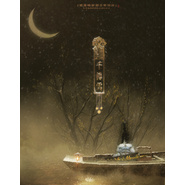

千樽雪
============================

|  |  |
| :--: | :-- |
| [ 千樽雪](https://emumo.xiami.com/album/1494611679) | **艺人**: [鸾凤鸣原创音乐](../index.md) **语种**: 国语 **唱片公司**: 独立发行 **发行时间**: 2014年03月08日 **专辑类别**: EP, 单曲 **专辑风格**: 古风 GuFeng Music **播放数**: 1104173 **收藏数**: 176 **评论数**: 14  |

## 简介

“天宝末年，安史祸起，藏剑众弟子血战叛军，力竭而宁死不降者皆身祭剑炉。不久叛军狼牙大将离奇暴毙，头颅高悬于藏剑营帐外，据闻乃一名女子所为。  
  
后有隐士曾见一白衣青带纯阳女冠身负巨剑，徘徊昆仑天泉附近。越数日再往，人去空余雪地铜樽一盏、玉笛一支。”  
  
——《隐元秘录·江湖轶闻·卷叁拾壹》  
  
======================================================================  
  
本曲目为鸾凤鸣五周年纪念收录曲，暨《暮春寒》剑三同人本插曲。  
  
【纯歌版】剑三·藏剑纯阳，历时两年半，经典组合贰婶、许多葵、苏陌如、小鱼萝莉、潇儿，再度联袂演绎一段安史之乱中的悲情往事。  
  
【剧情版】剑三·藏剑纯阳，历时两年半，经典组合贰婶、许多葵、苏陌如、小鱼萝莉、潇儿，与CV藤新、司狼鱼儿联袂演绎一段安史之乱中的悲情往事。 

## 曲目

## 评论

|  |  |  |  |
| :-- | :-- | :-- | :-- |
|  [虾米用户](https://emumo.xiami.com/u/378617650)  2019-06-14 19:07 赞(0) 踩(0) | 
剧情版前面叙述的故事很吸引人
 |
|  [虾米用户](https://emumo.xiami.com/u/410678572) 雨中鱼语那余生 2019-04-05 17:38 赞(0) 踩(0) | 
有念白跟没念白是两首歌，看到的是故事里的大义，听到的是曲调里的伤悲，歌词繁丽唯美，听者心静，也许过于悲伤的曲风更容易被错过！
 |
|  [虾米用户](https://emumo.xiami.com/u/331627517)  2019-04-05 12:12 赞(0) 踩(0) | 
好听！
 |
|  [虾米用户](https://emumo.xiami.com/u/247971264) 慢慢来会比较快 2019-02-18 19:05 赞(0) 踩(0) | 
喜欢
 |
|  [虾米用户](https://emumo.xiami.com/u/33941879) 别再说自己是单身狗了，你... 2019-01-13 22:26 赞(0) 踩(0) | 
好听
 |
|  [虾米用户](https://emumo.xiami.com/u/4741556)  2017-02-01 11:20 赞(0) 踩(0) | 
轻
 |
|  [虾米用户](https://emumo.xiami.com/u/7322777) ∮ 2015-10-02 09:56 赞(0) 踩(0) | 
...A...
 |
|  [虾米用户](https://emumo.xiami.com/u/48813502)  2015-06-27 16:55 赞(0) 踩(0) | 
好棒，加油 
 |
|  [虾米用户](https://emumo.xiami.com/u/39673748) 未若柳絮因风起 2015-02-11 19:17 赞(0) 踩(0) | 
没了以往藏剑的轻快_(:зゝ∠)_不过因为剧情所致，还是很棒很棒哒
 |
|  [虾米用户](https://emumo.xiami.com/u/13303093)  2015-02-03 13:45 赞(0) 踩(0) | 
国风
 |
|  [虾米用户](https://emumo.xiami.com/u/28766902) ε-(´∀｀; )果然翻... 2014-04-14 13:31 赞(0) 踩(0) | 
太棒！！！！
 |
|  [虾米用户](https://emumo.xiami.com/u/11052613) 阳光猛烈，万物显形。 2014-03-13 19:44 赞(0) 踩(0) | 
在5sing听到的 不错很耐听
 |
|  [虾米用户](https://emumo.xiami.com/u/231797) 活着真好 好好活着 2014-03-13 12:26 赞(0) 踩(0) | 
~
 |
|  [虾米用户](https://emumo.xiami.com/u/6654966) 。。 2014-03-13 12:22 赞(0) 踩(0) | 
。。
 |
