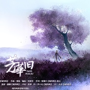
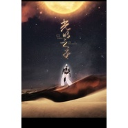
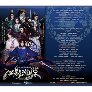

鸾凤鸣原创音乐
============================

|  |  |
| :--: | :-- |
| [ 鸾凤鸣原创音乐](https://i.xiami.com/luanfengming) | **播放数**: 13496260 **粉丝数**: 7624 **评论数**: 118 **地区**: China 中国大陆 **风格**: 流行摇滚 Pop Rock, 新世纪音乐 New Age, 国语流行 Mandarin Pop, 中国风 China-Wave, 古风 GuFeng Music  |

## 档案

鸾凤鸣原创音乐团队成立于2009年5月8日，团队风格主打古风、中国风，其风格包罗万象。其音乐风格别具一格，具有独立的创新意识，别开生面，打开一条不同于别人的道路。 
工作联系：    lfm0508@163.com 
【鸾凤鸣北京首场演出！门票火热出售中！购票地址： http://5sing.kugou.com/zc/project-56 】 
新浪微博：      http://weibo.com/luanfengming 
YouTube：     http://www.youtube.com/user/LuanFengMing 
微信公众平台：LFM0508 
鸾凤鸣YY频道：431473

## 专辑

| 名称 | 语种 | 唱片公司 | 发行时间 | 专辑类别 | 专辑风格 |
| :--: | :-- | :-- | :-- | :-- | :-- |
| [ 恋语](./albums/2103490377.md) | 国语 | 独立发行 | 2017年12月20日 | EP, 单曲 |  |
| [ 应许之心](./albums/2103490376.md) | 国语 | 独立发行 | 2017年12月04日 | EP, 单曲 |  |
| [ 一醉青丘《新倩女幽魂》青丘特辑](./albums/2102827159.md) | 国语 | 网易游戏 | 2017年08月28日 | 合集, 杂锦 | 古风 GuFeng Music |
| [ 与弈惊鸿](./albums/2102748058.md) | 国语 | 独立发行 | 2017年05月13日 | EP, 单曲 |  |
| [ 云中一梦奇迹暖暖云端四女神同人曲](./albums/2102744453.md) | 国语 | 独立发行 | 2017年05月07日 | EP, 单曲 | 中国风 China-Wave |
| [ 云巅长歌](./albums/2102700773.md) | 国语 | 鸾凤鸣原创音乐 | 2017年02月26日 | EP, 单曲 |  |
| [ 逐浪飞花武林外史](./albums/2100228800.md) | 国语 | 独立发行 | 2015年10月25日 | EP, 单曲 | 国语流行 Mandarin Pop, 古风 GuFeng Music |
| [ 芳华旧剑三·万花晴昼海](./albums/2100227548.md) | 国语 | 独立发行 | 2015年10月21日 | EP, 单曲 | 国语流行 Mandarin Pop, 古风 GuFeng Music |
| [ 梳情《斗罗大陆神界传说》微电影主题歌](./albums/2100226570.md) | 国语 | 独立发行 | 2015年10月15日 | EP, 单曲 | 国语流行 Mandarin Pop |
| [ 误花千骨](./albums/2100226522.md) | 国语 | 独立发行 | 2015年10月09日 | EP, 单曲 | 国语流行 Mandarin Pop, 古风 GuFeng Music |
| [ 寒山石无损wav/320kbs](./albums/2100210742.md) | 国语 | 独立发行 | 2015年09月25日 | EP, 单曲 | 国语流行 Mandarin Pop |
| [ 崛起庆祝反法西斯战争胜利70周年](./albums/2100209394.md) | 其他 | 独立发行 | 2015年08月27日 | EP, 单曲 | 独立摇滚 Indie Rock |
| [ 生如逆旅花容天下](./albums/2100206546.md) | 国语 | 鸾凤鸣原创音乐 | 2015年05月01日 | EP, 单曲 | 国语流行 Mandarin Pop, 中国风 China-Wave |
| [ 五时景无损版](./albums/1426582015.md) | 国语 | 成都音像出版社, 鸾凤鸣原创音乐 | 2014年05月08日 | 录音室专辑 |  |
| [ 光明之子](./albums/1496250912.md) | 国语 | 独立发行 | 2014年03月28日 | 原声带, 影视音乐 | 中国风 China-Wave |
| [ 千樽雪](./albums/1494611679.md) | 国语 | 独立发行 | 2014年03月08日 | EP, 单曲 | 古风 GuFeng Music |
| [ 并辔](./albums/68071185.md) | 国语 | 鸾凤鸣原创音乐团队 | 2013年05月02日 | EP, 单曲 | 古风 GuFeng Music |
| [ 望月台记《诛仙》陆雪琪](./albums/963162571.md) | 国语 | 鸾凤鸣原创音乐团队 | 2013年02月07日 | EP, 单曲 | 古风 GuFeng Music |
| [ 凡心诛仙·张小凡·碧瑶](./albums/462453488.md) | 国语 | 鸾凤鸣原创音乐团队 | 2012年12月25日 | EP, 单曲 | 中国风 China-Wave |
| [ 秦淮八艳](./albums/547086.md) | 国语 | 鸾凤鸣原创音乐团队 | 2012年09月27日 | EP, 单曲 | 古风 GuFeng Music |
| [ 花开成毒](./albums/527488.md) | 国语 | 鸾凤鸣原创音乐团队 | 2012年05月26日 | EP, 单曲 |  |
| [ 长绝](./albums/520627.md) | 国语 | 鸾凤鸣原创音乐团队 | 2012年05月15日 | EP, 单曲 | 中国风 China-Wave |
| [ 江影沉浮第二集原声带](./albums/507521.md) | 国语 | 鸾凤鸣 | 2012年03月26日 | 原声带, 影视音乐 | 中国风 China-Wave |
| [ 鸾凤鸣中国风精选](./albums/500042.md) | 国语 | 古风圈 | 2012年03月14日 | 精选集 |  |
| [ 杯欢记·温采](./albums/527483.md) | 国语 | 鸾凤鸣原创音乐团队 | 2011年11月05日 | EP, 单曲 | 中国风 China-Wave |
| [ 江影沉浮第一集原声带](./albums/507454.md) | 国语 | 鸾凤鸣 | 2011年06月13日 | 原声带, 影视音乐 | 中国风 China-Wave |

## 评论

|  |  |  |  |
| :-- | :-- | :-- | :-- |
|  [虾米用户](https://emumo.xiami.com/u/3469857) 站在枝头看你妹 2021-01-06 19:34 赞(0) 踩(0) | 
比心
 |
|  [虾米用户](https://emumo.xiami.com/u/341625758)  2020-04-15 16:19 赞(0) 踩(0) | 
民族的才是世界的！曲好词好，无奈尘世太浮躁
 |
|  [虾米用户](https://emumo.xiami.com/u/263446708) 这个人很懒，什么也没留下... 2020-02-23 09:17 赞(1) 踩(0) | 
那个，，，有个专辑需要出一下，谢谢！。。。。。
 |
|  [虾米用户](https://emumo.xiami.com/u/368363706)  2019-01-30 22:10 赞(2) 踩(0) | 
《望仙门·月明难解忆长安》月明难解忆长安，夜阑珊，残星点点尽萧然，九州寒。怀古蠡湖畔，人生若梦惘然，暖阳初照水波澜，水波澜，遥望叹空船。
 |
|  [虾米用户](https://emumo.xiami.com/u/353616874)  2018-04-14 22:36 赞(1) 踩(0) | 
鸾凤鸣真是在用心做音乐，期待更多好作品！
 |
|  [虾米用户](https://emumo.xiami.com/u/355035851)  2018-03-28 00:03 赞(0) 踩(0) | 
❤
 |
|  [虾米用户](https://emumo.xiami.com/u/348686717) 睡不着，也醒不来！留不下... 2018-03-05 08:03 赞(1) 踩(0) | 
期望你们能把我们的心撕裂，最终撕裂这个世界！让古风成为新风！让歌声成为雷声、枪声！把我们的灵魂击碎，击倒！
 |
|  [虾米用户](https://emumo.xiami.com/u/349149802) 世间里再美的东西，不过消... 2018-02-10 02:18 赞(0) 踩(0) | 
好听。
 |
|  [虾米用户](https://emumo.xiami.com/u/258542214)   2018-01-27 16:28 赞(0) 踩(0) | 

 |
|  [虾米用户](https://emumo.xiami.com/u/255520616) 你别皱眉，我走就好。 2017-11-12 01:43 赞(1) 踩(0) | 
丽丽~
 |
|  [虾米用户](https://emumo.xiami.com/u/257823623)  2017-11-05 02:02 赞(0) 踩(0) | 
暖粉留爪
 |
|  [虾米用户](https://emumo.xiami.com/u/297340192)  2017-10-01 15:28 赞(0) 踩(0) | 
鸾凤鸣算是厚积薄发了，不知不觉走入了我们的视野。
 |
|  [虾米用户](https://emumo.xiami.com/u/313962847)  2017-10-01 13:29 赞(0) 踩(0) | 
文化繁荣的标志，本土音乐社团，值得期待。
 |
|  [虾米用户](https://emumo.xiami.com/u/302999186)  2017-06-09 09:49 赞(0) 踩(0) | 
为什么找不到贰婶
 |
|  [虾米用户](https://emumo.xiami.com/u/201868659) 听不懂 2017-04-12 17:14 赞(0) 踩(0) | 
我觉得你们的歌听多了还不如纯音乐，都说古风可是我觉得十个九个唱的调都一样，要哭不哭
 |
| ⇒ |  [虾米用户](https://emumo.xiami.com/u/192556755) 好寂寞，好孤单，我也喜欢... 2018-09-09 23:43 赞(0) 踩(0) | 
此言差矣
 |
|  [虾米用户](https://emumo.xiami.com/u/251600364)  2017-03-23 21:23 赞(0) 踩(0) | 
银临唱的很好
 |
|  [虾米用户](https://emumo.xiami.com/u/93226796) 只见雪色映衣袂，抚琴月显... 2017-01-27 18:39 赞(0) 踩(0) | 
杨花雪超爱
 |
|  [虾米用户](https://emumo.xiami.com/u/16135450)  2016-10-24 00:42 赞(0) 踩(0) | 
5213
 |
|  [虾米用户](https://emumo.xiami.com/u/105991000) 我还没想好要写什么... 2016-10-17 12:07 赞(4) 踩(0) | 
从秦淮八艳来的 
 |
|  [虾米用户](https://emumo.xiami.com/u/116755420)  2016-08-13 19:29 赞(0) 踩(0) | 
好好听啊   
 |
|  [虾米用户](https://emumo.xiami.com/u/4265369)  2016-08-09 14:55 赞(0) 踩(0) | 
什么时候有上海场啊啊
 |
|  [虾米用户](https://emumo.xiami.com/u/93226796) 只见雪色映衣袂，抚琴月显... 2016-07-14 12:39 赞(0) 踩(0) | 
发新专辑吧~~~~~期待期待啊~~~~
 |
|  [虾米用户](https://emumo.xiami.com/u/178985950)   2016-06-05 13:47 赞(0) 踩(0) | 
喜欢小魂
 |
|  [虾米用户](https://emumo.xiami.com/u/178985950)   2016-05-26 16:43 赞(8) 踩(0) | 
单曲循环秦淮八艳，偶然见评论，这居然是男孩纸唱的！！！让我一个女生听的都酥到心里了，只能膜拜大神。   
 |
| ⇒ |  [虾米用户](https://emumo.xiami.com/u/320614317) 我这种人，话少的可怜，只... 2017-11-05 15:01 赞(0) 踩(0) | 
主要是八绝的词写的好！
 |
|  [虾米用户](https://emumo.xiami.com/u/178985950)   2016-05-26 15:29 赞(2) 踩(0) | 
偶然听了玉璇玑的秦淮八艳，瞬间喜欢上了。
 |
|  [虾米用户](https://emumo.xiami.com/u/29701309) 桃李不言 鸢飞戾天 2016-05-10 17:49 赞(0) 踩(0) | 
挚爱蛙蛙！ヾ(^▽^*)))多几首苏州方言的歌好不好？(/≧▽≦)/~┴┴
 |
|  [虾米用户](https://emumo.xiami.com/u/118045062)  2016-05-10 12:10 赞(1) 踩(0) | 
因为有好听的音乐
 |
|  [虾米用户](https://emumo.xiami.com/u/998517)  2016-03-28 18:46 赞(0) 踩(0) | 
许多葵
 |
|  [虾米用户](https://emumo.xiami.com/u/998517)  2016-03-28 18:46 赞(1) 踩(0) | 
许多葵
 |
|  [虾米用户](https://emumo.xiami.com/u/10517016)  2016-02-25 09:21 赞(0) 踩(0) | 
大爱
 |
|  [虾米用户](https://emumo.xiami.com/u/10991368)  2016-01-15 16:33 赞(0) 踩(0) | 
中国
 |
|  [虾米用户](https://emumo.xiami.com/u/1120071) 愛する者よ、死に候え 2015-12-16 21:56 赞(0) 踩(0) | 
魂总一发!
 |
|  [虾米用户](https://emumo.xiami.com/u/61833616)  2015-11-13 23:18 赞(0) 踩(0) | 
鸾小叽 
 |
|  [虾米用户](https://emumo.xiami.com/u/38219420)  2015-11-10 14:26 赞(0) 踩(0) | 
喜欢
 |
|  [虾米用户](https://emumo.xiami.com/u/12086596) 我这人很轴 2015-11-08 23:02 赞(1) 踩(0) | 
竟然要开演唱会了 支持一下 可惜去不了 只能眼馋
 |
|  [虾米用户](https://emumo.xiami.com/u/58101608)   2015-11-08 15:33 赞(1) 踩(0) | 
加油哦！很棒，一直支持你们！ 
 |
|  [虾米用户](https://emumo.xiami.com/u/78250504)  2015-10-31 23:16 赞(2) 踩(0) | 
好听，耳朵都要怀孕了。
 |
|  [虾米用户](https://emumo.xiami.com/u/45077250) 开心！！！ 2015-10-22 15:17 赞(2) 踩(0) | 
喜欢
 |
|  [虾米用户](https://emumo.xiami.com/u/11762407) 专注：爵士嘻哈、后摇、新... 2015-10-05 21:51 赞(13) 踩(0) | 
《命理难说》在我试听总排行榜上位于13名，我累计试听了超过2000轨
 |
| ⇒ |  [虾米用户](https://emumo.xiami.com/u/325652600) 懒懒的人，懒懒的心 2018-02-06 21:13 赞(0) 踩(0) | 
虽然不知道你在说什么，但我很喜欢（命理难说）这首歌。
 |
| ⇒ |  [虾米用户](https://emumo.xiami.com/u/325652600) 懒懒的人，懒懒的心 2018-02-06 21:14 赞(0) 踩(0) | 
希望你不会介意吧？
 |
| ⇒ |  [虾米用户](https://emumo.xiami.com/u/11762407) 专注：爵士嘻哈、后摇、新... 2018-02-06 23:53 赞(0) 踩(0) | 
<q><b>懒神说：</b></q>
 |
| ⇒ |  [虾米用户](https://emumo.xiami.com/u/325652600) 懒懒的人，懒懒的心 2018-02-20 19:42 赞(0) 踩(0) | 
<q><b>Mr 嘘说：</b></q>
 |
| ⇒ |  [虾米用户](https://emumo.xiami.com/u/11762407) 专注：爵士嘻哈、后摇、新... 2018-03-01 09:10 赞(0) 踩(0) | 
<q><b>懒神说：</b></q>
 |
| ⇒ |  [虾米用户](https://emumo.xiami.com/u/325652600) 懒懒的人，懒懒的心 2018-03-31 21:11 赞(0) 踩(0) | 
<q><b>Mr 嘘说：</b></q>
 |
|  [虾米用户](https://emumo.xiami.com/u/50158807) 纯音乐修身养性而为之！ 2015-09-05 01:08 赞(0) 踩(0) | 
路过
 |
|  [虾米用户](https://emumo.xiami.com/u/50833849) 譬如昨日死 2015-09-03 23:40 赞(4) 踩(0) | 
喜欢小魂！喜欢小魂！喜欢小魂！！
 |
|  [虾米用户](https://emumo.xiami.com/u/34995807)   2015-08-25 21:19 赞(0) 踩(0) | 
好多好听的古风歌
 |
|  [虾米用户](https://emumo.xiami.com/u/55959422)  2015-08-21 13:29 赞(1) 踩(0) | 
我之前听过一首歌，调和秦淮八艳一样，但是词不一样，是给剑三七秀唱的
 |
|  [虾米用户](https://emumo.xiami.com/u/48890459)  2015-07-28 11:58 赞(15) 踩(0) | 
玉璇玑太厉害了 
 |
|  [虾米用户](https://emumo.xiami.com/u/8271719)  2015-07-19 13:22 赞(1) 踩(0) | 
鸾凤鸣原创音乐团队
 |
|  [虾米用户](https://emumo.xiami.com/u/51471091)  2015-06-19 16:32 赞(1) 踩(0) | 
希望把中国风进行到底
 |
|  [虾米用户](https://emumo.xiami.com/u/51471091)  2015-06-19 16:32 赞(0) 踩(0) | 
加油↖(^ω^)↗
 |
|  [虾米用户](https://emumo.xiami.com/u/50760724)  2015-06-14 21:33 赞(1) 踩(0) | 
秦淮八绝，真的很绝，期待更多的绝色
 |
| ⇒ |  [虾米用户](https://emumo.xiami.com/u/37356693)  2016-07-16 23:48 赞(0) 踩(0) | 
秦淮八艳 
 |
|  [虾米用户](https://emumo.xiami.com/u/363392)  2015-05-23 03:33 赞(0) 踩(0) | 
太好听了！好多首！！
 |
|  [虾米用户](https://emumo.xiami.com/u/47647611)   2015-05-03 23:07 赞(0) 踩(0) | 
加油！[文字up]
 |
|  [虾米用户](https://emumo.xiami.com/u/42475606) 音符是跳跃的妖精 2015-03-09 14:32 赞(2) 踩(0) | 
来给贰婶表个白
 |
|  [虾米用户](https://emumo.xiami.com/u/3345274)  2015-02-13 09:40 赞(1) 踩(0) | 
求搬《清风莞月浮舟令》
 |
|  [虾米用户](https://emumo.xiami.com/u/9620713) 从来作春酒，未省不经年。 2014-12-23 20:39 赞(1) 踩(0) | 
求搬【问沙】！
 |
|  [虾米用户](https://emumo.xiami.com/u/20756887) 无需提醒的自觉。 2014-12-19 18:46 赞(0) 踩(0) | 
秦淮八艳一绝！
 |
|  [虾米用户](https://emumo.xiami.com/u/2318651)  2014-12-10 11:15 赞(0) 踩(0) | 
******
 |
|  [虾米用户](https://emumo.xiami.com/u/21937988)  2014-09-15 11:00 赞(0) 踩(0) | 
古风,
 |
|  [虾米用户](https://emumo.xiami.com/u/25970440)  2014-09-01 00:11 赞(3) 踩(0) | 
江湖少年也很好听，第一次留言就给东篱了，希望继续唱更多好听的歌，翻唱的也可以
 |
|  [虾米用户](https://emumo.xiami.com/u/36565122) 生无可恋，埋头苦读 2014-08-19 09:59 赞(0) 踩(0) | 
啦啦，关注
 |
|  [虾米用户](https://emumo.xiami.com/u/27339719) 醉里看花 花开花谢 2014-07-26 19:50 赞(0) 踩(0) | 
支持原创！
 |
|  [虾米用户](https://emumo.xiami.com/u/38850785)  2014-07-10 10:07 赞(1) 踩(0) | 
喜欢这个团队
 |
|  [虾米用户](https://emumo.xiami.com/u/34616381) ^-^ 2014-07-08 17:37 赞(1) 踩(0) | 
五周岁了哦，要茁壮成长~！
 |
|  [虾米用户](https://emumo.xiami.com/u/6760432) 这家伙有点懒，什么也没写 2014-06-18 08:28 赞(3) 踩(0) | 
鸾凤鸣在5sing上有活动了呢，出了新歌，虾米怎么才这么点
 |
|  [虾米用户](https://emumo.xiami.com/u/6975678) 生命如此短暂我比烟花灿烂 2014-06-08 15:46 赞(1) 踩(0) | 
支持原创！
 |
|  [虾米用户](https://emumo.xiami.com/u/21249431)  2014-04-19 20:37 赞(0) 踩(0) | 
顶！
 |
|  [虾米用户](https://emumo.xiami.com/u/35502108)  2014-04-18 16:16 赞(108) 踩(0) | 
我刚入驻了虾米音乐人，欢迎大家来我的个人主页，收听我的最新音乐
 |
| ⇒ |  [虾米用户](https://emumo.xiami.com/u/20025417) 暂无签名~ 2015-06-12 00:31 赞(0) 踩(0) | 
这才是中国风！现在流行歌曲就是渣
 |
|  [虾米用户](https://emumo.xiami.com/u/10283331) 半句话半首蝶恋花つ 2014-03-25 21:30 赞(2) 踩(0) | 
喜欢《琵琶将》！大爱！
 |
|  [虾米用户](https://emumo.xiami.com/u/11762407) 专注：爵士嘻哈、后摇、新... 2014-02-20 22:53 赞(3) 踩(0) | 
可以算是比较得体的中国风新世纪音乐
 |
|  [虾米用户](https://emumo.xiami.com/u/6683469)   2014-02-11 09:29 赞(1) 踩(0) | 
古风盛行，威武！
 |
|  [虾米用户](https://emumo.xiami.com/u/10572136)  2013-11-23 21:55 赞(1) 踩(0) | 
非常非常的喜欢
 |
|  [虾米用户](https://emumo.xiami.com/u/17197500)  2013-11-23 17:08 赞(1) 踩(0) | 
娘娘威武~~~~~~~~~~~~~~~~~
 |
|  [虾米用户](https://emumo.xiami.com/u/5546716)  2013-11-17 03:57 赞(1) 踩(0) | 
很給力呢！！！！這很多算是伴奏？
 |
|  [虾米用户](https://emumo.xiami.com/u/27257534) 一心一意是最温柔的力量 2013-11-13 17:43 赞(1) 踩(0) | 
大家都好厉害的说
 |
|  [虾米用户](https://emumo.xiami.com/u/14455351) 暂无签名~ 2013-09-26 21:28 赞(1) 踩(0) | 
声音优美
 |
|  [虾米用户](https://emumo.xiami.com/u/4990704) 音乐永不停息。 2013-09-21 16:11 赞(1) 踩(0) | 
！
 |
|  [虾米用户](https://emumo.xiami.com/u/21879899)  2013-09-13 20:04 赞(1) 踩(0) | 
太喜欢它的风格了。
 |
|  [虾米用户](https://emumo.xiami.com/u/4817298) 君不见，君不知 2013-07-23 21:27 赞(1) 踩(0) | 
《秦淮八艳》强推
 |
|  [虾米用户](https://emumo.xiami.com/u/17768629) 听一场雨，用一段时光等你 2013-07-21 07:24 赞(0) 踩(0) | 
...
 |
|  [虾米用户](https://emumo.xiami.com/u/10881404)  2013-07-18 20:44 赞(2) 踩(0) | 
秦淮八艳！土豆上看的加上视频MV好有感觉！
 |
|  [虾米用户](https://emumo.xiami.com/u/15809485)   2013-06-21 16:55 赞(1) 踩(0) | 
古風萬歲~~
 |
|  [虾米用户](https://emumo.xiami.com/u/15414709)  2013-06-10 21:08 赞(0) 踩(0) | 
haoting
 |
|  [虾米用户](https://emumo.xiami.com/u/15946605)  2013-06-09 23:27 赞(1) 踩(0) | 
就是喜欢啊
 |
|  [虾米用户](https://emumo.xiami.com/u/8529261) 执象而求，咫尺千里！ 2013-06-02 21:07 赞(1) 踩(0) | 
很喜欢，很喜欢
 |
|  [虾米用户](https://emumo.xiami.com/u/10989202) 如戈滴行板 2013-05-25 10:03 赞(0) 踩(0) | 
民乐.民粹.支持国产…
 |
|  [虾米用户](https://emumo.xiami.com/u/13665733)  2013-05-19 18:39 赞(0) 踩(0) | 
中国风
 |
|  [虾米用户](https://emumo.xiami.com/u/3265314) 用音乐致青春 2013-05-16 21:25 赞(1) 踩(0) | 
每首都有两个版本就好了哦 纯音乐的 带有歌手的
 |
|  [虾米用户](https://emumo.xiami.com/u/15008795)   2013-05-12 00:40 赞(1) 踩(0) | 
好听
 |
|  [虾米用户](https://emumo.xiami.com/u/3578414) 至简 2013-04-27 14:29 赞(1) 踩(0) | 
鸾凤鸣
 |
|  [虾米用户](https://emumo.xiami.com/u/7817375)  2013-04-15 22:47 赞(1) 踩(0) | 
大爱长绝【太好听了，循环呀（¯﹃¯）
 |
|  [虾米用户](https://emumo.xiami.com/u/13867015)  2013-04-08 20:33 赞(1) 踩(0) | 
大爱
 |
|  [虾米用户](https://emumo.xiami.com/u/13425909) 妖当 2013-03-20 14:02 赞(1) 踩(0) | 
可爱的团队啊
 |
|  [虾米用户](https://emumo.xiami.com/u/13578470) 看呐～ 2013-03-18 18:18 赞(1) 踩(0) | 
1234
 |
|  [虾米用户](https://emumo.xiami.com/u/1700002) V5_ORZZZZZ 2013-03-15 13:55 赞(1) 踩(0) | 
只要纯音不要人声
 |
|  [虾米用户](https://emumo.xiami.com/u/13334368) 行到水穷处,坐看云起时 2013-03-02 20:57 赞(1) 踩(0) | 
爱古风
 |
|  [虾米用户](https://emumo.xiami.com/u/13268873) 且行且珍惜 2013-02-28 10:55 赞(1) 踩(0) | 
游荡
 |
|  [虾米用户](https://emumo.xiami.com/u/5416475) 古风 、NEW AGE  2013-01-23 08:29 赞(1) 踩(0) | 
脸都没洗就跑来听鸾凤鸣，一个主打古风的团队。
 |
|  [虾米用户](https://emumo.xiami.com/u/960200) 技术宅～ 2013-01-22 11:13 赞(1) 踩(0) | 
古风~
 |
|  [虾米用户](https://emumo.xiami.com/u/11987068)  2013-01-11 09:19 赞(1) 踩(0) | 
爱长绝 =v=
 |
| ⇒ |  [虾米用户](https://emumo.xiami.com/u/10480067) WHATEVER 2013-02-18 16:45 赞(0) 踩(0) | 
觉得长绝写像是华胥引十三月，不知道唐七这首歌是为哪篇做的
 |
|  [虾米用户](https://emumo.xiami.com/u/3235848)  2013-01-03 05:48 赞(0) 踩(0) | 
0 0
 |
|  [虾米用户](https://emumo.xiami.com/u/9109186) 积极心理学 2012-12-14 08:21 赞(0) 踩(0) | 
不错的歌！
 |
|  [虾米用户](https://emumo.xiami.com/u/10090849) 暂无签名~ 2012-10-26 19:24 赞(0) 踩(0) | 
因为喜欢。。。。
 |
|  [虾米用户](https://emumo.xiami.com/u/3080279)  2012-10-14 18:18 赞(0) 踩(0) | 
中国风
 |
|  [虾米用户](https://emumo.xiami.com/u/9053492)  2012-09-22 14:20 赞(1) 踩(0) | 
泪湿红袖是ps2游戏大神的音乐嘛……这是同人？
 |
|  [虾米用户](https://emumo.xiami.com/u/9419603)  2012-07-21 18:49 赞(0) 踩(0) | 
爱古风
 |
|  [虾米用户](https://emumo.xiami.com/u/6657699) 懶懶懶，我因懶而活! 2012-07-21 13:03 赞(0) 踩(0) | 
欲罷不能&amp;gt;&amp;lt;
 |
|  [虾米用户](https://emumo.xiami.com/u/1545424) 我还没想好要写什么... 2012-07-02 15:57 赞(0) 踩(0) | 
江影沉浮还是小曲儿的好
 |
|  [虾米用户](https://emumo.xiami.com/u/5725538)  2012-06-05 11:38 赞(0) 踩(0) | 
喜欢
 |
|  [虾米用户](https://emumo.xiami.com/u/372476)  2012-05-03 22:34 赞(2) 踩(0) | 
鸾凤鸣三周年团庆的日子快要到啦，届时有神秘奖项颁布，还有新的鸾歌现场首发。鸾家成员和喜爱古风音乐的朋友们齐聚一堂，你最想听到哪位鸾家歌手现场献声呢？5月5日晚8点整，YY频道431473，千万不要错过哦！
 |
