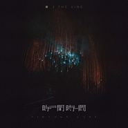

藤乐队
============================

|  |  |
| :--: | :-- |
| [ 藤乐队](https://i.xiami.com/teng) | **地区**: China 中国大陆 **风格**: 民谣摇滚 Folk Rock, 城市民谣 Urban Folk **播放数**: 2819524 **粉丝数**: 972 **评论数**: 68  |

## 档案

有人说他们是一支让人觉得温暖的乐队，完全没有朔风凛冽的气息。2014年他们在哈尔滨组建了乐队，在单曲《哈尔滨午后的冬天》之后，2016年他们发布了乐队的首张EP《莎莉》，温暖而热烈甚至带有些许青涩的表达着那个当下的他们对于生活理解与渴望，《野猫》也成了评论破万的热门单曲。2017，第二张EP《万能的夜》开始了蜕变，从一个讲述者成为了倾听者，用更加冷静的视角去观察和表达所有的情绪，创作的动机也开始向内延伸，作为中国为数不多拥有萨克斯手的乐队，诸如口琴等吹奏乐器的加入逐渐成为了他们的标志。 
主唱：浩然 
吉他：子涵 
萨克斯：老白 
贝斯：路旭

## 专辑

| 名称 | 语种 | 唱片公司 | 发行时间 | 专辑类别 | 专辑风格 |
| :--: | :-- | :-- | :-- | :-- | :-- |
| [ 旧时光](./albums/2105629899.md) | 国语 | 叽里咕噜文化 | 2019年12月26日 | EP, 单曲 | 国语流行 Mandarin Pop |
| [ 时间 时间](./albums/2105526144.md) | 国语 | 叽里咕噜文化 | 2019年11月26日 | EP, 单曲 | 国语流行 Mandarin Pop |
| [ 醉](./albums/2102750199.md) | 国语 | 独立发行 | 2017年05月19日 | EP, 单曲 | 中国风 China-Wave, 民谣摇滚 Folk Rock |
| [ 稳定生活Stable Life](./albums/2102652714.md) | 国语 | 独立发行 | 2016年11月11日 | EP, 单曲 |  |
| [ 莎莉Sally](./albums/2100305994.md) | 国语 | 哈尔滨尚星文化传媒公司 | 2016年03月23日 | EP, 单曲 | 民谣摇滚 Folk Rock |
| [ 哈尔滨午后的冬天-EP](./albums/2018964728.md) | 国语 | 独立发行 | 2014年12月19日 | EP, 单曲 | 民谣摇滚 Folk Rock, 城市民谣 Urban Folk |

## 评论

|  |  |  |
| :-- | :-- | :-- |
|  [虾米用户](https://emumo.xiami.com/u/8337431) 以乐会友 2020-08-16 13:42 赞(0) 踩(0) | 
20200816.68
 |
|  [虾米用户](https://emumo.xiami.com/u/43182804) 最孤独的人 2020-05-10 09:44 赞(0) 踩(0) | 
使劲儿
 |
|  [虾米用户](https://emumo.xiami.com/u/4487129)  2019-03-16 10:09 赞(0) 踩(0) | 
！！！
 |
|  [虾米用户](https://emumo.xiami.com/u/420211630)  2019-03-10 20:33 赞(4) 踩(0) | 
说实话弹 的比唱的好。个人感觉还是要鼓励一下坚持自己最好 
 |
|  [虾米用户](https://emumo.xiami.com/u/76557908) 我还没想好要写什么... 2019-02-20 00:17 赞(1) 踩(0) | 
在电台里听到野猫这首歌 马上搜索 加油～坚持自己所坚持的 
 |
|  [虾米用户](https://emumo.xiami.com/u/362213347) 我还没想好要写什么... 2018-05-07 19:38 赞(2) 踩(0) | 
请坚持自己的音乐理念！
 |
|  [虾米用户](https://emumo.xiami.com/u/300105430)  2018-05-06 22:41 赞(2) 踩(0) | 
加油藤乐队。支持你们。
 |
|  [虾米用户](https://emumo.xiami.com/u/222044084)  2018-01-28 18:28 赞(2) 踩(0) | 
好听
 |
|  [虾米用户](https://emumo.xiami.com/u/41178408)  2017-10-27 23:29 赞(1) 踩(0) | 
支持支持〜有空来我这看看啊，，我是王健〜
 |
|  [虾米用户](https://emumo.xiami.com/u/46994902)  2017-10-27 23:27 赞(1) 踩(0) | 
继续卖力的生长吧，离参天还很远呐，继续努力的发芽吧，藤乐队！……加油！！！
 |
|  [虾米用户](https://emumo.xiami.com/u/5205014) 吱吱喳喳，像小鸟那样去热... 2017-10-13 08:04 赞(0) 踩(0) | 
快上架《万能的夜》
 |
|  [虾米用户](https://emumo.xiami.com/u/100196792) 不轰烈 如何做世界之最 2017-10-01 01:10 赞(0) 踩(0) | 
发现得太晚 简直太棒的乐队
 |
|  [虾米用户](https://emumo.xiami.com/u/142783808)  2017-09-08 07:28 赞(1) 踩(0) | 
喜欢野猫
 |
|  [虾米用户](https://emumo.xiami.com/u/193484)  2017-06-20 09:36 赞(1) 踩(0) | 
夜猫不错！
 |
|  [虾米用户](https://emumo.xiami.com/u/32051445) 女孩儿的歌。 永爱虾米 2017-06-11 09:11 赞(1) 踩(0) | 
哈尔滨人光荣报道
 |
|  [虾米用户](https://emumo.xiami.com/u/237324537)   2017-06-04 11:58 赞(1) 踩(0) | 
加油
 |
|  [虾米用户](https://emumo.xiami.com/u/8424657) 海岸线 2017-06-02 23:14 赞(0) 踩(0) | 
.
 |
|  [虾米用户](https://emumo.xiami.com/u/298574505) 玉龙飞雪 2017-06-02 01:35 赞(1) 踩(0) | 
很好的歌
 |
|  [虾米用户](https://emumo.xiami.com/u/193972109)  2017-05-28 10:53 赞(0) 踩(0) | 
加油
 |
|  [虾米用户](https://emumo.xiami.com/u/31218112)  2017-05-19 23:23 赞(0) 踩(0) | 
明知道家里没有驱动，但还是买了专辑，为的是昨晚现场 那些好听的每一首歌.....加油吧！藤乐队，欢迎来厦门。
 |
|  [虾米用户](https://emumo.xiami.com/u/1300511) 现在都用Spotify 2017-05-18 21:51 赞(0) 踩(0) | 
今天演出很棒&amp;hellip;圈粉～
 |
|  [虾米用户](https://emumo.xiami.com/u/297319087) Drunk on the... 2017-05-18 20:10 赞(1) 踩(0) | 
为了今晚的新歌下了虾米 
 |
|  [虾米用户](https://emumo.xiami.com/u/289519329)  2017-04-17 22:31 赞(0) 踩(0) | 
好听 被圈粉 加油！
 |
|  [虾米用户](https://emumo.xiami.com/u/288929442)  2017-04-15 18:38 赞(0) 踩(0) | 
好听
 |
|  [虾米用户](https://emumo.xiami.com/u/226081577) 人生总要有点喜欢的事情吧... 2017-04-10 16:17 赞(0) 踩(0) | 
重复是你最好的选择！哈哈～
 |
|  [虾米用户](https://emumo.xiami.com/u/226081577) 人生总要有点喜欢的事情吧... 2017-04-10 16:15 赞(0) 踩(0) | 
真的很喜欢主唱的声音，还有这样的风格，祝越来越好～
 |
|  [虾米用户](https://emumo.xiami.com/u/267780762)  2017-03-12 17:48 赞(0) 踩(0) | 
同学 加油吧 周周支持你们
 |
|  [虾米用户](https://emumo.xiami.com/u/259653574)  2017-03-09 07:35 赞(0) 踩(0) | 
浩然加油 
 |
|  [虾米用户](https://emumo.xiami.com/u/52702437)  2017-01-29 23:31 赞(0) 踩(0) | 
真好，每首歌都抨击心灵，超有画面感……
 |
|  [虾米用户](https://emumo.xiami.com/u/117158628)   2016-05-30 18:10 赞(0) 踩(0) | 
藤吉米！
 |
|  [虾米用户](https://emumo.xiami.com/u/134668122)  2016-04-05 07:58 赞(0) 踩(0) | 
新歌来了
 |
|  [虾米用户](https://emumo.xiami.com/u/6959352) 你头发湿了 2016-03-26 00:10 赞(0) 踩(0) | 
挺好 加油！
 |
|  [虾米用户](https://emumo.xiami.com/u/94264576)  2015-12-24 21:37 赞(0) 踩(0) | 
好喜欢
 |
|  [虾米用户](https://emumo.xiami.com/u/94264576)  2015-12-24 21:36 赞(0) 踩(0) | 
好喜欢！
 |
|  [虾米用户](https://emumo.xiami.com/u/91665732) 原谅那些伤害过我们的自己 2015-12-16 01:38 赞(0) 踩(0) | 
很好听，冲着歌来的 
 |
|  [虾米用户](https://emumo.xiami.com/u/90147264)   2015-12-10 02:35 赞(3) 踩(0) | 
野猫呢？我就是冲着这首歌来的
 |
|  [虾米用户](https://emumo.xiami.com/u/47123643) 早睡晚起身体好 2015-12-08 00:19 赞(1) 踩(0) | 

 |
|  [虾米用户](https://emumo.xiami.com/u/43033248) 心悦君兮君不知 2015-12-07 16:16 赞(0) 踩(0) | 
真好
 |
|  [虾米用户](https://emumo.xiami.com/u/82091410) 呵呵呵呵呵呵呵 2015-11-11 20:21 赞(0) 踩(0) | 
小呆推荐的
 |
|  [虾米用户](https://emumo.xiami.com/u/40651018) 唯爱音乐 2015-11-08 23:30 赞(1) 踩(0) | 
还记得前几年的康师傅杯比赛被你们淘汰了，记得那时候还叫吉米餐厅好像，后来不玩乐队了有在青旅看过你们，改名叫藤了，希望越来越好，支持你们。
 |
|  [虾米用户](https://emumo.xiami.com/u/48305887)   2015-10-29 01:25 赞(0) 踩(0) | 
必火
 |
|  [虾米用户](https://emumo.xiami.com/u/77541236)  2015-10-28 22:29 赞(0) 踩(0) | 
学长棒棒哒
 |
|  [虾米用户](https://emumo.xiami.com/u/77359890)  2015-10-28 00:31 赞(0) 踩(0) | 
第五届长春热派
 |
|  [虾米用户](https://emumo.xiami.com/u/76405564)  2015-10-25 09:11 赞(1) 踩(0) | 
又是从热派赶过来的。野猫野猫
 |
|  [虾米用户](https://emumo.xiami.com/u/61985068)  2015-09-15 15:57 赞(0) 踩(0) | 
啦啦啦啦 叔叔约起来
 |
|  [虾米用户](https://emumo.xiami.com/u/53738771)  2015-07-29 10:56 赞(1) 踩(0) | 
怎么有没传(野猫)那首歌 我在哈尔滨江北大学城看过演唱  也录了段视频 但是不太全  先听听全的！！！
 |
|  [虾米用户](https://emumo.xiami.com/u/52586636)  2015-07-14 20:28 赞(0) 踩(0) | 
觉得真的很好听，喜欢，支持你们
 |
|  [虾米用户](https://emumo.xiami.com/u/13388648) Smouldering. 2015-05-21 11:12 赞(0) 踩(0) | 
熏哥最高。子涵fighing。
 |
| ⇒ |  [虾米用户](https://emumo.xiami.com/u/43081994)   2015-05-27 17:40 赞(0) 踩(0) | 
黑粗牛逼
 |
|  [虾米用户](https://emumo.xiami.com/u/47116412)  2015-04-03 07:07 赞(0) 踩(0) | 
加油  
 |
|  [虾米用户](https://emumo.xiami.com/u/48245223)  2015-03-18 06:14 赞(0) 踩(0) | 
必火！加油
 |
|  [虾米用户](https://emumo.xiami.com/u/47331552)  2015-02-16 22:08 赞(0) 踩(0) | 
哈尔滨林大乐队。 冰城妹子挺你们
 |
|  [虾米用户](https://emumo.xiami.com/u/3851935) Why so serio... 2015-02-09 18:51 赞(0) 踩(0) | 
居然是林大的。 加油吧！
 |
|  [虾米用户](https://emumo.xiami.com/u/8227634) X 2015-02-07 00:47 赞(0) 踩(0) | 
呵呵
 |
|  [虾米用户](https://emumo.xiami.com/u/8227634) X 2015-02-07 00:43 赞(0) 踩(0) | 
音色不错，整体上我喜欢～加油啊
 |
|  [虾米用户](https://emumo.xiami.com/u/46877616)   2015-02-03 12:54 赞(0) 踩(0) | 
加油加油加油
 |
|  [虾米用户](https://emumo.xiami.com/u/46240345)  2015-01-19 19:03 赞(0) 踩(0) | 
很好听~
 |
|  [虾米用户](https://emumo.xiami.com/u/45489432)  2014-12-31 14:27 赞(0) 踩(0) | 
永远支持你们～加油！
 |
|  [虾米用户](https://emumo.xiami.com/u/36697678) 身将流水同清净，心与浮云... 2014-12-23 17:14 赞(0) 踩(0) | 
真挚的歌声
 |
|  [虾米用户](https://emumo.xiami.com/u/45067713) 暂无签名~ 2014-12-19 18:43 赞(0) 踩(0) | 
加油。。
 |
|  [虾米用户](https://emumo.xiami.com/u/13752605)  2014-12-19 16:08 赞(0) 踩(0) | 
看比赛
 |
|  [虾米用户](https://emumo.xiami.com/u/13752605)  2014-12-19 16:07 赞(0) 踩(0) | 
比赛的时候看过你们，赞一个~
 |
|  [虾米用户](https://emumo.xiami.com/u/9475604)  2014-12-19 14:28 赞(0) 踩(0) | 
乐队名字跟我一个姓 哈哈  加油
 |
|  [虾米用户](https://emumo.xiami.com/u/43081994)   2014-10-28 20:20 赞(37) 踩(0) | 
我刚入驻了虾米音乐人，欢迎大家来我的个人主页，收听我的最新音乐
 |
| ⇒ |  [虾米用户](https://emumo.xiami.com/u/90147264)   2015-12-10 02:25 赞(0) 踩(0) | 
我很喜欢你的歌 
 |
| ⇒ |  [虾米用户](https://emumo.xiami.com/u/50875316)  2016-06-11 12:40 赞(0) 踩(0) | 
热派时被圈粉~求野猫的吉他谱~蟹蟹祝你们越来越好！
 |
| ⇒ |  [虾米用户](https://emumo.xiami.com/u/111146000)  2017-07-03 08:23 赞(0) 踩(0) | 
每一首都好听，祝好，期待出唱片
 |
| ⇒ |  [虾米用户](https://emumo.xiami.com/u/342283126)  2017-12-31 09:22 赞(0) 踩(0) | 
妈啊，简直不要太好听 
 |
