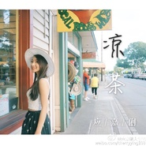

应嘉俐
============================

|  |  |
| :--: | :-- |
| [ 应嘉俐](https://i.xiami.com/cherryying) | **地区**: China 中国大陆 **风格**: 国语流行 Mandarin Pop **播放数**: 26965569 **粉丝数**: 1924 **评论数**: 146  |

## 档案

中文名：应嘉俐 
昵称：Lilian 
生日：2月21日 
星座：双鱼座 
籍贯：浙江宁波 
出生地：江西南昌 
民族：汉 
身高：165cm 
体重：44.5kg 
语言：中文，英文 
性格：乐观开朗，活泼风趣 
专长：小提琴、吉他、钢琴、声乐、朗诵、主持、Jazz舞…… 　　最喜欢的运动：竞走、瑜伽、游泳 
最大的心愿：希望能用自己的力量，让爸爸妈妈幸福快乐！ 
理 想：在音乐的国度，自由的呼吸…… 
崇拜的人：老爸，周杰伦，圣桑 
座右铭：做一个有责任感的人

## 专辑

| 名称 | 语种 | 唱片公司 | 发行时间 | 专辑类别 | 专辑风格 |
| :--: | :-- | :-- | :-- | :-- | :-- |
| [ Come Back to Me](./albums/2103593838.md) | 英语 | 独立发行 | 2018年03月08日 | EP, 单曲 | 欧美流行 Western Pop, 电影原声 Film Score, 当代唱作人 Contemporary Singer-Songwriter |
| [ 凉茶](./albums/1727724621.md) | 国语 | 独立发行 | 2015年03月30日 | EP, 单曲 | 国语流行 Mandarin Pop |
| [ 那又如何](./albums/408537.md) | 国语 | JY-Studio | 2010年10月22日 | EP, 单曲 | 国语流行 Mandarin Pop |

## 评论

|  |  |  |
| :-- | :-- | :-- |
|  [虾米用户](https://emumo.xiami.com/u/421026840)  2019-03-13 21:59 赞(0) 踩(0) | 
第一次听到，那又如何，好喜欢，加油加油！
 |
|  [虾米用户](https://emumo.xiami.com/u/227407705) Make an extr... 2018-04-16 11:40 赞(0) 踩(0) | 
真的不错
 |
|  [虾米用户](https://emumo.xiami.com/u/334567951)  2018-03-25 23:08 赞(2) 踩(0) | 
我很喜欢你唱的《那又如何》这首歌！好希望你能多唱一些歌哦！
 |
|  [虾米用户](https://emumo.xiami.com/u/305057297)  2018-03-20 22:22 赞(2) 踩(0) | 
喜欢你六年了。在你的城市生活过三年。不知道你是否还是一个人。
 |
|  [虾米用户](https://emumo.xiami.com/u/322498584) 谁不眷恋这一词一曲的光辉 2018-02-23 22:26 赞(0) 踩(0) | 
少产高质音乐人.
 |
|  [虾米用户](https://emumo.xiami.com/u/322498584) 谁不眷恋这一词一曲的光辉 2018-02-23 22:23 赞(0) 踩(0) | 
超喜欢你的＜那又如何＞，循环哭了一天，会永远支持你
 |
|  [虾米用户](https://emumo.xiami.com/u/48781585)  2017-12-03 17:30 赞(0) 踩(0) | 
好听   听着很有感情   
 |
|  [虾米用户](https://emumo.xiami.com/u/421459) 董小姐，你熄灭了烟，谈起... 2017-10-28 09:35 赞(0) 踩(0) | 
说的不会做，以为不会错
 |
|  [虾米用户](https://emumo.xiami.com/u/13402525)  2017-10-21 14:01 赞(0) 踩(0) | 
那又如何
 |
|  [虾米用户](https://emumo.xiami.com/u/6373689) 心如猛虎，细嗅蔷薇。 2017-09-23 13:34 赞(0) 踩(0) | 
真是被惊艳到了
 |
|  [虾米用户](https://emumo.xiami.com/u/10690488)   2017-08-13 17:50 赞(2) 踩(0) | 
今日推荐里听到了《那又如何》，惊艳到了
 |
|  [虾米用户](https://emumo.xiami.com/u/72666568)  2017-06-02 22:12 赞(0) 踩(0) | 
蛮久了
 |
|  [虾米用户](https://emumo.xiami.com/u/296262484)  2017-05-27 18:47 赞(2) 踩(0) | 
无论换任何听歌软件，这首歌一定都在
 |
|  [虾米用户](https://emumo.xiami.com/u/45999232)   2017-05-03 23:49 赞(0) 踩(0) | 
同日生！
 |
|  [虾米用户](https://emumo.xiami.com/u/279071604)  2017-03-15 13:16 赞(0) 踩(0) | 
老乡 
 |
|  [虾米用户](https://emumo.xiami.com/u/279657994)  2017-03-14 22:59 赞(2) 踩(0) | 
那又如何百听不厌
 |
|  [虾米用户](https://emumo.xiami.com/u/257491692)  2017-03-06 06:40 赞(0) 踩(0) | 
嗯呐
 |
|  [虾米用户](https://emumo.xiami.com/u/50898252)   2017-03-03 09:29 赞(0) 踩(0) | 
不错不错！
 |
|  [虾米用户](https://emumo.xiami.com/u/247834795) 唯有音乐能带给我自己的世... 2017-01-17 22:11 赞(0) 踩(0) | 
来点赞
 |
|  [虾米用户](https://emumo.xiami.com/u/255078818)  2017-01-03 19:41 赞(0) 踩(0) | 
南昌二中的
 |
|  [虾米用户](https://emumo.xiami.com/u/222711048) 人生就是这样看你热闹的永... 2016-12-22 15:30 赞(0) 踩(0) | 
  
 |
|  [虾米用户](https://emumo.xiami.com/u/250509534)  2016-12-01 18:16 赞(1) 踩(0) | 
一开始听还以为刘惜君
 |
|  [虾米用户](https://emumo.xiami.com/u/126175846)   2016-11-18 23:54 赞(0) 踩(0) | 
这首歌在我的播放列表已经5年多
 |
|  [虾米用户](https://emumo.xiami.com/u/243595711)  2016-11-06 23:33 赞(0) 踩(0) | 
好听
 |
|  [虾米用户](https://emumo.xiami.com/u/111941644)  2016-10-22 21:27 赞(0) 踩(0) | 
好听
 |
|  [虾米用户](https://emumo.xiami.com/u/47104979) 仅仅活着是不够的，还需要... 2016-10-07 23:23 赞(0) 踩(0) | 
很好
 |
|  [虾米用户](https://emumo.xiami.com/u/29230195) Gubba nub nu... 2016-09-25 12:29 赞(0) 踩(0) | 
南昌人
 |
|  [虾米用户](https://emumo.xiami.com/u/93267512)  2016-09-12 20:35 赞(1) 踩(0) | 
刘惜君
 |
|  [虾米用户](https://emumo.xiami.com/u/30761314) 我还没想好要写什么... 2016-07-15 21:55 赞(0) 踩(0) | 
声音很好听
 |
|  [虾米用户](https://emumo.xiami.com/u/1877590)  2016-05-09 16:40 赞(0) 踩(0) | 
很喜欢
 |
|  [虾米用户](https://emumo.xiami.com/u/128660024)  2016-04-08 15:31 赞(2) 踩(0) | 
歌都挺好听 就太少
 |
| ⇒ |  [虾米用户](https://emumo.xiami.com/u/228290761)   2016-10-21 13:39 赞(0) 踩(0) | 
是啊，歌比较少，ps：那又如何 
 |
|  [虾米用户](https://emumo.xiami.com/u/92678386)   2016-01-23 16:12 赞(1) 踩(0) | 
没有谁像谁，只有你听歌的时候会想起谁
 |
|  [虾米用户](https://emumo.xiami.com/u/94534030)   2015-12-27 12:55 赞(0) 踩(0) | 
么么么
 |
|  [虾米用户](https://emumo.xiami.com/u/94250448)  2015-12-25 06:20 赞(0) 踩(0) | 
好听  声音像刘惜君
 |
| ⇒ |  [虾米用户](https://emumo.xiami.com/u/4904709)  2016-09-05 17:54 赞(0) 踩(0) | 
一开口，我以为也是刘惜君。
 |
|  [虾米用户](https://emumo.xiami.com/u/69531328)   2015-12-13 14:02 赞(0) 踩(0) | 
支持 
 |
|  [虾米用户](https://emumo.xiami.com/u/37532718) 只愿 2015-12-12 01:45 赞(0) 踩(0) | 
那又怎样
 |
|  [虾米用户](https://emumo.xiami.com/u/2584283) 嗡嗡嗡···嗡··· 2015-12-10 10:43 赞(0) 踩(0) | 
第一口听着想刘惜君
 |
| ⇒ |  [虾米用户](https://emumo.xiami.com/u/4723231) 这个家伙… 2015-12-28 15:26 赞(0) 踩(0) | 
老乡好
 |
|  [虾米用户](https://emumo.xiami.com/u/48121237) 弃坑虾米了，转战网易。 2015-11-05 22:49 赞(0) 踩(0) | 
歌好听，人也美
 |
|  [虾米用户](https://emumo.xiami.com/u/62039920)  2015-09-08 23:48 赞(0) 踩(0) | 
听声音好像郭靜。。
 |
|  [虾米用户](https://emumo.xiami.com/u/62039920)  2015-09-08 23:47 赞(0) 踩(0) | 

 |
|  [虾米用户](https://emumo.xiami.com/u/45045143)   2015-08-27 18:01 赞(0) 踩(0) | 
嘉 我也是双鱼座  我是2月22号的 哈哈
 |
|  [虾米用户](https://emumo.xiami.com/u/13012891) Musicneverce... 2015-08-07 15:58 赞(0) 踩(0) | 
声音很好听
 |
|  [虾米用户](https://emumo.xiami.com/u/31105620) 「♡：李胜勋 ∈ Win... 2015-07-29 21:57 赞(0) 踩(0) | 
每首歌都可以听很久，学姐继续加油(๑‾᷅ ‾᷄๑)੭ु⁾⁾˞͛ ༘ؓ ︠³
 |
|  [虾米用户](https://emumo.xiami.com/u/41823298)  2015-07-16 15:07 赞(0) 踩(0) | 
听听看
 |
|  [虾米用户](https://emumo.xiami.com/u/4043095)  2015-06-04 17:31 赞(0) 踩(0) | 
也就那么一首歌
 |
|  [虾米用户](https://emumo.xiami.com/u/49528653) 还是自己养花喝茶吧 2015-05-24 15:00 赞(0) 踩(0) | 
好听
 |
|  [虾米用户](https://emumo.xiami.com/u/14007136) 求音源可以➕qq群532... 2015-05-19 00:17 赞(0) 踩(0) | 
歌好听
 |
|  [虾米用户](https://emumo.xiami.com/u/8096482)   2015-04-06 15:46 赞(0) 踩(0) | 
才女
 |
|  [虾米用户](https://emumo.xiami.com/u/48705400) 感觉自己萌萌哒 2015-04-01 19:56 赞(0) 踩(0) | 
MUA~~
 |
|  [虾米用户](https://emumo.xiami.com/u/48552024)   2015-03-31 13:54 赞(0) 踩(0) | 
终于发歌了、是走伤感路线？
 |
|  [虾米用户](https://emumo.xiami.com/u/2789093) 浮生如梦梦如歌 2015-03-27 12:07 赞(0) 踩(0) | 
无法自拔。
 |
|  [虾米用户](https://emumo.xiami.com/u/48525945) ， 2015-03-27 02:39 赞(0) 踩(0) | 
下周发新歌
 |
|  [虾米用户](https://emumo.xiami.com/u/44211724) 没有音乐的人生枯燥无味 2015-03-21 00:34 赞(0) 踩(0) | 
封面好美
 |
|  [虾米用户](https://emumo.xiami.com/u/46541949)  2015-03-13 19:00 赞(0) 踩(0) | 
好听
 |
|  [虾米用户](https://emumo.xiami.com/u/29874829) 嬉皮笑脸 2015-03-11 22:54 赞(0) 踩(0) | 
猜电台竟然因为我收藏了孙燕姿而推荐了这个人的歌给我
 |
|  [虾米用户](https://emumo.xiami.com/u/11367227) Smash it！！！ 2015-02-24 11:48 赞(0) 踩(0) | 
孙燕姿不会作曲写歌？呵呵呵，我也笑了……
 |
|  [虾米用户](https://emumo.xiami.com/u/46165968)  2015-01-21 09:27 赞(154) 踩(0) | 
我刚入驻了虾米音乐人，欢迎大家来我的个人主页，收听我的最新音乐
 |
| ⇒ |  [虾米用户](https://emumo.xiami.com/u/28698317)  2015-01-29 03:55 赞(0) 踩(0) | 
声音很暖啊。
 |
| ⇒ |  [虾米用户](https://emumo.xiami.com/u/7912876) 거짓말 2015-02-07 02:18 赞(0) 踩(0) | 
喜歡妳的歌
 |
| ⇒ |  [虾米用户](https://emumo.xiami.com/u/46451523) 如果海会说话，如果风爱上... 2015-02-10 13:13 赞(0) 踩(0) | 
很棒哦
 |
| ⇒ |  [虾米用户](https://emumo.xiami.com/u/46552139) 随遇而安～ 2015-02-17 12:16 赞(0) 踩(0) | 
那又如何，习惯了很久，喜欢你的声音多发新歌
 |
| ⇒ |  [虾米用户](https://emumo.xiami.com/u/46691178) bitch 2015-03-13 19:56 赞(0) 踩(0) | 
很好听！
 |
| ⇒ |  [虾米用户](https://emumo.xiami.com/u/33739084) oh my ess 2015-03-21 18:36 赞(0) 踩(0) | 
为什么唱那么少啊
 |
| ⇒ |  [虾米用户](https://emumo.xiami.com/u/48525945) ， 2015-03-27 02:39 赞(0) 踩(0) | 
<q><b>oh la la说：</b></q>
 |
| ⇒ |  [虾米用户](https://emumo.xiami.com/u/48525945) ， 2015-03-27 02:39 赞(0) 踩(0) | 
<q><b>连微笑都是默契说：</b></q>
 |
| ⇒ |  [虾米用户](https://emumo.xiami.com/u/6867742) INFJ摩羯A 声控声优... 2015-09-21 19:48 赞(0) 踩(0) | 
今日推荐听见声音，喜欢，没有更多了咩
 |
| ⇒ |  [虾米用户](https://emumo.xiami.com/u/60206696) 做一棵树 默默的陪伴 2015-12-31 00:38 赞(0) 踩(0) | 

 |
| ⇒ |  [虾米用户](https://emumo.xiami.com/u/243608026) 喜欢你 2016-11-07 01:11 赞(0) 踩(0) | 
真的很可惜
 |
| ⇒ |  [虾米用户](https://emumo.xiami.com/u/228737156)   2017-03-12 10:55 赞(0) 踩(0) | 
发歌啊  好喜欢你的歌
 |
| ⇒ |  [虾米用户](https://emumo.xiami.com/u/310796076)   2018-02-02 08:03 赞(0) 踩(0) | 
加油
 |
|  [虾米用户](https://emumo.xiami.com/u/1309219) 吃葡萄不吐葡萄皮～～ 2015-01-20 17:57 赞(0) 踩(0) | 
求新歌
 |
|  [虾米用户](https://emumo.xiami.com/u/1635081)  2015-01-19 22:19 赞(0) 踩(0) | 
这声音，跟孙燕姿只有一滴滴相像吧。感觉倒是略像刘惜君，歌也很像的样子
 |
|  [虾米用户](https://emumo.xiami.com/u/1720629) 音乐无偏见。 2015-01-09 14:50 赞(0) 踩(0) | 
可惜只有一首歌。
 |
|  [虾米用户](https://emumo.xiami.com/u/36690389) 暂无签名~ 2014-11-29 13:05 赞(0) 踩(0) | 
93年的小MM，怎么不继续唱歌了
 |
| ⇒ |  [虾米用户](https://emumo.xiami.com/u/48525945) ， 2015-03-27 02:39 赞(0) 踩(0) | 
下周发新歌
 |
|  [虾米用户](https://emumo.xiami.com/u/36690389) 暂无签名~ 2014-11-29 12:53 赞(0) 踩(0) | 
孙燕姿会作曲写词吗，真特么搞笑
 |
| ⇒ |  [虾米用户](https://emumo.xiami.com/u/1020233) 网易云➡️summer叶... 2015-01-14 10:35 赞(0) 踩(0) | 
孙燕姿会作曲写词啊，你不知道而已！！
 |
| ⇒ |  [虾米用户](https://emumo.xiami.com/u/50349338)  2015-05-26 15:00 赞(0) 踩(0) | 
你是来搞笑的吗，孙燕姿每张专辑里都有自己的作品好吗，不了解就别出来BB
 |
| ⇒ |  [虾米用户](https://emumo.xiami.com/u/36690389) 暂无签名~ 2015-06-17 23:55 赞(0) 踩(0) | 
<q><b>Amasterusing说：</b></q>
 |
|  [虾米用户](https://emumo.xiami.com/u/2840602)   2014-11-17 15:34 赞(0) 踩(0) | 
诶有龙里~学姐的作品，想不到这么火啊哈哈
 |
|  [虾米用户](https://emumo.xiami.com/u/42261750)  2014-11-01 02:14 赞(0) 踩(0) | 
我的好友 鼓励下！这里怎么这么多人说你像孙燕姿的声音呢 哈哈哈 加油 嘉俐
 |
|  [虾米用户](https://emumo.xiami.com/u/13974077)  2014-07-06 19:14 赞(34) 踩(0) | 
……这声音，跟孙燕姿只有一滴滴相像吧。感觉倒是略像刘惜君，歌也很像的样子……
 |
| ⇒ |  [虾米用户](https://emumo.xiami.com/u/97896712)  2017-03-27 07:37 赞(0) 踩(0) | 
她出来的比刘惜君早
 |
| ⇒ |  [虾米用户](https://emumo.xiami.com/u/239239603)  2018-01-12 14:31 赞(0) 踩(0) | 
<q><b>给我一把伞…说：</b></q>
 |
|  [虾米用户](https://emumo.xiami.com/u/522205) 一切很美，音為有你﹏ 2014-07-05 00:34 赞(0) 踩(0) | 
不错，加油，最近我失恋了，但那又如何。。。
 |
|  [虾米用户](https://emumo.xiami.com/u/2361171) 音乐响起.又是美好的一天 2014-05-03 15:30 赞(0) 踩(0) | 
....
 |
|  [虾米用户](https://emumo.xiami.com/u/2534028)  2014-04-30 06:16 赞(0) 踩(0) | 
有潜力哎！小美女加油！
 |
|  [虾米用户](https://emumo.xiami.com/u/9328851) Stay simple ... 2014-04-08 14:20 赞(0) 踩(0) | 
刚听燕姿的歌，漫游到这首歌的时候还以为是燕姿唱的。不过还是有区别的，独特性没有燕姿强
 |
|  [虾米用户](https://emumo.xiami.com/u/22219308) 笑一个吧！~ 2014-03-10 00:10 赞(0) 踩(0) | 
好听的歌，一首就够了
 |
|  [虾米用户](https://emumo.xiami.com/u/5558540) 褶皱来自于海 冰来自于酒 2014-02-24 09:09 赞(1) 踩(0) | 
妹子很好，但是跟孙燕姿区别很大的吧……汗。说像的一定不是真爱，这都听不出来。
 |
|  [虾米用户](https://emumo.xiami.com/u/7639752)  2014-02-13 16:01 赞(0) 踩(0) | 
因为声音像孙燕姿所以喜欢这位艺人？干嘛不直接去喜欢孙燕姿
 |
|  [虾米用户](https://emumo.xiami.com/u/14343833)  2014-02-08 23:14 赞(0) 踩(0) | 
那又如何
 |
|  [虾米用户](https://emumo.xiami.com/u/2307526) 连接比特与像素的造梦师！ 2013-10-28 21:47 赞(0) 踩(0) | 
那又如何！
 |
|  [虾米用户](https://emumo.xiami.com/u/1281579)  2013-06-06 19:52 赞(15) 踩(0) | 
好像孙燕姿。。。
 |
| ⇒ |  [虾米用户](https://emumo.xiami.com/u/33843799) 音乐随心听 2014-06-16 11:54 赞(0) 踩(0) | 
我刚听时，也以为是孙燕姿。。。
 |
| ⇒ |  [虾米用户](https://emumo.xiami.com/u/48086552) 孙燕姿的脑残粉 2016-04-24 12:39 赞(0) 踩(0) | 
不像啊
 |
|  [虾米用户](https://emumo.xiami.com/u/7995913)  2013-05-03 16:38 赞(0) 踩(0) | 
真好听, 副歌有周杰伦的fu
 |
|  [虾米用户](https://emumo.xiami.com/u/12195600) 哈哈 2013-03-15 20:52 赞(0) 踩(0) | 
声音真好听，
 |
|  [虾米用户](https://emumo.xiami.com/u/10728060)  2013-01-24 11:28 赞(0) 踩(0) | 
像燕姿的声音！！都好听
 |
|  [虾米用户](https://emumo.xiami.com/u/8445728)  2013-01-17 01:55 赞(0) 踩(0) | 
歌声还不错
 |
|  [虾米用户](https://emumo.xiami.com/u/3086199)  2013-01-05 12:59 赞(0) 踩(0) | 
适合长久听的 歌
 |
|  [虾米用户](https://emumo.xiami.com/u/7710874)  2012-11-06 21:25 赞(0) 踩(0) | 
就是喜欢清澈的声音。
 |
|  [虾米用户](https://emumo.xiami.com/u/2829623) 野蛮生长，不忘初心 2012-10-12 15:31 赞(0) 踩(0) | 
好听
 |
|  [虾米用户](https://emumo.xiami.com/u/10435106) 听靓歌 2012-09-15 18:14 赞(0) 踩(0) | 
不错，好听。
 |
|  [虾米用户](https://emumo.xiami.com/u/3048446)  2012-08-25 03:24 赞(0) 踩(0) | 
居然只发现一首她的···
 |
|  [虾米用户](https://emumo.xiami.com/u/6460016)  2012-08-04 09:17 赞(0) 踩(0) | 
孙燕姿...
 |
|  [虾米用户](https://emumo.xiami.com/u/43829)  2012-07-02 20:43 赞(0) 踩(0) | 
为什么只有一首歌
 |
|  [虾米用户](https://emumo.xiami.com/u/6008071) 暂无签名~ 2012-06-01 14:05 赞(0) 踩(0) | 
电台里听到的 《那又如何 》，还以为孙燕姿出新歌了,声音不错
 |
|  [虾米用户](https://emumo.xiami.com/u/9294269)  2012-05-27 08:20 赞(0) 踩(0) | 
喜歡她的聲音
 |
|  [虾米用户](https://emumo.xiami.com/u/9218702)  2012-05-19 12:34 赞(0) 踩(0) | 
那又如何很好听呢喜欢
 |
|  [虾米用户](https://emumo.xiami.com/u/1527935)  2012-05-03 12:04 赞(0) 踩(0) | 
《那又如何》好听啊
 |
|  [虾米用户](https://emumo.xiami.com/u/3320392)  2012-04-01 10:15 赞(0) 踩(0) | 
那又如何 ------太好听了
 |
|  [虾米用户](https://emumo.xiami.com/u/632587)  2012-03-02 03:46 赞(0) 踩(0) | 
太好听了！！！
 |
|  [虾米用户](https://emumo.xiami.com/u/6004015)  2012-01-28 01:57 赞(1) 踩(0) | 
倾诉 今晚和朋友聊天的时候聊到倾诉  他说 倾诉是一个人感情的出口 难过 不开心 抑或委屈 说出来就会好很多  而我回想起来 似乎并没有太多倾诉的时候  再难熬的日子我也抗过来了 并逐渐变成了一个冰冷的人 就算想要再温暖自己 却早已无人理睬了 只剩下那无动于衷的QQ头像
 |
|  [虾米用户](https://emumo.xiami.com/u/7749513)  2012-01-21 00:49 赞(0) 踩(0) | 
就是喜欢~
 |
|  [虾米用户](https://emumo.xiami.com/u/7236361)  2011-12-19 11:30 赞(0) 踩(0) | 
好听
 |
|  [虾米用户](https://emumo.xiami.com/u/6969793) 没有努力或者努力不够请不... 2011-12-03 17:52 赞(0) 踩(0) | 
好听。。
 |
|  [虾米用户](https://emumo.xiami.com/u/6705914)  2011-12-03 13:49 赞(0) 踩(0) | 
好喜欢这首歌
 |
|  [虾米用户](https://emumo.xiami.com/u/6069861) 乖乖隆地隆 2011-12-02 23:03 赞(0) 踩(0) | 
很深情的歌曲
 |
|  [虾米用户](https://emumo.xiami.com/u/6990408)  2011-11-27 21:06 赞(0) 踩(0) | 
那又如何，离开你，我还是可以一个人活。。。。
 |
|  [虾米用户](https://emumo.xiami.com/u/2491195)  2011-11-02 15:11 赞(0) 踩(0) | 
哇 江西南昌！！好骄傲啊！
 |
| ⇒ |  [虾米用户](https://emumo.xiami.com/u/6618181)  2011-11-08 00:30 赞(0) 踩(0) | 
杨晔？
 |
| ⇒ |  [虾米用户](https://emumo.xiami.com/u/2491195)  2011-11-15 13:01 赞(0) 踩(0) | 
<q><b>小昕说：</b></q>
 |
|  [虾米用户](https://emumo.xiami.com/u/1505410)  2011-10-06 17:01 赞(0) 踩(0) | 
喜欢。
 |
|  [虾米用户](https://emumo.xiami.com/u/2238871)  2011-09-15 12:57 赞(0) 踩(0) | 
好听
 |
|  [虾米用户](https://emumo.xiami.com/u/5660043)  2011-09-01 16:58 赞(0) 踩(0) | 
ME TOO
 |
|  [虾米用户](https://emumo.xiami.com/u/5657647)  2011-09-01 09:57 赞(0) 踩(0) | 
好喜欢这首歌、、、离开你我还是可以的
 |
|  [虾米用户](https://emumo.xiami.com/u/4854439)  2011-07-21 17:15 赞(0) 踩(0) | 
喜欢..
 |
|  [虾米用户](https://emumo.xiami.com/u/4908270)  2011-07-19 14:47 赞(0) 踩(0) | 
很喜欢前面的部分..
 |
|  [虾米用户](https://emumo.xiami.com/u/4812048)  2011-07-11 20:32 赞(0) 踩(0) | 
好声音\'
 |
|  [虾米用户](https://emumo.xiami.com/u/4298844) 暂无签名~ 2011-07-03 19:27 赞(0) 踩(0) | 
应嘉俐
 |
|  [虾米用户](https://emumo.xiami.com/u/2445633) 桑尼要开米店！ 2011-04-15 22:11 赞(0) 踩(0) | 
那又如何。
 |
|  [虾米用户](https://emumo.xiami.com/u/2876947) all for you 2011-03-26 12:13 赞(0) 踩(0) | 
可爱的女生吧。
 |
|  [虾米用户](https://emumo.xiami.com/u/394120)  2011-03-21 12:15 赞(0) 踩(0) | 
不就是一个人。
 |
|  [虾米用户](https://emumo.xiami.com/u/2203265)  2011-02-07 23:26 赞(0) 踩(0) | 
我还是喜欢这种类型的歌。第一次听就爱上了。。。。
 |
|  [虾米用户](https://emumo.xiami.com/u/2185339)  2011-01-30 19:09 赞(0) 踩(0) | 
很有触动
 |
|  [虾米用户](https://emumo.xiami.com/u/2669363)  2011-01-30 13:40 赞(0) 踩(0) | 
m
 |
|  [虾米用户](https://emumo.xiami.com/u/2523938)  2011-01-18 13:20 赞(0) 踩(0) | 
第一次听就喜欢了
 |
|  [虾米用户](https://emumo.xiami.com/u/2093029)  2011-01-02 22:13 赞(0) 踩(0) | 
听到想哭
 |
|  [虾米用户](https://emumo.xiami.com/u/337615)  2010-12-07 02:01 赞(0) 踩(0) | 
声音很特别，感情掌握的很好，制作得也不错。
 |
|  [虾米用户](https://emumo.xiami.com/u/1902630)  2010-11-12 19:31 赞(0) 踩(0) | 
好喜欢
 |
|  [虾米用户](https://emumo.xiami.com/u/1635933) 微博@YUUNAWANG 2010-11-07 13:02 赞(0) 踩(0) | 
喜欢她的声音。。 很喜欢。
 |
|  [虾米用户](https://emumo.xiami.com/u/1734223)  2010-11-01 00:06 赞(0) 踩(0) | 
LOL~我提名的嘉嘉通过了！加油呐！同为应氏家族，看好你！
 |
