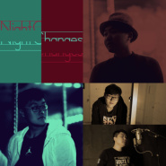

Night Changes夜色渐浓
============================

|  |  |
| :--: | :-- |
| [ Night Changes夜色渐浓](https://emumo.xiami.com/album/2103463555) | **艺人**: [Jove](../index.md) **语种**: 英语 **唱片公司**: 独立发行 **发行时间**: 2017年07月01日 **专辑类别**: 录音室专辑 **专辑风格**: 欧美流行 Western Pop, 电子 Electronic **播放数**: 99075 **收藏数**: 18 **评论数**: 0  |

## 简介

 
 

你是否想要哭泣？漫长的夜晚唯一能够听到的仅仅是空洞的心跳声…
 

你是否感到孤独？路灯陪伴的夜路，孤独的你像被丢弃的空啤酒罐…
 

你是否感到失落？在人生的旅途上不断前行却还没找到正确的方向…
 

 
 

如果眼泪不经意地流下来，靠在我的肩膀…
 

如果你需要关怀，我会给予你最需要的爱…
 

如果你的心渐渐冰冷，请别忘记我一直在…
 

 
 

这夜晚的更替，世事无常…
 

总有一些旋律会让人回忆，触及心灵…
 

 
 

第一个最完美的梦开始于2015年11月4日，在315A室
 
  

## 曲目

## 评论

