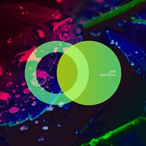
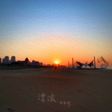

Jove
============================

|  |  |
| :--: | :-- |
| [ Jove](https://i.xiami.com/jove) | **地区**: China 中国大陆 **风格**:  **播放数**: 2830894 **粉丝数**: 364 **评论数**: 28  |

## 档案

中 文 名： 朱家瑞 
外 文 名： Jove 
别 名：朱瑞瑞、小朱老师 
国 籍： 中国 
民 族： 汉族 
星 座：摩羯座 
身 高： 181cm 
体 重： 77kg 
出 生 地： 山东省济南市 
出生日期： 1996年1月7日（农历11月17日） 
代表作品： 《傻样儿》《她的叮嘱》

## 专辑

| 名称 | 语种 | 唱片公司 | 发行时间 | 专辑类别 | 专辑风格 |
| :--: | :-- | :-- | :-- | :-- | :-- |
| [ T](./albums/5022487964.md) | 国语 | 独立发行 | 2021年01月18日 | EP, 单曲 | 胎教音乐 Prenatal Music |
| [ 2021 Cover Collection](./albums/5022294280.md) | 国语 | 独立发行 | 2021年01月01日 | 录音室专辑 | 流行 Pop, 乡村 Country |
| [ Uppingham](./albums/5022290135.md) | 英语 | 独立发行 | 2020年12月23日 | 录音室专辑 | 流行 Pop |
| [ X!X?](./albums/5021842900.md) | 国语 | 独立发行 | 2020年11月05日 | 录音室专辑 | 流行 Pop, 古风 GuFeng Music, 中国风 China-Wave |
| [ SERAPHINE](./albums/5021784778.md) | 国语 | 独立发行 | 2020年10月29日 | EP, 单曲 | 流行 Pop |
| [ Acid Facial](./albums/5021371106.md) | 其他 | Merlin Records | 2020年08月28日 | EP, 单曲 | 浩室舞曲 House |
| [ 平安](./albums/5021834170.md) | 国语 | 独立发行 | 2020年08月24日 | 录音室专辑 | 流行 Pop, 日本流行 J-Pop |
| [ 漂流](./albums/2108146184.md) | 国语 | 独立发行 | 2020年06月04日 | EP, 单曲 | 流行 Pop, 民谣 Folk |
| [ Metanoia / Djanga](./albums/5020782555.md) | 其他 | Merlin Records | 2020年05月29日 | EP, 单曲 | 浩室舞曲 House |
| [ Night Alone](./albums/5020674260.md) | 英语 |  | 2020年05月22日 | 录音室专辑 | 科技舞曲 Techno |
| [ 如果有一天If One Day](./albums/2108350038.md) | 国语 | 独立发行 | 2020年04月17日 | EP, 单曲 | 流行 Pop |
| [ 2020 Cover Collection2020年翻唱合集](./albums/2105758995.md) | 英语 | 独立发行 | 2020年01月20日 | 录音室专辑 | 乡村 Country |
| [ UNSPOKEN心照不宣](./albums/2105014028.md) | 国语 | 独立发行 | 2019年06月12日 | 录音室专辑 | 流行 Pop |
| [ 东南北无锡](./albums/2104859492.md) | 国语 |  | 2019年05月20日 | EP, 单曲 | 乡村 Country, 华语唱作人 Chinese Singer-Songwriter |
| [ 2019 Cover Collection2019年翻唱合集](./albums/2104673896.md) | 英语 | 独立发行 | 2019年03月11日 | 录音室专辑 | 国语流行 Mandarin Pop, 欧美流行 Western Pop, 乡村流行 Country Pop |
| [ Over Again](./albums/2104659362.md) | 英语 | CLUTCH Records LTD | 2019年03月04日 | EP, 单曲 |  |
| [ 她的叮嘱Her Words](./albums/2104596015.md) | 国语 | 独立发行 | 2019年02月19日 | EP, 单曲 | 乡村流行 Country Pop, 国语流行 Mandarin Pop |
| [ 傻样儿](./albums/2104174161.md) | 国语 | 华数唱片 | 2018年10月17日 | EP, 单曲 | 流行 Pop |
| [ 想她就写信Miss Her Write Her](./albums/2103710903.md) | 国语 | 独立发行 | 2018年05月25日 | 录音室专辑 | 国语流行 Mandarin Pop |
| [ Por Tu Amor](./albums/2103861224.md) | 英语 | Indiefy United | 2018年03月27日 | EP, 单曲 | 拉美音乐 Latin American Music |
| [ 小幸运A Little Happiness](./albums/2103528773.md) | 国语 | 独立发行 | 2018年02月14日 | 录音室专辑 | 国语流行 Mandarin Pop |
| [ Christmas Eve圣诞夜](./albums/2103351037.md) | 英语 | 独立发行 | 2017年12月25日 | EP, 单曲 | 欧美流行 Western Pop |
| [ Initial CreationABOUT FIRST TRY](./albums/2102884597.md) | 纯音乐 | 独立发行 | 2017年10月02日 | 录音室专辑 | 电子 Electronic, 科技舞曲 Techno, 氛围音乐 Ambient |
| [ Night Changes夜色渐浓](./albums/2103463555.md) | 英语 | 独立发行 | 2017年07月01日 | 录音室专辑 | 欧美流行 Western Pop, 电子 Electronic |
| [ Never Say NeverSPECIAL EDITION](./albums/2102702376.md) | 英语 | 独立发行 | 2017年03月03日 | EP, 单曲 | 欧美流行 Western Pop, 流行 Pop |
| [ Unknown Future](./albums/5022108499.md) | 英语 | 独立发行 | 不详 | 录音室专辑 | 流行 Pop, 日本动漫游戏 Japanese ACG |

## 评论

|  |  |  |
| :-- | :-- | :-- |
|  [虾米用户](https://emumo.xiami.com/u/294408265) 我多想痛哭一场，然而我觉... 2020-11-14 09:37 赞(0) 踩(0) | 
好听，加油！
 |
|  [虾米用户](https://emumo.xiami.com/u/356565070)  2020-05-20 08:59 赞(0) 踩(0) | 
封面真有❤️
 |
|  [虾米用户](https://emumo.xiami.com/u/379035319)  2019-06-13 21:06 赞(0) 踩(0) | 
唱歌挺好的，就是唯一好奇简介里的书香门第和音乐八竿子打不着吧
 |
|  [虾米用户](https://emumo.xiami.com/u/33571701)   2019-02-19 11:03 赞(0) 踩(0) | 
弟弟加油！你是最棒的！
 |
|  [虾米用户](https://emumo.xiami.com/u/370507046) 我以为生命的完整是因为你... 2018-05-22 14:36 赞(2) 踩(0) | 
其实关注你很久了啊所以请加油
 |
|  [虾米用户](https://emumo.xiami.com/u/341995436)  2017-12-31 01:09 赞(1) 踩(0) | 
兄弟加油！！！
 |
|  [虾米用户](https://emumo.xiami.com/u/147030544) 无法所说… 2017-12-10 10:55 赞(1) 踩(0) | 
我很喜欢他唱的歌
 |
|  [虾米用户](https://emumo.xiami.com/u/43673908) 暂无签名~ 2015-03-26 22:13 赞(1) 踩(0) | 
感觉更棒了呢，棒棒哒✌
 |
|  [虾米用户](https://emumo.xiami.com/u/43673908) 暂无签名~ 2015-03-26 22:13 赞(1) 踩(0) | 
终于又发新歌了，好棒
 |
|  [虾米用户](https://emumo.xiami.com/u/45808676)  2015-01-24 02:54 赞(1) 踩(0) | 

 |
|  [虾米用户](https://emumo.xiami.com/u/43871913)  2015-01-06 17:31 赞(1) 踩(0) | 
我只是来支持一下的
 |
|  [虾米用户](https://emumo.xiami.com/u/43673908) 暂无签名~ 2014-12-05 12:07 赞(1) 踩(0) | 
喜欢你的歌～
 |
|  [虾米用户](https://emumo.xiami.com/u/43673908) 暂无签名~ 2014-12-05 12:07 赞(2) 踩(0) | 
喜欢你的声音～
 |
|  [虾米用户](https://emumo.xiami.com/u/43667749) 为音乐而生。 2014-11-25 15:28 赞(1) 踩(0) | 
相信你的耳朵，这是一个特别的声音。多多支持一下！
 |
|  [虾米用户](https://emumo.xiami.com/u/43673908) 暂无签名~ 2014-11-24 13:29 赞(1) 踩(0) | 
introducing me
 |
|  [虾米用户](https://emumo.xiami.com/u/43673908) 暂无签名~ 2014-11-24 13:20 赞(1) 踩(0) | 
棒棒哒～
 |
|  [虾米用户](https://emumo.xiami.com/u/44052037)  2014-11-24 13:04 赞(1) 踩(0) | 
特意来的哟
 |
|  [虾米用户](https://emumo.xiami.com/u/44010232)  2014-11-23 09:13 赞(1) 踩(0) | 
赞，赞，赞
 |
|  [虾米用户](https://emumo.xiami.com/u/43937107)  2014-11-21 09:16 赞(1) 踩(0) | 
太棒了！
 |
|  [虾米用户](https://emumo.xiami.com/u/43794131) 暂无签名~ 2014-11-19 21:56 赞(1) 踩(0) | 
不错，呱唧呱唧！
 |
|  [虾米用户](https://emumo.xiami.com/u/43667749) 为音乐而生。 2014-11-19 20:28 赞(1) 踩(0) | 
声音太好了，希望朋友们去关注一下！
 |
|  [虾米用户](https://emumo.xiami.com/u/43673908) 暂无签名~ 2014-11-18 09:20 赞(0) 踩(0) | 
终极粉丝永远挺你～
 |
|  [虾米用户](https://emumo.xiami.com/u/43673908) 暂无签名~ 2014-11-18 09:19 赞(1) 踩(0) | 
希望能够多发表歌曲哦，很好听～/可爱
 |
|  [虾米用户](https://emumo.xiami.com/u/43777689)  2014-11-16 22:16 赞(1) 踩(0) | 
hao
 |
|  [虾米用户](https://emumo.xiami.com/u/43673908) 暂无签名~ 2014-11-14 20:28 赞(0) 踩(0) | 
唉吆，不错哦！！！
 |
|  [虾米用户](https://emumo.xiami.com/u/43672267)  2014-11-14 13:33 赞(0) 踩(0) | 
好棒
 |
|  [虾米用户](https://emumo.xiami.com/u/43667749) 为音乐而生。 2014-11-14 11:37 赞(1) 踩(0) | 
好听
 |
|  [虾米用户](https://emumo.xiami.com/u/43667749) 为音乐而生。 2014-11-14 11:23 赞(1) 踩(0) | 
好听   特别喜欢  ，声音太好
 |
