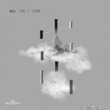
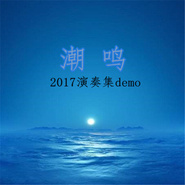
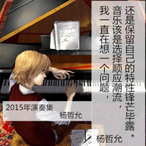

杨花谢
============================

|  |  |
| :--: | :-- |
| [ 杨花谢](https://i.xiami.com/zeyang) | **地区**: China 中国大陆 **风格**: 轻音乐 Easy Listening **播放数**: 2320179 **粉丝数**: 1246 **评论数**: 19  |

## 档案

一个人的浮世清欢，一个人的细水长流。 
曲谱均来自网络，翻奏如有侵权，联系删除。

## 专辑

| 名称 | 语种 | 唱片公司 | 发行时间 | 专辑类别 | 专辑风格 |
| :--: | :-- | :-- | :-- | :-- | :-- |
| [ way back home-纯钢琴](./albums/2104784285.md) | 纯音乐 |  | 2019年04月17日 | 录音室专辑 | 爵士流行 Jazz Pop, 流行说唱 Pop Rap, 轻音乐 Easy Listening |
| [ 出山 remix](./albums/2104780577.md) | 纯音乐 |  | 2019年04月16日 | 精选集 | 迷幻民谣 Psychedelic Folk, 民谣流行 Folk Pop, 轻音乐 Easy Listening |
| [ 告白之夜（钢琴简版）翻-ayasa](./albums/2104716030.md) | 纯音乐 |  | 2019年03月08日 | 录音室专辑 | 流行 Pop |
| [ 林俊杰合集](./albums/2104085136.md) | 国语 | 独立发行 | 2018年10月18日 | 录音室专辑 |  |
| [ 周杰伦合集周杰伦合集](./albums/2104082731.md) | 国语 | 独立发行 | 2018年10月06日 | 录音室专辑 |  |
| [ 核爆核爆](./albums/2104062067.md) | 国语 | 独立发行 | 2018年09月27日 | 录音室专辑 |  |
| [ BOOMBOOM](./albums/2103950321.md) | 国语 | 独立发行 | 2018年08月09日 | 录音室专辑 |  |
| [ 起风了起风了](./albums/2103809695.md) | 国语 | 独立发行 | 2018年07月16日 | EP, 单曲 | 流行 Pop, 国语流行 Mandarin Pop, 电音流行 Electropop |
| [ 起风了-钢琴（live）](./albums/2103771938.md) | 国语 | 独立发行 | 2018年07月01日 | 录音室专辑 | 流行 Pop |
| [ 2017年演奏集demo2017年演奏集demo](./albums/2102741169.md) | 国语 | 独立发行 | 2017年05月02日 | 现场专辑 | 流行 Pop |
| [ 故梦](./albums/2102687047.md) | 国语 | 独立发行 | 2017年01月01日 | EP, 单曲 | 国语流行 Mandarin Pop |
| [ 2015年演奏集](./albums/2100267546.md) | 国语 | 独立发行 | 2016年01月20日 | 合集, 杂锦 | 流行 Pop |
| [ 路易XIV](./albums/434115994.md) | 国语 | 独立发行 | 2015年06月08日 | 播客 | 国语流行 Mandarin Pop |
| [ 菊次郎的夏天](./albums/2104781275.md) | 纯音乐 |  | 不详 | 录音室专辑 | 爵士流行 Jazz Pop, 青少年流行 Teen Pop, 民谣流行 Folk Pop |
| [ 流行经典01](./albums/2104716031.md) | 纯音乐 |  | 不详 | 录音室专辑 | 流行 Pop |
| [ 蒲公英的约定](./albums/2104781283.md) | 纯音乐 |  | 不详 | EP, 单曲 | 国语流行 Mandarin Pop, 轻音乐 Easy Listening |
| [ 五月天-将军令-钢琴](./albums/2104781295.md) | 纯音乐 |  | 不详 | EP, 单曲 | 流行摇滚 Pop Rock, 国语流行 Mandarin Pop, 轻音乐 Easy Listening |

## 评论

|  |  |  |
| :-- | :-- | :-- |
|  [虾米用户](https://emumo.xiami.com/u/436728029) 我还没想好要写什么... 2020-12-17 08:11 赞(0) 踩(0) | 
雨天也会飞了吗 
 |
|  [虾米用户](https://emumo.xiami.com/u/1420489) music die no 2020-09-10 16:15 赞(0) 踩(0) | 
不好意思，是小哥哥孤寡孤寡孤寡
 |
|  [虾米用户](https://emumo.xiami.com/u/358104299) 悲观的唯心存在现实解构虚... 2019-06-30 11:53 赞(0) 踩(0) | 
12548
 |
|  [虾米用户](https://emumo.xiami.com/u/300822654) 我走啦 2017-06-17 08:15 赞(0) 踩(0) | 
看到虾米评论这么多喷子喷伦桑，伦桑明明唱的很好听嘛 
 |
|  [虾米用户](https://emumo.xiami.com/u/261701779) 我还没想好要写什么... 2017-01-15 16:49 赞(1) 踩(0) | 
喷的人究竟在喷什么。自己能唱成这样嘛？
 |
|  [虾米用户](https://emumo.xiami.com/u/199653892)  2016-08-05 14:00 赞(1) 踩(0) | 
仓颉第一段竟然不加伴奏，也是醉了
 |
|  [虾米用户](https://emumo.xiami.com/u/148363562)  2016-05-29 20:49 赞(1) 踩(0) | 
演奏集很好听啊 
 |
|  [虾米用户](https://emumo.xiami.com/u/110738514)  2016-03-13 23:49 赞(1) 踩(0) | 
唱歌咬字再清楚一点，转音和低音再稳一点，音准提高一点，感情再带入一点就好了
 |
|  [虾米用户](https://emumo.xiami.com/u/59375008)  2016-01-01 12:01 赞(1) 踩(0) | 
呵呵，我也是醉了，没看到那些都是live版的吗？演唱会他都唱得喉咙出血了，你妹的，还有没有良心了！！！
 |
|  [虾米用户](https://emumo.xiami.com/u/53738421)  2016-01-01 11:58 赞(2) 踩(0) | 
虾米这水也是够深的哈，去看看那些没有用land套餐的音乐人，被黑得那叫一个惨。
 |
|  [虾米用户](https://emumo.xiami.com/u/80683978)  2015-11-25 20:48 赞(0) 踩(0) | 
加油
 |
|  [虾米用户](https://emumo.xiami.com/u/80683978)  2015-11-25 20:48 赞(1) 踩(0) | 
挺好听的啊 
 |
|  [虾米用户](https://emumo.xiami.com/u/85766640)  2015-11-23 16:53 赞(0) 踩(0) | 
谁给你的勇气唱的这叫一个难听！
 |
| ⇒ |  [虾米用户](https://emumo.xiami.com/u/48186419) 城南李花开，城北杨花谢 2016-01-01 11:54 赞(0) 踩(0) | 
你啊 
 |
| ⇒ |  [虾米用户](https://emumo.xiami.com/u/93624582) 故乡，是天际线的白色沙海... 2017-10-07 06:13 赞(0) 踩(0) | 
卧槽还有你是他妈哪根葱？
 |
| ⇒ |  [虾米用户](https://emumo.xiami.com/u/93624582) 故乡，是天际线的白色沙海... 2017-10-07 06:13 赞(0) 踩(0) | 
人家唱成啥样和你有关？
 |
| ⇒ |  [虾米用户](https://emumo.xiami.com/u/378688663)  2019-06-17 22:13 赞(0) 踩(0) | 
<q><b>旎说：</b></q>
 |
|  [虾米用户](https://emumo.xiami.com/u/48186419) 城南李花开，城北杨花谢 2015-05-03 00:01 赞(21) 踩(0) | 
我刚入驻了虾米音乐人，欢迎大家来我的个人主页，收听我的最新音乐
 |
