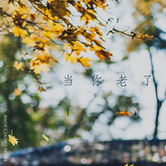

Andy Chow
============================

|  |  |
| :--: | :-- |
| [ Andy Chow](https://i.xiami.com/zhouxiaozhou) | **地区**: China 中国大陆 **风格**: 氛围回响 Ambient Dub, 极简主义 Minimalism, 现代古典 Modern Classical, 电影原声 Film Score, 独立民谣 Indie Folk **播放数**: 1512500 **粉丝数**: 54 **评论数**: 10  |

## 档案

## 专辑

| 名称 | 语种 | 唱片公司 | 发行时间 | 专辑类别 | 专辑风格 |
| :--: | :-- | :-- | :-- | :-- | :-- |
| [ Andy的翻唱集](./albums/2102819151.md) | 国语 | 独立发行 | 2017年08月11日 | 录音室专辑 | 国语流行 Mandarin Pop |
| [ Something Jazzy](./albums/2102798304.md) | 国语 | 独立发行 | 2017年07月14日 | 录音室专辑 | 爵士流行 Jazz Pop |
| [ 当你老了](./albums/2102704287.md) | 国语 | 独立发行 | 2017年02月28日 | EP, 单曲 |  |
| [ 福尔摩斯概念集 I](./albums/2102659836.md) | 英语 | 独立发行 | 2016年11月15日 | 录音室专辑 |  |
| [ 烟火集大学期间作品](./albums/2102690181.md) | 国语 | 独立发行 | 2013年06月08日 | 录音室专辑 |  |

## 评论

|  |  |  |
| :-- | :-- | :-- |
|  [虾米用户](https://emumo.xiami.com/u/346165752)  2019-03-11 18:51 赞(0) 踩(0) | 

 |
|  [虾米用户](https://emumo.xiami.com/u/48966183) 但行好事，莫问前程。 2016-02-02 00:12 赞(2) 踩(0) | 
挺好的
 |
|  [虾米用户](https://emumo.xiami.com/u/3990960)  2015-11-28 00:31 赞(0) 踩(0) | 
加油哇~
 |
|  [虾米用户](https://emumo.xiami.com/u/35448128) 自由音乐人 2015-10-07 11:55 赞(0) 踩(0) | 
哇塞，既能写又能唱，过来膜拜一下
 |
| ⇒ |  [虾米用户](https://emumo.xiami.com/u/8182072) Be real. 2015-10-07 12:08 赞(0) 踩(0) | 
可惜都不精，羡慕你的和声学得真好
 |
|  [虾米用户](https://emumo.xiami.com/u/3990960)  2015-06-11 22:57 赞(0) 踩(0) | 
过来点赞！歌写的很好！
 |
| ⇒ |  [虾米用户](https://emumo.xiami.com/u/8182072) Be real. 2015-06-12 19:43 赞(0) 踩(0) | 
刀哥过奖啦，我们以后继续合作写歌~
 |
|  [虾米用户](https://emumo.xiami.com/u/8182072) Be real. 2015-03-28 10:46 赞(0) 踩(0) | 
我刚入驻了虾米音乐人，欢迎大家来我的个人主页，收听我的最新音乐
 |
| ⇒ |  [虾米用户](https://emumo.xiami.com/u/49523160) 我很想你 2015-05-10 08:52 赞(0) 踩(0) | 
唱的很好
 |
| ⇒ |  [虾米用户](https://emumo.xiami.com/u/8182072) Be real. 2015-06-23 18:42 赞(0) 踩(0) | 
<q><b>LCHAING说：</b></q>
 |
