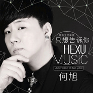
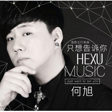

何旭
============================

|  |  |
| :--: | :-- |
| [ 何旭](https://i.xiami.com/hexu) | **地区**: China 中国大陆 **风格**: 国语流行 Mandarin Pop, 华语唱作人 Chinese Singer-Songwriter **播放数**: 1358325 **粉丝数**: 37 **评论数**: 5  |

## 档案

姓名：何旭 
职业：歌手 
国籍：中国（内地） 
生日：5月13日 
星座：金牛座 
民族: 汉族 
身高：185cm 
喜欢的运动：篮球 羽毛球 
喜欢的食物：西瓜 梨 
喜欢的地方：丽江 拉萨 
喜欢的动物：狗 
代表作:《你是我的宝贝》 
兴趣爱好 
讨厌的食物：榴莲 
喜欢的零食：薯片 
喜欢的颜色：蓝色 
偶像：张学友 
喜欢的男演员：周润发、梁朝伟、李小龙、周星驰 
喜欢的电影：《古惑仔》 
喜欢的游戏：CS、魔兽世界、97格斗 
兴趣：音乐、旅游 
2015年度实力唱将何旭携手金丝美文化推出的唯美浪漫主义情歌《你是我的宝贝》。由何旭作词并演唱，思豪谱曲，，以他那富有磁性机具诱惑力的独特嗓音，加入细腻婉转的唱功，将这首主打歌《你是我的宝贝》唱的委婉动人，那欢快的节奏，动人的旋律，听上去仿佛在为我们讲述一个唯美的爱情故事。

## 专辑

| 名称 | 语种 | 唱片公司 | 发行时间 | 专辑类别 | 专辑风格 |
| :--: | :-- | :-- | :-- | :-- | :-- |
| [ 爱情游戏](./albums/2104937603.md) | 国语 | 酷乐传媒 | 2019年06月10日 | EP, 单曲 |  |
| [ 你是我的宝贝 (DJ版)](./albums/2104442014.md) | 国语 | 回声文化 | 2019年01月03日 | EP, 单曲 | 国语流行 Mandarin Pop |
| [ 无乐不作REMIX混音极选](./albums/2104426800.md) | 国语 |  | 2018年12月29日 | EP, 单曲 | 电子舞曲 EDM / Electronic Dance Music |
| [ 何旭-无法阻挡（Made In抚顺Dj大圣 Radio）](./albums/2103529856.md) | 国语 | 独立发行 | 2018年02月16日 | EP, 单曲 | 电子 Electronic |
| [ 无法阻挡](./albums/2102801453.md) | 国语 | 回声文化 | 2017年07月23日 | EP, 单曲 | 国语流行 Mandarin Pop |
| [ 只想告诉你](./albums/2102714419.md) | 国语 | 独立发行 | 2017年03月17日 | EP, 单曲 | 电子 Electronic |
| [ 只想告诉你](./albums/2100301508.md) | 国语 | 回声文化 | 2016年03月28日 | EP, 单曲 |  |
| [ 聆听。旭情歌](./albums/2100300638.md) | 国语 | 独立发行 | 2016年03月26日 | 精选集 | 国语流行 Mandarin Pop, 电音流行 Electropop |
| [ 只想告诉你](./albums/2100300664.md) | 国语 | 独立发行 | 2016年03月26日 | EP, 单曲 | 国语流行 Mandarin Pop |
| [ 你是我的宝贝](./albums/330965863.md) | 国语 | 回声文化 | 2015年05月06日 | EP, 单曲 | 流行舞曲 Dance-Pop, 独立电子乐 Indietronica, 国语流行 Mandarin Pop |

## 评论

|  |  |  |
| :-- | :-- | :-- |
|  [虾米用户](https://emumo.xiami.com/u/66455124) 等风来……～ 2018-11-25 08:26 赞(0) 踩(0) | 
喜欢动感的音乐，回放无数次  
 |
|  [虾米用户](https://emumo.xiami.com/u/293692544) 你敢给我说话吗？我咬你 2017-12-17 19:28 赞(1) 踩(0) | 
好
 |
|  [虾米用户](https://emumo.xiami.com/u/125436524)  2017-07-23 10:34 赞(1) 踩(0) | 
 
 |
|  [虾米用户](https://emumo.xiami.com/u/122688364) 生在愤坑，长在赤圈；挣脱 2016-08-17 00:14 赞(1) 踩(0) | 
2633
 |
|  [虾米用户](https://emumo.xiami.com/u/55509078) 何旭 2016-03-26 09:31 赞(2) 踩(0) | 
我刚入驻了虾米音乐人，欢迎大家来我的个人主页，收听我的最新音乐
 |
