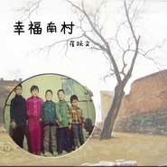

幸福南村
============================

|  |  |
| :--: | :-- |
| [ 幸福南村](https://emumo.xiami.com/album/2100187536) | **艺人**: [崔跃文](../index.md) **语种**: 国语 **唱片公司**: 独立发行 **发行时间**: 2015年08月31日 **专辑类别**: EP, 单曲 **专辑风格**: 独立民谣 Indie Folk **播放数**: 286673 **收藏数**: 54 **评论数**: 16  |

## 简介

关于《幸福南村》
 

“幸福南村”是我童年生活的地方，我儿时的记忆几乎都在那里。它一边倚靠着黄河一边临近110国道，是乌海市最大的一片贫民区。那里的人基本都是从河套农村过来的务工人员，主要以开拖拉机运送沙土做为谋生手段，俗称：受苦人。
 

村子的东边是当时乌海最大的洗煤厂和化工厂，所以会有大量的污水沿着村子排向黄河。黄河一天一天被污染，村子一天一天的破败，唯一无忧无虑的就是在那污水沟周围玩耍的孩子。村民呼吸着烧焦了的空气在那片土地上奔波着生计，只为能盖起一套起脊挂瓦的砖房或者能把拖拉机换成小货车。能够每年大人小孩都能穿上新衣服回老家过年的就足以称之为小康家庭了……
 

几年前“幸福南村”拆迁了，被夷为平地的村子就像每个人的童年一样静静地留在了过去，现在的自己一头扎进喧嚣中开始消耗自己的初衷。时间久了人们需要回去看一看来时的路，或许在那里能遇见最初的自己……
 

 
 

 

## 曲目

## 评论

|  |  |  |
| :-- | :-- | :-- |
|  [虾米用户](https://emumo.xiami.com/u/337132611)  2019-02-07 09:56 赞(0) 踩(0) | 
我也是五原人，他是我们的骄傲！！让我们的五原一起宏伟起来吧！
 |
|  [虾米用户](https://emumo.xiami.com/u/1835156)  2017-01-14 22:17 赞(0) 踩(0) | 
好听有味道
 |
|  [虾米用户](https://emumo.xiami.com/u/191965290)  2016-08-09 13:38 赞(1) 踩(0) | 
河套话！
 |
|  [虾米用户](https://emumo.xiami.com/u/35501540)  2016-03-07 00:47 赞(0) 踩(0) | 
四位民谣、摇滚歌手：贰佰、崔跃文， 王喂马、王天一（王喂马乐队）——承德市 路上酒吧 2016年3月19日周六20:00小型民谣演唱会：
 |
|  [虾米用户](https://emumo.xiami.com/u/33025)   2016-02-02 14:18 赞(0) 踩(0) | 
很好听！足劲儿！
 |
|  [虾米用户](https://emumo.xiami.com/u/51805024) 一只特立独行的蜗牛 2015-12-02 21:45 赞(0) 踩(0) | 

 |
|  [虾米用户](https://emumo.xiami.com/u/15393299)  2015-11-23 12:50 赞(1) 踩(0) | 
河套老乡点个赞，终于有了河套话唱的歌了！
 |
|  [虾米用户](https://emumo.xiami.com/u/42872840) the show goe... 2015-10-08 20:59 赞(0) 踩(0) | 
我是在他乡的乌海人
 |
|  [虾米用户](https://emumo.xiami.com/u/69512832)  2015-10-06 22:19 赞(0) 踩(0) | 
我也在乌海人！这是后套人，巴盟口音！唱的真好！乌海人的骄傲啊！挺你！
 |
|  [虾米用户](https://emumo.xiami.com/u/313539)  2015-09-21 22:49 赞(0) 踩(0) | 
山西马飞 
 |
|  [虾米用户](https://emumo.xiami.com/u/33993975)  2015-09-16 14:19 赞(0) 踩(0) | 
看我美吗~~~~~~~~~~~~~~~
 |
|  [虾米用户](https://emumo.xiami.com/u/42935681)  2015-09-12 11:49 赞(2) 踩(0) | 
老崔的家乡具体是哪的？和我一样口音，内蒙古临河的吗？
 |
|  [虾米用户](https://emumo.xiami.com/u/38788002) 我是你的 2015-09-06 16:18 赞(2) 踩(0) | 
萌得像一碗鱼丸粗面……
 |
|  [虾米用户](https://emumo.xiami.com/u/52841088)  2015-08-31 20:06 赞(0) 踩(0) | 
好听
 |
|  [虾米用户](https://emumo.xiami.com/u/37423837)  2015-08-31 19:33 赞(0) 踩(0) | 
很突破的单曲，赞
 |
|  [虾米用户](https://emumo.xiami.com/u/40577413) - 2015-08-31 17:58 赞(0) 踩(0) | 
1
 |
