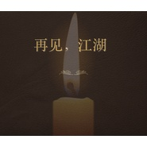

再见，江湖缅怀金庸先生
============================

|  |  |
| :--: | :-- |
| [ 再见，江湖缅怀金庸先生](https://emumo.xiami.com/album/2104167493) | **艺人**: [崔跃文](../index.md) **语种**: 国语 **唱片公司**:  **发行时间**: 2018年11月01日 **专辑类别**: EP, 单曲 **专辑风格**: 摇滚 Rock & Roll, 当代民谣 Contemporary Folk, 民谣流行 Folk Pop **播放数**: 16889 **收藏数**: 10 **评论数**: 2  |

## 简介

昨天下午7点55看到金庸先生去世，让我很是难过。12岁看第一部小说《天龙八部》的时候我就立志要变的牛逼，牛逼以后就能有机会见到金庸先生，和他聊一聊他笔下那些人物，那些感情，那些种种，然而我没有变的牛逼，所以也没能见到那个影响我很大一部分性格的人。 突闻噩耗让我很是惊恐，从昨天下午坐在电脑前一直到第二天中午，想写点什么来缅怀这位大侠，于是有了这个一晚上创作的作品，写歌加demo制作用了12个小时，只是想在这个时候用来缅怀，凌晨5点睡意朦胧的唱了这一版，不管效果，那个时候的我已经被时间拉扯到无数个捧着金庸先生的文字的夜晚，他给了我一个江湖，不论是书中的江湖或是现实中的江湖，我们都身在其中。又为他通宵了一次，不像那些通宵看书的夜晚失去阿朱，失去郭襄，失去小昭一样的惋惜，这是一种悲伤，我们谁都战胜不了时间。 再见，江湖，再见，你。 

## 曲目

## 评论

|  |  |  |
| :-- | :-- | :-- |
|  [虾米用户](https://emumo.xiami.com/u/345265947) 有梦，逐梦，想过， 2020-04-25 15:49 赞(0) 踩(0) | 
5555555555555555555555555555555555555555 5555555555555555555555555
 |
|  [虾米用户](https://emumo.xiami.com/u/224372052) 我还没想好要写什么... 2018-11-01 13:21 赞(0) 踩(0) | 
可以添加影视作品的背景音乐
 |
