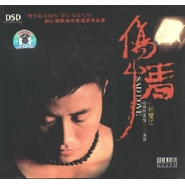

任双江
============================

|  |  |
| :--: | :-- |
| [ 任双江](https://i.xiami.com/jasonren) | **播放数**: 1888186 **粉丝数**: 59 **评论数**: 8 **地区**: China 中国大陆 **风格**: 国语流行 Mandarin Pop  |

## 档案

任双江，艺名深夜地下铁，曾入伍上海海军医学研究所，退伍后至今一直从事文艺工作，曾签约为娱乐基地签约歌手，2007年11月签约中盛唱片，全能创作偶像新人王，实力唱将。 
他 - 音乐风格 
07流行乐坛 最动情的声音 
优质声音 深厚唱功 释放强烈个人音乐风格 
刚中带柔 透人心扉 
性感歌声撕裂你最坚硬的防线 
他 - 音乐历程 
全国300多家电台，200多家电视台推出地下铁的宣传碟与个人MV 
全国直辖市、省会及重要城市KTV、移动公交火热播出地下铁歌曲MV

## 专辑

| 名称 | 语种 | 唱片公司 | 发行时间 | 专辑类别 | 专辑风格 |
| :--: | :-- | :-- | :-- | :-- | :-- |
| [ 等我的前奏](./albums/445255.md) | 国语 | 我爱唱 | 2011年06月15日 | 录音室专辑 |  |
| [ 听说](./albums/435703.md) | 国语 | 我爱唱 | 2011年04月11日 | EP, 单曲 |  |
| [ 这个冬天](./albums/421775.md) | 国语 | 我爱唱 | 2011年01月12日 | EP, 单曲 |  |
| [ 伤情](./albums/572507.md) | 国语 | 爱乐新世纪 | 2008年01月02日 | 录音室专辑 | 国语流行 Mandarin Pop |

## 评论

|  |  |  |  |
| :-- | :-- | :-- | :-- |
|  [虾米用户](https://emumo.xiami.com/u/330698531) 我还没想好要写什么... 2020-06-25 03:52 赞(0) 踩(0) | 
我在马来西亚槟城&amp;hellip;
 |
|  [虾米用户](https://emumo.xiami.com/u/293692544) 你敢给我说话吗？我咬你 2019-03-11 16:54 赞(2) 踩(0) | 
好听
 |
|  [虾米用户](https://emumo.xiami.com/u/418507280)  2019-02-14 01:37 赞(2) 踩(0) | 
我住在台灣。特別喜愛"聽說"，"寫給你的歌"這兩首歌，不但詞曲均佳，唱得更是令人感動，一聽就愛上了。加油，任双江，會一直支持你的創作！
 |
|  [虾米用户](https://emumo.xiami.com/u/16135450)  2017-05-11 00:00 赞(3) 踩(0) | 
9799
 |
|  [虾米用户](https://emumo.xiami.com/u/246332337)   2017-03-01 16:10 赞(1) 踩(0) | 
这什么几把东西 怎么变成我雅思听力专辑封面了 真他妈恶心这逼脸
 |
|  [虾米用户](https://emumo.xiami.com/u/2936164) 等待 2014-07-06 17:53 赞(3) 踩(0) | 
我刚入驻了虾米音乐人，欢迎大家来我的个人主页，收听我的最新音乐
 |
|  [虾米用户](https://emumo.xiami.com/u/25978572)  2014-01-24 11:47 赞(2) 踩(0) | 
哥还不错，能听得下去。。顶一下。额，是歌。
 |
|  [虾米用户](https://emumo.xiami.com/u/25978572)  2014-01-24 11:47 赞(2) 踩(0) | 
沙发。
 |
