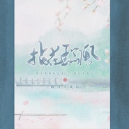
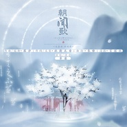
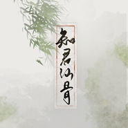
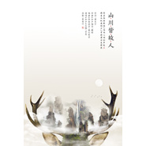
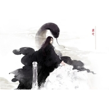
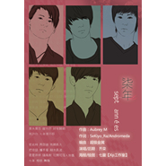

齐栾
============================

|  |  |
| :--: | :-- |
| [ 齐栾](https://i.xiami.com/wessia3507) | **地区**: China 中国大陆 **风格**: 日本流行 J-Pop, 韩国流行 K-Pop, 古风 GuFeng Music **播放数**: 3218505 **粉丝数**: 2264 **评论数**: 101  |

## 档案

齐栾的音乐，总能给人强烈的印象，她总是用一种非常细腻的感情描绘韵律，但是同时，又能做到不动声色，这种特质让人牢牢记住，齐栾这个名字。似乎在齐栾的世界里，歌曲原就是本真。她拒绝所有自欺欺人的美感，想要抵达人心的内核。她一直靠直觉唱歌，直觉是个骗人的词汇。但是对于齐栾，这个词大而化之就够了。她需要的仅仅是听众。她的每首歌曲，总有那么一段、或是一句一词，情不自禁地，对自己歌曲的主人公微笑一下。 　　齐栾的每一首歌都是崭新的生命，她倾尽感情去描绘、凝视每一个轮回。 　　对她来说，不需要人群欢呼，观众席萤火虫般星星点点的荧光。仅仅每个塞上耳机听她声音的人，足矣与她无限接近或是酣畅淋漓。

## 专辑

| 名称 | 语种 | 唱片公司 | 发行时间 | 专辑类别 | 专辑风格 |
| :--: | :-- | :-- | :-- | :-- | :-- |
| [ 拈花临风](./albums/5021289310.md) | 国语 | 独立发行 | 2020年08月18日 | 录音室专辑 | 中国风 China-Wave, 古风 GuFeng Music |
| [ 判命我是大仙尊主题曲](./albums/5020779014.md) | 国语 | 独立发行 | 2020年05月28日 | 录音室专辑 | 流行 Pop |
| [ 探舟](./albums/5020665176.md) | 国语 | 独立发行 | 2020年05月22日 | 录音室专辑 | 中国风 China-Wave |
| [ 清风不寄水云间](./albums/2108386092.md) | 国语 | 独立发行 | 2020年04月24日 | 录音室专辑 | 古风 GuFeng Music, 中国风 China-Wave |
| [ 辋川客——记王维&裴迪](./albums/2108312008.md) | 国语 | 独立发行 | 2020年04月11日 | 录音室专辑 | 中国风 China-Wave |
| [ 星尘继扬2020宋继扬生贺](./albums/2105758055.md) | 国语 | 独立发行 | 2020年01月22日 | 录音室专辑 | 古风 GuFeng Music |
| [ 朝闻歌](./albums/2105421714.md) | 国语 |  | 2019年11月08日 | 录音室专辑 |  |
| [ 有匪《有匪》群像同人曲](./albums/2105317234.md) | 国语 |  | 2019年10月07日 | 录音室专辑 | 古风 GuFeng Music, 国语流行 Mandarin Pop |
| [ 天地藏春民国文人女子群像](./albums/2105308483.md) | 国语 |  | 2019年10月04日 | 录音室专辑 | 佛教音乐 Buddhist Music |
| [ 荆棘《影后谋略》主题曲](./albums/2105301297.md) | 国语 |  | 2019年10月02日 | EP, 单曲 | 流行 Pop, 国语流行 Mandarin Pop |
| [ 知君仙骨](./albums/2105160035.md) | 国语 |  | 2019年08月18日 | EP, 单曲 | 古风 GuFeng Music |
| [ 桃花坞](./albums/2104955996.md) | 国语 |  | 2019年06月21日 | 录音室专辑 | 古风 GuFeng Music |
| [ 葛生梦](./albums/2104348552.md) | 国语 |  | 2018年12月06日 | EP, 单曲 | 古风 GuFeng Music |
| [ 青梅时雨](./albums/2104057240.md) | 国语 | 独立发行 | 2018年09月27日 | EP, 单曲 | 古风 GuFeng Music |
| [ 禅色因](./albums/2102754296.md) | 国语 | 独立发行 | 2017年05月15日 | EP, 单曲 | 古风 GuFeng Music |
| [ The Better Reason](./albums/2102754292.md) | 英语 | 独立发行 | 2017年04月23日 | EP, 单曲 | 情绪硬核 Emo |
| [ 年眠不觉](./albums/2100277148.md) | 国语 | 独立发行 | 2016年02月17日 | EP, 单曲 | 古风 GuFeng Music |
| [ 他和他的江湖](./albums/2102754140.md) | 国语 | 独立发行 | 2015年12月27日 | EP, 单曲 | 中国风 China-Wave |
| [ 山川皆故人](./albums/2100226980.md) | 国语 | 独立发行 | 2015年08月22日 | EP, 单曲 | 国语流行 Mandarin Pop, 古风 GuFeng Music |
| [ 执守](./albums/2102676699.md) | 国语 | 独立发行 | 2015年05月05日 | EP, 单曲 | 古风 GuFeng Music |
| [ 梨花雨](./albums/2100227620.md) | 国语 | 独立发行 | 2014年05月30日 | EP, 单曲 | 国语流行 Mandarin Pop, 古风 GuFeng Music |
| [ 旅途·故乡](./albums/1772143021.md) | 国语 | 独立发行 | 2012年02月12日 | EP, 单曲 | 古风 GuFeng Music |
| [ 柒年](./albums/550201.md) | 国语 | 齐栾 | 2012年02月05日 | EP, 单曲 | 国语流行 Mandarin Pop, 中国风 China-Wave |
| [ 策藏策藏•一剑浮生梦](./albums/513590.md) | 国语 | 菊醉 | 2011年07月29日 | EP, 单曲 |  |
| [ 天光天光·首唱 TO 墨香](./albums/513594.md) | 国语 | 独立发行 | 2011年02月23日 | EP, 单曲 |  |
| [ 碎风](./albums/514715.md) | 国语 | 独立发行 | 2009年11月04日 | EP, 单曲 | 古风 GuFeng Music |

## 评论

|  |  |  |
| :-- | :-- | :-- |
|  [虾米用户](https://emumo.xiami.com/u/328657369) 风格随心而变、 2019-12-12 15:46 赞(0) 踩(0) | 
101*罒▽罒*
 |
|  [虾米用户](https://emumo.xiami.com/u/404538920)  2019-07-28 16:59 赞(2) 踩(0) | 
喜欢听你唱歌
 |
|  [虾米用户](https://emumo.xiami.com/u/45634491)   2019-02-11 12:22 赞(0) 踩(0) | 
我的天，是本尊吗？
 |
|  [虾米用户](https://emumo.xiami.com/u/15276898)  2018-08-06 22:15 赞(1) 踩(0) | 
现在去K歌偶尔有几首可以点到还是挺开心的
 |
|  [虾米用户](https://emumo.xiami.com/u/252688379) 心还在，便不再说放弃 2018-01-12 12:40 赞(1) 踩(0) | 
是旅途&amp;bull;故乡  
 |
|  [虾米用户](https://emumo.xiami.com/u/252688379) 心还在，便不再说放弃 2018-01-12 12:39 赞(1) 踩(0) | 
]旅途&amp;bull;归乡好听 
 |
|  [虾米用户](https://emumo.xiami.com/u/85568296) 只有阳光而无阴影 只有欢... 2018-01-02 12:56 赞(0) 踩(0) | 
喜欢的
 |
|  [虾米用户](https://emumo.xiami.com/u/313357824) 横看迷人侧潇洒，远近高低... 2017-08-21 11:43 赞(3) 踩(0) | 
-陌生人，我也为你祝福， 愿你有一个灿烂的前程， 愿你有情人终成眷属， 愿你在尘世获得幸福， 我只愿面朝大海，春暖花开。    
 |
|  [虾米用户](https://emumo.xiami.com/u/192380668) 多听古典乐 2017-07-25 12:29 赞(2) 踩(0) | 
我喜欢这个声音，很有感觉～～
 |
|  [虾米用户](https://emumo.xiami.com/u/93226796) 只见雪色映衣袂，抚琴月显... 2017-07-07 16:37 赞(3) 踩(0) | 
声音穿透力好空灵的美感
 |
|  [虾米用户](https://emumo.xiami.com/u/287600332)   2017-05-07 01:57 赞(1) 踩(0) | 
想找镇命歌画皮，结果找不到   
 |
|  [虾米用户](https://emumo.xiami.com/u/277914084) 青松碎云蹁跹，饮风共醉月... 2017-05-03 07:57 赞(0) 踩(0) | 
喜欢听你的歌曲循环
 |
|  [虾米用户](https://emumo.xiami.com/u/277914084) 青松碎云蹁跹，饮风共醉月... 2017-05-01 15:11 赞(0) 踩(0) | 
听着有那么多的温馨感
 |
|  [虾米用户](https://emumo.xiami.com/u/277914084) 青松碎云蹁跹，饮风共醉月... 2017-05-01 15:09 赞(0) 踩(0) | 
喜欢你的声音
 |
|  [虾米用户](https://emumo.xiami.com/u/277914084) 青松碎云蹁跹，饮风共醉月... 2017-05-01 15:08 赞(0) 踩(0) | 
真实的你，唱的好听！
 |
|  [虾米用户](https://emumo.xiami.com/u/95488576) ʕ·͡ˑ·ཻʔ 2017-04-11 19:30 赞(1) 踩(0) | 
喜欢你的声线
 |
|  [虾米用户](https://emumo.xiami.com/u/97747450) 我还没想好要写什么... 2017-03-27 22:12 赞(0) 踩(0) | 
9072
 |
|  [虾米用户](https://emumo.xiami.com/u/15329444) 我还没想好要写什么... 2017-02-18 04:53 赞(1) 踩(0) | 
求江山雪啊啊啊，最爱的这版
 |
|  [虾米用户](https://emumo.xiami.com/u/274119126)  2017-02-17 17:30 赞(0) 踩(0) | 
呜呜呜年眠不觉下载要付钱
 |
|  [虾米用户](https://emumo.xiami.com/u/274119126)  2017-02-17 17:30 赞(1) 踩(0) | 
江山雪呢？
 |
|  [虾米用户](https://emumo.xiami.com/u/255988640) 日暮钟旧，梦里双流。 2017-02-09 11:19 赞(2) 踩(0) | 
爱死古风了
 |
|  [虾米用户](https://emumo.xiami.com/u/29537993) 高山流水 2016-12-22 12:50 赞(2) 踩(0) | 
好听
 |
|  [虾米用户](https://emumo.xiami.com/u/33526842) 乐手与人生 2016-08-05 01:01 赞(0) 踩(0) | 
问下，天光还有另一个声音是谁呀
 |
| ⇒ |  [虾米用户](https://emumo.xiami.com/u/28176774) 殊方邂逅豈无緣 2016-08-29 23:36 赞(0) 踩(0) | 
那就是大齐呀~哈哈哈哈是她自己一个人唱两个声音哦。
 |
| ⇒ |  [虾米用户](https://emumo.xiami.com/u/33526842) 乐手与人生 2016-09-09 14:15 赞(0) 踩(0) | 
<q><b>放入寒江说：</b></q>
 |
|  [虾米用户](https://emumo.xiami.com/u/33526842) 乐手与人生 2016-07-29 03:20 赞(0) 踩(0) | 
好听的！
 |
|  [虾米用户](https://emumo.xiami.com/u/192901737) EXO 2016-07-28 16:55 赞(0) 踩(0) | 
好听 
 |
|  [虾米用户](https://emumo.xiami.com/u/6472878) 忆梅下西洲，折梅寄江北…... 2016-06-16 20:39 赞(0) 踩(0) | 
女神
 |
|  [虾米用户](https://emumo.xiami.com/u/53008228) 尝试用旋律纪念我成长的一... 2016-04-03 10:20 赞(0) 踩(0) | 

 |
|  [虾米用户](https://emumo.xiami.com/u/2691052) 且看那青山綠水別來無恙。 2016-03-09 05:21 赞(1) 踩(0) | 
喜欢旅途故乡
 |
|  [虾米用户](https://emumo.xiami.com/u/28176774) 殊方邂逅豈无緣 2016-02-14 19:06 赞(0) 踩(0) | 
追到虾米向大齐表白～女神我爱你～
 |
|  [虾米用户](https://emumo.xiami.com/u/48892715) 我还没想好要写什么... 2016-02-10 02:07 赞(0) 踩(0) | 
看成了奇异 
 |
|  [虾米用户](https://emumo.xiami.com/u/70896568)   2016-01-16 23:02 赞(1) 踩(0) | 
一直很喜欢齐栾，最开始是因为旅途•故乡，后来是因为不知哪一首非原创吧。
 |
|  [虾米用户](https://emumo.xiami.com/u/18244944) 親友だな 2015-10-24 16:32 赞(0) 踩(0) | 
来虾米咯
 |
|  [虾米用户](https://emumo.xiami.com/u/48225486) 妙婷 2015-10-23 07:29 赞(1) 踩(0) | 
齐大你和假面大大的江山雪能传吗
 |
| ⇒ |  [虾米用户](https://emumo.xiami.com/u/10156343)  2015-10-25 13:23 赞(0) 踩(0) | 
那个好像是十方天华专辑里的，不能传吧？
 |
| ⇒ |  [虾米用户](https://emumo.xiami.com/u/1297619)   2015-10-25 21:57 赞(0) 踩(0) | 
不能哦 现在固定只发原创歌曲了 谢谢你030
 |
|  [虾米用户](https://emumo.xiami.com/u/6760432) 这家伙有点懒，什么也没写 2015-10-16 18:39 赞(0) 踩(0) | 
入驻了，欢迎欢迎~~
 |
|  [虾米用户](https://emumo.xiami.com/u/16719116) 潮起潮落，聚散随风 2015-10-16 17:58 赞(0) 踩(0) | 
女神入驻啦，静待听歌
 |
|  [虾米用户](https://emumo.xiami.com/u/1297619)   2015-10-16 17:51 赞(62) 踩(0) | 
我刚入驻了虾米音乐人，欢迎大家来我的个人主页，收听我的最新音乐
 |
| ⇒ |  [虾米用户](https://emumo.xiami.com/u/48225486) 妙婷 2015-10-17 13:12 赞(0) 踩(0) | 
求你唱的江山雪
 |
| ⇒ |  [虾米用户](https://emumo.xiami.com/u/15287864) 暂无签名~ 2015-10-19 03:17 赞(0) 踩(0) | 
欢迎 
 |
| ⇒ |  [虾米用户](https://emumo.xiami.com/u/2691052) 且看那青山綠水別來無恙。 2016-03-09 05:21 赞(0) 踩(0) | 
支持！
 |
| ⇒ |  [虾米用户](https://emumo.xiami.com/u/46677973)  2018-06-05 18:47 赞(0) 踩(0) | 
姐姐你的好多歌虾米都听不到诶
 |
|  [虾米用户](https://emumo.xiami.com/u/6877255)  2015-10-16 17:12 赞(0) 踩(0) | 
来顶一个~~~
 |
|  [虾米用户](https://emumo.xiami.com/u/48225486) 妙婷 2015-10-13 17:18 赞(0) 踩(0) | 
求江山雪
 |
|  [虾米用户](https://emumo.xiami.com/u/72909630) 我是神经病 2015-10-10 10:12 赞(0) 踩(0) | 
怎么没有迟日
 |
|  [虾米用户](https://emumo.xiami.com/u/55366701)  2015-08-16 16:19 赞(0) 踩(0) | 
Yim.
 |
|  [虾米用户](https://emumo.xiami.com/u/5834964) Trot爱好者 2015-05-17 23:09 赞(0) 踩(0) | 
仙后工作室的
 |
|  [虾米用户](https://emumo.xiami.com/u/6770405)  2015-04-17 01:13 赞(0) 踩(0) | 
丑
 |
|  [虾米用户](https://emumo.xiami.com/u/33179)  2015-03-30 15:16 赞(0) 踩(0) | 
没有镇命歌和采薇……
 |
|  [虾米用户](https://emumo.xiami.com/u/4173087)  2015-03-21 23:13 赞(0) 踩(0) | 
nice
 |
|  [虾米用户](https://emumo.xiami.com/u/45805625)  2015-01-09 14:06 赞(0) 踩(0) | 
要是加上鎮命歌就完美了≥﹏≤
 |
|  [虾米用户](https://emumo.xiami.com/u/9620713) 从来作春酒，未省不经年。 2014-12-25 16:57 赞(0) 踩(0) | 
眠、墨衣，想听这两首。
 |
|  [虾米用户](https://emumo.xiami.com/u/16719116) 潮起潮落，聚散随风 2014-11-30 21:34 赞(0) 踩(0) | 
很喜欢的词曲，很喜欢的声音。。。
 |
|  [虾米用户](https://emumo.xiami.com/u/17800351) 安安静静听个歌儿，谁也别... 2014-10-27 01:08 赞(0) 踩(0) | 
真的超级喜欢旅途•故乡！看完小说再听简直内牛满面……
 |
|  [虾米用户](https://emumo.xiami.com/u/42813413)  2014-10-23 22:33 赞(0) 踩(0) | 
第一次听是一个视频的背景音乐，用的旅途故乡
 |
|  [虾米用户](https://emumo.xiami.com/u/4759155) 不以物喜，不以己悲。 2014-10-01 01:13 赞(0) 踩(0) | 
听的第一首歌是天光，瞬间爱上有木有！！
 |
|  [虾米用户](https://emumo.xiami.com/u/9346583) twinkle 2014-08-24 11:09 赞(0) 踩(0) | 
为什么会有这么多的未发布……
 |
|  [虾米用户](https://emumo.xiami.com/u/34616381) ^-^ 2014-07-08 17:49 赞(1) 踩(0) | 
听了《天光》，瞬间路转粉！
 |
|  [虾米用户](https://emumo.xiami.com/u/38583974) 我只是宅腐基的搬运工 2014-06-30 11:25 赞(0) 踩(0) | 
很喜欢齐栾的歌，声音百变，很棒
 |
|  [虾米用户](https://emumo.xiami.com/u/38535776)  2014-06-28 18:43 赞(0) 踩(0) | 
第一次听了她的路途故乡就被她的声音打动了，不矫揉，不造作，抒发最真的情感，独特的声线也让人难以忘记。
 |
|  [虾米用户](https://emumo.xiami.com/u/1326666)  2014-06-10 22:04 赞(0) 踩(0) | 
唱的真是好。。。
 |
|  [虾米用户](https://emumo.xiami.com/u/12032105)  2014-03-29 18:12 赞(0) 踩(0) | 
即视感强烈
 |
|  [虾米用户](https://emumo.xiami.com/u/3080279)  2014-02-27 08:22 赞(0) 踩(0) | 
没有原因
 |
|  [虾米用户](https://emumo.xiami.com/u/3251674)  2014-01-01 11:44 赞(0) 踩(0) | 
大齐大齐~~新年快乐(*￣︶￣)y
 |
|  [虾米用户](https://emumo.xiami.com/u/30635162)  2013-12-27 20:58 赞(0) 踩(0) | 
能找到的歌不多，但旅途．歸鄉很喜歡ˇ
 |
|  [虾米用户](https://emumo.xiami.com/u/2104186)  2013-12-24 22:51 赞(0) 踩(0) | 
像...高艺萌
 |
|  [虾米用户](https://emumo.xiami.com/u/4362924)  2013-11-12 21:22 赞(0) 踩(0) | 
女神啊女神
 |
|  [虾米用户](https://emumo.xiami.com/u/12798261) 爱古风 2013-07-15 10:53 赞(0) 踩(0) | 
噢 琵琶将呢
 |
|  [虾米用户](https://emumo.xiami.com/u/9620713) 从来作春酒，未省不经年。 2013-07-03 16:08 赞(0) 踩(0) | 
怎么上传音乐？
 |
|  [虾米用户](https://emumo.xiami.com/u/9620713) 从来作春酒，未省不经年。 2013-07-03 15:59 赞(0) 踩(0) | 
大齐的歌也太少了啊！！！！！！！！！！！！！！！！！！！！！！
 |
|  [虾米用户](https://emumo.xiami.com/u/13211204) 哈哈哈啊 2013-06-25 23:49 赞(0) 踩(0) | 
旅途·故乡呢！！
 |
|  [虾米用户](https://emumo.xiami.com/u/15809485)   2013-06-06 10:57 赞(0) 踩(0) | 
細緻的歌聲
 |
|  [虾米用户](https://emumo.xiami.com/u/8736874)  2013-05-18 19:38 赞(0) 踩(0) | 
独特的嗓音
 |
|  [虾米用户](https://emumo.xiami.com/u/11367823) lacrimosa 2013-04-09 08:24 赞(0) 踩(0) | 
出动心弦的声音、旋律
 |
|  [虾米用户](https://emumo.xiami.com/u/3862964) 有一天，我死了… 2013-04-01 22:33 赞(1) 踩(0) | 
顿时感觉佛祖也过愚人节了~~
 |
|  [虾米用户](https://emumo.xiami.com/u/3862964) 有一天，我死了… 2013-04-01 22:32 赞(0) 踩(0) | 
刚听完今天发布的kokia的专辑,然后听了这首歌的前奏,吓了一跳.刚好今天愚人节~
 |
|  [虾米用户](https://emumo.xiami.com/u/9042040)  2013-03-26 21:33 赞(1) 踩(0) | 
妹子，唱的真好啊，kokia会爱死你的
 |
| ⇒ |  [虾米用户](https://emumo.xiami.com/u/3862964) 有一天，我死了… 2013-04-01 22:27 赞(0) 踩(0) | 
虽说歌是别人的,但是词写得还是不错的! 顺便说,我不是很迷kokia,所以除了那首相陌之外,我不知道还有哪首是kokia的~
 |
| ⇒ |  [虾米用户](https://emumo.xiami.com/u/9042040)  2013-04-24 09:21 赞(0) 踩(0) | 
<q><b>青青说：</b></q>
 |
| ⇒ |  [虾米用户](https://emumo.xiami.com/u/3862964) 有一天，我死了… 2013-04-25 09:00 赞(0) 踩(0) | 
<q><b>夏云说：</b></q>
 |
| ⇒ |  [虾米用户](https://emumo.xiami.com/u/9042040)  2013-04-25 21:45 赞(0) 踩(0) | 
<q><b>青青说：</b></q>
 |
| ⇒ |  [虾米用户](https://emumo.xiami.com/u/9620713) 从来作春酒，未省不经年。 2013-07-03 16:08 赞(0) 踩(0) | 
<q><b>夏云说：</b></q>
 |
|  [虾米用户](https://emumo.xiami.com/u/13674551)  2013-03-26 12:49 赞(0) 踩(0) | 
中国风,
 |
|  [虾米用户](https://emumo.xiami.com/u/10452344)  2013-02-15 13:56 赞(0) 踩(0) | 
古风歌，就是好听
 |
|  [虾米用户](https://emumo.xiami.com/u/12289632) 帅气 2013-01-22 16:33 赞(0) 踩(0) | 
haoting
 |
|  [虾米用户](https://emumo.xiami.com/u/10725005) 你一直住我心里与时间无关 2012-12-20 20:11 赞(0) 踩(0) | 
是仙后吧！！看头像就猜是不是小俊秀的队长服q版，专辑里有东神七年。。。所以一定是仙后吧！！！
 |
|  [虾米用户](https://emumo.xiami.com/u/4903427) 不忘初心！Give a ... 2012-12-06 22:36 赞(0) 踩(0) | 
很有感觉的古风歌曲啊！
 |
|  [虾米用户](https://emumo.xiami.com/u/4210361)  2012-12-05 19:49 赞(0) 踩(0) | 
喜欢这种古风的歌，感觉很悠远，听着很舒服。
 |
|  [虾米用户](https://emumo.xiami.com/u/5487745) 因为好奇，所以神秘。 2012-11-28 22:40 赞(0) 踩(0) | 
初聽天光，就被旋律吸引了。
 |
|  [虾米用户](https://emumo.xiami.com/u/10340074) Music is all 2012-08-23 23:20 赞(0) 踩(0) | 
最爱齐栾
 |
|  [虾米用户](https://emumo.xiami.com/u/10340074) Music is all 2012-08-23 23:15 赞(0) 踩(0) | 
大爱齐栾SAMA~~&amp;gt;3&amp;lt;加油
 |
|  [虾米用户](https://emumo.xiami.com/u/2223925) 相信，是聆听者的本愿。 2012-08-16 11:07 赞(0) 踩(0) | 
(&amp;gt;^ω^&amp;lt;)喵
 |
|  [虾米用户](https://emumo.xiami.com/u/9426019)  2012-06-09 18:46 赞(0) 踩(0) | 
大爱古风歌曲
 |
|  [虾米用户](https://emumo.xiami.com/u/7678084)  2012-04-04 17:55 赞(1) 踩(0) | 
很久没有这种一见钟情的歌声了
 |
|  [虾米用户](https://emumo.xiami.com/u/3569036) 生年不滿百  常懷千歲憂 2011-12-05 17:47 赞(0) 踩(0) | 
没歌。。残念。。 但能有人已经很激动了口牙！！！
 |
|  [虾米用户](https://emumo.xiami.com/u/2139974) 暂无签名~ 2011-08-21 11:08 赞(0) 踩(0) | 
为什么这里没有歌呢嘤嘤嘤，怎么上传嘛
 |
|  [虾米用户](https://emumo.xiami.com/u/4700652) 我永远喜欢东风谷早苗 2011-08-10 11:46 赞(0) 踩(0) | 
大大什么的最爱了~~
 |
|  [虾米用户](https://emumo.xiami.com/u/3348614)  2011-03-25 16:04 赞(0) 踩(0) | 
声音很好~
 |
|  [虾米用户](https://emumo.xiami.com/u/2710872) 我还没想好要写什么... 2011-03-16 12:21 赞(0) 踩(0) | 
真的很喜欢齐栾的声音～
 |
