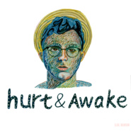

HURT&AWAKEHURT&AWAKE
============================

|  |  |
| :--: | :-- |
| [ HURT&AWAKEHURT&AWAKE](https://emumo.xiami.com/album/1326853661) | **艺人**: [阿克江Akin](../index.md) **语种**: 国语 **唱片公司**: 独立发行 **发行时间**: 2015年03月21日 **专辑类别**: 录音室专辑 **专辑风格**: 爵士放克 Jazz Funk, 当代节奏布鲁斯 Contemporary R&B, 流行灵魂乐 Pop Soul **播放数**: 73798 **收藏数**: 10 **评论数**: 9  |

## 简介

R&amp;B歌手阿克江带着融合多种新锐元素的歌曲回归
 

 

## 曲目

## 评论

|  |  |  |
| :-- | :-- | :-- |
|  [虾米用户](https://emumo.xiami.com/u/31710570) 酒精投手 2018-11-15 12:49 赞(0) 踩(0) | 
恕在下孤陋寡闻，失敬了
 |
|  [虾米用户](https://emumo.xiami.com/u/2606573) 热爱 2015-03-30 21:34 赞(0) 踩(0) | 
Lil‘Akin
 |
|  [虾米用户](https://emumo.xiami.com/u/4273172)   2015-03-25 18:31 赞(0) 踩(0) | 
帅
 |
|  [虾米用户](https://emumo.xiami.com/u/42615365)   2015-03-22 14:41 赞(0) 踩(0) | 
老大最棒
 |
|  [虾米用户](https://emumo.xiami.com/u/12008151)  2015-03-22 12:03 赞(0) 踩(0) | 
真的很不错。
 |
|  [虾米用户](https://emumo.xiami.com/u/39932854) ROCK 2015-03-22 10:16 赞(0) 踩(0) | 
挺你，阿克江
 |
|  [虾米用户](https://emumo.xiami.com/u/44195471) 進入我的耳朵聽你的世界 2015-03-21 16:11 赞(0) 踩(0) | 
（°ο°）
 |
|  [虾米用户](https://emumo.xiami.com/u/39857111)   2015-03-21 11:15 赞(0) 踩(0) | 
→_→
 |
|  [虾米用户](https://emumo.xiami.com/u/34831732) Hell nawh to... 2015-03-21 09:23 赞(0) 踩(0) | 
嗯
 |
