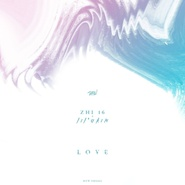

Love爱
============================

|  |  |
| :--: | :-- |
| [ Love爱](https://emumo.xiami.com/album/2102402207) | **艺人**: [阿克江Akin](../index.md) **语种**: 英语 **唱片公司**: Darker Than Wax **发行时间**: 2016年09月21日 **专辑类别**: EP, 单曲 **专辑风格**:  **播放数**: 49451 **收藏数**: 43 **评论数**: 9  |

## 简介

“今天不编那些臭词儿了，什么“全国最驰放迷幻魔音绕梁麻醉歌王”什么“大通利福尼亚及鼓楼东联合王国未来低音花仙子”，咱们聊点真的。  
嘟嘿的官方战略合作伙伴，亚洲湾岸低音摇摆王牌DTW发行了他们的新单曲。从此以后，你不必尴尬的回答外国室友关于K POP的任何问题了，打开歌把耳机递给他，微笑着冲他唇语，MADE IN CHINA YOU MOTHER呵呵”-----Dohit Dokedo

## 曲目

## 评论

|  |  |  |
| :-- | :-- | :-- |
|  [虾米用户](https://emumo.xiami.com/u/4462585) 碎落而后重塑 2016-11-20 10:32 赞(0) 踩(0) | 
全国最驰放迷幻魔音绕梁麻醉歌王  XDDDDD  笑死了
 |
|  [虾米用户](https://emumo.xiami.com/u/50387644)   2016-11-15 19:37 赞(0) 踩(0) | 
爱教人想象
 |
|  [虾米用户](https://emumo.xiami.com/u/8858880)  公開処刑 ／ リリー・... 2016-11-14 14:40 赞(0) 踩(0) | 
Ç
 |
|  [虾米用户](https://emumo.xiami.com/u/99586286) 歌单停滞在2017 2016-09-23 14:34 赞(0) 踩(0) | 
人呢
 |
|  [虾米用户](https://emumo.xiami.com/u/11803799) 積極型喪氣 2016-09-22 12:55 赞(0) 踩(0) | 
(｀･ω･´)
 |
|  [虾米用户](https://emumo.xiami.com/u/4208300) 谢谢虾米 永远爱你 2016-09-21 21:42 赞(0) 踩(0) | 
yo!
 |
|  [虾米用户](https://emumo.xiami.com/u/8672615) nocupBaba 2016-09-21 17:07 赞(0) 踩(0) | 
+
 |
|  [虾米用户](https://emumo.xiami.com/u/9705756)  2016-09-21 15:13 赞(0) 踩(0) | 
一如既往的好
 |
|  [虾米用户](https://emumo.xiami.com/u/23107239) 我还没想好要写什么... 2016-09-21 14:54 赞(0) 踩(0) | 
沙发
 |
