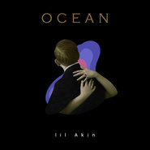

Ocean
============================

|  |  |
| :--: | :-- |
| [ Ocean](https://emumo.xiami.com/album/2102706374) | **艺人**: [阿克江Akin](../index.md) **语种**: 国语 **唱片公司**: 灿星文化 **发行时间**: 2017年03月08日 **专辑类别**: EP, 单曲 **专辑风格**:  **播放数**: 1610 **收藏数**: 1 **评论数**: 12  |

## 简介

以富有磁性的嗓音和独特的音乐气质为大家熟知的《中国新歌声》哈林组人气学员阿克江，签约梦响强音后首支全新原创单曲《Ocean》今日正式上线。新歌《Ocean》是一首抒发心声的浪漫歌曲，曲风是阿克江擅长的的R&amp;B，同时融入了soul元素，并且采用独特的实录方式，将乐手现场演奏真实地录入歌中，最终融合成了这首静谧又动人的《Ocean》。  
  
坚持R&amp;B不忘初心 专注创作大显才华  
  
回忆这首歌的创作状态，阿克江说那是一段自我封闭的日子。“人总是会处于一种自我矛盾中：当你遇到喜欢的人和事，你会害怕失去他们，又想迫不及待地赞美、拥有他们。”歌名“Ocean”传达的也正是这样一个主题：大海太美太大了以至于没人能完全拥有它，正如歌里数次重复的那样“I'm afraid lost you. I'm afraid that I can't wait.”想要靠近却无法拥有的矛盾心情，阿克江用他充满灵魂的嗓音轻轻吟唱，回旋又婉转。  
电音的伴奏、鼓点的躁动，配上阿克江慵懒随意的感叹吟唱，使得前奏像翻涌的海浪一样带来阵阵冲击。阿克江用他富有磁性的嗓音反复叠唱着“I'm afraid lost you. I'm afraid that I can't wait.”情感宣泄得直白有力，不优柔寡断、也不矫揉造作，低沉的音质和紧绷的发声使得他的声音充满了张力，他就这样安静地说着他的故事，唱着他的灵魂，在这片宁静的大海，给你安慰。将这样的心情和状态用自己最喜欢的r&amp;b唱出来，也是阿克江最真实的自我展示。  
  
分享感动吐露真心 法国女粉丝倾情独白  
  
谈起《Ocean》创作过程，阿克江表示很难忘。当时创作状态比较封闭，独处的密闭让自己更加敏感。正如歌词里所表达的那样，蓝色的海，是犹豫的心情。无际的大海却无法拥有，让人心生忧思，美好的事物，在拥有前就开始害怕失去，却又控制不住地向往和拥有。这样的矛盾让歌曲层次更加丰富，也更加有灵魂。将这样的心情和状态用自己最喜欢的r&amp;b唱出来，也是阿克江最真实的自我展示。  
  
此外，《Ocean》的结尾处配有一段法语旁白，这也是阿克江不经意想到的灵感。都说法语是最浪漫的语言，而这首歌也是如此浪漫，那何不让两件浪漫的事结合在一起呢？“你是无尽的海浪，而我是赤裸的岛屿。”相爱的人该像这样相辅相成。因此阿克江特地请了一位他的法国女粉丝Cherie Wong为  
  
《Ocean》配了法语独白，浪漫的法语和静谧的大海是如此的绝配。最后阿克江也表示，虽然这首歌是蓝色的，但依旧希望它能温暖你，带给你只属于自己的别样感觉。

## 曲目

## 评论

|  |  |  |
| :-- | :-- | :-- |
|  [虾米用户](https://emumo.xiami.com/u/224513037) 哪来那么多矫情 2020-02-10 10:47 赞(0) 踩(0) | 
必须10分啊
 |
|  [虾米用户](https://emumo.xiami.com/u/43492336) 无歧视 2017-03-12 22:10 赞(0) 踩(0) | 

 |
|  [虾米用户](https://emumo.xiami.com/u/244652148)  2017-03-12 18:46 赞(0) 踩(0) | 
啊啊啊啊啊
 |
|  [虾米用户](https://emumo.xiami.com/u/13111079) 有缘再见 2017-03-10 16:34 赞(0) 踩(0) | 
what！！！！！
 |
|  [虾米用户](https://emumo.xiami.com/u/32231042) 没 个 性 2017-03-10 10:41 赞(0) 踩(0) | 
what？？
 |
|  [虾米用户](https://emumo.xiami.com/u/38661627) 有病的人才需要音乐 2017-03-10 09:08 赞(0) 踩(0) | 
虾米没有？ 
 |
|  [虾米用户](https://emumo.xiami.com/u/248916583) 我还没想好要写什么... 2017-03-08 20:23 赞(0) 踩(0) | 
啊&amp;hellip;沦陷了
 |
|  [虾米用户](https://emumo.xiami.com/u/31728137) 暂无签名~ 2017-03-08 15:44 赞(0) 踩(0) | 
虾米木有人
 |
|  [虾米用户](https://emumo.xiami.com/u/2523233) 太热 2017-03-08 14:38 赞(0) 踩(0) | 
签约梦响强音&amp;hellip;&amp;hellip;毁了毁了
 |
|  [虾米用户](https://emumo.xiami.com/u/156056836) 我还没想好要写什么... 2017-03-08 13:25 赞(0) 踩(0) | 
哈哈
 |
|  [虾米用户](https://emumo.xiami.com/u/43728958) IG/Spotify: ... 2017-03-08 13:24 赞(0) 踩(0) | 
❤️
 |
|  [虾米用户](https://emumo.xiami.com/u/50217116) いちごいちえ 2017-03-08 11:15 赞(0) 踩(0) | 
什么时候发布嘛
 |
