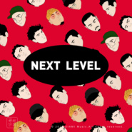

Next Level
============================

|  |  |
| :--: | :-- |
| [ Next Level](https://emumo.xiami.com/album/2102880158) | **艺人**: [阿克江Akin](../index.md) **语种**: 国语 **唱片公司**: 虾米音乐人 **发行时间**: 2017年10月26日 **专辑类别**: 合集, 杂锦 **专辑风格**: 独立电子乐 Indietronica **播放数**: 4690134 **收藏数**: 1666 **评论数**: 197  |

## 简介

Next Level  
只给像你这样的年轻人  
  
Next Level  
释义：  
俚语。比其他人 /物更厉害的存在。被形容成Next Level的人通常跟别人想的不同。  
-    Urban Dictionary  
  
为什么会有Next Level？  
因为我们相信中国有一部分年轻人值得更好的音乐。  
  
他们有不盲从的心灵，和激赏不同的眼界。  
最重要的是，音乐对他们来说是有意义的事情。  
所以我们私心想给他们创造一些不同的选项。  
虾米音乐和优酷音乐选取了5组我们认为代表中国音乐最先锋创造力的音乐人：阿克江Lil’Akin, Bohan Pheonix, sususu (由虾米选送)；龙井说唱、NickKris大小龙（由优酷音乐选送），在今年春夏之交前往我们独家合作伙伴BMG在洛杉矶办公室，与BMG旗下顶尖制作人，碰撞创造火花，联合呈现连接中西的先锋之声。  
  
Next Level是五张风格各异的EP  
Next Level是五段真诚的音乐记忆  
优酷音乐 我是音乐人 LA全程实录  
第一期：龙井说唱——指日可待  
第二期：阿克江LilAkin——诗人之血  
第三期：NickKris大小龙——子弹时间  
第四期：Bohan Phoenix——爱是最酷的事  
第五期：sususu——浪漫进化论  
第六期：花絮篇——中国－洛杉矶 新声势力音乐全纪录  
  
Next Level是五组最让人惊喜的音乐人  
龙井说唱    
龙井说唱是来自北京的老牌说唱团体，由孙骁、孙旭、奕文几个北京纯爷们儿组成。只要你不是今年因为一档节目才开始听hip-hop的粉丝，那你一定多少耳闻过这组京城OG。如果是隐藏、黑棒、龙门阵是中国说唱音乐的初代元老，那龙井说唱和阴三儿就是中国说唱的第二代。这组嘻哈中坚力量，这次要把“来自北京的八英里”带到洛杉矶，做点儿新的！  
  
阿克江Lil‘Akin  
来自新疆的阿克江毫无疑问是中国最棒的R&amp;B歌者之一。如果只看独立领域，甚至可以把这个之一去掉。选秀出身，医学背景，还想过考公务员，因为要生活，要给妈妈和弟弟买大房子。然而他体内流着来自爷爷的诗人之血，儿时爷爷吟唱的童谣已经渗透进了他的灵魂。音乐是必须要做的，而且要做的是忠于内心和天赋的最浪漫的音乐。有人说听了他的歌耳朵要怀孕，LA的制作人Nonficiton在听了他的歌后也惊呼“牛逼”——当然中文是跟阿克江学的  
  
NickKris大小龙   
NickKris大小龙，哥哥叫潘亮龙Nicholas Niepert，弟弟叫潘德龙Kristofer Niepert，哥俩出生在一个中西合璧的家庭，妈妈是中国人，爸爸是美国人，凭着对音乐的热爱组成了“双龙兄弟”。能演奏、会写歌，融合了男孩团体的偶像特质和摇滚，2005年，当时仅三岁半和五岁半的“双龙”兄弟建成“唐人街组合”，拿下了星光大道的周冠军。如今的他们一个15岁，一个17岁，伴随着青春期而来的是对音乐的破坏重建，他们选择了New School Punk来诠释这个年纪的莽撞和生机，而这世界上还有比Santa Monica更适合新学校朋克的地方吗。  
  
Bohan Pheonix   
Bohan Phoenix的《回到成都》讲述了这个中国出生，11岁定居美国的说唱歌手最真实的故事。成都有他的一部分家人，上次回到成都，大姨牵着家里的大白狗在楼下等他，这或许就是他对这个地方最深的牵绊。Bohan有一个自创的motto：lovelove，更像真实的人生，爱爱，是自我的诉求。这个曾与Migos，21 Savage这些美国说唱大佬同台过的男孩，依然无回锅肉不欢，太平洋改变不了他的心，却让他能用两种语言和文化背景去做自己爱做的事。  
  
sususu    
自诩没钱才做卧室音乐，自诩镜片有多厚猥琐气质就有多深重，却是在录音棚里掌控全场的音乐制作人，演出能撩动迷妹每根细软神经的高手。是社交场合永远坐在角落的社恐患者，这样的社恐患者又能用他的艺术素养随时带你太空漫游。是音乐的狂热分子，是欧洲电影爱好者，是时代焦虑症的产儿，是冷静观察世事的成熟boy。是沉默的，低调的，狂放的，危险的漩涡。是害怕过期的凤梨罐头，是最可口的蜜桃酥。反正词不达意你也懂，浪漫进化论，sususu用音乐柔软加州阳光。  
  
Next Level是来自音乐食物链顶端的加持  
  
Edsclusive  
Feat.Bohan Phoenix  
带着 3 项格莱美提名、2016 年最具突破性制作人的光环，这位来自迈阿密的年轻制作人的合作名单几乎涵盖了美国嘻哈食物链的顶。说到 Edsclusive，最具有影响力的歌曲应该是 2016 年的单曲 "All The Way Up" 了。它赢得了多项黑人电视娱乐大奖，其中就包括年度歌曲  
  
在 "All the Way Up" 之前，这位制作人与 Curren$y，Future，The Game，David Guetta 等大咖之间有过合作，但最让他热血澎湃的应该是为 Jay-Z 制作混音。而在进入Next Level录音室前，他正在迈阿密为Travis Scott制作单曲。  
  
NONFICTION  
Feat.阿克江LilAkin、sususu  
Josh Cumbee 和 AFSHeeN 组成的小组 NON-FICTION，以团体名义创作、监制了许多歌曲、混音、音乐剧、影视配乐等，与 Chris Brown ("No Filter", Lindsey Stirling ("The Phoenix", "Lost Girl", ，Kendall Schmidt ("Blame it on the Mistletoe", Brooke Candy ("Paper or Plastic", ，Janet Jackson，Sia 等均有合作，是跨界音乐制作的闪耀之星。  
  
Redwine  
Feat.龙井说唱  
Jon Redwine，传奇爵士乐手 Don Albert 的外孙。  
2014 年 7 月，Tinashe 与 SchoolBoy Q 合作的 "2 On" 引爆各大音乐平台，这也是 Redwine 作为词曲作者，首次在流行音乐的商业表现上大出风头。2015 年，他与 Chris Brown，Jhene Aiko 和 Omarion 等人合作了 "Post to Be" ，强强联合获得 3 白金销量，挤进公告牌 R&amp;B 排行榜前五。他也与 Akon、T-Pain 、Jeremih 等著名音乐人合作过 "Came to Do"  ，"My Jam"  等作品。  
  
  
Justin Gray  
Feat.NickKris大小龙  
Justin Gray合作过的艺人有 Mariah Carey (“Almost Home） ，Amy Winehouse，David Bisbal，Luis Fonsi，还有 2015 年的 BBC 年度之声冠军 James Bay。  
2016 年 5 月，他为 Dirty Heads 创作的歌曲 "That’s All I Need" 连续四周成为另类电台中被收藏次数的头名，收录该曲的专辑也在 6 月登顶了 iTunes 另类专辑排行榜。  
Justin Gray 与中国歌手也很有缘分，2016 年他参与了曲婉婷 "Qu Wanting" 同名作品。  
  
  
这是Next Level诞生的地方  
Record Plant  
Record Plant成立于1968年，是60年代最早开始给音乐人舒适、休闲的工作环境的录音室。在这里制造音乐作品的超级巨星不胜枚举，从摇滚黄金年代的Rod Stewart、Alice Cooper到如今的几乎一线流行明星：Justin Bieber、Nick Minaj、Ariana Grande、Katy Perry、Frank Ocean……。可以说是见证音乐历史诞生的地方。  
  
ALWAYS ON THAT NEXT LEVEL  
  
 

## 曲目

## 评论

|  |  |  |
| :-- | :-- | :-- |
|  [虾米用户](https://emumo.xiami.com/u/125615076) 青絲慢掠獨披塵 2019-09-16 19:53 赞(0) 踩(0) | 

 |
|  [虾米用户](https://emumo.xiami.com/u/411692045) 宇宙队最屌 2019-08-28 17:19 赞(0) 踩(0) | 
奈斯
 |
|  [虾米用户](https://emumo.xiami.com/u/28045948)  2019-08-06 19:05 赞(0) 踩(0) | 
klljiajqss
 |
|  [虾米用户](https://emumo.xiami.com/u/49823776) ❤️ 2019-07-15 03:07 赞(0) 踩(0) | 
在里面的歌爱了爱了
 |
|  [虾米用户](https://emumo.xiami.com/u/252015722) 要再见了 2018-08-31 16:31 赞(0) 踩(0) | 
♡
 |
| ⇒ |  [虾米用户](https://emumo.xiami.com/u/28045948)  2019-08-06 19:12 赞(0) 踩(0) | 
我  家具 5
 |
|  [虾米用户](https://emumo.xiami.com/u/332706466)  2018-07-07 16:07 赞(2) 踩(0) | 
很好
 |
| ⇒ |  [虾米用户](https://emumo.xiami.com/u/28045948)  2019-08-06 19:12 赞(0) 踩(0) | 
来了te
 |
|  [虾米用户](https://emumo.xiami.com/u/6545705) ooooo……在于不不不 2018-06-11 18:57 赞(2) 踩(0) | 
哈哈哈哈哈哈
 |
|  [虾米用户](https://emumo.xiami.com/u/6545705) ooooo……在于不不不 2018-06-11 18:57 赞(0) 踩(0) | 
你你你
 |
|  [虾米用户](https://emumo.xiami.com/u/15477519) 爱  是生命的和弦，而不... 2018-04-05 11:26 赞(2) 踩(0) | 
本来也喜欢阿克江的音乐，巧合的是在B612也听到了这专里的曲子&amp;hellip;好棒呢&amp;hellip;
 |
|  [虾米用户](https://emumo.xiami.com/u/253663400) 都是过程 2018-03-17 21:03 赞(0) 踩(0) | 
挖到了宝藏
 |
|  [虾米用户](https://emumo.xiami.com/u/142713468) 但愿我能够住在你的角膜里... 2018-03-15 23:13 赞(1) 踩(0) | 
嗓音毒药
 |
|  [虾米用户](https://emumo.xiami.com/u/49640493) 网易云SAINTDONT... 2018-03-15 07:19 赞(1) 踩(0) | 
哈哈哈
 |
|  [虾米用户](https://emumo.xiami.com/u/55293285) 我还没想好要写什么... 2018-03-13 23:36 赞(2) 踩(0) | 
没想到有一天会从B612跟来听歌 
 |
|  [虾米用户](https://emumo.xiami.com/u/3774205) 游来游去 2018-02-09 01:26 赞(0) 踩(0) | 
大作啊 好喜欢
 |
|  [虾米用户](https://emumo.xiami.com/u/70381080) I lay my lov... 2018-01-28 11:16 赞(3) 踩(0) | 
阿克江的风格我好喜欢啊 这张专辑我只下了他的
 |
|  [虾米用户](https://emumo.xiami.com/u/142713468) 但愿我能够住在你的角膜里... 2018-01-23 13:52 赞(1) 踩(0) | 
阿老师最酷[带墨镜笑]
 |
|  [虾米用户](https://emumo.xiami.com/u/17575113) 五音不全 五穀不分 2018-01-11 15:55 赞(0) 踩(0) | 
好聽啊
 |
|  [虾米用户](https://emumo.xiami.com/u/71178106) 塵世や 酒、風呂を抜け ... 2018-01-09 14:45 赞(1) 踩(0) | 
♡
 |
|  [虾米用户](https://emumo.xiami.com/u/293869377) 你好烦啊 2018-01-07 15:50 赞(4) 踩(0) | 
能说我是因为B612视频音乐来的吗  最后三首好听到爆啊
 |
|  [虾米用户](https://emumo.xiami.com/u/32218878) 再见虾虾仔们vx：xxx... 2017-12-19 18:34 赞(0) 踩(0) | 
///
 |
|  [虾米用户](https://emumo.xiami.com/u/284025418) 天天 2017-12-19 03:20 赞(0) 踩(0) | 
啊要抱抱
 |
|  [虾米用户](https://emumo.xiami.com/u/14540052) Alive. 2017-12-10 16:26 赞(0) 踩(0) | 
收藏第999 get&amp;radic;  
 |
|  [虾米用户](https://emumo.xiami.com/u/664791) 777 2017-12-07 02:23 赞(0) 踩(0) | 
描述是苏苏苏自己写的？？？？
 |
|  [虾米用户](https://emumo.xiami.com/u/49640493) 网易云SAINTDONT... 2017-12-01 22:50 赞(0) 踩(0) | 

 |
|  [虾米用户](https://emumo.xiami.com/u/91372642) 不開心就不好看了 2017-11-28 08:57 赞(0) 踩(0) | 
x
 |
|  [虾米用户](https://emumo.xiami.com/u/188273848)  2017-11-22 00:34 赞(1) 踩(0) | 
Nice Song
 |
|  [虾米用户](https://emumo.xiami.com/u/8092328)  2017-11-16 21:51 赞(1) 踩(0) | 
 
 |
|  [虾米用户](https://emumo.xiami.com/u/4713814) 你的乐评专业死了呢 2017-11-15 11:42 赞(1) 踩(0) | 
前五首&amp;ldquo;借鉴&amp;rdquo;痕迹太重 后五首很棒！
 |
|  [虾米用户](https://emumo.xiami.com/u/4713814) 你的乐评专业死了呢 2017-11-15 11:11 赞(1) 踩(0) | 
前五首很&amp;ldquo;借鉴&amp;rdquo;了为了博眼球吗后五首很棒的 可不要为了推前五首把真正好听又原创的歌埋没掉
 |
|  [虾米用户](https://emumo.xiami.com/u/12840793) catch me if ... 2017-11-12 20:45 赞(0) 踩(0) | 
好几年前就有关注过国内的说唱 但那时候好像龙井说唱比较红，香港的农夫 之外好像不多纯正的rapper  这两年出现了很多风格不同能力很强的rapper 也是欣慰 
 |
|  [虾米用户](https://emumo.xiami.com/u/212922807) ᴄᴏᴏʟ ᴀs ɪᴄᴇ ... 2017-11-09 14:12 赞(0) 踩(0) | 
  
 |
|  [虾米用户](https://emumo.xiami.com/u/225133873)   2017-11-04 00:23 赞(2) 踩(0) | 
阿克江！！！！打call！！⍢⃝
 |
|  [虾米用户](https://emumo.xiami.com/u/10479111) Fall in M 2017-11-03 23:30 赞(0) 踩(0) | 
晓松老师为年轻人的音乐提供机会就是Next level，大紧老师的照片也会成为Next Level，就是冲你头像进来的，晓得里面肯定不简单 
 |
|  [虾米用户](https://emumo.xiami.com/u/1344153) 我还没想好要写什么... 2017-11-03 10:58 赞(2) 踩(0) | 
选秀时期就觉得阿克江特牛！当时还遗憾淘汰，陆陆续续新歌也都有水准，而且小哥哥温暖帅气，支持！
 |
|  [虾米用户](https://emumo.xiami.com/u/226756743)  2017-11-03 10:37 赞(2) 踩(0) | 
打call能送我会员么？
 |
|  [虾米用户](https://emumo.xiami.com/u/269139783) 我还没想好要写什么... 2017-11-03 09:09 赞(1) 踩(0) | 
为龙井打 call
 |
|  [虾米用户](https://emumo.xiami.com/u/1326862)   2017-11-03 08:22 赞(0) 踩(0) | 
不错，收着先！
 |
|  [虾米用户](https://emumo.xiami.com/u/275105711)  2017-11-03 07:46 赞(1) 踩(0) | 
大紧不存在的永远，等待晓松奇谈的归来
 |
|  [虾米用户](https://emumo.xiami.com/u/92272464) go out and g... 2017-11-02 23:58 赞(11) 踩(0) | 
啥时候能把杀了他喂猪还有圣彼得堡的版权拿到啊
 |
| ⇒ |  [虾米用户](https://emumo.xiami.com/u/142713468) 但愿我能够住在你的角膜里... 2018-01-23 14:05 赞(0) 踩(0) | 
哪个音乐播放器有？ 
 |
| ⇒ |  [虾米用户](https://emumo.xiami.com/u/92272464) go out and g... 2018-03-21 19:20 赞(0) 踩(0) | 
<q><b>BlackSwan闫肉肉说：</b></q>
 |
|  [虾米用户](https://emumo.xiami.com/u/8326332) 后来，即便是音乐，也无法... 2017-11-02 23:45 赞(1) 踩(0) | 
一部分年轻人值得更好的音乐&amp;hellip;&amp;hellip; 这文笔！
 |
|  [虾米用户](https://emumo.xiami.com/u/38918617) 你相信我，我相信你 2017-11-02 22:41 赞(0) 踩(0) | 
吴亦凡大晚上给矮大紧发短信
 |
|  [虾米用户](https://emumo.xiami.com/u/12956862) 最后来告别一下，感谢陪伴... 2017-11-02 21:51 赞(4) 踩(0) | 
我不得不承认虾米在活动上很丰富，但是也不能否认它的客户端一直是在退步尤其是电脑
 |
| ⇒ |  [虾米用户](https://emumo.xiami.com/u/1689069)  2017-11-02 23:25 赞(0) 踩(0) | 
我觉得手机app挺好用。pc客户端有些bug。不过肯定在改进啦。我最喜欢用虾米。 还有虾米的专题真的绝了！
 |
| ⇒ |  [虾米用户](https://emumo.xiami.com/u/12956862) 最后来告别一下，感谢陪伴... 2017-11-03 21:00 赞(0) 踩(0) | 
<q><b>右右右说：</b></q>
 |
| ⇒ |  [虾米用户](https://emumo.xiami.com/u/1689069)  2017-11-03 21:02 赞(0) 踩(0) | 
<q><b>逐说：</b></q>
 |
|  [虾米用户](https://emumo.xiami.com/u/49748080) 我还没想好要写什么... 2017-11-02 21:39 赞(0) 踩(0) | 
收藏里面一溜红 看起来贼喜庆...
 |
|  [虾米用户](https://emumo.xiami.com/u/1743160)  2017-11-02 20:53 赞(2) 踩(0) | 
酥
 |
|  [虾米用户](https://emumo.xiami.com/u/2249115)  2017-11-02 20:32 赞(0) 踩(0) | 
不错不错，赞一个
 |
|  [虾米用户](https://emumo.xiami.com/u/120762774)  2017-11-02 16:16 赞(0) 踩(0) | 
打call   
 |
|  [虾米用户](https://emumo.xiami.com/u/31311002) 公众号：昼夜厨房＞＞原谅... 2017-11-02 14:44 赞(24) 踩(0) | 
然而虾米并没有大紧老师的所有歌 
 |
|  [虾米用户](https://emumo.xiami.com/u/57244574) 我还没想好要写什么... 2017-11-02 13:29 赞(0) 踩(0) | 
愛李！愛李moon
 |
|  [虾米用户](https://emumo.xiami.com/u/109223008)  2017-11-01 08:27 赞(1) 踩(0) | 
绿帽乃akin
 |
|  [虾米用户](https://emumo.xiami.com/u/6881480) No one is he... 2017-10-31 13:56 赞(1) 踩(0) | 
一直很欣赏sususu 非常棒的一张作品
 |
|  [虾米用户](https://emumo.xiami.com/u/1461149) 我还没想好要写什么... 2017-10-31 01:43 赞(0) 踩(0) | 
苏得服~
 |
|  [虾米用户](https://emumo.xiami.com/u/1526039)   2017-10-30 16:30 赞(0) 踩(0) | 
加油
 |
|  [虾米用户](https://emumo.xiami.com/u/13808872) Subtle varia... 2017-10-29 23:26 赞(0) 踩(0) | 

 |
|  [虾米用户](https://emumo.xiami.com/u/51690297) loo se u 2017-10-29 16:07 赞(0) 踩(0) | 
我最爱的搭配
 |
|  [虾米用户](https://emumo.xiami.com/u/40375044) 高雅的音乐，要用心去感受 2017-10-29 12:13 赞(0) 踩(0) | 

 |
|  [虾米用户](https://emumo.xiami.com/u/43293683) 我还没想好要写什么... 2017-10-28 21:53 赞(0) 踩(0) | 
先行下载了 哦嚯嚯嚯
 |
|  [虾米用户](https://emumo.xiami.com/u/5489003) YUY. 2017-10-28 13:06 赞(0) 踩(0) | 
没有评论？做音乐好难，做好音乐真难，做符合大众口味的音乐太难，让人听得懂喜欢听的音乐做起来更是难上加难！我是工科男，不工作的时候听音乐！
 |
|  [虾米用户](https://emumo.xiami.com/u/7248937)  2017-10-28 11:59 赞(0) 踩(0) | 
阿克江最后那三首真的神了！
 |
|  [虾米用户](https://emumo.xiami.com/u/40976472) 暂无签名~ 2017-10-28 10:18 赞(0) 踩(0) | 
阿克江，注定是明日之星
 |
|  [虾米用户](https://emumo.xiami.com/u/40999925) 走走停停 2017-10-27 23:42 赞(1) 踩(0) | 
现在才看到，虾米为你打call，之前音乐人都没怎么关注，今年这些专题好爱 
 |
|  [虾米用户](https://emumo.xiami.com/u/118166436) 音乐，像初恋一样美好 2017-10-27 13:51 赞(0) 踩(0) | 
我就想知道BMG是什么意思？
 |
|  [虾米用户](https://emumo.xiami.com/u/1512054)  2017-10-27 07:47 赞(0) 踩(0) | 
无语-_-||
 |
|  [虾米用户](https://emumo.xiami.com/u/92889172) 然後呢，一起走吧。 2017-10-27 01:56 赞(0) 踩(0) | 
酷爆了好吗！
 |
|  [虾米用户](https://emumo.xiami.com/u/3454648)  2017-10-27 01:50 赞(3) 踩(0) | 
•ᴗ•
 |
|  [虾米用户](https://emumo.xiami.com/u/48591498) We Meet In D... 2017-10-27 00:47 赞(2) 踩(0) | 
阿里的别乱搞什么优酷音乐把虾米搞没了
 |
|  [虾米用户](https://emumo.xiami.com/u/316008414)  2017-10-27 00:37 赞(2) 踩(0) | 
喜欢henry刘宪华~
 |
|  [虾米用户](https://emumo.xiami.com/u/6076438) 起身見頭暈，行路打倒褪。... 2017-10-26 23:42 赞(0) 踩(0) | 
打電話通知妳不要亂說什麼話要說什麼話想說什麼話想說什麼話啊⋯⋯
 |
|  [虾米用户](https://emumo.xiami.com/u/85165792) COMING 2017-10-26 23:26 赞(0) 踩(0) | 
.
 |
|  [虾米用户](https://emumo.xiami.com/u/30911605) 也许没有用 2017-10-26 22:14 赞(0) 踩(0) | 
哇 
 |
|  [虾米用户](https://emumo.xiami.com/u/326064808)  2017-10-26 22:14 赞(0) 踩(0) | 
不醉不归
 |
|  [虾米用户](https://emumo.xiami.com/u/3762589) 我还没想好要写什么... 2017-10-26 21:36 赞(2) 踩(0) | 
先下为敬
 |
|  [虾米用户](https://emumo.xiami.com/u/96051730) ᴍᴇᴏᴡ 2017-10-26 21:31 赞(1) 踩(0) | 
哇！我的天！这个是优酷虾米音乐人节目的人了！每一个我都超喜欢！
 |
|  [虾米用户](https://emumo.xiami.com/u/258568191)   2017-10-26 21:16 赞(0) 踩(0) | 
非常骚了
 |
|  [虾米用户](https://emumo.xiami.com/u/74271300) 紫气东来 2017-10-26 21:13 赞(0) 踩(0) | 
牛逼
 |
|  [虾米用户](https://emumo.xiami.com/u/25962841) Y.Q.S.Y. 2017-10-26 21:04 赞(0) 踩(0) | 
[带墨镜笑]
 |
|  [虾米用户](https://emumo.xiami.com/u/2459) Nia? 2017-10-26 18:55 赞(3) 踩(0) | 
老子最酷
 |
|  [虾米用户](https://emumo.xiami.com/u/281762909)  2017-10-26 17:55 赞(1) 踩(0) | 
最地道的地下声音
 |
|  [虾米用户](https://emumo.xiami.com/u/281295136) 邂逅在末日 2017-10-26 17:43 赞(2) 踩(0) | 
很酷的年轻人 
 |
|  [虾米用户](https://emumo.xiami.com/u/230803304) 三观正又爱国的成都宝藏男... 2017-10-26 17:32 赞(2) 踩(0) | 
支持下活动
 |
|  [虾米用户](https://emumo.xiami.com/u/314636359) 我是一个喜欢活着的人。 2017-10-26 17:32 赞(1) 踩(0) | 
哦？？？
 |
|  [虾米用户](https://emumo.xiami.com/u/50575725) 锋利的人 2017-10-26 17:16 赞(3) 踩(0) | 
为酥酥疯狂打电话！
 |
|  [虾米用户](https://emumo.xiami.com/u/331809192)  2017-10-26 17:09 赞(1) 踩(0) | 
******
 |
|  [虾米用户](https://emumo.xiami.com/u/2234543) 走投无路又何妨 2017-10-26 17:02 赞(2) 踩(0) | 
页面好评●ω●
 |
|  [虾米用户](https://emumo.xiami.com/u/85568296) 只有阳光而无阴影 只有欢... 2017-10-26 16:57 赞(1) 踩(0) | 
要多多了解
 |
|  [虾米用户](https://emumo.xiami.com/u/2418238) weibo: @尤米口 2017-10-26 16:16 赞(4) 踩(0) | 
给虾米点赞 (ง•̀_•́)ง
 |
|  [虾米用户](https://emumo.xiami.com/u/254211579) 我想紧紧地抱着你，或者勾... 2017-10-26 14:58 赞(1) 踩(0) | 
江老师的实力无须质疑，10星都没问题！不接受反驳，谢谢！
 |
|  [虾米用户](https://emumo.xiami.com/u/116902132) 我不想 2017-10-26 14:26 赞(4) 踩(0) | 
就这般算了吧
 |
|  [虾米用户](https://emumo.xiami.com/u/10359776) v jerryzlz4 2017-10-26 14:18 赞(2) 踩(0) | 
听了第一次觉得中文也能唱出逼格 质量超高 听到了中国音乐的希望啊   比烂大街情情爱爱的俗歌不知道高哪里去了  
 |
|  [虾米用户](https://emumo.xiami.com/u/9288193)  2017-10-26 14:17 赞(1) 踩(0) | 
？
 |
|  [虾米用户](https://emumo.xiami.com/u/14390409) 让我和后朋克死在一起！ 2017-10-26 14:15 赞(1) 踩(0) | 
啊！我真的很爱！bohan pheonix！
 |
|  [虾米用户](https://emumo.xiami.com/u/5530908) 不好意思 2017-10-26 13:54 赞(2) 踩(0) | 
。。。。。感觉制作还是一般
 |
|  [虾米用户](https://emumo.xiami.com/u/50812128) 网易finefrance... 2017-10-26 13:43 赞(1) 踩(0) | 
6
 |
|  [虾米用户](https://emumo.xiami.com/u/2960029) 如果世界太危险 只有音乐... 2017-10-26 13:36 赞(1) 踩(0) | 
酷
 |
|  [虾米用户](https://emumo.xiami.com/u/42759745) 我还没想好要写什么... 2017-10-26 12:54 赞(0) 踩(0) | 

 |
|  [虾米用户](https://emumo.xiami.com/u/37078505) 时间 2017-10-26 12:52 赞(1) 踩(0) | 
这是枯吧？哪里酷了？
 |
| ⇒ |  [虾米用户](https://emumo.xiami.com/u/2960029) 如果世界太危险 只有音乐... 2017-10-26 13:39 赞(0) 踩(0) | 
总比塌了好 
 |
|  [虾米用户](https://emumo.xiami.com/u/9464517) 我还没想好要写什么... 2017-10-26 12:07 赞(0) 踩(0) | 
～
 |
|  [虾米用户](https://emumo.xiami.com/u/4334438) 贫穷而倔强 2017-10-26 11:23 赞(0) 踩(0) | 
zzang
 |
|  [虾米用户](https://emumo.xiami.com/u/324141964) 简单是福 2017-10-26 10:42 赞(3) 踩(0) | 
听歌就是为了多捐几颗爱心
 |
|  [虾米用户](https://emumo.xiami.com/u/3863771) Spotify: iob... 2017-10-26 10:23 赞(1) 踩(0) | 
有點多耶
 |
|  [虾米用户](https://emumo.xiami.com/u/134777768)  2017-10-26 10:13 赞(1) 踩(0) | 
早(๑•̀ㅁ•́ฅ✧
 |
|  [虾米用户](https://emumo.xiami.com/u/13507325) 虾米猜 | 我的心头爱 2017-10-26 10:10 赞(0) 踩(0) | 
可以！很酷
 |
|  [虾米用户](https://emumo.xiami.com/u/270490204)  2017-10-26 09:30 赞(0) 踩(0) | 
马云爸爸真是财大气粗
 |
|  [虾米用户](https://emumo.xiami.com/u/1320669) ツ 2017-10-26 09:18 赞(0) 踩(0) | 
0.0
 |
|  [虾米用户](https://emumo.xiami.com/u/53712312) ⠀ 2017-10-26 09:06 赞(0) 踩(0) | 
.
 |
|  [虾米用户](https://emumo.xiami.com/u/285278826) 一切都是最好的安排，爱我... 2017-10-26 08:48 赞(0) 踩(0) | 
 
 |
|  [虾米用户](https://emumo.xiami.com/u/24167010)   2017-10-26 08:45 赞(0) 踩(0) | 
我也很酷，只是没人发现，
 |
|  [虾米用户](https://emumo.xiami.com/u/49640493) 网易云SAINTDONT... 2017-10-26 08:32 赞(0) 踩(0) | 
_
 |
|  [虾米用户](https://emumo.xiami.com/u/43805130) 网易:SIonsoNOk... 2017-10-26 08:25 赞(0) 踩(0) | 
慢
 |
|  [虾米用户](https://emumo.xiami.com/u/2197243) 啥都听一听 2017-10-26 08:06 赞(0) 踩(0) | 
歌名怎么全是英文。。
 |
|  [虾米用户](https://emumo.xiami.com/u/82624436) Stay Humble. 2017-10-26 07:52 赞(0) 踩(0) | 
来了
 |
|  [虾米用户](https://emumo.xiami.com/u/313851050) ID 313851050 2017-10-26 07:23 赞(0) 踩(0) | 
优酷那边评论少的有点...不像话？ 能发到b站吗...
 |
|  [虾米用户](https://emumo.xiami.com/u/18865354) 这家伙很聪明什么也没留下... 2017-10-26 06:57 赞(0) 踩(0) | 

 |
|  [虾米用户](https://emumo.xiami.com/u/279939466) 我沒有擦去爭執的橡皮。 2017-10-26 06:38 赞(0) 踩(0) | 
阿
 |
|  [虾米用户](https://emumo.xiami.com/u/92988342) 是你的肋骨，所以一见如故 2017-10-26 06:18 赞(1) 踩(0) | 
你们都不用睡觉的吗……
 |
|  [虾米用户](https://emumo.xiami.com/u/247358999) 在荒野上跳舞 2017-10-26 05:50 赞(0) 踩(0) | 

 |
|  [虾米用户](https://emumo.xiami.com/u/37939232) 我是100% 2017-10-26 04:20 赞(0) 踩(0) | 
牛逼牛逼
 |
|  [虾米用户](https://emumo.xiami.com/u/43647511) 没有人会不爱音乐 2017-10-26 03:04 赞(0) 踩(0) | 
z
 |
|  [虾米用户](https://emumo.xiami.com/u/22881143) ㅤㅤㅤㅤ 2017-10-26 02:57 赞(0) 踩(0) | 
哇哦（关上70的大门
 |
|  [虾米用户](https://emumo.xiami.com/u/8970340) 小石头 2017-10-26 02:10 赞(0) 踩(0) | 
整张专都喜欢
 |
|  [虾米用户](https://emumo.xiami.com/u/331086884)   2017-10-26 02:00 赞(0) 踩(0) | 
  
 |
|  [虾米用户](https://emumo.xiami.com/u/108764468) 你不能把这个世界，让给你... 2017-10-26 01:23 赞(0) 踩(0) | 
很酷 （也谢谢你们的夸赞 大家都很酷
 |
|  [虾米用户](https://emumo.xiami.com/u/857080) 讲不出再见，虾米有缘江湖... 2017-10-26 01:14 赞(0) 踩(0) | 
很棒
 |
|  [虾米用户](https://emumo.xiami.com/u/1115247) @Nebula_7293 2017-10-26 01:10 赞(0) 踩(0) | 
你火了 就有更多人想睡你了
 |
|  [虾米用户](https://emumo.xiami.com/u/2858053) 。 2017-10-26 00:54 赞(0) 踩(0) | 
我来了。
 |
|  [虾米用户](https://emumo.xiami.com/u/48242386) Chill the fu... 2017-10-26 00:54 赞(0) 踩(0) | 
WOW
 |
|  [虾米用户](https://emumo.xiami.com/u/45686435) 爱虾米！期待我们再见的那... 2017-10-26 00:52 赞(0) 踩(0) | 
开心到睡不着，广州欢迎您 
 |
|  [虾米用户](https://emumo.xiami.com/u/49445796) 幻听 2017-10-26 00:43 赞(0) 踩(0) | 
高产似内啥
 |
|  [虾米用户](https://emumo.xiami.com/u/225494070) Gold  2017-10-26 00:31 赞(1) 踩(0) | 
不睡了不睡了不睡了
 |
|  [虾米用户](https://emumo.xiami.com/u/45686435) 爱虾米！期待我们再见的那... 2017-10-26 00:28 赞(1) 踩(0) | 
wowowow
 |
|  [虾米用户](https://emumo.xiami.com/u/12730895) 不要离开！ 2017-10-26 00:25 赞(0) 踩(0) | 
卧槽！！！！
 |
|  [虾米用户](https://emumo.xiami.com/u/44714480)  2017-10-26 00:23 赞(0) 踩(0) | 
来了来了 
 |
|  [虾米用户](https://emumo.xiami.com/u/121353336) 修行尚浅 2017-10-26 00:23 赞(0) 踩(0) | 
会来广州巡演吗，好想在现场，安安静静听你唱歌
 |
|  [虾米用户](https://emumo.xiami.com/u/26352870) 地 狱 天 堂 皆 在 ... 2017-10-26 00:22 赞(0) 踩(0) | 
酥酥最近太高产了
 |
|  [虾米用户](https://emumo.xiami.com/u/301848510) . 2017-10-26 00:22 赞(0) 踩(0) | 
emmmmmm
 |
|  [虾米用户](https://emumo.xiami.com/u/2960029) 如果世界太危险 只有音乐... 2017-10-26 00:21 赞(0) 踩(0) | 
 
 |
|  [虾米用户](https://emumo.xiami.com/u/10081975) weibo@winnin... 2017-10-26 00:17 赞(0) 踩(0) | 

 |
|  [虾米用户](https://emumo.xiami.com/u/13450787) 自作自受 2017-10-26 00:17 赞(0) 踩(0) | 
哇
 |
|  [虾米用户](https://emumo.xiami.com/u/163169786) 路过之后呢 2017-10-26 00:14 赞(0) 踩(0) | 
☻
 |
|  [虾米用户](https://emumo.xiami.com/u/4208300) 谢谢虾米 永远爱你 2017-10-26 00:14 赞(0) 踩(0) | 
新专!!
 |
|  [虾米用户](https://emumo.xiami.com/u/35681166) 暂无签名~ 2017-10-26 00:13 赞(0) 踩(0) | 
我的妈呀！不睡了！
 |
|  [虾米用户](https://emumo.xiami.com/u/12230374) Pinkfloydzh，... 2017-10-26 00:10 赞(0) 踩(0) | 
惊喜！！
 |
|  [虾米用户](https://emumo.xiami.com/u/66823378)  2017-10-26 00:10 赞(1) 踩(0) | 

 |
|  [虾米用户](https://emumo.xiami.com/u/12230374) Pinkfloydzh，... 2017-10-26 00:10 赞(0) 踩(0) | 
天呐！惊喜！
 |
|  [虾米用户](https://emumo.xiami.com/u/8792995) 狭路无形，大道无名 2017-10-26 00:09 赞(1) 踩(0) | 
  
 |
|  [虾米用户](https://emumo.xiami.com/u/99884554) 我还没想好要写什么... 2017-10-26 00:09 赞(0) 踩(0) | 
妈的刚准备睡觉呢！！为什么要让我这时候听到这砖！！！
 |
|  [虾米用户](https://emumo.xiami.com/u/9028760) 豆瓣见 spotify ... 2017-10-26 00:08 赞(0) 踩(0) | 
◡̈⃝♡nite
 |
|  [虾米用户](https://emumo.xiami.com/u/38928455) 高空坠落 2017-10-26 00:04 赞(1) 踩(0) | 
是不是来晚了。。。
 |
|  [虾米用户](https://emumo.xiami.com/u/304163188) 我还没想好要写什么... 2017-10-26 00:04 赞(0) 踩(0) | 
哇
 |
|  [虾米用户](https://emumo.xiami.com/u/245304136) 永远爱您 2017-10-26 00:03 赞(0) 踩(0) | 
这专太棒了吧
 |
|  [虾米用户](https://emumo.xiami.com/u/211045350) ·三界皆苦· 2017-10-26 00:01 赞(1) 踩(0) | 
我去我去送我上天 
 |
| ⇒ |  [虾米用户](https://emumo.xiami.com/u/276678622) 日夜兼程，寻找自己的星辰... 2017-10-26 07:25 赞(0) 踩(0) | 
送你上天
 |
|  [虾米用户](https://emumo.xiami.com/u/13812602) 木星土著居民 2017-10-26 00:00 赞(0) 踩(0) | 
每次都躲在半夜！
 |
|  [虾米用户](https://emumo.xiami.com/u/50649208) † 2017-10-26 00:00 赞(0) 踩(0) | 
S
 |
|  [虾米用户](https://emumo.xiami.com/u/15437387) 一满足 2017-10-25 23:59 赞(0) 踩(0) | 
SQ
 |
|  [虾米用户](https://emumo.xiami.com/u/1418202)  江山共老 2017-10-25 23:59 赞(0) 踩(0) | 
....
 |
|  [虾米用户](https://emumo.xiami.com/u/281762909)  2017-10-25 23:58 赞(0) 踩(0) | 
今晚要炸了
 |
|  [虾米用户](https://emumo.xiami.com/u/41729620) love myself ... 2017-10-25 23:58 赞(0) 踩(0) | 

 |
|  [虾米用户](https://emumo.xiami.com/u/274942135)  2017-10-25 23:58 赞(0) 踩(0) | 
哇哇哇 终于等到你！！！  如果雪崩把你埋住，你倒在好多好多雪的下面，就会分不清，上在哪边，下在哪边。你想把自己挖出去，却选了错误的方向，于是把你自己挖进了死亡。
 |
|  [虾米用户](https://emumo.xiami.com/u/48364902) 圆圈 2017-10-25 23:57 赞(0) 踩(0) | 
除了su，没别的
 |
|  [虾米用户](https://emumo.xiami.com/u/9931551) 感谢相遇 2017-10-25 23:57 赞(0) 踩(0) | 
伴你入睡
 |
|  [虾米用户](https://emumo.xiami.com/u/1172925) UReverysong 2017-10-25 23:56 赞(0) 踩(0) | 
休闲党的胜利
 |
|  [虾米用户](https://emumo.xiami.com/u/15437387) 一满足 2017-10-25 23:56 赞(0) 踩(0) | 
要睡了
 |
|  [虾米用户](https://emumo.xiami.com/u/102337848)   2017-10-25 23:56 赞(0) 踩(0) | 
wow！这么多首！
 |
|  [虾米用户](https://emumo.xiami.com/u/50291916) 音乐国里再相见 2017-10-25 23:56 赞(0) 踩(0) | 
酥酥！
 |
|  [虾米用户](https://emumo.xiami.com/u/278681406) 我的灯和酒坛上了落满灰尘 2017-10-25 23:56 赞(0) 踩(0) | 
哇
 |
|  [虾米用户](https://emumo.xiami.com/u/17439952) 略略略略略 2017-10-25 23:56 赞(0) 踩(0) | 
sss
 |
|  [虾米用户](https://emumo.xiami.com/u/46066455) #渣# 2017-10-25 23:55 赞(0) 踩(0) | 
来了来了
 |
|  [虾米用户](https://emumo.xiami.com/u/48364902) 圆圈 2017-10-25 23:55 赞(0) 踩(0) | 
Yeah!!!!
 |
|  [虾米用户](https://emumo.xiami.com/u/13978900) MUSIC 4 LIFE 2017-10-25 23:55 赞(0) 踩(0) | 
打call
 |
|  [虾米用户](https://emumo.xiami.com/u/33783803) SY 2017-10-25 23:55 赞(0) 踩(0) | 
酷酷酷
 |
|  [虾米用户](https://emumo.xiami.com/u/85148548)  2017-10-25 23:55 赞(3) 踩(0) | 
_(:з」∠)_
 |
|  [虾米用户](https://emumo.xiami.com/u/41142856) 明天是2017年12月1... 2017-10-25 23:55 赞(1) 踩(0) | 
来来来
 |
|  [虾米用户](https://emumo.xiami.com/u/50642130) 很软 2017-10-25 23:55 赞(0) 踩(0) | 
^_^
 |
|  [虾米用户](https://emumo.xiami.com/u/91613498) 注册快计师 ☝ 2017-10-25 23:55 赞(1) 踩(0) | 
打卡
 |
|  [虾米用户](https://emumo.xiami.com/u/300147034) 我还没想好要写什么... 2017-10-25 23:55 赞(1) 踩(0) | 
哇
 |
|  [虾米用户](https://emumo.xiami.com/u/515489) 我还没想好要写什么... 2017-10-25 23:55 赞(1) 踩(0) | 
～
 |
|  [虾米用户](https://emumo.xiami.com/u/44004225) vx:blueeeeol... 2017-10-25 23:55 赞(1) 踩(0) | 
可怕
 |
|  [虾米用户](https://emumo.xiami.com/u/20849831) zZz 2017-10-25 23:55 赞(1) 踩(0) | 
来了
 |
|  [虾米用户](https://emumo.xiami.com/u/156056836) 我还没想好要写什么... 2017-10-25 23:55 赞(1) 踩(0) | 
A/
 |
|  [虾米用户](https://emumo.xiami.com/u/47660545) 我还没想好要写什么... 2017-10-25 23:55 赞(1) 踩(0) | 
很高产啊
 |
|  [虾米用户](https://emumo.xiami.com/u/17077682) 滚去spotify了。C... 2017-10-25 23:55 赞(1) 踩(0) | 
☑️
 |
|  [虾米用户](https://emumo.xiami.com/u/245304136) 永远爱您 2017-10-25 23:55 赞(1) 踩(0) | 
哇
 |
|  [虾米用户](https://emumo.xiami.com/u/10825322) @Bside1 2017-10-25 23:55 赞(1) 踩(0) | 
刚准备睡...
 |
|  [虾米用户](https://emumo.xiami.com/u/5490437) 女士优先 2017-10-25 23:55 赞(1) 踩(0) | 
.
 |
|  [虾米用户](https://emumo.xiami.com/u/13111079) 有缘再见 2017-10-25 23:55 赞(1) 踩(0) | 
√
 |
|  [虾米用户](https://emumo.xiami.com/u/138620026) 倒地冰箱 2017-10-25 22:43 赞(1) 踩(0) | 
出实体吗∠( ᐛ 」∠)_
 |
|  [虾米用户](https://emumo.xiami.com/u/31504256)  2017-10-25 22:10 赞(0) 踩(0) | 
高产似
 |
| ⇒ |  [虾米用户](https://emumo.xiami.com/u/47660545) 我还没想好要写什么... 2017-10-25 23:55 赞(0) 踩(0) | 
母猪su
 |
