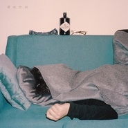

冲浪小子闯情关Atux Surfin' Boi On The Illusion Island
============================

|  |  |
| :--: | :-- |
| [ 冲浪小子闯情关Atux Surfin' Boi On The Illusion Island](https://emumo.xiami.com/album/2103675177) | **艺人**: [阿克江Akin](../index.md) **语种**: 国语 **唱片公司**: 虾米音乐人 **发行时间**: 2018年05月15日 **专辑类别**: 录音室专辑 **专辑风格**: 另类节奏布鲁斯 Alternative R&B, 电子 Electronic **播放数**: 3203819 **收藏数**: 3128 **评论数**: 289  |

## 简介

冲浪小子闯情关，这里的“情”字，远不止爱情，更有友情和对音乐执念。这里的“闯”字，更多是对自我舒适区域的突破。  
  
能唱歌的人很多，唱得好的人更多，同理，会编曲的人很多，编的好的人更多，如果没有办法突破拓展出自己的领域，把舶来品变成自己的东西，那你充其量就是国产的The Weeknd，国产的Post Malone，国产的某某某。而这个世界，只需要一个The Weeknd，只需要一个Post Malone，只需要一个你。  
  
琴弦难调，行此道艰难险阻，还有很长的路要走，我会跟我的兄弟们乘风破浪继续创造属于自己的真正的音乐。  
  
——阿克江LilAkin@阿图什冲浪男孩  
  
  
永不熄灭的诗人之魂  
  
灵魂歌者阿克江一向擅长用清新而忧郁的R&amp;B腔调讲述爱情的变换无常，一种未来海底世界一般的孤独感俘获了在这个数字时代里同样孤独的众多痴男怨女。演出造型总是挂着一副探长枪套，阿克江的歌声比手枪更具“杀伤力”，触及你的心底，歌词之真切往往像是为你所写、写你所想，让人感同身受不由得捂住胸口的幻痛——真的“走心”。  
  
来自新疆的阿克江毫无疑问是中国最棒的R&amp;B歌者之一。选秀出身，医学背景，然而他体内流着来自爷爷的诗人之血，儿时爷爷吟唱的童谣已经渗透进了他的灵魂。音乐是必须要做的，而且要做的是忠于内心和天赋的最浪漫的音乐，因为他继承的是爷爷的浪漫主义情怀。用顺滑抓人的旋律轻松驾驭驰放、迷幻的风格与氛围，用简单的中英文歌词就勾勒出丰富意境。  
  
阿图什冲浪男孩   
= 阿克江+最亲密的音乐朋友们  
  
为什么阿克江会化身阿图什冲浪男孩？阿图什冲浪男孩是阿克江和这几年一直亲密合作的新锐制作人、好兄弟们一起创造的为音乐而生的企划。这个团体没有限定人选，也没有太多约束，只是凭着对音乐最单纯的追求和互相理解欣赏的审美走到一起。  
  
此次专辑阿图什冲浪男孩包括阿克江常年铁杆搭档制作人VISUDY，同样擅长浪漫曲风的音乐人sususu和他的新组合NOPANGPANG，以及新锐制作人Yocho、Eddie Beatz，更有海外制作力量Delf和华南嘻哈盛景背后的英国制作人HARIKIRI的加盟。炙手可热的华裔说唱歌手Bohan Phoenix也献声专辑当中。一群才华横溢的年轻人在音乐中冲浪，大概就是对这个企划最直观的理解。  
  
冲浪小子闯情关  
从90s到未来  
  
在新专辑《冲浪小子闯情关》中，阿克江加入了更多新的尝试：新的曲风、新的合作制作人……不变的还是那个永远坚持自己音乐创作个性的阿克江，在风格流派的潮流中冲浪。New Jack Swing风格的《好了没》，南美舞曲风格的《Moon 月光男孩》，House风格的《性冷淡舞曲》……悉数带你回到肩扛Boombox、霓虹灯闪烁的黄金时代的街头，走路也踩着复古舞曲的节奏。“The Lights/灯光穿过我的身体”是阿克江作为一名歌手的内心独白：站在舞台上，面对全场观众的注视，过亮舞台灯光造成的暂盲，演出过后耳鸣带来的寂静……阿克江在《冲浪小子闯情关》中有很多故事与情绪想与你分享，虽然他说这张专辑并非“For Everyone”，但相信如果你喜欢这个全新的阿克江，那么这张专辑就是为你而作。  
  
  
  
  
Picks by 阿克江LilAkin  
  
《好了没》  
  
致敬自己的偶像Bobby Brown，众所周知我在歌里不知一次提到过他，作为New Jack Swing的鼻祖之一Bobby Brown在黄金年代为世人留下弥足珍贵的音乐作品，在赶时髦风气越发严重的中国音乐环境下，与我的搭档鬼才HARIKIRI勇于创新剑走偏锋创作了这首属于中国现代年轻人自己的New Jack Swing，不同于其他所谓复古风格的作品，这首New Jack Swing还加入了目前很新潮的配器和节奏型，我们本身就是讨厌跟别人一样的东西，我们也深知自己拥有属于自己别人无法模仿和超越的音乐风格和理念，继续做走在前端的音乐人，打造真正意义上的Made In China。  
  
《醉酒艺术家》  
  
这首歌是以一个喝醉酒的人的视角去表现的歌曲，曲风当然还是最钟爱的传统R&amp;B，歌词内容就是一个喝醉的人调皮的调侃自己的前任，和做音乐的朋友们都认为这首是属于自己最喜欢但是大众不一定喜欢的类型，但是管他呢，一个音乐人勿忘初心的做出了一首自己喜爱的音乐，这不就是音乐带给一个人的快乐吗？就像之前开玩笑说的，我好像没有拿着枪指着你的头逼你来听我的音乐，所以为什么要自找没趣的听着不喜欢的音乐，还要费神的敲打键盘表达不满呢，斯德哥尔摩综合症？哈哈哈   
  
我和Delf依然想表达的理念就是，中国人也有属于自己真正的R&amp;B音乐。  
  
  
《灯光穿过我的身体》  
  
每当演出结束，观众散场，灯光熄灭，音乐声观众吵闹声鼓点都戛然而止，那种前一分钟倍受瞩目伫立于千万个目光与摄像头下和后一分钟空荡的剧场，孤独一人的酒店，突然的静谧给人带来的心理落差是很大的，会感觉到十分的落寞孤寂和空虚。要么选择习惯这种生活，变得越来越麻木，像电视机里为了生存带上了面具的人一样和钱交朋友，变得不再有灵性不在敏感。可我们终究是要保持敏感的，我们终究是要保持创作的，我们终究是要大声笑大声哭的，我们选择了做“音乐”，就不得不用自己的敏感去不断创造有血有肉的音乐。我和我的兄弟 Naggy一拍即合，感同身受而又默契十足的完成了这首来自音乐人内心深处的声音。  
  
  
  
出品：虾米音乐寻光计划/阿图什冲浪男孩工作室  
发行时间：2018.5  
唱片编号：XA-029  
  
监制：阿克江LilAkin  
总制作人 ：阿克江LilAkin / Yocho  
编曲：阿克江LilAkin/Yocho/sususu/NOPANGPANG/HARIKIRI/Delf/Eddie Beatz/VISUDY  
录音：Yocho/文杰/ZC  
录音棚：BankRoll Studio  
混音及母带：Yocho/HARIKIRI/Delf/阿克江LilAkin  
企划/文案 ：邓大宝/阿克江LilAkin/LinGo  
封面设计：Billal  
平面摄影：Billal  
造型/ 化妆：阿克江LilAkin  
MV拍摄：SAM努尔夏提《醉酒艺术家》  
实体发行：星外星音乐  
海外数字发行：风潮音乐  
  
  
关于寻光计划  
  
他们在跟风，你在亲手制造未来。寻光计划是虾米音乐对平台内独立音乐人的全面扶持计划，旨通过互联网用户的喜好选择、专家媒体敏锐的嗅觉，挖掘出所有尚未崛起的年轻新锐之声，以各种方式帮助他们发出耀眼光芒。  
  
第二季寻光计划主题为“寻找未曝光少年”，意想让真正代表独立音乐之未来的音乐人被更多对的人听到，让未现之光得以有释放无畏的能量。无论他们现在身在何方，在过着怎样的人生。或许他们现在并不完美，但Leonard Cohen说过：万物皆有缝隙，那是光照进来的地方。  
  
最终胜出的SHAWEE、邹施如、方拾贰、KWORLD、GALI、何小河、We Are Various乐队、SARAH、未来星B3Rich、阿图什冲浪男孩等10位音乐人，会在2018年的4月起陆续发布正式的首张原创个人专辑，并全球同步数字发行。 

## 曲目

## 评论

|  |  |  |
| :-- | :-- | :-- |
|  [虾米用户](https://emumo.xiami.com/u/57282000) Man in the M... 2021-01-07 18:56 赞(0) 踩(0) | 
绝了
 |
|  [虾米用户](https://emumo.xiami.com/u/78255332) 全 损 音 质 2021-01-05 11:50 赞(0) 踩(0) | 
给我点音乐
 |
|  [虾米用户](https://emumo.xiami.com/u/41280075)  2020-09-17 16:32 赞(0) 踩(0) | 
谁把很精彩的一首歌给弄没了
 |
|  [虾米用户](https://emumo.xiami.com/u/425426447)  2020-08-15 22:00 赞(0) 踩(0) | 
最近出的歌再也让我找不到这张专辑用心的感觉了
 |
|  [虾米用户](https://emumo.xiami.com/u/50546127) 不是我们早熟，是世界逼迫... 2020-05-27 22:23 赞(1) 踩(0) | 
这张太他妈好听了
 |
|  [虾米用户](https://emumo.xiami.com/u/421578063) fox god 2020-05-24 11:31 赞(1) 踩(0) | 
我滴妈
 |
|  [虾米用户](https://emumo.xiami.com/u/331033063) 这家伙很聪明什么也没留下... 2020-04-19 15:35 赞(1) 踩(0) | 
舒服
 |
|  [虾米用户](https://emumo.xiami.com/u/206919100) 哔叽 2020-03-24 15:20 赞(0) 踩(0) | 
非专业，然鹅这专辑很棒棒哦
 |
|  [虾米用户](https://emumo.xiami.com/u/1579453)   2020-02-02 19:33 赞(3) 踩(0) | 
原来是虾米发行的  怪不得某云音乐搜不到 
 |
| ⇒ |  [虾米用户](https://emumo.xiami.com/u/54617071) 越 野 2020-03-06 15:59 赞(0) 踩(0) | 
有些好东西还是得来这
 |
|  [虾米用户](https://emumo.xiami.com/u/52073914) 晚安了虾米 2019-12-19 19:49 赞(0) 踩(0) | 
我爱阿克江
 |
|  [虾米用户](https://emumo.xiami.com/u/23239998) 我还没想好要写什么... 2019-11-05 22:13 赞(0) 踩(0) | 
醉鸡的艺术家
 |
|  [虾米用户](https://emumo.xiami.com/u/187985772) 忠于自己 2019-10-13 12:07 赞(0) 踩(0) | 
开口称绝 太棒了
 |
|  [虾米用户](https://emumo.xiami.com/u/430513287) 没救 2019-10-10 21:07 赞(0) 踩(0) | 
微博赶来
 |
|  [虾米用户](https://emumo.xiami.com/u/49543970)  2019-09-05 02:15 赞(0) 踩(0) | 
爱你
 |
|  [虾米用户](https://emumo.xiami.com/u/223845151) _(:* ｣∠)_ 2019-08-13 19:49 赞(0) 踩(0) | 
♡
 |
|  [虾米用户](https://emumo.xiami.com/u/309256043) 一起听歌吧… 2019-08-12 14:08 赞(0) 踩(0) | 

 |
|  [虾米用户](https://emumo.xiami.com/u/9079289) 我还没想好要写什么... 2019-06-20 05:59 赞(0) 踩(0) | 
最爱
 |
|  [虾米用户](https://emumo.xiami.com/u/425470472)  2019-06-03 20:14 赞(0) 踩(0) | 
十份
 |
|  [虾米用户](https://emumo.xiami.com/u/415656051) 我的国。 2019-05-16 12:40 赞(1) 踩(0) | 
特别喜欢好了没这个歌。 听这些歌心情会变好。 这就够了。
 |
|  [虾米用户](https://emumo.xiami.com/u/33236905) 只想深陷水草，潦倒一生。 2019-05-01 14:36 赞(0) 踩(0) | 
性感专辑
 |
|  [虾米用户](https://emumo.xiami.com/u/11749606) E l’alba ver... 2019-04-20 10:56 赞(0) 踩(0) | 

 |
|  [虾米用户](https://emumo.xiami.com/u/210461702) 香蕉炸弹 2019-04-11 09:08 赞(0) 踩(0) | 
推荐大家去听鱿鱼好了没，我每天饿了听一听就好很多
 |
|  [虾米用户](https://emumo.xiami.com/u/127412688) 我还没想好要写什么... 2019-04-08 16:33 赞(0) 踩(0) | 
迷幻够听一辈子
 |
|  [虾米用户](https://emumo.xiami.com/u/196878182) 。 2019-04-08 11:01 赞(0) 踩(0) | 
很久没有在虾米听音乐啦！！
 |
|  [虾米用户](https://emumo.xiami.com/u/351153781)  2019-04-02 18:35 赞(1) 踩(0) | 
我脑海中浮现的画面是一群青年在盛夏午夜的派对里，端着酒杯在半梦半醒间狂欢。 颓靡又迷幻，丧气又慵懒。 intro是派对开场前的喧闹，然后狂欢开始，《醉酒艺术家》是酒精开始起作用后的晕眩与困倦，《迷人的星反复穿行在我脑海》仿佛音乐停下后突然的黯然神伤，到《性冷淡舞曲》，音乐再次响起，继续着机械、冰冷、漫无目的的派对。最后一首《灯光穿过我的身体》，是结束后的落寞和孤独。
 |
|  [虾米用户](https://emumo.xiami.com/u/2442701) 认真听音乐 2019-03-01 05:38 赞(0) 踩(0) | 
为什么下架了???
 |
|  [虾米用户](https://emumo.xiami.com/u/333525248) 我还没想好要写什么... 2019-02-20 19:40 赞(0) 踩(0) | 

 |
|  [虾米用户](https://emumo.xiami.com/u/330312523)  2019-02-17 21:11 赞(0) 踩(0) | 
太爱了
 |
|  [虾米用户](https://emumo.xiami.com/u/15971712)   2019-01-31 23:53 赞(0) 踩(0) | 
非常快乐
 |
|  [虾米用户](https://emumo.xiami.com/u/165510838) 我还没想好要写什么... 2019-01-05 11:58 赞(2) 踩(0) | 
我真的爆哭 这张专辑处处戳我G点 怀疑专辑制作人是不是和我共享了同一个人格
 |
|  [虾米用户](https://emumo.xiami.com/u/50629233)   2018-12-31 17:56 赞(0) 踩(0) | 
恭喜恭喜
 |
|  [虾米用户](https://emumo.xiami.com/u/3533406)  2018-11-30 00:21 赞(1) 踩(0) | 
wow...容我肤浅的用“时髦”这个词来形容下这张蛮惊艳的专辑...
 |
|  [虾米用户](https://emumo.xiami.com/u/332409794)  2018-11-16 19:45 赞(0) 踩(0) | 
啦啦啦啦啦
 |
|  [虾米用户](https://emumo.xiami.com/u/407047159)  2018-10-26 19:21 赞(0) 踩(0) | 
GIF
 |
|  [虾米用户](https://emumo.xiami.com/u/357044506)  2018-10-23 19:16 赞(1) 踩(0) | 
所以是什么酒呢
 |
|  [虾米用户](https://emumo.xiami.com/u/376138005)  2018-10-16 23:15 赞(2) 踩(0) | 
好久没有没有辣么好听的华语&amp;ldquo;啊安比&amp;rdquo;了！华语之光！
 |
|  [虾米用户](https://emumo.xiami.com/u/33398644) 这家伙很聪明什么也没留下... 2018-10-09 05:34 赞(2) 踩(0) | 
迷幻风的音乐搭上阿克江独特的嗓音是很完美了。
 |
|  [虾米用户](https://emumo.xiami.com/u/721080)  2018-08-24 17:50 赞(1) 踩(0) | 
谁贱谁就健
 |
|  [虾米用户](https://emumo.xiami.com/u/333525248) 我还没想好要写什么... 2018-08-03 18:02 赞(0) 踩(0) | 
等待5号新歌的过程中倒是有的听了XD
 |
|  [虾米用户](https://emumo.xiami.com/u/333525248) 我还没想好要写什么... 2018-08-03 18:00 赞(0) 踩(0) | 
我大概是个假粉丝吧.......现在才发现有这张专辑???????
 |
|  [虾米用户](https://emumo.xiami.com/u/43031551)  6 2018-07-28 00:29 赞(1) 踩(0) | 
别再喝醉了
 |
|  [虾米用户](https://emumo.xiami.com/u/374064587) 心游万仞 2018-07-25 05:22 赞(2) 踩(0) | 
灵魂歌者阿克江一向擅长用清新而忧郁的R&amp;amp;B腔调讲述爱情的变换无常，一种未来海底世界一般的孤独感俘获了在这个数字时代里同样孤独的众多痴男怨女。 
 |
|  [虾米用户](https://emumo.xiami.com/u/49194163) 我还没想好要写什么... 2018-07-24 13:03 赞(2) 踩(0) | 
阿克江真的是国产之光
 |
|  [虾米用户](https://emumo.xiami.com/u/378938432)  2018-07-19 13:12 赞(0) 踩(0) | 
******
 |
|  [虾米用户](https://emumo.xiami.com/u/79485532) All I need i... 2018-07-06 00:57 赞(0) 踩(0) | 
这专牛逼
 |
|  [虾米用户](https://emumo.xiami.com/u/54875780) 收《SpidaBoi》《... 2018-06-23 05:20 赞(1) 踩(0) | 
所以 这是阿克江第一张专辑？
 |
|  [虾米用户](https://emumo.xiami.com/u/558626)  2018-06-21 14:38 赞(1) 踩(0) | 
印实体我会买的，太优秀
 |
|  [虾米用户](https://emumo.xiami.com/u/14626915) .  2018-06-18 11:14 赞(0) 踩(0) | 
&amp;amp;
 |
|  [虾米用户](https://emumo.xiami.com/u/10042092)  2018-06-14 11:48 赞(1) 踩(0) | 
看着你变热门真的不舍得 我真是自私得要死
 |
|  [虾米用户](https://emumo.xiami.com/u/14539607) 谢谢 2018-06-02 23:55 赞(1) 踩(0) | 
：
 |
|  [虾米用户](https://emumo.xiami.com/u/27684693)  2018-06-01 14:37 赞(1) 踩(0) | 
******
 |
|  [虾米用户](https://emumo.xiami.com/u/96296322)  2018-05-31 00:32 赞(1) 踩(0) | 
.
 |
|  [虾米用户](https://emumo.xiami.com/u/55529962) 我还没想好要写什么... 2018-05-27 06:47 赞(0) 踩(0) | 
阿江真的太牛逼
 |
|  [虾米用户](https://emumo.xiami.com/u/28991697)  2018-05-27 02:25 赞(1) 踩(0) | 
草莓现场简直不要太爽
 |
|  [虾米用户](https://emumo.xiami.com/u/28991697)  2018-05-27 02:24 赞(3) 踩(0) | 
老子早说了撒 阿克江比周杰伦还牛逼撒
 |
|  [虾米用户](https://emumo.xiami.com/u/21791342) 哦 2018-05-24 20:09 赞(1) 踩(0) | 
下个月北京见
 |
|  [虾米用户](https://emumo.xiami.com/u/352039704)   2018-05-23 11:49 赞(1) 踩(0) | 
这感觉 很 chill
 |
|  [虾米用户](https://emumo.xiami.com/u/41254793) ⠀     ⠀     ... 2018-05-23 00:56 赞(1) 踩(0) | 
.
 |
|  [虾米用户](https://emumo.xiami.com/u/22171585) 我还没想好要写什么... 2018-05-21 23:35 赞(1) 踩(0) | 
什么时候发实体唱片啊
 |
|  [虾米用户](https://emumo.xiami.com/u/4548027) 自我取悦 2018-05-21 22:04 赞(1) 踩(0) | 
专名二了点 其他都不错
 |
|  [虾米用户](https://emumo.xiami.com/u/68914032)       ‮   2018-05-20 23:22 赞(0) 踩(0) | 
有老实人吗
 |
|  [虾米用户](https://emumo.xiami.com/u/2963695) 我还没想好要写什么... 2018-05-20 15:03 赞(2) 踩(0) | 
很少关注国内音乐人，阿克江真是唯一一个一直在听在关注的
 |
|  [虾米用户](https://emumo.xiami.com/u/202661)  2018-05-19 19:53 赞(0) 踩(0) | 
这个冲浪是在网上吗？
 |
|  [虾米用户](https://emumo.xiami.com/u/6076438) 起身見頭暈，行路打倒褪。... 2018-05-19 10:44 赞(0) 踩(0) | 
0..
 |
|  [虾米用户](https://emumo.xiami.com/u/6076438) 起身見頭暈，行路打倒褪。... 2018-05-19 10:43 赞(0) 踩(0) | 
0..0
 |
|  [虾米用户](https://emumo.xiami.com/u/35619883) 没有身份证的 2018-05-19 02:43 赞(0) 踩(0) | 
真俗，好听
 |
|  [虾米用户](https://emumo.xiami.com/u/49998018) 我还没想好要写什么... 2018-05-17 21:43 赞(0) 踩(0) | 
迷幻的感覺!!!!!
 |
|  [虾米用户](https://emumo.xiami.com/u/361681437)  2018-05-17 19:07 赞(0) 踩(0) | 
会哈假怕咯人陪啦咯啦说家里刺激
 |
|  [虾米用户](https://emumo.xiami.com/u/361681437)  2018-05-17 19:06 赞(0) 踩(0) | 

 |
|  [虾米用户](https://emumo.xiami.com/u/47222004)  2018-05-17 14:29 赞(0) 踩(0) | 
闭上眼睛听 五颜六色的霓虹灯在我眼前一闪一闪
 |
|  [虾米用户](https://emumo.xiami.com/u/3855918) 我还没想好要写什么... 2018-05-16 23:42 赞(0) 踩(0) | 
啊啊啊啊啊想听现场啊！！
 |
|  [虾米用户](https://emumo.xiami.com/u/204387)  2018-05-16 22:59 赞(0) 踩(0) | 
没有民族味！不如今晚吃了啥？
 |
| ⇒ |  [虾米用户](https://emumo.xiami.com/u/350235670)  2018-05-17 07:57 赞(0) 踩(0) | 
阿你在36 大啊1么呃呃啧啧咯么
 |
|  [虾米用户](https://emumo.xiami.com/u/43495531) 摇滚不死，精神永存！ 2018-05-16 20:10 赞(1) 踩(0) | 
什么情况
 |
|  [虾米用户](https://emumo.xiami.com/u/195715332) 我还没想好要写什么... 2018-05-16 19:04 赞(0) 踩(0) | 
酷
 |
|  [虾米用户](https://emumo.xiami.com/u/91613498) 注册快计师 ☝ 2018-05-16 19:00 赞(2) 踩(0) | 
我太喜欢这张专辑惹
 |
|  [虾米用户](https://emumo.xiami.com/u/52617180)  2018-05-16 18:09 赞(4) 踩(0) | 
新疆哪J吧有海，还冲浪。
 |
| ⇒ |  [虾米用户](https://emumo.xiami.com/u/350024808)  2018-05-17 13:20 赞(0) 踩(0) | 
福海了解一下
 |
|  [虾米用户](https://emumo.xiami.com/u/4343750)  2018-05-16 17:02 赞(4) 踩(0) | 
請告訴我國內還有第二個阿克江的嗎？！
 |
|  [虾米用户](https://emumo.xiami.com/u/49783452)  2018-05-16 16:31 赞(1) 踩(0) | 
那首midnight真的唱进心里，像在有夏夜晚风的午夜喝得微醺舒服得让人沉沦
 |
|  [虾米用户](https://emumo.xiami.com/u/260402984) 你被安稳地爱着呢，应该有... 2018-05-16 16:17 赞(0) 踩(0) | 
赞
 |
|  [虾米用户](https://emumo.xiami.com/u/334558874) 从你的火山屯路过 2018-05-16 13:37 赞(1) 踩(0) | 
内容已删除
 |
| ⇒ |  [虾米用户](https://emumo.xiami.com/u/334558874) 从你的火山屯路过 2018-05-16 13:55 赞(0) 踩(0) | 
嗓音会真的很像Ferras。。。。。。。
 |
|  [虾米用户](https://emumo.xiami.com/u/334153469)  2018-05-16 13:16 赞(0) 踩(0) | 
阿克江 早有耳闻
 |
|  [虾米用户](https://emumo.xiami.com/u/42725114) ThistheshitI... 2018-05-16 12:06 赞(1) 踩(0) | 

 |
|  [虾米用户](https://emumo.xiami.com/u/49640493) 网易云SAINTDONT... 2018-05-16 11:16 赞(0) 踩(0) | 
我们不冷淡
 |
|  [虾米用户](https://emumo.xiami.com/u/286100227)   2018-05-16 09:49 赞(0) 踩(0) | 
l
 |
|  [虾米用户](https://emumo.xiami.com/u/91613498) 注册快计师 ☝ 2018-05-16 08:31 赞(1) 踩(0) | 
！
 |
|  [虾米用户](https://emumo.xiami.com/u/342133189)  2018-05-16 07:53 赞(1) 踩(0) | 
专心做音乐的人不多了❤️
 |
|  [虾米用户](https://emumo.xiami.com/u/48824227)  2018-05-16 00:38 赞(4) 踩(0) | 
最喜歡 迷人的星反覆穿行在我的腦海
 |
|  [虾米用户](https://emumo.xiami.com/u/8862875) 不忘初心 2018-05-15 22:30 赞(4) 踩(0) | 
前几天西湖音乐节听到了阿克江的live 真的很惊喜了！！！
 |
|  [虾米用户](https://emumo.xiami.com/u/48559247) Live like a ... 2018-05-15 22:22 赞(4) 踩(0) | 
第一次知道阿克江还是和吴莫愁合作的那首歌哈哈哈
 |
|  [虾米用户](https://emumo.xiami.com/u/50510298)  2018-05-15 22:08 赞(1) 踩(0) | 
啊啊啊，想去听阿克江
 |
|  [虾米用户](https://emumo.xiami.com/u/42810132) Aprés l'amou... 2018-05-15 21:53 赞(0) 踩(0) | 
519的草莓音乐节真的想去听阿克江！
 |
|  [虾米用户](https://emumo.xiami.com/u/50768301) 舍不得虾米 2018-05-15 21:47 赞(0) 踩(0) | 
一听挺喜欢
 |
|  [虾米用户](https://emumo.xiami.com/u/2418238) weibo: @尤米口 2018-05-15 21:32 赞(1) 踩(0) | 
♡⃛
 |
|  [虾米用户](https://emumo.xiami.com/u/282713191) 恨不止恨 2018-05-15 21:19 赞(0) 踩(0) | 
❤️❤️  ✈️ &amp;zwj;
 |
|  [虾米用户](https://emumo.xiami.com/u/273844623) 2016说唱救了我，20... 2018-05-15 21:03 赞(1) 踩(0) | 
阿里江 不说什么了 
 |
| ⇒ |  [虾米用户](https://emumo.xiami.com/u/273844623) 2016说唱救了我，20... 2018-05-15 21:03 赞(0) 踩(0) | 
赞的都顶阿里江
 |
|  [虾米用户](https://emumo.xiami.com/u/6081586) 不停止休息的耳膜  聋掉... 2018-05-15 19:40 赞(0) 踩(0) | 

 |
| ⇒ |  [虾米用户](https://emumo.xiami.com/u/357667633)  2018-05-16 13:16 赞(0) 踩(0) | 
？py6
 |
|  [虾米用户](https://emumo.xiami.com/u/7331208) 比俗世有趣多了 2018-05-15 19:18 赞(27) 踩(0) | 
我国电子乐制作人都有一个共同的心愿：治疗性冷淡
 |
| ⇒ |  [虾米用户](https://emumo.xiami.com/u/361137916)  2018-05-15 20:41 赞(0) 踩(0) | 
;kkkkkkkkkkkkkkkkkkkkkkkkkkk
 |
| ⇒ |  [虾米用户](https://emumo.xiami.com/u/361137916)  2018-05-15 20:42 赞(0) 踩(0) | 
0000
 |
| ⇒ |  [虾米用户](https://emumo.xiami.com/u/361137916)  2018-05-15 20:42 赞(0) 踩(0) | 
0000000
 |
| ⇒ |  [虾米用户](https://emumo.xiami.com/u/361137916)  2018-05-15 20:43 赞(0) 踩(0) | 
<q><b>@唐枫浩南@说：</b></q>
 |
| ⇒ |  [虾米用户](https://emumo.xiami.com/u/356157971) 学会珍惜 2020-10-15 12:42 赞(0) 踩(0) | 
不用治 遇到了自然有了
 |
|  [虾米用户](https://emumo.xiami.com/u/18316449)  2018-05-15 19:05 赞(1) 踩(0) | 
贼好听，点开试一试，不后悔！
 |
|  [虾米用户](https://emumo.xiami.com/u/18316449)  2018-05-15 18:57 赞(1) 踩(0) | 
太好听了吧这张砖！我神魂颠倒！
 |
|  [虾米用户](https://emumo.xiami.com/u/62553890)  ♡ 2018-05-15 18:25 赞(2) 踩(0) | 
好听   最喜欢双休日舞王
 |
|  [虾米用户](https://emumo.xiami.com/u/39619021) 大家再见 2018-05-15 18:18 赞(0) 踩(0) | 
？
 |
|  [虾米用户](https://emumo.xiami.com/u/258682398) 憔悴是常态，十八三十面 2018-05-15 18:07 赞(0) 踩(0) | 
沉迷 
 |
|  [虾米用户](https://emumo.xiami.com/u/37638890) 我在机场拿着车票等一艘船 2018-05-15 18:06 赞(2) 踩(0) | 
求这专上架Spotify 
 |
|  [虾米用户](https://emumo.xiami.com/u/4453773) Sunnydong199... 2018-05-15 18:04 赞(52) 踩(0) | 
江老师我是您的粉丝，在认可您作品同时也恳请您有空健个身靴靴
 |
| ⇒ |  [虾米用户](https://emumo.xiami.com/u/232730747) 我 不 想 听 你 的 ... 2018-05-15 20:47 赞(0) 踩(0) | 
哈哈哈江老师于是百忙之中抽空给了你一个白眼
 |
| ⇒ |  [虾米用户](https://emumo.xiami.com/u/359615043)  2018-05-16 12:32 赞(0) 踩(0) | 
杨宗纬
 |
| ⇒ |  [虾米用户](https://emumo.xiami.com/u/3066206)  2018-05-16 16:23 赞(0) 踩(0) | 
假粉
 |
| ⇒ |  [虾米用户](https://emumo.xiami.com/u/357015723)  2018-05-16 17:24 赞(0) 踩(0) | 

 |
| ⇒ |  [虾米用户](https://emumo.xiami.com/u/245304136) 永远爱您 2018-05-21 15:35 赞(0) 踩(0) | 
哈哈哈哈
 |
| ⇒ |  [虾米用户](https://emumo.xiami.com/u/49148590) 只有我可以Treat y... 2019-03-30 14:55 赞(0) 踩(0) | 
哈哈哈江老师不听不想不明白 
 |
|  [虾米用户](https://emumo.xiami.com/u/37638890) 我在机场拿着车票等一艘船 2018-05-15 17:55 赞(0) 踩(0) | 
阿克江真是要迷死人了
 |
|  [虾米用户](https://emumo.xiami.com/u/62959450)   2018-05-15 17:54 赞(0) 踩(0) | 
棒棒
 |
|  [虾米用户](https://emumo.xiami.com/u/285085100) ‍ 2018-05-15 17:06 赞(1) 踩(0) | 
希望有实体
 |
| ⇒ |  [虾米用户](https://emumo.xiami.com/u/321174996)  2018-05-15 18:07 赞(0) 踩(0) | 
鱼uuuuuuuuuuuu有呀呀呀呀呀呀呀
 |
| ⇒ |  [虾米用户](https://emumo.xiami.com/u/285085100) ‍ 2018-05-15 18:08 赞(0) 踩(0) | 
<q><b>660930hl说：</b></q>
 |
| ⇒ |  [虾米用户](https://emumo.xiami.com/u/321174996)  2018-05-15 18:09 赞(0) 踩(0) | 
UU77UU78777777778777777777777雨000
 |
| ⇒ |  [虾米用户](https://emumo.xiami.com/u/321174996)  2018-05-15 18:09 赞(0) 踩(0) | 
0000
 |
| ⇒ |  [虾米用户](https://emumo.xiami.com/u/285085100) ‍ 2018-05-15 18:10 赞(0) 踩(0) | 
<q><b>660930hl说：</b></q>
 |
|  [虾米用户](https://emumo.xiami.com/u/91594236) 得到和失去的都是一杯酒 2018-05-15 16:59 赞(0) 踩(0) | 
nice
 |
|  [虾米用户](https://emumo.xiami.com/u/123029886)   2018-05-15 16:56 赞(0) 踩(0) | 
棒棒棒
 |
|  [虾米用户](https://emumo.xiami.com/u/85412654) Freedom 2018-05-15 16:53 赞(0) 踩(0) | 
hey/
 |
|  [虾米用户](https://emumo.xiami.com/u/363506178)  2018-05-15 16:37 赞(2) 踩(0) | 
看到阿图什点进来的，是我家没错了！
 |
|  [虾米用户](https://emumo.xiami.com/u/12841840) Wechat:reync... 2018-05-15 16:10 赞(1) 踩(0) | 
十首真的听不够也不够听
 |
|  [虾米用户](https://emumo.xiami.com/u/16006619) nothing help 2018-05-15 15:47 赞(0) 踩(0) | 
一大早起来听的，每首都超棒！！！每首都喜欢！
 |
| ⇒ |  [虾米用户](https://emumo.xiami.com/u/357454515)  2018-05-15 16:48 赞(0) 踩(0) | 
，姐姐8
 |
|  [虾米用户](https://emumo.xiami.com/u/137207206) 想躲起来 2018-05-15 15:41 赞(0) 踩(0) | 
每一首都忍不住想收藏
 |
|  [虾米用户](https://emumo.xiami.com/u/288785917) EXO 2018-05-15 15:38 赞(1) 踩(0) | 
好听好听
 |
|  [虾米用户](https://emumo.xiami.com/u/28408574) Going my way... 2018-05-15 15:27 赞(0) 踩(0) | 
每首都属精品
 |
|  [虾米用户](https://emumo.xiami.com/u/54576317) 音乐爱好者  2018-05-15 15:23 赞(0) 踩(0) | 
棒
 |
|  [虾米用户](https://emumo.xiami.com/u/304072541) Please light... 2018-05-15 15:18 赞(0) 踩(0) | 
阿克江出品，质量有保障
 |
|  [虾米用户](https://emumo.xiami.com/u/52415194) ♬♩♫♪♡ 2018-05-15 15:12 赞(0) 踩(0) | 
ᵕ᷄≀ ̠˘᷅
 |
|  [虾米用户](https://emumo.xiami.com/u/351124295)  2018-05-15 15:07 赞(0) 踩(0) | 
下载虾米 只为听你
 |
|  [虾米用户](https://emumo.xiami.com/u/48642213) 我还没想好要写什么... 2018-05-15 14:57 赞(2) 踩(0) | 
好听绝了好听到我词穷没法形容 希望您再来深圳！！！
 |
| ⇒ |  [虾米用户](https://emumo.xiami.com/u/216979461) 天天甜甜 2018-05-16 00:25 赞(0) 踩(0) | 
6.9akin来深圳
 |
| ⇒ |  [虾米用户](https://emumo.xiami.com/u/48642213) 我还没想好要写什么... 2018-05-16 00:26 赞(0) 踩(0) | 
<q><b>37-_-说：</b></q>
 |
|  [虾米用户](https://emumo.xiami.com/u/281472423) 我还没想好要写什么... 2018-05-15 14:46 赞(0) 踩(0) | 
辛亏今天开手机了！！！！！
 |
|  [虾米用户](https://emumo.xiami.com/u/298379473) 寻找喜欢的的一切 2018-05-15 14:45 赞(0) 踩(0) | 
超级操机草鸡喜欢
 |
|  [虾米用户](https://emumo.xiami.com/u/347151961)  2018-05-15 14:38 赞(4) 踩(0) | 
喜欢的制作人都撞一起啦，35度的上海好适合听冲浪男孩的新歌
 |
|  [虾米用户](https://emumo.xiami.com/u/43020020) #Enthusiast. 2018-05-15 14:36 赞(4) 踩(0) | 
不亏待今天虾米推你上封面!真的好听  
 |
|  [虾米用户](https://emumo.xiami.com/u/274802)  2018-05-15 14:28 赞(2) 踩(0) | 
时髦！
 |
|  [虾米用户](https://emumo.xiami.com/u/30705) 我还没想好要写什么... 2018-05-15 13:54 赞(4) 踩(0) | 
一张平台与音乐人互相成就的专辑，乐坛会好！
 |
|  [虾米用户](https://emumo.xiami.com/u/4712879) 迷障丛生 2018-05-15 13:08 赞(1) 踩(0) | 
可最有wiggle room的居然是intro
 |
|  [虾米用户](https://emumo.xiami.com/u/253877498)  2018-05-15 13:07 赞(0) 踩(0) | 
很有创意的
 |
|  [虾米用户](https://emumo.xiami.com/u/7603700) 我还没想好要写什么... 2018-05-15 13:01 赞(0) 踩(0) | 
夏日消暑良器
 |
|  [虾米用户](https://emumo.xiami.com/u/119263094) 我的虾米歌单可以开很多个... 2018-05-15 12:57 赞(2) 踩(0) | 
非常喜欢这个海报的风格 ❤️
 |
|  [虾米用户](https://emumo.xiami.com/u/102945926) 我还没想好要写什么... 2018-05-15 12:46 赞(0) 踩(0) | 
治愈我失恋的心情。很棒！
 |
|  [虾米用户](https://emumo.xiami.com/u/360187903) 名片信息都是假的。 2018-05-15 12:45 赞(0) 踩(0) | 
看到封面，看看南京的气温&amp;hellip;真的不热吗！
 |
|  [虾米用户](https://emumo.xiami.com/u/11426498) 听歌的人呐最无情 2018-05-15 12:44 赞(0) 踩(0) | 
高产
 |
|  [虾米用户](https://emumo.xiami.com/u/332939832) 我会想你的 2018-05-15 12:24 赞(0) 踩(0) | 
boi 祝你美梦成真～
 |
|  [虾米用户](https://emumo.xiami.com/u/39607943)  2018-05-15 11:49 赞(2) 踩(0) | 
支持寻光计划
 |
|  [虾米用户](https://emumo.xiami.com/u/4734634)  2018-05-15 11:47 赞(4) 踩(0) | 
一个的月时间 我们创造了奇迹 很开心 这张专辑终究还是来了
 |
|  [虾米用户](https://emumo.xiami.com/u/8308934)  2018-05-15 11:43 赞(1) 踩(0) | 
一大堆同时发新歌的腰间盘喔不歌手里面 你最突出
 |
| ⇒ |  [虾米用户](https://emumo.xiami.com/u/361855373)  2018-05-15 11:45 赞(0) 踩(0) | 
m
 |
|  [虾米用户](https://emumo.xiami.com/u/338351030) (-_^) 2018-05-15 11:40 赞(3) 踩(0) | 
爱您哦
 |
|  [虾米用户](https://emumo.xiami.com/u/1589108) fuck offffff... 2018-05-15 11:36 赞(0) 踩(0) | 
内容已删除
 |
| ⇒ |  [虾米用户](https://emumo.xiami.com/u/338351030) (-_^) 2018-05-15 11:39 赞(0) 踩(0) | 
垃圾才觉得别人垃圾
 |
| ⇒ |  [虾米用户](https://emumo.xiami.com/u/338351030) (-_^) 2018-05-15 20:57 赞(0) 踩(0) | 
<q><b>说：</b></q>
 |
|  [虾米用户](https://emumo.xiami.com/u/15477519) 爱  是生命的和弦，而不... 2018-05-15 11:20 赞(1) 踩(0) | 
阿克江凌晨准时发布了新专&amp;hellip;
 |
|  [虾米用户](https://emumo.xiami.com/u/100056314) your jinji 2018-05-15 11:10 赞(0) 踩(0) | 
嘿嘿
 |
|  [虾米用户](https://emumo.xiami.com/u/43805130) 网易:SIonsoNOk... 2018-05-15 11:00 赞(2) 踩(0) | 
根本不够听
 |
|  [虾米用户](https://emumo.xiami.com/u/314342660) 校报办事处 2018-05-15 10:42 赞(0) 踩(0) | 
开心啊 阿克江又出新歌啦！奔走相告！
 |
|  [虾米用户](https://emumo.xiami.com/u/43805130) 网易:SIonsoNOk... 2018-05-15 10:28 赞(0) 踩(0) | 
闯不过
 |
|  [虾米用户](https://emumo.xiami.com/u/316099275) 你是我心里挥之不去的彩虹 2018-05-15 10:26 赞(0) 踩(0) | 
资瓷资瓷
 |
|  [虾米用户](https://emumo.xiami.com/u/8939226) 我还没想好要写什么... 2018-05-15 09:43 赞(0) 踩(0) | 
高产专业户阿克江
 |
|  [虾米用户](https://emumo.xiami.com/u/50642130) 很软 2018-05-15 09:33 赞(1) 踩(0) | 
造福人类
 |
|  [虾米用户](https://emumo.xiami.com/u/32125734) weibo：白菜y少女  2018-05-15 09:07 赞(0) 踩(0) | 
哈哈哈喜欢封面
 |
| ⇒ |  [虾米用户](https://emumo.xiami.com/u/7981711) 孤魂野鬼 2018-05-15 09:25 赞(0) 踩(0) | 
菜帝
 |
| ⇒ |  [虾米用户](https://emumo.xiami.com/u/49749297)   2018-05-15 10:22 赞(0) 踩(0) | 
诶嘿 落日飞车小分队
 |
|  [虾米用户](https://emumo.xiami.com/u/41284147) 我就是你要找的贱人 2018-05-15 09:03 赞(0) 踩(0) | 
Wow
 |
|  [虾米用户](https://emumo.xiami.com/u/232730747) 我 不 想 听 你 的 ... 2018-05-15 09:00 赞(1) 踩(0) | 
这一张的编曲阵容相当豪华了
 |
|  [虾米用户](https://emumo.xiami.com/u/6661598)  2018-05-15 08:54 赞(0) 踩(0) | 
7+10
 |
|  [虾米用户](https://emumo.xiami.com/u/43720349) 打扰了 2018-05-15 08:52 赞(0) 踩(0) | 
期待好久了！！好好听啊！怎么会这么好听
 |
| ⇒ |  [虾米用户](https://emumo.xiami.com/u/103912724)  2018-05-15 11:57 赞(0) 踩(0) | 
。
 |
| ⇒ |  [虾米用户](https://emumo.xiami.com/u/103912724)  2018-05-15 11:58 赞(0) 踩(0) | 
月65
 |
|  [虾米用户](https://emumo.xiami.com/u/24143615) 嘘! 2018-05-15 08:46 赞(0) 踩(0) | 
-0-
 |
|  [虾米用户](https://emumo.xiami.com/u/51975529) 网易同名 2018-05-15 08:42 赞(0) 踩(0) | 
已醉
 |
|  [虾米用户](https://emumo.xiami.com/u/40336281) 无意义 2018-05-15 08:39 赞(0) 踩(0) | 
谢谢
 |
|  [虾米用户](https://emumo.xiami.com/u/357365914)  2018-05-15 08:35 赞(0) 踩(0) | 
好听的一首歌 
 |
|  [虾米用户](https://emumo.xiami.com/u/32231042) 没 个 性 2018-05-15 08:14 赞(0) 踩(0) | 
来惹
 |
|  [虾米用户](https://emumo.xiami.com/u/100805844)  2018-05-15 08:05 赞(0) 踩(0) | 
编曲真棒
 |
|  [虾米用户](https://emumo.xiami.com/u/18210437)   2018-05-15 08:04 赞(2) 踩(0) | 
爱死你！你知道不知道！啊！！！！！！！Akin！         
 |
|  [虾米用户](https://emumo.xiami.com/u/312548041) 我还没想好要写什么... 2018-05-15 08:00 赞(0) 踩(0) | 

 |
|  [虾米用户](https://emumo.xiami.com/u/200687899) It’s complic... 2018-05-15 07:48 赞(0) 踩(0) | 
毫不犹豫收藏所有歌
 |
|  [虾米用户](https://emumo.xiami.com/u/47355043)  2018-05-15 07:25 赞(1) 踩(0) | 
果然
 |
|  [虾米用户](https://emumo.xiami.com/u/34420424) 我还没想好要写什么... 2018-05-15 07:24 赞(0) 踩(0) | 
2018.5.15
 |
|  [虾米用户](https://emumo.xiami.com/u/318132) 抠啦 2018-05-15 07:22 赞(0) 踩(0) | 
抠啦
 |
|  [虾米用户](https://emumo.xiami.com/u/142713468) 但愿我能够住在你的角膜里... 2018-05-15 07:21 赞(0) 踩(0) | 
终于等到了哈哈哈
 |
|  [虾米用户](https://emumo.xiami.com/u/72628524) 不如请你留下 2018-05-15 06:43 赞(0) 踩(0) | 
死了啦 太喜欢了
 |
|  [虾米用户](https://emumo.xiami.com/u/314919510) LOVE MUSIC a... 2018-05-15 06:29 赞(1) 踩(0) | 
OMG!!!! What a way to wake up this morning! Your on  AKIN!! Love ya
 |
| ⇒ |  [虾米用户](https://emumo.xiami.com/u/362083381)  2018-05-15 06:40 赞(0) 踩(0) | 
！！！！！！！！！
 |
|  [虾米用户](https://emumo.xiami.com/u/42936819)   2018-05-15 05:40 赞(0) 踩(0) | 

 |
|  [虾米用户](https://emumo.xiami.com/u/9774376) havmybabies ... 2018-05-15 04:29 赞(0) 踩(0) | 
哥哥❤️
 |
|  [虾米用户](https://emumo.xiami.com/u/2547186) 国内迷幻乐井喷发展 这么... 2018-05-15 04:25 赞(0) 踩(0) | 
越往后听越炸
 |
|  [虾米用户](https://emumo.xiami.com/u/2547186) 国内迷幻乐井喷发展 这么... 2018-05-15 04:25 赞(2) 踩(0) | 
中国最棒的迷幻电子专辑之一出炉了。
 |
|  [虾米用户](https://emumo.xiami.com/u/281062894) 我还没想好要写什么... 2018-05-15 02:21 赞(0) 踩(0) | 
好听
 |
|  [虾米用户](https://emumo.xiami.com/u/346003505) Frustrating.... 2018-05-15 01:59 赞(0) 踩(0) | 
播放列表又多了个爱心桃
 |
|  [虾米用户](https://emumo.xiami.com/u/7399498) I remain in ... 2018-05-15 01:59 赞(0) 踩(0) | 
这个古龙小说章节名一样的专辑名字
 |
|  [虾米用户](https://emumo.xiami.com/u/45385073) 虾米我爱你 2018-05-15 01:41 赞(0) 踩(0) | 
哇
 |
|  [虾米用户](https://emumo.xiami.com/u/13450954) 咩～ 2018-05-15 01:12 赞(0) 踩(0) | 
名字取得也好
 |
|  [虾米用户](https://emumo.xiami.com/u/19071940) 我情愿和你化作一团火焰 2018-05-15 01:09 赞(0) 踩(0) | 
冲浪
 |
|  [虾米用户](https://emumo.xiami.com/u/314433) :-D 2018-05-15 00:55 赞(1) 踩(0) | 
阿老师真棒
 |
|  [虾米用户](https://emumo.xiami.com/u/214416525) . 2018-05-15 00:53 赞(0) 踩(0) | 
太好听了吧
 |
|  [虾米用户](https://emumo.xiami.com/u/51545742)  2018-05-15 00:52 赞(0) 踩(0) | 
让不让睡了
 |
|  [虾米用户](https://emumo.xiami.com/u/812392) q音网易搜央央小月，酷g... 2018-05-15 00:45 赞(1) 踩(0) | 
App首页背景好酷炫啊，是mv动态的画面 
 |
| ⇒ |  [虾米用户](https://emumo.xiami.com/u/2523233) 太热 2018-05-15 01:00 赞(0) 踩(0) | 
是寻光计划的宣传片啦  
 |
|  [虾米用户](https://emumo.xiami.com/u/812392) q音网易搜央央小月，酷g... 2018-05-15 00:39 赞(0) 踩(0) | 

 |
|  [虾米用户](https://emumo.xiami.com/u/48765719) punks no die 2018-05-15 00:30 赞(0) 踩(0) | 
内容已删除
 |
| ⇒ |  [虾米用户](https://emumo.xiami.com/u/279212206)  2018-05-15 00:49 赞(0) 踩(0) | 
这还叫娘炮。。。社会摇喊麦才叫阳刚吗兄弟
 |
|  [虾米用户](https://emumo.xiami.com/u/9222981) 我还没想好要写什么... 2018-05-15 00:27 赞(0) 踩(0) | 
等到你
 |
|  [虾米用户](https://emumo.xiami.com/u/103335322)  Emit energy... 2018-05-15 00:20 赞(0) 踩(0) | 
出了！
 |
|  [虾米用户](https://emumo.xiami.com/u/18240383) 我永远爱你 虾米 2018-05-15 00:20 赞(0) 踩(0) | 
快开巡演哦
 |
|  [虾米用户](https://emumo.xiami.com/u/81372036) 嗯？ 2018-05-15 00:19 赞(0) 踩(0) | 
以前好像在网易云见到过 
 |
|  [虾米用户](https://emumo.xiami.com/u/4208300) 谢谢虾米 永远爱你 2018-05-15 00:17 赞(0) 踩(0) | 
没有if  saaad 在隔壁循环了20多遍了 哈哈哈
 |
|  [虾米用户](https://emumo.xiami.com/u/231422767) 过去无法重写，但它却让我... 2018-05-15 00:17 赞(0) 踩(0) | 
加油，你真的很有才华！
 |
|  [虾米用户](https://emumo.xiami.com/u/2960029) 如果世界太危险 只有音乐... 2018-05-15 00:14 赞(0) 踩(0) | 
sixsixsix
 |
|  [虾米用户](https://emumo.xiami.com/u/47005328) 我还没想好要写什么... 2018-05-15 00:13 赞(0) 踩(0) | 
d
 |
|  [虾米用户](https://emumo.xiami.com/u/147361618) 再会 2018-05-15 00:11 赞(0) 踩(0) | 
完美调配
 |
|  [虾米用户](https://emumo.xiami.com/u/331667191) LOST CONTROL 2018-05-15 00:10 赞(94) 踩(0) | 
中国最好的r&amp;amp;b专辑之一出炉了。
 |
| ⇒ |  [虾米用户](https://emumo.xiami.com/u/48091117) 我还没想好要写什么... 2018-08-14 01:04 赞(0) 踩(0) | 
中国最NB的R&amp;amp;b
 |
| ⇒ |  [虾米用户](https://emumo.xiami.com/u/49994994) . 2019-01-16 00:56 赞(0) 踩(0) | 
我寻思着，这不是电子乐吗？
 |
| ⇒ |  [虾米用户](https://emumo.xiami.com/u/331667191) LOST CONTROL 2019-01-16 01:02 赞(0) 踩(0) | 
<q><b>.                 Nujabes说：</b></q>
 |
| ⇒ |  [虾米用户](https://emumo.xiami.com/u/411769857) 我还没想好要写什么... 2019-12-20 20:48 赞(0) 踩(0) | 
我想请教一下，这专辑的每首歌，风格不能完全说是r&amp;b吧？我觉得是不是就是运用了r&amp;b的唱法，配上一些电子舞曲元素，虽然风格已经模糊，但也可以叫流行吗，加了电子元素的流行歌？但我觉得严格意义上说，这些歌曲无法被定义风格。个人见解，学识较浅，有懂行的希望可以多交流！！
 |
| ⇒ |  [虾米用户](https://emumo.xiami.com/u/331667191) LOST CONTROL 2019-12-21 03:19 赞(0) 踩(0) | 
<q><b>BODHI说：</b></q>
 |
| ⇒ |  [虾米用户](https://emumo.xiami.com/u/411769857) 我还没想好要写什么... 2019-12-21 13:19 赞(0) 踩(0) | 
<q><b>FlameBoi说：</b></q>
 |
| ⇒ |  [虾米用户](https://emumo.xiami.com/u/54617071) 越 野 2020-03-06 16:00 赞(0) 踩(0) | 
<q><b>FlameBoi说：</b></q>
 |
| ⇒ |  [虾米用户](https://emumo.xiami.com/u/331667191) LOST CONTROL 2020-03-06 16:06 赞(0) 踩(0) | 
<q><b>Xu_Dramma说：</b></q>
 |
|  [虾米用户](https://emumo.xiami.com/u/99884554) 我还没想好要写什么... 2018-05-15 00:10 赞(0) 踩(0) | 
嚯
 |
|  [虾米用户](https://emumo.xiami.com/u/144620702)  2018-05-15 00:10 赞(0) 踩(0) | 
好喜欢（ ）
 |
|  [虾米用户](https://emumo.xiami.com/u/313434744) onlyforyan♡ 2018-05-15 00:08 赞(0) 踩(0) | 
不睡了 听着呢
 |
|  [虾米用户](https://emumo.xiami.com/u/43637685) 。 2018-05-15 00:08 赞(0) 踩(0) | 
好听
 |
|  [虾米用户](https://emumo.xiami.com/u/267004211)  2018-05-15 00:06 赞(0) 踩(0) | 
来了来了
 |
|  [虾米用户](https://emumo.xiami.com/u/138620026) 倒地冰箱 2018-05-15 00:06 赞(0) 踩(0) | 
想听如果
 |
|  [虾米用户](https://emumo.xiami.com/u/252302284) chillllll 2018-05-15 00:05 赞(0) 踩(0) | 
！！！！ I'm gonna cry
 |
|  [虾米用户](https://emumo.xiami.com/u/292662379)  2018-05-15 00:04 赞(0) 踩(0) | 
现在才收到推送列
 |
|  [虾米用户](https://emumo.xiami.com/u/309380551) I know you k... 2018-05-15 00:04 赞(0) 踩(0) | 
上一秒失望 下一秒惊喜 11.59看到很多歌不能下载听 00.00突然的发布觉得幸运
 |
|  [虾米用户](https://emumo.xiami.com/u/99586286) 歌单停滞在2017 2018-05-15 00:04 赞(0) 踩(0) | 
爱你哟
 |
|  [虾米用户](https://emumo.xiami.com/u/187506637) .. 2018-05-15 00:04 赞(0) 踩(0) | 
爱你  akin
 |
|  [虾米用户](https://emumo.xiami.com/u/99383754)   2018-05-15 00:03 赞(1) 踩(0) | 
睡不着的我
 |
|  [虾米用户](https://emumo.xiami.com/u/232245859) 我还没想好要写什么... 2018-05-15 00:03 赞(0) 踩(0) | 

 |
|  [虾米用户](https://emumo.xiami.com/u/20864595) hebe jam Sea... 2018-05-15 00:02 赞(0) 踩(0) | 
狂赞
 |
|  [虾米用户](https://emumo.xiami.com/u/68914032)       ‮   2018-05-15 00:01 赞(0) 踩(0) | 

 |
|  [虾米用户](https://emumo.xiami.com/u/309216252)  2018-05-15 00:01 赞(0) 踩(0) | 
棒
 |
|  [虾米用户](https://emumo.xiami.com/u/306276858) … 2018-05-15 00:01 赞(0) 踩(0) | 

 |
|  [虾米用户](https://emumo.xiami.com/u/48373788) 模仿他人无异于自杀。 2018-05-15 00:01 赞(0) 踩(0) | 
挺好
 |
|  [虾米用户](https://emumo.xiami.com/u/17077682) 滚去spotify了。C... 2018-05-15 00:00 赞(0) 踩(0) | 
kool
 |
|  [虾米用户](https://emumo.xiami.com/u/156056836) 我还没想好要写什么... 2018-05-15 00:00 赞(0) 踩(0) | 
A/
 |
|  [虾米用户](https://emumo.xiami.com/u/50291916) 音乐国里再相见 2018-05-15 00:00 赞(0) 踩(0) | 
来啦
 |
|  [虾米用户](https://emumo.xiami.com/u/50812128) 网易finefrance... 2018-05-15 00:00 赞(0) 踩(0) | 
&amp;middot;
 |
|  [虾米用户](https://emumo.xiami.com/u/51614663) 这家伙很聪明啥玩意也没留... 2018-05-15 00:00 赞(0) 踩(0) | 
来啦
 |
|  [虾米用户](https://emumo.xiami.com/u/13111079) 有缘再见 2018-05-15 00:00 赞(0) 踩(0) | 
咦
 |
|  [虾米用户](https://emumo.xiami.com/u/2523233) 太热 2018-05-14 22:31 赞(2) 踩(0) | 
减肥失败的结果就是封面啥都不漏   藏肉大师阿克江 
 |
|  [虾米用户](https://emumo.xiami.com/u/205282606) 渐 入 佳 境 2018-05-14 19:46 赞(0) 踩(0) | 
just waiting，just waiting
 |
|  [虾米用户](https://emumo.xiami.com/u/2523233) 太热 2018-05-14 13:12 赞(0) 踩(0) | 
来了~坐等  
 |
|  [虾米用户](https://emumo.xiami.com/u/33486227) 我还没想好要写什么... 2018-04-21 19:18 赞(0) 踩(0) | 
超级棒！！加油！
 |
|  [虾米用户](https://emumo.xiami.com/u/9464517) 我还没想好要写什么... 2018-04-12 23:06 赞(0) 踩(0) | 
～
 |
|  [虾米用户](https://emumo.xiami.com/u/259266461)  2018-04-11 20:22 赞(0) 踩(0) | 
！
 |
|  [虾米用户](https://emumo.xiami.com/u/82624436) Stay Humble. 2018-04-11 11:40 赞(0) 踩(0) | 
来了
 |
|  [虾米用户](https://emumo.xiami.com/u/1320669) ツ 2018-04-10 22:59 赞(0) 踩(0) | 
0.0
 |
|  [虾米用户](https://emumo.xiami.com/u/721080)  2018-04-10 21:26 赞(0) 踩(0) | 
迷幻电摇
 |
|  [虾米用户](https://emumo.xiami.com/u/31816482) 吞吐之暖 几生不换 2018-04-10 17:53 赞(0) 踩(0) | 
哎呀 牛p坏了[带墨镜笑]
 |
|  [虾米用户](https://emumo.xiami.com/u/5019990) 感谢大家这几年的支持，虾... 2018-04-10 13:39 赞(0) 踩(0) | 
SAX:刘越
 |
|  [虾米用户](https://emumo.xiami.com/u/342660434) 我还没想好要写什么... 2018-04-10 11:01 赞(0) 踩(0) | 
nice
 |
|  [虾米用户](https://emumo.xiami.com/u/244296827)  2018-04-10 10:31 赞(0) 踩(0) | 
~~~~~~ ：）
 |
|  [虾米用户](https://emumo.xiami.com/u/238249791) 循规蹈矩症候群 2018-04-10 10:05 赞(0) 踩(0) | 
    
 |
|  [虾米用户](https://emumo.xiami.com/u/34420424) 我还没想好要写什么... 2018-04-10 09:57 赞(0) 踩(0) | 
GG
 |
|  [虾米用户](https://emumo.xiami.com/u/72628524) 不如请你留下 2018-04-10 06:52 赞(0) 踩(0) | 

 |
|  [虾米用户](https://emumo.xiami.com/u/15437387) 一满足 2018-04-10 06:30 赞(0) 踩(0) | 
dff
 |
|  [虾米用户](https://emumo.xiami.com/u/10170789) 最後一天 网易：Gimm... 2018-04-10 04:42 赞(0) 踩(0) | 

 |
|  [虾米用户](https://emumo.xiami.com/u/52415194) ♬♩♫♪♡ 2018-04-10 02:41 赞(0) 踩(0) | 
ᵕ᷄≀ ̠˘᷅
 |
|  [虾米用户](https://emumo.xiami.com/u/50280802) Under the Ho... 2018-04-10 01:28 赞(0) 踩(0) | 
-
 |
|  [虾米用户](https://emumo.xiami.com/u/187377929) 不是同个级别 2018-04-10 00:50 赞(0) 踩(0) | 
！
 |
|  [虾米用户](https://emumo.xiami.com/u/43248313) 略 2018-04-10 00:30 赞(0) 踩(0) | 
来了
 |
|  [虾米用户](https://emumo.xiami.com/u/49523935) 我还没想好要写什么... 2018-04-10 00:09 赞(0) 踩(0) | 

 |
|  [虾米用户](https://emumo.xiami.com/u/3539758) Peace 2018-04-10 00:08 赞(1) 踩(0) | 
想花钱买啊
 |
|  [虾米用户](https://emumo.xiami.com/u/216979461) 天天甜甜 2018-04-10 00:06 赞(0) 踩(0) | 
1
 |
|  [虾米用户](https://emumo.xiami.com/u/31531934) 恋の道に近道はない 2018-04-10 00:01 赞(0) 踩(0) | 
get✔
 |
|  [虾米用户](https://emumo.xiami.com/u/258164516)   2018-04-10 00:01 赞(0) 踩(0) | 
✌
 |
|  [虾米用户](https://emumo.xiami.com/u/121910914) 我想好好睡个觉 2018-04-10 00:00 赞(0) 踩(0) | 
爱
 |
|  [虾米用户](https://emumo.xiami.com/u/354245308) 我还没想好要写什么... 2018-04-09 23:59 赞(0) 踩(0) | 
等！
 |
|  [虾米用户](https://emumo.xiami.com/u/7561571) 虾米就像你一样懂我 2018-04-09 23:59 赞(0) 踩(0) | 
前排
 |
|  [虾米用户](https://emumo.xiami.com/u/314433) :-D 2018-04-09 23:54 赞(0) 踩(0) | 

 |
