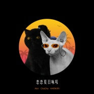

恋恋夏日咏叹
============================

|  |  |
| :--: | :-- |
| [ 恋恋夏日咏叹](https://emumo.xiami.com/album/2103728411) | **艺人**: [阿克江Akin](../index.md) **语种**: 国语 **唱片公司**: 独立发行 **发行时间**: 2018年06月04日 **专辑类别**: EP, 单曲 **专辑风格**: 节奏布鲁斯 R&B, 灵魂乐 Soul **播放数**: 377892 **收藏数**: 73 **评论数**: 30  |

## 简介

  
 

独立音乐人AKIN及ChaCha两人首次合作的新歌《恋恋夏日咏叹》今天首播，梦幻般的旋律和充满浪漫的歌词让我们提前感受夏日恋情的荡漾。
 

音乐成绩瞩目表现活跃的独立女音乐人ChaCha ，与许多国内外音乐人合作过不同风格的音乐，而这次新歌作品是她与来自哈萨克族的音乐创作人 Akin 的首次音乐碰撞。刚刚全球首发新歌《如果》的  Akin ，从麻醉师的身份转行到创作歌手，独特的声线和转音技巧让他的音乐充满治愈感——“这是我跟 ChaCha 第一次合作。我们是在一次看朋友演出时遇到的，闲聊时聊到不如一起做首歌，互相留了联系方式，于是促成了这首歌的诞生。我一直很欣赏 ChaCha ，相信我们一起可以出好东西。”
 

来自不同音乐背景、不同生长环境、不同性别的主唱 ChaCha 及 Akin 分别为自己的部分进行作词和演唱，两人分别用不同的演唱风格诠释本支单曲，演绎出夏日轻松的氛围和恋人之间纯爱的羁绊。爷爷是哈萨克族著名诗人作家的 Akin 说： “这次就想做一首听上去有夏日跟恋爱感觉的歌，我和 ChaCha 各自完成了自己 part 的词和曲”。而与很多 Hip-Hop 音乐人合作过的 ChaCha ，则有着丰富的说唱创作经验，“这次创作的灵感嘛就是想做一首有点纯爱和浪漫感的歌，想再回味一下初恋的感觉。我觉得曲风可以说是 R&amp;B ，其实什么风格不重要，重要的是好听。”
 

 

## 曲目

## 评论

|  |  |  |  |
| :-- | :-- | :-- | :-- |
|  [虾米用户](https://emumo.xiami.com/u/421578063) fox god 2020-05-29 20:36 赞(0) 踩(0) | 
(&amp;sigma;&amp;prime;▽‵)&amp;prime;▽‵)&amp;sigma;
 |
|  [虾米用户](https://emumo.xiami.com/u/212937261)  2019-08-07 17:17 赞(0) 踩(0) | 
能不能把女声部分去掉呜呜太出戏了（说唱的灵魂不是发音好不好！不然就请本山大爷了！！）希望重制。只是看江江不忍打八分以下
 |
|  [虾米用户](https://emumo.xiami.com/u/32153423) 我还没想好要写什么... 2019-03-11 00:40 赞(0) 踩(0) | 
❤️
 |
|  [虾米用户](https://emumo.xiami.com/u/208162822) 無氧呼吸 2019-02-28 19:56 赞(0) 踩(0) | 
没什么可说的了，早生贵子吧。
 |
|  [虾米用户](https://emumo.xiami.com/u/2870313) 我还没想好要写什么... 2019-01-06 18:12 赞(0) 踩(0) | 
喜欢！
 |
|  [虾米用户](https://emumo.xiami.com/u/9062060) 再见虾米，再见年轻的自己... 2018-09-23 09:16 赞(0) 踩(0) | 
棒棒棒 十分喜欢
 |
|  [虾米用户](https://emumo.xiami.com/u/50215500) Ghetto chigg... 2018-07-14 10:16 赞(0) 踩(0) | 
阿克江和chacha的搭配 完美
 |
|  [虾米用户](https://emumo.xiami.com/u/3524147)  2018-07-09 14:17 赞(0) 踩(0) | 
太棒了~江江的歌就没有一首不好听的！
 |
|  [虾米用户](https://emumo.xiami.com/u/6076438) 起身見頭暈，行路打倒褪。... 2018-06-22 06:48 赞(0) 踩(0) | 
0..*
 |
|  [虾米用户](https://emumo.xiami.com/u/50511371) 我还没想好要写什么... 2018-06-19 01:04 赞(0) 踩(0) | 
很喜欢听了
 |
|  [虾米用户](https://emumo.xiami.com/u/25981209) 我还没想好要写什么... 2018-06-16 18:33 赞(0) 踩(0) | 
太好听了！！！！！！！！！！！！
 |
|  [虾米用户](https://emumo.xiami.com/u/9464517) 我还没想好要写什么... 2018-06-07 12:01 赞(0) 踩(0) | 
～
 |
|  [虾米用户](https://emumo.xiami.com/u/114481088) 我爱摇滚 快乐每一天 耶... 2018-06-06 09:53 赞(0) 踩(0) | 
封面瘦瘦的猫是阿克江
 |
|  [虾米用户](https://emumo.xiami.com/u/49640493) 网易云SAINTDONT... 2018-06-05 14:59 赞(0) 踩(0) | 
高考成功
 |
|  [虾米用户](https://emumo.xiami.com/u/24143615) 嘘! 2018-06-05 09:15 赞(0) 踩(0) | 
-0-
 |
|  [虾米用户](https://emumo.xiami.com/u/9931551) 感谢相遇 2018-06-05 07:22 赞(0) 踩(0) | 
总算来了
 |
|  [虾米用户](https://emumo.xiami.com/u/75497994) Om ar ra ba ... 2018-06-04 21:47 赞(0) 踩(0) | 
︽︽ ︽︽
 |
|  [虾米用户](https://emumo.xiami.com/u/142713468) 但愿我能够住在你的角膜里... 2018-06-04 20:00 赞(0) 踩(0) | 

 |
|  [虾米用户](https://emumo.xiami.com/u/343112903) 离我远一点 2018-06-04 19:20 赞(0) 踩(0) | 
摇起来
 |
|  [虾米用户](https://emumo.xiami.com/u/49569171) 我还没想好要写什么... 2018-06-04 18:05 赞(0) 踩(0) | 
？
 |
|  [虾米用户](https://emumo.xiami.com/u/114655992) 网易☁️：Redchee... 2018-06-04 17:44 赞(1) 踩(0) | 
晚太多了吧
 |
|  [虾米用户](https://emumo.xiami.com/u/4409103) 用户忙 2018-06-04 16:59 赞(0) 踩(0) | 

 |
|  [虾米用户](https://emumo.xiami.com/u/227844644) 别的世界一定比这个好 2018-06-04 15:33 赞(0) 踩(0) | 
昨天刚分享了。我马上喜欢
 |
|  [虾米用户](https://emumo.xiami.com/u/34420424) 我还没想好要写什么... 2018-06-04 15:01 赞(0) 踩(0) | 
️️️
 |
|  [虾米用户](https://emumo.xiami.com/u/31531934) 恋の道に近道はない 2018-06-04 14:53 赞(0) 踩(0) | 
get
 |
|  [虾米用户](https://emumo.xiami.com/u/10807932) 我还没想好要写什么... 2018-06-04 14:52 赞(0) 踩(0) | 
哇哇哇
 |
|  [虾米用户](https://emumo.xiami.com/u/43248313) 略 2018-06-04 14:52 赞(0) 踩(0) | 
嘻
 |
|  [虾米用户](https://emumo.xiami.com/u/47331541)   2018-06-04 09:53 赞(0) 踩(0) | 
？？ 
 |
|  [虾米用户](https://emumo.xiami.com/u/47331541)   2018-06-04 09:47 赞(0) 踩(0) | 
为啥未发布
 |
|  [虾米用户](https://emumo.xiami.com/u/38847730) 我还没想好要写什么... 2018-06-04 03:27 赞(0) 踩(0) | 

 |
