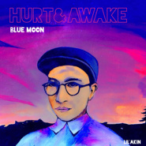

Blue moonBlue moon
============================

|  |  |
| :--: | :-- |
| [ Blue moonBlue moon](https://emumo.xiami.com/album/426853704) | **艺人**: [阿克江Akin](../index.md) **语种**: 国语 **唱片公司**: 独立发行 **发行时间**: 2015年03月21日 **专辑类别**: EP, 单曲 **专辑风格**: 爵士放克 Jazz Funk, 流行灵魂乐 Pop Soul, 独立流行 Indie Pop **播放数**: 438128 **收藏数**: 102 **评论数**: 8  |

## 简介

 
 

单曲Blue moon将收入于阿克江Lil‘Akin即将发行的第二张Mixtape:［HURT&amp;AWAKE］. 请期待。
 

(作词/作曲:阿克江 编曲:乔克/阿克江)
 

 
 

 

## 曲目

## 评论

|  |  |  |
| :-- | :-- | :-- |
|  [虾米用户](https://emumo.xiami.com/u/6955384)   2016-09-04 23:19 赞(0) 踩(0) | 
回答你 这是爱
 |
|  [虾米用户](https://emumo.xiami.com/u/89770016) 努力过好每一天 2016-08-12 23:14 赞(0) 踩(0) | 
三首之一
 |
|  [虾米用户](https://emumo.xiami.com/u/5907047) 8==D 2016-05-03 17:07 赞(0) 踩(0) | 
:)
 |
|  [虾米用户](https://emumo.xiami.com/u/7325316)  2015-05-11 18:00 赞(1) 踩(0) | 
超好听！单曲循环中……
 |
|  [虾米用户](https://emumo.xiami.com/u/3167799) 我还没想好要写什么... 2015-04-29 10:53 赞(0) 踩(0) | 
很舒服
 |
|  [虾米用户](https://emumo.xiami.com/u/2423789)  2015-04-04 12:51 赞(0) 踩(0) | 
很喜欢的一位音乐人~新单曲很棒
 |
|  [虾米用户](https://emumo.xiami.com/u/34831732) Hell nawh to... 2015-03-21 13:17 赞(0) 踩(0) | 
Acid drop
 |
|  [虾米用户](https://emumo.xiami.com/u/34831732) Hell nawh to... 2015-03-21 09:23 赞(0) 踩(0) | 
嗯
 |
