阿克江Akin
============================

|  |  |
| :--: | :-- |
| [ 阿克江Akin](https://i.xiami.com/lilakin) | **播放数**: 19043757 **粉丝数**: 25466 **评论数**: 772 **地区**: China 中国大陆 **风格**: 根源唱作人 Singer-Songwriter, 灵魂乐 Soul, 独立流行 Indie Pop, 未来车库舞曲 Future Garage  |

## 档案

阿克江·阿依丁  哈萨克族 singer/songwriter 自赏派

## 专辑

| 名称 | 语种 | 唱片公司 | 发行时间 | 专辑类别 | 专辑风格 |
| :--: | :-- | :-- | :-- | :-- | :-- |
| [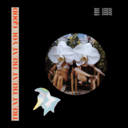 Treat Treat Treat You good](./albums/5021349054.md) | 国语 | 独立发行 | 2020年08月25日 | 录音室专辑 | 节奏布鲁斯 R&B, 迷幻流行 Psychedelic Pop |
| [ Adios](./albums/5020605416.md) | 国语 |  | 2020年05月07日 | 录音室专辑 |  |
| [ CUZ I](./albums/2108165156.md) | 国语 | 独立发行 | 2020年03月15日 | 录音室专辑 | 节奏布鲁斯 R&B |
| [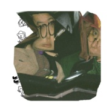 恋曲2020](./albums/2105007682.md) | 国语 |  | 2019年07月19日 | EP, 单曲 | 新杰克摇摆乐 New Jack Swing |
| [ Noise](./albums/2104916999.md) | 国语 | Dopeness | 2019年06月03日 | EP, 单曲 | 嘻哈 Hip-Hop |
| [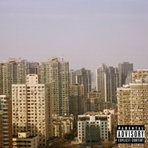 摇摆男孩在房里mixtape](./albums/2104761117.md) | 国语 |  | 2019年04月10日 | EP, 单曲 | 老派说唱 Old-school Hip Hop |
| [ G.O.A.TGreatest of All the Time](./albums/2104715727.md) | 国语 | 独立发行 | 2019年03月26日 | 录音室专辑 | 嘻哈 Hip-Hop |
| [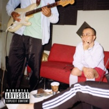 Berlin wall / a song for myself](./albums/2104720233.md) | 国语 | 独立发行 | 2019年03月14日 | EP, 单曲 | 新灵魂乐 Neo-Soul |
| [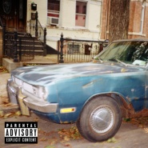 RunAwaY](./albums/2104607766.md) | 国语 | 明堂唱片 | 2019年02月19日 | EP, 单曲 | 嘻哈 Hip-Hop |
| [ Sunny rain](./albums/2104115036.md) | 国语 | 独立发行 | 2018年10月12日 | EP, 单曲 | 都市流行 City Pop, 独立流行 Indie Pop |
| [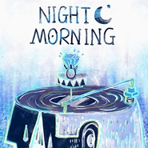 Night.morning♥](./albums/2103929275.md) | 国语 | 独立发行 | 2018年08月11日 | EP, 单曲 | 爵士说唱 Jazz Rap, 灵魂乐 Soul, 节奏布鲁斯 R&B |
| [ Blue eyes](./albums/2103827826.md) | 国语 | 独立发行 | 2018年07月11日 | EP, 单曲 | 独立流行 Indie Pop |
| [ 恋恋夏日咏叹](./albums/2103728411.md) | 国语 | 独立发行 | 2018年06月04日 | EP, 单曲 | 节奏布鲁斯 R&B, 灵魂乐 Soul |
| [ 冲浪小子闯情关Atux Surfin' Boi On The Illusion Island](./albums/2103675177.md) | 国语 | 虾米音乐人 | 2018年05月15日 | 录音室专辑 | 另类节奏布鲁斯 Alternative R&B, 电子 Electronic |
| [ Grandpa爷爷](./albums/2103492698.md) | 国语 | 独立发行 | 2018年01月23日 | EP, 单曲 | 节奏布鲁斯 Rhythm & Blues, 节奏布鲁斯 R&B, 另类舞曲 Alternative Dance |
| [ Next Level](./albums/2102880158.md) | 国语 | 虾米音乐人 | 2017年10月26日 | 合集, 杂锦 | 独立电子乐 Indietronica |
| [ ABOVE U](./albums/2102851652.md) | 国语 | 独立发行 | 2017年09月05日 | EP, 单曲 | 嘻哈 Hip-Hop, 陷阱说唱 Trap Rap, 当代节奏布鲁斯 Contemporary R&B |
| [ DaSiNi打死你](./albums/2102801125.md) | 国语 | 独立发行 | 2017年07月21日 | EP, 单曲 | 陷阱说唱 Trap Rap, 另类嘻哈 Left-Field Hip-Hop |
| [ Midnight](./albums/2102751503.md) | 国语 | 独立发行 | 2017年05月19日 | EP, 单曲 | 灵魂乐 Soul, 新灵魂乐 Neo-Soul, 节奏布鲁斯 R&B |
| [ FLING IN LUV](./albums/2102712171.md) | 英语 | 看见音乐 (上海) | 2017年03月15日 | EP, 单曲 |  |
| [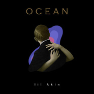 Ocean (Special Edition)](./albums/2102710447.md) | 国语 | 独立发行 | 2017年03月12日 | EP, 单曲 | 根源唱作人 Singer-Songwriter, 另类节奏布鲁斯 Alternative R&B |
| [ Ocean](./albums/2102706374.md) | 国语 | 灿星文化 | 2017年03月08日 | EP, 单曲 |  |
| [ I'M AWAKEAKIN x VISUDY](./albums/2102659439.md) | 国语 | 独立发行 | 2016年12月05日 | EP, 单曲 |  |
| [ Love爱](./albums/2102402207.md) | 英语 | Darker Than Wax | 2016年09月21日 | EP, 单曲 |  |
| [ I need a bad girl](./albums/2100386024.md) | 国语 | OURDEN | 2016年09月02日 | EP, 单曲 |  |
| [ Seaside motelyoko♥](./albums/2100371498.md) | 国语 | Babel Records | 2016年07月22日 | EP, 单曲 |  |
| [ Lost ma $hit](./albums/2100347050.md) | 英语 | 独立发行 | 2016年05月30日 | EP, 单曲 | 未来车库舞曲 Future Garage |
| [ 請打給我call me plz  ](./albums/2100340644.md) | 国语 | 独立发行 | 2016年05月20日 | EP, 单曲 |  |
| [ 一月JANUARY](./albums/2100262112.md) | 国语 | 独立发行 | 2016年01月18日 | EP, 单曲 | 另类说唱 Alternative Hip Hop, 未来车库舞曲 Future Garage |
| [ I WANT CHANGE阿克江LilAkin;JZlee](./albums/2100238838.md) | 国语 | 独立发行 | 2015年11月18日 | EP, 单曲 | 当代节奏布鲁斯 Contemporary R&B, 灵魂乐 Soul, 节奏布鲁斯 Rhythm & Blues |
| [ GIVE U MY TAPElittle airplane](./albums/2100235522.md) | 英语 | 独立发行 | 2015年11月11日 | EP, 单曲 | 未来车库舞曲 Future Garage |
| [ Burningfalling ocean](./albums/2100221266.md) | 英语 | 独立发行 | 2015年10月16日 | EP, 单曲 | 缓拍 Downtempo, 寒潮 Chillwave |
| [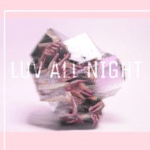 Luv all nightAtux surfin' Boi](./albums/2100190722.md) | 英语 | 独立发行 | 2015年09月04日 | EP, 单曲 |  |
| [ My soul,My bone](./albums/35863785.md) | 英语 | 独立发行 | 2015年07月03日 | EP, 单曲 | 未来车库舞曲 Future Garage |
| [ Blue moon](./albums/435595230.md) | 国语 | 虾米音乐人, 梦响强音 | 2015年06月29日 | EP, 单曲 | 灵魂乐 Soul, 放克 Funk, 新灵魂乐 Neo-Soul |
| [ Blue moonBlue moon](./albums/426853704.md) | 国语 | 独立发行 | 2015年03月21日 | EP, 单曲 | 爵士放克 Jazz Funk, 流行灵魂乐 Pop Soul, 独立流行 Indie Pop |
| [ HURT&AWAKEHURT&AWAKE](./albums/1326853661.md) | 国语 | 独立发行 | 2015年03月21日 | 录音室专辑 | 爵士放克 Jazz Funk, 当代节奏布鲁斯 Contemporary R&B, 流行灵魂乐 Pop Soul |
| [ 逛鸟市Hot Jelly Drop辛辣软糖](./albums/1219285944.md) | 国语 | 独立发行 | 2014年12月24日 | EP, 单曲 | 老派说唱 Old-school Hip Hop |
| [ 长沙Live微笑](./albums/113109237.md) | 国语 | 独立发行 | 2014年10月12日 | 现场专辑 | 独立民谣 Indie Folk |
| [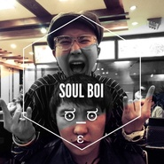 Bring da old song](./albums/111299393.md) | 国语 | 独立发行 | 2014年09月21日 | EP, 单曲 | 独立民谣 Indie Folk |
| [ 毡房物语2奔跑的小马驹](./albums/1111296194.md) | 国语 | 独立发行 | 2014年09月21日 | EP, 单曲 | 独立民谣 Indie Folk |
| [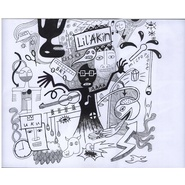 奔跑的小马驹和鹿儿岛野人](./albums/508301242.md) | 国语 | 独立发行 | 2014年08月18日 | EP, 单曲 | 独立民谣 Indie Folk |
| [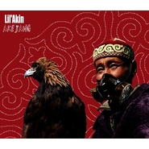 星空和告密的心](./albums/290137.md) | 国语 | 独立发行 | 2012年11月01日 | EP, 单曲 |  |
| [ 在那遥远的地方](./albums/446499.md) | 国语 | 独立发行 | 2011年03月27日 | EP, 单曲 |  |
| [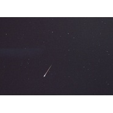 麻醉医生和他的小狗卡卡](./albums/423133.md) | 国语 | 阿克江LilAkin | 2011年01月29日 | EP, 单曲 | 当代节奏布鲁斯 Contemporary R&B |
| [ Guitar goin' home](./albums/443706.md) | 国语 | 独立发行 | 2009年07月30日 | EP, 单曲 | 独立流行 Indie Pop |
| [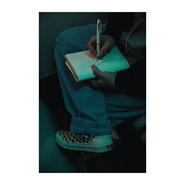 FLING IN LUV(feat.Vans)](./albums/2105618588.md) | 国语 | 独立发行 | 不详 | EP, 单曲 | 节奏布鲁斯 R&B |

## 评论

|  |  |  |  |
| :-- | :-- | :-- | :-- |
|  [虾米用户](https://emumo.xiami.com/u/407794163) Woof woof  2021-01-12 22:26 赞(0) 踩(0) | 
在虾米要关之前再来偷偷留下我的喜欢 因为阿克江的歌下载了虾米，一个人生活真的好累啊，有时候忙起来一周都没有和别人交流的机会。记得在压力大到脑子里嗡嗡作响的时候，把星空和告密的心反反复复的放了十几遍。音乐真是情绪最好的载体，对于我来说比文字更有力量。谢谢你的歌，等疫情过去希望还能有Akin x Visudy的全国tour～这次我一定不会错过 
 |
|  [虾米用户](https://emumo.xiami.com/u/406377274) 周维 2021-01-07 12:01 赞(0) 踩(0) | 
the light is too bright 我不能open my eyes
 |
|  [虾米用户](https://emumo.xiami.com/u/13652778) オハ、コンバンチハ！ 2021-01-05 20:08 赞(2) 踩(0) | 
阿老师您好，我想知道虾米马上就要关了。《冲浪小子闯情关》这张作品去哪里能听   
 |
|  [虾米用户](https://emumo.xiami.com/u/281494444)  2020-12-06 10:17 赞(0) 踩(0) | 
麻醉诗人
 |
|  [虾米用户](https://emumo.xiami.com/u/50702694) 后颈滚烫 2020-10-12 12:23 赞(0) 踩(0) | 
收两张10.23上海
 |
|  [虾米用户](https://emumo.xiami.com/u/2202110) 作梦中梦 悟身外身 2020-10-08 03:01 赞(0) 踩(0) | 
11号长沙46
 |
|  [虾米用户](https://emumo.xiami.com/u/55238954) 总比与你一起谈谈理想好吧 2020-08-19 01:07 赞(0) 踩(0) | 
您好，您的音乐很美:D
 |
|  [虾米用户](https://emumo.xiami.com/u/325888631) 人的不幸来源于对爱过度的... 2020-07-05 17:34 赞(5) 踩(0) | 
太神仙了！！！！中国的欧美风歌手
 |
|  [虾米用户](https://emumo.xiami.com/u/347262369) This is must... 2020-07-01 14:28 赞(2) 踩(0) | 
你很棒，你也值得被鼓励。今天第一天认识你，有幸相识，希望能变成星星照亮我的路。
 |
|  [虾米用户](https://emumo.xiami.com/u/379162683) 我想要记住你们，我想要你... 2020-06-14 11:26 赞(0) 踩(0) | 

 |
|  [虾米用户](https://emumo.xiami.com/u/230523113) 我还没想好要写什么... 2020-06-04 23:19 赞(0) 踩(0) | 
什么神仙
 |
|  [虾米用户](https://emumo.xiami.com/u/421578063) fox god 2020-05-17 19:41 赞(1) 踩(0) | 
(❁&amp;acute;&amp;omega;`❁)
 |
|  [虾米用户](https://emumo.xiami.com/u/376633276) 虾米  拜拜喽  我永远... 2020-03-24 11:57 赞(1) 踩(0) | 
bad girl
 |
|  [虾米用户](https://emumo.xiami.com/u/278926500) just lust 2020-02-13 08:18 赞(1) 踩(0) | 
为啥不在虾米发新专啊贝贝
 |
|  [虾米用户](https://emumo.xiami.com/u/400715332) 留白 2020-02-08 00:12 赞(0) 踩(0) | 
·
 |
|  [虾米用户](https://emumo.xiami.com/u/253100822) 要做哥哥们的御用舞者 E... 2020-02-03 08:51 赞(0) 踩(0) | 
没有理由拒绝您！！！！
 |
|  [虾米用户](https://emumo.xiami.com/u/150621852) 这世界真的不算可爱 宝贝 2020-01-31 03:35 赞(1) 踩(0) | 
我爱你
 |
|  [虾米用户](https://emumo.xiami.com/u/356763773) 我还没想好要写什么... 2019-12-20 21:22 赞(0) 踩(0) | 
~
 |
|  [虾米用户](https://emumo.xiami.com/u/432602902) 珍藏在枕头下面的依托 2019-11-23 23:32 赞(0) 踩(0) | 
为了阿老师下虾米！
 |
|  [虾米用户](https://emumo.xiami.com/u/6810807) ✌✌✌✌ 2019-11-18 17:58 赞(0) 踩(0) | 
昨天重庆坚果现场太短了 45分钟结束 遗憾
 |
|  [虾米用户](https://emumo.xiami.com/u/1074929)  2019-11-05 16:55 赞(1) 踩(0) | 
同龄音乐人，真是不服不行这位哈萨克哥们！虽然作品颇为摩登，但不失血性。
 |
|  [虾米用户](https://emumo.xiami.com/u/329721855) excellentmea... 2019-10-22 21:20 赞(0) 踩(0) | 
年初重庆场岁末派对上有位戴眼镜扎辫子的男孩帮我录过阿克江的live，啊好想再次遇见他啊。
 |
|  [虾米用户](https://emumo.xiami.com/u/423709783) 风尘之中亦有性情中人 2019-10-10 10:46 赞(1) 踩(0) | 
太喜欢你的音乐了，感觉找到了自己 
 |
|  [虾米用户](https://emumo.xiami.com/u/212937261)  2019-08-07 17:05 赞(1) 踩(0) | 
每次听都毫无原则不争气地全.点.收.藏.超有态度的音乐人在风格间切换游刃有余，而且封面简直深戳我心 
 |
| ⇒ |  [虾米用户](https://emumo.xiami.com/u/165074848) 我的泰日天喜欢看我抽烟 2020-02-07 13:06 赞(0) 踩(0) | 
头像是电影？
 |
| ⇒ |  [虾米用户](https://emumo.xiami.com/u/212937261)  2020-02-07 18:11 赞(0) 踩(0) | 
<q><b>石斯说：</b></q>
 |
| ⇒ |  [虾米用户](https://emumo.xiami.com/u/165074848) 我的泰日天喜欢看我抽烟 2020-02-07 18:23 赞(0) 踩(0) | 
<q><b>T U L I P S说：</b></q>
 |
| ⇒ |  [虾米用户](https://emumo.xiami.com/u/212937261)  2020-02-07 19:26 赞(0) 踩(0) | 
罪恶之城2女神伊娃格林
 |
| ⇒ |  [虾米用户](https://emumo.xiami.com/u/212937261)  2020-02-08 18:12 赞(0) 踩(0) | 
嗯
 |
|  [虾米用户](https://emumo.xiami.com/u/179519644) 我以乐为知己 不与愚人攀... 2019-07-21 20:40 赞(1) 踩(0) | 
听了那么久刚无聊查了下资料发现我们竟然是同年同月同日生的19910730我去
 |
|  [虾米用户](https://emumo.xiami.com/u/8454141) 音乐才是我的女朋友 2019-07-18 23:21 赞(2) 踩(0) | 
华语界的男版梦露 哈哈
 |
|  [虾米用户](https://emumo.xiami.com/u/358104299) 悲观的唯心存在现实解构虚... 2019-07-18 12:05 赞(1) 踩(0) | 
13004
 |
|  [虾米用户](https://emumo.xiami.com/u/215379991) 簽名不重要重要的是你聽什... 2019-06-29 04:58 赞(1) 踩(0) | 
懇請更換音樂家封面ﻌﻌﻌ❤︎
 |
|  [虾米用户](https://emumo.xiami.com/u/411058641) 取之不尽 用之不竭 2019-05-15 20:15 赞(0) 踩(0) | 

 |
|  [虾米用户](https://emumo.xiami.com/u/353444674)  2019-04-30 21:45 赞(0) 踩(0) | 
祝福
 |
|  [虾米用户](https://emumo.xiami.com/u/43838497) 陈奕迅神经研究所 2019-04-27 21:46 赞(1) 踩(0) | 
现场也太友好了一个惊喜又惊喜的请人说不多话为了让大家多听歌最后又嗨的不行大家一起蹦
 |
|  [虾米用户](https://emumo.xiami.com/u/282730105)  2019-04-18 19:20 赞(0) 踩(0) | 
这个阿克江，现在在说唱圈里当制作人是非常牛X的，我在看好多歌手的主页上都提及过他！真是太厉害了！以前我只知道上过中国好声音。。。。
 |
| ⇒ |  [虾米用户](https://emumo.xiami.com/u/62029420)  2019-05-06 18:45 赞(0) 踩(0) | 
哪一期中国好声音啊?
 |
| ⇒ |  [虾米用户](https://emumo.xiami.com/u/282730105)  2019-05-07 21:53 赞(0) 踩(0) | 
<q><b>♡说：</b></q>
 |
|  [虾米用户](https://emumo.xiami.com/u/208846260) 你笑起来真像好天气 2019-04-14 17:36 赞(0) 踩(0) | 
阿克江，奶奶的童谣挺好的，现在有点用力过猛了。
 |
| ⇒ |  [虾米用户](https://emumo.xiami.com/u/204829310) 安静听歌(*¯︶¯*) 2019-04-30 21:55 赞(0) 踩(0) | 
你是不是只听民谣…… 
 |
| ⇒ |  [虾米用户](https://emumo.xiami.com/u/208846260) 你笑起来真像好天气 2019-05-01 00:07 赞(0) 踩(0) | 
<q><b>⭐️说：</b></q>
 |
| ⇒ |  [虾米用户](https://emumo.xiami.com/u/204829310) 安静听歌(*¯︶¯*) 2019-05-01 00:09 赞(0) 踩(0) | 
<q><b>封信说：</b></q>
 |
| ⇒ |  [虾米用户](https://emumo.xiami.com/u/208846260) 你笑起来真像好天气 2019-05-01 00:10 赞(0) 踩(0) | 
<q><b>⭐️说：</b></q>
 |
|  [虾米用户](https://emumo.xiami.com/u/276944698) 不要自我设限..... 2019-04-06 21:07 赞(1) 踩(0) | 

 |
|  [虾米用户](https://emumo.xiami.com/u/230803304) 三观正又爱国的成都宝藏男... 2019-03-26 23:56 赞(0) 踩(0) | 
支持阿克江
 |
|  [虾米用户](https://emumo.xiami.com/u/272338702) 我还没想好要写什么... 2019-03-26 21:34 赞(0) 踩(0) | 

 |
|  [虾米用户](https://emumo.xiami.com/u/46566871)  2019-03-26 09:50 赞(1) 踩(0) | 
什么时候长沙有演出呀～
 |
|  [虾米用户](https://emumo.xiami.com/u/292122428) 爱听说唱 迷幻 电子的老... 2019-03-22 09:01 赞(0) 踩(0) | 
2019.3.21上海arkham的观众到此一游
 |
|  [虾米用户](https://emumo.xiami.com/u/405107682) 蛋堡 2019-03-20 11:11 赞(0) 踩(0) | 
没有一首不拽的，钟意[文字cool]
 |
|  [虾米用户](https://emumo.xiami.com/u/358104299) 悲观的唯心存在现实解构虚... 2019-03-19 20:21 赞(0) 踩(0) | 
10415
 |
|  [虾米用户](https://emumo.xiami.com/u/4388944) 一片江湖,一声再见 2019-03-18 20:17 赞(8) 踩(0) | 
去年在Seaside Motel评论里认识了现在的女朋友，超甜。希望今年草莓可以去向你还愿。
 |
|  [虾米用户](https://emumo.xiami.com/u/4409103) 用户忙 2019-03-13 20:15 赞(1) 踩(0) | 
我明明听过一首阿克江和tizzy t合作的歌，怎么不见了
 |
|  [虾米用户](https://emumo.xiami.com/u/382749)   2019-03-03 17:21 赞(0) 踩(0) | 
最近有没有演出哦
 |
|  [虾米用户](https://emumo.xiami.com/u/230803304) 三观正又爱国的成都宝藏男... 2019-02-20 16:44 赞(0) 踩(0) | 
支持新疆维吾尔男孩
 |
| ⇒ |  [虾米用户](https://emumo.xiami.com/u/276684986) 我偶尔觉的很自由 2019-03-06 13:18 赞(0) 踩(0) | 
他不是，哈哈哈哈
 |
| ⇒ |  [虾米用户](https://emumo.xiami.com/u/230803304) 三观正又爱国的成都宝藏男... 2019-03-07 09:42 赞(0) 踩(0) | 
<q><b>taoist黄说：</b></q>
 |
| ⇒ |  [虾米用户](https://emumo.xiami.com/u/50563632) 我还没想好要写什么... 2019-08-10 05:18 赞(0) 踩(0) | 
<q><b>吕卿说：</b></q>
 |
|  [虾米用户](https://emumo.xiami.com/u/304614877) nybzhutartzr... 2019-02-17 15:46 赞(2) 踩(0) | 
他是宝藏啊~
 |
|  [虾米用户](https://emumo.xiami.com/u/255227714) 我还没想好要写什么... 2019-02-10 13:05 赞(1) 踩(0) | 
昨天晚上真他妈帅！
 |
|  [虾米用户](https://emumo.xiami.com/u/407977720) 以真为美 2019-02-01 08:07 赞(0) 踩(0) | 
你的作品不错，新颖，独特，有待改进，不然就一个味了，加油！支持你！ 
 |
|  [虾米用户](https://emumo.xiami.com/u/11017456) i only wanna... 2019-01-28 17:34 赞(0) 踩(0) | 
为什么每首都那么好听，过分了
 |
|  [虾米用户](https://emumo.xiami.com/u/42725114) ThistheshitI... 2019-01-27 20:41 赞(0) 踩(0) | 

 |
|  [虾米用户](https://emumo.xiami.com/u/50774496) Climb up me. 2019-01-27 20:10 赞(0) 踩(0) | 
《你在哪里》为什么下线了 我等了好久都没有重新上架…想听
 |
|  [虾米用户](https://emumo.xiami.com/u/521374)  2019-01-22 23:47 赞(0) 踩(0) | 
我的男神！没有之一！
 |
|  [虾米用户](https://emumo.xiami.com/u/242699593) 我一直坚信喜欢同类歌曲的... 2019-01-19 16:18 赞(0) 踩(0) | 
阿克江，我想加你微信我想去新疆见你 不知道为什么听你的歌就想去新疆看看，觉得你每一首都很迷幻，就像在星空下的体验
 |
|  [虾米用户](https://emumo.xiami.com/u/2960803) 100种生活 你有没有体... 2019-01-13 14:39 赞(0) 踩(0) | 
灵魂乐算什么乐系？我最近很喜欢电子音乐
 |
|  [虾米用户](https://emumo.xiami.com/u/82778848) 要虾虾 2019-01-07 15:32 赞(0) 踩(0) | 
沉沦
 |
|  [虾米用户](https://emumo.xiami.com/u/357674040)  2019-01-06 03:16 赞(0) 踩(0) | 
❤
 |
|  [虾米用户](https://emumo.xiami.com/u/22659634) 我还没想好要写什么... 2019-01-04 14:32 赞(0) 踩(0) | 
你是我的年度第一
 |
|  [虾米用户](https://emumo.xiami.com/u/140389054)   2018-12-31 22:42 赞(0) 踩(0) | 
正儿八经音乐人
 |
|  [虾米用户](https://emumo.xiami.com/u/12177420) 网易云: FIUFIU_... 2018-12-29 16:35 赞(0) 踩(0) | 
♡
 |
|  [虾米用户](https://emumo.xiami.com/u/21801236)  2018-12-16 04:28 赞(1) 踩(0) | 
不知道怎么火的 就这水平？
 |
| ⇒ |  [虾米用户](https://emumo.xiami.com/u/244600171)  2018-12-17 12:21 赞(0) 踩(0) | 
来来来，键盘歌王你来一首
 |
| ⇒ |  [虾米用户](https://emumo.xiami.com/u/62029420)  2019-01-15 14:11 赞(0) 踩(0) | 
我寻思着你嘴上说着不行怎么还关注着他?????
 |
| ⇒ |  [虾米用户](https://emumo.xiami.com/u/21801236)  2019-01-19 19:07 赞(0) 踩(0) | 
<q><b>♡说：</b></q>
 |
|  [虾米用户](https://emumo.xiami.com/u/13450954) 咩～ 2018-12-15 03:11 赞(0) 踩(0) | 
2019想在厦门听你唱歌呀
 |
| ⇒ |  [虾米用户](https://emumo.xiami.com/u/13450954) 咩～ 2019-12-14 02:59 赞(0) 踩(0) | 
今天实现了 我太快乐了呜呜
 |
|  [虾米用户](https://emumo.xiami.com/u/410292025) 我不高，但我能比山高18... 2018-12-13 16:46 赞(0) 踩(0) | 
客气了，感谢你给我带来的享受
 |
|  [虾米用户](https://emumo.xiami.com/u/403448385)  2018-12-10 08:22 赞(1) 踩(0) | 
当今从来都不缺浮躁的煞笔，为钱的太多用心的太少。所以请你一定要这样牛逼下去
 |
|  [虾米用户](https://emumo.xiami.com/u/337696313) . 2018-12-08 21:41 赞(1) 踩(0) | 
！
 |
|  [虾米用户](https://emumo.xiami.com/u/251036091) 五月天的超狂热粉丝 2018-11-06 13:29 赞(2) 踩(0) | 
全新疆最酷的仔！
 |
|  [虾米用户](https://emumo.xiami.com/u/244600171)  2018-10-20 12:44 赞(0) 踩(0) | 
答应我不要火，否则太可惜了
 |
|  [虾米用户](https://emumo.xiami.com/u/34182751) 再见了朋友们 我们网易云... 2018-10-20 01:03 赞(0) 踩(0) | 
开始喜欢你的歌了
 |
|  [虾米用户](https://emumo.xiami.com/u/3023550) 我还没想好要写什么... 2018-10-16 10:00 赞(1) 踩(0) | 
几年前听过blue moon后，觉得很惊艳，然后听了其他音乐。阿克江火起来只不过是时间的问题。
 |
|  [虾米用户](https://emumo.xiami.com/u/9062060) 此生没拿一个亿来爱虾米是... 2018-10-15 16:35 赞(1) 踩(0) | 
为了阿老师我不喜欢网易也用网易听新歌 没的关系！
 |
|  [虾米用户](https://emumo.xiami.com/u/339191478)   2018-10-12 23:27 赞(0) 踩(0) | 
❤
 |
|  [虾米用户](https://emumo.xiami.com/u/1658342) 我还没想好要写什么... 2018-10-02 01:56 赞(0) 踩(0) | 

 |
|  [虾米用户](https://emumo.xiami.com/u/211390166) ▲ 2018-09-22 13:21 赞(0) 踩(0) | 
静心
 |
|  [虾米用户](https://emumo.xiami.com/u/9062060) 此生没拿一个亿来爱虾米是... 2018-09-20 08:24 赞(0) 踩(0) | 
打卡
 |
|  [虾米用户](https://emumo.xiami.com/u/255798286) 不要不开心哦♡ 2018-09-17 22:23 赞(0) 踩(0) | 
太棒
 |
|  [虾米用户](https://emumo.xiami.com/u/5782884) hi there :) 2018-09-14 17:43 赞(1) 踩(0) | 
看一场show被圈粉一百次 看完两场show心里只有一句话&amp;ldquo;这世界上怎么会有人不喜欢阿老师啊？&amp;rdquo;
 |
| ⇒ |  [虾米用户](https://emumo.xiami.com/u/204829310) 安静听歌(*¯︶¯*) 2018-12-12 21:38 赞(0) 踩(0) | 
逮住你了
 |
|  [虾米用户](https://emumo.xiami.com/u/97390042) 每个人都可以是杀手 2018-09-10 09:54 赞(0) 踩(0) | 
阿老师节日快乐
 |
|  [虾米用户](https://emumo.xiami.com/u/20509632) Born To Die 2018-08-23 12:09 赞(0) 踩(0) | 
所有的歌都喜欢，很有FEEL
 |
|  [虾米用户](https://emumo.xiami.com/u/47729344) 只是一个没有灵魂的人. 2018-08-07 16:25 赞(0) 踩(0) | 
ya deserve to be called &amp;quot;next level&amp;quot; bro!
 |
|  [虾米用户](https://emumo.xiami.com/u/7888098) 吃 2018-08-05 00:50 赞(0) 踩(0) | 
好喜歡你啊
 |
|  [虾米用户](https://emumo.xiami.com/u/52073914) 晚安了虾米 2018-07-30 01:56 赞(1) 踩(0) | 
我在别人问我有没有推荐的歌手的时候说出你的名字就感觉很自豪，respect
 |
|  [虾米用户](https://emumo.xiami.com/u/7888098) 吃 2018-07-26 20:06 赞(0) 踩(0) | 
大江萬歲！！！！哈哈哈哈哈
 |
|  [虾米用户](https://emumo.xiami.com/u/82778848) 要虾虾 2018-07-25 16:34 赞(0) 踩(0) | 
33就是这么喜欢你耶。。。
 |
|  [虾米用户](https://emumo.xiami.com/u/261951797) 输入# 2018-07-22 10:08 赞(0) 踩(0) | 
一生推
 |
|  [虾米用户](https://emumo.xiami.com/u/346489056) 我还没想好要写什么... 2018-07-11 12:56 赞(4) 踩(0) | 
你一张嘴唱就想强吻你，请收下我羞耻的compliment 原谅我真的想不到其他的描述了，真的不是想骚扰你
 |
|  [虾米用户](https://emumo.xiami.com/u/17006968) 长不大的狮子座 2018-07-05 12:29 赞(0) 踩(0) | 
表白大江同志~
 |
|  [虾米用户](https://emumo.xiami.com/u/8939226) 我还没想好要写什么... 2018-06-28 15:18 赞(1) 踩(0) | 
为何如此高产
 |
|  [虾米用户](https://emumo.xiami.com/u/197493114) 如自由无尽头 2018-06-26 13:05 赞(0) 踩(0) | 
&amp;hearts;️
 |
|  [虾米用户](https://emumo.xiami.com/u/316223151) 菩提本无树 2018-06-18 13:38 赞(1) 踩(0) | 
阿克江
 |
|  [虾米用户](https://emumo.xiami.com/u/82778848) 要虾虾 2018-06-17 17:59 赞(1) 踩(0) | 
我也不知道为什么那么喜欢你和你的歌
 |
|  [虾米用户](https://emumo.xiami.com/u/114433822) 我还没想好要写什么... 2018-06-14 19:38 赞(0) 踩(0) | 
老公～
 |
|  [虾米用户](https://emumo.xiami.com/u/355573004) ★ 2018-06-09 22:30 赞(0) 踩(0) | 
被你的嗓音所折服。
 |
|  [虾米用户](https://emumo.xiami.com/u/270805383) 这家伙什么也不想说。 2018-06-04 23:12 赞(1) 踩(0) | 
我们6月9糖果见哦！！！
 |
| ⇒ |  [虾米用户](https://emumo.xiami.com/u/11749606) E l’alba ver... 2018-06-07 07:31 赞(0) 踩(0) | 
A8見
 |
|  [虾米用户](https://emumo.xiami.com/u/217771791) 爱看小丸子 爱唱粤语歌 2018-06-03 19:31 赞(1) 踩(0) | 
每天单曲循环浪费
 |
|  [虾米用户](https://emumo.xiami.com/u/2763753) The best is ... 2018-06-01 16:58 赞(0) 踩(0) | 
～
 |
|  [虾米用户](https://emumo.xiami.com/u/75900642) 如果爱能明码标价 那一定... 2018-05-30 00:14 赞(1) 踩(0) | 
哈哈哈哈封面胖丁？
 |
|  [虾米用户](https://emumo.xiami.com/u/42865033) 蝴蝶在花中静默 2018-05-22 18:22 赞(2) 踩(0) | 
跪求把《恋恋夏日咏叹》也放到虾米上。
 |
|  [虾米用户](https://emumo.xiami.com/u/49698668) ☄致幻电子迷妹 2018-05-17 05:05 赞(1) 踩(0) | 
希望你能來廣東演出
 |
| ⇒ |  [虾米用户](https://emumo.xiami.com/u/11749606) E l’alba ver... 2018-06-07 07:30 赞(0) 踩(0) | 
6.9就来了
 |
| ⇒ |  [虾米用户](https://emumo.xiami.com/u/49698668) ☄致幻电子迷妹 2018-06-20 16:41 赞(0) 踩(0) | 
<q><b>ellie.ec说：</b></q>
 |
|  [虾米用户](https://emumo.xiami.com/u/72628524) 不如请你留下 2018-05-15 08:30 赞(0) 踩(0) | 
越来越爱你
 |
|  [虾米用户](https://emumo.xiami.com/u/325437004)  2018-05-15 02:12 赞(1) 踩(0) | 
大爱     
 |
|  [虾米用户](https://emumo.xiami.com/u/1115247) @Nebula_7293 2018-05-14 20:33 赞(1) 踩(0) | 

 |
|  [虾米用户](https://emumo.xiami.com/u/2523233) 太热 2018-05-14 19:51 赞(2) 踩(0) | 
17706/646
 |
|  [虾米用户](https://emumo.xiami.com/u/39670547)  2018-05-13 20:29 赞(1) 踩(0) | 
初次听，一眼惊艳！
 |
|  [虾米用户](https://emumo.xiami.com/u/96051730) ᴍᴇᴏᴡ 2018-05-08 22:29 赞(1) 踩(0) | 
新歌发一下下嘛
 |
|  [虾米用户](https://emumo.xiami.com/u/138620026) 倒地冰箱 2018-05-07 13:50 赞(0) 踩(0) | 
想听如果
 |
|  [虾米用户](https://emumo.xiami.com/u/21801236)  2018-05-02 23:53 赞(1) 踩(0) | 
什么玩意
 |
|  [虾米用户](https://emumo.xiami.com/u/4208300) 微博/网易云：小田切尼  2018-05-02 18:46 赞(2) 踩(0) | 
5.2等新歌等哭了 哈哈哈
 |
|  [虾米用户](https://emumo.xiami.com/u/332939832) 我会想你的 2018-05-01 19:55 赞(1) 踩(0) | 
继续加油 很喜欢你噢江~
 |
|  [虾米用户](https://emumo.xiami.com/u/48748810) ‌一眼望去，精致的面容很... 2018-04-28 17:59 赞(1) 踩(0) | 
风吹落枯黄的叶拨弄我头发我只想用一个吻代替所有的废话
 |
|  [虾米用户](https://emumo.xiami.com/u/7331208) 比俗世有趣多了 2018-04-19 00:34 赞(10) 踩(0) | 
真的不考虑一下重庆？
 |
| ⇒ |  [虾米用户](https://emumo.xiami.com/u/62029420)  2019-01-13 21:39 赞(0) 踩(0) | 
我也想问 他为什么不来 等死我了 
 |
|  [虾米用户](https://emumo.xiami.com/u/1930130) 一个真实的人 2018-04-18 11:39 赞(24) 踩(0) | 
这次寻光计划是成功的，成功发掘了两位优秀音乐人：一个阿克江，一个邹施如
 |
|  [虾米用户](https://emumo.xiami.com/u/144620702)  2018-04-10 08:10 赞(1) 踩(0) | 
&amp;hellip;&amp;hellip;（）&amp;hellip;&amp;hellip;
 |
|  [虾米用户](https://emumo.xiami.com/u/124798392) 我还没想好要写什么... 2018-04-03 22:40 赞(1) 踩(0) | 
6666
 |
|  [虾米用户](https://emumo.xiami.com/u/356293498) 挚爱阿克江 2018-04-01 22:50 赞(2) 踩(0) | 
爱你爱到疯癫，只想静静聆听你的每一首歌曲
 |
|  [虾米用户](https://emumo.xiami.com/u/313094674) sir，what is ... 2018-03-21 12:31 赞(1) 踩(0) | 
愛你！！
 |
|  [虾米用户](https://emumo.xiami.com/u/321646750)    2018-03-16 13:28 赞(2) 踩(0) | 
迷茫里最深沉的炽热的喜欢    加油
 |
|  [虾米用户](https://emumo.xiami.com/u/124515996)  2018-03-12 19:25 赞(1) 踩(0) | 

 |
|  [虾米用户](https://emumo.xiami.com/u/244501060)   2018-03-11 03:47 赞(2) 踩(0) | 
蓝调好棒
 |
|  [虾米用户](https://emumo.xiami.com/u/14831229) 不会写 不会编 会听 2018-03-06 12:32 赞(1) 踩(0) | 
老哥赞一个
 |
|  [虾米用户](https://emumo.xiami.com/u/352314829)   2018-02-25 21:33 赞(1) 踩(0) | 
喜欢为你专门下了虾米
 |
|  [虾米用户](https://emumo.xiami.com/u/351389271)  2018-02-20 17:45 赞(2) 踩(0) | 
好爱你阿克江
 |
|  [虾米用户](https://emumo.xiami.com/u/86543988) 好累 2018-02-20 16:06 赞(0) 踩(0) | 
九头身日奈是不是被你删了 
 |
|  [虾米用户](https://emumo.xiami.com/u/95977124)  2018-02-19 21:17 赞(2) 踩(0) | 
虽然会有不足的地方，但大部分歌都给呈现出了它的美感，反而掩饰了那些不足，让人印象深刻！我相信阿江会更好的，加油！
 |
|  [虾米用户](https://emumo.xiami.com/u/6558092) zepw 2018-02-03 17:05 赞(3) 踩(0) | 
买买提.prince。
 |
|  [虾米用户](https://emumo.xiami.com/u/114481088) 我爱摇滚 快乐每一天 耶... 2018-01-31 11:19 赞(2) 踩(0) | 
阿克江，我爱你，阿克江，我爱你，永远爱你，么么哒。
 |
|  [虾米用户](https://emumo.xiami.com/u/28684694) 我还没想好要写什么... 2018-01-30 13:22 赞(1) 踩(0) | 
这么骚的吗
 |
|  [虾米用户](https://emumo.xiami.com/u/28684694) 我还没想好要写什么... 2018-01-30 13:22 赞(1) 踩(0) | 
这么酷的吗
 |
|  [虾米用户](https://emumo.xiami.com/u/346651684)  2018-01-28 01:02 赞(2) 踩(0) | 
专门为了yours下的虾米&amp;hellip;
 |
|  [虾米用户](https://emumo.xiami.com/u/346362590)  2018-01-26 00:09 赞(0) 踩(0) | 
QQ音乐都查不到这个歌
 |
|  [虾米用户](https://emumo.xiami.com/u/4208300) 微博/网易云：小田切尼  2018-01-24 22:26 赞(1) 踩(0) | 
等新专  
 |
|  [虾米用户](https://emumo.xiami.com/u/142713468) 但愿我能够住在你的角膜里... 2018-01-24 22:20 赞(2) 踩(0) | 
骚江刚刚改了公告 
 |
|  [虾米用户](https://emumo.xiami.com/u/326279057) 除却巫山不是云 2018-01-24 22:02 赞(1) 踩(0) | 
你真的很棒  坚持下去一定会收获的！
 |
|  [虾米用户](https://emumo.xiami.com/u/44004225) vx:blueeeeol... 2018-01-24 21:57 赞(1) 踩(0) | 
改公告了
 |
|  [虾米用户](https://emumo.xiami.com/u/8604679) 一个人成为其自己了，那就... 2018-01-24 07:01 赞(2) 踩(0) | 
新疆的儿子娃娃！棒棒哒！    
 |
|  [虾米用户](https://emumo.xiami.com/u/196224860) 嗨嗨嗨起来 2018-01-21 23:05 赞(1) 踩(0) | 
没有yours
 |
|  [虾米用户](https://emumo.xiami.com/u/4810018) 好歌献给我 2018-01-17 20:39 赞(0) 踩(0) | 
台喜欢
 |
|  [虾米用户](https://emumo.xiami.com/u/344880543) 什么都不是，听音乐吧！ 2018-01-15 13:14 赞(1) 踩(0) | 
喜欢你音乐
 |
|  [虾米用户](https://emumo.xiami.com/u/49265597) 我还没想好要写什么... 2018-01-08 01:34 赞(1) 踩(0) | 
如果来阿勒泰就好了啊 逃课也去看
 |
|  [虾米用户](https://emumo.xiami.com/u/187560191)  2018-01-07 23:25 赞(1) 踩(0) | 
用心做出来的音乐真的是可以听出来的，加油。
 |
|  [虾米用户](https://emumo.xiami.com/u/331241240)  2018-01-04 13:20 赞(1) 踩(0) | 
中毒太深，太好听了
 |
|  [虾米用户](https://emumo.xiami.com/u/270516320)  2018-01-01 20:09 赞(1) 踩(0) | 
有几分the weeknd的调调
 |
|  [虾米用户](https://emumo.xiami.com/u/72800120) / 2018-01-01 16:11 赞(0) 踩(0) | 
哼哼 今年五号见
 |
|  [虾米用户](https://emumo.xiami.com/u/32695431) 你他娘的就是一只狗 2018-01-01 15:50 赞(0) 踩(0) | 
耶今天武汉见
 |
|  [虾米用户](https://emumo.xiami.com/u/2202960) 各人有各人的修行 2018-01-01 01:21 赞(1) 踩(0) | 
和你同年同月同日生日，真巧，你好啊
 |
|  [虾米用户](https://emumo.xiami.com/u/275454676)  2017-12-31 09:03 赞(0) 踩(0) | 
骚货你好。
 |
|  [虾米用户](https://emumo.xiami.com/u/17146554) weibo：@L1RRO... 2017-12-27 22:17 赞(0) 踩(0) | 
明年5号见
 |
|  [虾米用户](https://emumo.xiami.com/u/50291916) 音乐国里再相见 2017-12-24 19:14 赞(0) 踩(0) | 
嘻嘻 明年六号见
 |
|  [虾米用户](https://emumo.xiami.com/u/327872243) Shoot for th... 2017-12-14 00:07 赞(4) 踩(0) | 
感觉他会成为六十多岁都能让二十岁少女动心的音乐老顽童。嘻嘻。 
 |
|  [虾米用户](https://emumo.xiami.com/u/235189395) 我还没想好要写什么... 2017-12-08 16:43 赞(0) 踩(0) | 
嘿嘿 今晚见
 |
|  [虾米用户](https://emumo.xiami.com/u/12284203) 有缘不推，无缘不求 2017-12-07 18:03 赞(1) 踩(0) | 
编曲很有水平啊
 |
|  [虾米用户](https://emumo.xiami.com/u/4341762)   2017-12-07 12:36 赞(1) 踩(0) | 
发觉的时候就开始欣赏
 |
|  [虾米用户](https://emumo.xiami.com/u/80774058) 自 由 散 漫 2017-12-06 12:26 赞(0) 踩(0) | 
感谢你
 |
|  [虾米用户](https://emumo.xiami.com/u/280736305) 寻找灵感 2017-12-03 16:48 赞(1) 踩(0) | 
感谢虾米的推荐，让我们曲风相投
 |
|  [虾米用户](https://emumo.xiami.com/u/84990590)  2017-12-02 21:38 赞(0) 踩(0) | 
杭州站巡演有人搭伴吗？
 |
|  [虾米用户](https://emumo.xiami.com/u/33457836)   2017-11-30 03:44 赞(0) 踩(0) | 
-
 |
|  [虾米用户](https://emumo.xiami.com/u/24735214) 喜欢老歌，也听新歌 2017-11-20 16:50 赞(1) 踩(0) | 
胖了。。。
 |
|  [虾米用户](https://emumo.xiami.com/u/669483) ? 2017-11-20 09:25 赞(0) 踩(0) | 
公告栏改了，照片也是自己改的吗？2333
 |
|  [虾米用户](https://emumo.xiami.com/u/286524562) 你听啊！ 2017-11-18 19:46 赞(3) 踩(0) | 
超很高兴，中国人能做出这么有腔调的作品&amp;hellip;未来 期待
 |
|  [虾米用户](https://emumo.xiami.com/u/314919510) LOVE MUSIC a... 2017-11-17 13:50 赞(3) 踩(0) | 
Hiii! I&amp;rsquo;m Dania from AustraliaLove your music! May I please add you on WeChat?
 |
|  [虾米用户](https://emumo.xiami.com/u/4795834)  2017-11-13 09:39 赞(2) 踩(0) | 
今年听见的最特别的声音，音乐很棒
 |
|  [虾米用户](https://emumo.xiami.com/u/6498630) 我还没想好要写什么... 2017-11-08 07:11 赞(1) 踩(0) | 
爱你爱你爱你爱你爱你
 |
|  [虾米用户](https://emumo.xiami.com/u/17233975) wc： tiamwhoi... 2017-11-04 05:44 赞(2) 踩(0) | 
爱了四年 为你打call
 |
|  [虾米用户](https://emumo.xiami.com/u/49748080) 我还没想好要写什么... 2017-11-02 21:33 赞(0) 踩(0) | 
方大同
 |
|  [虾米用户](https://emumo.xiami.com/u/15891122) Who dares , ... 2017-10-30 11:30 赞(0) 踩(0) | 
٩(˃̶͈̀௰˂̶͈́)و
 |
|  [虾米用户](https://emumo.xiami.com/u/50229446) 你说我会遇见 2017-10-30 10:03 赞(1) 踩(0) | 
读预科，与美丽的新疆姑娘们相遇，无意间听到你的歌，好喜欢。听着《奶奶的童谣》竟幸福的笑了出来。
 |
|  [虾米用户](https://emumo.xiami.com/u/1115247) @Nebula_7293 2017-10-30 09:52 赞(0) 踩(0) | 
毕竟那些喷子只会听口水歌 被淘汰是他们的可悲 无法拯救的听歌品位
 |
|  [虾米用户](https://emumo.xiami.com/u/31313034)   2017-10-30 09:52 赞(1) 踩(0) | 
Good新疆boy  期待更多作品 喜欢喜欢喜欢
 |
|  [虾米用户](https://emumo.xiami.com/u/214433919) 到此一游。 2017-10-28 22:43 赞(0) 踩(0) | 
声音很抓耳，制作很精良，封面很吸睛
 |
|  [虾米用户](https://emumo.xiami.com/u/49118319) 不懂音乐，却不能没有音乐... 2017-10-28 00:26 赞(0) 踩(0) | 
阿达西，够骚！
 |
|  [虾米用户](https://emumo.xiami.com/u/37349242)   2017-10-27 03:40 赞(0) 踩(0) | 
tricky sexy boy 
 |
|  [虾米用户](https://emumo.xiami.com/u/33514232) 喜欢来这里找我喜欢的 2017-10-24 12:30 赞(0) 踩(0) | 
新思路，新感觉
 |
|  [虾米用户](https://emumo.xiami.com/u/73747840) 穿长衫的孔乙己！ 2017-10-20 07:46 赞(0) 踩(0) | 
朋友推荐我听过你的歌！很好听哟！   
 |
|  [虾米用户](https://emumo.xiami.com/u/49574663) 你 愛 了 整 個 宇 ... 2017-10-19 13:37 赞(1) 踩(0) | 
第一次听是 give  you my tape 好喜欢 第二次是奶奶的歌谣 声音变得有点陌生又好听 并没有可以的去搜你 阿克江是突然听到的惊艳
 |
|  [虾米用户](https://emumo.xiami.com/u/77530350) 愿自由蔓延宇宙 2017-10-17 19:29 赞(0) 踩(0) | 
好好听！好好听！好好听！
 |
|  [虾米用户](https://emumo.xiami.com/u/52725985) 我不太喜欢你关心我的样子... 2017-10-17 14:26 赞(1) 踩(0) | 
为了阿克江下回虾米
 |
|  [虾米用户](https://emumo.xiami.com/u/273903781)  2017-10-15 19:30 赞(0) 踩(0) | 
超喜欢你。
 |
|  [虾米用户](https://emumo.xiami.com/u/29115789) 84年♀∪･ω･∪铲屎官... 2017-10-12 12:43 赞(0) 踩(0) | 
喜欢喜欢喜欢
 |
|  [虾米用户](https://emumo.xiami.com/u/593826)   2017-10-11 19:53 赞(0) 踩(0) | 
这个时间，阿克江在虾米音乐节上面唱歌，下面的观众在玩开心消消乐    
 |
| ⇒ |  [虾米用户](https://emumo.xiami.com/u/3937167) Always awake 2017-10-16 15:18 赞(0) 踩(0) | 
你比较适合听你自己收藏的那首 “我们不一样”
 |
| ⇒ |  [虾米用户](https://emumo.xiami.com/u/593826)   2017-10-18 00:25 赞(0) 踩(0) | 
<q><b>阿克江Akin说：</b></q>
 |
| ⇒ |  [虾米用户](https://emumo.xiami.com/u/3937167) Always awake 2017-10-20 15:13 赞(0) 踩(0) | 
<q><b>旗云说：</b></q>
 |
|  [虾米用户](https://emumo.xiami.com/u/62029420)  2017-10-08 20:46 赞(2) 踩(0) | 
你快点出新歌  还有快点开演唱会 记得来重庆 
 |
| ⇒ |  [虾米用户](https://emumo.xiami.com/u/327166177)  2017-10-19 14:14 赞(0) 踩(0) | 
超级希望他来
 |
|  [虾米用户](https://emumo.xiami.com/u/283442233)  2017-10-06 01:38 赞(0) 踩(0) | 
很喜欢很喜欢 加油加油坚持做音乐!
 |
|  [虾米用户](https://emumo.xiami.com/u/233419629)   2017-10-03 21:36 赞(0) 踩(0) | 
中国人能做出这样的音乐，真是不可思议。
 |
|  [虾米用户](https://emumo.xiami.com/u/1577469)  2017-09-30 02:14 赞(0) 踩(0) | 
早日把散落四处的单曲集结出完整专辑吧。我一定支持！
 |
|  [虾米用户](https://emumo.xiami.com/u/327329317)  2017-09-29 10:58 赞(0) 踩(0) | 
打call
 |
|  [虾米用户](https://emumo.xiami.com/u/89461102) 好·听 2017-09-28 17:35 赞(0) 踩(0) | 
看了优酷的片子过来！13年快男过去4年了，幸好他还在坚持
 |
|  [虾米用户](https://emumo.xiami.com/u/96140358) 少吃肉 多写字 2017-09-28 13:11 赞(0) 踩(0) | 
真的好喜欢你啊
 |
|  [虾米用户](https://emumo.xiami.com/u/315773716)  2017-09-28 03:33 赞(0) 踩(0) | 
为你新歌下载
 |
|  [虾米用户](https://emumo.xiami.com/u/10393019) Y 2017-09-24 00:40 赞(0) 踩(0) | 
嘿嘿嘿
 |
|  [虾米用户](https://emumo.xiami.com/u/588227)  2017-09-23 10:56 赞(0) 踩(0) | 
疯狂打call
 |
|  [虾米用户](https://emumo.xiami.com/u/35577979) 跑spotify去惹，虾... 2017-09-20 22:15 赞(0) 踩(0) | 
表白现场！
 |
|  [虾米用户](https://emumo.xiami.com/u/44925253) Four_0522 2017-09-20 00:29 赞(0) 踩(0) | 

 |
|  [虾米用户](https://emumo.xiami.com/u/87624118)   2017-09-20 00:01 赞(0) 踩(0) | 
还是真的喜欢你的音乐。。希望你继续好好做音乐。
 |
|  [虾米用户](https://emumo.xiami.com/u/57047012)   2017-09-17 08:04 赞(1) 踩(0) | 
猜我是谁呀
 |
|  [虾米用户](https://emumo.xiami.com/u/254211579) 我想紧紧地抱着你，或者勾... 2017-09-13 16:22 赞(2) 踩(0) | 
关注你2年了，做出来的音乐一直都那么赞。喜欢你的声音，记得成都场那天听得我真的全身麻，完全行走的唱片机好么！
 |
|  [虾米用户](https://emumo.xiami.com/u/50646227) 舔啊 2017-09-04 13:35 赞(0) 踩(0) | 
没这么老吧，怎么封面一个大叔样啊
 |
| ⇒ |  [虾米用户](https://emumo.xiami.com/u/44624013) 下辈子还要爱崔真理 2017-10-01 05:36 赞(0) 踩(0) | 
你叫我的亲亲小老公是大叔。那我就只好变成婶子了
 |
| ⇒ |  [虾米用户](https://emumo.xiami.com/u/50646227) 舔啊 2017-10-01 14:54 赞(0) 踩(0) | 
<q><b>✞说：</b></q>
 |
|  [虾米用户](https://emumo.xiami.com/u/307611577) 那些说好的，就都算了吧。 2017-09-02 16:51 赞(2) 踩(0) | 
骚灵得相当到位啊～制作也很不错。成熟度真高。
 |
|  [虾米用户](https://emumo.xiami.com/u/307559302) 路过来关注关注吧 2017-09-01 00:00 赞(0) 踩(0) | 
厉害啦  加油加油 我支持你
 |
|  [虾米用户](https://emumo.xiami.com/u/17146554) weibo：@L1RRO... 2017-08-31 10:43 赞(0) 踩(0) | 
Luv
 |
|  [虾米用户](https://emumo.xiami.com/u/52034644) 身体会跳舞 2017-08-27 08:43 赞(0) 踩(0) | 
很可以
 |
|  [虾米用户](https://emumo.xiami.com/u/72628524) 不如请你留下 2017-08-19 17:33 赞(0) 踩(0) | 
喜欢你！！
 |
|  [虾米用户](https://emumo.xiami.com/u/47687037)  2017-08-12 12:05 赞(0) 踩(0) | 
Midnight 之前还有一个版本，不是这么迷幻的版本，在哪儿去了
 |
| ⇒ |  [虾米用户](https://emumo.xiami.com/u/44884331)  2017-09-24 20:47 赞(0) 踩(0) | 
网易云音乐
 |
|  [虾米用户](https://emumo.xiami.com/u/118251920) 嘀嘀哒嘀嘀 2017-08-09 23:24 赞(1) 踩(0) | 
表白你
 |
|  [虾米用户](https://emumo.xiami.com/u/292619236) ☄️ 2017-08-07 12:41 赞(0) 踩(0) | 
sooo much love to seaside motel
 |
|  [虾米用户](https://emumo.xiami.com/u/268340271) 我还没想好要写什么... 2017-07-29 00:37 赞(0) 踩(0) | 
8.5见！！你可要认出我啊
 |
|  [虾米用户](https://emumo.xiami.com/u/185441005) 美酒与燃烧瓶共存 2017-07-26 21:09 赞(0) 踩(0) | 
黄秋生？！！
 |
|  [虾米用户](https://emumo.xiami.com/u/154597)  2017-07-26 15:40 赞(0) 踩(0) | 
nice
 |
|  [虾米用户](https://emumo.xiami.com/u/500921) 暂无签名~ 2017-07-25 00:25 赞(0) 踩(0) | 
请来新加坡，请来新加坡，请来新加坡，请来新加坡，请来新加坡，请来新加坡，请来新加坡，请来新加坡，请来新加坡，请来新加坡，请来新加坡，请来新加坡，请来新加坡，请来新加坡，请来新加坡，请来新加坡，
 |
|  [虾米用户](https://emumo.xiami.com/u/306105376) 拜拜网易云 2017-07-23 19:00 赞(0) 踩(0) | 
来北京啊哥！！！！
 |
|  [虾米用户](https://emumo.xiami.com/u/46758368)   2017-07-22 10:00 赞(3) 踩(0) | 
为您开辟副业:去当AMSR博主吧
 |
|  [虾米用户](https://emumo.xiami.com/u/10080766) 我还没想好要写什么... 2017-07-20 12:32 赞(0) 踩(0) | 
请速度到华中区演出啊
 |
|  [虾米用户](https://emumo.xiami.com/u/302032826) 这世界我来过 2017-07-01 20:32 赞(0) 踩(0) | 
偶然听到，就被深深吸引，唱到人心弦的灵魂乐，midnight让我从伤痛中走出来，好棒的歌手
 |
|  [虾米用户](https://emumo.xiami.com/u/47047164) Niceee bae 2017-06-28 22:43 赞(0) 踩(0) | 
真是爱你
 |
|  [虾米用户](https://emumo.xiami.com/u/190882030) 入土为安 2017-06-25 10:52 赞(2) 踩(0) | 
哈哈哈baby的那首Demo还好当时下载了现在绝版咯
 |
|  [虾米用户](https://emumo.xiami.com/u/32368767) 没 有 个 性 。 2017-06-23 20:47 赞(0) 踩(0) | 
dope
 |
|  [虾米用户](https://emumo.xiami.com/u/36183761) 你看 2017-06-16 15:30 赞(0) 踩(0) | 
行
 |
|  [虾米用户](https://emumo.xiami.com/u/40019268) 这家伙很聪明什么也没留下... 2017-06-14 22:16 赞(0) 踩(0) | 
成都有约的吗
 |
|  [虾米用户](https://emumo.xiami.com/u/290723327)  2017-06-13 20:10 赞(0) 踩(0) | 
过香港开演唱会！太好听了
 |
|  [虾米用户](https://emumo.xiami.com/u/217892825) leeye-s.com 2017-06-12 01:30 赞(0) 踩(0) | 
HI，我是厦门的一个小小创意人，也做做自己的音乐，我玩一个公众号，都是创意圈的朋友交流什么的，完全非商业性的，主要是表达自我，和表达我所喜欢的。不知道可不可以得到您的允许，在标明您的版权的情况下做一期关于您的电子乐推文呢。当然既然是非商业的，不单单是音乐，我还有请了插画圈的大神，如果您愿意看看是否符合您的意愿，如果愿意希望能够回复我。谢谢。
 |
|  [虾米用户](https://emumo.xiami.com/u/49674597) 老大哥在看着你！请留下一... 2017-06-12 01:19 赞(0) 踩(0) | 
偶然听到你的音乐，真心不错！
 |
|  [虾米用户](https://emumo.xiami.com/u/38751580)   2017-06-10 21:52 赞(0) 踩(0) | 
加油弟弟！唱的非常好听
 |
|  [虾米用户](https://emumo.xiami.com/u/225773374)  2017-06-08 17:02 赞(0) 踩(0) | 
完全靠声音认识的阿克江
 |
|  [虾米用户](https://emumo.xiami.com/u/7932967)   2017-06-05 23:14 赞(0) 踩(0) | 
瓷 6.30 NASA见 
 |
|  [虾米用户](https://emumo.xiami.com/u/121910914) 我想好好睡个觉 2017-06-04 16:39 赞(0) 踩(0) | 
521
 |
|  [虾米用户](https://emumo.xiami.com/u/135138528) goods hunter 2017-06-04 11:25 赞(0) 踩(0) | 
昨天在愚公移山看了现场！真的很棒！为什么会有这么好的音色！
 |
|  [虾米用户](https://emumo.xiami.com/u/30980826) 歌能把我唱哭、 2017-06-03 13:25 赞(0) 踩(0) | 
我觉得都好好听哦
 |
|  [虾米用户](https://emumo.xiami.com/u/1977344)   2017-06-03 12:12 赞(0) 踩(0) | 
还来西安吗？还来西安吗？已经沦陷了
 |
|  [虾米用户](https://emumo.xiami.com/u/296219807) 酷到没朋友 2017-06-01 11:30 赞(0) 踩(0) | 
真的是太棒了
 |
|  [虾米用户](https://emumo.xiami.com/u/207602026) 无fuck说 2017-05-31 12:56 赞(0) 踩(0) | 
可以到成都来吗？ 
 |
| ⇒ |  [虾米用户](https://emumo.xiami.com/u/7932967)   2017-06-05 23:15 赞(0) 踩(0) | 
6.30 NASA
 |
|  [虾米用户](https://emumo.xiami.com/u/719425) ； 2017-05-30 02:08 赞(0) 踩(0) | 
,
 |
|  [虾米用户](https://emumo.xiami.com/u/16383407) 在此之前 可以先忘记我 2017-05-29 13:33 赞(0) 踩(0) | 
好棒
 |
|  [虾米用户](https://emumo.xiami.com/u/3436523)  2017-05-26 22:41 赞(0) 踩(0) | 
好巧  第8500
 |
|  [虾米用户](https://emumo.xiami.com/u/27315765) 满腹都是世俗太想跳出平庸 2017-05-26 18:24 赞(2) 踩(0) | 
或许，你喜欢梅西吗hhhhhhhhhh
 |
|  [虾米用户](https://emumo.xiami.com/u/2523526) 系好安全带 2017-05-23 21:09 赞(0) 踩(0) | 
111
 |
|  [虾米用户](https://emumo.xiami.com/u/5625307)  2017-05-23 20:05 赞(1) 踩(0) | 
什么时候来上海
 |
| ⇒ |  [虾米用户](https://emumo.xiami.com/u/40101239) 我还没想好要写什么... 2017-07-21 13:09 赞(0) 踩(0) | 
8.5去
 |
| ⇒ |  [虾米用户](https://emumo.xiami.com/u/5625307)  2017-07-23 22:47 赞(0) 踩(0) | 
<q><b>刘小狼说：</b></q>
 |
|  [虾米用户](https://emumo.xiami.com/u/1665067)  2017-05-23 14:34 赞(0) 踩(0) | 
长的再帅点 早就红遍半边天了。。。
 |
|  [虾米用户](https://emumo.xiami.com/u/3607930) 一条红色的鱼，一只黑色的... 2017-05-22 12:32 赞(0) 踩(0) | 
一定要看现场
 |
|  [虾米用户](https://emumo.xiami.com/u/103623512) 深渊 2017-05-13 22:58 赞(1) 踩(0) | 
真的以为是外国的歌手唱的
 |
|  [虾米用户](https://emumo.xiami.com/u/60536680) NO COMPROMIS... 2017-05-13 00:39 赞(0) 踩(0) | 
追随你一年了
 |
|  [虾米用户](https://emumo.xiami.com/u/9062060) 此生没拿一个亿来爱虾米是... 2017-05-06 02:01 赞(0) 踩(0) | 
棒
 |
|  [虾米用户](https://emumo.xiami.com/u/3610169) 我还没想好要写什么... 2017-04-29 15:11 赞(0) 踩(0) | 
aka,请你一直这么努力,很看好你,加油.
 |
|  [虾米用户](https://emumo.xiami.com/u/6829139) Liebe ist,so... 2017-04-27 23:21 赞(0) 踩(0) | 
为森莫英语说得这么666
 |
|  [虾米用户](https://emumo.xiami.com/u/8402567) 再见 2017-04-27 08:16 赞(4) 踩(0) | 
你唱歌这么温柔这么骚犯规啊知道吗 
 |
|  [虾米用户](https://emumo.xiami.com/u/45052758) 我还没想好要写什么... 2017-04-26 01:07 赞(0) 踩(0) | 
[带墨镜笑]
 |
|  [虾米用户](https://emumo.xiami.com/u/50423311) R&B、House、氛围... 2017-04-25 13:08 赞(0) 踩(0) | 
贼好听，啥时来北京开演唱会啊？
 |
|  [虾米用户](https://emumo.xiami.com/u/290223680) 左左娣 2017-04-23 21:58 赞(0) 踩(0) | 
不错不错，国语很少有这么给力的rap
 |
|  [虾米用户](https://emumo.xiami.com/u/13154723) 脾气不太好 2017-04-22 10:33 赞(0) 踩(0) | 
昨晚梦见你给我唱了blue moon 
 |
|  [虾米用户](https://emumo.xiami.com/u/85501218)   2017-04-20 18:49 赞(0) 踩(0) | 

 |
|  [虾米用户](https://emumo.xiami.com/u/245524761)  2017-04-15 16:56 赞(2) 踩(0) | 
人体春药不为过
 |
|  [虾米用户](https://emumo.xiami.com/u/39956029)   2017-04-14 17:18 赞(0) 踩(0) | 
期待今年的草莓音乐节上看到你
 |
|  [虾米用户](https://emumo.xiami.com/u/250713032)  2017-04-10 18:52 赞(0) 踩(0) | 
我好喜欢你声音啊啊啊啊啊啊啊啊啊啊啊啊啊啊啊！！！！
 |
|  [虾米用户](https://emumo.xiami.com/u/39796661) ✟ 2017-03-29 03:34 赞(2) 踩(0) | 
广州需要你
 |
|  [虾米用户](https://emumo.xiami.com/u/102468204) 艳光四射，杀人无数，迷人... 2017-03-25 13:29 赞(0) 踩(0) | 
秘密之声
 |
|  [虾米用户](https://emumo.xiami.com/u/43619586)   2017-03-25 13:03 赞(1) 踩(0) | 
很好听，听音乐很久没有这种感觉了
 |
|  [虾米用户](https://emumo.xiami.com/u/248916583) 我还没想好要写什么... 2017-03-23 14:14 赞(0) 踩(0) | 
十四天前期待来苏州 昨天就圆梦了
 |
|  [虾米用户](https://emumo.xiami.com/u/20356480)  2017-03-21 16:21 赞(0) 踩(0) | 
阿克江，没有歌词听着更爽啊啊啊啊啊
 |
|  [虾米用户](https://emumo.xiami.com/u/48242386) Chill the fu... 2017-03-18 18:36 赞(0) 踩(0) | 
你怎么那么好听！！！
 |
|  [虾米用户](https://emumo.xiami.com/u/8241728) 张开你的双腿让空气流动起... 2017-03-18 18:15 赞(0) 踩(0) | 
大神，我爱你的声音！ 
 |
|  [虾米用户](https://emumo.xiami.com/u/245304136) 永远爱您 2017-03-18 00:03 赞(0) 踩(0) | 

 |
|  [虾米用户](https://emumo.xiami.com/u/10686071) crazy diamon... 2017-03-17 08:44 赞(0) 踩(0) | 
自赏派？？？呵呵
 |
|  [虾米用户](https://emumo.xiami.com/u/11076624)   2017-03-17 05:11 赞(3) 踩(0) | 
真的是让我很惊讶，我原以为国内不会有这么让我听起来有感这么舒服的R&amp;amp;B，你怎么早点不出现呢，让我一直都在听国外哈哈，国内我觉得真正喜欢这个类型音乐的人还是少，经常性是因地制宜地改的更接地气吧，但我还是喜欢有黑人灵魂的这种R&amp;amp;B，就像跑到四川去吃火锅却吃了个自己家乡口味的那种。希望能够出更多好听的歌曲哟！！   
 |
|  [虾米用户](https://emumo.xiami.com/u/17226843) ☆ 2017-03-17 00:39 赞(0) 踩(0) | 
加油 阿克江
 |
|  [虾米用户](https://emumo.xiami.com/u/47434225)  be in silen... 2017-03-16 21:47 赞(0) 踩(0) | 
/
 |
|  [虾米用户](https://emumo.xiami.com/u/12128984) 我讨厌一切不押韵的歌，感... 2017-03-16 13:16 赞(0) 踩(0) | 
随便点开听到了你的歌，发现真不错
 |
|  [虾米用户](https://emumo.xiami.com/u/5118264) Stop Talking... 2017-03-15 19:50 赞(0) 踩(0) | 
偏要點 賣萌可恥❤️
 |
|  [虾米用户](https://emumo.xiami.com/u/280558653)  2017-03-15 16:18 赞(0) 踩(0) | 
爱你
 |
|  [虾米用户](https://emumo.xiami.com/u/201391232) 最快的方法是先抱抱 2017-03-15 00:03 赞(0) 踩(0) | 

 |
|  [虾米用户](https://emumo.xiami.com/u/260160792) 烂 2017-03-14 13:46 赞(0) 踩(0) | 
我江最棒       
 |
|  [虾米用户](https://emumo.xiami.com/u/122676526) 清醒纪 2017-03-13 20:30 赞(0) 踩(0) | 
你的声音很好听，很喜欢不算主流却独特，听到灵魂飘忽起来
 |
|  [虾米用户](https://emumo.xiami.com/u/99133016)  2017-03-13 18:11 赞(0) 踩(0) | 
一见倾心
 |
|  [虾米用户](https://emumo.xiami.com/u/275777221) 摇滚滚起来～ 2017-03-13 15:33 赞(0) 踩(0) | 
好听！！   
 |
|  [虾米用户](https://emumo.xiami.com/u/9218184) 爱家人爱生活(⑉°з°)... 2017-03-13 10:01 赞(0) 踩(0) | 
这个很不错！
 |
|  [虾米用户](https://emumo.xiami.com/u/117532352)  hey 2017-03-12 20:19 赞(0) 踩(0) | 
怎么能每首歌都好听呢
 |
|  [虾米用户](https://emumo.xiami.com/u/47960234) 天空上飞 大海里浪♐️ 2017-03-09 07:57 赞(0) 踩(0) | 
比心
 |
|  [虾米用户](https://emumo.xiami.com/u/248916583) 我还没想好要写什么... 2017-03-08 20:19 赞(0) 踩(0) | 
期待某一天的苏州live
 |
|  [虾米用户](https://emumo.xiami.com/u/212114385) Young yellow... 2017-02-20 22:37 赞(1) 踩(0) | 
爱生活 爱江江
 |
|  [虾米用户](https://emumo.xiami.com/u/901190)  SCC 2017-02-20 21:13 赞(0) 踩(0) | 
期待新作品
 |
|  [虾米用户](https://emumo.xiami.com/u/156056836) 我还没想好要写什么... 2017-02-20 15:14 赞(0) 踩(0) | 
更新得挺好
 |
|  [虾米用户](https://emumo.xiami.com/u/92686490)  2017-02-20 15:10 赞(0) 踩(0) | 
哈哈 嘿嘿
 |
|  [虾米用户](https://emumo.xiami.com/u/34479295)   2017-02-06 23:53 赞(0) 踩(0) | 
兰州见
 |
|  [虾米用户](https://emumo.xiami.com/u/39868476) 再见～ 2017-02-04 12:27 赞(1) 踩(0) | 

 |
|  [虾米用户](https://emumo.xiami.com/u/135014844)   2017-02-02 11:41 赞(0) 踩(0) | 
想和阿克江合唱一首歌 
 |
|  [虾米用户](https://emumo.xiami.com/u/6403692)  2017-01-29 01:44 赞(2) 踩(0) | 
真的！开口醉！国内迷幻电子说唱新希望
 |
|  [虾米用户](https://emumo.xiami.com/u/97390042) 每个人都可以是杀手 2017-01-19 12:19 赞(0) 踩(0) | 
骚
 |
|  [虾米用户](https://emumo.xiami.com/u/248070801)   2017-01-16 20:59 赞(0) 踩(0) | 
昨晚来成都你一开口真的就完全爱上你的style，希望你有更好的作品❣️❣️
 |
|  [虾米用户](https://emumo.xiami.com/u/47934413)   2017-01-16 04:43 赞(1) 踩(0) | 
今晚一开口 绝了 惊艳全场
 |
|  [虾米用户](https://emumo.xiami.com/u/17146554) weibo：@L1RRO... 2017-01-15 09:55 赞(1) 踩(0) | 
今晚见
 |
|  [虾米用户](https://emumo.xiami.com/u/52259822) 你好 2017-01-13 16:20 赞(0) 踩(0) | 
chill……？我对这个完全不了解，就当入门
 |
|  [虾米用户](https://emumo.xiami.com/u/111151216) 乏味的狗 2017-01-10 12:20 赞(0) 踩(0) | 
摸
 |
|  [虾米用户](https://emumo.xiami.com/u/70772964) Road to Rede... 2016-12-27 21:00 赞(0) 踩(0) | 
Get.
 |
|  [虾米用户](https://emumo.xiami.com/u/21268195) 我还没想好要写什么... 2016-12-23 15:05 赞(1) 踩(0) | 
今晚北京dada有一起的小伙伴们吗
 |
|  [虾米用户](https://emumo.xiami.com/u/7787634) 19 2016-12-13 18:33 赞(0) 踩(0) | 
Loopy 见
 |
|  [虾米用户](https://emumo.xiami.com/u/217892825) leeye-s.com 2016-12-12 11:06 赞(1) 踩(0) | 
很不错的电子乐音乐人
 |
|  [虾米用户](https://emumo.xiami.com/u/250125320)  2016-12-08 22:52 赞(0) 踩(0) | 
喜欢！
 |
|  [虾米用户](https://emumo.xiami.com/u/117700832) 临渊慕鱼 不如退而结网 ... 2016-12-07 07:36 赞(0) 踩(0) | 
Nice
 |
|  [虾米用户](https://emumo.xiami.com/u/3496718) idle space 2016-12-06 23:05 赞(0) 踩(0) | 
声音很好听的说~~~
 |
|  [虾米用户](https://emumo.xiami.com/u/43637685) 。 2016-12-06 21:13 赞(1) 踩(0) | 
第一次听 好惊艳
 |
|  [虾米用户](https://emumo.xiami.com/u/2523233) 太热 2016-12-06 15:22 赞(1) 踩(0) | 
标签有「变态大叔」233333
 |
|  [虾米用户](https://emumo.xiami.com/u/163808810) 暮冬时烤雪，迟夏写长信，... 2016-12-06 05:46 赞(3) 踩(0) | 
无意中听到这首Seaside Motel，就像穿上1⃣️条落灰的牛仔裤，一掏口袋，摸出她曾经为我写过的那些暖心的话
 |
|  [虾米用户](https://emumo.xiami.com/u/49640493) 网易云SAINTDONT... 2016-12-05 19:53 赞(1) 踩(0) | 
y
 |
|  [虾米用户](https://emumo.xiami.com/u/55055018)   2016-12-05 00:20 赞(1) 踩(0) | 
虾米没有那首深夜
 |
|  [虾米用户](https://emumo.xiami.com/u/46758368)   2016-12-04 22:34 赞(0) 踩(0) | 
听说有新歌辣 留名
 |
|  [虾米用户](https://emumo.xiami.com/u/238721851)   2016-11-30 08:23 赞(1) 踩(0) | 
在我最迷茫的时候就是听了你的歌，真的 很暖心
 |
|  [虾米用户](https://emumo.xiami.com/u/1915762)  2016-11-24 10:33 赞(1) 踩(0) | 
好厉害  多产又好听
 |
|  [虾米用户](https://emumo.xiami.com/u/39674250) 7 2016-11-23 15:06 赞(0) 踩(0) | 
chill
 |
|  [虾米用户](https://emumo.xiami.com/u/50854257)  2016-11-23 11:36 赞(0) 踩(0) | 
云卷云舒
 |
|  [虾米用户](https://emumo.xiami.com/u/50854257)  2016-11-23 11:36 赞(0) 踩(0) | 
云卷云舒
 |
|  [虾米用户](https://emumo.xiami.com/u/22881143) ㅤㅤㅤㅤ 2016-11-20 00:48 赞(0) 踩(0) | 
刚看到浙江卫视重播看到阿克江了
 |
|  [虾米用户](https://emumo.xiami.com/u/2776361) 我还没想好要写什么... 2016-11-14 22:00 赞(0) 踩(0) | 
每首都下载了，  
 |
|  [虾米用户](https://emumo.xiami.com/u/109899002) 我还没想好要写什么... 2016-11-09 01:11 赞(0) 踩(0) | 
;)
 |
|  [虾米用户](https://emumo.xiami.com/u/12321209)  2016-11-07 23:20 赞(2) 踩(0) | 
15年来，第一个是方大同，第二个就是你。一听就爱上！开创了新的风格了！难道是neo soul EDM?哈哈~新灵魂电子类
 |
|  [虾米用户](https://emumo.xiami.com/u/98927) 最多12个字符。 2016-10-31 11:48 赞(0) 踩(0) | 
能来郑州一次吗？
 |
|  [虾米用户](https://emumo.xiami.com/u/2353478) 泡一杯提拉米苏放一点蒜泥 2016-10-28 14:20 赞(4) 踩(0) | 
他的小鸡鸡好不好吃
 |
|  [虾米用户](https://emumo.xiami.com/u/163660588)  2016-10-23 11:16 赞(0) 踩(0) | 
审美高度没达到
 |
|  [虾米用户](https://emumo.xiami.com/u/230378918)   2016-10-19 01:31 赞(0) 踩(0) | 
为撒为撒能这么好听你唱歌
 |
|  [虾米用户](https://emumo.xiami.com/u/235418978) 电音魔女rave gir... 2016-10-17 19:53 赞(0) 踩(0) | 
喜欢你没道理
 |
|  [虾米用户](https://emumo.xiami.com/u/46896172)  2016-10-08 00:05 赞(0) 踩(0) | 
风格 太棒 从你的歌里 我听到的是每个故事 你是真正很认真的在做音乐人 我很钦佩你
 |
|  [虾米用户](https://emumo.xiami.com/u/16896937)  2016-09-25 19:56 赞(1) 踩(0) | 
你是最棒的,新歌声里你绝对是最强的,不用在意那些喷子的话
 |
|  [虾米用户](https://emumo.xiami.com/u/217328605) 最酷 2016-09-25 10:32 赞(1) 踩(0) | 
耳朵已怀孕
 |
|  [虾米用户](https://emumo.xiami.com/u/20637231) 琴棋书画，酱醋油茶 2016-09-21 23:41 赞(1) 踩(0) | 
我只能用我靠来形容我的爱     
 |
|  [虾米用户](https://emumo.xiami.com/u/9705756)  2016-09-21 23:26 赞(3) 踩(0) | 
迷弟求微信 阿克江看这里！看这里！
 |
| ⇒ |  [虾米用户](https://emumo.xiami.com/u/39584084) 好天气 2016-10-04 00:19 赞(0) 踩(0) | 
希望加入我们班级群
 |
|  [虾米用户](https://emumo.xiami.com/u/50281343)  2016-09-21 22:50 赞(0) 踩(0) | 
:)
 |
|  [虾米用户](https://emumo.xiami.com/u/4131849) 网易云：非人類兔子Agy... 2016-09-21 16:45 赞(0) 踩(0) | 
@
 |
|  [虾米用户](https://emumo.xiami.com/u/24392428)   2016-09-16 20:22 赞(2) 踩(0) | 
一口气听了好几首歌…酥了
 |
|  [虾米用户](https://emumo.xiami.com/u/4710261) 我还没想好要写什么... 2016-09-14 16:16 赞(0) 踩(0) | 
加油
 |
|  [虾米用户](https://emumo.xiami.com/u/39136927) 暂无签名~ 2016-09-13 23:56 赞(0) 踩(0) | 
耳机虐杀
 |
|  [虾米用户](https://emumo.xiami.com/u/12321209)  2016-09-11 23:06 赞(0) 踩(0) | 
新的风格，新的NEO SOUL EDM。很喜欢他的风格
 |
|  [虾米用户](https://emumo.xiami.com/u/51629968)   2016-09-10 22:52 赞(1) 踩(0) | 
我听说你上好声音了…
 |
|  [虾米用户](https://emumo.xiami.com/u/12202378)  2016-09-10 02:50 赞(0) 踩(0) | 
请发album!
 |
|  [虾米用户](https://emumo.xiami.com/u/22860616) 爱音乐爱生活 2016-09-09 07:39 赞(0) 踩(0) | 
The first such good electronic music artist ever heard before.
 |
|  [虾米用户](https://emumo.xiami.com/u/12730895) 不要离开！ 2016-09-08 13:24 赞(2) 踩(0) | 
我的妈呀阿克江上新歌声了。。。。
 |
|  [虾米用户](https://emumo.xiami.com/u/50541479) 我还没想好要写什么... 2016-09-08 10:58 赞(0) 踩(0) | 
好
 |
|  [虾米用户](https://emumo.xiami.com/u/5133491) 其他音乐平台用户名依旧叫... 2016-09-06 10:19 赞(1) 踩(0) | 
国内少有 稀有品种
 |
|  [虾米用户](https://emumo.xiami.com/u/33066699)   2016-09-05 21:49 赞(51) 踩(0) | 
你不是奇形怪状的种子 你是会发光的星星
 |
|  [虾米用户](https://emumo.xiami.com/u/3936462)  2016-09-05 01:30 赞(0) 踩(0) | 
贊贊贊！等你的碟！！
 |
|  [虾米用户](https://emumo.xiami.com/u/159750272)  2016-09-04 07:30 赞(0) 踩(0) | 
独立音乐！~自赏派
 |
|  [虾米用户](https://emumo.xiami.com/u/146307034)  2016-09-04 01:39 赞(0) 踩(0) | 
希望你可以被大家知道，可以赚很多钞票，可以一直做很屌的音乐
 |
|  [虾米用户](https://emumo.xiami.com/u/146307034)  2016-09-04 01:37 赞(0) 踩(0) | 
你真的太好了。。大家欠你一个机会。。我会一直关注支持你的
 |
|  [虾米用户](https://emumo.xiami.com/u/40823611) 活在90年代 2016-09-04 01:12 赞(2) 踩(0) | 
为什么中国人这么浮
 |
|  [虾米用户](https://emumo.xiami.com/u/11565835) 看来你品味也不怎么样 2016-09-03 23:02 赞(2) 踩(0) | 
希望这波人流不要带走你的风格 安好
 |
|  [虾米用户](https://emumo.xiami.com/u/63825274) 你脖子上的红斑是蚊子咬的... 2016-09-03 22:22 赞(2) 踩(0) | 
圈粉了。音乐屌的一匹
 |
|  [虾米用户](https://emumo.xiami.com/u/55330319) 物是人非 2016-09-03 16:49 赞(1) 踩(0) | 
怎么办呢？越来越喜欢你，等我有时间一定去你的现场 
 |
|  [虾米用户](https://emumo.xiami.com/u/5552161) ALL GOOD 2016-09-03 14:45 赞(1) 踩(0) | 
从新歌声关注过来的。太棒了！
 |
|  [虾米用户](https://emumo.xiami.com/u/1500056) 杂食动物 2016-09-03 11:15 赞(3) 踩(0) | 
讲真 当年被快男淘汰我觉得可惜，这回被好声音淘汰我觉得不可惜。有时候， less is more
 |
|  [虾米用户](https://emumo.xiami.com/u/901190)  SCC 2016-09-03 10:39 赞(1) 踩(0) | 
虽然淘汰了，但是很棒，那些喷子就呵呵了
 |
|  [虾米用户](https://emumo.xiami.com/u/51640158) 我还没想好要写什么... 2016-09-03 10:18 赞(1) 踩(0) | 
那段rap唱的棒极了 淘汰就淘汰 你最强  早就关注你了 加油
 |
|  [虾米用户](https://emumo.xiami.com/u/98927) 最多12个字符。 2016-09-03 02:09 赞(0) 踩(0) | 
前卫。 听着很舒服
 |
|  [虾米用户](https://emumo.xiami.com/u/48430065) 音乐让我活着。 2016-09-03 01:50 赞(0) 踩(0) | 
虽然被淘汰了，我还是支持你
 |
|  [虾米用户](https://emumo.xiami.com/u/40466106) 我还没想好要写什么... 2016-09-03 00:36 赞(0) 踩(0) | 
吊的一匹
 |
|  [虾米用户](https://emumo.xiami.com/u/45298985) Wechat:dqx19... 2016-09-02 21:43 赞(0) 踩(0) | 
+
 |
|  [虾米用户](https://emumo.xiami.com/u/36514939) 她留着超酷的短发 网易云... 2016-09-02 15:22 赞(0) 踩(0) | 
⚙
 |
|  [虾米用户](https://emumo.xiami.com/u/34202055)   2016-09-02 12:32 赞(0) 踩(0) | 
第一时间听了新歌
 |
|  [虾米用户](https://emumo.xiami.com/u/41399580) 我好想推荐你灵魂的收敛水 2016-09-02 12:08 赞(0) 踩(0) | 
超喜欢❤️
 |
|  [虾米用户](https://emumo.xiami.com/u/1115247) @Nebula_7293 2016-08-26 16:10 赞(3) 踩(0) | 
热评里面的那个 你粗来
 |
|  [虾米用户](https://emumo.xiami.com/u/1115247) @Nebula_7293 2016-08-26 00:45 赞(2) 踩(0) | 
我也想被关注……
 |
|  [虾米用户](https://emumo.xiami.com/u/1115247) @Nebula_7293 2016-08-26 00:36 赞(0) 踩(0) | 
❤️
 |
|  [虾米用户](https://emumo.xiami.com/u/48905128) 永远保持我的美式 2016-08-22 12:08 赞(0) 踩(0) | 
成功被你圈粉
 |
|  [虾米用户](https://emumo.xiami.com/u/35207884) 杂食 2016-08-19 01:34 赞(0) 踩(0) | 

 |
|  [虾米用户](https://emumo.xiami.com/u/51987187) 路人。 2016-08-16 17:14 赞(0) 踩(0) | 
迟了
 |
|  [虾米用户](https://emumo.xiami.com/u/12076161) 兼容古典和嘻哈 2016-08-15 20:33 赞(0) 踩(0) | 
感觉新歌声的曲子好棒，有没有完整版链接
 |
|  [虾米用户](https://emumo.xiami.com/u/901190)  SCC 2016-08-14 09:25 赞(1) 踩(0) | 
没看新歌声直播，在企鹅看到歌单里有阿克江，来看看真的上新歌声了 
 |
|  [虾米用户](https://emumo.xiami.com/u/38578509) 暂无签名~ 2016-08-13 23:11 赞(20) 踩(0) | 
新歌声被剪好气啊
 |
| ⇒ |  [虾米用户](https://emumo.xiami.com/u/21356467)  2016-08-14 00:13 赞(0) 踩(0) | 
对啊，真是莫名其妙的剪得
 |
|  [虾米用户](https://emumo.xiami.com/u/163660588)  2016-08-13 18:00 赞(0) 踩(0) | 
你的hook我的心
 |
|  [虾米用户](https://emumo.xiami.com/u/163660588)  2016-08-13 17:59 赞(0) 踩(0) | 
好声音
 |
|  [虾米用户](https://emumo.xiami.com/u/3951407) 微信Victoria88... 2016-08-13 16:57 赞(1) 踩(0) | 
超棒哦 音乐，国内少有的音乐品位可以跟国外同等级的！
 |
|  [虾米用户](https://emumo.xiami.com/u/13463801)  2016-08-13 10:34 赞(0) 踩(0) | 
水深 做好自己 不忘初心
 |
|  [虾米用户](https://emumo.xiami.com/u/47902661) 虾米体验很不好，很少用虾... 2016-08-13 07:12 赞(0) 踩(0) | 
~ 
 |
|  [虾米用户](https://emumo.xiami.com/u/49994994) . 2016-08-13 04:44 赞(3) 踩(0) | 
真心觉得你以前去快乐男声是错误的，马桶台的选秀都tm什么鬼啊    
 |
|  [虾米用户](https://emumo.xiami.com/u/2523526) 系好安全带 2016-08-12 23:28 赞(2) 踩(0) | 
说真的，喜欢你很久了。看到新歌声的你突然就情不自禁重新放了一遍blue moon。电子月是新生力量，真的很希望你能在新歌声的舞台上把自己想玩的想唱的都拿出来。哪怕咱们顶不过黑幕，也不枉这一趟经历，加油啊
 |
|  [虾米用户](https://emumo.xiami.com/u/42810132) Aprés l'amou... 2016-08-12 23:24 赞(1) 踩(0) | 
阿克江上新歌声了 啊啊啊啊啊啊
 |
|  [虾米用户](https://emumo.xiami.com/u/40046181) 黑抒情 白摇滚 2016-08-12 23:19 赞(0) 踩(0) | 
中国新歌声 
 |
|  [虾米用户](https://emumo.xiami.com/u/89770016) 努力过好每一天 2016-08-12 22:48 赞(3) 踩(0) | 
万妮达上去以后虾米阿克江又上去了  唉
 |
| ⇒ |  [虾米用户](https://emumo.xiami.com/u/163660588)  2016-08-13 18:00 赞(0) 踩(0) | 
我们都是自私的…
 |
| ⇒ |  [虾米用户](https://emumo.xiami.com/u/89770016) 努力过好每一天 2016-08-16 15:41 赞(0) 踩(0) | 
<q><b>未知生物说：</b></q>
 |
|  [虾米用户](https://emumo.xiami.com/u/89098730)  2016-07-31 17:55 赞(0) 踩(0) | 
坚持哦！
 |
|  [虾米用户](https://emumo.xiami.com/u/89098730)  2016-07-31 17:54 赞(0) 踩(0) | 
支持你       
 |
|  [虾米用户](https://emumo.xiami.com/u/89098730)  2016-07-31 17:54 赞(0) 踩(0) | 
旋律，嗓音，你音乐里的一切都骚气得无药可救
 |
|  [虾米用户](https://emumo.xiami.com/u/89098730)  2016-07-31 17:53 赞(0) 踩(0) | 
刚刚在其他地方听到你的歌，开口就爱上了
 |
|  [虾米用户](https://emumo.xiami.com/u/39739696) 人生是一场修行 音乐是一... 2016-07-31 13:32 赞(0) 踩(0) | 
国内有这么优秀的人才值得鼓励！
 |
|  [虾米用户](https://emumo.xiami.com/u/41399580) 我好想推荐你灵魂的收敛水 2016-07-30 11:04 赞(0) 踩(0) | 

 |
|  [虾米用户](https://emumo.xiami.com/u/5585670)  2016-07-26 10:53 赞(0) 踩(0) | 
这毒难解
 |
|  [虾米用户](https://emumo.xiami.com/u/1797747) 耳机分你一半 2016-07-26 05:39 赞(0) 踩(0) | 
圈粉了
 |
|  [虾米用户](https://emumo.xiami.com/u/4343869) 在虾米也是你官方女友 2016-07-25 08:41 赞(0) 踩(0) | 
已被洗脑
 |
|  [虾米用户](https://emumo.xiami.com/u/14539607) weibo：PeachM... 2016-07-23 21:37 赞(0) 踩(0) | 
加油
 |
|  [虾米用户](https://emumo.xiami.com/u/46758368)   2016-07-22 09:49 赞(0) 踩(0) | 

 |
|  [虾米用户](https://emumo.xiami.com/u/4795452) 黑色玻璃里有你想要的样子 2016-07-15 11:29 赞(0) 踩(0) | 
中国新歌声加油
 |
|  [虾米用户](https://emumo.xiami.com/u/50872633) 我还没想好要写什么... 2016-07-14 18:57 赞(0) 踩(0) | 
可以全部下载
 |
|  [虾米用户](https://emumo.xiami.com/u/69906854) xxx 2016-07-09 21:40 赞(0) 踩(0) | 
有没有中文翻译Burning
 |
|  [虾米用户](https://emumo.xiami.com/u/26030887)   2016-07-08 07:59 赞(1) 踩(0) | 
好想让大家都知道你 太棒了
 |
|  [虾米用户](https://emumo.xiami.com/u/39606688)   2016-07-07 13:07 赞(0) 踩(0) | 
我！光！听！歌！就！能！高！潮！
 |
|  [虾米用户](https://emumo.xiami.com/u/44968763)  2016-07-07 10:25 赞(0) 踩(0) | 
超爱
 |
|  [虾米用户](https://emumo.xiami.com/u/15647530) 。 2016-07-06 03:04 赞(0) 踩(0) | 

 |
|  [虾米用户](https://emumo.xiami.com/u/9062060) 此生没拿一个亿来爱虾米是... 2016-07-02 09:25 赞(0) 踩(0) | 
啊哈
 |
|  [虾米用户](https://emumo.xiami.com/u/15782453) 这个人很懒 什么都不想留... 2016-06-25 17:48 赞(0) 踩(0) | 
我在这。nana.
 |
| ⇒ |  [虾米用户](https://emumo.xiami.com/u/193738845) 我是一个时刻都不知如何是... 2016-06-25 17:54 赞(0) 踩(0) | 
大鹏哥
 |
| ⇒ |  [虾米用户](https://emumo.xiami.com/u/193738845) 我是一个时刻都不知如何是... 2016-06-25 17:55 赞(0) 踩(0) | 

 |
|  [虾米用户](https://emumo.xiami.com/u/9028760) 豆瓣见 spotify ... 2016-06-25 16:39 赞(0) 踩(0) | 
⚗
 |
|  [虾米用户](https://emumo.xiami.com/u/15782453) 这个人很懒 什么都不想留... 2016-06-25 00:58 赞(0) 踩(0) | 
我是来夸你的 
 |
|  [虾米用户](https://emumo.xiami.com/u/134318292)  2016-06-23 11:12 赞(0) 踩(0) | 
跳舞刚好合适，很有feeling
 |
|  [虾米用户](https://emumo.xiami.com/u/192427242)  2016-06-21 12:18 赞(0) 踩(0) | 
好喜欢你的音乐，希望你能一直这么小众
 |
| ⇒ |  [虾米用户](https://emumo.xiami.com/u/33203895) Neutral Mind... 2016-07-04 21:42 赞(0) 踩(0) | 
如果我是阿克江，绝对不希望自己是小众，风格可以小众，人气就算了。
 |
|  [虾米用户](https://emumo.xiami.com/u/186248680) Still Wait . 2016-06-19 16:03 赞(0) 踩(0) | 
嘿
 |
|  [虾米用户](https://emumo.xiami.com/u/186248680) Still Wait . 2016-06-19 16:03 赞(0) 踩(0) | 
很长时间，听到你的歌还是不会切
 |
|  [虾米用户](https://emumo.xiami.com/u/127131130)   2016-06-18 09:58 赞(0) 踩(0) | 
嘿
 |
|  [虾米用户](https://emumo.xiami.com/u/12835349) 微博 @小羊艾琳 2016-06-18 01:11 赞(0) 踩(0) | 
好酥噢
 |
|  [虾米用户](https://emumo.xiami.com/u/2510951)  2016-06-13 21:58 赞(0) 踩(0) | 
驚喜
 |
|  [虾米用户](https://emumo.xiami.com/u/55529962) 我还没想好要写什么... 2016-06-11 21:48 赞(0) 踩(0) | 
太爱你
 |
|  [虾米用户](https://emumo.xiami.com/u/78341630)  2016-06-08 01:55 赞(0) 踩(0) | 
人才
 |
|  [虾米用户](https://emumo.xiami.com/u/49265597) 我还没想好要写什么... 2016-06-05 12:08 赞(0) 踩(0) | 
aiaaaaaiiiiiaianndcalledlove
 |
|  [虾米用户](https://emumo.xiami.com/u/107798782) Scented Cand... 2016-06-03 08:04 赞(0) 踩(0) | 
挺！
 |
|  [虾米用户](https://emumo.xiami.com/u/158409318) 我还没想好要写什么... 2016-06-02 22:52 赞(0) 踩(0) | 
†
 |
|  [虾米用户](https://emumo.xiami.com/u/38872424) 别想泡我 2016-06-02 20:22 赞(0) 踩(0) | 
求电话
 |
|  [虾米用户](https://emumo.xiami.com/u/5934830) S 2016-06-02 11:30 赞(0) 踩(0) | 
喜欢 好听
 |
|  [虾米用户](https://emumo.xiami.com/u/48152535) 要么孤独 要么庸俗 2016-05-31 01:05 赞(0) 踩(0) | 
太騷啦
 |
|  [虾米用户](https://emumo.xiami.com/u/39071546) 暂无签名~ 2016-05-30 13:09 赞(1) 踩(0) | 
喜欢你！微信都不给通过不开心
 |
|  [虾米用户](https://emumo.xiami.com/u/20588767)   2016-05-23 04:35 赞(0) 踩(0) | 
好听到不想睡
 |
|  [虾米用户](https://emumo.xiami.com/u/47981162)  2016-05-20 22:02 赞(0) 踩(0) | 
亲，你是新疆的小伙子嘛？
 |
|  [虾米用户](https://emumo.xiami.com/u/46021128) 我还没想好要写什么... 2016-05-20 13:00 赞(0) 踩(0) | 
新歌等了 很久 我現在 想下載100次 我所有的音樂app都下了一遍 終於！！媽的！！等到了
 |
|  [虾米用户](https://emumo.xiami.com/u/54470451) 嗯哼？ 2016-05-20 12:41 赞(0) 踩(0) | 
新歌好听炸裂
 |
|  [虾米用户](https://emumo.xiami.com/u/42796332) H e l l o ! ... 2016-05-20 11:45 赞(0) 踩(0) | 
等新歌了
 |
|  [虾米用户](https://emumo.xiami.com/u/8682635) 我还没想好要写什么... 2016-05-20 08:06 赞(1) 踩(0) | 
声音太有魔性了
 |
|  [虾米用户](https://emumo.xiami.com/u/46744267)   2016-05-17 10:22 赞(0) 踩(0) | 
耳朵怀孕了 ！
 |
|  [虾米用户](https://emumo.xiami.com/u/5048103) ：） 2016-05-16 00:10 赞(1) 踩(0) | 
哇哦
 |
|  [虾米用户](https://emumo.xiami.com/u/42796332) H e l l o ! ... 2016-05-14 13:29 赞(1) 踩(0) | 
yep
 |
|  [虾米用户](https://emumo.xiami.com/u/123835264) 好好的撒唉    我是蒙... 2016-05-14 11:15 赞(1) 踩(0) | 
网易云音乐怎么没有
 |
|  [虾米用户](https://emumo.xiami.com/u/4376623)  2016-05-13 09:08 赞(1) 踩(0) | 
班主任！！！！！来给你表白
 |
|  [虾米用户](https://emumo.xiami.com/u/49309294) “哪有开心这一说” 2016-05-11 15:53 赞(1) 踩(0) | 
厉害啊热评
 |
|  [虾米用户](https://emumo.xiami.com/u/127172170) 虚妄真实 2016-05-08 00:10 赞(2) 踩(0) | 
独特!
 |
|  [虾米用户](https://emumo.xiami.com/u/52744297)  2016-05-04 21:24 赞(1) 踩(0) | 

 |
|  [虾米用户](https://emumo.xiami.com/u/28529835) wechat：13306... 2016-05-02 15:16 赞(1) 踩(0) | 
我不管 我最喜欢你
 |
|  [虾米用户](https://emumo.xiami.com/u/18416887) 8 0  %  A N ... 2016-05-01 22:13 赞(2) 踩(0) | 
今天终于看到你了 哈哈哈
 |
|  [虾米用户](https://emumo.xiami.com/u/116781328) Life will fi... 2016-04-28 17:01 赞(4) 踩(0) | 
从GIVE U MY TAPE开始喜欢你的歌 中国少有这样专心做创作做得这么好的歌手了 加油～
 |
|  [虾米用户](https://emumo.xiami.com/u/30270934)  2016-04-28 14:39 赞(0) 踩(0) | 
！
 |
|  [虾米用户](https://emumo.xiami.com/u/144778232)   2016-04-18 22:29 赞(0) 踩(0) | 

 |
|  [虾米用户](https://emumo.xiami.com/u/103747144)  2016-04-10 16:06 赞(0) 踩(0) | 

 |
|  [虾米用户](https://emumo.xiami.com/u/40732216)   2016-04-09 12:05 赞(0) 踩(0) | 
塞俩木尔来空。希望真主保佑你的事业一帆风顺。
 |
|  [虾米用户](https://emumo.xiami.com/u/958165)  2016-04-08 22:56 赞(0) 踩(0) | 
期待哟！最爱小江江！！
 |
|  [虾米用户](https://emumo.xiami.com/u/43153617) 我还没想好要写什么... 2016-04-07 02:07 赞(0) 踩(0) | 
好
 |
|  [虾米用户](https://emumo.xiami.com/u/37861174) psycho 2016-04-05 09:55 赞(0) 踩(0) | 
hi
 |
|  [虾米用户](https://emumo.xiami.com/u/50812128) _ 2016-04-03 23:31 赞(0) 踩(0) | 
诶我没在这里评论过
 |
|  [虾米用户](https://emumo.xiami.com/u/132937440) 为什么我没办法修改头像和... 2016-04-03 12:39 赞(0) 踩(0) | 
报道(*°∀°)=3
 |
|  [虾米用户](https://emumo.xiami.com/u/44137122) 我还有谁 2016-04-03 11:19 赞(2) 踩(0) | 
我只是希望啊克江你别停止音乐。因为你的背后还有我们这些忠实歌迷。你的声音差点把劳资扳弯了
 |
|  [虾米用户](https://emumo.xiami.com/u/25270375) What's up 2016-04-03 10:17 赞(0) 踩(0) | 
Akin坐等你的新歌
 |
|  [虾米用户](https://emumo.xiami.com/u/132360370) 芒果怎么样 2016-04-02 21:49 赞(0) 踩(0) | 
徐志摩晚上好
 |
|  [虾米用户](https://emumo.xiami.com/u/49934446) SINA WEIBO:@... 2016-04-02 11:25 赞(0) 踩(0) | 
来吧
 |
|  [虾米用户](https://emumo.xiami.com/u/73638642) 再见了各位 我永远爱虾米... 2016-04-02 09:27 赞(0) 踩(0) | 
等你的新歌
 |
|  [虾米用户](https://emumo.xiami.com/u/51515020) 我还没想好要写什么... 2016-04-02 08:29 赞(0) 踩(0) | 
跟性感拖鞋好像
 |
| ⇒ |  [虾米用户](https://emumo.xiami.com/u/40257938) : ) 2016-05-14 22:44 赞(0) 踩(0) | 
+1 但是他比拖鞋厉害
 |
|  [虾米用户](https://emumo.xiami.com/u/50033816) 谢谢各位虾米的朋友，我的... 2016-03-29 21:57 赞(0) 踩(0) | 

 |
|  [虾米用户](https://emumo.xiami.com/u/33570603)  2016-03-26 19:18 赞(0) 踩(0) | 
喜欢
 |
|  [虾米用户](https://emumo.xiami.com/u/48211350) 已弃虾米，勿扰 2016-03-20 13:39 赞(0) 踩(0) | 
哈哈哈哈哈坏哥哥乱入
 |
|  [虾米用户](https://emumo.xiami.com/u/999346) 强力趋势 2016-03-17 17:09 赞(0) 踩(0) | 
好爱你！
 |
|  [虾米用户](https://emumo.xiami.com/u/45848559)   2016-03-15 23:57 赞(0) 踩(0) | 
棒 
 |
|  [虾米用户](https://emumo.xiami.com/u/42974163) ୧(๑•̀⌄•́๑)૭ 2016-03-13 19:15 赞(0) 踩(0) | 
帅气！
 |
|  [虾米用户](https://emumo.xiami.com/u/101915162)  2016-03-07 11:16 赞(0) 踩(0) | 
自赏派，啊哈哈哈，真的不错　＋１　＋１
 |
|  [虾米用户](https://emumo.xiami.com/u/8092328)  2016-03-06 01:05 赞(0) 踩(0) | 

 |
|  [虾米用户](https://emumo.xiami.com/u/16070455) ❤️ 2016-03-02 21:33 赞(0) 踩(0) | 
好棒
 |
|  [虾米用户](https://emumo.xiami.com/u/38605114) ;(; 2016-03-01 16:21 赞(0) 踩(0) | 
✔
 |
|  [虾米用户](https://emumo.xiami.com/u/8943891) 你咋那么可爱？ 2016-02-28 06:19 赞(0) 踩(0) | 

 |
|  [虾米用户](https://emumo.xiami.com/u/48436220) Oblivīate 2016-02-28 00:51 赞(0) 踩(0) | 
好棒
 |
|  [虾米用户](https://emumo.xiami.com/u/17806314) 以梦为马 以己为光 2016-02-24 17:20 赞(0) 踩(0) | 
_(:з」∠)_
 |
|  [虾米用户](https://emumo.xiami.com/u/2318360) 沉浸在每一秒的惊喜里 2016-02-24 10:04 赞(0) 踩(0) | 
很棒的乐感 绝对天才。
 |
|  [虾米用户](https://emumo.xiami.com/u/125816)  2016-02-21 23:22 赞(0) 踩(0) | 
太棒了
 |
|  [虾米用户](https://emumo.xiami.com/u/5449843) 虾听听 2016-02-21 23:07 赞(1) 踩(0) | 
男版吴莫愁
 |
| ⇒ |  [虾米用户](https://emumo.xiami.com/u/80725138)  2016-04-24 11:35 赞(0) 踩(0) | 
你妹
 |
|  [虾米用户](https://emumo.xiami.com/u/7826353) 我还没想好要写什么... 2016-02-21 03:40 赞(0) 踩(0) | 

 |
|  [虾米用户](https://emumo.xiami.com/u/37895364) 我还没想好要写什么... 2016-02-19 15:16 赞(0) 踩(0) | 
有态度的音乐人 
 |
|  [虾米用户](https://emumo.xiami.com/u/37895364) 我还没想好要写什么... 2016-02-19 15:15 赞(0) 踩(0) | 
真心不错！
 |
|  [虾米用户](https://emumo.xiami.com/u/48858853) 谢谢关心 2016-02-13 21:16 赞(0) 踩(0) | 
你的声音好迷人
 |
|  [虾米用户](https://emumo.xiami.com/u/50149537) Eye for an E... 2016-02-13 20:11 赞(0) 踩(0) | 
蛮喜欢你
 |
|  [虾米用户](https://emumo.xiami.com/u/50869110) IG：77richiee... 2016-02-11 15:34 赞(0) 踩(0) | 

 |
|  [虾米用户](https://emumo.xiami.com/u/55330319) 物是人非 2016-02-10 21:46 赞(0) 踩(0) | 
怎么 办？好好听  
 |
|  [虾米用户](https://emumo.xiami.com/u/73638642) 再见了各位 我永远爱虾米... 2016-02-07 01:16 赞(0) 踩(0) | 
真他妈好听
 |
|  [虾米用户](https://emumo.xiami.com/u/49934446) SINA WEIBO:@... 2016-02-06 01:49 赞(2) 踩(0) | 
今晚阿克江在直播 唱到第三首歌Burning我就弹出来了 原谅我用的是3G流量 绝对是真爱粉
 |
|  [虾米用户](https://emumo.xiami.com/u/10524743) 此刻时光不回眸.... 2016-02-05 14:13 赞(3) 踩(0) | 
想开间酒吧，叫说话(talk)，或者叫低价转让。只有两人位，彼此隔得老远，里面彻夜放着你的歌。
 |
|  [虾米用户](https://emumo.xiami.com/u/1332648) www.181.fm 哟... 2016-02-03 23:47 赞(0) 踩(0) | 
有范儿，到位！不缺个性，骚气十足 
 |
|  [虾米用户](https://emumo.xiami.com/u/1520891) 醒醒睡睡的人啊。 2016-02-03 22:47 赞(0) 踩(0) | 
yeezyboy阿克江
 |
|  [虾米用户](https://emumo.xiami.com/u/42796332) H e l l o ! ... 2016-02-02 09:23 赞(0) 踩(0) | 
新歌呢？？
 |
|  [虾米用户](https://emumo.xiami.com/u/51865794) 我还没想好要写什么... 2016-01-31 22:31 赞(0) 踩(0) | 
۞
 |
|  [虾米用户](https://emumo.xiami.com/u/103077262)  2016-01-30 17:54 赞(0) 踩(0) | 
……
 |
|  [虾米用户](https://emumo.xiami.com/u/100538592)  2016-01-30 10:42 赞(0) 踩(0) | 
居来…阿克江……
 |
|  [虾米用户](https://emumo.xiami.com/u/44561273) 暂无签名~ 2016-01-29 12:49 赞(1) 踩(0) | 
好听还高产~
 |
|  [虾米用户](https://emumo.xiami.com/u/39900361) (=ﾟωﾟ)ﾉ 2016-01-23 20:14 赞(1) 踩(0) | 
发现了新大陆
 |
|  [虾米用户](https://emumo.xiami.com/u/28529835) wechat：13306... 2016-01-22 15:32 赞(1) 踩(0) | 
阿 克 克 你 有 毒
 |
|  [虾米用户](https://emumo.xiami.com/u/35914455)   2016-01-22 11:04 赞(3) 踩(0) | 
不得不说阿克江算是大陆乐坛比较前卫的音乐 可能这有些小众 但我感觉以后咱们的流行音乐应该会向韩流风学习
 |
|  [虾米用户](https://emumo.xiami.com/u/3707807)  2016-01-19 19:10 赞(0) 踩(0) | 
可以的。
 |
|  [虾米用户](https://emumo.xiami.com/u/49934446) SINA WEIBO:@... 2016-01-18 16:07 赞(0) 踩(0) | 
等着你的一波好歌来袭
 |
|  [虾米用户](https://emumo.xiami.com/u/703666)  2016-01-18 15:44 赞(1) 踩(0) | 
rap感觉破功了 哈哈 anyway @阿克江 的声音 爱的不要不要的 阿姨我表示喜欢
 |
|  [虾米用户](https://emumo.xiami.com/u/50794379)   2016-01-17 20:57 赞(0) 踩(0) | 
好喜欢好喜欢的歌手
 |
|  [虾米用户](https://emumo.xiami.com/u/6935949) 我已经想好写什么了，你帮... 2016-01-13 14:53 赞(0) 踩(0) | 
不错哦
 |
|  [虾米用户](https://emumo.xiami.com/u/70988756)  2016-01-08 21:10 赞(0) 踩(0) | 
虽然没听懂，但还是不错的
 |
|  [虾米用户](https://emumo.xiami.com/u/72411458) love yoursel... 2016-01-07 16:33 赞(0) 踩(0) | 
Kazak   
 |
|  [虾米用户](https://emumo.xiami.com/u/33308013)   2016-01-03 09:45 赞(1) 踩(0) | 
我的私心说话，她说希望能你的歌都成为我的私人音乐，不要烂大街。
 |
|  [虾米用户](https://emumo.xiami.com/u/48276337) 22世纪不道德 2015-12-31 19:54 赞(0) 踩(0) | 
新粉来报道啦啦啦~
 |
|  [虾米用户](https://emumo.xiami.com/u/47463790) 紙片劃傷皮膚 2015-12-21 23:24 赞(0) 踩(0) | 
听着舒服
 |
|  [虾米用户](https://emumo.xiami.com/u/37042345)   2015-12-18 21:46 赞(0) 踩(0) | 
每首都好听
 |
|  [虾米用户](https://emumo.xiami.com/u/50070607)   2015-12-18 01:52 赞(0) 踩(0) | 
❤️
 |
|  [虾米用户](https://emumo.xiami.com/u/49673961) 受过了伤痛，余生都在流血... 2015-12-16 11:29 赞(1) 踩(0) | 
截图分享了 机智 
 |
|  [虾米用户](https://emumo.xiami.com/u/49673961) 受过了伤痛，余生都在流血... 2015-12-16 11:21 赞(0) 踩(0) | 
呜呜呜 腾讯所有都分享不了 
 |
|  [虾米用户](https://emumo.xiami.com/u/49673961) 受过了伤痛，余生都在流血... 2015-12-16 10:58 赞(1) 踩(0) | 
能听到很幸运。唱吧。此后你唱到哪时我便听到哪时。此后大理开的花店里循环你们的歌。
 |
|  [虾米用户](https://emumo.xiami.com/u/56196618)  2015-12-16 01:34 赞(0) 踩(0) | 
very 尿性  怎么支持你一下，哪里能买到你的专辑
 |
|  [虾米用户](https://emumo.xiami.com/u/28093443) 偷偷告诉你 你是个傻狗 2015-12-14 10:16 赞(1) 踩(0) | 
完了，我也爱上你了  
 |
|  [虾米用户](https://emumo.xiami.com/u/18309263)   2015-12-14 00:14 赞(0) 踩(0) | 
怎么办 我爱上你了 
 |
|  [虾米用户](https://emumo.xiami.com/u/13824506)  2015-12-13 14:47 赞(0) 踩(0) | 
1
 |
|  [虾米用户](https://emumo.xiami.com/u/10399763)  2015-12-08 23:34 赞(0) 踩(0) | 
如此高产还高质量……
 |
|  [虾米用户](https://emumo.xiami.com/u/6730467) Fofofofo 2015-12-03 22:00 赞(0) 踩(0) | 
好厉害～
 |
|  [虾米用户](https://emumo.xiami.com/u/50834283) 这一定是地狱 2015-12-03 10:19 赞(0) 踩(0) | 
Ｏooh
 |
|  [虾米用户](https://emumo.xiami.com/u/79921026)  2015-12-02 20:34 赞(1) 踩(0) | 
男神！！！
 |
|  [虾米用户](https://emumo.xiami.com/u/60933484)  2015-12-02 13:06 赞(2) 踩(0) | 
声音 非常入耳❤
 |
|  [虾米用户](https://emumo.xiami.com/u/50876709) - 2015-12-01 15:32 赞(0) 踩(0) | 
Maladys
 |
|  [虾米用户](https://emumo.xiami.com/u/48933291) 你好！镜子里的你！ 2015-12-01 12:28 赞(0) 踩(0) | 
我喜欢你的声音
 |
|  [虾米用户](https://emumo.xiami.com/u/9949978) no music no ... 2015-11-29 10:49 赞(0) 踩(0) | 
这两天听着的 总觉得名字熟悉 才想起来上届快男那首在那遥远的地方我看了N遍 能偶然再次发现你的歌好开心 真心喜欢 加油 等着买你个人专辑
 |
|  [虾米用户](https://emumo.xiami.com/u/76350112)  2015-11-29 00:10 赞(0) 踩(0) | 
这算是蓝调吗
 |
|  [虾米用户](https://emumo.xiami.com/u/87118428)  2015-11-28 17:45 赞(0) 踩(0) | 
大新疆的大骄傲 
 |
|  [虾米用户](https://emumo.xiami.com/u/87118428)  2015-11-28 17:44 赞(0) 踩(0) | 
大新疆的大骄傲
 |
|  [虾米用户](https://emumo.xiami.com/u/40046181) 黑抒情 白摇滚 2015-11-27 10:58 赞(1) 踩(0) | 

 |
|  [虾米用户](https://emumo.xiami.com/u/37087360) thecutestcut... 2015-11-27 01:37 赞(1) 踩(0) | 

 |
|  [虾米用户](https://emumo.xiami.com/u/47463790) 紙片劃傷皮膚 2015-11-26 20:04 赞(0) 踩(0) | 
突然喜欢上你了
 |
|  [虾米用户](https://emumo.xiami.com/u/14002711)   2015-11-25 20:11 赞(0) 踩(0) | 
boy im drown in your voice
 |
|  [虾米用户](https://emumo.xiami.com/u/958165)  2015-11-25 16:43 赞(1) 踩(0) | 
很好，请保持！
 |
|  [虾米用户](https://emumo.xiami.com/u/958165)  2015-11-25 16:40 赞(0) 踩(0) | 
绕绕绕，阿克江绕！
 |
|  [虾米用户](https://emumo.xiami.com/u/48274031) 慎獨 2015-11-24 18:44 赞(0) 踩(0) | 
-
 |
|  [虾米用户](https://emumo.xiami.com/u/125923)  2015-11-23 23:49 赞(1) 踩(0) | 
男生版的吴莫愁吗 
 |
|  [虾米用户](https://emumo.xiami.com/u/55072571)  2015-11-23 08:25 赞(1) 踩(0) | 
好棒！！！
 |
|  [虾米用户](https://emumo.xiami.com/u/42796332) H e l l o ! ... 2015-11-23 05:11 赞(1) 踩(0) | 

 |
|  [虾米用户](https://emumo.xiami.com/u/13327916)   2015-11-22 21:14 赞(1) 踩(0) | 
厉害！
 |
|  [虾米用户](https://emumo.xiami.com/u/1937564)   2015-11-22 02:34 赞(1) 踩(0) | 
风格简直心头好&amp;lt;3
 |
| ⇒ |  [虾米用户](https://emumo.xiami.com/u/3927533)   2015-11-22 10:39 赞(0) 踩(0) | 
我也超喜欢！！之前是听吴莫愁那张里的blue moon发现他的！
 |
| ⇒ |  [虾米用户](https://emumo.xiami.com/u/1937564)   2015-11-23 03:54 赞(0) 踩(0) | 
<q><b>欸。说：</b></q>
 |
| ⇒ |  [虾米用户](https://emumo.xiami.com/u/3927533)   2015-11-24 17:23 赞(0) 踩(0) | 
<q><b>Porgy说：</b></q>
 |
|  [虾米用户](https://emumo.xiami.com/u/50682449)  不酷 2015-11-22 01:56 赞(1) 踩(0) | 
对你的喜欢 没办法用文字来交代    
 |
|  [虾米用户](https://emumo.xiami.com/u/15477519) 爱  是生命的和弦，而不... 2015-11-21 21:35 赞(1) 踩(0) | 
嗯…很炸裂…
 |
|  [虾米用户](https://emumo.xiami.com/u/49574663) 你 愛 了 整 個 宇 ... 2015-11-21 12:22 赞(1) 踩(0) | 
反正就是喜欢  
 |
|  [虾米用户](https://emumo.xiami.com/u/37809373)   2015-11-21 11:24 赞(0) 踩(0) | 
我们大新疆！！！！！
 |
|  [虾米用户](https://emumo.xiami.com/u/31509105)   2015-11-21 08:36 赞(2) 踩(0) | 
快来上海演出啦我不管我不管
 |
|  [虾米用户](https://emumo.xiami.com/u/49922119) 古老的夜晚和远方的音乐是... 2015-11-20 23:28 赞(1) 踩(0) | 

 |
|  [虾米用户](https://emumo.xiami.com/u/3003090) 这家伙很有品什么也没留下... 2015-11-20 21:21 赞(1) 踩(0) | 
特别棒！加油⛽️
 |
|  [虾米用户](https://emumo.xiami.com/u/42426726)  2015-11-20 20:32 赞(0) 踩(0) | 
卧槽卧槽卧槽卧槽卧槽
 |
|  [虾米用户](https://emumo.xiami.com/u/13463801)  2015-11-20 17:38 赞(0) 踩(0) | 
我是 你的脑残粉
 |
|  [虾米用户](https://emumo.xiami.com/u/66902684) 永远在路上的猪 2015-11-20 14:51 赞(0) 踩(0) | 
我擦，偶然听到你的歌，喜欢
 |
|  [虾米用户](https://emumo.xiami.com/u/44324917) 虾米硬起来 2015-11-20 04:09 赞(0) 踩(0) | 

 |
|  [虾米用户](https://emumo.xiami.com/u/16396509)  2015-11-19 20:28 赞(0) 踩(0) | 
❤
 |
|  [虾米用户](https://emumo.xiami.com/u/7239460)  2015-11-19 18:08 赞(0) 踩(0) | 
神奇 但是和他一起合作的人的名字都是奇奇怪怪的 
 |
|  [虾米用户](https://emumo.xiami.com/u/80576930)   2015-11-19 11:31 赞(0) 踩(0) | 
超棒的
 |
|  [虾米用户](https://emumo.xiami.com/u/47309558) 我还没想好要写什么... 2015-11-19 07:51 赞(0) 踩(0) | 
我爱你
 |
|  [虾米用户](https://emumo.xiami.com/u/9890261) I wish I was... 2015-11-18 22:13 赞(0) 踩(0) | 

 |
|  [虾米用户](https://emumo.xiami.com/u/28810281) 明天太远   今天太短 2015-11-18 21:46 赞(0) 踩(0) | 
牛，让我们新疆出一个国际的
 |
|  [虾米用户](https://emumo.xiami.com/u/8970340) 小石头 2015-11-18 15:00 赞(0) 踩(0) | 
中国音乐前途无量啊 怪我后知后后觉
 |
|  [虾米用户](https://emumo.xiami.com/u/25652676) 我还没想好要写什么... 2015-11-17 23:48 赞(1) 踩(0) | 
是听到give u my type被惊艳到了！初听到声音之时就omg一句 差点感动哭麻痹 虽然很生气我怎么今天才知道有一个这样的声音存在
 |
|  [虾米用户](https://emumo.xiami.com/u/6752192)  2015-11-16 16:00 赞(0) 踩(0) | 
是不是可以大学的？？
 |
|  [虾米用户](https://emumo.xiami.com/u/800807)  2015-11-16 11:14 赞(0) 踩(0) | 
第一次认识你是在10年非同凡响的舞台上，没想到现在进步这么多
 |
|  [虾米用户](https://emumo.xiami.com/u/532333) braid 2015-11-16 04:29 赞(0) 踩(0) | 
自赏派是什么鬼。。
 |
|  [虾米用户](https://emumo.xiami.com/u/20567761) 我还没想好要写什么... 2015-11-16 03:14 赞(0) 踩(0) | 
帅
 |
|  [虾米用户](https://emumo.xiami.com/u/28810281) 明天太远   今天太短 2015-11-15 23:58 赞(0) 踩(0) | 
我们大新疆的 
 |
|  [虾米用户](https://emumo.xiami.com/u/82515598)   2015-11-14 16:42 赞(1) 踩(0) | 
这种风格，国内没几个能唱好或者作出来这种曲子，加油坚持下去你的风格！
 |
|  [虾米用户](https://emumo.xiami.com/u/82515598)   2015-11-14 16:40 赞(1) 踩(0) | 
特别喜欢这种风格的音乐…迷幻大气
 |
|  [虾米用户](https://emumo.xiami.com/u/17902242)  2015-11-14 11:59 赞(0) 踩(0) | 
我也喜欢真正有感觉的编曲，不要一味重复的老套，只是跟着感觉走到哪就唱到哪，同一首歌里变换的曲风只是我对feel的不同表达，都很美！
 |
|  [虾米用户](https://emumo.xiami.com/u/10471420)  2015-11-12 22:31 赞(0) 踩(0) | 
大爱！！！！
 |
|  [虾米用户](https://emumo.xiami.com/u/46523150) 尔有何坚 2015-11-12 15:04 赞(0) 踩(0) | 

 |
|  [虾米用户](https://emumo.xiami.com/u/51686868)  2015-11-12 08:55 赞(0) 踩(0) | 
真好听！你什么时候来上海表演？
 |
|  [虾米用户](https://emumo.xiami.com/u/7603700) 我还没想好要写什么... 2015-11-11 19:46 赞(0) 踩(0) | 
之前就有聽說過這個名字，今天點進來聽了。光棍節好surprise唉！看來點進來真的很重要唉！ 
 |
|  [虾米用户](https://emumo.xiami.com/u/47330952)  2015-11-11 19:09 赞(0) 踩(0) | 
希望多写些中文歌曲吧～受众范围大一些。总觉得这样的歌手想要在人气和坚持音乐风格之间找一个平衡点挺难的。但目测早晚会火 =￣ω￣=
 |
|  [虾米用户](https://emumo.xiami.com/u/44858319) 永远是我最爱的虾米 2015-11-10 10:42 赞(0) 踩(0) | 
喜欢！！
 |
|  [虾米用户](https://emumo.xiami.com/u/47862628)  2015-11-07 23:43 赞(1) 踩(0) | 
我还以为是外国歌手 好棒！！！好棒！！！！好棒！！！！
 |
|  [虾米用户](https://emumo.xiami.com/u/39832871) 我还没想好要写什么... 2015-11-07 21:37 赞(0) 踩(0) | 
太喜欢了我天
 |
|  [虾米用户](https://emumo.xiami.com/u/6683633)  2015-11-07 12:25 赞(1) 踩(0) | 
反复关注又取关又关注。。小哥你这是闹哪样儿？你个闹心蛋！
 |
| ⇒ |  [虾米用户](https://emumo.xiami.com/u/12936998) - 2015-11-10 19:13 赞(0) 踩(0) | 
哈哈哈哈哈哈哈哈好可爱啊
 |
|  [虾米用户](https://emumo.xiami.com/u/15296707)   2015-11-05 22:46 赞(2) 踩(0) | 
真正令我惊艳的blues r&amp;amp;b 国内歌手，嗓音 创作 超越我对国内创作人的认识
 |
|  [虾米用户](https://emumo.xiami.com/u/13208460) 容易悲傷。 2015-11-04 01:03 赞(0) 踩(0) | 
雾草点开艺人详情才知道是国人，大半夜的挖到宝了
 |
|  [虾米用户](https://emumo.xiami.com/u/47832373) 夫人之相与，俯仰一世。 2015-11-01 16:20 赞(0) 踩(0) | 
哇好赞
 |
|  [虾米用户](https://emumo.xiami.com/u/2583358)  2015-10-30 17:43 赞(0) 踩(0) | 
太棒啦，被你秒杀！
 |
|  [虾米用户](https://emumo.xiami.com/u/72018680) 天生孤单过路再上路也不清... 2015-10-29 10:58 赞(0) 踩(0) | 
喜欢你
 |
|  [虾米用户](https://emumo.xiami.com/u/7501987)  2015-10-28 10:40 赞(0) 踩(0) | 
ethereal
 |
|  [虾米用户](https://emumo.xiami.com/u/7501987)  2015-10-27 17:31 赞(0) 踩(0) | 

 |
|  [虾米用户](https://emumo.xiami.com/u/3428861) somewhere lo... 2015-10-26 17:46 赞(1) 踩(0) | 
这绝对是我今天最大的惊喜！！！这把声音太赞！
 |
|  [虾米用户](https://emumo.xiami.com/u/52696611) 就这样逃跑吧 2015-10-26 15:01 赞(0) 踩(0) | 
阿克江,R&amp;amp;B,Lil‘Akin,
 |
|  [虾米用户](https://emumo.xiami.com/u/3937167) Always awake 2015-10-26 10:19 赞(4) 踩(0) | 
整个群大家一起吹吹牛逼肿么样?
 |
| ⇒ |  [虾米用户](https://emumo.xiami.com/u/7037092)  2015-10-27 22:04 赞(0) 踩(0) | 
快弄，阿克江宇宙后援会
 |
| ⇒ |  [虾米用户](https://emumo.xiami.com/u/9890261) I wish I was... 2015-11-18 22:13 赞(0) 踩(0) | 
发个群二维码
 |
| ⇒ |  [虾米用户](https://emumo.xiami.com/u/84504410)  2015-11-19 13:08 赞(0) 踩(0) | 
快建群
 |
| ⇒ |  [虾米用户](https://emumo.xiami.com/u/3937167) Always awake 2015-11-19 13:09 赞(0) 踩(0) | 
<q><b>伊璐说：</b></q>
 |
| ⇒ |  [虾米用户](https://emumo.xiami.com/u/9890261) I wish I was... 2015-11-19 13:26 赞(0) 踩(0) | 
<q><b>阿克江Akin说：</b></q>
 |
| ⇒ |  [虾米用户](https://emumo.xiami.com/u/3937167) Always awake 2015-11-19 13:28 赞(0) 踩(0) | 
<q><b>伊璐说：</b></q>
 |
|  [虾米用户](https://emumo.xiami.com/u/10399763)  2015-10-25 22:07 赞(0) 踩(0) | 
卧槽，天才
 |
|  [虾米用户](https://emumo.xiami.com/u/49736590)  2015-10-25 10:02 赞(0) 踩(0) | 
终于听到国内的声音
 |
|  [虾米用户](https://emumo.xiami.com/u/26045767) 燃烧燃烧燃烧 2015-10-25 08:59 赞(0) 踩(0) | 
沉浸在这首歌里可以不用思考，好自在！阿克江！棒棒哒！
 |
|  [虾米用户](https://emumo.xiami.com/u/73067238) r&b,funk 2015-10-24 02:29 赞(0) 踩(0) | 

 |
|  [虾米用户](https://emumo.xiami.com/u/2264609) 我还没想好要写什么... 2015-10-24 00:52 赞(0) 踩(0) | 
不是我的菜，但懂得他的好
 |
|  [虾米用户](https://emumo.xiami.com/u/1874530) 世上人 无非女支女与女票... 2015-10-23 21:20 赞(0) 踩(0) | 
又一腻害国际化同胞
 |
|  [虾米用户](https://emumo.xiami.com/u/63129794)   2015-10-23 12:42 赞(0) 踩(0) | 
burning已经占据了我的单曲循环
 |
|  [虾米用户](https://emumo.xiami.com/u/13835120) 我还没想好要写什么... 2015-10-22 22:45 赞(0) 踩(0) | 
你好棒
 |
|  [虾米用户](https://emumo.xiami.com/u/75520230) 不知佳人终归处，足行万里... 2015-10-22 18:58 赞(0) 踩(0) | 
Nice solo
 |
|  [虾米用户](https://emumo.xiami.com/u/8943891) 你咋那么可爱？ 2015-10-22 09:49 赞(0) 踩(0) | 
My bone,My soul 真的很棒！
 |
|  [虾米用户](https://emumo.xiami.com/u/45407155) 我还没想好要写什么... 2015-10-21 01:08 赞(0) 踩(0) | 
没想到是国人，很不错
 |
|  [虾米用户](https://emumo.xiami.com/u/38749387) 小熊软糖 2015-10-18 08:48 赞(1) 踩(0) | 
从my soul my bone开始 
 |
|  [虾米用户](https://emumo.xiami.com/u/19258387) Wechat: chri... 2015-10-17 02:17 赞(1) 踩(0) | 
Yo
 |
|  [虾米用户](https://emumo.xiami.com/u/15428055)  2015-10-17 00:35 赞(0) 踩(0) | 
新疆的！！必须资持！！
 |
|  [虾米用户](https://emumo.xiami.com/u/6683633)  2015-10-11 15:35 赞(200) 踩(0) | 
很喜欢你的音乐，但是不想被关注所以，能不能取消对我的关注呢？
 |
| ⇒ |  [虾米用户](https://emumo.xiami.com/u/37621688) 暂无签名~ 2015-10-20 14:28 赞(0) 踩(0) | 
哈哈
 |
| ⇒ |  [虾米用户](https://emumo.xiami.com/u/72116234)   2015-11-14 17:59 赞(0) 踩(0) | 
<q><b>说：</b></q>
 |
| ⇒ |  [虾米用户](https://emumo.xiami.com/u/44941330) 恭喜发财 2016-01-18 15:24 赞(0) 踩(0) | 
安拉胡阿克巴
 |
| ⇒ |  [虾米用户](https://emumo.xiami.com/u/40166248) stonerfucker 2016-02-23 12:43 赞(0) 踩(0) | 
suck my dick
 |
| ⇒ |  [虾米用户](https://emumo.xiami.com/u/36326686)  2016-03-21 10:54 赞(0) 踩(0) | 
我给满分
 |
| ⇒ |  [虾米用户](https://emumo.xiami.com/u/80725138)  2016-04-24 11:34 赞(0) 踩(0) | 
你成功地让我关注了你
 |
| ⇒ |  [虾米用户](https://emumo.xiami.com/u/3716752)  2016-05-21 18:59 赞(0) 踩(0) | 
你怕什么
 |
| ⇒ |  [虾米用户](https://emumo.xiami.com/u/268340271) 我还没想好要写什么... 2017-07-29 00:39 赞(0) 踩(0) | 
8.5 Arkham见！！关注你很久了
 |
| ⇒ |  [虾米用户](https://emumo.xiami.com/u/87624118)   2017-09-20 00:04 赞(0) 踩(0) | 
<q><b>说：</b></q>
 |
| ⇒ |  [虾米用户](https://emumo.xiami.com/u/1608646) 臭嬉皮 2018-01-23 21:50 赞(0) 踩(0) | 
666
 |
| ⇒ |  [虾米用户](https://emumo.xiami.com/u/100723330) 我还没想好要写什么... 2018-04-14 10:35 赞(0) 踩(0) | 
哈哈
 |
| ⇒ |  [虾米用户](https://emumo.xiami.com/u/404905726) 神经病 我还以为你要泡我... 2018-09-26 07:38 赞(0) 踩(0) | 
哈哈哈哈哈我到希望阿老师关注我啊啊啊
 |
| ⇒ |  [虾米用户](https://emumo.xiami.com/u/223845151) _(:* ｣∠)_ 2019-03-27 06:11 赞(0) 踩(0) | 
我 求之不得
 |
| ⇒ |  [虾米用户](https://emumo.xiami.com/u/296315206) 你看起来充满了掘森（死） 2020-02-07 16:33 赞(0) 踩(0) | 
我翻完了，没有你
 |
|  [虾米用户](https://emumo.xiami.com/u/32017397)  2015-10-10 01:15 赞(0) 踩(0) | 
居然真的是白白那届的阿克江   歌好棒！牛逼   
 |
|  [虾米用户](https://emumo.xiami.com/u/49757757) 。 2015-10-02 01:33 赞(0) 踩(0) | 
冲浪前 先来个泳抱吧
 |
|  [虾米用户](https://emumo.xiami.com/u/36047171) 暂无签名~ 2015-10-01 14:12 赞(0) 踩(0) | 
竟然是国人的音乐，惊艳
 |
| ⇒ |  [虾米用户](https://emumo.xiami.com/u/2313755)   2015-10-08 02:53 赞(0) 踩(0) | 
还是哈萨克族
 |
|  [虾米用户](https://emumo.xiami.com/u/43845306) 我还没想好要写什么... 2015-09-30 11:02 赞(0) 踩(0) | 
my bone my soul 好棒
 |
|  [虾米用户](https://emumo.xiami.com/u/3385618) 仔细看，阳光也会让皮肤变... 2015-09-27 14:55 赞(0) 踩(0) | 
touch me not feel me 是The Hills——《The Weeknd》吗？纯粹好奇，还有My bone,My soul好多部分能让我想起不同的歌。是不是太像了？
 |
|  [虾米用户](https://emumo.xiami.com/u/9393119) 暂无签名~ 2015-09-24 01:24 赞(1) 踩(0) | 
我要当你乌鲁木齐脑残粉的帮主你就说你收不收吧！
 |
| ⇒ |  [虾米用户](https://emumo.xiami.com/u/3937167) Always awake 2015-09-24 02:46 赞(0) 踩(0) | 
收给给给
 |
| ⇒ |  [虾米用户](https://emumo.xiami.com/u/48614622) ➿ 2015-10-29 19:31 赞(0) 踩(0) | 
<q><b>阿克江Akin说：</b></q>
 |
|  [虾米用户](https://emumo.xiami.com/u/37901507)   2015-09-23 15:19 赞(0) 踩(0) | 
一首奶奶的童谣不可自拔。
 |
|  [虾米用户](https://emumo.xiami.com/u/55529962) 我还没想好要写什么... 2015-09-23 13:14 赞(0) 踩(0) | 
好爱你
 |
|  [虾米用户](https://emumo.xiami.com/u/2214548) 暂无签名~ 2015-09-15 03:48 赞(0) 踩(0) | 
特别苏
 |
|  [虾米用户](https://emumo.xiami.com/u/6017734) 什么都没有精神残废可怕，... 2015-09-11 22:49 赞(0) 踩(0) | 
在加班的日子里坐等新歌 
 |
|  [虾米用户](https://emumo.xiami.com/u/12957200)   2015-09-10 12:28 赞(0) 踩(0) | 
可爱
 |
|  [虾米用户](https://emumo.xiami.com/u/9854093) 虾米再见，各位听友江湖再... 2015-09-09 04:46 赞(0) 踩(0) | 
阿克江牛逼
 |
|  [虾米用户](https://emumo.xiami.com/u/56808080)  2015-09-07 07:21 赞(0) 踩(0) | 
好听
 |
|  [虾米用户](https://emumo.xiami.com/u/41254793) ⠀     ⠀     ... 2015-09-04 23:38 赞(0) 踩(0) | 

 |
|  [虾米用户](https://emumo.xiami.com/u/14539607) weibo：PeachM... 2015-09-04 20:50 赞(0) 踩(0) | 
✔
 |
|  [虾米用户](https://emumo.xiami.com/u/14539607) weibo：PeachM... 2015-09-04 20:50 赞(0) 踩(0) | 
✔
 |
|  [虾米用户](https://emumo.xiami.com/u/64350) 我还没想好要写什么... 2015-09-04 19:23 赞(0) 踩(0) | 
国内最符合口味的歌手！十分兴奋！
 |
|  [虾米用户](https://emumo.xiami.com/u/44784434) 变得和我一样库 2015-09-02 18:39 赞(0) 踩(0) | 
喜欢你！
 |
|  [虾米用户](https://emumo.xiami.com/u/6683633)  2015-08-26 18:30 赞(0) 踩(0) | 
i
 |
|  [虾米用户](https://emumo.xiami.com/u/33857411)   2015-08-25 19:18 赞(0) 踩(0) | 
太帅了
 |
|  [虾米用户](https://emumo.xiami.com/u/51523035) I deserve be... 2015-08-23 14:56 赞(0) 踩(0) | 
我看过视频~90后玩乐计划 你说爱音乐的朋友可以跟你合作！？
 |
|  [虾米用户](https://emumo.xiami.com/u/51523035) I deserve be... 2015-08-23 14:48 赞(0) 踩(0) | 
Blue Moon超级好听的~非常爱MOMO_阿克江~
 |
|  [虾米用户](https://emumo.xiami.com/u/44995427)  2015-08-16 16:55 赞(0) 踩(0) | 
好听  
 |
|  [虾米用户](https://emumo.xiami.com/u/44995427)  2015-08-16 16:55 赞(0) 踩(0) | 
好听  
 |
|  [虾米用户](https://emumo.xiami.com/u/44995427)  2015-08-16 16:55 赞(0) 踩(0) | 
好听  
 |
|  [虾米用户](https://emumo.xiami.com/u/49934446) SINA WEIBO:@... 2015-08-16 16:42 赞(0) 踩(0) | 
那么 是多久 冲浪男孩来袭？
 |
| ⇒ |  [虾米用户](https://emumo.xiami.com/u/3937167) Always awake 2015-08-22 23:39 赞(0) 踩(0) | 
你们的zhi16叔叔喜欢慢工细活 理解一下 哈哈
 |
| ⇒ |  [虾米用户](https://emumo.xiami.com/u/49934446) SINA WEIBO:@... 2015-08-22 23:42 赞(0) 踩(0) | 
<q><b>阿克江Akin说：</b></q>
 |
| ⇒ |  [虾米用户](https://emumo.xiami.com/u/3937167) Always awake 2015-08-22 23:43 赞(0) 踩(0) | 
<q><b>Nanvin说：</b></q>
 |
| ⇒ |  [虾米用户](https://emumo.xiami.com/u/49934446) SINA WEIBO:@... 2015-08-22 23:55 赞(0) 踩(0) | 
<q><b>阿克江Akin说：</b></q>
 |
|  [虾米用户](https://emumo.xiami.com/u/29896454) 暂无签名~ 2015-08-13 15:31 赞(0) 踩(0) | 
阿克，我是白白的白菜，听歌看到你，很惊喜诶，加油
 |
|  [虾米用户](https://emumo.xiami.com/u/26030887)   2015-08-12 17:35 赞(0) 踩(0) | 
好听 喜欢
 |
|  [虾米用户](https://emumo.xiami.com/u/16070084)   2015-08-08 15:48 赞(0) 踩(0) | 

 |
|  [虾米用户](https://emumo.xiami.com/u/54488230)   2015-08-07 23:21 赞(0) 踩(0) | 
刚刚从浅水湾回到家，超喜欢你的，超喜欢你唱歌的样子，因为你唱歌的时候样子最帅气，所以所以，我能不能找Nano去要你的微信号呢……
 |
|  [虾米用户](https://emumo.xiami.com/u/1169738)  2015-08-06 04:12 赞(0) 踩(0) | 
标签里有个 变态 233333333333333333333
 |
|  [虾米用户](https://emumo.xiami.com/u/3090062) 天赐淡雅香 2015-08-04 16:21 赞(0) 踩(0) | 
神奇宝贝
 |
|  [虾米用户](https://emumo.xiami.com/u/627333) GoldenM 2015-08-03 19:26 赞(0) 踩(0) | 
感谢中国JessieJ，俺是黑灯瞎火循着月亮找来的……全听了一下，剔除掉改编的外，以下几首原创相当不错：）1、BlueMoon2、Sad Meteor3、My bone,My soul4、奶奶的童谣5、她，还在哭吗期待专辑版
 |
|  [虾米用户](https://emumo.xiami.com/u/49757757) 。 2015-07-31 21:05 赞(0) 踩(0) | 
炒炒炒耐
 |
|  [虾米用户](https://emumo.xiami.com/u/49757757) 。 2015-07-31 21:05 赞(0) 踩(0) | 
耐你
 |
|  [虾米用户](https://emumo.xiami.com/u/42846858) Virago 2015-07-30 19:02 赞(0) 踩(0) | 
加油
 |
|  [虾米用户](https://emumo.xiami.com/u/1507244)   2015-07-30 18:39 赞(1) 踩(0) | 
为什么还不红 明明内地的方大同
 |
|  [虾米用户](https://emumo.xiami.com/u/98348)  2015-07-12 12:32 赞(1) 踩(0) | 
是不是参加快男的阿克江，blue moon逆天的好听到爆！！！
 |
|  [虾米用户](https://emumo.xiami.com/u/6164412) 神爱世人 2015-07-07 09:10 赞(0) 踩(0) | 
soul
 |
|  [虾米用户](https://emumo.xiami.com/u/8675212)   2015-07-05 14:42 赞(0) 踩(0) | 
我们新疆的儿子娃娃简直太棒 
 |
|  [虾米用户](https://emumo.xiami.com/u/28810281) 明天太远   今天太短 2015-07-05 01:34 赞(0) 踩(0) | 
不好意思写错了，是哈萨克族
 |
|  [虾米用户](https://emumo.xiami.com/u/28810281) 明天太远   今天太短 2015-07-05 01:32 赞(0) 踩(0) | 
看到阿克江这个名字，我就想会不会是维吾尔族，没想到还真是我们新疆的。我大新疆居然还有维吾尔族唱这种曲风。不错，牛牛的。
 |
| ⇒ |  [虾米用户](https://emumo.xiami.com/u/51567194) watch me  2015-08-16 19:45 赞(0) 踩(0) | 
哈萨克族  谢谢
 |
| ⇒ |  [虾米用户](https://emumo.xiami.com/u/28810281) 明天太远   今天太短 2015-08-16 19:55 赞(0) 踩(0) | 
<q><b>Elhar说：</b></q>
 |
| ⇒ |  [虾米用户](https://emumo.xiami.com/u/28810281) 明天太远   今天太短 2015-08-16 19:56 赞(0) 踩(0) | 
<q><b>Elhar说：</b></q>
 |
| ⇒ |  [虾米用户](https://emumo.xiami.com/u/28810281) 明天太远   今天太短 2015-08-16 19:56 赞(0) 踩(0) | 
<q><b>Elhar说：</b></q>
 |
|  [虾米用户](https://emumo.xiami.com/u/7371655) Only god can... 2015-07-04 23:20 赞(0) 踩(0) | 

 |
|  [虾米用户](https://emumo.xiami.com/u/11893543) と·む 2015-07-03 12:59 赞(0) 踩(0) | 
Soul❤
 |
|  [虾米用户](https://emumo.xiami.com/u/2523233) 太热 2015-07-01 23:48 赞(0) 踩(0) | 
很棒诶⊙▽⊙
 |
|  [虾米用户](https://emumo.xiami.com/u/9905436)  2015-07-01 13:06 赞(45) 踩(0) | 
blue moon好赞！
 |
|  [虾米用户](https://emumo.xiami.com/u/18412060) v15175288880 2015-07-01 12:09 赞(0) 踩(0) | 
nice
 |
|  [虾米用户](https://emumo.xiami.com/u/1552001) 我还没想好要写什么... 2015-07-01 00:32 赞(0) 踩(0) | 

 |
|  [虾米用户](https://emumo.xiami.com/u/2132404)   2015-06-30 23:20 赞(0) 踩(0) | 
中国最好的节奏蓝调
 |
|  [虾米用户](https://emumo.xiami.com/u/37436675) 这个人是条懒狗，什么都没... 2015-06-30 23:02 赞(0) 踩(0) | 
刘明
 |
|  [虾米用户](https://emumo.xiami.com/u/1197493) 我想我还听的太少 2015-06-30 12:23 赞(0) 踩(0) | 
很棒啊
 |
|  [虾米用户](https://emumo.xiami.com/u/15275403) you can find... 2015-06-30 02:09 赞(1) 踩(0) | 
我就是不想好好唱歌，要你管 
 |
|  [虾米用户](https://emumo.xiami.com/u/32346466)   2015-06-29 23:06 赞(1) 踩(0) | 
我简直爱死你了 
 |
|  [虾米用户](https://emumo.xiami.com/u/10044897)   2015-06-29 22:45 赞(0) 踩(0) | 
有毒 很深
 |
|  [虾米用户](https://emumo.xiami.com/u/15286935) XxX 2015-06-29 22:30 赞(0) 踩(0) | 
~
 |
|  [虾米用户](https://emumo.xiami.com/u/49934446) SINA WEIBO:@... 2015-06-29 18:05 赞(0) 踩(0) | 
期待阿克江&amp;amp;Z6的新歌…
 |
|  [虾米用户](https://emumo.xiami.com/u/3783455) 静安小种马 2015-06-29 16:18 赞(0) 踩(0) | 
！！！
 |
|  [虾米用户](https://emumo.xiami.com/u/48995265) X 2015-06-28 12:16 赞(0) 踩(0) | 
听说你要和支十六合作
 |
|  [虾米用户](https://emumo.xiami.com/u/10223816) ㅤ  2015-06-26 22:21 赞(1) 踩(0) | 
❤️
 |
|  [虾米用户](https://emumo.xiami.com/u/1828555) Omnivore 2015-06-26 17:47 赞(0) 踩(0) | 
我们大新疆的小伙儿好棒
 |
|  [虾米用户](https://emumo.xiami.com/u/17130245) 我还没想好要写什么... 2015-06-09 22:59 赞(0) 踩(0) | 
前排留！
 |
|  [虾米用户](https://emumo.xiami.com/u/8675212)   2015-06-06 07:31 赞(1) 踩(0) | 
超爱的，我是新疆人，支持江
 |
|  [虾米用户](https://emumo.xiami.com/u/49149265)  2015-04-12 19:04 赞(0) 踩(0) | 
我来报道了。☺☺
 |
|  [虾米用户](https://emumo.xiami.com/u/12482701) 向着软萌之路进发（好像没... 2015-03-28 21:20 赞(0) 踩(0) | 
声音很特别
 |
|  [虾米用户](https://emumo.xiami.com/u/43589912)   2015-02-13 21:16 赞(0) 踩(0) | 
加油，喜欢你的作品。
 |
|  [虾米用户](https://emumo.xiami.com/u/45891461)  2015-01-11 17:38 赞(0) 踩(0) | 
声音好听
 |
|  [虾米用户](https://emumo.xiami.com/u/5544050) 此处省略一万字。。。。 2014-12-05 14:53 赞(1) 踩(0) | 
很少评论，今天听了你的歌就毫不吝啬的决定评论了，音乐真的很不错，旋律绝对rnb，配乐很棒，结构很丰满，很少有中国歌手能有欧美rnb的范，那首《baby》很像詹姆士布朗特的感觉…如果有更好的后期处理，会更好…加油，新疆儿娃子…
 |
|  [虾米用户](https://emumo.xiami.com/u/6628456)  2014-11-28 20:55 赞(0) 踩(0) | 
这慵懒的嗓音，轻飘飘。不听会后悔哦。
 |
|  [虾米用户](https://emumo.xiami.com/u/41224478) stay fresh 2014-11-28 00:45 赞(0) 踩(0) | 
Fresh akin~
 |
|  [虾米用户](https://emumo.xiami.com/u/39772091) 微博：Aris_Kake... 2014-11-05 23:40 赞(0) 踩(0) | 
加油 弟弟 ！
 |
|  [虾米用户](https://emumo.xiami.com/u/26287794)   2014-11-03 18:48 赞(0) 踩(0) | 
声音很好听呢
 |
|  [虾米用户](https://emumo.xiami.com/u/43137591)  2014-10-29 14:53 赞(0) 踩(0) | 
加油！我是铁杆粉丝
 |
|  [虾米用户](https://emumo.xiami.com/u/43094002)  2014-10-28 08:40 赞(0) 踩(0) | 
阿克江加油！永远支持你！！！
 |
|  [虾米用户](https://emumo.xiami.com/u/42615365)   2014-10-16 18:36 赞(0) 踩(0) | 
111
 |
|  [虾米用户](https://emumo.xiami.com/u/10924287)  2014-06-28 00:21 赞(0) 踩(0) | 
阿克江加油！
 |
|  [虾米用户](https://emumo.xiami.com/u/34561692)  2014-05-14 21:21 赞(0) 踩(0) | 
zeget yekesen
 |
|  [虾米用户](https://emumo.xiami.com/u/318132) 抠啦 2013-11-22 20:28 赞(0) 踩(0) | 
居然在虾米看见阿克江了，好神奇
 |
|  [虾米用户](https://emumo.xiami.com/u/587007)  2013-10-12 13:06 赞(0) 踩(0) | 
我想要venus
 |
|  [虾米用户](https://emumo.xiami.com/u/445648)  2013-08-27 11:27 赞(0) 踩(0) | 
中文 R&amp;amp;B
 |
|  [虾米用户](https://emumo.xiami.com/u/3619971)  2013-08-09 00:13 赞(0) 踩(0) | 
R&amp;amp;B大爱~~
 |
|  [虾米用户](https://emumo.xiami.com/u/5060300)  2013-07-21 23:12 赞(0) 踩(0) | 
阿克江最棒
 |
|  [虾米用户](https://emumo.xiami.com/u/9367679)   2013-06-18 11:04 赞(0) 踩(0) | 
好吧 你有本钱恃才放旷 ^ω^
 |
|  [虾米用户](https://emumo.xiami.com/u/4284454)  2012-11-15 12:49 赞(0) 踩(0) | 
希望不是昙花一现
 |
|  [虾米用户](https://emumo.xiami.com/u/3510038) 海天之恋 2012-09-03 20:23 赞(0) 踩(0) | 
在虾米好声音听到Sad Meteor  就直接过来了
 |
|  [虾米用户](https://emumo.xiami.com/u/10065417)  2012-08-02 21:07 赞(0) 踩(0) | 
喜欢的一个人。。。.
 |
|  [虾米用户](https://emumo.xiami.com/u/4631)  2012-07-30 17:06 赞(0) 踩(0) | 
Sad Meteor 非常好啊。好久没找到可以单曲循环的歌了。
 |
|  [虾米用户](https://emumo.xiami.com/u/2471234) fuck em off 2012-07-27 02:30 赞(0) 踩(0) | 
好
 |
|  [虾米用户](https://emumo.xiami.com/u/3880052) Perhaps 2012-05-12 14:40 赞(0) 踩(0) | 
声音很棒!!!
 |
|  [虾米用户](https://emumo.xiami.com/u/1919818) Au revoir. 2012-05-08 15:08 赞(0) 踩(0) | 
肿么没有深夜呀亲~
 |
|  [虾米用户](https://emumo.xiami.com/u/7113708)  2012-04-07 04:02 赞(0) 踩(0) | 
很不错的音乐制作人。
 |
|  [虾米用户](https://emumo.xiami.com/u/815159) 有点意思 2011-11-04 22:33 赞(0) 踩(0) | 
真骄傲，俺同学~！
 |
|  [虾米用户](https://emumo.xiami.com/u/891082) 咦 2011-11-04 13:39 赞(0) 踩(0) | 
阿克，来支持你哟~
 |
|  [虾米用户](https://emumo.xiami.com/u/6429537)  2011-10-25 19:19 赞(0) 踩(0) | 
jiu shi xihuan
 |
|  [虾米用户](https://emumo.xiami.com/u/6125899)  2011-10-05 23:39 赞(0) 踩(0) | 
~
 |
|  [虾米用户](https://emumo.xiami.com/u/6008971)  2011-09-29 08:06 赞(0) 踩(0) | 
喜欢
 |
|  [虾米用户](https://emumo.xiami.com/u/3324873)  2011-09-17 09:54 赞(0) 踩(0) | 
声音很好听
 |
|  [虾米用户](https://emumo.xiami.com/u/5589244)  2011-08-27 00:47 赞(0) 踩(0) | 
欣赏原创
 |
|  [虾米用户](https://emumo.xiami.com/u/5465778)  2011-08-18 01:26 赞(0) 踩(0) | 
永远支持，加油，
 |
|  [虾米用户](https://emumo.xiami.com/u/5425743)  2011-08-15 00:08 赞(0) 踩(0) | 
加油啊
 |
|  [虾米用户](https://emumo.xiami.com/u/5181003)  2011-08-08 22:04 赞(0) 踩(0) | 
阿克江哥   吼吼    为我们哈萨克族争光了咯   ..
 |
|  [虾米用户](https://emumo.xiami.com/u/5167467)  2011-08-07 12:36 赞(0) 踩(0) | 
加油。歌不错不错！kz的娃。听说你的舞不错耶。有机会展示哈。akenmjan好样的。
 |
|  [虾米用户](https://emumo.xiami.com/u/5163757)  2011-08-07 01:28 赞(0) 踩(0) | 
唱歌的感觉不错 很喜欢....加油、 algha！
 |
|  [虾米用户](https://emumo.xiami.com/u/5121306)  2011-08-05 01:07 赞(0) 踩(0) | 
支持！加油！
 |
|  [虾米用户](https://emumo.xiami.com/u/4859063)  2011-07-15 21:42 赞(0) 踩(0) | 
唱歌很好听
 |
|  [虾米用户](https://emumo.xiami.com/u/4834356)  2011-07-13 18:56 赞(0) 踩(0) | 
有机会写词给你、
 |
|  [虾米用户](https://emumo.xiami.com/u/4834356)  2011-07-13 18:56 赞(0) 踩(0) | 
..支持、必须、
 |
|  [虾米用户](https://emumo.xiami.com/u/4344471)   2011-07-05 15:51 赞(0) 踩(0) | 
必须喜欢
 |
|  [虾米用户](https://emumo.xiami.com/u/1774558)   2011-06-27 22:29 赞(0) 踩(0) | 
他的\'Sad Meteor\'。绝对惊艳哦！大叔般的声音……稀饭稀饭。。。
 |
|  [虾米用户](https://emumo.xiami.com/u/4454377)  2011-06-26 22:57 赞(0) 踩(0) | 
呵呵。。。好听。。。如果我没记错的话阿克的poping跳的也很好。。力挺你！！！！
 |
|  [虾米用户](https://emumo.xiami.com/u/4318814)  2011-06-17 10:15 赞(0) 踩(0) | 
好舒服的声音
 |
|  [虾米用户](https://emumo.xiami.com/u/4287522)  2011-06-16 10:45 赞(0) 踩(0) | 
欧~~大叔大叔~~求发现~~
 |
|  [虾米用户](https://emumo.xiami.com/u/4287522)  2011-06-16 10:43 赞(0) 踩(0) | 
&gt;.&lt;   大叔康忙~~ 求发现~~
 |
|  [虾米用户](https://emumo.xiami.com/u/3038510)  2011-06-15 22:22 赞(0) 踩(0) | 
嘿嘿 …… 猴子……爬到你每个音符里。蹦蹦跳跳 蹦蹦跳跳 ……
 |
|  [虾米用户](https://emumo.xiami.com/u/4287522)  2011-06-15 14:46 赞(0) 踩(0) | 
- -。 罪罪er抽风了
 |
| ⇒ |  [虾米用户](https://emumo.xiami.com/u/3735338)  2011-06-15 19:44 赞(0) 踩(0) | 
╭(╯^╰)╮
 |
|  [虾米用户](https://emumo.xiami.com/u/4287522)  2011-06-15 14:46 赞(0) 踩(0) | 
Akin大叔~~大爱大叔~~
 |
| ⇒ |  [虾米用户](https://emumo.xiami.com/u/1500056) 杂食动物 2013-10-27 23:27 赞(0) 踩(0) | 
人家也才90后。。。怎么就大叔了。。
 |
|  [虾米用户](https://emumo.xiami.com/u/3735338)  2011-05-28 11:19 赞(0) 踩(0) | 
o(︶︿︶)o沙发椅子板凳桌子床地板地下室阁楼天花板！
 |
