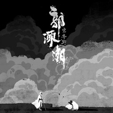

郭源潮
============================

|  |  |
| :--: | :-- |
| [ 郭源潮](https://emumo.xiami.com/album/2102745013) | **艺人**: [宋冬野](../index.md) **语种**: 国语 **唱片公司**: 华宇世博 **发行时间**: 2017年05月09日 **专辑类别**: EP, 单曲 **专辑风格**: 新民谣 Neofolk, 华语唱作人 Chinese Singer-Songwriter **播放数**: 238689 **收藏数**: 398 **评论数**: 65  |

## 简介

老郭，北平苍翁，老无所依，迁西山之背，常与登山赏枫者饮酒作乐，秋高之日遇一文艺青年，拌嘴。  
——“我知你，你不坦荡，还想求个坦然。”  
——“我也知你，你不坦然，却装得坦荡。”  
——“若为自由顾，你能抛点什么？”  
——“你顾你自由，抛下了可甘心？”  
——“甘心，年少层楼的事笑谈罢了。”  
——“胡扯，看破红尘你还跟我矫情。”  
——“你那酒肉红尘梦，外人不难破，你难醒。”  
——“你这霾里假大隐，愚人都艳羡，我难屑。”  
——“可知你我在世为何。”  
——“没死一回，你能知？”  
——“不能知。”  
——“不如不知。”  
——“买天买地，你买不着个好大夫治病。”  
——“竹海酒海，你浪不出他们六扇大网。”  
——“懒得懂，回见。”  
——“老病友，别见。”  
——宋冬野

## 曲目

## 评论

|  |  |  |  |
| :-- | :-- | :-- | :-- |
|  [虾米用户](https://emumo.xiami.com/u/7394512) 暂无签名~ 2020-12-16 03:01 赞(0) 踩(0) | 
倒像是真假宝玉，红楼梦的意境
 |
|  [虾米用户](https://emumo.xiami.com/u/335926107) 当你不断追求卓越，成功就... 2020-11-15 09:39 赞(1) 踩(0) | 
树
 |
|  [虾米用户](https://emumo.xiami.com/u/45369586) 我还没想好要写什么... 2020-07-08 21:27 赞(0) 踩(0) | 
终于又可以听这首歌了！大爱
 |
|  [虾米用户](https://emumo.xiami.com/u/411898064)  2019-07-09 12:42 赞(0) 踩(0) | 
可惜了
 |
|  [虾米用户](https://emumo.xiami.com/u/411898064)  2019-07-09 12:34 赞(0) 踩(0) | 
最喜欢宋胖的这首歌，情感到位
 |
|  [虾米用户](https://emumo.xiami.com/u/322729934) 我还真是糟糕 2019-06-23 18:00 赞(0) 踩(0) | 
郭源潮，，我的初恋占了两个字
 |
|  [虾米用户](https://emumo.xiami.com/u/425874527)  2019-06-12 15:24 赞(2) 踩(0) | 
《郭源潮》的歌词是近三五年歌词写的最好的一首歌了吧
 |
|  [虾米用户](https://emumo.xiami.com/u/7077262) 喀纳斯—禾木—冰岛—阿拉... 2019-06-06 19:09 赞(0) 踩(0) | 
突然有了
 |
|  [虾米用户](https://emumo.xiami.com/u/39497586)  2019-06-05 20:34 赞(0) 踩(0) | 
洒脱，呐喊
 |
|  [虾米用户](https://emumo.xiami.com/u/32231879) Eine kosmisc... 2019-04-04 23:58 赞(0) 踩(0) | 
宋胖最佳，煤油之一
 |
|  [虾米用户](https://emumo.xiami.com/u/412131423) 你好，明天 2019-03-14 19:48 赞(0) 踩(0) | 
推荐个平台，有版权的
 |
|  [虾米用户](https://emumo.xiami.com/u/327818783) 我还没想好要写什么... 2019-02-07 22:04 赞(1) 踩(0) | 
每次听感觉都不一样。现在没版权，还好我下载了。20190207
 |
|  [虾米用户](https://emumo.xiami.com/u/17326367) 爱就是极快速的能量振动 2019-01-20 09:30 赞(0) 踩(0) | 
棒
 |
|  [虾米用户](https://emumo.xiami.com/u/2743411) Do Not Go Ge... 2018-10-16 12:54 赞(0) 踩(0) | 
想听
 |
|  [虾米用户](https://emumo.xiami.com/u/1756047)   各有各一生一世 各有... 2018-10-03 21:22 赞(0) 踩(0) | 
.
 |
|  [虾米用户](https://emumo.xiami.com/u/307611577) 那些说好的，就都算了吧。 2018-09-13 23:07 赞(0) 踩(0) | 
什么时候才有版权啊？
 |
| ⇒ |  [虾米用户](https://emumo.xiami.com/u/10419853) 暂无签名~ 2018-10-17 08:44 赞(0) 踩(0) | 
版权拿到了
 |
| ⇒ |  [虾米用户](https://emumo.xiami.com/u/286955247) 离别殇 2019-07-16 16:42 赞(0) 踩(0) | 
又没了
 |
|  [虾米用户](https://emumo.xiami.com/u/147080522)  2018-08-12 13:54 赞(0) 踩(0) | 
版权
 |
|  [虾米用户](https://emumo.xiami.com/u/50815405) 一地鸡毛 2018-07-12 11:30 赞(0) 踩(0) | 
版权版权，日常催
 |
|  [虾米用户](https://emumo.xiami.com/u/47269312) 我还没想好要写什么... 2018-06-29 18:21 赞(0) 踩(0) | 
版权麻利儿的
 |
|  [虾米用户](https://emumo.xiami.com/u/44068913)  2018-06-26 13:45 赞(0) 踩(0) | 
赶紧买版权吧
 |
|  [虾米用户](https://emumo.xiami.com/u/7888098) 吃 2018-06-26 12:28 赞(0) 踩(0) | 
太會寫啦^^;恭喜GMA受賞
 |
|  [虾米用户](https://emumo.xiami.com/u/307611577) 那些说好的，就都算了吧。 2018-06-25 22:29 赞(4) 踩(0) | 
层楼终究误少年，自由早晚乱余生。 你我山前没相见，山后别相逢。
 |
|  [虾米用户](https://emumo.xiami.com/u/48436220) Oblivīate 2018-06-24 22:28 赞(1) 踩(0) | 
恭喜胖子
 |
|  [虾米用户](https://emumo.xiami.com/u/23831866) 离这里越远越好 2018-06-24 02:35 赞(2) 踩(0) | 
动人
 |
|  [虾米用户](https://emumo.xiami.com/u/100548726)  2018-06-24 00:34 赞(1) 踩(0) | 
胖子的世界是如此colossal
 |
|  [虾米用户](https://emumo.xiami.com/u/2810349)   2018-06-18 14:05 赞(1) 踩(0) | 
为什么还不上架呢。等了一年了
 |
|  [虾米用户](https://emumo.xiami.com/u/5671108)   2018-05-17 05:50 赞(1) 踩(0) | 
恭喜入围金曲奖最佳作词人
 |
|  [虾米用户](https://emumo.xiami.com/u/264807638) 我还没想好要写什么... 2018-04-22 22:59 赞(1) 踩(0) | 
层楼终究误少年
 |
|  [虾米用户](https://emumo.xiami.com/u/359106083)  2018-04-19 16:33 赞(0) 踩(0) | 
宋胖子永远是宋胖子，不计过往，层楼还是不误少年。
 |
|  [虾米用户](https://emumo.xiami.com/u/327534125) 伱夢中熟睡的時候 有人為... 2018-03-17 15:59 赞(0) 踩(0) | 
手机可以听
 |
|  [虾米用户](https://emumo.xiami.com/u/9380249) 不要来摸我 2018-03-05 13:46 赞(1) 踩(0) | 
非常扎心，想对视未来的自己且回避了前山。
 |
|  [虾米用户](https://emumo.xiami.com/u/2810349)   2017-12-04 15:07 赞(0) 踩(0) | 
0 0 怎么了
 |
|  [虾米用户](https://emumo.xiami.com/u/327534125) 伱夢中熟睡的時候 有人為... 2017-12-01 23:16 赞(0) 踩(0) | 
听了一暑假 再来 怎麽没有了
 |
|  [虾米用户](https://emumo.xiami.com/u/37945155) 我还没想好要写什么... 2017-11-08 13:09 赞(0) 踩(0) | 
等上架～
 |
|  [虾米用户](https://emumo.xiami.com/u/136856)  2017-09-15 21:00 赞(0) 踩(0) | 
只有这个版本最好听，不管什么原因，希望这首歌，宋冬野早日回归
 |
|  [虾米用户](https://emumo.xiami.com/u/15315550) walker 2017-09-14 16:53 赞(4) 踩(0) | 
那么多歌都回归了， 宋胖子的咋还迟迟不上架！ 虾米加油啊！
 |
|  [虾米用户](https://emumo.xiami.com/u/218428869)   2017-08-23 01:16 赞(1) 踩(0) | 
这首歌我给满分
 |
|  [虾米用户](https://emumo.xiami.com/u/14004084) 你好 2017-08-17 16:22 赞(0) 踩(0) | 
还没有资源
 |
|  [虾米用户](https://emumo.xiami.com/u/30568739)  2017-08-02 17:29 赞(1) 踩(0) | 
比demo好听太多，有态度
 |
|  [虾米用户](https://emumo.xiami.com/u/47269312) 我还没想好要写什么... 2017-06-17 12:23 赞(0) 踩(0) | 
妈的什么毛病
 |
|  [虾米用户](https://emumo.xiami.com/u/302454828)  2017-06-09 22:04 赞(0) 踩(0) | 
好听
 |
|  [虾米用户](https://emumo.xiami.com/u/11223156) 上辈子也许是一只虫子。 2017-06-09 08:20 赞(45) 踩(0) | 
郭源潮是宋胖身体里的另一个自己，这个名字一般收快递的时候用。
 |
| ⇒ |  [虾米用户](https://emumo.xiami.com/u/720365)  2018-02-19 17:51 赞(0) 踩(0) | 
源潮=援朝，其意不言自明。
 |
| ⇒ |  [虾米用户](https://emumo.xiami.com/u/134848328) 一起高呼Rock'n r... 2018-10-24 00:24 赞(0) 踩(0) | 
<q><b>去吧摩西说：</b></q>
 |
| ⇒ |  [虾米用户](https://emumo.xiami.com/u/521247)  2019-09-15 14:07 赞(0) 踩(0) | 
差点就信了你的邪
 |
|  [虾米用户](https://emumo.xiami.com/u/49407819)  Stay hungry 2017-06-08 20:43 赞(0) 踩(0) | 
编曲，融入了乐队的情感
 |
|  [虾米用户](https://emumo.xiami.com/u/413790) 惜知音再难觅 2017-06-07 23:45 赞(3) 踩(0) | 
胖子最好听的歌
 |
|  [虾米用户](https://emumo.xiami.com/u/413790) 惜知音再难觅 2017-06-07 23:44 赞(1) 踩(0) | 
可以听了？
 |
|  [虾米用户](https://emumo.xiami.com/u/34068959) 解药 2017-06-06 16:59 赞(4) 踩(0) | 
看到有人说在困难时下架，这个困难是他自己选的，基于自由意志的选择。但是这不影响对他歌曲的评价。
 |
|  [虾米用户](https://emumo.xiami.com/u/231900871) Je suis calm... 2017-05-25 13:25 赞(0) 踩(0) | 
都下架
 |
|  [虾米用户](https://emumo.xiami.com/u/26619215)  2017-05-24 22:32 赞(0) 踩(0) | 
完美
 |
|  [虾米用户](https://emumo.xiami.com/u/45686435) 爱虾米！期待我们再见的那... 2017-05-20 14:08 赞(0) 踩(0) | 
脏水洗身。浊杯赴宴。  东野经历这些破事之后蜕变了 
 |
|  [虾米用户](https://emumo.xiami.com/u/42725114) ThistheshitI... 2017-05-18 21:25 赞(0) 踩(0) | 

 |
|  [虾米用户](https://emumo.xiami.com/u/7478006) on the road 2017-05-18 03:14 赞(1) 踩(0) | 
蝦米在他最困難的時候選擇下架他，但我們沒有，我們不曾在他辉煌時慕名而來，也未曾在你他低谷時離開，尽管這裡沒有郭源潮⋯⋯
 |
| ⇒ |  [虾米用户](https://emumo.xiami.com/u/186049935) 看时光荏苒，坚守本心 2017-08-05 09:51 赞(0) 踩(0) | 
那是版权问题，和虾米无关，
 |
| ⇒ |  [虾米用户](https://emumo.xiami.com/u/7478006) on the road 2017-09-11 13:49 赞(0) 踩(0) | 
<q><b>The dreamer说：</b></q>
 |
|  [虾米用户](https://emumo.xiami.com/u/85168924) 我应该喜欢你的吧。 2017-05-17 21:27 赞(3) 踩(0) | 
这个版本更激昂！！！像是嘶吼什么
 |
|  [虾米用户](https://emumo.xiami.com/u/294741806)  2017-05-13 15:26 赞(0) 踩(0) | 
为什么又下架了    不是发行过吗
 |
|  [虾米用户](https://emumo.xiami.com/u/47269312) 我还没想好要写什么... 2017-05-12 11:21 赞(0) 踩(0) | 
和demo版一样么
 |
|  [虾米用户](https://emumo.xiami.com/u/295366133) 听歌也要有态度 2017-05-11 16:12 赞(1) 踩(0) | 
这首歌超好听的
 |
|  [虾米用户](https://emumo.xiami.com/u/21157616) 如果有些歌始终没唱 2017-05-09 10:58 赞(0) 踩(0) | 
会发布吗
 |
| ⇒ |  [虾米用户](https://emumo.xiami.com/u/296712749)  2017-05-16 22:23 赞(0) 踩(0) | 
QQ
 |
|  [虾米用户](https://emumo.xiami.com/u/5682258)  2017-05-09 10:33 赞(0) 踩(0) | 
音乐太赞了！！！
 |
