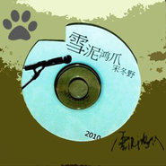

宋冬野
============================

|  |  |
| :--: | :-- |
| [ 宋冬野](https://i.xiami.com/donye) | **地区**: China 中国大陆 **风格**: 城市民谣 Urban Folk, 当代民谣 Contemporary Folk, 新民谣 Neofolk, 室内民谣 Chamber Folk **播放数**: 146499487 **粉丝数**: 141807 **评论数**: 3283  |

## 档案

宋冬野，男，1987年生。 少时乃痞校红人，歪门邪道，写曲弹弦，尽惹啼笑。 后入出版业，不懂装懂，混迹苟活，劣迹斑斑，终婆娑请辞。 遂终日闭门黄梁梦，住垃圾堆，喝西北风，食不果腹，衣不遮体。 幸遇麻油叶，众人划桨，誓兴歌谣，尊师重道，披斩不惊。 卖唱数载，得入摩厂，苦磨一年，发专一张。 扛琴走南北，大汗溉东西，但愿做民犬，生世白头偕老。

## 专辑

| 名称 | 语种 | 唱片公司 | 发行时间 | 专辑类别 | 专辑风格 |
| :--: | :-- | :-- | :-- | :-- | :-- |
| [ 荒野星](./albums/2104928662.md) | 国语 | 摩登天空 | 2018年10月15日 | EP, 单曲 |  |
| [ 郭源潮](./albums/2102745013.md) | 国语 | 华宇世博 | 2017年05月09日 | EP, 单曲 | 新民谣 Neofolk, 华语唱作人 Chinese Singer-Songwriter |
| [ 空港曲](./albums/2102734337.md) | 国语 | 摩登天空 | 2017年04月19日 | EP, 单曲 | 当代民谣 Contemporary Folk, 华语唱作人 Chinese Singer-Songwriter |
| [ 郭源潮](./albums/2102655320.md) | 国语 | 独立发行 | 2016年10月24日 | EP, 单曲 | 民谣 Folk, 独立民谣 Indie Folk, 华语唱作人 Chinese Singer-Songwriter |
| [ 万物生长](./albums/1225552649.md) | 国语 | 独立发行 | 2015年03月05日 | EP, 单曲 | 民谣流行 Folk Pop, 华语唱作人 Chinese Singer-Songwriter |
| [ 安和桥北](./albums/453481.md) | 国语 | 摩登天空 | 2013年08月26日 | 录音室专辑 | 当代民谣 Contemporary Folk, 华语唱作人 Chinese Singer-Songwriter |
| [ 雪泥鸿爪](./albums/477797.md) | 国语 |  | 2010年11月10日 | 录音室专辑 | 当代民谣 Contemporary Folk, 华语唱作人 Chinese Singer-Songwriter |
| [ 雪泥鸿爪(抢先版)](./albums/427314.md) | 国语 |  | 2010年05月20日 | 录音室专辑 | 民谣 Folk, 独立民谣 Indie Folk, 华语唱作人 Chinese Singer-Songwriter |

## 评论

|  |  |  |
| :-- | :-- | :-- |
|  [虾米用户](https://emumo.xiami.com/u/12306228) Sing My Soul... 2021-01-29 13:57 赞(0) 踩(0) | 
现在是改行拍电影了吗？
 |
|  [虾米用户](https://emumo.xiami.com/u/3074474) 黄金十年 2020-11-10 17:43 赞(0) 踩(0) | 
宋胖子，等着你再来成都啊，生日快乐
 |
|  [虾米用户](https://emumo.xiami.com/u/2655509)  2020-11-10 13:02 赞(0) 踩(0) | 
11月9日夜，虽无法回到34年前阻止这本发生了的一切，却也觉得我对这世界应该做些什么。 11月10日昼，折腾着去项目检查，安排上级来检查前的准备工作。这两年做着马前卒的工作，凭心说，熬淘。忽闻虾米，冬野生日。想说祝福他点什么。如果他还算明星，可能是我最想一起喝顿酒的明星吧。
 |
|  [虾米用户](https://emumo.xiami.com/u/260828200) 微风和你 我喜欢你 2020-11-10 11:11 赞(0) 踩(0) | 
生日快乐呀宋胖子
 |
|  [虾米用户](https://emumo.xiami.com/u/1270957)  2020-11-10 10:44 赞(0) 踩(0) | 
祝胖子生日快乐，身体健康，多写点好听的歌。
 |
|  [虾米用户](https://emumo.xiami.com/u/282294915) 轻易得到的东西会被大量挥... 2020-11-10 10:14 赞(1) 踩(0) | 
好喜欢你的嗓音，沧桑的力量
 |
|  [虾米用户](https://emumo.xiami.com/u/256373947) 冲吧！传说中的胖子！ 2020-11-10 10:06 赞(0) 踩(0) | 
老宋  生日快乐
 |
|  [虾米用户](https://emumo.xiami.com/u/929345) 无国界的语言 2020-11-10 10:05 赞(0) 踩(0) | 
胖子
 |
|  [虾米用户](https://emumo.xiami.com/u/421441970) 我还没想好要写什么... 2020-11-10 09:47 赞(0) 踩(0) | 
你一直唱，我就会一直听~
 |
|  [虾米用户](https://emumo.xiami.com/u/422170353) 不乱于心 2020-11-10 09:47 赞(0) 踩(0) | 
All the best !!!
 |
|  [虾米用户](https://emumo.xiami.com/u/444223176) make a diffe... 2020-09-28 13:24 赞(0) 踩(0) | 
他是多少人的青春啊
 |
|  [虾米用户](https://emumo.xiami.com/u/23392947) 下次换一套不那么沉重的躯... 2020-09-09 09:15 赞(0) 踩(0) | 
好听啊
 |
|  [虾米用户](https://emumo.xiami.com/u/428263505) 我还没想好要写什么... 2020-06-17 16:22 赞(0) 踩(0) | 
宋冬野宋冬野！你让我着迷！
 |
|  [虾米用户](https://emumo.xiami.com/u/441076986)  2020-04-25 22:03 赞(0) 踩(0) | 
斑马斑马只有mv版
 |
|  [虾米用户](https://emumo.xiami.com/u/358104299) 悲观的唯心存在现实解构虚... 2020-04-25 11:25 赞(0) 踩(0) | 
40788
 |
|  [虾米用户](https://emumo.xiami.com/u/261181551)  2020-03-27 12:57 赞(2) 踩(0) | 
胖子你进去这些年，竟让人有些想念
 |
|  [虾米用户](https://emumo.xiami.com/u/14157366) 终将化作一缕清风~ 2020-03-13 09:36 赞(1) 踩(0) | 
我的天，也许我家刚联上网，我还不知道他XD。。。我一直只听他的歌没了解太多本人。今天认真读了这上面他的艺人简介，很喜欢。可惜，再见了，宋冬野！希望你们都远离DP
 |
|  [虾米用户](https://emumo.xiami.com/u/93537754) 我还没想好要写什么... 2020-02-12 19:10 赞(0) 踩(0) | 
你好，邻居
 |
|  [虾米用户](https://emumo.xiami.com/u/37555741) biubiu~ 2020-02-09 22:05 赞(0) 踩(0) | 
一声叹息
 |
|  [虾米用户](https://emumo.xiami.com/u/3276327) 山有木兮木有枝。 2019-11-10 10:29 赞(0) 踩(0) | 
生日快樂
 |
|  [虾米用户](https://emumo.xiami.com/u/403899314) 多喝点 2019-11-10 10:09 赞(2) 踩(0) | 
快乐鸭
 |
| ⇒ |  [虾米用户](https://emumo.xiami.com/u/316261284) 到最后…… 2019-11-10 10:28 赞(0) 踩(0) | 
太冷清了，就咱俩，一起来听会儿他的歌吧。  我正在虾米音乐开趴，来和我一起听歌吧 <a href="https://h.xiami.com/music/live-house.html?id=12d9c3a4010000qeme" target="_blank" rel="nofollow noreferrer noopener">https://h.xiami.com/music/live-house.html?id=12d9c3a4010000qeme</a> 分享自@虾米音乐
 |
|  [虾米用户](https://emumo.xiami.com/u/52857023) 北京人在约克 2019-11-05 14:50 赞(2) 踩(0) | 
六月里可以无限循环，可惜放不了了
 |
|  [虾米用户](https://emumo.xiami.com/u/350980208)  2019-11-03 12:46 赞(0) 踩(0) | 
宋胖子，今天才知道你的，你是一个有故事的男人，我从来没想过我作为一名60后，会听这种类型的歌曲……你唱的所有歌曲都勾起了我的回忆，让我想起了很多快乐的，悲伤的，痛苦的等等回忆，你的声音很醇厚，很有磁性。我最喜欢歌手是seether和arronlewis,他们的歌我都没有全部听完，而你的歌曲我是反复重复持续再听，越听越有味道
 |
|  [虾米用户](https://emumo.xiami.com/u/6451532) 沧海桑田 2019-11-03 09:17 赞(0) 踩(0) | 
下架了？！歌荒。。。
 |
|  [虾米用户](https://emumo.xiami.com/u/261412764)  2019-10-17 03:49 赞(0) 踩(0) | 
民谣才是美好的故事
 |
|  [虾米用户](https://emumo.xiami.com/u/421854026)  2019-10-10 15:12 赞(1) 踩(0) | 
吸du，不可原谅，别什么什么知错能改什么什么的，一人吸du，现象后面的危害大了去了，
 |
|  [虾米用户](https://emumo.xiami.com/u/429916111) 想做我朋友吗？我家奶牛的... 2019-09-18 11:21 赞(0) 踩(0) | 
宋胖子
 |
|  [虾米用户](https://emumo.xiami.com/u/429861075)  2019-09-16 14:46 赞(0) 踩(0) | 
来了
 |
|  [虾米用户](https://emumo.xiami.com/u/283382853)  2019-08-21 15:12 赞(0) 踩(0) | 
你好听的歌都搞那去了？？？
 |
|  [虾米用户](https://emumo.xiami.com/u/11996369) 想在活着的时候活着 2019-08-18 20:45 赞(2) 踩(0) | 
做错事≠有故事  有故事的人不一定非要挑战错事 才会彰显自己有故事
 |
|  [虾米用户](https://emumo.xiami.com/u/22295186) 好久好久 2019-08-12 02:40 赞(0) 踩(0) | 
扮猪的猪 ———————— 因为吃多了菜，都成了肉 就没见，瘦过的婚房，站满新娘  如果非要选一个地方中枪 可不可以，不是你住下的新房  如果要把身体，献给粪坑 请让我扮完，一头猪 如果你还有黑夜的话 让我盲，看不见蛆虫的喜欢  如果扮演，按照身上的斑 你是不是要喝倒听歌的人  如果必须，猪也心慌
 |
|  [虾米用户](https://emumo.xiami.com/u/43875708)  遣词造句 穿山过水 他... 2019-08-08 22:36 赞(1) 踩(0) | 
《知道》 我要当一个科学家 仆人和借口伴我生长 夏天藏在西伯利亚 冬天住在苏门答腊的岛上 不在乎蚂蚁也不在乎国家 不在乎佛祖也不在乎手枪 把哲学家的拐杖插进这无能的土壤 不在乎它开的花 给答案的慌张和问题的荒唐添一笔浓妆 嫁祸给诗人的语法 让我在穷途末路上来而复往 再给我心如死灰的裘马轻狂 反正活着的人也没人知道为什么活着 管什么行船的技巧 也许有天文艺复兴我上了想象的当 一拍大腿就知道了 知道了 不知道 知道
 |
|  [虾米用户](https://emumo.xiami.com/u/301768261) 是个仙女.不丧.躺在jk... 2019-06-30 10:02 赞(1) 踩(0) | 
胖子出来了吗
 |
|  [虾米用户](https://emumo.xiami.com/u/404483224) 我看 2019-05-30 22:24 赞(0) 踩(0) | 
胖子出来了吗
 |
|  [虾米用户](https://emumo.xiami.com/u/134263) _(:3」∠)_ 2019-05-27 12:07 赞(0) 踩(0) | 
宋冬野都没版权了吗&amp;hellip;&amp;hellip;
 |
|  [虾米用户](https://emumo.xiami.com/u/115505156)  2019-05-24 12:44 赞(0) 踩(0) | 
不能看脸见真人系列
 |
|  [虾米用户](https://emumo.xiami.com/u/267629935) ……………… 2019-05-11 20:15 赞(2) 踩(0) | 
虾米里面混吃等死的80后、自以为是的90后、缺乏判断的00后、无脑发言的05后都集中在了宋冬野这里，他都已经出来了，就别说那一套无罪论了好吧。
 |
|  [虾米用户](https://emumo.xiami.com/u/414451261)  2019-04-19 21:22 赞(2) 踩(0) | 
我去，这谁写的简介啊 
 |
|  [虾米用户](https://emumo.xiami.com/u/284626116)  2019-04-05 15:21 赞(0) 踩(0) | 
宋胖子的歌是真的很好听
 |
|  [虾米用户](https://emumo.xiami.com/u/53726903)  2019-03-29 16:57 赞(2) 踩(0) | 
这小胖子，很想捏他脸玩玩
 |
|  [虾米用户](https://emumo.xiami.com/u/14391168)  深夜，一首歌，一根烟，... 2019-03-19 20:16 赞(0) 踩(0) | 
比起了解缘由，从一件事去评判一个人更简单些。 世间之事大多如此呐。绝对的对错？只是看待事物的角度不一样。
 |
|  [虾米用户](https://emumo.xiami.com/u/404732670)  2019-03-12 23:13 赞(0) 踩(0) | 
什么时候有他的演出
 |
|  [虾米用户](https://emumo.xiami.com/u/357054360)  2019-03-11 00:08 赞(0) 踩(0) | 
等你出歌
 |
|  [虾米用户](https://emumo.xiami.com/u/262026934)  2019-03-08 16:57 赞(0) 踩(0) | 
要戒毒啊，我是戒毒警察，希望你成功。
 |
| ⇒ |  [虾米用户](https://emumo.xiami.com/u/98457874) 安宁  2019-07-05 20:09 赞(0) 踩(0) | 
你不是外来务工人员？
 |
|  [虾米用户](https://emumo.xiami.com/u/420612659) 来日方长 2019-03-07 14:52 赞(1) 踩(0) | 
来到虾米第一天，首先就想去搜你的歌，可是让我有点小失望，好多歌都没办法听
 |
|  [虾米用户](https://emumo.xiami.com/u/292549379) 要么孤独，要么庸俗 2019-03-06 00:03 赞(2) 踩(0) | 
宋胖子啊，我想你
 |
|  [虾米用户](https://emumo.xiami.com/u/9100936) thrash my fu... 2019-02-28 19:21 赞(0) 踩(0) | 
小伙子可惜了,体制之下被抓了现行也没办法。能吃，能睡，胖胖的，哈哈！足矣。
 |
|  [虾米用户](https://emumo.xiami.com/u/49002175) 这城市 太多形色匆匆的人... 2019-02-25 14:30 赞(2) 踩(0) | 
简介有feel
 |
|  [虾米用户](https://emumo.xiami.com/u/416858448)  2019-02-13 10:29 赞(0) 踩(0) | 
听着听着，我走到了十字路口斑马线上，迷茫看着每个方向路车……忽然，砰地一声！
 |
|  [虾米用户](https://emumo.xiami.com/u/417253793)  2019-02-07 01:43 赞(0) 踩(0) | 
我以为你在网易云
 |
|  [虾米用户](https://emumo.xiami.com/u/279308567) 生活不易，且行且珍惜 2019-01-30 12:57 赞(4) 踩(0) | 
简介很扎心
 |
|  [虾米用户](https://emumo.xiami.com/u/37555741) biubiu~ 2019-01-27 21:56 赞(0) 踩(0) | 
可惜了这个人
 |
|  [虾米用户](https://emumo.xiami.com/u/309089288) 我还没想好要写什么... 2019-01-03 07:17 赞(1) 踩(0) | 
第五年了 你不见了 只是我还喜欢着你 也许就是一辈子
 |
| ⇒ |  [虾米用户](https://emumo.xiami.com/u/316261284) 到最后…… 2019-07-24 16:58 赞(0) 踩(0) | 
你好，港岛妹妹。 想听胖子的话可以来我趴间。 李逼听不了了，但是他还可以。
 |
|  [虾米用户](https://emumo.xiami.com/u/410400695)  2018-12-12 19:47 赞(0) 踩(0) | 
这首歌没法听。
 |
|  [虾米用户](https://emumo.xiami.com/u/329307681)  2018-12-10 08:18 赞(1) 踩(0) | 
第一次见这样的简介
 |
|  [虾米用户](https://emumo.xiami.com/u/239011365)  2018-12-06 15:15 赞(0) 踩(0) | 
接下来好好的，不要乱搞了。我们一直支持你！给我们带来正能量！
 |
|  [虾米用户](https://emumo.xiami.com/u/52056952) 人生即是到來、相遇、陪伴... 2018-11-23 20:04 赞(0) 踩(0) | 

 |
|  [虾米用户](https://emumo.xiami.com/u/27126408) 哈哈 2018-11-12 09:14 赞(1) 踩(0) | 
啥时候把胖子的歌都买过来呀～！
 |
|  [虾米用户](https://emumo.xiami.com/u/28308718)  2018-11-11 09:52 赞(0) 踩(0) | 
生活中的一滴彩色！ 生日快乐
 |
|  [虾米用户](https://emumo.xiami.com/u/283030197) 音乐就是向上帝发问   ... 2018-11-11 09:40 赞(0) 踩(0) | 
来晚了，但还是祝你生日快乐
 |
|  [虾米用户](https://emumo.xiami.com/u/308908844) 再见 2018-11-10 22:03 赞(0) 踩(0) | 
生日快乐 
 |
|  [虾米用户](https://emumo.xiami.com/u/226833808) 梦里见 2018-11-10 19:38 赞(0) 踩(0) | 
生日快乐呀
 |
|  [虾米用户](https://emumo.xiami.com/u/20398360) 前人栽树，后人乘凉 2018-11-10 15:16 赞(1) 踩(0) | 
胖子啊，生日快乐啊 
 |
|  [虾米用户](https://emumo.xiami.com/u/339080633)  2018-11-10 14:28 赞(0) 踩(0) | 
希望有新歌，比安河桥更好听的歌
 |
|  [虾米用户](https://emumo.xiami.com/u/58045120) 《我爱她》她不懂~我爱她... 2018-11-10 14:04 赞(0) 踩(0) | 
生日快乐 
 |
|  [虾米用户](https://emumo.xiami.com/u/306608359) 。。。 2018-11-10 13:16 赞(1) 踩(0) | 
生日快乐，宋胖子，希望虾米多一点你的歌
 |
|  [虾米用户](https://emumo.xiami.com/u/235677115) 摇滚，民谣，民族 2018-11-10 13:14 赞(1) 踩(0) | 
诗人，提前祝你生日快乐
 |
|  [虾米用户](https://emumo.xiami.com/u/47538989) 最后一片净土…… 2018-11-10 12:29 赞(1) 踩(0) | 
你才不是一个没有故事的男同学，生日快乐
 |
|  [虾米用户](https://emumo.xiami.com/u/329813215) 听，最内心的声音！ 2018-11-10 12:01 赞(1) 踩(0) | 
那就祝你生日快乐♪٩(´ω`)و♪生日快乐！激发灵感方法千千万，不要选最偏激的做法啊 劝勉
 |
|  [虾米用户](https://emumo.xiami.com/u/109019164) 徒然求索，不如思止。 2018-11-10 10:57 赞(1) 踩(0) | 
知道
 |
|  [虾米用户](https://emumo.xiami.com/u/92556342) 地狱天堂皆在人间 2018-11-10 10:29 赞(1) 踩(0) | 
虾米喊我来祝你生日快乐昂
 |
|  [虾米用户](https://emumo.xiami.com/u/47413606)  2018-11-10 10:15 赞(1) 踩(0) | 
虾米还会提醒生日啊真好 能看到现场就好了
 |
|  [虾米用户](https://emumo.xiami.com/u/127444946) 我在哪漂荡 2018-11-10 10:12 赞(1) 踩(0) | 
生日快乐
 |
|  [虾米用户](https://emumo.xiami.com/u/270268282) 痛苦的信仰 2018-11-10 10:04 赞(1) 踩(0) | 
今天是去看呐喊山东的一天，是看演出的一天，所以很兴奋，虾米推送了你的生日在11.10，和我看演出是一天就点了进来，生日高兴我们的宋胖儿 
 |
|  [虾米用户](https://emumo.xiami.com/u/250742693) 买把芍药好了 2018-11-10 10:03 赞(1) 踩(0) | 
很想很想听比郭源潮 空港曲 更更更好听的那种歌了 你咋还不发呢 ㊗️生日快乐
 |
|  [虾米用户](https://emumo.xiami.com/u/4009395)   2018-11-10 10:03 赞(0) 踩(0) | 
生日快乐！
 |
|  [虾米用户](https://emumo.xiami.com/u/198537673) 不自觉遮掩。 2018-11-10 10:02 赞(0) 踩(0) | 
生日快乐，宋胖子
 |
|  [虾米用户](https://emumo.xiami.com/u/126806472) I Can Do All... 2018-11-10 10:02 赞(1) 踩(0) | 
生日快乐
 |
|  [虾米用户](https://emumo.xiami.com/u/366004443)  2018-11-10 10:02 赞(0) 踩(0) | 
看好你的歌曲，有情怀有
 |
|  [虾米用户](https://emumo.xiami.com/u/293692544) 你敢给我说话吗？我咬你 2018-11-09 16:44 赞(1) 踩(0) | 
好听
 |
|  [虾米用户](https://emumo.xiami.com/u/37532623) One & Only 2018-10-31 15:17 赞(1) 踩(0) | 
虾米和网易云居然没有《知道》
 |
|  [虾米用户](https://emumo.xiami.com/u/329827003)  2018-10-23 19:36 赞(3) 踩(0) | 
擦，硕大的虾米居然没有宋冬野的《斑马斑马》，别人用来搞了个加快节奏的居然就还&amp;trade;的敢收费了。。。。。。。
 |
|  [虾米用户](https://emumo.xiami.com/u/648388)  2018-10-15 19:36 赞(1) 踩(0) | 
发新单曲了荒野星，在QQ音乐
 |
|  [虾米用户](https://emumo.xiami.com/u/404939390)  2018-09-26 20:58 赞(1) 踩(0) | 
怎么就这几首歌，还不如我手机上的多
 |
|  [虾米用户](https://emumo.xiami.com/u/404221714)  2018-09-16 10:17 赞(1) 踩(0) | 
董小姐怎么木有了
 |
|  [虾米用户](https://emumo.xiami.com/u/402117337) 生下来，活下去。 2018-08-28 23:09 赞(2) 踩(0) | 
胖子我突然更加明白你的董小姐了。
 |
|  [虾米用户](https://emumo.xiami.com/u/27126408) 哈哈 2018-08-28 13:00 赞(1) 踩(0) | 
赶紧弄全胖子的歌啊～。。。
 |
|  [虾米用户](https://emumo.xiami.com/u/402390578) 一个人要乖，做自己的英雄... 2018-08-23 16:24 赞(1) 踩(0) | 
测试
 |
|  [虾米用户](https://emumo.xiami.com/u/23754990)  2018-08-09 05:55 赞(3) 踩(0) | 
为什么大部分歌没版权也把艺人摆上首页，麻油叶几个大佬的歌都没有正式版。非常失望。
 |
|  [虾米用户](https://emumo.xiami.com/u/312535077)  2018-07-27 20:02 赞(1) 踩(0) | 
不行不行不是
 |
|  [虾米用户](https://emumo.xiami.com/u/353761391)  2018-07-25 12:44 赞(0) 踩(0) | 
喜欢喜欢啊啊啊啊啊，感觉听出不一样的感觉
 |
|  [虾米用户](https://emumo.xiami.com/u/99038090) my future   ... 2018-07-25 00:23 赞(1) 踩(0) | 
莉莉安里多了尧十三，在也不是莉莉安，你还是你，生活还是生活，未来也还是那个幻想中的未来，我喜欢安河桥的红色封面 。 ――
 |
|  [虾米用户](https://emumo.xiami.com/u/300868303) 千面 2018-07-14 09:22 赞(3) 踩(0) | 
宋胖子，好好做音乐，不管怎样，我会一直和你走下去  
 |
|  [虾米用户](https://emumo.xiami.com/u/282387825) 我爱的是你爱我 2018-07-11 23:56 赞(2) 踩(0) | 
我的故事只讲给你听
 |
|  [虾米用户](https://emumo.xiami.com/u/290207210)  2018-07-09 17:08 赞(1) 踩(0) | 
心旋
 |
|  [虾米用户](https://emumo.xiami.com/u/216908819) 总是活不成想要的自己 2018-07-08 19:56 赞(1) 踩(0) | 
真的不能原谅你 但我还是很喜欢听你的歌
 |
|  [虾米用户](https://emumo.xiami.com/u/43875708)  遣词造句 穿山过水 他... 2018-07-03 09:41 赞(2) 踩(0) | 
宋胖麻溜出新吧
 |
|  [虾米用户](https://emumo.xiami.com/u/313076660)  2018-07-02 19:34 赞(4) 踩(0) | 
安河桥的水再也没有以前那么清澈了
 |
|  [虾米用户](https://emumo.xiami.com/u/13173319) mmmm hasjmj 2018-06-19 11:24 赞(1) 踩(0) | 
品牌
 |
|  [虾米用户](https://emumo.xiami.com/u/49545782)   2018-06-13 18:21 赞(1) 踩(0) | 
梦遗少年去哪了
 |
|  [虾米用户](https://emumo.xiami.com/u/274499634) ✈ 2018-06-13 12:50 赞(0) 踩(0) | 
胖子，加油吧。
 |
|  [虾米用户](https://emumo.xiami.com/u/852192) 噢噢噢噢噢噢噢噢 2018-06-12 14:25 赞(0) 踩(0) | 
新专辑呢
 |
|  [虾米用户](https://emumo.xiami.com/u/245238290)  2018-05-22 22:56 赞(3) 踩(0) | 
胖子，等你新歌！
 |
|  [虾米用户](https://emumo.xiami.com/u/338569660) 写点啥呢，emmm 2018-05-20 16:29 赞(4) 踩(0) | 
一路听过来，换了好几个音乐平台 超喜欢胖纸的歌 
 |
|  [虾米用户](https://emumo.xiami.com/u/350791644) 神一般的存在... 2018-05-19 22:28 赞(1) 踩(0) | 
我00后哎...
 |
| ⇒ |  [虾米用户](https://emumo.xiami.com/u/369743280)  2018-07-03 21:17 赞(0) 踩(0) | 
我也是
 |
|  [虾米用户](https://emumo.xiami.com/u/350791644) 神一般的存在... 2018-05-19 22:26 赞(7) 踩(0) | 
在云村开始听你的歌.之后疯狂喜欢民谣. 后来默默支持你.喜欢你的歌.无关是非.无关其他 ....人言可畏.说听者无罪.传者自行体会？？
 |
|  [虾米用户](https://emumo.xiami.com/u/289504343) 我还没想好要写什么... 2018-05-19 17:35 赞(1) 踩(0) | 
胖子 等你的新歌
 |
|  [虾米用户](https://emumo.xiami.com/u/48276337) 22世纪不道德 2018-05-07 10:41 赞(0) 踩(0) | 

 |
|  [虾米用户](https://emumo.xiami.com/u/351806545)  2018-04-29 16:53 赞(2) 踩(0) | 
没想到你是虾米音乐人，很久以前就喜欢上了你的歌，希望你好好的，只想让你知道，还有人在默默的喜欢着你，加油
 |
|  [虾米用户](https://emumo.xiami.com/u/332194823)  2018-04-28 20:03 赞(0) 踩(0) | 
山水有相逢 你好啊
 |
|  [虾米用户](https://emumo.xiami.com/u/276230192) 只是每天晚上一首歌。 2018-04-22 00:23 赞(0) 踩(0) | 
我回来了
 |
|  [虾米用户](https://emumo.xiami.com/u/226660850) 夜幕就要降临，我想我必须... 2018-04-05 19:23 赞(4) 踩(0) | 
你我山前没相见，山后别相逢
 |
|  [虾米用户](https://emumo.xiami.com/u/22325073)  2018-04-01 23:32 赞(1) 踩(0) | 
看电影又听到了你的歌，觉得很美，就来把虾米上能听的全听一遍，边听边流泪。我想要的幸福，被很多人阻止，不知道自己是否应该为了不后悔勇往直前，可是又不想伤害身边的亲人，世上的事为什么都不能两全呢？又不是鱼和熊掌，为什么不能兼得呢？
 |
|  [虾米用户](https://emumo.xiami.com/u/255226099) 庸人自扰 2018-03-21 13:02 赞(2) 踩(0) | 
老宋 期待你的新歌
 |
|  [虾米用户](https://emumo.xiami.com/u/276139880) 我还没想好要写什么... 2018-03-19 23:53 赞(2) 踩(0) | 
希望虾米赶快能上架他的全部作品
 |
|  [虾米用户](https://emumo.xiami.com/u/44140680) 旅途愉快 2018-03-19 10:34 赞(0) 踩(0) | 
为什么下架永光？？？
 |
|  [虾米用户](https://emumo.xiami.com/u/49595504)  2018-03-18 17:56 赞(2) 踩(0) | 
人吗，对与错。生活是自己的绊脚石。歌是美好的，即使纠正。就不怕累赘。 
 |
|  [虾米用户](https://emumo.xiami.com/u/347821490) 自己编辑的信息又删去 2018-03-15 14:03 赞(2) 踩(0) | 
快发新歌，宋胖  
 |
|  [虾米用户](https://emumo.xiami.com/u/334935388)  2018-02-25 14:29 赞(0) 踩(0) | 
好听
 |
|  [虾米用户](https://emumo.xiami.com/u/344592631) 爱好ACG，喜音乐 2018-02-08 17:02 赞(64) 踩(0) | 
宋东野，我是今天才知道你的，你是一个有故事的男人，我从来没想过我作为一名00后，会听这种类型的歌曲&amp;hellip;&amp;hellip;你唱的所有歌曲都勾起了我的回忆，让我想起了很多快乐的，悲伤的，痛苦的等等回忆，你的声音很醇厚，很有磁性。我最喜欢歌手是泰勒斯威夫特和贾斯丁比伯，他们的歌我都没有全部听完，而你的歌曲，在今天我全部都听完了，也下载了很多&amp;hellip;&amp;hellip;谢谢你
 |
| ⇒ |  [虾米用户](https://emumo.xiami.com/u/349598541)  2018-02-11 12:48 赞(0) 踩(0) | 
我们都一样！同感！！！
 |
| ⇒ |  [虾米用户](https://emumo.xiami.com/u/328768725) 往後的日子 餘波蕩漾～ 2018-11-10 18:14 赞(0) 踩(0) | 
??可是你把他名字打错了..
 |
|  [虾米用户](https://emumo.xiami.com/u/244935183)  2018-02-07 13:56 赞(3) 踩(0) | 
百听不腻，曲儿还是耐听的好。人还是对的好。
 |
|  [虾米用户](https://emumo.xiami.com/u/317745938) 关注我网易啊 2018-02-03 00:19 赞(2) 踩(0) | 
谢谢陪我度过曾经的夜晚
 |
|  [虾米用户](https://emumo.xiami.com/u/335353615)  2018-02-02 10:14 赞(2) 踩(0) | 
一百五十年才见到一次的超级月亮很唯一可几十亿年才出现一个宋冬野
 |
|  [虾米用户](https://emumo.xiami.com/u/247592716) 高密度之人生。 2018-01-22 14:11 赞(24) 踩(0) | 
&amp;ldquo;六扇门里太龌龊，六根弦上取磊落。&amp;rdquo;
 |
|  [虾米用户](https://emumo.xiami.com/u/5423459) 音乐～灵魂 2018-01-18 13:25 赞(3) 踩(0) | 
老宋，空港曲什么时候上线虾米 
 |
|  [虾米用户](https://emumo.xiami.com/u/27126408) 哈哈 2018-01-16 14:26 赞(4) 踩(0) | 
把胖子的歌都搞过来啊，我的大虾米啊！@！
 |
|  [虾米用户](https://emumo.xiami.com/u/282797311)  2018-01-09 14:14 赞(1) 踩(0) | 
内容已删除
 |
| ⇒ |  [虾米用户](https://emumo.xiami.com/u/349598541)  2018-02-11 12:49 赞(0) 踩(0) | 
为什么？
 |
|  [虾米用户](https://emumo.xiami.com/u/44845951) My naive hea... 2018-01-08 08:43 赞(2) 踩(0) | 
好多都没有版权，马爸爸要加油啊
 |
|  [虾米用户](https://emumo.xiami.com/u/43875708)  遣词造句 穿山过水 他... 2018-01-06 20:35 赞(4) 踩(0) | 
民谣可以教会你怎样去甘于做个平凡的人
 |
|  [虾米用户](https://emumo.xiami.com/u/325008730) 爱人三分足矣，留下七分爱... 2018-01-05 10:50 赞(1) 踩(0) | 
不管你是什么样子，我都会默默的爱着你
 |
|  [虾米用户](https://emumo.xiami.com/u/342349715)  2017-12-31 16:26 赞(1) 踩(0) | 
深入人心
 |
|  [虾米用户](https://emumo.xiami.com/u/292204478) 我还没想好要写什么... 2017-12-29 22:08 赞(1) 踩(0) | 
啊啊啊啊虾米争点气 版权呢
 |
|  [虾米用户](https://emumo.xiami.com/u/338536566)  2017-12-22 19:41 赞(1) 踩(0) | 
真TM好听  支持的点下赞\(≧▽≦)/
 |
|  [虾米用户](https://emumo.xiami.com/u/16957057) X.猴饭 2017-12-18 22:39 赞(4) 踩(0) | 
10.24晚上，宋老师作为百度音乐校园新声代广州赛区的评委之一来到了我们广东工业大学，在台上唱起了《董小姐》，我们观众反应很热烈，但是宋老师唱歌时，好像与我们毫不相关，只是静静的唱，静静地...他是第二个我听过的听现场比听音源好听的歌手，另外一个是Jason Mraz .宋老师的声音现场听更有质感，那是一种扑面而来的感动与震撼....
 |
|  [虾米用户](https://emumo.xiami.com/u/161023984)  2017-12-10 19:54 赞(4) 踩(0) | 
鸽子啊，你再也不需要翅膀。 《安河桥北》再也打动不了我了&amp;mdash;&amp;mdash; 也不怪你。  &amp;ldquo;小的时候觉得不行，年轻的时候觉得矫情，老了的时候觉得，是解药。&amp;rdquo;  那个早衰的少年路过了董小姐，斑马和莉莉安，却早早奔入婚姻，登上人生巅峰，而后吸du被捕，想必不仅感受了世态炎凉，更顿悟了一些人生道理，所以再让他唱他所指的《安河桥北》&amp;mdash;&amp;mdash;&amp;ldquo;矫情&amp;rdquo;之歌，他再也拿不出一丝作品出世的情绪了，只能潦草完成。他说他现在喜欢探索新玩意儿，新的作品有一股哲学意味，写人生，写事态，七情六欲都抛诸脑后，在演绎的时候，那股子的全情投入，清晰地显示着，他已处于的人生的另一阶段。  宋胖子&amp;ldquo;出来&amp;rdquo;了，但再也回不来了。  但新版的宋胖子，我仍
 |
| ⇒ |  [虾米用户](https://emumo.xiami.com/u/161023984)  2017-12-10 19:56 赞(0) 踩(0) | 
但新版的宋胖子，我仍然喜欢。  那些对《安河桥北》无法释怀的，听完这场就各自散了吧，各自生活。  最近瞎忙，错过了他的《而今》音乐会，听了昨晚的&amp;ldquo;麻油叶六周年&amp;rdquo;音乐会，有感。
 |
|  [虾米用户](https://emumo.xiami.com/u/924518) Starfall of ... 2017-12-08 10:52 赞(2) 踩(0) | 
这尼玛才是原版 才有感觉 某做作恶心的B真是玷污了董小姐
 |
|  [虾米用户](https://emumo.xiami.com/u/100747834)   2017-12-07 09:16 赞(4) 踩(0) | 
请尽快把安和桥北专辑的版权弄回来！
 |
| ⇒ |  [虾米用户](https://emumo.xiami.com/u/50404836)  2017-12-07 12:36 赞(0) 踩(0) | 
等豆瓣和qq合体了就好了
 |
|  [虾米用户](https://emumo.xiami.com/u/57682530) 虾小米变了啦啦啦 2017-11-28 15:01 赞(2) 踩(0) | 
随着成年才听懂宋冬野。
 |
|  [虾米用户](https://emumo.xiami.com/u/7332502) 乱世浮生 2017-11-23 23:33 赞(2) 踩(0) | 
加油
 |
|  [虾米用户](https://emumo.xiami.com/u/325198968)  2017-11-15 14:22 赞(3) 踩(0) | 
求虾米争取版权，已开两年会员，坐等会员到期之前听到他的歌。
 |
|  [虾米用户](https://emumo.xiami.com/u/294429985) God is love 2017-11-11 19:15 赞(2) 踩(0) | 
冬野的版权啊，虾米如果有就好了
 |
|  [虾米用户](https://emumo.xiami.com/u/266303818)  2017-11-09 15:22 赞(1) 踩(0) | 
果然还是网易好
 |
| ⇒ |  [虾米用户](https://emumo.xiami.com/u/336150170) 花开百年，花落一天. 2017-11-19 00:08 赞(0) 踩(0) | 
我也是这么觉得，云村村民干净
 |
| ⇒ |  [虾米用户](https://emumo.xiami.com/u/213246908)  2017-11-29 20:23 赞(0) 踩(0) | 
<q><b>郭源潮.说：</b></q>
 |
|  [虾米用户](https://emumo.xiami.com/u/266303818)  2017-11-09 15:21 赞(1) 踩(0) | 
就这么点评论啊
 |
|  [虾米用户](https://emumo.xiami.com/u/3300536) 喜欢睡觉因为梦里什么都有 2017-11-08 23:13 赞(6) 踩(0) | 
这比的歌不能多听，太他妈颓废了，动不动就是放手，放弃，我不行我没有的。 结果自己发财了
 |
|  [虾米用户](https://emumo.xiami.com/u/333637811)  2017-11-06 21:35 赞(2) 踩(0) | 
胖子，我真是太喜欢你了！
 |
|  [虾米用户](https://emumo.xiami.com/u/255818438)   2017-11-04 02:34 赞(1) 踩(0) | 
哎
 |
|  [虾米用户](https://emumo.xiami.com/u/5040108) M³ 2017-10-31 20:18 赞(1) 踩(0) | 
我希望花钱在虾米买胖子的歌听
 |
|  [虾米用户](https://emumo.xiami.com/u/13979602) 天涯何处知音赏，欲回首时 2017-10-30 10:16 赞(1) 踩(0) | 
很好奇唱董小姐的歌手是个什么样的汉子，原来是个胖子。哈哈，不过还是很喜欢你的歌声啊，歌写的也很好！
 |
|  [虾米用户](https://emumo.xiami.com/u/1597014)  2017-10-30 10:00 赞(3) 踩(0) | 
这个死胖子，有一种让人不由地心静下来的魅力，静静的听他絮絮叨叨的讲他的那些破事，或忧伤，或平实，但就这样，随着他的歌感动的稀里哗啦的。。。
 |
|  [虾米用户](https://emumo.xiami.com/u/139064668)  2017-10-28 00:42 赞(144) 踩(0) | 
这老胖纸，虽吸毒吧，但人生经历丰富，才让他的歌那么有故事啊。
 |
| ⇒ |  [虾米用户](https://emumo.xiami.com/u/70575982) 我在千寻之下等你 2018-11-29 17:59 赞(0) 踩(0) | 
呵呵
 |
| ⇒ |  [虾米用户](https://emumo.xiami.com/u/52771838) 人来人往，潮起潮落。 2019-06-25 14:57 赞(0) 踩(0) | 
呵呵
 |
| ⇒ |  [虾米用户](https://emumo.xiami.com/u/98457874) 安宁  2019-07-05 20:07 赞(0) 踩(0) | 
<q><b>夜风说：</b></q>
 |
| ⇒ |  [虾米用户](https://emumo.xiami.com/u/359644010)  2019-07-16 15:26 赞(0) 踩(0) | 
这不是西毒，你不懂不要说话，你没经历过，我懂
 |
| ⇒ |  [虾米用户](https://emumo.xiami.com/u/421854026)  2019-10-10 15:12 赞(0) 踩(0) | 
<q><b>D .说：</b></q>
 |
|  [虾米用户](https://emumo.xiami.com/u/8623502) 冬瓜d 2017-10-28 00:38 赞(2) 踩(0) | 
很喜欢 原来董小姐是他的作品
 |
|  [虾米用户](https://emumo.xiami.com/u/28681131)  2017-10-28 00:32 赞(2) 踩(0) | 
宋冬野和他的野马，斑马已经成为我们寝室的口头禅了，嘻嘻，而且只要我一唱安和桥隔壁寝室也会大喊一声吹过的牛逼！！
 |
|  [虾米用户](https://emumo.xiami.com/u/8395195) 何必呢 2017-10-28 00:28 赞(1) 踩(0) | 
吸毒的事不关心，但闹得有些动静了，不由了去看了很多关于他的东西，然后端正了心态，以前不喜欢是因为周围形形色色的少年人什么都没经历却听着他的歌一副苦大深仇的样子，自己却是跟风黑了——再听，已能坦然，只是不合适罢了，能给这么多人带来触动他必然是好的，希望喜欢他的人别被杂事弄的上了头，观望会儿再说吧
 |
|  [虾米用户](https://emumo.xiami.com/u/2995733)  2017-10-28 00:09 赞(2) 踩(0) | 
地区： China 中国大陆 风格： 民谣 Folk 档案： 宋冬野，男，1987年生。  后入出版业，不懂装懂，混迹苟活，劣迹斑斑，终婆娑请辞。 遂终日闭门黄梁梦，住垃圾堆，喝西北风，食不果腹，衣不遮体。 幸遇麻油叶，众人划桨，誓兴歌谣，尊师重道，披斩不惊。
 |
|  [虾米用户](https://emumo.xiami.com/u/7417920) ASECRETMAKEW... 2017-10-28 00:08 赞(2) 踩(0) | 
怎么没有平淡生活里的刺啊。我挺喜欢这首来着的
 |
|  [虾米用户](https://emumo.xiami.com/u/3058851)   2017-10-28 00:00 赞(4) 踩(0) | 
很有意思的一个汉字，平平的调子，没有那种特激情的嘶喊，但是很有意思，另一种干净
 |
|  [虾米用户](https://emumo.xiami.com/u/48249554)  2017-10-27 23:51 赞(2) 踩(0) | 
这个周末，跟马頔坐下来聊聊 马頔《孤鸟的歌》分享签票会 7月5日 20:00 上海 8舍咖啡-静安区新闸路1438号 免费入场 上海站的签票会更是请到了独立音乐人、戏班乐队主唱竹马作为对谈嘉宾。戏班乐队素来坚持人味儿十足的，新鲜的、野性的、漂泊的、风趣的、直接的独立音乐，将中国戏曲与现代音乐结合，自成一派。这样的风格与马頔的民谣音乐有怎样的碰撞，周日8舍咖啡等你一探究竟。
 |
|  [虾米用户](https://emumo.xiami.com/u/124546612) 或许笑着的人是在用最美丽... 2017-10-27 23:50 赞(2) 踩(0) | 
喜欢董小姐，喜欢你的嗓音，干净，透彻，  
 |
|  [虾米用户](https://emumo.xiami.com/u/51758652) 用时间看人心 2017-10-27 23:43 赞(3) 踩(0) | 
是我自己喜欢还是受之改变？喜欢静静地听着这些背的滚瓜烂熟的歌曲…
 |
|  [虾米用户](https://emumo.xiami.com/u/5158793) Powerless. 2017-10-27 23:27 赞(2) 踩(0) | 
莉莉安 卡比巴拉的海 安和桥 鸽子 忆关北 。 平淡日子里的刺单曲循环中。
 |
|  [虾米用户](https://emumo.xiami.com/u/6155178) 勇敢向前 2017-10-27 23:23 赞(2) 踩(0) | 
“爱上一匹野马，可我的家里没有草原，这让我感到绝望，董小姐”
 |
|  [虾米用户](https://emumo.xiami.com/u/4246349)   2017-10-17 06:24 赞(1) 踩(0) | 
最近喜欢民谣。
 |
|  [虾米用户](https://emumo.xiami.com/u/4290729)  2017-10-17 06:21 赞(2) 踩(0) | 
能打动人心的总是些平凡的面孔，平实的声音，平淡的旋律。 西安出摇滚，兰州长民谣,北京有这么一个胖子，也够了
 |
|  [虾米用户](https://emumo.xiami.com/u/40074066) 我喜欢听宋冬野的民谣。 2017-10-17 06:18 赞(3) 踩(0) | 
木质的嗓音是身为音乐生的我学不会的东西，宋冬野，喜欢你的嗓音更喜欢你的歌，你的《六月末》是我听的第一首民谣，也是我最喜欢的一首。其实有很多人喜欢你的歌，你的词，所以，请你努力的为我们继续唱下去。不知道你会不会看见，但那不重要。
 |
|  [虾米用户](https://emumo.xiami.com/u/50296886) null 2017-10-12 17:36 赞(1) 踩(0) | 
民谣走心，朗朗上口
 |
|  [虾米用户](https://emumo.xiami.com/u/228104258)  2017-10-12 17:12 赞(1) 踩(0) | 
喜欢，随便说点什么
 |
|  [虾米用户](https://emumo.xiami.com/u/327523135) 淡蓝蓝 2017-10-03 18:35 赞(2) 踩(0) | 
喜欢
 |
|  [虾米用户](https://emumo.xiami.com/u/316729070)  2017-10-02 22:46 赞(1) 踩(0) | 
我们相信你的民谣不是假的，你给我们的感动不是假的，让我们学会了相信青春，我们因音乐而信你，你要莫忘初心，比起那些是非，我更怕失去一位好音乐人的初衷！
 |
|  [虾米用户](https://emumo.xiami.com/u/16696912) kiss rain 2017-10-01 21:15 赞(1) 踩(0) | 
胖子关注我！！！！！！
 |
|  [虾米用户](https://emumo.xiami.com/u/32448108)  2017-09-29 16:32 赞(1) 踩(0) | 
吸毒仔
 |
|  [虾米用户](https://emumo.xiami.com/u/12343901) Shall I  Say 2017-09-23 01:31 赞(1) 踩(0) | 
建议某些朋友，你自己嗨一管，然后等你瘾发了，你说你挺得住，好，那我随便你怎么洗
 |
|  [虾米用户](https://emumo.xiami.com/u/12343901) Shall I  Say 2017-09-23 01:20 赞(2) 踩(0) | 
吸毒这件事本来就是一棒子打死，谁TM也别想洗，受害者？吸毒的危害我想不可能不知道吧，那么，这就是咎由自取了。有句说句，他的歌真的TM好听，所以，一声叹息。
 |
|  [虾米用户](https://emumo.xiami.com/u/324252776)  2017-09-10 22:18 赞(11) 踩(0) | 
吸毒又不是卖毒 不觉得胖子也是深受其害吗？明明是个受害者 好呗！！
 |
|  [虾米用户](https://emumo.xiami.com/u/257171476)  2017-09-05 21:11 赞(6) 踩(0) | 
虾米是来听歌的，评点个人是非的请找个厕所发泄！
 |
|  [虾米用户](https://emumo.xiami.com/u/312236316)  2017-09-05 20:30 赞(1) 踩(0) | 
那些夏天就像青春一样回不来
 |
|  [虾米用户](https://emumo.xiami.com/u/11049369)  2017-08-26 14:13 赞(1) 踩(0) | 
宋胖子，可爱
 |
|  [虾米用户](https://emumo.xiami.com/u/306213581) 我习惯在包里藏一瓶百无聊... 2017-08-14 13:29 赞(6) 踩(0) | 
你在也不是安和桥下清澈的水。
 |
|  [虾米用户](https://emumo.xiami.com/u/304837124)  2017-08-07 15:36 赞(1) 踩(0) | 
真爱胖子的歌
 |
|  [虾米用户](https://emumo.xiami.com/u/26600204) 桃宝搜索：359000 2017-08-07 15:33 赞(1) 踩(0) | 
外面大雨天听着宋胖子的歌不知道是一种什么感受？
 |
|  [虾米用户](https://emumo.xiami.com/u/177965100)  2017-08-04 00:42 赞(1) 踩(0) | 
      
 |
|  [虾米用户](https://emumo.xiami.com/u/316963572)   2017-08-03 12:42 赞(3) 踩(0) | 
宋冬野，加油！
 |
|  [虾米用户](https://emumo.xiami.com/u/316286808) 愿与草木饮清茶 2017-07-31 11:33 赞(2) 踩(0) | 
加油
 |
|  [虾米用户](https://emumo.xiami.com/u/315888273)  2017-07-29 16:54 赞(1) 踩(0) | 
家里没有青青草原好男人
 |
|  [虾米用户](https://emumo.xiami.com/u/54743429) 二逼青年欢乐多 2017-07-28 12:17 赞(3) 踩(0) | 
不听的请走开，别在这里瞎扯淡。
 |
|  [虾米用户](https://emumo.xiami.com/u/4121738)   2017-07-27 14:01 赞(1) 踩(0) | 
口活好，唱歌就是这么自信。——拓野
 |
|  [虾米用户](https://emumo.xiami.com/u/31013751) 暂无签名~ 2017-07-27 13:53 赞(1) 踩(0) | 
还是喜欢宋冬野
 |
|  [虾米用户](https://emumo.xiami.com/u/294851253)  2017-07-26 23:30 赞(11) 踩(0) | 
一帮子圣母小学生真逗。。抵制毒品，跟作品有什么关系？这人吸毒，他的作品就一无是处？你是听歌来的还是跟歌星谈恋爱来的？这歌也没花钱，更别说花钱支持吸毒这种蠢话了。抵制毒品没错，攻击作品就是有病了。。顺带科普下，缉毒抓的是毒贩，而不是吸毒的人，不了解的去看吴彦祖的《门徒》
 |
| ⇒ |  [虾米用户](https://emumo.xiami.com/u/243334217) 虾米 与我常在 2017-08-06 14:57 赞(0) 踩(0) | 
对，有些人语言恶意抨击真的很过分
 |
|  [虾米用户](https://emumo.xiami.com/u/314419859) 每一首歌都是生活的印记 2017-07-24 12:00 赞(0) 踩(0) | 
喜欢
 |
|  [虾米用户](https://emumo.xiami.com/u/310375840)  2017-07-18 14:49 赞(3) 踩(0) | 
与他有同感，他把我的情感用歌写了出来
 |
|  [虾米用户](https://emumo.xiami.com/u/312476890)  2017-07-15 22:30 赞(2) 踩(0) | 
喜欢鸽子和安河桥
 |
|  [虾米用户](https://emumo.xiami.com/u/268289321) 情不为因果，缘注定生死。 2017-07-09 21:26 赞(9) 踩(0) | 
拒绝毒品，不拒绝你 
 |
|  [虾米用户](https://emumo.xiami.com/u/258567151) 12345 2017-07-09 13:43 赞(2) 踩(0) | 
脑残粉是叫不醒的 
 |
|  [虾米用户](https://emumo.xiami.com/u/13425760) 喝过最烈的酒，放过不该放... 2017-07-08 17:13 赞(3) 踩(0) | 
喜欢就喜欢，不喜欢就不喜欢。每个人都有自己发光发亮的一面。你能因为一个女人有脚臭就放弃和她结婚吗？你能因为一个兄弟混社会就不认这个兄弟了吗？宋冬野很可惜，可惜生在了中国。
 |
|  [虾米用户](https://emumo.xiami.com/u/310278834)  2017-07-07 01:35 赞(4) 踩(0) | 
其实不太敢听这首歌，每次都是泪流满面，感觉宋冬野唱的董小姐不是一个人，而是自己内心里住着的另一个自己，自己认识到却无法诠释的自己，给了自己无数的正负能量的鼓励却又不能真实的面对的，也许不用刻意的去抽兰州，加了风油精的任何烟都是你要的兰州，加油，老铁
 |
|  [虾米用户](https://emumo.xiami.com/u/309416462) 我是多么的喜欢那温暖的太... 2017-07-05 13:17 赞(4) 踩(0) | 
宋冬野吸毒，跟他爱不爱音乐有什么关系，人都有误入歧途的时候，凭什么因为吸毒就把一个人否定了呢，吸毒易上瘾，比网瘾过之，有些事情并非自己所愿。对于宋冬野，我是惋惜的，因果循环，好自为之。他的歌，他的词，感动了许多人，可惜了，可惜了
 |
|  [虾米用户](https://emumo.xiami.com/u/9210727)  2017-06-30 16:33 赞(2) 踩(0) | 
就是喜欢
 |
|  [虾米用户](https://emumo.xiami.com/u/228549670) 麻烦不要杠我 浪费时间 ... 2017-06-26 10:41 赞(0) 踩(0) | 
我们不能因为饭上沾了脏东西就不吃了 可以去进行沼气处理啊 取他的可取之处 并不再为他提供再去犯错的资金就好了嘛
 |
| ⇒ |  [虾米用户](https://emumo.xiami.com/u/281200701)  2017-06-29 19:05 赞(0) 踩(0) | 
兄弟，我能理解你的意思，但你好好看看你这段话，再组织下语言 
 |
| ⇒ |  [虾米用户](https://emumo.xiami.com/u/281200701)  2017-07-24 22:43 赞(0) 踩(0) | 
<q><b>❤️说：</b></q>
 |
| ⇒ |  [虾米用户](https://emumo.xiami.com/u/228549670) 麻烦不要杠我 浪费时间 ... 2017-07-25 16:33 赞(0) 踩(0) | 

 |
| ⇒ |  [虾米用户](https://emumo.xiami.com/u/228549670) 麻烦不要杠我 浪费时间 ... 2017-10-28 00:18 赞(0) 踩(0) | 
<q><b>☞该死☜：说：</b></q>
 |
|  [虾米用户](https://emumo.xiami.com/u/239235174)  2017-06-24 22:43 赞(50) 踩(0) | 
内容已删除
 |
| ⇒ |  [虾米用户](https://emumo.xiami.com/u/243334217) 虾米 与我常在 2017-08-06 14:56 赞(0) 踩(0) | 
照你这么说，难道他一辈子只做了吸毒这一件坏事吗？难道他的歌曲就没有一点可赞扬之处吗？为什么人人都只看到别人不好的地方并且放大。吸毒固然不对但是重要的是能够意识到错误并且改过自新，我们 应该给他鼓励支持，而不是恶意的语言抨击。有时候也许正是因为你们的语言抨击使他们再次走上犯罪道路。就像你说的，有才华的人多了。但是为什么他们都会喜欢宋冬野呢？绝对是因为他的歌曲里面包含了许多人们赞可的东西。我们应该用正确的眼光去看待那些吸毒的人，而不是一味的责骂他们。缉毒警察的牺牲固然让大家都感到悲痛，但是，难不成那些警察的牺牲都是宋冬野一个人的错吗？说这些并不代表我是脑残粉，我希望您可以不戴有色眼镜看待任何吸毒者！
 |
| ⇒ |  [虾米用户](https://emumo.xiami.com/u/100454674) 每个人都差不多. 2017-08-15 07:13 赞(0) 踩(0) | 
只说一句 别人喜欢谁关你什么事了？那么能比比怎么不去禁毒？在这比比有用？
 |
| ⇒ |  [虾米用户](https://emumo.xiami.com/u/288400478)  2017-09-02 13:35 赞(0) 踩(0) | 
你说这话只表达了你不懂文艺青年，来错地方了大妹纸
 |
| ⇒ |  [虾米用户](https://emumo.xiami.com/u/260230378) 言之命至 心隨己願 2017-09-03 11:00 赞(0) 踩(0) | 
好迷啊我日   
 |
| ⇒ |  [虾米用户](https://emumo.xiami.com/u/324855496)  2017-09-17 11:43 赞(0) 踩(0) | 
无脑
 |
| ⇒ |  [虾米用户](https://emumo.xiami.com/u/276419670) 原来我不在你们的世界 2017-09-20 22:34 赞(0) 踩(0) | 
说得好，都是些物以类聚的东西
 |
| ⇒ |  [虾米用户](https://emumo.xiami.com/u/12343901) Shall I  Say 2017-09-23 01:24 赞(0) 踩(0) | 
<q><b>迷离的小眼神说：</b></q>
 |
| ⇒ |  [虾米用户](https://emumo.xiami.com/u/289419759)  2017-10-04 17:47 赞(0) 踩(0) | 
呵呵吸的是骨灰么，既然已经改过，又何必抓住不放，我们要的是给她温暖，而不是让他感受世界的恶意，要结果不要源头，粉丝们也不是傻子，偏激的话谁也会说，不要给自己加戏了。
 |
| ⇒ |  [虾米用户](https://emumo.xiami.com/u/317240473) 长花短草，贴河而立 2017-10-30 12:17 赞(0) 踩(0) | 
<q><b>深情五月说：</b></q>
 |
| ⇒ |  [虾米用户](https://emumo.xiami.com/u/275670182) 忧郁温柔的，有八块腹肌的... 2017-11-12 05:46 赞(0) 踩(0) | 
我觉得你这思想跟那些毒贩一样危险！如此极端，可能会成为一个杀人狂！
 |
| ⇒ |  [虾米用户](https://emumo.xiami.com/u/12343901) Shall I  Say 2017-11-12 07:40 赞(0) 踩(0) | 
<q><b>说：</b></q>
 |
| ⇒ |  [虾米用户](https://emumo.xiami.com/u/213246908)  2017-11-29 20:22 赞(0) 踩(0) | 
我就想说吸你家毒了?我就脑残怎么着,我就死粉宋胖子吃你家大米了?
 |
| ⇒ |  [虾米用户](https://emumo.xiami.com/u/277541791) 24/7 2018-01-20 20:27 赞(0) 踩(0) | 
<q><b>快乐小分队说：</b></q>
 |
| ⇒ |  [虾米用户](https://emumo.xiami.com/u/243334217) 虾米 与我常在 2018-01-21 00:46 赞(0) 踩(0) | 
<q><b>老肥蝎精说：</b></q>
 |
| ⇒ |  [虾米用户](https://emumo.xiami.com/u/277541791) 24/7 2018-01-21 17:12 赞(0) 踩(0) | 
<q><b>快乐小分队说：</b></q>
 |
| ⇒ |  [虾米用户](https://emumo.xiami.com/u/377406428)  2018-12-12 17:48 赞(0) 踩(0) | 
<q><b>快乐小分队说：</b></q>
 |
| ⇒ |  [虾米用户](https://emumo.xiami.com/u/261434162) I'll be ther... 2019-05-28 21:01 赞(0) 踩(0) | 
<q><b>豪～说：</b></q>
 |
| ⇒ |  [虾米用户](https://emumo.xiami.com/u/48517944)  2019-12-26 07:55 赞(0) 踩(0) | 
<q><b>快乐小分队说：</b></q>
 |
| ⇒ |  [虾米用户](https://emumo.xiami.com/u/430329124)  2019-12-28 18:33 赞(0) 踩(0) | 
<q><b>快乐小分队说：</b></q>
 |
| ⇒ |  [虾米用户](https://emumo.xiami.com/u/243334217) 虾米 与我常在 2019-12-29 15:31 赞(0) 踩(0) | 
<q><b>未知生物说：</b></q>
 |
| ⇒ |  [虾米用户](https://emumo.xiami.com/u/48517944)  2019-12-30 18:53 赞(0) 踩(0) | 
<q><b>说：</b></q>
 |
| ⇒ |  [虾米用户](https://emumo.xiami.com/u/434118519)  2020-03-19 22:33 赞(0) 踩(0) | 
<q><b>未知生物说：</b></q>
 |
| ⇒ |  [虾米用户](https://emumo.xiami.com/u/21243)   2020-04-29 07:05 赞(0) 踩(0) | 
<q><b>快乐小分队说：</b></q>
 |
| ⇒ |  [虾米用户](https://emumo.xiami.com/u/31846812)  2020-07-08 19:31 赞(0) 踩(0) | 
<q><b>nosugar说：</b></q>
 |
| ⇒ |  [虾米用户](https://emumo.xiami.com/u/31846812)  2020-07-08 19:33 赞(0) 踩(0) | 
<q><b>几重说：</b></q>
 |
| ⇒ |  [虾米用户](https://emumo.xiami.com/u/15329444) 我还没想好要写什么... 2020-08-25 01:53 赞(0) 踩(0) | 
<q><b>快乐小分队说：</b></q>
 |
|  [虾米用户](https://emumo.xiami.com/u/22721608)  2017-06-21 20:06 赞(1) 踩(0) | 
他拉低你们的欣赏水准了，真正的民谣不是他这种做作。
 |
| ⇒ |  [虾米用户](https://emumo.xiami.com/u/97507288) Fancy meetin... 2017-06-23 12:59 赞(0) 踩(0) | 
给你悄悄点个赞
 |
| ⇒ |  [虾米用户](https://emumo.xiami.com/u/22721608)  2017-06-25 11:51 赞(0) 踩(0) | 
<q><b>天空说：</b></q>
 |
| ⇒ |  [虾米用户](https://emumo.xiami.com/u/97507288) Fancy meetin... 2017-06-25 11:52 赞(0) 踩(0) | 
<q><b>静谧中的灰烬说：</b></q>
 |
| ⇒ |  [虾米用户](https://emumo.xiami.com/u/22721608)  2017-06-25 12:03 赞(0) 踩(0) | 
国人的音乐素养，起码还要经历漫长的五十年才能走上坦途。早期有像 宋    这样的人作为音乐素养铺垫过渡，普及一大批从垃圾流行音乐转化过来的青年听众还是非常好的。像宋这样的，也就是起一个这样的作用。真正的好音乐大都是一小部分人在听，所谓曲高者，和亦寡也。许多散落在世界各地的不知名音乐人，的某张专辑里的某个正品，有那么一瞬间一下子就把人给迷幻进一个超时空的体验世界。音乐的魅力就在于此吧。小说也一样。
 |
| ⇒ |  [虾米用户](https://emumo.xiami.com/u/22721608)  2017-06-25 12:10 赞(0) 踩(0) | 
<q><b>天空说：</b></q>
 |
| ⇒ |  [虾米用户](https://emumo.xiami.com/u/97507288) Fancy meetin... 2017-06-25 12:16 赞(0) 踩(0) | 
<q><b>静谧中的灰烬说：</b></q>
 |
| ⇒ |  [虾米用户](https://emumo.xiami.com/u/100454674) 每个人都差不多. 2017-08-15 07:15 赞(0) 踩(0) | 
向大佬低头 这么能吹 您怕不是中国民谣鼻祖吧
 |
|  [虾米用户](https://emumo.xiami.com/u/41803)  2017-06-19 20:31 赞(1) 踩(0) | 
我也是来听歌的
 |
|  [虾米用户](https://emumo.xiami.com/u/266761498) 我注定这样 2017-06-19 11:01 赞(1) 踩(0) | 
爱你 胖子
 |
|  [虾米用户](https://emumo.xiami.com/u/256563127) 这虾米 2017-06-17 13:46 赞(2) 踩(0) | 
民谣里的李宗盛
 |
| ⇒ |  [虾米用户](https://emumo.xiami.com/u/40692549)  2017-06-23 03:14 赞(0) 踩(0) | 
李宗盛何时这么廉价
 |
| ⇒ |  [虾米用户](https://emumo.xiami.com/u/298332595)  2017-07-03 10:27 赞(0) 踩(0) | 
。李宗盛何时这么廉价？
 |
|  [虾米用户](https://emumo.xiami.com/u/207021387) 我给你听支歌吧！ 2017-06-15 14:04 赞(2) 踩(0) | 
是来听歌的，别的就不要聊！
 |
|  [虾米用户](https://emumo.xiami.com/u/304476317)  2017-06-14 19:03 赞(0) 踩(0) | 
iiiiiiiiiiiiiiiiiiiiiiiiiiiiiiiiiiiiiiiiiiiiiiiiiiiiiiiiiiiiiii
 |
|  [虾米用户](https://emumo.xiami.com/u/303921751)  2017-06-14 18:01 赞(1) 踩(0) | 
大家来这不是为了听歌吗？能不能纯粹一点  把心里的公德心转化成物质力量，去帮助需要帮助的人  不要那么伪善
 |
| ⇒ |  [虾米用户](https://emumo.xiami.com/u/304476317)  2017-06-14 18:55 赞(0) 踩(0) | 
iiiiiiiiiiiiii8
 |
|  [虾米用户](https://emumo.xiami.com/u/304362637)  2017-06-14 09:53 赞(0) 踩(0) | 
就是喜欢
 |
|  [虾米用户](https://emumo.xiami.com/u/65318306)  2017-06-12 18:07 赞(2) 踩(0) | 
喜欢民谣歌手，因为歌词句句走心
 |
| ⇒ |  [虾米用户](https://emumo.xiami.com/u/304476317)  2017-06-14 19:03 赞(0) 踩(0) | 
uiii8iiiiii8iiiiiiiii8ii8ioooiiiiikkiiiikniiioiiiiiiiiiiiiiiiiiii8iOoii
 |
|  [虾米用户](https://emumo.xiami.com/u/247945082) 用决绝捍卫真诚 2017-06-04 17:24 赞(4) 踩(0) | 
安安静静听歌吧！蛋疼！
 |
|  [虾米用户](https://emumo.xiami.com/u/301563118)  2017-06-03 23:03 赞(1) 踩(0) | 
爱屋及乌吧。
 |
|  [虾米用户](https://emumo.xiami.com/u/124515996)  2017-05-31 22:59 赞(7) 踩(0) | 
宋冬野还是在用虾米的 但是自己的歌却在虾米没有版权
 |
|  [虾米用户](https://emumo.xiami.com/u/252055340) 严祥辉 2017-05-29 23:24 赞(0) 踩(0) | 
我喜欢这种中规中矩的学院派民谣风格
 |
|  [虾米用户](https://emumo.xiami.com/u/252055340) 严祥辉 2017-05-29 23:24 赞(0) 踩(0) | 
我喜欢这种中规中矩的学院派民谣风格
 |
|  [虾米用户](https://emumo.xiami.com/u/231900871) Je suis calm... 2017-05-25 13:28 赞(2) 踩(0) | 
变成了争议，便选择使之沉沦
 |
|  [虾米用户](https://emumo.xiami.com/u/228549670) 麻烦不要杠我 浪费时间 ... 2017-05-21 16:14 赞(0) 踩(0) | 
听歌就听歌 让他们骂吧 别洗地了_(&amp;acute;_`」 &amp;ang;)_
 |
|  [虾米用户](https://emumo.xiami.com/u/228549670) 麻烦不要杠我 浪费时间 ... 2017-05-21 16:13 赞(4) 踩(0) | 
我真的感谢缉毒警察表示我深深的谢意 吸毒前的人无论多正直和善良 我不相信他会保持本性 你们能一直不吃饭不做爱么 吸毒比这两样要爽 这让人怎么戒掉 先减肥和禁欲成功以后再去想能不能成功戒毒 为了这种欢愉能忘掉一切  如果得不到 什么责任 喜欢的人 父母 感恩都不管了就是要吸 也许会有良知尚存的去自杀 但有几个呢 我恨死了拿毒品控制别人的人 别看轻毒品&amp;hellip;千万不要小看 别因为他字里行间的温暖你就觉得他真的温暖极了可靠 一吸毒以后得不到就不像原来的那个人了
 |
|  [虾米用户](https://emumo.xiami.com/u/27939384) ego cogito 2017-05-19 06:30 赞(4) 踩(0) | 
内容已删除
 |
| ⇒ |  [虾米用户](https://emumo.xiami.com/u/27939384) ego cogito 2017-05-23 05:36 赞(0) 踩(0) | 
<q><b>说：</b></q>
 |
| ⇒ |  [虾米用户](https://emumo.xiami.com/u/27939384) ego cogito 2017-05-24 20:07 赞(0) 踩(0) | 
<q><b>愚昧说：</b></q>
 |
| ⇒ |  [虾米用户](https://emumo.xiami.com/u/100454674) 每个人都差不多. 2017-05-24 23:22 赞(0) 踩(0) | 
<q><b>Metallism说：</b></q>
 |
| ⇒ |  [虾米用户](https://emumo.xiami.com/u/101138512) 同病人理应结伴共寻医 2017-06-19 21:51 赞(0) 踩(0) | 
谁失去喜爱的歌手，可能再也听不到他唱的歌了不伤心。别那么冷血，你迟早也会经历的。多积点德
 |
| ⇒ |  [虾米用户](https://emumo.xiami.com/u/228549670) 麻烦不要杠我 浪费时间 ... 2017-06-26 16:16 赞(0) 踩(0) | 
<q><b>愚昧说：</b></q>
 |
| ⇒ |  [虾米用户](https://emumo.xiami.com/u/258567151) 12345 2017-07-09 13:39 赞(0) 踩(0) | 
d
 |
| ⇒ |  [虾米用户](https://emumo.xiami.com/u/100454674) 每个人都差不多. 2017-10-12 16:32 赞(0) 踩(0) | 
<q><b>Metallism说：</b></q>
 |
|  [虾米用户](https://emumo.xiami.com/u/47103813) 还有多少人记得自己的初心 2017-05-13 23:42 赞(3) 踩(0) | 
内容已删除
 |
| ⇒ |  [虾米用户](https://emumo.xiami.com/u/258567151) 12345 2017-07-09 13:40 赞(0) 踩(0) | 
那他该怪谁呢。哇
 |
|  [虾米用户](https://emumo.xiami.com/u/246250188) 梦想未曾龃龉 2017-05-09 10:07 赞(3) 踩(0) | 
音乐艺术与个人生活应该分开来看，看到评论区里一些喷吸毒的人令我悲哀
 |
|  [虾米用户](https://emumo.xiami.com/u/204022624) 你好吗你好吗你好吗 2017-05-09 00:17 赞(1) 踩(0) | 
好好的
 |
|  [虾米用户](https://emumo.xiami.com/u/204022624) 你好吗你好吗你好吗 2017-05-09 00:16 赞(1) 踩(0) | 
加油
 |
|  [虾米用户](https://emumo.xiami.com/u/8070377) 爱雾瑞性维欧腐漏 2017-05-08 16:47 赞(1) 踩(0) | 
你好就好
 |
|  [虾米用户](https://emumo.xiami.com/u/293601211) 都忘了吧！ 2017-05-03 20:10 赞(1) 踩(0) | 
666
 |
|  [虾米用户](https://emumo.xiami.com/u/290278101)  2017-05-02 18:10 赞(0) 踩(0) | 
猪肉炖粉条 
 |
|  [虾米用户](https://emumo.xiami.com/u/291648033)  2017-04-26 21:03 赞(0) 踩(0) | 
。。。。。。。。。。
 |
|  [虾米用户](https://emumo.xiami.com/u/289234873)  2017-04-23 15:51 赞(1) 踩(0) | 
你好再见
 |
|  [虾米用户](https://emumo.xiami.com/u/100454674) 每个人都差不多. 2017-04-20 12:54 赞(3) 踩(0) | 
欣赏才华 不欣赏作为 喷吸毒的请别点进歌手主页谢谢
 |
| ⇒ |  [虾米用户](https://emumo.xiami.com/u/100454674) 每个人都差不多. 2017-04-22 12:53 赞(0) 踩(0) | 
<q><b>说：</b></q>
 |
| ⇒ |  [虾米用户](https://emumo.xiami.com/u/276537640) 你不认识我，我不认识你！ 2017-05-18 09:09 赞(0) 踩(0) | 
<q><b>愚昧说：</b></q>
 |
| ⇒ |  [虾米用户](https://emumo.xiami.com/u/100454674) 每个人都差不多. 2017-05-18 15:50 赞(0) 踩(0) | 
<q><b>7号 羽翼纷飞的夜说：</b></q>
 |
| ⇒ |  [虾米用户](https://emumo.xiami.com/u/258567151) 12345 2017-07-09 13:41 赞(0) 踩(0) | 
说他吸毒没错啊。无语了。清者自清浊者自浊。水都浊了你还希望能清吗。或许你重新挖条渠可以，好好做人
 |
| ⇒ |  [虾米用户](https://emumo.xiami.com/u/100454674) 每个人都差不多. 2017-07-09 16:29 赞(0) 踩(0) | 
<q><b>TTTTi说：</b></q>
 |
| ⇒ |  [虾米用户](https://emumo.xiami.com/u/258567151) 12345 2017-07-09 20:45 赞(0) 踩(0) | 
<q><b>愚昧说：</b></q>
 |
| ⇒ |  [虾米用户](https://emumo.xiami.com/u/100454674) 每个人都差不多. 2017-07-10 10:14 赞(0) 踩(0) | 
<q><b>TTTTi说：</b></q>
 |
| ⇒ |  [虾米用户](https://emumo.xiami.com/u/258567151) 12345 2017-07-10 23:48 赞(0) 踩(0) | 
<q><b>愚昧说：</b></q>
 |
| ⇒ |  [虾米用户](https://emumo.xiami.com/u/100454674) 每个人都差不多. 2017-07-11 08:37 赞(0) 踩(0) | 
<q><b>TTTTi说：</b></q>
 |
| ⇒ |  [虾米用户](https://emumo.xiami.com/u/258567151) 12345 2017-07-11 12:34 赞(0) 踩(0) | 
<q><b>愚昧说：</b></q>
 |
|  [虾米用户](https://emumo.xiami.com/u/6869784) 豐平川日落 2017-04-19 13:10 赞(0) 踩(0) | 
「安和桥北」的故事依旧动人。虾米小记一笔，宋胖「空港曲」发行。还好你继续出现
 |
|  [虾米用户](https://emumo.xiami.com/u/2472729) 嘘 2017-04-19 12:59 赞(0) 踩(0) | 
可信仰不过是忘记真相
 |
|  [虾米用户](https://emumo.xiami.com/u/47762018) 虾米我永远爱你 2017-04-19 08:13 赞(0) 踩(0) | 
空港曲
 |
|  [虾米用户](https://emumo.xiami.com/u/104252304) 我还没想好要写什么... 2017-04-19 00:53 赞(0) 踩(0) | 
空港曲呢
 |
|  [虾米用户](https://emumo.xiami.com/u/218775932) 爱上一匹野马，可我的家里... 2017-04-18 08:44 赞(0) 踩(0) | 
宋冬野。。。大爱。加油。。。
 |
|  [虾米用户](https://emumo.xiami.com/u/289326917)  2017-04-18 03:15 赞(2) 踩(0) | 
以前不喜欢听你的歌 但是当岁月流走 你的歌我开始听了
 |
|  [虾米用户](https://emumo.xiami.com/u/82263848) 没做过牢敢称自己为OG？ 2017-04-12 17:29 赞(1) 踩(0) | 
老子就是因为你才被逮的
 |
|  [虾米用户](https://emumo.xiami.com/u/277862126) 就是民谣 2017-04-11 22:41 赞(2) 踩(0) | 
宋冬野，鸽子相信你，加油，等你复出
 |
|  [虾米用户](https://emumo.xiami.com/u/230830235) 你的眼睛里有一朵云在飘 2017-04-10 21:11 赞(1) 踩(0) | 
<a href="http://www.xiami.com/album/2102729270" target="_blank" rel="nofollow noreferrer noopener">http://www.xiami.com/album/2102729270</a>
 |
|  [虾米用户](https://emumo.xiami.com/u/285515116)  2017-04-03 14:34 赞(1) 踩(0) | 
很喜欢
 |
|  [虾米用户](https://emumo.xiami.com/u/285345863) 啦啦啦啦啦 2017-04-02 14:26 赞(1) 踩(0) | 
完美
 |
|  [虾米用户](https://emumo.xiami.com/u/8460481)  2017-03-27 08:19 赞(3) 踩(0) | 
胖子，你的歌背负了数代人的忧伤，承载了一座城市的厚重。 所以，不管如何，挺住吧兄弟，还有很多心里话等你来唱。
 |
|  [虾米用户](https://emumo.xiami.com/u/69812270)  2017-03-26 14:09 赞(3) 踩(0) | 
你再也不是安和桥下静静流淌的河水 一切都回不来了 
 |
|  [虾米用户](https://emumo.xiami.com/u/136665104)  2017-03-26 10:05 赞(0) 踩(0) | 
别说三观不正我就这样
 |
|  [虾米用户](https://emumo.xiami.com/u/136665104)  2017-03-26 10:04 赞(2) 踩(0) | 
有本事去他面前骂啊
 |
|  [虾米用户](https://emumo.xiami.com/u/136665104)  2017-03-26 10:03 赞(0) 踩(0) | 
别老在这里瞎扯了
 |
|  [虾米用户](https://emumo.xiami.com/u/283324859)  2017-03-26 09:51 赞(2) 踩(0) | 
胖子，真心喜欢你的个歌，支持 
 |
|  [虾米用户](https://emumo.xiami.com/u/282716183)   2017-03-23 18:01 赞(2) 踩(0) | 
支持你
 |
|  [虾米用户](https://emumo.xiami.com/u/49962665)  2017-03-23 00:33 赞(1) 踩(0) | 
大胖子。你写的歌，真的会唱醉人。
 |
|  [虾米用户](https://emumo.xiami.com/u/34940658)  2017-03-16 23:06 赞(92) 踩(0) | 
谢谢大家的赞，但是还是要说一下，这句话不是我说的，是我偶然看到的，分享给大家。在看到的这句话那一刻我放下了一切对那些吸毒艺人复出的渴望，因为，没有什么比生命更可贵的了
 |
| ⇒ |  [虾米用户](https://emumo.xiami.com/u/304476317)  2017-06-14 18:54 赞(0) 踩(0) | 
::尹?*Yrg力及gi;:
 |
| ⇒ |  [虾米用户](https://emumo.xiami.com/u/304476317)  2017-06-14 18:57 赞(0) 踩(0) | 
*npiiiiiiiiiiiiiiioo8iiiiiiiiiiiiiiii
 |
| ⇒ |  [虾米用户](https://emumo.xiami.com/u/304476317)  2017-06-14 18:57 赞(0) 踩(0) | 
iiiiiii8i8iiiiiiiiiiiiiiiiiiiiiiiiiiiiiiiiiiiiiiiiiiiiiOoo9iiiiiiiiiiiiiiiiiiiiiiiiiiiiOoiiii8iiiiiiiiiiiiiii8iiiiiiii
 |
| ⇒ |  [虾米用户](https://emumo.xiami.com/u/304476317)  2017-06-14 19:03 赞(0) 踩(0) | 
oioikiiIoiOoo8iiiiii8iiii8iiiiiiiiiiiiiO
 |
| ⇒ |  [虾米用户](https://emumo.xiami.com/u/312233753)  2017-07-16 23:10 赞(0) 踩(0) | 
一
 |
| ⇒ |  [虾米用户](https://emumo.xiami.com/u/338536566)  2017-12-22 19:41 赞(0) 踩(0) | 
6了
 |
| ⇒ |  [虾米用户](https://emumo.xiami.com/u/278019338)  2018-07-13 09:56 赞(0) 踩(0) | 
什么话呀
 |
| ⇒ |  [虾米用户](https://emumo.xiami.com/u/278019338)  2018-07-13 09:56 赞(0) 踩(0) | 
什么话呀
 |
|  [虾米用户](https://emumo.xiami.com/u/44424970)  2017-03-13 00:44 赞(1) 踩(0) | 
永远支持你
 |
|  [虾米用户](https://emumo.xiami.com/u/275558483)  2017-03-10 10:49 赞(1) 踩(0) | 
民谣入门中。
 |
|  [虾米用户](https://emumo.xiami.com/u/203998450)  2017-03-07 10:28 赞(2) 踩(0) | 
内容已删除
 |
| ⇒ |  [虾米用户](https://emumo.xiami.com/u/251737494)  2017-03-07 20:40 赞(0) 踩(0) | 
无语了你是个什么东西
 |
| ⇒ |  [虾米用户](https://emumo.xiami.com/u/279010419)  2017-03-09 22:49 赞(0) 踩(0) | 
这么说你很厉害咯！
 |
| ⇒ |  [虾米用户](https://emumo.xiami.com/u/44015836)  2017-03-12 08:02 赞(0) 踩(0) | 
头像男模帮 
 |
| ⇒ |  [虾米用户](https://emumo.xiami.com/u/12520658) 志稚初衷  别忘记 2017-03-20 13:02 赞(0) 踩(0) | 
你喜欢搞事啊兄弟！真皮沙发
 |
| ⇒ |  [虾米用户](https://emumo.xiami.com/u/274939551)  2017-03-26 21:49 赞(0) 踩(0) | 
臭不要脸的玩意
 |
| ⇒ |  [虾米用户](https://emumo.xiami.com/u/218775932) 爱上一匹野马，可我的家里... 2017-04-18 08:44 赞(0) 踩(0) | 
你怎么不去死。。。
 |
| ⇒ |  [虾米用户](https://emumo.xiami.com/u/256535959)   2017-05-13 16:38 赞(0) 踩(0) | 
你算个屁，连喷别人的资格都没有
 |
|  [虾米用户](https://emumo.xiami.com/u/247945082) 用决绝捍卫真诚 2017-02-27 20:15 赞(3) 踩(0) | 
无论如何，他的歌曲温暖了很多人的心灵。
 |
|  [虾米用户](https://emumo.xiami.com/u/137782024)   2017-02-26 20:04 赞(1) 踩(0) | 
胖子 会一直支持你  加油
 |
|  [虾米用户](https://emumo.xiami.com/u/275244437)  2017-02-24 10:00 赞(4) 踩(0) | 
我的姑娘，我的梦想，跟着我别走丢了！
 |
| ⇒ |  [虾米用户](https://emumo.xiami.com/u/11377669) 独立音乐人 2017-04-16 11:01 赞(0) 踩(0) | 
u
 |
|  [虾米用户](https://emumo.xiami.com/u/256186018)  2017-02-23 00:31 赞(1) 踩(0) | 
歌呢？都下架了？
 |
|  [虾米用户](https://emumo.xiami.com/u/4718922) 喜欢拿走 2017-02-22 11:41 赞(0) 踩(0) | 
你对得起你抽的叶子吗
 |
| ⇒ |  [虾米用户](https://emumo.xiami.com/u/86052574) 我一个人跳舞，从清晨到日... 2017-04-08 13:45 赞(0) 踩(0) | 
老奶奶都不扶，就服你。
 |
|  [虾米用户](https://emumo.xiami.com/u/4718922) 喜欢拿走 2017-02-22 11:41 赞(1) 踩(0) | 
你对得起你抽的叶子吗
 |
|  [虾米用户](https://emumo.xiami.com/u/274960997) ᵕ᷄≀ ̠˘᷅ 2017-02-20 21:51 赞(4) 踩(0) | 
可是他的作品你不能否认,别人的事情与你无关你只需要当一个听众。
 |
|  [虾米用户](https://emumo.xiami.com/u/241103487)  2017-02-12 21:28 赞(4) 踩(0) | 
可能这就是你，你做的是错的，但我还是喜欢你。 希望你能继续唱下去，因为还有跟我一样的人喜欢。
 |
|  [虾米用户](https://emumo.xiami.com/u/31863908) 只有音乐最懂我！ 2017-02-11 20:52 赞(0) 踩(0) | 
各种高飞你要那样？
 |
|  [虾米用户](https://emumo.xiami.com/u/7068097) 暂无签名~ 2017-02-06 15:37 赞(14) 踩(0) | 
你已经不是个干净的娃了，只希望你出来之后，能够沉下心，再走几次安河桥，那位老人的目光和雪白的鸽子，我等你，多少年之后，你还能那么低吟浅唱。
 |
|  [虾米用户](https://emumo.xiami.com/u/48800053)  2017-02-04 19:15 赞(2) 踩(0) | 
我不怪你，
 |
|  [虾米用户](https://emumo.xiami.com/u/269212326)  2017-01-30 20:56 赞(1) 踩(0) | 
安和桥北为什么下架了
 |
|  [虾米用户](https://emumo.xiami.com/u/263396798)  2017-01-27 23:56 赞(3) 踩(0) | 
麻油叶儿，那都他妈不叫事儿
 |
|  [虾米用户](https://emumo.xiami.com/u/99838868) 海上没有钢琴师。 2017-01-25 14:48 赞(1) 踩(0) | 
别吵，听会儿歌 
 |
|  [虾米用户](https://emumo.xiami.com/u/223389125)  2017-01-21 20:08 赞(2) 踩(0) | 
永光 下架了...
 |
|  [虾米用户](https://emumo.xiami.com/u/225534564)  2017-01-20 13:11 赞(1) 踩(0) | 
没有经历的人生听不懂这些带有酸甜苦辣的歌曲，让喷子继续浪吧。
 |
|  [虾米用户](https://emumo.xiami.com/u/48517369)  2017-01-20 07:28 赞(3) 踩(0) | 
你我山前没相见，山后别相逢
 |
|  [虾米用户](https://emumo.xiami.com/u/258278328)  2017-01-19 00:49 赞(2) 踩(0) | 
可能会一辈子把你当梦境，亲爱的宋冬野
 |
|  [虾米用户](https://emumo.xiami.com/u/258278328)  2017-01-19 00:48 赞(15) 踩(0) | 
亲爱的宋冬野，我是高中学生，被你的歌打动了，民谣是个好东西，而亲爱的宋冬野愿你前路阳光遍地，万里春风吹走所有尘埃
 |
|  [虾米用户](https://emumo.xiami.com/u/4103363)  2017-01-17 02:15 赞(4) 踩(0) | 
垃圾，真垃圾。
 |
| ⇒ |  [虾米用户](https://emumo.xiami.com/u/210906389) popo 2017-01-17 14:40 赞(0) 踩(0) | 
如果你喜欢一个人的作品，你可以表达你的赞扬～如果你不喜欢一个人的作品，你只需提出自己的想法，而不是一味的否定～这次歌需要有故事的人才能真正懂得其中的意义～如果你仍坚持自己的想法，我只能说你看到的故事还太少～ 
 |
| ⇒ |  [虾米用户](https://emumo.xiami.com/u/258278328)  2017-01-19 00:40 赞(0) 踩(0) | 
闭嘴，闭严实了
 |
| ⇒ |  [虾米用户](https://emumo.xiami.com/u/263746666)  2017-01-19 01:16 赞(0) 踩(0) | 
不听滚
 |
|  [虾米用户](https://emumo.xiami.com/u/57825210) 一杯敬自由，一杯敬死亡 2017-01-10 11:23 赞(4) 踩(0) | 
民谣的字里行间都是生活，摇滚最多就闹闹小情绪
 |
| ⇒ |  [虾米用户](https://emumo.xiami.com/u/56101620) 听世界的声音 它是一剂心... 2017-02-07 17:31 赞(0) 踩(0) | 
都是两种音乐形式，没必要分优劣
 |
|  [虾米用户](https://emumo.xiami.com/u/6710399)  2017-01-03 21:02 赞(5) 踩(0) | 
这种四流歌手也只能靠刷热门评论，才能站在脚跟啦，哈哈哈！1440个赞，咋刷的 :-)
 |
| ⇒ |  [虾米用户](https://emumo.xiami.com/u/258278328)  2017-01-19 00:39 赞(0) 踩(0) | 
不，爱民谣就爱他，永远爱。如果你不明白咋刷的，就别玷污东野别听这歌
 |
| ⇒ |  [虾米用户](https://emumo.xiami.com/u/263746666)  2017-01-19 01:16 赞(0) 踩(0) | 
不服滚
 |
| ⇒ |  [虾米用户](https://emumo.xiami.com/u/252139054)  2017-02-16 06:41 赞(0) 踩(0) | 
<q><b>海底i有座城说：</b></q>
 |
|  [虾米用户](https://emumo.xiami.com/u/25722321) 我还没想好要写什么... 2017-01-03 16:14 赞(1) 踩(0) | 
爱民谣
 |
|  [虾米用户](https://emumo.xiami.com/u/99209154) 我还没想好要写什么... 2017-01-02 21:51 赞(13) 踩(0) | 
其实想想缉毒警察为了毒品献出的宝贵生命就释然为什么网友们这么愤怒了 
 |
|  [虾米用户](https://emumo.xiami.com/u/60214072) 生活茶知 品后方知 2017-01-01 12:37 赞(1) 踩(0) | 
加油(ง •̀_•́)ง
 |
|  [虾米用户](https://emumo.xiami.com/u/46822629)  2016-12-31 08:31 赞(2) 踩(0) | 
2016喜欢你2017继续喜欢
 |
|  [虾米用户](https://emumo.xiami.com/u/153124650)   2016-12-23 12:34 赞(3) 踩(0) | 
陌生人给的兰州有毒
 |
|  [虾米用户](https://emumo.xiami.com/u/75951560) 我还没想好要写什么... 2016-12-22 22:30 赞(0) 踩(0) | 
我胖
 |
|  [虾米用户](https://emumo.xiami.com/u/75951560) 我还没想好要写什么... 2016-12-22 22:30 赞(0) 踩(0) | 
我胖
 |
|  [虾米用户](https://emumo.xiami.com/u/249937070) 人生若无悔放下过去归零 2016-12-22 22:10 赞(4) 踩(0) | 
做人最好状态是懂得尊重，不管他人闲事，不晒自己优越，更不秀恩爱。你越成长越懂得内敛自持。做人静默、不说人坏话做好自己即可。不求深刻，只求简单。你活着不是只为讨他人喜欢，也不是为了炫耀你拥有的，没人在乎，更多人在看笑话。你变得优秀，你身边的环境也会优化也会让你遇见更好的自己。
 |
|  [虾米用户](https://emumo.xiami.com/u/255305478)  2016-12-18 20:06 赞(2) 踩(0) | 
加油，我们都支持你
 |
|  [虾米用户](https://emumo.xiami.com/u/44845432) 慢慢的 只剩下我和一首老... 2016-12-16 23:08 赞(0) 踩(0) | 
错
 |
|  [虾米用户](https://emumo.xiami.com/u/253142571)  2016-12-13 21:14 赞(4) 踩(0) | 
每个人都会犯错，犯错不可怕。     生活不会让每一个热爱生活的人失望。安和桥还在愿你安好。
 |
|  [虾米用户](https://emumo.xiami.com/u/110488868)  2016-12-12 13:54 赞(1) 踩(0) | 
就这样看你
 |
|  [虾米用户](https://emumo.xiami.com/u/245393089)  2016-12-10 18:05 赞(0) 踩(0) | 
才子快回来
 |
|  [虾米用户](https://emumo.xiami.com/u/230287061) 垃圾虾米！受够了！ 2016-12-10 14:51 赞(0) 踩(0) | 
你快回来
 |
|  [虾米用户](https://emumo.xiami.com/u/10086960) adieu 2016-12-06 17:38 赞(1) 踩(0) | 
点进去一看，新民谣排行第一的艺人:)
 |
|  [虾米用户](https://emumo.xiami.com/u/47935219) 我还没想好要写什么... 2016-12-02 23:52 赞(3) 踩(0) | 
吸了陌生人给的兰州
 |
|  [虾米用户](https://emumo.xiami.com/u/13277490)  2016-11-28 22:34 赞(1) 踩(0) | 
我这有几首词 到谱曲不会 民谣风的
 |
| ⇒ |  [虾米用户](https://emumo.xiami.com/u/251701734)  2016-12-03 10:10 赞(0) 踩(0) | 
我帮你谱曲
 |
| ⇒ |  [虾米用户](https://emumo.xiami.com/u/13277490)  2016-12-03 20:04 赞(0) 踩(0) | 
<q><b>我曾十步杀一人。说：</b></q>
 |
| ⇒ |  [虾米用户](https://emumo.xiami.com/u/13277490)  2016-12-03 20:04 赞(0) 踩(0) | 
<q><b>我曾十步杀一人。说：</b></q>
 |
|  [虾米用户](https://emumo.xiami.com/u/37555741) biubiu~ 2016-11-25 16:14 赞(0) 踩(0) | 
哎，一声叹息啊。
 |
|  [虾米用户](https://emumo.xiami.com/u/74831562)  2016-11-23 20:52 赞(1) 踩(0) | 
[Reply@少 女 唾 沫]可以你的头像成功吸引了我的目光    
 |
|  [虾米用户](https://emumo.xiami.com/u/39632732) 让所有的理想成灰，让所有... 2016-11-21 12:49 赞(4) 踩(0) | 
自由早晚乱余生，唯愿山后别相逢。
 |
|  [虾米用户](https://emumo.xiami.com/u/11760782) 船在海上，马在山中。影子... 2016-11-18 22:31 赞(3) 踩(0) | 
去里面好好做人好好改造，十年后又是一条好胖子
 |
|  [虾米用户](https://emumo.xiami.com/u/45894555)   2016-11-18 13:56 赞(1) 踩(0) | 
飞高了，下不来了 
 |
|  [虾米用户](https://emumo.xiami.com/u/11471935) Eyes Open 2016-11-18 13:34 赞(12) 踩(0) | 
我很奇怪，啥时候人们开始给毒品洗地了？吸毒就是死路一条，什么灵感都是狗屁，这么简单的道理，有问题吗？
 |
| ⇒ |  [虾米用户](https://emumo.xiami.com/u/1804168)  2016-12-04 19:07 赞(0) 踩(0) | 
<q><b>说：</b></q>
 |
| ⇒ |  [虾米用户](https://emumo.xiami.com/u/40166248) stonerfucker 2016-12-09 11:49 赞(0) 踩(0) | 
洗地擦地 洗地擦地 勤快笼！ 你怎么知道吸毒就是死路一条？ 我吸汽油！！
 |
| ⇒ |  [虾米用户](https://emumo.xiami.com/u/231685102) ️ 2016-12-12 19:58 赞(0) 踩(0) | 
<q><b>说：</b></q>
 |
| ⇒ |  [虾米用户](https://emumo.xiami.com/u/45894555)   2016-12-13 21:18 赞(0) 踩(0) | 
<q><b>说：</b></q>
 |
| ⇒ |  [虾米用户](https://emumo.xiami.com/u/72073702)   2016-12-14 15:40 赞(0) 踩(0) | 
<q><b>少 女 唾 沫说：</b></q>
 |
|  [虾米用户](https://emumo.xiami.com/u/246893162)  2016-11-17 20:00 赞(2) 踩(0) | 
董小姐 你虽然犯了大错 但是我爱的是你的歌曲
 |
|  [虾米用户](https://emumo.xiami.com/u/43135317) 别做空想家！ 2016-11-17 07:01 赞(0) 踩(0) | 
歌曲呢…………
 |
|  [虾米用户](https://emumo.xiami.com/u/81746662)   2016-11-14 20:40 赞(1) 踩(0) | 
我想听安和桥
 |
|  [虾米用户](https://emumo.xiami.com/u/46092554)  2016-11-09 21:18 赞(2) 踩(0) | 
凭什么要下架
 |
| ⇒ |  [虾米用户](https://emumo.xiami.com/u/74639208) Music is per... 2016-12-11 12:35 赞(0) 踩(0) | 
因为疼讯
 |
|  [虾米用户](https://emumo.xiami.com/u/639058) 热爱星星蝴蝶和大象 wx... 2016-11-08 16:34 赞(0) 踩(0) | 
宋冬野还算新民谣？？？
 |
|  [虾米用户](https://emumo.xiami.com/u/47968990)  2016-11-04 00:21 赞(1) 踩(0) | 
怎么某些人的评论这么霸道，四五个字占那么多位置
 |
|  [虾米用户](https://emumo.xiami.com/u/48560377)   2016-11-02 01:35 赞(4) 踩(0) | 
其实对飞这个 没啥子看法..但是看评论 需要反驳一点的是外国也不是所有地方都合法好吗  
 |
|  [虾米用户](https://emumo.xiami.com/u/9113599) 在最后审判中 仅有眼泪可... 2016-11-01 15:41 赞(3) 踩(0) | 
你这个死胖子，你看你一不小心就被抓包了吧
 |
|  [虾米用户](https://emumo.xiami.com/u/44191628) 啊西吧 2016-11-01 09:57 赞(1) 踩(0) | 
歌呢，草他妈的虾米
 |
|  [虾米用户](https://emumo.xiami.com/u/2152213)  2016-10-30 15:10 赞(4) 踩(0) | 
知乎上面的讨论，没听过这个网站的自己去注册一下，我觉得上面的答案既专业又深入，没有圣母婊的颠倒是非，没有NC粉的藐视法律，没有小白们的胡说八道，大家可以去看看，同意那些三观正确的答案的，去点个赞，事实证明，这个社会还是三观正的人占大多数！！！！尤其推荐“谦谦恶人甲”和“路小疯”的回答，链接：<a href="https://www.zhihu.com/question/51993615" target="_blank" rel="nofollow noreferrer noopener">https://www.zhihu.com/question/51993615</a>
 |
|  [虾米用户](https://emumo.xiami.com/u/48546394)  2016-10-28 12:02 赞(2) 踩(0) | 
喜欢他的歌，会一直听他的歌，但是不会去看他的演唱会了，因为犯法就是犯法了
 |
| ⇒ |  [虾米用户](https://emumo.xiami.com/u/193610185)  2016-11-01 11:45 赞(0) 踩(0) | 
你可以滚的
 |
|  [虾米用户](https://emumo.xiami.com/u/4999714) 菜鸟听音乐 2016-10-28 03:45 赞(1) 踩(0) | 
如果你想知道关于他的其他事情，我也不会给你冬野的电话号码
 |
| ⇒ |  [虾米用户](https://emumo.xiami.com/u/239834998)  2016-10-29 22:53 赞(0) 踩(0) | 
李志  B哥啊
 |
|  [虾米用户](https://emumo.xiami.com/u/3575496)  2016-10-25 09:13 赞(19) 踩(0) | 
吸毒的确不对阿！违法犯罪分子板上钉钉阿！有才华归有才华，真不懂有啥好洗白的！有些人真的是是非不分三观曲折
 |
| ⇒ |  [虾米用户](https://emumo.xiami.com/u/193610185)  2016-11-01 11:46 赞(0) 踩(0) | 
你才是！ 无知
 |
| ⇒ |  [虾米用户](https://emumo.xiami.com/u/359644010)  2019-07-16 15:27 赞(0) 踩(0) | 
你不懂大嘛 
 |
| ⇒ |  [虾米用户](https://emumo.xiami.com/u/409830106)  2019-08-12 11:39 赞(0) 踩(0) | 
<q><b>D .说：</b></q>
 |
|  [虾米用户](https://emumo.xiami.com/u/34940658)  2016-10-23 19:50 赞(334) 踩(0) | 
内容已删除
 |
| ⇒ |  [虾米用户](https://emumo.xiami.com/u/276823972)  2017-02-28 19:28 赞(0) 踩(0) | 
敬礼！
 |
| ⇒ |  [虾米用户](https://emumo.xiami.com/u/273644129)   2017-03-02 09:23 赞(0) 踩(0) | 
敬礼 
 |
| ⇒ |  [虾米用户](https://emumo.xiami.com/u/280638516)  2017-03-15 22:22 赞(0) 踩(0) | 
赞你
 |
| ⇒ |  [虾米用户](https://emumo.xiami.com/u/268013273) 千万董小姐，一个莉莉安 2017-04-12 12:54 赞(0) 踩(0) | 
那得看看你家门子硬不硬
 |
| ⇒ |  [虾米用户](https://emumo.xiami.com/u/279202343)   2017-04-13 08:30 赞(0) 踩(0) | 
迷路的鸽子呀
 |
| ⇒ |  [虾米用户](https://emumo.xiami.com/u/100454674) 每个人都差不多. 2017-04-20 12:53 赞(0) 踩(0) | 
别道德绑架 有关系吗
 |
| ⇒ |  [虾米用户](https://emumo.xiami.com/u/44249302)   2017-04-22 12:53 赞(0) 踩(0) | 
这种逻辑的话语我也可以编的，我兄弟战争牺牲，人类还是要战争。我兄弟灭火牺牲，人类还是要烧完菜不关火。我的兄弟刚好就是人类们。
 |
| ⇒ |  [虾米用户](https://emumo.xiami.com/u/304476317)  2017-06-14 19:04 赞(0) 踩(0) | 
<q><b>说：</b></q>
 |
| ⇒ |  [虾米用户](https://emumo.xiami.com/u/37104319) 我会陪你，一起老去， 直... 2017-06-28 19:48 赞(0) 踩(0) | 
该死，可以么？
 |
| ⇒ |  [虾米用户](https://emumo.xiami.com/u/294851253)  2017-07-26 23:18 赞(0) 踩(0) | 
<q><b>说：</b></q>
 |
| ⇒ |  [虾米用户](https://emumo.xiami.com/u/294851253)  2017-07-26 23:19 赞(0) 踩(0) | 
缉毒抓的贩毒的。。关吸毒啥事？你兄弟知道你用他在网上消遣吗？那人是你兄弟吗？ 
 |
| ⇒ |  [虾米用户](https://emumo.xiami.com/u/239235174)  2017-07-27 22:43 赞(0) 踩(0) | 
<q><b>laofuanchun说：</b></q>
 |
| ⇒ |  [虾米用户](https://emumo.xiami.com/u/294851253)  2017-07-27 22:57 赞(0) 踩(0) | 
<q><b>phyllis_yaa说：</b></q>
 |
| ⇒ |  [虾米用户](https://emumo.xiami.com/u/239235174)  2017-07-28 10:04 赞(0) 踩(0) | 
<q><b>laofuanchun说：</b></q>
 |
| ⇒ |  [虾米用户](https://emumo.xiami.com/u/294851253)  2017-07-28 10:09 赞(0) 踩(0) | 
<q><b>phyllis_yaa说：</b></q>
 |
| ⇒ |  [虾米用户](https://emumo.xiami.com/u/239235174)  2017-07-28 10:17 赞(0) 踩(0) | 
<q><b>laofuanchun说：</b></q>
 |
| ⇒ |  [虾米用户](https://emumo.xiami.com/u/177965100)  2017-08-06 11:16 赞(0) 踩(0) | 
我昨天在楼下的小店买了瓶德国啤酒，如果那是走私的，是不是对不起所有的缉私警察？
 |
| ⇒ |  [虾米用户](https://emumo.xiami.com/u/247945082) 用决绝捍卫真诚 2017-08-12 19:24 赞(0) 踩(0) | 
伪命题！吸毒的已经入狱惩罚，下面他应该用他的能力回报社会，为他的错误救赎。缉毒警牺牲和歌手吸毒根本不是一个层面的事情。
 |
| ⇒ |  [虾米用户](https://emumo.xiami.com/u/773755)  2017-08-25 02:55 赞(0) 踩(0) | 
让你妈再给你生一个
 |
| ⇒ |  [虾米用户](https://emumo.xiami.com/u/250029707) 江苏徐州 爱听歌 爱音乐 2017-08-30 16:30 赞(0) 踩(0) | 
吸毒者就是间接的支持毒枭们
 |
| ⇒ |  [虾米用户](https://emumo.xiami.com/u/288400478)  2017-09-02 13:41 赞(0) 踩(0) | 
这社会爱管闲事的傻笔真多，人家吸人家的，花你家钞票啦？管好你自己吧事笔
 |
| ⇒ |  [虾米用户](https://emumo.xiami.com/u/326583227)   2017-09-25 15:12 赞(0) 踩(0) | 
敬礼
 |
| ⇒ |  [虾米用户](https://emumo.xiami.com/u/198976997)  2017-09-29 13:18 赞(0) 踩(0) | 
吸毒的是跟自己过不去，你兄弟是跟别人过不去，这个性质不同。
 |
| ⇒ |  [虾米用户](https://emumo.xiami.com/u/10197528) 星辰相伴. 2017-10-01 08:39 赞(0) 踩(0) | 
<q><b>w90891说：</b></q>
 |
| ⇒ |  [虾米用户](https://emumo.xiami.com/u/307645325)  2017-10-30 19:40 赞(0) 踩(0) | 
|半y
 |
| ⇒ |  [虾米用户](https://emumo.xiami.com/u/5040108) M³ 2017-10-31 20:19 赞(0) 踩(0) | 
你叫人家一声兄弟，拉低人家缉毒大爱的境界，缉毒贩毒吸毒，搞清楚再说
 |
| ⇒ |  [虾米用户](https://emumo.xiami.com/u/167985134)  2017-11-07 07:30 赞(0) 踩(0) | 
你这种对比有意思？
 |
|  [虾米用户](https://emumo.xiami.com/u/181327016)   2016-10-22 07:57 赞(0) 踩(0) | 
加油加油，
 |
|  [虾米用户](https://emumo.xiami.com/u/49640493) 网易云SAINTDONT... 2016-10-21 22:37 赞(0) 踩(0) | 

 |
|  [虾米用户](https://emumo.xiami.com/u/1144010) 在微博再见吧：LZYxL... 2016-10-21 12:48 赞(1) 踩(0) | 
出来以后可以成中国民谣新爹了，和孙海英一起扛起中国新爹大旗
 |
|  [虾米用户](https://emumo.xiami.com/u/210128787) 为什么深夜又是我 2016-10-21 01:24 赞(3) 踩(0) | 
出来，千万别吸了！
 |
|  [虾米用户](https://emumo.xiami.com/u/83767510)  2016-10-21 01:02 赞(1) 踩(0) | 
[Reply@anotherjon]就网易云那渣音质 听久了耳朵疼 别弃虾米 我网易云过来的
 |
|  [虾米用户](https://emumo.xiami.com/u/49305528) 胯 2016-10-20 21:32 赞(3) 踩(0) | 
喷子是挺多 能不能有点自己思维？网易过来的人？
 |
|  [虾米用户](https://emumo.xiami.com/u/55109400)  2016-10-20 11:15 赞(15) 踩(0) | 
哎 看来陌生人给的兰州不能瞎抽
 |
| ⇒ |  [虾米用户](https://emumo.xiami.com/u/50316619) 真的确实还没想好…… 2016-12-03 14:28 赞(0) 踩(0) | 
屁话，黑兰州，最爱
 |
|  [虾米用户](https://emumo.xiami.com/u/32646103)   2016-10-20 00:54 赞(0) 踩(0) | 
上次见你的时候 你在背后就抽了？  
 |
| ⇒ |  [虾米用户](https://emumo.xiami.com/u/238366551)   2016-10-20 04:55 赞(0) 踩(0) | 
呵呵，
 |
|  [虾米用户](https://emumo.xiami.com/u/237829391) 婆娑大梦 2016-10-18 18:56 赞(0) 踩(0) | 
…看了别人的评论总会让自己的想法改变~原本想着知错就改善莫大焉，又想到之前微博看的缉毒警的一生…
 |
|  [虾米用户](https://emumo.xiami.com/u/224641885)   2016-10-18 15:32 赞(0) 踩(0) | 
董小姐
 |
|  [虾米用户](https://emumo.xiami.com/u/158117604)  2016-10-18 01:38 赞(3) 踩(0) | 
出来一起飞？ 
 |
|  [虾米用户](https://emumo.xiami.com/u/101553678) 这个人很懒哦 2016-10-17 15:12 赞(1) 踩(0) | 
胖子啊胖子，被逮到了吧
 |
|  [虾米用户](https://emumo.xiami.com/u/237553563)  2016-10-17 12:05 赞(1) 踩(0) | 
我喜欢宋胖子 无关他的生活 他的选择 他的对对错错
 |
|  [虾米用户](https://emumo.xiami.com/u/123132546) ◢ ◤ 2016-10-17 11:34 赞(1) 踩(0) | 
做错就是做错了。你的好我们磨灭不了，也如同你的错也磨灭不了。
 |
| ⇒ |  [虾米用户](https://emumo.xiami.com/u/3223407) good vibe 2016-10-19 09:46 赞(0) 踩(0) | 
别人做错没必要向我们所有人道歉，他自己承担责任。所以您也不必闲吃萝卜蛋操心。况且这儿的很多人不觉得他做错什么了。
 |
|  [虾米用户](https://emumo.xiami.com/u/49709556) 足迹22083040 2016-10-17 00:25 赞(4) 踩(0) | 
deng ni chu lai
 |
|  [虾米用户](https://emumo.xiami.com/u/216508285) Come As You ... 2016-10-17 00:07 赞(1) 踩(0) | 
曾经被宋冬野温柔的嗓音打动过，他的词也会给我很多慰藉，但真的不愿相信他吸毒   
 |
| ⇒ |  [虾米用户](https://emumo.xiami.com/u/43135317) 别做空想家！ 2016-10-18 12:57 赞(0) 踩(0) | 
我也是啊
 |
|  [虾米用户](https://emumo.xiami.com/u/901190)  SCC 2016-10-16 19:06 赞(0) 踩(0) | 
来看看，果然好多嘴炮，键盘侠
 |
|  [虾米用户](https://emumo.xiami.com/u/1137473) 我还没想好要写什么... 2016-10-16 19:00 赞(70) 踩(0) | 
内容已删除
 |
| ⇒ |  [虾米用户](https://emumo.xiami.com/u/193610185)  2016-11-01 11:47 赞(0) 踩(0) | 
无知！ 你的话让人恶心 fake！
 |
| ⇒ |  [虾米用户](https://emumo.xiami.com/u/1137473) 我还没想好要写什么... 2016-11-03 15:28 赞(0) 踩(0) | 
<q><b>.说：</b></q>
 |
| ⇒ |  [虾米用户](https://emumo.xiami.com/u/41851213)  2018-04-01 12:37 赞(0) 踩(0) | 
天真
 |
| ⇒ |  [虾米用户](https://emumo.xiami.com/u/3223407) good vibe 2018-05-20 22:34 赞(0) 踩(0) | 
你这么听话你妈一定很以你为荣。你不适合听宋冬野，推荐你tfboys
 |
| ⇒ |  [虾米用户](https://emumo.xiami.com/u/3223407) good vibe 2018-05-20 22:35 赞(0) 踩(0) | 
嘿 你觉得bob Dylan 吸毒吗？
 |
|  [虾米用户](https://emumo.xiami.com/u/7133174) 我还没想好要写什么... 2016-10-16 17:42 赞(77) 踩(0) | 
内容已删除
 |
| ⇒ |  [虾米用户](https://emumo.xiami.com/u/341554151)  2018-05-15 09:51 赞(0) 踩(0) | 
什么呀，它活该而已!吸毒还有理了？它作为公众人物，影响的可不止一个两个人，虽然我也喜欢听宋胖子的歌，但还不至于是非不分，还不会像那般无脑继续追捧。。。
 |
| ⇒ |  [虾米用户](https://emumo.xiami.com/u/341554151)  2018-05-15 13:43 赞(0) 踩(0) | 
<q><b>说：</b></q>
 |
| ⇒ |  [虾米用户](https://emumo.xiami.com/u/331377988)  2018-05-21 06:04 赞(0) 踩(0) | 
<q><b>说：</b></q>
 |
| ⇒ |  [虾米用户](https://emumo.xiami.com/u/341554151)  2018-07-10 20:21 赞(0) 踩(0) | 
<q><b>说：</b></q>
 |
| ⇒ |  [虾米用户](https://emumo.xiami.com/u/3223407) good vibe 2018-07-22 11:23 赞(0) 踩(0) | 
<q><b>maze12138说：</b></q>
 |
| ⇒ |  [虾米用户](https://emumo.xiami.com/u/3223407) good vibe 2018-07-22 11:24 赞(0) 踩(0) | 
中国人的情感好脆弱，需要一个跟自己不相关的歌手去照顾。
 |
| ⇒ |  [虾米用户](https://emumo.xiami.com/u/331377988)  2018-08-24 05:25 赞(0) 踩(0) | 
<q><b>neustadt说：</b></q>
 |
| ⇒ |  [虾米用户](https://emumo.xiami.com/u/3223407) good vibe 2018-08-24 08:23 赞(0) 踩(0) | 
<q><b>maze12138说：</b></q>
 |
| ⇒ |  [虾米用户](https://emumo.xiami.com/u/40379612) 永远的虾米音乐 2018-08-29 10:59 赞(0) 踩(0) | 
<q><b>说：</b></q>
 |
| ⇒ |  [虾米用户](https://emumo.xiami.com/u/40379612) 永远的虾米音乐 2018-08-29 11:00 赞(0) 踩(0) | 
本来就触犯了中国法律，还指望有人替他求情？
 |
| ⇒ |  [虾米用户](https://emumo.xiami.com/u/415730663)  2019-06-11 10:46 赞(0) 踩(0) | 
<q><b>neustadt说：</b></q>
 |
|  [虾米用户](https://emumo.xiami.com/u/196051658)   2016-10-16 14:41 赞(10) 踩(0) | 
在微博上看到宋冬野吸毒的新闻，真的以为眼花了。在我的印象里，这些民谣歌手，唱着深入人心的曲调，写着深邃隽永的歌词，有着最纯净的内心。宋冬野的歌听了很多，也真的喜欢他独特的风格。对他不能说路转黑，但以后再提起宋冬野，脑海里冒出的第一个词不再是安河桥
 |
|  [虾米用户](https://emumo.xiami.com/u/58525892) "放过自己" 2016-10-16 04:02 赞(0) 踩(0) | 
完咯 完咯 难道真要你好 再见了
 |
|  [虾米用户](https://emumo.xiami.com/u/9619892) 多听歌 少放屁 2016-10-16 01:51 赞(15) 踩(0) | 
内容已删除
 |
| ⇒ |  [虾米用户](https://emumo.xiami.com/u/276335509) 住在心里的男孩子，能不能... 2018-03-11 23:20 赞(0) 踩(0) | 
哈哈哈哈哈哈哈哈哈哈哈哈哈哈哈哈哈哈哈哈哈哈哈哈哈哈哈哈你
 |
|  [虾米用户](https://emumo.xiami.com/u/39255756) 天边路茫茫 2016-10-15 23:36 赞(2) 踩(0) | 
作为公众人物确实应该起到表率作用，不然会带坏了没判断力的人…给吸毒的人一次机会，但无法那些缉毒警察一次生命（原话忘了…这句话虽然听着有些矫情，但是还是挺有道理的…而且吸毒真的对身体不好…唉但总之人会变会犯罪会遭到唾弃但作品不会变也不应和所谓的人品混为一谈
 |
|  [虾米用户](https://emumo.xiami.com/u/10433945) 无可言 2016-10-15 23:27 赞(7) 踩(0) | 
天哪 评论看的我 林则徐要被气活了吧
 |
|  [虾米用户](https://emumo.xiami.com/u/13534542) 我喜歡你呀~ 2016-10-15 22:41 赞(0) 踩(0) | 
胖子啊，我一直在等你出新歌啊。现在，再见吧。
 |
|  [虾米用户](https://emumo.xiami.com/u/186500505)  2016-10-15 21:21 赞(2) 踩(0) | 
黄，赌，毒是明星越不过的坎。明星成名前搞艺术，跑龙套挣不到大钱，不能稳定的维持生活，是苦逼。突然成名，不但有钱了，关键地位高了，就像突然重新生了一样，比富二代，官二代还牛逼，这时候啥都来了，好吃的，好玩的，美女，帅哥，好车，豪宅，他妈啥都有了！关键还都是自己赚的！有了，就没意思了，人的愉悦来自于大脑到反馈，得到物质的过程可以让人兴奋，但是得到了就不行了，啥都有了，想要啥都可以，物质就不在能让人愉悦！这时候毒品来了，直接给大脑刺激，啥都不要，粘上就离不开了，心瘾戒不了。明星不牛逼，牛逼的是发现明星，制造明星，宣传明星的人太牛逼了。一个歌手吸毒了，没歌了，死了都没事！再找一个，继续赚钱。
 |
|  [虾米用户](https://emumo.xiami.com/u/24711605) 于是转身向大海走去！ 2016-10-15 17:04 赞(3) 踩(0) | 
错了就是错了，不要再去辩解，勇敢面对，我们等你出来再出新歌！
 |
|  [虾米用户](https://emumo.xiami.com/u/100413872) Still here s... 2016-10-15 14:02 赞(10) 踩(0) | 
你再也不是没有故事的老同学
 |
| ⇒ |  [虾米用户](https://emumo.xiami.com/u/49728556)   2016-10-16 00:44 赞(0) 踩(0) | 
妈的笑炸
 |
|  [虾米用户](https://emumo.xiami.com/u/47934413)   2016-10-15 13:55 赞(3) 踩(0) | 
三观不同 白天不懂夜的黑
 |
|  [虾米用户](https://emumo.xiami.com/u/8094301) Bye bye wx n... 2016-10-15 10:05 赞(14) 踩(0) | 
平淡的生活让你的肚子越来越大，灵感已然消失殆尽，这时候我同情你所有逃避现实的行为。早点出来，好好儿写歌。
 |
|  [虾米用户](https://emumo.xiami.com/u/7251963) 暂无签名~ 2016-10-15 09:36 赞(4) 踩(0) | 
我知道 那些夏天就像青春一样回不来 代替梦想的也只能是勉为其难 我知道 吹过的牛逼也会随青春一笑了之 让我困在城市里 纪念你  安和桥的歌词更像出来之后写的，可惜了。宋胖子只是回应了受众潜意识的角色期待：这样一个年纪轻轻却能写出直击内心柔软处的歌的小伙，怎么可能只是安和桥下一股清澈的流水。吸毒已成事实，日子总要过下去。挑挑拣拣，该面对的面对，该思考的思考，该放下的放下。
 |
|  [虾米用户](https://emumo.xiami.com/u/45052264)   2016-10-15 09:11 赞(0) 踩(0) | 
胖子加油，等你
 |
|  [虾米用户](https://emumo.xiami.com/u/11214160) 黑夜里看不清你装逼的脸！ 2016-10-14 23:04 赞(3) 踩(0) | 
可惜了
 |
|  [虾米用户](https://emumo.xiami.com/u/10994142) 睡前梦游故事 2016-10-14 22:59 赞(8) 踩(0) | 
错了就是错了，好好改正，民谣还是要唱的，好多人等着呢。
 |
|  [虾米用户](https://emumo.xiami.com/u/64353928) 我还没想好要写什么... 2016-10-14 22:17 赞(3) 踩(0) | 
只听歌，不看人
 |
|  [虾米用户](https://emumo.xiami.com/u/41997868) 爱听杨千嬅、梁静茹。愿我... 2016-10-14 22:16 赞(0) 踩(0) | 
进去了。。
 |
|  [虾米用户](https://emumo.xiami.com/u/3629109)   2016-10-14 16:58 赞(4) 踩(0) | 
抓人就抓人 歌怎么就不让听了
 |
|  [虾米用户](https://emumo.xiami.com/u/31066726) 生命將荒，唯精神永存 2016-10-14 16:13 赞(0) 踩(0) | 
会玩
 |
|  [虾米用户](https://emumo.xiami.com/u/31066726) 生命將荒，唯精神永存 2016-10-14 16:12 赞(0) 踩(0) | 
…
 |
|  [虾米用户](https://emumo.xiami.com/u/37381886) 我正在想要写什么... 2016-10-14 16:07 赞(0) 踩(0) | 
唉…你再怎么有才，也还是个社会人啊，违法了一样得查，可惜啊可惜…
 |
|  [虾米用户](https://emumo.xiami.com/u/7478006) 良辰美景奈何天 2016-10-14 14:37 赞(4) 踩(0) | 
替你奶奶感到惋惜！
 |
|  [虾米用户](https://emumo.xiami.com/u/15796467) 我还没想好要写什么... 2016-10-14 13:15 赞(144) 踩(0) | 
内容已删除
 |
| ⇒ |  [虾米用户](https://emumo.xiami.com/u/306608359) 。。。 2017-11-29 21:21 赞(0) 踩(0) | 
牛逼
 |
| ⇒ |  [虾米用户](https://emumo.xiami.com/u/349641351)  2018-02-11 16:20 赞(0) 踩(0) | 
6
 |
| ⇒ |  [虾米用户](https://emumo.xiami.com/u/41507697)  2018-03-12 08:12 赞(0) 踩(0) | 
hhhhhhhhhh
 |
|  [虾米用户](https://emumo.xiami.com/u/587531)  2016-10-14 11:01 赞(0) 踩(0) | 
感叹。。。。。。。。。。。歌今天第一次听，挺好听的，不错的娱乐圈就那样，没什么好大惊小怪的，呵呵
 |
|  [虾米用户](https://emumo.xiami.com/u/11884283) 音乐是用来生与活的。 2016-10-14 10:53 赞(0) 踩(0) | 
封了
 |
|  [虾米用户](https://emumo.xiami.com/u/3480638) 英伦走狗。 2016-10-14 10:47 赞(4) 踩(0) | 
笑死了，溜冰因为身型庞大摔倒在地上 
 |
|  [虾米用户](https://emumo.xiami.com/u/2152213)  2016-10-14 10:28 赞(16) 踩(0) | 
好样的，冒天下之大不韪，在北京，在朝阳吸毒，你可以，无数前车之鉴你当儿戏，不知道朝阳群众是世界第五大王牌情报组织吗？？？？？？？？？？？？？？？？？？？？？？？？？？？？
 |
|  [虾米用户](https://emumo.xiami.com/u/8483628)   2016-10-14 06:24 赞(1) 踩(0) | 
看评论。
 |
|  [虾米用户](https://emumo.xiami.com/u/721393)  2016-10-14 02:17 赞(3) 踩(0) | 
你好再见
 |
|  [虾米用户](https://emumo.xiami.com/u/46795308) 暖心的歌词称心的曲 2016-10-14 01:15 赞(1) 踩(0) | 
去他妈的
 |
|  [虾米用户](https://emumo.xiami.com/u/11579556) 蒹葭苍苍 2016-10-14 00:42 赞(2) 踩(0) | 
斑马斑马 搬你老妈
 |
|  [虾米用户](https://emumo.xiami.com/u/48233289) 就这样孤独地记着你，直到... 2016-10-14 00:01 赞(9) 踩(0) | 
在朝阳区飞什么飞，唉(&nbsp;ｰ̀εｰ́&nbsp;)
 |
|  [虾米用户](https://emumo.xiami.com/u/10471420)  2016-10-13 23:34 赞(0) 踩(0) | 
宋胖子啊，，等出来后的新音乐，
 |
|  [虾米用户](https://emumo.xiami.com/u/478527) 好想跟衣服在洗衣机里滚 2016-10-13 22:50 赞(3) 踩(0) | 
围观团到此一游
 |
|  [虾米用户](https://emumo.xiami.com/u/187392079)  2016-10-13 22:37 赞(6) 踩(0) | 
喜欢你的歌。不再喜欢你这个人。
 |
|  [虾米用户](https://emumo.xiami.com/u/50666807)  2016-10-13 22:31 赞(0) 踩(0) | 
去他妈的
 |
|  [虾米用户](https://emumo.xiami.com/u/14187011) 不可言 2016-10-13 22:29 赞(0) 踩(0) | 
才出来两天身份证就丢了，感觉被世界针对了
 |
|  [虾米用户](https://emumo.xiami.com/u/60728508)  2016-10-13 22:25 赞(0) 踩(0) | 
我还能否成为你的船长
 |
|  [虾米用户](https://emumo.xiami.com/u/4775470)   2016-10-13 22:11 赞(1) 踩(0) | 
望出来后还是条汉子
 |
|  [虾米用户](https://emumo.xiami.com/u/190753913) 不可能就不可能吧。我无所... 2016-10-13 22:07 赞(0) 踩(0) | 
都撤了...是因为这事吗...唉...
 |
| ⇒ |  [虾米用户](https://emumo.xiami.com/u/1032029) 我还没想好要写什么... 2016-10-13 22:59 赞(0) 踩(0) | 
几天前就已经撤了，不是因为这事，摩登的都撤了、
 |
|  [虾米用户](https://emumo.xiami.com/u/234109625) 只为伊人醉 2016-10-13 21:59 赞(0) 踩(0) | 
你好  再见
 |
|  [虾米用户](https://emumo.xiami.com/u/38808402)  2016-10-13 21:53 赞(0) 踩(0) | 
唉
 |
|  [虾米用户](https://emumo.xiami.com/u/49940820) 无法告别 2016-10-13 21:47 赞(0) 踩(0) | 
好多歌都没下载 还是没赶上 不发表言论 感谢他的歌
 |
|  [虾米用户](https://emumo.xiami.com/u/568292) 云时雨 2016-10-13 20:49 赞(1) 踩(0) | 
微博观光团
 |
|  [虾米用户](https://emumo.xiami.com/u/234109625) 只为伊人醉 2016-10-13 20:43 赞(13) 踩(0) | 
内容已删除
 |
| ⇒ |  [虾米用户](https://emumo.xiami.com/u/234974421)  2016-10-13 20:51 赞(0) 踩(0) | 
好好的抽兰州不行吗
 |
|  [虾米用户](https://emumo.xiami.com/u/49528653) 还是自己养花喝茶吧 2016-10-13 20:33 赞(0) 踩(0) | 
今天是我的生日，本來以為可以開開心心的準備考研。沒想到我最喜歡的民謠歌手，竟然如此，，，，，，，哎
 |
|  [虾米用户](https://emumo.xiami.com/u/49481354) 大隐隐于市 2016-10-13 20:14 赞(0) 踩(0) | 
胖子，希望这不是真的，对吧。我们歌迷还是爱你的
 |
|  [虾米用户](https://emumo.xiami.com/u/4570323) BadClutch艺术总... 2016-10-13 20:10 赞(12) 踩(0) | 
祝你狱中减肥成功
 |
| ⇒ |  [虾米用户](https://emumo.xiami.com/u/4570323) BadClutch艺术总... 2017-07-30 15:15 赞(0) 踩(0) | 
？我都看不到我评论了什么
 |
|  [虾米用户](https://emumo.xiami.com/u/747875)  2016-10-13 19:57 赞(1) 踩(0) | 
好好改造吧
 |
|  [虾米用户](https://emumo.xiami.com/u/3815293) baby Jesus s... 2016-10-13 19:44 赞(0) 踩(0) | 
hhhh留个名
 |
|  [虾米用户](https://emumo.xiami.com/u/39732543) 我还没想好要写什么... 2016-10-13 19:34 赞(0) 踩(0) | 
这下玩大了
 |
|  [虾米用户](https://emumo.xiami.com/u/8736739)  2016-10-13 19:30 赞(0) 踩(0) | 
你让我感到绝望……哎……听不到现场了……
 |
|  [虾米用户](https://emumo.xiami.com/u/5398540) 民歌警察出警中 2016-10-13 19:15 赞(2) 踩(0) | 
祝牢狱生活幸福，好好改造，好好做人，不要再玩城民了
 |
|  [虾米用户](https://emumo.xiami.com/u/90848864) 卖乐器的小行家 2016-10-13 19:11 赞(0) 踩(0) | 
真他妈恶心
 |
|  [虾米用户](https://emumo.xiami.com/u/7068097) 暂无签名~ 2016-10-13 19:03 赞(1) 踩(0) | 
唉
 |
|  [虾米用户](https://emumo.xiami.com/u/1368035) 只有音乐才是我的解药 2016-10-13 19:02 赞(1) 踩(0) | 
：）看评论
 |
|  [虾米用户](https://emumo.xiami.com/u/831106) 话少，听歌。 2016-10-13 18:44 赞(2) 踩(0) | 
宋胖子你太不争气了！失望！
 |
|  [虾米用户](https://emumo.xiami.com/u/50642130) 很软 2016-10-13 18:43 赞(0) 踩(0) | 
好失望
 |
|  [虾米用户](https://emumo.xiami.com/u/1618810) 毙 2016-10-13 18:34 赞(0) 踩(0) | 
。。。飞大了吧
 |
|  [虾米用户](https://emumo.xiami.com/u/96504316)  2016-10-13 18:27 赞(2) 踩(0) | 
你妹啊！吸什么毒啊！妹啊！清澈的水个屁啊！
 |
|  [虾米用户](https://emumo.xiami.com/u/39922754) 如果世界太危险，只有音乐... 2016-10-13 18:27 赞(0) 踩(0) | 
唉，别碰毒品啊
 |
|  [虾米用户](https://emumo.xiami.com/u/175639686)  2016-10-12 18:20 赞(1) 踩(0) | 
买了个AKG K712 来听他的歌。我草，下架了。
 |
|  [虾米用户](https://emumo.xiami.com/u/102573394)  2016-10-11 15:08 赞(1) 踩(0) | 
好歌都被你下架。什么应版权方要求，就是你们不肯买版权呗 直说就行了
 |
|  [虾米用户](https://emumo.xiami.com/u/3017803)   2016-09-30 18:46 赞(6) 踩(0) | 
宋冬野的歌都没了，阿里到底在干球……好好的虾米迟早要毁
 |
|  [虾米用户](https://emumo.xiami.com/u/230762941)  2016-09-28 10:59 赞(0) 踩(0) | 
没有理由，就是喜欢！
 |
|  [虾米用户](https://emumo.xiami.com/u/52573277) 一曲相思。瘦尽几个秋…… 2016-09-19 07:59 赞(0) 踩(0) | 
坑爹  虾仁
 |
|  [虾米用户](https://emumo.xiami.com/u/224060720)  2016-09-17 23:42 赞(1) 踩(0) | 
會員白充
 |
|  [虾米用户](https://emumo.xiami.com/u/32225025)  2016-09-17 21:52 赞(1) 踩(0) | 
阿里不买版权了  虾米  我该如何去爱你
 |
|  [虾米用户](https://emumo.xiami.com/u/32225025)  2016-09-17 21:51 赞(1) 踩(0) | 
卧槽所有歌都没了
 |
|  [虾米用户](https://emumo.xiami.com/u/1730251)  2016-09-16 00:31 赞(1) 踩(0) | 
摩登天空所有歌都没了
 |
|  [虾米用户](https://emumo.xiami.com/u/12719802) lame 2016-09-15 00:50 赞(0) 踩(0) | 
欠费停机
 |
|  [虾米用户](https://emumo.xiami.com/u/86052574) 我一个人跳舞，从清晨到日... 2016-09-13 14:01 赞(0) 踩(0) | 
哎，难道是我没充会员的缘故吗？ 
 |
|  [虾米用户](https://emumo.xiami.com/u/8419122) Embrace me. 2016-09-09 21:08 赞(0) 踩(0) | 
吃枣药丸啊
 |
|  [虾米用户](https://emumo.xiami.com/u/223906737)   2016-09-09 16:52 赞(0) 踩(0) | 
为啥好多他的歌下架了？
 |
| ⇒ |  [虾米用户](https://emumo.xiami.com/u/47747445)  2016-09-21 16:20 赞(0) 踩(0) | 
只能选择网易云了
 |
|  [虾米用户](https://emumo.xiami.com/u/3942552)   2016-09-08 13:35 赞(0) 踩(0) | 
药丸
 |
|  [虾米用户](https://emumo.xiami.com/u/4825103) 暂无签名~ 2016-09-07 19:15 赞(0) 踩(0) | 
虾米药丸
 |
|  [虾米用户](https://emumo.xiami.com/u/4891921) 20岁之前，不快乐的时候... 2016-09-05 14:46 赞(4) 踩(0) | 
听什么什么下架，私藏的歌单下架一半了，这虾米啊，吃枣药丸。
 |
|  [虾米用户](https://emumo.xiami.com/u/8457782) 听吧m US ic 2016-09-03 16:41 赞(0) 踩(0) | 
歌词很美，很有生活的特点
 |
|  [虾米用户](https://emumo.xiami.com/u/188145602)  2016-09-03 14:23 赞(3) 踩(0) | 
为什么没有呢？虾米搞啥
 |
|  [虾米用户](https://emumo.xiami.com/u/8320385) 我还没想好要写什么... 2016-09-02 15:52 赞(7) 踩(0) | 
隔壁马頔也下了，虾米吃枣药丸
 |
|  [虾米用户](https://emumo.xiami.com/u/29011042)  2016-09-02 12:50 赞(0) 踩(0) | 
民谣
 |
|  [虾米用户](https://emumo.xiami.com/u/24038685)  2016-09-02 10:32 赞(3) 踩(0) | 
这个软件是不是做不下去了
 |
|  [虾米用户](https://emumo.xiami.com/u/44157348) 为什么不能以旁观者的角度... 2016-09-02 09:47 赞(7) 踩(0) | 
昨天还有的，全下架了，这样下去虾米也该弃了
 |
|  [虾米用户](https://emumo.xiami.com/u/28552334) Gibran 2016-09-01 21:42 赞(4) 踩(0) | 
这还听个毛，什么都下架
 |
|  [虾米用户](https://emumo.xiami.com/u/21182456) 谁打捞我的尸体 谁看我的... 2016-09-01 09:02 赞(3) 踩(0) | 
天！宋胖子都下架了？？？还好有下载。。
 |
|  [虾米用户](https://emumo.xiami.com/u/8717631) 在拥有爱的世纪里悲伤。 2016-09-01 02:44 赞(1) 踩(0) | 
下架了？！白天还在听呢
 |
|  [虾米用户](https://emumo.xiami.com/u/195710008)  2016-08-31 23:52 赞(0) 踩(0) | 
配乐很棒
 |
|  [虾米用户](https://emumo.xiami.com/u/207788078)  2016-08-31 20:12 赞(0) 踩(0) | 
这胖子还行
 |
|  [虾米用户](https://emumo.xiami.com/u/92540912)  2016-08-26 11:29 赞(0) 踩(0) | 
适合做设计时听
 |
|  [虾米用户](https://emumo.xiami.com/u/216053136)  2016-08-24 14:56 赞(0) 踩(0) | 
顶顶顶
 |
|  [虾米用户](https://emumo.xiami.com/u/110267434)  2016-08-24 11:17 赞(0) 踩(0) | 
好听！ 
 |
|  [虾米用户](https://emumo.xiami.com/u/11018219)  2016-08-24 00:25 赞(0) 踩(0) | 
午夜时分看到封面有些惊悚。
 |
|  [虾米用户](https://emumo.xiami.com/u/39797996) 上善如水 좋은 게 좋은... 2016-08-21 21:57 赞(0) 踩(0) | 
好听
 |
|  [虾米用户](https://emumo.xiami.com/u/215170524)  2016-08-19 21:16 赞(0) 踩(0) | 
他的歌太好听了
 |
|  [虾米用户](https://emumo.xiami.com/u/39542201) music is all... 2016-08-17 09:11 赞(0) 踩(0) | 
民谣就是感觉爱一个姑娘爱到做爱的屋子里没空调又怎么样 还是爱她 
 |
|  [虾米用户](https://emumo.xiami.com/u/7133174) 我还没想好要写什么... 2016-08-12 23:23 赞(3) 踩(0) | 
结婚了，然后看到有人说，竟然是直的。。。
 |
|  [虾米用户](https://emumo.xiami.com/u/88041218) :） 2016-08-07 23:40 赞(0) 踩(0) | 
一个有故事的男青年
 |
|  [虾米用户](https://emumo.xiami.com/u/201178417)  2016-08-03 17:14 赞(0) 踩(0) | 
喜欢你的声音，歌词，曲子
 |
|  [虾米用户](https://emumo.xiami.com/u/48079355) 千山独行，不必相送。 2016-08-03 13:41 赞(0) 踩(0) | 
xihuan喜欢
 |
|  [虾米用户](https://emumo.xiami.com/u/206655783)  2016-07-29 22:14 赞(0) 踩(0) | 
宋冬野
 |
|  [虾米用户](https://emumo.xiami.com/u/7248680) 音乐 2016-07-29 21:33 赞(0) 踩(0) | 
刘东明.宋冬野......
 |
|  [虾米用户](https://emumo.xiami.com/u/9902531) 浪漫指南 2016-07-21 16:12 赞(3) 踩(0) | 
听来听去 还是你的舒服 不论歌词 还是声音 让人听了 1秒听过59秒里都在回味
 |
|  [虾米用户](https://emumo.xiami.com/u/100502094) 祝大家新年快乐 2016-07-21 10:01 赞(0) 踩(0) | 
Good男团成就你的梦想 我们的粉丝总称：吉祥草 总称简介：吉祥草给你带来一切吉祥如意。
 |
|  [虾米用户](https://emumo.xiami.com/u/39910703)   2016-07-20 04:32 赞(0) 踩(0) | 
拿一个歌，而且都是一个感觉，安河桥，的确不错！但最是要突破，才有更多的意外 ！
 |
|  [虾米用户](https://emumo.xiami.com/u/572826)  2016-07-17 13:00 赞(0) 踩(0) | 
宋冬野
 |
|  [虾米用户](https://emumo.xiami.com/u/187982973)  2016-07-12 08:44 赞(1) 踩(0) | 
董小姐是他好朋友。只是编杂了一下的歌词歌曲而已.
 |
|  [虾米用户](https://emumo.xiami.com/u/9902531) 浪漫指南 2016-07-11 14:41 赞(0) 踩(0) | 
突然间很喜欢你了
 |
|  [虾米用户](https://emumo.xiami.com/u/10312384)  2016-07-10 17:01 赞(0) 踩(0) | 
艺人档案有些文辞不通。不知道是谁写的
 |
|  [虾米用户](https://emumo.xiami.com/u/60683196) 。 2016-07-05 23:25 赞(0) 踩(0) | 
p漂亮
 |
|  [虾米用户](https://emumo.xiami.com/u/9284522)  2016-06-25 20:43 赞(1) 踩(0) | 
有凄美故事的男性，低沉的声音，仿佛在你面前悠悠地诉说他的故事和爱情，很好听。
 |
|  [虾米用户](https://emumo.xiami.com/u/191434680)  2016-06-25 18:33 赞(0) 踩(0) | 
好喜欢宋胖纸的《董小姐》
 |
|  [虾米用户](https://emumo.xiami.com/u/187321543)  2016-06-24 21:26 赞(0) 踩(0) | 
喜欢安和桥。
 |
|  [虾米用户](https://emumo.xiami.com/u/187321543)  2016-06-24 21:26 赞(0) 踩(0) | 
一个有故事的人。
 |
|  [虾米用户](https://emumo.xiami.com/u/61298574) 难解风情 2016-06-24 19:06 赞(1) 踩(0) | 
马頔火了以后更喜欢你了
 |
|  [虾米用户](https://emumo.xiami.com/u/178757818) 既然选择远方就便不顾一切... 2016-06-24 16:31 赞(0) 踩(0) | 
胖子出点新肉吧
 |
|  [虾米用户](https://emumo.xiami.com/u/50483454) 摇摇欲坠 2016-06-24 10:01 赞(0) 踩(0) | 
不忘初心
 |
|  [虾米用户](https://emumo.xiami.com/u/14858410)  2016-06-23 16:46 赞(0) 踩(0) | 
惊喜
 |
|  [虾米用户](https://emumo.xiami.com/u/14464708)   2016-06-16 18:34 赞(0) 踩(0) | 
我写了首歌给你！
 |
|  [虾米用户](https://emumo.xiami.com/u/1548361)  2016-06-10 08:55 赞(4) 踩(0) | 
我愿一切美好的人和我说话时 都带着蜷缩在北方半岛冬天被窝里的甜美
 |
|  [虾米用户](https://emumo.xiami.com/u/186765735) fineand you 2016-06-07 11:55 赞(0) 踩(0) | 
反正每次听这几首歌 想起的都是你
 |
|  [虾米用户](https://emumo.xiami.com/u/73857918) 在黎明之前 2016-06-06 21:35 赞(0) 踩(0) | 
两千多条评论就一个热门
 |
|  [虾米用户](https://emumo.xiami.com/u/119943854) 一诺千金，何人懂得. 2016-06-05 22:55 赞(0) 踩(0) | 
好冷{{(&amp;gt;_&amp;lt;)}}
 |
|  [虾米用户](https://emumo.xiami.com/u/2652572)  2016-06-04 15:15 赞(1) 踩(0) | 
该写点新歌了吧？
 |
|  [虾米用户](https://emumo.xiami.com/u/40029788) 宋庆海 2016-05-31 13:07 赞(0) 踩(0) | 
song
 |
|  [虾米用户](https://emumo.xiami.com/u/47367096) 你愿我更愿 2016-05-29 08:28 赞(0) 踩(0) | 
怎么没有雪泥鸿爪这个专辑呢？
 |
|  [虾米用户](https://emumo.xiami.com/u/1395744) 嘘，我在听音乐。。。 2016-05-28 14:05 赞(46) 踩(0) | 
听宋冬野的歌已经是其发布后三年了，大量的弦乐背景乐铺垫，这样的民谣十年前迷醉的是Damien Rice，如今是这个胖子，其实声音真的很一般，美的是歌词和氛围。按理说，已经过了听这种情绪的年纪，却还是莫名的戳伤，在工作时，在吃饭时，在深夜起身给小孩泡奶时，强行被霸占的脑袋回声。青春和瞎子在一起，就变成了哑巴，一切，都无言以对。
 |
|  [虾米用户](https://emumo.xiami.com/u/437950) 身寸 2016-05-28 10:56 赞(1) 踩(0) | 
二丁目拓也
 |
|  [虾米用户](https://emumo.xiami.com/u/27939384) ego cogito 2016-05-28 03:41 赞(3) 踩(0) | 
知道云母逼吗？知道坏哥哥吗？
 |
|  [虾米用户](https://emumo.xiami.com/u/38535446)  2016-05-26 21:19 赞(1) 踩(0) | 
简简单单
 |
|  [虾米用户](https://emumo.xiami.com/u/22239510)  2016-05-26 15:13 赞(0) 踩(0) | 
安九anan9
 |
|  [虾米用户](https://emumo.xiami.com/u/43658793) Sunway 2016-05-26 12:19 赞(1) 踩(0) | 
迷上你 出不去了
 |
|  [虾米用户](https://emumo.xiami.com/u/4146943)  2016-05-20 21:47 赞(1) 踩(0) | 
最喜欢鸽子
 |
|  [虾米用户](https://emumo.xiami.com/u/20471266)  2016-05-19 10:38 赞(0) 踩(0) | 
安和桥
 |
|  [虾米用户](https://emumo.xiami.com/u/171558498)  2016-05-16 23:29 赞(3) 踩(0) | 
喜欢这胖子
 |
|  [虾米用户](https://emumo.xiami.com/u/161782058)  2016-05-15 20:53 赞(0) 踩(0) | 
牛
 |
|  [虾米用户](https://emumo.xiami.com/u/30997128) 我不想谋生，我想生活。 2016-05-14 21:01 赞(0) 踩(0) | 
磁嗓民谣
 |
|  [虾米用户](https://emumo.xiami.com/u/3541016)  2016-05-13 00:47 赞(3) 踩(0) | 
天哪， 虾米里面现在是少了多少歌 。冬野桑之前还有专辑的去哪了
 |
|  [虾米用户](https://emumo.xiami.com/u/165175816)  2016-05-10 10:33 赞(2) 踩(0) | 
董小姐，我的网名。就是两年前听了你的歌，这个网名一直用到现在。
 |
|  [虾米用户](https://emumo.xiami.com/u/165721698)  2016-05-09 21:23 赞(0) 踩(0) | 
听起来有感觉
 |
|  [虾米用户](https://emumo.xiami.com/u/11607751)   2016-05-07 22:22 赞(0) 踩(0) | 
一张专辑一首歌
 |
|  [虾米用户](https://emumo.xiami.com/u/47679238)  2016-05-06 04:12 赞(3) 踩(0) | 
我，喜欢这个有故事的人
 |
|  [虾米用户](https://emumo.xiami.com/u/48983131) 我还没想好要写什么... 2016-05-01 13:34 赞(7) 踩(0) | 
好喜欢这个可爱的胖子，虽然有时他很污
 |
|  [虾米用户](https://emumo.xiami.com/u/4443433) 樹高千丈，落葉歸根。 2016-05-01 00:00 赞(1) 踩(0) | 
宋胖子 到头来我还是最爱听你的歌。不浮躁 不刻意 娓娓道来道出的是我对北京这个城市的记忆。
 |
|  [虾米用户](https://emumo.xiami.com/u/10914849)  2016-04-30 20:43 赞(0) 踩(0) | 
吼吼吼
 |
|  [虾米用户](https://emumo.xiami.com/u/49845119)   2016-04-30 20:02 赞(0) 踩(0) | 
虾米  为什么没有他的   一江水  
 |
|  [虾米用户](https://emumo.xiami.com/u/19047765) 暂无签名~ 2016-04-29 13:48 赞(0) 踩(0) | 
短发胖子变成了长发美男子。可我还是怀念短发的时候啊
 |
|  [虾米用户](https://emumo.xiami.com/u/41085787) 一往無前虎山行 撥開雲霧... 2016-04-26 21:52 赞(0) 踩(0) | 
欠你一場演唱會
 |
|  [虾米用户](https://emumo.xiami.com/u/139386854)  2016-04-24 15:05 赞(1) 踩(0) | 
最爱的那一句莫过于你回家了我在等你呢
 |
|  [虾米用户](https://emumo.xiami.com/u/143455760)  2016-04-23 16:00 赞(0) 踩(0) | 
喜欢。
 |
|  [虾米用户](https://emumo.xiami.com/u/5455338)  2016-04-22 00:52 赞(0) 踩(0) | 
我爱的民谣
 |
|  [虾米用户](https://emumo.xiami.com/u/9693054) 3.1415926535 2016-04-18 17:19 赞(0) 踩(0) | 
踏实
 |
|  [虾米用户](https://emumo.xiami.com/u/13324427)   2016-04-18 10:13 赞(0) 踩(0) | 
宋诗人
 |
|  [虾米用户](https://emumo.xiami.com/u/37574418)  2016-04-17 15:21 赞(0) 踩(0) | 
胖子
 |
|  [虾米用户](https://emumo.xiami.com/u/98923542)        不被原谅的... 2016-04-17 03:17 赞(0) 踩(0) | 
大爱民谣
 |
|  [虾米用户](https://emumo.xiami.com/u/142704514)  2016-04-16 23:51 赞(0) 踩(0) | 
原来是个胖子
 |
|  [虾米用户](https://emumo.xiami.com/u/142718966)  2016-04-16 22:22 赞(1) 踩(0) | 
淡淡的忧伤、不舍的过往。。。。
 |
|  [虾米用户](https://emumo.xiami.com/u/142718966)  2016-04-16 22:22 赞(0) 踩(0) | 
淡淡的忧伤、不舍的过往。。。。
 |
|  [虾米用户](https://emumo.xiami.com/u/14032301)  2016-04-16 10:10 赞(0) 踩(0) | 
宋东野 的民谣
 |
|  [虾米用户](https://emumo.xiami.com/u/140328322) 看不到的拥抱 是否就叫做... 2016-04-12 22:30 赞(1) 踩(0) | 
莉莉安  一直单曲循环
 |
|  [虾米用户](https://emumo.xiami.com/u/139284202)  2016-04-11 11:28 赞(0) 踩(0) | 
一个邋遢的却让人不讨厌的歌声低沉有明显的颗粒磁性的大叔般的不鸣则已、、、
 |
|  [虾米用户](https://emumo.xiami.com/u/61040102)  2016-04-10 17:29 赞(0) 踩(0) | 
听了那么多首歌，还是觉得你唱的最好听。
 |
|  [虾米用户](https://emumo.xiami.com/u/117807216)  2016-04-06 19:58 赞(0) 踩(0) | 
出歌，出歌，出歌。
 |
|  [虾米用户](https://emumo.xiami.com/u/40317185) 走一段自己的路 2016-04-05 16:08 赞(0) 踩(0) | 
宋胖纸，非常喜欢你。你改有点动静了吧你！
 |
|  [虾米用户](https://emumo.xiami.com/u/124546612) 或许笑着的人是在用最美丽... 2016-04-03 19:06 赞(0) 踩(0) | 
有故事的人你好
 |
|  [虾米用户](https://emumo.xiami.com/u/86000) 暂无签名~ 2016-03-31 18:40 赞(2) 踩(0) | 
有了妹子不要吉他了？
 |
| ⇒ |  [虾米用户](https://emumo.xiami.com/u/19047765) 暂无签名~ 2016-04-29 13:49 赞(0) 踩(0) | 
成他老婆咯
 |
|  [虾米用户](https://emumo.xiami.com/u/128851724)  2016-03-30 20:32 赞(0) 踩(0) | 
喜欢就喜欢
 |
|  [虾米用户](https://emumo.xiami.com/u/79732900) 听歌画个画 2016-03-28 18:16 赞(0) 踩(0) | 
~~的
 |
|  [虾米用户](https://emumo.xiami.com/u/126535030)  2016-03-24 14:13 赞(0) 踩(0) | 
回忆。
 |
|  [虾米用户](https://emumo.xiami.com/u/34362145) 问一百个问题 然后各奔东... 2016-03-21 23:54 赞(0) 踩(0) | 
那时候 麻雀瓦舍你们第一次跨年 我特别想去 最终也没去。如今身边的人换了一个又一个 太多遗憾。
 |
|  [虾米用户](https://emumo.xiami.com/u/34362145) 问一百个问题 然后各奔东... 2016-03-21 23:52 赞(0) 踩(0) | 
记得你和潘潘 我的那个夏天
 |
|  [虾米用户](https://emumo.xiami.com/u/2652572)  2016-03-21 23:45 赞(1) 踩(0) | 
该写点新歌了吧？
 |
|  [虾米用户](https://emumo.xiami.com/u/6497983) 这家伙很聪明什么也没留下 2016-03-21 15:07 赞(4) 踩(0) | 
我听歌比较杂，偏偏民谣只听宋胖子。应该说就像吃了珍馐人就嘴刁了。当别人都在“为赋新词强说愁”的时候，你的视线怎么也离不开那个离“天凉好个秋”只有一步的男人。
 |
|  [虾米用户](https://emumo.xiami.com/u/61866826)  2016-03-19 20:08 赞(3) 踩(0) | 
那些年我在北京，坐着拥挤的公交，快节奏的生活方式，只要听你的歌就能安静下来，我已经离开北京两年多了。想起来很怀念 
 |
|  [虾米用户](https://emumo.xiami.com/u/2487947)  2016-03-19 15:05 赞(1) 踩(0) | 
87年，够深沉的
 |
|  [虾米用户](https://emumo.xiami.com/u/49825982) 也许在天堂 地狱或者虫子... 2016-03-18 00:05 赞(0) 踩(0) | 
你在我后半生的城市里长生不老
 |
|  [虾米用户](https://emumo.xiami.com/u/77433110)  2016-03-17 14:06 赞(0) 踩(0) | 
1
 |
|  [虾米用户](https://emumo.xiami.com/u/46248539)  2016-03-14 23:56 赞(0) 踩(0) | 
来个演唱会吧
 |
|  [虾米用户](https://emumo.xiami.com/u/84279152)  2016-03-13 12:05 赞(0) 踩(0) | 
董小姐 大爱
 |
|  [虾米用户](https://emumo.xiami.com/u/55117463) 听歌跳舞不吃饭 2016-03-12 00:02 赞(0) 踩(0) | 
胖子快和青春说再见吧
 |
|  [虾米用户](https://emumo.xiami.com/u/118496874)   2016-03-08 17:38 赞(1) 踩(0) | 
虾米音乐人交流群 245563426 就等你来 
 |
|  [虾米用户](https://emumo.xiami.com/u/3590090) 我还没想好要写什么... 2016-03-08 06:11 赞(0) 踩(0) | 
胖子，顶住浪潮，继续写些平常真实的故事，我的大爱尧十三更是 
 |
|  [虾米用户](https://emumo.xiami.com/u/8171747)   2016-03-07 12:32 赞(0) 踩(0) | 
从听你的董小姐开始喜欢你
 |
|  [虾米用户](https://emumo.xiami.com/u/46799445) 暴力 2016-03-03 19:16 赞(1) 踩(0) | 
永光求！！！！！
 |
| ⇒ |  [虾米用户](https://emumo.xiami.com/u/8252954)   2016-03-03 22:06 赞(0) 踩(0) | 
等永光 等的已死。。。
 |
|  [虾米用户](https://emumo.xiami.com/u/2106215) (●´∀｀●) 2016-03-02 23:41 赞(0) 踩(0) | 
听不厌！同一首歌可以听好久~
 |
|  [虾米用户](https://emumo.xiami.com/u/47434225)  be in silen... 2016-03-02 17:40 赞(0) 踩(0) | 
唯独听他的歌听不厌
 |
|  [虾米用户](https://emumo.xiami.com/u/50191957) 那么多回忆  该怎么记起... 2016-03-01 13:41 赞(2) 踩(0) | 
胖子  快来成都！！！没有专辑  巡演也行！！！
 |
|  [虾米用户](https://emumo.xiami.com/u/4443433) 樹高千丈，落葉歸根。 2016-02-29 09:33 赞(0) 踩(0) | 
我只听歌。我只知道宋胖子的歌道出了我对身处的北京的记忆。让我为之动容。
 |
|  [虾米用户](https://emumo.xiami.com/u/110377050)   2016-02-28 21:36 赞(0) 踩(0) | 
哈哈
 |
|  [虾米用户](https://emumo.xiami.com/u/3496718) idle space 2016-02-26 19:07 赞(1) 踩(0) | 
一张好的专辑就够了
 |
|  [虾米用户](https://emumo.xiami.com/u/3398414) 施主，听老衲为您唱首如何 2016-02-26 15:54 赞(0) 踩(0) | 
民谣，文艺青年
 |
|  [虾米用户](https://emumo.xiami.com/u/88524020)  2016-02-24 14:53 赞(2) 踩(0) | 
死胖子竟然表白成功了 
 |
|  [虾米用户](https://emumo.xiami.com/u/8498629)  2016-02-23 15:59 赞(0) 踩(0) | 
民谣，磁性声音
 |
|  [虾米用户](https://emumo.xiami.com/u/7149519) 同在江湖，守望相顾 2016-02-22 15:21 赞(6) 踩(0) | 
他的歌适合戴着耳机听，像个儿时一起疯的哥们，在长大后各奔前程又聚到一起时，半醉着在耳边低语。
 |
|  [虾米用户](https://emumo.xiami.com/u/21804667) 绝望得让人幸福。_玫瑰人... 2016-02-21 20:04 赞(0) 踩(0) | 
很好很好的
 |
|  [虾米用户](https://emumo.xiami.com/u/6815040) 人生需要蓄淀、 2016-02-19 18:47 赞(4) 踩(0) | 
听说宋冬野告白了
 |
|  [虾米用户](https://emumo.xiami.com/u/38716899)  2016-02-19 17:14 赞(0) 踩(0) | 
你可以和别人合作 不一定要自己写歌 或者改一下别人的作品 只要有个框架即可以
 |
|  [虾米用户](https://emumo.xiami.com/u/34348582) 你也在这里 2016-02-18 20:20 赞(1) 踩(0) | 
媳妇蛮漂亮的
 |
|  [虾米用户](https://emumo.xiami.com/u/52002884)  2016-02-18 19:13 赞(0) 踩(0) | 
人品太差  结果好不了
 |
| ⇒ |  [虾米用户](https://emumo.xiami.com/u/8082368)  2016-02-25 18:01 赞(0) 踩(0) | 
赞同！人品太差
 |
| ⇒ |  [虾米用户](https://emumo.xiami.com/u/91616770)  2016-04-19 00:27 赞(0) 踩(0) | 
他怎么了？发生啥了？
 |
|  [虾米用户](https://emumo.xiami.com/u/114910242)  2016-02-18 18:46 赞(0) 踩(0) | 
喜欢宋胖子
 |
|  [虾米用户](https://emumo.xiami.com/u/46892270)   2016-02-18 17:51 赞(1) 踩(0) | 
宋胖子媳妇好漂亮
 |
|  [虾米用户](https://emumo.xiami.com/u/48155336) 与谁同坐，明月清风我 2016-02-18 17:12 赞(0) 踩(0) | 
恭喜
 |
|  [虾米用户](https://emumo.xiami.com/u/115155826) 我和我最后的倔强~ 2016-02-18 15:55 赞(0) 踩(0) | 
无所谓
 |
|  [虾米用户](https://emumo.xiami.com/u/12840387)   2016-02-18 12:13 赞(4) 踩(0) | 
董小姐和鸽子是写给董鸽的，抱着盒子的姑娘是写给潘玉珊的，从此以往，再也没有嘴角向下很美的姑娘，也没有擦着汗的男人，胖子娶了认识一年的姑娘，要不是胖子求婚成功，真不知道原来这些歌写给不同的人姑娘。
 |
|  [虾米用户](https://emumo.xiami.com/u/50076407)  2016-02-17 10:42 赞(0) 踩(0) | 
喜欢他磁性的嗓音
 |
|  [虾米用户](https://emumo.xiami.com/u/113572754)  2016-02-15 17:47 赞(0) 踩(0) | 
喜欢你宋胖子
 |
|  [虾米用户](https://emumo.xiami.com/u/103102172) 嗨！你 2016-02-15 00:28 赞(2) 踩(0) | 
从来没有过一首歌，能如此打动我。知道听了你的莉莉安！我就下了眼泪，我不知道为什么，但真的不自觉的哭了。谢谢你，能创作出还能让我记起内心中最重要的地方！
 |
|  [虾米用户](https://emumo.xiami.com/u/114046986)   2016-02-15 00:10 赞(2) 踩(0) | 
高晓松在评论许巍的时候用过“美好”这个词，后来在早期的Taylor Swift和约翰列侬身上也感受到过这个词。现在我在宋冬野身上也看到了，应该是更强烈地感受到了“美好”。
 |
|  [虾米用户](https://emumo.xiami.com/u/36098935) 暂无签名~ 2016-02-13 21:19 赞(1) 踩(0) | 
以前是胖 现在已经可以说肥了  愿冬野能早日瘦下来
 |
| ⇒ |  [虾米用户](https://emumo.xiami.com/u/74791348) 南风熏昼长 2016-02-17 20:30 赞(0) 踩(0) | 
瘦 他就不是宋冬野了
 |
|  [虾米用户](https://emumo.xiami.com/u/41557583) 沉默敏感且难搞 2016-02-11 23:49 赞(0) 踩(0) | 
爱你 宋冬野
 |
|  [虾米用户](https://emumo.xiami.com/u/70274014) 我还没想好要写什么... 2016-02-10 11:07 赞(0) 踩(0) | 
支持
 |
|  [虾米用户](https://emumo.xiami.com/u/35564810)  2016-02-09 23:30 赞(0) 踩(0) | 
从来不以听小众歌曲而有优越感，民谣有什么不需要火的呢？只要你听的时候，你的心足够纯净，只有你自己。
 |
|  [虾米用户](https://emumo.xiami.com/u/110084334)  2016-02-08 19:59 赞(1) 踩(0) | 
宋冬野，一张专辑一辈子呗，你就不是音乐的料
 |
| ⇒ |  [虾米用户](https://emumo.xiami.com/u/25990874) love life 2016-02-08 23:38 赞(0) 踩(0) | 
那我也愿意听一辈子
 |
| ⇒ |  [虾米用户](https://emumo.xiami.com/u/110084334)  2016-02-09 02:39 赞(0) 踩(0) | 
<q><b>.说：</b></q>
 |
| ⇒ |  [虾米用户](https://emumo.xiami.com/u/42436397) 空降兵 2016-02-16 11:17 赞(0) 踩(0) | 
就你可以 你拿一个出来看看
 |
| ⇒ |  [虾米用户](https://emumo.xiami.com/u/52002884)  2016-02-18 19:39 赞(0) 踩(0) | 
关键是人品差
 |
|  [虾米用户](https://emumo.xiami.com/u/40166248) stonerfucker 2016-02-08 17:44 赞(0) 踩(0) | 
wild boar ！
 |
|  [虾米用户](https://emumo.xiami.com/u/70840148)  2016-02-08 12:12 赞(0) 踩(0) | 
民谣歌手火其实并没有什么遗憾的，国外其实很多乐种都有很多支持的人，也没有什么民谣歌手必须小众的说法，歌手不失去本心就好了
 |
|  [虾米用户](https://emumo.xiami.com/u/45719516)   2016-02-08 01:22 赞(8) 踩(0) | 
有的人几年出一张专辑，但里面的歌可以听一生。
 |
|  [虾米用户](https://emumo.xiami.com/u/49955050) 他只是想要脱罪 2016-02-07 01:35 赞(0) 踩(0) | 
有故事的人
 |
|  [虾米用户](https://emumo.xiami.com/u/110262028)  2016-02-05 23:23 赞(2) 踩(0) | 
真悲哀…民谣本就是不需要火的音乐形式，可是现在却发现宋胖子每首歌的评论量都是999+
 |
| ⇒ |  [虾米用户](https://emumo.xiami.com/u/22569681) 奈何。 2016-02-07 00:43 赞(0) 踩(0) | 
不能认同。对于歌手来说，谁不希望自己的音乐能被更多的人听懂，喜爱，共鸣。随着网络发展，民谣的成长是必然的，跟天下分久必合合久必分是一个道理…
 |
| ⇒ |  [虾米用户](https://emumo.xiami.com/u/1501978)  2016-02-18 10:39 赞(0) 踩(0) | 
民谣的民是是小众的意思吗。。。
 |
|  [虾米用户](https://emumo.xiami.com/u/34874433) oh my love 2016-02-05 23:21 赞(1) 踩(0) | 
好喜欢这娓娓道来
 |
|  [虾米用户](https://emumo.xiami.com/u/110484580)  2016-02-05 19:33 赞(0) 踩(0) | 
还没有新曲吗(ಥ_ಥ)
 |
|  [虾米用户](https://emumo.xiami.com/u/12862689)  2016-02-05 11:23 赞(0) 踩(0) | 
好听
 |
|  [虾米用户](https://emumo.xiami.com/u/26330827) 挚爱东方神起，初心不变。 2016-02-02 15:55 赞(2) 踩(0) | 
我同事说，他姐若晚上睡不着，就拿董小姐当催眠曲……
 |
|  [虾米用户](https://emumo.xiami.com/u/63004398) 不行 我超屌的 2016-02-02 11:07 赞(0) 踩(0) | 
宋胖 我喜欢你！！
 |
|  [虾米用户](https://emumo.xiami.com/u/69598694)  2016-01-31 15:50 赞(7) 踩(0) | 
我愿一切美好的人和我说话时，都带着蜷缩在北方半岛冬天被窝里的甜美语气； 愿所有从容不迫的谈话都是值得平静下来去播撒的种子， 最后树上会结出一碗蜂蜜一样的月亮。
 |
| ⇒ |  [虾米用户](https://emumo.xiami.com/u/110608380)  2016-02-05 23:12 赞(0) 踩(0) | 
好美的句子
 |
|  [虾米用户](https://emumo.xiami.com/u/103676010)  2016-01-28 09:26 赞(1) 踩(0) | 
宋胖❤
 |
|  [虾米用户](https://emumo.xiami.com/u/3256844) 恩斯波肯 多姆 2016-01-22 03:19 赞(0) 踩(0) | 
应该把艺人图片改成那些五脊六兽的日子的剧照。↓ <a href="https://img1.doubanio.com/view/photo/raw/public/p2029181128.jpg" target="_blank" rel="nofollow noreferrer noopener">https://img1.doubanio.com/view/photo/raw/public/p2029181128.jpg</a>
 |
|  [虾米用户](https://emumo.xiami.com/u/101993418) Love my fat ... 2016-01-21 20:17 赞(1) 踩(0) | 
宋胖子！
 |
|  [虾米用户](https://emumo.xiami.com/u/101865172) 如果你能真诚的为我绽开欢... 2016-01-21 11:43 赞(2) 踩(0) | 
我喜欢你的六层楼
 |
|  [虾米用户](https://emumo.xiami.com/u/90581070)  2016-01-20 18:26 赞(0) 踩(0) | 
这个死胖子真有才
 |
|  [虾米用户](https://emumo.xiami.com/u/88285798)  2016-01-18 23:34 赞(1) 踩(0) | 
宋胖子你是不是最帅最有味道的胖纸呢？
 |
|  [虾米用户](https://emumo.xiami.com/u/54300062) 来自偏远的过去 2016-01-18 19:43 赞(2) 踩(0) | 
我认为没有那首歌是难听的，需要的是会欣赏的耳朵
 |
|  [虾米用户](https://emumo.xiami.com/u/50850354)  2016-01-16 17:50 赞(0) 踩(0) | 
民谣，慢摇滚
 |
|  [虾米用户](https://emumo.xiami.com/u/3973585) 幸存的听觉 刷新的回忆 2016-01-15 11:29 赞(3) 踩(0) | 
冬野有文化
 |
|  [虾米用户](https://emumo.xiami.com/u/99743514)  2016-01-13 18:10 赞(0) 踩(0) | 
好  
 |
|  [虾米用户](https://emumo.xiami.com/u/94813306)  2016-01-13 17:17 赞(0) 踩(0) | 
真棒
 |
|  [虾米用户](https://emumo.xiami.com/u/80929224)  2016-01-13 00:57 赞(0) 踩(0) | 
宋冬野
 |
|  [虾米用户](https://emumo.xiami.com/u/98811198)  2016-01-11 14:37 赞(0) 踩(0) | 
慵懒悠闲的沐浴着阳光走在街头，回忆过往时光，会心一笑。
 |
|  [虾米用户](https://emumo.xiami.com/u/58045120) 《我爱她》她不懂~我爱她... 2016-01-09 23:54 赞(10) 踩(0) | 
我最讨厌+_+*那些不懂民谣的，大声叫着难听~我想这真够操蛋的~
 |
|  [虾米用户](https://emumo.xiami.com/u/47993010)  2016-01-09 01:57 赞(6) 踩(0) | 
平淡得就像喝朋友喝一杯酒 说一个故事 而正在这平淡 让听着的我们 更为忧伤甚至难过 特别谢谢和喜欢这首歌
 |
|  [虾米用户](https://emumo.xiami.com/u/50472817) listening。。。 2016-01-08 13:58 赞(6) 踩(0) | 
宋胖纸，胖得性感，唱得更性感！
 |
|  [虾米用户](https://emumo.xiami.com/u/4451945)  2016-01-07 21:11 赞(0) 踩(0) | 
kjhjh
 |
|  [虾米用户](https://emumo.xiami.com/u/15826036) 一个人在世界彷徨 2016-01-07 15:34 赞(0) 踩(0) | 
一首民谣   一首安河桥
 |
|  [虾米用户](https://emumo.xiami.com/u/15826036) 一个人在世界彷徨 2016-01-07 15:34 赞(0) 踩(0) | 
一首民谣   一首安河桥
 |
|  [虾米用户](https://emumo.xiami.com/u/43907800) 我还没想好要写什么... 2016-01-05 19:52 赞(0) 踩(0) | 
nice
 |
|  [虾米用户](https://emumo.xiami.com/u/4864698)  2016-01-05 16:09 赞(18) 踩(0) | 
不知道为什么 宋冬野的歌老是给人一种特别悠远留长的感觉，总觉得昨天更多的是一种时光的浮动，不真切，恍惚但是却美美的，也许有种情，真的是只要你在记忆中就好，谢谢他给我的感动……
 |
|  [虾米用户](https://emumo.xiami.com/u/96977298) 在所有人事已非的景色里 ... 2016-01-05 05:38 赞(0) 踩(0) | 

 |
|  [虾米用户](https://emumo.xiami.com/u/83076398) ᠮᠥᠩᠬᠡ ᠶᠢᠨ ᠭᠠ... 2016-01-04 18:20 赞(12) 踩(0) | 
宋冬野，男，1987年生。 少时乃痞校红人，歪门邪道，写曲弹弦，尽惹啼笑。 后入出版业，不懂装懂，混迹苟活，劣迹斑斑，终婆娑请辞。 遂终日闭门黄梁梦，住垃圾堆，喝西北风，食不果腹，衣不遮体。 幸遇麻油叶，众人划桨，誓兴歌谣，尊师重道，披斩不惊。 卖唱数载，得入摩厂，苦磨一年，发专一张。 扛琴走南北，大汗溉东西，但愿做民犬，生世白头偕老。
 |
|  [虾米用户](https://emumo.xiami.com/u/43347671)  2016-01-04 10:46 赞(1) 踩(0) | 
好想知道写给谁的，我听了都这么难过，她也更心碎吧
 |
|  [虾米用户](https://emumo.xiami.com/u/96885742) 边走边爱反正人山人海 2016-01-02 22:49 赞(2) 踩(0) | 
有故事的男人永远不会老
 |
|  [虾米用户](https://emumo.xiami.com/u/15289221) 冯洋 2016-01-02 15:05 赞(1) 踩(0) | 
这么难听
 |
|  [虾米用户](https://emumo.xiami.com/u/48211350) 已弃虾米，勿扰 2015-12-27 02:18 赞(6) 踩(0) | 
真不知道他瘦了之后要怎么面对他   
 |
|  [虾米用户](https://emumo.xiami.com/u/11824157) 始终爱陈绮贞，走不出我的... 2015-12-26 22:32 赞(6) 踩(0) | 
胖子，愿一切听到这里的人都听得懂你的忧伤，而非故作伤感的追随。胖子，愿我们够能过得足够好，放过曾经。愿一切经过深刻，而非不以为然。
 |
|  [虾米用户](https://emumo.xiami.com/u/22301636)  2015-12-26 20:07 赞(0) 踩(0) | 
喜欢
 |
|  [虾米用户](https://emumo.xiami.com/u/82960490) 借我十年，借我生猛与莽撞... 2015-12-25 22:15 赞(0) 踩(0) | 
宋胖子加油
 |
|  [虾米用户](https://emumo.xiami.com/u/11803714)   2015-12-24 23:52 赞(0) 踩(0) | 
宋大大坐等你的新歌，期待~
 |
|  [虾米用户](https://emumo.xiami.com/u/93869910)  2015-12-24 23:10 赞(0) 踩(0) | 
喜欢
 |
|  [虾米用户](https://emumo.xiami.com/u/91230492) 抽支烟，思考一下 2015-12-24 16:46 赞(1) 踩(0) | 
斑马斑马好听，美人、梦遗少年，独特
 |
|  [虾米用户](https://emumo.xiami.com/u/93865036) 真的没关系 2015-12-24 10:51 赞(2) 踩(0) | 
安和桥的董小姐应该是很美的吧
 |
|  [虾米用户](https://emumo.xiami.com/u/92615414)  2015-12-22 18:38 赞(1) 踩(0) | 
爱上宋冬野
 |
|  [虾米用户](https://emumo.xiami.com/u/91158850)  2015-12-21 19:28 赞(1) 踩(0) | 
我爱你
 |
|  [虾米用户](https://emumo.xiami.com/u/93279990)  2015-12-20 23:53 赞(3) 踩(0) | 
上次和宋冬野经纪人吃火锅…有人信吗？那妞吃完饭口红吃掉完了 
 |
|  [虾米用户](https://emumo.xiami.com/u/91480598) “    2015-12-19 16:51 赞(0) 踩(0) | 
就是喜欢
 |
|  [虾米用户](https://emumo.xiami.com/u/12375430) 如果你还爱我，记得来找我 2015-12-19 07:42 赞(4) 踩(0) | 
每首歌都饱含故事，感情那么满真的好吗
 |
|  [虾米用户](https://emumo.xiami.com/u/92679182)  2015-12-18 23:21 赞(2) 踩(0) | 
听了他的民谣 感觉很安心.
 |
|  [虾米用户](https://emumo.xiami.com/u/30281375) 我还没想好要写什么... 2015-12-17 22:14 赞(0) 踩(0) | 
纯喜欢~~~
 |
|  [虾米用户](https://emumo.xiami.com/u/71287242)   2015-12-17 10:05 赞(2) 踩(0) | 
民谣就应该是小众的，是一个人的事情
 |
|  [虾米用户](https://emumo.xiami.com/u/53553991)  2015-12-16 17:44 赞(0) 踩(0) | 
好听，推荐搜索“刹那乐小组”的音乐，一首“妈妈包的饺子”真的很好听，<a href="http://i.xiami.com/cnyxz" target="_blank" rel="nofollow noreferrer noopener">http://i.xiami.com/cnyxz</a>都给我唱哭了！！！！主唱的声音真是难得，还有禅乐，和佛教音乐加民谣，真的很好。！！！！
 |
|  [虾米用户](https://emumo.xiami.com/u/49427099)  2015-12-15 18:31 赞(1) 踩(0) | 
听的不是歌是故事 我喜欢大胖子
 |
|  [虾米用户](https://emumo.xiami.com/u/47206600)  2015-12-14 19:57 赞(0) 踩(0) | 
说实话，一点也不喜欢这个大胖子。
 |
|  [虾米用户](https://emumo.xiami.com/u/88858156) 不吃屎的苍蝇长不大，不饮... 2015-12-14 19:03 赞(0) 踩(0) | 
京味儿~~~~喜欢
 |
|  [虾米用户](https://emumo.xiami.com/u/11446764) 来去自由 2015-12-12 23:48 赞(0) 踩(0) | 
今天见到真人了，是个胖子
 |
|  [虾米用户](https://emumo.xiami.com/u/53043566)  2015-12-11 20:33 赞(2) 踩(0) | 
可以单曲循环一整天
 |
|  [虾米用户](https://emumo.xiami.com/u/58494876) 被一瞬的光阴忽略过 2015-12-11 12:10 赞(0) 踩(0) | 

 |
|  [虾米用户](https://emumo.xiami.com/u/84849230)   2015-12-11 12:08 赞(0) 踩(0) | 
轻轻的轻轻的，就这样静。。。。
 |
|  [虾米用户](https://emumo.xiami.com/u/8833102) 伟❤️375882267 2015-12-10 07:05 赞(0) 踩(0) | 
；         2015.12.10
 |
|  [虾米用户](https://emumo.xiami.com/u/3532659) 灵魂放飞 2015-12-04 11:21 赞(0) 踩(0) | 
唱得好
 |
|  [虾米用户](https://emumo.xiami.com/u/1700943)  2015-12-03 16:39 赞(0) 踩(0) | 
给大家推荐一个走出失恋阴霾的心理暗示法 闭上眼睛   或者你想象力丰富如我的可以不闭眼 把自己放在外太空（想象你是那美克星，或者随便什么biubiu星的人，总之你可以在外太空漂） 眼前是小小的地球 你会发现 以这种宏观的角度看 世界上所有的爱情 都毫无意义 我承认这种方法看上去很搞笑很神经病 但真的很管用
 |
|  [虾米用户](https://emumo.xiami.com/u/41162892) 听听回忆的声音 2015-12-02 23:52 赞(0) 踩(0) | 
 这艺人介绍我无语流氓吖
 |
|  [虾米用户](https://emumo.xiami.com/u/1144431)  2015-12-01 19:57 赞(0) 踩(0) | 
民谣风格，歌词深刻
 |
|  [虾米用户](https://emumo.xiami.com/u/4117169)  2015-12-01 10:23 赞(0) 踩(0) | 
有种回忆往事感。
 |
|  [虾米用户](https://emumo.xiami.com/u/82335732)   2015-11-25 00:29 赞(0) 踩(0) | 
档案怎么写得那么惨。。。
 |
|  [虾米用户](https://emumo.xiami.com/u/16968234) 啊咧咧 2015-11-20 22:46 赞(0) 踩(0) | 
深夜躺床上听鸽子，循环播放了好多遍了
 |
|  [虾米用户](https://emumo.xiami.com/u/45474325)   2015-11-20 21:51 赞(1) 踩(0) | 
这是单恋，而非初恋
 |
| ⇒ |  [虾米用户](https://emumo.xiami.com/u/8468754) @ddazedconfu... 2015-11-24 20:06 赞(0) 踩(0) | 
后来我发现我想象中的爱情只能发生在单恋中
 |
| ⇒ |  [虾米用户](https://emumo.xiami.com/u/7051192)  2015-12-06 00:09 赞(0) 踩(0) | 
<q><b>…说：</b></q>
 |
| ⇒ |  [虾米用户](https://emumo.xiami.com/u/8468754) @ddazedconfu... 2016-01-04 18:46 赞(0) 踩(0) | 
<q><b>Sue说：</b></q>
 |
|  [虾米用户](https://emumo.xiami.com/u/9806134)  2015-11-20 11:39 赞(0) 踩(0) | 
｡･ω･
 |
|  [虾米用户](https://emumo.xiami.com/u/36344395) 浪迹天涯 2015-11-18 22:44 赞(0) 踩(0) | 
我知道 这个世界每天都有太多遗憾 所以 你好 再见
 |
|  [虾米用户](https://emumo.xiami.com/u/6130924)  2015-11-17 22:52 赞(1) 踩(0) | 
真好，感觉像是几十年后，平平淡淡的讲自己刻骨铭心初恋的故事
 |
|  [虾米用户](https://emumo.xiami.com/u/83877840)  2015-11-17 13:47 赞(1) 踩(0) | 
好听
 |
|  [虾米用户](https://emumo.xiami.com/u/8272077) 我在梦里行走！双脚也不会... 2015-11-15 22:50 赞(0) 踩(0) | 
1
 |
|  [虾米用户](https://emumo.xiami.com/u/52830820)  2015-11-15 22:07 赞(0) 踩(0) | 
233
 |
|  [虾米用户](https://emumo.xiami.com/u/35331899) 我永远不穿西装永不会走进... 2015-11-14 22:54 赞(0) 踩(0) | 
虾米 宋的歌好少啊   (•̀⌄•́)
 |
|  [虾米用户](https://emumo.xiami.com/u/32297083) 一个独立品味的音乐爱好者... 2015-11-09 23:10 赞(1) 踩(0) | 
唯一的缺点就是不是弯的     
 |
|  [虾米用户](https://emumo.xiami.com/u/6766454)   2015-11-09 18:39 赞(0) 踩(0) | 
平淡日子里的刺呢？
 |
|  [虾米用户](https://emumo.xiami.com/u/4990704) 音乐永不停息。 2015-11-08 23:36 赞(0) 踩(0) | 
好贵的680，我们还是在网上听吧
 |
|  [虾米用户](https://emumo.xiami.com/u/47365062) windy 2015-11-06 20:04 赞(0) 踩(0) | 
田馥甄也是680 
 |
|  [虾米用户](https://emumo.xiami.com/u/18640914) 白茶清欢无别事，碧海金阳... 2015-10-30 23:59 赞(5) 踩(0) | 
因为很多歌都没有在虾米。所以我决定去一段时间网易云
 |
|  [虾米用户](https://emumo.xiami.com/u/35714790)  2015-10-30 08:27 赞(0) 踩(0) | 
☆.。.:*・°☆平淡日子里哒刺.。.:*・°☆.。.:*・
 |
|  [虾米用户](https://emumo.xiami.com/u/1190028)   2015-10-28 11:04 赞(0) 踩(0) | 
民谣
 |
|  [虾米用户](https://emumo.xiami.com/u/1209997)  2015-10-27 22:33 赞(0) 踩(0) | 
爽
 |
|  [虾米用户](https://emumo.xiami.com/u/50714473) qq865288545 2015-10-26 19:23 赞(1) 踩(0) | 
来听听我的歌把，刘俊男
 |
|  [虾米用户](https://emumo.xiami.com/u/31504132)   2015-10-24 09:46 赞(2) 踩(0) | 
尧十三的演出80
 |
|  [虾米用户](https://emumo.xiami.com/u/33713799) 微整形的宇宙 2015-10-23 20:23 赞(0) 踩(0) | 
680 
 |
|  [虾米用户](https://emumo.xiami.com/u/61284472) 何婷。爱音乐，爱美食。爱... 2015-10-19 13:42 赞(0) 踩(0) | 
因为一首《斑马 斑马》识得他，喜欢O(∩_∩)O
 |
|  [虾米用户](https://emumo.xiami.com/u/61284472) 何婷。爱音乐，爱美食。爱... 2015-10-19 13:42 赞(2) 踩(0) | 
因为一首《斑马 斑马》识得他，喜欢O(∩_∩)O
 |
|  [虾米用户](https://emumo.xiami.com/u/7402157) 你先让我躺一会 2015-10-19 10:50 赞(1) 踩(0) | 
公告栏太那个了！
 |
|  [虾米用户](https://emumo.xiami.com/u/7304848) 被責任和夢想打磨過.才称... 2015-10-19 00:34 赞(0) 踩(0) | 
第一次听董小姐然后就喜欢了 
 |
|  [虾米用户](https://emumo.xiami.com/u/33242961) 饮风抿雪 2015-10-18 21:51 赞(0) 踩(0) | 
喜欢《卡比巴拉的海。》
 |
|  [虾米用户](https://emumo.xiami.com/u/43966706)  2015-10-17 10:42 赞(0) 踩(0) | 
很温暖的歌，喜欢
 |
|  [虾米用户](https://emumo.xiami.com/u/62913268)  2015-10-17 08:12 赞(4) 踩(0) | 
董小姐火了以后，我竟再没关注过他
 |
|  [虾米用户](https://emumo.xiami.com/u/23407084) 姑娘老去，混蛋常在。 2015-10-16 17:38 赞(1) 踩(0) | 
发现看不起宋冬野了，哭哭 
 |
|  [虾米用户](https://emumo.xiami.com/u/40736857) 厉害厉害厉害 2015-10-14 21:09 赞(1) 踩(0) | 
票价蛮醉的
 |
| ⇒ |  [虾米用户](https://emumo.xiami.com/u/44017234) 暂无签名~ 2015-11-11 22:54 赞(0) 踩(0) | 
同，火了就贵了，有点失望
 |
|  [虾米用户](https://emumo.xiami.com/u/52394300) 但所有令人振奋的东西也正... 2015-10-14 21:02 赞(0) 踩(0) | 
怎么就两张专
 |
|  [虾米用户](https://emumo.xiami.com/u/49219634)  2015-10-14 17:56 赞(1) 踩(0) | 
因为董小姐识得他 然后就一发不可收拾
 |
|  [虾米用户](https://emumo.xiami.com/u/6293759) 愛真善美  审视欲望  ... 2015-10-12 11:31 赞(0) 踩(0) | 
流传百世
 |
|  [虾米用户](https://emumo.xiami.com/u/72985454)  2015-10-10 17:51 赞(0) 踩(0) | 
斑马   斑马   我只想看看你受伤的尾巴！！
 |
|  [虾米用户](https://emumo.xiami.com/u/35029500)   2015-10-09 16:53 赞(1) 踩(0) | 
不用我说了，肯定很多人喜欢，情怀也有，装逼也有，还有什么，还有赘肉也有！
 |
|  [虾米用户](https://emumo.xiami.com/u/8029490) lazyafternoo... 2015-10-08 23:56 赞(2) 踩(0) | 
安和桥  唱到心里了，庆幸自己到现在还不算太勉为其难，庆幸没吹太多无谓的牛逼，只是知道自己不会再对谁满怀期待的淡淡的疼不亚于伤到体无完肤啊  鼓声响起，灵魂起舞，是我对青春最高规格的祭奠
 |
|  [虾米用户](https://emumo.xiami.com/u/61059694)  2015-10-08 23:10 赞(2) 踩(0) | 
很难听
 |
|  [虾米用户](https://emumo.xiami.com/u/11036936) 。。。。。 2015-10-08 10:07 赞(0) 踩(0) | 
原来那版关忆北去哪了！？这版巨难听啊我擦！
 |
|  [虾米用户](https://emumo.xiami.com/u/61570400)  2015-10-07 18:03 赞(1) 踩(0) | 
票价够贵的！
 |
| ⇒ |  [虾米用户](https://emumo.xiami.com/u/61570400)  2015-10-14 12:04 赞(0) 踩(0) | 
有必要这么贵嘛
 |
|  [虾米用户](https://emumo.xiami.com/u/52753703)  2015-10-07 13:29 赞(2) 踩(0) | 
谢谢宋冬野让我爱上民谣。  
 |
|  [虾米用户](https://emumo.xiami.com/u/69911330) 让我再看你一遍 从南到北 2015-10-07 12:26 赞(1) 踩(0) | 
说三遍 宋冬野宋冬野 宋冬野
 |
|  [虾米用户](https://emumo.xiami.com/u/33083930) 暂无签名~ 2015-10-06 14:39 赞(0) 踩(0) | 
请给我一支兰州
 |
|  [虾米用户](https://emumo.xiami.com/u/60023476)  2015-10-06 06:53 赞(1) 踩(0) | 
迷路的鸽子啊
 |
|  [虾米用户](https://emumo.xiami.com/u/39317525)  2015-10-04 23:46 赞(0) 踩(0) | 
爱上一匹野马。
 |
|  [虾米用户](https://emumo.xiami.com/u/56162211) 98射手女。一直热爱民谣... 2015-10-04 09:23 赞(0) 踩(0) | 
民谣是音乐的灵魂
 |
|  [虾米用户](https://emumo.xiami.com/u/3492931)  2015-10-03 23:57 赞(0) 踩(0) | 
听得浑身起了无数次鸡皮疙瘩，很久没这么被感动过了，也许这就是民谣的魅力吧
 |
|  [虾米用户](https://emumo.xiami.com/u/49561341)  2015-10-03 04:41 赞(0) 踩(0) | 
悲伤温暖的声音
 |
|  [虾米用户](https://emumo.xiami.com/u/20147189) 嘘 2015-10-03 00:10 赞(0) 踩(0) | 
今晚很high喔宋胖子你悄悄改了梦遗少年的歌词我都发现了
 |
|  [虾米用户](https://emumo.xiami.com/u/50109639) 你以为投身大海就是冒险。 2015-10-02 16:20 赞(0) 踩(0) | 
民谣里比较喜欢的。
 |
|  [虾米用户](https://emumo.xiami.com/u/16876753) 食草 2015-09-29 21:46 赞(0) 踩(0) | 

 |
|  [虾米用户](https://emumo.xiami.com/u/70273142)  2015-09-29 11:52 赞(0) 踩(0) | 
111
 |
|  [虾米用户](https://emumo.xiami.com/u/10039451) 暂无签名~ 2015-09-28 13:02 赞(3) 踩(0) | 
嗓音和唱腔都太勾人~~很多歌都值得单曲循环
 |
|  [虾米用户](https://emumo.xiami.com/u/69622520)  2015-09-26 18:21 赞(0) 踩(0) | 
声音和创作天赋
 |
|  [虾米用户](https://emumo.xiami.com/u/36841040) This land is... 2015-09-26 18:17 赞(0) 踩(0) | 
莉莉安
 |
|  [虾米用户](https://emumo.xiami.com/u/69608828)   2015-09-26 17:19 赞(0) 踩(0) | 
lium
 |
|  [虾米用户](https://emumo.xiami.com/u/19750324)   2015-09-26 03:43 赞(0) 踩(0) | 
请世界上所有的肥猪立刻马上狗带哦
 |
| ⇒ |  [虾米用户](https://emumo.xiami.com/u/10013405) 只听歌谢谢 2015-10-07 23:49 赞(0) 踩(0) | 
对 麻溜的
 |
|  [虾米用户](https://emumo.xiami.com/u/49804325)  2015-09-24 02:00 赞(0) 踩(0) | 
can&amp;#039;t wait to hear the next good album!~
 |
|  [虾米用户](https://emumo.xiami.com/u/6320476) 再见 2015-09-23 23:39 赞(0) 踩(0) | 
总觉得宋胖子应该是位会唱歌的诗人。
 |
|  [虾米用户](https://emumo.xiami.com/u/23754052) 你听过千百首歌，真实的日... 2015-09-23 08:26 赞(1) 踩(0) | 
胖子可别一张死啊
 |
|  [虾米用户](https://emumo.xiami.com/u/50521886) 我要从北走到南。 2015-09-22 12:22 赞(0) 踩(0) | 
听你live演唱了十首歌 感觉把下半年的梦都做完了 牛逼
 |
|  [虾米用户](https://emumo.xiami.com/u/7410551)   2015-09-21 16:54 赞(0) 踩(0) | 
咋回事？最后一次？
 |
| ⇒ |  [虾米用户](https://emumo.xiami.com/u/41242878) 听摇滚的 2015-09-24 21:45 赞(0) 踩(0) | 
麻雀瓦舍停业了
 |
| ⇒ |  [虾米用户](https://emumo.xiami.com/u/7410551)   2015-09-24 21:46 赞(0) 踩(0) | 
<q><b>Kumoharu说：</b></q>
 |
| ⇒ |  [虾米用户](https://emumo.xiami.com/u/41242878) 听摇滚的 2015-09-24 21:46 赞(0) 踩(0) | 
<q><b>白雪的墓园说：</b></q>
 |
|  [虾米用户](https://emumo.xiami.com/u/40256175) 她。 2015-09-21 14:42 赞(3) 踩(0) | 
在万晓利的现场听宋胖子唱歌，他说万晓利是他偶像，特别卖力唱了一首又一首，唱了满脸汗水。在万总唱歌的时候，他打开手机的手电筒当荧光棒引导全场挥手，这样又认真卖力又可爱的萌胖子，怎么能让人不爱呢。不过，那却是我在麻雀瓦舍听的最后一场live。
 |
|  [虾米用户](https://emumo.xiami.com/u/53313280) 时间的皮毛 2015-09-18 23:01 赞(0) 踩(0) | 
民谣被黑得蛮厉害阿....可是还是会听听
 |
|  [虾米用户](https://emumo.xiami.com/u/35003335)  2015-09-16 03:20 赞(0) 踩(0) | 
One More Shot（再来一发）是一支来自上海的95后新派女声金属核乐队，组建于2014年10月,就如同我们的乐队名一样没有什么思想和精神，有的只是年轻和冲动，主唱和吉他贝斯均为95后，预示着一股95后的年轻金属力量正在袭来,在经历了一系列的人员变动之后，于2月正式准备录制乐队第一张EP。  主唱/Vocal:阿楼 吉他/Lead Guitar:天龙 贝斯/Bass:曼森 鼓手/Drum:王远      豆瓣小站： <a href="http://site.douban.com/onemoreshot/" target="_blank" rel="nofollow noreferrer noopener">http://site.douban.com/onemoreshot/</a>  新浪微薄： <a href="http://weibo.com/onemoreshot" target="_blank" rel="nofollow noreferrer noopener">http://weibo.com/onemoreshot</a>
 |
|  [虾米用户](https://emumo.xiami.com/u/13056856) 没有 2015-09-15 10:31 赞(0) 踩(0) | 
民谣
 |
|  [虾米用户](https://emumo.xiami.com/u/13056856) 没有 2015-09-15 10:31 赞(0) 踩(0) | 
民谣
 |
|  [虾米用户](https://emumo.xiami.com/u/54369727) 这家伙真的很聪明什么也没... 2015-09-14 20:25 赞(0) 踩(0) | 
这肥仔眼睛真大，挺少见的
 |
|  [虾米用户](https://emumo.xiami.com/u/7996295) 没有做完的梦最痛。 2015-09-11 03:53 赞(2) 踩(0) | 
胖子为什么没有平淡日子里的刺
 |
|  [虾米用户](https://emumo.xiami.com/u/170744)  2015-09-10 14:14 赞(1) 踩(0) | 
请把宋冬野的名字打对
 |
|  [虾米用户](https://emumo.xiami.com/u/737682) never mind~ 2015-09-08 21:16 赞(0) 踩(0) | 
温和的胖子，暖暖的看着这个无奈的世界
 |
|  [虾米用户](https://emumo.xiami.com/u/14293333)  2015-09-07 15:27 赞(0) 踩(0) | 
就想听点不嘈杂的音乐。。
 |
|  [虾米用户](https://emumo.xiami.com/u/61639924)  2015-09-07 08:56 赞(0) 踩(0) | 
恩，好听
 |
|  [虾米用户](https://emumo.xiami.com/u/25663625) 我还没想好要写什么... 2015-09-05 23:53 赞(1) 踩(0) | 
宋东野，因为左力翻唱《董小姐》被我认识。其实，我是没听过左力唱的，初听宋东野版本的时候，我是不怎么喜欢，但是后来听久了，就喜欢上了。在《董小姐》的歌词发现了《安和桥》，在《安和桥》中发现了《给抱着盒子的姑娘》…然后听了《遗梦少年》《忆关北》《莉莉安》…喜欢那句【所以，你好，再见】
 |
| ⇒ |  [虾米用户](https://emumo.xiami.com/u/49762456)   2015-09-15 19:31 赞(0) 踩(0) | 
是宋冬野 不是宋东野
 |
|  [虾米用户](https://emumo.xiami.com/u/48844454) Be the actor... 2015-09-02 16:26 赞(1) 踩(0) | 
独立音乐人 民谣歌手 磁性男音
 |
|  [虾米用户](https://emumo.xiami.com/u/2393294) 和彭彭一起加油! 2015-08-31 23:01 赞(2) 踩(0) | 
我听了很多遍 可能还不够多  想说  并不是想到多伤心的事  可就是会很伤心想哭，这就是它旋律里歌词里合并里的莫名力量吗
 |
|  [虾米用户](https://emumo.xiami.com/u/35182614) 玩摇滚和听摇滚的人是不是... 2015-08-31 05:17 赞(3) 踩(0) | 
夜夜被蚊子吵醒叮得到处肿肿   快气哭了   听了几首宋冬野平静下来了 ……谢谢
 |
| ⇒ |  [虾米用户](https://emumo.xiami.com/u/2017685) 理想，木质，海样。 2015-09-02 22:33 赞(0) 踩(0) | 
蚊香液啊亲，枪手牌便宜又好用还没怪味
 |
| ⇒ |  [虾米用户](https://emumo.xiami.com/u/35182614) 玩摇滚和听摇滚的人是不是... 2015-09-03 01:50 赞(0) 踩(0) | 
<q><b>vini说：</b></q>
 |
|  [虾米用户](https://emumo.xiami.com/u/59519612) 一个美丽直 2015-08-31 01:52 赞(1) 踩(0) | 
句句走心❤啊
 |
|  [虾米用户](https://emumo.xiami.com/u/724179)  2015-08-27 12:05 赞(2) 踩(0) | 
自从 董小姐 出来以后。。。每回有人叫我我就抖一抖，毛孔打开凉飕飕的感觉。。。  安和桥 的鼓点把我对这个野猪一样的男人的看法改变了。。。真的是好听。。。淡淡的忧桑～
 |
|  [虾米用户](https://emumo.xiami.com/u/58152726) 写的歌来自于生活 2015-08-26 22:52 赞(1) 踩(0) | 
民谣代表
 |
|  [虾米用户](https://emumo.xiami.com/u/9335548) 转网易云 2015-08-26 20:38 赞(1) 踩(0) | 
怎么这么火。。
 |
|  [虾米用户](https://emumo.xiami.com/u/9335548) 转网易云 2015-08-26 20:38 赞(2) 踩(0) | 
怎么这么火。。
 |
|  [虾米用户](https://emumo.xiami.com/u/8335465) ♪～ 2015-08-25 00:12 赞(0) 踩(0) | 

 |
|  [虾米用户](https://emumo.xiami.com/u/49719125)  2015-08-24 10:10 赞(3) 踩(0) | 
好喜欢他的歌，是越听越有味道的类型。歌手的名字和歌词一样有味道
 |
|  [虾米用户](https://emumo.xiami.com/u/47968250)  2015-08-23 14:31 赞(0) 踩(0) | 
喜欢宋冬野干净又磁性的声音
 |
|  [虾米用户](https://emumo.xiami.com/u/1215409)  2015-08-23 12:41 赞(1) 踩(0) | 
斑马斑马 太经典了 既有深意又好听
 |
|  [虾米用户](https://emumo.xiami.com/u/42673583) 顺风不浪 逆风不怂 2015-08-22 09:28 赞(0) 踩(0) | 

 |
|  [虾米用户](https://emumo.xiami.com/u/39846821) 好像世界不能没有音乐 2015-08-20 21:26 赞(0) 踩(0) | 
独特
 |
|  [虾米用户](https://emumo.xiami.com/u/14019407) follow you 2015-08-19 13:17 赞(4) 踩(0) | 
有钱了 写不出歌了
 |
|  [虾米用户](https://emumo.xiami.com/u/19683038)  2015-08-18 14:52 赞(0) 踩(0) | 
这胖子最近好像很火 
 |
|  [虾米用户](https://emumo.xiami.com/u/15866) 一来虾米就快乐(✪▽✪) 2015-08-18 11:15 赞(0) 踩(0) | 
你让我沧桑了
 |
|  [虾米用户](https://emumo.xiami.com/u/50891893) 逃离地球 直奔火星 2015-08-17 13:28 赞(0) 踩(0) | 

 |
|  [虾米用户](https://emumo.xiami.com/u/11175532)  2015-08-17 09:14 赞(0) 踩(0) | 
斑马 斑马 你回到了你的家 可我浪费着我寒冷的年华 你的城市没有一扇门 为我打开啊 我终究还要回到路上
 |
|  [虾米用户](https://emumo.xiami.com/u/24835682)   2015-08-16 19:54 赞(0) 踩(0) | 
安静的时候 不安静的时候 他都给我依靠
 |
|  [虾米用户](https://emumo.xiami.com/u/48745699)  2015-08-15 18:34 赞(0) 踩(0) | 
好的民谣真的是太少，宋胖子加油
 |
|  [虾米用户](https://emumo.xiami.com/u/2604752) 理论乃灰色，生命之树长青 2015-08-15 14:32 赞(0) 踩(0) | 
宋胖子，请上传《雪泥鸿爪》专辑！！！@宋冬野
 |
|  [虾米用户](https://emumo.xiami.com/u/2604752) 理论乃灰色，生命之树长青 2015-08-15 14:32 赞(0) 踩(0) | 
宋胖子，请上传《雪泥鸿爪》专辑！！！@宋冬野
 |
|  [虾米用户](https://emumo.xiami.com/u/2604752) 理论乃灰色，生命之树长青 2015-08-15 14:31 赞(0) 踩(0) | 
宋胖子，请上传《雪泥鸿爪》专辑！！！@宋冬野
 |
|  [虾米用户](https://emumo.xiami.com/u/454171) 来了就别走了吧. 2015-08-14 21:10 赞(1) 踩(0) | 
第一首听的斑马，真心好听，词写的很棒，声音朴实但是词写的很好，说出了多少个人的心声。带入那种回埋藏在心脏最底的回忆
 |
|  [虾米用户](https://emumo.xiami.com/u/55157333)  2015-08-13 18:23 赞(0) 踩(0) | 
胖子 嗯 十个胖子
 |
|  [虾米用户](https://emumo.xiami.com/u/34035466)  2015-08-13 16:30 赞(0) 踩(0) | 
宋冬野，好喜欢你啊！！！
 |
|  [虾米用户](https://emumo.xiami.com/u/10233527) 暂无签名~ 2015-08-12 15:34 赞(0) 踩(0) | 
爱上一匹野马，我的头上顶个草原
 |
|  [虾米用户](https://emumo.xiami.com/u/47495512) 我可想装的有文采了，可惜... 2015-08-12 00:40 赞(1) 踩(0) | 
谁能告诉我，为啥安河桥听不了呢？
 |
|  [虾米用户](https://emumo.xiami.com/u/17837073)  2015-08-11 04:04 赞(2) 踩(0) | 
生平第一次因为一首歌听得泪流满面。音乐性很强，越品越醇香。而且他的声音听起来既清新动人又浑厚沙哑，OMG我好像爱上他了。。。
 |
|  [虾米用户](https://emumo.xiami.com/u/50849050)  2015-08-09 20:56 赞(0) 踩(0) | 
真实
 |
|  [虾米用户](https://emumo.xiami.com/u/41762646) 我还没想好要写什么... 2015-08-09 17:00 赞(0) 踩(0) | 
没文化的人看谁都装逼 最起码人家会装 你只会虾bb
 |
|  [虾米用户](https://emumo.xiami.com/u/41762646) 我还没想好要写什么... 2015-08-09 17:00 赞(0) 踩(0) | 
没文化的人看谁都装逼 最起码人家会装 你只会虾bb
 |
|  [虾米用户](https://emumo.xiami.com/u/54121886)  2015-08-09 00:03 赞(0) 踩(0) | 
听着卡比巴拉的海，最后一句我还能否成为你的船长，泪崩了，多少次想挽留，种种却没有，忽然听到又想起他和那段回忆
 |
|  [虾米用户](https://emumo.xiami.com/u/10920710) used to be s... 2015-08-07 08:02 赞(3) 踩(0) | 
文艺青年，可怜着自己，渴望着被他人可怜
 |
|  [虾米用户](https://emumo.xiami.com/u/10920710) used to be s... 2015-08-07 08:02 赞(2) 踩(0) | 
文艺青年，可怜着自己，渴望着被他人可怜
 |
|  [虾米用户](https://emumo.xiami.com/u/10920710) used to be s... 2015-08-07 08:02 赞(1) 踩(0) | 
文艺青年，可怜着自己，渴望着被他人可怜
 |
| ⇒ |  [虾米用户](https://emumo.xiami.com/u/2017685) 理想，木质，海样。 2015-09-02 22:36 赞(0) 踩(0) | 
哈哈有点像今天的我
 |
|  [虾米用户](https://emumo.xiami.com/u/9906320)  2015-08-06 20:32 赞(4) 踩(0) | 
如何不忘初心，如何在做到了贫贱不移后做到富贵不能淫，才是考验人的东西
 |
|  [虾米用户](https://emumo.xiami.com/u/6263601)   2015-08-05 15:28 赞(0) 踩(0) | 
顾得
 |
|  [虾米用户](https://emumo.xiami.com/u/936542)  2015-08-05 12:57 赞(0) 踩(0) | 
宋哥，啥时候出新专辑啊！虽然您的安河桥北一直都听不腻，但是还是好期待新专辑！
 |
|  [虾米用户](https://emumo.xiami.com/u/49511518)   2015-08-04 23:12 赞(0) 踩(0) | 
封面良心赞
 |
|  [虾米用户](https://emumo.xiami.com/u/46847151) 音乐不停。 2015-08-04 22:31 赞(10) 踩(0) | 
爱上一头野猪，可我的家里都是回族。
 |
| ⇒ |  [虾米用户](https://emumo.xiami.com/u/9216983) 我还没想好要写什么... 2015-08-05 20:31 赞(0) 踩(0) | 
哈哈哈哈
 |
| ⇒ |  [虾米用户](https://emumo.xiami.com/u/48745699)  2015-08-09 15:34 赞(0) 踩(0) | 
回族怎么了？
 |
| ⇒ |  [虾米用户](https://emumo.xiami.com/u/45400569)  2015-12-05 00:23 赞(0) 踩(0) | 

 |
|  [虾米用户](https://emumo.xiami.com/u/52572188)  2015-08-04 10:09 赞(0) 踩(0) | 
好听
 |
|  [虾米用户](https://emumo.xiami.com/u/20407295) 很聪明的家伙呀 2015-08-03 13:04 赞(0) 踩(0) | 
歌都哪去了？啊啊啊啊啊？
 |
|  [虾米用户](https://emumo.xiami.com/u/3997808) beethoven is... 2015-08-02 09:59 赞(1) 踩(0) | 
宝木冬里子的哥欠让人有种蛋蛋的挨伤。
 |
|  [虾米用户](https://emumo.xiami.com/u/51650989) Long time no... 2015-08-01 18:58 赞(0) 踩(0) | 
有点意思
 |
|  [虾米用户](https://emumo.xiami.com/u/52405857) 啊嘎嘎个 2015-08-01 18:36 赞(0) 踩(0) | 
规范施工防护
 |
|  [虾米用户](https://emumo.xiami.com/u/16287814) 结束不等于完结，那才是刚... 2015-08-01 14:07 赞(0) 踩(0) | 
喵
 |
|  [虾米用户](https://emumo.xiami.com/u/52996245)  2015-07-30 00:54 赞(0) 踩(0) | 
2400
 |
|  [虾米用户](https://emumo.xiami.com/u/13890418)  2015-07-29 23:30 赞(0) 踩(0) | 
声音独特 听着好入眠
 |
|  [虾米用户](https://emumo.xiami.com/u/33347730) 她的魅力无人能及，亦无人... 2015-07-28 20:24 赞(0) 踩(0) | 
感觉可以平静心境的歌手
 |
|  [虾米用户](https://emumo.xiami.com/u/45110439) 祸福悲喜。都只因你。 2015-07-27 15:56 赞(0) 踩(0) | 
没有平静生活的刺啊
 |
|  [虾米用户](https://emumo.xiami.com/u/49160430)   2015-07-27 11:45 赞(0) 踩(0) | 
跟我走吧 董大姐
 |
|  [虾米用户](https://emumo.xiami.com/u/53543040)  2015-07-26 18:02 赞(0) 踩(0) | 
喜欢
 |
|  [虾米用户](https://emumo.xiami.com/u/11613506)  2015-07-24 11:35 赞(0) 踩(0) | 
oiashfgos
 |
|  [虾米用户](https://emumo.xiami.com/u/47212506)  2015-07-21 17:44 赞(1) 踩(0) | 
听他的很忧桑，歌曲很有故事
 |
|  [虾米用户](https://emumo.xiami.com/u/37034810) 暂无签名~ 2015-07-20 08:55 赞(11) 踩(0) | 
这个人档案挺装逼
 |
|  [虾米用户](https://emumo.xiami.com/u/40208944) 牛逼 2015-07-18 12:24 赞(0) 踩(0) | 
我很喜欢他的歌，很符合心境 
 |
|  [虾米用户](https://emumo.xiami.com/u/40208944) 牛逼 2015-07-18 12:24 赞(0) 踩(0) | 
我很喜欢他的歌，很符合心境 
 |
|  [虾米用户](https://emumo.xiami.com/u/3454691) 平静,泰山,牛顿,前行 2015-07-17 19:36 赞(4) 踩(0) | 
这是咬字呢还是唱歌呢？ 装什么装 拽什么拽 故弄玄虚 哗众取宠 你以为你很有个性？恶心
 |
| ⇒ |  [虾米用户](https://emumo.xiami.com/u/45125613) 随便记住我，然后忘了吧。 2015-07-21 16:02 赞(0) 踩(0) | 
很想问你想表达什么。
 |
| ⇒ |  [虾米用户](https://emumo.xiami.com/u/52132181)   2015-07-25 14:21 赞(0) 踩(0) | 
不听滚，没人强迫你听
 |
| ⇒ |  [虾米用户](https://emumo.xiami.com/u/52595793)  2015-07-25 21:44 赞(0) 踩(0) | 
<q><b>。说：</b></q>
 |
| ⇒ |  [虾米用户](https://emumo.xiami.com/u/49917732)   2015-08-08 22:17 赞(0) 踩(0) | 
不喜欢就别听 没必要向别人展现自己的素质
 |
| ⇒ |  [虾米用户](https://emumo.xiami.com/u/2211497) ✘貪✔痛 生就孤独 2015-08-09 14:27 赞(0) 踩(0) | 
好样的！！
 |
| ⇒ |  [虾米用户](https://emumo.xiami.com/u/47495512) 我可想装的有文采了，可惜... 2015-08-12 00:31 赞(0) 踩(0) | 
别人都是装逼，你不是装，你是逼，哈哈哈哈
 |
| ⇒ |  [虾米用户](https://emumo.xiami.com/u/48674027) 正式回归虾米！ 2015-08-13 14:25 赞(0) 踩(0) | 
你是说你自己吧？你真棒
 |
| ⇒ |  [虾米用户](https://emumo.xiami.com/u/55869815)  2015-08-20 21:48 赞(0) 踩(0) | 
就你不装逼 装着13
 |
| ⇒ |  [虾米用户](https://emumo.xiami.com/u/3454691) 平静,泰山,牛顿,前行 2015-10-16 20:30 赞(0) 踩(0) | 
<q><b>NING-METAL说：</b></q>
 |
|  [虾米用户](https://emumo.xiami.com/u/11335350)  2015-07-17 15:58 赞(3) 踩(0) | 
喜欢这种声音
 |
|  [虾米用户](https://emumo.xiami.com/u/50508256) 你不理财，财不理你 2015-07-13 14:11 赞(0) 踩(0) | 
斑马斑马。。。
 |
|  [虾米用户](https://emumo.xiami.com/u/5839)  2015-07-11 15:10 赞(0) 踩(0) | 
2015 重庆乐堡绿放音乐节，他唱了一首没听过的歌。  终究 是 为了 造就 一副 生活 而 去死亡 怪 就怪 思想 的 种子 本来 就 不应 该开花 用感觉形容感觉 用爱人憧憬爱人哪 用一生写一出戏 用下一出总结一生  哦。。。。x3  反正 你也 不知道 活着是为 了什么~~ 不如风华已尽xxxxx[听不清，像是方言] 不如风华已尽xxxxx 不如风华已尽xxxxx xxxx 不如风华已尽xxxxx  春色啊 不过“宛如江南”啊 月色不过也。。 但愿啊 不在此时此地啊 谁都不在意。。。  月色啊 不过“宛如江南”啊 春色不过也。。 但愿啊 不在此时此地啊 谁都不在意。。。  这歌和梦遗少年无缝衔接  这种感觉从没在他的歌里出现过。  这两年胖子什么事儿都见过了，这才是他现在真正的该心态吧。丫成长了很多，路数开始往尧十三那边靠了。 这好像是那天唯一一首全程闭着眼唱的歌。
 |
| ⇒ |  [虾米用户](https://emumo.xiami.com/u/19047765) 暂无签名~ 2015-07-13 03:33 赞(0) 踩(0) | 
  我在云南旅游错过了        
 |
| ⇒ |  [虾米用户](https://emumo.xiami.com/u/5839)  2015-07-16 09:07 赞(0) 踩(0) | 
<q><b>holy说：</b></q>
 |
| ⇒ |  [虾米用户](https://emumo.xiami.com/u/19047765) 暂无签名~ 2015-07-17 02:14 赞(0) 踩(0) | 
<q><b>arctic说：</b></q>
 |
|  [虾米用户](https://emumo.xiami.com/u/14434561)          - 爵... 2015-07-10 13:26 赞(0) 踩(0) | 
1000是我 
 |
|  [虾米用户](https://emumo.xiami.com/u/19683038)  2015-07-10 10:04 赞(3) 踩(0) | 
忧伤的胖子
 |
|  [虾米用户](https://emumo.xiami.com/u/5839)  2015-07-10 09:05 赞(0) 踩(0) | 
你有还有非常大的潜力！小柯第一张和第二张的天差地别我估计也会发生在你身上！你和他气质上有相似，从你最近的现场看也有往他第二张专辑的风格靠近的迹象！别着急，随性去做吧！
 |
|  [虾米用户](https://emumo.xiami.com/u/9092529)  2015-07-08 14:22 赞(1) 踩(0) | 
档案写的真心不错
 |
|  [虾米用户](https://emumo.xiami.com/u/51685534)  2015-07-07 22:04 赞(1) 踩(0) | 
这些歌让我想到了愤青
 |
|  [虾米用户](https://emumo.xiami.com/u/15930739)  2015-07-07 22:02 赞(1) 踩(0) | 
他的声音让我想起一个很久远的人。
 |
|  [虾米用户](https://emumo.xiami.com/u/15930739)  2015-07-07 22:00 赞(1) 踩(0) | 
他的声音让我想起一个很遥远的人。
 |
|  [虾米用户](https://emumo.xiami.com/u/607980) 我还没想好要写什么... 2015-07-07 11:32 赞(1) 踩(0) | 
其实写的词和郭敬明有的一拼
 |
|  [虾米用户](https://emumo.xiami.com/u/47750519) 暂无签名~ 2015-07-06 21:56 赞(4) 踩(0) | 
中国民谣圈鼎盛时他就是泰斗
 |
|  [虾米用户](https://emumo.xiami.com/u/46351277)  2015-07-05 09:23 赞(1) 踩(0) | 
大爱宋胖子 
 |
|  [虾米用户](https://emumo.xiami.com/u/47357376)  2015-07-04 22:26 赞(1) 踩(0) | 
******
 |
|  [虾米用户](https://emumo.xiami.com/u/47357376)  2015-07-04 22:16 赞(4) 踩(0) | 
******
 |
|  [虾米用户](https://emumo.xiami.com/u/52017072) sl 2015-07-03 12:08 赞(0) 踩(0) | 
特定的情节
 |
|  [虾米用户](https://emumo.xiami.com/u/49940820) 无法告别 2015-07-02 11:34 赞(0) 踩(0) | 
胖子 
 |
|  [虾米用户](https://emumo.xiami.com/u/36536789) 深锁广寒宫殿 2015-07-02 00:24 赞(0) 踩(0) | 
红红火火
 |
|  [虾米用户](https://emumo.xiami.com/u/25471222) 对自由有多大的理解 就有... 2015-07-01 20:10 赞(0) 踩(0) | 
胖子草莓音乐节很可爱啊 看完更爱你了
 |
|  [虾米用户](https://emumo.xiami.com/u/51788621)  2015-06-30 12:55 赞(0) 踩(0) | 
在超女们的查毒下很久没尝试听新歌了。第一次听就爱上了安和桥，爱上夏风
 |
|  [虾米用户](https://emumo.xiami.com/u/21622750) 就聽好歌 2015-06-30 09:33 赞(0) 踩(0) | 
牛逼的胖子
 |
|  [虾米用户](https://emumo.xiami.com/u/9902322)  2015-06-29 19:10 赞(0) 踩(0) | 
宋胖子
 |
|  [虾米用户](https://emumo.xiami.com/u/49780110) 时间里的。 2015-06-27 14:13 赞(0) 踩(0) | 
真的很喜欢。忧伤的胖子
 |
|  [虾米用户](https://emumo.xiami.com/u/50895515) Skrillexfan 2015-06-27 13:31 赞(0) 踩(0) | 
他的簡介.....
 |
|  [虾米用户](https://emumo.xiami.com/u/8108519)  2015-06-26 20:11 赞(0) 踩(0) | 
没搞懂标签怎么会有新民谣，扯淡吧
 |
|  [虾米用户](https://emumo.xiami.com/u/6377424)  2015-06-25 00:03 赞(1) 踩(0) | 
等你跟射手谈个恋爱，你就知道射手男女有多适合这句歌词了
 |
| ⇒ |  [虾米用户](https://emumo.xiami.com/u/50452820) 带着黑框眼镜的男孩儿。 2015-07-06 00:34 赞(0) 踩(0) | 
哪句
 |
| ⇒ |  [虾米用户](https://emumo.xiami.com/u/6377424)  2015-07-06 09:57 赞(0) 踩(0) | 
<q><b>DW侧平举说：</b></q>
 |
|  [虾米用户](https://emumo.xiami.com/u/44176559)   2015-06-24 22:43 赞(2) 踩(0) | 
宋胖是有童年的！
 |
|  [虾米用户](https://emumo.xiami.com/u/10565107) 相忘于江湖 2015-06-23 15:58 赞(6) 踩(0) | 
看了现场才知道马頔到宋东野还是有差距 至少宋东野不觉得自己是陈奕迅 
 |
| ⇒ |  [虾米用户](https://emumo.xiami.com/u/10448663) 匆匆能几见   忽忽两相... 2015-06-26 12:32 赞(0) 踩(0) | 
怎么讲？
 |
| ⇒ |  [虾米用户](https://emumo.xiami.com/u/7248454) 我还没想好要写什么... 2015-06-30 11:09 赞(0) 踩(0) | 
马啪啪就是个自以为很帅，唱得很好的文艺青年，歌词太生硬太矫揉造作故作腔调。 不敢说宋胖子比他好多少，至少宋胖子不这样。
 |
| ⇒ |  [虾米用户](https://emumo.xiami.com/u/10565107) 相忘于江湖 2015-06-30 12:04 赞(0) 踩(0) | 
<q><b>未知生物说：</b></q>
 |
| ⇒ |  [虾米用户](https://emumo.xiami.com/u/30723150) 迷幻是什么的开始 2015-07-17 11:36 赞(0) 踩(0) | 
<q><b>未知生物说：</b></q>
 |
| ⇒ |  [虾米用户](https://emumo.xiami.com/u/30723150) 迷幻是什么的开始 2015-07-17 11:36 赞(0) 踩(0) | 
<q><b>未知生物说：</b></q>
 |
|  [虾米用户](https://emumo.xiami.com/u/51651909)  2015-06-23 14:59 赞(0) 踩(0) | 
很有感触耐听
 |
|  [虾米用户](https://emumo.xiami.com/u/44388622)   2015-06-21 22:35 赞(0) 踩(0) | 
发生了什么歌变得这么少
 |
|  [虾米用户](https://emumo.xiami.com/u/45957782)  2015-06-21 13:27 赞(0) 踩(0) | 

 |
|  [虾米用户](https://emumo.xiami.com/u/51597118)    我也不会再对谁满怀... 2015-06-21 11:26 赞(0) 踩(0) | 
有时候真的不敢听你的歌。 听着听着就哭了。
 |
|  [虾米用户](https://emumo.xiami.com/u/36264200)   2015-06-18 02:14 赞(1) 踩(0) | 
这儿有多少董小姐
 |
|  [虾米用户](https://emumo.xiami.com/u/5601730)  2015-06-15 18:54 赞(13) 踩(0) | 
国内玩民谣的卖的就是一个逼格，至于音乐本身，既没水平又没深度！
 |
| ⇒ |  [虾米用户](https://emumo.xiami.com/u/8564798) 我还没想好要写什么... 2015-06-18 14:29 赞(0) 踩(0) | 
他说的并没有错，点弱的人应该是戳到你们的痛处了
 |
| ⇒ |  [虾米用户](https://emumo.xiami.com/u/4229317) 哪有什么岁月静好，不过是... 2015-06-22 11:13 赞(0) 踩(0) | 
哗众取宠
 |
| ⇒ |  [虾米用户](https://emumo.xiami.com/u/4229317) 哪有什么岁月静好，不过是... 2015-06-22 11:32 赞(0) 踩(0) | 
<q><b>Siqi说：</b></q>
 |
| ⇒ |  [虾米用户](https://emumo.xiami.com/u/44388622)   2015-06-22 11:38 赞(0) 踩(0) | 
我还以为是思聪呢……
 |
| ⇒ |  [虾米用户](https://emumo.xiami.com/u/50362278) 和平年代已没有英雄~ 2015-06-25 00:01 赞(0) 踩(0) | 
放你妈的屁
 |
| ⇒ |  [虾米用户](https://emumo.xiami.com/u/5571251) Final Fantas... 2015-06-25 22:55 赞(0) 踩(0) | 
也不能这么说，国内民谣和国外民谣毕竟不是一种风格~ 你头像是谢伯伯咩？(｡･ω･｡)
 |
| ⇒ |  [虾米用户](https://emumo.xiami.com/u/10448663) 匆匆能几见   忽忽两相... 2015-06-26 12:33 赞(0) 踩(0) | 
<q><b>shaneshan说：</b></q>
 |
| ⇒ |  [虾米用户](https://emumo.xiami.com/u/5571251) Final Fantas... 2015-06-28 23:44 赞(0) 踩(0) | 
<q><b>习习说：</b></q>
 |
| ⇒ |  [虾米用户](https://emumo.xiami.com/u/10448663) 匆匆能几见   忽忽两相... 2015-06-28 23:45 赞(0) 踩(0) | 
<q><b>shaneshan说：</b></q>
 |
| ⇒ |  [虾米用户](https://emumo.xiami.com/u/5571251) Final Fantas... 2015-06-29 00:22 赞(0) 踩(0) | 
<q><b>习习说：</b></q>
 |
| ⇒ |  [虾米用户](https://emumo.xiami.com/u/10448663) 匆匆能几见   忽忽两相... 2015-06-29 00:25 赞(0) 踩(0) | 
<q><b>shaneshan说：</b></q>
 |
|  [虾米用户](https://emumo.xiami.com/u/50825406)  2015-06-15 10:21 赞(0) 踩(0) | 
稀饭
 |
|  [虾米用户](https://emumo.xiami.com/u/31408244) 享受每一天的生命恩惠 2015-06-15 10:18 赞(3) 踩(0) | 
草莓现场确实不一样的感觉
 |
|  [虾米用户](https://emumo.xiami.com/u/3496930)  2015-06-15 02:06 赞(1) 踩(0) | 
不再对谁满怀期待.
 |
|  [虾米用户](https://emumo.xiami.com/u/50776718)  2015-06-13 13:12 赞(2) 踩(0) | 
听着听着想起从前
 |
|  [虾米用户](https://emumo.xiami.com/u/8635478) 换个地方思考 2015-06-12 10:51 赞(6) 踩(0) | 
我知道 吹过的牛逼也会随青春一笑了之  －－－－乍看一眼，觉得还挺有道理，只细一想，还有待商榷（在这个社会里）
 |
|  [虾米用户](https://emumo.xiami.com/u/3081672) 混沌中你我 2015-06-12 10:00 赞(3) 踩(0) | 
鸽子的朴素，安河桥的遗憾，斑马的期盼。娓娓道来自己的无奈，仿佛，我就是其中之一，这时候，只想一个人承受。
 |
| ⇒ |  [虾米用户](https://emumo.xiami.com/u/18765199)  2015-06-20 07:13 赞(0) 踩(0) | 
赞
 |
|  [虾米用户](https://emumo.xiami.com/u/8635478) 换个地方思考 2015-06-12 09:59 赞(3) 踩(0) | 
有才，真心做音乐，记录人生
 |
|  [虾米用户](https://emumo.xiami.com/u/7942139) put your han... 2015-06-10 23:52 赞(1) 踩(0) | 
故事中的心酸，
 |
|  [虾米用户](https://emumo.xiami.com/u/38946551)  2015-06-10 02:24 赞(0) 踩(0) | 

 |
|  [虾米用户](https://emumo.xiami.com/u/1230658) 我还没想好要写什么... 2015-06-09 22:02 赞(0) 踩(0) | 
斑马斑马
 |
|  [虾米用户](https://emumo.xiami.com/u/6377424)  2015-06-08 10:15 赞(4) 踩(0) | 
“爱上一匹野马 可我的家里没有草原”我觉得这说的一定是射手座
 |
| ⇒ |  [虾米用户](https://emumo.xiami.com/u/50362278) 和平年代已没有英雄~ 2015-06-25 00:02 赞(0) 踩(0) | 
no！！这说的是摩羯~
 |
| ⇒ |  [虾米用户](https://emumo.xiami.com/u/6377424)  2015-06-25 09:50 赞(0) 踩(0) | 
<q><b>iUv~说：</b></q>
 |
|  [虾米用户](https://emumo.xiami.com/u/4420600) 花间一壶酒 2015-06-07 23:35 赞(1) 踩(0) | 
我喜欢那些安静的歌和安静的声音
 |
|  [虾米用户](https://emumo.xiami.com/u/30576888) Ecoute-moi♥️ 2015-06-06 16:10 赞(9) 踩(0) | 
竟然是87年出生的宋大爷！！！
 |
|  [虾米用户](https://emumo.xiami.com/u/18023540)  2015-06-02 19:46 赞(0) 踩(0) | 
太厉害了！！    
 |
|  [虾米用户](https://emumo.xiami.com/u/18023540)  2015-06-02 19:42 赞(0) 踩(0) | 
     
 |
|  [虾米用户](https://emumo.xiami.com/u/18023540)  2015-06-02 19:41 赞(0) 踩(0) | 
 
 |
|  [虾米用户](https://emumo.xiami.com/u/41921967) 布列瑟农、乔维怡 2015-05-30 09:37 赞(1) 踩(0) | 

 |
|  [虾米用户](https://emumo.xiami.com/u/13688798)  2015-05-29 16:33 赞(2) 踩(0) | 
男神
 |
|  [虾米用户](https://emumo.xiami.com/u/25667141) 美是感性的有序和丰富性。 2015-05-29 09:02 赞(10) 踩(0) | 
宋冬野是令我眼前一亮的中国民谣，旋律极美极美，编曲和作词都很优质，虽然矫情但不能否认他音乐的悦耳和动人。
 |
| ⇒ |  [虾米用户](https://emumo.xiami.com/u/41747730)   2015-06-01 02:04 赞(0) 踩(0) | 
嘿嘿 宋胖子的安河桥超好听
 |
| ⇒ |  [虾米用户](https://emumo.xiami.com/u/25667141) 美是感性的有序和丰富性。 2015-06-01 13:08 赞(0) 踩(0) | 
<q><b>灰太祥说：</b></q>
 |
| ⇒ |  [虾米用户](https://emumo.xiami.com/u/41747730)   2015-06-01 13:26 赞(0) 踩(0) | 
<q><b>虞渊以西说：</b></q>
 |
| ⇒ |  [虾米用户](https://emumo.xiami.com/u/25667141) 美是感性的有序和丰富性。 2015-06-04 09:14 赞(0) 踩(0) | 
<q><b>灰太祥说：</b></q>
 |
| ⇒ |  [虾米用户](https://emumo.xiami.com/u/41747730)   2015-06-04 13:31 赞(0) 踩(0) | 
<q><b>虞渊以西说：</b></q>
 |
| ⇒ |  [虾米用户](https://emumo.xiami.com/u/11776499) 弱我评论的人不得好死 2015-06-04 17:45 赞(0) 踩(0) | 
四个和弦53231323真是美
 |
|  [虾米用户](https://emumo.xiami.com/u/46562143) 井头村摇滚教父 2015-05-28 02:42 赞(0) 踩(0) | 
什么编曲，还是喜欢以前的版本，一把吉他，什么杂音也没有。
 |
|  [虾米用户](https://emumo.xiami.com/u/50352473) 爱我所爱，无处不在。 2015-05-27 00:54 赞(0) 踩(0) | 
真好！
 |
|  [虾米用户](https://emumo.xiami.com/u/33032629)  2015-05-26 21:12 赞(0) 踩(0) | 
怎么没有之前的歌。
 |
|  [虾米用户](https://emumo.xiami.com/u/10487639) Funk.Soul.Bl... 2015-05-26 00:59 赞(0) 踩(0) | 
咬
 |
|  [虾米用户](https://emumo.xiami.com/u/40718315)   2015-05-23 13:37 赞(2) 踩(0) | 
民谣
 |
|  [虾米用户](https://emumo.xiami.com/u/50067256) 我个人的精选集全是天依曲... 2015-05-20 20:56 赞(0) 踩(0) | 
爱上一百块钱，可我家里没印钞机，银行也没有一扇门为我打开啊，我终究还是个没有故事的男同学，小猪小猪你还记得我吗，我把你的粪便带回故乡，就算你和我一样渴望衰老，小猪君，你嘴角向下的时候很美，就像我家老坛  泡菜的水，你隔壁的老王  如果不能留下，我会和你睡到天亮（斑马 斑马、董小姐混合改编版，如有雷同，不胜荣幸。）
 |
|  [虾米用户](https://emumo.xiami.com/u/41136178) 一无所有就是拼的理由 2015-05-20 13:22 赞(1) 踩(0) | 
爱上一只野马，可我的家里没有草原
 |
|  [虾米用户](https://emumo.xiami.com/u/43704855)   2015-05-16 09:16 赞(1) 踩(0) | 
爱上一头野驴 可我的家里没有驴蹶子
 |
| ⇒ |  [虾米用户](https://emumo.xiami.com/u/11454345) bye 2015-05-17 12:35 赞(0) 踩(0) | 
hhhhh
 |
|  [虾米用户](https://emumo.xiami.com/u/10575959)  2015-05-16 04:38 赞(0) 踩(0) | 
淡淡的北方
 |
|  [虾米用户](https://emumo.xiami.com/u/40143805) 再次回归虾米，感动多于回... 2015-05-15 23:19 赞(0) 踩(0) | 
重庆乐堡绿地音乐节。见你见我。
 |
|  [虾米用户](https://emumo.xiami.com/u/27659753)  2015-05-11 19:14 赞(2) 踩(0) | 
关于宋冬野的介绍，是自评？
 |
|  [虾米用户](https://emumo.xiami.com/u/23505711) Sleep 2015-05-11 14:25 赞(0) 踩(0) | 
老男人的直述
 |
| ⇒ |  [虾米用户](https://emumo.xiami.com/u/7126860)  2015-05-27 11:40 赞(0) 踩(0) | 
87年的，老男人？
 |
|  [虾米用户](https://emumo.xiami.com/u/32623827) 独立音乐人刘昰 2015-05-10 20:00 赞(0) 踩(0) | 
死胖子
 |
|  [虾米用户](https://emumo.xiami.com/u/42026468)  2015-05-09 22:42 赞(2) 踩(0) | 
梦遗少年真心好
 |
|  [虾米用户](https://emumo.xiami.com/u/49919130) 民谣青年 2015-05-09 07:51 赞(0) 踩(0) | 
怎么这么多歌都没有版权
 |
|  [虾米用户](https://emumo.xiami.com/u/2793082)  2015-05-08 10:31 赞(0) 踩(0) | 
冬爷我给你发了一条私信，麻烦去看一下哟~
 |
|  [虾米用户](https://emumo.xiami.com/u/46436442) Damon 2015-05-07 23:40 赞(1) 踩(0) | 
歌咋这么少
 |
|  [虾米用户](https://emumo.xiami.com/u/49882448)  2015-05-07 21:50 赞(1) 踩(0) | 
让人流泪。。。
 |
|  [虾米用户](https://emumo.xiami.com/u/49874938) 适时婚利己利人 2015-05-07 01:43 赞(0) 踩(0) | 
爱
 |
|  [虾米用户](https://emumo.xiami.com/u/43417904) Please KISS ... 2015-05-06 23:02 赞(2) 踩(0) | 
今天心情是超差的 本来不想哭 听到胖子的歌还是忍不住
 |
| ⇒ |  [虾米用户](https://emumo.xiami.com/u/12562992) 我还没想好要写什么... 2015-05-11 07:27 赞(0) 踩(0) | 
挺住 加油
 |
| ⇒ |  [虾米用户](https://emumo.xiami.com/u/43417904) Please KISS ... 2015-05-11 14:37 赞(0) 踩(0) | 
<q><b>Veralynwei说：</b></q>
 |
|  [虾米用户](https://emumo.xiami.com/u/32525189) 目击众神死亡的草原 2015-05-05 18:11 赞(0) 踩(0) | 
宋胖子，咱们可是海跑的同窗
 |
|  [虾米用户](https://emumo.xiami.com/u/49029316) music sucker 2015-05-05 10:11 赞(0) 踩(0) | 
just nice for anytime listen
 |
|  [虾米用户](https://emumo.xiami.com/u/46143713)  2015-05-05 02:18 赞(1) 踩(0) | 
人生到处知何似 应似飞鸿踏雪泥 泥上偶然留枝爪 鸿飞那复计东西 
 |
|  [虾米用户](https://emumo.xiami.com/u/49084461)  2015-05-04 22:06 赞(0) 踩(0) | 
爱听
 |
|  [虾米用户](https://emumo.xiami.com/u/40762390) 谦虚   谦虚   ╮(... 2015-05-04 21:37 赞(1) 踩(0) | 
我爱宋胖子！
 |
|  [虾米用户](https://emumo.xiami.com/u/49728337) 我的梦想还在漂泊，等到风... 2015-05-01 15:46 赞(2) 踩(0) | 
以前就只对董小姐感冒，现在把他的歌搜出来听发现我越来越喜欢这种风格了，是我老了吗？还是人变伤感了
 |
| ⇒ |  [虾米用户](https://emumo.xiami.com/u/44948084) 暂无签名 2015-05-02 09:42 赞(0) 踩(0) | 
要
 |
|  [虾米用户](https://emumo.xiami.com/u/49542610) 马瘦毛长蹄子肥 2015-05-01 12:08 赞(0) 踩(0) | 
我把莉莉安改成44拍之后发现了新世界=w= 第一段副歌结束之后开始变身 <a href="http://i.xiami.com/charlesbabe/demo/1774256624?spm=a1z1s.6639473.471965917.2.NPYgFi" target="_blank" rel="nofollow noreferrer noopener">http://i.xiami.com/charlesbabe/demo/1774256624?spm=a1z1s.6639473.471965917.2.NPYgFi</a> 欢迎感受
 |
|  [虾米用户](https://emumo.xiami.com/u/45483062) 一個傻逼關注我 2015-04-29 12:45 赞(0) 踩(0) | 
胖子2015会有演唱会嚒？
 |
|  [虾米用户](https://emumo.xiami.com/u/35178011) 孤独是我的床 2015-04-27 23:45 赞(1) 踩(0) | 
死在哪都好，但请让我看过时间繁华。
 |
|  [虾米用户](https://emumo.xiami.com/u/35178011) 孤独是我的床 2015-04-27 23:43 赞(4) 踩(0) | 
那个人不想在青春年少的时候去远方流浪，也许这就是我为什么喜欢大漠的原因。想去哪里深深的看一眼，然后死死的把我埋葬在乡下的路口。看人来人往。
 |
| ⇒ |  [虾米用户](https://emumo.xiami.com/u/33126608) 临阵挽弓指天狼 2015-04-28 12:14 赞(0) 踩(0) | 
发生了什么么
 |
|  [虾米用户](https://emumo.xiami.com/u/35178011) 孤独是我的床 2015-04-27 23:40 赞(0) 踩(0) | 
听完后觉得让我的青春来了点沧桑感。笑。
 |
|  [虾米用户](https://emumo.xiami.com/u/35178011) 孤独是我的床 2015-04-27 23:39 赞(0) 踩(0) | 
嗯，我还挺喜欢他了呢，突然在这个夜里。
 |
|  [虾米用户](https://emumo.xiami.com/u/8284114) 假装是男生 2015-04-26 23:12 赞(0) 踩(0) | 
东野君。
 |
|  [虾米用户](https://emumo.xiami.com/u/1675137) 爱谁谁 2015-04-23 16:47 赞(0) 踩(0) | 
已单曲循环一周，百听不厌
 |
|  [虾米用户](https://emumo.xiami.com/u/35077206) 安静的听歌吧 2015-04-22 11:46 赞(0) 踩(0) | 
亲爱的胖子，年年，虾米上怎么找不到呢
 |
|  [虾米用户](https://emumo.xiami.com/u/13441252) 折中冒险 2015-04-21 17:30 赞(0) 踩(0) | 
平淡日子里的刺？
 |
|  [虾米用户](https://emumo.xiami.com/u/39305955)  2015-04-20 20:51 赞(0) 踩(0) | 
风格
 |
|  [虾米用户](https://emumo.xiami.com/u/35311963) 恩？ 2015-04-19 22:19 赞(1) 踩(0) | 
昨天看我偶像的Elle访谈了有句 “我也可以继续爱摄影，继续喜欢李宗盛、宋冬野，但我的音乐里，不需要所谓的平衡。” 所以我过来听听。 果真偶像觉得好听我也觉得不错，哈哈 2015.04.19
 |
|  [虾米用户](https://emumo.xiami.com/u/1267719) 我还没想好要写什么... 2015-04-18 22:03 赞(0) 踩(0) | 
淡淡的忧桑
 |
|  [虾米用户](https://emumo.xiami.com/u/18458565) 任性妄为，不可一世。 2015-04-18 21:16 赞(2) 踩(0) | 
这厮每每唱得人心碎。
 |
|  [虾米用户](https://emumo.xiami.com/u/21885036) 唯有爱和美食不可辜负。 2015-04-18 13:05 赞(1) 踩(0) | 
我喜欢你的档案的描述，也喜欢你的公告栏~
 |
|  [虾米用户](https://emumo.xiami.com/u/35904030)  2015-04-16 20:38 赞(0) 踩(0) | 
阿菇live上翻唱了一首莉莉安 很用心诶
 |
|  [虾米用户](https://emumo.xiami.com/u/10558483) ... 2015-04-16 14:33 赞(1) 踩(0) | 
在某一个阶段，会忽然喜欢上一首歌和唱歌的人，因为歌里有正在发生的事，而他唱出了藏在心底的触动
 |
|  [虾米用户](https://emumo.xiami.com/u/9531664) 年华虚度 空有一身疲惫 2015-04-15 01:12 赞(1) 踩(0) | 
咦？为什么和想象中长得不一样~
 |
|  [虾米用户](https://emumo.xiami.com/u/41873982) 我还没想好要写什么... 2015-04-13 21:51 赞(3) 踩(0) | 
冬野桑已经成了大众歌手了
 |
|  [虾米用户](https://emumo.xiami.com/u/49159943)  2015-04-13 00:05 赞(0) 踩(0) | 
爱他的歌，每句歌词，每个字，都有种深深的共鸣
 |
|  [虾米用户](https://emumo.xiami.com/u/12004025) 音药 2015-04-12 16:42 赞(0) 踩(0) | 
贱人，追梦网那个巡演计划怎么回事？
 |
|  [虾米用户](https://emumo.xiami.com/u/47879741)   2015-04-11 13:26 赞(2) 踩(0) | 
这一生，各有各的苦楚，各有各的泪流。
 |
|  [虾米用户](https://emumo.xiami.com/u/40089380)  2015-04-08 21:16 赞(0) 踩(0) | 
伤感
 |
|  [虾米用户](https://emumo.xiami.com/u/30965265) 有完没完！我觉得很反感！... 2015-04-07 14:47 赞(2) 踩(0) | 
每首歌里都有董小姐的影子
 |
|  [虾米用户](https://emumo.xiami.com/u/7391398) 不为浴 2015-04-06 14:18 赞(0) 踩(0) | 
好奇：他有果儿吗？
 |
|  [虾米用户](https://emumo.xiami.com/u/44895377)  2015-04-06 12:57 赞(0) 踩(0) | 
老了的品味吗
 |
|  [虾米用户](https://emumo.xiami.com/u/43491521) 暂无签名~ 2015-04-06 00:34 赞(0) 踩(0) | 
喜欢的就是这感觉
 |
|  [虾米用户](https://emumo.xiami.com/u/48755937)  2015-04-03 15:20 赞(0) 踩(0) | 
只为旋律很美
 |
|  [虾米用户](https://emumo.xiami.com/u/7888098) 吃 2015-04-02 14:46 赞(0) 踩(0) | 
why no雪泥鴻爪
 |
|  [虾米用户](https://emumo.xiami.com/u/7377619)   2015-03-31 21:10 赞(10) 踩(0) | 
西吧。。手滑点赞不能取消么。。新虾米什么鬼
 |
|  [虾米用户](https://emumo.xiami.com/u/43482205) 当你疲倦的船回到家乡，我... 2015-03-30 18:17 赞(2) 踩(0) | 
你认识臧天朔吗
 |
|  [虾米用户](https://emumo.xiami.com/u/1626495)  2015-03-29 11:41 赞(2) 踩(0) | 
其实每代人都有自己的忧伤和无奈，记得曾经多少父辈担心80后一代独身子女，不懂人间疾苦沧桑，如此我们也各自长成大叔了
 |
|  [虾米用户](https://emumo.xiami.com/u/1940847) 嘘であり、悪である。 2015-03-28 03:00 赞(0) 踩(0) | 
今儿晚上唱的不错哟   还带人工打码的 哈哈哈
 |
|  [虾米用户](https://emumo.xiami.com/u/19047765) 暂无签名~ 2015-03-27 18:46 赞(1) 踩(0) | 
很U很萌的大叔╭(╯ε╰)╮
 |
|  [虾米用户](https://emumo.xiami.com/u/45759885) HakunaMatata 2015-03-26 13:35 赞(0) 踩(0) | 
平淡日子里的刺怎么没有了Q_Q
 |
|  [虾米用户](https://emumo.xiami.com/u/1377554) 偶尔虚胖无力想养条狗 2015-03-25 17:10 赞(4) 踩(0) | 
无病呻吟，为何听外国人唱民谣总是有生的希望，中国民谣总是矫情的要死。
 |
| ⇒ |  [虾米用户](https://emumo.xiami.com/u/48109744)  2015-03-27 00:31 赞(0) 踩(0) | 
因为你的妈死了
 |
| ⇒ |  [虾米用户](https://emumo.xiami.com/u/1674964) Solitude Lif... 2015-03-28 00:08 赞(0) 踩(0) | 
不矫情太难，所以人们可以说它深刻
 |
| ⇒ |  [虾米用户](https://emumo.xiami.com/u/1377554) 偶尔虚胖无力想养条狗 2015-03-29 06:22 赞(0) 踩(0) | 
<q><b>有梦想的人不睡觉说：</b></q>
 |
| ⇒ |  [虾米用户](https://emumo.xiami.com/u/49917732)   2015-08-08 22:21 赞(0) 踩(0) | 
并没有。你听得不全
 |
| ⇒ |  [虾米用户](https://emumo.xiami.com/u/101322) 不怎么听歌了 2017-10-27 23:52 赞(0) 踩(0) | 
我想过这个问题，大概因为是读书少没文化吧，他就那么年轻，还给你讲生活？所以只能来点你也不懂的情怀让自己沾满故事。高晓松时期的民谣品质是非常高的与现在可以说是天壤之别也许因为有个人底蕴的差异吧，当然现在风格也不是一类，相比之下更廉价。
 |
|  [虾米用户](https://emumo.xiami.com/u/5084856)  2015-03-24 22:21 赞(0) 踩(0) | 
一年到头，腻歪个没完，这种歌手，我们这里，也挺多哒，不谢
 |
|  [虾米用户](https://emumo.xiami.com/u/1163833)   2015-03-24 16:41 赞(0) 踩(0) | 
百听不厌
 |
|  [虾米用户](https://emumo.xiami.com/u/9265611)  2015-03-24 15:51 赞(0) 踩(0) | 
宋胖子居然这么年轻，不应该是有故事的大叔么
 |
| ⇒ |  [虾米用户](https://emumo.xiami.com/u/11776499) 弱我评论的人不得好死 2015-06-04 17:46 赞(0) 踩(0) | 
编故事你也会的
 |
|  [虾米用户](https://emumo.xiami.com/u/2360887) yi 2015-03-23 21:35 赞(0) 踩(0) | 
很好呀
 |
|  [虾米用户](https://emumo.xiami.com/u/903277) 暂无签名~ 2015-03-23 20:11 赞(0) 踩(0) | 
@宋胖子～我今天让男友陪着一起去了安和桥北。可
 |
| ⇒ |  [虾米用户](https://emumo.xiami.com/u/43122508) 像早晨一样清白 2015-03-24 21:30 赞(0) 踩(0) | 
他的微博提过'那里曾经很清澈
 |
| ⇒ |  [虾米用户](https://emumo.xiami.com/u/36895681) 我的爱豆是五月天。 2015-04-12 17:05 赞(0) 踩(0) | 
真有这个地方啊 在哪里
 |
| ⇒ |  [虾米用户](https://emumo.xiami.com/u/903277) 暂无签名~ 2015-04-12 20:16 赞(0) 踩(0) | 
<q><b>晴天。说：</b></q>
 |
| ⇒ |  [虾米用户](https://emumo.xiami.com/u/43499984)  2015-04-17 11:15 赞(0) 踩(0) | 
<q><b>樱桃熊说：</b></q>
 |
| ⇒ |  [虾米用户](https://emumo.xiami.com/u/903277) 暂无签名~ 2015-04-17 11:17 赞(0) 踩(0) | 
<q><b>   ＆说：</b></q>
 |
| ⇒ |  [虾米用户](https://emumo.xiami.com/u/43499984)  2015-04-17 11:18 赞(0) 踩(0) | 
<q><b>樱桃熊说：</b></q>
 |
| ⇒ |  [虾米用户](https://emumo.xiami.com/u/43499984)  2015-04-17 11:20 赞(0) 踩(0) | 
<q><b>樱桃熊说：</b></q>
 |
| ⇒ |  [虾米用户](https://emumo.xiami.com/u/903277) 暂无签名~ 2015-04-17 11:20 赞(0) 踩(0) | 
<q><b>   ＆说：</b></q>
 |
| ⇒ |  [虾米用户](https://emumo.xiami.com/u/43499984)  2015-04-17 11:25 赞(0) 踩(0) | 
<q><b>樱桃熊说：</b></q>
 |
| ⇒ |  [虾米用户](https://emumo.xiami.com/u/903277) 暂无签名~ 2015-04-17 11:37 赞(0) 踩(0) | 
<q><b>   ＆说：</b></q>
 |
|  [虾米用户](https://emumo.xiami.com/u/10387096)  2015-03-23 20:09 赞(0) 踩(0) | 
优哉游哉的好听
 |
|  [虾米用户](https://emumo.xiami.com/u/10387096)  2015-03-23 20:08 赞(0) 踩(0) | 
牛B
 |
|  [虾米用户](https://emumo.xiami.com/u/20397849) 我想她应该会懂得如何睡梦... 2015-03-22 14:18 赞(0) 踩(0) | 
胖子你好
 |
|  [虾米用户](https://emumo.xiami.com/u/8589018) 这家伙很聪明什么也没留下... 2015-03-22 10:14 赞(0) 踩(0) | 
一个北方壮汉唱出了南方民谣的韵味
 |
|  [虾米用户](https://emumo.xiami.com/u/11153746) 在幽静的大湖上…… 2015-03-21 14:54 赞(0) 踩(0) | 
沉得住。独特。美。
 |
|  [虾米用户](https://emumo.xiami.com/u/11153746) 在幽静的大湖上…… 2015-03-21 14:51 赞(0) 踩(0) | 
《安和桥》伴奏妙极了，间奏衰，就如尾声的音乐，就不悠扬该多干脆！该多特别？该多回味无穷？
 |
|  [虾米用户](https://emumo.xiami.com/u/3328608)  2015-03-20 18:02 赞(0) 踩(0) | 
就是喜欢
 |
|  [虾米用户](https://emumo.xiami.com/u/44724100)   2015-03-19 17:45 赞(0) 踩(0) | 
每首歌都带有南方，，？
 |
|  [虾米用户](https://emumo.xiami.com/u/43211827) 止于唇齿 掩于岁月 2015-03-19 16:49 赞(1) 踩(0) | 
为何没有平淡日子里生活的刺
 |
| ⇒ |  [虾米用户](https://emumo.xiami.com/u/17656726) 与麻木为敌 2015-03-20 22:14 赞(0) 踩(0) | 
下架了
 |
| ⇒ |  [虾米用户](https://emumo.xiami.com/u/40600644) ’G 2015-03-20 23:02 赞(0) 踩(0) | 
我也找这首歌 虾米有些很多歌都没有
 |
|  [虾米用户](https://emumo.xiami.com/u/43221071) c'est la vie 2015-03-18 00:09 赞(0) 踩(0) | 
2222
 |
|  [虾米用户](https://emumo.xiami.com/u/587402) Då Som Nu Fö... 2015-03-16 21:43 赞(1) 踩(0) | 
爱上一匹野马 可我骑不上去。
 |
|  [虾米用户](https://emumo.xiami.com/u/42133895) 暂无签名~ 2015-03-16 13:14 赞(0) 踩(0) | 
拓也
 |
|  [虾米用户](https://emumo.xiami.com/u/48155760)  2015-03-15 11:43 赞(1) 踩(0) | 
总觉得宋冬野的发音很好听
 |
|  [虾米用户](https://emumo.xiami.com/u/37668993)  2015-03-15 00:53 赞(0) 踩(0) | 
好听
 |
|  [虾米用户](https://emumo.xiami.com/u/9642566) 最悲惨的人生是没有理想 2015-03-14 23:21 赞(0) 踩(0) | 
宋冬野来看我  我很高兴 等我的名字后面多了一个符号的时候我还来给你留言
 |
|  [虾米用户](https://emumo.xiami.com/u/12190677) 手上有活 心里有爱 何惧... 2015-03-14 12:13 赞(0) 踩(0) | 
我就想知道为什么虾米没有他的第二张专辑？
 |
|  [虾米用户](https://emumo.xiami.com/u/43885205) 一壶浊酒尽余欢 2015-03-13 13:44 赞(0) 踩(0) | 
！
 |
|  [虾米用户](https://emumo.xiami.com/u/15511136) 理性的思维构筑感性的内心 2015-03-12 19:29 赞(1) 踩(0) | 
难道只有我一个人觉得《梦遗少年》才是最好听的么？
 |
|  [虾米用户](https://emumo.xiami.com/u/30647355) 非要责怪 那就当我是个孩... 2015-03-11 14:36 赞(0) 踩(0) | 
懒散的音色 特好听I like
 |
|  [虾米用户](https://emumo.xiami.com/u/36897148) 私信➕v请备注 2015-03-11 14:19 赞(0) 踩(0) | 
看了宋冬野的视频，他的讲话神态语气，就是一个鲜活的普通人，有点儿装逼的感觉，但从不避讳自己的装逼。其实不该用有色眼镜看他的，这样不公平。
 |
|  [虾米用户](https://emumo.xiami.com/u/3740852)  2015-03-10 11:40 赞(0) 踩(0) | 
爱上一匹野马，我头上变成草原
 |
|  [虾米用户](https://emumo.xiami.com/u/40909971) 我还没想好要写什么... 2015-03-09 23:17 赞(0) 踩(0) | 
啥时候发新专辑啊
 |
|  [虾米用户](https://emumo.xiami.com/u/40130487)  2015-03-09 14:58 赞(0) 踩(0) | 
就是爱这个胖子，娓娓道来的生活感
 |
|  [虾米用户](https://emumo.xiami.com/u/44724100)   2015-03-09 10:56 赞(0) 踩(0) | 
这声音这长相很冲突啊
 |
|  [虾米用户](https://emumo.xiami.com/u/8833102) 伟❤️375882267 2015-03-09 09:13 赞(46) 踩(0) | 
~~~快到碗里来
 |
|  [虾米用户](https://emumo.xiami.com/u/2799185) Imaginist 2015-03-08 23:08 赞(0) 踩(0) | 
大叔控！
 |
|  [虾米用户](https://emumo.xiami.com/u/47661555)  2015-03-07 12:48 赞(0) 踩(0) | 
喜欢不需要理由
 |
|  [虾米用户](https://emumo.xiami.com/u/47909083)  2015-03-07 12:48 赞(0) 踩(0) | 
不错，播放量吓到了
 |
|  [虾米用户](https://emumo.xiami.com/u/4861851)  2015-03-07 00:22 赞(0) 踩(0) | 
nice
 |
|  [虾米用户](https://emumo.xiami.com/u/44879134) 喜欢你 2015-03-06 21:45 赞(0) 踩(0) | 
2200
 |
|  [虾米用户](https://emumo.xiami.com/u/27745896) 兮我往矣 杨柳依依 2015-03-06 20:05 赞(0) 踩(0) | 
声音很特别
 |
|  [虾米用户](https://emumo.xiami.com/u/18302445) 夜空中總有密度最大的藍色 2015-03-06 18:03 赞(0) 踩(0) | 
结出一碗，蜂蜜一样的月亮。
 |
|  [虾米用户](https://emumo.xiami.com/u/2104148)  2015-03-06 08:41 赞(0) 踩(0) | 
熊熊。
 |
|  [虾米用户](https://emumo.xiami.com/u/36197898)  2015-03-05 21:49 赞(0) 踩(0) | 
宋胖子
 |
|  [虾米用户](https://emumo.xiami.com/u/32623827) 独立音乐人刘昰 2015-03-05 20:49 赞(0) 踩(0) | 
新歌已听
 |
|  [虾米用户](https://emumo.xiami.com/u/11338616) ilBlake 2015-03-05 17:27 赞(0) 踩(0) | 
出新歌了还不错 来前排支持下
 |
|  [虾米用户](https://emumo.xiami.com/u/39470516) tomorrow wil... 2015-03-04 23:21 赞(0) 踩(0) | 
宋胖啥时出新歌啊！
 |
| ⇒ |  [虾米用户](https://emumo.xiami.com/u/11512633) 职业逗比一枚 2015-03-05 17:13 赞(0) 踩(0) | 
这就出了= =
 |
|  [虾米用户](https://emumo.xiami.com/u/47456115)   2015-03-03 23:58 赞(0) 踩(0) | 
希望能把他的来去诗上载上来！
 |
|  [虾米用户](https://emumo.xiami.com/u/17195889) 两棵树的距离. 2015-03-03 10:36 赞(0) 踩(0) | 
太短 太远
 |
|  [虾米用户](https://emumo.xiami.com/u/9966665) 做一个说谎的哑巴 2015-03-01 05:33 赞(0) 踩(0) | 
夜深人静的时候
 |
|  [虾米用户](https://emumo.xiami.com/u/6178192)  2015-02-28 19:48 赞(1) 踩(0) | 
诗性的词，婉转的调，总会在宋冬野的歌中感受到生活的某个真谛，就像是大哭一场后的一杯开水，会觉得没有多少滋味，但心里很满足，生活，是东野歌中给予我最大的感受
 |
| ⇒ |  [虾米用户](https://emumo.xiami.com/u/43482205) 当你疲倦的船回到家乡，我... 2015-03-07 17:05 赞(0) 踩(0) | 
分析的很到位
 |
|  [虾米用户](https://emumo.xiami.com/u/1730251)  2015-02-28 16:15 赞(0) 踩(0) | 
into在最后面。于是我想想倒着听会是怎样的呢？
 |
|  [虾米用户](https://emumo.xiami.com/u/1730251)  2015-02-28 14:17 赞(0) 踩(0) | 
宋胖子！！！
 |
|  [虾米用户](https://emumo.xiami.com/u/7428035) 暂无签名～ 2015-02-27 23:21 赞(0) 踩(0) | 
宋胖子
 |
|  [虾米用户](https://emumo.xiami.com/u/47545433)  2015-02-24 00:29 赞(0) 踩(0) | 
斑马斑马，你睡吧睡吧！
 |
|  [虾米用户](https://emumo.xiami.com/u/47497654) 暂无签名~ 2015-02-23 01:45 赞(0) 踩(0) | 
永远陪你走
 |
|  [虾米用户](https://emumo.xiami.com/u/47492137) 啦啦啦 2015-02-22 14:49 赞(0) 踩(0) | 
为毛这里只有一张专[心碎]
 |
|  [虾米用户](https://emumo.xiami.com/u/21382179)   2015-02-21 18:17 赞(0) 踩(0) | 
头像帅 胖子等你！ヽ(`Д´)ﾉ
 |
|  [虾米用户](https://emumo.xiami.com/u/44672609) 听着老歌，回忆着过去，画... 2015-02-20 22:53 赞(0) 踩(0) | 
很爱  董小姐，因为董小姐，爱上你…
 |
|  [虾米用户](https://emumo.xiami.com/u/47469329)   2015-02-20 21:42 赞(0) 踩(0) | 
就是喜欢有胡子的民谣老男人
 |
|  [虾米用户](https://emumo.xiami.com/u/47466865)  2015-02-20 20:13 赞(0) 踩(0) | 
听着舒服
 |
|  [虾米用户](https://emumo.xiami.com/u/7925023) 一立方虛無 2015-02-20 14:46 赞(1) 踩(0) | 
设定一个意象，唱出一种意境♡
 |
|  [虾米用户](https://emumo.xiami.com/u/7925023) 一立方虛無 2015-02-20 14:30 赞(1) 踩(0) | 
总是被第一个音符打动
 |
|  [虾米用户](https://emumo.xiami.com/u/2604553) 抠脚大魔王 2015-02-18 15:16 赞(1) 踩(0) | 
胖子，新年快乐！！！
 |
|  [虾米用户](https://emumo.xiami.com/u/41688095)  2015-02-14 18:56 赞(1) 踩(0) | 
每次左眼皮跳的时候我都认为是你要来了，可是我的左眼跳了那么多下右眼也跳了那么多下，渐渐我就知道你不会来了，我很想你。
 |
| ⇒ |  [虾米用户](https://emumo.xiami.com/u/3652281)  2015-03-05 15:37 赞(0) 踩(0) | 
想我就告诉我
 |
|  [虾米用户](https://emumo.xiami.com/u/34382716) 关忆北 2015-02-13 01:00 赞(2) 踩(0) | 
胖子，新专慢慢弄，我们不急
 |
|  [虾米用户](https://emumo.xiami.com/u/15304637) weibo：@青稚怪人 2015-02-12 21:59 赞(0) 踩(0) | 
如果宋冬野来玩石音乐节、你们会来吗？
 |
|  [虾米用户](https://emumo.xiami.com/u/45008691) 修身养性，煮茶品乐！ 2015-02-11 23:35 赞(1) 踩(0) | 
直刺你心灵的歌者，看似庸俗直接，但让人舒服，不媚不俗……
 |
|  [虾米用户](https://emumo.xiami.com/u/47201487)  2015-02-11 23:22 赞(1) 踩(0) | 
就是喜欢就是任性要屁理由
 |
|  [虾米用户](https://emumo.xiami.com/u/44003760) 聪明伶俐快高长大 2015-02-10 01:33 赞(0) 踩(0) | 
haha
 |
|  [虾米用户](https://emumo.xiami.com/u/43657642) 暂无签名~ 2015-02-09 00:25 赞(0) 踩(0) | 
入坑了
 |
|  [虾米用户](https://emumo.xiami.com/u/43860713)  2015-02-06 23:50 赞(0) 踩(0) | 
舒服的音乐
 |
|  [虾米用户](https://emumo.xiami.com/u/587402) Då Som Nu Fö... 2015-02-06 11:34 赞(0) 踩(0) | 
我一泡屎从14年憋到15，你咋还不出新专辑··· 愁死我了
 |
|  [虾米用户](https://emumo.xiami.com/u/4911883) 如果你也爱Eason 2015-02-02 09:42 赞(2) 踩(0) | 
宋冬野你再不出新专辑，我就要报警了。我没在开玩笑/咒骂/发怒/鄙视 [em]e328544[/em] [em]e328530[/em] [em]e328545[/em]。（PS：md，《安和桥北》太nb了！）
 |
|  [虾米用户](https://emumo.xiami.com/u/37148281)   2015-02-02 02:07 赞(1) 踩(0) | 
帅胖子
 |
|  [虾米用户](https://emumo.xiami.com/u/36527752) 。 2015-01-31 20:28 赞(0) 踩(0) | 
先听过董小姐 后来不小心入坑了
 |
|  [虾米用户](https://emumo.xiami.com/u/36527752) 。 2015-01-31 20:28 赞(0) 踩(0) | 
循环
 |
|  [虾米用户](https://emumo.xiami.com/u/4324830) 没有烟味的白衬衫 2015-01-31 15:08 赞(0) 踩(0) | 
安静型
 |
|  [虾米用户](https://emumo.xiami.com/u/32623827) 独立音乐人刘昰 2015-01-31 13:09 赞(0) 踩(0) | 
宋胖子赶紧出新歌
 |
|  [虾米用户](https://emumo.xiami.com/u/43331368)  2015-01-31 01:00 赞(0) 踩(0) | 
什么时候出新歌啊
 |
|  [虾米用户](https://emumo.xiami.com/u/43934852)   2015-01-30 18:28 赞(0) 踩(0) | 
期待好作品
 |
|  [虾米用户](https://emumo.xiami.com/u/44931183)  2015-01-29 22:56 赞(0) 踩(0) | 
因为董小姐
 |
|  [虾米用户](https://emumo.xiami.com/u/31594604) ❤民谣 2015-01-29 15:50 赞(1) 踩(0) | 
宋胖子❤
 |
|  [虾米用户](https://emumo.xiami.com/u/40909971) 我还没想好要写什么... 2015-01-29 00:27 赞(1) 踩(0) | 
晚上听最爽
 |
|  [虾米用户](https://emumo.xiami.com/u/1540321)  2015-01-28 14:36 赞(1) 踩(0) | 
就是喜欢
 |
|  [虾米用户](https://emumo.xiami.com/u/35070173) 这家伙很困什么也没留下.... 2015-01-27 15:14 赞(1) 踩(0) | 
喜欢他的风格
 |
|  [虾米用户](https://emumo.xiami.com/u/18056127) 我当然相信你就是其中最正... 2015-01-25 10:14 赞(0) 踩(0) | 
很赞
 |
|  [虾米用户](https://emumo.xiami.com/u/12396775) .._:(´_`」 ∠)... 2015-01-25 01:32 赞(0) 踩(0) | 
胖子最近去干嘛了
 |
|  [虾米用户](https://emumo.xiami.com/u/32457471) 富有想象力的，情感的音乐 2015-01-24 14:52 赞(1) 踩(0) | 
温柔的胖子
 |
|  [虾米用户](https://emumo.xiami.com/u/12023636) 人活着不一定要有意义，但... 2015-01-22 16:30 赞(0) 踩(0) | 
宋胖长的真像我二舅兰天霸！
 |
|  [虾米用户](https://emumo.xiami.com/u/43713136) 怀旧的人过得像拾荒者 2015-01-22 08:26 赞(0) 踩(0) | 
内容已删除
 |
| ⇒ |  [虾米用户](https://emumo.xiami.com/u/12023636) 人活着不一定要有意义，但... 2015-01-22 16:29 赞(0) 踩(0) | 
有错吗？我倒觉得有必要…-_-#
 |
| ⇒ |  [虾米用户](https://emumo.xiami.com/u/43927332)   2015-01-23 20:56 赞(0) 踩(0) | 
<q><b>说：</b></q>
 |
|  [虾米用户](https://emumo.xiami.com/u/16145540)   2015-01-21 22:51 赞(0) 踩(0) | 
怎么还没新歌
 |
|  [虾米用户](https://emumo.xiami.com/u/26159647) 诸恶莫作 2015-01-20 19:40 赞(0) 踩(0) | 
莉莉安 最好听
 |
|  [虾米用户](https://emumo.xiami.com/u/13927335) 一个嗜好太多能力太小的普... 2015-01-20 18:41 赞(2) 踩(0) | 
只有我一人觉得他长得像拓也哥吗？
 |
| ⇒ |  [虾米用户](https://emumo.xiami.com/u/37445116) 暂无签名~ 2015-01-21 18:57 赞(0) 踩(0) | 
不，我也觉得
 |
|  [虾米用户](https://emumo.xiami.com/u/9748820) ☢我們都是偉大科學家☢ 2015-01-20 02:58 赞(0) 踩(0) | 
<a href="http://www.xiami.com/song/1771706925" target="_blank" rel="nofollow noreferrer noopener">http://www.xiami.com/song/1771706925</a> &amp;lt;那些年,我们一起下过的女孩&amp;gt;---谨以此歌献给我们曾经挚爱的AV女优  睡不着的来听下午夜福利吧O(∩_∩)O
 |
|  [虾米用户](https://emumo.xiami.com/u/418047)   2015-01-19 15:37 赞(1) 踩(0) | 
可我浪费着我寒冷的年华 你一直问我为什么用这句话当签名 可是直到你离开了我 我都没有来得及向你解释半句。
 |
|  [虾米用户](https://emumo.xiami.com/u/40905820)  2015-01-18 21:19 赞(1) 踩(0) | 
无论待在多嘈杂的环境里 手机播放宋冬野的歌的时候都可以安下心来好好聆听☺
 |
| ⇒ |  [虾米用户](https://emumo.xiami.com/u/28395704)  2015-01-25 16:25 赞(0) 踩(0) | 
me too！！！
 |
|  [虾米用户](https://emumo.xiami.com/u/45611067) 請叫我紅領巾！ 2015-01-18 10:22 赞(0) 踩(0) | 
爱你
 |
|  [虾米用户](https://emumo.xiami.com/u/20088244) 123456789 2015-01-18 02:22 赞(0) 踩(0) | 
平淡日子里的刺
 |
|  [虾米用户](https://emumo.xiami.com/u/16926517) ,Ignorance 2015-01-17 21:39 赞(0) 踩(0) | 
胖子何时再发砖
 |
|  [虾米用户](https://emumo.xiami.com/u/27586460)  2015-01-17 20:51 赞(0) 踩(0) | 
刚刚失恋，进来找点悲伤的感觉。
 |
|  [虾米用户](https://emumo.xiami.com/u/43894543)  2015-01-17 14:30 赞(0) 踩(0) | 
喜欢
 |
|  [虾米用户](https://emumo.xiami.com/u/12017192)  2015-01-17 00:51 赞(1) 踩(0) | 
独立
 |
|  [虾米用户](https://emumo.xiami.com/u/9501513)  2015-01-16 22:42 赞(1) 踩(0) | 
nana
 |
|  [虾米用户](https://emumo.xiami.com/u/46077301)  2015-01-15 22:29 赞(1) 踩(0) | 
麻油叶民谣，必属精品
 |
|  [虾米用户](https://emumo.xiami.com/u/10630446) save yoursel... 2015-01-15 14:41 赞(2) 踩(0) | 
听起来是一只总在感冒的胖子。
 |
|  [虾米用户](https://emumo.xiami.com/u/8725296) 音乐展览／everybo... 2015-01-14 13:51 赞(2) 踩(0) | 
我是不是 那个抱着盒子的姑娘
 |
|  [虾米用户](https://emumo.xiami.com/u/16145540)   2015-01-13 21:14 赞(1) 踩(0) | 
怎么还没新歌
 |
|  [虾米用户](https://emumo.xiami.com/u/44483963) 活在梦里 2015-01-13 15:26 赞(1) 踩(0) | 
4512123
 |
|  [虾米用户](https://emumo.xiami.com/u/45542907) 其实我是骗人的，我只是个... 2015-01-12 19:55 赞(0) 踩(0) | 
我也曾感到绝望，董小姐。
 |
|  [虾米用户](https://emumo.xiami.com/u/9295999) 身上没有钱 心里没有诗 2015-01-11 17:05 赞(0) 踩(0) | 
怎么换头像了、、
 |
| ⇒ |  [虾米用户](https://emumo.xiami.com/u/4850760) Le Bonheur 2015-01-15 01:16 赞(0) 踩(0) | 
你每次出现都伴随着“怎么又换头像了”囧
 |
|  [虾米用户](https://emumo.xiami.com/u/10766074) 音乐让生命更快乐 2015-01-10 20:15 赞(0) 踩(0) | 
棒
 |
|  [虾米用户](https://emumo.xiami.com/u/45267007) 停 止 想 象. 2015-01-09 16:17 赞(1) 踩(0) | 
好喜欢声音！！董小姐谁唱都没有原唱的好听
 |
|  [虾米用户](https://emumo.xiami.com/u/39763300) 两年学会说话，一生学会闭... 2015-01-09 05:29 赞(1) 踩(0) | 
我是北方姑娘
 |
| ⇒ |  [虾米用户](https://emumo.xiami.com/u/32623827) 独立音乐人刘昰 2015-01-31 13:11 赞(0) 踩(0) | 
是长春吗
 |
|  [虾米用户](https://emumo.xiami.com/u/39763300) 两年学会说话，一生学会闭... 2015-01-09 05:27 赞(1) 踩(0) | 
忘了这是第几次评价了，每次听你的歌，都会很安静，突然放空
 |
| ⇒ |  [虾米用户](https://emumo.xiami.com/u/26415942) 好听的歌，安静的听。 2015-01-09 10:42 赞(0) 踩(0) | 
宋冬野的歌有一种魔力能让你的心安静下来，用心听他的每一首歌，都会很有感悟。
 |
|  [虾米用户](https://emumo.xiami.com/u/10879343) M rising  2015-01-09 01:34 赞(0) 踩(0) | 
因为一位女孩
 |
|  [虾米用户](https://emumo.xiami.com/u/45733885)  2015-01-08 15:56 赞(0) 踩(0) | 
有点意思
 |
|  [虾米用户](https://emumo.xiami.com/u/40238166)  2015-01-08 15:12 赞(0) 踩(0) | 
不想听了，听了就想起你了
 |
|  [虾米用户](https://emumo.xiami.com/u/45643221)  2015-01-08 10:22 赞(2) 踩(0) | 
对于你这种，长的又胖、声音又老、还憨厚的民谣歌手。   我只想说太喜欢了！
 |
|  [虾米用户](https://emumo.xiami.com/u/45758212)   2015-01-08 08:39 赞(0) 踩(0) | 
怎么都改了
 |
|  [虾米用户](https://emumo.xiami.com/u/6066908) 光芒与希望 *JazzH... 2015-01-07 23:13 赞(1) 踩(0) | 
如同喜欢这种淡伤的乐风，很欣赏这种自嘲式的简介。
 |
|  [虾米用户](https://emumo.xiami.com/u/43976538)  2015-01-07 09:07 赞(1) 踩(0) | 
好听啊
 |
|  [虾米用户](https://emumo.xiami.com/u/43795795)  2015-01-06 23:38 赞(1) 踩(0) | 
因为小飞
 |
|  [虾米用户](https://emumo.xiami.com/u/9083121)  2015-01-05 00:38 赞(1) 踩(0) | 
我爱
 |
|  [虾米用户](https://emumo.xiami.com/u/25181642) 我还没想好要写什么... 2015-01-02 22:45 赞(1) 踩(0) | 
共鸣
 |
|  [虾米用户](https://emumo.xiami.com/u/29334018) “紧紧握 你的手 慢慢走... 2015-01-01 23:11 赞(1) 踩(0) | 
求出新歌～做专辑做专辑！！！
 |
|  [虾米用户](https://emumo.xiami.com/u/42885985)   2015-01-01 19:59 赞(1) 踩(0) | 
喜欢他
 |
|  [虾米用户](https://emumo.xiami.com/u/45452317)  2014-12-30 13:45 赞(1) 踩(0) | 
这样的胖子能让每个音符唱到人的心里，够了
 |
| ⇒ |  [虾米用户](https://emumo.xiami.com/u/11776499) 弱我评论的人不得好死 2015-06-04 17:43 赞(0) 踩(0) | 
你也是够了哈哈哈哈
 |
|  [虾米用户](https://emumo.xiami.com/u/43925822)  2014-12-29 02:48 赞(1) 踩(0) | 
唱到心坎里去了。
 |
|  [虾米用户](https://emumo.xiami.com/u/34524928)  2014-12-27 23:16 赞(1) 踩(0) | 
南方 北方
 |
|  [虾米用户](https://emumo.xiami.com/u/11320068) It\'s 光。 2014-12-27 15:18 赞(1) 踩(0) | 
胖子
 |
|  [虾米用户](https://emumo.xiami.com/u/2351903) 你可知我从此居无定所。 2014-12-26 22:11 赞(1) 踩(0) | 
宋冬野，唉，不知道怎么说了…
 |
|  [虾米用户](https://emumo.xiami.com/u/35626846) ╮(╯▽╰)╭ 2014-12-26 14:18 赞(1) 踩(0) | 
喜欢安河桥 喜欢斑马 喜欢弹吉他的胖纸
 |
|  [虾米用户](https://emumo.xiami.com/u/8833102) 伟❤️375882267 2014-12-25 00:10 赞(1) 踩(0) | 
有故事的胖子，爱上一头野猪，可我的家里都是回族
 |
| ⇒ |  [虾米用户](https://emumo.xiami.com/u/43825277)  2014-12-26 09:44 赞(0) 踩(0) | 
有才 哈哈
 |
|  [虾米用户](https://emumo.xiami.com/u/8080104)   2014-12-24 16:44 赞(1) 踩(0) | 
有故事的胖子，歌还唱的不错。
 |
|  [虾米用户](https://emumo.xiami.com/u/35575321) 音乐独角兽，执拗的坚持。 2014-12-24 14:07 赞(1) 踩(0) | 
文艺，真实，回归。
 |
|  [虾米用户](https://emumo.xiami.com/u/42168435)  2014-12-24 09:54 赞(1) 踩(0) | 
一听到安河桥就要哭了 ┭┮﹏┭┮
 |
|  [虾米用户](https://emumo.xiami.com/u/45220294)  2014-12-23 21:00 赞(1) 踩(0) | 
好听
 |
|  [虾米用户](https://emumo.xiami.com/u/43602983) 听，风中的岁月声 2014-12-22 23:17 赞(1) 踩(0) | 
最近都在单曲循环《莉莉安》。。我也是一个学吉他，喜欢民谣，指弹吉他的高中生！
 |
|  [虾米用户](https://emumo.xiami.com/u/9232051) Ride Or Die 2014-12-21 21:06 赞(2) 踩(0) | 
逗痞@~@
 |
|  [虾米用户](https://emumo.xiami.com/u/16306277)  2014-12-20 21:57 赞(2) 踩(0) | 
最温暖的胖子
 |
|  [虾米用户](https://emumo.xiami.com/u/24030470)  2014-12-20 20:35 赞(2) 踩(0) | 
好听
 |
|  [虾米用户](https://emumo.xiami.com/u/26952962)  2014-12-19 23:32 赞(2) 踩(0) | 
喜欢宋胖差不多2年
 |
|  [虾米用户](https://emumo.xiami.com/u/44895800)  2014-12-15 15:33 赞(1) 踩(0) | 
sssa
 |
|  [虾米用户](https://emumo.xiami.com/u/4114826)  2014-12-14 00:24 赞(0) 踩(0) | 
两年半前了吧差不多，第一次听到年年，董小姐原来的版本，都比这张摩登天空出的纯粹为什么这张专辑里没有年年
 |
|  [虾米用户](https://emumo.xiami.com/u/44674944) H  E  T  I  ... 2014-12-13 14:47 赞(0) 踩(0) | 
特别的感觉，喜欢
 |
|  [虾米用户](https://emumo.xiami.com/u/38753790)  2014-12-13 13:18 赞(0) 踩(0) | 
没找到他是87年的，还以为是和许巍一样的老男人呢
 |
|  [虾米用户](https://emumo.xiami.com/u/36472858) 爱是晚风。 2014-12-11 21:45 赞(0) 踩(0) | 
感觉越听越喜欢宋胖子了
 |
|  [虾米用户](https://emumo.xiami.com/u/44350708)  2014-12-11 20:35 赞(0) 踩(0) | 
哭了
 |
|  [虾米用户](https://emumo.xiami.com/u/16012805) 我还没想好要写什么... 2014-12-11 15:58 赞(0) 踩(0) | 
与年龄不符的感悟
 |
|  [虾米用户](https://emumo.xiami.com/u/29891901) 暂无签名~ 2014-12-10 11:45 赞(0) 踩(0) | 
当代民谣
 |
|  [虾米用户](https://emumo.xiami.com/u/29891901) 暂无签名~ 2014-12-10 11:42 赞(0) 踩(0) | 
手鼓 当代民谣
 |
|  [虾米用户](https://emumo.xiami.com/u/38967013) 愿你还能记得我 2014-12-10 11:02 赞(0) 踩(0) | 
卡比巴拉的海/当我泪如雨下,我还能回家……很多感触
 |
|  [虾米用户](https://emumo.xiami.com/u/39384689) 奔跑跌倒奔跑跌倒  2014-12-08 18:48 赞(0) 踩(0) | 
没有理由！停不下来
 |
|  [虾米用户](https://emumo.xiami.com/u/43187566) 暂无签名~ 2014-12-07 16:39 赞(0) 踩(0) | 
好喜欢他忧伤的嗓音。
 |
|  [虾米用户](https://emumo.xiami.com/u/44512956) 暂无签名~ 2014-12-07 10:21 赞(0) 踩(0) | 
声音给我好独特的感觉  什么阶段喜欢什么样的歌
 |
|  [虾米用户](https://emumo.xiami.com/u/44487831)  2014-12-06 15:16 赞(0) 踩(0) | 
宋冬野
 |
|  [虾米用户](https://emumo.xiami.com/u/40662842) 我还没想好要写什么... 2014-12-06 13:56 赞(1) 踩(0) | 
宋冬野怎么越看越像拓也哥
 |
|  [虾米用户](https://emumo.xiami.com/u/44480230) 大风起 2014-12-06 11:08 赞(0) 踩(0) | 
干净 只从董小姐火了 我这个兰州人总是被问 兰州烟真那么好吗……
 |
| ⇒ |  [虾米用户](https://emumo.xiami.com/u/7023061)  2014-12-20 11:43 赞(0) 踩(0) | 
就是那么好，黑兰州都断货了
 |
| ⇒ |  [虾米用户](https://emumo.xiami.com/u/30330271)  2014-12-24 16:16 赞(0) 踩(0) | 
<q><b>周先森 ~说：</b></q>
 |
|  [虾米用户](https://emumo.xiami.com/u/926931)  2014-12-06 10:56 赞(0) 踩(0) | 
因为 野马没有菊花，所以爱上这个胖子
 |
| ⇒ |  [虾米用户](https://emumo.xiami.com/u/43187566) 暂无签名~ 2014-12-07 16:41 赞(0) 踩(0) | 
哈哈，他现场老是这么唱，也是醉了
 |
| ⇒ |  [虾米用户](https://emumo.xiami.com/u/926931)  2014-12-08 13:25 赞(0) 踩(0) | 
<q><b>和((∩_∩))光同敶说：</b></q>
 |
|  [虾米用户](https://emumo.xiami.com/u/926931)  2014-12-06 10:50 赞(0) 踩(0) | 
《鸽子》中的一段旋律，让我爱上了这个多情的胖子。。
 |
| ⇒ |  [虾米用户](https://emumo.xiami.com/u/42560451)  2015-01-21 01:01 赞(0) 踩(0) | 
昨天我数到第二十五个……
 |
| ⇒ |  [虾米用户](https://emumo.xiami.com/u/926931)  2015-01-21 16:43 赞(0) 踩(0) | 
<q><b>潮流空间23说：</b></q>
 |
|  [虾米用户](https://emumo.xiami.com/u/29679550) 手紙が..? 2014-12-05 18:29 赞(1) 踩(0) | 
感觉都一个调调 没意思
 |
|  [虾米用户](https://emumo.xiami.com/u/7360523)  2014-12-04 11:55 赞(0) 踩(0) | 
宋冬野还有真正的好歌 虾米里没有
 |
| ⇒ |  [虾米用户](https://emumo.xiami.com/u/3310533)  2014-12-20 00:19 赞(0) 踩(0) | 
什么歌呀！
 |
|  [虾米用户](https://emumo.xiami.com/u/44387456)  2014-12-03 22:23 赞(0) 踩(0) | 
没有歇斯底里的吼，但听着很辛酸，想念“挽手说梦话”的时光 打了一大段字，想想还是早点睡吧，别老学我熬着夜
 |
|  [虾米用户](https://emumo.xiami.com/u/44387456)  2014-12-03 22:15 赞(0) 踩(0) | 
直隔这个冬天，我都感受得到你的温柔，那种情感不忍去打扰，但是在角落里我在关注着，在听有关你的，有关过去的，在揣测着你现在过的如何。
 |
|  [虾米用户](https://emumo.xiami.com/u/18070875) 寡文乡人，不闻世道 2014-12-03 20:55 赞(0) 踩(0) | 
很粗的声线，可配合着这样的旋律，这样的歌词，反而听起来亲切无比。。听着这样的声音，细数生活的点点滴滴，无奈的，心酸的，悲恸的，娓娓道来，他唱的不是歌，而是我们每一个人的生活。也许我们会从歌中感悟到这样的一个信念，纵使千疮百孔，只要没有放弃，也要寻找到属于自己的光芒。。。
 |
|  [虾米用户](https://emumo.xiami.com/u/2492787)  2014-12-02 16:58 赞(0) 踩(0) | 
唱得不错，颇有感觉，支持！
 |
|  [虾米用户](https://emumo.xiami.com/u/43482205) 当你疲倦的船回到家乡，我... 2014-12-02 12:52 赞(0) 踩(0) | 
木制
 |
|  [虾米用户](https://emumo.xiami.com/u/44308762)  2014-12-01 23:37 赞(0) 踩(0) | 
内容已删除
 |
| ⇒ |  [虾米用户](https://emumo.xiami.com/u/43187566) 暂无签名~ 2014-12-07 16:40 赞(0) 踩(0) | 
哈哈，算是愤世嫉俗的一种宣泄
 |
|  [虾米用户](https://emumo.xiami.com/u/8469936)   2014-12-01 12:00 赞(0) 踩(0) | 
黄粱梦
 |
|  [虾米用户](https://emumo.xiami.com/u/6307519) 暂无签名~ 2014-12-01 02:24 赞(0) 踩(0) | 
平淡的日子，太现实，想要矫情，却又被嘲笑淹没，那又如何，我的生活又不是你的生活
 |
|  [虾米用户](https://emumo.xiami.com/u/23947518) 听我来爱 2014-11-30 13:46 赞(0) 踩(0) | 
喜欢就是任性
 |
|  [虾米用户](https://emumo.xiami.com/u/522205) 一切很美，音為有你﹏ 2014-11-29 23:16 赞(0) 踩(0) | 
歌吟生活，描述人生的痞子男嗓。。。
 |
|  [虾米用户](https://emumo.xiami.com/u/14152306) 無法入眠 2014-11-29 22:21 赞(0) 踩(0) | 
老男人
 |
|  [虾米用户](https://emumo.xiami.com/u/43482205) 当你疲倦的船回到家乡，我... 2014-11-27 22:53 赞(1) 踩(0) | 
在大海上抽烟的船长
 |
|  [虾米用户](https://emumo.xiami.com/u/7365512) 暂无签名~ 2014-11-27 20:38 赞(0) 踩(0) | 
喜欢喜欢喜欢！！！
 |
|  [虾米用户](https://emumo.xiami.com/u/32089234)  2014-11-26 22:07 赞(0) 踩(0) | 
就是喜欢他痞子一样的语气，真实
 |
|  [虾米用户](https://emumo.xiami.com/u/5742061) 想要的都拥有，得不到的都... 2014-11-26 09:52 赞(0) 踩(0) | 
跟我走吧，宋小野。
 |
|  [虾米用户](https://emumo.xiami.com/u/4497047)  2014-11-26 02:29 赞(0) 踩(0) | 
平淡而忧桑 好听
 |
|  [虾米用户](https://emumo.xiami.com/u/12265557)  2014-11-25 14:21 赞(0) 踩(0) | 
轻松的音乐
 |
|  [虾米用户](https://emumo.xiami.com/u/4349480)  2014-11-24 22:46 赞(0) 踩(0) | 
致民谣，致沧桑的男低音！
 |
|  [虾米用户](https://emumo.xiami.com/u/11526193)  2014-11-24 20:08 赞(0) 踩(0) | 
喜欢民谣真好
 |
|  [虾米用户](https://emumo.xiami.com/u/39490391) 以书刊名称命名，大意为在... 2014-11-23 23:57 赞(0) 踩(0) | 
前一天早晨 我睁开眼 已是江南 他们说 柔软的地方总会发生柔软的事
 |
|  [虾米用户](https://emumo.xiami.com/u/41157345)  2014-11-23 23:49 赞(1) 踩(0) | 
像极了二町目拓也
 |
|  [虾米用户](https://emumo.xiami.com/u/44019874) 喜欢独立音乐和民谣 2014-11-23 13:56 赞(0) 踩(0) | 
喜欢民谣就这样
 |
|  [虾米用户](https://emumo.xiami.com/u/18265085) Viel Glück！ 2014-11-21 18:57 赞(0) 踩(0) | 
学长校庆你回来唱歌吗！！！
 |
| ⇒ |  [虾米用户](https://emumo.xiami.com/u/43187566) 暂无签名~ 2014-12-07 16:40 赞(0) 踩(0) | 
哈哈，什么学校
 |
|  [虾米用户](https://emumo.xiami.com/u/42295964) 秋阴不散霜飞晚 2014-11-21 15:27 赞(0) 踩(0) | 
大爱宋冬野。我只爱民谣妹妹
 |
|  [虾米用户](https://emumo.xiami.com/u/41648628)  2014-11-20 20:08 赞(0) 踩(0) | 
宋胖子你好
 |
|  [虾米用户](https://emumo.xiami.com/u/1663551) 我还没想好要写什么... 2014-11-20 19:20 赞(0) 踩(0) | 
读书时喜欢听的音乐
 |
|  [虾米用户](https://emumo.xiami.com/u/43894775)  2014-11-19 23:39 赞(1) 踩(0) | 
为什么叫安河桥北？我就住在这边！
 |
|  [虾米用户](https://emumo.xiami.com/u/32413914)  2014-11-19 19:47 赞(0) 踩(0) | 
鸽子
 |
|  [虾米用户](https://emumo.xiami.com/u/53098) 世界真美，令人心碎。 2014-11-19 04:38 赞(0) 踩(0) | 
有没有发现他的歌词是环环相扣的。
 |
|  [虾米用户](https://emumo.xiami.com/u/43119882) 已无岁月可回头 2014-11-18 22:29 赞(0) 踩(0) | 
东野
 |
|  [虾米用户](https://emumo.xiami.com/u/43844862)  2014-11-18 19:50 赞(0) 踩(0) | 
沧桑的嗓音，亲民的拽文
 |
|  [虾米用户](https://emumo.xiami.com/u/41573635)  2014-11-18 06:05 赞(0) 踩(0) | 
安和桥
 |
|  [虾米用户](https://emumo.xiami.com/u/8795422)   2014-11-17 23:34 赞(0) 踩(0) | 
最最最最想听到卡比巴拉的海的现场，在家门口的琴台剧院从头盼到尾又没能听到呜呜呜
 |
|  [虾米用户](https://emumo.xiami.com/u/43798159)  2014-11-17 22:04 赞(0) 踩(0) | 
温度 湿度
 |
|  [虾米用户](https://emumo.xiami.com/u/18425873)  2014-11-17 15:39 赞(0) 踩(0) | 
谁知道宋冬野在11.16武汉演唱会上唱过的一首新疆歌曲叫什么名字啊？
 |
| ⇒ |  [虾米用户](https://emumo.xiami.com/u/8491300)  2014-11-17 21:49 赞(0) 踩(0) | 
真的有唱过新疆歌曲么。。我去了的啊
 |
| ⇒ |  [虾米用户](https://emumo.xiami.com/u/18425873)  2014-11-18 12:48 赞(0) 踩(0) | 
<q><b>琥珀，说：</b></q>
 |
| ⇒ |  [虾米用户](https://emumo.xiami.com/u/8491300)  2015-01-06 22:29 赞(0) 踩(0) | 
<q><b>rock_is_cold说：</b></q>
 |
| ⇒ |  [虾米用户](https://emumo.xiami.com/u/18425873)  2015-01-07 22:13 赞(0) 踩(0) | 
<q><b>琥珀，说：</b></q>
 |
|  [虾米用户](https://emumo.xiami.com/u/1663551) 我还没想好要写什么... 2014-11-17 12:40 赞(0) 踩(0) | 
超级期待新专辑 歌听得我汗毛竖立 声音真诚 有才华不装逼的音乐人实在是太可爱了
 |
|  [虾米用户](https://emumo.xiami.com/u/1615000)   2014-11-17 01:22 赞(0) 踩(0) | 
谢谢你的民谣
 |
|  [虾米用户](https://emumo.xiami.com/u/3246148)  2014-11-16 23:26 赞(0) 踩(0) | 
87年的？ 我以为是四十多岁的大叔呢
 |
|  [虾米用户](https://emumo.xiami.com/u/17338717) 音乐，你好！ 2014-11-16 20:14 赞(0) 踩(0) | 
喜欢这感觉
 |
|  [虾米用户](https://emumo.xiami.com/u/40481555) 暂无签名~ 2014-11-15 23:15 赞(0) 踩(0) | 
这个胖子我喜欢
 |
|  [虾米用户](https://emumo.xiami.com/u/7336346)  2014-11-15 21:58 赞(0) 踩(0) | 
董小姐的歌词
 |
|  [虾米用户](https://emumo.xiami.com/u/43610042) ji 2014-11-15 21:47 赞(0) 踩(0) | 
g
 |
|  [虾米用户](https://emumo.xiami.com/u/30765280) What you do ... 2014-11-14 21:59 赞(1) 踩(0) | 
听来听去还是你的民谣最打动我，很期待下张专辑。
 |
|  [虾米用户](https://emumo.xiami.com/u/43644462) be here 2014-11-14 11:22 赞(0) 踩(0) | 
好
 |
|  [虾米用户](https://emumo.xiami.com/u/33545480)   2014-11-13 23:11 赞(0) 踩(0) | 
爱冬野哥哥。晚安呦！
 |
|  [虾米用户](https://emumo.xiami.com/u/33545480)   2014-11-13 23:10 赞(0) 踩(0) | 
啧啧啧~我是宋家人。
 |
|  [虾米用户](https://emumo.xiami.com/u/33545480)   2014-11-13 23:08 赞(0) 踩(0) | 
平淡日子里的刺、（一生中可以喜欢很多人，但心疼的只有一个）。
 |
|  [虾米用户](https://emumo.xiami.com/u/43652153)  2014-11-13 21:38 赞(0) 踩(0) | 
牛逼的北京吟唱诗人
 |
|  [虾米用户](https://emumo.xiami.com/u/4831375)  2014-11-13 17:08 赞(0) 踩(0) | 
封面让我想到奶奶了
 |
|  [虾米用户](https://emumo.xiami.com/u/35001270) 热爱音乐，热爱原创！ 2014-11-13 09:43 赞(0) 踩(0) | 
来听听我的新专辑《我的美》吧，十首原创好歌曲！不会让你们失望的！不要错过，好歌曲要分享给大家！
 |
|  [虾米用户](https://emumo.xiami.com/u/34202709)  2014-11-12 23:29 赞(1) 踩(0) | 
拓也哥没想到你写歌写得还不赖
 |
|  [虾米用户](https://emumo.xiami.com/u/763094)  2014-11-10 21:10 赞(0) 踩(0) | 
什么时候出张live版的专辑？
 |
|  [虾米用户](https://emumo.xiami.com/u/39994326) slumber part... 2014-11-09 15:08 赞(0) 踩(0) | 

 |
|  [虾米用户](https://emumo.xiami.com/u/33221346) 安逸地生活 2014-11-09 14:30 赞(0) 踩(0) | 
最爱宋胖子
 |
|  [虾米用户](https://emumo.xiami.com/u/36240459)   2014-11-09 13:44 赞(0) 踩(0) | 
安河桥
 |
|  [虾米用户](https://emumo.xiami.com/u/7888098) 吃 2014-11-08 23:35 赞(0) 踩(0) | 
喲胖子你也在呀
 |
|  [虾米用户](https://emumo.xiami.com/u/13426672) 千古恨，轮回尝 2014-11-08 21:08 赞(0) 踩(0) | 
87年的，你们给人家加大叔的标签闹哪样！另外我发现广告打到评论区了，这要怎么办！
 |
|  [虾米用户](https://emumo.xiami.com/u/43038743)  2014-11-08 16:13 赞(0) 踩(0) | 
好听
 |
|  [虾米用户](https://emumo.xiami.com/u/16161068)  I bite when... 2014-11-08 07:55 赞(0) 踩(0) | 
裹冬衣 围围巾 蹲街角  听宋胖
 |
|  [虾米用户](https://emumo.xiami.com/u/43417459)  2014-11-06 23:19 赞(0) 踩(0) | 
第一次听鸽子就哭了，想去听现场
 |
|  [虾米用户](https://emumo.xiami.com/u/42521326) ! 2014-11-06 20:53 赞(0) 踩(0) | 
实在
 |
|  [虾米用户](https://emumo.xiami.com/u/43408653)  2014-11-06 19:40 赞(0) 踩(0) | 
ok
 |
|  [虾米用户](https://emumo.xiami.com/u/1663551) 我还没想好要写什么... 2014-11-06 18:55 赞(0) 踩(0) | 
不装逼的音乐人都是可爱的
 |
|  [虾米用户](https://emumo.xiami.com/u/33243494) 暂无签名~ 2014-11-06 00:07 赞(0) 踩(0) | 
1980.吉他歌手的旋律就是好听。宋胖子，不要停下来。
 |
|  [虾米用户](https://emumo.xiami.com/u/7550470)  2014-11-05 00:10 赞(0) 踩(0) | 
为什么没有就在不远的2013年？卧槽.！
 |
|  [虾米用户](https://emumo.xiami.com/u/13426672) 千古恨，轮回尝 2014-11-04 12:06 赞(0) 踩(0) | 
1987年生，1987年生，我以为至少是30多岁的呢，没想到和我姐姐差不多的年纪。
 |
|  [虾米用户](https://emumo.xiami.com/u/43291629)  2014-11-03 16:58 赞(0) 踩(0) | 
第一次听是莉莉安，就喜欢上这个歌手了。
 |
|  [虾米用户](https://emumo.xiami.com/u/43303646) 没有什么能够阻挡 2014-11-03 15:07 赞(0) 踩(0) | 
胖子
 |
|  [虾米用户](https://emumo.xiami.com/u/35206724) …虾米 2014-11-03 12:34 赞(0) 踩(0) | 
好听的董小姐
 |
|  [虾米用户](https://emumo.xiami.com/u/43006706)  2014-11-02 19:20 赞(0) 踩(0) | 
就是喜欢，听了让我的梦想蠢蠢欲动
 |
|  [虾米用户](https://emumo.xiami.com/u/33545480)   2014-11-01 23:23 赞(1) 踩(0) | 
安和桥听了很久了，越来越喜欢，第一次对一首歌产生感情。。不知道你们有什么感触。
 |
| ⇒ |  [虾米用户](https://emumo.xiami.com/u/14363257)  2014-11-12 22:10 赞(0) 踩(0) | 
很有感触。。中间马头琴声响起。。。
 |
| ⇒ |  [虾米用户](https://emumo.xiami.com/u/33545480)   2014-11-13 09:11 赞(0) 踩(0) | 
<q><b>、逆转说：</b></q>
 |
|  [虾米用户](https://emumo.xiami.com/u/33545480)   2014-11-01 23:21 赞(0) 踩(0) | 
安和桥 第一句就爱上。
 |
|  [虾米用户](https://emumo.xiami.com/u/40065318) 暂无签名~ 2014-10-30 22:14 赞(0) 踩(0) | 
有没有发现他长的很奇怪
 |
|  [虾米用户](https://emumo.xiami.com/u/43136168) 你好，再见 2014-10-29 14:08 赞(0) 踩(0) | 
太喜欢宋胖子的声音了～～～～
 |
|  [虾米用户](https://emumo.xiami.com/u/8728253) 只有被愛 2014-10-29 13:06 赞(0) 踩(0) | 
董小姐的真身在成都
 |
|  [虾米用户](https://emumo.xiami.com/u/43047432) 来自七楼的爱 2014-10-27 21:44 赞(0) 踩(0) | 
好听
 |
|  [虾米用户](https://emumo.xiami.com/u/3929797)   2014-10-26 23:40 赞(0) 踩(0) | 
安和桥改过了？不好听。。
 |
|  [虾米用户](https://emumo.xiami.com/u/14609821)  2014-10-26 20:03 赞(0) 踩(0) | 
喜歡
 |
|  [虾米用户](https://emumo.xiami.com/u/3505105)  2014-10-24 22:59 赞(2) 踩(0) | 
韩寒的词写得像吐屎
 |
| ⇒ |  [虾米用户](https://emumo.xiami.com/u/34378606)  2014-10-30 19:21 赞(0) 踩(0) | 
哪首？
 |
| ⇒ |  [虾米用户](https://emumo.xiami.com/u/4052338)  2014-10-31 20:36 赞(0) 踩(0) | 
吐屎跟你的ID是什么关系？
 |
| ⇒ |  [虾米用户](https://emumo.xiami.com/u/11690197) 本命まふまふ音乐杂食动物 2014-11-05 16:03 赞(0) 踩(0) | 
<q><b>Larry说：</b></q>
 |
|  [虾米用户](https://emumo.xiami.com/u/3503813) 寻找平淡日子里的刺。 2014-10-24 13:59 赞(0) 踩(0) | 
胖子的魅力
 |
|  [虾米用户](https://emumo.xiami.com/u/4268063)  2014-10-24 00:34 赞(0) 踩(0) | 
好听到暴
 |
|  [虾米用户](https://emumo.xiami.com/u/6393372)  2014-10-23 16:43 赞(0) 踩(0) | 
浅吟低唱
 |
|  [虾米用户](https://emumo.xiami.com/u/40143805) 再次回归虾米，感动多于回... 2014-10-23 13:16 赞(0) 踩(0) | 
还有人推荐像这些歌一样的音乐吗。。
 |
| ⇒ |  [虾米用户](https://emumo.xiami.com/u/40982822) 嗯。 2014-10-26 22:50 赞(0) 踩(0) | 
赵雷的
 |
|  [虾米用户](https://emumo.xiami.com/u/16260828) the moment s... 2014-10-21 21:53 赞(0) 踩(0) | 
什么时候出新专哇野哥
 |
|  [虾米用户](https://emumo.xiami.com/u/9218030) 只愿你此生快乐！ 2014-10-21 18:04 赞(0) 踩(0) | 
有男人味的歌曲，总是有岁月的沉积
 |
|  [虾米用户](https://emumo.xiami.com/u/41559850) . 2014-10-21 17:35 赞(1) 踩(0) | 
这档案写的真好
 |
|  [虾米用户](https://emumo.xiami.com/u/29932650) 菜菜 2014-10-20 10:49 赞(0) 踩(0) | 
有自己的风格
 |
|  [虾米用户](https://emumo.xiami.com/u/5492322) high as f*ck 2014-10-20 10:11 赞(6) 踩(0) | 
烂大街又怎样，现在好多人仅仅因为某些东西流行了火了就开始贬低，不就是为了显得自己高逼格显得自己跟大众跟主流不一样？
 |
| ⇒ |  [虾米用户](https://emumo.xiami.com/u/29431064) Fuck you too... 2014-10-23 11:07 赞(0) 踩(0) | 
说的好
 |
|  [虾米用户](https://emumo.xiami.com/u/10619017)  2014-10-20 09:13 赞(0) 踩(0) | 
民谣本该如此，一颗安静而出世的心。
 |
|  [虾米用户](https://emumo.xiami.com/u/31586834)  2014-10-19 23:19 赞(0) 踩(0) | 
催情
 |
|  [虾米用户](https://emumo.xiami.com/u/1249972) 再见小虾米，谢谢你的陪伴... 2014-10-18 23:38 赞(0) 踩(0) | 
为什么，听着听着，眼泪出来了…
 |
| ⇒ |  [虾米用户](https://emumo.xiami.com/u/14216406) last one 2014-11-04 00:38 赞(0) 踩(0) | 
是啊
 |
|  [虾米用户](https://emumo.xiami.com/u/42572641)  2014-10-17 20:16 赞(0) 踩(0) | 
soul
 |
|  [虾米用户](https://emumo.xiami.com/u/7321786) 涅槃重生 2014-10-17 16:31 赞(0) 踩(0) | 
喜欢斑马斑马。有故事的歌曲
 |
|  [虾米用户](https://emumo.xiami.com/u/5814666)  2014-10-17 11:55 赞(0) 踩(0) | 
有故事
 |
|  [虾米用户](https://emumo.xiami.com/u/34104899)  2014-10-16 22:10 赞(0) 踩(0) | 
却如此温暖。
 |
|  [虾米用户](https://emumo.xiami.com/u/40011134) 每一首歌都是我的生命 2014-10-16 14:38 赞(0) 踩(0) | 
刚刚录完音，诚邀您能来鉴赏一下，欢迎指教：我的新歌“已不再是那个青春年代”（人声版）<a href="http://i.xiami.com/airejake/demo/1773632606?spm=a1z1s.6639473.471965917.2.yZoW3p" target="_blank" rel="nofollow noreferrer noopener">http://i.xiami.com/airejake/demo/1773632606?spm=a1z1s.6639473.471965917.2.yZoW3p</a>
 |
|  [虾米用户](https://emumo.xiami.com/u/28552334) Gibran 2014-10-14 14:18 赞(0) 踩(0) | 
毫无根据的诋毁我们根本可以不理会啊，他们那么无知，我们又何必费力去管！斑马这首歌，有感觉！
 |
|  [虾米用户](https://emumo.xiami.com/u/18585237) 带着沉重的壳子挥舞钳子 2014-10-13 23:33 赞(0) 踩(0) | 
安静 干净 低沉的嗓音
 |
|  [虾米用户](https://emumo.xiami.com/u/31858952)  2014-10-13 23:20 赞(0) 踩(0) | 
他的歌能唱出触动。
 |
|  [虾米用户](https://emumo.xiami.com/u/42495182)  2014-10-13 20:54 赞(0) 踩(0) | 
我喜欢的老男人
 |
| ⇒ |  [虾米用户](https://emumo.xiami.com/u/17520744) 落英不忍拭素手 2014-10-14 19:50 赞(0) 踩(0) | 
不老。。才26
 |
|  [虾米用户](https://emumo.xiami.com/u/25852883) 永言配命 自求多福 2014-10-13 03:02 赞(0) 踩(0) | 
宋冬野安河桥北。夜亦寒，大风肆虐，夏装未退 ，知了二三声。
 |
| ⇒ |  [虾米用户](https://emumo.xiami.com/u/26480190)  2014-10-15 20:21 赞(0) 踩(0) | 
秋意已浓
 |
|  [虾米用户](https://emumo.xiami.com/u/2548110)  2014-10-12 20:40 赞(0) 踩(0) | 
安静
 |
|  [虾米用户](https://emumo.xiami.com/u/42309990)  2014-10-12 16:47 赞(0) 踩(0) | 
70 80调调
 |
|  [虾米用户](https://emumo.xiami.com/u/8818279) 暂无签名~ 2014-10-08 22:56 赞(0) 踩(0) | 
你就像个垃圾
 |
| ⇒ |  [虾米用户](https://emumo.xiami.com/u/40960488)  2014-10-13 18:06 赞(0) 踩(0) | 
垃圾你可以不听
 |
| ⇒ |  [虾米用户](https://emumo.xiami.com/u/11897273)   2014-10-14 15:07 赞(0) 踩(0) | 
ID一定是来撕逼的233333XD
 |
|  [虾米用户](https://emumo.xiami.com/u/42062430)  2014-10-08 22:50 赞(0) 踩(0) | 
你就像个垃圾
 |
|  [虾米用户](https://emumo.xiami.com/u/42162650)  2014-10-07 19:45 赞(0) 踩(0) | 
喜欢他的声音
 |
|  [虾米用户](https://emumo.xiami.com/u/33158098) 不去想自由 反而更轻松 ... 2014-10-07 16:49 赞(0) 踩(0) | 
我知道那些夏天,就像你一样回不来
 |
|  [虾米用户](https://emumo.xiami.com/u/41522927)  2014-10-04 13:09 赞(0) 踩(0) | 
谢谢你
 |
|  [虾米用户](https://emumo.xiami.com/u/5143898)  2014-10-03 13:11 赞(1) 踩(0) | 
喜欢
 |
|  [虾米用户](https://emumo.xiami.com/u/2745145)  2014-10-02 23:43 赞(0) 踩(0) | 
宋
 |
|  [虾米用户](https://emumo.xiami.com/u/41964690) BNN 2014-10-02 15:57 赞(0) 踩(0) | 
11
 |
|  [虾米用户](https://emumo.xiami.com/u/10308639) 糖分 2014-10-02 13:48 赞(0) 踩(0) | 
就剩一张安河桥北了
 |
| ⇒ |  [虾米用户](https://emumo.xiami.com/u/15275321) 也没什么好听的。 2014-10-04 02:00 赞(0) 踩(0) | 
那两张哪去了？
 |
|  [虾米用户](https://emumo.xiami.com/u/33819251)   2014-10-02 02:04 赞(0) 踩(0) | 
❤️❤️
 |
|  [虾米用户](https://emumo.xiami.com/u/40380082) 唱吧ID:非洲饥民 2014-10-02 01:11 赞(0) 踩(0) | 
你是一个伟大的民谣人物！　宋爷
 |
|  [虾米用户](https://emumo.xiami.com/u/11416146) 蠢蠢欲动 2014-10-01 22:52 赞(0) 踩(0) | 
孩子还嫩
 |
|  [虾米用户](https://emumo.xiami.com/u/5083880) Cowboy Bebop 2014-10-01 11:33 赞(0) 踩(0) | 
宋胖啊，你的编曲实在太硬伤了。
 |
| ⇒ |  [虾米用户](https://emumo.xiami.com/u/3425354) 不在放荡中变坏，就在沉默... 2014-10-06 07:53 赞(0) 踩(0) | 
那你也写一首我听听？
 |
| ⇒ |  [虾米用户](https://emumo.xiami.com/u/5083880) Cowboy Bebop 2014-10-16 19:30 赞(0) 踩(0) | 
<q><b>死于寂静说：</b></q>
 |
| ⇒ |  [虾米用户](https://emumo.xiami.com/u/40651631)  2014-10-20 05:26 赞(0) 踩(0) | 
<q><b>谷雨说：</b></q>
 |
|  [虾米用户](https://emumo.xiami.com/u/41661629) 会把你戒掉 2014-10-01 01:10 赞(1) 踩(0) | 
❤
 |
|  [虾米用户](https://emumo.xiami.com/u/14561302)  2014-09-30 18:55 赞(0) 踩(0) | 
民谣~
 |
|  [虾米用户](https://emumo.xiami.com/u/41882481)  2014-09-30 16:25 赞(0) 踩(0) | 
是我现在生活的写照，歌手的人生是很多人经历或正在经历的人生。。。。。。
 |
|  [虾米用户](https://emumo.xiami.com/u/2578370)   2014-09-30 14:11 赞(1) 踩(0) | 
极好的阅读或者睡眠伴乐！
 |
|  [虾米用户](https://emumo.xiami.com/u/1411262)   2014-09-29 22:40 赞(0) 踩(0) | 
宋冬野的歌就好像一件百搭的衣服，随便一个人唱都很有感觉，而且总觉得翻唱比原唱的效果还要好一些。
 |
| ⇒ |  [虾米用户](https://emumo.xiami.com/u/20598541)  2014-09-29 23:51 赞(0) 踩(0) | 
原唱是不能超越的！
 |
| ⇒ |  [虾米用户](https://emumo.xiami.com/u/14364706) 暂无签名~ 2014-09-30 14:03 赞(0) 踩(0) | 
<q><b>fyn南南说：</b></q>
 |
|  [虾米用户](https://emumo.xiami.com/u/41775675) 独步天下,吾心自洁,无欲 2014-09-29 09:15 赞(0) 踩(0) | 
民谣
 |
|  [虾米用户](https://emumo.xiami.com/u/37393824) jhhj 2014-09-29 03:07 赞(1) 踩(0) | 
有首-斑马斑马--我喜欢
 |
|  [虾米用户](https://emumo.xiami.com/u/41810319) 各种小调各种来|| 2014-09-28 22:49 赞(1) 踩(0) | 
好听
 |
|  [虾米用户](https://emumo.xiami.com/u/11711308)  2014-09-28 19:19 赞(0) 踩(0) | 
以前一直以为他的歌很容易唱，后来渐渐发觉很难唱，倒不是因为音太低，而是每次唱一半就鼻酸了
 |
| ⇒ |  [虾米用户](https://emumo.xiami.com/u/38645624)  2014-09-29 10:44 赞(0) 踩(0) | 
一下一下往心上敲
 |
|  [虾米用户](https://emumo.xiami.com/u/3985323) 大海跟夜空是永远的向往。 2014-09-28 10:38 赞(0) 踩(0) | 
水泥里面的冰冷跟温暖
 |
|  [虾米用户](https://emumo.xiami.com/u/38617645) See me fall 2014-09-28 10:24 赞(0) 踩(0) | 
很喜欢这个忧伤的胖子。安河桥我单曲循环了好多好多次 听不厌 在北京坐安河桥北地铁站的时候 我就一遍一遍又一遍地听安河桥 。还有卡拉巴比的海 我想我以后养一条狗狗的话 就给它取名叫船长
 |
|  [虾米用户](https://emumo.xiami.com/u/9231535)  2014-09-27 18:16 赞(0) 踩(0) | 
宋胖，过五分钟就要出门去听你的演唱会啦 干巴爹！
 |
| ⇒ |  [虾米用户](https://emumo.xiami.com/u/41803)  2014-09-27 23:03 赞(0) 踩(0) | 
董**被玩的蛮赞
 |
| ⇒ |  [虾米用户](https://emumo.xiami.com/u/9231535)  2014-09-27 23:50 赞(0) 踩(0) | 
<q><b>L说：</b></q>
 |
| ⇒ |  [虾米用户](https://emumo.xiami.com/u/38645624)  2014-09-29 10:46 赞(0) 踩(0) | 
他开演唱会了？！在哪儿？
 |
| ⇒ |  [虾米用户](https://emumo.xiami.com/u/9231535)  2014-09-29 16:51 赞(0) 踩(0) | 
<q><b>春未暖花开否说：</b></q>
 |
|  [虾米用户](https://emumo.xiami.com/u/38855059) O(*~*)O 2014-09-27 17:50 赞(1) 踩(0) | 
就是喜欢这个胖子~
 |
|  [虾米用户](https://emumo.xiami.com/u/38855059) O(*~*)O 2014-09-27 17:50 赞(0) 踩(0) | 
就是喜欢这个胖子~
 |
|  [虾米用户](https://emumo.xiami.com/u/41753416) 我曾经眼里只有你。 2014-09-27 17:44 赞(0) 踩(0) | 
我爱宋胖子。
 |
|  [虾米用户](https://emumo.xiami.com/u/35567203)  2014-09-27 10:50 赞(0) 踩(0) | 
斑马 斑马  你不要再睡着啦
 |
|  [虾米用户](https://emumo.xiami.com/u/1035749)  2014-09-27 05:37 赞(0) 踩(0) | 
死胖子好恶心啊
 |
| ⇒ |  [虾米用户](https://emumo.xiami.com/u/11825861) 暂无签名~ 2014-09-29 13:04 赞(0) 踩(0) | 
说得好
 |
|  [虾米用户](https://emumo.xiami.com/u/41722396) Call me mayb... 2014-09-26 22:24 赞(0) 踩(0) | 
爱死宋胖子了
 |
|  [虾米用户](https://emumo.xiami.com/u/10578883) You Are 2014-09-26 11:21 赞(1) 踩(0) | 
宋胖子的声音有魔力~
 |
|  [虾米用户](https://emumo.xiami.com/u/41655498) 暂无签名~ 2014-09-25 18:46 赞(0) 踩(0) | 
宋胖子的声音直指心底。
 |
|  [虾米用户](https://emumo.xiami.com/u/26363189) 我还没想好要写什么... 2014-09-25 16:55 赞(0) 踩(0) | 
安静
 |
|  [虾米用户](https://emumo.xiami.com/u/7971186)  2014-09-25 10:48 赞(0) 踩(0) | 
狠
 |
|  [虾米用户](https://emumo.xiami.com/u/41665140)  2014-09-25 09:57 赞(0) 踩(0) | 
能让我静下来听歌
 |
|  [虾米用户](https://emumo.xiami.com/u/17758916)  2014-09-24 13:35 赞(0) 踩(0) | 
正学他的低音呢，诗意的歌词
 |
|  [虾米用户](https://emumo.xiami.com/u/16048665) if you feel ... 2014-09-22 19:23 赞(1) 踩(0) | 
臭味相投~
 |
|  [虾米用户](https://emumo.xiami.com/u/41558041)  2014-09-22 18:00 赞(0) 踩(0) | 
。
 |
|  [虾米用户](https://emumo.xiami.com/u/763094)  2014-09-21 13:02 赞(0) 踩(0) | 
哪有听《悲了伤的老王》
 |
|  [虾米用户](https://emumo.xiami.com/u/39971211) Uc 2014-09-19 22:52 赞(1) 踩(0) | 
喜欢
 |
|  [虾米用户](https://emumo.xiami.com/u/7663098)  2014-09-19 21:03 赞(0) 踩(0) | 
二
 |
|  [虾米用户](https://emumo.xiami.com/u/41389620) 我还没想好要写什么... 2014-09-19 10:03 赞(0) 踩(0) | 
好听，感觉不错
 |
|  [虾米用户](https://emumo.xiami.com/u/13350430)  2014-09-19 00:02 赞(0) 踩(0) | 
还记得那时候晚自习画画时听广播电台里放董**。 真的很舒服
 |
|  [虾米用户](https://emumo.xiami.com/u/7925738) 你不会再写信。 2014-09-18 16:58 赞(0) 踩(0) | 
爱上一条野狗，可我的家里没有狗窝
 |
| ⇒ |  [虾米用户](https://emumo.xiami.com/u/10636487)  2014-10-11 23:13 赞(0) 踩(0) | 
赞
 |
|  [虾米用户](https://emumo.xiami.com/u/41329265)  2014-09-17 16:02 赞(0) 踩(0) | 
舒服
 |
|  [虾米用户](https://emumo.xiami.com/u/32937866)  2014-09-16 19:45 赞(0) 踩(0) | 
爱上一匹野马，可我的家里没有草原
 |
|  [虾米用户](https://emumo.xiami.com/u/40753840)  2014-09-16 13:54 赞(0) 踩(0) | 
之前只听董小姐 后来安河桥  今天 只有斑马斑马
 |
|  [虾米用户](https://emumo.xiami.com/u/3425353)  2014-09-16 11:34 赞(1) 踩(0) | 
越听 越像装出来的   毅然删除收藏
 |
|  [虾米用户](https://emumo.xiami.com/u/6766100) 暂无签名~ 2014-09-15 21:38 赞(0) 踩(0) | 
不错
 |
|  [虾米用户](https://emumo.xiami.com/u/13552)  2014-09-15 16:30 赞(0) 踩(0) | 
安河桥、斑马斑马、董小姐、给抱着盒子的姑娘
 |
|  [虾米用户](https://emumo.xiami.com/u/7514635)  2014-09-15 16:01 赞(0) 踩(0) | 
就喜欢民谣
 |
|  [虾米用户](https://emumo.xiami.com/u/41233819) 听我的音乐 2014-09-14 21:01 赞(1) 踩(0) | 
有故事的歌手
 |
|  [虾米用户](https://emumo.xiami.com/u/41060538)  2014-09-14 07:31 赞(2) 踩(0) | 
你的嗓音和旋律让我余音绕梁，东野哥哥我爱你
 |
|  [虾米用户](https://emumo.xiami.com/u/15974376)  2014-09-13 21:10 赞(1) 踩(0) | 
噶尔
 |
|  [虾米用户](https://emumo.xiami.com/u/11407647)  2014-09-13 14:22 赞(2) 踩(0) | 
就是喜欢
 |
|  [虾米用户](https://emumo.xiami.com/u/39466220) Nine Billion... 2014-09-12 22:35 赞(1) 踩(0) | 
我竟然听哭了
 |
|  [虾米用户](https://emumo.xiami.com/u/40916819) 我的心那么狂野 2014-09-11 22:56 赞(1) 踩(0) | 
屌
 |
|  [虾米用户](https://emumo.xiami.com/u/41107050) 随心所欲  偷天换日 2014-09-11 21:45 赞(0) 踩(0) | 
董小姐
 |
|  [虾米用户](https://emumo.xiami.com/u/280791) @愚細胞 2014-09-10 19:27 赞(1) 踩(0) | 
董小姐最后一句噪起来吧 董小姐 总让我想到宋胖子带着董小姐去迪厅跳舞
 |
|  [虾米用户](https://emumo.xiami.com/u/12244121)   2014-09-10 13:55 赞(1) 踩(0) | 
我爱你！第一次想用这三个字诠释给你一个人歌手
 |
|  [虾米用户](https://emumo.xiami.com/u/38520179)   2014-09-10 13:14 赞(2) 踩(0) | 
舍不得去写作业
 |
|  [虾米用户](https://emumo.xiami.com/u/40830057) 信仰不死 只是高飞 2014-09-10 10:50 赞(1) 踩(0) | 
也许年轻，就该有不羁的自由
 |
|  [虾米用户](https://emumo.xiami.com/u/1971011) 愿后会有期微信XXL-S... 2014-09-08 23:10 赞(2) 踩(0) | 
马头琴和民谣很搭啊
 |
|  [虾米用户](https://emumo.xiami.com/u/40802576)  2014-09-07 11:24 赞(0) 踩(0) | 
nice
 |
|  [虾米用户](https://emumo.xiami.com/u/40716367) 独身世界 2014-09-07 01:17 赞(0) 踩(0) | 
偶然的发现
 |
|  [虾米用户](https://emumo.xiami.com/u/40898857)  2014-09-06 22:51 赞(1) 踩(0) | 
第一次觉得民谣也可以很有味道，以前一直觉得民谣都是很幼稚
 |
|  [虾米用户](https://emumo.xiami.com/u/39095679)   2014-09-06 18:16 赞(0) 踩(0) | 
煽情的死胖子
 |
|  [虾米用户](https://emumo.xiami.com/u/39895291)  2014-09-06 02:30 赞(0) 踩(0) | 
/
 |
|  [虾米用户](https://emumo.xiami.com/u/40860649) 找老婆要找鹅蛋脸的MM 2014-09-05 09:24 赞(0) 踩(0) | 
热门男艺人排第三，刷的太明显了吧，淘宝花个小钱就可以刷的。
 |
| ⇒ |  [虾米用户](https://emumo.xiami.com/u/24773955)  2014-09-05 10:53 赞(0) 踩(0) | 
摩登天空的音乐人从不干这个，没时间你知道吗？
 |
| ⇒ |  [虾米用户](https://emumo.xiami.com/u/38977112)  2014-09-10 16:49 赞(0) 踩(0) | 
呵呵
 |
| ⇒ |  [虾米用户](https://emumo.xiami.com/u/40333587) 我感覺會愛上她 2014-09-11 20:54 赞(0) 踩(0) | 
摩登天空的艺人基本不干这事，最纯粹的音乐人懂不，他们事音乐人，不是歌手。干这事的请看湖南台的《我是歌手》，那些都**说的这事。
 |
| ⇒ |  [虾米用户](https://emumo.xiami.com/u/33648178)  2014-09-22 01:29 赞(0) 踩(0) | 
傻吗
 |
|  [虾米用户](https://emumo.xiami.com/u/40802555)  2014-09-04 12:35 赞(0) 踩(0) | 
很平静，很清淡，很干净。
 |
|  [虾米用户](https://emumo.xiami.com/u/35349379) go find it. 2014-09-03 15:54 赞(2) 踩(0) | 
感动于朴实声音描述世界的残酷，无奈和即便如此也要安慰给予希望的心思，每次听都可以让我平静下来，谢谢！
 |
|  [虾米用户](https://emumo.xiami.com/u/37733379) 我还没想好要写什么... 2014-09-03 15:16 赞(0) 踩(0) | 
❤
 |
|  [虾米用户](https://emumo.xiami.com/u/15837283)  2014-09-03 08:32 赞(0) 踩(0) | 
喜欢 呀
 |
|  [虾米用户](https://emumo.xiami.com/u/36757525)  2014-09-02 15:23 赞(0) 踩(0) | 
促动心灵
 |
|  [虾米用户](https://emumo.xiami.com/u/13954793)  2014-09-02 14:51 赞(0) 踩(0) | 
想要拥有一片草原
 |
|  [虾米用户](https://emumo.xiami.com/u/39763300) 两年学会说话，一生学会闭... 2014-09-02 14:05 赞(1) 踩(0) | 
马头琴太美了
 |
|  [虾米用户](https://emumo.xiami.com/u/32892272) 心是宇宙 2014-09-02 11:08 赞(0) 踩(0) | 
因为是以前同事
 |
|  [虾米用户](https://emumo.xiami.com/u/12347454) 我还没想好要写什么... 2014-09-02 10:32 赞(1) 踩(0) | 
特别喜欢的安静的调子，有点悲伤但是却很舒服。
 |
|  [虾米用户](https://emumo.xiami.com/u/40741264)  2014-09-02 10:29 赞(0) 踩(0) | 
那首歌叫什么来着，宋胖子的，歌词大意就是一个后妈长的很丑。。什么大西瓜之类的。。怎么没了，被河蟹了么~！还有连衣裙竟然也没有啊。。
 |
|  [虾米用户](https://emumo.xiami.com/u/13703952) 暂无签名~ 2014-09-01 21:06 赞(0) 踩(0) | 
纠结在考研初期抉择中，听着歌，我不想再回到现实世界了，想死在音乐的世界
 |
| ⇒ |  [虾米用户](https://emumo.xiami.com/u/10544262) 关乎歌～持续寻寻觅觅  2014-09-21 23:52 赞(0) 踩(0) | 
对呢
 |
|  [虾米用户](https://emumo.xiami.com/u/40627814) 一首曲子一声所爱 2014-09-01 21:03 赞(1) 踩(0) | 
其实真的不想让更多的人关注宋胖子，这大抵就是..
 |
|  [虾米用户](https://emumo.xiami.com/u/40612134) 音乐的淬想。 2014-09-01 13:40 赞(0) 踩(0) | 
转徙在风沙肆虐的陌道，是一张憔悴酸楚而又淡然可慰的脸庞。
 |
|  [虾米用户](https://emumo.xiami.com/u/7826667) Night flower 2014-09-01 00:13 赞(0) 踩(0) | 
这是我喜欢的为数不多的国内的专辑中的一张，听了很多遍了还是挺喜欢，相信很多人会有同感！好的作品经得起时间的检验，加油，小野同学！
 |
|  [虾米用户](https://emumo.xiami.com/u/22816786)  2014-08-31 16:08 赞(0) 踩(0) | 
他喜歡 所以我也聽聽看
 |
|  [虾米用户](https://emumo.xiami.com/u/7674704)  2014-08-31 16:07 赞(0) 踩(0) | 
斑马斑马这样的歌可以多写点，可考虑让别人唱效果更佳
 |
|  [虾米用户](https://emumo.xiami.com/u/40555282)  2014-08-31 12:57 赞(1) 踩(0) | 
那段马头琴的旋律画龙点睛之笔，穷尽言词也形容不了那段琴声的沁人心脾，配上沙哑的嗓音，啥是民谣？这就是民谣！好听的根本停不下来。。
 |
|  [虾米用户](https://emumo.xiami.com/u/3600690) 不再惹尘埃... 2014-08-31 10:47 赞(0) 踩(0) | 
让你活生生把刚泡好的老坛酸菜面给放凉了。呵呵呵呵呵呵呵......
 |
|  [虾米用户](https://emumo.xiami.com/u/30877598)  2014-08-31 02:43 赞(0) 踩(0) | 
爱上一个怪胎，可我的家里不是精神病院
 |
|  [虾米用户](https://emumo.xiami.com/u/26477097)   2014-08-30 16:20 赞(1) 踩(0) | 
以前在广播里偶然听到他的歌，当时还不知道这个歌手，就觉得曲调平静好听。。。
 |
|  [虾米用户](https://emumo.xiami.com/u/12235628) 虾米，你要早点回家 2014-08-30 11:57 赞(0) 踩(0) | 
好硬喜欢
 |
|  [虾米用户](https://emumo.xiami.com/u/20147189) 嘘 2014-08-30 00:50 赞(2) 踩(0) | 
有那么一张专辑，会叫你循环呀循环然后一年就要过去了。
 |
|  [虾米用户](https://emumo.xiami.com/u/39633860)  2014-08-29 20:33 赞(0) 踩(0) | 
东野哥！你就不能回复我一条吗？那么抠啊。来回复一条，给个面子
 |
| ⇒ |  [虾米用户](https://emumo.xiami.com/u/28991278) 明心 2014-09-12 07:36 赞(0) 踩(0) | 
我说OK
 |
|  [虾米用户](https://emumo.xiami.com/u/40584898)  2014-08-29 20:01 赞(0) 踩(0) | 
虾米想关注某个音乐人怎么点，找了半天都没找到，在人家主页上没看到有关注点击项啊
 |
|  [虾米用户](https://emumo.xiami.com/u/4163880)  2014-08-29 12:30 赞(1) 踩(0) | 
你个煽情的死胖子，磨人的小妖精QAQ
 |
| ⇒ |  [虾米用户](https://emumo.xiami.com/u/20147189) 嘘 2014-08-30 00:48 赞(0) 踩(0) | 
噗
 |
|  [虾米用户](https://emumo.xiami.com/u/10381772) 练就大心脏，无视风雨^^ 2014-08-29 11:00 赞(0) 踩(0) | 
好听
 |
|  [虾米用户](https://emumo.xiami.com/u/27488248) 95后 双子座 2014-08-28 23:30 赞(0) 踩(0) | 
就是喜欢
 |
|  [虾米用户](https://emumo.xiami.com/u/40543208)  2014-08-28 20:26 赞(0) 踩(0) | 
單純質樸
 |
|  [虾米用户](https://emumo.xiami.com/u/40474726)   2014-08-28 19:21 赞(1) 踩(0) | 
他的词写的真棒。语感节奏好，也知道怎么唱出来。
 |
|  [虾米用户](https://emumo.xiami.com/u/7692498) 愿你常喜乐 愿你不停留 2014-08-28 15:10 赞(0) 踩(0) | 
我多想每天每夜都在路上
 |
|  [虾米用户](https://emumo.xiami.com/u/39763300) 两年学会说话，一生学会闭... 2014-08-28 14:15 赞(0) 踩(0) | 
安和桥的鼓和琴很美很好听
 |
|  [虾米用户](https://emumo.xiami.com/u/39763300) 两年学会说话，一生学会闭... 2014-08-28 14:13 赞(0) 踩(0) | 
他的歌我每晚都在单曲循环。
 |
|  [虾米用户](https://emumo.xiami.com/u/9418864)  2014-08-28 11:30 赞(0) 踩(0) | 
他的每首歌都是可以单曲循环，细细嚼味的
 |
|  [虾米用户](https://emumo.xiami.com/u/36067125) 云在青天水在瓶 2014-08-27 22:39 赞(0) 踩(0) | 
让一把年纪的人也有想学吉他的冲动！
 |
|  [虾米用户](https://emumo.xiami.com/u/36067125) 云在青天水在瓶 2014-08-27 22:38 赞(0) 踩(0) | 
支持宋胖子
 |
|  [虾米用户](https://emumo.xiami.com/u/2313717)  2014-08-27 22:37 赞(0) 踩(0) | 
需要静下心来听的歌曲
 |
|  [虾米用户](https://emumo.xiami.com/u/36576635) 冰岛游客热带地区唯一指定... 2014-08-27 20:32 赞(0) 踩(0) | 
音沉曲好
 |
|  [虾米用户](https://emumo.xiami.com/u/5156090) the facts. 2014-08-27 16:48 赞(0) 踩(0) | 
故事
 |
|  [虾米用户](https://emumo.xiami.com/u/2449066)  2014-08-27 10:14 赞(0) 踩(0) | 
慢慢的音调，慢慢的生活，慢慢的听。
 |
|  [虾米用户](https://emumo.xiami.com/u/23114940) 跟这感觉走~~ 2014-08-27 10:13 赞(0) 踩(0) | 
城市民谣
 |
|  [虾米用户](https://emumo.xiami.com/u/22840792)  2014-08-27 10:05 赞(0) 踩(0) | 
有些喜欢不一定要表达
 |
|  [虾米用户](https://emumo.xiami.com/u/2553174)  2014-08-27 02:33 赞(0) 踩(0) | 
在外的日子里很经常听宋冬野的歌。一晃一年间，演出已经要在东方艺术中心这样的大场子里开了。十月后才会回国，遗憾地错过了上海的场次，希望十一月有机会去成都吧。
 |
|  [虾米用户](https://emumo.xiami.com/u/35264008)  2014-08-26 17:58 赞(0) 踩(0) | 
你要是哪天不想自己写词了，可以来找我。<a href="http://nkfxxiang.lofter.com/" target="_blank" rel="nofollow noreferrer noopener">http://nkfxxiang.lofter.com/</a>
 |
|  [虾米用户](https://emumo.xiami.com/u/4234256)  2014-08-26 14:15 赞(0) 踩(0) | 
坐等关忆北被翻唱
 |
|  [虾米用户](https://emumo.xiami.com/u/40439985)  望着天 2014-08-26 13:51 赞(0) 踩(0) | 
喜欢有故事的旋律呐
 |
|  [虾米用户](https://emumo.xiami.com/u/5657949) 少吃点 2014-08-26 13:27 赞(0) 踩(0) | 
很少听国语歌了，知道他是因为他上了“今晚80后”，被王自建称为张曼玉的师兄，然后现场唱了董小姐，现场版实在不肿么样，然后好声音斑马，他又出现了，过来听听，有些歌还是不错的，没太多的花哨的技巧，就是说故事！
 |
|  [虾米用户](https://emumo.xiami.com/u/101322) 不怎么听歌了 2014-08-26 13:02 赞(0) 踩(0) | 
我觉得这厮有时候肯定也觉得这些b玩意都是假的
 |
|  [虾米用户](https://emumo.xiami.com/u/38800081) 因果流转的逗 2014-08-26 10:56 赞(0) 踩(0) | 
马老板，十三哥，贰佰也快来虾米吧~  麻油叶走起来吧
 |
|  [虾米用户](https://emumo.xiami.com/u/12690979)  2014-08-26 10:55 赞(0) 踩(0) | 
只有我一个人想知道新专辑什么时候出么！
 |
|  [虾米用户](https://emumo.xiami.com/u/35950839) 我是尹弋，不是尹戈。 2014-08-26 10:16 赞(0) 踩(0) | 
斑马斑马~
 |
|  [虾米用户](https://emumo.xiami.com/u/582201)  2014-08-26 09:05 赞(1) 踩(0) | 
一开始我也以为我喜欢的是宋胖子的歌词，时间久了才知道喜欢听他的歌就是因为好听
 |
|  [虾米用户](https://emumo.xiami.com/u/4031837) 驾！ 2014-08-26 09:02 赞(0) 踩(0) | 
安河桥里的大鼓。。。
 |
|  [虾米用户](https://emumo.xiami.com/u/582201)  2014-08-26 08:54 赞(0) 踩(0) | 
胖子啥时候出新曲儿啊，好期待的说
 |
|  [虾米用户](https://emumo.xiami.com/u/40299691) 暂无签名~ 2014-08-25 22:49 赞(0) 踩(0) | 
第一次听 感觉很好
 |
|  [虾米用户](https://emumo.xiami.com/u/8052269)  2014-08-25 22:38 赞(0) 踩(0) | 
好听
 |
|  [虾米用户](https://emumo.xiami.com/u/8673865) 想念一只猫 2014-08-25 19:31 赞(0) 踩(0) | 
87年的，只比我大几岁，惭愧
 |
|  [虾米用户](https://emumo.xiami.com/u/16057809) =) 2014-08-25 14:26 赞(1) 踩(0) | 
喜欢听宋冬野，也觉得张婧懿唱得不错，但是看到雏儿劳鹊的首页宋冬野被冠上“斑马斑马原唱”，突然地就很难受
 |
|  [虾米用户](https://emumo.xiami.com/u/6720081)  2014-08-25 09:45 赞(0) 踩(0) | 
谁翻唱宋胖的歌都没有他自己唱的味，民谣不需要太多歌唱技巧，讲故事足够了
 |
|  [虾米用户](https://emumo.xiami.com/u/40380082) 唱吧ID:非洲饥民 2014-08-25 02:38 赞(0) 踩(0) | 
老宋的声音好厉害！
 |
|  [虾米用户](https://emumo.xiami.com/u/40030380)   2014-08-24 22:52 赞(0) 踩(0) | 
晚上都会听着鸽子，六层楼睡觉
 |
| ⇒ |  [虾米用户](https://emumo.xiami.com/u/2326410)  2014-08-25 18:42 赞(0) 踩(0) | 
听着睡觉+1
 |
|  [虾米用户](https://emumo.xiami.com/u/6188441)  2014-08-24 20:16 赞(0) 踩(0) | 
就是喜欢这把憨嗓子
 |
|  [虾米用户](https://emumo.xiami.com/u/6188441)  2014-08-24 20:14 赞(0) 踩(0) | 
就是喜欢这把憨嗓子
 |
|  [虾米用户](https://emumo.xiami.com/u/33908446) 简单，随性。 2014-08-24 10:26 赞(0) 踩(0) | 
东野君到底是在虾米发家的还是豆瓣？
 |
| ⇒ |  [虾米用户](https://emumo.xiami.com/u/5414493) 嫩过 2014-08-24 13:07 赞(0) 踩(0) | 
豆瓣吧
 |
| ⇒ |  [虾米用户](https://emumo.xiami.com/u/39743673) 因为一个人一直没有忘记虾... 2014-08-24 13:35 赞(0) 踩(0) | 
豆瓣，最初是在豆瓣的
 |
| ⇒ |  [虾米用户](https://emumo.xiami.com/u/2482024) 向前跑，迎着冷眼和嘲笑。 2014-08-25 15:31 赞(0) 踩(0) | 
东野君...还以为你在说东野圭吾呢...
 |
| ⇒ |  [虾米用户](https://emumo.xiami.com/u/33908446) 简单，随性。 2014-08-25 20:10 赞(0) 踩(0) | 
<q><b>牵钱遣欠说：</b></q>
 |
| ⇒ |  [虾米用户](https://emumo.xiami.com/u/2482024) 向前跑，迎着冷眼和嘲笑。 2014-08-26 00:06 赞(0) 踩(0) | 
<q><b>迷谣说：</b></q>
 |
| ⇒ |  [虾米用户](https://emumo.xiami.com/u/33908446) 简单，随性。 2014-08-26 01:08 赞(0) 踩(0) | 
<q><b>牵钱遣欠说：</b></q>
 |
| ⇒ |  [虾米用户](https://emumo.xiami.com/u/16086933)  2014-09-02 18:13 赞(0) 踩(0) | 
<q><b>牵钱遣欠说：</b></q>
 |
| ⇒ |  [虾米用户](https://emumo.xiami.com/u/2482024) 向前跑，迎着冷眼和嘲笑。 2014-09-02 23:40 赞(0) 踩(0) | 
<q><b>Vilya说：</b></q>
 |
|  [虾米用户](https://emumo.xiami.com/u/33908446) 简单，随性。 2014-08-24 10:25 赞(0) 踩(0) | 
等火车的人在黎明昏睡 站牌没有写清会去向哪里
 |
|  [虾米用户](https://emumo.xiami.com/u/11338616) ilBlake 2014-08-24 09:52 赞(2) 踩(0) | 
我最最最喜欢的斑马呀，被人家翻唱的，我只好来你这寻找安慰了。~~~~(&amp;gt;_&amp;lt;)~~~~
 |
| ⇒ |  [虾米用户](https://emumo.xiami.com/u/39743673) 因为一个人一直没有忘记虾... 2014-08-24 13:36 赞(0) 踩(0) | 
我也觉得唱的不好。
 |
|  [虾米用户](https://emumo.xiami.com/u/33680847)   2014-08-24 07:18 赞(1) 踩(0) | 
太喜欢宋冬野的音乐，经常是一边写文章一边听。经常是思绪和灵魂一起神游，灵感的源头是他的音乐。
 |
|  [虾米用户](https://emumo.xiami.com/u/66252) 我还没想好要写什么... 2014-08-24 00:35 赞(0) 踩(0) | 
刚看了好声音听到斑马斑马，这首歌写得好好，大爱
 |
|  [虾米用户](https://emumo.xiami.com/u/20593216) 爱音乐 爱艺术 爱生活 2014-08-23 21:15 赞(0) 踩(0) | 
民谣
 |
|  [虾米用户](https://emumo.xiami.com/u/5869875)  2014-08-23 19:47 赞(0) 踩(0) | 
这期唯一起鸡皮疙瘩的
 |
|  [虾米用户](https://emumo.xiami.com/u/37149748) Bel Air 2014-08-23 19:27 赞(0) 踩(0) | 
第一次听到女翻唱这首斑马 真的听哭了
 |
|  [虾米用户](https://emumo.xiami.com/u/3793853) 唯有音乐与美食不可辜负。 2014-08-23 18:52 赞(1) 踩(0) | 
宋胖子的歌满大街地被翻唱，就是没人敢唱梦遗少年。谁叫它歌词有点屌啊，“红太阳”和“六扇门”。
 |
| ⇒ |  [虾米用户](https://emumo.xiami.com/u/20147189) 嘘 2014-08-30 00:49 赞(0) 踩(0) | 
哈哈哈！
 |
|  [虾米用户](https://emumo.xiami.com/u/39743673) 因为一个人一直没有忘记虾... 2014-08-23 18:04 赞(1) 踩(0) | 
我要卖掉我的房子 浪迹天涯 最后一句，眼泪就突然掉了下来。
 |
|  [虾米用户](https://emumo.xiami.com/u/947031)  2014-08-23 15:53 赞(0) 踩(0) | 
胖子又要火啦！！！好声音翻唱斑马啦！！赶紧再来个巡演圈钱吧！！！
 |
|  [虾米用户](https://emumo.xiami.com/u/1582659) 责任第一，专业第二。 2014-08-23 09:29 赞(0) 踩(0) | 
好听！
 |
|  [虾米用户](https://emumo.xiami.com/u/39402075) weibo @_全智咸_ 2014-08-23 00:56 赞(0) 踩(0) | 
只是个匆忙的旅人啊
 |
|  [虾米用户](https://emumo.xiami.com/u/15369060)  2014-08-23 00:20 赞(0) 踩(0) | 
我第一次听宋冬野时，董小姐还没有烂大街，会很无知地认为摩登天空就只有宋冬野熬出了头了。
 |
|  [虾米用户](https://emumo.xiami.com/u/39732867)  2014-08-22 22:09 赞(0) 踩(0) | 
你从没忘记你的微笑
 |
|  [虾米用户](https://emumo.xiami.com/u/7852517) L’Homme Révo... 2014-08-21 14:48 赞(1) 踩(0) | 
爱上一匹野马，可那野马没有菊花
 |
| ⇒ |  [虾米用户](https://emumo.xiami.com/u/9696232) who are U？别跟... 2014-09-02 01:08 赞(0) 踩(0) | 
他现场是这么唱的 噗~
 |
|  [虾米用户](https://emumo.xiami.com/u/12364290)   2014-08-21 14:36 赞(0) 踩(0) | 
听到室友子啊放：董小姐，我打从心底拒绝这个歌手。。。。 听了他的其他歌，我才觉得，是我错了
 |
|  [虾米用户](https://emumo.xiami.com/u/6374672) 神人畅 2014-08-20 12:07 赞(0) 踩(0) | 
很喜欢的声音和感觉
 |
|  [虾米用户](https://emumo.xiami.com/u/38784582) 只做好听的音乐 2014-08-18 17:27 赞(1) 踩(0) | 
不错！很生活的音乐人！我的原创音乐<a href="http://i.xiami.com/yangzhengao/demo/1773377569?spm=a1z1s.6632057.350708697.10.vrvx1y" target="_blank" rel="nofollow noreferrer noopener">http://i.xiami.com/yangzhengao/demo/1773377569?spm=a1z1s.6632057.350708697.10.vrvx1y</a>
 |
|  [虾米用户](https://emumo.xiami.com/u/3513351) Games We Pla... 2014-08-17 11:07 赞(1) 踩(0) | 
听到鸽子真是快哭了！
 |
|  [虾米用户](https://emumo.xiami.com/u/40074066) 我喜欢听宋冬野的民谣。 2014-08-17 02:37 赞(0) 踩(0) | 
这次演唱会到福建沿海城市吗？能的话我一定去买头等座位票！
 |
|  [虾米用户](https://emumo.xiami.com/u/40074066) 我喜欢听宋冬野的民谣。 2014-08-17 02:03 赞(0) 踩(0) | 
怎么没有雪泥鸿爪的专辑，看来只有去买了。。。
 |
|  [虾米用户](https://emumo.xiami.com/u/39436924)  2014-08-16 13:08 赞(0) 踩(0) | 
不会厌倦的声音跟旋律
 |
|  [虾米用户](https://emumo.xiami.com/u/37225533) 死摇狗 2014-08-16 12:11 赞(0) 踩(0) | 
打着民谣的歌曲骗着许多人的心
 |
|  [虾米用户](https://emumo.xiami.com/u/39994362) peace 2014-08-15 23:51 赞(1) 踩(0) | 
斑马斑马，滑音总能滑到我心里去。
 |
|  [虾米用户](https://emumo.xiami.com/u/39452300) ♥西非厚♥  你是一朵花 2014-08-15 20:47 赞(0) 踩(0) | 
目前最喜欢的中国民谣歌手！
 |
|  [虾米用户](https://emumo.xiami.com/u/37075325) 不唱高调，不落俗套 2014-08-14 13:50 赞(0) 踩(0) | 
曲好，词好，声音好！
 |
|  [虾米用户](https://emumo.xiami.com/u/25590032) 咩啊 2014-08-14 00:54 赞(0) 踩(0) | 
胖子
 |
|  [虾米用户](https://emumo.xiami.com/u/2701600) 谢谢虾米，再见 2014-08-12 22:23 赞(0) 踩(0) | 
爱上一匹野马，可那野马没有菊花
 |
|  [虾米用户](https://emumo.xiami.com/u/35294562) JESUS ROSE. 2014-08-12 10:30 赞(1) 踩(0) | 
一首董小姐是在恋爱时自己常常唱的一首歌曲，尤其是面对自己心爱的人的时候，那感觉又不一样……安和桥，唱的是我儿时的回忆……很走心
 |
|  [虾米用户](https://emumo.xiami.com/u/3793853) 唯有音乐与美食不可辜负。 2014-08-11 23:06 赞(0) 踩(0) | 
每次和室友听到“今天早上你差一点又TMD的死了”都捶胸顿足大叫：太特么写实了。。。
 |
| ⇒ |  [虾米用户](https://emumo.xiami.com/u/35862300) 人一有梦想 就容易胡思乱... 2014-08-13 04:54 赞(0) 踩(0) | 
什么歌
 |
| ⇒ |  [虾米用户](https://emumo.xiami.com/u/11795991)  2014-08-15 18:39 赞(0) 踩(0) | 
好有画面感
 |
| ⇒ |  [虾米用户](https://emumo.xiami.com/u/30070730) Just lightly... 2014-08-18 12:45 赞(0) 踩(0) | 
为啥
 |
|  [虾米用户](https://emumo.xiami.com/u/16851059)  2014-08-11 19:37 赞(0) 踩(0) | 
民谣   很好听
 |
|  [虾米用户](https://emumo.xiami.com/u/13481883)  2014-08-11 19:22 赞(0) 踩(0) | 
简单背后隐藏的不简单
 |
|  [虾米用户](https://emumo.xiami.com/u/53098) 世界真美，令人心碎。 2014-08-11 08:44 赞(0) 踩(0) | 
档案写的搞笑
 |
|  [虾米用户](https://emumo.xiami.com/u/294864) 少年の小飛行。 2014-08-11 00:29 赞(0) 踩(0) | 
声音要不要那么老男人！！！
 |
|  [虾米用户](https://emumo.xiami.com/u/17433030)  2014-08-10 20:22 赞(0) 踩(0) | 
爽
 |
|  [虾米用户](https://emumo.xiami.com/u/39873027)  2014-08-10 12:43 赞(0) 踩(0) | 
专注
 |
|  [虾米用户](https://emumo.xiami.com/u/10191423) 约，叔叔我们约！ 2014-08-09 16:28 赞(1) 踩(0) | 
爱上一匹野马，可是我的家里没有孜然。
 |
|  [虾米用户](https://emumo.xiami.com/u/39369462)  2014-08-09 14:13 赞(0) 踩(0) | 
就听过他唱的董**，唱到心里去了。
 |
|  [虾米用户](https://emumo.xiami.com/u/580391) 独处的充实vs喧嚣的满足 2014-08-09 08:11 赞(0) 踩(0) | 
虽然是卖弄沧桑，故作深沉，但是确实有那么几首唱到心尖去了。胖子不适合面基，适合柏拉图哈哈。
 |
| ⇒ |  [虾米用户](https://emumo.xiami.com/u/25922783) 异乡人 2014-08-25 10:15 赞(0) 踩(0) | 
脸不好看，就是卖弄沧桑
 |
| ⇒ |  [虾米用户](https://emumo.xiami.com/u/580391) 独处的充实vs喧嚣的满足 2014-08-26 13:34 赞(0) 踩(0) | 
<q><b>mask master说：</b></q>
 |
| ⇒ |  [虾米用户](https://emumo.xiami.com/u/1816679) 我还没想好要写什么... 2014-08-27 16:16 赞(0) 踩(0) | 
<q><b>takemeaway说：</b></q>
 |
| ⇒ |  [虾米用户](https://emumo.xiami.com/u/35968201) 新世纪;-) 2014-08-28 08:31 赞(0) 踩(0) | 
<q><b>takemeaway说：</b></q>
 |
|  [虾米用户](https://emumo.xiami.com/u/2351903) 你可知我从此居无定所。 2014-08-07 21:49 赞(0) 踩(0) | 
听了一遍又一遍，每一次都这样，我想我没有再找不到同病相怜的感觉了。胖子，你真是绝了。
 |
| ⇒ |  [虾米用户](https://emumo.xiami.com/u/33680847)   2014-08-24 07:19 赞(0) 踩(0) | 
听他的音乐总是能在无意间引起共鸣！
 |
| ⇒ |  [虾米用户](https://emumo.xiami.com/u/2351903) 你可知我从此居无定所。 2014-08-24 13:23 赞(0) 踩(0) | 
<q><b>盧说：</b></q>
 |
|  [虾米用户](https://emumo.xiami.com/u/2351903) 你可知我从此居无定所。 2014-08-07 21:35 赞(0) 踩(0) | 
理解了，你就哭了。
 |
|  [虾米用户](https://emumo.xiami.com/u/826671) 蔡小豆要奋斗 2014-08-07 18:33 赞(0) 踩(0) | 
太喜欢了，和其他民谣歌手相比，偏流行一点
 |
|  [虾米用户](https://emumo.xiami.com/u/5745579) William Eou 2014-08-07 14:53 赞(0) 踩(0) | 
nb!!!!
 |
|  [虾米用户](https://emumo.xiami.com/u/678232) 我们都诗化了眼前的世界。 2014-08-07 14:32 赞(0) 踩(0) | 
更喜欢斑马的调调
 |
|  [虾米用户](https://emumo.xiami.com/u/12378187) 极简主义的城堡 2014-08-06 17:45 赞(1) 踩(0) | 
有一天我居然会突然喜欢宋冬野的声音，这个艺人先收藏了。
 |
|  [虾米用户](https://emumo.xiami.com/u/10153182)  2014-08-06 05:09 赞(0) 踩(0) | 
とぃぇくん.とも！
 |
|  [虾米用户](https://emumo.xiami.com/u/20147189) 嘘 2014-08-05 16:47 赞(0) 踩(0) | 
不告诉你。
 |
|  [虾米用户](https://emumo.xiami.com/u/5114361)  2014-08-03 10:50 赞(0) 踩(0) | 
跨越时空，直扣心弦。
 |
|  [虾米用户](https://emumo.xiami.com/u/37887903)  2014-07-31 23:04 赞(0) 踩(0) | 
董小姐是文艺歌曲吗？
 |
|  [虾米用户](https://emumo.xiami.com/u/10637) 音乐唱作人 2014-07-31 22:10 赞(0) 踩(0) | 
玩民谣的北京孩子！赞！
 |
| ⇒ |  [虾米用户](https://emumo.xiami.com/u/33680847)   2014-08-24 07:21 赞(0) 踩(0) | 
咱北京孩子的感情永远这么真挚，这么打动人
 |
|  [虾米用户](https://emumo.xiami.com/u/137499)  2014-07-31 20:22 赞(0) 踩(0) | 
沧桑的老男人
 |
|  [虾米用户](https://emumo.xiami.com/u/30194672) 所有来这墓地的人里边 你... 2014-07-31 04:13 赞(0) 踩(0) | 
民谣
 |
|  [虾米用户](https://emumo.xiami.com/u/10019964) 我还没想好要写什么... 2014-07-30 22:26 赞(0) 踩(0) | 
虽然是听儿子的董**才知道他的歌，今天才听安和桥这本专辑，怎么说呢，我是个没什么故事的女同学，但还是想为这个歌里面和歌外面人尽一点我认为的绵薄之力
 |
| ⇒ |  [虾米用户](https://emumo.xiami.com/u/37887903)  2014-07-31 23:03 赞(0) 踩(0) | 
每个女同学都是有故事的~
 |
|  [虾米用户](https://emumo.xiami.com/u/3340580)  2014-07-30 13:38 赞(0) 踩(0) | 
简单，厚重，走心，共鸣
 |
|  [虾米用户](https://emumo.xiami.com/u/28289740) Wait for you 2014-07-29 16:56 赞(0) 踩(0) | 
.
 |
|  [虾米用户](https://emumo.xiami.com/u/34185806) 暂无签名~ 2014-07-28 22:55 赞(0) 踩(0) | 
喜欢这样沧桑声音
 |
|  [虾米用户](https://emumo.xiami.com/u/13954519) 好便是了。 2014-07-28 17:24 赞(0) 踩(0) | 
宋冬野
 |
|  [虾米用户](https://emumo.xiami.com/u/34408643)   2014-07-28 12:01 赞(0) 踩(0) | 
爱~
 |
|  [虾米用户](https://emumo.xiami.com/u/33510460) 只剩一对耳朵 2014-07-28 02:04 赞(0) 踩(0) | 
胖哥，以后可能会在一块演出了！
 |
|  [虾米用户](https://emumo.xiami.com/u/19105996)  2014-07-27 21:24 赞(0) 踩(0) | 
嗓音好听
 |
|  [虾米用户](https://emumo.xiami.com/u/39303692) 一路向南 2014-07-26 18:07 赞(0) 踩(0) | 
爱死宋胖子
 |
|  [虾米用户](https://emumo.xiami.com/u/10436052) 这世间哪儿来的深刻... 2014-07-26 14:33 赞(0) 踩(0) | 
LZ喜欢谁需要告你嘛~！！！你TM是谁！！！
 |
|  [虾米用户](https://emumo.xiami.com/u/33106821) 口口相传的爱情，真是荒谬... 2014-07-25 00:05 赞(0) 踩(0) | 
董小姐好听
 |
|  [虾米用户](https://emumo.xiami.com/u/5894965)  2014-07-23 01:15 赞(1) 踩(0) | 
宋大叔专注卖沧桑式的矫情
 |
|  [虾米用户](https://emumo.xiami.com/u/9597242)  2014-07-22 22:43 赞(0) 踩(0) | 
中国民谣的伟大复兴
 |
|  [虾米用户](https://emumo.xiami.com/u/28218127) 重生无度 2014-07-21 23:25 赞(1) 踩(0) | 
听了无数遍的专辑 没有一首能完全正确的唱出来的  这让我感到绝望啊  宋先生
 |
|  [虾米用户](https://emumo.xiami.com/u/28218127) 重生无度 2014-07-21 22:40 赞(0) 踩(0) | 
首首都喜欢~
 |
|  [虾米用户](https://emumo.xiami.com/u/40527) 诸多借口,你根本就不想 2014-07-21 00:09 赞(2) 踩(0) | 
为什么《雪泥鸿爪》现在反而没有了，当年宋胖子还没有火，那张《雪泥鸿爪》非常的赞。至少我是通过里面的歌曲爱上了宋胖子的歌。 推荐里面的一首歌——《年年》 。 。 我不会像李志一样 唱和你在一起 你贫穷的男人 至少还有一身勇气 工作 生活 这些都不是问题 但你 是这一切的前提  我不会像万晓利那样绝望的唱狐狸 我也不要你为我编织毛衣 我宁愿不要全世界的所有的东西 只为你留一个柔软的 肚皮 ————————————————————————————————————————————《年年》
 |
| ⇒ |  [虾米用户](https://emumo.xiami.com/u/28218127) 重生无度 2014-07-21 22:41 赞(0) 踩(0) | 
我也觉得年年很好听
 |
| ⇒ |  [虾米用户](https://emumo.xiami.com/u/28218127) 重生无度 2014-07-22 13:03 赞(0) 踩(0) | 
<q><b>说：</b></q>
 |
| ⇒ |  [虾米用户](https://emumo.xiami.com/u/753345) 暂无签名~ 2014-07-27 09:15 赞(0) 踩(0) | 
感觉歌词好美
 |
| ⇒ |  [虾米用户](https://emumo.xiami.com/u/37887903)  2014-07-31 23:17 赞(0) 踩(0) | 
<q><b>说：</b></q>
 |
| ⇒ |  [虾米用户](https://emumo.xiami.com/u/29663848) 嘴毒腳臭 2014-08-02 13:32 赞(0) 踩(0) | 
去哪里 听
 |
| ⇒ |  [虾米用户](https://emumo.xiami.com/u/40527) 诸多借口,你根本就不想 2014-08-03 03:39 赞(0) 踩(0) | 
<q><b>下次再来说：</b></q>
 |
|  [虾米用户](https://emumo.xiami.com/u/3375688) 无处不在的你、我、他，才... 2014-07-20 18:54 赞(0) 踩(0) | 
年轻的老男人
 |
|  [虾米用户](https://emumo.xiami.com/u/39173006) 不多产的诗人 2014-07-20 15:13 赞(0) 踩(0) | 
最喜欢的。安河桥北。
 |
|  [虾米用户](https://emumo.xiami.com/u/39154822)  2014-07-20 10:35 赞(0) 踩(0) | 
宋胖子的这张砖，在大陆范围类，里面的很多编曲绝对是充满想象力的。
 |
|  [虾米用户](https://emumo.xiami.com/u/4461490) 烟酒伤身，情歌伤心 2014-07-20 02:46 赞(2) 踩(0) | 
虾米艺人档案里写得最好的，没有之一
 |
| ⇒ |  [虾米用户](https://emumo.xiami.com/u/39575752)   2014-08-03 17:25 赞(0) 踩(0) | 
豆瓣原文啊。
 |
|  [虾米用户](https://emumo.xiami.com/u/10644395) 等待 2014-07-19 13:13 赞(0) 踩(0) | 
嘶哑，深沉，装的是我喜欢的逼
 |
|  [虾米用户](https://emumo.xiami.com/u/6062843)  2014-07-17 21:58 赞(0) 踩(0) | 
年轻的老男人
 |
|  [虾米用户](https://emumo.xiami.com/u/37140842)  2014-07-16 13:23 赞(0) 踩(0) | 
加油
 |
|  [虾米用户](https://emumo.xiami.com/u/39005414)  2014-07-15 09:48 赞(0) 踩(0) | 
最能到达心尖的声音 ~
 |
|  [虾米用户](https://emumo.xiami.com/u/2009475)  2014-07-14 22:35 赞(0) 踩(0) | 
已泪流满面，哭瞎狗眼。
 |
|  [虾米用户](https://emumo.xiami.com/u/38984257)  2014-07-14 16:07 赞(1) 踩(0) | 
听＜斑马斑马＞一次哭一次。
 |
|  [虾米用户](https://emumo.xiami.com/u/6545705) ooooo……在于不不不 2014-07-13 18:48 赞(0) 踩(0) | 
hi
 |
|  [虾米用户](https://emumo.xiami.com/u/20814319) 但愿总有阳光照进回忆 2014-07-13 18:24 赞(0) 踩(0) | 
喜欢需要为什么么？
 |
|  [虾米用户](https://emumo.xiami.com/u/1091163) Until then. 2014-07-12 17:35 赞(0) 踩(0) | 
求雪泥鸡爪
 |
|  [虾米用户](https://emumo.xiami.com/u/1599277)  2014-07-11 21:01 赞(1) 踩(0) | 
我发现阁下净出些脑残的歌曲，被大批90后脑残拥上榜，直接污染了真正喜爱音乐的人的耳朵。  下次要想法直接过滤掉你这些垃圾。
 |
| ⇒ |  [虾米用户](https://emumo.xiami.com/u/13696812)  2014-07-15 15:24 赞(0) 踩(0) | 
谁是真正喜欢音乐的人？
 |
|  [虾米用户](https://emumo.xiami.com/u/3971265)  2014-07-11 13:04 赞(1) 踩(0) | 
拓也哥，好！
 |
|  [虾米用户](https://emumo.xiami.com/u/483426) 太阳金牛上升天秤月亮水瓶 2014-07-11 11:42 赞(0) 踩(0) | 
胖子的质感是不是都很好
 |
|  [虾米用户](https://emumo.xiami.com/u/909822) 我还没想好要写什么... 2014-07-10 15:52 赞(0) 踩(0) | 
所以 你好 再见
 |
|  [虾米用户](https://emumo.xiami.com/u/5105795)  2014-07-09 18:37 赞(0) 踩(0) | 
董小姐？
 |
|  [虾米用户](https://emumo.xiami.com/u/2224550) 再见 我会想你的 2014-07-08 10:14 赞(0) 踩(0) | 
求上豆瓣上的demo来虾米呀~~嘤嘤嘤嘤
 |
|  [虾米用户](https://emumo.xiami.com/u/11934380) 我还没想好要写什么... 2014-07-07 13:45 赞(0) 踩(0) | 
好棒~！！
 |
|  [虾米用户](https://emumo.xiami.com/u/6446398)   2014-07-07 12:21 赞(0) 踩(0) | 
这张编曲加上了很多其他的，我还是比较喜欢之前豆瓣音乐人里面简简单单的
 |
| ⇒ |  [虾米用户](https://emumo.xiami.com/u/1902831) 如果我听歌可眼红… 2014-07-10 01:53 赞(0) 踩(0) | 
我也是，不过很遗憾现在找不到了…
 |
|  [虾米用户](https://emumo.xiami.com/u/4789454)  2014-07-07 09:32 赞(0) 踩(0) | 
为啥没有雪泥鸿爪
 |
|  [虾米用户](https://emumo.xiami.com/u/624579)   2014-07-06 19:39 赞(0) 踩(0) | 
你们要是不跟风其实挺好的
 |
| ⇒ |  [虾米用户](https://emumo.xiami.com/u/34915346)  2014-07-11 00:31 赞(0) 踩(0) | 
心声啊
 |
|  [虾米用户](https://emumo.xiami.com/u/6024947) less is more 2014-07-06 19:35 赞(0) 踩(0) | 
我真的爱上他了，这个艺人介绍有个词“歪门邪道”笑喷我了，多好一孩子
 |
|  [虾米用户](https://emumo.xiami.com/u/8219944)  2014-07-04 22:36 赞(0) 踩(0) | 
深入人心
 |
|  [虾米用户](https://emumo.xiami.com/u/15512451)  2014-07-04 03:59 赞(0) 踩(0) | 
放松
 |
|  [虾米用户](https://emumo.xiami.com/u/34329670)   2014-07-03 18:18 赞(0) 踩(0) | 
在音乐节上，现场被他的声音感动。是听现场音乐节最大的收获
 |
|  [虾米用户](https://emumo.xiami.com/u/15789327)   2014-07-03 05:04 赞(0) 踩(0) | 
雪泥鸿爪那张喃！
 |
|  [虾米用户](https://emumo.xiami.com/u/38509290) 一个受尽凌辱的幻想家。 2014-07-03 00:44 赞(0) 踩(0) | 
刚被大眼睛吓到
 |
|  [虾米用户](https://emumo.xiami.com/u/84250)   2014-07-02 18:09 赞(0) 踩(0) | 
循环整砖100多遍后，终于可以下结论了，然后我来观摩lslx各种装逼犯。hello，装逼犯！你麻痹，装逼犯！！！
 |
| ⇒ |  [虾米用户](https://emumo.xiami.com/u/19344576) Yep 2014-07-04 20:53 赞(0) 踩(0) | 
哈啰，lslx装逼犯，哈哈
 |
|  [虾米用户](https://emumo.xiami.com/u/37674259) 这边风景独好 2014-07-01 17:58 赞(0) 踩(0) | 
刚高考完，自己坐车到安河桥。正值阴雨。不长的桥却显得特别精致。望着长长碧绿的桥水。想起那句歌词，一瞬间变的特别温暖。
 |
|  [虾米用户](https://emumo.xiami.com/u/5018716)  2014-07-01 16:16 赞(0) 踩(0) | 
！
 |
|  [虾米用户](https://emumo.xiami.com/u/38528360)   2014-07-01 12:17 赞(0) 踩(0) | 
顾影自怜
 |
|  [虾米用户](https://emumo.xiami.com/u/2917821)  2014-06-30 09:08 赞(0) 踩(0) | 
安静
 |
|  [虾米用户](https://emumo.xiami.com/u/4255508) 只要敢，就去闯 2014-06-30 01:54 赞(0) 踩(0) | 
你永远有着样一种醉人的声音
 |
|  [虾米用户](https://emumo.xiami.com/u/7989578) 我在垦丁天气晴 2014-06-29 16:47 赞(0) 踩(0) | 
情调
 |
|  [虾米用户](https://emumo.xiami.com/u/34985566) 从月球来 2014-06-29 03:28 赞(0) 踩(0) | 
愛死宋胖子了
 |
|  [虾米用户](https://emumo.xiami.com/u/22219501) 嗯 2014-06-29 00:50 赞(0) 踩(0) | 
.
 |
|  [虾米用户](https://emumo.xiami.com/u/492360) 失恋不是自杀的借口 继续... 2014-06-28 23:02 赞(0) 踩(0) | 
期待下一张专辑《天宫院》
 |
|  [虾米用户](https://emumo.xiami.com/u/24446549) 阿斯密达 2014-06-28 00:28 赞(0) 踩(0) | 
呵呵
 |
|  [虾米用户](https://emumo.xiami.com/u/38488701) (ᵋꏿ৺ꏿᵌ) 2014-06-27 23:30 赞(0) 踩(0) | 
安河桥的故事讲不完，歌声仍在继续，每一首都让人感觉揪心
 |
|  [虾米用户](https://emumo.xiami.com/u/4705045)  2014-06-27 22:36 赞(0) 踩(0) | 
安定的沧桑感
 |
|  [虾米用户](https://emumo.xiami.com/u/34362145) 问一百个问题 然后各奔东... 2014-06-26 16:12 赞(0) 踩(0) | 
这简介美的
 |
|  [虾米用户](https://emumo.xiami.com/u/10473768) 你在前面慢慢走，我就跟在... 2014-06-24 01:32 赞(0) 踩(0) | 
还是喜欢死胖子的董**！
 |
|  [虾米用户](https://emumo.xiami.com/u/23444467) 無樂不歡 2014-06-23 12:24 赞(0) 踩(0) | 
偶然中發現他 讓人感動的聲音
 |
|  [虾米用户](https://emumo.xiami.com/u/9955826) 如果很难见到你 那么祝你... 2014-06-23 11:00 赞(0) 踩(0) | 
让我在看你一眼。
 |
| ⇒ |  [虾米用户](https://emumo.xiami.com/u/38488701) (ᵋꏿ৺ꏿᵌ) 2014-06-27 23:27 赞(0) 踩(0) | 
从南到北
 |
|  [虾米用户](https://emumo.xiami.com/u/29723282)  2014-06-22 20:28 赞(0) 踩(0) | 
喜欢董小姐
 |
| ⇒ |  [虾米用户](https://emumo.xiami.com/u/37891948)  2014-06-24 19:01 赞(0) 踩(0) | 
7
 |
|  [虾米用户](https://emumo.xiami.com/u/37824740) Music music 2014-06-22 13:13 赞(0) 踩(0) | 
舒服的感觉
 |
|  [虾米用户](https://emumo.xiami.com/u/16138966)   2014-06-22 10:26 赞(0) 踩(0) | 
喜欢这种调调
 |
|  [虾米用户](https://emumo.xiami.com/u/37861621)  2014-06-22 00:20 赞(0) 踩(0) | 
很棒。。冬野
 |
|  [虾米用户](https://emumo.xiami.com/u/37861621)  2014-06-22 00:19 赞(0) 踩(0) | 
有感情
 |
|  [虾米用户](https://emumo.xiami.com/u/148093)  2014-06-21 13:55 赞(0) 踩(0) | 
民谣歌手，有特色。
 |
|  [虾米用户](https://emumo.xiami.com/u/1961094) 人生苦短也苦长 2014-06-21 12:05 赞(0) 踩(0) | 
觉得他的声音给我一种安全感
 |
|  [虾米用户](https://emumo.xiami.com/u/30335073) 那有一天我飞起来了，你别... 2014-06-20 21:31 赞(0) 踩(0) | 
你教我用虾米来听宋冬野。
 |
|  [虾米用户](https://emumo.xiami.com/u/36601138) 落尽繁华 2014-06-20 19:19 赞(0) 踩(0) | 
当当的心，荡荡的秋千，铛铛的铃，
 |
|  [虾米用户](https://emumo.xiami.com/u/6442209)  2014-06-19 23:07 赞(0) 踩(0) | 
让我舒爽！
 |
|  [虾米用户](https://emumo.xiami.com/u/8960394)  2014-06-19 21:22 赞(0) 踩(0) | 
就是因为喜欢董小姐
 |
|  [虾米用户](https://emumo.xiami.com/u/10100078) 耻の多い生涯だった 2014-06-19 03:03 赞(0) 踩(0) | 
手机版这个背景 眼睛p太大了
 |
|  [虾米用户](https://emumo.xiami.com/u/2386933)  2014-06-19 02:18 赞(0) 踩(0) | 
安和桥北！好！
 |
|  [虾米用户](https://emumo.xiami.com/u/37746127)  2014-06-18 22:08 赞(0) 踩(0) | 
大爱！
 |
|  [虾米用户](https://emumo.xiami.com/u/4850088) 暂无签名~ 2014-06-18 13:31 赞(0) 踩(0) | 
有味道
 |
|  [虾米用户](https://emumo.xiami.com/u/101322) 不怎么听歌了 2014-06-18 09:31 赞(0) 踩(0) | 
看现场 歌词里一出现菊花和一系列脏话时候台下就会高呼牛逼和齐刷刷love手势
 |
|  [虾米用户](https://emumo.xiami.com/u/37622784)   2014-06-17 13:59 赞(0) 踩(0) | 
应该去参加好声音的
 |
| ⇒ |  [虾米用户](https://emumo.xiami.com/u/6690438) 我还没想好要写什么... 2014-06-20 17:35 赞(0) 踩(0) | 
参加好呻吟不丢人吗？
 |
|  [虾米用户](https://emumo.xiami.com/u/218477)  2014-06-17 11:32 赞(0) 踩(0) | 
公告栏写得挺好的
 |
|  [虾米用户](https://emumo.xiami.com/u/8224533)  2014-06-16 18:45 赞(0) 踩(0) | 
因为听他的歌会哭。
 |
|  [虾米用户](https://emumo.xiami.com/u/17357442)  2014-06-16 16:38 赞(0) 踩(0) | 
赞赞赞！！！！！喜欢
 |
|  [虾米用户](https://emumo.xiami.com/u/15849786) In Music~ 2014-06-16 04:09 赞(0) 踩(0) | 
heh, done: <a href="http://i.xiami.com/ibiliss/demo/1773277302" target="_blank" rel="nofollow noreferrer noopener">http://i.xiami.com/ibiliss/demo/1773277302</a> :)
 |
|  [虾米用户](https://emumo.xiami.com/u/16102833) 天崩地陷 亦不足为奇 2014-06-15 23:11 赞(0) 踩(0) | 
宋冬野是个好歌手
 |
|  [虾米用户](https://emumo.xiami.com/u/35953479) 慌慌张张匆匆忙忙 2014-06-15 16:31 赞(0) 踩(0) | 
干净
 |
|  [虾米用户](https://emumo.xiami.com/u/37610586) 暂无签名~ 2014-06-15 14:49 赞(0) 踩(0) | 
就是喜欢。
 |
|  [虾米用户](https://emumo.xiami.com/u/20812148)   2014-06-15 13:34 赞(0) 踩(0) | 
宋冬野太牛逼了
 |
|  [虾米用户](https://emumo.xiami.com/u/15849786) In Music~ 2014-06-14 21:33 赞(1) 踩(0) | 
I loved the intro of 安河桥，I&amp;#039;ll be remixing it. ;)
 |
|  [虾米用户](https://emumo.xiami.com/u/37379727)  2014-06-09 11:25 赞(1) 踩(0) | 
让我想起很多
 |
|  [虾米用户](https://emumo.xiami.com/u/3775648) 我还没想好要写什么... 2014-06-08 15:44 赞(1) 踩(0) | 
爱上一头野猪可我的家里都是回族。
 |
|  [虾米用户](https://emumo.xiami.com/u/28218127) 重生无度 2014-06-08 00:38 赞(0) 踩(0) | 
为什么以前的那些歌《年年》《六月末》等都没有？？？
 |
|  [虾米用户](https://emumo.xiami.com/u/37130982) Electronicer 2014-06-07 02:48 赞(0) 踩(0) | 
草莓上听得很枯燥。。曲有待加强，词已经可以了。加油！
 |
|  [虾米用户](https://emumo.xiami.com/u/3237039)  2014-06-05 18:39 赞(0) 踩(0) | 
年龄这么小，可以这样沧桑
 |
|  [虾米用户](https://emumo.xiami.com/u/3637981)  2014-06-05 15:05 赞(0) 踩(0) | 
喜欢
 |
|  [虾米用户](https://emumo.xiami.com/u/10086960) adieu 2014-06-05 14:16 赞(0) 踩(0) | 
草莓听了你 晚上就做噩梦了
 |
|  [虾米用户](https://emumo.xiami.com/u/4054228)  2014-06-05 06:05 赞(3) 踩(0) | 
我在纽约。 今天夜里在回来的地铁上，一对国人留学生情侣拥抱着站在对面，塞着耳机，一起哼着 平淡日子里的刺。 感觉很好
 |
|  [虾米用户](https://emumo.xiami.com/u/5559436) 有时闷有时骚. 2014-06-04 11:41 赞(1) 踩(0) | 
在上完自习回寝室路上听和在睡前听一会。
 |
| ⇒ |  [虾米用户](https://emumo.xiami.com/u/4776791) 看内边一个路人乙-看内边... 2014-06-04 23:25 赞(0) 踩(0) | 
同听。
 |
|  [虾米用户](https://emumo.xiami.com/u/13446030)  2014-06-04 00:18 赞(0) 踩(0) | 
他的歌可以安抚一颗浮躁的心
 |
|  [虾米用户](https://emumo.xiami.com/u/37044632)  2014-06-03 08:07 赞(0) 踩(0) | 
哪儿那么多为什么！！！
 |
|  [虾米用户](https://emumo.xiami.com/u/3785886) 孤独的时光的忙碌的生活都... 2014-06-02 12:07 赞(2) 踩(0) | 
下雨的夏日，坐在窗前和着雨声，一首安河桥尼玛听哭了老子，赶紧抽了好几张纸擦干净怕人看见。 那段马头琴简直听醉了…… 一个奔三老男人的高潮，其实也很简单。
 |
| ⇒ |  [虾米用户](https://emumo.xiami.com/u/580391) 独处的充实vs喧嚣的满足 2014-08-09 08:13 赞(0) 踩(0) | 
嗯，安河桥也是我最爱。
 |
|  [虾米用户](https://emumo.xiami.com/u/6451532) 沧海桑田 2014-06-01 15:54 赞(0) 踩(0) | 
纯爷们
 |
|  [虾米用户](https://emumo.xiami.com/u/7696437)  2014-06-01 13:49 赞(0) 踩(0) | 
国内唱民谣的不多，宋东野的嗓音尤其好听。
 |
|  [虾米用户](https://emumo.xiami.com/u/34914271) 红土 2014-06-01 08:32 赞(0) 踩(0) | 
介于正太与大叔的男人
 |
|  [虾米用户](https://emumo.xiami.com/u/30626700) 吾心所至 2014-06-01 00:20 赞(0) 踩(0) | 
知道你没变就行了，你哪会因这个世界而改变什么。不管有多少人吐槽你，依旧期待你的新曲儿…和等不到的巡演~
 |
|  [虾米用户](https://emumo.xiami.com/u/10950437) louver 2014-05-31 22:29 赞(3) 踩(0) | 
眼看着他变得这么红，我的心好冷.... 看着别人评价他小清新... 小忧伤.... 真的是一阵阵不爽。 本该小众的民谣 本该小众的曲子 本该小众的音乐人。 难道只有一首翻唱无数的董小姐才能打动你们的心？ 第一次，不愉快的收藏了自己喜欢了很久的歌手。
 |
| ⇒ |  [虾米用户](https://emumo.xiami.com/u/9127105)   2014-06-01 16:21 赞(0) 踩(0) | 
理解你的心情。。。
 |
| ⇒ |  [虾米用户](https://emumo.xiami.com/u/8331369)  2014-06-06 23:42 赞(0) 踩(0) | 
哈哈，还记得当年“另类摇滚”变主流么。若仅因为你喜欢的东西别人也喜欢就觉得不爽，这也太那啥了吧……这张专辑整体水平不错，我最喜欢关忆北，你呢？
 |
| ⇒ |  [虾米用户](https://emumo.xiami.com/u/10640984) 给我一张320k就能翩翩... 2014-06-08 21:22 赞(0) 踩(0) | 
<q><b>刘响马说：</b></q>
 |
| ⇒ |  [虾米用户](https://emumo.xiami.com/u/10950437) louver 2014-06-09 00:59 赞(0) 踩(0) | 
<q><b>刘响马说：</b></q>
 |
| ⇒ |  [虾米用户](https://emumo.xiami.com/u/8719403)  2014-06-11 17:54 赞(0) 踩(0) | 
<q><b>Dice_wounds说：</b></q>
 |
| ⇒ |  [虾米用户](https://emumo.xiami.com/u/17061317) 哔哔哔 2014-07-18 14:33 赞(0) 踩(0) | 
所以我特讨厌左立那孙子
 |
| ⇒ |  [虾米用户](https://emumo.xiami.com/u/39166778) 暂无签名~ 2014-07-20 11:24 赞(0) 踩(0) | 
<q><b>软妹子就是哥说：</b></q>
 |
| ⇒ |  [虾米用户](https://emumo.xiami.com/u/29663848) 嘴毒腳臭 2014-08-02 14:00 赞(0) 踩(0) | 
不想看到他的歌在别人哪里和那些红歌混在一起
 |
| ⇒ |  [虾米用户](https://emumo.xiami.com/u/36052098) Try me, soft... 2014-08-22 14:52 赞(0) 踩(0) | 
<q><b>软妹子就是哥说：</b></q>
 |
| ⇒ |  [虾米用户](https://emumo.xiami.com/u/20364816)   2017-10-27 23:24 赞(0) 踩(0) | 
<q><b>余子绛说：</b></q>
 |
|  [虾米用户](https://emumo.xiami.com/u/11206846) 感动常在 2014-05-31 15:44 赞(0) 踩(0) | 
发现
 |
|  [虾米用户](https://emumo.xiami.com/u/18397558) 文化产业，不只是音乐。 2014-05-30 17:16 赞(0) 踩(0) | 
很好哦
 |
|  [虾米用户](https://emumo.xiami.com/u/22650737) 汪峰的粉丝 2014-05-27 15:44 赞(0) 踩(0) | 
好听
 |
|  [虾米用户](https://emumo.xiami.com/u/36794165)  2014-05-27 15:32 赞(0) 踩(0) | 
like
 |
|  [虾米用户](https://emumo.xiami.com/u/3440904)  2014-05-26 22:49 赞(0) 踩(0) | 
我日，这这档案写的牛逼啊！
 |
|  [虾米用户](https://emumo.xiami.com/u/24286846)  2014-05-25 21:02 赞(0) 踩(0) | 
淡淡的悲伤
 |
|  [虾米用户](https://emumo.xiami.com/u/35976744) 哟哟哟 2014-05-24 23:39 赞(0) 踩(0) | 
因为像宋一博
 |
|  [虾米用户](https://emumo.xiami.com/u/35976744) 哟哟哟 2014-05-24 23:38 赞(0) 踩(0) | 
宋冬野姓宋宋宋宋
 |
|  [虾米用户](https://emumo.xiami.com/u/3417983)  2014-05-24 19:48 赞(0) 踩(0) | 
磁性的嗓音 老男人 干净 民谣
 |
|  [虾米用户](https://emumo.xiami.com/u/8529257)  2014-05-23 20:36 赞(0) 踩(0) | 
因为裤衩，很想听着歌，抚摸大王
 |
|  [虾米用户](https://emumo.xiami.com/u/2244343)  2014-05-23 16:07 赞(0) 踩(0) | 
有感觉
 |
|  [虾米用户](https://emumo.xiami.com/u/4268576)  2014-05-23 15:41 赞(0) 踩(0) | 
宋冬野的歌很适合一个人弹唱 很安心。喜欢鸽子和卡比巴拉的海
 |
|  [虾米用户](https://emumo.xiami.com/u/1158939) 每个人都是一个小宇宙，但... 2014-05-22 23:34 赞(0) 踩(0) | 
嘿，裤衩儿。。
 |
|  [虾米用户](https://emumo.xiami.com/u/36798620) 暂无签名~ 2014-05-22 21:56 赞(0) 踩(0) | 
看到新专最爱几首非本人作曲，略失望。韦伟其谁？
 |
| ⇒ |  [虾米用户](https://emumo.xiami.com/u/1746372) 我懷疑你懷疑我不懷好意 2014-05-26 22:24 赞(0) 踩(0) | 
旅行团键盘手
 |
| ⇒ |  [虾米用户](https://emumo.xiami.com/u/24773955)  2014-05-27 10:54 赞(0) 踩(0) | 
韦韦是编曲，不是作曲。
 |
| ⇒ |  [虾米用户](https://emumo.xiami.com/u/36798620) 暂无签名~ 2014-08-11 21:28 赞(0) 踩(0) | 
<q><b>偏执狂夏说：</b></q>
 |
|  [虾米用户](https://emumo.xiami.com/u/23446879)  2014-05-22 17:11 赞(0) 踩(0) | 
特别喜欢安河桥
 |
| ⇒ |  [虾米用户](https://emumo.xiami.com/u/39173006) 不多产的诗人 2014-07-20 15:34 赞(0) 踩(0) | 
知音
 |
|  [虾米用户](https://emumo.xiami.com/u/2541762)  2014-05-22 14:35 赞(0) 踩(0) | 
好听，我喜欢
 |
|  [虾米用户](https://emumo.xiami.com/u/12682039) 少少 2014-05-22 00:16 赞(0) 踩(0) | 
最先听的是董** 最打动我的是安河桥
 |
|  [虾米用户](https://emumo.xiami.com/u/36843796) 生活不易，我们继续努力 2014-05-21 22:03 赞(0) 踩(0) | 
我愿一切美好的人和我说话时 都带着蜷缩在北方半岛冬天被窝里的甜美 愿所有从容不迫的谈话 都是值得平静下来去播撒的种子 最后树上会结出一碗
 |
|  [虾米用户](https://emumo.xiami.com/u/1523368)  2014-05-21 21:18 赞(1) 踩(0) | 
我不知道有多少人是头一回听他的歌就流泪的，至少我是其中一个。这在以前我听任何的音乐都没有发生过。他的歌虽然忧伤，但确实是发自内心的真诚，这真的是目前那些情情爱爱、无病呻吟的脑残流行歌曲永远也无法企及的一种境界。
 |
| ⇒ |  [虾米用户](https://emumo.xiami.com/u/35821568) so divk 2014-06-15 02:01 赞(0) 踩(0) | 
对，很喜欢你的评价，以前听他的董**都不会感动因为心不静，现在像听很寂静的淡淡的诉说
 |
|  [虾米用户](https://emumo.xiami.com/u/36838581)  2014-05-20 21:01 赞(0) 踩(0) | 
舒缓的旋律，有力的歌词，温暖的声音
 |
|  [虾米用户](https://emumo.xiami.com/u/463600)  2014-05-19 12:47 赞(0) 踩(0) | 
什么时候出新专辑啊
 |
|  [虾米用户](https://emumo.xiami.com/u/33216637)  2014-05-18 20:12 赞(0) 踩(0) | 
宋冬野
 |
|  [虾米用户](https://emumo.xiami.com/u/3335575) 何不把悲哀感觉，假设是来... 2014-05-18 19:49 赞(0) 踩(0) | 
淡淡的味道
 |
|  [虾米用户](https://emumo.xiami.com/u/1929283)   2014-05-18 13:16 赞(0) 踩(0) | 
牛啊草莓姐
 |
|  [虾米用户](https://emumo.xiami.com/u/11279698)  2014-05-18 09:33 赞(0) 踩(0) | 
宋冬野,磁性的嗓音  干净 民谣,
 |
|  [虾米用户](https://emumo.xiami.com/u/24518045)  2014-05-18 03:26 赞(0) 踩(0) | 
请你在春天到来的时候 轻轻歌唱 唱一首关于冬天的歌谣 漫漫长长
 |
|  [虾米用户](https://emumo.xiami.com/u/1269802)  2014-05-17 23:31 赞(0) 踩(0) | 
宋胖子今天的草莓你很牛逼！
 |
|  [虾米用户](https://emumo.xiami.com/u/36707775)  2014-05-17 15:47 赞(0) 踩(0) | 
喜欢胖子的低音
 |
|  [虾米用户](https://emumo.xiami.com/u/33570603)  2014-05-17 13:36 赞(0) 踩(0) | 
真诚
 |
|  [虾米用户](https://emumo.xiami.com/u/12115795) 但必须自由自在。 2014-05-15 10:01 赞(2) 踩(0) | 
宋冬野很有才，韦伟也很牛逼。胖子这么多精彩的歌，韦伟的编曲功不可没。多少次都是被伴奏音乐突然的一个点敲中心里，百度却搜不出韦伟的资料，，，略纠结。
 |
|  [虾米用户](https://emumo.xiami.com/u/3364463) 暂无签名~ 2014-05-15 03:45 赞(0) 踩(0) | 
写档案的又他妈是谁。。真牛
 |
|  [虾米用户](https://emumo.xiami.com/u/27912256)  2014-05-15 00:47 赞(0) 踩(0) | 
你回家了 我在等你呢 ma
 |
|  [虾米用户](https://emumo.xiami.com/u/24395239) 如果我吻你你就微笑我就吻... 2014-05-14 20:34 赞(0) 踩(0) | 
为什么你要唱到我的心里，为什么，我恨你
 |
|  [虾米用户](https://emumo.xiami.com/u/2521723)  2014-05-14 10:22 赞(0) 踩(0) | 
有民谣歌手的最朴质的性格最朴质的嗓子还有轻轻的挠你心脏一下的旋律。
 |
|  [虾米用户](https://emumo.xiami.com/u/36490699)  2014-05-11 20:16 赞(0) 踩(0) | 
安河桥熟啊，小时候浮水啊。附近有军大、309、八一体工，老去玩的。歌是好听，那些年的夏天有回到眼前了，可是真的回不来了。现在，那条河是供城里水的，两边已经竖起铁网拦着，下不了河了。
 |
|  [虾米用户](https://emumo.xiami.com/u/18050450) 哇偶 2014-05-11 19:37 赞(0) 踩(0) | 
怎么收藏者位音乐人
 |
|  [虾米用户](https://emumo.xiami.com/u/7172752) 让寂寞狼狈偏安 2014-05-11 18:47 赞(0) 踩(0) | 
上面热门评论神组合
 |
|  [虾米用户](https://emumo.xiami.com/u/35545292) 暂无签名~ 2014-05-09 09:21 赞(2) 踩(0) | 
咱听的是歌，你管人长的啥样呢？！你没病吧？
 |
|  [虾米用户](https://emumo.xiami.com/u/12390274)   2014-05-08 20:47 赞(0) 踩(0) | 
很喜欢你的歌，
 |
|  [虾米用户](https://emumo.xiami.com/u/8199371)  2014-05-08 13:38 赞(0) 踩(0) | 
就是喜欢
 |
|  [虾米用户](https://emumo.xiami.com/u/13035650)  2014-05-07 15:59 赞(0) 踩(0) | 
经历过些什么的人才能够有共鸣
 |
|  [虾米用户](https://emumo.xiami.com/u/35147167) 孤独烦躁 2014-05-07 10:51 赞(0) 踩(0) | 
听着很舒服
 |
|  [虾米用户](https://emumo.xiami.com/u/36211397)   2014-05-06 21:47 赞(0) 踩(0) | 
走上去吧走上去
 |
|  [虾米用户](https://emumo.xiami.com/u/3726373)  2014-05-06 21:42 赞(0) 踩(0) | 
胖子很讨巧，民谣不见得只有吉他， 充满乡愁的马头琴变成了青春追忆的低吟， 同样是失去不再回来。
 |
|  [虾米用户](https://emumo.xiami.com/u/25581548) i have music 2014-05-06 13:47 赞(0) 踩(0) | 
笑声里，是哀伤。
 |
|  [虾米用户](https://emumo.xiami.com/u/29846448) 顺其自然 2014-05-06 09:49 赞(0) 踩(0) | 
去了草莓后，更喜欢他！《六层楼》
 |
|  [虾米用户](https://emumo.xiami.com/u/28017665)  2014-05-05 18:44 赞(0) 踩(0) | 
这首歌迅速火遍文艺青年圈，它朴实忧伤的旋律，一唱三叹的歌词，轻而易举就把你引以为豪的那些陈谷子烂芝麻破事给拽出来，让你独自流泪，让你妄自菲薄，让你活生生把刚泡好的老坛酸菜面给放凉了。
 |
|  [虾米用户](https://emumo.xiami.com/u/1653190) 难得 2014-05-05 08:40 赞(2) 踩(0) | 
爱上一匹野马，可野马没有菊花，我感到绝望，马啪啪
 |
|  [虾米用户](https://emumo.xiami.com/u/24325936) 无忧无虑，向前游。。。 2014-05-04 11:30 赞(0) 踩(0) | 
看着像屠夫，听着至少四十岁
 |
|  [虾米用户](https://emumo.xiami.com/u/11512227)  2014-05-04 01:15 赞(0) 踩(0) | 
也许有些多愁善感···淡入淡出色彩，不逊其雅~
 |
|  [虾米用户](https://emumo.xiami.com/u/12039074) 舍得一身剐  谁谁都能拉... 2014-05-03 18:42 赞(0) 踩(0) | 
忧桑的民谣呢
 |
|  [虾米用户](https://emumo.xiami.com/u/3505105)  2014-05-03 11:30 赞(0) 踩(0) | 
都是在讲那匹野马，如此哗众取宠不就是为了搏个赞么 ，这么词曲俱佳的民谣不听的就别乱叫嚣了
 |
|  [虾米用户](https://emumo.xiami.com/u/18131527)  2014-05-03 11:02 赞(0) 踩(0) | 
安静温暖舒服的宋冬野
 |
|  [虾米用户](https://emumo.xiami.com/u/1342560)  2014-05-03 10:15 赞(0) 踩(0) | 
音乐的声音
 |
|  [虾米用户](https://emumo.xiami.com/u/2628187)  2014-05-02 21:42 赞(0) 踩(0) | 
安静的能把歌声唱到人内心深处...
 |
|  [虾米用户](https://emumo.xiami.com/u/35436578)  2014-05-02 02:53 赞(0) 踩(0) | 
莫名的触动心里最柔软的地方  有一点点难过和无奈  也有些释然吧
 |
|  [虾米用户](https://emumo.xiami.com/u/2099217) 我还没想好要写什么... 2014-05-01 14:20 赞(0) 踩(0) | 
爱上一群骏马，可我的家里只有猪圈
 |
|  [虾米用户](https://emumo.xiami.com/u/9020860)  2014-04-30 23:41 赞(0) 踩(0) | 
让我承受那可怕的绝望
 |
|  [虾米用户](https://emumo.xiami.com/u/9020860)  2014-04-30 23:41 赞(0) 踩(0) | 
请你也将我遗弃在远方
 |
|  [虾米用户](https://emumo.xiami.com/u/11865083)  2014-04-30 22:12 赞(0) 踩(0) | 
喜欢宋冬野音乐的安静的感染力
 |
|  [虾米用户](https://emumo.xiami.com/u/7122674) 卡拉巴比的海 2014-04-30 20:03 赞(0) 踩(0) | 
喜欢，城市民谣，给我们，这些，城市中的无心人，带来一点点理想和希望。
 |
|  [虾米用户](https://emumo.xiami.com/u/29971535) 沉入音乐世界 2014-04-29 19:51 赞(0) 踩(0) | 
这种让人听了满脑子都是故事的嗓音如何能不喜欢
 |
|  [虾米用户](https://emumo.xiami.com/u/35976196) 体验未知的美妙。 2014-04-28 19:59 赞(0) 踩(0) | 
。
 |
|  [虾米用户](https://emumo.xiami.com/u/4237498) 弹性，力度，流动，神秘感 2014-04-28 13:49 赞(0) 踩(0) | 
一直往南方开，唯一懂鸟语的人，哈哈，文艺圈子真不大，不过小小的挺精致。
 |
|  [虾米用户](https://emumo.xiami.com/u/35244555) 细嗅蔷薇 2014-04-28 10:59 赞(0) 踩(0) | 
我们都是吊在井壁上被老鼠在啃的树枝上，不过还好的是能够有些这样的音乐让我们享受到蜂蜜的甜美！
 |
|  [虾米用户](https://emumo.xiami.com/u/8659226)  2014-04-27 20:12 赞(0) 踩(0) | 
又是一个被收掉的
 |
|  [虾米用户](https://emumo.xiami.com/u/35937300)   2014-04-27 19:32 赞(0) 踩(0) | 
胖子，吃烤串么
 |
|  [虾米用户](https://emumo.xiami.com/u/7443912)  2014-04-27 13:13 赞(0) 踩(0) | 
好美的民谣
 |
|  [虾米用户](https://emumo.xiami.com/u/26416318) 物是人非 2014-04-27 11:11 赞(0) 踩(0) | 
好~
 |
|  [虾米用户](https://emumo.xiami.com/u/6134950)  2014-04-26 20:08 赞(0) 踩(0) | 
喜欢你的歌，加油
 |
|  [虾米用户](https://emumo.xiami.com/u/6027630) 我还没想好要写什么... 2014-04-24 13:29 赞(0) 踩(0) | 
s
 |
|  [虾米用户](https://emumo.xiami.com/u/3274171)  2014-04-24 07:15 赞(0) 踩(0) | 
北方 意味着什么  生命的第一站 记事后就未曾生长过的故乡 妈妈的故乡 妈妈青春抛洒的地方 歌词里的秋凉 汉子
 |
|  [虾米用户](https://emumo.xiami.com/u/8954180) Mastermind 2014-04-23 18:56 赞(1) 踩(0) | 
好有深度意义的一首歌！听完我落泪了！
 |
|  [虾米用户](https://emumo.xiami.com/u/35708691) milky chance 2014-04-22 12:24 赞(0) 踩(0) | 
宋大胖腻壕！
 |
|  [虾米用户](https://emumo.xiami.com/u/23094618)  2014-04-21 19:38 赞(0) 踩(0) | 
宋胖子，带我进入民谣的殿堂
 |
|  [虾米用户](https://emumo.xiami.com/u/35671388)  2014-04-21 14:06 赞(0) 踩(0) | 
听着舒服
 |
|  [虾米用户](https://emumo.xiami.com/u/33808812)  2014-04-19 22:48 赞(0) 踩(0) | 
鸽子
 |
|  [虾米用户](https://emumo.xiami.com/u/7212939) 柚子不给你吃 2014-04-19 13:32 赞(1) 踩(0) | 
哭了
 |
|  [虾米用户](https://emumo.xiami.com/u/2133568)   2014-04-19 08:19 赞(0) 踩(0) | 
必须的
 |
|  [虾米用户](https://emumo.xiami.com/u/9117077)  2014-04-18 02:33 赞(0) 踩(0) | 
unique voice and setting
 |
|  [虾米用户](https://emumo.xiami.com/u/11191427)  2014-04-16 17:41 赞(0) 踩(0) | 
不错
 |
|  [虾米用户](https://emumo.xiami.com/u/34185806) 暂无签名~ 2014-04-16 14:00 赞(0) 踩(0) | 
可以
 |
|  [虾米用户](https://emumo.xiami.com/u/35362764)  2014-04-15 16:39 赞(0) 踩(0) | 
like
 |
|  [虾米用户](https://emumo.xiami.com/u/22265017)  2014-04-15 14:47 赞(2) 踩(0) | 
不沧桑无以道人生，有沧桑经历的人或许更耐看，正如用心制作的音乐，更耐听。每个人应该回到原点，才能看的更清楚，想的更明白。现实很残酷，但这是一种恩赐，可以造就你，使你更上一层楼。关键是你能不能扛得住，愿天下迷茫的人，得一忠言逆水而上，让我来帮你。
 |
|  [虾米用户](https://emumo.xiami.com/u/35297713)  2014-04-13 12:09 赞(0) 踩(0) | 
Touching
 |
|  [虾米用户](https://emumo.xiami.com/u/5868425) 与繁华相爱，纵然世界以刻... 2014-04-12 22:17 赞(0) 踩(0) | 
感觉像我爸爸 真挺像的
 |
|  [虾米用户](https://emumo.xiami.com/u/3240352)  2014-04-12 20:32 赞(1) 踩(0) | 
快一年了,出新砖吧~
 |
|  [虾米用户](https://emumo.xiami.com/u/6435118) 把角色当成自己 把自己演 2014-04-10 21:52 赞(0) 踩(0) | 
民谣
 |
|  [虾米用户](https://emumo.xiami.com/u/12629376) Enjoying 2014-04-10 10:20 赞(0) 踩(0) | 
关于宋冬野的介绍写的真好
 |
| ⇒ |  [虾米用户](https://emumo.xiami.com/u/25581548) i have music 2014-05-06 13:48 赞(0) 踩(0) | 
总觉得是他自己写的啊。
 |
|  [虾米用户](https://emumo.xiami.com/u/16912) 暖~ 2014-04-09 13:48 赞(2) 踩(0) | 
虾米没有收录胖子的另一张专辑，也就是说，想听全了，就必须再跑去另一个音乐网站。
 |
|  [虾米用户](https://emumo.xiami.com/u/31914412)  2014-04-09 13:41 赞(0) 踩(0) | 
不错哦！！
 |
|  [虾米用户](https://emumo.xiami.com/u/3496718) idle space 2014-04-09 09:26 赞(0) 踩(0) | 
喜欢这叔的简介~~
 |
|  [虾米用户](https://emumo.xiami.com/u/4237498) 弹性，力度，流动，神秘感 2014-04-09 02:04 赞(3) 踩(0) | 
沉淀下来的很多东西，化作脂肪。
 |
|  [虾米用户](https://emumo.xiami.com/u/34775723)  2014-04-08 23:38 赞(0) 踩(0) | 
喜欢~声音舒服，唱的感觉丰富
 |
|  [虾米用户](https://emumo.xiami.com/u/10020802) 我还没想好要写什么... 2014-04-08 23:02 赞(3) 踩(0) | 
因为长得丑，所以迟迟不忍收藏。但忍不住了。
 |
|  [虾米用户](https://emumo.xiami.com/u/1881644) 我还没想好要写什么... 2014-04-06 23:58 赞(0) 踩(0) | 
87年的胖子~
 |
|  [虾米用户](https://emumo.xiami.com/u/26368273)  2014-04-06 16:16 赞(0) 踩(0) | 
喜欢，不说别的。舒服
 |
|  [虾米用户](https://emumo.xiami.com/u/32941231)  2014-04-04 23:08 赞(0) 踩(0) | 
就是喜欢，没有理由
 |
|  [虾米用户](https://emumo.xiami.com/u/33829514) 来点indie风 2014-04-04 19:52 赞(0) 踩(0) | 
我想到了地铁安河桥北站...
 |
|  [虾米用户](https://emumo.xiami.com/u/5949577) less is more 2014-04-04 11:51 赞(0) 踩(0) | 
他的固执，和她的幼稚
 |
|  [虾米用户](https://emumo.xiami.com/u/34875820)  2014-04-04 07:53 赞(0) 踩(0) | 
sakdjksjda
 |
|  [虾米用户](https://emumo.xiami.com/u/12794280) 我还没想好要写什么... 2014-04-02 11:46 赞(0) 踩(0) | 
好民谣！
 |
|  [虾米用户](https://emumo.xiami.com/u/12794280) 我还没想好要写什么... 2014-04-02 11:43 赞(0) 踩(0) | 
今天偶然听到安和桥，立马收藏！值得关注的小胖！哈哈，好音乐，朴实，打动我心
 |
|  [虾米用户](https://emumo.xiami.com/u/3867690) Man Propsed,... 2014-04-02 00:30 赞(0) 踩(0) | 
木纹理声线
 |
|  [虾米用户](https://emumo.xiami.com/u/1690393)  2014-04-01 15:08 赞(0) 踩(0) | 
温暖 朴实
 |
|  [虾米用户](https://emumo.xiami.com/u/23535086) 月儿弯弯 2014-04-01 11:05 赞(0) 踩(0) | 
like  you
 |
|  [虾米用户](https://emumo.xiami.com/u/3800205)  2014-04-01 10:27 赞(0) 踩(0) | 
好听呀~~
 |
|  [虾米用户](https://emumo.xiami.com/u/1359986)   2014-03-31 21:38 赞(2) 踩(0) | 
冬野桑，我好想捏捏你的脸耶~
 |
|  [虾米用户](https://emumo.xiami.com/u/828360) 心是用来碎的 2014-03-29 12:28 赞(0) 踩(0) | 
午夜失眠必备
 |
| ⇒ |  [虾米用户](https://emumo.xiami.com/u/9058119)  2014-04-01 17:05 赞(0) 踩(0) | 
会流泪，会更加睡不着的吧。
 |
|  [虾米用户](https://emumo.xiami.com/u/4033233)  2014-03-27 15:38 赞(0) 踩(0) | 
5
 |
|  [虾米用户](https://emumo.xiami.com/u/810603) 万方安和 2014-03-25 14:32 赞(0) 踩(0) | 
胖子，声线性感，而且跟我同年同月同日生
 |
|  [虾米用户](https://emumo.xiami.com/u/34152946)  2014-03-25 14:01 赞(1) 踩(0) | 
懂小姐
 |
| ⇒ |  [虾米用户](https://emumo.xiami.com/u/15953549) 音乐伴我成长 2014-03-28 23:56 赞(0) 踩(0) | 
G.E.M的经纪人
 |
|  [虾米用户](https://emumo.xiami.com/u/21771765)  2014-03-24 20:54 赞(0) 踩(0) | 
cool
 |
|  [虾米用户](https://emumo.xiami.com/u/9451918)  2014-03-22 23:53 赞(0) 踩(0) | 
真实而又不失唯美.
 |
|  [虾米用户](https://emumo.xiami.com/u/10490983)  2014-03-21 10:22 赞(6) 踩(0) | 
出国已经快一年了，不知道怎么熬过来的，一天中最轻松的时候就是在在房间里点支烟听宋冬野的歌，虽然每次听得都感觉想死，人他妈的活着真没意思，但是抽完半盒烟，就又得收拾收拾自己的心情滚去该干嘛干嘛
 |
| ⇒ |  [虾米用户](https://emumo.xiami.com/u/3072553)  2014-03-25 23:32 赞(0) 踩(0) | 
人生是一个圆，苦痛和欢愉都不会是人生常态。所以坚持一直走下去就会好起来。喂，心情好一点啦，明天是个大晴天诶！
 |
| ⇒ |  [虾米用户](https://emumo.xiami.com/u/4459089) - 2014-03-28 04:57 赞(0) 踩(0) | 
<q><b>Leila说：</b></q>
 |
| ⇒ |  [虾米用户](https://emumo.xiami.com/u/10490983)  2014-03-28 12:00 赞(0) 踩(0) | 
<q><b>Leila说：</b></q>
 |
| ⇒ |  [虾米用户](https://emumo.xiami.com/u/25723972)  2014-07-08 23:36 赞(0) 踩(0) | 
加油
 |
|  [虾米用户](https://emumo.xiami.com/u/101322) 不怎么听歌了 2014-03-20 18:31 赞(1) 踩(0) | 
我的智商该充值了
 |
|  [虾米用户](https://emumo.xiami.com/u/383679)  2014-03-20 15:42 赞(0) 踩(0) | 
胖子
 |
|  [虾米用户](https://emumo.xiami.com/u/15371044) 归、博√ 2014-03-20 13:47 赞(0) 踩(0) | 
很容易让人安静下来，细细的品味！
 |
|  [虾米用户](https://emumo.xiami.com/u/20807810)  2014-03-20 01:10 赞(0) 踩(0) | 
好好听
 |
|  [虾米用户](https://emumo.xiami.com/u/1133233)  2014-03-19 23:14 赞(0) 踩(0) | 
歌还没有唱完
 |
|  [虾米用户](https://emumo.xiami.com/u/13263607) Why? 2014-03-19 12:06 赞(0) 踩(0) | 
~
 |
|  [虾米用户](https://emumo.xiami.com/u/11886764)  2014-03-19 01:02 赞(0) 踩(0) | 
贊
 |
|  [虾米用户](https://emumo.xiami.com/u/336689)  2014-03-18 23:08 赞(0) 踩(0) | 
近年来听的蛮有质量的一张民谣
 |
|  [虾米用户](https://emumo.xiami.com/u/6664126) 阳光与音乐。 2014-03-17 21:52 赞(1) 踩(0) | 
头像挺迷幻的。
 |
|  [虾米用户](https://emumo.xiami.com/u/34144225)  2014-03-17 17:21 赞(0) 踩(0) | 
有味道
 |
|  [虾米用户](https://emumo.xiami.com/u/34177481) 听火车 2014-03-16 22:27 赞(1) 踩(0) | 
像清晨傍晚的浓雾，笼罩城市山林又难以捉摸，随风聚散又不轻浮。
 |
|  [虾米用户](https://emumo.xiami.com/u/11698393) 人生如歌，你这样唱着。 2014-03-16 12:33 赞(0) 踩(0) | 
hehe
 |
|  [虾米用户](https://emumo.xiami.com/u/4223680)  2014-03-15 15:57 赞(1) 踩(0) | 
虽然以硬汉自居，外表强大，独处时，内心脆弱得像个小媳妇，听着宋冬野的安和桥，毕业四年了，我在一个农村小镇工作三年了，我知道，那些夏天再也回不来，青春一去不复返，理想和抱负，也成为自己无法轻易触碰的弦，一碰就可能让自己泪奔的弦！面对现实，我时时感到自己的弱小和无力!听听宋冬野，让自己独自默默流泪。。。。。
 |
| ⇒ |  [虾米用户](https://emumo.xiami.com/u/24658614)  2014-03-19 19:34 赞(0) 踩(0) | 
哥们 左手温暖右手 路在自己脚下 感叹追忆都不会让你更好受 常对自己微笑吧
 |
|  [虾米用户](https://emumo.xiami.com/u/2647559)  2014-03-14 23:15 赞(1) 踩(0) | 
动人的质朴的不需要理由的
 |
|  [虾米用户](https://emumo.xiami.com/u/34030982) 如何又怎样 2014-03-14 17:36 赞(1) 踩(0) | 
民谣总能感受到魅力所在
 |
|  [虾米用户](https://emumo.xiami.com/u/6935420)  2014-03-14 16:13 赞(0) 踩(0) | 
rang
 |
|  [虾米用户](https://emumo.xiami.com/u/7345523) 翻滚的裙摆锯掉多余的腿 2014-03-14 11:51 赞(0) 踩(0) | 
大火烧梦吧
 |
|  [虾米用户](https://emumo.xiami.com/u/6669713) 衣冠楚楚岂不无聊 2014-03-14 00:35 赞(0) 踩(0) | 
突然发现  在这种独自揣着一颗揪心思考的时刻   在室友都在自己被窝里轻打呼噜的温暖夜里  宋同学的声音真的很让我舒心
 |
|  [虾米用户](https://emumo.xiami.com/u/9198469) 我还没想好要写什么... 2014-03-13 21:54 赞(0) 踩(0) | 
87年的。。。我还以为他是70年代的。。。
 |
|  [虾米用户](https://emumo.xiami.com/u/1597014)  2014-03-12 10:32 赞(0) 踩(0) | 
最近超迷这个死胖子。。。
 |
|  [虾米用户](https://emumo.xiami.com/u/12764574)  2014-03-10 22:08 赞(0) 踩(0) | 
嗓音干净 民谣
 |
|  [虾米用户](https://emumo.xiami.com/u/15887324)   2014-03-10 16:16 赞(0) 踩(0) | 
低音文藝男人
 |
|  [虾米用户](https://emumo.xiami.com/u/33492589)  2014-03-09 22:50 赞(0) 踩(0) | 
好听，歌词不错
 |
|  [虾米用户](https://emumo.xiami.com/u/33665384) 总有阳光照进生活 2014-03-09 19:51 赞(0) 踩(0) | 
喜欢上民谣，是我一段不一样的生活的开始。听宋冬野，是我喜欢上民谣的开始。过一段不一样的生活，是我听宋冬野的开始。
 |
|  [虾米用户](https://emumo.xiami.com/u/12253744) 他要这尘世中的上帝之国 2014-03-09 14:18 赞(0) 踩(0) | 
波澜不惊的曲调，却让内心五味杂陈
 |
|  [虾米用户](https://emumo.xiami.com/u/32623827) 独立音乐人刘昰 2014-03-09 13:42 赞(0) 踩(0) | 
一直很喜欢野哥，，加油
 |
|  [虾米用户](https://emumo.xiami.com/u/32623827) 独立音乐人刘昰 2014-03-09 13:40 赞(0) 踩(0) | 
一直很喜欢
 |
|  [虾米用户](https://emumo.xiami.com/u/8901139) 困.. 2014-03-07 21:26 赞(0) 踩(0) | 
...wtf...
 |
|  [虾米用户](https://emumo.xiami.com/u/1060564)  2014-03-07 10:25 赞(0) 踩(0) | 
有人问我你知道宋东野长什么样么，我说不知道，他说就是个胖子。
 |
|  [虾米用户](https://emumo.xiami.com/u/4883075) 漫漫路远路漫漫 2014-03-06 17:14 赞(0) 踩(0) | 
斑马，斑马
 |
|  [虾米用户](https://emumo.xiami.com/u/9314429)   2014-03-06 02:40 赞(0) 踩(0) | 
爱上一匹野马
 |
|  [虾米用户](https://emumo.xiami.com/u/16912) 暖~ 2014-03-05 10:06 赞(0) 踩(0) | 
听这胖子的歌，根本停不下来！
 |
|  [虾米用户](https://emumo.xiami.com/u/10293112)   2014-03-03 21:26 赞(0) 踩(0) | 
老男人 民瑶
 |
|  [虾米用户](https://emumo.xiami.com/u/23091526) 愤怒的前叉 2014-02-27 21:11 赞(0) 踩(0) | 
新新民谣 很有点感觉 不管是哪个年代 都能感觉到
 |
|  [虾米用户](https://emumo.xiami.com/u/1824114)  2014-02-27 16:53 赞(0) 踩(0) | 
喜欢那种低低沉沉的述说
 |
|  [虾米用户](https://emumo.xiami.com/u/33326069)  2014-02-27 13:54 赞(0) 踩(0) | 
12345
 |
|  [虾米用户](https://emumo.xiami.com/u/2933707) Live my pace 2014-02-27 07:23 赞(2) 踩(0) | 
每次听安和桥都会想起我奶奶 好不容易回家几十天给我奶奶听安和桥 结果人不爱听。。。
 |
|  [虾米用户](https://emumo.xiami.com/u/16235125) 听者有意 2014-02-26 18:46 赞(0) 踩(0) | 
纯净
 |
|  [虾米用户](https://emumo.xiami.com/u/2259478)  2014-02-26 14:22 赞(0) 踩(0) | 
春节的时候特意去了趟安河桥，也算是没有遗憾了吧。
 |
|  [虾米用户](https://emumo.xiami.com/u/13926548)  2014-02-24 22:30 赞(0) 踩(0) | 
董小姐 我不懂
 |
|  [虾米用户](https://emumo.xiami.com/u/438192) 我还没想好要写什么... 2014-02-24 14:39 赞(4) 踩(0) | 
宋冬野的歌儿总是让人想起张枣的那句：只要想起一生中后悔的事，梅花便落满了南山。
 |
|  [虾米用户](https://emumo.xiami.com/u/3736075) 非冷即暖 2014-02-24 14:30 赞(1) 踩(0) | 
写尽无奈，却能激励人前行的勇气：生活嘛，不就这玩意而已。
 |
|  [虾米用户](https://emumo.xiami.com/u/10512638) Do or Die Go... 2014-02-23 17:35 赞(0) 踩(0) | 
安和桥，能让人安心的曲儿
 |
|  [虾米用户](https://emumo.xiami.com/u/33098829) 我还没想好要写什么... 2014-02-22 16:22 赞(0) 踩(0) | 
裤衩儿
 |
|  [虾米用户](https://emumo.xiami.com/u/33069465) 君子思想 2014-02-21 21:26 赞(1) 踩(0) | 
因为喜欢
 |
|  [虾米用户](https://emumo.xiami.com/u/11241011) 清澈不在远方，而在心底。 2014-02-19 17:26 赞(0) 踩(0) | 
因为一首歌《董小姐》
 |
|  [虾米用户](https://emumo.xiami.com/u/32644976) 一曲梦心魂、悲伤何人知 2014-02-19 12:12 赞(0) 踩(0) | 
声线超独特..虽然是说唱的感觉..但就是听不腻
 |
|  [虾米用户](https://emumo.xiami.com/u/32719145)  2014-02-19 11:56 赞(0) 踩(0) | 
听了一段时间，很舒服。
 |
|  [虾米用户](https://emumo.xiami.com/u/32890061) hao 2014-02-17 18:16 赞(0) 踩(0) | 
民谣
 |
|  [虾米用户](https://emumo.xiami.com/u/1382694)  2014-02-16 13:04 赞(0) 踩(0) | 
啊一个有点故事的男人哦
 |
|  [虾米用户](https://emumo.xiami.com/u/11991179)  2014-02-15 17:14 赞(0) 踩(0) | 
喜欢就喜欢了
 |
|  [虾米用户](https://emumo.xiami.com/u/9973743)  2014-02-14 09:57 赞(2) 踩(0) | 
起因皆是那一声的董小姐 苍茫又隐秘 恍惚又坚定 仿佛能在一个又一个恍惚的烟圈中看见不曾移开的注视 在一步又一步摇摆的醉意中捕捉到不曾远去的等待  再之后的鸽子斑马莉莉安 外加一只步履轻盈又开不了口的猫 我便彻底迷失在这片开满雪花的冬日原野上了
 |
|  [虾米用户](https://emumo.xiami.com/u/2864221) 无聊的人是可耻的 2014-02-12 22:34 赞(0) 踩(0) | 
喂喂喂，怎么会是“新民谣”
 |
|  [虾米用户](https://emumo.xiami.com/u/25904911)  2014-02-11 16:06 赞(0) 踩(0) | 
二哥是好汉
 |
|  [虾米用户](https://emumo.xiami.com/u/3458661) 能感动人的音乐就是好音乐 2014-02-10 23:02 赞(1) 踩(0) | 
居然这么年轻！
 |
|  [虾米用户](https://emumo.xiami.com/u/13250649) 暂无签名~ 2014-02-10 12:43 赞(0) 踩(0) | 
民谣
 |
|  [虾米用户](https://emumo.xiami.com/u/43287)  2014-02-05 16:57 赞(0) 踩(0) | 
丑人多作怪
 |
|  [虾米用户](https://emumo.xiami.com/u/1347067) 光芒万丈的我。 2014-02-05 14:33 赞(0) 踩(0) | 
我叫秋小野
 |
|  [虾米用户](https://emumo.xiami.com/u/865844) 我有个牛逼的复古海报店 2014-02-05 13:11 赞(0) 踩(0) | 
董小姐 躁起来！ 哈哈
 |
|  [虾米用户](https://emumo.xiami.com/u/6844951)  2014-02-05 10:00 赞(1) 踩(0) | 
磁性的嗓音，随意的感觉
 |
|  [虾米用户](https://emumo.xiami.com/u/30261232) 4EVER YOUNG 2014-02-04 18:45 赞(1) 踩(0) | 
还能说什么？胖子诶，你的活下去。
 |
|  [虾米用户](https://emumo.xiami.com/u/1947077) 暂无签名~ 2014-02-04 09:55 赞(0) 踩(0) | 
不要脸的都说自己特别正经
 |
|  [虾米用户](https://emumo.xiami.com/u/2866724) 一大大二大大三大大四大爷 2014-02-02 22:36 赞(0) 踩(0) | 
气吞山河
 |
|  [虾米用户](https://emumo.xiami.com/u/1626364) 我的拳头和下面只为你硬 2014-01-31 20:17 赞(0) 踩(0) | 
所以  你好  再见。 正中G点。
 |
|  [虾米用户](https://emumo.xiami.com/u/32247041)  2014-01-31 14:19 赞(1) 踩(0) | 
我知道 那些夏天就像青春一样回不来 代替梦想的 也只能是勉为其难 我知道 吹过的牛逼也会随青春一笑了之 让我困在城市里 纪念你  我知道 那些夏天就像你一样回不来 我已不会再对谁 满怀期待 我知道 这个世界每天都有太多遗憾 所以 你好 再见
 |
|  [虾米用户](https://emumo.xiami.com/u/7759171)  2014-01-27 14:16 赞(0) 踩(0) | 
喜欢歪门邪道
 |
|  [虾米用户](https://emumo.xiami.com/u/248798)  2014-01-26 10:37 赞(3) 踩(0) | 
其实董小姐不是野马，屌丝的伤大都因为长相~
 |
|  [虾米用户](https://emumo.xiami.com/u/3553665) We can be He... 2014-01-25 14:46 赞(0) 踩(0) | 
喜欢就喜欢呗。
 |
|  [虾米用户](https://emumo.xiami.com/u/8881103)  2014-01-24 22:38 赞(0) 踩(0) | 
整个曲风都很喜欢。伤感中带着温暖。
 |
|  [虾米用户](https://emumo.xiami.com/u/20348856)  2014-01-23 19:19 赞(0) 踩(0) | 
温暖的痞子胖
 |
|  [虾米用户](https://emumo.xiami.com/u/697153)  2014-01-22 09:59 赞(0) 踩(0) | 
民谣老炮儿
 |
|  [虾米用户](https://emumo.xiami.com/u/1214208)  2014-01-22 01:14 赞(4) 踩(0) | 
有心事听不得宋胖子。 他形容为，一听这声音就深深撸过。 于是我再也想不出其他什么词语来形容这并不细腻的声音。 可是每每听到这声音都想流泪。  你可知道你的名字解释了我的一生。 我的余生再也没有，北方。 关忆北。  斑马斑马，你可记得我，我是只会歌唱的傻瓜。 斑马斑马，你不要睡着了，我只是个匆忙的旅人啊。 斑马斑马，你睡吧睡吧，我要卖掉我的房子浪迹天涯。  你说听了安河桥北让你感动。 你可知道整张专辑都让我感动。  这泪水大抵是因为，我一听就想起你。
 |
| ⇒ |  [虾米用户](https://emumo.xiami.com/u/697153)  2014-01-22 11:40 赞(0) 踩(0) | 
深有同感
 |
|  [虾米用户](https://emumo.xiami.com/u/13018590) 北大。 2014-01-21 17:34 赞(1) 踩(0) | 
你的声音让我想起呼和浩特的羊奶白月亮。
 |
|  [虾米用户](https://emumo.xiami.com/u/8464025) 爱音乐！ 2014-01-20 21:53 赞(0) 踩(0) | 
自然
 |
|  [虾米用户](https://emumo.xiami.com/u/7716804)  2014-01-19 09:55 赞(11) 踩(0) | 
能不能把他这个主页图像给换了，看着很惊悚,很恐怖!!!!!!!!!!!!!!!!!!!!!!!
 |
| ⇒ |  [虾米用户](https://emumo.xiami.com/u/17263940)  2014-01-27 23:22 赞(0) 踩(0) | 
我觉得特别像木偶剧《夜半鸡叫》的剧照……
 |
|  [虾米用户](https://emumo.xiami.com/u/31858100)  2014-01-18 23:08 赞(0) 踩(0) | 
男神
 |
|  [虾米用户](https://emumo.xiami.com/u/11862381) 死扛 2014-01-18 22:00 赞(0) 踩(0) | 
爱上一个学姐，可我的校长是她干爹
 |
|  [虾米用户](https://emumo.xiami.com/u/1226207) 人海中 2014-01-18 20:27 赞(1) 踩(0) | 
我愿一切美好的人和我说话时 都带着蜷缩在北方半岛冬天被窝里的甜美 愿所有从容不迫的谈话 都是值得平静下来去播撒的种子 最后树上会结出一碗 蜂蜜一样的月亮  为什么公告栏不能点赞！
 |
|  [虾米用户](https://emumo.xiami.com/u/201506)  2014-01-18 11:12 赞(0) 踩(0) | 
太爱宋胖子
 |
|  [虾米用户](https://emumo.xiami.com/u/1587492) 暂无签名~ 2014-01-18 08:36 赞(0) 踩(0) | 
还有什么好说的。所有那些不可能都是真的。
 |
|  [虾米用户](https://emumo.xiami.com/u/388234)  2014-01-18 01:46 赞(0) 踩(0) | 
懂不懂
 |
|  [虾米用户](https://emumo.xiami.com/u/877089) 그냥 즐겨라. 2014-01-17 19:16 赞(1) 踩(0) | 
尼玛年终盘点竟然显示我播放安河桥北173遍........
 |
|  [虾米用户](https://emumo.xiami.com/u/31226184) 111 2014-01-17 16:51 赞(0) 踩(0) | 
12
 |
|  [虾米用户](https://emumo.xiami.com/u/10676552)   2014-01-17 14:12 赞(1) 踩(0) | 
青春是一场大雨
 |
|  [虾米用户](https://emumo.xiami.com/u/11173447)  2014-01-16 20:44 赞(0) 踩(0) | 
冲这档案
 |
|  [虾米用户](https://emumo.xiami.com/u/9211265)  2014-01-16 18:07 赞(0) 踩(0) | 
就是简简单单的调子。
 |
|  [虾米用户](https://emumo.xiami.com/u/4818188) 爱生活爱音乐 2014-01-16 15:00 赞(0) 踩(0) | 
大学一位同学叫宋冬杏，于是就认识了宋冬野。
 |
|  [虾米用户](https://emumo.xiami.com/u/2674280) 永远心疼做过的梦 2014-01-16 13:12 赞(0) 踩(0) | 
抓住那个胖子！！！
 |
|  [虾米用户](https://emumo.xiami.com/u/11862381) 死扛 2014-01-15 20:06 赞(0) 踩(0) | 
歹歹的！
 |
|  [虾米用户](https://emumo.xiami.com/u/9551399) 弃暗投明  一心向善  2014-01-14 16:50 赞(0) 踩(0) | 
磁性嗓音，干净纯粹。
 |
|  [虾米用户](https://emumo.xiami.com/u/5657188) 张添年八十，甚聪慧。 2014-01-13 21:37 赞(0) 踩(0) | 
赞一下，87的小伙，虽然像78的……
 |
|  [虾米用户](https://emumo.xiami.com/u/7893764) 我还没想好要写什么... 2014-01-13 02:13 赞(0) 踩(0) | 
声音和词搭配的很有感觉
 |
|  [虾米用户](https://emumo.xiami.com/u/720669) 人生就是至死方休 2014-01-12 00:03 赞(0) 踩(0) | 
该死的冬夜，随手抽了一张CD就是安和桥北。对  这个年代我还是买CD。认识不认识的音乐人，好听的我都会买。宋胖胖本人是亲切随和、灵活的胖子。斑马很好，好到一直单曲循环。宋桑要加油，一直写歌唱歌。
 |
|  [虾米用户](https://emumo.xiami.com/u/31484865) 暂无签名~ 2014-01-11 21:15 赞(0) 踩(0) | 
好像很不错的样子？
 |
|  [虾米用户](https://emumo.xiami.com/u/6612639)  2014-01-10 15:53 赞(0) 踩(0) | 
民谣
 |
|  [虾米用户](https://emumo.xiami.com/u/16140211) fall in love 2014-01-09 19:13 赞(0) 踩(0) | 
唱歌好听。
 |
|  [虾米用户](https://emumo.xiami.com/u/26363189) 我还没想好要写什么... 2014-01-09 11:35 赞(0) 踩(0) | 
牛逼的
 |
|  [虾米用户](https://emumo.xiami.com/u/31342189) 飞去南方。 2014-01-09 10:47 赞(1) 踩(0) | 
声音就像一条带刺的毛毯，盖住你，让你所有的情绪慢慢发酵。
 |
|  [虾米用户](https://emumo.xiami.com/u/7206372)  2014-01-09 02:37 赞(0) 踩(0) | 
0.0
 |
|  [虾米用户](https://emumo.xiami.com/u/15676950)  2014-01-08 21:32 赞(0) 踩(0) | 
声音像一条带毛刺的厚毯
 |
|  [虾米用户](https://emumo.xiami.com/u/4759307) 感谢永远有歌，把心境道破 2014-01-08 17:21 赞(0) 踩(0) | 
太喜歡安和橋到了看到歌名就想流淚的程度。
 |
|  [虾米用户](https://emumo.xiami.com/u/29292343)  2014-01-08 12:19 赞(0) 踩(0) | 
清唱很柔和
 |
|  [虾米用户](https://emumo.xiami.com/u/5590900)  2014-01-07 21:38 赞(0) 踩(0) | 
sdy
 |
|  [虾米用户](https://emumo.xiami.com/u/1778206)  2014-01-07 09:27 赞(0) 踩(0) | 
听来很舒服，很不捉急。。。很放松。。。
 |
|  [虾米用户](https://emumo.xiami.com/u/7884128)  2014-01-06 18:02 赞(0) 踩(0) | 
~~~~~~~~~
 |
|  [虾米用户](https://emumo.xiami.com/u/509250)  2014-01-05 13:59 赞(0) 踩(0) | 
哥们儿，您这声线实在生的太捉急~
 |
|  [虾米用户](https://emumo.xiami.com/u/31034133) 你在南方的艳阳里大雪纷飞 2014-01-03 20:01 赞(0) 踩(0) | 
因为他很会讲故事……
 |
|  [虾米用户](https://emumo.xiami.com/u/3612463)  2014-01-03 12:01 赞(0) 踩(0) | 
喜欢他的潇洒
 |
|  [虾米用户](https://emumo.xiami.com/u/14406286)  2014-01-03 11:48 赞(0) 踩(0) | 
心里不知道为什么特别的感动，听他的歌儿的时候
 |
|  [虾米用户](https://emumo.xiami.com/u/7010600) 相知相爱莫相忘 2014-01-03 00:47 赞(0) 踩(0) | 
令我感动的第一中国民谣，我也不太懂民谣的概念，跟着一起说，但重点是，真的很感人！！！！喜欢！！！
 |
|  [虾米用户](https://emumo.xiami.com/u/3067860) 我喜欢你是寂静的 2014-01-02 00:48 赞(0) 踩(0) | 
胖子新年快乐！ 允许我这样称呼你， 显得亲切
 |
|  [虾米用户](https://emumo.xiami.com/u/9980569) 我喜欢民谣和摇滚。 2014-01-01 20:22 赞(0) 踩(0) | 
...    偶像、
 |
|  [虾米用户](https://emumo.xiami.com/u/5087129)   2014-01-01 19:10 赞(1) 踩(0) | 
大提琴美死了！
 |
|  [虾米用户](https://emumo.xiami.com/u/5087129)   2014-01-01 19:07 赞(0) 踩(0) | 
哈哈可能的确挺能代表蛋疼忧伤文艺青年的沧桑感觉吧。但这又有什么呢，蛋蛋的忧伤就一定是不可救药的矫情？这也是一种用音乐来表达情绪的方式吧。我们不可能每时每刻都保持充实的状态，需要一小会儿的安静和思考和发呆和发疯。我最近就很喜欢这个调调，宋胖胖唱的不仅是歌，也是心情。他的歌里有不一样的味道，心越听越宽。
 |
|  [虾米用户](https://emumo.xiami.com/u/6268957)  2013-12-31 11:19 赞(0) 踩(0) | 
来自油麻叶的胖子
 |
|  [虾米用户](https://emumo.xiami.com/u/30787174)  2013-12-30 15:36 赞(0) 踩(0) | 
很爱胖子
 |
|  [虾米用户](https://emumo.xiami.com/u/8920340) : 3 2013-12-29 14:42 赞(0) 踩(0) | 
原来野子也喜欢世界末日女盆友T T
 |
|  [虾米用户](https://emumo.xiami.com/u/1853199)  2013-12-28 23:58 赞(0) 踩(0) | 
最近迷恋的就是这种沧桑。
 |
|  [虾米用户](https://emumo.xiami.com/u/9491434)  2013-12-28 21:51 赞(0) 踩(0) | 
唱到人心里的可爱的胖子。
 |
|  [虾米用户](https://emumo.xiami.com/u/8500751)  2013-12-28 15:45 赞(0) 踩(0) | 
很久没听到这么平静的却入心的歌声了。
 |
|  [虾米用户](https://emumo.xiami.com/u/10418760) 愚昧vs无知 2013-12-28 10:28 赞(0) 踩(0) | 
好听
 |
|  [虾米用户](https://emumo.xiami.com/u/13917045)  2013-12-28 08:30 赞(0) 踩(0) | 
睡醒的人哭着想回家，可离家的人不会相信他
 |
|  [虾米用户](https://emumo.xiami.com/u/8038828)  2013-12-27 19:50 赞(2) 踩(0) | 
还是喜欢多年前在豆瓣小站里听到的吉他版的宋冬野，简单又曲折，还有些缺陷，真实又感动。配上交响乐团就觉得变味道了。
 |
|  [虾米用户](https://emumo.xiami.com/u/657374)  2013-12-26 22:38 赞(0) 踩(0) | 
为啥宋冬野的照片让我有一种幻灭感？？别别别打我。。我喜欢他的歌
 |
|  [虾米用户](https://emumo.xiami.com/u/46647) 我还没想好要写什么... 2013-12-26 21:42 赞(0) 踩(0) | 
头像真是蠢。。。凭头像看上宋胖的果儿真不是青光眼么
 |
|  [虾米用户](https://emumo.xiami.com/u/742593)  2013-12-26 13:11 赞(0) 踩(0) | 
你太赞了
 |
|  [虾米用户](https://emumo.xiami.com/u/30545247)  2013-12-26 11:52 赞(0) 踩(0) | 
斑馬斑馬
 |
|  [虾米用户](https://emumo.xiami.com/u/9118347) have no idea 2013-12-26 11:41 赞(0) 踩(0) | 
我他妈真不是文青，但他妈咋就被打动了，
 |
|  [虾米用户](https://emumo.xiami.com/u/4086111) … 2013-12-26 08:04 赞(0) 踩(0) | 
离家的人听的歌
 |
|  [虾米用户](https://emumo.xiami.com/u/3295602) nirvana 2013-12-25 19:13 赞(0) 踩(0) | 
听。。。。。。
 |
|  [虾米用户](https://emumo.xiami.com/u/8312670)  2013-12-24 13:49 赞(0) 踩(0) | 
编曲失了以前的味儿。不在有感动了。像个风光记录片儿。
 |
|  [虾米用户](https://emumo.xiami.com/u/28497385)  2013-12-23 15:49 赞(0) 踩(0) | 
这小伙唱的都是什么呀，不明觉爱。
 |
|  [虾米用户](https://emumo.xiami.com/u/1650115) 痛快 2013-12-23 15:27 赞(0) 踩(0) | 
太爱莉莉安
 |
|  [虾米用户](https://emumo.xiami.com/u/4348558)  2013-12-22 02:50 赞(0) 踩(0) | 
声音让人很安心
 |
|  [虾米用户](https://emumo.xiami.com/u/4325290)  2013-12-22 01:06 赞(0) 踩(0) | 
好玩
 |
|  [虾米用户](https://emumo.xiami.com/u/782508) 公众号：失控的王国 2013-12-21 11:03 赞(0) 踩(0) | 
你们这些人
 |
|  [虾米用户](https://emumo.xiami.com/u/3124444)  2013-12-20 10:29 赞(0) 踩(0) | 
一直反复在听。好听，大提琴、鼓、吉他以及胖子的嗓音，很有味道。 还有就是忘不了的词：明天太远，今天太短。不是一个没有故事的女同学。我知道，那些夏天就像青春一样回不来。让我再听一遍，最美的那一句：你回家了，我在等你呢。
 |
|  [虾米用户](https://emumo.xiami.com/u/13063431) biubiubiu 2013-12-19 23:05 赞(1) 踩(0) | 
总能共鸣起那些悲凉
 |
|  [虾米用户](https://emumo.xiami.com/u/29961880) 一直在前行，从未奔跑。 2013-12-19 20:46 赞(1) 踩(0) | 
当你装满行李回到故乡，我的余生却再也没有北方。。唱到心里的一句
 |
|  [虾米用户](https://emumo.xiami.com/u/9079353) 氓之嗤嗤 2013-12-19 14:08 赞(2) 踩(0) | 
哪位彪汉先把这个胖子绑起来，禁闭，择日处决了他吧。
 |
|  [虾米用户](https://emumo.xiami.com/u/30082409) 十里飘香 2013-12-19 13:30 赞(0) 踩(0) | 
愤青
 |
|  [虾米用户](https://emumo.xiami.com/u/30010274)  2013-12-19 13:24 赞(0) 踩(0) | 
沧桑干净
 |
|  [虾米用户](https://emumo.xiami.com/u/17656726) 与麻木为敌 2013-12-18 23:34 赞(0) 踩(0) | 
越听越有味道
 |
|  [虾米用户](https://emumo.xiami.com/u/28374367)  2013-12-18 14:47 赞(1) 踩(0) | 
哇偶。。本来是边做事边听歌，结果倒是被吸引过来点进来看看是谁~
 |
|  [虾米用户](https://emumo.xiami.com/u/2947037)  2013-12-18 14:32 赞(0) 踩(0) | 
不喜欢，编曲太俗套
 |
| ⇒ |  [虾米用户](https://emumo.xiami.com/u/8312670)  2013-12-24 13:54 赞(0) 踩(0) | 
对。
 |
|  [虾米用户](https://emumo.xiami.com/u/6536041)  2013-12-17 11:18 赞(0) 踩(0) | 
因为一首安河桥
 |
|  [虾米用户](https://emumo.xiami.com/u/7958574) 天空是灰色你是蓝色 2013-12-16 19:00 赞(0) 踩(0) | 
中毒了中毒了，啊啊啊~
 |
|  [虾米用户](https://emumo.xiami.com/u/10319812) simple life. 2013-12-16 17:01 赞(0) 踩(0) | 
宋冬野
 |
|  [虾米用户](https://emumo.xiami.com/u/2788768) 注意身体 心理已经很变态... 2013-12-16 16:54 赞(0) 踩(0) | 
真地不错！
 |
|  [虾米用户](https://emumo.xiami.com/u/10339917) 职业流氓 2013-12-14 00:40 赞(0) 踩(0) | 
所以说啊，歌就不能红
 |
|  [虾米用户](https://emumo.xiami.com/u/3613956)  2013-12-13 20:44 赞(0) 踩(0) | 
嘿，裤衩儿
 |
|  [虾米用户](https://emumo.xiami.com/u/3869424)  2013-12-13 10:02 赞(0) 踩(0) | 
就是喜欢
 |
|  [虾米用户](https://emumo.xiami.com/u/1769655) 我还没想好要写什么... 2013-12-12 16:04 赞(0) 踩(0) | 
连宋胖子都有人黑，真是丧心病狂
 |
|  [虾米用户](https://emumo.xiami.com/u/4318471) 1984的世界里 2013-12-12 10:46 赞(0) 踩(0) | 
宋冬野
 |
|  [虾米用户](https://emumo.xiami.com/u/4318471) 1984的世界里 2013-12-12 10:45 赞(0) 踩(0) | 
宋东野
 |
|  [虾米用户](https://emumo.xiami.com/u/26050833)  2013-12-12 05:36 赞(0) 踩(0) | 
我猜，你也会很喜欢宋冬野吧。我很喜欢。
 |
|  [虾米用户](https://emumo.xiami.com/u/2200871) 卧槽没有音乐怎么活 2013-12-11 00:08 赞(2) 踩(0) | 
能别放那张当头像么！！！！！每次在手机上看到都吓一跳，大半夜的！！！越看越吓人！
 |
|  [虾米用户](https://emumo.xiami.com/u/1595140)  2013-12-10 22:20 赞(0) 踩(0) | 
man
 |
|  [虾米用户](https://emumo.xiami.com/u/12853899) 地狱天堂尽在人间！！！ 2013-12-10 14:37 赞(0) 踩(0) | 
中国民谣
 |
|  [虾米用户](https://emumo.xiami.com/u/21855313)  2013-12-10 10:02 赞(0) 踩(0) | 
因 ：安河桥北 董小姐
 |
|  [虾米用户](https://emumo.xiami.com/u/24040023)  2013-12-09 22:16 赞(0) 踩(0) | 
挺喜欢你的
 |
|  [虾米用户](https://emumo.xiami.com/u/7668583)  2013-12-09 17:51 赞(0) 踩(0) | 
住垃圾堆，喝西北风，食不果腹，衣不遮体。
 |
|  [虾米用户](https://emumo.xiami.com/u/3086579) 暂无签名~ 2013-12-09 08:01 赞(0) 踩(0) | 
头像怎么了？？！！
 |
|  [虾米用户](https://emumo.xiami.com/u/29234366)  2013-12-08 01:17 赞(0) 踩(0) | 
没别的，静静的挺好
 |
|  [虾米用户](https://emumo.xiami.com/u/344213) 虾米要活下去！ 2013-12-06 20:02 赞(0) 踩(0) | 
在网络云音乐里认识的斑马斑马，才知道宋是个胖子。民谣，挺好听。
 |
|  [虾米用户](https://emumo.xiami.com/u/28508839) 不同音乐不同心情不同回忆 2013-12-05 11:28 赞(0) 踩(0) | 
很垮 很随意
 |
|  [虾米用户](https://emumo.xiami.com/u/8566739) 今晚打边炉啊 2013-12-05 03:02 赞(0) 踩(0) | 
还没有睡啊，有故事的大叔、
 |
|  [虾米用户](https://emumo.xiami.com/u/9593570) 我还没想好要写什么... 2013-12-04 20:58 赞(0) 踩(0) | 
一个用干净声音说故事的人
 |
|  [虾米用户](https://emumo.xiami.com/u/11906345) 埋没在音乐中 2013-12-04 17:37 赞(0) 踩(0) | 
有点意思
 |
|  [虾米用户](https://emumo.xiami.com/u/1143401)  2013-12-03 07:41 赞(0) 踩(0) | 
这让我感到绝望，啪啪啪。。。。
 |
|  [虾米用户](https://emumo.xiami.com/u/13688578) 我还没想好要写什么... 2013-12-02 21:26 赞(0) 踩(0) | 
HH
 |
|  [虾米用户](https://emumo.xiami.com/u/2597520)  2013-12-01 18:29 赞(0) 踩(0) | 
好有味道。。
 |
|  [虾米用户](https://emumo.xiami.com/u/9955826) 如果很难见到你 那么祝你... 2013-12-01 13:58 赞(0) 踩(0) | 
你在我后半生的城市里  长生不老。
 |
|  [虾米用户](https://emumo.xiami.com/u/9349346)  2013-11-30 15:23 赞(0) 踩(0) | 
安和桥下的董小姐
 |
|  [虾米用户](https://emumo.xiami.com/u/1942116) 暂无签名~ 2013-11-30 12:36 赞(0) 踩(0) | 
深有感触。
 |
|  [虾米用户](https://emumo.xiami.com/u/3575839) 我还没想好要写什么... 2013-11-30 09:02 赞(0) 踩(0) | 
感觉安河桥北和董小姐都一个调
 |
|  [虾米用户](https://emumo.xiami.com/u/13327116) 听听歌 2013-11-28 14:30 赞(0) 踩(0) | 
平常的声音 触动平常的心
 |
|  [虾米用户](https://emumo.xiami.com/u/4397167)  2013-11-28 00:41 赞(0) 踩(0) | 
(≧▽≦)/
 |
|  [虾米用户](https://emumo.xiami.com/u/3341571) 暂无签名~ 2013-11-27 04:08 赞(0) 踩(0) | 
编曲韦伟 未免太厉害 金牌制作
 |
|  [虾米用户](https://emumo.xiami.com/u/2450964) 这是一个淫荡是世界 2013-11-26 10:03 赞(0) 踩(0) | 
看过现场啦~~~鸽子鸽子鸽子
 |
|  [虾米用户](https://emumo.xiami.com/u/1752682)  2013-11-25 15:16 赞(0) 踩(0) | 
原来还有这么一位大卡，赞
 |
|  [虾米用户](https://emumo.xiami.com/u/599631)  2013-11-25 10:25 赞(0) 踩(0) | 
看到了宋冬野给dell做的广告，逗死了。
 |
|  [虾米用户](https://emumo.xiami.com/u/11416610) 我就笑笑不说话~~ 2013-11-22 09:29 赞(0) 踩(0) | 
收藏的歌不错~~我一直以为他跟我差不多大那，原来这么小啊~~笑~~
 |
|  [虾米用户](https://emumo.xiami.com/u/4867665)  2013-11-21 19:30 赞(0) 踩(0) | 
1
 |
|  [虾米用户](https://emumo.xiami.com/u/4298372) 雲 2013-11-21 11:12 赞(0) 踩(0) | 
lilian
 |
|  [虾米用户](https://emumo.xiami.com/u/590219) 再见了虾米的各位，Q音乐... 2013-11-20 23:03 赞(2) 踩(0) | 
我正想说大叔我爱你。结果他是87年的。
 |
|  [虾米用户](https://emumo.xiami.com/u/28011455) 就是小盆 2013-11-20 22:50 赞(0) 踩(0) | 
低沉的嗓音，平淡的音乐，成熟的味道
 |
|  [虾米用户](https://emumo.xiami.com/u/9534022)   2013-11-20 21:19 赞(0) 踩(0) | 
平淡日子里的刺什么啊 乱入什么的最烦了 对韩寒有偏见。。。
 |
|  [虾米用户](https://emumo.xiami.com/u/9472553)  2013-11-20 20:56 赞(0) 踩(0) | 
我总是听成六扇门里开火车
 |
| ⇒ |  [虾米用户](https://emumo.xiami.com/u/1746372) 我懷疑你懷疑我不懷好意 2013-11-21 13:40 赞(0) 踩(0) | 
哈哈哈哈哈哈！
 |
|  [虾米用户](https://emumo.xiami.com/u/28069139)  2013-11-20 19:45 赞(0) 踩(0) | 
宋胖子
 |
|  [虾米用户](https://emumo.xiami.com/u/1278950) 已經轉戰網易雲音樂了(捂... 2013-11-20 19:08 赞(0) 踩(0) | 
吉他 北京 民謠 董小姐
 |
|  [虾米用户](https://emumo.xiami.com/u/6960083) 他扒拉我... 2013-11-20 17:26 赞(1) 踩(0) | 
我代表快男道歉。
 |
|  [虾米用户](https://emumo.xiami.com/u/28033111)  2013-11-20 11:35 赞(0) 踩(0) | 
支持民谣
 |
|  [虾米用户](https://emumo.xiami.com/u/6749183)  2013-11-19 12:33 赞(0) 踩(0) | 
``
 |
|  [虾米用户](https://emumo.xiami.com/u/1226865) 爱音乐的人原本就该活简单 2013-11-19 05:06 赞(0) 踩(0) | 
好音乐
 |
|  [虾米用户](https://emumo.xiami.com/u/10786093)  2013-11-18 20:04 赞(1) 踩(0) | 
看了宋冬野的档案 文笔可以 是本人写的啊 呵呵 眼下[摩登天空]把他打造的还不错 人气也旺 就坐下听了[安与桥北]  感觉挺悠闲 也不缺少诙谐 再回想档案里的“食不果腹 衣不遮体” 心里便打了个问号 ？ 这位北京的胖小弟 你真的“愿做民犬”吗 这条路走下去估计很艰辛哦 。。。宋的嗓音有着超出他实际年龄的成熟感 作品也算朴素 不过那缺少根基的都市民谣又能走多远呢 在表达过文学青年的所思所感后 下一次又该写点什么歌 这张专辑后 歌手如何来继续他的音乐生涯呢 还需要拭目以待哦
 |
| ⇒ |  [虾米用户](https://emumo.xiami.com/u/3240352)  2013-11-19 22:16 赞(0) 踩(0) | 
为什么你说是缺少根基的都市民谣?
 |
| ⇒ |  [虾米用户](https://emumo.xiami.com/u/10786093)  2013-11-20 09:13 赞(0) 踩(0) | 
<q><b>Wyman_说：</b></q>
 |
| ⇒ |  [虾米用户](https://emumo.xiami.com/u/13696812)  2013-11-20 11:52 赞(0) 踩(0) | 
<q><b>麦丘说：</b></q>
 |
| ⇒ |  [虾米用户](https://emumo.xiami.com/u/3240352)  2013-11-23 10:55 赞(0) 踩(0) | 
<q><b>麦丘说：</b></q>
 |
|  [虾米用户](https://emumo.xiami.com/u/5978476) 我还没想好要写什么... 2013-11-18 16:26 赞(1) 踩(0) | 
安和桥上的董小姐
 |
|  [虾米用户](https://emumo.xiami.com/u/13850198)  2013-11-18 10:06 赞(0) 踩(0) | 
#新青年演出资讯#11月30日 宋冬野百站巡演温州站@新青年城市家园
 |
|  [虾米用户](https://emumo.xiami.com/u/7488867) 我还没想好要写什么... 2013-11-17 19:16 赞(0) 踩(0) | 
到此一游
 |
|  [虾米用户](https://emumo.xiami.com/u/347340)  2013-11-17 16:23 赞(0) 踩(0) | 
野马变成了斑马回到安和桥，爱的如此，回归。
 |
|  [虾米用户](https://emumo.xiami.com/u/4443009)  2013-11-17 13:32 赞(0) 踩(0) | 
喜欢民谣
 |
|  [虾米用户](https://emumo.xiami.com/u/1635859) 我还没想好要写什么... 2013-11-17 06:38 赞(0) 踩(0) | 
这是一张一首歌比一首歌好听耐听的专辑。
 |
|  [虾米用户](https://emumo.xiami.com/u/3646978)  2013-11-15 11:49 赞(0) 踩(0) | 
磁性嗓音老男人
 |
|  [虾米用户](https://emumo.xiami.com/u/27641402)  2013-11-15 09:40 赞(0) 踩(0) | 
我喜欢民谣
 |
|  [虾米用户](https://emumo.xiami.com/u/2431605) LOVE Flower 2013-11-14 10:09 赞(0) 踩(0) | 
生日快乐！！！
 |
|  [虾米用户](https://emumo.xiami.com/u/291319)  2013-11-13 18:19 赞(0) 踩(0) | 
生日快乐！竟然又是天蝎座......讨厌天蝎
 |
|  [虾米用户](https://emumo.xiami.com/u/2294392) 字吸 歌呼 2013-11-11 16:14 赞(0) 踩(0) | 
胖子，生日快乐，请继续努力吧！
 |
|  [虾米用户](https://emumo.xiami.com/u/3594514)  2013-11-11 07:57 赞(0) 踩(0) | 
生日快乐~
 |
|  [虾米用户](https://emumo.xiami.com/u/8536164)   2013-11-10 23:48 赞(0) 踩(0) | 
生日快乐
 |
|  [虾米用户](https://emumo.xiami.com/u/5127569)  2013-11-10 23:37 赞(0) 踩(0) | 
生快^^请继续一个字一个字的唱吧
 |
|  [虾米用户](https://emumo.xiami.com/u/3074116) 我还没想好要写什么... 2013-11-10 20:51 赞(0) 踩(0) | 
生日快乐哈
 |
|  [虾米用户](https://emumo.xiami.com/u/4411623) 搞band啊！ 2013-11-10 20:40 赞(0) 踩(0) | 
宋胖才子生日快乐！
 |
|  [虾米用户](https://emumo.xiami.com/u/10390951) 那一刻思念像一条在草上爬... 2013-11-10 18:32 赞(0) 踩(0) | 
生日快乐
 |
|  [虾米用户](https://emumo.xiami.com/u/11512633) 职业逗比一枚 2013-11-10 15:11 赞(0) 踩(0) | 
宋老师破蛋日快乐！
 |
|  [虾米用户](https://emumo.xiami.com/u/6844618) Love never f... 2013-11-10 14:39 赞(0) 踩(0) | 
生快~（端着肉蛋双飞的二细吃的正香=w=）
 |
|  [虾米用户](https://emumo.xiami.com/u/1769655) 我还没想好要写什么... 2013-11-10 13:55 赞(0) 踩(0) | 
宋胖子原来比我小2个月，生日快乐阿
 |
|  [虾米用户](https://emumo.xiami.com/u/13652145)  2013-11-10 12:55 赞(0) 踩(0) | 
好喜欢的声音，好喜欢这个胖子哈哈
 |
|  [虾米用户](https://emumo.xiami.com/u/3845291)  2013-11-10 12:52 赞(0) 踩(0) | 
生日快乐！和我同龄的宋大爷~~~~
 |
|  [虾米用户](https://emumo.xiami.com/u/7670474)  2013-11-10 11:18 赞(0) 踩(0) | 
老宋生快。
 |
|  [虾米用户](https://emumo.xiami.com/u/3518946) 画画的人儿都喜欢听音乐 2013-11-10 11:05 赞(0) 踩(0) | 
哦,你生日,那快乐。
 |
|  [虾米用户](https://emumo.xiami.com/u/4086623)  2013-11-10 11:00 赞(0) 踩(0) | 
浸在大叔音里快化了（）
 |
|  [虾米用户](https://emumo.xiami.com/u/1287158)  2013-11-10 09:31 赞(0) 踩(0) | 
生快
 |
|  [虾米用户](https://emumo.xiami.com/u/2362700) 夢裡的糖絲做衣裳。 2013-11-10 04:29 赞(0) 踩(0) | 
宋先生 生日快樂
 |
|  [虾米用户](https://emumo.xiami.com/u/26433274)  2013-11-10 04:06 赞(0) 踩(0) | 
干净，忧伤
 |
|  [虾米用户](https://emumo.xiami.com/u/26433274)  2013-11-10 03:50 赞(0) 踩(0) | 
just like
 |
|  [虾米用户](https://emumo.xiami.com/u/6013520)  2013-11-09 13:08 赞(0) 踩(0) | 
感觉很舒服的民谣感觉
 |
|  [虾米用户](https://emumo.xiami.com/u/5937800) 老狼老狼挤点蜡 2013-11-07 10:39 赞(2) 踩(0) | 
没什么水平
 |
|  [虾米用户](https://emumo.xiami.com/u/10524669)  2013-11-06 23:42 赞(0) 踩(0) | 
很特别的曲风，不为了流行而流行。
 |
|  [虾米用户](https://emumo.xiami.com/u/3746453) 谢谢虾米温暖的你们：） 2013-11-06 22:03 赞(0) 踩(0) | 
感觉歌声能唱到灵魂深处
 |
|  [虾米用户](https://emumo.xiami.com/u/3746453) 谢谢虾米温暖的你们：） 2013-11-06 22:02 赞(0) 踩(0) | 
很少听中文歌，对味了单曲循环都不腻~他的歌蛮有情感的
 |
|  [虾米用户](https://emumo.xiami.com/u/2972342)  2013-11-05 16:00 赞(0) 踩(0) | 
磁性的木质嗓音
 |
|  [虾米用户](https://emumo.xiami.com/u/1883877) 白日飞翔 2013-11-04 23:05 赞(0) 踩(0) | 
这个胖子有点味
 |
|  [虾米用户](https://emumo.xiami.com/u/5848254) 网易云音乐（之后可能会开... 2013-11-04 09:07 赞(0) 踩(0) | 
30号再一次见。期待。
 |
|  [虾米用户](https://emumo.xiami.com/u/1628501)  2013-11-03 18:45 赞(0) 踩(0) | 
安静的悠闲~·~
 |
|  [虾米用户](https://emumo.xiami.com/u/5675477) 挥别方能永驻 2013-11-03 18:16 赞(0) 踩(0) | 
爱死了
 |
|  [虾米用户](https://emumo.xiami.com/u/3101343)  2013-11-03 06:03 赞(0) 踩(0) | 
平稳。
 |
|  [虾米用户](https://emumo.xiami.com/u/25917759)  2013-11-03 01:53 赞(0) 踩(0) | 
看过他在上海的表演
 |
|  [虾米用户](https://emumo.xiami.com/u/25878121) 放置&旁观。 2013-11-02 21:57 赞(0) 踩(0) | 
很合我的feel
 |
|  [虾米用户](https://emumo.xiami.com/u/24952028)  2013-11-02 15:22 赞(0) 踩(0) | 
喜欢不需要理由
 |
|  [虾米用户](https://emumo.xiami.com/u/13327353) 唯爱与妹子及音乐不可辜负 2013-11-01 23:43 赞(1) 踩(0) | 
我觉得奇葩这个词就是为你造的，各种意义上来说。不捧不黑
 |
|  [虾米用户](https://emumo.xiami.com/u/2420119)  2013-11-01 16:34 赞(0) 踩(0) | 
很有感脚的唱腔
 |
|  [虾米用户](https://emumo.xiami.com/u/3279168)  2013-11-01 16:33 赞(0) 踩(0) | 
爱上一匹野马
 |
|  [虾米用户](https://emumo.xiami.com/u/8833326)  2013-11-01 15:15 赞(0) 踩(0) | 
哀唷 好好聽耶
 |
|  [虾米用户](https://emumo.xiami.com/u/5937800) 老狼老狼挤点蜡 2013-11-01 12:53 赞(2) 踩(0) | 
拓也
 |
|  [虾米用户](https://emumo.xiami.com/u/43287)  2013-11-01 11:21 赞(1) 踩(0) | 
食不果腹，还弄胖
 |
|  [虾米用户](https://emumo.xiami.com/u/632797) 我还没想好要写什么... 2013-10-31 12:41 赞(0) 踩(0) | 
纪念逝去的青春
 |
|  [虾米用户](https://emumo.xiami.com/u/11964675)  2013-10-31 03:06 赞(0) 踩(0) | 
心烦的时候，听着歌，心慢慢变得平静了。
 |
|  [虾米用户](https://emumo.xiami.com/u/1154943) 嬲 2013-10-30 16:38 赞(7) 踩(0) | 
求别赞我的评论了 被刷吐了快
 |
| ⇒ |  [虾米用户](https://emumo.xiami.com/u/782757) LESS IS MORE 2013-11-01 13:15 赞(0) 踩(0) | 
看到这条忍不住赞了
 |
| ⇒ |  [虾米用户](https://emumo.xiami.com/u/1154943) 嬲 2013-11-01 13:17 赞(0) 踩(0) | 
<q><b>Yvonne C.说：</b></q>
 |
|  [虾米用户](https://emumo.xiami.com/u/25702643)  2013-10-30 12:43 赞(0) 踩(0) | 
舒服，喝着咖啡听着他
 |
|  [虾米用户](https://emumo.xiami.com/u/7576326)  2013-10-29 19:03 赞(0) 踩(0) | 
在哪还能听到原来简单伴奏的 安和桥？ （哭。。。）
 |
|  [虾米用户](https://emumo.xiami.com/u/3936282) 要死一起死 2013-10-29 17:32 赞(0) 踩(0) | 
次奥。网络太神奇，火的太快太不知道原因了。。。。。
 |
|  [虾米用户](https://emumo.xiami.com/u/4709040)  2013-10-29 17:00 赞(0) 踩(0) | 
民谣
 |
|  [虾米用户](https://emumo.xiami.com/u/12221156)  2013-10-29 15:00 赞(0) 踩(0) | 
一首董小姐 一匹野马！
 |
|  [虾米用户](https://emumo.xiami.com/u/3468603) 专吸脑残粉 2013-10-29 14:56 赞(0) 踩(0) | 
不管怎么样，能领很多人入门也是好事啊。有些音乐不是小众，不是大家不喜欢只是缺少传播的人和方式。
 |
|  [虾米用户](https://emumo.xiami.com/u/1769655) 我还没想好要写什么... 2013-10-29 14:52 赞(0) 踩(0) | 
拓也君，你肿么了
 |
|  [虾米用户](https://emumo.xiami.com/u/2374293)  2013-10-29 10:45 赞(0) 踩(0) | 
听了别的就不想听某小姐了
 |
|  [虾米用户](https://emumo.xiami.com/u/1090503)  2013-10-29 10:03 赞(1) 踩(0) | 
87年。。。。。以为起码是78年的。。。。。。
 |
|  [虾米用户](https://emumo.xiami.com/u/2566287) 民谣崇拜者，及爵士新人。 2013-10-29 07:02 赞(0) 踩(0) | 
天知道。
 |
|  [虾米用户](https://emumo.xiami.com/u/5610913) 暂无签名~ 2013-10-28 23:29 赞(0) 踩(0) | 
莉莉安
 |
|  [虾米用户](https://emumo.xiami.com/u/5809592)  2013-10-27 14:49 赞(0) 踩(0) | 
董小姐 好听
 |
|  [虾米用户](https://emumo.xiami.com/u/24810551) 爱自由，爱生活。 2013-10-26 20:47 赞(0) 踩(0) | 
喜欢这个有点沧桑的声音
 |
|  [虾米用户](https://emumo.xiami.com/u/2970038)  2013-10-26 16:33 赞(0) 踩(0) | 
民谣 干净
 |
|  [虾米用户](https://emumo.xiami.com/u/985082)  2013-10-26 13:46 赞(0) 踩(0) | 
听他的歌真的能触动自己！喜欢这样的歌手！中国需要这样的胖子~
 |
|  [虾米用户](https://emumo.xiami.com/u/880490) 其实我姓“曰” 2013-10-26 02:45 赞(0) 踩(0) | 
老二呢！！！
 |
|  [虾米用户](https://emumo.xiami.com/u/13616032)   2013-10-26 02:24 赞(0) 踩(0) | 
感性
 |
|  [虾米用户](https://emumo.xiami.com/u/8854339) 因为哥会上树！ 2013-10-26 01:05 赞(0) 踩(0) | 
安河桥，哭了。。。
 |
|  [虾米用户](https://emumo.xiami.com/u/22465294) 备用机 2013-10-25 21:07 赞(1) 踩(0) | 
做别的的时候 不知不觉就循环了一整遍
 |
|  [虾米用户](https://emumo.xiami.com/u/25360692) 柔软笃定。 2013-10-25 20:55 赞(0) 踩(0) | 
莉莉安。
 |
|  [虾米用户](https://emumo.xiami.com/u/3348622)  2013-10-25 11:48 赞(0) 踩(0) | 
董小姐
 |
|  [虾米用户](https://emumo.xiami.com/u/906064)  2013-10-25 11:13 赞(0) 踩(0) | 
干净
 |
|  [虾米用户](https://emumo.xiami.com/u/10009238) 若有若无 2013-10-25 10:07 赞(0) 踩(0) | 
慵懒 沙哑 低沉 略带忧伤 木吉他伴奏 永远输给这种音乐
 |
|  [虾米用户](https://emumo.xiami.com/u/13224809)  2013-10-24 19:10 赞(0) 踩(0) | 
一把有故事的嗓子
 |
|  [虾米用户](https://emumo.xiami.com/u/17317979) 好音乐让人保持思考和青春 2013-10-24 17:40 赞(0) 踩(0) | 
和大多数人一样，从快男左立听说宋东野。就像遇见期待中那个会和我说“多年以后，带你去山下人少的小镇生活...午后读一本书，晚上在杏花树下喝酒，聊天，直到月色和露水清凉...&amp;quot;的爱人。”让我再听一遍，那句最美的：你回家了，我在等你呢。“持久平静的感动，像老男人的青年人，你好，宋东野。
 |
|  [虾米用户](https://emumo.xiami.com/u/1377125)  2013-10-23 21:03 赞(0) 踩(0) | 
仿佛世界与我无关
 |
|  [虾米用户](https://emumo.xiami.com/u/6319597)  2013-10-22 11:12 赞(0) 踩(0) | 
产生共鸣的声音
 |
|  [虾米用户](https://emumo.xiami.com/u/1597133)  2013-10-22 10:30 赞(0) 踩(0) | 
我想把一切的一切都给射了
 |
|  [虾米用户](https://emumo.xiami.com/u/7716397) 暂无签名~ 2013-10-22 02:34 赞(0) 踩(0) | 
总是有些触碰心的东西
 |
|  [虾米用户](https://emumo.xiami.com/u/11350288)  2013-10-21 22:27 赞(0) 踩(0) | 
唱些撒子哦
 |
|  [虾米用户](https://emumo.xiami.com/u/17415443) 心有猛虎，细嗅蔷薇。 2013-10-21 22:02 赞(0) 踩(0) | 
宋胖子的董小姐在哪不知道，左立的董小姐反正是火了
 |
|  [虾米用户](https://emumo.xiami.com/u/11627367) moutain fool 2013-10-21 21:37 赞(0) 踩(0) | 
非常安静的歌手
 |
|  [虾米用户](https://emumo.xiami.com/u/24459014) 屁大的地方还叫哥来签名哦 2013-10-21 21:10 赞(0) 踩(0) | 
爱上一头野猪，可我的家里是回族
 |
| ⇒ |  [虾米用户](https://emumo.xiami.com/u/25639449)  2013-10-29 16:43 赞(0) 踩(0) | 
你让家猪情何以堪。。
 |
| ⇒ |  [虾米用户](https://emumo.xiami.com/u/24459014) 屁大的地方还叫哥来签名哦 2013-11-04 21:54 赞(0) 踩(0) | 
<q><b>不是夏天的夏天说：</b></q>
 |
|  [虾米用户](https://emumo.xiami.com/u/14605019) 往事是条狗 2013-10-21 20:46 赞(0) 踩(0) | 
安和桥终于拍到了首位，看来我的品味没有偏离大众口味……
 |
|  [虾米用户](https://emumo.xiami.com/u/14605019) 往事是条狗 2013-10-21 20:32 赞(0) 踩(0) | 
默默听 不听的时候心里也会响起旋律
 |
|  [虾米用户](https://emumo.xiami.com/u/7201849)   2013-10-21 20:12 赞(0) 踩(0) | 
沉默
 |
|  [虾米用户](https://emumo.xiami.com/u/2398240)  2013-10-21 18:24 赞(0) 踩(0) | 
虽然火的有点过头，但是真的很美
 |
|  [虾米用户](https://emumo.xiami.com/u/10936825) I love music 2013-10-21 14:44 赞(0) 踩(0) | 
用心做的音乐就纯粹，纯粹的音乐就值得大家喜欢
 |
|  [虾米用户](https://emumo.xiami.com/u/10179226)  2013-10-21 02:21 赞(0) 踩(0) | 
我一直都听得是一只懒猪。。。。。。当初觉得莫名其妙，懒猪怎么递啊？看了歌词后。。。。
 |
|  [虾米用户](https://emumo.xiami.com/u/11934380) 我还没想好要写什么... 2013-10-20 22:23 赞(0) 踩(0) | 
我以为是拓也～
 |
|  [虾米用户](https://emumo.xiami.com/u/866737) 旋律是记忆的手段 2013-10-20 21:37 赞(2) 踩(0) | 
怎么办，刚刚看宋冬野那张背面照，好像拓也君！擦，真空吸
 |
|  [虾米用户](https://emumo.xiami.com/u/12199970) 君瞳水色三千尺 2013-10-20 17:57 赞(1) 踩(0) | 
有人知道那句 “陌生的人 请给我一支兰州”有啥典故吗？《兰州 兰州》？
 |
| ⇒ |  [虾米用户](https://emumo.xiami.com/u/877089) 그냥 즐겨라. 2013-10-20 19:24 赞(0) 踩(0) | 
估计这里说的“一支兰州”应该就是大名鼎鼎的兰州烟吧~吉祥兰州，经典兰州，飞天兰州......我老爸经常抽的黑兰州。品种丰富，欢迎品尝~~哦，我是兰州人。
 |
| ⇒ |  [虾米用户](https://emumo.xiami.com/u/12199970) 君瞳水色三千尺 2013-10-20 19:49 赞(0) 踩(0) | 
<q><b>pumpkin说：</b></q>
 |
|  [虾米用户](https://emumo.xiami.com/u/9492032) 一个理想主义者的坚持～ 2013-10-20 14:38 赞(0) 踩(0) | 
不知道为什么莫名其妙被他的音乐感动 虽然比他优秀的多得是 但是能真正打动人的很少
 |
|  [虾米用户](https://emumo.xiami.com/u/24940635) 最美不是下雨天是和你躲过 2013-10-20 14:29 赞(0) 踩(0) | 
安河桥
 |
|  [虾米用户](https://emumo.xiami.com/u/12542691) 绝对没有，只有可能 2013-10-20 14:05 赞(0) 踩(0) | 
听胖子的歌，有点听张悬的意境，一糙一雅，巴人白雪，但同样的是，都很容易产生共鸣，被深深的吸引进去..
 |
|  [虾米用户](https://emumo.xiami.com/u/23997748)  2013-10-20 12:55 赞(0) 踩(0) | 
特别喜欢安和桥，一直重复着听。那颗为音乐尘封已久的心，再一次被感动！！
 |
|  [虾米用户](https://emumo.xiami.com/u/11405073) 地球是个橙子。 2013-10-19 23:19 赞(0) 踩(0) | 
好好听
 |
|  [虾米用户](https://emumo.xiami.com/u/936287)  2013-10-19 21:15 赞(0) 踩(0) | 
这排版看瞎眼
 |
|  [虾米用户](https://emumo.xiami.com/u/10938223)  2013-10-19 20:22 赞(0) 踩(0) | 
我觉得我真的爱上了这个胖子，我一听他的声音，一身的鸡皮疙瘩，因为感动，因为太好听，因为慰藉~
 |
|  [虾米用户](https://emumo.xiami.com/u/14485587) R.I.P 2013-10-19 20:02 赞(0) 踩(0) | 
因为你没在意歌词 所以你只是想哭却没哭。
 |
|  [虾米用户](https://emumo.xiami.com/u/13817177) 爱装逼。 2013-10-19 18:21 赞(0) 踩(0) | 
专辑确实很好听，很耐听，谢谢宋胖子。
 |
|  [虾米用户](https://emumo.xiami.com/u/7572637)  2013-10-19 16:52 赞(0) 踩(0) | 
看了安河桥的故事再听那句“你回家了，我再等你呢”真是泪流满面啊··全中国最爱的男声 你真的超级棒！没有什么比带着真感情的声音更动听的了 谢谢！加油！
 |
|  [虾米用户](https://emumo.xiami.com/u/24850829)  2013-10-19 13:25 赞(0) 踩(0) | 
喜欢你的歌,
 |
|  [虾米用户](https://emumo.xiami.com/u/24840868)  2013-10-19 11:56 赞(0) 踩(0) | 
超级无敌棒！！！哥哥，超级喜欢你的歌，加油
 |
|  [虾米用户](https://emumo.xiami.com/u/195522)  2013-10-19 08:46 赞(0) 踩(0) | 
粗犷的声音,细腻的旋律.反差让人印象深刻,略显孤单的感觉.
 |
|  [虾米用户](https://emumo.xiami.com/u/24827071)  2013-10-19 03:56 赞(1) 踩(0) | 
长的又胖又丑 绝对屌丝 狗肉上不了大席面
 |
|  [虾米用户](https://emumo.xiami.com/u/6346320) 虾米星级筛选功能快回来！ 2013-10-18 22:57 赞(0) 踩(0) | 
抓住那个胖次
 |
|  [虾米用户](https://emumo.xiami.com/u/11353)  2013-10-18 22:40 赞(0) 踩(0) | 
整张唱片很棒，值得购买实体唱片。加油！胖子。原来那个说到的张先诺，是奶奶啊，猜了很久会是谁。
 |
|  [虾米用户](https://emumo.xiami.com/u/2401068) 音乐带我归于永恒 2013-10-18 20:47 赞(0) 踩(0) | 
一个字，爱
 |
|  [虾米用户](https://emumo.xiami.com/u/23346578) 乐自由我 2013-10-18 20:39 赞(0) 踩(0) | 
就是有点喜欢，一个人的喜欢
 |
|  [虾米用户](https://emumo.xiami.com/u/24773955)  2013-10-18 13:21 赞(0) 踩(0) | 
很好听，也很耐听。
 |
|  [虾米用户](https://emumo.xiami.com/u/11910526)  2013-10-18 11:02 赞(0) 踩(0) | 
好听，你说收不收？
 |
|  [虾米用户](https://emumo.xiami.com/u/7140381)  2013-10-17 13:50 赞(0) 踩(0) | 
冬野桑
 |
|  [虾米用户](https://emumo.xiami.com/u/1182761) 松任谷由实的迷弟 2013-10-17 04:14 赞(0) 踩(0) | 
恶心
 |
|  [虾米用户](https://emumo.xiami.com/u/5423080) 我还没想好要写什么... 2013-10-17 02:53 赞(0) 踩(0) | 
其实我最爱的是 悲了伤的老王 和 远见西山。结果都没收录。总觉得。。。重新编曲之后，不如纯粹的吉他伴奏好听了。
 |
|  [虾米用户](https://emumo.xiami.com/u/1306879)  2013-10-16 18:40 赞(0) 踩(0) | 
讲故事
 |
|  [虾米用户](https://emumo.xiami.com/u/2931660)  2013-10-16 16:53 赞(0) 踩(0) | 
听了安和桥，了解安和桥背后的故事，泪水不自觉流下。
 |
| ⇒ |  [虾米用户](https://emumo.xiami.com/u/24768545)  2013-10-18 12:17 赞(0) 踩(0) | 
请问安和桥背后的故事是什么
 |
| ⇒ |  [虾米用户](https://emumo.xiami.com/u/8889333)  2013-10-18 12:55 赞(0) 踩(0) | 
<q><b>独孤宝说：</b></q>
 |
| ⇒ |  [虾米用户](https://emumo.xiami.com/u/638593) 我还没想好要写什么... 2013-10-18 15:59 赞(0) 踩(0) | 
<q><b>独孤宝说：</b></q>
 |
| ⇒ |  [虾米用户](https://emumo.xiami.com/u/2931660)  2013-10-18 16:51 赞(0) 踩(0) | 
<q><b>独孤宝说：</b></q>
 |
|  [虾米用户](https://emumo.xiami.com/u/14323617)   2013-10-16 14:09 赞(0) 踩(0) | 
好听 好听 想去你在大理的院子
 |
|  [虾米用户](https://emumo.xiami.com/u/7329488) Grasp ! 2013-10-16 12:36 赞(0) 踩(0) | 
这是感动，就是感动！
 |
|  [虾米用户](https://emumo.xiami.com/u/11332574) 苟活之心，日月可鉴 2013-10-16 12:19 赞(0) 踩(0) | 
胖子像个吟游诗人，歌声动人，歌词也写得棒，再接再励吧！
 |
|  [虾米用户](https://emumo.xiami.com/u/1316533) 不折腾不舒服斯基 2013-10-16 11:10 赞(0) 踩(0) | 
为何要让胖子象广告牌一样贴在屏幕上，没必要的阴影！
 |
|  [虾米用户](https://emumo.xiami.com/u/7080969) 我最是明眸皓齿我最是青春... 2013-10-16 09:38 赞(0) 踩(0) | 
希望从一个忧郁的胖子看到一个仍能安静的胖子。
 |
|  [虾米用户](https://emumo.xiami.com/u/532661) 不要停止我的音乐 2013-10-16 02:04 赞(0) 踩(0) | 
明年 等我回国了 再去广州巡演 好么
 |
|  [虾米用户](https://emumo.xiami.com/u/24587424)  2013-10-16 00:37 赞(0) 踩(0) | 
胖子老男人而已，恩
 |
|  [虾米用户](https://emumo.xiami.com/u/7576326)  2013-10-15 21:55 赞(0) 踩(0) | 
更喜欢之前的版本
 |
|  [虾米用户](https://emumo.xiami.com/u/7576326)  2013-10-15 21:45 赞(0) 踩(0) | 
最爱还是 安河桥
 |
|  [虾米用户](https://emumo.xiami.com/u/24576185) 很…… 2013-10-15 21:11 赞(0) 踩(0) | 
不管以后 ，但我现在支持你
 |
|  [虾米用户](https://emumo.xiami.com/u/7215369) 我还没想好要写什么... 2013-10-15 19:52 赞(0) 踩(0) | 
让人觉得安心的感动
 |
|  [虾米用户](https://emumo.xiami.com/u/2373463)   2013-10-15 16:45 赞(4) 踩(0) | 
董小姐 熄灭了烟 谈起了价钱 .
 |
|  [虾米用户](https://emumo.xiami.com/u/80857) 二康庙 + 三康庙 2013-10-15 12:01 赞(0) 踩(0) | 
拓也也跟着火了···
 |
|  [虾米用户](https://emumo.xiami.com/u/2229698)   2013-10-15 10:47 赞(0) 踩(0) | 
确定不是2丁目的拓也？？
 |
|  [虾米用户](https://emumo.xiami.com/u/10588424)  2013-10-15 10:29 赞(0) 踩(0) | 
成功在不倦的坚持中终会降临
 |
|  [虾米用户](https://emumo.xiami.com/u/2527427) 暂无签名~ 2013-10-15 09:47 赞(0) 踩(0) | 
唱动我，使我想起过往
 |
|  [虾米用户](https://emumo.xiami.com/u/5103827)  2013-10-15 09:29 赞(0) 踩(0) | 
循环播放的音乐。
 |
|  [虾米用户](https://emumo.xiami.com/u/317561) 一天早上，听见有人敲了敲... 2013-10-15 00:07 赞(0) 踩(0) | 
找到一个令人感动的音乐。
 |
|  [虾米用户](https://emumo.xiami.com/u/3089732) HeyHeyHeyHey 2013-10-14 22:33 赞(0) 踩(0) | 
oh my lady !
 |
|  [虾米用户](https://emumo.xiami.com/u/18055724) 挽住时间不许动 2013-10-14 22:17 赞(0) 踩(0) | 
支持国产
 |
|  [虾米用户](https://emumo.xiami.com/u/2349350)  2013-10-14 21:17 赞(0) 踩(0) | 
OMG！听到如此水平的原创，惊喜！！
 |
|  [虾米用户](https://emumo.xiami.com/u/23303875)  2013-10-14 20:26 赞(0) 踩(0) | 
特别！
 |
|  [虾米用户](https://emumo.xiami.com/u/24491549)  2013-10-14 20:22 赞(0) 踩(0) | 
安和桥
 |
|  [虾米用户](https://emumo.xiami.com/u/13970118) 暂无签名~ 2013-10-14 18:09 赞(0) 踩(0) | 
我的姓氏也是董。。。嘿嘿，所以，越听越爱
 |
|  [虾米用户](https://emumo.xiami.com/u/833888)  2013-10-14 18:00 赞(1) 踩(0) | 
如果他廋了，声音会不会也变瘦
 |
|  [虾米用户](https://emumo.xiami.com/u/170214)  2013-10-14 17:36 赞(0) 踩(0) | 
那天去看了现场，很喜欢！分享给大家，支持国产民谣！！！
 |
|  [虾米用户](https://emumo.xiami.com/u/170214)  2013-10-14 17:31 赞(0) 踩(0) | 
好听
 |
|  [虾米用户](https://emumo.xiami.com/u/16729710)  2013-10-14 16:47 赞(0) 踩(0) | 
有一种 沉重 性感 的声音  感觉每个字都能进入心底   大爱❤❤
 |
|  [虾米用户](https://emumo.xiami.com/u/24464652) 唉 人生苦短 2013-10-14 14:51 赞(0) 踩(0) | 
没什么原因吧
 |
|  [虾米用户](https://emumo.xiami.com/u/24457444)  2013-10-14 14:16 赞(0) 踩(0) | 
喜欢他的声音
 |
|  [虾米用户](https://emumo.xiami.com/u/9430725) 当为神所佑 2013-10-14 13:33 赞(1) 踩(0) | 
旋律是简单的，歌词是淡如水的。 于是打动了原本就只有平凡回忆的心。
 |
|  [虾米用户](https://emumo.xiami.com/u/4742308) ´･ω･` 2013-10-14 13:23 赞(0) 踩(0) | 
他的歌透露出一种不可多得的真诚
 |
|  [虾米用户](https://emumo.xiami.com/u/3155127)  2013-10-14 12:52 赞(0) 踩(0) | 
我也是小胖子哦 可是吉他弹得好烂哈哈，支持胖子
 |
|  [虾米用户](https://emumo.xiami.com/u/18495856)  2013-10-14 12:02 赞(1) 踩(0) | 
一上午都在听，循环的听，没太在意歌词，只是心里酸酸的要落泪的感觉。为什么呀为什么？？
 |
| ⇒ |  [虾米用户](https://emumo.xiami.com/u/14485587) R.I.P 2013-10-19 20:02 赞(0) 踩(0) | 
因为你没在意歌词 所以你只是想哭却没哭。
 |
|  [虾米用户](https://emumo.xiami.com/u/260349)  2013-10-14 11:40 赞(0) 踩(0) | 
喜欢小胖子~~
 |
|  [虾米用户](https://emumo.xiami.com/u/7802938)  2013-10-14 09:34 赞(0) 踩(0) | 
出名前早听他的歌了,室友一直循环播放着
 |
|  [虾米用户](https://emumo.xiami.com/u/11021825) 沉！ 2013-10-14 08:58 赞(0) 踩(0) | 
宋冬野
 |
|  [虾米用户](https://emumo.xiami.com/u/2316654) 不是星辰 没有轨迹. 2013-10-14 08:58 赞(0) 踩(0) | 
斑马 斑马
 |
|  [虾米用户](https://emumo.xiami.com/u/6218845) 小跑~~ 2013-10-14 02:45 赞(0) 踩(0) | 
谁能告诉我他最近为什么这么火。。。
 |
| ⇒ |  [虾米用户](https://emumo.xiami.com/u/3271787)  2013-10-14 12:31 赞(0) 踩(0) | 
快乐男声 左立翻唱《董小姐》
 |
| ⇒ |  [虾米用户](https://emumo.xiami.com/u/6218845) 小跑~~ 2013-10-15 06:41 赞(0) 踩(0) | 
<q><b>Summi说：</b></q>
 |
|  [虾米用户](https://emumo.xiami.com/u/15911578)  2013-10-13 22:29 赞(0) 踩(0) | 
最喜欢的是《斑马斑马》，一曲倾心，觉得所有的歌只有他的歌能治愈。
 |
|  [虾米用户](https://emumo.xiami.com/u/5765082) 来自第九区 2013-10-13 22:22 赞(0) 踩(0) | 
宋胖比俺还小十岁，竟然被尊称为宋老师也，让俺情何以堪那。
 |
|  [虾米用户](https://emumo.xiami.com/u/17302410)  2013-10-13 22:11 赞(0) 踩(0) | 
安和桥 第一次听就心动了
 |
|  [虾米用户](https://emumo.xiami.com/u/13776602)  2013-10-13 20:36 赞(0) 踩(0) | 
鸽子一直是泪点。
 |
|  [虾米用户](https://emumo.xiami.com/u/22384568) 荷叶其田田。 2013-10-13 20:18 赞(0) 踩(0) | 
莉莉安  我的魂都没了~
 |
|  [虾米用户](https://emumo.xiami.com/u/9630650) 舒婷 2013-10-13 19:47 赞(0) 踩(0) | 
每次听到莉莉安都快哭了
 |
|  [虾米用户](https://emumo.xiami.com/u/1082820)  2013-10-13 18:21 赞(0) 踩(0) | 
11月28日期待你在舟山的演出
 |
|  [虾米用户](https://emumo.xiami.com/u/3286461)  2013-10-13 17:53 赞(0) 踩(0) | 
胖子，加油！明年音乐节还来长春中不？
 |
|  [虾米用户](https://emumo.xiami.com/u/3698396) 坦白的说 亲爱的我不在乎 2013-10-13 16:55 赞(0) 踩(0) | 
其实 一直不变 很难 。  请加油.胖君
 |
|  [虾米用户](https://emumo.xiami.com/u/6261623)   2013-10-13 16:31 赞(0) 踩(0) | 
怪不得，听到时我就立马想儿时的信鸽。哭了！
 |
|  [虾米用户](https://emumo.xiami.com/u/6261623)   2013-10-13 16:30 赞(0) 踩(0) | 
3.鸽子 动机：为我儿时死去的一只肉鸽朋友祭奠一下，遗憾总有，希望不能没有。 创作地：成都 详细：歌词部分大概算是自己最满意的一首，弦乐四重奏是个跳崖式的尝试，我的制作人韦伟老师最早提出了这个构想，但在弦乐的录制过程中，我们再也来不及想其它的事，激动的手舞足蹈。当然四重奏比不上86442等等大编配，但我觉得已经足够了，而且恰到好处，就是杯子倒满了，再倒一点，水面变成凸起的弧形，碰一下就溢出来了的感觉，整体层次清晰，律动非常震撼，中间的单簧管能融进弦乐，不足的一点是人声不够完美，是我个人的问题。
 |
|  [虾米用户](https://emumo.xiami.com/u/6790804)  2013-10-13 15:16 赞(0) 踩(0) | 
拓也哥好样的
 |
|  [虾米用户](https://emumo.xiami.com/u/6261623)   2013-10-13 14:48 赞(0) 踩(0) | 
一大早听到他的音乐到下午还不想停。
 |
|  [虾米用户](https://emumo.xiami.com/u/6261623)   2013-10-13 14:40 赞(0) 踩(0) | 
《鸽子》让我想起小时候家里养着的一对鸽子，中间一段单簧管演奏让我思绪万千，崩溃了！哇哇的！好像自己就是那对鸽子飞在空中，想起了很多童趣。谢谢胖子！
 |
|  [虾米用户](https://emumo.xiami.com/u/8721350) 大愛XANXUS 2013-10-13 10:17 赞(1) 踩(0) | 
宋冬野，男，1987年生。 少时乃痞校红人，歪门邪道，写曲弹弦，尽惹啼笑。 后入出版业，不懂装懂，混迹苟活，劣迹斑斑，终婆娑请辞。 遂终日闭门黄梁梦，住垃圾堆，喝西北风，食不果腹，衣不遮体。 幸遇麻油叶，众人划桨，誓兴歌谣，尊师重道，披斩不惊。 卖唱数载，得入摩厂，苦磨一年，发专一张。 扛琴走南北，大汗溉东西，但愿做民犬，生世白头偕老。
 |
|  [虾米用户](https://emumo.xiami.com/u/8721350) 大愛XANXUS 2013-10-13 10:12 赞(2) 踩(0) | 
宋冬野，男，1987年生。 少时乃痞校红人，歪门邪道，写曲弹弦，尽惹啼笑。 后入出版业，不懂装懂，混迹苟活，劣迹斑斑，终婆娑请辞。 遂终日闭门黄梁梦，住垃圾堆，喝西北风，食不果腹，衣不遮体。 幸遇麻油叶，众人划桨，誓兴歌谣，尊师重道，披斩不惊。 卖唱数载，得入摩厂，苦磨一年，发专一张。 扛琴走南北，大汗溉东西，但愿做民犬，生世白头偕老。 ～风格好清新，超喜欢～希望大家能支持他～希望他能给我们带来更多的快乐和美……
 |
|  [虾米用户](https://emumo.xiami.com/u/19004378)  2013-10-13 09:40 赞(0) 踩(0) | 
it&amp;#039;s so good~~
 |
|  [虾米用户](https://emumo.xiami.com/u/4858312) 兽人永不为奴(●´ω｀●... 2013-10-13 02:04 赞(0) 踩(0) | 
为毛下载不能用vip特权。
 |
|  [虾米用户](https://emumo.xiami.com/u/6497415) 山有起伏 2013-10-13 00:58 赞(0) 踩(0) | 
抓住那个外国佬。
 |
|  [虾米用户](https://emumo.xiami.com/u/1170903) 我妖气重我自豪 2013-10-13 00:06 赞(0) 踩(0) | 
撰文:王十三....噗...我第一眼看成尧十三....→_→
 |
|  [虾米用户](https://emumo.xiami.com/u/25188)  2013-10-12 23:57 赞(0) 踩(0) | 
死胖子，尼玛居然87年11月的，比我还小，我擦
 |
|  [虾米用户](https://emumo.xiami.com/u/8930249)   2013-10-12 23:07 赞(0) 踩(0) | 
来合肥一定要去！
 |
|  [虾米用户](https://emumo.xiami.com/u/1832040)  2013-10-12 22:42 赞(2) 踩(0) | 
朴实的胖子多愁善感的人儿来自70,80年代。这些年代的人说真的，最喜欢内时候的童年，至少有蓝天白云没有杀虫剂没有刻意裁剪的绿草地，示意着我们的人生，向往自然，喜欢自由，我将永远心底有一个小时的自己。
 |
|  [虾米用户](https://emumo.xiami.com/u/3745982) 小青年去了尼乐克小镇 2013-10-12 22:13 赞(0) 踩(0) | 
虽然平和却依然打动听者的心
 |
|  [虾米用户](https://emumo.xiami.com/u/11449786) 外表和内心没有什么关系 2013-10-12 22:02 赞(1) 踩(0) | 
我讨厌选秀
 |
|  [虾米用户](https://emumo.xiami.com/u/1232934) 那些过往的事情还在别处看... 2013-10-12 20:29 赞(0) 踩(0) | 
。。
 |
|  [虾米用户](https://emumo.xiami.com/u/449265) 听 不懂 2013-10-12 20:25 赞(0) 踩(0) | 
这文字排的 看的要死 行间距在哪？设计师在哪？
 |
|  [虾米用户](https://emumo.xiami.com/u/8082368)  2013-10-12 19:34 赞(0) 踩(0) | 
内容已删除
 |
| ⇒ |  [虾米用户](https://emumo.xiami.com/u/13696812)  2013-10-16 14:36 赞(0) 踩(0) | 
<q><b>说：</b></q>
 |
| ⇒ |  [虾米用户](https://emumo.xiami.com/u/8082368)  2013-10-17 10:51 赞(0) 踩(0) | 
<q><b>肥嘚噜说：</b></q>
 |
|  [虾米用户](https://emumo.xiami.com/u/5074415)  2013-10-12 19:11 赞(0) 踩(0) | 
我也是胖子 嗯
 |
|  [虾米用户](https://emumo.xiami.com/u/13027657)  2013-10-12 18:49 赞(0) 踩(0) | 
麻油叶！！！
 |
|  [虾米用户](https://emumo.xiami.com/u/2462623) 怀瑾握瑜,好修为常 2013-10-12 16:58 赞(0) 踩(0) | 
爱上一匹野马，可我的家里没有草原。我想和你一样，不顾那些所以。
 |
|  [虾米用户](https://emumo.xiami.com/u/2648440) 肖邦最恨 流行的歌 2013-10-12 15:52 赞(0) 踩(0) | 
适合静静听的音乐。我喜欢形容好听的歌为有画面感。那么胖子的歌从词到曲，都历历在目。
 |
|  [虾米用户](https://emumo.xiami.com/u/7268052) 我想有个大气球 2013-10-12 14:48 赞(0) 踩(0) | 
说实话当时不停的单曲循环《董小姐》 到后来鼻子不自觉就泛酸了
 |
|  [虾米用户](https://emumo.xiami.com/u/10847313) Ki 2013-10-12 14:21 赞(0) 踩(0) | 
下面的专辑瞩目
 |
|  [虾米用户](https://emumo.xiami.com/u/9273427) Stayin Alive 2013-10-12 13:09 赞(0) 踩(0) | 
胖子們 唱歌好聽 心腸也善良~ 一起加油
 |
|  [虾米用户](https://emumo.xiami.com/u/12464596)  2013-10-12 12:04 赞(0) 踩(0) | 
喜欢他的嗓音
 |
|  [虾米用户](https://emumo.xiami.com/u/10167598) 暂无签名~ 2013-10-12 11:40 赞(0) 踩(0) | 
怎么他弄得我很想哭，但眼泪却出不来，而且我都没留心他的歌词 ？  好音乐 ！愿上帝祝福你 ：）
 |
| ⇒ |  [虾米用户](https://emumo.xiami.com/u/11610779)  2013-10-12 15:46 赞(0) 踩(0) | 
god bless Y
 |
|  [虾米用户](https://emumo.xiami.com/u/13712149) 听歌时不说话 2013-10-12 11:15 赞(0) 踩(0) | 
再一次和朋友聊天时，听到了“安河桥”。我坑愣住了。哈哈 哈哈哈  愣了好久好久。
 |
|  [虾米用户](https://emumo.xiami.com/u/24264757) 再愉悦的悲伤我也不稀罕 2013-10-12 00:53 赞(0) 踩(0) | 
就喜欢
 |
|  [虾米用户](https://emumo.xiami.com/u/4451683)  2013-10-12 00:16 赞(0) 踩(0) | 
不错的调调~lovely~
 |
|  [虾米用户](https://emumo.xiami.com/u/6150869)  2013-10-11 23:30 赞(0) 踩(0) | 
听他的歌的时候，心跳变慢，头脑空空，仿佛置身于冬天有太阳的原野……
 |
|  [虾米用户](https://emumo.xiami.com/u/9173416) goodbey 2013-10-11 22:32 赞(0) 踩(0) | 
这该是个多么多愁善感的男人
 |
|  [虾米用户](https://emumo.xiami.com/u/4881426) 暂无签名~ 2013-10-11 20:12 赞(0) 踩(0) | 
斑马 斑马 你还记得我吗？
 |
|  [虾米用户](https://emumo.xiami.com/u/3923285) 我还没想好要写什么... 2013-10-11 09:23 赞(0) 踩(0) | 
宋胖子有一副好嗓子~
 |
|  [虾米用户](https://emumo.xiami.com/u/6213248)  2013-10-11 00:18 赞(0) 踩(0) | 
爱上一匹野马  我家里没有草原
 |
|  [虾米用户](https://emumo.xiami.com/u/24114180)  2013-10-10 22:35 赞(0) 踩(0) | 
喜欢
 |
|  [虾米用户](https://emumo.xiami.com/u/23433039)  2013-10-10 10:00 赞(0) 踩(0) | 
他说，那些夏天，就像青春一样回不来，代替梦想的也只能是勉为其难。他说，这个世界每天都有太多遗憾。他说，我已经不会再对谁，满怀期待。在地铁上，听到最后一句，怔怔的掉下泪来。
 |
| ⇒ |  [虾米用户](https://emumo.xiami.com/u/13712149) 听歌时不说话 2013-10-12 11:19 赞(0) 踩(0) | 
别哭了
 |
|  [虾米用户](https://emumo.xiami.com/u/427418)  2013-10-10 01:41 赞(3) 踩(0) | 
嘿，胖子！没想到，以前你的声音是我们的私藏，不愿轻易与人分享，担心你那些粗糙而动人的表面被外界打磨。可是，胖子你是金子啊！所以，在那些年以后，你的音乐还是火了。可是，我宁愿听你一把吉他的诚挚，一声叹息的情怀，一句消化的闷骚。你的新专辑很好，是基于你的声音和创作，但是编曲真的没有感染我，反而把整个的格调拉托。你值得更好的，一直在听你的DEMO，感觉那是我们私藏时光里的胖子，我们收藏你的曾经，购买你的唱片，参加你的现场。就让大家赞美你的“董小姐”，而我们退避人群，感受“切西瓜”的力量，一直切西瓜。你之前的唱片更棒！
 |
|  [虾米用户](https://emumo.xiami.com/u/9743747)  2013-10-09 15:22 赞(0) 踩(0) | 
不华丽
 |
|  [虾米用户](https://emumo.xiami.com/u/14485587) R.I.P 2013-10-08 20:16 赞(0) 踩(0) | 
爱上了你 夜里想和你独处 可我是李天一。
 |
|  [虾米用户](https://emumo.xiami.com/u/16634410)  2013-10-08 14:19 赞(0) 踩(0) | 
男生
 |
|  [虾米用户](https://emumo.xiami.com/u/23824205)  2013-10-08 12:39 赞(0) 踩(0) | 
听着很安静，心里很安宁。。
 |
|  [虾米用户](https://emumo.xiami.com/u/11368805) 窗外的景色像你，变化莫测 2013-10-07 16:28 赞(0) 踩(0) | 
我更喜欢demo的版本。
 |
|  [虾米用户](https://emumo.xiami.com/u/1746372) 我懷疑你懷疑我不懷好意 2013-10-06 21:56 赞(0) 踩(0) | 
不一会儿宋冬野虾米试听数就要到8888888次了
 |
|  [虾米用户](https://emumo.xiami.com/u/16869190) great 2013-10-06 20:24 赞(0) 踩(0) | 
eng
 |
|  [虾米用户](https://emumo.xiami.com/u/22152627) 没啥好说 2013-10-06 18:37 赞(0) 踩(0) | 
好喜欢他的简绍……
 |
|  [虾米用户](https://emumo.xiami.com/u/7894828) 暂无签名~ 2013-10-06 14:48 赞(0) 踩(0) | 
顶起来
 |
|  [虾米用户](https://emumo.xiami.com/u/5848254) 网易云音乐（之后可能会开... 2013-10-06 14:41 赞(0) 踩(0) | 
新头像把董胖子衬得好高档。
 |
|  [虾米用户](https://emumo.xiami.com/u/6208761)  2013-10-06 00:51 赞(0) 踩(0) | 
vyvy  yg nhg bgvt mkmi
 |
|  [虾米用户](https://emumo.xiami.com/u/1722584)  2013-10-05 22:22 赞(0) 踩(0) | 
数烟圈，听音乐
 |
|  [虾米用户](https://emumo.xiami.com/u/313425)  2013-10-05 17:41 赞(0) 踩(0) | 
还好还好，不是一个乏味的帅哥
 |
|  [虾米用户](https://emumo.xiami.com/u/4759398) 我还没想好要写什么... 2013-10-05 11:55 赞(0) 踩(0) | 
他算老男人。。。OMG
 |
|  [虾米用户](https://emumo.xiami.com/u/21355957) -没有 2013-10-04 19:41 赞(0) 踩(0) | 
錒我就不多說了,自己聽吧,我的語言已經不能夠形容o&amp;lt;----&amp;lt;
 |
|  [虾米用户](https://emumo.xiami.com/u/7824990) 在水上跳舞的石头~ 2013-10-04 19:17 赞(0) 踩(0) | 
什么时候出新歌那？？
 |
|  [虾米用户](https://emumo.xiami.com/u/1948245) be ur queenb 2013-10-04 12:35 赞(1) 踩(0) | 
《鸽子》好治愈！！！！！！！！！！！
 |
|  [虾米用户](https://emumo.xiami.com/u/18349513)  2013-10-04 10:27 赞(0) 踩(0) | 
1
 |
|  [虾米用户](https://emumo.xiami.com/u/1944094)  2013-10-04 00:25 赞(0) 踩(0) | 
半夜听他歌，，，好有感觉啊
 |
|  [虾米用户](https://emumo.xiami.com/u/1082789)  2013-10-03 19:08 赞(0) 踩(0) | 
边听歌边看书，突然灵魂触电般，从书中情景退出。 仔仔细细听了若干遍。哎。。。那些陈年旧事啊。 听完‘安河桥’，觉得汪峰喊的太苍白。
 |
|  [虾米用户](https://emumo.xiami.com/u/8385185) 我庆幸音乐陪我长大 2013-10-03 08:57 赞(0) 踩(0) | 
支持中国原创音乐！
 |
|  [虾米用户](https://emumo.xiami.com/u/11991886) 爱生活 2013-10-02 11:22 赞(0) 踩(0) | 
爱像野马，可我的脚下已没有草原
 |
|  [虾米用户](https://emumo.xiami.com/u/10537330)  2013-10-02 03:05 赞(0) 踩(0) | 
因为喜欢所以关注
 |
|  [虾米用户](https://emumo.xiami.com/u/1296252) 海鸥飞过城 2013-10-02 02:42 赞(1) 踩(0) | 
i
 |
|  [虾米用户](https://emumo.xiami.com/u/23476988)  2013-10-01 20:22 赞(0) 踩(0) | 
排行榜上，聽一下
 |
|  [虾米用户](https://emumo.xiami.com/u/132141) HEY、提督ぅー！ 2013-10-01 19:16 赞(0) 踩(0) | 
一直忘了关注这个胖子。。补上
 |
|  [虾米用户](https://emumo.xiami.com/u/502286)  2013-09-30 23:06 赞(0) 踩(0) | 
~~
 |
|  [虾米用户](https://emumo.xiami.com/u/7383939) Don‘t you cr... 2013-09-30 21:18 赞(0) 踩(0) | 
太棒
 |
|  [虾米用户](https://emumo.xiami.com/u/1417268) 那我种草莓给你啊~ 2013-09-30 19:59 赞(0) 踩(0) | 
在van那里听了点 不错啊~
 |
|  [虾米用户](https://emumo.xiami.com/u/328127)  2013-09-30 18:05 赞(0) 踩(0) | 
今天才接触这个歌手。。真是相见恨晚。！！！！
 |
| ⇒ |  [虾米用户](https://emumo.xiami.com/u/23404483)  2013-09-30 20:49 赞(0) 踩(0) | 
你的消息也太···，在哪里啊？
 |
|  [虾米用户](https://emumo.xiami.com/u/13179302) 来自安徽合肥的声音 2013-09-30 17:11 赞(0) 踩(0) | 
大家好，我是一个新人，大家可以试听的我的demo，新人求罩~
 |
|  [虾米用户](https://emumo.xiami.com/u/7351127)  2013-09-30 16:11 赞(0) 踩(0) | 
喜欢 不解释
 |
|  [虾米用户](https://emumo.xiami.com/u/23359841)  2013-09-30 10:17 赞(0) 踩(0) | 
有点意思，正好符合心情。
 |
|  [虾米用户](https://emumo.xiami.com/u/14908775) 无论你拥有什么，我们生来... 2013-09-29 22:29 赞(0) 踩(0) | 
民谣界的韩寒，期待《刺》，期待《好好的》
 |
|  [虾米用户](https://emumo.xiami.com/u/10199869)  2013-09-29 18:16 赞(0) 踩(0) | 
嗓音和歌词都是有毒的，轻易能让人陷进去。
 |
|  [虾米用户](https://emumo.xiami.com/u/23308699)  2013-09-29 16:02 赞(0) 踩(0) | 
很适合初老的80后在夕阳的暗影下再一次对青春顾影自怜。
 |
|  [虾米用户](https://emumo.xiami.com/u/13696812)  2013-09-29 12:20 赞(0) 踩(0) | 
现场超级棒。
 |
|  [虾米用户](https://emumo.xiami.com/u/16166766) 经历不一样的我 2013-09-28 21:43 赞(0) 踩(0) | 
一个胖子
 |
|  [虾米用户](https://emumo.xiami.com/u/10215650) 音乐不分国界 2013-09-28 19:18 赞(0) 踩(0) | 
越听越好听
 |
|  [虾米用户](https://emumo.xiami.com/u/151713) Past and gon... 2013-09-28 17:22 赞(1) 踩(0) | 
人心就是一个容器，物质匮乏的时候，我们用精神填满它。物质满溢，物欲横流的时候，这个容器再装不下那些精神。 这个世界每天都有太多遗憾。 最遗憾，不过就是回不去曾经。
 |
|  [虾米用户](https://emumo.xiami.com/u/20270848) 落英缤纷 2013-09-28 15:14 赞(0) 踩(0) | 
喜欢
 |
|  [虾米用户](https://emumo.xiami.com/u/16803857) hakuna_matat... 2013-09-28 01:10 赞(0) 踩(0) | 
喜欢还要说点什么？有没有搞错哦~
 |
|  [虾米用户](https://emumo.xiami.com/u/921538)   2013-09-28 00:18 赞(0) 踩(0) | 
喜欢这种音乐风格
 |
|  [虾米用户](https://emumo.xiami.com/u/12464596)  2013-09-27 20:38 赞(0) 踩(0) | 
声音厚实好听，简答忧伤，不做作，真实感动
 |
|  [虾米用户](https://emumo.xiami.com/u/4721920)  2013-09-27 20:03 赞(0) 踩(0) | 
柔和的粗调调
 |
|  [虾米用户](https://emumo.xiami.com/u/9726147) 来啊 2013-09-26 23:57 赞(0) 踩(0) | 
在你的音乐里走着
 |
|  [虾米用户](https://emumo.xiami.com/u/14985892)  2013-09-26 20:29 赞(0) 踩(0) | 
怎么就听不腻呢？
 |
|  [虾米用户](https://emumo.xiami.com/u/4071317)  2013-09-26 11:43 赞(0) 踩(0) | 
不喜欢这版的关忆北，有点过
 |
|  [虾米用户](https://emumo.xiami.com/u/325053)  2013-09-26 10:54 赞(0) 踩(0) | 
安和桥 是一首谱了旋律的诗
 |
|  [虾米用户](https://emumo.xiami.com/u/9024420) music 2013-09-25 19:37 赞(1) 踩(0) | 
原来是个胖子
 |
|  [虾米用户](https://emumo.xiami.com/u/6561360)  2013-09-25 11:19 赞(0) 踩(0) | 
这个声音实在是太有磁性了
 |
|  [虾米用户](https://emumo.xiami.com/u/7951164) 暂无签名~ 2013-09-24 23:45 赞(0) 踩(0) | 
洗洗睡吧，董小姐
 |
|  [虾米用户](https://emumo.xiami.com/u/14334113) 暂无签名~ 2013-09-23 18:56 赞(0) 踩(0) | 
最近这种调调很多啊，有空一定要去听听音乐会
 |
|  [虾米用户](https://emumo.xiami.com/u/21373964) 纯净，美好，自然 2013-09-23 18:48 赞(0) 踩(0) | 
喜欢这嗓音
 |
|  [虾米用户](https://emumo.xiami.com/u/13377316) 我喜欢 2013-09-23 17:29 赞(0) 踩(0) | 
喜欢
 |
|  [虾米用户](https://emumo.xiami.com/u/22788190)  2013-09-23 17:00 赞(0) 踩(0) | 
第一次听到就能打动你的内心
 |
|  [虾米用户](https://emumo.xiami.com/u/22779434)  2013-09-23 15:20 赞(0) 踩(0) | 
******
 |
|  [虾米用户](https://emumo.xiami.com/u/6213428)  2013-09-22 23:16 赞(0) 踩(0) | 
原来“爱上一匹野马，可惜我家里没有草原”源自于这个人的董小姐。专辑相当不错啊。
 |
|  [虾米用户](https://emumo.xiami.com/u/22728958)  2013-09-22 22:34 赞(0) 踩(0) | 
这么年轻，那么伤感！
 |
|  [虾米用户](https://emumo.xiami.com/u/8858944) Long times a... 2013-09-22 22:11 赞(0) 踩(0) | 
他的声音给人很踏实的感觉，稳当而没有波折的翻出那些轻易不会落泪的旧事牛皮，少数名族乐器一个个鼓点和扬琴有种大漠般的寂寥苍凉
 |
|  [虾米用户](https://emumo.xiami.com/u/22586267)  2013-09-21 15:24 赞(0) 踩(0) | 
歌词很有感觉
 |
|  [虾米用户](https://emumo.xiami.com/u/22564500)  2013-09-21 11:54 赞(0) 踩(0) | 
有特点
 |
|  [虾米用户](https://emumo.xiami.com/u/11950359)   2013-09-21 03:06 赞(0) 踩(0) | 
音色很好听
 |
|  [虾米用户](https://emumo.xiami.com/u/4411623) 搞band啊！ 2013-09-20 23:07 赞(0) 踩(0) | 
挺好听
 |
|  [虾米用户](https://emumo.xiami.com/u/8933076)  2013-09-20 23:03 赞(0) 踩(0) | 
民谣！
 |
|  [虾米用户](https://emumo.xiami.com/u/445380) 眼泪很多 2013-09-20 13:57 赞(0) 踩(0) | 
怎么就红了呢，真奇怪，那些让人摸不着头脑的歌词
 |
|  [虾米用户](https://emumo.xiami.com/u/11431801) 我的意中人是盖世英雄 2013-09-20 11:23 赞(0) 踩(0) | 
董小姐。
 |
|  [虾米用户](https://emumo.xiami.com/u/2641396)  2013-09-19 13:54 赞(3) 踩(0) | 
爱上一匹野马 可我家里还有两匹
 |
| ⇒ |  [虾米用户](https://emumo.xiami.com/u/8887943) 鹿隐归乡，爱音乐 2013-09-20 18:27 赞(0) 踩(0) | 
这么多回复就觉得你这个比较好~~
 |
|  [虾米用户](https://emumo.xiami.com/u/3635899)  2013-09-19 09:15 赞(0) 踩(0) | 
董小姐
 |
|  [虾米用户](https://emumo.xiami.com/u/10547530) 生于白昼，隐与黑夜。 2013-09-18 22:00 赞(0) 踩(0) | 
竟然觉得这个胖子很萌……一定是哪里出了问题！
 |
|  [虾米用户](https://emumo.xiami.com/u/10963761) Rhythm is th... 2013-09-18 20:03 赞(0) 踩(0) | 
听哭了。 所以那些都可能会是真的。董小姐
 |
|  [虾米用户](https://emumo.xiami.com/u/2759713)  2013-09-18 18:42 赞(0) 踩(0) | 
8月15中秋节快到了 祝愿我的朋友 抱着平安， 拥着健康， 揣着幸福， 携着快乐， 搂着温馨， 带着甜蜜， 牵着财运， 拽着吉祥， 提着如意， 怀着梦想， 带着期待， 永远永远快乐安康
 |
|  [虾米用户](https://emumo.xiami.com/u/1350640)  2013-09-18 17:40 赞(0) 踩(0) | 
朴实，真实，耐听，回味，故事，简单
 |
|  [虾米用户](https://emumo.xiami.com/u/6720081)  2013-09-18 11:48 赞(0) 踩(0) | 
加上贝斯鼓点的曲子没了原来只有吉他的味，听起来柔和很多，却少了很多当初凄冽的最原始的冲动的感觉，少了毛刺，反倒是有些像流行歌曲了。不过安和桥的马头琴不错。
 |
|  [虾米用户](https://emumo.xiami.com/u/3073664)  2013-09-18 07:34 赞(0) 踩(0) | 
最真实的歌词写就最本真的生活
 |
|  [虾米用户](https://emumo.xiami.com/u/6896195)  2013-09-18 02:45 赞(0) 踩(0) | 
哎哟我好想哭=v=我果然还是个容易被别人影响的笨蛋啊。
 |
|  [虾米用户](https://emumo.xiami.com/u/3289503)  2013-09-18 00:14 赞(0) 踩(0) | 
木质般的声音，sexy
 |
