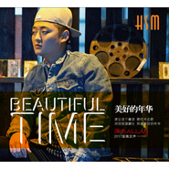

美好的年华
============================

|  |  |
| :--: | :-- |
| [ 美好的年华](https://emumo.xiami.com/album/2102722777) | **艺人**: [海生](../index.md) **语种**: 国语 **唱片公司**: 海生音文化 **发行时间**: 2017年03月28日 **专辑类别**: EP, 单曲 **专辑风格**: 流行 Pop, 国语流行 Mandarin Pop **播放数**: 6673 **收藏数**: 5 **评论数**: 0  |

## 简介

  
 

那年春天我穿着新买的白色球鞋，骑着单车带着你在两边开满油菜花的上学路上，那么几次不经意的刹车总能让我怦然心动，进入学校大门两个人不约而至的离的很远，每个课间总有那么一道不懂的习题跑到你的座位上问你，那时的我们彼此喜欢对方却会保持着规定的距离，那时的我早已把你当着生命中不可缺少的部分，愿意为你做一切，毕业那年约定的同一所大学没能实现，但我们依然保持着联系，可到了后来联系的次数慢慢少了，为了一次莫名的猜疑彻底闹掰，彼此都不愿意做主动联系对方的那个人，慢慢的时间带走了我们的一切直到后来彼此没有了联系方式，直到十年后的同学聚会上我们再次相见，我们的侃侃而谈显得那些年的天真就像一段童话，就让这个童话随时光去吧！深深地埋藏在那些美好的年华，如果可以给爱给我多一秒回答或许真的能潇洒，可以除了怀念没有其它。谢谢我的生命里有你，不，应该是有过你！
 

 

## 曲目

## 评论

|  |  |  |  |
| :-- | :-- | :-- | :-- |
