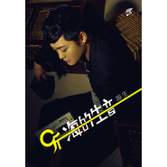

听海的生音
============================

|  |  |
| :--: | :-- |
| [ 听海的生音](https://emumo.xiami.com/album/515049) | **艺人**: [海生](../index.md) **语种**: 国语 **唱片公司**: 金信子 **发行时间**: 2012年05月22日 **专辑类别**: 录音室专辑 **专辑风格**: 流行 Pop **播放数**: 331336 **收藏数**: 20 **评论数**: 2  |

## 简介

8 在光怪陆离的世界， 
 

纸醉金迷的社会里，
 

爱情不过是吹弹即破之物。
 

海上生明月，天涯共此时。
 

依旧是破晓前的美好祝愿
 

海生 听海的生音
 

   

 

新生力量实力派主力军，创作型人气歌手海生
 

看清社会的真假，唱出逆境中的伤悲
 

主打歌曲：《三言两语来说爱》《小薇你在何方》

## 曲目

## 评论

|  |  |  |
| :-- | :-- | :-- |
|  [虾米用户](https://emumo.xiami.com/u/6652575) mbz2006 2015-12-10 16:02 赞(0) 踩(0) | 
ok
 |
|  [虾米用户](https://emumo.xiami.com/u/355865) Let it go, l... 2012-08-31 22:52 赞(0) 踩(0) | 
ok
 |
