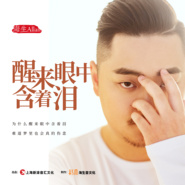
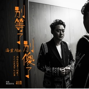
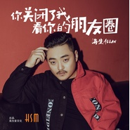
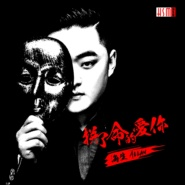
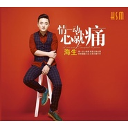
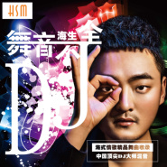

海生
============================

|  |  |
| :--: | :-- |
| [ 海生](https://i.xiami.com/haisheng) | **地区**: China 中国大陆 **风格**: 国语流行 Mandarin Pop **播放数**: 47152483 **粉丝数**: 2264 **评论数**: 105  |

## 档案

原名：张海生 
艺名：海生 
英文名：ALLAN 
昵称：小海、海哥、阿海、张帅 
籍贯:江苏 盐城 
生日:11.24 
民族:汉族 
身高:176 
星座:射手 
体重：67KG 
粉丝名：海米 
语言：普通话、盐城话、少许英语、少许广东话 
爱好：赛车、旅游、美食 
职业：歌手、词曲创作人、演员、老师、编导 
座右铭：心有多大，舞台就有多大 
家庭成员：爸爸、妈妈 
最难忘的事：第一次登上舞台 
最爱吃的水果：榴莲 
最喜欢的颜色：黑、灰、蓝 
最喜欢的首饰：戒指、项链、耳钻 
最想说的一句话：感谢您的支持 
最想做的一件事：报答所有帮助过我的人 
减压方法：唱歌、写歌 、飚车 
最喜欢的歌星：张学友、孙楠 
最喜欢的艺人：刘德华、李宇春 
最喜欢的影星：葛优、王子文、马伊琍 
最喜欢的主持人：朱丹 
小学：江苏省射阳县四明小学 
初中：省射阳县四明中学 
高中：江苏省射阳职业教育中心校 
大学：北京科技职业学院 青春美国际艺术学院

## 专辑

| 名称 | 语种 | 唱片公司 | 发行时间 | 专辑类别 | 专辑风格 |
| :--: | :-- | :-- | :-- | :-- | :-- |
| [ 思念你太费烟](./albums/5021076101.md) | 国语 | 海生音文化 | 2020年07月11日 | 录音室专辑 | 国语流行 Mandarin Pop |
| [ 我们就这样走散（DJ版）](./albums/2108246211.md) | 国语 | 海生音文化 | 2020年03月24日 | EP, 单曲 | 国语流行 Mandarin Pop |
| [ 我们到底为什么相爱](./albums/2108147953.md) | 国语 | 海生音文化 | 2020年03月14日 | 录音室专辑 | 国语流行 Mandarin Pop |
| [ 我们就这样走散](./albums/2108159870.md) | 国语 | 海生音文化 | 2020年03月14日 | 录音室专辑 | 国语流行 Mandarin Pop |
| [ 我们到底为什么相爱（DJ版）](./albums/2108147954.md) | 国语 | 海生音文化 | 2020年03月14日 | 录音室专辑 | 国语流行 Mandarin Pop |
| [ 倒背如流](./albums/2106094374.md) | 国语 | 海生音文化 | 2020年02月22日 | 录音室专辑 | 国语流行 Mandarin Pop |
| [ 奔跑的蚂蚁](./albums/2106094364.md) | 国语 | 海生音文化 | 2020年02月22日 | EP, 单曲 | 国语流行 Mandarin Pop |
| [ 倒背如流](./albums/2106046370.md) | 国语 | 海生音文化 | 2020年02月15日 | EP, 单曲 | 国语流行 Mandarin Pop |
| [ 带你一起去流浪](./albums/2105905683.md) | 国语 | 海生音文化 | 2020年02月12日 | EP, 单曲 | 国语流行 Mandarin Pop |
| [ 射阳小他](./albums/2105715328.md) | 国语 | 独立发行 | 2020年01月10日 | EP, 单曲 | 流行说唱 Pop Rap, 国语流行 Mandarin Pop |
| [ 醉画盐城](./albums/2105526374.md) | 国语 | 海生音文化 | 2019年11月26日 | 录音室专辑 | 流行 Pop |
| [ 沉默的夜孤独的人](./albums/2105458252.md) | 国语 | 海生音文化 | 2019年11月20日 | 录音室专辑 | 流行 Pop |
| [ 城市的蝴蝶](./albums/2105458021.md) | 国语 | 海生音文化 | 2019年11月20日 | 录音室专辑 | 流行 Pop |
| [ 自拍美食好天气](./albums/2105458208.md) | 国语 | 海生音文化 | 2019年11月20日 | 录音室专辑 | 流行 Pop |
| [ 醒来眼中含着泪](./albums/2105399513.md) | 国语 | 海生音文化 | 2019年11月04日 | EP, 单曲 |  |
| [ 爱爱](./albums/2105399535.md) | 国语 | 海生音文化 | 2019年11月04日 | EP, 单曲 |  |
| [ 人生就像烈酒一杯](./albums/2105399505.md) | 国语 | 海生音文化 | 2019年10月09日 | EP, 单曲 |  |
| [ 人生就像烈酒一杯DJ版](./albums/2105399508.md) | 国语 | 海生音文化 | 2019年10月09日 | EP, 单曲 |  |
| [ 曾经的那个人](./albums/2105021365.md) | 国语 | 海生音文化 | 2019年07月22日 | EP, 单曲 | 流行 Pop |
| [ 别等了别傻了](./albums/2104962223.md) | 国语 | 海生音文化 | 2019年06月21日 | 录音室专辑 | 流行 Pop |
| [ 你关闭了我看你的朋友圈](./albums/2104918150.md) | 国语 | 海生音文化 | 2019年05月24日 | 录音室专辑 | 国语流行 Mandarin Pop |
| [ 我们就这样走散](./albums/2104888882.md) | 国语 | 海生音文化 | 2019年05月11日 | 录音室专辑 | 国语流行 Mandarin Pop |
| [ 分手在那个车站](./albums/2104849012.md) | 国语 | 海生音文化 | 2019年05月02日 | 录音室专辑 | 国语流行 Mandarin Pop |
| [ 小鬼](./albums/2104828020.md) | 国语 | 海生音文化 | 2019年04月26日 | 录音室专辑 | 国语流行 Mandarin Pop |
| [ 我们的大中国](./albums/2104811755.md) | 国语 | 海生音文化 | 2019年04月19日 | 录音室专辑 | 国语流行 Mandarin Pop |
| [ 原来未曾爱过我](./albums/2104783726.md) | 国语 | 海生音文化 | 2019年04月12日 | 录音室专辑 | 国语流行 Mandarin Pop |
| [ 迷失的港湾](./albums/2104783717.md) | 国语 | 海生音文化 | 2019年04月03日 | 录音室专辑 | 国语流行 Mandarin Pop |
| [ 这条情路](./albums/2104783702.md) | 国语 | 海生音文化 | 2019年03月05日 | 录音室专辑 | 流行 Pop, 国语流行 Mandarin Pop |
| [ 中国澳门](./albums/2104639889.md) | 国语 | 海生音文化 | 2019年02月28日 | 录音室专辑 | 国语流行 Mandarin Pop |
| [ 曾经的那个人](./albums/2104427555.md) | 国语 | 海生音文化 | 2018年12月29日 | EP, 单曲 | 国语流行 Mandarin Pop |
| [ 只想不再想你](./albums/2104292324.md) | 国语 | 海生音文化 | 2018年11月28日 | 录音室专辑 | 国语流行 Mandarin Pop |
| [ 三流作家](./albums/2104158651.md) | 国语 | 海生音文化 | 2018年10月29日 | 录音室专辑 | 国语流行 Mandarin Pop |
| [ 青春的筵席](./albums/2104118124.md) | 国语 | 海生音文化 | 2018年10月18日 | 录音室专辑 | 国语流行 Mandarin Pop |
| [ 海生2018“听海”全国巡回演唱会](./albums/2104007514.md) | 国语 | 海生音文化 | 2018年09月09日 | 现场专辑 | 流行摇滚 Pop Rock, 国语流行 Mandarin Pop |
| [ 醉画故乡](./albums/2103754738.md) | 国语 | 海生音文化 | 2018年06月25日 | 录音室专辑 | 国语流行 Mandarin Pop |
| [ 向天空](./albums/2103747276.md) | 国语 | 海生音文化 | 2018年06月12日 | 录音室专辑 | 国语流行 Mandarin Pop |
| [ 装聋作哑](./albums/2103708403.md) | 国语 | 海生音文化 | 2018年05月15日 | 录音室专辑 | 国语流行 Mandarin Pop |
| [ 情一动心就痛](./albums/2103693753.md) | 国语 | 海生音文化 | 2018年04月23日 | 录音室专辑 | 国语流行 Mandarin Pop |
| [ 互不相欠](./albums/2103466233.md) | 国语 | 独立发行 | 2018年01月01日 | 录音室专辑 | 国语流行 Mandarin Pop |
| [ 拼了命的爱你](./albums/2103464443.md) | 国语 | 独立发行 | 2017年12月27日 | EP, 单曲 | 流行 Pop, 国语流行 Mandarin Pop |
| [ 情一动心就痛（粤语版）](./albums/2102823163.md) | 粤语 | 独立发行 | 2017年08月30日 | 精选集 | 流行 Pop, 粤语流行 Cantopop |
| [ 死不放手其实很丑](./albums/2102810182.md) | 国语 | 海生音文化 | 2017年08月01日 | 录音室专辑 | 流行 Pop |
| [ 死不放手其实很丑](./albums/2102799177.md) | 国语 | 独立发行 | 2017年07月16日 | 录音室专辑 | 流行 Pop, 国语流行 Mandarin Pop |
| [ 美好的年华](./albums/2102722777.md) | 国语 | 海生音文化 | 2017年03月28日 | EP, 单曲 | 流行 Pop, 国语流行 Mandarin Pop |
| [ 面具情歌小天王海生首张粤语大碟](./albums/2102703042.md) | 粤语 | 海生音文化 | 2017年03月03日 | EP, 单曲 | 流行 Pop, 粤语流行 Cantopop |
| [ 我的老爸老妈](./albums/2102680435.md) | 国语 | 海生音文化 | 2017年01月14日 | 录音室专辑 | 流行 Pop, 民谣 Folk |
| [ 海生热歌集](./albums/535240.md) | 国语 | 海生音文化 | 2016年09月05日 | EP, 单曲 | 国语流行 Mandarin Pop |
| [ 如果离开我你会很快乐情歌小天王海生全新唱作专辑](./albums/2100359891.md) | 国语 | 海生音文化 | 2016年06月28日 | 录音室专辑 | 流行 Pop |
| [ 我们结婚了](./albums/2100318720.md) | 国语 | 海生音文化 | 2016年04月22日 | EP, 单曲 | 国语流行 Mandarin Pop, 电音流行 Electropop |
| [ 生森不息海生2016全新专辑](./albums/2100254768.md) | 国语 | 海生音文化 | 2016年01月05日 | 录音室专辑 | 流行摇滚 Pop Rock, 国语流行 Mandarin Pop |
| [ 带你一起去流浪海生2016新专辑第二波宣传歌曲](./albums/2100239558.md) | 国语 | 海生音文化 | 2015年11月20日 | 录音室专辑 | 国语流行 Mandarin Pop |
| [ 不顾一切去爱你](./albums/2100209392.md) | 国语 | 海生音文化 | 2015年09月28日 | EP, 单曲 | 国语流行 Mandarin Pop |
| [ 舞音不全](./albums/2100189034.md) | 国语 | 海生音文化 | 2015年09月01日 | 录音室专辑 | 流行 Pop |
| [ 不奢求](./albums/1137965951.md) | 国语 | 海生音文化 | 2015年07月25日 | EP, 单曲 |  |
| [ 情一动心就痛](./albums/1416903652.md) | 国语 | 海生音文化 | 2015年03月02日 | 录音室专辑 | 国语流行 Mandarin Pop |
| [ 想爱不能爱](./albums/893233489.md) | 国语 | 海生音文化 | 2014年02月24日 | EP, 单曲 | 流行 Pop |
| [ 我们还有梦](./albums/1387783811.md) | 国语 | 海生音文化 | 2013年12月19日 | EP, 单曲 | 流行 Pop |
| [ 蓝玫瑰](./albums/662386551.md) | 国语 | 海生音文化 | 2013年03月03日 | EP, 单曲 | 流行 Pop |
| [ 太囧](./albums/569114.md) | 国语 | 海生音文化 | 2013年01月05日 | EP, 单曲 | 流行 Pop |
| [ 三无男人](./albums/545535.md) | 国语 | 海生音文化 | 2012年09月27日 | EP, 单曲 | 流行 Pop |
| [ 其实男人也会流眼泪](./albums/520905.md) | 国语 | 海生音文化 | 2012年06月13日 | EP, 单曲 | 流行 Pop |
| [ 听海的生音](./albums/515049.md) | 国语 | 金信子 | 2012年05月22日 | 录音室专辑 | 流行 Pop |

## 评论

|  |  |  |
| :-- | :-- | :-- |
|  [虾米用户](https://emumo.xiami.com/u/44653230)  2020-12-24 21:39 赞(0) 踩(0) | 
吃辣椒也会痛  越疼也爱
 |
|  [虾米用户](https://emumo.xiami.com/u/419733830)  2020-09-24 07:53 赞(0) 踩(0) | 
每次聽這首歌心好痛，感情你認真就輸了，輸得好慘
 |
|  [虾米用户](https://emumo.xiami.com/u/442017046) 人生无奈 2020-04-05 00:51 赞(0) 踩(0) | 
真的很好听，也不知道听了几次
 |
|  [虾米用户](https://emumo.xiami.com/u/2796166) 最爱莫文蔚..... 2020-01-31 00:20 赞(1) 踩(0) | 
加油~~~~yeah~~~
 |
|  [虾米用户](https://emumo.xiami.com/u/293692544) 你敢给我说话吗？我咬你 2019-11-05 06:16 赞(2) 踩(0) | 
好听
 |
|  [虾米用户](https://emumo.xiami.com/u/431264922)  2019-10-28 22:04 赞(2) 踩(0) | 
喜欢这里的歌谢谢 
 |
|  [虾米用户](https://emumo.xiami.com/u/24476372)  2019-08-24 18:18 赞(1) 踩(0) | 
满满的伤心！满满的回忆！
 |
|  [虾米用户](https://emumo.xiami.com/u/410730096)  2019-08-23 05:46 赞(1) 踩(0) | 
好听，我才发现我们的名字一样，姓不一样。。。。。。
 |
|  [虾米用户](https://emumo.xiami.com/u/325205625)  2019-08-21 14:14 赞(1) 踩(0) | 
，
 |
|  [虾米用户](https://emumo.xiami.com/u/293862340)  2019-06-05 22:41 赞(1) 踩(0) | 
充了瞎米会员还要收费2员，不合理吧，小瞎米
 |
|  [虾米用户](https://emumo.xiami.com/u/419255841)  2019-06-02 19:01 赞(1) 踩(0) | 
没关系，不用谢，我真的喜欢这首歌！
 |
|  [虾米用户](https://emumo.xiami.com/u/332235207)  2019-05-06 13:16 赞(1) 踩(0) | 
好听的歌曲。
 |
|  [虾米用户](https://emumo.xiami.com/u/355360106)  2019-04-12 21:38 赞(2) 踩(0) | 
对不起. My Chinese is not good. I enjoyed listening to your songs. Thanks for sharing your talent and beautiful songs.   
 |
|  [虾米用户](https://emumo.xiami.com/u/293692544) 你敢给我说话吗？我咬你 2019-03-27 21:28 赞(1) 踩(0) | 
好听
 |
|  [虾米用户](https://emumo.xiami.com/u/325374787)  2019-03-23 06:50 赞(1) 踩(0) | 
好
 |
|  [虾米用户](https://emumo.xiami.com/u/325205625)  2019-03-10 00:04 赞(1) 踩(0) | 
好
 |
|  [虾米用户](https://emumo.xiami.com/u/293692544) 你敢给我说话吗？我咬你 2019-03-06 17:25 赞(2) 踩(0) | 
好听
 |
|  [虾米用户](https://emumo.xiami.com/u/293692544) 你敢给我说话吗？我咬你 2019-02-09 10:36 赞(2) 踩(0) | 
好听
 |
|  [虾米用户](https://emumo.xiami.com/u/356949607) 虾米音乐，就是好音乐! 2019-02-05 05:49 赞(2) 踩(0) | 

 |
|  [虾米用户](https://emumo.xiami.com/u/40233036) 要拥有必先懂失去怎接受 2018-12-29 20:58 赞(3) 踩(0) | 
还是听你的歌舒服
 |
|  [虾米用户](https://emumo.xiami.com/u/401235465)  2018-12-15 18:19 赞(1) 踩(0) | 
歌曲很好听  
 |
|  [虾米用户](https://emumo.xiami.com/u/356568486) 空聆君声 2018-10-27 23:14 赞(1) 踩(0) | 
真的不敢动情了。只能羡慕年轻人。到现在情上空空如也孤家寡人。也老了，50了
 |
|  [虾米用户](https://emumo.xiami.com/u/293692544) 你敢给我说话吗？我咬你 2018-10-06 05:10 赞(1) 踩(0) | 
好听
 |
|  [虾米用户](https://emumo.xiami.com/u/270121900) 你不来…………我不老……... 2018-10-05 15:42 赞(1) 踩(0) | 
不错
 |
|  [虾米用户](https://emumo.xiami.com/u/280578692)  2018-10-02 15:38 赞(1) 踩(0) | 
我最喜欢情一动心就痛这首歌~~
 |
|  [虾米用户](https://emumo.xiami.com/u/348363738)  2018-09-12 21:51 赞(1) 踩(0) | 
海生你好！好喜欢你的那首，彻彻底底忘记你，
 |
|  [虾米用户](https://emumo.xiami.com/u/336516835) 来是偶然，走是必然。你我... 2018-07-11 15:10 赞(1) 踩(0) | 
......Look back on your life, making us the pain, not failure, but no experience everything I want to experience.~回首人生，最使得我们痛的，不是失败，而是没有经历我所想要经历的一切。来是偶然，走是必然～出生✪死亡。你我都在路上&amp;hellip;&amp;hellip;欢乐只是记忆，痛苦也只是记忆，一切都只是记忆，让我们慢慢地回忆&amp;hellip;&amp;hellip;愿那些灵魂的深处依然&amp;hellip;&amp;hellip;
 |
|  [虾米用户](https://emumo.xiami.com/u/353880289)  2018-05-24 19:51 赞(1) 踩(0) | 
音乐好听 歌词也有意思 声音更是棒棒的  
 |
|  [虾米用户](https://emumo.xiami.com/u/364828518)  2018-05-09 00:33 赞(1) 踩(0) | 
挺你   加油
 |
|  [虾米用户](https://emumo.xiami.com/u/44568882)  2018-05-05 17:50 赞(1) 踩(0) | 
海生 能教我 怎样在虾米可以 把我的歌发送啊
 |
|  [虾米用户](https://emumo.xiami.com/u/361087386)  2018-04-29 11:23 赞(1) 踩(0) | 
。。。
 |
|  [虾米用户](https://emumo.xiami.com/u/353837157)  2018-04-23 23:54 赞(3) 踩(0) | 
无意中听到你的&amp;ldquo;情一动心就痛&amp;rdquo;，很喜欢的伤感，主页看到&amp;ldquo;张海生&amp;rdquo;名字很有缘，看到大学&amp;ldquo;北京科技...&amp;rdquo;，也想起了我的大学。然后又听了你的一系列，很喜欢的声音，很喜欢的伤感，此刻黑夜里的我居然听得落泪了，安静地沉浸在这种伤感中。
 |
|  [虾米用户](https://emumo.xiami.com/u/328677785)  2018-04-22 17:36 赞(1) 踩(0) | 
海生！歌首！您好！我喜欢您好歌声！全民K歌您第一！      
 |
|  [虾米用户](https://emumo.xiami.com/u/346756742)  2018-03-30 23:15 赞(1) 踩(0) | 
听到我心瞬间痛了
 |
|  [虾米用户](https://emumo.xiami.com/u/337289516)  2018-03-05 15:43 赞(1) 踩(0) | 
我很喜欢听这样的歌，因为我伤了心，好疼
 |
|  [虾米用户](https://emumo.xiami.com/u/353134470)  2018-03-03 22:29 赞(1) 踩(0) | 
温暖的声音
 |
|  [虾米用户](https://emumo.xiami.com/u/291681108) 爱你永久 2018-01-24 23:10 赞(1) 踩(0) | 
我非常喜欢你这首彻彻底底忘记你，百听不愿
 |
|  [虾米用户](https://emumo.xiami.com/u/343936344)  2018-01-21 19:44 赞(1) 踩(0) | 
加油，好听
 |
|  [虾米用户](https://emumo.xiami.com/u/335500455)  2018-01-13 20:42 赞(2) 踩(0) | 
好喜欢
 |
|  [虾米用户](https://emumo.xiami.com/u/342012077)  2017-12-30 13:12 赞(1) 踩(0) | 
很好，很喜欢你的歌曲。
 |
|  [虾米用户](https://emumo.xiami.com/u/293692544) 你敢给我说话吗？我咬你 2017-12-27 11:50 赞(1) 踩(0) | 
好听
 |
|  [虾米用户](https://emumo.xiami.com/u/314997945) 我还没想好要写什么... 2017-12-27 01:51 赞(1) 踩(0) | 
送我一点虾币海生
 |
|  [虾米用户](https://emumo.xiami.com/u/287070662)  2017-12-02 08:53 赞(1) 踩(0) | 
声音很特别，希望能出更好的作品！一个优秀的歌手不仅会唱歌，最好自己能创作属于自己的作品&amp;hellip;&amp;hellip;更长久
 |
|  [虾米用户](https://emumo.xiami.com/u/334269182) 开开心心 2017-11-11 13:14 赞(2) 踩(0) | 
嗯：我刚入虾米音乐人：欢迎大家有好听的音乐可同我分享oK
 |
|  [虾米用户](https://emumo.xiami.com/u/293692544) 你敢给我说话吗？我咬你 2017-11-03 05:19 赞(1) 踩(0) | 
好听
 |
|  [虾米用户](https://emumo.xiami.com/u/13983720) 静静的静静的听 2017-10-27 00:51 赞(2) 踩(0) | 
感觉外型应该可以混混演艺圈呀
 |
|  [虾米用户](https://emumo.xiami.com/u/326421052)  2017-09-30 12:49 赞(2) 踩(0) | 
我很喜欢听海生的歌
 |
|  [虾米用户](https://emumo.xiami.com/u/286742556) 超越梦想一起飞 2017-09-16 23:55 赞(2) 踩(0) | 
海生的每一首歌都那么经典我喜欢 
 |
| ⇒ |  [虾米用户](https://emumo.xiami.com/u/287070662)  2017-12-02 08:50 赞(0) 踩(0) | 
不错的歌手，好好加油顶你！
 |
| ⇒ |  [虾米用户](https://emumo.xiami.com/u/287070662)  2017-12-02 08:51 赞(0) 踩(0) | 
新发现
 |
|  [虾米用户](https://emumo.xiami.com/u/286742556) 超越梦想一起飞 2017-09-16 23:52 赞(2) 踩(0) | 
海生的歌唱出了多少人的伤感故事，我的伤感故事就是，我爱你却不能在一起，
 |
|  [虾米用户](https://emumo.xiami.com/u/323273603) 不求天长地久，只因曾经拥... 2017-09-08 17:55 赞(1) 踩(0) | 
这首歌很好听
 |
|  [虾米用户](https://emumo.xiami.com/u/320732780)  2017-08-21 22:16 赞(2) 踩(0) | 
我喜欢 情一动心就痛     
 |
|  [虾米用户](https://emumo.xiami.com/u/320732780)  2017-08-21 22:15 赞(1) 踩(0) | 
你唱的真好
 |
|  [虾米用户](https://emumo.xiami.com/u/306920065)  2017-08-17 14:16 赞(1) 踩(0) | 
点个赞
 |
|  [虾米用户](https://emumo.xiami.com/u/279586290)  2017-08-04 05:35 赞(1) 踩(0) | 
海生歌还行！
 |
|  [虾米用户](https://emumo.xiami.com/u/298230836)  2017-07-12 10:38 赞(2) 踩(0) | 
无意中听见你的歌就觉得太好听了，加油！
 |
|  [虾米用户](https://emumo.xiami.com/u/291400712)  2017-07-08 16:29 赞(1) 踩(0) | 
好听，不错
 |
|  [虾米用户](https://emumo.xiami.com/u/38190184)  2017-07-02 23:22 赞(1) 踩(0) | 
你的歌，太好听了
 |
|  [虾米用户](https://emumo.xiami.com/u/212266333)  2017-06-22 16:50 赞(1) 踩(0) | 
伤感的歌 
 |
|  [虾米用户](https://emumo.xiami.com/u/297246516)   2017-05-18 14:52 赞(2) 踩(0) | 
好听   
 |
|  [虾米用户](https://emumo.xiami.com/u/294446759)  2017-05-09 19:01 赞(2) 踩(0) | 
我只是偶尔一次机会听到了，就是那一次，爱上了你的歌，加油
 |
|  [虾米用户](https://emumo.xiami.com/u/261378612)  2017-05-05 01:35 赞(2) 踩(0) | 
你好！海生歌手！听你的歌感动期待你多出作品，为你加油！
 |
|  [虾米用户](https://emumo.xiami.com/u/277611330)   2017-04-27 20:56 赞(2) 踩(0) | 
（情一动心就痛）很喜欢❤️❤️。
 |
|  [虾米用户](https://emumo.xiami.com/u/284631142)  2017-04-10 21:23 赞(3) 踩(0) | 
唱的很好！！！
 |
|  [虾米用户](https://emumo.xiami.com/u/287046941)  2017-04-09 21:50 赞(2) 踩(0) | 
人虽帅歌却伤感
 |
| ⇒ |  [虾米用户](https://emumo.xiami.com/u/294497394) 吕先锋 2017-05-19 19:28 赞(0) 踩(0) | 
   
 |
|  [虾米用户](https://emumo.xiami.com/u/13402412) 随心所欲！ 2017-04-09 11:02 赞(2) 踩(0) | 
不错
 |
|  [虾米用户](https://emumo.xiami.com/u/284624883)  2017-04-08 16:17 赞(2) 踩(0) | 
海生你的歌唱的好听，歌词写的也好。写出了好多人的心声！ 
 |
|  [虾米用户](https://emumo.xiami.com/u/282438027) 只听我喜欢的歌曲 2017-03-28 12:09 赞(2) 踩(0) | 
不顾一切去爱你：听了不知道听了多少遍了，感觉你的歌能疗伤
 |
|  [虾米用户](https://emumo.xiami.com/u/282438027) 只听我喜欢的歌曲 2017-03-28 12:00 赞(1) 踩(0) | 
非常喜欢你的歌，感谢有你的歌声陪伴。
 |
|  [虾米用户](https://emumo.xiami.com/u/246052921)  2017-01-29 22:47 赞(9) 踩(0) | 
海生歌手，你好，我最欣欣你的两首歌曲、彻彻底底忘记你、情一动，心就痛！让人感伤凄凉、我期待你好动作品在次发行，我挺你、为你加油！一个你忠实的歌迷。
 |
| ⇒ |  [虾米用户](https://emumo.xiami.com/u/354061423)  2019-03-13 17:21 赞(0) 踩(0) | 
同一天天5营业厅听一起吃中餐同意我在他他他宇天梯听听这种下学期小拳ZW慎（拳去啊亲戚QQ11~去咋1啊拳拳Q啊Q家W鳄鱼龟   儿子？v基本R二十几S恶女喝点粥
 |
|  [虾米用户](https://emumo.xiami.com/u/256167991)  2017-01-13 22:14 赞(3) 踩(0) | 
真的好好听，我也想学学，怎么没有女生版的，
 |
|  [虾米用户](https://emumo.xiami.com/u/233412232)  2016-12-31 22:50 赞(3) 踩(0) | 
好听  特喜欢
 |
|  [虾米用户](https://emumo.xiami.com/u/205565910) 谢谢你的不珍惜 2016-10-10 01:54 赞(2) 踩(0) | 
MC海诺
 |
|  [虾米用户](https://emumo.xiami.com/u/124488112)  2016-09-17 23:26 赞(2) 踩(0) | 
好听
 |
|  [虾米用户](https://emumo.xiami.com/u/225410248)  2016-09-12 01:37 赞(2) 踩(0) | 
好听
 |
|  [虾米用户](https://emumo.xiami.com/u/97747450) 我还没想好要写什么... 2016-08-13 00:40 赞(2) 踩(0) | 
2540
 |
|  [虾米用户](https://emumo.xiami.com/u/11763865)  2015-09-20 19:45 赞(1) 踩(0) | 
，
 |
|  [虾米用户](https://emumo.xiami.com/u/52572201)  2015-08-08 23:27 赞(0) 踩(0) | 
好听
 |
|  [虾米用户](https://emumo.xiami.com/u/50591156) 【“Ill love y... 2015-08-06 04:16 赞(0) 踩(0) | 
我唯【情一动～就心痛】爱   支持！
 |
|  [虾米用户](https://emumo.xiami.com/u/50591156) 【“Ill love y... 2015-08-06 04:16 赞(0) 踩(0) | 
我唯【情一动～就心痛】爱   支持！
 |
|  [虾米用户](https://emumo.xiami.com/u/53969209) 代表作《情一动心就痛》最... 2015-08-04 14:43 赞(59) 踩(0) | 
我刚入驻了虾米音乐人，欢迎大家来我的个人主页，收听我的最新音乐
 |
| ⇒ |  [虾米用户](https://emumo.xiami.com/u/50591156) 【“Ill love y... 2015-08-06 04:14 赞(0) 踩(0) | 
 好听～以后～多出专辑
 |
| ⇒ |  [虾米用户](https://emumo.xiami.com/u/202662558)  2016-09-12 01:03 赞(0) 踩(0) | 
很棒 …好听
 |
| ⇒ |  [虾米用户](https://emumo.xiami.com/u/202662558)  2016-09-12 01:03 赞(0) 踩(0) | 
很棒 …好听
 |
| ⇒ |  [虾米用户](https://emumo.xiami.com/u/25984)  2016-12-09 08:24 赞(0) 踩(0) | 

 |
| ⇒ |  [虾米用户](https://emumo.xiami.com/u/256167991)  2017-01-13 22:15 赞(0) 踩(0) | 
，好好听，好有感情
 |
| ⇒ |  [虾米用户](https://emumo.xiami.com/u/216638886)  2017-02-27 20:56 赞(0) 踩(0) | 
加油
 |
| ⇒ |  [虾米用户](https://emumo.xiami.com/u/273883822)  2017-04-04 22:25 赞(0) 踩(0) | 
好稀饭你 
 |
| ⇒ |  [虾米用户](https://emumo.xiami.com/u/32659808) 念念勿忘 2017-06-15 20:46 赞(0) 踩(0) | 
期待有更多好听的歌
 |
| ⇒ |  [虾米用户](https://emumo.xiami.com/u/320486752)  2017-08-20 19:04 赞(0) 踩(0) | 
加油，同是射阳人。
 |
| ⇒ |  [虾米用户](https://emumo.xiami.com/u/38857753)  2017-09-01 20:58 赞(0) 踩(0) | 
支持您
 |
| ⇒ |  [虾米用户](https://emumo.xiami.com/u/280459900)  2017-10-05 10:12 赞(0) 踩(0) | 
我在全民里很喜欢唱你的歌
 |
| ⇒ |  [虾米用户](https://emumo.xiami.com/u/353880289)  2018-05-24 19:51 赞(0) 踩(0) | 
<q><b>强哥说：</b></q>
 |
| ⇒ |  [虾米用户](https://emumo.xiami.com/u/378836924)  2018-10-16 07:38 赞(0) 踩(0) | 
我也写歌，
 |
|  [虾米用户](https://emumo.xiami.com/u/29537993) 高山流水 2015-07-31 19:32 赞(0) 踩(0) | 
好听
 |
|  [虾米用户](https://emumo.xiami.com/u/42713554)  2015-07-31 15:38 赞(0) 踩(0) | 
喜欢爱情打包。一直关注张海生 
 |
|  [虾米用户](https://emumo.xiami.com/u/52813231)  2015-07-22 01:33 赞(0) 踩(0) | 
喜欢听祢的情一动心就痛，感觉自己都融洽进去了。
 |
|  [虾米用户](https://emumo.xiami.com/u/26544715) 一曲～当耳朵遇上倾心 2015-05-12 23:57 赞(0) 踩(0) | 
老乡 加油
 |
|  [虾米用户](https://emumo.xiami.com/u/13678509) 爱音乐的人 2013-11-16 08:53 赞(0) 踩(0) | 
最佳的那首 我不是你的玩偶 怎么没选上！
 |
|  [虾米用户](https://emumo.xiami.com/u/13678509) 爱音乐的人 2013-11-16 08:32 赞(0) 踩(0) | 
又一个真正做音乐的歌手。可被埋了。坚持风格，一次机会就够了！
 |
|  [虾米用户](https://emumo.xiami.com/u/4407334)  2013-07-13 15:20 赞(0) 踩(0) | 
悲流刹代理艺人
 |
|  [虾米用户](https://emumo.xiami.com/u/1438982)  2012-10-22 21:09 赞(0) 踩(0) | 
非常喜欢他唱的歌。
 |
