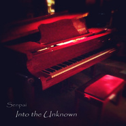

Ode to Okawari
============================

|  |  |
| :--: | :-- |
| [ Ode to Okawari](https://emumo.xiami.com/album/995466866) | **艺人**: [Senpai](../index.md) **语种**: 英语 **唱片公司**: 独立发行 **发行时间**: 2014年03月22日 **专辑类别**: EP, 单曲 **专辑风格**: 轻音乐 Easy Listening **播放数**: 180024 **收藏数**: 168 **评论数**: 44  |

## 简介

这首歌献给我最大的灵感 DJ Okawari。猜猜看这首歌像哪首他的歌  
  
"Ode to Okawari" is featured on my newest release, [INTO THE UNKNOWN]  
-- DOWNLOAD:  <a href="https://senpai.bandcamp.com/album/into-the-unknown" target="_blank" rel="nofollow noreferrer noopener">https://senpai.bandcamp.com/album/into-the-unknown</a> --

## 曲目

## 评论

|  |  |  |  |
| :-- | :-- | :-- | :-- |
|  [虾米用户](https://emumo.xiami.com/u/52415194) ♬♩♫♪♡ 2018-03-30 23:11 赞(0) 踩(0) | 
ᵕ᷄≀ ̠˘᷅
 |
|  [虾米用户](https://emumo.xiami.com/u/269293612)  2017-02-01 20:10 赞(0) 踩(0) | 
致敬okawari
 |
|  [虾米用户](https://emumo.xiami.com/u/7322777) ∮ 2016-01-05 02:52 赞(0) 踩(0) | 
...A...
 |
|  [虾米用户](https://emumo.xiami.com/u/39788841)  . 2015-06-14 13:05 赞(0) 踩(0) | 
lium
 |
|  [虾米用户](https://emumo.xiami.com/u/32056965) stay gold. 2015-04-23 20:41 赞(0) 踩(0) | 
呵呵
 |
|  [虾米用户](https://emumo.xiami.com/u/713877)  2014-11-27 16:05 赞(0) 踩(0) | 
情书啊！你以为你变了notes老娘就发现不了啦！
 |
|  [虾米用户](https://emumo.xiami.com/u/3312609) ひとりきりで生きて行く 2014-10-27 19:37 赞(0) 踩(0) | 
02:11后赞
 |
|  [虾米用户](https://emumo.xiami.com/u/30261723)  2014-09-19 19:17 赞(0) 踩(0) | 
喜欢~~
 |
|  [虾米用户](https://emumo.xiami.com/u/18377566) 欧羙官方music电台。 2014-05-10 21:27 赞(0) 踩(0) | 
很喜欢~
 |
|  [虾米用户](https://emumo.xiami.com/u/30622616) 这个人什么都不想留下 2014-05-03 23:59 赞(1) 踩(0) | 
感觉不一样呢，luv letter是粉红色的，这首是蓝色缀着光
 |
|  [虾米用户](https://emumo.xiami.com/u/5942015) 放飞了灵魂，抵押了青春 2014-05-03 21:19 赞(0) 踩(0) | 
Dj Okawari - Luv Letter(Music by DJ OKAWARI,TSUKINO SORA,TSUNENORI)
 |
|  [虾米用户](https://emumo.xiami.com/u/11482506)  2014-03-30 11:46 赞(0) 踩(0) | 
果然是情书？
 |
|  [虾米用户](https://emumo.xiami.com/u/11643877) 姑且听之 2014-03-29 17:22 赞(0) 踩(0) | 
~
 |
|  [虾米用户](https://emumo.xiami.com/u/11643877) 姑且听之 2014-03-29 17:19 赞(0) 踩(0) | 
冒泡
 |
|  [虾米用户](https://emumo.xiami.com/u/6111570) 春と修羅 2014-03-28 00:00 赞(0) 踩(0) | 
0.0 还真是高产
 |
|  [虾米用户](https://emumo.xiami.com/u/3425410)  2014-03-25 16:28 赞(0) 踩(0) | 
Luv Letter
 |
|  [虾米用户](https://emumo.xiami.com/u/12068445) · 2014-03-24 03:37 赞(0) 踩(0) | 
good .
 |
|  [虾米用户](https://emumo.xiami.com/u/6505789) 设定狂魔 2014-03-23 18:19 赞(0) 踩(0) | 
不错！
 |
|  [虾米用户](https://emumo.xiami.com/u/7271246)  2014-03-23 11:15 赞(0) 踩(0) | 
橘
 |
|  [虾米用户](https://emumo.xiami.com/u/1109450) 枷于终雪，见皆黄粱 2014-03-23 10:39 赞(0) 踩(0) | 
不错不错了
 |
|  [虾米用户](https://emumo.xiami.com/u/231797) 活着真好 好好活着 2014-03-23 01:40 赞(0) 踩(0) | 
~
 |
|  [虾米用户](https://emumo.xiami.com/u/1151921) 要啥自行车 2014-03-22 23:06 赞(0) 踩(0) | 
再来一碗颂
 |
|  [虾米用户](https://emumo.xiami.com/u/10337057) 独自穿行于空灵之境 2014-03-22 22:51 赞(0) 踩(0) | 
~~~
 |
|  [虾米用户](https://emumo.xiami.com/u/7397321) 随遇而安 2014-03-22 22:36 赞(0) 踩(0) | 
0.0
 |
|  [虾米用户](https://emumo.xiami.com/u/9783703) 晃眼 2014-03-22 21:29 赞(0) 踩(0) | 
心要化了 會員卻昨天過期了QAQ
 |
|  [虾米用户](https://emumo.xiami.com/u/9728574) 明目张胆 2014-03-22 19:51 赞(0) 踩(0) | 
好聽!好好聽!!!
 |
|  [虾米用户](https://emumo.xiami.com/u/7093141) 心香一瓣 2014-03-22 19:14 赞(0) 踩(0) | 
的确有点儿像Luv  letter
 |
|  [虾米用户](https://emumo.xiami.com/u/4430245) Mare…Cullami... 2014-03-22 18:31 赞(0) 踩(0) | 
一听就是Luv Letter~~~
 |
|  [虾米用户](https://emumo.xiami.com/u/29230195) Gubba nub nu... 2014-03-22 18:17 赞(0) 踩(0) | 
ode to okawari?求科普！
 |
| ⇒ |  [虾米用户](https://emumo.xiami.com/u/7844207)  2014-04-12 22:06 赞(0) 踩(0) | 
给Okawari的颂歌
 |
| ⇒ |  [虾米用户](https://emumo.xiami.com/u/29230195) Gubba nub nu... 2014-04-13 07:30 赞(0) 踩(0) | 
<q><b>Bula说：</b></q>
 |
|  [虾米用户](https://emumo.xiami.com/u/21899372) Listening……♪ 2014-03-22 17:43 赞(0) 踩(0) | 
神模仿Luv Letter!
 |
|  [虾米用户](https://emumo.xiami.com/u/6362689)  2014-03-22 15:47 赞(0) 踩(0) | 
越听越有感觉了，最近的几张专辑都很棒
 |
|  [虾米用户](https://emumo.xiami.com/u/6362689)  2014-03-22 15:46 赞(0) 踩(0) | 
大爱优美系
 |
|  [虾米用户](https://emumo.xiami.com/u/652547)  2014-03-22 15:11 赞(0) 踩(0) | 
AAA
 |
|  [虾米用户](https://emumo.xiami.com/u/6515158) weibo：杯砸_aer... 2014-03-22 14:38 赞(0) 踩(0) | 
不用猜绝对是Luv Letter~~~&amp;gt; &amp;lt;
 |
|  [虾米用户](https://emumo.xiami.com/u/5133491) 其他音乐平台用户名依旧叫... 2014-03-22 14:18 赞(0) 踩(0) | 
(☆_☆)
 |
|  [虾米用户](https://emumo.xiami.com/u/883368) 海底的水族箱 2014-03-22 14:11 赞(0) 踩(0) | 
luv letter for obvious
 |
|  [虾米用户](https://emumo.xiami.com/u/21167852) 不能吃太胖喔,不然会被杀... 2014-03-22 13:52 赞(0) 踩(0) | 
。。。
 |
|  [虾米用户](https://emumo.xiami.com/u/25371371) 平淡简单，接近生活 2014-03-22 13:51 赞(0) 踩(0) | 
~
 |
|  [虾米用户](https://emumo.xiami.com/u/9014716) 未来再见！ 2014-03-22 13:48 赞(0) 踩(0) | 
Luv Letter
 |
|  [虾米用户](https://emumo.xiami.com/u/1700002) V5_ORZZZZZ 2014-03-22 13:47 赞(0) 踩(0) | 
Luv Letter
 |
|  [虾米用户](https://emumo.xiami.com/u/18244944) 親友だな 2014-03-22 13:47 赞(0) 踩(0) | 
支持
 |
|  [虾米用户](https://emumo.xiami.com/u/7776021) memento mori 2014-03-22 13:47 赞(0) 踩(0) | 
~
 |
