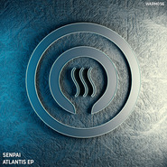
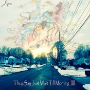
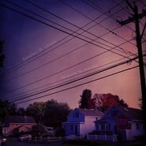
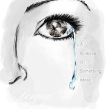
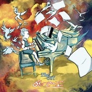
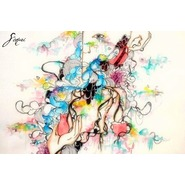
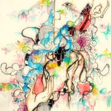

Senpai
============================

|  |  |
| :--: | :-- |
| [ Senpai](https://i.xiami.com/senpai) | **地区**: United States of America 美国 **风格**: 氛围音乐 Ambient, 原声 Soundtrack, 轻音乐 Easy Listening, 氛围流行 Ambient Pop **播放数**: 7066996 **粉丝数**: 28427 **评论数**: 457  |

## 档案

Senpai是来自于美国纽约州，一个努力希望通过音乐连接世界的音乐家 
他的音乐受到Nujabes，菅野洋子，坂本龙一，久石让的影响 
"They Say Just Wait Till Morning, you'll find new things every day" 
“只要等到第二天的早晨，你就会发现新的事情” 
这是他最喜欢的一句话，也是他专辑的Title 
曲风混合了Jazz-hiphop和管弦乐及Dark hiphop的元素，他的音乐作品代表了许多只能通过旋律和心灵悸动的音乐才能叙述的故事。每一首歌都会让听者作画，慢慢创建一个自己的世界 
主要作品：在2012年发表了作品"They Say Just Wait Till Morning（只要等到第二天的早晨）”，专辑里每一首歌都像在叙述故事一样，优美的钢琴配上真正的展示了如何一个专辑可以形成一座桥，连接听众们的梦想。主打曲“Stones over styx（冥河中的宝石）”以之后推出的个人专辑”son of my father（父亲的儿子）”和“The OST（原声带）”开始形成他新的音乐风格，具有黑暗与柔和元素的管弦乐 
“作为一个独立的音乐家，我只希望我的音乐可以让人远离困扰他们的世界，开辟一个可以释放自己享受自由的空间”这是他的音乐理想 
2013年推出最新专辑"A Glimpse Of Something More（多看一眼）”，定位了他的音乐方向。每首歌都十分具有画面感，创造出完美的电影气氛，令人享受仿佛在看电影的感觉 
『Born in New York, an artist strives to create music that bridges people all over the world. 
Inspired by artists such as Nujabes, Yoko Kanno, Ryuichi Sakamoto, and Joe Hisaishi, "Senpai" creates his own mold in order to bring forth music which can inspire ones soul and mind.』 
"They Say Just Wait Till Morning, you'll find new things every day" 
Balancing genres between Jazz-Hop and Orchestral, his music represents many stories that can only be told through melodies and heartfelt sounds.  Each song will allow the listener to paint a picture, no matter how vivid, and will allow them to slowly re-create a world of their own.  His debut album, "They Say Just Wait Till Morning", truly demonstrates how an album can form a bridge, connecting the listener to his or her own dream.  His following releases, "Son of my Father" and "The OST", begins his next venture onto a darker/softer path, where his orchestral traits began to form.  "As an independent artist, I can only hope my music can break people away from a world they feel trapped in, and open up a new one where there's plenty of room to be free". 
Senpai's latest release, "A Glimpse Of Something More", demonstrates his career direction in creating music for movies, games, and trailers.  Each song was envisioned behind a certain piece, creating a perfect atmosphere for a film-type project.  He currently has two projects in the works, one being a darker orchestral EP featuring his favorite lyricist, and good friend, "Vessel".  "This project Vessel and I are creating will be some of the deepest songs and stories we both have ever created to share with the people.  This will connect with many, and will hopefully bring about many feelings". 
He also plans on releasing a "They Say Just Wait Till Morning [PART II]" soon for those who miss some of his older works.  Stay tuned for more!

## 专辑

| 名称 | 语种 | 唱片公司 | 发行时间 | 专辑类别 | 专辑风格 |
| :--: | :-- | :-- | :-- | :-- | :-- |
| [ Atlantis 2046 EP](./albums/5020915595.md) | 纯音乐 | Warm Communications | 2020年04月27日 | 录音室专辑 | 电子 Electronic |
| [ Left Me Down](./albums/5020907638.md) | 其他 | Merlin Records | 2020年01月17日 | 录音室专辑 | 电子 Electronic |
| [ False](./albums/5020903650.md) | 其他 | Merlin Records | 2018年12月05日 | EP, 单曲 | 电子 Electronic |
| [ Unknown World (feat. Euphoria)](./albums/5020908628.md) | 其他 | Merlin Records | 2018年10月10日 | 录音室专辑 | 电子 Electronic |
| [ Treadstone / Proteins](./albums/5020914088.md) | 其他 | Paperfunk Recordings | 2017年10月16日 | 录音室专辑 | 电子 Electronic |
| [ Linhas Urbanas](./albums/5020910642.md) | 其他 | Merlin Records | 2017年09月26日 | EP, 单曲 | 流行说唱 Pop Rap |
| [ When Time is Still](./albums/2100236158.md) | 英语 | 独立发行 | 2015年11月12日 | 录音室专辑 | 氛围音乐 Ambient, 轻音乐 Easy Listening |
| [ 光](./albums/1316357229.md) | 国语 | 独立发行 | 2014年11月18日 | EP, 单曲 | 独立流行 Indie Pop, 梦幻流行 Dream Pop |
| [ Once Upon a Time从前](./albums/502873460.md) | 其他 | Self-Released | 2014年06月16日 | EP, 单曲 | 原声 Soundtrack, 轻音乐 Easy Listening, 管弦乐 Orchestral |
| [ Ode to Okawari](./albums/995466866.md) | 英语 | 独立发行 | 2014年03月22日 | EP, 单曲 | 轻音乐 Easy Listening |
| [ Tomorrow With You-我们的明天-](./albums/2094526530.md) | 其他 | 独立发行 | 2014年03月10日 | EP, 单曲 | 轻音乐 Easy Listening |
| [ They Say Just Wait Till Morning [II]](./albums/290206553.md) | 其他 | Self-Released | 2014年01月20日 | 录音室专辑 | 沙发音乐 Lounge, 轻音乐 Easy Listening, 键盘音乐 Keyboard, 管弦乐 Orchestral |
| [ The Bad & The Beautiful (Instrumental)](./albums/2085529441.md) | 英语 | Self-Released | 2013年10月19日 | EP, 单曲 |  |
| [ A Glimpse Of Something More](./albums/574809364.md) | 英语 | Self-Released | 2013年07月13日 | EP, 单曲 |  |
| [ March Through Time](./albums/672152674.md) | 英语 | Self-Released | 2013年06月13日 | EP, 单曲 |  |
| [ [Sun​]​Shine](./albums/1871801551.md) | 英语 | Self-Released | 2013年06月01日 | EP, 单曲 |  |
| [ The OST](./albums/1869797566.md) | 英语 | Cult Classic Records | 2013年05月28日 | 录音室专辑 |  |
| [ Under Lake Hamana](./albums/963240857.md) | 英语 | Self-Released | 2013年02月14日 | EP, 单曲 |  |
| [ Son of my Father](./albums/529807.md) | 英语 | Cult Classic Records | 2012年07月19日 | 录音室专辑 |  |
| [ They Say Just Wait Till Morning(Album)](./albums/511221.md) | 英语 | Senpai | 2012年04月08日 | 录音室专辑 | 爵士说唱 Jazz Rap |
| [ Thomas Prime - All We Got Is Us (Senpai Remix)](./albums/560556.md) | 英语 | Self-Released | 2012年03月20日 | EP, 单曲 |  |
| [ Another Wind (Nujabes Tribute)](./albums/560555.md) | 英语 | Self-Released | 2012年03月20日 | EP, 单曲 |  |
| [ They Say Just Wait Till Morning](./albums/498350.md) | 其他 | Senpai | 2012年03月04日 | EP, 单曲 | 爵士说唱 Jazz Rap |
| [ Steps I Take](./albums/466658.md) | 英语 | Senpai | 2011年04月14日 | 录音室专辑 | 爵士说唱 Jazz Rap |
| [ Unheard Progressions](./albums/430601.md) | 英语 | Senpai | 2011年03月10日 | 录音室专辑 | 爵士说唱 Jazz Rap |

## 评论

|  |  |  |
| :-- | :-- | :-- |
|  [虾米用户](https://emumo.xiami.com/u/27857090) 有朝一日 2021-01-15 17:56 赞(0) 踩(0) | 

 |
|  [虾米用户](https://emumo.xiami.com/u/73740960)  2020-07-24 20:50 赞(0) 踩(0) | 

 |
|  [虾米用户](https://emumo.xiami.com/u/2042627) ... 2020-07-15 22:10 赞(0) 踩(0) | 
love your music  
 |
|  [虾米用户](https://emumo.xiami.com/u/438849929) 如果有人知道这6位数字1... 2020-01-24 23:25 赞(1) 踩(0) | 
Dude, Senpai? Serious?
 |
|  [虾米用户](https://emumo.xiami.com/u/358104299) 悲观的唯心存在现实解构虚... 2020-01-17 19:27 赞(1) 踩(0) | 
16010
 |
|  [虾米用户](https://emumo.xiami.com/u/3250268) 一首好歌都比爱一个人长久... 2019-11-21 12:06 赞(0) 踩(0) | 
wonderful music  
 |
|  [虾米用户](https://emumo.xiami.com/u/324879742)   2019-08-11 16:32 赞(0) 踩(0) | 
.
 |
|  [虾米用户](https://emumo.xiami.com/u/20177386) 感谢一切美好的遇见❤️ 2018-10-13 22:19 赞(0) 踩(0) | 

 |
|  [虾米用户](https://emumo.xiami.com/u/11264971) 灵魂不知何去何从... 2018-04-16 20:57 赞(0) 踩(0) | 
酷
 |
|  [虾米用户](https://emumo.xiami.com/u/167654014) 江湖隐士 2018-04-03 09:23 赞(0) 踩(0) | 
有灵魂的音乐
 |
|  [虾米用户](https://emumo.xiami.com/u/52415194) ♬♩♫♪♡ 2018-03-30 23:09 赞(0) 踩(0) | 
:-)
 |
|  [虾米用户](https://emumo.xiami.com/u/3377179)  2017-12-18 17:07 赞(1) 踩(0) | 
Like your music. 
 |
|  [虾米用户](https://emumo.xiami.com/u/337009003) 我还没想好要写什么... 2017-12-17 15:47 赞(2) 踩(0) | 
前辈~~~ senpaiiiiii~~~
 |
|  [虾米用户](https://emumo.xiami.com/u/37840483) 再說吧 2017-09-23 00:49 赞(0) 踩(0) | 
hello
 |
|  [虾米用户](https://emumo.xiami.com/u/46758368)   2017-08-31 22:51 赞(0) 踩(0) | 
Hey Senpai
 |
|  [虾米用户](https://emumo.xiami.com/u/310079905) 凭什么你安慰别人起来头头... 2017-08-15 11:17 赞(0) 踩(0) | 
感觉暖暖的。
 |
|  [虾米用户](https://emumo.xiami.com/u/7046344)  2017-06-29 11:45 赞(0) 踩(0) | 
&amp;nbsp;I like your music very much！&amp;nbsp;I hope more people can hear it！love love love！
 |
|  [虾米用户](https://emumo.xiami.com/u/11223156) 上辈子也许是一只虫子。 2017-05-20 21:58 赞(0) 踩(0) | 
I love ur music. It&amp;#39;s amazing.
 |
|  [虾米用户](https://emumo.xiami.com/u/5497604) Hmm 2017-05-05 21:54 赞(3) 踩(0) | 
他好久没开宠幸虾米了诶。
 |
|  [虾米用户](https://emumo.xiami.com/u/6746699) 只是个不合格的Mixer 2017-04-26 02:04 赞(0) 踩(0) | 
Still here？
 |
|  [虾米用户](https://emumo.xiami.com/u/6066908) 光芒与希望 *JazzH... 2017-03-02 11:54 赞(0) 踩(0) | 
音乐很有深度。
 |
|  [虾米用户](https://emumo.xiami.com/u/54686131) 要听更多喜欢的歌~~~ 2017-02-23 12:59 赞(0) 踩(0) | 
~~~
 |
|  [虾米用户](https://emumo.xiami.com/u/264561520) 输入签名...... 2017-02-04 22:13 赞(0) 踩(0) | 
不错，很喜欢我会一直关注你的 
 |
|  [虾米用户](https://emumo.xiami.com/u/240996964)  2017-01-26 15:51 赞(0) 踩(0) | 
好听
 |
|  [虾米用户](https://emumo.xiami.com/u/31696713) 轻音乐群88876205 2017-01-25 03:13 赞(0) 踩(0) | 
居然有通知
 |
|  [虾米用户](https://emumo.xiami.com/u/42387195) 细雨湿衣穿市过，世人知我... 2017-01-17 14:43 赞(0) 踩(0) | 
徜徉在驰放的音乐里无法自拔
 |
|  [虾米用户](https://emumo.xiami.com/u/44140680) 旅途愉快 2016-11-27 12:48 赞(0) 踩(0) | 
⚫️
 |
|  [虾米用户](https://emumo.xiami.com/u/1801615)  2016-11-13 16:11 赞(1) 踩(0) | 
名字也是醉~
 |
|  [虾米用户](https://emumo.xiami.com/u/97451180) 嘻嘻 2016-11-09 00:12 赞(0) 踩(0) | 
超棒的音乐家！
 |
|  [虾米用户](https://emumo.xiami.com/u/97451180) 嘻嘻 2016-11-09 00:12 赞(0) 踩(0) | 
哇  居然还有互动
 |
|  [虾米用户](https://emumo.xiami.com/u/72666568)  2016-11-08 21:01 赞(0) 踩(0) | 
music connect us.
 |
|  [虾米用户](https://emumo.xiami.com/u/14835159) Jazz Voicing 2016-10-25 18:33 赞(0) 踩(0) | 
Very atmosphere, but Why do not the traditional jazz as the motive, and chose the East Asian song expression?
 |
|  [虾米用户](https://emumo.xiami.com/u/6243615)  2016-10-12 07:03 赞(0) 踩(0) | 
音乐宅？
 |
|  [虾米用户](https://emumo.xiami.com/u/7850233) Step by step... 2016-09-25 10:33 赞(0) 踩(0) | 
Looking forward to your new album ₍ ง ்́ꇴ ்̀ ₎ง !!!
 |
|  [虾米用户](https://emumo.xiami.com/u/2888769)  2016-09-22 16:45 赞(0) 踩(0) | 
hi
 |
|  [虾米用户](https://emumo.xiami.com/u/3524147)  2016-09-02 10:51 赞(0) 踩(0) | 
氛围音乐棒棒哒！
 |
|  [虾米用户](https://emumo.xiami.com/u/36057170)  2016-08-24 02:46 赞(0) 踩(0) | 
senpai啥歌不好听啊～
 |
|  [虾米用户](https://emumo.xiami.com/u/36057170)  2016-08-24 02:35 赞(0) 踩(0) | 
please,please,please...compose more...l really want to listen more～
 |
| ⇒ |  [虾米用户](https://emumo.xiami.com/u/28380547)  2016-08-25 06:19 赞(0) 踩(0) | 
I&amp;#039;m working on a new album right now! I&amp;#039;m very excited to show everyone
 |
| ⇒ |  [虾米用户](https://emumo.xiami.com/u/36057170)  2016-08-25 12:30 赞(0) 踩(0) | 
<q><b>Senpai说：</b></q>
 |
| ⇒ |  [虾米用户](https://emumo.xiami.com/u/36057170)  2016-08-25 12:30 赞(0) 踩(0) | 
<q><b>Senpai说：</b></q>
 |
|  [虾米用户](https://emumo.xiami.com/u/213621500)  2016-08-17 03:40 赞(1) 踩(0) | 
senpai 你只回复英文吗？  
 |
|  [虾米用户](https://emumo.xiami.com/u/213621500)  2016-08-16 13:38 赞(0) 踩(0) | 
senpai 你会上KuGou音乐吗？先是在酷狗疯狂刷你的音乐呢，听说你在虾米音乐，就过来了
 |
| ⇒ |  [虾米用户](https://emumo.xiami.com/u/28380547)  2016-08-25 06:18 赞(0) 踩(0) | 
I notice you! Thank you for the nice comments ^_^
 |
| ⇒ |  [虾米用户](https://emumo.xiami.com/u/199158645) 我似昔人不是昔人 2018-07-23 21:37 赞(0) 踩(0) | 
哇高兴不 
 |
|  [虾米用户](https://emumo.xiami.com/u/213621500)  2016-08-16 13:27 赞(0) 踩(0) | 
太爱你，无限循环中
 |
|  [虾米用户](https://emumo.xiami.com/u/192512938) 成功？你才刚上路…… 2016-08-05 00:25 赞(0) 踩(0) | 
喜欢，点赞！
 |
|  [虾米用户](https://emumo.xiami.com/u/28380547)  2016-07-18 10:46 赞(30) 踩(0) | 
Hi everyone! If you follow me, then you will notice that I sent a message to your inbox. Sorry if you can&amp;#039;t read English :( I still haven&amp;#039;t learned Mandarin yet. Please take the time to read it! I have a brand new music album coming out! I&amp;#039;m working on the songs now ^_^.  Thank you for the love!
 |
|  [虾米用户](https://emumo.xiami.com/u/46758368)   2016-07-08 18:06 赞(0) 踩(0) | 

 |
|  [虾米用户](https://emumo.xiami.com/u/197346574)  2016-07-06 15:39 赞(0) 踩(0) | 
没的说就是好听
 |
|  [虾米用户](https://emumo.xiami.com/u/10617271) 最美的不是下雨天 2016-06-27 17:04 赞(0) 踩(0) | 
每一首都是诗
 |
|  [虾米用户](https://emumo.xiami.com/u/8943891) 你咋那么可爱？ 2016-06-18 22:16 赞(0) 踩(0) | 
I
 |
|  [虾米用户](https://emumo.xiami.com/u/72666568)  2016-06-16 11:31 赞(0) 踩(0) | 
我们都爱他啊哈哈哈
 |
|  [虾米用户](https://emumo.xiami.com/u/168347188) 本心 本意 本我 2016-05-13 13:10 赞(0) 踩(0) | 
自己做了个关于Senpai的音乐选集希望大家喜欢httpvqqcompageaxua0199qmdhxuht ml
 |
|  [虾米用户](https://emumo.xiami.com/u/11061630)  2016-04-07 14:19 赞(0) 踩(0) | 
nice
 |
|  [虾米用户](https://emumo.xiami.com/u/49075538) 爱笑 简单 清澈 温暖而... 2016-03-13 17:33 赞(0) 踩(0) | 
前辈我来啦
 |
|  [虾米用户](https://emumo.xiami.com/u/52506830) 再见 2016-03-10 18:14 赞(0) 踩(0) | 
⇌
 |
|  [虾米用户](https://emumo.xiami.com/u/20641102) 闲者时间 2016-03-10 01:34 赞(0) 踩(0) | 
233. Senpai notice me! Senpai!
 |
| ⇒ |  [虾米用户](https://emumo.xiami.com/u/28380547)  2016-07-18 10:34 赞(0) 踩(0) | 
Noticed!
 |
|  [虾米用户](https://emumo.xiami.com/u/13324427)   2016-03-05 09:59 赞(0) 踩(0) | 
sensai！！！
 |
| ⇒ |  [虾米用户](https://emumo.xiami.com/u/28380547)  2016-07-18 10:35 赞(0) 踩(0) | 
Hello !  !  !
 |
| ⇒ |  [虾米用户](https://emumo.xiami.com/u/13324427)   2016-07-18 10:35 赞(0) 踩(0) | 
<q><b>Senpai说：</b></q>
 |
| ⇒ |  [虾米用户](https://emumo.xiami.com/u/13324427)   2016-07-18 10:36 赞(0) 踩(0) | 
<q><b>Senpai说：</b></q>
 |
|  [虾米用户](https://emumo.xiami.com/u/9028760) 豆瓣见 spotify ... 2016-03-03 13:36 赞(0) 踩(0) | 
☄
 |
|  [虾米用户](https://emumo.xiami.com/u/49748068)  2016-02-25 23:02 赞(0) 踩(0) | 
NICE!
 |
| ⇒ |  [虾米用户](https://emumo.xiami.com/u/28380547)  2016-07-18 10:35 赞(0) 踩(0) | 
THANKS!
 |
| ⇒ |  [虾米用户](https://emumo.xiami.com/u/209449369) 啦啦啦 2016-12-25 13:46 赞(0) 踩(0) | 
<q><b>Senpai说：</b></q>
 |
|  [虾米用户](https://emumo.xiami.com/u/39861541) 音乐是世界上最美的语言 2016-02-25 18:49 赞(0) 踩(0) | 
COOL！酷！
 |
|  [虾米用户](https://emumo.xiami.com/u/4825341) 暂无签名~ 2016-02-23 13:44 赞(0) 踩(0) | 
HAPPY NEW YEAR! WISH U CAN MAKE THE BETTER MUSIC THAT WE LOVE.
 |
| ⇒ |  [虾米用户](https://emumo.xiami.com/u/28380547)  2016-07-18 10:35 赞(0) 踩(0) | 
NEW MUSIC SOON THANK YOU.
 |
| ⇒ |  [虾米用户](https://emumo.xiami.com/u/4825341) 暂无签名~ 2016-07-18 10:50 赞(0) 踩(0) | 
<q><b>Senpai说：</b></q>
 |
|  [虾米用户](https://emumo.xiami.com/u/2596779) 404 2016-02-21 02:19 赞(1) 踩(0) | 
pewdiepie...senpai!notice me!
 |
| ⇒ |  [虾米用户](https://emumo.xiami.com/u/20641102) 闲者时间 2016-03-10 01:34 赞(0) 踩(0) | 
hhhhhh pewdiepie
 |
|  [虾米用户](https://emumo.xiami.com/u/986549)  2016-02-20 22:57 赞(0) 踩(0) | 
Happy New Year Too!
 |
| ⇒ |  [虾米用户](https://emumo.xiami.com/u/28380547)  2016-07-18 10:35 赞(0) 踩(0) | 
Thank you for the love. New music soon ^_^
 |
|  [虾米用户](https://emumo.xiami.com/u/986549)  2016-02-20 22:54 赞(0) 踩(0) | 
Sorry ， Maybe I don&amp;#039;t konw reply you, but your music ,I love it ! My english is poor!
 |
|  [虾米用户](https://emumo.xiami.com/u/21926598) peace ☮ 2016-02-18 18:52 赞(0) 踩(0) | 
(￣▽￣)/
 |
|  [虾米用户](https://emumo.xiami.com/u/7580844) 勤奋和文雅 2016-02-15 23:27 赞(0) 踩(0) | 
Happy new year！
 |
| ⇒ |  [虾米用户](https://emumo.xiami.com/u/28380547)  2016-07-18 10:36 赞(0) 踩(0) | 
You too!
 |
|  [虾米用户](https://emumo.xiami.com/u/50426109)  2016-02-15 20:29 赞(0) 踩(0) | 
Hi,Senpai.I like your music so much! When I listen to the melody…it's like my soul have been purified! I really hope that you could create more and more nice songs!
 |
| ⇒ |  [虾米用户](https://emumo.xiami.com/u/28380547)  2016-07-18 10:36 赞(0) 踩(0) | 
Thank you so much! Your words are very nice and I hope you like my new music as well
 |
|  [虾米用户](https://emumo.xiami.com/u/10322458) 要做一颗甜的橘子 2016-02-07 14:51 赞(1) 踩(0) | 
每首曲子都是跨越国籍的一次共鸣…
 |
|  [虾米用户](https://emumo.xiami.com/u/8070377) 爱雾瑞性维欧腐漏 2016-01-07 12:07 赞(0) 踩(0) | 
曲子好听
 |
|  [虾米用户](https://emumo.xiami.com/u/2694422) 我还没想好要写什么... 2016-01-06 10:28 赞(0) 踩(0) | 
这不就是 前辈 的意思么……
 |
|  [虾米用户](https://emumo.xiami.com/u/28380547)  2016-01-05 02:12 赞(12) 踩(0) | 
内容已删除
 |
| ⇒ |  [虾米用户](https://emumo.xiami.com/u/3682795) I’m in love,... 2016-01-05 16:55 赞(0) 踩(0) | 
Hi Senpai,  Happy New Year! Hope you had a nice holiday. I love your music! We share the same interest in music from musicians such as Yoko Kanno. I was wondering whether it would be okay to plan a visit to your studio in NY and have a small chat about topics such as how you come up with different ideas for your albums?  Best, 而已ERYI
 |
| ⇒ |  [虾米用户](https://emumo.xiami.com/u/28380547)  2016-01-06 14:02 赞(0) 踩(0) | 
<q><b>而已说：</b></q>
 |
| ⇒ |  [虾米用户](https://emumo.xiami.com/u/3682795) I’m in love,... 2016-01-06 15:01 赞(0) 踩(0) | 
<q><b>Senpai说：</b></q>
 |
| ⇒ |  [虾米用户](https://emumo.xiami.com/u/883368) 海底的水族箱 2016-01-06 18:34 赞(0) 踩(0) | 
<q><b>而已说：</b></q>
 |
| ⇒ |  [虾米用户](https://emumo.xiami.com/u/28380547)  2016-01-07 23:57 赞(0) 踩(0) | 
<q><b>而已说：</b></q>
 |
| ⇒ |  [虾米用户](https://emumo.xiami.com/u/16508381) 一名真·下水道女孩。 2016-01-17 22:31 赞(0) 踩(0) | 
when  I listen  your  music，em……that's make me  soft and calm.meanwhile,I can get hope  from your song.in a  word，I like  your  music very  much！(ง •̀_•́)งcan you  give  us  more  surprise？（my  English is not good(&amp;gt;_&amp;lt;)）
 |
| ⇒ |  [虾米用户](https://emumo.xiami.com/u/28380547)  2016-02-07 15:18 赞(0) 踩(0) | 
<q><b>Artful Dogal说：</b></q>
 |
| ⇒ |  [虾米用户](https://emumo.xiami.com/u/16508381) 一名真·下水道女孩。 2016-02-07 15:36 赞(0) 踩(0) | 
<q><b>Senpai说：</b></q>
 |
| ⇒ |  [虾米用户](https://emumo.xiami.com/u/2507372) 生而为人，对不起。 2016-02-09 07:58 赞(0) 踩(0) | 
Hey Senpai,  Thanks for the new year wish! The same to you!  Can you tell us more about yourself and how you got here? Like, how did you started composing such music? Your music has a calming touch and you said  (in the brief intro above) that you want people to feel peaceful when they listen to it. What is the motive behind?  Thanks!  Violet  P.S. I intend to write a romantic novel about a lyric writer and a singer/composer. Is it okay if I ask you questions to help depict some of the characters?
 |
| ⇒ |  [虾米用户](https://emumo.xiami.com/u/3276722)  2016-02-12 05:52 赞(0) 踩(0) | 
<q><b>Senpai说：</b></q>
 |
| ⇒ |  [虾米用户](https://emumo.xiami.com/u/494705) 虾米是一种情怀 2016-03-02 13:21 赞(0) 踩(0) | 
<q><b>Senpai说：</b></q>
 |
| ⇒ |  [虾米用户](https://emumo.xiami.com/u/28380547)  2016-07-18 10:37 赞(0) 踩(0) | 
<q><b>vv.th.zoe说：</b></q>
 |
| ⇒ |  [虾米用户](https://emumo.xiami.com/u/28380547)  2016-07-18 10:39 赞(0) 踩(0) | 
<q><b>牙齿和骨头说：</b></q>
 |
|  [虾米用户](https://emumo.xiami.com/u/13088981)  2016-01-04 19:31 赞(0) 踩(0) | 
室内乐 阅读背景
 |
|  [虾米用户](https://emumo.xiami.com/u/32994371) 个性签名 2015-12-31 18:27 赞(0) 踩(0) | 
点赞，点赞
 |
|  [虾米用户](https://emumo.xiami.com/u/3963574) ☆✧♥✧☆♥✩✭♥ 2015-12-27 06:24 赞(0) 踩(0) | 
(¯`✻´¯) .`*.¸.*✻ღϠ₡ღ ♥•*´¨♥ ♪♫♪
 |
|  [虾米用户](https://emumo.xiami.com/u/11038137)  2015-12-21 05:05 赞(0) 踩(0) | 
死亡猜想
 |
|  [虾米用户](https://emumo.xiami.com/u/498805)  2015-12-15 08:09 赞(1) 踩(0) | 
正好听到“光”，可仔细听，伴奏的旋律根本就是 olafur arnalds的啊⋯⋯
 |
|  [虾米用户](https://emumo.xiami.com/u/3276722)  2015-11-23 08:01 赞(0) 踩(0) | 
我很想点100个赞
 |
|  [虾米用户](https://emumo.xiami.com/u/32615179) ♡꙰ 2015-11-22 20:41 赞(0) 踩(0) | 
一股濃濃的日和風
 |
|  [虾米用户](https://emumo.xiami.com/u/5567549) connect worl... 2015-11-21 02:04 赞(0) 踩(0) | 
你有我想要的范儿
 |
|  [虾米用户](https://emumo.xiami.com/u/52349999)  2015-11-20 13:42 赞(0) 踩(0) | 
一首歌一场梦
 |
|  [虾米用户](https://emumo.xiami.com/u/24210861) NO MUSIC NO ... 2015-11-13 10:37 赞(0) 踩(0) | 
下雨☔入坑
 |
|  [虾米用户](https://emumo.xiami.com/u/46299277)  2015-11-13 05:40 赞(0) 踩(0) | 
i was trying to find more artists like olafur arnalds. and Senpai is one.
 |
| ⇒ |  [虾米用户](https://emumo.xiami.com/u/28380547)  2016-07-18 10:40 赞(0) 踩(0) | 
One of the best compliments ever. Thank you
 |
|  [虾米用户](https://emumo.xiami.com/u/1878792)  2015-11-12 22:11 赞(0) 踩(0) | 
我跳着孤独的舞蹈 任清风吹散往日的忧伤 这句高冷值简直爆表！！！
 |
|  [虾米用户](https://emumo.xiami.com/u/47576975)  2015-11-12 20:37 赞(0) 踩(0) | 
男神～
 |
|  [虾米用户](https://emumo.xiami.com/u/5169131) 我还没想好要写什么... 2015-11-12 20:17 赞(0) 踩(0) | 
love
 |
|  [虾米用户](https://emumo.xiami.com/u/2041087) 请叫我土星二叔 2015-11-12 15:10 赞(4) 踩(0) | 
一个喜欢 日风的但是喜欢找中国妹纸做vol美国宅  你应该这样介绍自己才比较贴切吧！
 |
|  [虾米用户](https://emumo.xiami.com/u/70543976)   2015-10-25 19:15 赞(0) 踩(0) | 
～
 |
|  [虾米用户](https://emumo.xiami.com/u/11816765)  2015-10-23 14:17 赞(0) 踩(0) | 
环境
 |
|  [虾米用户](https://emumo.xiami.com/u/497815) 听歌，也听你 2015-10-08 11:59 赞(0) 踩(0) | 
Ambient
 |
|  [虾米用户](https://emumo.xiami.com/u/10472311) 无 2015-10-06 22:56 赞(0) 踩(0) | 
赞
 |
|  [虾米用户](https://emumo.xiami.com/u/48304635) 音乐信仰 2015-08-26 13:19 赞(0) 踩(0) | 
为什么给放实验音乐里?
 |
|  [虾米用户](https://emumo.xiami.com/u/20296131) 音乐把我从深渊拉起，给了... 2015-07-22 17:42 赞(0) 踩(0) | 
当二次元爱上jazz hiphop
 |
|  [虾米用户](https://emumo.xiami.com/u/38640339) 我想好写什么了…… 2015-07-22 08:39 赞(0) 踩(0) | 

 |
|  [虾米用户](https://emumo.xiami.com/u/41884640)  2015-07-16 20:18 赞(1) 踩(0) | 
，
 |
|  [虾米用户](https://emumo.xiami.com/u/37098145) 这个家伙太蠢了不会留下什... 2015-06-26 19:43 赞(0) 踩(0) | 
wk
 |
|  [虾米用户](https://emumo.xiami.com/u/11420364)   2015-06-26 07:53 赞(0) 踩(0) | 
味道有点坂本龙一、久石让的感觉…
 |
|  [虾米用户](https://emumo.xiami.com/u/50046431) baby 2015-06-10 19:43 赞(0) 踩(0) | 
现在天黑的时候我发现你了你
 |
|  [虾米用户](https://emumo.xiami.com/u/5230909)  2015-06-04 18:24 赞(0) 踩(0) | 
Please notice me ，Senpai
 |
|  [虾米用户](https://emumo.xiami.com/u/6592758)  2015-06-04 00:08 赞(0) 踩(0) | 
******
 |
|  [虾米用户](https://emumo.xiami.com/u/42361373) 感恩虾米，让我们相遇！请... 2015-05-31 02:12 赞(1) 踩(0) | 
看你的自我介绍里写着受xxxx影响，估计你也会影响像我一样的创作人。。  U say that many composer affect ur style.I wonna say u have affected a group of music producers such as me.
 |
|  [虾米用户](https://emumo.xiami.com/u/50031743)  2015-05-18 18:46 赞(0) 踩(0) | 
感觉音乐美爆了
 |
|  [虾米用户](https://emumo.xiami.com/u/12480953)  2015-05-01 10:53 赞(1) 踩(0) | 
23333居然叫前辈，曲风真的好日系0w0
 |
| ⇒ |  [虾米用户](https://emumo.xiami.com/u/6111314) 夜间飞行 2015-07-13 00:16 赞(0) 踩(0) | 
如果是日本粉丝和别人介绍他的的时候说“我喜欢前辈”，感觉怪怪的23333
 |
|  [虾米用户](https://emumo.xiami.com/u/9783703) 晃眼 2015-04-26 01:39 赞(0) 踩(0) | 
唯一一个 几乎所有音乐都能挑起我的情绪的音乐人。每一次发布都未让我失望过。
 |
|  [虾米用户](https://emumo.xiami.com/u/32056965) stay gold. 2015-04-23 20:43 赞(0) 踩(0) | 
wonderful。
 |
|  [虾米用户](https://emumo.xiami.com/u/1674452) _(:з」∠)_ 2015-04-21 01:40 赞(0) 踩(0) | 
Admire your work,love the soundtrack Stone,bravo.
 |
|  [虾米用户](https://emumo.xiami.com/u/43525444) child psycho... 2015-04-20 01:26 赞(0) 踩(0) | 
touched
 |
|  [虾米用户](https://emumo.xiami.com/u/11954778) 啥都听 2015-04-17 18:29 赞(0) 踩(0) | 
为什么一个美国人叫前辈，音乐也好岛国风啊
 |
|  [虾米用户](https://emumo.xiami.com/u/41532190) 要听就听一辈子 少一天一... 2015-03-22 15:10 赞(0) 踩(0) | 
一直不会读senpai总想是什么英单 今百度发觉是罗马音先辈
 |
|  [虾米用户](https://emumo.xiami.com/u/5169131) 我还没想好要写什么... 2015-03-18 22:34 赞(0) 踩(0) | 
又是一个雨夜
 |
|  [虾米用户](https://emumo.xiami.com/u/16085464) 我还没想好要写什么... 2015-03-15 13:44 赞(1) 踩(0) | 
竟然叫前辈= =
 |
|  [虾米用户](https://emumo.xiami.com/u/6500137)  2015-03-03 23:01 赞(0) 踩(0) | 
原来你也在CCR呆过
 |
|  [虾米用户](https://emumo.xiami.com/u/32274796) 世界尽头，唯音乐相伴。 2015-02-27 08:55 赞(0) 踩(0) | 
檔案裡不應該是「受到菅野洋子的影響」嗎 是菅不是管
 |
|  [虾米用户](https://emumo.xiami.com/u/44100434)  2015-02-17 10:19 赞(0) 踩(0) | 
O(∩_∩)O~
 |
|  [虾米用户](https://emumo.xiami.com/u/10539914)  2015-02-11 16:58 赞(1) 踩(0) | 
luv ur music.it's awesome.it just leave me in a fairy tale.
 |
|  [虾米用户](https://emumo.xiami.com/u/5586779) be nice,be c... 2015-02-05 00:57 赞(1) 踩(0) | 
m
 |
| ⇒ |  [虾米用户](https://emumo.xiami.com/u/1006550) 束缚胜无界 2015-03-12 14:03 赞(0) 踩(0) | 
m
 |
|  [虾米用户](https://emumo.xiami.com/u/38906774)   2015-01-24 11:42 赞(0) 踩(0) | 
Beautiful j-hiphop played by a guy from the States and is welcomed in China...Mhm.
 |
|  [虾米用户](https://emumo.xiami.com/u/46312887)  2015-01-21 18:34 赞(1) 踩(0) | 
遥远
 |
|  [虾米用户](https://emumo.xiami.com/u/2165528)   2015-01-17 16:02 赞(1) 踩(0) | 
yo
 |
|  [虾米用户](https://emumo.xiami.com/u/11643877) 姑且听之 2015-01-12 14:28 赞(1) 踩(0) | 
Stones Over Styx的试听数居然被超过了....
 |
|  [虾米用户](https://emumo.xiami.com/u/11082993) 暂无签名~ 2015-01-10 21:58 赞(0) 踩(0) | 
怎么变成虾米音乐人了-_-
 |
|  [虾米用户](https://emumo.xiami.com/u/2429426) 爱音乐 2014-12-30 17:25 赞(0) 踩(0) | 
不错，喜欢的风格
 |
|  [虾米用户](https://emumo.xiami.com/u/2041087) 请叫我土星二叔 2014-12-27 13:52 赞(0) 踩(0) | 
上首页 上首页！！！
 |
|  [虾米用户](https://emumo.xiami.com/u/2041087) 请叫我土星二叔 2014-12-27 13:52 赞(0) 踩(0) | 
上 首页！！上首页
 |
|  [虾米用户](https://emumo.xiami.com/u/10170296) 生于90年代 2014-12-18 10:57 赞(1) 踩(0) | 
太日本了
 |
|  [虾米用户](https://emumo.xiami.com/u/5120818) 你是智智智全面发展的三好... 2014-12-12 23:30 赞(0) 踩(0) | 
Seems handsome....
 |
|  [虾米用户](https://emumo.xiami.com/u/8943891) 你咋那么可爱？ 2014-12-06 13:42 赞(0) 踩(0) | 
٩(๑ᵒ̴̶̷͈᷄ᗨᵒ̴̶̷͈᷅)و ... . 。o   O     〇
 |
|  [虾米用户](https://emumo.xiami.com/u/9499877)   2014-11-29 19:58 赞(0) 踩(0) | 
光这试听量- -
 |
|  [虾米用户](https://emumo.xiami.com/u/43852615) 我还没想好要写什么... 2014-11-24 21:54 赞(0) 踩(0) | 
Your music tells stories，draws pictures and comforts hearts
 |
|  [虾米用户](https://emumo.xiami.com/u/34476013) 殊途同归 2014-11-23 20:53 赞(1) 踩(0) | 
比经典还经典
 |
|  [虾米用户](https://emumo.xiami.com/u/34476013) 殊途同归 2014-11-23 20:43 赞(1) 踩(0) | 
很感动，静静地
 |
|  [虾米用户](https://emumo.xiami.com/u/32274796) 世界尽头，唯音乐相伴。 2014-11-23 13:00 赞(1) 踩(0) | 
是我最喜欢的曲风TvT
 |
|  [虾米用户](https://emumo.xiami.com/u/8215361) 蔻娜[傲雪凌霜] 又新增... 2014-11-22 23:25 赞(1) 踩(0) | 
还是喜欢8他的
 |
|  [虾米用户](https://emumo.xiami.com/u/6196707)   2014-11-22 14:36 赞(3) 踩(0) | 
谁能把资料里的错别字改改。。菅不是管啊喂
 |
| ⇒ |  [虾米用户](https://emumo.xiami.com/u/10349141) 不喜评论社交，暂且觉得音... 2014-12-26 20:13 赞(0) 踩(0) | 
入驻音乐人的信息好像只有本人才能修改的
 |
|  [虾米用户](https://emumo.xiami.com/u/29682762) 网易云：滑滑的_ 2014-11-22 10:34 赞(1) 踩(0) | 
难得
 |
|  [虾米用户](https://emumo.xiami.com/u/2084811)   2014-11-22 09:34 赞(1) 踩(0) | 
Fantastic music! Hope that there will be more collaborations with Chinese musician!
 |
|  [虾米用户](https://emumo.xiami.com/u/40759242) 暂无签名~ 2014-11-22 07:59 赞(1) 踩(0) | 
难得
 |
|  [虾米用户](https://emumo.xiami.com/u/20349118) Time goes by 2014-11-21 20:25 赞(2) 踩(0) | 
《混沌武士》《星际牛仔》《追逐繁星的少年》《天空之城》....
 |
|  [虾米用户](https://emumo.xiami.com/u/8505485)  2014-11-21 19:32 赞(0) 踩(0) | 
轻音乐
 |
|  [虾米用户](https://emumo.xiami.com/u/10659711)  2014-11-21 09:23 赞(1) 踩(0) | 
I really love your music.hope one day could see you in China：）
 |
|  [虾米用户](https://emumo.xiami.com/u/12922153)  2014-11-21 01:03 赞(1) 踩(0) | 
十分好！
 |
|  [虾米用户](https://emumo.xiami.com/u/21119725) my name is V... 2014-11-20 09:52 赞(1) 踩(0) | 
This music really amazing. Good job ,Senpai.
 |
|  [虾米用户](https://emumo.xiami.com/u/30353650) 111 2014-11-20 09:52 赞(1) 踩(0) | 
赞
 |
|  [虾米用户](https://emumo.xiami.com/u/19258387) Wechat: chri... 2014-11-20 04:57 赞(1) 踩(0) | 
Awesome
 |
|  [虾米用户](https://emumo.xiami.com/u/19258387) Wechat: chri... 2014-11-20 04:56 赞(1) 踩(0) | 
Great job bro
 |
|  [虾米用户](https://emumo.xiami.com/u/11744627)  2014-11-19 22:21 赞(1) 踩(0) | 
东方风很棒呢~
 |
|  [虾米用户](https://emumo.xiami.com/u/43539943) 暂无签名~ 2014-11-19 20:52 赞(1) 踩(0) | 
本来还想学习，发现他的歌之后彻底学不了了！好喜欢肿么破！！
 |
|  [虾米用户](https://emumo.xiami.com/u/21255023) . 2014-11-19 18:47 赞(1) 踩(0) | 
惊喜
 |
|  [虾米用户](https://emumo.xiami.com/u/14494009)  2014-11-15 18:55 赞(1) 踩(0) | 
hip-hop融合电音钢琴
 |
|  [虾米用户](https://emumo.xiami.com/u/10444814) 拜拜啦 2014-11-09 15:21 赞(0) 踩(0) | 
还以为是日本的作曲家听上去很舒服而且专辑封面都好棒
 |
|  [虾米用户](https://emumo.xiami.com/u/7357401) 不要到处宣泄内心 难道世... 2014-10-31 10:08 赞(0) 踩(0) | 
This is awesome♪～(´ε｀　)
 |
|  [虾米用户](https://emumo.xiami.com/u/6629718) 凉生过云 2014-10-29 21:04 赞(0) 踩(0) | 
公子
 |
|  [虾米用户](https://emumo.xiami.com/u/10495358) 秋凉天气 2014-10-29 10:44 赞(0) 踩(0) | 
好浓重的日本风
 |
|  [虾米用户](https://emumo.xiami.com/u/5169131) 我还没想好要写什么... 2014-10-28 22:33 赞(0) 踩(0) | 
i love U
 |
|  [虾米用户](https://emumo.xiami.com/u/16745497) 我还没想好要写什么... 2014-10-27 23:14 赞(0) 踩(0) | 
在来膜拜下Senpai。-　　　　　Ｏｒｚ
 |
|  [虾米用户](https://emumo.xiami.com/u/6634459)   2014-10-27 16:44 赞(0) 踩(0) | 
Your songs bring my life so much! Thank U!
 |
|  [虾米用户](https://emumo.xiami.com/u/306010) 小丑 2014-10-21 10:56 赞(0) 踩(0) | 
good~
 |
|  [虾米用户](https://emumo.xiami.com/u/6037106)   2014-10-20 11:09 赞(1) 踩(0) | 
...think i just realized that the name Senpai is something japanese
 |
|  [虾米用户](https://emumo.xiami.com/u/7748641)   2014-09-23 00:42 赞(1) 踩(0) | 
居然没选上！ Senpai，I promise I will not go to cinema to watch &amp;quot;Out Cast&amp;quot;
 |
|  [虾米用户](https://emumo.xiami.com/u/30261723)  2014-09-19 18:41 赞(1) 踩(0) | 
很治愈的音乐~~
 |
|  [虾米用户](https://emumo.xiami.com/u/4491164) 多远 .... 2014-09-19 10:41 赞(0) 踩(0) | 
没人在意名字旁边的电影推广吗 第一次看见
 |
| ⇒ |  [虾米用户](https://emumo.xiami.com/u/6760432) 这家伙有点懒，什么也没写 2014-09-19 11:00 赞(0) 踩(0) | 
是这几天的推广曲征集而已，活动过了就没有了，Senpai也上传了自己的作品
 |
| ⇒ |  [虾米用户](https://emumo.xiami.com/u/4491164) 多远 .... 2014-09-19 11:04 赞(0) 踩(0) | 
<q><b>花江-等虾米回来说：</b></q>
 |
|  [虾米用户](https://emumo.xiami.com/u/6760432) 这家伙有点懒，什么也没写 2014-09-19 10:20 赞(1) 踩(0) | 
少见的国外音乐人入驻啊~~~欢迎~~~
 |
| ⇒ |  [虾米用户](https://emumo.xiami.com/u/5158664) sweet smile 2014-09-19 11:05 赞(0) 踩(0) | 
欢迎哦~
 |
|  [虾米用户](https://emumo.xiami.com/u/10819314) 细细打磨耳朵。 2014-09-18 22:45 赞(1) 踩(0) | 
Your musics are like some gorgeous refreshment and they really impress our ears!!! I am sooooo touched!!
 |
|  [虾米用户](https://emumo.xiami.com/u/7980605) 咩咩咩~ 2014-09-18 17:23 赞(0) 踩(0) | 
好屌！
 |
| ⇒ |  [虾米用户](https://emumo.xiami.com/u/11619327) 虾米签名最多12个字符。 2014-09-22 21:45 赞(0) 踩(0) | 
2333333 这个评论翻译的时候会不会不好翻译。。[掩面笑]
 |
| ⇒ |  [虾米用户](https://emumo.xiami.com/u/7980605) 咩咩咩~ 2014-09-23 09:52 赞(0) 踩(0) | 
<q><b>Stylo说：</b></q>
 |
| ⇒ |  [虾米用户](https://emumo.xiami.com/u/6037106)   2014-10-20 11:07 赞(0) 踩(0) | 
<q><b>倒塌哥说：</b></q>
 |
|  [虾米用户](https://emumo.xiami.com/u/5398540) 民歌警察出警中 2014-09-18 17:15 赞(1) 踩(0) | 
支持！
 |
|  [虾米用户](https://emumo.xiami.com/u/9639456) 做一个音乐的欣赏者，而不... 2014-09-16 00:53 赞(1) 踩(0) | 
绝命逃亡征集曲点个赞！
 |
|  [虾米用户](https://emumo.xiami.com/u/36067327) 暂无签名~ 2014-09-13 18:12 赞(1) 踩(0) | 
love your music  ~~
 |
|  [虾米用户](https://emumo.xiami.com/u/5169131) 我还没想好要写什么... 2014-09-12 22:48 赞(0) 踩(0) | 
wow
 |
|  [虾米用户](https://emumo.xiami.com/u/32149466) 新年快乐 2014-09-07 09:32 赞(0) 踩(0) | 
﹏﹏﹏居然好像还停不错滴
 |
|  [虾米用户](https://emumo.xiami.com/u/35904969)  2014-09-07 00:33 赞(0) 踩(0) | 
your music is so nice.i love it so much.it remind me of many thing about my life.
 |
|  [虾米用户](https://emumo.xiami.com/u/19748429) 晚安 昴流 2014-08-29 05:17 赞(0) 踩(0) | 
喜欢喜欢的~
 |
|  [虾米用户](https://emumo.xiami.com/u/5169131) 我还没想好要写什么... 2014-08-27 19:26 赞(0) 踩(0) | 
123
 |
|  [虾米用户](https://emumo.xiami.com/u/3781923) 别拒绝上帝。 2014-08-23 10:37 赞(0) 踩(0) | 
相当纯净 喜欢forever~
 |
|  [虾米用户](https://emumo.xiami.com/u/3530614)  2014-08-22 09:34 赞(0) 踩(0) | 
Noticed me SENPAI
 |
|  [虾米用户](https://emumo.xiami.com/u/29197411) 我还没想好要写什么... 2014-08-01 14:59 赞(0) 踩(0) | 
good musics
 |
|  [虾米用户](https://emumo.xiami.com/u/9648641) 凛として時雨 2014-07-13 20:47 赞(0) 踩(0) | 
好大方 新专竟然是name your price
 |
|  [虾米用户](https://emumo.xiami.com/u/10066108)  2014-07-07 17:17 赞(1) 踩(0) | 
Hi，Senpai,can you give me the lyric of your song&amp;quot;Now and Again&amp;quot;?Thank you!
 |
|  [虾米用户](https://emumo.xiami.com/u/10066108)  2014-07-07 17:15 赞(0) 踩(0) | 
I love your voice and your song！
 |
|  [虾米用户](https://emumo.xiami.com/u/29679405) into the sky 2014-07-07 09:27 赞(0) 踩(0) | 
有些日本的味道
 |
|  [虾米用户](https://emumo.xiami.com/u/37253730)  2014-06-30 10:53 赞(0) 踩(0) | 
就让它在日月、风里消散……
 |
|  [虾米用户](https://emumo.xiami.com/u/1391872)  2014-06-29 10:13 赞(0) 踩(0) | 
Senpai
 |
|  [虾米用户](https://emumo.xiami.com/u/22490909) OMG！ 2014-06-29 00:26 赞(0) 踩(0) | 
He&amp;#039;s the best forever!
 |
|  [虾米用户](https://emumo.xiami.com/u/279412) 我还没想好要写什么... 2014-06-26 16:17 赞(0) 踩(0) | 
這居然還是個蝦米音樂人0.0
 |
|  [虾米用户](https://emumo.xiami.com/u/10028415)  2014-06-24 00:34 赞(0) 踩(0) | 
没有歌词，全凭旋律演绎内心，那是一件很难得事，但他却做得很好。
 |
|  [虾米用户](https://emumo.xiami.com/u/9229672) 只要你愿意听 我才能告诉... 2014-06-23 00:19 赞(0) 踩(0) | 
好的音乐人
 |
|  [虾米用户](https://emumo.xiami.com/u/12939923) XSWL Record 2014-06-21 20:47 赞(0) 踩(0) | 
风格很像Nujabes
 |
|  [虾米用户](https://emumo.xiami.com/u/10478680) 就是这么屌 2014-06-19 11:43 赞(0) 踩(0) | 
还不错
 |
|  [虾米用户](https://emumo.xiami.com/u/12400536) 叫什么叫~ 2014-06-17 21:45 赞(0) 踩(0) | 
amazing
 |
|  [虾米用户](https://emumo.xiami.com/u/2363595)  2014-06-17 18:18 赞(1) 踩(0) | 
LOVE your music! Hope can be in your live show in the near future.
 |
|  [虾米用户](https://emumo.xiami.com/u/1164103)  2014-06-17 13:07 赞(4) 踩(0) | 
看这头像还以为囧瑟夫开始弹琴了
 |
|  [虾米用户](https://emumo.xiami.com/u/3812629)   2014-06-17 13:04 赞(0) 踩(0) | 
Connected ,relax and just listen to the track,that&amp;#039;s awesome when hearing the music,it&amp;#039;s beautiful
 |
|  [虾米用户](https://emumo.xiami.com/u/34309412) 能吃爱吃不挑食 2014-06-16 13:24 赞(0) 踩(0) | 
under lake hamana，浜名湖下太美了
 |
|  [虾米用户](https://emumo.xiami.com/u/5582675)  2014-06-16 11:28 赞(0) 踩(0) | 
十分动听，钢琴曲里融入Jazz Pop ，流行味道十足
 |
|  [虾米用户](https://emumo.xiami.com/u/9043964) 精神存在于冰岛苔原之上。 2014-06-16 10:39 赞(0) 踩(0) | 
单听第一首有很重的后摇味……看他样子觉得像亚美混血
 |
|  [虾米用户](https://emumo.xiami.com/u/9043964) 精神存在于冰岛苔原之上。 2014-06-16 10:34 赞(0) 踩(0) | 
非本土音乐人点赞……
 |
|  [虾米用户](https://emumo.xiami.com/u/1147955)   2014-06-06 21:52 赞(1) 踩(0) | 
前辈！(*´∀`*)
 |
| ⇒ |  [虾米用户](https://emumo.xiami.com/u/1156608)   2014-06-17 21:03 赞(0) 踩(0) | 
果然是罗马拼音嘛030！！
 |
| ⇒ |  [虾米用户](https://emumo.xiami.com/u/1147955)   2014-06-17 21:16 赞(0) 踩(0) | 
<q><b>高兴的空心菜说：</b></q>
 |
|  [虾米用户](https://emumo.xiami.com/u/8529261) 执象而求，咫尺千里！ 2014-05-22 13:53 赞(0) 踩(0) | 
超爱你
 |
|  [虾米用户](https://emumo.xiami.com/u/33619498)  2014-05-15 18:16 赞(1) 踩(0) | 
上了高中之后回家的路上总是听他钢琴的旋律一天的疲劳也减轻不少
 |
| ⇒ |  [虾米用户](https://emumo.xiami.com/u/5052969) . 2014-06-06 02:01 赞(0) 踩(0) | 
哎我高中的时候听到这类型的音乐就好了  整个高中回忆会更加美好
 |
| ⇒ |  [虾米用户](https://emumo.xiami.com/u/39973330) 遇见你 找到我 2015-05-25 15:03 赞(0) 踩(0) | 
<q><b>iamsleepless说：</b></q>
 |
|  [虾米用户](https://emumo.xiami.com/u/25006757) 寻找，寻找。 2014-04-25 16:48 赞(1) 踩(0) | 
还是学点英语好啊 这种情况下就能用英语拽几句了
 |
|  [虾米用户](https://emumo.xiami.com/u/25006757) 寻找，寻找。 2014-04-25 16:32 赞(0) 踩(0) | 
又发现一位  很棒的音乐人
 |
|  [虾米用户](https://emumo.xiami.com/u/25006757) 寻找，寻找。 2014-04-25 16:31 赞(0) 踩(0) | 
要不是看头像 我还真不相信他是美国人
 |
|  [虾米用户](https://emumo.xiami.com/u/10547530) 生于白昼，隐与黑夜。 2014-04-06 22:10 赞(7) 踩(0) | 
第一次听……还以为又是十一区的音乐人。风格太像。米国的又一位OTAKU创作人吧。长得，私以为像囧瑟夫。
 |
|  [虾米用户](https://emumo.xiami.com/u/1555162)  2014-04-06 21:46 赞(1) 踩(0) | 
不错
 |
|  [虾米用户](https://emumo.xiami.com/u/2576304) 圣德太子与苏我马子 2014-03-27 23:56 赞(1) 踩(0) | 
so good！！
 |
|  [虾米用户](https://emumo.xiami.com/u/155947) 一期一会 2014-03-23 00:28 赞(2) 踩(0) | 
前辈，请与我交往吧
 |
|  [虾米用户](https://emumo.xiami.com/u/5169131) 我还没想好要写什么... 2014-03-22 23:17 赞(1) 踩(0) | 
最近大爱
 |
|  [虾米用户](https://emumo.xiami.com/u/5169131) 我还没想好要写什么... 2014-03-21 23:23 赞(1) 踩(0) | 
果断收藏
 |
|  [虾米用户](https://emumo.xiami.com/u/2928117) 你好 2014-03-16 20:05 赞(2) 踩(0) | 
Senpai 结婚了吗
 |
|  [虾米用户](https://emumo.xiami.com/u/9744308) sea como sea 2014-03-16 12:47 赞(1) 踩(0) | 
新曲的JAZZ味 黯然销魂
 |
|  [虾米用户](https://emumo.xiami.com/u/129250)   2014-03-15 01:29 赞(1) 踩(0) | 
音乐不错~很少能见到这么爱音乐的同时却在与爱歌的人分享其中感受的人~很真诚~
 |
|  [虾米用户](https://emumo.xiami.com/u/2752891)  2014-03-15 00:32 赞(1) 踩(0) | 
才发现换头像了，一如既往地赞！
 |
|  [虾米用户](https://emumo.xiami.com/u/7154254) 他人亦已歌 2014-03-14 21:55 赞(0) 踩(0) | 
要和kondor做组合了耶！棒诶！
 |
|  [虾米用户](https://emumo.xiami.com/u/2643241) とうか、君と君を囲むこの 2014-03-14 20:39 赞(0) 踩(0) | 
thanks for your music,I do not konw how to say.But I really really love your music!
 |
|  [虾米用户](https://emumo.xiami.com/u/4935021) 没有音乐不能呼吸、 2014-03-14 18:48 赞(0) 踩(0) | 
美好而纯净
 |
|  [虾米用户](https://emumo.xiami.com/u/1009559) 音乐的美 2014-03-05 00:00 赞(0) 踩(0) | 
主旋律还是以钢琴为主，支持个
 |
|  [虾米用户](https://emumo.xiami.com/u/4795452) 黑色玻璃里有你想要的样子 2014-02-25 20:06 赞(0) 踩(0) | 
It&amp;#039;s crazy, crazily beautiful!
 |
|  [虾米用户](https://emumo.xiami.com/u/8529261) 执象而求，咫尺千里！ 2014-02-20 21:24 赞(0) 踩(0) | 
美好的音乐。
 |
|  [虾米用户](https://emumo.xiami.com/u/325426)  2014-02-18 20:17 赞(0) 踩(0) | 
静若止水，动如流风
 |
|  [虾米用户](https://emumo.xiami.com/u/20040685) 梦幻音乐国度，冥想世间万... 2014-02-18 12:52 赞(0) 踩(0) | 
安静
 |
|  [虾米用户](https://emumo.xiami.com/u/1334804) 只有一次的人生啊，要努力... 2014-02-12 21:35 赞(0) 踩(0) | 
太棒了！偶然发现的惊喜～
 |
|  [虾米用户](https://emumo.xiami.com/u/1346863) 感谢虾米，感谢大家！ 2014-02-10 21:01 赞(0) 踩(0) | 
Smooth smooth smooth!
 |
|  [虾米用户](https://emumo.xiami.com/u/8787977) 签名什么的，才不在意呢！ 2014-02-08 11:31 赞(0) 踩(0) | 
从哪里有senpai的钢琴曲谱啊，手痒痒了！
 |
|  [虾米用户](https://emumo.xiami.com/u/11879073) 听歌6年顶个球 2014-02-07 16:13 赞(0) 踩(0) | 
After Nujabes died,I never hear such beautiful songs. Thank you Senpai,wish you be well :）
 |
|  [虾米用户](https://emumo.xiami.com/u/24860625) sycamore 2014-02-06 11:26 赞(0) 踩(0) | 
纯音乐
 |
|  [虾米用户](https://emumo.xiami.com/u/32125734) weibo：白菜y少女  2014-01-30 14:45 赞(1) 踩(0) | 
只要喜欢坂本龙一和菅野洋子，你就一定会喜欢这种soul music.
 |
|  [虾米用户](https://emumo.xiami.com/u/7444870)  2014-01-29 23:36 赞(0) 踩(0) | 
&amp;quot;Senpai是来自于美国纽约州，一个努力希望通过音乐连接世界的音乐家 他的音乐受到Nujabes，管野洋子，坂本龙一，久石让的影响&amp;quot; Good!
 |
|  [虾米用户](https://emumo.xiami.com/u/5580519)  2014-01-28 14:38 赞(0) 踩(0) | 
旋律
 |
|  [虾米用户](https://emumo.xiami.com/u/8884124)  2014-01-26 00:08 赞(0) 踩(0) | 
quite but powerful, love it.
 |
|  [虾米用户](https://emumo.xiami.com/u/11739971) 大爱东方 2014-01-25 21:20 赞(0) 踩(0) | 
It accompanies me to finish my homework.
 |
|  [虾米用户](https://emumo.xiami.com/u/8074683) 就爱音乐 2014-01-24 23:08 赞(0) 踩(0) | 
just like.
 |
|  [虾米用户](https://emumo.xiami.com/u/454506) 我还没想好要写什么... 2014-01-24 13:08 赞(0) 踩(0) | 
Keep up the good work!
 |
|  [虾米用户](https://emumo.xiami.com/u/2788933)  2014-01-23 10:25 赞(0) 踩(0) | 
教授不出新曲的时候听听这个 山寨的不错~
 |
|  [虾米用户](https://emumo.xiami.com/u/32041614) enjoy it！ 2014-01-23 00:06 赞(0) 踩(0) | 
安静，唯美，像浸泡在温泉中，温暖柔和～
 |
|  [虾米用户](https://emumo.xiami.com/u/11052613) 阳光猛烈，万物显形。 2014-01-22 19:48 赞(0) 踩(0) | 
偶然间耳朵的邂逅
 |
|  [虾米用户](https://emumo.xiami.com/u/6429584) 请让我延续 所有的思念 2014-01-22 15:30 赞(1) 踩(0) | 
封面都好美哦
 |
|  [虾米用户](https://emumo.xiami.com/u/8777610) 前路迢迢 2014-01-15 22:50 赞(0) 踩(0) | 
新单曲循环get
 |
|  [虾米用户](https://emumo.xiami.com/u/883368) 海底的水族箱 2014-01-13 23:38 赞(0) 踩(0) | 
new photo awesome! &amp;gt;v&amp;lt;
 |
|  [虾米用户](https://emumo.xiami.com/u/16197961)  2014-01-13 14:59 赞(0) 踩(0) | 
gh
 |
|  [虾米用户](https://emumo.xiami.com/u/9744308) sea como sea 2014-01-09 20:00 赞(1) 踩(0) | 
听的越多歌就觉得钢琴学的是感觉…………能弹出那种邪门（？）又恰到好处的调子…………我一钢琴废听了就觉得脑海里飘过的都是黑键
 |
|  [虾米用户](https://emumo.xiami.com/u/8101826)  2014-01-06 21:29 赞(0) 踩(0) | 
因为JAZZ
 |
|  [虾米用户](https://emumo.xiami.com/u/12764060) Look hot. Be... 2014-01-05 12:59 赞(0) 踩(0) | 
额。。说唱。。。Welcome to Xiami.Its very nice to find you here.Music can bring people together from all over the world.There are many great Chinese musicians in Xiami,Maybe you can communicate with them...I like Shangri-La.It just like a cure for me.What does this name mean?      My English is bad .....
 |
| ⇒ |  [虾米用户](https://emumo.xiami.com/u/883368) 海底的水族箱 2014-01-06 14:18 赞(0) 踩(0) | 
香格里拉的意思
 |
|  [虾米用户](https://emumo.xiami.com/u/8272077) 我在梦里行走！双脚也不会... 2014-01-04 21:37 赞(0) 踩(0) | 
lt is very good
 |
|  [虾米用户](https://emumo.xiami.com/u/9317064)  2014-01-01 15:39 赞(0) 踩(0) | 
好喜欢！
 |
|  [虾米用户](https://emumo.xiami.com/u/28380547)  2014-01-01 03:17 赞(11) 踩(0) | 
Happy New Year, everyone!  Let&amp;#039;s make it the best. 新年快乐！希望能做得最好！
 |
| ⇒ |  [虾米用户](https://emumo.xiami.com/u/781148)  2014-01-01 13:51 赞(0) 踩(0) | 
新年快乐：）每天早晨都是新的开始
 |
| ⇒ |  [虾米用户](https://emumo.xiami.com/u/12717563) . 2014-01-05 23:27 赞(0) 踩(0) | 
Happy new year~
 |
| ⇒ |  [虾米用户](https://emumo.xiami.com/u/5556735) =。= 2014-01-20 20:48 赞(0) 踩(0) | 
本命君 YOU R SO HOT !THX A LOT FOR YOUR FABULOUS MUSIC ! TAKE CARE !
 |
| ⇒ |  [虾米用户](https://emumo.xiami.com/u/11514075)  2014-11-20 00:04 赞(0) 踩(0) | 
you music so perfect
 |
| ⇒ |  [虾米用户](https://emumo.xiami.com/u/8215361) 蔻娜[傲雪凌霜] 又新增... 2014-11-22 23:27 赞(0) 踩(0) | 
like your music
 |
|  [虾米用户](https://emumo.xiami.com/u/9099824)  2013-12-31 21:45 赞(0) 踩(0) | 
我喜歡Shangri-La，收了，希望能聽到你更得歌曲，樓下有人亂誹謗你，聽聽就好，別太在意
 |
|  [虾米用户](https://emumo.xiami.com/u/9714648) 人生，需要揭穿 2013-12-30 15:43 赞(0) 踩(0) | 
welcome to xiami~~it is a great pleasure listening to your music~best wishes~
 |
|  [虾米用户](https://emumo.xiami.com/u/11950727)  2013-12-29 21:50 赞(0) 踩(0) | 
Senpai you are awesome !!
 |
|  [虾米用户](https://emumo.xiami.com/u/3483174) 版权流民 2013-12-29 16:21 赞(0) 踩(0) | 
全听了一遍，似曾相识的感觉略强，特别是榜首的几曲
 |
|  [虾米用户](https://emumo.xiami.com/u/44782)  2013-12-28 17:18 赞(0) 踩(0) | 
big big welcome~!!!!!!!!!!!!!
 |
|  [虾米用户](https://emumo.xiami.com/u/306010) 小丑 2013-12-27 16:51 赞(0) 踩(0) | 
good~
 |
|  [虾米用户](https://emumo.xiami.com/u/1211071) 音乐是我们共同的朋友。 2013-12-26 10:06 赞(0) 踩(0) | 
Merry Christmas! Senpai!
 |
|  [虾米用户](https://emumo.xiami.com/u/9710455)  2013-12-25 10:24 赞(0) 踩(0) | 
******
 |
|  [虾米用户](https://emumo.xiami.com/u/883368) 海底的水族箱 2013-12-25 09:27 赞(0) 踩(0) | 
can&amp;#039;t believe u joined us! warmest welcome and lot of appreciation. Welcome to China and merry Xmas!
 |
|  [虾米用户](https://emumo.xiami.com/u/2471510) Laugh Sing C... 2013-12-24 23:54 赞(0) 踩(0) | 
awesome music.
 |
|  [虾米用户](https://emumo.xiami.com/u/7437408)  2013-12-24 18:22 赞(0) 踩(0) | 
听了会起鸡皮疙瘩的音乐。那是什么颤抖了？
 |
| ⇒ |  [虾米用户](https://emumo.xiami.com/u/120568) 如实观照 2013-12-31 11:55 赞(0) 踩(0) | 
我也起鸡皮疙瘩了，这是什么情况？
 |
|  [虾米用户](https://emumo.xiami.com/u/5491843)  2013-12-23 22:27 赞(0) 踩(0) | 
Glad to see you  here ! welcome~!
 |
|  [虾米用户](https://emumo.xiami.com/u/266691) 远走与滞留 2013-12-23 21:50 赞(0) 踩(0) | 
好听啊好听啊！
 |
|  [虾米用户](https://emumo.xiami.com/u/7915865)  2013-12-23 21:46 赞(0) 踩(0) | 
很喜欢这些音乐
 |
|  [虾米用户](https://emumo.xiami.com/u/2053298)  2013-12-23 19:59 赞(0) 踩(0) | 
谢谢老兄带给我们美妙好听的音乐 在虾米玩得开心
 |
|  [虾米用户](https://emumo.xiami.com/u/9129296)  2013-12-23 19:54 赞(0) 踩(0) | 
thank you for your music. most of us can&amp;#039;t speak English,but we all love your works. so ,let&amp;#039;s talk in music!^^&amp;quot;
 |
|  [虾米用户](https://emumo.xiami.com/u/13687350)  2013-12-23 18:48 赞(0) 踩(0) | 
Look forward to u work，I love u music！
 |
|  [虾米用户](https://emumo.xiami.com/u/1855935) 瞎说 2013-12-23 15:24 赞(0) 踩(0) | 
hello~?!  掩面逃走
 |
|  [虾米用户](https://emumo.xiami.com/u/330621) 你喜欢的 我也喜欢 2013-12-23 11:54 赞(2) 踩(0) | 
谁又贴了个 清新自然的标签  我求求你们这些清新党了 放过我们把
 |
|  [虾米用户](https://emumo.xiami.com/u/27787177) 涉江采芙蓉 2013-12-23 10:50 赞(0) 踩(0) | 
come on~
 |
|  [虾米用户](https://emumo.xiami.com/u/9730064) 纯音党 2013-12-23 10:00 赞(0) 踩(0) | 
偶。天呐！虾米难道走国际路线了？
 |
|  [虾米用户](https://emumo.xiami.com/u/3807650) 我是街上的游魂你是闻到我... 2013-12-23 09:08 赞(0) 踩(0) | 
welcom xoxo
 |
|  [虾米用户](https://emumo.xiami.com/u/331793)   2013-12-23 00:55 赞(0) 踩(0) | 
...  Ahoy, &amp;quot;narrative&amp;quot; Senpai.  Lyrics please.  ...
 |
|  [虾米用户](https://emumo.xiami.com/u/11798635) 鱼肉 2013-12-23 00:43 赞(0) 踩(0) | 
用英文私信哪看得懂啊
 |
|  [虾米用户](https://emumo.xiami.com/u/142169) Ins：govi624 2013-12-23 00:14 赞(0) 踩(0) | 
Nice..guys
 |
|  [虾米用户](https://emumo.xiami.com/u/13476953) coward loser 2013-12-22 20:12 赞(0) 踩(0) | 
I found your music when I&amp;#039;m looking for some Jazz-Hop, although your music is not so Jazzy, well, it&amp;#039;s just amazing! Keep up your good work.
 |
|  [虾米用户](https://emumo.xiami.com/u/2285436)  2013-12-22 18:51 赞(0) 踩(0) | 
so beautiful
 |
|  [虾米用户](https://emumo.xiami.com/u/3773305) 我好兴奋呐！ 2013-12-22 11:12 赞(1) 踩(0) | 
I love you so deeply that I become a gay.(´・ω・`)
 |
|  [虾米用户](https://emumo.xiami.com/u/6362689)  2013-12-21 23:35 赞(0) 踩(0) | 
Wow,it&amp;#039;s really amazing that you&amp;#039;ve stationed here.I&amp;#039;m one of you fans,addicted to your melody of The Beginning .It&amp;#039;s a feast for my ears .Thank you for your music.
 |
| ⇒ |  [虾米用户](https://emumo.xiami.com/u/9261161) 音乐里流动 2013-12-21 23:58 赞(0) 踩(0) | 
hao li hai de ying wen
 |
| ⇒ |  [虾米用户](https://emumo.xiami.com/u/330621) 你喜欢的 我也喜欢 2013-12-23 11:09 赞(0) 踩(0) | 
<q><b>Kim刈闵说：</b></q>
 |
|  [虾米用户](https://emumo.xiami.com/u/10337057) 独自穿行于空灵之境 2013-12-21 22:35 赞(0) 踩(0) | 
~~~
 |
|  [虾米用户](https://emumo.xiami.com/u/6505789) 设定狂魔 2013-12-21 21:56 赞(0) 踩(0) | 
welcome ！欢迎！
 |
|  [虾米用户](https://emumo.xiami.com/u/6515158) weibo：杯砸_aer... 2013-12-21 21:26 赞(0) 踩(0) | 
哇塞~入驻了！
 |
|  [虾米用户](https://emumo.xiami.com/u/8536134) game over 2013-12-21 20:48 赞(0) 踩(0) | 
it was so exciting :)
 |
|  [虾米用户](https://emumo.xiami.com/u/13327353) 唯爱与妹子及音乐不可辜负 2013-12-21 19:37 赞(0) 踩(0) | 
welcome to China
 |
|  [虾米用户](https://emumo.xiami.com/u/12068445) · 2013-12-21 18:54 赞(0) 踩(0) | 
welcome to Xiami，a music website Chinese best
 |
|  [虾米用户](https://emumo.xiami.com/u/1151921) 要啥自行车 2013-12-21 18:54 赞(1) 踩(0) | 
Senpai hello. Senpai goodbye.
 |
| ⇒ |  [虾米用户](https://emumo.xiami.com/u/89714) 慕日葵 2013-12-23 00:02 赞(0) 踩(0) | 
笑尿
 |
|  [虾米用户](https://emumo.xiami.com/u/5398540) 民歌警察出警中 2013-12-21 18:25 赞(0) 踩(0) | 
HUAN YING
 |
|  [虾米用户](https://emumo.xiami.com/u/18566621) 我是无肉不欢的素食主义者 2013-12-21 18:08 赞(0) 踩(0) | 
卧槽，真的入驻了？虾米好强大
 |
|  [虾米用户](https://emumo.xiami.com/u/9261161) 音乐里流动 2013-12-21 17:28 赞(0) 踩(0) | 
！！！！！--0 0--！！！！！ Welcome！欢迎！HuanYing！ （真的是本人么？It&amp;#039;s so UNBEALIEVEABLE！）
 |
|  [虾米用户](https://emumo.xiami.com/u/3643353) 虾米要关闭了，难说再见！... 2013-12-21 17:19 赞(2) 踩(0) | 
这个世界好疯狂，虾米一片好风光，艺人入驻真是爽，好歌大家一起抢
 |
|  [虾米用户](https://emumo.xiami.com/u/9944996)  2013-12-21 17:10 赞(0) 踩(0) | 
()()()()()()()()()()MR Senpai()()()()()()()()()() ===&amp;amp; The picture your music describe &amp;amp;=== ========&amp;amp; so beautifu l&amp;amp;=========
 |
|  [虾米用户](https://emumo.xiami.com/u/89714) 慕日葵 2013-12-21 16:08 赞(0) 踩(0) | 
入驻了Σ(っ °Д °;)っ？！
 |
|  [虾米用户](https://emumo.xiami.com/u/9714648) 人生，需要揭穿 2013-12-21 15:49 赞(0) 踩(0) | 
真让人惊喜~
 |
|  [虾米用户](https://emumo.xiami.com/u/28380547)  2013-12-21 15:47 赞(567) 踩(0) | 
Hi everyone, this is Senpai.  I found this site not long ago and loved seeing how many fans I have here.  Thank you all so much for the love.  I never knew I had so many Chinese fans, so I just released a DEMO song just for you guys.  Take a listen and tell me what you think!  感谢大家！
 |
| ⇒ |  [虾米用户](https://emumo.xiami.com/u/13476953) coward loser 2013-12-22 19:41 赞(0) 踩(0) | 
you are amazing, man. keep up the good work.
 |
| ⇒ |  [虾米用户](https://emumo.xiami.com/u/10125577) 原来你也在这里 2013-12-22 20:10 赞(0) 踩(0) | 
the top 1 attracts me. I like the song whose rhythm ranges a lot and passionately.
 |
| ⇒ |  [虾米用户](https://emumo.xiami.com/u/1247421) 你是那银河星星 2013-12-23 08:30 赞(0) 踩(0) | 
sounds good~!
 |
| ⇒ |  [虾米用户](https://emumo.xiami.com/u/4403372)  2013-12-24 09:50 赞(0) 踩(0) | 
i like you
 |
| ⇒ |  [虾米用户](https://emumo.xiami.com/u/8601290) 远在远方的风，比远方更远 2013-12-25 16:08 赞(0) 踩(0) | 
I&amp;#039;m delighted to read your warm words of greeting. Thank you! I&amp;#039;m Sophie.Love your music, and will pay more attention to your new songs~ Merry Christmas~
 |
| ⇒ |  [虾米用户](https://emumo.xiami.com/u/8093526) 从前有座山,名曰关彳山~ 2014-01-11 23:10 赞(0) 踩(0) | 
Good
 |
| ⇒ |  [虾米用户](https://emumo.xiami.com/u/5799335) 无业游民 2014-01-23 02:20 赞(0) 踩(0) | 
せんぱいwww
 |
| ⇒ |  [虾米用户](https://emumo.xiami.com/u/14679290) 暂无签名~ 2014-01-24 23:57 赞(0) 踩(0) | 
i love the style of your music very much. i ‘m just wondering am i realy replying your message？is that realy you？？ cool！！！！sorry for my poor english ~
 |
| ⇒ |  [虾米用户](https://emumo.xiami.com/u/9505579) Start it und... 2014-03-08 16:19 赞(0) 踩(0) | 
welcome
 |
| ⇒ |  [虾米用户](https://emumo.xiami.com/u/6991389) 董飞，我爱你 2014-03-10 10:01 赞(0) 踩(0) | 
I love your music.thank you.please create more and more
 |
| ⇒ |  [虾米用户](https://emumo.xiami.com/u/5169131) 我还没想好要写什么... 2014-03-22 23:23 赞(0) 踩(0) | 
like you
 |
| ⇒ |  [虾米用户](https://emumo.xiami.com/u/4744259) 喜欢萌的事物 WeCha... 2014-05-11 08:34 赞(0) 踩(0) | 
you are awesome ！！！
 |
| ⇒ |  [虾米用户](https://emumo.xiami.com/u/17984925) Follow me 2014-06-14 16:23 赞(0) 踩(0) | 
love your music
 |
| ⇒ |  [虾米用户](https://emumo.xiami.com/u/2728713) 无心无我。 2014-06-26 14:05 赞(0) 踩(0) | 
Thank you , your music take me walk into the world of infinite daydream ! i love it !
 |
| ⇒ |  [虾米用户](https://emumo.xiami.com/u/38532535) To the very ... 2014-07-22 21:04 赞(0) 踩(0) | 
Hi Senpai. I was so amazed when I found ur music here , and I felt in love with the songs quickly. They accompanied me week in week out , and it&amp;#039;s so glad to meet ur music. Go on Senpai :)
 |
| ⇒ |  [虾米用户](https://emumo.xiami.com/u/10347207) 花落知多少 2014-09-24 23:33 赞(0) 踩(0) | 
期待你來上海演出，我一定會去的。
 |
| ⇒ |  [虾米用户](https://emumo.xiami.com/u/13650711) sone 2014-10-26 08:25 赞(0) 踩(0) | 
ur music is so perfect and I think I just lost in it.keep it up! wish u could show us more music here^^it is so nice to meet ur music here in xiami:-)
 |
| ⇒ |  [虾米用户](https://emumo.xiami.com/u/713877)  2014-11-27 16:09 赞(0) 踩(0) | 
ah ok keep rock brother 看好你
 |
| ⇒ |  [虾米用户](https://emumo.xiami.com/u/37176360)  2015-05-29 18:17 赞(0) 踩(0) | 
我一开始听你的作品的时候还以为是你是日本的，很有东方韵味，很棒
 |
| ⇒ |  [虾米用户](https://emumo.xiami.com/u/6362689)  2015-10-25 23:50 赞(0) 踩(0) | 
Looking forward for your visit in Bei Jing
 |
| ⇒ |  [虾米用户](https://emumo.xiami.com/u/46299277)  2015-11-13 05:37 赞(0) 踩(0) | 
really like your music. hope we get to collaborate at some point!
 |
| ⇒ |  [虾米用户](https://emumo.xiami.com/u/36057170)  2016-06-27 00:01 赞(0) 踩(0) | 
你要常来看看我们 ！love your song.
 |
| ⇒ |  [虾米用户](https://emumo.xiami.com/u/25480543) - 2016-08-04 21:04 赞(0) 踩(0) | 
My birthday ~ haha
 |
| ⇒ |  [虾米用户](https://emumo.xiami.com/u/269293612)  2017-09-17 23:12 赞(0) 踩(0) | 
Your music is very wonderful.
 |
| ⇒ |  [虾米用户](https://emumo.xiami.com/u/50131527) 陪我到最后 2018-12-07 01:16 赞(0) 踩(0) | 
love your music
 |
|  [虾米用户](https://emumo.xiami.com/u/9730064) 纯音党 2013-12-21 15:35 赞(0) 踩(0) | 
开玩笑 ！怎么可能- -！ 挂了个牌子吧- -
 |
|  [虾米用户](https://emumo.xiami.com/u/10377050)  2013-12-21 15:34 赞(0) 踩(0) | 
怎么可能。。。。入驻了。。。
 |
|  [虾米用户](https://emumo.xiami.com/u/1313958)  2013-12-21 15:29 赞(1) 踩(0) | 
这位竟然入驻了...
 |
|  [虾米用户](https://emumo.xiami.com/u/1313958)  2013-12-21 15:28 赞(0) 踩(0) | 
这入驻...？
 |
|  [虾米用户](https://emumo.xiami.com/u/28380547)  2013-12-21 15:08 赞(183) 踩(0) | 
我刚入驻了虾米音乐人，欢迎大家来我的个人主页，收听我的最新音乐
 |
| ⇒ |  [虾米用户](https://emumo.xiami.com/u/13960111)  2013-12-23 21:04 赞(0) 踩(0) | 
喜欢你
 |
| ⇒ |  [虾米用户](https://emumo.xiami.com/u/25348162)   2016-12-05 08:15 赞(0) 踩(0) | 
好希望看到你能和The Shanghai Restoration Project合作，非常喜欢你的作品。
 |
| ⇒ |  [虾米用户](https://emumo.xiami.com/u/16621594) 爱 2017-03-14 00:01 赞(0) 踩(0) | 
这是哪里来的灵感 比如就是什么样的情绪故事氛围 想到这种旋律？我听的suzuka
 |
| ⇒ |  [虾米用户](https://emumo.xiami.com/u/53617819) 我的孤獨是一座花園 . 2017-08-19 05:54 赞(0) 踩(0) | 
the beginning❤
 |
|  [虾米用户](https://emumo.xiami.com/u/11655039)  2013-12-21 15:02 赞(0) 踩(0) | 
Welcome to XIAMI
 |
|  [虾米用户](https://emumo.xiami.com/u/3643353) 虾米要关闭了，难说再见！... 2013-12-21 15:01 赞(0) 踩(0) | 
Senpai,huan ying lai dao xia mi
 |
|  [虾米用户](https://emumo.xiami.com/u/7154254) 他人亦已歌 2013-12-21 14:54 赞(0) 踩(0) | 
真身么！！
 |
|  [虾米用户](https://emumo.xiami.com/u/1019822) Weibo:传琦SAMA... 2013-12-21 14:43 赞(0) 踩(0) | 
好狠..竟然强势入驻了..
 |
|  [虾米用户](https://emumo.xiami.com/u/13687350)  2013-12-21 14:38 赞(0) 踩(0) | 
太棒了
 |
|  [虾米用户](https://emumo.xiami.com/u/4126362) w_e_chat : y... 2013-12-21 14:37 赞(0) 踩(0) | 
welcome to xiami！ we are glad to listen to your music！
 |
|  [虾米用户](https://emumo.xiami.com/u/5133491) 其他音乐平台用户名依旧叫... 2013-12-21 14:31 赞(0) 踩(0) | 
We warmly welcome you～    Haha
 |
|  [虾米用户](https://emumo.xiami.com/u/3110981) :з」∠ 2013-12-21 14:27 赞(0) 踩(0) | 
Weclome~ &amp;gt;33&amp;lt;
 |
|  [虾米用户](https://emumo.xiami.com/u/7269731) 謎樣跨次元喵¤電波星¤ 2013-12-21 14:24 赞(0) 踩(0) | 
Weclome~
 |
|  [虾米用户](https://emumo.xiami.com/u/4828269) 还在 2013-12-21 14:22 赞(0) 踩(0) | 
偷瞄了一下近况。。。11月25日大大就来到虾米了
 |
| ⇒ |  [虾米用户](https://emumo.xiami.com/u/7269731) 謎樣跨次元喵¤電波星¤ 2013-12-21 14:27 赞(0) 踩(0) | 
好興奮~~
 |
|  [虾米用户](https://emumo.xiami.com/u/2752891)  2013-12-21 14:21 赞(0) 踩(0) | 
入驻了!oh yeah~!!
 |
|  [虾米用户](https://emumo.xiami.com/u/8321507) Drim of Berl... 2013-12-21 14:20 赞(0) 踩(0) | 
Welcome to XIAMI!:)
 |
|  [虾米用户](https://emumo.xiami.com/u/1037734)  2013-12-21 14:19 赞(0) 踩(0) | 
e....入住？
 |
|  [虾米用户](https://emumo.xiami.com/u/1065560) ‮‮ 2013-12-21 14:19 赞(0) 踩(0) | 
入驻虾米了？真的假的
 |
|  [虾米用户](https://emumo.xiami.com/u/4828269) 还在 2013-12-21 14:19 赞(0) 踩(0) | 
我擦咧！？！入住了！
 |
|  [虾米用户](https://emumo.xiami.com/u/18566621) 我是无肉不欢的素食主义者 2013-12-14 18:44 赞(0) 踩(0) | 
淡定
 |
|  [虾米用户](https://emumo.xiami.com/u/3010262)  2013-12-10 20:11 赞(0) 踩(0) | 
叫这个名字！居然是美国佬！
 |
|  [虾米用户](https://emumo.xiami.com/u/9552584) 人生太短，也太长。 2013-12-02 20:53 赞(0) 踩(0) | 
居然是美国的。。。
 |
|  [虾米用户](https://emumo.xiami.com/u/6235068)  2013-11-10 18:24 赞(0) 踩(0) | 
动人的旋律
 |
|  [虾米用户](https://emumo.xiami.com/u/9730064) 纯音党 2013-09-26 18:59 赞(0) 踩(0) | 
回来
 |
|  [虾米用户](https://emumo.xiami.com/u/196977) 我的心里有一扇门，开门的 2013-09-26 12:25 赞(0) 踩(0) | 
纯音
 |
|  [虾米用户](https://emumo.xiami.com/u/22172832) 跟你听音乐 2013-09-17 20:01 赞(0) 踩(0) | 
tt
 |
|  [虾米用户](https://emumo.xiami.com/u/3442087) Dust To Dust 2013-09-01 10:44 赞(0) 踩(0) | 
优质newage music，曲子优美 旋律动听
 |
|  [虾米用户](https://emumo.xiami.com/u/3427121) 时光带走你，时光吞噬我。 2013-08-01 13:35 赞(0) 踩(0) | 
标签里的后摇算怎么回事儿！！！！！
 |
|  [虾米用户](https://emumo.xiami.com/u/5690312) 这个家伙很聪明，什么也没... 2013-07-29 00:03 赞(0) 踩(0) | 
.
 |
|  [虾米用户](https://emumo.xiami.com/u/3510038) 海天之恋 2013-07-08 18:28 赞(0) 踩(0) | 
森派
 |
|  [虾米用户](https://emumo.xiami.com/u/1923255)   云雷， 屯 ，君子以... 2013-07-08 16:21 赞(2) 踩(0) | 
深深的将我的骨髓都带动了。feeling  so  good！！！！！
 |
|  [虾米用户](https://emumo.xiami.com/u/14211158) 我还没想好要写什么... 2013-06-25 15:47 赞(0) 踩(0) | 
哦哦
 |
|  [虾米用户](https://emumo.xiami.com/u/9744308) sea como sea 2013-06-22 16:26 赞(39) 踩(0) | 
@阿垃垃圾Boss 你看啊这是#~前辈~#的音乐=皿= 又是一个带感的美国宅
 |
|  [虾米用户](https://emumo.xiami.com/u/14821374)   2013-05-25 23:46 赞(0) 踩(0) | 
风格：  Jazz-Rap
 |
|  [虾米用户](https://emumo.xiami.com/u/7104961) 我见青山多妩媚，料青山，... 2013-05-12 02:34 赞(0) 踩(0) | 
菱智
 |
|  [虾米用户](https://emumo.xiami.com/u/9611938)  2013-04-14 01:08 赞(0) 踩(0) | 
good
 |
|  [虾米用户](https://emumo.xiami.com/u/8679806)  2013-04-10 16:24 赞(0) 踩(0) | 
轻音
 |
|  [虾米用户](https://emumo.xiami.com/u/8679806)  2013-04-10 15:19 赞(0) 踩(0) | 
竟然听到了凉风suzuka ~~
 |
|  [虾米用户](https://emumo.xiami.com/u/11068640) blabalabala 2013-04-05 19:14 赞(0) 踩(0) | 
节奏。灵气。
 |
|  [虾米用户](https://emumo.xiami.com/u/7148029) 学吉他中... 2013-03-18 11:58 赞(0) 踩(0) | 
有点强大~
 |
|  [虾米用户](https://emumo.xiami.com/u/597763) fleeting 2013-03-05 12:33 赞(0) 踩(0) | 
;O
 |
|  [虾米用户](https://emumo.xiami.com/u/3606998)   2013-01-28 21:48 赞(0) 踩(0) | 
好听~~~
 |
|  [虾米用户](https://emumo.xiami.com/u/12415908)  2013-01-28 19:07 赞(0) 踩(0) | 
虾米每次推荐的第一首歌总能让人放下收徒的一切事情去听
 |
|  [虾米用户](https://emumo.xiami.com/u/8601488)  2013-01-22 12:34 赞(0) 踩(0) | 
治愈
 |
|  [虾米用户](https://emumo.xiami.com/u/3998105) 圣诞节快乐 2013-01-17 23:08 赞(0) 踩(0) | 
才发现 专辑封面 曲风是我碗里的呃
 |
|  [虾米用户](https://emumo.xiami.com/u/8272077) 我在梦里行走！双脚也不会... 2013-01-13 16:33 赞(0) 踩(0) | 
对你来说我真的不想说呀
 |
|  [虾米用户](https://emumo.xiami.com/u/883368) 海底的水族箱 2013-01-12 12:57 赞(0) 踩(0) | 
前辈
 |
|  [虾米用户](https://emumo.xiami.com/u/10500208) 我们 2012-12-28 18:10 赞(0) 踩(0) | 
Stones Over Styx (Thomas Prime Remix) 我要给满分
 |
|  [虾米用户](https://emumo.xiami.com/u/4032293) 记得我们变态的时候还很年... 2012-11-28 00:14 赞(0) 踩(0) | 
绝对是最纯净最柔和的Jazz-hiphop,
 |
|  [虾米用户](https://emumo.xiami.com/u/405315)  2012-11-15 01:39 赞(0) 踩(0) | 
老天又跟我开了个玩笑！！
 |
|  [虾米用户](https://emumo.xiami.com/u/9076669)  2012-10-22 10:35 赞(0) 踩(0) | 
Love it.
 |
|  [虾米用户](https://emumo.xiami.com/u/10544845)  2012-10-10 22:17 赞(0) 踩(0) | 
，，
 |
|  [虾米用户](https://emumo.xiami.com/u/2097329)  2012-10-10 21:36 赞(0) 踩(0) | 
喜欢的人可以试一下神思者
 |
|  [虾米用户](https://emumo.xiami.com/u/606670) 哈！某人！ 2012-10-09 22:01 赞(0) 踩(0) | 
amazing...
 |
|  [虾米用户](https://emumo.xiami.com/u/5025896) who love who... 2012-10-05 20:54 赞(0) 踩(0) | 
it\'s well
 |
|  [虾米用户](https://emumo.xiami.com/u/7397321) 随遇而安 2012-09-30 17:02 赞(0) 踩(0) | 
先顶个
 |
|  [虾米用户](https://emumo.xiami.com/u/9952348) 听听而已 2012-09-06 16:11 赞(0) 踩(0) | 
chun
 |
|  [虾米用户](https://emumo.xiami.com/u/2354581)  2012-08-29 19:19 赞(0) 踩(0) | 
第一次听觉得不错
 |
|  [虾米用户](https://emumo.xiami.com/u/8697915)  2012-08-25 11:31 赞(0) 踩(0) | 
senpai o ha yo
 |
|  [虾米用户](https://emumo.xiami.com/u/8133211)  2012-08-24 06:15 赞(0) 踩(0) | 
love
 |
|  [虾米用户](https://emumo.xiami.com/u/9714648) 人生，需要揭穿 2012-08-24 00:29 赞(0) 踩(0) | 
风铃的声音，治愈的力量
 |
|  [虾米用户](https://emumo.xiami.com/u/9564240) 我是个很低俗的人·· 2012-07-24 14:41 赞(0) 踩(0) | 
太治愈人心了·
 |
|  [虾米用户](https://emumo.xiami.com/u/9564240) 我是个很低俗的人·· 2012-07-24 14:39 赞(0) 踩(0) | 
好治愈人心·
 |
|  [虾米用户](https://emumo.xiami.com/u/3235848)  2012-07-23 22:26 赞(0) 踩(0) | 
senpai
 |
|  [虾米用户](https://emumo.xiami.com/u/306010) 小丑 2012-07-23 15:11 赞(0) 踩(0) | 
听到N叔的影子
 |
|  [虾米用户](https://emumo.xiami.com/u/687193) 自由 2012-07-20 02:36 赞(0) 踩(0) | 
SENPAI,
 |
|  [虾米用户](https://emumo.xiami.com/u/8673232)  2012-07-11 13:40 赞(0) 踩(0) | 
没有了生活中的喧嚣，只有温人的细语
 |
|  [虾米用户](https://emumo.xiami.com/u/8093080)  2012-06-18 09:04 赞(0) 踩(0) | 
继续轻音~
 |
|  [虾米用户](https://emumo.xiami.com/u/9367845)  2012-06-06 16:50 赞(1) 踩(0) | 
时光的河流静静漫过肌肤的 纹理， 爱如呼啸风中一场花瓣雨。什么都有，什么也没有。 幻觉，支撑我们活下去。
 |
|  [虾米用户](https://emumo.xiami.com/u/9150986)  2012-06-04 10:52 赞(0) 踩(0) | 
风行者你的自由何在
 |
|  [虾米用户](https://emumo.xiami.com/u/606670) 哈！某人！ 2012-05-29 10:19 赞(0) 踩(0) | 
灵~
 |
|  [虾米用户](https://emumo.xiami.com/u/144619)   2012-05-22 10:34 赞(0) 踩(0) | 
为什么叫做 senpai呢 ？
 |
|  [虾米用户](https://emumo.xiami.com/u/144619)   2012-05-22 10:33 赞(0) 踩(0) | 
Senpai？
 |
|  [虾米用户](https://emumo.xiami.com/u/231797) 活着真好 好好活着 2012-04-30 03:05 赞(0) 踩(0) | 
收~
 |
|  [虾米用户](https://emumo.xiami.com/u/3073617)  2012-04-29 14:57 赞(0) 踩(0) | 
\&amp;quot;They Say Just Wait Till Morning\&amp;quot; 全长 <a href="http://senpai.bandcamp.com/album/they-say-just-wait-till-morning" target="_blank" rel="nofollow noreferrer noopener">http://senpai.bandcamp.com/album/they-say-just-wait-till-morning</a>
 |
|  [虾米用户](https://emumo.xiami.com/u/7432380) 为了生活中努力发挥自己的 2012-04-21 18:59 赞(0) 踩(0) | 
给人一种安静感觉!
 |
|  [虾米用户](https://emumo.xiami.com/u/1714502)  2012-04-09 16:12 赞(0) 踩(0) | 
风行者的独吟
 |
|  [虾米用户](https://emumo.xiami.com/u/475552) 小橙子 2012-04-08 20:46 赞(0) 踩(0) | 
..
 |
|  [虾米用户](https://emumo.xiami.com/u/2366698) 现在只听歌不说话 2012-04-08 18:25 赞(0) 踩(0) | 
自由的行者~
 |
|  [虾米用户](https://emumo.xiami.com/u/843352)  2012-04-06 10:13 赞(0) 踩(0) | 
他总是 坐在一旁 弹他的琴
 |
|  [虾米用户](https://emumo.xiami.com/u/3023637)  2012-03-27 12:38 赞(0) 踩(0) | 
xihuan
 |
|  [虾米用户](https://emumo.xiami.com/u/8522877)  2012-03-21 08:38 赞(0) 踩(0) | 
如何赚取虾米呢？
 |
|  [虾米用户](https://emumo.xiami.com/u/8522877)  2012-03-21 08:33 赞(0) 踩(0) | 
很好听，可是没有虾米，下载不了。
 |
| ⇒ |  [虾米用户](https://emumo.xiami.com/u/9540289)  2012-08-09 19:48 赞(0) 踩(0) | 
flashgot 搞定
 |
|  [虾米用户](https://emumo.xiami.com/u/1052461) @blinK4sy- 2012-03-15 21:57 赞(0) 踩(0) | 
.
 |
|  [虾米用户](https://emumo.xiami.com/u/7154254) 他人亦已歌 2012-03-09 17:06 赞(0) 踩(0) | 
+1
 |
|  [虾米用户](https://emumo.xiami.com/u/1911345)  2012-03-08 12:13 赞(0) 踩(0) | 
111
 |
|  [虾米用户](https://emumo.xiami.com/u/7271246)  2012-03-07 18:24 赞(0) 踩(0) | 
like~
 |
|  [虾米用户](https://emumo.xiami.com/u/4159123)  2012-01-11 21:06 赞(0) 踩(0) | 
jazzhop
 |
