Stwo
============================

|  |  |
| :--: | :-- |
| [ Stwo](https://i.xiami.com/stwo) | **播放数**: 13456645 **粉丝数**: 9514 **评论数**: 305 **地区**: France 法国 **风格**: 电子 Electronic  |

## 档案

7月14日Stwo亚洲巡演上海站正式开启！

## 专辑

| 名称 | 语种 | 唱片公司 | 发行时间 | 专辑类别 | 专辑风格 |
| :--: | :-- | :-- | :-- | :-- | :-- |
| [ Enough About Me](./albums/2105774711.md) | 英语 | Ultra Records | 2019年05月24日 | EP, 单曲 | 节奏布鲁斯 R&B |
| [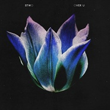 Over U](./albums/2102970147.md) | 英语 | HW&W | 2017年12月08日 | EP, 单曲 |  |
| [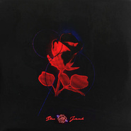 Neither Do I](./albums/2102876130.md) | 英语 | Ultra | 2017年10月20日 | EP, 单曲 |  |
| [ Stages](./albums/2102864470.md) | 英语 | Self-Released | 2017年08月07日 | EP, 单曲 |  |
| [ X (Stwo Remix)](./albums/2102651294.md) | 英语 | Self-Released | 2016年11月09日 | EP, 单曲 |  |
| [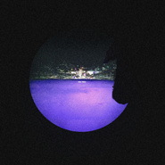 Overdue](./albums/2102404509.md) | 英语 | Self-Released | 2016年10月07日 | EP, 单曲 |  |
| [ D.T.S.N.T.](./albums/2100373581.md) | 英语 | HW&W Recordings | 2016年07月29日 | EP, 单曲 |  |
| [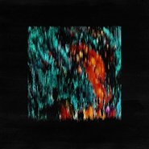 D.T.S.N.T. EP](./albums/2102937795.md) | 英语 | HW&W | 2016年07月29日 | 录音室专辑 | 电子 Electronic |
| [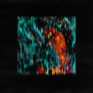 Out At Night](./albums/2100355391.md) | 英语 | HW&W Recordings, LLC | 2016年06月17日 | EP, 单曲 |  |
| [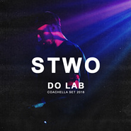 Do Lab Coachella Set 2016](./albums/2100323310.md) | 英语 | Self-Released | 2016年04月27日 | EP, 单曲 |  |
| [ Haunted](./albums/2100217056.md) | 英语 | HW&W Recordings | 2015年10月12日 | EP, 单曲 |  |
| [ Maybe (Stwo Remix)](./albums/2100198264.md) | 英语 | Self-Released | 2015年08月01日 | EP, 单曲 |  |
| [ Runnin' (Stwo Remix)](./albums/132025372.md) | 英语 | Self-Released | 2015年05月18日 | EP, 单曲 |  |
| [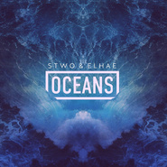 Oceans](./albums/724067448.md) | 英语 | Self-Released | 2015年02月12日 | EP, 单曲 |  |
| [ Her (Stwo Edit)](./albums/1821739440.md) | 英语 | Self-Released | 2014年10月28日 | EP, 单曲 |  |
| [ Drowning (Stwo Remix)](./albums/2014481759.md) | 英语 | Self-Released | 2014年10月21日 | EP, 单曲 |  |
| [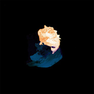 Untitled/Late](./albums/1237945134.md) | 英语 | Combien Mille Records | 2014年09月29日 | EP, 单曲 |  |
| [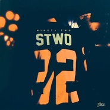 Ninety Two](./albums/514393104.md) | 英语 | Self-Released | 2014年09月25日 | 录音室专辑 |  |
| [ Aura](./albums/1708071341.md) | 英语 | Self-Released | 2014年08月13日 | EP, 单曲 |  |
| [ Blunt After Blunts (Stwo Flip)](./albums/1421736216.md) | 英语 | Self-Released | 2014年07月30日 | EP, 单曲 |  |
| [ Na Na (Stwo Remix)](./albums/220773980.md) | 英语 | Atlantic Records | 2014年05月15日 | EP, 单曲 |  |
| [ Middle Of Things, Beautiful Wife (Stwo Remix)](./albums/1715082971.md) | 英语 | Self-Released | 2014年04月01日 | EP, 单曲 |  |
| [ Or Nah (Stwo Edit)](./albums/521736205.md) | 英语 | Self-Released | 2014年02月25日 | EP, 单曲 |  |
| [ With Me (Stwo Edit)](./albums/1121736223.md) | 英语 | Self-Released | 2013年12月30日 | EP, 单曲 |  |
| [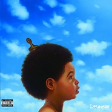 All Me (Stwo Remix)](./albums/121736233.md) | 英语 | Self-Released | 2013年12月25日 | EP, 单曲 |  |
| [ From Paris With Love](./albums/1829251097.md) | 英语 | Self-Released | 2013年12月08日 | 合集, 杂锦 |  |
| [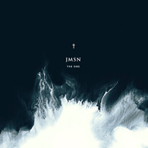 The One (Stwo Remix)](./albums/621736239.md) | 英语 | Self-Released | 2013年11月25日 | EP, 单曲 |  |
| [ Syrup](./albums/1211103110.md) | 英语 | HW&W Recordings | 2013年11月01日 | EP, 单曲 |  |
| [ Emmanuel (Stwo Remix)](./albums/928562310.md) | 英语 | Self-Released | 2013年10月10日 | EP, 单曲 |  |
| [ Virgo](./albums/1828565925.md) | 英语 | Self-Released | 2013年10月07日 | EP, 单曲 |  |
| [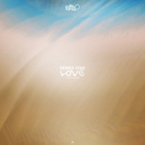 Love (Stwo Remix)](./albums/1229695090.md) | 英语 | Self-Released | 2013年09月17日 | EP, 单曲 |  |
| [ Liz](./albums/1929520373.md) | 英语 | HW&W Recordings | 2013年09月01日 | EP, 单曲 |  |
| [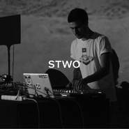 Stwo for SSENSE](./albums/1429251363.md) | 英语 | Self-Released | 2013年08月18日 | 合集, 杂锦 |  |
| [ If I Ruled The World (Stwo & Fitzroy Remix)](./albums/428559541.md) | 英语 | Self-Released | 2013年08月11日 | EP, 单曲 |  |
| [ Money Tree$](./albums/428560354.md) | 英语 | Self-Released | 2013年07月23日 | EP, 单曲 |  |
| [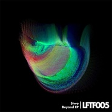 Beyond](./albums/1189343941.md) | 法语 | LiveForTheFunk | 2013年07月03日 | EP, 单曲 |  |
| [ You](./albums/129065647.md) | 英语 | Rochemusique | 2013年06月25日 | EP, 单曲 |  |
| [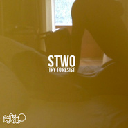 Try To Resist](./albums/1028559560.md) | 英语 | Self-Released | 2013年06月22日 | EP, 单曲 |  |
| [ Ride it (Stwo Remix)](./albums/1229519825.md) | 英语 | Self-Released | 2013年06月19日 | EP, 单曲 |  |
| [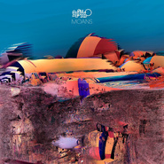 Moans](./albums/2029519772.md) | 英语 | Self-Released | 2013年06月14日 | EP, 单曲 |  |
| [ Wifey](./albums/1328560410.md) | 英语 | Self-Released | 2013年06月05日 | EP, 单曲 |  |
| [ One](./albums/428560653.md) | 英语 | Self-Released | 2013年04月24日 | EP, 单曲 |  |

## 评论

|  |  |  |  |
| :-- | :-- | :-- | :-- |
|  [虾米用户](https://emumo.xiami.com/u/46378692) If you come.... 2020-11-07 03:18 赞(0) 踩(0) | 
awww
 |
|  [虾米用户](https://emumo.xiami.com/u/230761831) rose,charm&l... 2020-06-17 06:46 赞(0) 踩(0) | 
每一首都是宝
 |
|  [虾米用户](https://emumo.xiami.com/u/439986447)  2020-06-14 01:51 赞(0) 踩(0) | 
封面很多大美女！   
 |
|  [虾米用户](https://emumo.xiami.com/u/356763773) 我还没想好要写什么... 2020-02-09 12:26 赞(0) 踩(0) | 
~
 |
|  [虾米用户](https://emumo.xiami.com/u/50625743) SO ROSÉ SO C... 2020-02-05 02:18 赞(0) 踩(0) | 
迟来的mark
 |
|  [虾米用户](https://emumo.xiami.com/u/340903899) 我还没想好要写什么... 2019-05-03 19:19 赞(0) 踩(0) | 
。
 |
|  [虾米用户](https://emumo.xiami.com/u/18467643) 末世飘零。 2019-04-23 07:09 赞(0) 踩(0) | 
洗脑的枫糖听不了了不开熏.·´¯`(&gt;▂&lt;)´¯`·.
 |
|  [虾米用户](https://emumo.xiami.com/u/1917251) Cest la vie 2019-01-18 12:16 赞(1) 踩(0) | 
Hi, will u come to Guangzhou or Shenzhen city?so exciting to looking forward ur performance in china
 |
|  [虾米用户](https://emumo.xiami.com/u/84571136) 唯有音乐不离不弃 2018-11-29 21:47 赞(0) 踩(0) | 
Stwo – You, World, or Myself (feat. Roy Woods)
 |
|  [虾米用户](https://emumo.xiami.com/u/7151428) 暖暖的～～ 2018-11-19 23:31 赞(0) 踩(0) | 

 |
|  [虾米用户](https://emumo.xiami.com/u/32440104) intégration 2018-09-29 23:12 赞(0) 踩(0) | 
je t'aime
 |
|  [虾米用户](https://emumo.xiami.com/u/55094882) ｉｄ９１ｏｍｏ＞Ｉ  2018-09-15 12:03 赞(0) 踩(0) | 
✨
 |
|  [虾米用户](https://emumo.xiami.com/u/285049473) 剛拿起酒杯想和你碰杯 才... 2018-08-13 14:45 赞(4) 踩(0) | 
上海為什麼這麼受寵？？？？
 |
|  [虾米用户](https://emumo.xiami.com/u/7702438) 我还没想好要写什么... 2018-07-15 04:54 赞(1) 踩(0) | 
哈哈哈昨晚见到啦
 |
|  [虾米用户](https://emumo.xiami.com/u/4453773) Sunnydong199... 2018-07-14 17:14 赞(1) 踩(0) | 
今晚见
 |
|  [虾米用户](https://emumo.xiami.com/u/5025241)  2018-07-14 13:11 赞(1) 踩(0) | 
来广州就好啦
 |
|  [虾米用户](https://emumo.xiami.com/u/13605496) Brand strate... 2018-07-10 15:24 赞(2) 踩(0) | 
绝对不容错过的Stwo即将于7月14日本周六来到中国巡演!关注discjockeysh了解预售详情, 在现场于狂热的人群中感受Stwo的音乐魅力吧!
 |
|  [虾米用户](https://emumo.xiami.com/u/571001)   2018-07-03 23:17 赞(0) 踩(0) | 
plz~come to guangzhou
 |
|  [虾米用户](https://emumo.xiami.com/u/44771731) ophelia_gu 2018-06-12 12:07 赞(4) 踩(0) | 
7/14上海见
 |
| ⇒ |  [虾米用户](https://emumo.xiami.com/u/1493697)  2018-07-02 02:04 赞(0) 踩(0) | 
请问哪里可以买票
 |
| ⇒ |  [虾米用户](https://emumo.xiami.com/u/44771731) ophelia_gu 2018-07-02 13:32 赞(0) 踩(0) | 
<q><b>臭不要脸小姑娘乐团说：</b></q>
 |
|  [虾米用户](https://emumo.xiami.com/u/53629425) 音乐主宰宇宙。❤ 2018-06-11 15:38 赞(2) 踩(0) | 
有颜有才有毒。
 |
|  [虾米用户](https://emumo.xiami.com/u/1265523) 及时行乐。 2018-05-06 23:53 赞(0) 踩(0) | 
perfect~
 |
|  [虾米用户](https://emumo.xiami.com/u/13605496) Brand strate... 2018-04-26 15:19 赞(4) 踩(0) | 
Stwo即将开始2018年7月在中国的演出, 详情可以公布请关注discjockeysh公众号的官方推送!
 |
| ⇒ |  [虾米用户](https://emumo.xiami.com/u/431488) u never know 2018-04-26 18:05 赞(0) 踩(0) | 
真的吗？
 |
| ⇒ |  [虾米用户](https://emumo.xiami.com/u/13605496) Brand strate... 2018-04-27 15:20 赞(0) 踩(0) | 
<q><b>红烧猪蹄加辣说：</b></q>
 |
| ⇒ |  [虾米用户](https://emumo.xiami.com/u/13605496) Brand strate... 2018-05-04 10:42 赞(0) 踩(0) | 
<q><b>红烧猪蹄加辣说：</b></q>
 |
|  [虾米用户](https://emumo.xiami.com/u/340461740) 我还没想好要写什么... 2018-04-16 22:21 赞(1) 踩(0) | 
Stwo 7月国内演出！官方正式公布请关注discjockeysh公众号！
 |
|  [虾米用户](https://emumo.xiami.com/u/55552179) 没有电影和音乐的话该怎么... 2018-03-31 21:42 赞(0) 踩(0) | 
赞的
 |
|  [虾米用户](https://emumo.xiami.com/u/22444238) 邱比官方虾米 2017-12-21 16:40 赞(1) 踩(0) | 
Get
 |
|  [虾米用户](https://emumo.xiami.com/u/50642130) 很软 2017-11-02 10:59 赞(0) 踩(0) | 
cute
 |
|  [虾米用户](https://emumo.xiami.com/u/50677231) 听力受损 2017-10-25 21:09 赞(0) 踩(0) | 

 |
|  [虾米用户](https://emumo.xiami.com/u/84571136) 唯有音乐不离不弃 2017-10-19 23:28 赞(0) 踩(0) | 
Stwo – Neither Do I (feat. Jeremih)
 |
|  [虾米用户](https://emumo.xiami.com/u/1195129) 他人就是魔鬼。 2017-10-01 23:04 赞(0) 踩(0) | 
这人可以。
 |
|  [虾米用户](https://emumo.xiami.com/u/5577839) ☯☯☯ 2017-09-17 15:30 赞(3) 踩(0) | 
飞飞飞到处飞 飞飞岛上吃屎
 |
| ⇒ |  [虾米用户](https://emumo.xiami.com/u/111860398)  2017-10-17 01:22 赞(0) 踩(0) | 
月还真是
 |
|  [虾米用户](https://emumo.xiami.com/u/2418238) weibo: @尤米口 2017-09-13 14:52 赞(0) 踩(0) | 
补
 |
|  [虾米用户](https://emumo.xiami.com/u/46758368)   2017-09-10 09:04 赞(0) 踩(0) | 
啊司徒
 |
|  [虾米用户](https://emumo.xiami.com/u/201391232) 最快的方法是先抱抱 2017-09-08 22:53 赞(0) 踩(0) | 
彡
 |
|  [虾米用户](https://emumo.xiami.com/u/106143852)   2017-08-13 21:41 赞(0) 踩(0) | 
听不腻的哦
 |
|  [虾米用户](https://emumo.xiami.com/u/36476884) ~~~ 2017-07-23 12:03 赞(3) 踩(0) | 
我以为stwo几个字是印在他帽子上的&amp;hellip;
 |
| ⇒ |  [虾米用户](https://emumo.xiami.com/u/272976950) You are a mi... 2017-08-22 12:22 赞(0) 踩(0) | 
哈哈哈哈，确实&amp;hellip;&amp;hellip;
 |
|  [虾米用户](https://emumo.xiami.com/u/43661451) 熊爱着狐狸 2017-05-21 00:09 赞(0) 踩(0) | 
Stwo  France 法国
 |
|  [虾米用户](https://emumo.xiami.com/u/47967303) 这家伙很聪明 什么也不想... 2017-05-17 04:20 赞(0) 踩(0) | 
都好听
 |
|  [虾米用户](https://emumo.xiami.com/u/238433062) 我没有志愿，也没有事情好... 2017-05-05 15:08 赞(0) 踩(0) | 

 |
|  [虾米用户](https://emumo.xiami.com/u/45052758) 我还没想好要写什么... 2017-04-22 23:19 赞(0) 踩(0) | 
[带墨镜笑]
 |
|  [虾米用户](https://emumo.xiami.com/u/91372642) 不開心就不好看了 2017-04-21 01:02 赞(0) 踩(0) | 
x
 |
|  [虾米用户](https://emumo.xiami.com/u/245304136) 永远爱您 2017-03-27 23:05 赞(0) 踩(0) | 
s2
 |
|  [虾米用户](https://emumo.xiami.com/u/54537050) 我还没想好要写什么... 2017-03-27 02:37 赞(0) 踩(0) | 
☁
 |
|  [虾米用户](https://emumo.xiami.com/u/156056836) 我还没想好要写什么... 2017-03-20 16:54 赞(0) 踩(0) | 
A/
 |
|  [虾米用户](https://emumo.xiami.com/u/8874295) 我还没想好要写什么... 2017-03-18 22:37 赞(0) 踩(0) | 
god
 |
|  [虾米用户](https://emumo.xiami.com/u/50208725) 不是所有歌曲都叫音乐 2017-03-18 00:37 赞(1) 踩(0) | 
升天了
 |
|  [虾米用户](https://emumo.xiami.com/u/17146554) weibo：@L1RRO... 2017-03-13 16:31 赞(0) 踩(0) | 
ᴚ
 |
|  [虾米用户](https://emumo.xiami.com/u/52034644) 身体会跳舞 2017-03-11 22:57 赞(0) 踩(0) | 
好舒服啊
 |
|  [虾米用户](https://emumo.xiami.com/u/6076438) 起身見頭暈，行路打倒褪。... 2017-03-07 03:20 赞(0) 踩(0) | 
| &amp;deg;_*）&amp;hellip;!
 |
|  [虾米用户](https://emumo.xiami.com/u/264283064) bye  2017-03-06 15:28 赞(0) 踩(0) | 
△
 |
|  [虾米用户](https://emumo.xiami.com/u/33552517) 偏好、 2017-03-01 11:07 赞(0) 踩(0) | 
〰
 |
|  [虾米用户](https://emumo.xiami.com/u/8874295) 我还没想好要写什么... 2017-02-24 20:23 赞(0) 踩(0) | 
每一首都不会出错～
 |
|  [虾米用户](https://emumo.xiami.com/u/30617820) 窝列大窝列大哟 2017-02-02 02:03 赞(0) 踩(0) | 
|ω・）
 |
|  [虾米用户](https://emumo.xiami.com/u/3338260) 网易云ID 荼靡姐 欢迎... 2017-01-26 11:18 赞(0) 踩(0) | 
喜欢
 |
|  [虾米用户](https://emumo.xiami.com/u/2318360) 沉浸在每一秒的惊喜里 2017-01-22 15:02 赞(0) 踩(0) | 
死兔！
 |
|  [虾米用户](https://emumo.xiami.com/u/41163024) I’m done. 2017-01-16 19:56 赞(0) 踩(0) | 
。
 |
|  [虾米用户](https://emumo.xiami.com/u/33457836)   2016-12-26 17:05 赞(0) 踩(0) | 
-
 |
|  [虾米用户](https://emumo.xiami.com/u/1681722) 虾米不要关 2016-12-26 15:11 赞(2) 踩(0) | 
好啊，可以跳脱出FKJ了，移情别恋一阵子～
 |
|  [虾米用户](https://emumo.xiami.com/u/29682762) 网易云：滑滑的_ 2016-12-14 16:12 赞(0) 踩(0) | 
迷人
 |
|  [虾米用户](https://emumo.xiami.com/u/18412060) v15175288880 2016-11-30 22:25 赞(0) 踩(0) | 
.
 |
|  [虾米用户](https://emumo.xiami.com/u/8874295) 我还没想好要写什么... 2016-11-11 22:14 赞(0) 踩(0) | 
妈呀惊艳
 |
|  [虾米用户](https://emumo.xiami.com/u/35261672) Brand New Da... 2016-11-10 15:16 赞(0) 踩(0) | 
电音怪咖
 |
|  [虾米用户](https://emumo.xiami.com/u/9028760) 豆瓣见 spotify ... 2016-10-30 21:56 赞(0) 踩(0) | 
☹️
 |
|  [虾米用户](https://emumo.xiami.com/u/33310780) ！ 2016-10-11 11:19 赞(0) 踩(0) | 
!!
 |
|  [虾米用户](https://emumo.xiami.com/u/1998710) 我还没想好要写什么... 2016-09-25 21:58 赞(0) 踩(0) | 
浓浓的小阿味扑面而来
 |
|  [虾米用户](https://emumo.xiami.com/u/8402567) 再见 2016-09-21 23:55 赞(0) 踩(0) | 
今天遇到你
 |
|  [虾米用户](https://emumo.xiami.com/u/4461490) 烟酒伤身，情歌伤心 2016-08-11 08:41 赞(1) 踩(0) | 
如果非要用几首歌帮助理解I&amp;#039;m a big big girl in a big big world这句歌词
 |
|  [虾米用户](https://emumo.xiami.com/u/527459) @4ART 2016-08-10 20:00 赞(0) 踩(0) | 
| | | |
 |
|  [虾米用户](https://emumo.xiami.com/u/43547593) ♡ 2016-08-10 17:46 赞(0) 踩(0) | 
⅋
 |
|  [虾米用户](https://emumo.xiami.com/u/10825322) @Bside1 2016-08-09 11:24 赞(1) 踩(0) | 
好了已经买好票了stwo现场见
 |
| ⇒ |  [虾米用户](https://emumo.xiami.com/u/1245622) 还是觉得虾米的界面是最好... 2016-09-18 11:40 赞(0) 踩(0) | 
哪裡哇
 |
|  [虾米用户](https://emumo.xiami.com/u/204905637)   2016-08-03 11:10 赞(0) 踩(0) | 
SWED
 |
|  [虾米用户](https://emumo.xiami.com/u/3117182)  2016-07-31 12:40 赞(0) 踩(0) | 
NB smooth
 |
|  [虾米用户](https://emumo.xiami.com/u/13521200)  2016-07-23 16:56 赞(0) 踩(0) | 
莫名想的波哥
 |
|  [虾米用户](https://emumo.xiami.com/u/25962841) Y.Q.S.Y. 2016-07-13 13:56 赞(0) 踩(0) | 
6
 |
|  [虾米用户](https://emumo.xiami.com/u/38663581) see you 2016-07-03 00:09 赞(1) 踩(0) | 
克莱汤普森
 |
|  [虾米用户](https://emumo.xiami.com/u/85148548)  2016-06-22 14:57 赞(0) 踩(0) | 
嘻嘻
 |
|  [虾米用户](https://emumo.xiami.com/u/7951384) 我还没想好要写什么... 2016-06-22 00:01 赞(0) 踩(0) | 

 |
|  [虾米用户](https://emumo.xiami.com/u/181373636)  2016-06-19 15:54 赞(0) 踩(0) | 
就是喜欢
 |
|  [虾米用户](https://emumo.xiami.com/u/3169172)  2016-06-18 19:25 赞(0) 踩(0) | 
喜欢！
 |
|  [虾米用户](https://emumo.xiami.com/u/55927628)   2016-06-18 08:56 赞(0) 踩(0) | 
挺有意思的
 |
|  [虾米用户](https://emumo.xiami.com/u/12554850) ///404  Weib... 2016-06-07 00:39 赞(0) 踩(0) | 
☽
 |
|  [虾米用户](https://emumo.xiami.com/u/37142551) ᴍᴀᴋᴇ ᴀʀᴛ ɴᴏᴛ... 2016-06-04 18:19 赞(0) 踩(0) | 

 |
|  [虾米用户](https://emumo.xiami.com/u/8937401)  2016-05-24 03:39 赞(0) 踩(0) | 
燃热烧骚  
 |
|  [虾米用户](https://emumo.xiami.com/u/8497548) 看不见的盲肠炎 2016-05-20 15:28 赞(0) 踩(0) | 
+
 |
|  [虾米用户](https://emumo.xiami.com/u/53055402)   2016-05-03 12:52 赞(0) 踩(0) | 
感谢推歌的朋友
 |
|  [虾米用户](https://emumo.xiami.com/u/47529778) 我爱我自己 2016-04-27 11:53 赞(0) 踩(0) | 
图十五是被冷落了吗
 |
| ⇒ |  [虾米用户](https://emumo.xiami.com/u/10613989) 唯有音乐安抚我 2016-04-28 14:49 赞(0) 踩(0) | 
hh  男朋友结婚了 新娘却不是我
 |
|  [虾米用户](https://emumo.xiami.com/u/15971712)   2016-04-26 21:21 赞(0) 踩(0) | 
Oceans每天都得听
 |
|  [虾米用户](https://emumo.xiami.com/u/27719153) 生不顺 2016-04-25 08:46 赞(0) 踩(0) | 
比大热的fkj更得我心
 |
| ⇒ |  [虾米用户](https://emumo.xiami.com/u/13146778) 再没遇到过听歌对盘的人 2017-09-19 13:27 赞(0) 踩(0) | 
人家比fkj&amp;hellip;&amp;hellip;红的早 只是你不知道
 |
|  [虾米用户](https://emumo.xiami.com/u/135485040)   2016-04-22 01:46 赞(0) 踩(0) | 
Soundcloud: IK3NNA
 |
|  [虾米用户](https://emumo.xiami.com/u/61298574) 难解风情 2016-04-19 21:26 赞(0) 踩(0) | 
  
 |
|  [虾米用户](https://emumo.xiami.com/u/50792813) 爱你 虾米 2016-04-18 00:37 赞(0) 踩(0) | 
一向喜欢remix
 |
|  [虾米用户](https://emumo.xiami.com/u/48574824) 在注定失败的事业里，我觉... 2016-04-16 16:36 赞(0) 踩(0) | 
除了syrup能听
 |
|  [虾米用户](https://emumo.xiami.com/u/22881143) ㅤㅤㅤㅤ 2016-04-12 19:16 赞(1) 踩(0) | 
换头像了脸长了
 |
| ⇒ |  [虾米用户](https://emumo.xiami.com/u/9028760) 豆瓣见 spotify ... 2016-05-02 02:57 赞(0) 踩(0) | 
鼻子也显得更长了⚗
 |
|  [虾米用户](https://emumo.xiami.com/u/9410208)  2016-04-08 23:57 赞(0) 踩(0) | 
起飞
 |
|  [虾米用户](https://emumo.xiami.com/u/45298985) Wechat:dqx19... 2016-04-07 22:31 赞(0) 踩(0) | 
+
 |
|  [虾米用户](https://emumo.xiami.com/u/51739101)   2016-04-06 05:41 赞(0) 踩(0) | 

 |
|  [虾米用户](https://emumo.xiami.com/u/35580409) 对你不感兴趣 2016-03-27 22:38 赞(0) 踩(0) | 
我的人
 |
| ⇒ |  [虾米用户](https://emumo.xiami.com/u/13901273)  2016-04-01 16:44 赞(0) 踩(0) | 
明明是我的！
 |
|  [虾米用户](https://emumo.xiami.com/u/61298574) 难解风情 2016-03-26 18:33 赞(0) 踩(0) | 
风格好赞
 |
|  [虾米用户](https://emumo.xiami.com/u/91372642) 不開心就不好看了 2016-03-19 19:30 赞(0) 踩(0) | 

 |
|  [虾米用户](https://emumo.xiami.com/u/51920272) 再见。。 2016-03-19 18:30 赞(0) 踩(0) | 
。
 |
|  [虾米用户](https://emumo.xiami.com/u/38605114) ;(; 2016-03-02 13:05 赞(0) 踩(0) | 
Back
 |
|  [虾米用户](https://emumo.xiami.com/u/50033816) 谢谢各位虾米的朋友，我的... 2016-02-21 21:34 赞(0) 踩(0) | 
hi
 |
|  [虾米用户](https://emumo.xiami.com/u/9513422) 虾米歌单迁徙到网易☁️:... 2016-02-20 11:02 赞(0) 踩(0) | 
OBEY
 |
|  [虾米用户](https://emumo.xiami.com/u/9028760) 豆瓣见 spotify ... 2016-02-19 20:26 赞(2) 踩(0) | 
☄
 |
|  [虾米用户](https://emumo.xiami.com/u/44131863) 一个在纽约的沈阳人 2016-02-13 14:34 赞(0) 踩(0) | 
最爱stwo
 |
|  [虾米用户](https://emumo.xiami.com/u/68577338) 思君如思乡 2016-02-07 09:11 赞(0) 踩(0) | 
炸
 |
|  [虾米用户](https://emumo.xiami.com/u/52127742) 呼。啦啦啦，啦啦啦， 2016-02-06 11:56 赞(0) 踩(0) | 

 |
|  [虾米用户](https://emumo.xiami.com/u/42661055) ✨ 2016-02-03 11:31 赞(0) 踩(0) | 
❁
 |
|  [虾米用户](https://emumo.xiami.com/u/15345747)   2016-01-30 03:15 赞(0) 踩(0) | 
赞
 |
|  [虾米用户](https://emumo.xiami.com/u/76009326) bye 2016-01-30 00:29 赞(4) 踩(0) | 
什麼時候rollsth变得这么值得炫耀了
 |
|  [虾米用户](https://emumo.xiami.com/u/4087806) 爸爸差点信了你的鬼话 2016-01-22 16:50 赞(0) 踩(0) | 
路子野
 |
|  [虾米用户](https://emumo.xiami.com/u/46693645) 不要学啃泥迪亚装酷在巷口... 2016-01-17 15:09 赞(0) 踩(0) | 
最喜欢stwo 和 fkj
 |
|  [虾米用户](https://emumo.xiami.com/u/100760382) Ho Ho Ha Ha 2016-01-17 05:52 赞(0) 踩(0) | 

 |
|  [虾米用户](https://emumo.xiami.com/u/16396509)  2016-01-14 19:31 赞(0) 踩(0) | 
补
 |
|  [虾米用户](https://emumo.xiami.com/u/989288) Got flow! 2016-01-07 19:47 赞(0) 踩(0) | 
Just chillin
 |
|  [虾米用户](https://emumo.xiami.com/u/989288) Got flow! 2016-01-07 19:46 赞(0) 踩(0) | 
Just chill
 |
|  [虾米用户](https://emumo.xiami.com/u/989288) Got flow! 2016-01-07 19:46 赞(0) 踩(0) | 
Chillax
 |
|  [虾米用户](https://emumo.xiami.com/u/44261599) 想好了 也不写 2016-01-06 14:17 赞(0) 踩(0) | 
 
 |
|  [虾米用户](https://emumo.xiami.com/u/50869110) IG：77richiee... 2016-01-04 23:40 赞(0) 踩(0) | 
•
 |
|  [虾米用户](https://emumo.xiami.com/u/12663675) 美人不是母胎生 2016-01-04 11:24 赞(0) 踩(0) | 

 |
|  [虾米用户](https://emumo.xiami.com/u/43333155) 我还没想好要写什么... 2015-12-28 19:54 赞(0) 踩(0) | 

 |
|  [虾米用户](https://emumo.xiami.com/u/43331756) Shoot the po... 2015-12-21 12:23 赞(0) 踩(0) | 

 |
|  [虾米用户](https://emumo.xiami.com/u/10654694) =_= 2015-12-19 15:47 赞(0) 踩(0) | 
~
 |
|  [虾米用户](https://emumo.xiami.com/u/6815911) 我还没想好要写什么... 2015-12-17 15:53 赞(0) 踩(0) | 
感觉有点听腻了。。。。。。。。。。。。。。。。。。。。。。怎么办。。。。。！。！。！。
 |
|  [虾米用户](https://emumo.xiami.com/u/44858319) 永远是我最爱的虾米 2015-12-14 15:30 赞(0) 踩(0) | 
没有哪首不好听系列
 |
|  [虾米用户](https://emumo.xiami.com/u/11134650) . 2015-12-13 15:15 赞(0) 踩(0) | 
ᐒ
 |
|  [虾米用户](https://emumo.xiami.com/u/42345199) - 2015-12-13 02:30 赞(0) 踩(0) | 
所有歌听了一遍 我飘了
 |
|  [虾米用户](https://emumo.xiami.com/u/45485152) Wubba lubba ... 2015-12-10 00:57 赞(2) 踩(0) | 
只为在虾米中多看你一眼
 |
|  [虾米用户](https://emumo.xiami.com/u/49492050) 中国电子音乐独立厂牌 2015-12-09 02:37 赞(0) 踩(0) | 
√
 |
|  [虾米用户](https://emumo.xiami.com/u/21164070) 一沙一世界 一花一天堂 ... 2015-12-03 23:45 赞(0) 踩(0) | 
发现
 |
|  [虾米用户](https://emumo.xiami.com/u/7994519) +++++ 2015-11-28 03:01 赞(0) 踩(0) | 
补留
 |
|  [虾米用户](https://emumo.xiami.com/u/33381539) 你干嘛看我。？ 2015-11-26 20:52 赞(0) 踩(0) | 
✔✔✔✔✔
 |
|  [虾米用户](https://emumo.xiami.com/u/50834283) 这一定是地狱 2015-11-25 06:48 赞(0) 踩(0) | 
Ｏooh
 |
|  [虾米用户](https://emumo.xiami.com/u/7562948) HOT SUGAR CO... 2015-11-21 22:15 赞(0) 踩(0) | 
10:15
 |
|  [虾米用户](https://emumo.xiami.com/u/38740454) RPG 2015-11-19 00:30 赞(1) 踩(0) | 
Haunted居然没版权好听的很啊！！
 |
|  [虾米用户](https://emumo.xiami.com/u/47224587)  2015-11-18 15:55 赞(0) 踩(0) | 
JUST CHILL
 |
|  [虾米用户](https://emumo.xiami.com/u/41163024) I’m done. 2015-11-08 22:38 赞(0) 踩(0) | 
咦
 |
|  [虾米用户](https://emumo.xiami.com/u/49994994) . 2015-11-07 04:01 赞(0) 踩(0) | 
炸炸炸
 |
|  [虾米用户](https://emumo.xiami.com/u/33457836)   2015-11-06 18:08 赞(0) 踩(0) | 
-
 |
|  [虾米用户](https://emumo.xiami.com/u/49298164) 我还没想好要写什么... 2015-11-05 02:38 赞(0) 踩(0) | 

 |
|  [虾米用户](https://emumo.xiami.com/u/45982699) ✈ 2015-11-01 09:30 赞(0) 踩(0) | 
这个人的风格好赞
 |
|  [虾米用户](https://emumo.xiami.com/u/21874) 我是少年酒坛子。 2015-10-29 01:20 赞(0) 踩(0) | 
Late 很赞
 |
|  [虾米用户](https://emumo.xiami.com/u/12310229)  2015-10-28 20:40 赞(1) 踩(0) | 
。
 |
|  [虾米用户](https://emumo.xiami.com/u/43153617) 我还没想好要写什么... 2015-10-28 02:03 赞(0) 踩(0) | 
::
 |
|  [虾米用户](https://emumo.xiami.com/u/8070377) 爱雾瑞性维欧腐漏 2015-10-25 10:48 赞(1) 踩(0) | 
比脸哥长得文艺 不过和脸哥真是挺神似
 |
|  [虾米用户](https://emumo.xiami.com/u/8070377) 爱雾瑞性维欧腐漏 2015-10-25 10:46 赞(1) 踩(0) | 
没翻到自己不开熏
 |
|  [虾米用户](https://emumo.xiami.com/u/42345199) - 2015-10-18 03:05 赞(0) 踩(0) | 
风格大爱
 |
|  [虾米用户](https://emumo.xiami.com/u/49714239) Totally happ... 2015-10-15 18:16 赞(0) 踩(0) | 
吊
 |
|  [虾米用户](https://emumo.xiami.com/u/13911932) 暂冇签名~ 2015-10-14 22:22 赞(0) 踩(0) | 
好听
 |
|  [虾米用户](https://emumo.xiami.com/u/48621783) 微信联系 Sacred-... 2015-10-12 15:06 赞(0) 踩(0) | 
补√
 |
|  [虾米用户](https://emumo.xiami.com/u/11893543) と·む 2015-10-12 12:24 赞(0) 踩(0) | 
来
 |
|  [虾米用户](https://emumo.xiami.com/u/10890264) (⁎⁍̴̛ᴗ⁍̴̛⁎) 2015-10-11 19:30 赞(0) 踩(0) | 
飞吧！！
 |
|  [虾米用户](https://emumo.xiami.com/u/108363) 不捨蝦米的一切 有意wx... 2015-10-09 15:42 赞(0) 踩(0) | 
有才
 |
|  [虾米用户](https://emumo.xiami.com/u/763459) (๑•̀ㅁ•́ฅ)嗷呜 2015-10-05 16:46 赞(1) 踩(0) | 
SW
 |
|  [虾米用户](https://emumo.xiami.com/u/43871649) 暂无签名~ 2015-09-29 22:58 赞(0) 踩(0) | 
帅
 |
|  [虾米用户](https://emumo.xiami.com/u/22456876) 失眠是因为睡前戴上了耳机 2015-09-23 00:42 赞(0) 踩(0) | 
维持 2
 |
|  [虾米用户](https://emumo.xiami.com/u/44118515) 保持距离 2015-09-18 15:54 赞(0) 踩(0) | 

 |
|  [虾米用户](https://emumo.xiami.com/u/6683633)  2015-09-17 12:49 赞(0) 踩(0) | 
oooooooooooooooooooooooooo
 |
|  [虾米用户](https://emumo.xiami.com/u/42810132) Aprés l'amou... 2015-09-17 12:25 赞(0) 踩(0) | 
何厚铧
 |
|  [虾米用户](https://emumo.xiami.com/u/28946659)   2015-09-16 19:28 赞(0) 踩(0) | 

 |
|  [虾米用户](https://emumo.xiami.com/u/6217931) 电子音乐制作人 2015-09-14 14:17 赞(0) 踩(0) | 
.
 |
|  [虾米用户](https://emumo.xiami.com/u/31365764) 7就 2015-09-12 21:46 赞(0) 踩(0) | 
我也想买一件obey
 |
|  [虾米用户](https://emumo.xiami.com/u/54592653)  2015-09-05 17:17 赞(0) 踩(0) | 
yooo
 |
|  [虾米用户](https://emumo.xiami.com/u/10626404) 何以共存 2015-08-28 23:10 赞(0) 踩(0) | 
乍一看以为是赫迪拉
 |
|  [虾米用户](https://emumo.xiami.com/u/23361931) 想念是会蛋疼的痛。 2015-08-26 16:15 赞(0) 踩(0) | 
:)
 |
|  [虾米用户](https://emumo.xiami.com/u/30541214) 只能听见自己的心跳 2015-08-24 14:44 赞(0) 踩(0) | 

 |
|  [虾米用户](https://emumo.xiami.com/u/15407921) 签Pp 2015-08-24 11:42 赞(0) 踩(0) | 
法国入袋!
 |
|  [虾米用户](https://emumo.xiami.com/u/51618444) 已删 2015-08-23 16:38 赞(0) 踩(0) | 
可以
 |
|  [虾米用户](https://emumo.xiami.com/u/43197595)   2015-08-23 03:41 赞(0) 踩(0) | 
!
 |
|  [虾米用户](https://emumo.xiami.com/u/24467916) 爱丽丝永远住在这里 2015-08-22 17:04 赞(1) 踩(0) | 
这艺术家这么帅 上天给他的太多了啊 音乐才华也非凡
 |
|  [虾米用户](https://emumo.xiami.com/u/16070084)   2015-08-16 18:53 赞(0) 踩(0) | 

 |
|  [虾米用户](https://emumo.xiami.com/u/2727096) 你来了 2015-08-16 03:00 赞(0) 踩(0) | 
chill+爆珠 
 |
|  [虾米用户](https://emumo.xiami.com/u/50390164) 悄然而至 2015-08-15 14:37 赞(1) 踩(0) | 
巴黎帅哥
 |
|  [虾米用户](https://emumo.xiami.com/u/25980005) 情不知所起，一往而深 2015-08-12 11:07 赞(0) 踩(0) | 
出水芙蓉
 |
|  [虾米用户](https://emumo.xiami.com/u/5061480) 一片素心 三分侠气 2015-08-11 23:11 赞(0) 踩(0) | 
嗲透！
 |
|  [虾米用户](https://emumo.xiami.com/u/35185823) 真是不客气，什么也没留下 2015-08-08 12:03 赞(1) 踩(0) | 
喜欢
 |
|  [虾米用户](https://emumo.xiami.com/u/33043895) stay pure 2015-08-07 15:01 赞(0) 踩(0) | 
太棒，用来跳舞
 |
|  [虾米用户](https://emumo.xiami.com/u/43628487)   2015-08-06 11:03 赞(0) 踩(0) | 

 |
|  [虾米用户](https://emumo.xiami.com/u/18412060) v15175288880 2015-08-04 19:41 赞(1) 踩(0) | 
nice
 |
|  [虾米用户](https://emumo.xiami.com/u/35714790)  2015-07-27 16:17 赞(2) 踩(0) | 
优衣库（´-`）.｡oO/。・゜・・゜・。
 |
|  [虾米用户](https://emumo.xiami.com/u/14539607) weibo：PeachM... 2015-07-25 23:06 赞(0) 踩(0) | 
✞
 |
|  [虾米用户](https://emumo.xiami.com/u/42695089) vb：吴浣甜甜 2015-07-24 02:58 赞(2) 踩(0) | 
。
 |
|  [虾米用户](https://emumo.xiami.com/u/41859773) 我听的都不好听 2015-07-23 14:11 赞(1) 踩(0) | 
今天去他facebook里把视频都撸了一遍，过瘾
 |
| ⇒ |  [虾米用户](https://emumo.xiami.com/u/34479752) 黄贤哲Keyz 2016-02-05 02:46 赞(0) 踩(0) | 
他的Facebook ID是多少
 |
| ⇒ |  [虾米用户](https://emumo.xiami.com/u/41859773) 我听的都不好听 2016-02-05 09:44 赞(0) 踩(0) | 
<q><b>黄贤哲Keyz说：</b></q>
 |
|  [虾米用户](https://emumo.xiami.com/u/2636529)  2015-07-21 01:11 赞(1) 踩(0) | 
chill out
 |
|  [虾米用户](https://emumo.xiami.com/u/1325368)  2015-07-18 21:01 赞(0) 踩(0) | 
Oceans前奏真动听！
 |
|  [虾米用户](https://emumo.xiami.com/u/11646383) time fly 2015-07-18 03:51 赞(0) 踩(0) | 
nice
 |
|  [虾米用户](https://emumo.xiami.com/u/1507166) Power&Freedo... 2015-07-11 16:20 赞(0) 踩(0) | 
diggin'
 |
|  [虾米用户](https://emumo.xiami.com/u/33717830) 天生神经质 & 2015-07-10 23:21 赞(0) 踩(0) | 
哎呦不错
 |
|  [虾米用户](https://emumo.xiami.com/u/3003639)  2015-07-07 18:30 赞(0) 踩(0) | 
飞的很
 |
|  [虾米用户](https://emumo.xiami.com/u/39788841)  . 2015-07-06 22:31 赞(0) 踩(0) | 
Lium
 |
|  [虾米用户](https://emumo.xiami.com/u/21226958) 我爱 2015-07-05 23:21 赞(0) 踩(0) | 
美
 |
|  [虾米用户](https://emumo.xiami.com/u/49232623) 抠耳大汉 2015-07-05 15:50 赞(0) 踩(0) | 

 |
|  [虾米用户](https://emumo.xiami.com/u/13814776) 我是我自己的神:) 2015-07-05 02:23 赞(0) 踩(0) | 

 |
|  [虾米用户](https://emumo.xiami.com/u/10472204) moma ps1!!!! 2015-07-04 16:16 赞(0) 踩(0) | 

 |
|  [虾米用户](https://emumo.xiami.com/u/13960111)  2015-06-29 13:56 赞(0) 踩(0) | 
好好听，哦耶
 |
| ⇒ |  [虾米用户](https://emumo.xiami.com/u/44688314) 我再也不会像从前 2015-07-16 13:48 赞(0) 踩(0) | 
哈哈 居然看见你评了
 |
| ⇒ |  [虾米用户](https://emumo.xiami.com/u/13960111)  2015-07-16 13:51 赞(0) 踩(0) | 
<q><b>Peace说：</b></q>
 |
|  [虾米用户](https://emumo.xiami.com/u/37119021) 出售平价燃料 weed 2015-06-27 23:52 赞(0) 踩(0) | 
此时怎么能没有燃料呢？
 |
|  [虾米用户](https://emumo.xiami.com/u/1019822) Weibo:传琦SAMA... 2015-06-26 22:09 赞(0) 踩(0) | 
司徒
 |
|  [虾米用户](https://emumo.xiami.com/u/38640339) 我想好写什么了…… 2015-06-26 09:24 赞(0) 踩(0) | 

 |
|  [虾米用户](https://emumo.xiami.com/u/280791) @愚細胞 2015-06-22 21:51 赞(0) 踩(0) | 
骚
 |
|  [虾米用户](https://emumo.xiami.com/u/42879874) born to lost 2015-06-22 13:25 赞(0) 踩(0) | 
✘
 |
|  [虾米用户](https://emumo.xiami.com/u/4767487)  2015-06-21 02:13 赞(19) 踩(0) | 
一向讨厌任何remix 直到听到他
 |
|  [虾米用户](https://emumo.xiami.com/u/31039410) ______∅_____... 2015-06-19 21:18 赞(0) 踩(0) | 
◎
 |
|  [虾米用户](https://emumo.xiami.com/u/29197411) 我还没想好要写什么... 2015-06-18 15:59 赞(0) 踩(0) | 
hjerht
 |
|  [虾米用户](https://emumo.xiami.com/u/5490437) 女士优先 2015-06-16 22:57 赞(0) 踩(0) | 
听s2必须要飞一根儿
 |
|  [虾米用户](https://emumo.xiami.com/u/5490437) 女士优先 2015-06-16 22:56 赞(0) 踩(0) | 
;:
 |
|  [虾米用户](https://emumo.xiami.com/u/28305547) Freedøm 2015-06-14 22:32 赞(1) 踩(0) | 
不行我要再刷一遍，太，他，妈，叼，炸，了
 |
|  [虾米用户](https://emumo.xiami.com/u/28305547) Freedøm 2015-06-14 22:29 赞(0) 踩(0) | 
叼炸
 |
|  [虾米用户](https://emumo.xiami.com/u/6488096) don't think ... 2015-06-13 09:02 赞(0) 踩(0) | 
啊哦～
 |
|  [虾米用户](https://emumo.xiami.com/u/4372646) 可爱又迷人的正派角色IG... 2015-06-08 22:34 赞(1) 踩(0) | 
。
 |
|  [虾米用户](https://emumo.xiami.com/u/8810356) 我还没想好要写什么... 2015-06-08 01:10 赞(0) 踩(0) | 
new soul
 |
|  [虾米用户](https://emumo.xiami.com/u/6500137)  2015-06-06 16:39 赞(0) 踩(0) | 
~
 |
|  [虾米用户](https://emumo.xiami.com/u/11858778) 该二的时候绝对不三 热情... 2015-06-05 23:08 赞(0) 踩(0) | 
〰
 |
|  [虾米用户](https://emumo.xiami.com/u/38640339) 我想好写什么了…… 2015-06-01 10:03 赞(0) 踩(0) | 

 |
|  [虾米用户](https://emumo.xiami.com/u/45196922)   2015-05-29 11:15 赞(0) 踩(0) | 
So damn good
 |
|  [虾米用户](https://emumo.xiami.com/u/4730510) 网易云：四月迷情_ 2015-05-27 16:06 赞(0) 踩(0) | 
每一首都爱，爱死，  
 |
|  [虾米用户](https://emumo.xiami.com/u/38640339) 我想好写什么了…… 2015-05-26 18:58 赞(0) 踩(0) | 

 |
|  [虾米用户](https://emumo.xiami.com/u/49845996) 我还没想好要写什么... 2015-05-22 06:28 赞(0) 踩(0) | 
➕
 |
|  [虾米用户](https://emumo.xiami.com/u/49233546)   2015-05-16 15:35 赞(0) 踩(0) | 
舒服，节奏感不错
 |
|  [虾米用户](https://emumo.xiami.com/u/3208618) Pulsar.:  2015-05-12 03:53 赞(0) 踩(0) | 
Just drop that man
 |
|  [虾米用户](https://emumo.xiami.com/u/20862728) 柯男 2015-05-08 23:44 赞(1) 踩(0) | 
Stwo
 |
|  [虾米用户](https://emumo.xiami.com/u/3736882) 我还没想好要写什么... 2015-05-08 16:12 赞(0) 踩(0) | 
X
 |
|  [虾米用户](https://emumo.xiami.com/u/49528364) 应该没你酷 2015-05-06 22:54 赞(0) 踩(0) | 

 |
|  [虾米用户](https://emumo.xiami.com/u/42571042)   2015-05-02 17:32 赞(25) 踩(0) | 
来 roll一根 继续嗨
 |
|  [虾米用户](https://emumo.xiami.com/u/42725114) ThistheshitI... 2015-05-01 15:07 赞(0) 踩(0) | 

 |
|  [虾米用户](https://emumo.xiami.com/u/49492050) 中国电子音乐独立厂牌 2015-04-29 01:27 赞(0) 踩(0) | 

 |
|  [虾米用户](https://emumo.xiami.com/u/5699513) R 2015-04-26 14:20 赞(0) 踩(0) | 
q
 |
|  [虾米用户](https://emumo.xiami.com/u/6654069) mutherfacker... 2015-04-24 03:13 赞(1) 踩(0) | 
-
 |
|  [虾米用户](https://emumo.xiami.com/u/9334884) 我还没想好要写什么... 2015-04-22 01:04 赞(0) 踩(0) | 
✔️✔️✔️
 |
|  [虾米用户](https://emumo.xiami.com/u/33457836)   2015-04-18 10:03 赞(0) 踩(0) | 
-
 |
|  [虾米用户](https://emumo.xiami.com/u/31301791) 微博：惨绿乙女 2015-04-14 13:39 赞(0) 踩(0) | 
☯ awesome
 |
| ⇒ |  [虾米用户](https://emumo.xiami.com/u/425887) 有缘再见 2015-05-26 07:52 赞(0) 踩(0) | 
-
 |
|  [虾米用户](https://emumo.xiami.com/u/1507513) 介绍一下你自己 2015-04-14 05:38 赞(0) 踩(0) | 

 |
|  [虾米用户](https://emumo.xiami.com/u/31501246) weibo:RocheM... 2015-04-12 22:19 赞(0) 踩(0) | 
只有我觉得像吉诺比利吗2333
 |
| ⇒ |  [虾米用户](https://emumo.xiami.com/u/43462288) Joy may end ... 2015-04-13 12:50 赞(0) 踩(0) | 
看到你了
 |
|  [虾米用户](https://emumo.xiami.com/u/48669962)  2015-04-11 21:56 赞(0) 踩(0) | 
飞飞飞
 |
|  [虾米用户](https://emumo.xiami.com/u/35547923) Now u come 2015-04-03 18:03 赞(0) 踩(0) | 

 |
|  [虾米用户](https://emumo.xiami.com/u/2213055) 输入签名… 2015-04-02 16:11 赞(0) 踩(0) | 
这个号
 |
|  [虾米用户](https://emumo.xiami.com/u/5388521) 我还没想好要写什么... 2015-03-30 10:37 赞(0) 踩(0) | 
停不下来……
 |
|  [虾米用户](https://emumo.xiami.com/u/5388521) 我还没想好要写什么... 2015-03-30 10:37 赞(0) 踩(0) | 
停不下来……
 |
|  [虾米用户](https://emumo.xiami.com/u/44804041) Te deseo un ... 2015-03-25 13:56 赞(0) 踩(0) | 
飞飞飞
 |
|  [虾米用户](https://emumo.xiami.com/u/15830004) 我还没想好要写什么... 2015-03-17 15:51 赞(0) 踩(0) | 
dope
 |
|  [虾米用户](https://emumo.xiami.com/u/39788841)  . 2015-02-28 13:43 赞(1) 踩(0) | 
留个名，跟着all me 进来的
 |
|  [虾米用户](https://emumo.xiami.com/u/10219400) 啊哈哈 2015-02-27 22:06 赞(0) 踩(0) | 
根本停不下来
 |
|  [虾米用户](https://emumo.xiami.com/u/15936345) 尊重 2015-02-27 17:25 赞(1) 踩(0) | 
牛逼
 |
| ⇒ |  [虾米用户](https://emumo.xiami.com/u/9993507)  2015-02-27 17:26 赞(0) 踩(0) | 
 
 |
| ⇒ |  [虾米用户](https://emumo.xiami.com/u/4453773) Sunnydong199... 2015-02-27 20:56 赞(0) 踩(0) | 
<q><b>Young Dab说：</b></q>
 |
|  [虾米用户](https://emumo.xiami.com/u/40015353)   2015-02-27 11:46 赞(0) 踩(0) | 
求多上传新曲
 |
|  [虾米用户](https://emumo.xiami.com/u/40015353)   2015-02-27 11:45 赞(0) 踩(0) | 
Dope beat 清爽 梦中萦绕
 |
|  [虾米用户](https://emumo.xiami.com/u/12421115) 卧底 2015-02-18 21:16 赞(0) 踩(0) | 
-爱
 |
|  [虾米用户](https://emumo.xiami.com/u/7365010) 超然 2015-02-14 20:02 赞(0) 踩(0) | 
~
 |
|  [虾米用户](https://emumo.xiami.com/u/36208991)   2015-02-14 12:23 赞(0) 踩(0) | 
(★･'εﾟ)ﾉ
 |
|  [虾米用户](https://emumo.xiami.com/u/1903770) unknown plea... 2015-02-07 23:02 赞(0) 踩(0) | 
2
 |
|  [虾米用户](https://emumo.xiami.com/u/39968630) Harder,bette... 2015-02-05 22:24 赞(0) 踩(0) | 
飞了
 |
|  [虾米用户](https://emumo.xiami.com/u/39932813) 暂无签名~ 2015-02-03 19:17 赞(0) 踩(0) | 
！
 |
|  [虾米用户](https://emumo.xiami.com/u/13292308) 诸葛明. 2015-01-23 00:07 赞(0) 踩(0) | 
要炸了
 |
|  [虾米用户](https://emumo.xiami.com/u/8526889) 情绪 悟性 灵感 梦幻 2015-01-22 22:18 赞(0) 踩(0) | 
1
 |
|  [虾米用户](https://emumo.xiami.com/u/28640266) 听你听我听精钢化掉的声音 2015-01-22 11:35 赞(0) 踩(0) | 
Amazing
 |
|  [虾米用户](https://emumo.xiami.com/u/35263147) / 2015-01-20 22:11 赞(0) 踩(0) | 
✔️
 |
|  [虾米用户](https://emumo.xiami.com/u/12957200)   2015-01-14 15:39 赞(0) 踩(0) | 
真溫柔
 |
|  [虾米用户](https://emumo.xiami.com/u/813756) 我还没想好要写什么... 2015-01-13 04:27 赞(0) 踩(0) | 
耐使
 |
|  [虾米用户](https://emumo.xiami.com/u/3223407) good vibe 2015-01-08 19:50 赞(0) 踩(0) | 
抽大必备
 |
|  [虾米用户](https://emumo.xiami.com/u/9098345) 倒計時有屁用 2015-01-07 00:16 赞(0) 踩(0) | 
~
 |
|  [虾米用户](https://emumo.xiami.com/u/9123454)   2014-12-28 11:48 赞(0) 踩(0) | 
！
 |
|  [虾米用户](https://emumo.xiami.com/u/7757466) 只想好好当个垃圾✓ 2014-12-25 16:05 赞(0) 踩(0) | 

 |
|  [虾米用户](https://emumo.xiami.com/u/7757466) 只想好好当个垃圾✓ 2014-12-25 16:05 赞(0) 踩(0) | 

 |
|  [虾米用户](https://emumo.xiami.com/u/6815911) 我还没想好要写什么... 2014-12-23 05:13 赞(0) 踩(0) | 

 |
|  [虾米用户](https://emumo.xiami.com/u/2004465) … 2014-12-15 15:33 赞(0) 踩(0) | 
--
 |
|  [虾米用户](https://emumo.xiami.com/u/12726563) 浮生若梦 2014-12-12 23:36 赞(0) 踩(0) | 
太美妙
 |
|  [虾米用户](https://emumo.xiami.com/u/2106005)  2014-12-07 16:47 赞(0) 踩(0) | 
。
 |
|  [虾米用户](https://emumo.xiami.com/u/2165528)   2014-11-12 12:14 赞(0) 踩(0) | 
棒
 |
|  [虾米用户](https://emumo.xiami.com/u/9320764) 吃饭时要开心 2014-11-11 18:19 赞(0) 踩(0) | 
！
 |
|  [虾米用户](https://emumo.xiami.com/u/2606928)  2014-11-10 13:11 赞(0) 踩(0) | 
hmmmmmm yum.
 |
|  [虾米用户](https://emumo.xiami.com/u/693782) “精通盆腔，擅长口腔” 2014-10-31 23:52 赞(0) 踩(0) | 
nice
 |
|  [虾米用户](https://emumo.xiami.com/u/11685537) i am Fuckin ... 2014-10-26 20:09 赞(0) 踩(0) | 
一定会火
 |
|  [虾米用户](https://emumo.xiami.com/u/10417095) 听客 2014-10-12 19:51 赞(1) 踩(0) | 
爱
 |
|  [虾米用户](https://emumo.xiami.com/u/163906) WHYSOSERIOUS 2014-10-02 10:55 赞(1) 踩(0) | 
好像这周来上海
 |
|  [虾米用户](https://emumo.xiami.com/u/38689015)  2014-09-28 23:35 赞(32) 踩(0) | 
能不能再上传一首Sango ft. SPZRKT – Middle Of Things, Beautiful Wife (Stwo Remix)呢？也很好听
 |
| ⇒ |  [虾米用户](https://emumo.xiami.com/u/7742673)   2014-10-02 09:52 赞(0) 踩(0) | 
天哪 听到了一块了 棒! 那首歌超好听!!
 |
| ⇒ |  [虾米用户](https://emumo.xiami.com/u/38689015)  2014-10-02 12:54 赞(0) 踩(0) | 
<q><b>hxidnhsns说：</b></q>
 |
| ⇒ |  [虾米用户](https://emumo.xiami.com/u/7742673)   2014-10-02 12:56 赞(0) 踩(0) | 
<q><b>Li说：</b></q>
 |
| ⇒ |  [虾米用户](https://emumo.xiami.com/u/2627414) Welcome to t... 2015-05-25 00:07 赞(0) 踩(0) | 
<a href="http://www.xiami.com/song/1773680785?spm=a1z1s.3521865.23309997.1.TJXW6I" target="_blank" rel="nofollow noreferrer noopener">http://www.xiami.com/song/1773680785?spm=a1z1s.3521865.23309997.1.TJXW6I</a>
 |
|  [虾米用户](https://emumo.xiami.com/u/36537308) 重的都留在這 2014-09-21 10:15 赞(1) 踩(0) | 
大爱
 |
|  [虾米用户](https://emumo.xiami.com/u/29284553) GOTTA BE MAT... 2014-09-15 04:28 赞(0) 踩(0) | 
Gorgeous
 |
|  [虾米用户](https://emumo.xiami.com/u/11319672) 没有音乐我就会死 2014-08-13 20:27 赞(0) 踩(0) | 
超棒
 |
|  [虾米用户](https://emumo.xiami.com/u/3166931) 血男孩 2014-08-13 00:40 赞(0) 踩(0) | 
来自未来客户端
 |
|  [虾米用户](https://emumo.xiami.com/u/37130982) Electronicer 2014-08-04 00:50 赞(0) 踩(0) | 
:^)
 |
|  [虾米用户](https://emumo.xiami.com/u/2749246) 和平中寸步难行 2014-04-21 14:47 赞(0) 踩(0) | 
AWESOME!!
 |
|  [虾米用户](https://emumo.xiami.com/u/3644951)   2014-03-31 17:28 赞(1) 踩(0) | 
Stwo-Quiet Life <a href="http://www.indieshuffle.com/stwo-quiet-life/" target="_blank" rel="nofollow noreferrer noopener">http://www.indieshuffle.com/stwo-quiet-life/</a>
 |
|  [虾米用户](https://emumo.xiami.com/u/1828555) Omnivore 2013-08-17 22:39 赞(1) 踩(0) | 
超喜欢他
 |
|  [虾米用户](https://emumo.xiami.com/u/5963991)  2013-08-01 22:07 赞(1) 踩(0) | 
Parisian beatmaker, blissed sound, the one to watch out for
 |
