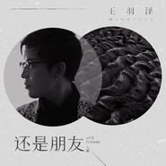

王羽泽
============================

|  |  |
| :--: | :-- |
| [ 王羽泽](https://i.xiami.com/yuze222) | **地区**: China 中国大陆 **风格**: 国语流行 Mandarin Pop **播放数**: 5445706 **粉丝数**: 379 **评论数**: 30  |

## 档案

王羽泽，内地知名音乐人、唱作歌手。2006年出道，至今已创作并发行500余首歌曲，发行个人专辑6张，主要作品《老婆永远是对的》《做我女朋友》《我最伤心的时候》《不是我不爱你》等，为其他歌手创作之单曲近60首，作品有《分开那天》、《如果你幸福》、《小绵羊》、《小葡萄》、《一切随缘》、《不靠谱》等。 2011年曾应邀参加CCTV首届网络春晚，并演唱春晚主题曲《回家陪爸妈》。  王羽泽其作品歌词真实动人、曲风朗朗上口，一直颇受广大歌迷和唱片公司的喜爱。王羽泽目前在北京发展音乐创作、制作工作！

## 专辑

| 名称 | 语种 | 唱片公司 | 发行时间 | 专辑类别 | 专辑风格 |
| :--: | :-- | :-- | :-- | :-- | :-- |
| [ 后来遇见她](./albums/5020786962.md) | 国语 | 独立发行 | 2020年05月15日 | 录音室专辑 | 流行 Pop |
| [ 除不掉的魔](./albums/5020648992.md) | 国语 | 独立发行 | 2020年05月04日 | 录音室专辑 | 流行 Pop |
| [ 老婆的歌](./albums/2108263586.md) | 国语 | 禾信科技 | 2019年11月01日 | 录音室专辑 | 国语流行 Mandarin Pop |
| [ 既然选择你](./albums/2108227354.md) | 国语 | 禾信科技 | 2019年11月01日 | EP, 单曲 | 国语流行 Mandarin Pop |
| [ 我想让你得到我](./albums/2108284213.md) | 国语 | 禾信科技 | 2019年11月01日 | EP, 单曲 | 国语流行 Mandarin Pop |
| [ 如果还有那一天](./albums/2108360020.md) | 国语 | 禾信科技 | 2019年10月22日 | EP, 单曲 | 国语流行 Mandarin Pop |
| [ 某些人某些事](./albums/2108380040.md) | 国语 | 禾信科技 | 2019年09月23日 | EP, 单曲 | 国语流行 Mandarin Pop |
| [ 还是朋友](./albums/2108380044.md) | 国语 | 禾信科技 | 2019年09月04日 | EP, 单曲 | 国语流行 Mandarin Pop |
| [ 以为你会和我在一起](./albums/2108392053.md) | 国语 | 禾信科技 | 2019年08月23日 | EP, 单曲 | 国语流行 Mandarin Pop |
| [ 你是什么垃圾](./albums/5020899080.md) | 国语 | 禾信科技 | 2019年07月26日 | EP, 单曲 | 国语流行 Mandarin Pop |
| [ 经过一次分离](./albums/2108268723.md) | 国语 | 禾信科技 | 2019年07月11日 | EP, 单曲 | 国语流行 Mandarin Pop |
| [ 忘了曾和你](./albums/5021001366.md) | 国语 | 禾信科技 | 2019年06月27日 | EP, 单曲 | 国语流行 Mandarin Pop |
| [ 对不起我很贵](./albums/5021104635.md) | 国语 | 禾信科技 | 2019年05月23日 | EP, 单曲 | 国语流行 Mandarin Pop |
| [ 对不起我很贵](./albums/2108280731.md) | 国语 | 禾信科技 | 2019年05月12日 | EP, 单曲 | 国语流行 Mandarin Pop |
| [ 虚荣心](./albums/5021101881.md) | 国语 | 禾信科技 | 2019年05月10日 | EP, 单曲 | 国语流行 Mandarin Pop |
| [ 我们的爱会怎样](./albums/5021119766.md) | 国语 | 禾信科技 | 2019年04月27日 | EP, 单曲 | 国语流行 Mandarin Pop |
| [ 所有的事都是因为我](./albums/5021121375.md) | 国语 | 禾信科技 | 2019年04月12日 | EP, 单曲 | 国语流行 Mandarin Pop |
| [ 电动车上的梦](./albums/2108310044.md) | 国语 | 禾信科技 | 2019年02月28日 | EP, 单曲 | 国语流行 Mandarin Pop |
| [ 泰国女孩哭了](./albums/2108294154.md) | 国语 | 禾信科技 | 2019年02月27日 | EP, 单曲 | 国语流行 Mandarin Pop |
| [ 盘它](./albums/2108318038.md) | 国语 | 禾信科技 | 2019年02月20日 | EP, 单曲 | 国语流行 Mandarin Pop |
| [ 离不开手机](./albums/2108321007.md) | 国语 | 禾信科技 | 2019年02月13日 | EP, 单曲 | 国语流行 Mandarin Pop |
| [ 给他们多少](./albums/2108350014.md) | 国语 | 禾信科技 | 2019年01月16日 | EP, 单曲 | 国语流行 Mandarin Pop |
| [ 坚持的我们](./albums/2104485375.md) | 国语 | 禾信科技 | 2018年12月22日 | EP, 单曲 | 国语流行 Mandarin Pop |
| [ 北京遇见爱情](./albums/2103629446.md) | 国语 | 禾信科技 | 2018年03月22日 | EP, 单曲 | 流行 Pop |
| [ 兄弟喝多帮你找代驾](./albums/2103555499.md) | 国语 | 禾信科技 | 2018年02月14日 | EP, 单曲 |  |
| [ 爸爸的小棉袄](./albums/2103466700.md) | 国语 | 禾信科技 | 2018年01月03日 | EP, 单曲 |  |
| [ 爱老婆会发财爱老婆会发财](./albums/2102963246.md) | 国语 | 独立发行 | 2017年11月29日 | 录音室专辑 | 民谣流行 Folk Pop |
| [ 北京 离开你很难](./albums/2102864509.md) | 国语 | 禾信科技 | 2017年09月27日 | EP, 单曲 |  |
| [ 想一个人才会孤单王羽泽](./albums/2102741383.md) | 国语 | 苹日天泓国际文化传媒（北京）有限公司 | 2017年05月02日 | EP, 单曲 | 民谣流行 Folk Pop, 独立民谣 Indie Folk, 华语唱作人 Chinese Singer-Songwriter |
| [ 老婆的歌](./albums/2100363256.md) | 国语 | 启韵传媒 | 2016年07月06日 | 录音室专辑 |  |
| [ 重新在一起](./albums/2102404023.md) | 国语 | 苹日天泓国际文化传媒（北京）有限公司 | 2016年05月19日 | EP, 单曲 |  |
| [ 老公爱老婆](./albums/1329235054.md) | 国语 | 百视角文化 | 2015年04月16日 | EP, 单曲 |  |
| [ 面子](./albums/1209192802.md) | 国语 | 禾信科技 | 2014年08月28日 | 录音室专辑 | 国语流行 Mandarin Pop |
| [ 幸福都去哪了](./albums/1006186596.md) | 国语 | 禾信科技 | 2014年07月23日 | 录音室专辑 |  |
| [ 剑门蜀道](./albums/1488729230.md) | 国语 | 百纳娱乐 | 2014年01月02日 | EP, 单曲 |  |
| [ 纠结](./albums/507393.md) | 国语 | 志航文化 | 2012年04月05日 | EP, 单曲 |  |
| [ 爱到哭泣泪撕开伤口](./albums/487536.md) | 国语 | 酝星文化 | 2012年01月09日 | 录音室专辑 |  |
| [ 城市的爱情](./albums/463180.md) | 国语 | 志航文化 | 2011年08月31日 | 录音室专辑 |  |
| [ 不是我不爱你](./albums/433132.md) | 国语 | 同兴唱片 | 2008年08月07日 | 录音室专辑 | 流行 Pop, 国语流行 Mandarin Pop |
| [ 恨爱不长久](./albums/432627.md) | 国语 | 苹日天泓 | 2007年03月01日 | 录音室专辑 | 国语流行 Mandarin Pop |

## 评论

|  |  |  |
| :-- | :-- | :-- |
|  [虾米用户](https://emumo.xiami.com/u/358104299) 悲观的唯心存在现实解构虚... 2020-12-01 09:09 赞(1) 踩(0) | 
42700
 |
|  [虾米用户](https://emumo.xiami.com/u/338523365)  2019-01-29 10:24 赞(0) 踩(0) | 
最早我听的是〈不是我不爱你〉
 |
|  [虾米用户](https://emumo.xiami.com/u/408488825) 刚刚好了吗？ 2018-11-13 21:47 赞(0) 踩(0) | 
真好听
 |
|  [虾米用户](https://emumo.xiami.com/u/271169707) 找个爱人的啊 2018-05-07 12:08 赞(0) 踩(0) | 
你好棒哒好听好声音
 |
|  [虾米用户](https://emumo.xiami.com/u/326530824) 想开了一切不烦，忘掉了一... 2018-05-03 09:07 赞(0) 踩(0) | 
来首都演唱微我 
 |
|  [虾米用户](https://emumo.xiami.com/u/250978515)  2018-02-28 07:10 赞(0) 踩(0) | 
什么时候来沈阳唱歌一定找我
 |
|  [虾米用户](https://emumo.xiami.com/u/250978515)  2018-02-28 07:10 赞(0) 踩(0) | 
很喜欢王羽泽风格的歌曲，期待新歌
 |
|  [虾米用户](https://emumo.xiami.com/u/347654764)  2018-02-04 14:46 赞(0) 踩(0) | 
好好听
 |
|  [虾米用户](https://emumo.xiami.com/u/260097052)  2017-10-02 18:15 赞(0) 踩(0) | 
继续重温每一首歌
 |
|  [虾米用户](https://emumo.xiami.com/u/293692544) 你敢给我说话吗？我咬你 2017-09-20 07:02 赞(1) 踩(0) | 
呵呵
 |
|  [虾米用户](https://emumo.xiami.com/u/97101080)  2017-09-06 22:54 赞(1) 踩(0) | 
要你qq
 |
|  [虾米用户](https://emumo.xiami.com/u/295049322)  2017-07-20 21:50 赞(1) 踩(0) | 
支持                 
 |
|  [虾米用户](https://emumo.xiami.com/u/295049322)  2017-07-20 21:48 赞(2) 踩(0) | 
他的歌我很喜欢听唱的太好了好听
 |
|  [虾米用户](https://emumo.xiami.com/u/250978515)  2017-06-26 23:40 赞(4) 踩(0) | 
家人，很感动的一首歌曲，词让我深有体会，感人唱到了我们的心里，单曲循环了
 |
|  [虾米用户](https://emumo.xiami.com/u/278889082)  2017-05-22 07:39 赞(2) 踩(0) | 
很喜欢听你的歌曲
 |
|  [虾米用户](https://emumo.xiami.com/u/229980154) 心❤之所向，无问西东～ 2017-05-11 16:55 赞(2) 踩(0) | 
如果还有一辈子很好听，这里怎么听不到呢？
 |
|  [虾米用户](https://emumo.xiami.com/u/229980154) 心❤之所向，无问西东～ 2017-05-11 03:45 赞(2) 踩(0) | 
好听！
 |
|  [虾米用户](https://emumo.xiami.com/u/260097052)  2017-05-04 18:06 赞(2) 踩(0) | 
曾经把你的歌曲下载到优盘里，放在店外音响里播放，不小心让可恶的小偷给拿跑了 ，又从新弄了一个 
 |
|  [虾米用户](https://emumo.xiami.com/u/260097052)  2017-05-04 18:04 赞(2) 踩(0) | 
一直在听你的歌曲，每天在店里循环的播放！！
 |
|  [虾米用户](https://emumo.xiami.com/u/285960277) 胸部养护可以让我歌声也变... 2017-04-17 14:13 赞(3) 踩(0) | 
我喜欢这歌和词
 |
|  [虾米用户](https://emumo.xiami.com/u/280842293)  2017-03-17 13:07 赞(3) 踩(0) | 
真棒 
 |
|  [虾米用户](https://emumo.xiami.com/u/10946486)  2016-10-22 23:57 赞(3) 踩(0) | 
我刚入驻了虾米音乐人，欢迎大家来我的个人主页，收听我的最新音乐
 |
| ⇒ |  [虾米用户](https://emumo.xiami.com/u/6950773) 聽..  風在哪唱歌 2017-03-29 22:27 赞(0) 踩(0) | 
好听
 |
|  [虾米用户](https://emumo.xiami.com/u/46768290) 此生一梦，此梦一生！ 2016-10-16 00:55 赞(2) 踩(0) | 
风格欢快，朗朗上口！就是红！可惜了！
 |
|  [虾米用户](https://emumo.xiami.com/u/37151186)   2016-01-25 10:45 赞(2) 踩(0) | 
好听，我喜欢听你的歌
 |
|  [虾米用户](https://emumo.xiami.com/u/51818891)  2015-10-08 23:29 赞(2) 踩(0) | 
非常喜欢听这是首歌
 |
|  [虾米用户](https://emumo.xiami.com/u/62977792)  2015-09-10 19:49 赞(2) 踩(0) | 
很棒，喜欢听
 |
|  [虾米用户](https://emumo.xiami.com/u/51822812)  2015-06-27 22:18 赞(2) 踩(0) | 
很好听！很棒！很赞！再接再厉！继续努力！加油！ 
 |
|  [虾米用户](https://emumo.xiami.com/u/5433854)  2014-12-14 17:26 赞(2) 踩(0) | 
支持 歌曲 很接地气
 |
|  [虾米用户](https://emumo.xiami.com/u/4120826)  2012-06-28 18:49 赞(2) 踩(0) | 
挺不错的歌手，咋没人说两句呢！
 |
