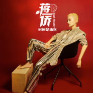
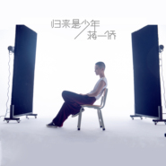
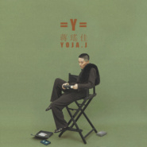
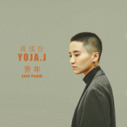

蒋一侨
============================

|  |  |
| :--: | :-- |
| [ 蒋一侨](https://i.xiami.com/yojajyj) | **播放数**: 4650642 **粉丝数**: 1842 **评论数**: 104 **地区**: China 中国大陆 **风格**:   |

## 档案

蒋一侨，JYY，1994年1月30日出生于浙江湖州，中国新生代歌手、唱作人。蒋一侨的音乐融合中西方元素，风格多变，创作力极强。19岁在《中国好歌曲》第一季以一首《梦的堡垒》一曲成名正式出道.     从艺经历：高中就读于杭州外国语学校并组建第一支全女生朋克乐队“Noman”，之后被好莱坞音乐学院musicians institute、伯克利音乐学院berklee录取。  2012年赴加利福尼亚州洛杉矶市的好莱坞音乐学院musicians institute学习音乐；  2014年 在中国一档以原创音乐人为主的《中国好歌曲》（sing my song）一曲成名，踏入乐坛。同年，在MI大学教授Katsuya Sezaki的帮助下发行了个人首张EP《绽放》；  2015年 在结识了堪称是良师益友的欧洲知名制作人Sam vahdat之后开始了全新的音乐创作之路；  2016年 蒋一侨在sam vahdat的监制下，推出了个人首张全创作专辑《YOLO》，包揽词曲，风格的多样性把她过人的音乐才华展现的淋漓尽致。不仅受到了业内乐评人的一致好评，并且凭借专辑中的《巴黎23号》一举斩获第25届《东方风云榜》“东方新人”大奖；  2017年 登上各大音乐节的舞台，受到了日本歌坛的肯定并受邀日本“summer sonic”音乐节；  2018年 蒋一侨应邀芭莎公益星设计，作为第六季公益星推广大使首次亮相纽约时代广场纳斯达克大屏幕，同年，支持多年的中国瓷娃娃慈善机构授予蒋一侨“特别贡献奖”；   2019年，在经历三年的打磨后，蒋一侨第二张专辑《Y》与大家见面，十首新作，谱曲仍是独自包揽。    2020年，加盟东方卫视音乐竞技类综艺《中国梦之声·我们的歌》中与周华健搭档并组成“一健倾心”队。   代表作品：  《巴黎23号》《戏子》《梦的堡垒》

## 专辑

| 名称 | 语种 | 唱片公司 | 发行时间 | 专辑类别 | 专辑风格 |
| :--: | :-- | :-- | :-- | :-- | :-- |
| [ 时间是庸医 Bad Healer](./albums/5021819088.md) | 国语 | 看见音乐 (上海) | 2020年10月31日 | 录音室专辑 | 流行 Pop |
| [ 归来是少年 Young Heart](./albums/5021110320.md) | 国语 | 看见音乐 (上海) | 2020年07月20日 | EP, 单曲 | 国语流行 Mandarin Pop |
| [ 单人华尔兹 Single Waltz](./albums/5021012006.md) | 其他 | 看见音乐 (上海) | 2020年06月30日 | 录音室专辑 | 流行 Pop |
| [ 归来是少年](./albums/2105619611.md) | 国语 |  | 2019年12月24日 | EP, 单曲 | 国语流行 Mandarin Pop |
| [ Y](./albums/2105289183.md) | 国语 | 看见音乐 (上海) | 2019年09月30日 | 录音室专辑 |  |
| [ 汝](./albums/2105041839.md) | 国语 | 看见音乐 (上海) | 2019年08月03日 | EP, 单曲 |  |
| [ 汝Thou](./albums/2105054191.md) | 英语 |  | 2019年08月03日 | EP, 单曲 | 欧美流行 Western Pop |
| [ 芳年Lost Youth](./albums/2104965521.md) | 国语 | 看见音乐 (上海) | 2019年07月01日 | EP, 单曲 |  |
| [ 留下](./albums/2104881258.md) | 国语 | 看见音乐 (上海) | 2019年05月27日 | EP, 单曲 |  |
| [ 一棵树](./albums/2104640182.md) | 国语 | 看见音乐 (上海) | 2019年03月05日 | EP, 单曲 | 国语流行 Mandarin Pop |
| [ YOLO](./albums/2102651385.md) | 国语 | 看见音乐 (上海) | 2016年12月06日 | 录音室专辑 | 电子乐 Electronica, 摇滚 Rock & Roll |
| [ 绽放](./albums/2100184356.md) | 国语 | 海蝶音乐 | 2015年08月25日 | EP, 单曲 | 国语流行 Mandarin Pop |
| [ 爸爸](./albums/934519722.md) | 国语 | 海蝶音乐 | 2015年06月17日 | EP, 单曲 | 国语流行 Mandarin Pop |

## 评论

|  |  |  |  |
| :-- | :-- | :-- | :-- |
|  [虾米用户](https://emumo.xiami.com/u/254939837)  2021-01-30 00:59 赞(0) 踩(0) | 
闪闪发光✨越来越好
 |
|  [虾米用户](https://emumo.xiami.com/u/226459876) 狂 2020-08-31 22:27 赞(0) 踩(0) | 
不知不觉也喜欢你两年了 第一次听到你的歌是《戏子》，是在一个直播间里一位女主播翻唱的很好听，于是搜了这首歌名，过了几天后我开始查看你主页的其它歌，发现每一首都好听都很解压，尤其是节奏强度配上你的声音，真的很放松。
 |
|  [虾米用户](https://emumo.xiami.com/u/413503448)  2020-06-14 23:20 赞(0) 踩(0) | 
在youtube 看了她和周華健合唱的MV才認識她的，不錯。謝蝦米
 |
|  [虾米用户](https://emumo.xiami.com/u/1655898) 雨不歇，心绵绵 2019-11-06 21:16 赞(1) 踩(0) | 
非常喜欢
 |
|  [虾米用户](https://emumo.xiami.com/u/31440002) 哈哈哈 加油啊  2019-11-02 22:33 赞(0) 踩(0) | 
第二个喜欢的女歌手
 |
|  [虾米用户](https://emumo.xiami.com/u/83591380) 哼一首淡淡的歌。 2019-10-31 22:23 赞(0) 踩(0) | 
改名字了 我还是喜欢原来的名字啊
 |
|  [虾米用户](https://emumo.xiami.com/u/31709801) 还活着，真的是太好了..... 2019-10-25 17:14 赞(0) 踩(0) | 
改改改改名了？
 |
|  [虾米用户](https://emumo.xiami.com/u/349363776) 乾坤未定你我皆是黑马 2019-07-11 03:43 赞(1) 踩(0) | 
很喜欢你   第一次听到《戏子》就很喜欢  一直在单曲循环   刚听到不知道你长什么样子现在看到了感觉跟想象中的那种酷酷的女孩子是一致的     很喜欢你的音乐也很喜欢你的性格与与众不同   我想说    蒋瑶佳大大   一定要继续加油啊！  坚持自己喜欢的并不容易   但是有很多似我这般喜欢你音乐的人一直在背后支持你   也许不起眼   但是我们都在    蒋瑶佳大大   加油！！！❤
 |
|  [虾米用户](https://emumo.xiami.com/u/45754950)  2019-04-19 07:24 赞(3) 踩(0) | 
知道你很多年了，希望你会坚持下去，加油！
 |
|  [虾米用户](https://emumo.xiami.com/u/423249704) 不是好人. 2019-04-13 14:16 赞(2) 踩(0) | 
佳宝，永远爱你
 |
|  [虾米用户](https://emumo.xiami.com/u/403765436)  2019-04-11 23:51 赞(0) 踩(0) | 
好听，加油
 |
|  [虾米用户](https://emumo.xiami.com/u/306785441) 同好者难求 2019-02-24 02:22 赞(1) 踩(0) | 
榜样
 |
|  [虾米用户](https://emumo.xiami.com/u/530490) 音乐不说谎。 2018-06-10 22:10 赞(1) 踩(0) | 
有个性，歌好听！
 |
|  [虾米用户](https://emumo.xiami.com/u/19463866) 等待  经历  体验过程... 2018-05-23 07:34 赞(1) 踩(0) | 
其实就想知道 哪里可以买到 cd
 |
|  [虾米用户](https://emumo.xiami.com/u/226459876) 狂 2018-04-24 22:54 赞(1) 踩(0) | 
我的短发女神٩(๑&amp;ograve;&amp;omega;&amp;oacute;๑)۶
 |
|  [虾米用户](https://emumo.xiami.com/u/79475814) If i could c... 2018-04-23 23:45 赞(1) 踩(0) | 
加油，特别的女神！
 |
|  [虾米用户](https://emumo.xiami.com/u/1515590) 我还没想好要写什么... 2018-04-03 15:03 赞(0) 踩(0) | 
不入耳
 |
|  [虾米用户](https://emumo.xiami.com/u/20177386) 感谢一切美好的遇见❤️ 2018-03-16 21:34 赞(0) 踩(0) | 

 |
|  [虾米用户](https://emumo.xiami.com/u/337176910) 饿了，谁有吃的 2018-02-10 14:30 赞(0) 踩(0) | 
阿勒，所以说蒋瑶嘉是男的女的？
 |
| ⇒ |  [虾米用户](https://emumo.xiami.com/u/324058936) 我还没想好要写什么... 2018-12-02 03:58 赞(0) 踩(0) | 
女的 
 |
|  [虾米用户](https://emumo.xiami.com/u/43870938) 喜欢聆听。 2018-02-08 00:36 赞(0) 踩(0) | 
来啦
 |
|  [虾米用户](https://emumo.xiami.com/u/341895591)  2018-01-01 16:49 赞(0) 踩(0) | 
喜欢这首歌，
 |
|  [虾米用户](https://emumo.xiami.com/u/145120758)  2017-10-21 13:51 赞(2) 踩(0) | 
好喜欢她，完全是被她的才华征服的，后来又发现，五官好精致，皮肤超好，手也特别好看，原来是位美人胚子。
 |
|  [虾米用户](https://emumo.xiami.com/u/320006761) 我想说，我喜欢听老歌 2017-09-24 13:58 赞(1) 踩(0) | 
好喜欢她的歌，她人非常有个性，长的很漂亮，很时尚范
 |
|  [虾米用户](https://emumo.xiami.com/u/8905665) 我还没想好要写什么... 2017-06-24 11:53 赞(11) 踩(0) | 
人美，有范，唱的好，还会写歌..我落下什么了么 ，要继续努力呦
 |
|  [虾米用户](https://emumo.xiami.com/u/181210468) 生活不能自理 感情一片荒... 2017-05-05 08:30 赞(1) 踩(0) | 
棒棒棒
 |
|  [虾米用户](https://emumo.xiami.com/u/215681545) 东生枫火（飞灵诗涛）金曲... 2017-04-27 23:55 赞(0) 踩(0) | 
全中国最前卫是你呀I U加油.我会写歌给你的 
 |
|  [虾米用户](https://emumo.xiami.com/u/33517703)  2017-03-25 05:14 赞(0) 踩(0) | 
喜欢这个品味的
 |
|  [虾米用户](https://emumo.xiami.com/u/41936826)  2017-01-26 17:01 赞(0) 踩(0) | 
啊啊啊感觉要被掰弯的
 |
|  [虾米用户](https://emumo.xiami.com/u/262813962)  2017-01-26 00:45 赞(0) 踩(0) | 
太棒了，循环听，听不厌，喜欢 
 |
|  [虾米用户](https://emumo.xiami.com/u/85354554)  2017-01-24 13:43 赞(0) 踩(0) | 
永远
 |
|  [虾米用户](https://emumo.xiami.com/u/85354554)  2017-01-24 13:42 赞(0) 踩(0) | 
爱你嘉嘉
 |
|  [虾米用户](https://emumo.xiami.com/u/52838962)  2017-01-23 19:18 赞(1) 踩(0) | 
弯了弯了 
 |
|  [虾米用户](https://emumo.xiami.com/u/240890438)   2017-01-09 23:21 赞(0) 踩(0) | 
突然听到，就沦陷了。一直喜欢这种风格的，只是一直没有遇到。
 |
|  [虾米用户](https://emumo.xiami.com/u/27061286) 云ID:韩沐熙 2017-01-06 19:58 赞(0) 踩(0) | 
喜欢你
 |
|  [虾米用户](https://emumo.xiami.com/u/123260456)  2017-01-03 23:36 赞(0) 踩(0) | 
喜欢。
 |
|  [虾米用户](https://emumo.xiami.com/u/37467687) 暂无签名~ 2017-01-03 00:54 赞(0) 踩(0) | 
感觉demo最出彩啊
 |
|  [虾米用户](https://emumo.xiami.com/u/53008086)   2017-01-02 22:14 赞(0) 踩(0) | 
酷
 |
|  [虾米用户](https://emumo.xiami.com/u/257971448)  2016-12-30 15:37 赞(3) 踩(0) | 
You only live once勇敢的做自己永远挺你永远陪你
 |
|  [虾米用户](https://emumo.xiami.com/u/43985436)   2016-12-19 14:26 赞(0) 踩(0) | 
欢迎来到北京工商大学  
 |
|  [虾米用户](https://emumo.xiami.com/u/43985436)   2016-12-19 14:26 赞(0) 踩(0) | 
yolo 
 |
|  [虾米用户](https://emumo.xiami.com/u/8200219) (⁎˃ᴗ˂⁎) 2016-12-17 11:55 赞(0) 踩(0) | 
酷
 |
|  [虾米用户](https://emumo.xiami.com/u/87797880)  2016-11-28 01:27 赞(0) 踩(0) | 
今晚听了现场，觉得蒋宝真的是个可以的歌手，喜欢你的特别，喜欢你的骄傲～
 |
|  [虾米用户](https://emumo.xiami.com/u/13228266) 国破山河在 2016-10-24 00:16 赞(0) 踩(0) | 
赞
 |
|  [虾米用户](https://emumo.xiami.com/u/97747450) 我还没想好要写什么... 2016-09-26 18:35 赞(0) 踩(0) | 
4266
 |
|  [虾米用户](https://emumo.xiami.com/u/9981468) it will past 2016-06-25 21:41 赞(0) 踩(0) | 
好Cool啊她
 |
|  [虾米用户](https://emumo.xiami.com/u/124919098)  2016-04-23 23:17 赞(0) 踩(0) | 
有个人天天听你的歌，弄的我也仔细听了一下，真心不错
 |
|  [虾米用户](https://emumo.xiami.com/u/27635332) Les 2016-02-24 06:16 赞(1) 踩(0) | 
家境优越的你选择了自己的梦想，真的很钦佩你的勇气！我多希望我也可以像你一样选择自己的路。希望你一直这样自信下去！补充一句，你是个很有气质的T，坐等你出柜的那天，哈哈
 |
|  [虾米用户](https://emumo.xiami.com/u/92757190) 只争朝夕 2016-02-09 02:22 赞(0) 踩(0) | 
喜欢你的风格哦，加油↖(^ω^)↗多出好的作品
 |
|  [虾米用户](https://emumo.xiami.com/u/9241451) 查无此人。 2016-01-28 16:28 赞(0) 踩(0) | 
我知道你会越来越红。所以要在前排爱你。
 |
|  [虾米用户](https://emumo.xiami.com/u/10911032)  2016-01-17 22:00 赞(0) 踩(0) | 
呦？！帅哥儿留头发了？
 |
|  [虾米用户](https://emumo.xiami.com/u/4127048) 最是一曲忘不了 2015-11-28 10:42 赞(0) 踩(0) | 
好听！ 给力！
 |
|  [虾米用户](https://emumo.xiami.com/u/70407278)  2015-09-29 22:04 赞(0) 踩(0) | 
加油
 |
|  [虾米用户](https://emumo.xiami.com/u/31473474) 我头像是个美女对吧 2015-08-28 01:18 赞(0) 踩(0) | 
喜欢她的风格
 |
|  [虾米用户](https://emumo.xiami.com/u/51963729)  2015-07-15 23:42 赞(0) 踩(0) | 
喜欢，加油!
 |
|  [虾米用户](https://emumo.xiami.com/u/51708927)  2015-06-25 01:30 赞(0) 踩(0) | 
她是最棒的，我永远支持他
 |
|  [虾米用户](https://emumo.xiami.com/u/51695274)   2015-06-24 16:48 赞(0) 踩(0) | 
真好看
 |
|  [虾米用户](https://emumo.xiami.com/u/50560566) 保持愉快 2015-06-18 01:43 赞(0) 踩(0) | 
超级喜欢你，从梦的堡垒╮(╯▽╰)╭
 |
|  [虾米用户](https://emumo.xiami.com/u/12895046) 沿着社会主义大道奔前方 2015-05-03 15:42 赞(1) 踩(0) | 
太棒了 一亮相就喜爱蒋瑶佳 推新歌啊 类似梦的堡垒！！
 |
|  [虾米用户](https://emumo.xiami.com/u/43754730) 暂无签名~ 2014-12-22 11:52 赞(1) 踩(0) | 
好歌曲 改的好的没几首 专家要的是完美 太完美了就没特点了 有时缺憾也是一种美
 |
|  [虾米用户](https://emumo.xiami.com/u/2566093)  2014-11-02 21:14 赞(1) 踩(0) | 
绽放真的好赞。天生的音乐人。
 |
|  [虾米用户](https://emumo.xiami.com/u/41005582)  2014-09-25 11:24 赞(0) 踩(0) | 
很喜欢你的爆发力。快发新歌吧！好想听
 |
|  [虾米用户](https://emumo.xiami.com/u/8427348) 暂无签名~ 2014-09-16 23:02 赞(0) 踩(0) | 
快发行CD吧！加油瑶嘉！年青R0CK
 |
|  [虾米用户](https://emumo.xiami.com/u/8905665) 我还没想好要写什么... 2014-08-19 11:46 赞(0) 踩(0) | 
梦的堡垒live时很完美，被改稀碎。。。。天生的明星，加油
 |
|  [虾米用户](https://emumo.xiami.com/u/5514756) 我可不是随便赞的 2014-03-29 18:14 赞(0) 踩(0) | 
木有好声音的那首么，好喜欢那首，Rocker！
 |
|  [虾米用户](https://emumo.xiami.com/u/2220502) so far so go... 2014-03-23 21:37 赞(0) 踩(0) | 
朋友的朋友，加油
 |
|  [虾米用户](https://emumo.xiami.com/u/532661) 不要停止我的音乐 2014-03-23 06:18 赞(1) 踩(0) | 
少竖中指了孩子，特别向观众……
 |
|  [虾米用户](https://emumo.xiami.com/u/10814140) 為何每天都如此漫長 2014-03-22 05:31 赞(0) 踩(0) | 
这首歌好好听~~~·
 |
|  [虾米用户](https://emumo.xiami.com/u/15275321) 也没什么好听的。 2014-03-13 17:17 赞(0) 踩(0) | 
梦的堡垒新版没有老版的好啊！词改的太烂
 |
| ⇒ |  [虾米用户](https://emumo.xiami.com/u/2552299)  2014-07-30 21:48 赞(0) 踩(0) | 
更喜欢氢气球做开头，非常非常好了，加油。另外，谦虚的回应更好，别人羡慕你还来不及。
 |
| ⇒ |  [虾米用户](https://emumo.xiami.com/u/50560566) 保持愉快 2015-06-18 01:43 赞(0) 踩(0) | 
<q><b>kaye说：</b></q>
 |
|  [虾米用户](https://emumo.xiami.com/u/10156343)  2014-03-02 16:04 赞(0) 踩(0) | 
爆发力型啊，顶你！
 |
|  [虾米用户](https://emumo.xiami.com/u/3541743)  2014-03-01 16:16 赞(0) 踩(0) | 
哎？不是叫蒋瑶嘉 么？
 |
|  [虾米用户](https://emumo.xiami.com/u/983096) 凝眸处，碧海青天。 2014-03-01 12:08 赞(0) 踩(0) | 
喜欢你的歌，梦的堡垒听得很过瘾！！！你的嗓音好有爆发力！！！
 |
|  [虾米用户](https://emumo.xiami.com/u/3689632)  2014-03-01 11:39 赞(0) 踩(0) | 
这种台风真的好好好好好赞！！！！爱死了T&amp;gt;&amp;gt;&amp;gt;&amp;gt;&amp;gt;T
 |
|  [虾米用户](https://emumo.xiami.com/u/7925738) 你不会再写信。 2014-02-28 21:07 赞(0) 踩(0) | 
从今天起不做货架上的罐头
 |
|  [虾米用户](https://emumo.xiami.com/u/7133174) 我还没想好要写什么... 2014-02-26 22:28 赞(0) 踩(0) | 
很少听到华人这种劲爆的感觉
 |
|  [虾米用户](https://emumo.xiami.com/u/5778707)  2014-02-25 20:51 赞(0) 踩(0) | 
徜徉恣肆
 |
|  [虾米用户](https://emumo.xiami.com/u/8384826) 再见，虾米，谢谢！ 2014-02-18 09:53 赞(0) 踩(0) | 
有个性
 |
|  [虾米用户](https://emumo.xiami.com/u/532661) 不要停止我的音乐 2014-02-09 01:33 赞(0) 踩(0) | 
很棒的音乐 继续加油~期待能有一天看到你的专场演出~！
 |
|  [虾米用户](https://emumo.xiami.com/u/24766612) 寂寞的自由 2014-02-08 10:36 赞(0) 踩(0) | 
梦的堡垒，新生代摇滚女王，超赞！
 |
|  [虾米用户](https://emumo.xiami.com/u/951915) 人生百年，草木一生 2014-02-08 01:43 赞(0) 踩(0) | 
加油。
 |
|  [虾米用户](https://emumo.xiami.com/u/2454429)  2014-02-06 01:19 赞(0) 踩(0) | 
你的魅力无法阻挡！请继续勇往直前！
 |
|  [虾米用户](https://emumo.xiami.com/u/32250158) sorry,完美，永不流... 2014-02-05 13:53 赞(0) 踩(0) | 
因为........摇滚，因为new
 |
|  [虾米用户](https://emumo.xiami.com/u/980117) unbeatable c... 2014-01-31 22:55 赞(0) 踩(0) | 
生日快乐。
 |
|  [虾米用户](https://emumo.xiami.com/u/23353912) 暂无签名~ 2014-01-27 22:52 赞(0) 踩(0) | 
梦的城堡，很赞~
 |
|  [虾米用户](https://emumo.xiami.com/u/32105296)  2014-01-24 20:46 赞(0) 踩(0) | 
爱上你！
 |
|  [虾米用户](https://emumo.xiami.com/u/3458661) 能感动人的音乐就是好音乐 2014-01-21 09:51 赞(0) 踩(0) | 
为什么现在改成了~嘉~
 |
|  [虾米用户](https://emumo.xiami.com/u/31955882)  2014-01-20 22:46 赞(0) 踩(0) | 
很好听
 |
|  [虾米用户](https://emumo.xiami.com/u/1287159) 遗失画廊 2014-01-20 14:41 赞(0) 踩(0) | 
很喜欢你的声音。
 |
|  [虾米用户](https://emumo.xiami.com/u/1160114) 我慢慢的一步一步走 2014-01-19 23:00 赞(0) 踩(0) | 
哈哈~~~~喜欢那首梦的堡垒，没想到居然在虾米收到你了。哈哈~~~~加油~~~看好你。
 |
|  [虾米用户](https://emumo.xiami.com/u/2358194)  2014-01-19 15:27 赞(0) 踩(0) | 
偶像！
 |
|  [虾米用户](https://emumo.xiami.com/u/19161228) 用心写每一首歌 2014-01-18 20:53 赞(0) 踩(0) | 
非常喜欢你，加油
 |
|  [虾米用户](https://emumo.xiami.com/u/10797618)  2014-01-18 15:07 赞(0) 踩(0) | 
我们有一样的圆寸，光头少女，加油！！！
 |
|  [虾米用户](https://emumo.xiami.com/u/4858564) 这家伙很冷艳不凡睿智什么... 2014-01-17 23:23 赞(0) 踩(0) | 
这是！沙发啊！刚看完好歌曲 歌不错 圆寸更赞
 |
|  [虾米用户](https://emumo.xiami.com/u/7068803) YOJA 蒋瑶佳 2013-10-11 10:11 赞(86) 踩(0) | 
我刚入驻了虾米音乐人，欢迎大家来我的个人主页，收听我的最新音乐
 |
| ⇒ |  [虾米用户](https://emumo.xiami.com/u/51708927)  2015-06-25 01:30 赞(0) 踩(0) | 
最爱嘉爷
 |
| ⇒ |  [虾米用户](https://emumo.xiami.com/u/92757190) 只争朝夕 2016-02-09 02:21 赞(0) 踩(0) | 
会的，你唱的很棒！加油，对你有期待
 |
| ⇒ |  [虾米用户](https://emumo.xiami.com/u/122153526) Pure and  si... 2016-03-13 22:35 赞(0) 踩(0) | 
可惜虾米还是不能听你的新歌
 |
| ⇒ |  [虾米用户](https://emumo.xiami.com/u/85354554)  2017-01-24 13:43 赞(0) 踩(0) | 
期待更好听的
 |
| ⇒ |  [虾米用户](https://emumo.xiami.com/u/340033253)  2017-12-15 23:41 赞(0) 踩(0) | 
蒋瑶嘉，期待你一定要红起来哟！当初听到你改变的余波荡漾的时候，我就一下子超级喜欢上你了，至今不变。加油！我从来不粉谁，但是很希望以后可以听到你更多的歌曲，翻唱原唱，都是极好的，期待你(๑˙ー˙๑)
 |
| ⇒ |  [虾米用户](https://emumo.xiami.com/u/275898271) 一个认真的人 2018-02-18 12:39 赞(0) 踩(0) | 
厉害   
 |
| ⇒ |  [虾米用户](https://emumo.xiami.com/u/226459876) 狂 2018-04-24 22:56 赞(0) 踩(0) | 
好喜欢佳爷的声音啊啊啊啊疯狂打call
 |
| ⇒ |  [虾米用户](https://emumo.xiami.com/u/349363776) 乾坤未定你我皆是黑马 2019-07-11 03:45 赞(0) 踩(0) | 
很喜欢你   第一次听到《戏子》就很喜欢  一直在单曲循环   刚听到不知道你长什么样子现在看到了感觉跟想象中的那种酷酷的女孩子是一致的     很喜欢你的音乐也很喜欢你的性格与与众不同   我想说    蒋瑶佳大大   一定要继续加油啊！  坚持自己喜欢的并不容易   但是有很多似我这般喜欢你音乐的人一直在背后支持你   也许不起眼   但是我们都在    蒋瑶佳大大   加油！！！❤
 |
