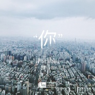

你
============================

|  |  |
| :--: | :-- |
| [ 你](https://emumo.xiami.com/album/2103715973) | **艺人**: [时光胶囊](../index.md) **语种**: 国语 **唱片公司**: 独立发行 **发行时间**: 2018年05月20日 **专辑类别**: EP, 单曲 **专辑风格**: 国语流行 Mandarin Pop **播放数**: 10354 **收藏数**: 6 **评论数**: 4  |

## 简介

我曾经幻想住在一湾湖水旁的小木屋里，呼吸松树的气息，奔跑在柔软的草地；也曾想在世界上最喜欢的城市里，皮鞋踩过秋季的落叶，开车飞驰在无人的公路；也想过登上山顶，静止的从一片广阔茫然的蓝色苍穹，等到星河出现横跨夜空。但我现在能想到最美的感觉是，与你紧紧相依。  
  
如果让我选择，没有你在身边，这一切都无意义。《你》这无疑是一首充满浪漫气息、充满奇幻感觉的歌曲。  
  
晴朗无月的夜晚，一般人用肉眼大约可以看到6000多颗恒星，借助于望远镜，则可以看到几十万乃至几百万颗以上。银河系中的恒星大约有1500-4000亿颗。终会遇见一个人，如星云天体中最闪亮的恒星，从此我遥望星空的双眼不再茫然，  
你的一颦一笑都像星在闪耀，“你”使我不再孤单不再寒冷。  
  
今天我们就来分享各自关于爱的感觉，时光胶囊首先分享一首单曲《你》，也欢迎各位将你们关于爱的感觉在文末留言中分享给我们。  
  
  
你像是一道美丽的彩虹  
出现在我寂寞的天空  
你拥有无与伦比的色彩  
渲染我眼中的黑白  
我深呼吸  
呼吸你给的氧气  
外面的世界与我无关  
只想贪婪的沉睡在你温暖的怀抱  
你像是一颗闪烁的恒星  
出现在我孤独的夜空  
你拥有无限炙热的光芒  
从此我不再恐惧黑暗  
我深呼吸  
呼吸你给的氧气  
外面的世界与我无关  
只想贪婪的沉睡在你温暖的怀抱  
你温柔的心跳  
不要叫醒我  
这一秒  
  
  
瞬间即是永恒。  
  
永恒乃镜花水月人类神思玄想之事，时空即为运动世间万物当无不运动。是为生命宇宙之法则，又如何永恒。  
  
但永恒本身又是一及其浪漫的词，在无数个瞬间我期待过时间静止。我们选在2018.5.20发布这首新单曲，送给“你”！ 

## 曲目

## 评论

|  |  |  |
| :-- | :-- | :-- |
|  [虾米用户](https://emumo.xiami.com/u/8717631) 在拥有爱的世纪里悲伤。 2018-06-10 12:48 赞(0) 踩(0) | 
支持
 |
|  [虾米用户](https://emumo.xiami.com/u/73740960)  2018-06-07 06:44 赞(0) 踩(0) | 
▪️
 |
|  [虾米用户](https://emumo.xiami.com/u/42208190)  2018-06-06 01:08 赞(0) 踩(0) | 
好听。
 |
|  [虾米用户](https://emumo.xiami.com/u/45532958)  2018-06-05 20:18 赞(0) 踩(0) | 

 |
