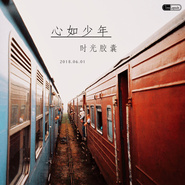

心如少年
============================

|  |  |
| :--: | :-- |
| [ 心如少年](https://emumo.xiami.com/album/2103752959) | **艺人**: [时光胶囊](../index.md) **语种**: 国语 **唱片公司**: 独立发行 **发行时间**: 2018年06月01日 **专辑类别**: EP, 单曲 **专辑风格**: 摇滚 Rock & Roll, 流行摇滚 Pop Rock **播放数**: 211115 **收藏数**: 11 **评论数**: 4  |

## 简介

 时光胶囊走过了十一个四季，在第十二个夏天的时候，我们发一首歌，怀念校园的日子。 时光胶囊十二年的所有成员送给正值毕业季的你们——《心如少年》。  

## 曲目

## 评论

|  |  |  |
| :-- | :-- | :-- |
|  [虾米用户](https://emumo.xiami.com/u/283919655) 水一般的男子 2020-08-11 13:54 赞(0) 踩(0) | 
当未来五年，十年后再来看评论，再问问自己，是否还是一如少年
 |
|  [虾米用户](https://emumo.xiami.com/u/283919655) 水一般的男子 2020-08-11 13:53 赞(0) 踩(0) | 
这首歌无论如何都要给它一个满星
 |
|  [虾米用户](https://emumo.xiami.com/u/47762849) Love fish. 2019-08-10 21:58 赞(0) 踩(0) | 
哎呀，真好听，我还是个少年的心理。
 |
|  [虾米用户](https://emumo.xiami.com/u/73740960)  2018-06-21 11:17 赞(0) 踩(0) | 
@冰岛下川
 |
