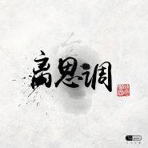
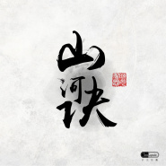
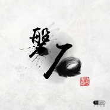
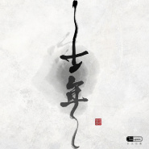
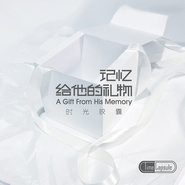

时光胶囊
============================

|  |  |
| :--: | :-- |
| [ 时光胶囊](https://i.xiami.com/timecapsule) | **地区**: China 中国大陆 **风格**: 后摇 Post-Rock, 独立摇滚 Indie Rock, 英伦摇滚 Britpop **播放数**: 3176671 **粉丝数**: 7273 **评论数**: 258  |

## 档案

溜走的时光 Passing time 
悄悄带走了蓝色的梦 Took away our dreams in blue 
在最后的时刻 抓紧她 Hold her tight at the last moment 
不要被留下 Don't be left alone 
那些被藏起的碎片 Those Hidden fragments 
是一副美丽的画 Are beautiful paintings 
我在里面 I am right there 
你也在里面 So are you 
那是时光的记忆 Those are the vague memories 
一幕幕 像是昨天 Just like yesterday 
抬起头是未知的远方 Look up,it's the unknown far-away places 
转过头我们热泪盈眶 look back ,tears in eyes 
时光胶囊 Time capsule 
记忆给你的礼物 Presents from the memories 
合作请联系：13810389439

## 专辑

| 名称 | 语种 | 唱片公司 | 发行时间 | 专辑类别 | 专辑风格 |
| :--: | :-- | :-- | :-- | :-- | :-- |
| [ 离思调](./albums/2105657036.md) | 国语 | StreetVoice, 时光颂歌 | 2020年01月06日 | EP, 单曲 | 国语流行 Mandarin Pop |
| [ 山河诀](./albums/2105322293.md) | 国语 | StreetVoice, 时光颂歌 | 2019年10月18日 | EP, 单曲 |  |
| [ 磐石](./albums/2105212540.md) | 国语 | StreetVoice, 时光颂歌 | 2019年09月13日 | EP, 单曲 | 摇滚 Rock & Roll |
| [ 千年](./albums/2105137570.md) | 国语 | StreetVoice, 时光颂歌 | 2019年08月16日 | EP, 单曲 | 摇滚 Rock & Roll |
| [ 心如少年](./albums/2103752959.md) | 国语 | 独立发行 | 2018年06月01日 | EP, 单曲 | 摇滚 Rock & Roll, 流行摇滚 Pop Rock |
| [ 你](./albums/2103715973.md) | 国语 | 独立发行 | 2018年05月20日 | EP, 单曲 | 国语流行 Mandarin Pop |
| [ 记忆给他的礼物](./albums/1084247166.md) | 国语 | 高校摇滚夜 | 2013年11月13日 | 录音室专辑 | 独立摇滚 Indie Rock |
| [ 时光胶囊的专辑](./albums/5022616499.md) | 其他 |  | 不详 |  |  |

## 评论

|  |  |  |
| :-- | :-- | :-- |
|  [虾米用户](https://emumo.xiami.com/u/319942550)  2020-11-26 19:14 赞(0) 踩(0) | 
12月北京的票怎么买？
 |
|  [虾米用户](https://emumo.xiami.com/u/18606083)  2020-10-14 14:14 赞(0) 踩(0) | 
青丝、旅途  都是无线循环的，很棒！就是宣传不到位，这个乐队很好。
 |
|  [虾米用户](https://emumo.xiami.com/u/283919655) 水一般的男子 2020-08-11 18:45 赞(0) 踩(0) | 
胶囊，能治不安
 |
|  [虾米用户](https://emumo.xiami.com/u/358104299) 悲观的唯心存在现实解构虚... 2019-12-19 12:51 赞(0) 踩(0) | 
14337
 |
|  [虾米用户](https://emumo.xiami.com/u/7161601) 再见 2019-04-03 10:26 赞(1) 踩(0) | 
药丸
 |
|  [虾米用户](https://emumo.xiami.com/u/46740799)   2018-12-18 19:23 赞(0) 踩(0) | 
为什么找不到《岛》这首歌了？很好听的歌
 |
|  [虾米用户](https://emumo.xiami.com/u/32709131)  2018-11-26 22:40 赞(0) 踩(0) | 
是啊。那首我不知道你的名字哪去了？还好已经下载
 |
|  [虾米用户](https://emumo.xiami.com/u/4911910) 优美的低于生活 2018-11-19 21:32 赞(0) 踩(0) | 
《我不知道你的名字》这首歌怎么没有了？被删除了？
 |
| ⇒ |  [虾米用户](https://emumo.xiami.com/u/226081577) 人生总要有点喜欢的事情吧... 2018-11-21 10:33 赞(0) 踩(0) | 
我刚也在找……还想着很久没听了来重温一下的
 |
|  [虾米用户](https://emumo.xiami.com/u/301479829) drop everyth... 2018-08-08 07:22 赞(1) 踩(0) | 
第6742个粉丝，相见恨晚  
 |
|  [虾米用户](https://emumo.xiami.com/u/82557574) 正负能量双向爆表的水瓶座... 2018-06-27 03:03 赞(1) 踩(0) | 
我觉得你们对自己风格的定位有问题 
 |
|  [虾米用户](https://emumo.xiami.com/u/354963883)  2018-04-22 13:16 赞(2) 踩(0) | 
《青丝》好好听，以前特别喜欢，现在有时还会情不自禁的唱出其中的一两句来，我决定把它收藏了。
 |
|  [虾米用户](https://emumo.xiami.com/u/23404226)  2017-12-14 06:01 赞(0) 踩(0) | 
为什么这里没有《蝴蝶》？ 
 |
|  [虾米用户](https://emumo.xiami.com/u/45052758) 我还没想好要写什么... 2017-10-28 21:04 赞(0) 踩(0) | 
[带墨镜笑]
 |
|  [虾米用户](https://emumo.xiami.com/u/36509534)  2017-10-27 23:06 赞(0) 踩(0) | 
青丝好惊艳，啥时来西安啊～
 |
|  [虾米用户](https://emumo.xiami.com/u/254435236)  2017-10-07 21:11 赞(1) 踩(0) | 
不错
 |
|  [虾米用户](https://emumo.xiami.com/u/55509495) 心之所向，素履可往 2017-10-06 00:42 赞(0) 踩(0) | 
这么耐心的回答，厉害厉害。
 |
|  [虾米用户](https://emumo.xiami.com/u/50527638) 废物 2017-08-22 14:47 赞(0) 踩(0) | 
十一年吗
 |
|  [虾米用户](https://emumo.xiami.com/u/15465130)  2017-07-31 22:23 赞(0) 踩(0) | 
巡演多加几场吧
 |
|  [虾米用户](https://emumo.xiami.com/u/2393294) 和彭彭一起加油! 2017-07-13 14:39 赞(0) 踩(0) | 
来吧 时间地点 我要去听！
 |
| ⇒ |  [虾米用户](https://emumo.xiami.com/u/24963352) 记忆给他的礼物 2017-07-20 17:58 赞(0) 踩(0) | 
时光胶囊首次巡演要开始了，第一场七月二十九天津13CLUB
 |
| ⇒ |  [虾米用户](https://emumo.xiami.com/u/79613726)  2017-07-29 02:29 赞(0) 踩(0) | 
<q><b>时光胶囊说：</b></q>
 |
|  [虾米用户](https://emumo.xiami.com/u/226081577) 人生总要有点喜欢的事情吧... 2017-07-02 23:51 赞(0) 踩(0) | 
必须追随你们，音乐风格很喜欢
 |
|  [虾米用户](https://emumo.xiami.com/u/73790620)  2017-06-17 20:03 赞(0) 踩(0) | 
炒级喜欢你们的《烟》每次听的时候都想来一根 虽然现在已经戒了
 |
|  [虾米用户](https://emumo.xiami.com/u/4752654) 签名太短输不完我的一首诗 2017-06-13 05:37 赞(0) 踩(0) | 
你们一直耐心回答大家问题&amp;hellip;&amp;hellip;
 |
|  [虾米用户](https://emumo.xiami.com/u/9078112) 一念一世界 2017-05-04 22:28 赞(1) 踩(0) | 
很精致的乐队
 |
|  [虾米用户](https://emumo.xiami.com/u/267319509)  2017-04-08 01:32 赞(1) 踩(0) | 
贼好听！
 |
|  [虾米用户](https://emumo.xiami.com/u/49441556) Tough Life 2017-04-01 23:42 赞(2) 踩(0) | 
这几年，手机换了很多次，每次拿到新手机第一件事就是下载虾米然后下载时光胶囊。。。     
 |
| ⇒ |  [虾米用户](https://emumo.xiami.com/u/24963352) 记忆给他的礼物 2017-05-31 19:40 赞(0) 踩(0) | 
谢谢支持~旧手机可以送我们~~
 |
|  [虾米用户](https://emumo.xiami.com/u/83893196) 我还没想好要写什么... 2017-03-26 20:11 赞(1) 踩(0) | 
留个爪
 |
|  [虾米用户](https://emumo.xiami.com/u/7765647)   2017-03-11 23:09 赞(2) 踩(0) | 
能不能把歌做成后摇纯音或者出个伴奏的合集？
 |
| ⇒ |  [虾米用户](https://emumo.xiami.com/u/9785879) 滚出我的梦 2017-04-04 09:55 赞(0) 踩(0) | 
ouch..
 |
| ⇒ |  [虾米用户](https://emumo.xiami.com/u/24963352) 记忆给他的礼物 2017-05-31 19:44 赞(0) 踩(0) | 
请关注一个叫&amp;amp;quot;before the sunrise&amp;amp;quot;的乐队，是时光胶囊的原班成员，后摇风格
 |
| ⇒ |  [虾米用户](https://emumo.xiami.com/u/79613726)  2017-07-29 02:34 赞(0) 踩(0) | 
<q><b>时光胶囊说：</b></q>
 |
|  [虾米用户](https://emumo.xiami.com/u/9299876) 反正想要的都不会实现！ 2017-02-19 20:19 赞(2) 踩(0) | 
感觉主唱要加油了，不然一不小心就被配乐抢风头咯 
 |
|  [虾米用户](https://emumo.xiami.com/u/50611596) 好的音乐就是能触动你的灵... 2017-01-22 09:56 赞(1) 踩(0) | 
好听
 |
|  [虾米用户](https://emumo.xiami.com/u/82571358)   2017-01-11 21:00 赞(1) 踩(0) | 
我爱你们
 |
|  [虾米用户](https://emumo.xiami.com/u/2393294) 和彭彭一起加油! 2016-11-09 15:59 赞(1) 踩(0) | 
在豆瓣fm上听到neverland，虾米没有吗.....想下载听...
 |
| ⇒ |  [虾米用户](https://emumo.xiami.com/u/24963352) 记忆给他的礼物 2017-05-31 19:45 赞(0) 踩(0) | 
可以搜&amp;ldquo;水果沙拉&amp;rdquo;乐队~
 |
|  [虾米用户](https://emumo.xiami.com/u/73924500)   2016-10-30 11:57 赞(1) 踩(0) | 
蝴蝶和飘什么时候发布啊
 |
| ⇒ |  [虾米用户](https://emumo.xiami.com/u/24963352) 记忆给他的礼物 2017-05-31 19:46 赞(0) 踩(0) | 
蝴蝶可能真的会在新专辑里出现~
 |
|  [虾米用户](https://emumo.xiami.com/u/18606083)  2016-10-27 15:25 赞(1) 踩(0) | 
从“旅途”过来的，大部分歌曲都是我的菜，让人一听就爱上的乐队，作曲编曲非常非常棒，唱功相对来说稍微略弱
 |
|  [虾米用户](https://emumo.xiami.com/u/34979680) 生活在别处 2016-10-23 11:58 赞(1) 踩(0) | 
很喜欢这样的良心清流乐队
 |
|  [虾米用户](https://emumo.xiami.com/u/6435422) 我还没想好要写什么... 2016-10-13 12:51 赞(1) 踩(0) | 
。
 |
|  [虾米用户](https://emumo.xiami.com/u/4057904)  2016-09-13 20:21 赞(3) 踩(0) | 
是很久很久以前了，在那个冬天听着一首关于夏天的歌，那时候他们还叫水果沙拉，那时候在身边一起听歌的人都没再见面，当年的小酒吧也早就拆掉了，好像随着那段能够大把大把浪费挥霍的光阴一起消失不见了。时光过去了六七年，他们还在这里，好像什么都没有变。
 |
|  [虾米用户](https://emumo.xiami.com/u/9154037) 到水星散心去了。 2016-07-23 10:17 赞(2) 踩(0) | 
推荐大家听听&amp;lt;Autumn comes&amp;gt; 这首歌，挺特别的。
 |
| ⇒ |  [虾米用户](https://emumo.xiami.com/u/24963352) 记忆给他的礼物 2016-09-07 22:14 赞(0) 踩(0) | 
很老的歌了～难得有朋友听过
 |
|  [虾米用户](https://emumo.xiami.com/u/11636387) 坑爹才是生活的一种特性 2016-06-11 19:35 赞(1) 踩(0) | 
曲子好有灵性，喜欢这个调调~
 |
| ⇒ |  [虾米用户](https://emumo.xiami.com/u/24963352) 记忆给他的礼物 2016-09-07 22:15 赞(0) 踩(0) | 
谢谢支持～
 |
|  [虾米用户](https://emumo.xiami.com/u/50274349) 在遥远的彼方。遥ガ彼方。 2016-05-19 00:47 赞(1) 踩(0) | 
喜欢时光胶囊
 |
| ⇒ |  [虾米用户](https://emumo.xiami.com/u/24963352) 记忆给他的礼物 2016-09-07 22:15 赞(0) 踩(0) | 
谢谢支持～～
 |
|  [虾米用户](https://emumo.xiami.com/u/642548)  2016-03-14 19:41 赞(1) 踩(0) | 
真棒！期待巡演来成都呀n_n
 |
| ⇒ |  [虾米用户](https://emumo.xiami.com/u/24963352) 记忆给他的礼物 2016-09-07 22:15 赞(0) 踩(0) | 
火锅在等着我们～～
 |
|  [虾米用户](https://emumo.xiami.com/u/4859103) 忘了 2016-02-01 19:02 赞(1) 踩(0) | 
好听，支持
 |
| ⇒ |  [虾米用户](https://emumo.xiami.com/u/24963352) 记忆给他的礼物 2016-09-07 22:15 赞(0) 踩(0) | 
谢谢支持
 |
|  [虾米用户](https://emumo.xiami.com/u/2607254)   2016-01-22 08:03 赞(1) 踩(0) | 
过来支持从余哈哈哈
 |
| ⇒ |  [虾米用户](https://emumo.xiami.com/u/24963352) 记忆给他的礼物 2016-02-25 09:47 赞(0) 踩(0) | 
不支持其他人吗？？？
 |
|  [虾米用户](https://emumo.xiami.com/u/53911481) 热情没及格，真性情得高分... 2016-01-17 19:04 赞(2) 踩(0) | 
2016年1月17号上午11时左右，正赖床的我邂逅了这首歌，当时睡意就炸了~相见恨晚，三月不知肉味又怎够形容当时的心情，激动到无以复加的境地，一遍一遍循环，听的我都高潮了~~~！(ฅ&amp;gt;ω&amp;lt;*ฅ)举双手以证清白！只想知道在哪能看到你们的动态！！！我要现场~~~
 |
| ⇒ |  [虾米用户](https://emumo.xiami.com/u/53911481) 热情没及格，真性情得高分... 2016-02-25 10:16 赞(0) 踩(0) | 
<q><b>时光胶囊说：</b></q>
 |
| ⇒ |  [虾米用户](https://emumo.xiami.com/u/24963352) 记忆给他的礼物 2017-10-30 09:58 赞(0) 踩(0) | 
那首歌让你高潮了啊？请关注我们的官方微博 @时光胶囊乐队 会在微博及时发布乐队的动态。最近要发新歌啦~敬请关注
 |
| ⇒ |  [虾米用户](https://emumo.xiami.com/u/318441688) 我还没想好要写什么... 2017-12-09 01:28 赞(0) 踩(0) | 
<q><b>时光胶囊说：</b></q>
 |
|  [虾米用户](https://emumo.xiami.com/u/3496847) 夢醒了，所以心碎了。 2015-12-07 21:51 赞(1) 踩(0) | 
求多来来魔都！ 27号错过了TAT 期待下次！！！
 |
| ⇒ |  [虾米用户](https://emumo.xiami.com/u/24963352) 记忆给他的礼物 2015-12-22 15:12 赞(0) 踩(0) | 
有机会一定去~~~
 |
|  [虾米用户](https://emumo.xiami.com/u/76001342)  2015-11-27 20:46 赞(1) 踩(0) | 
然而今天是有演出的可是不能去Orz只希望表太累惹www
 |
|  [虾米用户](https://emumo.xiami.com/u/11003617) 蒹葭苍苍   白露为霜 2015-11-20 17:44 赞(2) 踩(0) | 
青丝不错的
 |
|  [虾米用户](https://emumo.xiami.com/u/13627546) 我还没想好要写什么... 2015-11-12 22:50 赞(1) 踩(0) | 
啥时候来成都？太棒了
 |
| ⇒ |  [虾米用户](https://emumo.xiami.com/u/24963352) 记忆给他的礼物 2015-11-25 11:47 赞(0) 踩(0) | 
有机会一定去成都巡演~
 |
|  [虾米用户](https://emumo.xiami.com/u/49199044) 我很摇滚 2015-11-11 23:31 赞(2) 踩(0) | 
我只能说 这是我的菜
 |
|  [虾米用户](https://emumo.xiami.com/u/10129138) 怀念校园生活 2015-11-10 18:33 赞(1) 踩(0) | 
这么棒的乐队，现在才知道，罪过
 |
| ⇒ |  [虾米用户](https://emumo.xiami.com/u/24963352) 记忆给他的礼物 2015-11-25 11:46 赞(0) 踩(0) | 
好饭不怕晚~
 |
|  [虾米用户](https://emumo.xiami.com/u/52800361)  2015-11-08 21:28 赞(1) 踩(0) | 
青丝不错
 |
|  [虾米用户](https://emumo.xiami.com/u/39238675)   2015-11-02 16:50 赞(1) 踩(0) | 
11.27等你！
 |
|  [虾米用户](https://emumo.xiami.com/u/25805724) 屎就是屎 2015-10-25 12:47 赞(2) 踩(0) | 
啊啊啊啊啊啊啊啊要疯掉了听这么久还是太好听，还好我早就发现你们！每种不同风格的尝试效果都很棒啊
 |
| ⇒ |  [虾米用户](https://emumo.xiami.com/u/24963352) 记忆给他的礼物 2015-11-25 11:44 赞(0) 踩(0) | 
还会有更多的新元素加入，敬请期待~
 |
|  [虾米用户](https://emumo.xiami.com/u/8382901) 孤独使我们相遇 2015-10-08 19:14 赞(1) 踩(0) | 
每一首都很好听
 |
|  [虾米用户](https://emumo.xiami.com/u/3200106) 随心随意 2015-10-04 09:04 赞(2) 踩(0) | 
青丝无限循环中
 |
| ⇒ |  [虾米用户](https://emumo.xiami.com/u/24963352) 记忆给他的礼物 2015-10-08 12:56 赞(0) 踩(0) | 
谢谢您的支持~
 |
|  [虾米用户](https://emumo.xiami.com/u/42588149) 暂无签名~ 2015-09-26 18:41 赞(1) 踩(0) | 
爱你们
 |
| ⇒ |  [虾米用户](https://emumo.xiami.com/u/24963352) 记忆给他的礼物 2015-09-28 08:53 赞(0) 踩(0) | 
爱你
 |
|  [虾米用户](https://emumo.xiami.com/u/42588149) 暂无签名~ 2015-09-26 18:41 赞(1) 踩(0) | 
爱你们
 |
|  [虾米用户](https://emumo.xiami.com/u/42498454) Yo 2015-09-23 13:18 赞(2) 踩(0) | 
牛逼！又发现一新大陆！
 |
|  [虾米用户](https://emumo.xiami.com/u/48987912) 有趣的人总会相遇 2015-09-22 19:17 赞(1) 踩(0) | 
什么时候巡演！我去～ 
 |
| ⇒ |  [虾米用户](https://emumo.xiami.com/u/24963352) 记忆给他的礼物 2015-09-24 12:35 赞(0) 踩(0) | 
明年下半年发新专辑后就去巡演~您在哪？
 |
|  [虾米用户](https://emumo.xiami.com/u/355865) Let it go, l... 2015-09-22 17:01 赞(1) 踩(0) | 
新专辑有进展了么～
 |
| ⇒ |  [虾米用户](https://emumo.xiami.com/u/24963352) 记忆给他的礼物 2015-09-24 12:37 赞(0) 踩(0) | 
暂定明年下半年发新专辑，敬请关注
 |
| ⇒ |  [虾米用户](https://emumo.xiami.com/u/355865) Let it go, l... 2015-09-24 12:41 赞(0) 踩(0) | 
<q><b>时光胶囊说：</b></q>
 |
|  [虾米用户](https://emumo.xiami.com/u/17765602)  2015-09-21 09:55 赞(1) 踩(0) | 
听胶囊这么久了还是这么好听
 |
| ⇒ |  [虾米用户](https://emumo.xiami.com/u/24963352) 记忆给他的礼物 2015-09-22 10:35 赞(0) 踩(0) | 
谢谢您长期的支持
 |
|  [虾米用户](https://emumo.xiami.com/u/10251897)  2015-09-18 19:00 赞(1) 踩(0) | 
我是看到这个有点像杜蕾斯的头像我才进来的
 |
| ⇒ |  [虾米用户](https://emumo.xiami.com/u/24963352) 记忆给他的礼物 2015-09-22 10:29 赞(0) 踩(0) | 
没准我们能借着杜蕾斯火一把~希望您除了喜欢杜蕾斯外也能喜欢我们的歌~~
 |
|  [虾米用户](https://emumo.xiami.com/u/44087773)  2015-08-15 15:20 赞(1) 踩(0) | 
哎，想起初次听时光胶囊了。呵呵，有个叫徐东徽的，声音还不错，听《旅途》啊，妈的时间好像过去了大半年似的。那家伙也迷茫过。
 |
| ⇒ |  [虾米用户](https://emumo.xiami.com/u/24963352) 记忆给他的礼物 2015-08-17 14:41 赞(0) 踩(0) | 
徐东徽还是那个徐东徽，半年时间没什么变化~
 |
|  [虾米用户](https://emumo.xiami.com/u/47365062) windy 2015-08-11 14:52 赞(1) 踩(0) | 
哪里有卖的
 |
| ⇒ |  [虾米用户](https://emumo.xiami.com/u/24963352) 记忆给他的礼物 2015-08-17 14:09 赞(0) 踩(0) | 
请W信搜索TimeCapsuleBand_，然后私信他就行~ 或者关注时光胶囊WX公众号，微博，私信~
 |
|  [虾米用户](https://emumo.xiami.com/u/22711777) 这家伙很聪明什么也没留下 2015-08-11 12:05 赞(1) 踩(0) | 
啥时候来个巡演呢
 |
|  [虾米用户](https://emumo.xiami.com/u/47365062) windy 2015-08-10 13:09 赞(2) 踩(0) | 
我觉得唱的也很好啊
 |
|  [虾米用户](https://emumo.xiami.com/u/48891295) 向下扎根 向上生长 2015-08-10 12:55 赞(1) 踩(0) | 
伴奏比唱的好
 |
|  [虾米用户](https://emumo.xiami.com/u/54123396) 我还没想好要写什么... 2015-08-05 19:41 赞(1) 踩(0) | 
太好听了
 |
|  [虾米用户](https://emumo.xiami.com/u/54123396) 我还没想好要写什么... 2015-08-05 19:41 赞(1) 踩(0) | 
太好听了
 |
|  [虾米用户](https://emumo.xiami.com/u/308023) 荒野大嫖客 2015-07-14 15:34 赞(2) 踩(0) | 
要听
 |
|  [虾米用户](https://emumo.xiami.com/u/4998831)  2015-06-18 00:36 赞(3) 踩(0) | 
一直作为单曲循环，并作为手机铃声。一个拥有灵魂的音乐
 |
| ⇒ |  [虾米用户](https://emumo.xiami.com/u/24963352) 记忆给他的礼物 2015-07-13 15:16 赞(0) 踩(0) | 
敢问是哪首歌成为铃声了呢
 |
| ⇒ |  [虾米用户](https://emumo.xiami.com/u/4998831)  2015-07-15 00:08 赞(0) 踩(0) | 
<q><b>时光胶囊说：</b></q>
 |
|  [虾米用户](https://emumo.xiami.com/u/1455159)  2015-06-13 19:50 赞(2) 踩(0) | 
为数不多的听电台不用跳歌的音乐人，棒！(づ￣ 3￣)づ
 |
| ⇒ |  [虾米用户](https://emumo.xiami.com/u/24963352) 记忆给他的礼物 2015-06-17 11:55 赞(0) 踩(0) | 
这个评价相当高~~~谢谢您的支持
 |
| ⇒ |  [虾米用户](https://emumo.xiami.com/u/1455159)  2015-06-30 13:41 赞(0) 踩(0) | 
<q><b>时光胶囊说：</b></q>
 |
| ⇒ |  [虾米用户](https://emumo.xiami.com/u/24963352) 记忆给他的礼物 2015-07-01 13:23 赞(0) 踩(0) | 
<q><b>布酱的小胡子说：</b></q>
 |
|  [虾米用户](https://emumo.xiami.com/u/3536504)  2015-06-12 11:01 赞(2) 踩(0) | 
好棒的后摇乐队。好喜欢。
 |
|  [虾米用户](https://emumo.xiami.com/u/22711777) 这家伙很聪明什么也没留下 2015-06-09 15:11 赞(2) 踩(0) | 
第5444位粉丝~
 |
| ⇒ |  [虾米用户](https://emumo.xiami.com/u/24963352) 记忆给他的礼物 2015-06-12 09:06 赞(0) 踩(0) | 
谢谢您的支持~~
 |
| ⇒ |  [虾米用户](https://emumo.xiami.com/u/22711777) 这家伙很聪明什么也没留下 2015-06-22 10:02 赞(0) 踩(0) | 
<q><b>时光胶囊说：</b></q>
 |
| ⇒ |  [虾米用户](https://emumo.xiami.com/u/24963352) 记忆给他的礼物 2015-06-23 08:39 赞(0) 踩(0) | 
<q><b>七个未解的秘密说：</b></q>
 |
|  [虾米用户](https://emumo.xiami.com/u/6637226)  2015-06-04 22:18 赞(2) 踩(0) | 
来南京吧啊啊~
 |
| ⇒ |  [虾米用户](https://emumo.xiami.com/u/24963352) 记忆给他的礼物 2015-06-12 09:07 赞(0) 踩(0) | 
我们也想去~
 |
|  [虾米用户](https://emumo.xiami.com/u/4923964) 暂无签名 2015-05-13 23:21 赞(1) 踩(0) | 
刚在工大听完 棒！
 |
| ⇒ |  [虾米用户](https://emumo.xiami.com/u/24963352) 记忆给他的礼物 2015-05-14 14:17 赞(0) 踩(0) | 
欢迎2015.5.20来MAO livehouse看我们的专场演出
 |
|  [虾米用户](https://emumo.xiami.com/u/18516297)  2015-05-03 15:45 赞(1) 踩(0) | 
好好听啊啊啊！！！
 |
| ⇒ |  [虾米用户](https://emumo.xiami.com/u/24963352) 记忆给他的礼物 2015-05-13 09:05 赞(0) 踩(0) | 
欢迎2015.5.20来MAO livehouse看我们的专场演出
 |
|  [虾米用户](https://emumo.xiami.com/u/9021270)   2015-04-27 11:30 赞(1) 踩(0) | 
和childs的Mariana的编曲好像
 |
| ⇒ |  [虾米用户](https://emumo.xiami.com/u/24963352) 记忆给他的礼物 2015-04-29 17:35 赞(0) 踩(0) | 
childs也是我们喜欢的乐队，但是编曲其实不太像吧~~~
 |
|  [虾米用户](https://emumo.xiami.com/u/5925350)  2015-03-16 17:52 赞(1) 踩(0) | 
你们很棒
 |
|  [虾米用户](https://emumo.xiami.com/u/15896553) 我还没想好要写什么... 2015-03-14 13:46 赞(0) 踩(0) | 
来广州啊
 |
| ⇒ |  [虾米用户](https://emumo.xiami.com/u/24963352) 记忆给他的礼物 2015-03-16 12:31 赞(0) 踩(0) | 
我们也想去~~~
 |
|  [虾米用户](https://emumo.xiami.com/u/15896553) 我还没想好要写什么... 2015-03-14 13:45 赞(1) 踩(0) | 
太棒
 |
|  [虾米用户](https://emumo.xiami.com/u/34272626) 我还没想好要写什么... 2015-03-04 20:17 赞(1) 踩(0) | 
对哒！check in！
 |
|  [虾米用户](https://emumo.xiami.com/u/34669874) 誰 2015-03-01 00:31 赞(0) 踩(0) | 
看到好歌曲第二季上那么多独立音乐人 真希望你们也能站在更大的舞台让更多的人听到你们的歌
 |
| ⇒ |  [虾米用户](https://emumo.xiami.com/u/24963352) 记忆给他的礼物 2015-03-02 15:23 赞(0) 踩(0) | 
不一定非得是上了好歌曲的歌才是好歌曲，对吗？ 谢谢关注~我们继续努力给你更多好歌曲！！！
 |
|  [虾米用户](https://emumo.xiami.com/u/45423188) 愛してるって言わなきゃ殺... 2015-02-09 02:07 赞(3) 踩(0) | 
在MAO看了现场 现场效果没有听录音棚那么惊艳 但是大叔摇头晃脑 湿润的眼眶 还是很打动人的 很棒
 |
|  [虾米用户](https://emumo.xiami.com/u/522848) 浅喜似苍狗，深爱如长风！ 2015-01-27 19:40 赞(2) 踩(0) | 
青丝这个歌，好像有四五年前就听过了，但不知道那是谁唱的，现在的版本比我听那个编配的好，恭喜啊！出专辑了，加油！！！
 |
|  [虾米用户](https://emumo.xiami.com/u/5465578) 要常回来听听初中时听的歌... 2015-01-24 06:30 赞(0) 踩(0) | 
什么时候能来成都啊！
 |
| ⇒ |  [虾米用户](https://emumo.xiami.com/u/24963352) 记忆给他的礼物 2015-01-26 09:45 赞(0) 踩(0) | 
希望能参加成都的音乐节！
 |
|  [虾米用户](https://emumo.xiami.com/u/11450634) 听心情 2015-01-23 14:28 赞(0) 踩(0) | 
最喜欢风筝
 |
|  [虾米用户](https://emumo.xiami.com/u/2759713)  2015-01-17 16:48 赞(0) 踩(0) | 
音乐不错，赞一个。
 |
|  [虾米用户](https://emumo.xiami.com/u/559177) 郑力健 2014-12-30 10:57 赞(1) 踩(0) | 
听着青丝进来了 时光隧道 收藏了
 |
|  [虾米用户](https://emumo.xiami.com/u/1782861) 音魂漫骨 2014-12-18 19:40 赞(1) 踩(0) | 
就如同高山上的一抹白雪
 |
|  [虾米用户](https://emumo.xiami.com/u/34669874) 誰 2014-12-16 20:28 赞(1) 踩(0) | 
有机会来杭州！期待！
 |
|  [虾米用户](https://emumo.xiami.com/u/1886864) Where words ... 2014-12-09 18:15 赞(0) 踩(0) | 
求来合肥啊啊啊啊想听青丝！！
 |
|  [虾米用户](https://emumo.xiami.com/u/44026982)  2014-12-08 21:54 赞(0) 踩(0) | 
好听的，来不来我大内蒙啊？
 |
|  [虾米用户](https://emumo.xiami.com/u/28927525)  2014-12-05 18:25 赞(0) 踩(0) | 
好听~来澳洲或者nz演出的话砸锅卖铁也要去看
 |
|  [虾米用户](https://emumo.xiami.com/u/614293) 那些错过的美景，希望未来... 2014-12-03 16:01 赞(0) 踩(0) | 
啊啊来过青岛啊，错过了，下次一定跟上
 |
| ⇒ |  [虾米用户](https://emumo.xiami.com/u/24963352) 记忆给他的礼物 2014-12-04 18:34 赞(0) 踩(0) | 
还会有机会的！
 |
| ⇒ |  [虾米用户](https://emumo.xiami.com/u/614293) 那些错过的美景，希望未来... 2014-12-05 11:07 赞(0) 踩(0) | 
<q><b>时光胶囊说：</b></q>
 |
|  [虾米用户](https://emumo.xiami.com/u/6637226)  2014-11-21 13:44 赞(0) 踩(0) | 
牛逼 加油
 |
|  [虾米用户](https://emumo.xiami.com/u/43700485)  2014-11-15 01:21 赞(1) 踩(0) | 
因为听风筝进来的，青丝震惊了一下。青丝前奏的变奏是二胡么。。很好听。加油！
 |
| ⇒ |  [虾米用户](https://emumo.xiami.com/u/36428458) 暂无签名~ 2014-11-20 22:30 赞(0) 踩(0) | 
青丝前奏是主唱模仿二胡唱的
 |
|  [虾米用户](https://emumo.xiami.com/u/8037668) 爱上小爱克 2014-11-09 02:35 赞(1) 踩(0) | 
好久没关注胶囊了~还记得偶吗嘻嘻，大四了有点忙
 |
| ⇒ |  [虾米用户](https://emumo.xiami.com/u/16103397)  2014-11-11 20:10 赞(0) 踩(0) | 
当然记得！
 |
|  [虾米用户](https://emumo.xiami.com/u/855178) 无材补天，认真种地。 2014-10-30 13:59 赞(0) 踩(0) | 
听青丝的前奏整个人都快飘起来，尤其鼓点一响起的时候，头皮一麻，太震撼了。 很用心的乐队，希望某天能听到现场。
 |
| ⇒ |  [虾米用户](https://emumo.xiami.com/u/24963352) 记忆给他的礼物 2014-11-30 15:46 赞(0) 踩(0) | 
其实今年我们在青岛演过一次~
 |
|  [虾米用户](https://emumo.xiami.com/u/256236)  2014-10-22 16:10 赞(0) 踩(0) | 
很喜欢的节奏和旋律！编曲很出色，期待有机会听到现场~
 |
| ⇒ |  [虾米用户](https://emumo.xiami.com/u/24963352) 记忆给他的礼物 2014-10-23 17:52 赞(0) 踩(0) | 
有机会去深圳演出！
 |
|  [虾米用户](https://emumo.xiami.com/u/1794117)  2014-10-13 10:49 赞(0) 踩(0) | 
音色，编曲好棒啊、
 |
|  [虾米用户](https://emumo.xiami.com/u/36673521) a shi sou r ... 2014-10-03 06:50 赞(0) 踩(0) | 
很久没听到这么中意的歌了
 |
| ⇒ |  [虾米用户](https://emumo.xiami.com/u/24963352) 记忆给他的礼物 2014-10-08 08:56 赞(0) 踩(0) | 
谢谢你的支持~
 |
|  [虾米用户](https://emumo.xiami.com/u/2731380)  2014-09-22 21:54 赞(0) 踩(0) | 
赞
 |
|  [虾米用户](https://emumo.xiami.com/u/4323514) 凡所有相，皆是虚妄 2014-09-19 10:49 赞(0) 踩(0) | 
听完青丝来表个白~~ 作曲很不错呢，意外的带感。 电吉他和古风完全不排斥呢~~ 假音很喜欢啊~~如果更妩媚点就好了2333333
 |
| ⇒ |  [虾米用户](https://emumo.xiami.com/u/24963352) 记忆给他的礼物 2014-09-19 13:10 赞(0) 踩(0) | 
感谢你中肯的评价！
 |
|  [虾米用户](https://emumo.xiami.com/u/12829177) cd 2014-09-17 22:50 赞(0) 踩(0) | 
挺好
 |
|  [虾米用户](https://emumo.xiami.com/u/41267617)  2014-09-16 00:40 赞(0) 踩(0) | 
轻松
 |
|  [虾米用户](https://emumo.xiami.com/u/32722053) 爱歌的哥 2014-09-15 13:10 赞(0) 踩(0) | 
听了青丝，特意登录来留言。第一，惊艳的音乐和伴奏。第二，假音部分，试一下正常唱一段，假声唱第二段，可能效果更佳。加油！期待在大荧幕上见到你们！
 |
| ⇒ |  [虾米用户](https://emumo.xiami.com/u/24963352) 记忆给他的礼物 2014-09-15 15:09 赞(0) 踩(0) | 
感谢你非常中肯的评价！
 |
|  [虾米用户](https://emumo.xiami.com/u/8433176) Enjoy 2014-08-22 17:03 赞(0) 踩(0) | 
的确被青丝惊艳到
 |
|  [虾米用户](https://emumo.xiami.com/u/819805) 我们点起火把，烧死爱情。 2014-08-02 10:21 赞(0) 踩(0) | 
新demo很赞吖！啥时候来广州
 |
|  [虾米用户](https://emumo.xiami.com/u/7217882) Had we but w... 2014-07-31 21:15 赞(0) 踩(0) | 
喜欢主唱的声音，还有伴奏也很赞
 |
|  [虾米用户](https://emumo.xiami.com/u/2124461)  2014-07-31 14:47 赞(0) 踩(0) | 
唱的好难听，伴奏还不错
 |
|  [虾米用户](https://emumo.xiami.com/u/598463)  2014-07-31 09:19 赞(0) 踩(0) | 
音乐很好听  特意过来赞个
 |
|  [虾米用户](https://emumo.xiami.com/u/3140372) 星辰大海，终会相见... 2014-07-30 20:06 赞(0) 踩(0) | 
还蛮好，时光隧道让我记住你们，继续！
 |
|  [虾米用户](https://emumo.xiami.com/u/8037668) 爱上小爱克 2014-07-19 16:47 赞(0) 踩(0) | 
现在的我没有那么迷茫了，时光的歌越听越阳光了。青岛太燥热 躁 需要不插电
 |
| ⇒ |  [虾米用户](https://emumo.xiami.com/u/24963352) 记忆给他的礼物 2014-07-22 21:47 赞(0) 踩(0) | 
希望有机会去青岛演出！
 |
|  [虾米用户](https://emumo.xiami.com/u/8037668) 爱上小爱克 2014-07-19 16:44 赞(0) 踩(0) | 
永远支持，爱你们每个
 |
|  [虾米用户](https://emumo.xiami.com/u/37787685)  2014-06-19 23:44 赞(0) 踩(0) | 
青丝？谢天笑？吴彤？
 |
| ⇒ |  [虾米用户](https://emumo.xiami.com/u/24963352) 记忆给他的礼物 2014-06-23 09:14 赞(0) 踩(0) | 
其实，跟他们都不像~~老谢雷鬼，吴彤高亢。。。
 |
|  [虾米用户](https://emumo.xiami.com/u/12409435)   2014-06-07 09:01 赞(0) 踩(0) | 
以后来深圳吧
 |
| ⇒ |  [虾米用户](https://emumo.xiami.com/u/24963352) 记忆给他的礼物 2014-06-09 09:05 赞(0) 踩(0) | 
有机会必去~等我们！
 |
| ⇒ |  [虾米用户](https://emumo.xiami.com/u/12409435)   2014-06-09 12:30 赞(0) 踩(0) | 
<q><b>时光胶囊说：</b></q>
 |
|  [虾米用户](https://emumo.xiami.com/u/12409435)   2014-06-07 08:57 赞(0) 踩(0) | 
加油啊，做的好棒
 |
|  [虾米用户](https://emumo.xiami.com/u/8385945) same here 2014-06-03 17:50 赞(1) 踩(0) | 
听着好舒服呀~
 |
|  [虾米用户](https://emumo.xiami.com/u/35611546) 我还没想好要写什么... 2014-05-31 13:49 赞(0) 踩(0) | 
什么时候来重庆坚果啊T_T
 |
| ⇒ |  [虾米用户](https://emumo.xiami.com/u/24963352) 记忆给他的礼物 2014-06-03 10:33 赞(0) 踩(0) | 
如果有主办方邀请，我们一定会去~~~
 |
|  [虾米用户](https://emumo.xiami.com/u/37003830)  2014-05-25 08:27 赞(0) 踩(0) | 
歌曲超级好听。。。人也很nice啊～
 |
| ⇒ |  [虾米用户](https://emumo.xiami.com/u/24963352) 记忆给他的礼物 2014-05-26 08:57 赞(0) 踩(0) | 
必须NICE！！！
 |
|  [虾米用户](https://emumo.xiami.com/u/11040190)  2014-05-24 22:50 赞(0) 踩(0) | 
刚在学校音乐节听过几首歌，很喜欢！
 |
| ⇒ |  [虾米用户](https://emumo.xiami.com/u/24963352) 记忆给他的礼物 2014-05-26 08:57 赞(0) 踩(0) | 
谢谢支持~~喜欢就推荐给你的朋友吧~
 |
|  [虾米用户](https://emumo.xiami.com/u/2041087) 请叫我土星二叔 2014-05-17 18:58 赞(0) 踩(0) | 
英式摇滚 Britpop  这个标签 不知道这么弄的？ 一毛钱都没关系。。 说这乐队 是 独立摇滚 还比较靠谱。。旅途 不错。。至于  青丝  就，，吓坏大肠叔了。。
 |
| ⇒ |  [虾米用户](https://emumo.xiami.com/u/24963352) 记忆给他的礼物 2014-05-19 09:32 赞(0) 踩(0) | 
您说的对，现在乐队的方向确实是独立摇滚，其实我们的作品都是受一些英式乐队的影响，风格也的确偏英式，随着时间的推移，年龄的增长，慢慢有了自己的风格，也就不那么英式了~~~青丝只是我们作品中的一种尝试~~~也希望您继续关注我们新的作品~~谢谢
 |
|  [虾米用户](https://emumo.xiami.com/u/446277) 舞い落ちる雪のように 2014-05-16 21:17 赞(0) 踩(0) | 
刚才翻到了你们在北京卫视春晚上演奏的青丝视频，看起来挺紧张的样子啊~
 |
| ⇒ |  [虾米用户](https://emumo.xiami.com/u/24963352) 记忆给他的礼物 2014-05-19 09:33 赞(0) 踩(0) | 
2009年。。。那个时候。。。青涩脸庞。。。
 |
|  [虾米用户](https://emumo.xiami.com/u/20401076)  2014-05-12 22:04 赞(0) 踩(0) | 
青丝作曲和歌词好,潜力无限; 个人建议风格勿杂
 |
| ⇒ |  [虾米用户](https://emumo.xiami.com/u/24963352) 记忆给他的礼物 2014-05-13 08:44 赞(0) 踩(0) | 
青丝只是我们的一个尝试，整体风格还是会偏向《旅途》《时光隧道》那种~~谢谢您的支持~~~
 |
|  [虾米用户](https://emumo.xiami.com/u/2917821)  2014-05-01 19:50 赞(0) 踩(0) | 
在音乐会上听到，痴迷
 |
| ⇒ |  [虾米用户](https://emumo.xiami.com/u/24963352) 记忆给他的礼物 2014-05-09 09:17 赞(0) 踩(0) | 
多来听我们的现场~谢谢支持~
 |
|  [虾米用户](https://emumo.xiami.com/u/2885666) 完美只存在于你的想象之中 2014-04-29 12:59 赞(0) 踩(0) | 
乐队的Logo很不错
 |
| ⇒ |  [虾米用户](https://emumo.xiami.com/u/24963352) 记忆给他的礼物 2014-04-29 13:07 赞(0) 踩(0) | 
其实歌也不错~~~对吗~~
 |
| ⇒ |  [虾米用户](https://emumo.xiami.com/u/2885666) 完美只存在于你的想象之中 2014-04-29 16:38 赞(0) 踩(0) | 
<q><b>时光胶囊说：</b></q>
 |
| ⇒ |  [虾米用户](https://emumo.xiami.com/u/24963352) 记忆给他的礼物 2014-04-29 20:59 赞(0) 踩(0) | 
<q><b>人余说：</b></q>
 |
|  [虾米用户](https://emumo.xiami.com/u/2593728) 种草，养花 2014-04-22 15:09 赞(0) 踩(0) | 
cool 喜欢 若有巡演计划 南京站 请与我联系
 |
| ⇒ |  [虾米用户](https://emumo.xiami.com/u/24963352) 记忆给他的礼物 2014-04-23 12:36 赞(0) 踩(0) | 
请关注乐队官方微博@时光胶囊乐队，如果认识南京的演出主办方，可以与我们联系~~~
 |
|  [虾米用户](https://emumo.xiami.com/u/18695344) 唯梦想和小姑娘不可负。 2014-04-21 17:40 赞(1) 踩(0) | 
听旅途的时候，就是感觉想要有一大堆人围成一个圈边跳边唱。好想跳起来哟，嘿八扎嘿那样……
 |
| ⇒ |  [虾米用户](https://emumo.xiami.com/u/24963352) 记忆给他的礼物 2014-04-22 09:58 赞(0) 踩(0) | 
现场看我们演出的时候跳起来~~~
 |
| ⇒ |  [虾米用户](https://emumo.xiami.com/u/18695344) 唯梦想和小姑娘不可负。 2014-04-23 13:00 赞(0) 踩(0) | 
<q><b>时光胶囊说：</b></q>
 |
| ⇒ |  [虾米用户](https://emumo.xiami.com/u/24963352) 记忆给他的礼物 2014-04-23 13:32 赞(0) 踩(0) | 
<q><b>苏Ss说：</b></q>
 |
| ⇒ |  [虾米用户](https://emumo.xiami.com/u/333188) 我还没想好要写什么... 2014-05-06 03:59 赞(0) 踩(0) | 
<q><b>时光胶囊说：</b></q>
 |
| ⇒ |  [虾米用户](https://emumo.xiami.com/u/24963352) 记忆给他的礼物 2014-05-06 09:12 赞(0) 踩(0) | 
<q><b>南郭说：</b></q>
 |
|  [虾米用户](https://emumo.xiami.com/u/33385710)  2014-04-19 18:09 赞(0) 踩(0) | 
歌词写的好好呀，特地关注了微博哦
 |
| ⇒ |  [虾米用户](https://emumo.xiami.com/u/24963352) 记忆给他的礼物 2014-04-22 09:59 赞(0) 踩(0) | 
多谢关注~~欢迎来看现场！！！
 |
|  [虾米用户](https://emumo.xiami.com/u/355865) Let it go, l... 2014-04-16 12:29 赞(0) 踩(0) | 
实体CD哪里买！！！！求购！！！！！！！！！
 |
| ⇒ |  [虾米用户](https://emumo.xiami.com/u/24963352) 记忆给他的礼物 2014-04-16 13:25 赞(0) 踩(0) | 
已经给您私信~请查收
 |
| ⇒ |  [虾米用户](https://emumo.xiami.com/u/355865) Let it go, l... 2014-04-16 13:40 赞(0) 踩(0) | 
<q><b>时光胶囊说：</b></q>
 |
|  [虾米用户](https://emumo.xiami.com/u/12728111)  2014-04-09 13:40 赞(0) 踩(0) | 
just like
 |
| ⇒ |  [虾米用户](https://emumo.xiami.com/u/24963352) 记忆给他的礼物 2014-04-16 13:26 赞(0) 踩(0) | 
thanks
 |
|  [虾米用户](https://emumo.xiami.com/u/1448853) Unicorn 2014-04-05 21:53 赞(1) 踩(0) | 
在北航奔着看莫西 没想到被时光胶囊惊艳了~ 惘 好棒！！！刺中内心的歌词~~~
 |
| ⇒ |  [虾米用户](https://emumo.xiami.com/u/24963352) 记忆给他的礼物 2014-04-09 13:27 赞(0) 踩(0) | 
我们给莫西来了个有气势的开场~~~
 |
| ⇒ |  [虾米用户](https://emumo.xiami.com/u/1448853) Unicorn 2014-04-11 13:55 赞(0) 踩(0) | 
<q><b>时光胶囊说：</b></q>
 |
| ⇒ |  [虾米用户](https://emumo.xiami.com/u/24963352) 记忆给他的礼物 2014-04-16 13:27 赞(0) 踩(0) | 
<q><b>貓科动物说：</b></q>
 |
|  [虾米用户](https://emumo.xiami.com/u/16396825) do you ? 2014-03-25 20:58 赞(0) 踩(0) | 
哈哈 听了一首青丝 以为都是这样的风格。= =听完才觉得好惊喜。
 |
| ⇒ |  [虾米用户](https://emumo.xiami.com/u/24963352) 记忆给他的礼物 2014-04-16 13:27 赞(0) 踩(0) | 
别被青丝骗了~~其实我们是个。。。风格不一样的乐队~~~
 |
| ⇒ |  [虾米用户](https://emumo.xiami.com/u/16396825) do you ? 2014-04-16 14:39 赞(0) 踩(0) | 
<q><b>时光胶囊说：</b></q>
 |
| ⇒ |  [虾米用户](https://emumo.xiami.com/u/24963352) 记忆给他的礼物 2014-04-16 15:07 赞(0) 踩(0) | 
<q><b>DAWN说：</b></q>
 |
| ⇒ |  [虾米用户](https://emumo.xiami.com/u/16396825) do you ? 2014-04-16 15:38 赞(0) 踩(0) | 
<q><b>时光胶囊说：</b></q>
 |
| ⇒ |  [虾米用户](https://emumo.xiami.com/u/24963352) 记忆给他的礼物 2014-04-17 09:12 赞(0) 踩(0) | 
<q><b>DAWN说：</b></q>
 |
|  [虾米用户](https://emumo.xiami.com/u/20246241) 世间此时，鸟栖鱼不动，月... 2014-03-23 22:54 赞(0) 踩(0) | 
right
 |
|  [虾米用户](https://emumo.xiami.com/u/1343193) 我还没想好要写什么... 2014-03-18 13:50 赞(0) 踩(0) | 
小 DEMO 挺有感觉的❤
 |
| ⇒ |  [虾米用户](https://emumo.xiami.com/u/24963352) 记忆给他的礼物 2014-04-16 13:28 赞(0) 踩(0) | 
❤❤❤
 |
|  [虾米用户](https://emumo.xiami.com/u/1507440)  2014-03-12 19:22 赞(0) 踩(0) | 
中國搖滾！
 |
|  [虾米用户](https://emumo.xiami.com/u/976378) 地主家也没有余粮了啊 2014-02-27 15:31 赞(1) 踩(0) | 
哇哦~
 |
|  [虾米用户](https://emumo.xiami.com/u/2393294) 和彭彭一起加油! 2014-02-14 10:09 赞(32) 踩(0) | 
个人觉得：伴奏乐胜过唱律。
 |
| ⇒ |  [虾米用户](https://emumo.xiami.com/u/587402) Då Som Nu Fö... 2015-02-27 12:36 赞(0) 踩(0) | 
嗯嗯嗯~~~
 |
|  [虾米用户](https://emumo.xiami.com/u/21311647)  2014-02-02 21:27 赞(1) 踩(0) | 
听起来很舒服
 |
|  [虾米用户](https://emumo.xiami.com/u/31058610) 。 2014-01-04 12:34 赞(1) 踩(0) | 
聲音跟歌詞都很好
 |
|  [虾米用户](https://emumo.xiami.com/u/1477158) http://weibo... 2013-12-31 13:22 赞(1) 踩(0) | 
好像还不错的样子，听听看
 |
|  [虾米用户](https://emumo.xiami.com/u/6576113) 杂食的耳朵。从耳 2013-12-25 13:17 赞(1) 踩(0) | 
舒服的英式摇滚，听惯了金属，偶尔听听觉得很清新很温暖。
 |
|  [虾米用户](https://emumo.xiami.com/u/29359961)   2013-12-19 15:49 赞(0) 踩(0) | 
赶脚不错
 |
|  [虾米用户](https://emumo.xiami.com/u/603992)  2013-12-07 23:24 赞(0) 踩(0) | 
时光隧道 ！
 |
|  [虾米用户](https://emumo.xiami.com/u/271166) punk 2013-11-23 23:13 赞(1) 踩(0) | 
现场很棒
 |
|  [虾米用户](https://emumo.xiami.com/u/11970559) 音乐有生命。 2013-11-18 23:41 赞(19) 踩(0) | 
这样的“胶囊”，应该常带在身边！
 |
|  [虾米用户](https://emumo.xiami.com/u/6249940) 我还没想好要写什么... 2013-11-17 22:03 赞(0) 踩(0) | 
加油
 |
|  [虾米用户](https://emumo.xiami.com/u/744711) 衍水龙啸1969 2013-11-16 12:54 赞(0) 踩(0) | 
主唱真的很重要，就像黑豹乐队没有窦唯就没有了灵魂！
 |
|  [虾米用户](https://emumo.xiami.com/u/4282950) 一种生活习惯必须每日听歌... 2013-11-15 21:39 赞(0) 踩(0) | 
又一新发现。
 |
|  [虾米用户](https://emumo.xiami.com/u/7763904) A Sky Full o... 2013-11-15 21:34 赞(0) 踩(0) | 
前奏都很带感
 |
|  [虾米用户](https://emumo.xiami.com/u/2026318) rock 2013-11-15 09:14 赞(0) 踩(0) | 
风格好奇怪啊~
 |
|  [虾米用户](https://emumo.xiami.com/u/2681999)  2013-11-14 19:43 赞(0) 踩(0) | 
换个主唱或许好点儿
 |
|  [虾米用户](https://emumo.xiami.com/u/1189708) 暂无签名~ 2013-11-14 16:41 赞(0) 踩(0) | 
有点民族风的摇滚
 |
|  [虾米用户](https://emumo.xiami.com/u/1231705)  2013-11-14 16:28 赞(1) 踩(0) | 
大爱啊~喵~
 |
|  [虾米用户](https://emumo.xiami.com/u/3987725)  2013-11-14 09:23 赞(0) 踩(0) | 
时光隧道！喵！
 |
|  [虾米用户](https://emumo.xiami.com/u/27239286)  2013-11-14 08:17 赞(0) 踩(0) | 
来过～～
 |
|  [虾米用户](https://emumo.xiami.com/u/6507607) 请把我的尸体埋在音乐里。 2013-11-13 23:20 赞(0) 踩(0) | 
因为青丝收~
 |
|  [虾米用户](https://emumo.xiami.com/u/27187896)  2013-11-13 23:19 赞(0) 踩(0) | 
音乐很有个性
 |
|  [虾米用户](https://emumo.xiami.com/u/11157741) 第七独立泛声 2013-11-13 23:14 赞(0) 踩(0) | 
骁哥~
 |
|  [虾米用户](https://emumo.xiami.com/u/11969859) 别逃跑 2013-11-13 18:20 赞(0) 踩(0) | 
虽然不是很懂，但感觉挺不错的，加油喽。
 |
|  [虾米用户](https://emumo.xiami.com/u/27286769)  2013-11-13 17:47 赞(0) 踩(0) | 
孙老师的“时光胶囊乐队” 成立7年以来的第一张正式唱片。好听！孙老师是小时候在广电部带我们扔沙包的偶吧 也是一只细腻又有想法的强迫症患者，他对音乐、乐队的理解及创造优于太多自以为是 标榜摇滚的low咖！绝对支持您 等您来我婚礼哭 会有这么一天的 同加油
 |
|  [虾米用户](https://emumo.xiami.com/u/6393573) 我还没想好要写什么... 2013-11-13 17:28 赞(0) 踩(0) | 
爱
 |
|  [虾米用户](https://emumo.xiami.com/u/3475541)  2013-11-13 17:15 赞(0) 踩(0) | 
中国风摇滚··好牛逼
 |
|  [虾米用户](https://emumo.xiami.com/u/2800665) 我还没想好要写什么... 2013-11-13 15:58 赞(0) 踩(0) | 
听着感觉不错！
 |
|  [虾米用户](https://emumo.xiami.com/u/6519201) 没品生活，有品文字 2013-11-13 15:51 赞(0) 踩(0) | 
非常丰富的乐器组合，摇滚中国风，不落俗套。主唱的声音好迷人！
 |
|  [虾米用户](https://emumo.xiami.com/u/5198546) 何不食肉糜？ 2013-11-13 14:53 赞(1) 踩(0) | 
我很喜欢你的，logo
 |
|  [虾米用户](https://emumo.xiami.com/u/16103397)  2013-11-13 11:09 赞(0) 踩(0) | 
我的生命
 |
|  [虾米用户](https://emumo.xiami.com/u/24963352) 记忆给他的礼物 2013-10-21 11:32 赞(112) 踩(0) | 
我刚入驻了虾米音乐人，欢迎大家来我的个人主页，收听我的最新音乐
 |
| ⇒ |  [虾米用户](https://emumo.xiami.com/u/283919655) 水一般的男子 2020-11-05 12:45 赞(0) 踩(0) | 
加油，虽然是去年才知道你们的，感谢虾米让你我相遇。。加油 真的很喜欢你们的作品
 |
