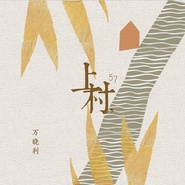
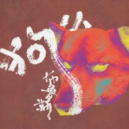
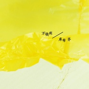
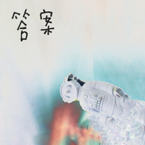
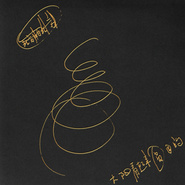
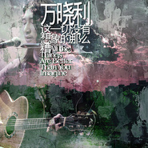
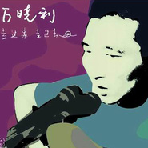

万晓利
============================

|  |  |
| :--: | :-- |
| [ 万晓利](https://i.xiami.com/wanxiaoli) | **地区**: China 中国大陆 **风格**: 城市民谣 Urban Folk **播放数**: 46034051 **粉丝数**: 55281 **评论数**: 942  |

## 档案

万晓利，1971年生于河北。 
1990年至1994年在酒厂上班，其间加入过一些文艺团体。 
1997年来北京至今，娶妻生子。做职业酒吧歌手。 
2002年7月签约Badhead厂牌。 
2002年12月，首张个人现场录音专辑《走过来，走过去》由Badhead发行。 
万晓利一付清瘦的身材，眼睛细长而亮，有修长的手，长发飘飘时像极古龙小说中的剑客。如今光头，更像一个冷静的刺客。黄昏之后，他背着他比剑温柔百倍的武器，和饭后散完步准备回家的人擦身而过，来到最明亮最嘈杂最浮华之地，坐在那些饭后不想回家的人面前，要一杯酒，开始歌唱。 
他的武器是吉他和歌喉。他是我一直赞美的民间艺人。 
荣誉记录：2004年05月第四届华语音乐传媒大奖最佳民谣艺人（提名） 
2007年04月获得第7届音乐风云榜最佳摇滚艺人（提名） 
2007年06月获得第7届华语音乐传媒大赏最佳民谣艺人（获奖）

## 专辑

| 名称 | 语种 | 唱片公司 | 发行时间 | 专辑类别 | 专辑风格 |
| :--: | :-- | :-- | :-- | :-- | :-- |
| [ 上村，57](./albums/2102876291.md) | 国语 | 独立发行 | 2017年10月20日 | EP, 单曲 |  |
| [ 小狗布鲁斯](./albums/2102869441.md) | 国语 | 独立发行 | 2017年10月09日 | EP, 单曲 | 民谣 Folk |
| [ 痛，也不能](./albums/2102865610.md) | 国语 | 独立发行 | 2017年09月29日 | EP, 单曲 | 民谣 Folk |
| [ 库布齐](./albums/2102775159.md) | 国语 | 独立发行 | 2017年07月01日 | EP, 单曲 | 城市民谣 Urban Folk |
| [ 答案](./albums/2102756935.md) | 国语 | 独立发行 | 2017年06月01日 | EP, 单曲 | 独立民谣 Indie Folk |
| [ 你，来替我做个梦](./albums/2102742168.md) | 国语 | 独立发行 | 2017年05月04日 | EP, 单曲 | 根源唱作人 Singer-Songwriter, 迷幻民谣 Psychedelic Folk |
| [ 太阳看起来圆圆的](./albums/1325611865.md) | 国语 | 独立发行 | 2015年03月26日 | 录音室专辑 | 民谣流行 Folk Pop, 独立民谣 Indie Folk, 自由民谣 Free Folk |
| [ 北方的北方](./albums/362373.md) | 国语 | 独立发行 | 2010年01月01日 | 录音室专辑 | 城市民谣 Urban Folk |
| [ 女儿情](./albums/1706253944.md) | 国语 | 独立发行 | 2008年01月01日 | EP, 单曲 | 民谣 Folk |
| [ 这一切没有想象的那么糟](./albums/4419.md) | 国语 | 十三月唱片 | 2006年12月01日 | 录音室专辑 | 城市民谣 Urban Folk |
| [ 走过来 走过去](./albums/4420.md) | 国语 | BadHead | 2002年12月01日 | 录音室专辑 | 城市民谣 Urban Folk |

## 评论

|  |  |  |
| :-- | :-- | :-- |
|  [虾米用户](https://emumo.xiami.com/u/443220366)  2020-10-15 18:25 赞(1) 踩(0) | 
一生一日｜快且乐之
 |
|  [虾米用户](https://emumo.xiami.com/u/352433343)  2020-10-15 18:07 赞(1) 踩(0) | 
开开心心每一天，快快乐乐做音乐
 |
|  [虾米用户](https://emumo.xiami.com/u/422170353) 不乱于心 2020-10-15 14:23 赞(1) 踩(0) | 
偶像，生快，为你着迷！
 |
|  [虾米用户](https://emumo.xiami.com/u/442373169) 干啥啥不行，吃饭第一名 2020-10-15 11:07 赞(1) 踩(0) | 
happy Birthdday～
 |
|  [虾米用户](https://emumo.xiami.com/u/230803304) 三观正又爱国的成都宝藏男... 2020-10-15 10:27 赞(1) 踩(0) | 
生日快乐
 |
|  [虾米用户](https://emumo.xiami.com/u/12293200) 定破依执，渡人自渡，善源... 2020-10-15 10:03 赞(0) 踩(0) | 
生日快乐
 |
|  [虾米用户](https://emumo.xiami.com/u/277139534) 归置零点，一同带入太空 2020-08-18 18:28 赞(0) 踩(0) | 
这个唱腔真迷人 
 |
|  [虾米用户](https://emumo.xiami.com/u/261503643)  2020-08-07 16:38 赞(0) 踩(0) | 
老乡好，好久不见。 嫂子的电话我给整丢了
 |
| ⇒ |  [虾米用户](https://emumo.xiami.com/u/261503643)  2020-08-07 16:39 赞(0) 踩(0) | 
最近回磁县来没有
 |
|  [虾米用户](https://emumo.xiami.com/u/256520683)  2019-12-15 20:38 赞(0) 踩(0) | 
赞同龄人
 |
|  [虾米用户](https://emumo.xiami.com/u/358796008)  2019-10-20 21:57 赞(0) 踩(0) | 
喜欢你的歌，赞
 |
|  [虾米用户](https://emumo.xiami.com/u/344018512) 我还没想好要写什么... 2019-09-02 02:03 赞(0) 踩(0) | 
D
 |
|  [虾米用户](https://emumo.xiami.com/u/366908069) 一次独自跋涉的盛宴 2019-08-26 23:57 赞(0) 踩(0) | 
如此一位极具魅力的人
 |
|  [虾米用户](https://emumo.xiami.com/u/409520609) 觉，是一个瞬间，悟，是一... 2019-02-26 16:32 赞(2) 踩(0) | 
唱的非常好，加油，继续
 |
|  [虾米用户](https://emumo.xiami.com/u/274863577) 我还没想好要写什么... 2019-01-05 21:52 赞(1) 踩(0) | 
每次看到别人一说万总就是女儿情的就有种莫名的厌恶感
 |
|  [虾米用户](https://emumo.xiami.com/u/47510491)  2018-12-08 23:08 赞(0) 踩(0) | 
我们河北人 
 |
|  [虾米用户](https://emumo.xiami.com/u/277133872)  2018-10-29 07:49 赞(2) 踩(0) | 
送你花花
 |
|  [虾米用户](https://emumo.xiami.com/u/1948315)  2018-10-26 09:50 赞(0) 踩(0) | 
是不是每次唱歌前都喝了酒？微醉的唱腔
 |
|  [虾米用户](https://emumo.xiami.com/u/2130824) 有想法有做法 2018-10-19 11:04 赞(0) 踩(0) | 
怎么女儿情上了热榜啦？狐狸 流氓 走过来挺好的，建议大家听。
 |
|  [虾米用户](https://emumo.xiami.com/u/10555171) 名字就不改了 2018-10-15 22:11 赞(0) 踩(0) | 
你是天秤座
 |
|  [虾米用户](https://emumo.xiami.com/u/7572988)  2018-10-15 16:38 赞(0) 踩(0) | 
奇葩的万晓利，祝你一切随你心愿。扎根世俗别脱俗
 |
|  [虾米用户](https://emumo.xiami.com/u/338037527) derrota con ... 2018-10-15 10:11 赞(0) 踩(0) | 
河北骄傲
 |
|  [虾米用户](https://emumo.xiami.com/u/254264443)  2018-10-15 10:05 赞(0) 踩(0) | 
愿你生日快乐！万爷
 |
|  [虾米用户](https://emumo.xiami.com/u/346087991) 医路漫漫 音乐为伴 2018-10-15 10:03 赞(0) 踩(0) | 
生日快乐 天天有歌唱 
 |
|  [虾米用户](https://emumo.xiami.com/u/339326597) 我是街上的游魂，而你是闻... 2018-10-15 10:02 赞(2) 踩(0) | 
如果我吻你，你就微笑，我就吻你。 晓利啊，谁人能像我这样对你！   
 |
| ⇒ |  [虾米用户](https://emumo.xiami.com/u/216784802) 好的音乐最重要的是真实，... 2018-10-19 09:06 赞(0) 踩(0) | 
哈哈哈哈哈，原来左小的老婆是。。。
 |
|  [虾米用户](https://emumo.xiami.com/u/334687993)   2018-10-15 10:02 赞(0) 踩(0) | 
这一切没有想象的那么糟 Love U 
 |
|  [虾米用户](https://emumo.xiami.com/u/359083733) 水沟里见 2018-10-15 10:01 赞(0) 踩(0) | 
岁岁平安
 |
|  [虾米用户](https://emumo.xiami.com/u/344296866) 我不想死。死了就不能听音... 2018-10-03 09:27 赞(1) 踩(0) | 
在做新歌吗
 |
|  [虾米用户](https://emumo.xiami.com/u/379769021)  2018-07-26 16:52 赞(0) 踩(0) | 
讲武城路过
 |
|  [虾米用户](https://emumo.xiami.com/u/342061321)  2018-06-23 16:05 赞(0) 踩(0) | 
老乡 
 |
|  [虾米用户](https://emumo.xiami.com/u/258316582) 舍我其谁 2018-06-07 20:34 赞(1) 踩(0) | 
这种音乐就是毒品。它能通过控制情绪的&amp;alpha;波、使人处于清醒和梦幻之间的&amp;theta;波以及令人兴奋的&amp;beta;波等各种频率，使人进入幻觉状态。让听者产生严重的行为异常，轻者乱抖，胡言乱语。重者无故下跪，耳朵怀孕，产生战争幻觉，感觉自己重任在肩，要去拯救世界了&amp;hellip;&amp;hellip;
 |
|  [虾米用户](https://emumo.xiami.com/u/314533912) 吹牛逼可以 叫板一律拍死 2018-06-06 07:36 赞(0) 踩(0) | 
我只是下载了杨坤的&amp;ldquo;答案&amp;rdquo;
 |
|  [虾米用户](https://emumo.xiami.com/u/51509812)   2018-05-03 21:06 赞(0) 踩(0) | 
他跟我妈差不多大哈哈
 |
|  [虾米用户](https://emumo.xiami.com/u/357530645)  2018-04-10 07:28 赞(0) 踩(0) | 
非常棒的嗓音，女儿情唱出了味道，河北老乡，加油
 |
|  [虾米用户](https://emumo.xiami.com/u/25238186) . 2018-04-07 23:16 赞(0) 踩(0) | 
天津场  明天见
 |
|  [虾米用户](https://emumo.xiami.com/u/19360239)  2018-03-30 23:46 赞(0) 踩(0) | 
西安光圈club , 2018.03.30
 |
|  [虾米用户](https://emumo.xiami.com/u/311538642) 回到現實吧孩子 2018-03-25 11:31 赞(0) 踩(0) | 
万总真的是太好了
 |
|  [虾米用户](https://emumo.xiami.com/u/275670182) 忧郁温柔的，有八块腹肌的... 2018-02-21 06:14 赞(0) 踩(0) | 
我觉得他是个很牛逼的人物 非常严肃有深度的民谣歌手
 |
|  [虾米用户](https://emumo.xiami.com/u/45120098) 。 2018-01-08 20:59 赞(1) 踩(0) | 
为什么新歌这里没有
 |
|  [虾米用户](https://emumo.xiami.com/u/29394245)  2017-12-27 07:16 赞(0) 踩(0) | 
不爱你是不对的  找不到这首歌
 |
|  [虾米用户](https://emumo.xiami.com/u/262486137)  2017-12-06 00:24 赞(1) 踩(0) | 
原来万总用虾米听的多 然而大把的版权在网易云手里 
 |
|  [虾米用户](https://emumo.xiami.com/u/279292687)  2017-11-22 17:55 赞(0) 踩(0) | 
可以
 |
|  [虾米用户](https://emumo.xiami.com/u/5577839) ☯☯☯ 2017-11-10 06:56 赞(1) 踩(0) | 
流氓怎么没了？
 |
|  [虾米用户](https://emumo.xiami.com/u/111955128)  2017-10-30 09:53 赞(1) 踩(0) | 
万晓利 喜欢就是喜欢 没有被捧 没有因为谁 伪装不来 牛逼到爆炸 歌声可以听醉
 |
|  [虾米用户](https://emumo.xiami.com/u/3805278) 我还没想好要写什么... 2017-10-30 09:51 赞(1) 踩(0) | 
生命里最舍不得的那一页，藏得总是最深 也总是会有---重重叠叠---无心留下 生活中最喜欢听的那一首歌，听得总是那么入神 也总是习惯---反反复复---无限循环-------Send
 |
|  [虾米用户](https://emumo.xiami.com/u/1493697)  2017-10-28 00:09 赞(0) 踩(0) | 
真他妈的惊喜！！
 |
|  [虾米用户](https://emumo.xiami.com/u/298948030) 中國詩音樂電影创始人作曲... 2017-10-17 22:00 赞(0) 踩(0) | 
你好
 |
|  [虾米用户](https://emumo.xiami.com/u/95062486) “时间过得很快”“可也没... 2017-10-13 17:50 赞(0) 踩(0) | 
万总玩转了各种发型，同样玩转了各种音乐
 |
|  [虾米用户](https://emumo.xiami.com/u/1219739) 心有猛虎细嗅蔷薇~ 2017-10-10 16:15 赞(1) 踩(0) | 
民谣第一就要听 万晓利的 首先因为声线 就算干说也有代入感（迷人） 有复古感代入感，二是讽刺凄凉的曲风   最近的新歌 略听不懂  有些迷幻 太自我了 但是我还是要跟随你的脚步  步步紧逼出了 就听 最好能看到现场我才能满足~
 |
|  [虾米用户](https://emumo.xiami.com/u/36694374)  2017-07-29 14:58 赞(4) 踩(0) | 
邯郸人顶一个  
 |
|  [虾米用户](https://emumo.xiami.com/u/13173319) mmmm hasjmj 2017-07-13 13:58 赞(0) 踩(0) | 
赞
 |
|  [虾米用户](https://emumo.xiami.com/u/56159)   2017-07-04 12:00 赞(3) 踩(0) | 
最近高产似母猪
 |
|  [虾米用户](https://emumo.xiami.com/u/36861322) 潇潇洒洒走人生 2017-06-04 18:36 赞(0) 踩(0) | 
好听
 |
|  [虾米用户](https://emumo.xiami.com/u/300993713)  2017-06-01 14:29 赞(2) 踩(0) | 
这里没有邯郸的朋友吗
 |
|  [虾米用户](https://emumo.xiami.com/u/265784089)  2017-05-21 21:34 赞(0) 踩(0) | 
。。。。
 |
|  [虾米用户](https://emumo.xiami.com/u/3130620)  2017-05-10 01:05 赞(0) 踩(0) | 
适合夜深人静戴上耳机一个人听
 |
|  [虾米用户](https://emumo.xiami.com/u/20004883)  2017-05-04 22:44 赞(0) 踩(0) | 
必须耳机听。静静听。不然没有身灵其境的
 |
|  [虾米用户](https://emumo.xiami.com/u/20004883)  2017-05-04 22:43 赞(0) 踩(0) | 
和童年不一样的风格，和外婆的澎湖湾有着同样的感触。幻眠怀念
 |
|  [虾米用户](https://emumo.xiami.com/u/1208385) “你叫我阿？” 2017-05-04 22:05 赞(0) 踩(0) | 
听歌不看人，听声音一直以为是个中年胖子，笑容温和，直到新单曲封面通过虾米推送到了首页&amp;hellip;&amp;hellip; 
 |
|  [虾米用户](https://emumo.xiami.com/u/252028707)  2017-05-04 21:46 赞(1) 踩(0) | 
莫名的喜欢，莫名的心静，莫名的明白，莫名的哭泣，莫名的心痛
 |
|  [虾米用户](https://emumo.xiami.com/u/262158089) 我想美天开心心的一天 2017-05-04 11:43 赞(0) 踩(0) | 
我想哭了
 |
|  [虾米用户](https://emumo.xiami.com/u/11105318) 我是个很懒很懒的人，懒到... 2017-05-04 02:23 赞(1) 踩(0) | 
热评第一条我看不懂 
 |
| ⇒ |  [虾米用户](https://emumo.xiami.com/u/241108571) lalalay 2017-05-04 19:38 赞(0) 踩(0) | 
其实热评我都看不懂  
 |
|  [虾米用户](https://emumo.xiami.com/u/250651138) 我回来了 2017-05-04 00:32 赞(29) 踩(0) | 
万晓利本来就很火的 只是没踏足这个领域所以就不知道啦 在中国万晓利李志等都是民谣的开山鼻祖 ［成语应该没用错］ 万总很努力 ［废话 都看得到Orz］ 每次想到万总会联想到红色 小红！我来了到虾米看你［盯~］(=&amp;bull;̀口&amp;bull;́=)و✧
 |
| ⇒ |  [虾米用户](https://emumo.xiami.com/u/2063893) 向死而生，向生而歌 2017-08-09 23:31 赞(0) 踩(0) | 
成语是没错了，但说开山民谣，老狼等人不服了，台湾胡德夫这些就更不说了&amp;hellip;&amp;hellip;
 |
| ⇒ |  [虾米用户](https://emumo.xiami.com/u/250651138) 我回来了 2017-08-10 08:41 赞(0) 踩(0) | 
<q><b>叶沖说：</b></q>
 |
| ⇒ |  [虾米用户](https://emumo.xiami.com/u/514666) 我两手空空一个拿不出献礼... 2017-09-13 11:15 赞(0) 踩(0) | 
朱芳琼和野孩子乐队，才是中国民谣的先行者。 1997年8月23日，野孩子在兰州举办了专场演出。 1997年底，&amp;ldquo;龙民音乐&amp;rdquo;出版的合辑《拼音》中收录了朱芳琼的《火舞》和《土地》。
 |
|  [虾米用户](https://emumo.xiami.com/u/40505012)   2017-04-20 20:13 赞(1) 踩(0) | 
希望虾米能在每个歌手界面加个介绍
 |
|  [虾米用户](https://emumo.xiami.com/u/13557071) 那些日子你会不会舍不得 2017-02-14 15:20 赞(0) 踩(0) | 
这一切没有想象的那么糟
 |
|  [虾米用户](https://emumo.xiami.com/u/263749238)  2017-02-09 13:13 赞(1) 踩(0) | 
那天受了委屈，听到《狐狸》时忍不住哭了。现在的生活过的还是不称心，而你却好久没唱歌了。
 |
| ⇒ |  [虾米用户](https://emumo.xiami.com/u/270154446) 过好生活 2017-04-17 07:54 赞(0) 踩(0) | 
加油～
 |
|  [虾米用户](https://emumo.xiami.com/u/4754721)   2017-01-24 19:12 赞(0) 踩(0) | 
很喜欢你的作品，期待新作品 
 |
|  [虾米用户](https://emumo.xiami.com/u/249937070) 人生若无悔放下过去归零 2017-01-08 07:54 赞(2) 踩(0) | 
这辈子人不甘心的事情多了去了，如果每一件事情都要那么在意，那会很累吧。生活的最高境界是宽容，相处的最高境界是尊重。
 |
|  [虾米用户](https://emumo.xiami.com/u/41134022)  2016-12-24 22:27 赞(0) 踩(0) | 
口琴响起时，我要哭了.....
 |
|  [虾米用户](https://emumo.xiami.com/u/44140680) 旅途愉快 2016-12-16 11:20 赞(0) 踩(0) | 
⚫️
 |
|  [虾米用户](https://emumo.xiami.com/u/8734466)  2016-12-13 14:48 赞(0) 踩(0) | 
新民谣，慵懒的哼唱
 |
|  [虾米用户](https://emumo.xiami.com/u/223821334) 我年少时 也曾策马扬鞭看... 2016-12-10 17:52 赞(1) 踩(0) | 
有一天 漫天的羽毛飞舞 你我终于成为了自由的鸟儿
 |
|  [虾米用户](https://emumo.xiami.com/u/26286751) 我还没想好要写什么... 2016-12-02 17:03 赞(0) 踩(0) | 
向有实验精神的音乐人致敬
 |
|  [虾米用户](https://emumo.xiami.com/u/9142282) 微博：FEVER_DOG... 2016-10-24 22:24 赞(0) 踩(0) | 
最喜欢 走过来走过去 专辑 有劲儿
 |
|  [虾米用户](https://emumo.xiami.com/u/77630102) 视之不见，听之不闻，搏之... 2016-10-22 19:11 赞(0) 踩(0) | 
相中的好歌赶紧下，过几天都没了
 |
|  [虾米用户](https://emumo.xiami.com/u/2395266)  2016-10-09 16:46 赞(0) 踩(0) | 
有10月28号重庆mao一起的妹纸吗
 |
|  [虾米用户](https://emumo.xiami.com/u/19925527) 我还没想好要写什么... 2016-10-07 02:41 赞(0) 踩(0) | 
今晚的live 真的很燃 不过瘾
 |
|  [虾米用户](https://emumo.xiami.com/u/54302732) 就像一个多鸟的夏天 2016-10-06 22:54 赞(4) 踩(0) | 
今晚广州场超多亮点！！万总电脑合成最近玩得很6啊！！万众瞩目的《狐狸》混得超酷！！！数星星感觉能听一辈子！！！另外带女儿到全国唱歌不要太有爱！！（女儿声音也好好听&amp;gt;3）下次什么时候还来啊万总！！！弹吉他的男人最有魅力了啊啊啊！！！（而且字也很好看qwq）
 |
|  [虾米用户](https://emumo.xiami.com/u/7206504) 一天两包中南海 2016-10-06 21:15 赞(2) 踩(0) | 
广州TU凸现场打卡  真是太NB了  你以为万晓利只玩民谣？ 这现场改编的都太棒了  先锋实验电子老万都玩的太溜了 [带墨镜笑][带墨镜笑]
 |
|  [虾米用户](https://emumo.xiami.com/u/34873487) 我还没想好要写什么... 2016-09-30 23:07 赞(0) 踩(0) | 
在他的现场   玩的很实验很超前。改编过的歌 用力过猛音乐织体太乱估计没多少人听懂
 |
|  [虾米用户](https://emumo.xiami.com/u/13691875) 谁的感叹 偶然合拍 2016-09-30 21:16 赞(0) 踩(0) | 
武汉1024
 |
|  [虾米用户](https://emumo.xiami.com/u/211454135) 松鼠君的好基友(❁´ω`... 2016-09-23 11:40 赞(0) 踩(0) | 
那年第一次看民谣现场，这一切没有想象的那么糟，听哭了。
 |
|  [虾米用户](https://emumo.xiami.com/u/32032050) Running to s... 2016-09-18 18:08 赞(0) 踩(0) | 
巡演怎麼樣？有人看了嗎
 |
| ⇒ |  [虾米用户](https://emumo.xiami.com/u/312179) 潜入深蓝，放肆幻听 2016-12-19 21:43 赞(0) 踩(0) | 
比民谣惊喜还多。现场太迷幻了。当然听惯民谣的也许听不惯电子。
 |
|  [虾米用户](https://emumo.xiami.com/u/30678181)   2016-09-18 12:50 赞(0) 踩(0) | 
昨晚效果感觉不太行
 |
|  [虾米用户](https://emumo.xiami.com/u/5968552) 虾小米，我爱你所以讲不出... 2016-09-18 01:07 赞(0) 踩(0) | 
9.17 北京乐空间回。三人组带来的可能性特别美好。 一年一次北京专场的节奏拜托维持好。
 |
|  [虾米用户](https://emumo.xiami.com/u/207653061)  2016-08-01 12:49 赞(0) 踩(0) | 
好听
 |
|  [虾米用户](https://emumo.xiami.com/u/2279444) 爱在左，同情在右。 2016-06-17 16:56 赞(2) 踩(0) | 
每隔一段时间都会来重新听一遍万总，即使我有万总的所有唱片，但都没舍得听，期盼每一次听都有新的东西出现。
 |
|  [虾米用户](https://emumo.xiami.com/u/182428664)  2016-05-29 15:34 赞(0) 踩(0) | 
最喜欢的民谣歌手
 |
|  [虾米用户](https://emumo.xiami.com/u/43405896)  2016-05-25 08:37 赞(1) 踩(0) | 
超喜欢万总
 |
|  [虾米用户](https://emumo.xiami.com/u/120192098)  2016-05-22 23:33 赞(0) 踩(0) | 
好听
 |
|  [虾米用户](https://emumo.xiami.com/u/5014073)  2016-05-20 22:55 赞(0) 踩(0) | 
女儿情怎么跑第一了= =
 |
|  [虾米用户](https://emumo.xiami.com/u/32032050) Running to s... 2016-05-16 13:53 赞(0) 踩(0) | 
誰知道他的epiphone是什麼型號
 |
|  [虾米用户](https://emumo.xiami.com/u/52542616)   2016-05-09 16:16 赞(1) 踩(0) | 
万总不管是歌还是做人都值得捧
 |
|  [虾米用户](https://emumo.xiami.com/u/13984281) 庙小妖风大！ 2016-04-26 11:28 赞(0) 踩(0) | 

 |
|  [虾米用户](https://emumo.xiami.com/u/2205249) 囿 2016-04-08 15:34 赞(2) 踩(0) | 
七年前听鸟语，如今都是一腔女儿情……
 |
|  [虾米用户](https://emumo.xiami.com/u/118347948) 杂食动物 2016-04-07 06:38 赞(2) 踩(0) | 
世上唯一懂鸟语的人死在了2006
 |
|  [虾米用户](https://emumo.xiami.com/u/10384607) 空山無人，水流花開。 2016-03-29 22:19 赞(0) 踩(0) | 
耶？补充下档案啊
 |
|  [虾米用户](https://emumo.xiami.com/u/48211350) 已弃虾米，勿扰 2016-03-27 21:12 赞(0) 踩(0) | 
牛逼
 |
|  [虾米用户](https://emumo.xiami.com/u/35288437) 1234567890 2016-03-13 05:01 赞(0) 踩(0) | 

 |
|  [虾米用户](https://emumo.xiami.com/u/116939284)  2016-02-23 23:23 赞(1) 踩(0) | 
对于这样的评论只能说没见识
 |
|  [虾米用户](https://emumo.xiami.com/u/42625619)  2016-02-22 19:23 赞(0) 踩(0) | 
喜欢民谣
 |
|  [虾米用户](https://emumo.xiami.com/u/52521480) 酷到沒辦法 2016-01-20 20:35 赞(1) 踩(0) | 
姑娘你到底是个什么样的人
 |
|  [虾米用户](https://emumo.xiami.com/u/9360414) 我比一只昆虫小 2016-01-19 07:38 赞(10) 踩(0) | 
喜欢一个歌手，如果恰好这个歌手还是很谦和的人，那简直会珍惜得不能够。
 |
|  [虾米用户](https://emumo.xiami.com/u/49666444) 音乐随心 2016-01-17 19:51 赞(0) 踩(0) | 
吉他伴唱---好听的
 |
|  [虾米用户](https://emumo.xiami.com/u/97433236) 简简单单！ 2016-01-14 18:31 赞(0) 踩(0) | 
兔子比狐狸狡猾了~~~
 |
|  [虾米用户](https://emumo.xiami.com/u/81027294)  2016-01-12 15:14 赞(1) 踩(0) | 
这首歌听得我眼泪流不停<a href="http://www.xiami.com/play?ids=/song/playlist/id/1775408290/object_name/default/object_id/0#loaded" target="_blank" rel="nofollow noreferrer noopener">http://www.xiami.com/play?ids=/song/playlist/id/1775408290/object_name/default/object_id/0#loaded</a>
 |
|  [虾米用户](https://emumo.xiami.com/u/50656265) 继续努力吧妹子… 2016-01-01 08:38 赞(2) 踩(0) | 
迷笛见了 
 |
|  [虾米用户](https://emumo.xiami.com/u/3839559)  2015-12-30 18:57 赞(12) 踩(0) | 
万晓利是国内民谣最强没有之一。
 |
|  [虾米用户](https://emumo.xiami.com/u/32154) 十一月的雨 冰冷彻骨 2015-12-25 17:35 赞(1) 踩(0) | 
我喜欢这嗓音
 |
|  [虾米用户](https://emumo.xiami.com/u/344062)  2015-12-23 00:07 赞(2) 踩(0) | 
国内这群玩美式民谣的，晓利是最好的，耍麻油叶、李志一条街
 |
|  [虾米用户](https://emumo.xiami.com/u/3983650)  2015-12-19 21:10 赞(1) 踩(0) | 
时间太快，有些歌已经是绝唱
 |
|  [虾米用户](https://emumo.xiami.com/u/3983650)  2015-12-19 21:07 赞(1) 踩(0) | 
我特想听那首：誰惹得你生气 沮丧的小伙子 哦是他骗走了你的铅笔  那时候听说是您的女儿唱的。可是怎么找也找不到那个版本
 |
| ⇒ |  [虾米用户](https://emumo.xiami.com/u/94314664)  2015-12-25 01:41 赞(0) 踩(0) | 
我有
 |
| ⇒ |  [虾米用户](https://emumo.xiami.com/u/94314664)  2015-12-25 01:42 赞(0) 踩(0) | 
我有那个版本的...
 |
|  [虾米用户](https://emumo.xiami.com/u/45982173)   2015-12-12 23:34 赞(2) 踩(0) | 
民谣老一代了 有岁月悲鸣沉淀的味道 麻油叶组合和他比起来差远了 爱民谣这么久 听了这么多民谣歌手的乐曲 大概也只有他的歌才有这种岁月的痕迹 像流水潺潺淌过我皮肤 你的嘴里醉民谣 
 |
|  [虾米用户](https://emumo.xiami.com/u/82410584) 各种懒。人还好。 2015-12-09 13:48 赞(1) 踩(0) | 
这一切没有想象的那么糟，因为这首歌来的
 |
|  [虾米用户](https://emumo.xiami.com/u/43776939)  2015-12-09 11:36 赞(1) 踩(0) | 
万叔 迷笛见！
 |
|  [虾米用户](https://emumo.xiami.com/u/6388480)  2015-12-05 20:09 赞(0) 踩(0) | 
适合静下心来听的一系列歌
 |
|  [虾米用户](https://emumo.xiami.com/u/5968515) 听吧。 2015-11-25 22:59 赞(0) 踩(0) | 
狐狸！
 |
|  [虾米用户](https://emumo.xiami.com/u/9526546) 没有自救会的世界 2015-11-14 01:32 赞(1) 踩(0) | 
我为啥那么爱听《狐狸》
 |
|  [虾米用户](https://emumo.xiami.com/u/28178674) 一不小心活成了别人想要的... 2015-11-11 21:20 赞(1) 踩(0) | 
13号见
 |
|  [虾米用户](https://emumo.xiami.com/u/784923) 镜头晃得我有些晕 2015-11-10 17:33 赞(1) 踩(0) | 
万总，１３号米房ＣＡＩ见
 |
|  [虾米用户](https://emumo.xiami.com/u/8141873)  2015-11-06 23:27 赞(0) 踩(0) | 
现场回来！万总的嗓音现场更好听！
 |
|  [虾米用户](https://emumo.xiami.com/u/28576013) 一只爱吃歌的蚊子~0.0 2015-10-27 19:17 赞(1) 踩(0) | 
觉得难听干嘛来听嘛，不少某几个评论的人
 |
|  [虾米用户](https://emumo.xiami.com/u/30617820) 窝列大窝列大哟 2015-10-19 20:01 赞(0) 踩(0) | 
回家的路上无意中听到了他唱的《女儿情》就爱上了
 |
| ⇒ |  [虾米用户](https://emumo.xiami.com/u/30617820) 窝列大窝列大哟 2015-10-19 23:39 赞(0) 踩(0) | 
→_→→_→→_→→_→→_→→_→→_→→_→→_→→_→→_→→_→→_→→_→→_→→_→→_→→_→→_→→_→→_→→_→→_→→_→→_→→_→→_→→_→→_→→_→→_→→_→→_→→_→→_→
 |
|  [虾米用户](https://emumo.xiami.com/u/30617820) 窝列大窝列大哟 2015-10-19 09:19 赞(0) 踩(0) | 
嗯
 |
|  [虾米用户](https://emumo.xiami.com/u/42673583) 顺风不浪 逆风不怂 2015-10-17 23:56 赞(0) 踩(0) | 
❤
 |
|  [虾米用户](https://emumo.xiami.com/u/55103117)   2015-10-05 14:23 赞(0) 踩(0) | 
因为大冰
 |
|  [虾米用户](https://emumo.xiami.com/u/37153482) 去你妈的 2015-09-29 00:38 赞(0) 踩(0) | 
大嘴
 |
|  [虾米用户](https://emumo.xiami.com/u/9127105)   2015-09-23 16:11 赞(1) 踩(0) | 
看过他在一席上演讲弹琴。感觉万晓利是我见过吉他弹得最好的民谣歌手了，
 |
|  [虾米用户](https://emumo.xiami.com/u/54369727) 这家伙真的很聪明什么也没... 2015-09-22 16:35 赞(0) 踩(0) | 
非常难听
 |
|  [虾米用户](https://emumo.xiami.com/u/35003335)  2015-09-16 03:21 赞(0) 踩(0) | 
One More Shot（再来一发）是一支来自上海的95后新派女声金属核乐队，组建于2014年10月,就如同我们的乐队名一样没有什么思想和精神，有的只是年轻和冲动，主唱和吉他贝斯均为95后，预示着一股95后的年轻金属力量正在袭来,在经历了一系列的人员变动之后，于2月正式准备录制乐队第一张EP。  主唱/Vocal:阿楼 吉他/Lead Guitar:天龙 贝斯/Bass:曼森 鼓手/Drum:王远      豆瓣小站： <a href="http://site.douban.com/onemoreshot/" target="_blank" rel="nofollow noreferrer noopener">http://site.douban.com/onemoreshot/</a>  新浪微薄： <a href="http://weibo.com/onemoreshot" target="_blank" rel="nofollow noreferrer noopener">http://weibo.com/onemoreshot</a>
 |
| ⇒ |  [虾米用户](https://emumo.xiami.com/u/9127105)   2015-09-23 16:12 赞(0) 踩(0) | 
有必要介么宣传么？
 |
| ⇒ |  [虾米用户](https://emumo.xiami.com/u/5990517)  2015-10-09 23:00 赞(0) 踩(0) | 
One More Shot 比 再来一发 好听吗
 |
|  [虾米用户](https://emumo.xiami.com/u/65041286)  2015-09-15 08:28 赞(0) 踩(0) | 
民谣
 |
|  [虾米用户](https://emumo.xiami.com/u/59272536)  2015-09-11 17:36 赞(1) 踩(0) | 
新曲
 |
|  [虾米用户](https://emumo.xiami.com/u/16012805) 我还没想好要写什么... 2015-09-10 11:43 赞(1) 踩(0) | 
中国民谣的代表！
 |
|  [虾米用户](https://emumo.xiami.com/u/18213759)  2015-09-04 17:00 赞(0) 踩(0) | 
为什么叫万总
 |
|  [虾米用户](https://emumo.xiami.com/u/4910464) W 2015-08-19 21:43 赞(0) 踩(0) | 
似乎在看天下还是哪里见过他。感觉好火=3=
 |
|  [虾米用户](https://emumo.xiami.com/u/37936026)   2015-08-19 08:39 赞(2) 踩(0) | 
说句大实话，确实挺难听的。但是，很有特色，咱们就缺这种
 |
| ⇒ |  [虾米用户](https://emumo.xiami.com/u/44343092) 任凭风雨 2015-09-06 21:22 赞(0) 踩(0) | 
只是你觉得难听吧
 |
|  [虾米用户](https://emumo.xiami.com/u/55157333)  2015-08-13 18:20 赞(0) 踩(0) | 
万总忧伤
 |
|  [虾米用户](https://emumo.xiami.com/u/2780135) 我一点不懂摇滚，你别喷我... 2015-08-11 15:53 赞(1) 踩(0) | 
艳遇呢？
 |
|  [虾米用户](https://emumo.xiami.com/u/54122740)  2015-08-10 00:29 赞(0) 踩(0) | 
土豆那首歌...
 |
|  [虾米用户](https://emumo.xiami.com/u/50461910) MJ 2015-08-07 21:17 赞(0) 踩(0) | 
雨夜听听…
 |
|  [虾米用户](https://emumo.xiami.com/u/54312947)  2015-08-05 21:36 赞(0) 踩(0) | 
好听
 |
|  [虾米用户](https://emumo.xiami.com/u/50762422) 唱首歌让我爱上你 2015-07-28 00:12 赞(1) 踩(0) | 
因为狐狸知道的万晓利 当时听到就觉得 真是个胆大的人阿:) （还有韩寒和女儿红有什么关系吗…
 |
| ⇒ |  [虾米用户](https://emumo.xiami.com/u/8094301) Bye bye wx n... 2015-09-02 12:14 赞(0) 踩(0) | 
韩寒《后会无期》原声里有首万晓利的《女儿情》，基本上因为这歌儿才走入大众视野
 |
| ⇒ |  [虾米用户](https://emumo.xiami.com/u/291981416)  2017-04-28 10:29 赞(0) 踩(0) | 
<q><b>说：</b></q>
 |
|  [虾米用户](https://emumo.xiami.com/u/27626484)  2015-07-13 17:20 赞(0) 踩(0) | 
民谣
 |
|  [虾米用户](https://emumo.xiami.com/u/1308967) 虾米听重型极端音乐这块的... 2015-07-12 07:29 赞(3) 踩(0) | 
火了也好..红了也好..万总可以赚点钱了.. 回到家了..拿起琴了..对着电脑安安静静唱歌去了.. PS了 liao音.
 |
|  [虾米用户](https://emumo.xiami.com/u/51493723) 21世纪，李二蛋的一天及... 2015-07-11 23:22 赞(0) 踩(0) | 
江苏徐州根音朋克贝斯组乐队
 |
|  [虾米用户](https://emumo.xiami.com/u/8094301) Bye bye wx n... 2015-07-05 16:20 赞(20) 踩(0) | 
我能说我觉得万总是民谣界最帅的吗
 |
| ⇒ |  [虾米用户](https://emumo.xiami.com/u/3815293) baby Jesus s... 2018-03-08 18:12 赞(0) 踩(0) | 
准了
 |
| ⇒ |  [虾米用户](https://emumo.xiami.com/u/353526903) PREFER NOT T... 2019-12-06 03:54 赞(0) 踩(0) | 
尧十三不服
 |
|  [虾米用户](https://emumo.xiami.com/u/36536789) 深锁广寒宫殿 2015-07-02 00:28 赞(0) 踩(0) | 
红红火火
 |
|  [虾米用户](https://emumo.xiami.com/u/449354) 我还没想好要写什么... 2015-06-28 11:15 赞(18) 踩(0) | 
万晓利最糟糕的一首歌，没有之一，只有之最，可笑的是它竟然爬上了热门歌曲的第一位，恰恰说明了大众审美的恶趣味，没有最俗只有更俗。昨天在他的现场，看得出他极不愿唱这首，无奈无脑的太多，脑残的存在也有其合理性。现场的某些女性也确实让人无语啊，竟然有人喊出了“万总，我要给你生孩子”的口号，万晓利很尴尬的笑笑：“女性真是解放了啊！”我旁边一哥们表示很无力“青岛的小蔓儿……” 。马了隔壁的，青岛哪有这样的表字蔓儿，还不知道从哪片野地里窜出来的呢。哥置身于人群之中暗暗的骂道……
 |
| ⇒ |  [虾米用户](https://emumo.xiami.com/u/205735) 芒果的体型能变成黄瓜的么 2015-08-22 12:12 赞(0) 踩(0) | 
这首歌，还是让大众知道了他，也不见得全是坏事。就像杭盖，不去中国好歌曲的话，那么喜欢他们的人还局限在喜欢民族摇滚和蒙古音乐的一小圈，唱耳熟能详的歌，确实更加容易巩固群众基础。 他是一个安静的人，可能不喜欢太广泛的被人注视或者太热烈的示爱方式，在二手玫瑰的现场，有一个男的高呼“吴老二我喜欢你，我要给你生儿子”，我猜当时吴总的心里也是崩溃的。。你知道，二手玫瑰一直是那种耍贱耍噪大俗套的人，可当一个男的这么喊的时候，也是蛮尴尬的。这是一句浓烈的示爱金句，可是谁都不好接。。。
 |
|  [虾米用户](https://emumo.xiami.com/u/449354) 我还没想好要写什么... 2015-06-28 11:12 赞(17) 踩(0) | 
煞笔们就知道一首女儿红，老万是靠这首破歌红了？真他妈替老万不平。
 |
| ⇒ |  [虾米用户](https://emumo.xiami.com/u/330944)  2015-07-28 21:09 赞(0) 踩(0) | 
你是觉得许镜清写得破还是万晓利唱的破
 |
| ⇒ |  [虾米用户](https://emumo.xiami.com/u/449354) 我还没想好要写什么... 2015-07-29 00:30 赞(0) 踩(0) | 
<q><b>yuelin说：</b></q>
 |
| ⇒ |  [虾米用户](https://emumo.xiami.com/u/28113352)   2015-08-02 19:56 赞(0) 踩(0) | 
你是替自己不平吧
 |
| ⇒ |  [虾米用户](https://emumo.xiami.com/u/449354) 我还没想好要写什么... 2015-08-02 21:27 赞(0) 踩(0) | 
<q><b>jump man说：</b></q>
 |
| ⇒ |  [虾米用户](https://emumo.xiami.com/u/28113352)   2015-08-03 09:00 赞(0) 踩(0) | 
<q><b>我家狗叫雷克斯，黑色的说：</b></q>
 |
| ⇒ |  [虾米用户](https://emumo.xiami.com/u/343203866) 我还没想好要写什么... 2018-12-10 22:26 赞(0) 踩(0) | 
<q><b>我家狗叫雷克斯，黑色的说：</b></q>
 |
| ⇒ |  [虾米用户](https://emumo.xiami.com/u/419486383) 三月风景，无君不晴。三千... 2019-03-07 07:32 赞(0) 踩(0) | 
谁告诉你我只知道女儿红了？！
 |
|  [虾米用户](https://emumo.xiami.com/u/11142489) 我记得 2015-06-27 23:32 赞(7) 踩(0) | 
老万不需要红，他只爱唱他的歌。
 |
|  [虾米用户](https://emumo.xiami.com/u/13232936) 谁的心让月色照亮无处躲藏 2015-06-27 11:47 赞(0) 踩(0) | 
天了噜怎么那么好听 
 |
|  [虾米用户](https://emumo.xiami.com/u/46550525) 快乐只能大口吞咽，慢慢咀... 2015-06-26 20:41 赞(1) 踩(0) | 
万晓利不仅只唱过女儿情我也不仅仅因为这个喜欢他希望大家还原一个真实温暖的他,他的歌曲直戳现实,真的,听一次万总的歌,才觉得世界并没有那么糟。 喜欢他之后自私的想不让他红,还是那个原始的歌者
 |
|  [虾米用户](https://emumo.xiami.com/u/46550525) 快乐只能大口吞咽，慢慢咀... 2015-06-26 20:41 赞(0) 踩(0) | 
万晓利不仅只唱过女儿情我也不仅仅因为这个喜欢他希望大家还原一个真实温暖的他,他的歌曲直戳现实,真的,听一次万总的歌,才觉得世界并没有那么糟。 喜欢他之后自私的想不让他红,还是那个原始的歌者
 |
|  [虾米用户](https://emumo.xiami.com/u/48860205)  2015-06-26 15:09 赞(0) 踩(0) | 
好爱他喔
 |
|  [虾米用户](https://emumo.xiami.com/u/5556735) =。= 2015-06-16 22:07 赞(0) 踩(0) | 
赫兹今天人超多，特别闷热，象个大蒸笼，音响设备差劲，旁边的听友动来动去最后大喇喇站在我正前方把我挡个严严实实，真TMD够了……今晚失望、带着一身二手烟提前退场……哦对了，土豆很好听
 |
|  [虾米用户](https://emumo.xiami.com/u/77277)  2015-06-16 14:29 赞(0) 踩(0) | 
中国现在那些民谣歌曲旋律基本上都不喜欢，但是万晓利的听来很优美
 |
|  [虾米用户](https://emumo.xiami.com/u/33967167) 我还没想好要写什么... 2015-06-16 10:31 赞(0) 踩(0) | 
现场信号很强，接收到了你的频道
 |
|  [虾米用户](https://emumo.xiami.com/u/42905228)  2015-06-15 23:32 赞(1) 踩(0) | 
昨天沈阳巡演 一首陀螺 什么都值了
 |
|  [虾米用户](https://emumo.xiami.com/u/5046241)  2015-06-12 10:17 赞(0) 踩(0) | 
中国 城市民谣 Urban Folk
 |
|  [虾米用户](https://emumo.xiami.com/u/5556735) =。= 2015-06-11 10:18 赞(0) 踩(0) | 
万总会在6月16号大连赫兹酒吧开嗓……回来再评论
 |
|  [虾米用户](https://emumo.xiami.com/u/708927) 暂无签名~ 2015-06-10 16:49 赞(0) 踩(0) | 
民谣
 |
|  [虾米用户](https://emumo.xiami.com/u/3265149)  2015-06-10 02:33 赞(0) 踩(0) | 
万总今晚在太原（2015.6.9），很专业的乐队。感谢万总陪我们度过了一个美丽的夜晚。不管哪首歌被谁唱红了，It does not matter。好音乐就该被更多的人听到，我现在就很喜欢新专辑里的歌。万总，有机会再来！祝好！
 |
|  [虾米用户](https://emumo.xiami.com/u/42596005)  2015-06-09 00:30 赞(0) 踩(0) | 
突然发现我家和万总家是邻县，万总 过年儿啥的能要个签名儿嘛 俺临漳的
 |
|  [虾米用户](https://emumo.xiami.com/u/3702212)  2015-06-02 22:53 赞(1) 踩(0) | 
从葵Live house归来，转啊转
 |
|  [虾米用户](https://emumo.xiami.com/u/5602550) 善了个哉呐 2015-06-01 13:08 赞(3) 踩(0) | 
昨晚在银川铜管live house 酒吧万总从八点唱到十点半，够拼的，酒吧不行。人略少，完了出来给大伙儿签名…唉，不知该怎么形容，竟无言以对~ 
 |
| ⇒ |  [虾米用户](https://emumo.xiami.com/u/5556735) =。= 2015-06-11 10:16 赞(0) 踩(0) | 
好有画面感的心酸场面……
 |
|  [虾米用户](https://emumo.xiami.com/u/49266880)  2015-05-29 22:38 赞(2) 踩(0) | 
郑州过来西安看李志，万总是嘉宾，赚到了
 |
|  [虾米用户](https://emumo.xiami.com/u/9360414) 我比一只昆虫小 2015-05-29 22:31 赞(0) 踩(0) | 
这辈子是没什么指望了，下辈子想和你变成两只鸟 T.T 麻雀也好，燕子也好，飞鹰也好……
 |
| ⇒ |  [虾米用户](https://emumo.xiami.com/u/12982897) 灞波儿奔和奔波儿灞谁棒？ 2015-06-11 21:21 赞(0) 踩(0) | 
为什么不是企鹅？ 
 |
| ⇒ |  [虾米用户](https://emumo.xiami.com/u/9360414) 我比一只昆虫小 2015-06-11 22:26 赞(0) 踩(0) | 
<q><b>小糖人和鲁皮皮说：</b></q>
 |
| ⇒ |  [虾米用户](https://emumo.xiami.com/u/12982897) 灞波儿奔和奔波儿灞谁棒？ 2015-06-12 15:10 赞(0) 踩(0) | 
<q><b>将西说：</b></q>
 |
| ⇒ |  [虾米用户](https://emumo.xiami.com/u/11142489) 我记得 2015-06-27 23:33 赞(0) 踩(0) | 
<q><b>将西说：</b></q>
 |
| ⇒ |  [虾米用户](https://emumo.xiami.com/u/9360414) 我比一只昆虫小 2015-06-28 14:07 赞(0) 踩(0) | 
<q><b>rua说：</b></q>
 |
|  [虾米用户](https://emumo.xiami.com/u/9751758)  2015-05-29 08:39 赞(0) 踩(0) | 
这个厂女儿情的万晓利，是我认识的那个唱陀螺的万晓利吗？？？！！！
 |
|  [虾米用户](https://emumo.xiami.com/u/3506625) 偏爱类型：Rock N'... 2015-05-27 19:36 赞(0) 踩(0) | 
这次巡演是走唱西北的路线啊！6月5号坐等！！！
 |
|  [虾米用户](https://emumo.xiami.com/u/46804)  2015-05-24 16:24 赞(3) 踩(0) | 
特有的中国摇滚腔。口音基本是北京话，音色都有点许巍化。
 |
|  [虾米用户](https://emumo.xiami.com/u/45714009)  2015-05-23 00:53 赞(3) 踩(0) | 
今晚上成都小酒馆，真的真的真的真的很棒，爱死了，请问可以娶小老婆吗。
 |
|  [虾米用户](https://emumo.xiami.com/u/50224726)  2015-05-22 16:54 赞(0) 踩(0) | 
很舒服有很唱进心里
 |
|  [虾米用户](https://emumo.xiami.com/u/9313636)   2015-05-21 11:20 赞(0) 踩(0) | 
圆圆的
 |
|  [虾米用户](https://emumo.xiami.com/u/46289868) 不忘民主 公平 自由 2015-05-20 15:29 赞(0) 踩(0) | 
很多好歌，不用韩寒捧是推广，比如老张下岗、流氓都不错
 |
|  [虾米用户](https://emumo.xiami.com/u/6523324)  2015-05-18 13:38 赞(0) 踩(0) | 
万总！！！
 |
|  [虾米用户](https://emumo.xiami.com/u/49573757)  2015-05-10 14:44 赞(0) 踩(0) | 
。
 |
|  [虾米用户](https://emumo.xiami.com/u/318660)  2015-05-01 22:38 赞(10) 踩(0) | 
内容已删除
 |
| ⇒ |  [虾米用户](https://emumo.xiami.com/u/564335) 每一个缺少音乐相伴的日子... 2015-05-02 15:05 赞(0) 踩(0) | 
去听金属摇滚吧，你会狠富有。
 |
| ⇒ |  [虾米用户](https://emumo.xiami.com/u/7757085) 不如试试 2015-05-18 22:03 赞(0) 踩(0) | 
凤凰传奇会让你停不下来。
 |
|  [虾米用户](https://emumo.xiami.com/u/6835178) 不宁唯是 2015-05-01 01:10 赞(1) 踩(0) | 
买了万总所有的CD，听过万总的现场，一直觉得万总确实和小朴声线蛮像的。估计韩少跟我一样也好这口。
 |
|  [虾米用户](https://emumo.xiami.com/u/44431014) 时间会告诉我答案 2015-04-30 18:35 赞(0) 踩(0) | 
喜欢女儿情，唱出了不一样的感觉
 |
|  [虾米用户](https://emumo.xiami.com/u/9281390)  2015-04-23 15:34 赞(0) 踩(0) | 
werewrewrwefggd
 |
|  [虾米用户](https://emumo.xiami.com/u/3617316)  2015-04-23 13:40 赞(0) 踩(0) | 
老友记
 |
|  [虾米用户](https://emumo.xiami.com/u/8094301) Bye bye wx n... 2015-04-18 11:54 赞(1) 踩(0) | 
民谣界最帅的绝对不是那位姓马的小伙子。
 |
| ⇒ |  [虾米用户](https://emumo.xiami.com/u/48241510)   2015-04-19 01:51 赞(0) 踩(0) | 
哈哈哈
 |
| ⇒ |  [虾米用户](https://emumo.xiami.com/u/40506729)    2015-04-24 23:51 赞(0) 踩(0) | 
是赵雷，我最喜欢赵雷的了，当然马油叶也很赞
 |
|  [虾米用户](https://emumo.xiami.com/u/4335954)   2015-04-07 23:14 赞(0) 踩(0) | 
昨天听了现场
 |
| ⇒ |  [虾米用户](https://emumo.xiami.com/u/15486349) 哈哈哈哈哈 2015-04-15 05:41 赞(0) 踩(0) | 
现场气氛怎么样？
 |
| ⇒ |  [虾米用户](https://emumo.xiami.com/u/4335954)   2015-04-15 06:05 赞(0) 踩(0) | 
<q><b>铁头阳阳哥说：</b></q>
 |
| ⇒ |  [虾米用户](https://emumo.xiami.com/u/320387) 赐我爱上你的力量 2015-04-15 13:11 赞(0) 踩(0) | 
<q><b>塘说：</b></q>
 |
| ⇒ |  [虾米用户](https://emumo.xiami.com/u/4335954)   2015-04-15 13:15 赞(0) 踩(0) | 
<q><b>LAWSXXX说：</b></q>
 |
| ⇒ |  [虾米用户](https://emumo.xiami.com/u/43405896)  2015-05-05 13:59 赞(0) 踩(0) | 
<q><b>LAWSXXX说：</b></q>
 |
|  [虾米用户](https://emumo.xiami.com/u/4277560)  2015-04-07 15:55 赞(0) 踩(0) | 
音乐随性
 |
|  [虾米用户](https://emumo.xiami.com/u/7973237) 思想总转向希望 2015-04-07 00:03 赞(0) 踩(0) | 
我要听你的演唱会了，期待ing。
 |
|  [虾米用户](https://emumo.xiami.com/u/9055887)  2015-04-05 11:07 赞(0) 踩(0) | 
在上海让万总签了陪自己十年的琴，因为你是中国最好的啊！
 |
|  [虾米用户](https://emumo.xiami.com/u/10633389)  2015-04-04 22:36 赞(1) 踩(0) | 
******
 |
|  [虾米用户](https://emumo.xiami.com/u/37380203) 我还没想好要写什么... 2015-04-04 16:41 赞(0) 踩(0) | 
这人真有趣啊
 |
|  [虾米用户](https://emumo.xiami.com/u/582208) 我还没想好要写什么... 2015-04-01 11:26 赞(0) 踩(0) | 
！
 |
|  [虾米用户](https://emumo.xiami.com/u/582208) 我还没想好要写什么... 2015-04-01 11:25 赞(0) 踩(0) | 
好听
 |
|  [虾米用户](https://emumo.xiami.com/u/22123695) 设计，绘画，歌唱 2015-03-31 10:15 赞(0) 踩(0) | 
圆圆的
 |
|  [虾米用户](https://emumo.xiami.com/u/38433043) Te amo 2015-03-30 19:55 赞(1) 踩(0) | 
万总的演唱会嗨翻了。
 |
|  [虾米用户](https://emumo.xiami.com/u/48196659)  2015-03-30 13:34 赞(0) 踩(0) | 
wan
 |
|  [虾米用户](https://emumo.xiami.com/u/14323810)  2015-03-29 10:57 赞(0) 踩(0) | 
民谣
 |
|  [虾米用户](https://emumo.xiami.com/u/318600) 我还没想好要写什么... 2015-03-29 10:04 赞(0) 踩(0) | 
第一次听现场
 |
|  [虾米用户](https://emumo.xiami.com/u/1593895) 最佳益友 2015-03-29 01:46 赞(2) 踩(0) | 
3.28上海 非常棒:)
 |
|  [虾米用户](https://emumo.xiami.com/u/48279141) 这只猫很懒什么也没留下！ 2015-03-29 00:07 赞(2) 踩(0) | 
上海现场，太好听了，好多好多好多人，万总喝口水、讲一个字，都全场尖叫，嗨翻了！
 |
|  [虾米用户](https://emumo.xiami.com/u/5447041) 有些人不见，不代表不念。 2015-03-29 00:06 赞(0) 踩(0) | 
今夜的浅水湾万总女儿献花啦～
 |
|  [虾米用户](https://emumo.xiami.com/u/2383925) 独音唱片 2015-03-28 00:39 赞(0) 踩(0) | 
[独音唱片］万晓利 2015年全新专辑《太阳看起来圆圆的》正版现货<a href="http://item.taobao.com/item.htm?spm=0.0.0.0.jt41fh&amp;amp;id=44417090892" target="_blank" rel="nofollow noreferrer noopener">http://item.taobao.com/item.htm?spm=0.0.0.0.jt41fh&amp;amp;id=44417090892</a>
 |
|  [虾米用户](https://emumo.xiami.com/u/947031)  2015-03-27 23:50 赞(0) 踩(0) | 
太火啦太火啦！现场票都不卖啦！
 |
| ⇒ |  [虾米用户](https://emumo.xiami.com/u/12172388)  2015-03-28 19:32 赞(0) 踩(0) | 

 |
|  [虾米用户](https://emumo.xiami.com/u/155947) 一期一会 2015-03-27 19:00 赞(0) 踩(0) | 
晚上麻雀瓦舍见，听说老狼和宋冬野也在
 |
|  [虾米用户](https://emumo.xiami.com/u/3218589) 我们都是小动物 2015-03-27 10:13 赞(0) 踩(0) | 
新专辑超高水准，万总真棒！
 |
| ⇒ |  [虾米用户](https://emumo.xiami.com/u/12172388)  2015-03-28 19:32 赞(0) 踩(0) | 
我擦 还好我买好了票，深圳见
 |
|  [虾米用户](https://emumo.xiami.com/u/36816897)  2015-03-27 09:52 赞(0) 踩(0) | 
炎炎夏日照在身上，一切都是懒懒的，清凉的是堂屋里八仙桌上的一月月西瓜
 |
|  [虾米用户](https://emumo.xiami.com/u/760301) 慈。 2015-03-26 22:42 赞(0) 踩(0) | 
。
 |
|  [虾米用户](https://emumo.xiami.com/u/5020716) 想象另一种可能。 2015-03-26 17:07 赞(1) 踩(0) | 
只能带着耳机慢慢品味了，不能公放着听，或者说可能理解不了。 怀念女儿情的那份犹豫。
 |
|  [虾米用户](https://emumo.xiami.com/u/584660)  2015-03-25 16:35 赞(0) 踩(0) | 
时代在召唤
 |
|  [虾米用户](https://emumo.xiami.com/u/48449733)  2015-03-25 12:08 赞(0) 踩(0) | 
歌词写的还行
 |
|  [虾米用户](https://emumo.xiami.com/u/48449733)  2015-03-24 12:49 赞(0) 踩(0) | 
歌词写的不错，有几首歌非常棒
 |
|  [虾米用户](https://emumo.xiami.com/u/2938413) I read you 5 2015-03-21 20:53 赞(0) 踩(0) | 
诗人
 |
|  [虾米用户](https://emumo.xiami.com/u/38790900) 音乐如明灯 2015-03-19 20:10 赞(0) 踩(0) | 
万老板就是Frank吧
 |
|  [虾米用户](https://emumo.xiami.com/u/11596104) 天一*净 2015-03-18 12:40 赞(1) 踩(0) | 
这是一个真的会唱的诗人
 |
|  [虾米用户](https://emumo.xiami.com/u/48148661)  2015-03-17 00:43 赞(0) 踩(0) | 
在织毛衣里听到万晓利的名字，大屁股说他不错，还真是不错。
 |
|  [虾米用户](https://emumo.xiami.com/u/43068471)  2015-03-15 23:25 赞(0) 踩(0) | 
晚安万总,
 |
|  [虾米用户](https://emumo.xiami.com/u/748310) 中华田园 妞儿 2015-03-15 22:48 赞(0) 踩(0) | 
苍白忧郁的卡尔卡西
 |
|  [虾米用户](https://emumo.xiami.com/u/1663551) 我还没想好要写什么... 2015-03-15 21:44 赞(2) 踩(0) | 
最爱看拿音乐装逼的人表演了
 |
|  [虾米用户](https://emumo.xiami.com/u/2280317) 地中有山，永远 2015-03-14 17:21 赞(0) 踩(0) | 
李健在我是歌手第三季传播性地演唱了他的陀螺，响应号召过来收藏。
 |
|  [虾米用户](https://emumo.xiami.com/u/13816404) 可爱的人难道不是我吗 2015-03-14 09:58 赞(0) 踩(0) | 
厦门巡演居然是清明节附近....︶︿︶只能错过了
 |
|  [虾米用户](https://emumo.xiami.com/u/46131067)  2015-03-13 23:13 赞(0) 踩(0) | 
男性低沉、随意的声音。
 |
|  [虾米用户](https://emumo.xiami.com/u/1001127)  2015-03-13 16:35 赞(0) 踩(0) | 
走过来走过去。那会儿买的还是磁带。03年到现在。
 |
|  [虾米用户](https://emumo.xiami.com/u/555029)  2015-03-13 14:06 赞(0) 踩(0) | 
最（醉）爱民谣……
 |
|  [虾米用户](https://emumo.xiami.com/u/260853) 少听音乐多上火 2015-03-12 13:58 赞(0) 踩(0) | 
06年第一次听，转眼都快10年了
 |
|  [虾米用户](https://emumo.xiami.com/u/40130487)  2015-03-09 15:00 赞(1) 踩(0) | 
万总，流浪诗人的故事
 |
|  [虾米用户](https://emumo.xiami.com/u/40829331) …… 2015-03-09 12:36 赞(1) 踩(0) | 
来支持老乡 俺也是邯郸人
 |
|  [虾米用户](https://emumo.xiami.com/u/4486462) 不和听垃圾的人做朋友。 2015-03-07 10:20 赞(0) 踩(0) | 
矮游！！！！！！！！！！！！！！！
 |
|  [虾米用户](https://emumo.xiami.com/u/46741632) 969。我很想很想跟你在... 2015-03-07 09:01 赞(0) 踩(0) | 
赞赞赞
 |
|  [虾米用户](https://emumo.xiami.com/u/11427934) 没事儿别找我，我在图书馆... 2015-03-07 00:31 赞(0) 踩(0) | 
巡演去去去
 |
|  [虾米用户](https://emumo.xiami.com/u/10189190) 虾米行为最优秀的回路厨 2015-03-06 23:27 赞(0) 踩(0) | 
竟然成为了虾米音乐人！棒
 |
|  [虾米用户](https://emumo.xiami.com/u/205735) 芒果的体型能变成黄瓜的么 2015-03-06 22:21 赞(0) 踩(0) | 
居然没有分享他~！
 |
|  [虾米用户](https://emumo.xiami.com/u/5585670)  2015-03-06 21:55 赞(0) 踩(0) | 
怪侠一枚
 |
|  [虾米用户](https://emumo.xiami.com/u/33457836)   2015-03-06 20:43 赞(0) 踩(0) | 
-
 |
|  [虾米用户](https://emumo.xiami.com/u/9288193) 2020年弃用虾米，20... 2015-03-06 19:21 赞(0) 踩(0) | 

 |
|  [虾米用户](https://emumo.xiami.com/u/134697)  2015-03-06 18:09 赞(0) 踩(0) | 
^_^
 |
|  [虾米用户](https://emumo.xiami.com/u/12366844) 五音不全安静听歌 2015-03-06 17:47 赞(0) 踩(0) | 
不打扰，不打扰
 |
|  [虾米用户](https://emumo.xiami.com/u/155947) 一期一会 2015-03-06 17:20 赞(0) 踩(0) | 
强力围观，楼下高能↓↓↓
 |
|  [虾米用户](https://emumo.xiami.com/u/211438)  2015-03-06 15:53 赞(57) 踩(0) | 
。
 |
| ⇒ |  [虾米用户](https://emumo.xiami.com/u/6630660) 猜赢涂口红… 2015-03-06 15:54 赞(0) 踩(0) | 
惜字如金。
 |
| ⇒ |  [虾米用户](https://emumo.xiami.com/u/9946063) 空谈误国。实干兴邦 2015-03-06 20:10 赞(0) 踩(0) | 
。
 |
| ⇒ |  [虾米用户](https://emumo.xiami.com/u/4011337) 裝得一手好逼。 2015-03-06 20:25 赞(0) 踩(0) | 
万总！
 |
| ⇒ |  [虾米用户](https://emumo.xiami.com/u/27471266)  2015-03-06 23:48 赞(0) 踩(0) | 
上海见！！！
 |
| ⇒ |  [虾米用户](https://emumo.xiami.com/u/3086900) 要再见了吗。。 2015-03-07 00:12 赞(0) 踩(0) | 
，
 |
| ⇒ |  [虾米用户](https://emumo.xiami.com/u/6500137)  2015-03-07 10:16 赞(0) 踩(0) | 
√
 |
| ⇒ |  [虾米用户](https://emumo.xiami.com/u/8202613) 走开 2015-03-07 20:40 赞(0) 踩(0) | 
.
 |
| ⇒ |  [虾米用户](https://emumo.xiami.com/u/43101889) 暂无签名~ 2015-03-08 00:00 赞(0) 踩(0) | 
去浅水湾支持你，弹唱过《女儿情》，真希望能唱给你听！
 |
| ⇒ |  [虾米用户](https://emumo.xiami.com/u/13816404) 可爱的人难道不是我吗 2015-03-14 09:59 赞(0) 踩(0) | 
逮住！
 |
| ⇒ |  [虾米用户](https://emumo.xiami.com/u/41652907)  2015-03-14 10:30 赞(0) 踩(0) | 
万总，浅水湾看过你们仨
 |
| ⇒ |  [虾米用户](https://emumo.xiami.com/u/45040275)   2015-03-16 13:36 赞(0) 踩(0) | 
<q><b>VK说：</b></q>
 |
| ⇒ |  [虾米用户](https://emumo.xiami.com/u/39220823) theimportanc... 2015-03-20 21:13 赞(0) 踩(0) | 
万总！
 |
| ⇒ |  [虾米用户](https://emumo.xiami.com/u/9630592)  2015-03-25 13:45 赞(0) 踩(0) | 
。
 |
| ⇒ |  [虾米用户](https://emumo.xiami.com/u/39592523)   2015-03-27 23:40 赞(0) 踩(0) | 
今天一夜硬座 明晚见。
 |
| ⇒ |  [虾米用户](https://emumo.xiami.com/u/48279141) 这只猫很懒什么也没留下！ 2015-03-29 00:20 赞(0) 踩(0) | 
听完上海现场，激动死了，一路哼哼回来的，今夜上海太美了！新专辑很棒，ppt炒鸡喜欢，可惜来不及看全（呜呜）！总之，一切，perfect，灯光照到脸上幸福感冒烟，除了前排的脑袋怎么都这么大（喝喝）！希望万总看到我的留言，辛苦啦…^_^…！
 |
| ⇒ |  [虾米用户](https://emumo.xiami.com/u/1940847) 嘘であり、悪である。 2015-03-29 16:10 赞(0) 踩(0) | 
。
 |
| ⇒ |  [虾米用户](https://emumo.xiami.com/u/45617729) 嗨 2015-04-06 21:33 赞(0) 踩(0) | 
万总好
 |
| ⇒ |  [虾米用户](https://emumo.xiami.com/u/151019502)  2017-10-30 09:29 赞(0) 踩(0) | 
6
 |
| ⇒ |  [虾米用户](https://emumo.xiami.com/u/2006915)   2017-12-18 00:05 赞(0) 踩(0) | 
万总    万总    你好
 |
| ⇒ |  [虾米用户](https://emumo.xiami.com/u/344296866) 我不想死。死了就不能听音... 2018-02-24 17:49 赞(0) 踩(0) | 
小莉到哪哪发财 爱他的姑娘排成排
 |
| ⇒ |  [虾米用户](https://emumo.xiami.com/u/404074720) 孤独的海怪 2018-10-15 11:12 赞(0) 踩(0) | 
生日快乐
 |
|  [虾米用户](https://emumo.xiami.com/u/18265880)  2015-03-06 15:51 赞(0) 踩(0) | 
~
 |
|  [虾米用户](https://emumo.xiami.com/u/11970559) 音乐有生命。 2015-03-06 15:44 赞(0) 踩(0) | 
欢迎：）
 |
| ⇒ |  [虾米用户](https://emumo.xiami.com/u/14004084) 你好 2015-03-18 14:39 赞(0) 踩(0) | 
嗨，海小姐
 |
|  [虾米用户](https://emumo.xiami.com/u/591117) 我还没想好要写什么... 2015-03-06 15:33 赞(0) 踩(0) | 
欢迎万舅舅
 |
|  [虾米用户](https://emumo.xiami.com/u/7863483) 我还没想好要写什么... 2015-02-20 19:15 赞(0) 踩(0) | 
剑客
 |
|  [虾米用户](https://emumo.xiami.com/u/8226204) ≡ 2015-02-13 20:18 赞(1) 踩(0) | 
简介太文艺。
 |
|  [虾米用户](https://emumo.xiami.com/u/45656070)  2015-02-13 09:54 赞(0) 踩(0) | 
没有那么糟
 |
|  [虾米用户](https://emumo.xiami.com/u/45585901) - 2015-02-12 16:37 赞(0) 踩(0) | 
-
 |
|  [虾米用户](https://emumo.xiami.com/u/4324830) 没有烟味的白衬衫 2015-01-31 15:09 赞(0) 踩(0) | 
安静型
 |
|  [虾米用户](https://emumo.xiami.com/u/35793978)  2015-01-30 11:38 赞(0) 踩(0) | 
昨天刚跟舍友回忆了中国好声音第二季的那期，有首歌叫《狐狸》，特喜欢，头一次听就喜欢~~~今天随便听啊听，发现了这歌手，《女儿情》是他的，啊，《狐狸》也是他的。河北人哦~~果然地域相同，品味也会一致吗~~
 |
| ⇒ |  [虾米用户](https://emumo.xiami.com/u/17286353) 暂无签名~ 2015-03-27 07:47 赞(0) 踩(0) | 
对，我第一次知道万总也是通过好声音上的狐狸，然后来听了他的全部三张专辑，从此爱上了。
 |
|  [虾米用户](https://emumo.xiami.com/u/35793978)  2015-01-30 11:33 赞(1) 踩(0) | 
昨天刚跟舍友回忆了中国好声音第二季的那期，有首歌叫《狐狸》，特喜欢，头一次听就喜欢~~~今天随便听啊听，发现了这歌手，《女儿情》是他的，啊，《狐狸》也是他的。河北人哦~~果然地域相同，品味也会一致吗~~
 |
|  [虾米用户](https://emumo.xiami.com/u/35587733) 来生彷徨 2015-01-20 12:24 赞(0) 踩(0) | 
细腻耐听
 |
|  [虾米用户](https://emumo.xiami.com/u/25413708) 今生今世遥不可及 2015-01-06 16:02 赞(0) 踩(0) | 
喜欢
 |
|  [虾米用户](https://emumo.xiami.com/u/829516)  2014-12-29 04:58 赞(0) 踩(0) | 
介绍写得真好
 |
|  [虾米用户](https://emumo.xiami.com/u/955580)  2014-12-27 18:19 赞(0) 踩(0) | 
万总新歌出这么久了怎么还没有。土豆 老狗
 |
| ⇒ |  [虾米用户](https://emumo.xiami.com/u/9) 不来都得死 2015-03-06 16:05 赞(0) 踩(0) | 
等专辑吧
 |
|  [虾米用户](https://emumo.xiami.com/u/5579293)  2014-12-19 15:12 赞(0) 踩(0) | 
真诚又低沉的声音，很好的熨帖灵魂。
 |
|  [虾米用户](https://emumo.xiami.com/u/10072993) 白天听音乐、夜晚品歌词 2014-12-17 00:32 赞(0) 踩(0) | 
以前认识
 |
|  [虾米用户](https://emumo.xiami.com/u/8943891) 你咋那么可爱？ 2014-12-14 10:25 赞(0) 踩(0) | 
٩(๑ᵒ̴̶̷͈᷄ᗨᵒ̴̶̷͈᷅)و ... . 。o   O     〇
 |
|  [虾米用户](https://emumo.xiami.com/u/6375179) 这一定是生命的盛年。 2014-12-10 22:39 赞(0) 踩(0) | 
他的歌让充满创造力，又真诚可贵，当音乐同时具备这两点时，必定是及其好的音乐。 话说，每个诗人都有一首诗，作为他，一首歌，一张专辑，亦能感动一个时代。 《走过来 走过去》
 |
|  [虾米用户](https://emumo.xiami.com/u/37644806) 只是心还偶尔荡漾 2014-12-09 10:15 赞(0) 踩(0) | 
挺好的
 |
|  [虾米用户](https://emumo.xiami.com/u/2183532)  2014-12-06 18:41 赞(0) 踩(0) | 
像一位小说家，歌声里隐喻故事
 |
| ⇒ |  [虾米用户](https://emumo.xiami.com/u/46550525) 快乐只能大口吞咽，慢慢咀... 2015-06-26 20:41 赞(0) 踩(0) | 
是啊。   
 |
| ⇒ |  [虾米用户](https://emumo.xiami.com/u/46550525) 快乐只能大口吞咽，慢慢咀... 2015-06-26 20:41 赞(0) 踩(0) | 
是啊。   
 |
|  [虾米用户](https://emumo.xiami.com/u/44439139) 硬着头皮朝着目标走下去。 2014-12-05 10:52 赞(0) 踩(0) | 
翻唱的女儿情。看电影时瞬间挫中泪点。我不讨厌郭敬明，但我喜欢韩寒
 |
|  [虾米用户](https://emumo.xiami.com/u/33457836)   2014-11-30 21:12 赞(0) 踩(0) | 
-
 |
|  [虾米用户](https://emumo.xiami.com/u/41423827)  2014-11-28 09:43 赞(0) 踩(0) | 
诚实的歌者，喜欢
 |
|  [虾米用户](https://emumo.xiami.com/u/34013925)  2014-11-22 18:50 赞(1) 踩(0) | 
万总，大爱。啥时候来深圳阿！！！
 |
|  [虾米用户](https://emumo.xiami.com/u/10850905) 音乐是为了更好的活着！ 2014-11-18 11:44 赞(0) 踩(0) | 
一首女儿情，唱的太动人了。
 |
|  [虾米用户](https://emumo.xiami.com/u/7279476)   2014-11-02 19:43 赞(0) 踩(0) | 
现在有了吧
 |
| ⇒ |  [虾米用户](https://emumo.xiami.com/u/43282175)  2014-11-02 19:45 赞(0) 踩(0) | 
有了
 |
| ⇒ |  [虾米用户](https://emumo.xiami.com/u/43282175)  2014-11-02 19:45 赞(0) 踩(0) | 
<q><b>绿油油的西红柿说：</b></q>
 |
|  [虾米用户](https://emumo.xiami.com/u/7754537) 嗅觉 2014-11-01 22:56 赞(0) 踩(0) | 
万总是搞艺术的，万总是暖男
 |
|  [虾米用户](https://emumo.xiami.com/u/18940951) 上个月说的话这个月看了就... 2014-11-01 10:08 赞(0) 踩(0) | 
“这一切没有想像的那么糟”好可爱好可爱
 |
|  [虾米用户](https://emumo.xiami.com/u/3392853)   2014-10-30 20:05 赞(0) 踩(0) | 
歌词都谁写的呀。。
 |
|  [虾米用户](https://emumo.xiami.com/u/39049703) 我还没想好要写什么... 2014-10-30 14:52 赞(0) 踩(0) | 
真棒
 |
|  [虾米用户](https://emumo.xiami.com/u/43130068)  2014-10-29 10:53 赞(0) 踩(0) | 
万总
 |
|  [虾米用户](https://emumo.xiami.com/u/450715) 初衷不曾改变，那么，变得... 2014-10-24 11:24 赞(0) 踩(0) | 
刚开始因为这首女儿情，后来渐渐不是
 |
|  [虾米用户](https://emumo.xiami.com/u/81818)  2014-10-21 23:08 赞(1) 踩(0) | 
是啊 从2005年开始听老万的歌。真的没想到居然女儿情被顶到第一了？
 |
|  [虾米用户](https://emumo.xiami.com/u/6424575)  2014-10-20 06:11 赞(0) 踩(0) | 
因为狐狸 因为我不狡猾
 |
|  [虾米用户](https://emumo.xiami.com/u/3781923) 别拒绝上帝。 2014-10-17 19:52 赞(0) 踩(0) | 
长发好看
 |
|  [虾米用户](https://emumo.xiami.com/u/15511136) 理性的思维构筑感性的内心 2014-10-17 18:21 赞(3) 踩(0) | 
女儿情怎么了，韩寒怎么了，顶到前面去就说明很多都被这首歌打动了，哪儿来那么多义愤填膺。
 |
|  [虾米用户](https://emumo.xiami.com/u/10312384)  2014-10-09 13:54 赞(0) 踩(0) | 
真实，干净，有力。
 |
|  [虾米用户](https://emumo.xiami.com/u/22411464)   2014-10-06 09:37 赞(0) 踩(0) | 
对不起，我只能给这张专辑打3星，一点没有新意，吃老本。
 |
|  [虾米用户](https://emumo.xiami.com/u/14508088) 鬼束千寻的新精选集居然不... 2014-10-05 11:07 赞(1) 踩(0) | 
唉，一首女儿情掩盖了小利兄的那么多纯粹的东西……觉得遗憾啊……
 |
|  [虾米用户](https://emumo.xiami.com/u/37094077) Microparticl... 2014-09-30 12:41 赞(0) 踩(0) | 
一听到这个声音，这个声音唱的歌，就会感动。
 |
|  [虾米用户](https://emumo.xiami.com/u/41095564)  2014-09-11 10:26 赞(0) 踩(0) | 
二
 |
|  [虾米用户](https://emumo.xiami.com/u/23062034)  2014-09-07 18:58 赞(1) 踩(0) | 
妈的，好久没来女儿情居然被顶到第一了
 |
| ⇒ |  [虾米用户](https://emumo.xiami.com/u/44439139) 硬着头皮朝着目标走下去。 2014-12-05 11:28 赞(0) 踩(0) | 
你不喜欢？
 |
| ⇒ |  [虾米用户](https://emumo.xiami.com/u/23062034)  2014-12-05 14:13 赞(0) 踩(0) | 
<q><b>小马过河说：</b></q>
 |
| ⇒ |  [虾米用户](https://emumo.xiami.com/u/44439139) 硬着头皮朝着目标走下去。 2014-12-05 23:33 赞(0) 踩(0) | 
<q><b>未知生物说：</b></q>
 |
| ⇒ |  [虾米用户](https://emumo.xiami.com/u/23062034)  2014-12-05 23:47 赞(0) 踩(0) | 
<q><b>小马过河说：</b></q>
 |
| ⇒ |  [虾米用户](https://emumo.xiami.com/u/44439139) 硬着头皮朝着目标走下去。 2014-12-06 00:06 赞(0) 踩(0) | 
<q><b>未知生物说：</b></q>
 |
|  [虾米用户](https://emumo.xiami.com/u/2567539)  2014-09-04 17:45 赞(1) 踩(0) | 
他的歌词挺有意思的。幽默又有现实感。不是我爱你你爱我，你不爱我我也爱你那种腻歪的歌词。 力挺这种有想法的，坚持的唱自己风格的创作歌手。
 |
|  [虾米用户](https://emumo.xiami.com/u/7248437)  2014-08-27 16:29 赞(0) 踩(0) | 
感觉特么的现实主义,唱出了草根们的乐与怒,喜和悲...
 |
|  [虾米用户](https://emumo.xiami.com/u/13487886) 飞已间时 2014-08-26 21:08 赞(0) 踩(0) | 
好好做个工人阶级没人嘲笑 劳动才是最可贵的  音乐里瞎J8凑什么热闹
 |
| ⇒ |  [虾米用户](https://emumo.xiami.com/u/40022042)  2014-08-28 08:41 赞(0) 踩(0) | 
好好做个骂街的多好，在这瞎JB凑啥热闹
 |
| ⇒ |  [虾米用户](https://emumo.xiami.com/u/13439693) 暂无签名~ 2014-08-31 15:22 赞(0) 踩(0) | 
做个蛤蟆，天天想着吃天鹅肉，就那么想着多好，在人堆里凑什么热闹
 |
| ⇒ |  [虾米用户](https://emumo.xiami.com/u/40715761)   2014-09-11 10:51 赞(0) 踩(0) | 
<q><b>萌面剑客说：</b></q>
 |
| ⇒ |  [虾米用户](https://emumo.xiami.com/u/13487886) 飞已间时 2014-09-12 20:58 赞(0) 踩(0) | 
<q><b>Happy Lee说：</b></q>
 |
| ⇒ |  [虾米用户](https://emumo.xiami.com/u/13487886) 飞已间时 2014-09-12 21:01 赞(0) 踩(0) | 
<q><b>萌面剑客说：</b></q>
 |
|  [虾米用户](https://emumo.xiami.com/u/22407720) 你的声音述说一个你的过去 2014-08-25 23:54 赞(0) 踩(0) | 
民谣歌就是让人流连忘返，它普通可它不做作。
 |
|  [虾米用户](https://emumo.xiami.com/u/37812631)  2014-08-23 13:48 赞(1) 踩(0) | 
好土的音乐啊…
 |
| ⇒ |  [虾米用户](https://emumo.xiami.com/u/37630126)  2014-08-26 15:16 赞(0) 踩(0) | 
土才好听w
 |
| ⇒ |  [虾米用户](https://emumo.xiami.com/u/9612662) 说话好听 很照顾别人感受 2014-12-23 10:01 赞(0) 踩(0) | 
有李志土吗？我觉得万总很不错
 |
| ⇒ |  [虾米用户](https://emumo.xiami.com/u/35041309) 烦忧无门，惟人自扰。 2017-10-27 23:32 赞(0) 踩(0) | 
<q><b>段同愿说：</b></q>
 |
|  [虾米用户](https://emumo.xiami.com/u/40198152)  2014-08-20 20:09 赞(0) 踩(0) | 
不错的风格
 |
|  [虾米用户](https://emumo.xiami.com/u/39746076)  2014-08-19 11:25 赞(0) 踩(0) | 
醉民谣
 |
|  [虾米用户](https://emumo.xiami.com/u/7345523) 翻滚的裙摆锯掉多余的腿 2014-08-16 16:00 赞(0) 踩(0) | 
难道只有我一个人最爱北方的北方那张专吗....
 |
|  [虾米用户](https://emumo.xiami.com/u/30294954) 我只吃不甜的糖。 2014-08-14 23:28 赞(0) 踩(0) | 
548
 |
|  [虾米用户](https://emumo.xiami.com/u/39916212) 大龄摇滚屌丝 2014-08-14 14:45 赞(0) 踩(0) | 
陀螺！~~~~~~~~~~~~
 |
|  [虾米用户](https://emumo.xiami.com/u/5140755) 设计的。 2014-08-12 17:13 赞(0) 踩(0) | 
感觉长得像藏狐。就女儿情那张唱片。
 |
|  [虾米用户](https://emumo.xiami.com/u/11968494) . 2014-08-12 10:43 赞(0) 踩(0) | 
.
 |
|  [虾米用户](https://emumo.xiami.com/u/14922110) I love Cass 2014-08-11 09:24 赞(0) 踩(0) | 
《女儿情》一开口就惊艳到了好嘛！
 |
|  [虾米用户](https://emumo.xiami.com/u/3715670)  2014-08-10 22:27 赞(0) 踩(0) | 
这个女儿情好有特点，想起一个小品还是相声里唱的了，异曲同工！
 |
|  [虾米用户](https://emumo.xiami.com/u/1301955) 我拥有的都是侥幸啊 2014-08-08 18:34 赞(0) 踩(0) | 
《女儿情》在《后会无期》上映之后瞬间反超原来排名第一的《这一切没有想象的那么糟》呢！
 |
|  [虾米用户](https://emumo.xiami.com/u/23917309)  2014-08-08 11:19 赞(300) 踩(0) | 
觉得万晓利被韩寒捧红大家都冲着女儿情听 感觉也是蛮不爽的我是一个人吗
 |
| ⇒ |  [虾米用户](https://emumo.xiami.com/u/37892423) 我还没想好要写什么... 2014-08-08 23:14 赞(0) 踩(0) | 
你不是
 |
| ⇒ |  [虾米用户](https://emumo.xiami.com/u/15260694)  2014-08-10 15:12 赞(0) 踩(0) | 
說出了我的心聲！感覺怪怪的
 |
| ⇒ |  [虾米用户](https://emumo.xiami.com/u/347123)  2014-08-11 21:18 赞(0) 踩(0) | 
必须不是啊。。。
 |
| ⇒ |  [虾米用户](https://emumo.xiami.com/u/33799924) 暂无签名 2014-08-16 01:46 赞(0) 踩(0) | 
感觉本来自己喜欢的小众的东西忽然被一群庸俗的人跟风喜欢了，不爽吧
 |
| ⇒ |  [虾米用户](https://emumo.xiami.com/u/23917309)  2014-08-20 19:59 赞(0) 踩(0) | 
<q><b>1uan说：</b></q>
 |
| ⇒ |  [虾米用户](https://emumo.xiami.com/u/5988675)   2014-09-30 16:41 赞(0) 踩(0) | 
这话说的   他本来就很火
 |
| ⇒ |  [虾米用户](https://emumo.xiami.com/u/464288) 一朝悲歌成金曲，铁幕重重 2014-09-30 17:36 赞(0) 踩(0) | 
花园村、走过来走过去才是最好的万晓利
 |
| ⇒ |  [虾米用户](https://emumo.xiami.com/u/23917309)  2014-10-15 19:32 赞(0) 踩(0) | 
<q><b>梦小江说：</b></q>
 |
| ⇒ |  [虾米用户](https://emumo.xiami.com/u/11078488)  2014-11-08 23:38 赞(0) 踩(0) | 
同意
 |
| ⇒ |  [虾米用户](https://emumo.xiami.com/u/3647264)   2014-11-26 11:03 赞(0) 踩(0) | 
不能同意更多~~~
 |
| ⇒ |  [虾米用户](https://emumo.xiami.com/u/29624555)   2014-12-02 14:44 赞(0) 踩(0) | 
瞬间讨厌韩寒一下下
 |
| ⇒ |  [虾米用户](https://emumo.xiami.com/u/5988675)   2015-01-17 15:41 赞(0) 踩(0) | 
<q><b>策划逃脱说：</b></q>
 |
| ⇒ |  [虾米用户](https://emumo.xiami.com/u/15275403) you can find... 2015-03-13 21:42 赞(0) 踩(0) | 
也还好，总好比被郭敬明捧红 
 |
| ⇒ |  [虾米用户](https://emumo.xiami.com/u/13180570) 鲜花总比子弹好 2015-04-13 09:46 赞(0) 踩(0) | 
生气！关韩红什么事嘛！
 |
| ⇒ |  [虾米用户](https://emumo.xiami.com/u/14004084) 你好 2015-07-03 16:29 赞(0) 踩(0) | 
韩寒是谁
 |
| ⇒ |  [虾米用户](https://emumo.xiami.com/u/44519576) 我还没想好要写什么... 2015-07-18 20:35 赞(0) 踩(0) | 
<q><b>愤怒的橘子说：</b></q>
 |
| ⇒ |  [虾米用户](https://emumo.xiami.com/u/14004084) 你好 2015-07-19 20:32 赞(0) 踩(0) | 
<q><b>Seeeeeb说：</b></q>
 |
| ⇒ |  [虾米用户](https://emumo.xiami.com/u/3889315)  2016-08-16 21:14 赞(0) 踩(0) | 
明明是你在红楼我在西游
 |
| ⇒ |  [虾米用户](https://emumo.xiami.com/u/10938101) 纯洁的你，聆听大自然之美 2017-02-28 14:48 赞(0) 踩(0) | 
万晓利是被韩寒捧红?哈哈，太好笑了!
 |
| ⇒ |  [虾米用户](https://emumo.xiami.com/u/284451714)  2017-03-30 09:58 赞(0) 踩(0) | 
我怎么呢么想给你个嘴巴子呢
 |
| ⇒ |  [虾米用户](https://emumo.xiami.com/u/13241400) 我在魔都等你 2017-04-14 20:10 赞(0) 踩(0) | 
忍不住回复你，你不懂音乐
 |
| ⇒ |  [虾米用户](https://emumo.xiami.com/u/694896)  2017-05-07 14:30 赞(0) 踩(0) | 
的确就你一个，我几年前就开始听了
 |
| ⇒ |  [虾米用户](https://emumo.xiami.com/u/341563)  2017-12-12 09:09 赞(0) 踩(0) | 
2010年开始听了
 |
| ⇒ |  [虾米用户](https://emumo.xiami.com/u/299163) 听不过来 2018-03-04 21:34 赞(0) 踩(0) | 
带来流量 赚点钱要紧 当初一个巡演现场六十一张门票 顶多一百人左右 九点开唱到凌晨两三点（虽然也是自己唱着过瘾 哈哈）
 |
| ⇒ |  [虾米用户](https://emumo.xiami.com/u/299163) 听不过来 2018-03-04 21:35 赞(0) 踩(0) | 
<q><b>音悦之旅说：</b></q>
 |
| ⇒ |  [虾米用户](https://emumo.xiami.com/u/10938101) 纯洁的你，聆听大自然之美 2018-03-05 13:27 赞(0) 踩(0) | 
<q><b>林亦然说：</b></q>
 |
| ⇒ |  [虾米用户](https://emumo.xiami.com/u/530490) 音乐不说谎。 2018-06-06 13:05 赞(0) 踩(0) | 
听听狐狸
 |
| ⇒ |  [虾米用户](https://emumo.xiami.com/u/24838376) ++++++++++++ 2019-05-28 00:49 赞(0) 踩(0) | 
是
 |
| ⇒ |  [虾米用户](https://emumo.xiami.com/u/336634129)  2019-08-23 14:33 赞(0) 踩(0) | 
<q><b>CliffyLam说：</b></q>
 |
| ⇒ |  [虾米用户](https://emumo.xiami.com/u/156033808) 我有一盆吊篮花 2019-12-03 20:06 赞(0) 踩(0) | 
对，就你一个
 |
|  [虾米用户](https://emumo.xiami.com/u/10577497) 青青子衿，悠悠我心。 2014-08-05 12:40 赞(1) 踩(0) | 
好听
 |
|  [虾米用户](https://emumo.xiami.com/u/2282124) 西风吹雨长路遥，葬花落魄... 2014-08-04 19:33 赞(0) 踩(0) | 
看《后会无期》时听到这段的时候还以为是朴树的唱的。
 |
|  [虾米用户](https://emumo.xiami.com/u/1920479)  2014-08-04 10:36 赞(0) 踩(0) | 
万总
 |
|  [虾米用户](https://emumo.xiami.com/u/16739877) 渡 2014-08-01 22:15 赞(1) 踩(0) | 
下次万总现场又有一批新鲜的果儿看了
 |
|  [虾米用户](https://emumo.xiami.com/u/36570916)  2014-08-01 10:01 赞(2) 踩(0) | 
以为后会无期《女儿情》那段是韩寒绝妙的点子都too naive
 |
| ⇒ |  [虾米用户](https://emumo.xiami.com/u/7204379)   2014-08-02 23:17 赞(0) 踩(0) | 
愿闻其翔
 |
| ⇒ |  [虾米用户](https://emumo.xiami.com/u/7937669)  2014-08-04 20:10 赞(0) 踩(0) | 
这工作本来就不应该是导演干的应该是音乐总监干的吧， 小林武史？导演要做的只要找到合适的人就好了
 |
|  [虾米用户](https://emumo.xiami.com/u/39046786)  2014-07-27 16:33 赞(1) 踩(0) | 
唐僧跟女儿国国王肯定有些什么的 一觉睡醒 还想再看一遍后会无期 还想再吃一顿傣妹 还想再跟少年的小伙伴们在大航海通宵玩游戏~好开心的么么哒 嘿嘿嘿
 |
| ⇒ |  [虾米用户](https://emumo.xiami.com/u/4260197) nice to hear... 2014-07-31 01:40 赞(0) 踩(0) | 
好幸福(∩_∩) 不是说唐僧离开女儿国时对国王说 若有来生
 |
| ⇒ |  [虾米用户](https://emumo.xiami.com/u/3299030) 暂无签名~ 2014-08-01 11:01 赞(0) 踩(0) | 
是的，他们许了一个来生！ 女儿悄悄问圣僧：“什么是佛的来生呢？”
 |
|  [虾米用户](https://emumo.xiami.com/u/2117468)  2014-07-27 14:28 赞(0) 踩(0) | 
like
 |
|  [虾米用户](https://emumo.xiami.com/u/828078)  2014-07-27 08:42 赞(0) 踩(0) | 
土豆那首歌也没了
 |
|  [虾米用户](https://emumo.xiami.com/u/16017404)  2014-07-27 07:49 赞(4) 踩(0) | 
在《后会无期》里简直惊艳！韩少，好品味！
 |
|  [虾米用户](https://emumo.xiami.com/u/15628180) 我还没想好要写什么... 2014-07-26 23:56 赞(0) 踩(0) | 
后会无期真是他唱的呀！猜对了 哈哈～
 |
|  [虾米用户](https://emumo.xiami.com/u/652014) 失望的孩子~ 2014-07-26 21:51 赞(0) 踩(0) | 
女儿情好赞！
 |
|  [虾米用户](https://emumo.xiami.com/u/32508852) 一个脱离了成熟的人 2014-07-24 22:12 赞(0) 踩(0) | 
为什么没有女儿情。求！
 |
| ⇒ |  [虾米用户](https://emumo.xiami.com/u/9745604) 这个人很懒，什么也没留下 2014-07-25 14:08 赞(0) 踩(0) | 
<a href="http://www.xiami.com/play?ids=/song/playlist/id/1773374767/" target="_blank" rel="nofollow noreferrer noopener">http://www.xiami.com/play?ids=/song/playlist/id/1773374767/</a> 这不是有嘛！
 |
|  [虾米用户](https://emumo.xiami.com/u/5123283) DJ Got Us Fa... 2014-07-24 15:19 赞(5) 踩(0) | 
后会无期里的男声版的女儿情的好惊艳 看了字母才知道是晓利演绎的 演技派啊
 |
|  [虾米用户](https://emumo.xiami.com/u/3426805)  2014-07-22 12:59 赞(0) 踩(0) | 
看到他刘海遮眼黑顺的头发随意尽情弹吉他唱狐狸的样子怎能不爱
 |
|  [虾米用户](https://emumo.xiami.com/u/37531298)  2014-07-21 13:42 赞(1) 踩(0) | 
永远年轻
 |
|  [虾米用户](https://emumo.xiami.com/u/7235462)  2014-07-17 21:02 赞(0) 踩(0) | 
小野洋子的既视感
 |
| ⇒ |  [虾米用户](https://emumo.xiami.com/u/5800966) Comedy biaaa... 2014-07-30 17:38 赞(0) 踩(0) | 
哈哈哈哈
 |
|  [虾米用户](https://emumo.xiami.com/u/8970766) Stay young 2014-07-11 02:36 赞(0) 踩(0) | 
叽叽嘎嘎没在这里面，但绝逼好听
 |
| ⇒ |  [虾米用户](https://emumo.xiami.com/u/8970766) Stay young 2014-07-12 18:19 赞(0) 踩(0) | 
<q><b>说：</b></q>
 |
|  [虾米用户](https://emumo.xiami.com/u/9642566) 最悲惨的人生是没有理想 2014-07-01 23:30 赞(0) 踩(0) | 
这哥们外国诗歌看多了！
 |
|  [虾米用户](https://emumo.xiami.com/u/35927132)  2014-06-22 20:09 赞(1) 踩(0) | 
单曲循环这一切没有想像的那么糟等出分
 |
|  [虾米用户](https://emumo.xiami.com/u/6226625)  2014-06-15 11:03 赞(0) 踩(0) | 
LEMFSA PAI
 |
|  [虾米用户](https://emumo.xiami.com/u/6265746) 嗜睡患者 2014-06-05 18:11 赞(0) 踩(0) | 
我怎么觉得声音和钟立风有点略似呢
 |
| ⇒ |  [虾米用户](https://emumo.xiami.com/u/35057729)   2014-06-16 23:45 赞(0) 踩(0) | 
跟钟立风是很好的朋友，今天看钟立风的书还写到他
 |
|  [虾米用户](https://emumo.xiami.com/u/220208) 浮生 2014-06-02 13:16 赞(0) 踩(0) | 
好几年没听了
 |
|  [虾米用户](https://emumo.xiami.com/u/6506565)  2014-05-29 10:07 赞(0) 踩(0) | 
非常棒！超级喜欢
 |
|  [虾米用户](https://emumo.xiami.com/u/9935336)  2014-05-23 02:21 赞(0) 踩(0) | 
好听
 |
|  [虾米用户](https://emumo.xiami.com/u/34605736) 声音载动生命的美 2014-05-15 23:02 赞(0) 踩(0) | 
可以缓慢释放心中悲伤的声音。
 |
|  [虾米用户](https://emumo.xiami.com/u/10410204) ? 2014-05-10 15:42 赞(0) 踩(0) | 
好吧 妈妈TUT
 |
|  [虾米用户](https://emumo.xiami.com/u/9749063)  2014-05-09 11:29 赞(0) 踩(0) | 
姑娘一扎我一扎
 |
|  [虾米用户](https://emumo.xiami.com/u/2089857) 我想描述一束光 2014-05-09 11:12 赞(0) 踩(0) | 
老狐狸~
 |
|  [虾米用户](https://emumo.xiami.com/u/10967514)  2014-05-06 20:04 赞(0) 踩(0) | 
低沉略带沙哑的嗓音，原创的歌词和曲调吸引了我
 |
| ⇒ |  [虾米用户](https://emumo.xiami.com/u/36126436)  2014-05-12 21:23 赞(0) 踩(0) | 
很一般
 |
|  [虾米用户](https://emumo.xiami.com/u/36029062)  2014-04-30 09:54 赞(0) 踩(0) | 
随性，真我
 |
|  [虾米用户](https://emumo.xiami.com/u/35976196) 体验未知的美妙。 2014-04-28 20:01 赞(0) 踩(0) | 
。
 |
|  [虾米用户](https://emumo.xiami.com/u/1065181) 暂无签名~ 2014-03-21 13:43 赞(0) 踩(0) | 
要静下心来听得歌
 |
|  [虾米用户](https://emumo.xiami.com/u/2580400)   2014-03-21 13:13 赞(0) 踩(0) | 
我感觉我就是那条老狗
 |
|  [虾米用户](https://emumo.xiami.com/u/6235098)  2014-03-17 21:27 赞(0) 踩(0) | 
挺起来那么屌丝却那么动人 妈妈
 |
|  [虾米用户](https://emumo.xiami.com/u/24822280)  2014-03-13 04:39 赞(0) 踩(0) | 
很有个性。
 |
|  [虾米用户](https://emumo.xiami.com/u/12350599) 憋来勾引窝 2014-03-08 17:33 赞(0) 踩(0) | 
是中国人就转！！！
 |
|  [虾米用户](https://emumo.xiami.com/u/30162221) 东北没有听摇滚的人？ 2014-03-07 20:56 赞(3) 踩(0) | 
又爱又恨的万总啊，第一张专辑里所有的歌都是可以单曲循环一整天的，听妈妈时我居然哭成个泪人，当时觉得以后就可以靠万总的歌活着了，可是到了后两张专辑，靠了，一直在点击下一曲，一首歌顶多听个30秒就受不了了，不是实验民谣也不是儿歌，吉他若有若无的，偶尔能听到弹两下，人声也几乎听不见了，整个换了个人，歌已经没法听了，没有一首能称之为歌的，实在是太失望了，以前的万总估计是回不来了，就像谢天笑一样吧，
 |
| ⇒ |  [虾米用户](https://emumo.xiami.com/u/17286353) 暂无签名~ 2015-03-27 07:52 赞(0) 踩(0) | 
这个完全是个人喜好问题啦，万总每张专辑都是绝佳的。反而你最喜欢的首专，万总本人倒是最不喜欢的，他觉得感情表达过于猛烈。二三专真的超棒啊。
 |
|  [虾米用户](https://emumo.xiami.com/u/1403959)  2014-03-06 21:39 赞(0) 踩(0) | 
民谣
 |
|  [虾米用户](https://emumo.xiami.com/u/1609946) 一即一切 2014-02-15 16:17 赞(0) 踩(0) | 
心 境不二
 |
|  [虾米用户](https://emumo.xiami.com/u/9861542)  2014-02-05 12:51 赞(0) 踩(0) | 
这一切没有想象得那么糟，和解吧，姑娘。
 |
|  [虾米用户](https://emumo.xiami.com/u/14574579)  2014-02-04 14:19 赞(0) 踩(0) | 
土豆呢??
 |
|  [虾米用户](https://emumo.xiami.com/u/4200163) 很无趣一人。 2014-01-31 18:40 赞(1) 踩(0) | 
中学偶然听着这货的《鸟语》还有《陀螺》  同学听着了之后说他像随便一个街上的爷们的声音= =我汗了
 |
| ⇒ |  [虾米用户](https://emumo.xiami.com/u/3049124)  2014-02-17 14:23 赞(0) 踩(0) | 
反想说的挺对挺好
 |
|  [虾米用户](https://emumo.xiami.com/u/31867892) 暂无签名~ 2014-01-28 15:48 赞(0) 踩(0) | 
海魂衫？除了何勇还有万哥……
 |
|  [虾米用户](https://emumo.xiami.com/u/3992862)  2014-01-27 21:00 赞(0) 踩(0) | 
海需要说些什么吗？
 |
|  [虾米用户](https://emumo.xiami.com/u/5143703) 有一个公举号：sisyp... 2014-01-24 10:32 赞(0) 踩(0) | 
既然我说我爱你你还是不爱我 那就不如什么也不说随便搭上一趟列车 管它前方是城市还是个小村落 反正那里总会有个象我一样不起眼的姑娘 在等着 在等着 她的烦恼在等着我
 |
|  [虾米用户](https://emumo.xiami.com/u/9600378)  2014-01-20 18:47 赞(0) 踩(0) | 
新歌土豆也出来了哦
 |
|  [虾米用户](https://emumo.xiami.com/u/31718285) unrealistic 2014-01-16 11:53 赞(0) 踩(0) | 
不停地转 到死
 |
|  [虾米用户](https://emumo.xiami.com/u/17124587) 阿那都品 2014-01-15 13:43 赞(0) 踩(0) | 
。
 |
|  [虾米用户](https://emumo.xiami.com/u/3636856) 我还没想好要写什么... 2014-01-07 22:20 赞(0) 踩(0) | 
万总么么哒~明儿能看到你啦~
 |
|  [虾米用户](https://emumo.xiami.com/u/9590655)  2013-12-31 16:15 赞(0) 踩(0) | 
期待 新歌 ’老狗‘
 |
|  [虾米用户](https://emumo.xiami.com/u/190892)  2013-12-31 00:43 赞(10) 踩(0) | 
没有新歌 老狗 差评
 |
|  [虾米用户](https://emumo.xiami.com/u/5848254) 网易云音乐（之后可能会开... 2013-12-17 09:22 赞(0) 踩(0) | 
万总平安夜见~
 |
|  [虾米用户](https://emumo.xiami.com/u/3218966)  2013-12-12 21:05 赞(1) 踩(0) | 
新歌老狗好棒。。
 |
|  [虾米用户](https://emumo.xiami.com/u/9464693) 还行吧。 2013-12-12 20:43 赞(0) 踩(0) | 
有点厉害
 |
|  [虾米用户](https://emumo.xiami.com/u/1672493)  2013-12-12 11:26 赞(0) 踩(0) | 
老喜欢，老喜欢“女儿情”了！
 |
|  [虾米用户](https://emumo.xiami.com/u/7889988)  2013-12-10 13:50 赞(0) 踩(0) | 
<a href="http://www.douban.com/event/20472442/" target="_blank" rel="nofollow noreferrer noopener">http://www.douban.com/event/20472442/</a>
 |
|  [虾米用户](https://emumo.xiami.com/u/7889988)  2013-12-10 13:50 赞(0) 踩(0) | 
一月来武汉 哦也！
 |
|  [虾米用户](https://emumo.xiami.com/u/15616296) 世界是一个动物乐园 2013-11-30 09:12 赞(0) 踩(0) | 
偶然听到狐狸，这回终于听到原唱了·
 |
|  [虾米用户](https://emumo.xiami.com/u/5569222)   2013-11-20 21:57 赞(0) 踩(0) | 
为什么没有他唱的 女儿情
 |
| ⇒ |  [虾米用户](https://emumo.xiami.com/u/106721)  2013-11-25 14:17 赞(0) 踩(0) | 
在《你在红楼 我在西游》的合辑里，合辑歌曲一般不收在歌手个人名下，但是好像这张专辑也因为版权问题撤下了
 |
|  [虾米用户](https://emumo.xiami.com/u/14460988) 一本正经唱黄歌。 2013-11-20 11:35 赞(0) 踩(0) | 
老男人的嗓子。
 |
|  [虾米用户](https://emumo.xiami.com/u/1226865) 爱音乐的人原本就该活简单 2013-11-19 06:57 赞(0) 踩(0) | 
好歌手
 |
|  [虾米用户](https://emumo.xiami.com/u/2866724) 一大大二大大三大大四大爷 2013-11-14 20:20 赞(0) 踩(0) | 
这么多年 怎么忘了 收藏他呢 不应该啊
 |
|  [虾米用户](https://emumo.xiami.com/u/271166) punk 2013-11-11 16:13 赞(1) 踩(0) | 
如果有人问我中国最好的民谣歌手是谁？我想我脑子里最先蹦出的名字就是万晓利。。
 |
| ⇒ |  [虾米用户](https://emumo.xiami.com/u/36126436)  2014-05-12 21:24 赞(0) 踩(0) | 
笑到肚子抽，万晓利和陈建年这是天大的差距
 |
| ⇒ |  [虾米用户](https://emumo.xiami.com/u/271166) punk 2014-05-14 22:52 赞(0) 踩(0) | 
<q><b>麦田扒手说：</b></q>
 |
| ⇒ |  [虾米用户](https://emumo.xiami.com/u/36126436)  2014-05-15 01:00 赞(0) 踩(0) | 
<q><b>renirvana说：</b></q>
 |
|  [虾米用户](https://emumo.xiami.com/u/6298106)  2013-11-10 16:12 赞(0) 踩(0) | 
好聽
 |
|  [虾米用户](https://emumo.xiami.com/u/10208929) 貌似古灵精怪 2013-10-30 09:21 赞(0) 踩(0) | 
名谣
 |
|  [虾米用户](https://emumo.xiami.com/u/25423492)  2013-10-26 17:54 赞(0) 踩(0) | 
warm&amp;amp;cold
 |
|  [虾米用户](https://emumo.xiami.com/u/8613153) 感谢遇到每一位分享音乐的... 2013-10-24 10:09 赞(0) 踩(0) | 
哈哈哈。。姑娘啊你真傻~ o(≧v≦)o~
 |
|  [虾米用户](https://emumo.xiami.com/u/24807049) 我无处不在 2013-10-18 21:17 赞(0) 踩(0) | 
万晓利
 |
|  [虾米用户](https://emumo.xiami.com/u/18021128)  2013-10-15 19:27 赞(0) 踩(0) | 
万晓利将于十一月三日上海“木＋线”音乐节第三天为各位乐迷献上精彩演出。音乐节的豆瓣链接是：<a href="http://www.douban.com/event/19906765/" target="_blank" rel="nofollow noreferrer noopener">http://www.douban.com/event/19906765/</a>。在“木＋线音”乐节三天的演出日程里，你还会看到World&amp;#039;s End Girlfriend，央吉玛，Shugo Tokumaru，低苦艾等一系列令人兴奋的名字。不要错过！
 |
|  [虾米用户](https://emumo.xiami.com/u/7685124)  2013-10-15 08:57 赞(0) 踩(0) | 
万总生日快乐，万寿无疆！
 |
|  [虾米用户](https://emumo.xiami.com/u/720331) 你和你，都活得不像只动物 2013-10-14 00:28 赞(0) 踩(0) | 
今儿是继续卯足了劲儿迎接工作日的惆怅夜，循环你才是正解
 |
|  [虾米用户](https://emumo.xiami.com/u/8166897) life of pi 2013-10-13 19:06 赞(0) 踩(0) | 
忘记收藏万总了
 |
|  [虾米用户](https://emumo.xiami.com/u/7440330) 微醺 2013-10-12 18:04 赞(0) 踩(0) | 
老流氓
 |
|  [虾米用户](https://emumo.xiami.com/u/3575839) 我还没想好要写什么... 2013-10-12 15:53 赞(0) 踩(0) | 
转转转 轻轻闭上我的眼
 |
|  [虾米用户](https://emumo.xiami.com/u/7133174) 我还没想好要写什么... 2013-10-01 12:37 赞(0) 踩(0) | 
阚立文的声音更好听
 |
|  [虾米用户](https://emumo.xiami.com/u/21640241)  2013-09-11 22:42 赞(0) 踩(0) | 
自由的，安静的忧伤
 |
|  [虾米用户](https://emumo.xiami.com/u/177415)   2013-09-10 20:33 赞(0) 踩(0) | 
万总么。。。=。=
 |
|  [虾米用户](https://emumo.xiami.com/u/417958)  2013-09-10 11:41 赞(4) 踩(0) | 
您就不能唱的好听点儿么，这样我也好单曲循环...汗...
 |
|  [虾米用户](https://emumo.xiami.com/u/18891337)  2013-09-04 23:15 赞(0) 踩(0) | 
万总~\(≧▽≦)/
 |
|  [虾米用户](https://emumo.xiami.com/u/154641) 然后青天在上，星日朗朗 2013-09-04 21:34 赞(0) 踩(0) | 
真的是万总嘛！
 |
|  [虾米用户](https://emumo.xiami.com/u/10916164)  2013-09-02 21:39 赞(0) 踩(0) | 
真正的大师
 |
|  [虾米用户](https://emumo.xiami.com/u/1587492) 暂无签名~ 2013-09-02 12:28 赞(0) 踩(0) | 
“兔子比狐狸狡猾了。”
 |
|  [虾米用户](https://emumo.xiami.com/u/1129342) - ( ゜- ゜)つ口 2013-09-02 11:51 赞(0) 踩(0) | 
逮着一尾老狐狸。
 |
|  [虾米用户](https://emumo.xiami.com/u/13267576)  2013-08-23 10:55 赞(0) 踩(0) | 
我TM怎么没早发现你
 |
|  [虾米用户](https://emumo.xiami.com/u/19036147)  2013-08-18 22:29 赞(0) 踩(0) | 
喜欢
 |
|  [虾米用户](https://emumo.xiami.com/u/19105996)  2013-08-15 19:02 赞(0) 踩(0) | 
爱民谣
 |
|  [虾米用户](https://emumo.xiami.com/u/19085673)   2013-08-15 13:01 赞(0) 踩(0) | 
声音好有特色
 |
|  [虾米用户](https://emumo.xiami.com/u/7015187)  2013-08-12 20:49 赞(0) 踩(0) | 
没理由，喜欢
 |
|  [虾米用户](https://emumo.xiami.com/u/7015187)  2013-08-12 20:48 赞(0) 踩(0) | 
没理由，喜欢
 |
|  [虾米用户](https://emumo.xiami.com/u/2233899) Άδης 2013-08-10 21:00 赞(0) 踩(0) | 
我不能改变这世界，我更不能改变我自己
 |
|  [虾米用户](https://emumo.xiami.com/u/18683216)  2013-08-09 17:30 赞(0) 踩(0) | 
万哥威猛！
 |
|  [虾米用户](https://emumo.xiami.com/u/18683216)  2013-08-09 17:30 赞(0) 踩(0) | 
万哥威猛！
 |
|  [虾米用户](https://emumo.xiami.com/u/7069943)  2013-08-06 16:49 赞(0) 踩(0) | 
不倾国倾城，但撩动人心
 |
|  [虾米用户](https://emumo.xiami.com/u/6187444) progressus a... 2013-08-01 21:31 赞(0) 踩(0) | 
妖娆的朴实
 |
|  [虾米用户](https://emumo.xiami.com/u/9301514) 独立唱作人 2013-07-31 23:17 赞(0) 踩(0) | 
狐狸与现实，道出了好多...
 |
|  [虾米用户](https://emumo.xiami.com/u/4724544)  2013-07-29 11:47 赞(0) 踩(0) | 
万大婶中国好声音有个娃唱你的《狐狸》了！ 没你好听一万倍！
 |
|  [虾米用户](https://emumo.xiami.com/u/545007)  2013-07-26 23:51 赞(0) 踩(0) | 
特别
 |
|  [虾米用户](https://emumo.xiami.com/u/5009537)  2013-07-26 23:47 赞(48) 踩(0) | 
昨晚纪X的死嗓把那X  吓到了。
 |
| ⇒ |  [虾米用户](https://emumo.xiami.com/u/8854339) 因为哥会上树！ 2013-07-27 12:36 赞(0) 踩(0) | 
是啊 可惜了，歌改的还不错。可惜太商业化，被PASS了
 |
| ⇒ |  [虾米用户](https://emumo.xiami.com/u/4335954)   2013-07-27 14:16 赞(0) 踩(0) | 
<q><b>阿猫！说：</b></q>
 |
| ⇒ |  [虾米用户](https://emumo.xiami.com/u/1952446)  2013-07-28 12:15 赞(0) 踩(0) | 
<q><b>阿猫！说：</b></q>
 |
| ⇒ |  [虾米用户](https://emumo.xiami.com/u/8854339) 因为哥会上树！ 2013-07-28 15:03 赞(0) 踩(0) | 
<q><b>黑馒头说：</b></q>
 |
| ⇒ |  [虾米用户](https://emumo.xiami.com/u/85821584)  2017-08-22 15:06 赞(0) 踩(0) | 
<q><b>阿猫！说：</b></q>
 |
|  [虾米用户](https://emumo.xiami.com/u/17784982)  2013-07-21 14:08 赞(0) 踩(0) | 
热爱中国摇滚
 |
| ⇒ |  [虾米用户](https://emumo.xiami.com/u/4715251) 愿屁屁在喵星开开心心还有... 2013-07-27 15:24 赞(0) 踩(0) | 
万总是民谣逼谢谢
 |
| ⇒ |  [虾米用户](https://emumo.xiami.com/u/10283908) 遨游太空 2013-07-28 22:55 赞(0) 踩(0) | 
<q><b>你的小姨大人说：</b></q>
 |
| ⇒ |  [虾米用户](https://emumo.xiami.com/u/8178574)  2013-07-30 12:32 赞(0) 踩(0) | 
<q><b>周慕雲说：</b></q>
 |
|  [虾米用户](https://emumo.xiami.com/u/13943165) 暂无签名~ 2013-07-15 17:35 赞(0) 踩(0) | 
现在不是从前了，兔子比狐狸狡猾了，兔子扬言要玩我，我夹着尾巴逃跑了。
 |
|  [虾米用户](https://emumo.xiami.com/u/8970766) Stay young 2013-07-11 13:26 赞(0) 踩(0) | 
万总真低调啊……
 |
|  [虾米用户](https://emumo.xiami.com/u/420276) solo。 2013-07-10 23:48 赞(0) 踩(0) | 
没那么糟。
 |
|  [虾米用户](https://emumo.xiami.com/u/10784979)  2013-07-07 20:16 赞(1) 踩(0) | 
为神马泥土在天上开了花
 |
|  [虾米用户](https://emumo.xiami.com/u/67586)  2013-07-07 00:34 赞(0) 踩(0) | 
还有巡演么。
 |
|  [虾米用户](https://emumo.xiami.com/u/8476519)  2013-07-05 22:58 赞(0) 踩(0) | 
从宋冬野发现的
 |
|  [虾米用户](https://emumo.xiami.com/u/3253546) 我弹你唱你说我听 2013-06-28 18:22 赞(0) 踩(0) | 
暮然回首，直击心底
 |
|  [虾米用户](https://emumo.xiami.com/u/7513104)  2013-06-21 08:37 赞(1) 踩(0) | 
和解吧，姑娘
 |
|  [虾米用户](https://emumo.xiami.com/u/10797618)  2013-06-14 21:42 赞(0) 踩(0) | 
没那么糟！
 |
|  [虾米用户](https://emumo.xiami.com/u/806724)  2013-06-13 23:59 赞(0) 踩(0) | 
啊哈哈。。 哈哈哈！
 |
|  [虾米用户](https://emumo.xiami.com/u/15848560)  2013-06-09 11:15 赞(0) 踩(0) | 
真情实意
 |
|  [虾米用户](https://emumo.xiami.com/u/4387720)  2013-06-08 14:02 赞(0) 踩(0) | 
urban folk freestyle
 |
|  [虾米用户](https://emumo.xiami.com/u/15912009) 世之奇伟、瑰怪、非常之观... 2013-06-08 12:11 赞(0) 踩(0) | 
万总好！
 |
|  [虾米用户](https://emumo.xiami.com/u/7133174) 我还没想好要写什么... 2013-06-05 12:36 赞(0) 踩(0) | 
声音真好听~像压路机碾过碎石砾马路一样
 |
|  [虾米用户](https://emumo.xiami.com/u/15670485)  2013-06-01 09:56 赞(0) 踩(0) | 
没有那么糟~
 |
|  [虾米用户](https://emumo.xiami.com/u/15382724)  2013-05-22 17:00 赞(0) 踩(0) | 
就是喜欢他的音乐
 |
|  [虾米用户](https://emumo.xiami.com/u/5143195)  2013-05-18 09:08 赞(0) 踩(0) | 
中国民谣
 |
|  [虾米用户](https://emumo.xiami.com/u/3606998)   2013-05-14 20:01 赞(0) 踩(0) | 
ht ~~
 |
|  [虾米用户](https://emumo.xiami.com/u/5179289)  2013-05-14 11:51 赞(1) 踩(0) | 
万晓利的存在，凸现了音乐中的另一个极，极尽诙谐解构之能事，而他也和谢老大形成鲜明的对比，我说的是音乐艺术上的特质，相对于谢老大的冷静而到极致的疯狂，粗犷而实质上是精细到极致的艺术特色，万晓利更注重在文本与音乐节奏上的互相映衬，不能说谁高谁低，在各自的维度上，谢老大和万晓利，都是我们这个时代的英雄，我特指70后
 |
|  [虾米用户](https://emumo.xiami.com/u/13829021)  2013-05-13 10:37 赞(0) 踩(0) | 
有好熨帖的味道，听完心情好像刚吃饱一样暖呼呼 \(^o^)/
 |
|  [虾米用户](https://emumo.xiami.com/u/14513390) 永远Cranberris 2013-05-09 10:57 赞(0) 踩(0) | 
万晓利是独立音乐人吗   这么好的歌手被埋没了真可惜
 |
|  [虾米用户](https://emumo.xiami.com/u/13730346) 生得悲哀，死得窝囊。。。 2013-05-07 09:18 赞(0) 踩(0) | 
喜欢他的声音。。干净，透彻。。
 |
|  [虾米用户](https://emumo.xiami.com/u/14054652)  2013-04-24 14:59 赞(0) 踩(0) | 
诗人
 |
|  [虾米用户](https://emumo.xiami.com/u/13407178) 摇滚是悬崖，我用思想攀爬 2013-04-23 10:59 赞(0) 踩(0) | 
jazz
 |
|  [虾米用户](https://emumo.xiami.com/u/3643) 暂无签名~ 2013-04-21 14:40 赞(1) 踩(0) | 
喜欢万晓利，他能面对生活，更能面对自己。如果说前两张让我看到一个优秀的民谣歌手，那么《北方的北方》让我看到万晓利的艺术家气质
 |
|  [虾米用户](https://emumo.xiami.com/u/4733623) 我还没想好要写什么... 2013-04-08 14:51 赞(0) 踩(0) | 
一路向南、
 |
|  [虾米用户](https://emumo.xiami.com/u/3713514) 明天我会在哪只鞋子里？ 2013-04-06 23:39 赞(1) 踩(0) | 
虽然很多人不喜欢，但我觉得《北方的北方》是前三张里最好的一张。可能很多人对民谣的定义里暗含着“市井气息”和“玩世不恭”，希望从中听见柴米油盐，听见姑娘和下岗。但其实谐谑曲风是最容易做到的，歌手依靠这一手建立了群众基础之后，若还长期停留于此，那反而暴露出无能和怠惰。第三张专辑在音乐上富有原创性，摆脱了迪伦的口琴和经典华语民谣调调，用最简练的器乐构建出苍白、空旷、肃杀的精神空间，风格本身小众，非但没有向商业妥协，而且是最独立的一次尝试。
 |
|  [虾米用户](https://emumo.xiami.com/u/13414935) Angel 2013-03-30 18:43 赞(0) 踩(0) | 
good
 |
|  [虾米用户](https://emumo.xiami.com/u/13251703) you and me 2013-03-25 11:50 赞(0) 踩(0) | 
好听的民谣
 |
|  [虾米用户](https://emumo.xiami.com/u/13621546)  2013-03-21 14:47 赞(0) 踩(0) | 
说你妹啦
 |
|  [虾米用户](https://emumo.xiami.com/u/2491113)  2013-03-20 14:01 赞(0) 踩(0) | 
我被他做音乐的那股执着打动，我被他在现场坚持数10分钟星星的个性打动，像他这样一个温和老实的人混在音乐圈，需要多大的毅力和动力呢，但他真的是一谈起音乐眼睛就迸发出光彩，生活的困苦和煎熬对他而言都算不了什么。
 |
|  [虾米用户](https://emumo.xiami.com/u/8977910)  2013-03-18 11:29 赞(0) 踩(0) | 
对生活有自己感悟，对音乐有自己的态度。
 |
|  [虾米用户](https://emumo.xiami.com/u/9098056)  2013-03-17 18:19 赞(0) 踩(0) | 
我喜欢我喜欢
 |
|  [虾米用户](https://emumo.xiami.com/u/9098056)  2013-03-17 18:19 赞(0) 踩(0) | 
心声
 |
|  [虾米用户](https://emumo.xiami.com/u/13490120) 宛如那民谣般淳朴的说唱 2013-03-12 13:42 赞(0) 踩(0) | 
狐狸
 |
|  [虾米用户](https://emumo.xiami.com/u/2912494)  2013-03-05 10:45 赞(0) 踩(0) | 
姑娘一扎我一扎
 |
|  [虾米用户](https://emumo.xiami.com/u/10099871)  2013-03-03 21:56 赞(0) 踩(0) | 
这一切没有想像的那么糟
 |
|  [虾米用户](https://emumo.xiami.com/u/13168170) 1930 2013-02-21 20:28 赞(0) 踩(0) | 
利哥很酷
 |
|  [虾米用户](https://emumo.xiami.com/u/12175537)  2013-02-17 15:31 赞(0) 踩(0) | 
鸟语！
 |
|  [虾米用户](https://emumo.xiami.com/u/12232023)  2013-02-02 19:47 赞(0) 踩(0) | 
这一切没有想象的那么糟
 |
|  [虾米用户](https://emumo.xiami.com/u/44331) 本一不二。 2013-01-31 12:21 赞(127) 踩(0) | 
唱一唱现实再笑一笑，转过身哭一哭，然后再笑一笑。
 |
| ⇒ |  [虾米用户](https://emumo.xiami.com/u/2866724) 一大大二大大三大大四大爷 2013-11-14 20:21 赞(0) 踩(0) | 
这评论 还他么有人弱
 |
| ⇒ |  [虾米用户](https://emumo.xiami.com/u/118614462)  2017-06-22 21:12 赞(0) 踩(0) | 
人格分裂
 |
|  [虾米用户](https://emumo.xiami.com/u/12469094)  2013-01-27 20:32 赞(0) 踩(0) | 
a
 |
|  [虾米用户](https://emumo.xiami.com/u/6707250)  2013-01-27 16:01 赞(0) 踩(0) | 
有只无足鸟 一直飞啊飞啊 飞过神湖，飞过青稞地，飞过牦牛群，飞过雪山，，，有天终于他飞累了，掉落  满天羽毛飞舞 无足鸟终于变成了极乐鸟
 |
|  [虾米用户](https://emumo.xiami.com/u/12587661)  2013-01-25 11:18 赞(0) 踩(0) | 
爱中国，更爱中国摇滚。因为有你们……别的不说了，牛逼！——摇滚绅士 我 也流氓
 |
|  [虾米用户](https://emumo.xiami.com/u/9240526) 小腿上长满猕猴桃 2013-01-24 22:14 赞(0) 踩(0) | 
这一切没有想象的那么糟
 |
|  [虾米用户](https://emumo.xiami.com/u/6888740)  2013-01-14 21:46 赞(0) 踩(0) | 
女儿情唱得我心都化了。
 |
|  [虾米用户](https://emumo.xiami.com/u/12321977) 啦啦啦 2013-01-10 01:09 赞(0) 踩(0) | 
......
 |
|  [虾米用户](https://emumo.xiami.com/u/12253947) 每一段感情都会改变一次歌... 2013-01-04 14:26 赞(0) 踩(0) | 
最早被推荐听狐狸 印象最深是《姑娘啊你真傻》
 |
|  [虾米用户](https://emumo.xiami.com/u/12253204)  2013-01-04 13:03 赞(0) 踩(0) | 
喜欢
 |
|  [虾米用户](https://emumo.xiami.com/u/8018363)  2013-01-03 23:52 赞(0) 踩(0) | 
民谣20120103晚上看他的演出喜欢的
 |
|  [虾米用户](https://emumo.xiami.com/u/943250) 微博@愤怒DE火龙果 2013-01-01 14:59 赞(0) 踩(0) | 
怎么没有女儿情··
 |
|  [虾米用户](https://emumo.xiami.com/u/324229)   2012-12-27 21:12 赞(0) 踩(0) | 
民谣
 |
|  [虾米用户](https://emumo.xiami.com/u/10742567) 岂能尽如人意，但求无愧于... 2012-12-23 11:06 赞(0) 踩(0) | 
ilike
 |
|  [虾米用户](https://emumo.xiami.com/u/8327910) 民谣音乐*电影*阅读 2012-12-13 21:05 赞(0) 踩(0) | 
因为《女儿情》
 |
|  [虾米用户](https://emumo.xiami.com/u/11849564)  2012-12-09 00:16 赞(0) 踩(0) | 
你可以向前走，也可以向左转，但是你不能停留
 |
|  [虾米用户](https://emumo.xiami.com/u/5013963)  2012-12-07 14:21 赞(0) 踩(0) | 
这一切没有想象的那么糟
 |
|  [虾米用户](https://emumo.xiami.com/u/9248501) 自由万岁 2012-11-28 09:19 赞(0) 踩(0) | 
LIVE IS LIVE
 |
|  [虾米用户](https://emumo.xiami.com/u/9248501) 自由万岁 2012-11-28 09:18 赞(0) 踩(0) | 
LIVE IS LIVE
 |
|  [虾米用户](https://emumo.xiami.com/u/1396167)  2012-11-25 19:52 赞(0) 踩(0) | 
。。。
 |
|  [虾米用户](https://emumo.xiami.com/u/5926516)  2012-11-19 10:26 赞(0) 踩(0) | 
给我个永恒
 |
|  [虾米用户](https://emumo.xiami.com/u/2547186) 国内迷幻乐井喷发展 这么... 2012-11-15 18:40 赞(0) 踩(0) | 
好玩的folk
 |
|  [虾米用户](https://emumo.xiami.com/u/11475337)  2012-11-13 16:49 赞(0) 踩(0) | 
我就听了一首，达摩流浪者，唱的风格喜欢听！
 |
|  [虾米用户](https://emumo.xiami.com/u/1802190) 人生如逆旅，我亦是行人。 2012-11-09 16:20 赞(0) 踩(0) | 
Markの
 |
|  [虾米用户](https://emumo.xiami.com/u/11353271)  2012-11-04 20:04 赞(0) 踩(0) | 
舒坦
 |
|  [虾米用户](https://emumo.xiami.com/u/11311508) less is more 2012-11-02 09:46 赞(0) 踩(0) | 
这一切没有想像的那么糟
 |
|  [虾米用户](https://emumo.xiami.com/u/10080489) MNS 2012-10-27 19:12 赞(0) 踩(0) | 
MUSIC NEVER SLEEPS
 |
|  [虾米用户](https://emumo.xiami.com/u/11219961)  2012-10-27 06:31 赞(0) 踩(0) | 
用我的室友的话说“你听的这歌怎么这么像葬礼上放的啊！？”——评万晓利的墓床
 |
| ⇒ |  [虾米用户](https://emumo.xiami.com/u/431362)  2012-10-28 00:23 赞(0) 踩(0) | 
你室友是个sb
 |
| ⇒ |  [虾米用户](https://emumo.xiami.com/u/11219961)  2012-10-28 06:56 赞(0) 踩(0) | 
<q><b>猫语说：</b></q>
 |
| ⇒ |  [虾米用户](https://emumo.xiami.com/u/4307951)  2012-11-03 12:56 赞(0) 踩(0) | 
但是你室友还是一个SB·
 |
| ⇒ |  [虾米用户](https://emumo.xiami.com/u/1106688) Skinhead 2012-11-10 15:01 赞(0) 踩(0) | 
。。。。。。。
 |
| ⇒ |  [虾米用户](https://emumo.xiami.com/u/11219961)  2012-12-09 17:18 赞(0) 踩(0) | 
<q><b>milk说：</b></q>
 |
| ⇒ |  [虾米用户](https://emumo.xiami.com/u/4307951)  2012-12-11 11:02 赞(0) 踩(0) | 
<q><b>喜新叶旧说：</b></q>
 |
| ⇒ |  [虾米用户](https://emumo.xiami.com/u/11219961)  2012-12-11 13:23 赞(0) 踩(0) | 
<q><b>milk说：</b></q>
 |
| ⇒ |  [虾米用户](https://emumo.xiami.com/u/4307951)  2017-10-17 06:18 赞(0) 踩(0) | 
<q><b>喜新叶旧说：</b></q>
 |
| ⇒ |  [虾米用户](https://emumo.xiami.com/u/11219961)  2017-12-18 13:29 赞(0) 踩(0) | 
<q><b>milk说：</b></q>
 |
|  [虾米用户](https://emumo.xiami.com/u/11136968)  2012-10-21 00:39 赞(0) 踩(0) | 
你在红楼，我在西游。
 |
|  [虾米用户](https://emumo.xiami.com/u/11080006)  2012-10-16 14:47 赞(0) 踩(0) | 
好歌
 |
|  [虾米用户](https://emumo.xiami.com/u/11069360)  2012-10-15 16:42 赞(0) 踩(0) | 
陀螺，好听。
 |
|  [虾米用户](https://emumo.xiami.com/u/5883915)  2012-10-09 14:06 赞(0) 踩(0) | 
痛快
 |
|  [虾米用户](https://emumo.xiami.com/u/2293568) : H!! i 2012-10-06 21:11 赞(0) 踩(0) | 
换换味道，哈哈，歌词很2，还真有在酒吧的感觉，咩哈哈。
 |
|  [虾米用户](https://emumo.xiami.com/u/8361428)  2012-10-06 10:48 赞(0) 踩(0) | 
唱的难听啊  吉他风格喜欢
 |
|  [虾米用户](https://emumo.xiami.com/u/9543691)  2012-09-17 10:46 赞(0) 踩(0) | 
温吞水，喝……
 |
|  [虾米用户](https://emumo.xiami.com/u/10086058) 讨厌什么洞房神器~ 2012-09-07 16:09 赞(0) 踩(0) | 
声音里有着故事
 |
|  [虾米用户](https://emumo.xiami.com/u/651858)  2012-08-31 08:35 赞(1) 踩(0) | 
比左小祖咒什么的好多了
 |
|  [虾米用户](https://emumo.xiami.com/u/3633935) 以前的都被动删除了啊。还... 2012-08-19 13:50 赞(0) 踩(0) | 
噗~你说欢乐不欢乐~
 |
|  [虾米用户](https://emumo.xiami.com/u/9397467)  2012-08-17 18:45 赞(0) 踩(0) | 
大爱前奏
 |
|  [虾米用户](https://emumo.xiami.com/u/9975544)  2012-08-08 14:33 赞(0) 踩(0) | 
棒！
 |
|  [虾米用户](https://emumo.xiami.com/u/9632708)  2012-08-06 20:06 赞(0) 踩(0) | 
邯郸万总  支持！
 |
|  [虾米用户](https://emumo.xiami.com/u/6424511) 涐扪媞糖、憇菿憂傷。 2012-07-27 03:09 赞(0) 踩(0) | 
为什么没有北方的北方那张了？？
 |
|  [虾米用户](https://emumo.xiami.com/u/7752697)  2012-07-25 18:01 赞(0) 踩(0) | 
声音很特别
 |
|  [虾米用户](https://emumo.xiami.com/u/8491705)  2012-07-23 00:53 赞(0) 踩(0) | 
支持中国民谣,支持万晓利
 |
|  [虾米用户](https://emumo.xiami.com/u/8614324) 我还没想好要写什么... 2012-07-20 10:29 赞(0) 踩(0) | 
感謝把万晓利介紹給我的人
 |
|  [虾米用户](https://emumo.xiami.com/u/9204279)  2012-07-17 22:08 赞(0) 踩(0) | 
很美~~
 |
|  [虾米用户](https://emumo.xiami.com/u/3564908)  2012-07-09 22:00 赞(0) 踩(0) | 
从网络歌曲，到流行，到RB，到摇滚，到重金属死亡音乐，最后到了民谣
 |
| ⇒ |  [虾米用户](https://emumo.xiami.com/u/9740629) 連月亮也憎恨的墓地。 2012-07-28 16:37 赞(0) 踩(0) | 
我差不多也是这样
 |
|  [虾米用户](https://emumo.xiami.com/u/9652394)  2012-07-01 21:31 赞(0) 踩(0) | 
随意，幽默
 |
|  [虾米用户](https://emumo.xiami.com/u/9586074)  2012-06-29 21:40 赞(0) 踩(0) | 
不错
 |
|  [虾米用户](https://emumo.xiami.com/u/7716994)  2012-06-26 09:27 赞(0) 踩(0) | 
因为周云蓬
 |
|  [虾米用户](https://emumo.xiami.com/u/4279622)  2012-06-23 10:00 赞(0) 踩(0) | 
6月22日是端午放假的第一天。天气阴有时有雨。上午：赖床睡了懒觉；下午：在时歇时下的绵绵细雨中踢了一场尽兴的足球；晚上：在昂志范酒吧看了万晓利专场音乐演出。
 |
| ⇒ |  [虾米用户](https://emumo.xiami.com/u/885340) 把青春献给社会主义 2012-06-23 10:44 赞(0) 踩(0) | 
端午
 |
|  [虾米用户](https://emumo.xiami.com/u/6790419) 我还没想好要写什么... 2012-06-22 00:20 赞(0) 踩(0) | 
万总，狐狸
 |
|  [虾米用户](https://emumo.xiami.com/u/6633938)  2012-06-21 18:06 赞(0) 踩(0) | 
我是一只狐狸！
 |
|  [虾米用户](https://emumo.xiami.com/u/2238854) 过如春草芟难尽、学似秋云... 2012-06-09 15:14 赞(0) 踩(0) | 
还不错
 |
|  [虾米用户](https://emumo.xiami.com/u/9404806) 心无羁，行不止 2012-06-07 15:45 赞(0) 踩(0) | 
真正来自民间的民谣的声音。。。
 |
|  [虾米用户](https://emumo.xiami.com/u/5158054) 大不同 2012-06-05 13:20 赞(0) 踩(0) | 
一切没有想象的那么遭  听听 惆怅之后 再 安慰安慰自己
 |
|  [虾米用户](https://emumo.xiami.com/u/195725)  2012-06-05 00:25 赞(1) 踩(0) | 
我们没有选择生活的权力，我们只是选择了音乐！
 |
|  [虾米用户](https://emumo.xiami.com/u/8664811)  2012-06-04 19:31 赞(0) 踩(0) | 
声音低沉，让人安静
 |
|  [虾米用户](https://emumo.xiami.com/u/1040816) 一阴一阳之谓道 2012-06-04 15:59 赞(0) 踩(0) | 
万晓利
 |
|  [虾米用户](https://emumo.xiami.com/u/44566)  2012-06-03 08:20 赞(0) 踩(0) | 
这么好的声音怎么就在2006年止住了
 |
|  [虾米用户](https://emumo.xiami.com/u/9200390)  2012-05-30 22:10 赞(0) 踩(0) | 
应该算的上是中国民谣里面难得的好声音了
 |
|  [虾米用户](https://emumo.xiami.com/u/8990564)  2012-05-30 17:09 赞(0) 踩(0) | 
第一次接触万晓利是听到他那首《狐狸》，蛮有味道的
 |
|  [虾米用户](https://emumo.xiami.com/u/5167047)  2012-05-29 22:08 赞(0) 踩(0) | 
比诗人更像歌者
 |
|  [虾米用户](https://emumo.xiami.com/u/6710112)  2012-05-23 11:06 赞(0) 踩(0) | 
最好听的中国民谣~~
 |
|  [虾米用户](https://emumo.xiami.com/u/7842053)  2012-05-21 22:01 赞(0) 踩(0) | 
民谣
 |
|  [虾米用户](https://emumo.xiami.com/u/4892087)  2012-05-21 13:03 赞(0) 踩(0) | 
初识狐狸。
 |
|  [虾米用户](https://emumo.xiami.com/u/2711215)  2012-05-20 07:50 赞(0) 踩(0) | 
懂鸟语的
 |
|  [虾米用户](https://emumo.xiami.com/u/7256654)  2012-05-19 21:00 赞(0) 踩(0) | 
民谣是个好东西
 |
|  [虾米用户](https://emumo.xiami.com/u/9092827)  2012-05-19 16:14 赞(0) 踩(0) | 
就喜欢那德性
 |
|  [虾米用户](https://emumo.xiami.com/u/7811539) silence 2012-05-11 23:18 赞(0) 踩(0) | 
今日功课，复习万总专辑，期待明晚现场@赵业博 @光光少侠
 |
|  [虾米用户](https://emumo.xiami.com/u/4066011) mizfit 2012-05-08 18:21 赞(0) 踩(0) | 
组团看巡演
 |
|  [虾米用户](https://emumo.xiami.com/u/7203105) 我不能悲伤地坐在你身旁 2012-05-05 23:37 赞(0) 踩(0) | 
这一切没有想象的那么糟
 |
|  [虾米用户](https://emumo.xiami.com/u/4092391)  2012-05-04 23:11 赞(0) 踩(0) | 
听万晓利的时候总能捎带脚地想起李志。我觉得李志歌不错，不过人挺作的。但对于万晓利的人品和音乐我都没有丝毫的怀疑，我确信万晓利是个好人，我从他眼里看得出来，歌里也听得出来。带着这种相信去听万晓利，真的非常轻松，也非常幸福。
 |
| ⇒ |  [虾米用户](https://emumo.xiami.com/u/4066011) mizfit 2012-05-08 18:21 赞(0) 踩(0) | 
那你知道月亮组爆出来的万总的八卦你要崩溃了
 |
| ⇒ |  [虾米用户](https://emumo.xiami.com/u/4092391)  2012-05-08 21:48 赞(0) 踩(0) | 
<q><b>jian说：</b></q>
 |
| ⇒ |  [虾米用户](https://emumo.xiami.com/u/4066011) mizfit 2012-05-08 23:20 赞(0) 踩(0) | 
<q><b>nobody说：</b></q>
 |
| ⇒ |  [虾米用户](https://emumo.xiami.com/u/516517)  2012-05-12 09:42 赞(0) 踩(0) | 
<q><b>jian说：</b></q>
 |
|  [虾米用户](https://emumo.xiami.com/u/8042323) 暂无签名~ 2012-05-02 08:54 赞(0) 踩(0) | 
特逗的一哥们儿！
 |
|  [虾米用户](https://emumo.xiami.com/u/3564908)  2012-04-28 10:34 赞(0) 踩(0) | 
成熟了，对于那些大众歌越来越不感冒了，还是这些用心唱歌的人的歌好听
 |
| ⇒ |  [虾米用户](https://emumo.xiami.com/u/5014073)  2012-05-12 21:32 赞(0) 踩(0) | 
同感
 |
|  [虾米用户](https://emumo.xiami.com/u/1620030)  2012-04-20 10:33 赞(0) 踩(0) | 
民谣
 |
|  [虾米用户](https://emumo.xiami.com/u/7847214)  2012-04-17 08:53 赞(0) 踩(0) | 
隔壁的隔壁的长发文艺男随意弹唱着的歌者
 |
|  [虾米用户](https://emumo.xiami.com/u/6218944)  2012-04-13 15:43 赞(0) 踩(0) | 
闭上眼~~加成的享受
 |
|  [虾米用户](https://emumo.xiami.com/u/8260259)  2012-04-13 13:07 赞(0) 踩(0) | 
很久以前就听过，有特色
 |
|  [虾米用户](https://emumo.xiami.com/u/6005682)  2012-04-12 11:51 赞(0) 踩(0) | 
鸟语
 |
|  [虾米用户](https://emumo.xiami.com/u/1029448)  2012-04-11 18:12 赞(0) 踩(0) | 
我不明白这有什么不可以的
 |
|  [虾米用户](https://emumo.xiami.com/u/83797)  2012-03-31 01:14 赞(0) 踩(0) | 
疆进酒
 |
|  [虾米用户](https://emumo.xiami.com/u/1525535)  2012-03-29 16:52 赞(0) 踩(0) | 
小牛叉
 |
|  [虾米用户](https://emumo.xiami.com/u/4298919)  2012-03-29 11:14 赞(0) 踩(0) | 
好好生活
 |
|  [虾米用户](https://emumo.xiami.com/u/8581206)  2012-03-28 21:07 赞(0) 踩(0) | 
真实
 |
|  [虾米用户](https://emumo.xiami.com/u/7714726)  2012-03-26 09:18 赞(0) 踩(0) | 
狐狸
 |
|  [虾米用户](https://emumo.xiami.com/u/24653)  2012-03-24 22:51 赞(0) 踩(0) | 
MARK一记
 |
|  [虾米用户](https://emumo.xiami.com/u/3299276)  2012-03-24 10:46 赞(0) 踩(0) | 
这一切没有想象的那么糟
 |
|  [虾米用户](https://emumo.xiami.com/u/7018168)  2012-03-23 23:07 赞(0) 踩(0) | 
先听听再说吧
 |
|  [虾米用户](https://emumo.xiami.com/u/2216665)  2012-03-05 14:43 赞(0) 踩(0) | 
好感动
 |
|  [虾米用户](https://emumo.xiami.com/u/6811318)  2012-03-03 14:39 赞(0) 踩(0) | 
万晓利的歌总让我想起吉米.哈利的《万物有灵且美》
 |
|  [虾米用户](https://emumo.xiami.com/u/8240837) 暂无签名~ 2012-03-03 00:56 赞(0) 踩(0) | 
滚烫的心，其实用不着证明
 |
|  [虾米用户](https://emumo.xiami.com/u/7985600)  2012-03-02 15:11 赞(0) 踩(0) | 
唱出心底深处的呐喊
 |
|  [虾米用户](https://emumo.xiami.com/u/5457937)  2012-03-01 15:54 赞(0) 踩(0) | 
非常帮，
 |
|  [虾米用户](https://emumo.xiami.com/u/5457937)  2012-03-01 15:54 赞(0) 踩(0) | 
非常喜欢
 |
|  [虾米用户](https://emumo.xiami.com/u/8179565)  2012-02-25 19:10 赞(0) 踩(0) | 
因为爱
 |
|  [虾米用户](https://emumo.xiami.com/u/8122412)  2012-02-20 14:37 赞(0) 踩(0) | 
好
 |
|  [虾米用户](https://emumo.xiami.com/u/6413270)   2012-02-19 15:51 赞(0) 踩(0) | 
aiminyao
 |
|  [虾米用户](https://emumo.xiami.com/u/7816774) 我还没想好要写什么... 2012-02-17 15:15 赞(0) 踩(0) | 
民谣，诗人。
 |
|  [虾米用户](https://emumo.xiami.com/u/1404092)  2012-02-17 12:49 赞(0) 踩(0) | 
中意
 |
|  [虾米用户](https://emumo.xiami.com/u/8045663)  2012-02-15 13:34 赞(0) 踩(0) | 
真正意义上的民谣
 |
|  [虾米用户](https://emumo.xiami.com/u/5818813)  2012-02-11 21:31 赞(0) 踩(0) | 
民谣~~~
 |
|  [虾米用户](https://emumo.xiami.com/u/5119952) 听歌旅行 2012-02-09 13:56 赞(0) 踩(0) | 
贴近灵魂的民谣
 |
|  [虾米用户](https://emumo.xiami.com/u/3408189) 只有你想不到的音乐没我猜... 2012-02-08 09:42 赞(0) 踩(0) | 
jiu
 |
|  [虾米用户](https://emumo.xiami.com/u/7839055) 暂无签名~ 2012-02-07 16:05 赞(0) 踩(0) | 
民间艺人  他不想改变世界  亦不想被世界改变
 |
|  [虾米用户](https://emumo.xiami.com/u/7901072)  2012-02-07 13:08 赞(0) 踩(0) | 
~~~~~~~~
 |
|  [虾米用户](https://emumo.xiami.com/u/7370867)  2012-02-04 10:54 赞(0) 踩(0) | 
经历过的人才会有同样的感受，闭上眼睛去听……
 |
|  [虾米用户](https://emumo.xiami.com/u/1938054) 明月在苏州 2012-02-03 08:17 赞(0) 踩(0) | 
跟张亚东的音色神似。
 |
|  [虾米用户](https://emumo.xiami.com/u/1938054) 明月在苏州 2012-02-03 07:38 赞(0) 踩(0) | 
相识恨晚。
 |
|  [虾米用户](https://emumo.xiami.com/u/7761929) 兴之所至 2012-02-02 07:01 赞(0) 踩(0) | 
听
 |
|  [虾米用户](https://emumo.xiami.com/u/5205750)  2012-01-27 00:14 赞(0) 踩(0) | 
噫……我总以为一开始就是这种风格……超喜欢他的《听松鼠妈妈的话》专辑，可是《走过来走过去》完全不是我的菜啊……
 |
|  [虾米用户](https://emumo.xiami.com/u/2162614)  2012-01-25 19:21 赞(0) 踩(0) | 
那个口琴我很喜欢
 |
|  [虾米用户](https://emumo.xiami.com/u/4740217) 被现实强奸中，但依然没有 2012-01-19 19:33 赞(0) 踩(0) | 
再给我来两扎，姑娘一扎，我一扎。啊哈哈哈！！！
 |
|  [虾米用户](https://emumo.xiami.com/u/7713074) རྡོ་རྗེ་ཚེ་ར 2012-01-18 03:24 赞(0) 踩(0) | 
悬呼.
 |
|  [虾米用户](https://emumo.xiami.com/u/7708942)  2012-01-17 20:23 赞(0) 踩(0) | 
很符合自己独自旅行的味道
 |
|  [虾米用户](https://emumo.xiami.com/u/2427808)  2012-01-11 16:52 赞(0) 踩(0) | 
质朴 舒服
 |
|  [虾米用户](https://emumo.xiami.com/u/1450951) 我还没想好要写什么... 2012-01-08 22:58 赞(0) 踩(0) | 
总觉得走过来走过去全是即兴的- -
 |
|  [虾米用户](https://emumo.xiami.com/u/4356916) 赫然震怒日·万物化灰烬 2012-01-08 14:49 赞(0) 踩(0) | 
不知不觉热泪盈眶
 |
|  [虾米用户](https://emumo.xiami.com/u/7578195)  2012-01-07 19:59 赞(0) 踩(0) | 
一起泡过吧
 |
|  [虾米用户](https://emumo.xiami.com/u/909107)   2012-01-07 15:29 赞(0) 踩(0) | 
真实的感动
 |
|  [虾米用户](https://emumo.xiami.com/u/1185331)  2012-01-07 14:14 赞(0) 踩(0) | 
舒服！
 |
|  [虾米用户](https://emumo.xiami.com/u/7545012)  2012-01-04 22:52 赞(0) 踩(0) | 
喜欢
 |
|  [虾米用户](https://emumo.xiami.com/u/6254913)  2012-01-01 18:14 赞(0) 踩(0) | 
风格
 |
|  [虾米用户](https://emumo.xiami.com/u/3442087) Dust To Dust 2011-12-31 23:39 赞(0) 踩(0) | 
很man的声音
 |
|  [虾米用户](https://emumo.xiami.com/u/3976822)  2011-12-25 13:33 赞(0) 踩(0) | 
非常喜欢！
 |
|  [虾米用户](https://emumo.xiami.com/u/6975782)  2011-12-23 15:46 赞(0) 踩(0) | 
folk是什么？是力量
 |
|  [虾米用户](https://emumo.xiami.com/u/7291339)  2011-12-22 15:24 赞(0) 踩(0) | 
1
 |
|  [虾米用户](https://emumo.xiami.com/u/5187617)  2011-12-22 11:52 赞(0) 踩(0) | 
民谣与民间艺人
 |
|  [虾米用户](https://emumo.xiami.com/u/7331432)  2011-12-20 18:15 赞(0) 踩(0) | 
干净
 |
|  [虾米用户](https://emumo.xiami.com/u/7283972)  2011-12-17 19:31 赞(0) 踩(0) | 
质朴的民谣 真实的表达
 |
|  [虾米用户](https://emumo.xiami.com/u/7007254) 你要的我都有啊~~ 2011-12-16 12:41 赞(0) 踩(0) | 
很喜欢陀螺！
 |
|  [虾米用户](https://emumo.xiami.com/u/7257611)  2011-12-15 22:54 赞(0) 踩(0) | 
关注中
 |
|  [虾米用户](https://emumo.xiami.com/u/7207982)  2011-12-12 10:35 赞(0) 踩(0) | 
王总必须支持的!哈哈
 |
|  [虾米用户](https://emumo.xiami.com/u/2258291)  2011-12-09 21:05 赞(0) 踩(0) | 
必须要听《女儿情》！
 |
|  [虾米用户](https://emumo.xiami.com/u/2609731)  2011-12-08 14:03 赞(0) 踩(0) | 
民谣
 |
|  [虾米用户](https://emumo.xiami.com/u/7145329)  2011-12-07 22:09 赞(0) 踩(0) | 
呵呵，万总！
 |
|  [虾米用户](https://emumo.xiami.com/u/7093255)  2011-12-04 13:01 赞(0) 踩(0) | 
就是喜欢。
 |
|  [虾米用户](https://emumo.xiami.com/u/540586)  2011-12-01 11:58 赞(0) 踩(0) | 
哭了。。
 |
|  [虾米用户](https://emumo.xiami.com/u/1820564) 方向比速度更重要 2011-11-29 12:07 赞(0) 踩(0) | 
支持中国乐手，歌手！
 |
|  [虾米用户](https://emumo.xiami.com/u/1820564) 方向比速度更重要 2011-11-29 12:07 赞(0) 踩(0) | 
支持中国乐手，歌手！
 |
|  [虾米用户](https://emumo.xiami.com/u/7013483)  2011-11-29 10:43 赞(0) 踩(0) | 
.
 |
|  [虾米用户](https://emumo.xiami.com/u/200119)  2011-11-28 21:33 赞(0) 踩(0) | 
很奇特呀
 |
|  [虾米用户](https://emumo.xiami.com/u/1666784)  2011-11-28 20:53 赞(0) 踩(0) | 
感情
 |
|  [虾米用户](https://emumo.xiami.com/u/6215754)  2011-11-27 20:40 赞(0) 踩(0) | 
有个性的声音，有个性的音乐。。。
 |
|  [虾米用户](https://emumo.xiami.com/u/2609175)  2011-11-24 10:23 赞(0) 踩(0) | 
声音和低沉调调带感啊
 |
|  [虾米用户](https://emumo.xiami.com/u/6888611)  2011-11-22 23:37 赞(0) 踩(0) | 
这世界没有想象的那么糟
 |
|  [虾米用户](https://emumo.xiami.com/u/2199651)   2011-11-22 14:48 赞(0) 踩(0) | 
好听
 |
|  [虾米用户](https://emumo.xiami.com/u/4300748)  2011-11-18 11:50 赞(0) 踩(0) | 
haoting
 |
|  [虾米用户](https://emumo.xiami.com/u/6777459) 毛豆啤酒，越吃越有 2011-11-16 11:22 赞(0) 踩(0) | 
草！他唱出的第一个字就被他嗓音迷住了。。
 |
|  [虾米用户](https://emumo.xiami.com/u/4157248) 但请不要停止我的音乐 2011-11-15 22:22 赞(0) 踩(0) | 
就是喜欢，没什么
 |
|  [虾米用户](https://emumo.xiami.com/u/1578874)  2011-11-13 13:52 赞(0) 踩(0) | 
今天依旧是没有语言的一个人呆着  这一切没有想象的那么糟 真心觉得好听  今天就循环这一首歌了
 |
|  [虾米用户](https://emumo.xiami.com/u/595453) 今天开始，将明天的世界改... 2011-11-12 20:24 赞(0) 踩(0) | 
就因一首《这一切没有想象的那么糟》。
 |
|  [虾米用户](https://emumo.xiami.com/u/6551956)  2011-11-09 18:44 赞(0) 踩(0) | 
好听
 |
|  [虾米用户](https://emumo.xiami.com/u/873483)  2011-11-09 12:10 赞(0) 踩(0) | 
啊哼。。。牛X。
 |
|  [虾米用户](https://emumo.xiami.com/u/5434655)  2011-11-06 16:44 赞(0) 踩(0) | 
啦啦啦啦啦啦啦啦我深爱的霞~~
 |
|  [虾米用户](https://emumo.xiami.com/u/2375635) 一匹死在南方的母马 2011-11-05 01:48 赞(0) 踩(0) | 
没错，又骚又帅。
 |
|  [虾米用户](https://emumo.xiami.com/u/617738) 熊 2011-11-03 19:53 赞(0) 踩(0) | 
万万的狐狸被蘑菇改的很有趣！
 |
|  [虾米用户](https://emumo.xiami.com/u/3829442) 我还没想好要写什么... 2011-11-02 21:54 赞(0) 踩(0) | 
较早的不算先驱但是先行者的 我才发现这个歌手 很惊喜。
 |
|  [虾米用户](https://emumo.xiami.com/u/6567433)  2011-11-02 13:00 赞(0) 踩(0) | 
骚 帅
 |
|  [虾米用户](https://emumo.xiami.com/u/1406728)   2011-10-30 21:20 赞(0) 踩(0) | 
狐狸~姑娘啊你真傻
 |
|  [虾米用户](https://emumo.xiami.com/u/5690884)  2011-10-27 19:30 赞(0) 踩(0) | 
活着
 |
|  [虾米用户](https://emumo.xiami.com/u/22206) ID:22206 2011-10-24 16:36 赞(0) 踩(0) | 
《女儿情》
 |
|  [虾米用户](https://emumo.xiami.com/u/6347246)  2011-10-20 17:08 赞(0) 踩(0) | 
姑娘啊，你真傻啊
 |
|  [虾米用户](https://emumo.xiami.com/u/6342125)  2011-10-20 13:02 赞(0) 踩(0) | 
呵呵
 |
|  [虾米用户](https://emumo.xiami.com/u/1729547) 桃心与流苏 2011-10-17 22:03 赞(0) 踩(0) | 
为什么没有《女儿情》啊！！大爱的《女儿情》！！
 |
|  [虾米用户](https://emumo.xiami.com/u/5698805)  2011-10-14 17:29 赞(0) 踩(0) | 
帅
 |
|  [虾米用户](https://emumo.xiami.com/u/6222510)  2011-10-12 18:41 赞(0) 踩(0) | 
喜欢就是喜欢
 |
|  [虾米用户](https://emumo.xiami.com/u/5869633) 半调子慵懒人士 2011-10-11 22:30 赞(0) 踩(0) | 
喜欢他的狐狸
 |
|  [虾米用户](https://emumo.xiami.com/u/6176091)  2011-10-09 14:19 赞(0) 踩(0) | 
:))
 |
|  [虾米用户](https://emumo.xiami.com/u/5496630)  2011-10-06 12:57 赞(0) 踩(0) | 
顾家的大叔级诗人。
 |
|  [虾米用户](https://emumo.xiami.com/u/5678492)  2011-10-02 21:54 赞(0) 踩(0) | 
诙谐
 |
|  [虾米用户](https://emumo.xiami.com/u/142789)   2011-10-02 20:23 赞(0) 踩(0) | 
北方的北方不行
 |
|  [虾米用户](https://emumo.xiami.com/u/5986897)  2011-09-27 02:18 赞(0) 踩(0) | 
大师·····
 |
|  [虾米用户](https://emumo.xiami.com/u/3959733)  2011-09-23 21:27 赞(0) 踩(0) | 
很质朴
 |
|  [虾米用户](https://emumo.xiami.com/u/3342441)  2011-09-23 16:26 赞(0) 踩(0) | 
苦鬼的情人
 |
|  [虾米用户](https://emumo.xiami.com/u/609601)  2011-09-23 12:46 赞(0) 踩(0) | 
质朴
 |
|  [虾米用户](https://emumo.xiami.com/u/656201) 暂无签名~ 2011-09-19 01:32 赞(0) 踩(0) | 
狐狸
 |
|  [虾米用户](https://emumo.xiami.com/u/5796101)  2011-09-18 01:29 赞(0) 踩(0) | 
听说万总很安神
 |
|  [虾米用户](https://emumo.xiami.com/u/828078)  2011-09-17 08:34 赞(0) 踩(0) | 
北方的北方怎么没有了？
 |
|  [虾米用户](https://emumo.xiami.com/u/5534261)  2011-09-15 23:59 赞(0) 踩(0) | 
民谣继续着。。。
 |
|  [虾米用户](https://emumo.xiami.com/u/5830427)  2011-09-15 10:59 赞(0) 踩(0) | 
自然
 |
|  [虾米用户](https://emumo.xiami.com/u/5805812)  2011-09-12 23:53 赞(0) 踩(0) | 
喜欢一个人需要理由吗？
 |
|  [虾米用户](https://emumo.xiami.com/u/3255139)  2011-09-11 17:05 赞(0) 踩(0) | 
感觉
 |
|  [虾米用户](https://emumo.xiami.com/u/5723180) 你瞅啥 2011-09-08 20:20 赞(0) 踩(0) | 
狐狸啊狐狸
 |
|  [虾米用户](https://emumo.xiami.com/u/5723180) 你瞅啥 2011-09-08 20:13 赞(0) 踩(0) | 
好一个狐狸
 |
|  [虾米用户](https://emumo.xiami.com/u/5740212)  2011-09-07 19:46 赞(0) 踩(0) | 
心声
 |
|  [虾米用户](https://emumo.xiami.com/u/5669733)  2011-09-07 08:23 赞(0) 踩(0) | 
好！
 |
|  [虾米用户](https://emumo.xiami.com/u/2781301)  2011-09-04 13:31 赞(0) 踩(0) | 
悄悄问声僧 女儿美不美
 |
|  [虾米用户](https://emumo.xiami.com/u/5690297)   2011-09-03 20:36 赞(0) 踩(0) | 
狐狸的现场太棒了
 |
|  [虾米用户](https://emumo.xiami.com/u/861448)  2011-09-03 12:16 赞(0) 踩(0) | 
喜欢达摩流浪者
 |
|  [虾米用户](https://emumo.xiami.com/u/544375)  2011-09-02 14:05 赞(0) 踩(0) | 
一切没有想象的那么糟。
 |
|  [虾米用户](https://emumo.xiami.com/u/5451795)  2011-08-31 20:03 赞(0) 踩(0) | 
从北京的一个酒吧《微薄之盐》中认识他以后就喜欢上了他的歌曲，纯民谣，纯心意，歌声中抛弃了社会功利等，一种清爽的感觉，非常好，推荐给大家！
 |
|  [虾米用户](https://emumo.xiami.com/u/5430449) 就这样我喜欢走八方的路！ 2011-08-30 13:06 赞(0) 踩(0) | 
他的歌与深刻无关，却深刻传达了他对美好的忠贞向往。 更重要的是，这世上有许多歌曲编得很出色，却漠然得像我们的生活。而万晓利的歌却充满了热情，如同《诗经》中作品，真挚，纯朴，有感而发，情感鲜明。 然而他满怀热情地去歌唱命的悲伤。这就是那些煽情虚伪的上榜流行歌曲所永远无法企及的。
 |
|  [虾米用户](https://emumo.xiami.com/u/5631134)  2011-08-30 09:49 赞(0) 踩(0) | 
这一切没有想象的那么糟
 |
|  [虾米用户](https://emumo.xiami.com/u/2050232) 我还没想好要写什么... 2011-08-25 14:24 赞(0) 踩(0) | 
熟了
 |
|  [虾米用户](https://emumo.xiami.com/u/5457755)  2011-08-25 13:22 赞(0) 踩(0) | 
心灵
 |
|  [虾米用户](https://emumo.xiami.com/u/4861955)  2011-08-25 01:43 赞(0) 踩(0) | 
\'万晓利\'
 |
|  [虾米用户](https://emumo.xiami.com/u/1155121)  2011-08-21 10:14 赞(0) 踩(0) | 
在丽江的一个酒吧听到一个酒吧歌手唱他得歌，一下子就喜欢了。
 |
|  [虾米用户](https://emumo.xiami.com/u/1624065)   2011-08-16 21:04 赞(0) 踩(0) | 
你在红楼，我在西游
 |
|  [虾米用户](https://emumo.xiami.com/u/3947410)  2011-08-11 17:26 赞(0) 踩(0) | 
真挚
 |
|  [虾米用户](https://emumo.xiami.com/u/3947410)  2011-08-11 17:26 赞(0) 踩(0) | 
真挚。
 |
|  [虾米用户](https://emumo.xiami.com/u/315392) 我还没想好要写什么... 2011-08-07 11:15 赞(0) 踩(0) | 
怎么那么久没有新歌了
 |
|  [虾米用户](https://emumo.xiami.com/u/2240445)  2011-08-06 22:12 赞(0) 踩(0) | 
似曾相识
 |
|  [虾米用户](https://emumo.xiami.com/u/3345212)  2011-08-05 10:02 赞(0) 踩(0) | 
中国摇滚
 |
|  [虾米用户](https://emumo.xiami.com/u/4038393)  2011-08-02 19:39 赞(0) 踩(0) | 
歌声里有真诚和无奈
 |
|  [虾米用户](https://emumo.xiami.com/u/4016629)   2011-08-02 19:15 赞(0) 踩(0) | 
不要问星星有几颗
 |
|  [虾米用户](https://emumo.xiami.com/u/2350055) 厌世梦 2011-08-02 16:23 赞(0) 踩(0) | 
因为老董
 |
|  [虾米用户](https://emumo.xiami.com/u/5103870)  2011-08-02 11:29 赞(0) 踩(0) | 
00年无名高地第一次看就喜欢了
 |
|  [虾米用户](https://emumo.xiami.com/u/4998559)  2011-07-30 20:00 赞(0) 踩(0) | 
鸟语
 |
|  [虾米用户](https://emumo.xiami.com/u/4793658)  2011-07-29 07:59 赞(0) 踩(0) | 
最早的鸟语，和李B一样质感的嗓子。挺牛逼的其实，有软歌也有硬歌，更何况歪歌也不少。
 |
|  [虾米用户](https://emumo.xiami.com/u/2251010)  2011-07-28 14:37 赞(0) 踩(0) | 
喜欢你
 |
|  [虾米用户](https://emumo.xiami.com/u/2249011)  2011-07-22 01:08 赞(0) 踩(0) | 
******
 |
|  [虾米用户](https://emumo.xiami.com/u/4957146)  2011-07-21 17:13 赞(0) 踩(0) | 
文艺
 |
|  [虾米用户](https://emumo.xiami.com/u/4843042)  2011-07-19 16:38 赞(0) 踩(0) | 
高复的时候每晚都听着入睡。
 |
|  [虾米用户](https://emumo.xiami.com/u/1647606) 爱音乐，爱生活。 2011-07-19 13:31 赞(0) 踩(0) | 
我就喜欢唱歌。
 |
|  [虾米用户](https://emumo.xiami.com/u/4863214)  2011-07-17 10:19 赞(0) 踩(0) | 
社会的狡辩者
 |
|  [虾米用户](https://emumo.xiami.com/u/3649870)  2011-07-15 12:43 赞(0) 踩(0) | 
怎么听，还是爱你~~~
 |
|  [虾米用户](https://emumo.xiami.com/u/57925)  2011-07-13 12:14 赞(0) 踩(0) | 
最喜欢《鸟语》。
 |
|  [虾米用户](https://emumo.xiami.com/u/4392171) 听自己！做自己！ 2011-07-08 11:14 赞(0) 踩(0) | 
钟爱第一本现场专辑。
 |
|  [虾米用户](https://emumo.xiami.com/u/544966) 醉生梦死 2011-07-06 11:54 赞(0) 踩(0) | 
民谣
 |
|  [虾米用户](https://emumo.xiami.com/u/4729413)  2011-07-04 21:06 赞(0) 踩(0) | 
世界上最真诚最浪漫的狐狸
 |
|  [虾米用户](https://emumo.xiami.com/u/260853) 少听音乐多上火 2011-07-02 08:49 赞(0) 踩(0) | 
我大学时代的民谣英雄
 |
|  [虾米用户](https://emumo.xiami.com/u/3913756)  2011-07-01 11:49 赞(0) 踩(0) | 
。
 |
|  [虾米用户](https://emumo.xiami.com/u/859079)   2011-06-28 01:35 赞(0) 踩(0) | 
推荐乌青《赵州桥》 <a href="http://www.tudou.com/programs/view/M6c2asPTOcw" target="_blank" rel="nofollow noreferrer noopener">http://www.tudou.com/programs/view/M6c2asPTOcw</a>
 |
|  [虾米用户](https://emumo.xiami.com/u/2515311)  2011-06-25 16:23 赞(0) 踩(0) | 
不能停止转，转转转
 |
|  [虾米用户](https://emumo.xiami.com/u/2490183)  2011-06-25 13:22 赞(0) 踩(0) | 
朴实温柔的晓利叔。
 |
|  [虾米用户](https://emumo.xiami.com/u/3813438)  2011-06-24 00:53 赞(0) 踩(0) | 
跑掉跑的很自然的音乐人。
 |
|  [虾米用户](https://emumo.xiami.com/u/521417)  2011-06-21 19:47 赞(0) 踩(0) | 
还是喜欢他的《走过来走过去》，骂娘就骂娘、自嘲就自嘲，没那么多的假文艺
 |
|  [虾米用户](https://emumo.xiami.com/u/3954464)  2011-06-20 18:10 赞(0) 踩(0) | 
good
 |
|  [虾米用户](https://emumo.xiami.com/u/1972182)  2011-06-20 00:06 赞(0) 踩(0) | 
能不能这么绝望?好像不能.
 |
|  [虾米用户](https://emumo.xiami.com/u/1972182)  2011-06-20 00:05 赞(0) 踩(0) | 
能不能不这么绝望?好像不能.
 |
|  [虾米用户](https://emumo.xiami.com/u/490081)  2011-06-17 17:04 赞(0) 踩(0) | 
民谣
 |
|  [虾米用户](https://emumo.xiami.com/u/3980814)  2011-06-17 11:02 赞(0) 踩(0) | 
听听吧 会有感觉的
 |
|  [虾米用户](https://emumo.xiami.com/u/1020381)  2011-06-13 14:29 赞(0) 踩(0) | 
不喜欢华丽丽的，只喜欢诚实
 |
|  [虾米用户](https://emumo.xiami.com/u/4179528)  2011-06-12 09:28 赞(0) 踩(0) | 
陀螺
 |
|  [虾米用户](https://emumo.xiami.com/u/3941800)  2011-06-11 20:59 赞(0) 踩(0) | 
一切没有想象的那么糟
 |
|  [虾米用户](https://emumo.xiami.com/u/4220206)  2011-06-09 18:34 赞(0) 踩(0) | 
好！
 |
|  [虾米用户](https://emumo.xiami.com/u/246404)  2011-06-09 13:39 赞(0) 踩(0) | 
嗯
 |
|  [虾米用户](https://emumo.xiami.com/u/2079614)  2011-06-04 23:02 赞(0) 踩(0) | 
引人思考了很多······
 |
|  [虾米用户](https://emumo.xiami.com/u/2556330)  2011-06-04 17:38 赞(0) 踩(0) | 
这一切没有想象的那么糟~~不是吗
 |
|  [虾米用户](https://emumo.xiami.com/u/4166199)  2011-06-03 22:56 赞(0) 踩(0) | 
听说
 |
|  [虾米用户](https://emumo.xiami.com/u/3416867)  2011-06-02 22:27 赞(0) 踩(0) | 
喜欢
 |
|  [虾米用户](https://emumo.xiami.com/u/4124232)  2011-06-01 21:14 赞(0) 踩(0) | 
国内民谣
 |
|  [虾米用户](https://emumo.xiami.com/u/3511164)  2011-05-30 17:24 赞(0) 踩(0) | 
和解吧，姑娘
 |
|  [虾米用户](https://emumo.xiami.com/u/3984186)  2011-05-30 09:48 赞(0) 踩(0) | 
活得真，感受得实，不做作，有共鸣。
 |
|  [虾米用户](https://emumo.xiami.com/u/1179290) 生活琐碎，万般无奈。摇滚... 2011-05-23 19:24 赞(0) 踩(0) | 
音乐就是生命
 |
|  [虾米用户](https://emumo.xiami.com/u/926864) hello world！ 2011-05-21 21:04 赞(0) 踩(0) | 
狐狸 鸟语 都不错
 |
|  [虾米用户](https://emumo.xiami.com/u/2875819)  2011-05-20 17:08 赞(0) 踩(0) | 
呼呼 我喜欢
 |
|  [虾米用户](https://emumo.xiami.com/u/1188560)  2011-05-19 15:50 赞(0) 踩(0) | 
木吉他
 |
|  [虾米用户](https://emumo.xiami.com/u/3422490)  2011-05-18 09:00 赞(0) 踩(0) | 
没有《北方的北方》？？？
 |
|  [虾米用户](https://emumo.xiami.com/u/205202)   2011-05-17 20:28 赞(0) 踩(0) | 
和解吧姑娘
 |
|  [虾米用户](https://emumo.xiami.com/u/3054832)  2011-05-16 08:45 赞(0) 踩(0) | 
虾米里没有北方的北方那张专辑
 |
|  [虾米用户](https://emumo.xiami.com/u/3953878)  2011-05-15 22:50 赞(0) 踩(0) | 
因为狐狸吧~
 |
|  [虾米用户](https://emumo.xiami.com/u/267188)  2011-05-10 20:57 赞(0) 踩(0) | 
重得让我一直以为是个老男人，心想，老男人就老男人吧，反正我也没希望。。结果一看真相。YD！原来长这么嫩！
 |
|  [虾米用户](https://emumo.xiami.com/u/3884217)  2011-05-09 12:39 赞(0) 踩(0) | 
有才的校园民谣。
 |
|  [虾米用户](https://emumo.xiami.com/u/1342950)  2011-05-08 22:17 赞(0) 踩(0) | 
诙谐而又很像寓言
 |
|  [虾米用户](https://emumo.xiami.com/u/3846687)  2011-05-06 21:20 赞(0) 踩(0) | 
新民谣
 |
|  [虾米用户](https://emumo.xiami.com/u/3807648)  2011-05-04 22:21 赞(0) 踩(0) | 
他的民谣总带着厚重的忧伤
 |
|  [虾米用户](https://emumo.xiami.com/u/3807648)  2011-05-04 22:21 赞(0) 踩(0) | 
他的民谣都带着厚重的忧伤
 |
|  [虾米用户](https://emumo.xiami.com/u/2223562) 我啊，就是谦虚。 2011-05-04 13:07 赞(0) 踩(0) | 
李逼的基友万晓利啊！
 |
|  [虾米用户](https://emumo.xiami.com/u/3802345)  2011-05-03 13:21 赞(0) 踩(0) | 
1
 |
|  [虾米用户](https://emumo.xiami.com/u/7868)  2011-05-03 13:19 赞(0) 踩(0) | 
很逗的家伙
 |
|  [虾米用户](https://emumo.xiami.com/u/3804992) 我只想陪着你看海绿海蓝。 2011-05-02 09:54 赞(0) 踩(0) | 
我爱的老男人。
 |
|  [虾米用户](https://emumo.xiami.com/u/3273763)  2011-05-02 09:34 赞(0) 踩(0) | 
有才的校园民谣。
 |
|  [虾米用户](https://emumo.xiami.com/u/3273763)  2011-05-02 09:33 赞(0) 踩(0) | 
好。
 |
|  [虾米用户](https://emumo.xiami.com/u/1718394) 是我浪费在你身上的时间，... 2011-05-01 06:41 赞(0) 踩(0) | 
又是一个河北的，河北，我越来越爱你啊~
 |
|  [虾米用户](https://emumo.xiami.com/u/3776537)  2011-04-29 17:53 赞(0) 踩(0) | 
没有什么比那首陀螺更让人沉静和坦然
 |
|  [虾米用户](https://emumo.xiami.com/u/3741712)  2011-04-29 17:46 赞(0) 踩(0) | 
这个穿海魂衫的俊朗老男子。
 |
|  [虾米用户](https://emumo.xiami.com/u/3395113)   2011-04-29 14:57 赞(0) 踩(0) | 
一般
 |
|  [虾米用户](https://emumo.xiami.com/u/248081) 啃金属。合自己胃口就好. 2011-04-28 20:25 赞(0) 踩(0) | 
JJ
 |
|  [虾米用户](https://emumo.xiami.com/u/3762561)  2011-04-28 09:51 赞(0) 踩(0) | 
劲劲的
 |
|  [虾米用户](https://emumo.xiami.com/u/3395113)   2011-04-26 20:31 赞(0) 踩(0) | 
一般
 |
|  [虾米用户](https://emumo.xiami.com/u/3192937)  2011-04-26 16:53 赞(0) 踩(0) | 
喜欢呗！
 |
|  [虾米用户](https://emumo.xiami.com/u/1587262)   2011-04-24 23:32 赞(0) 踩(0) | 
这声音比啥静心口服液好使多了
 |
|  [虾米用户](https://emumo.xiami.com/u/3680979)  2011-04-21 02:32 赞(0) 踩(0) | 
有内容的声音，才能叫做声音
 |
|  [虾米用户](https://emumo.xiami.com/u/1775674)  2011-04-20 16:29 赞(0) 踩(0) | 
超喜欢陀螺，女儿情……万晓利，永远支持你~~~
 |
|  [虾米用户](https://emumo.xiami.com/u/3585489)  2011-04-15 11:15 赞(0) 踩(0) | 
喜欢他的歌
 |
|  [虾米用户](https://emumo.xiami.com/u/1610240) 听歌是一件很开心的事 2011-04-15 01:55 赞(0) 踩(0) | 
刚开始听觉得歌都难听，多听几次 听到后面就很有感觉
 |
|  [虾米用户](https://emumo.xiami.com/u/567768) 受伤护士 2011-04-11 20:50 赞(0) 踩(0) | 
鸟语总让我想起北京的天坛公园儿
 |
|  [虾米用户](https://emumo.xiami.com/u/1980183)   2011-04-08 12:41 赞(0) 踩(0) | 
因为民谣
 |
|  [虾米用户](https://emumo.xiami.com/u/3146502)  2011-04-07 23:25 赞(0) 踩(0) | 
第一次听 米店 喜欢得很。
 |
|  [虾米用户](https://emumo.xiami.com/u/1207907) 心依旧 2011-04-05 14:29 赞(0) 踩(0) | 
民谣
 |
|  [虾米用户](https://emumo.xiami.com/u/2135766)  2011-04-04 19:28 赞(0) 踩(0) | 
够民
 |
|  [虾米用户](https://emumo.xiami.com/u/1131838)  2011-04-03 15:16 赞(0) 踩(0) | 
流浪的声音
 |
|  [虾米用户](https://emumo.xiami.com/u/1342560)  2011-04-01 14:36 赞(0) 踩(0) | 
<a href="http://www.xiami.com/artist/profile/id/884--" target="_blank" rel="nofollow noreferrer noopener">http://www.xiami.com/artist/profile/id/884--</a>小评论很出彩，一个动人的平凡的歌喉~
 |
|  [虾米用户](https://emumo.xiami.com/u/549070)  2011-04-01 00:50 赞(0) 踩(0) | 
愿又一天我也能做一个达摩流浪者。。。
 |
|  [虾米用户](https://emumo.xiami.com/u/2693876)  2011-03-28 13:35 赞(0) 踩(0) | 
很喜欢狐狸这首歌
 |
|  [虾米用户](https://emumo.xiami.com/u/2449305) 七彩玲珑少女心 2011-03-26 00:39 赞(0) 踩(0) | 
这一切没有想象的那么糟
 |
|  [虾米用户](https://emumo.xiami.com/u/976703)  2011-03-23 21:46 赞(0) 踩(0) | 
因为 所以
 |
|  [虾米用户](https://emumo.xiami.com/u/3317156)  2011-03-22 23:31 赞(0) 踩(0) | 
丢失了件东西，忘记了他是怎么样子。
 |
|  [虾米用户](https://emumo.xiami.com/u/723853) jackone13 2011-03-22 10:04 赞(0) 踩(0) | 
万晓利
 |
|  [虾米用户](https://emumo.xiami.com/u/1364036)  2011-03-19 21:15 赞(0) 踩(0) | 
恩  民谣么
 |
|  [虾米用户](https://emumo.xiami.com/u/2973006)  2011-03-18 23:38 赞(0) 踩(0) | 
这一切没有想像中的那么糟 我常这样安慰自己 真的 有能量
 |
|  [虾米用户](https://emumo.xiami.com/u/3211917)  2011-03-15 06:29 赞(0) 踩(0) | 
帅气！！！！！！！
 |
|  [虾米用户](https://emumo.xiami.com/u/3173700)  2011-03-13 23:05 赞(0) 踩(0) | 
喜欢万晓利 支持民谣
 |
|  [虾米用户](https://emumo.xiami.com/u/2979411)  2011-03-12 00:26 赞(0) 踩(0) | 
////////////////
 |
|  [虾米用户](https://emumo.xiami.com/u/3161577)  2011-03-11 13:39 赞(0) 踩(0) | 
8错
 |
|  [虾米用户](https://emumo.xiami.com/u/2989822) 果酱面包 2011-03-08 07:53 赞(0) 踩(0) | 
是个听得比较舒服的独立
 |
|  [虾米用户](https://emumo.xiami.com/u/2760828)  2011-03-07 20:34 赞(0) 踩(0) | 
万晓利~
 |
|  [虾米用户](https://emumo.xiami.com/u/16546)  2011-03-05 17:52 赞(0) 踩(0) | 
就是喜欢
 |
|  [虾米用户](https://emumo.xiami.com/u/3081001)  2011-03-05 12:50 赞(0) 踩(0) | 
无理由
 |
|  [虾米用户](https://emumo.xiami.com/u/829156) 一夕成环 夕夕都成玦 2011-03-03 13:09 赞(0) 踩(0) | 
常常在朋友空间里听到的歌，也没有问她是谁的。就是偶尔看日志去听听。。。今天想起来听万晓利才知道叫 陀螺。
 |
|  [虾米用户](https://emumo.xiami.com/u/1190028)   2011-03-03 02:30 赞(0) 踩(0) | 
民谣
 |
|  [虾米用户](https://emumo.xiami.com/u/2424454) 吃饱了睡，睡饱了吃。 2011-03-01 19:25 赞(0) 踩(0) | 
听了你的歌儿 我是笑开了怀 啦啦啦 啦啦啦
 |
|  [虾米用户](https://emumo.xiami.com/u/2424454) 吃饱了睡，睡饱了吃。 2011-03-01 18:20 赞(0) 踩(0) | 
怎么与许巍有些相似
 |
|  [虾米用户](https://emumo.xiami.com/u/1232984)  2011-02-24 16:32 赞(0) 踩(0) | 
越来越喜欢歌唱内心的歌 。
 |
|  [虾米用户](https://emumo.xiami.com/u/1138827) 我还没想好要写什么... 2011-02-24 00:57 赞(0) 踩(0) | 
转
 |
|  [虾米用户](https://emumo.xiami.com/u/2850317)  2011-02-15 15:49 赞(0) 踩(0) | 
迷人的海魂衫
 |
|  [虾米用户](https://emumo.xiami.com/u/2618777)  2011-02-09 09:26 赞(0) 踩(0) | 
.
 |
|  [虾米用户](https://emumo.xiami.com/u/430687)  2011-02-06 14:19 赞(0) 踩(0) | 
李志叫你织毛衣
 |
|  [虾米用户](https://emumo.xiami.com/u/2689564)  2011-02-03 22:58 赞(0) 踩(0) | 
这一切真的emi有想象的那么糟
 |
|  [虾米用户](https://emumo.xiami.com/u/1078476)  2011-01-31 10:24 赞(0) 踩(0) | 
民谣先驱，陀螺，一切没有想像的那么糟
 |
|  [虾米用户](https://emumo.xiami.com/u/2684077)  2011-01-30 21:59 赞(0) 踩(0) | 
没理由
 |
|  [虾米用户](https://emumo.xiami.com/u/2680484)  2011-01-30 15:56 赞(0) 踩(0) | 
纯熟
 |
|  [虾米用户](https://emumo.xiami.com/u/2518912)  2011-01-30 12:22 赞(0) 踩(0) | 
可以拨动心弦的好声，让心情沉淀的好声
 |
|  [虾米用户](https://emumo.xiami.com/u/484975) Are you ther 2011-01-29 20:16 赞(0) 踩(0) | 
诗与寓言般
 |
|  [虾米用户](https://emumo.xiami.com/u/2136682)  2011-01-26 17:16 赞(0) 踩(0) | 
中摇
 |
|  [虾米用户](https://emumo.xiami.com/u/2600433)  2011-01-24 16:27 赞(0) 踩(0) | 
万总威武~
 |
|  [虾米用户](https://emumo.xiami.com/u/2593076)  2011-01-23 21:54 赞(0) 踩(0) | 
永远青春 永远热泪盈眶
 |
|  [虾米用户](https://emumo.xiami.com/u/771715) 非正常人类研究中心 南诏... 2011-01-20 15:29 赞(0) 踩(0) | 
喜欢达摩流浪者
 |
|  [虾米用户](https://emumo.xiami.com/u/256412) 喵 2011-01-15 22:38 赞(0) 踩(0) | 
你要是再不多出两手 世界末日就要来啦 哼哼哼
 |
|  [虾米用户](https://emumo.xiami.com/u/2499100)  2011-01-15 06:21 赞(0) 踩(0) | 
万总 他是万总就够了
 |
|  [虾米用户](https://emumo.xiami.com/u/512309)  2011-01-13 06:10 赞(0) 踩(0) | 
民谣启蒙
 |
|  [虾米用户](https://emumo.xiami.com/u/2435114)  2011-01-09 00:20 赞(0) 踩(0) | 
舒坦
 |
|  [虾米用户](https://emumo.xiami.com/u/1321383)  2011-01-08 23:54 赞(0) 踩(0) | 
民谣的一个特质就是说实话
 |
|  [虾米用户](https://emumo.xiami.com/u/1335706) 迷恋感觉从无休 2011-01-05 14:37 赞(0) 踩(0) | 
你真傻
 |
|  [虾米用户](https://emumo.xiami.com/u/1009083)  2011-01-04 17:56 赞(0) 踩(0) | 
还有那个鸟语，听了很多遍，每次作图都会听
 |
|  [虾米用户](https://emumo.xiami.com/u/1009083)  2011-01-04 17:55 赞(0) 踩(0) | 
我喜欢陀螺。。简直是切肤之痛
 |
|  [虾米用户](https://emumo.xiami.com/u/1743160)  2010-12-30 15:19 赞(0) 踩(0) | 
姑娘啊 你真傻 唱的真好  酒吧歌手万岁
 |
|  [虾米用户](https://emumo.xiami.com/u/592764) . 2010-11-18 18:10 赞(0) 踩(0) | 
北方的北方怎么没了？
 |
|  [虾米用户](https://emumo.xiami.com/u/1909697)  2010-11-14 12:08 赞(0) 踩(0) | 
看着一阵心疼啊
 |
|  [虾米用户](https://emumo.xiami.com/u/1422906)  2010-11-14 12:00 赞(0) 踩(0) | 
万晓利，徘徊在牛A与牛C之间的人
 |
|  [虾米用户](https://emumo.xiami.com/u/583786)  2010-11-13 20:33 赞(0) 踩(0) | 
高手。好手。
 |
|  [虾米用户](https://emumo.xiami.com/u/497846)  2010-10-09 14:01 赞(0) 踩(0) | 
看万总的现场，才是真的nb！
 |
|  [虾米用户](https://emumo.xiami.com/u/928576) 　　　　　　　　　 2010-10-07 02:06 赞(0) 踩(0) | 
10月10号，他要来坚果演出。
 |
|  [虾米用户](https://emumo.xiami.com/u/844004)  2010-09-18 12:28 赞(0) 踩(0) | 
冬天的天空伴奏怎么感觉像MJ的BJ?
 |
| ⇒ |  [虾米用户](https://emumo.xiami.com/u/1743160)  2010-12-30 15:14 赞(0) 踩(0) | 
同感
 |
|  [虾米用户](https://emumo.xiami.com/u/94745)  2010-09-09 02:15 赞(0) 踩(0) | 
独立，小众，击中心灵最脆弱的地方，一切变得像过去一样飘渺。
 |
|  [虾米用户](https://emumo.xiami.com/u/446668) 我还没想好要写什么... 2010-08-30 17:33 赞(0) 踩(0) | 
大爱~\(≧▽≦)/~啦啦啦
 |
|  [虾米用户](https://emumo.xiami.com/u/1379872)  2010-08-28 10:46 赞(0) 踩(0) | 
暴风雨来临那一天 迷途的羔羊还没回来 铁匠铺传来了叮当叮当声 这一切没有想象的那么糟  丰盛的酒席已准备好 尊贵的客人却没来到 熟睡的女儿路出笑靥 这一切没有想象的那么糟  想捕捉一只美丽蜻蜓 却打碎自己心爱的花瓶 燕子飞回了屋檐下的巢 这一切没有想象的那么糟  每天都要精心的灌溉 兰花却一天天的垂败 清风送来了？花香 这一切没有想象的那么糟  要爬上山顶去看风景 可走到山腰脚已起泡 停下来在溪边喝一口水 这一切没有想象的那么糟  被刽子手砍下了人头 魂魄还能留恋最后九秒 第七秒时突然从梦中惊醒 这一切没有想象的那么糟
 |
|  [虾米用户](https://emumo.xiami.com/u/806724)  2010-08-20 20:53 赞(0) 踩(0) | 
被刽子手砍下了人头   灵魂还能流连最后九秒   第七秒的时候突然从梦中惊醒 这一切没有想象的那么早 听到这里我才明白什么叫人生如梦  没有多少人能像万晓利这样唱民谣了。。。 在这个文明的社会里 你必须要有钱啊
 |
|  [虾米用户](https://emumo.xiami.com/u/619589)  2010-08-18 19:52 赞(0) 踩(0) | 
会觉得万晓利和钟立风的声音有些像。 不过都很不错！ 很久之前听说他，今天才听！
 |
|  [虾米用户](https://emumo.xiami.com/u/895546) 巴巴爸爸巴巴变 2010-07-07 17:38 赞(0) 踩(0) | 
03年第一次听万晓利的妈妈，当时才高中毕业，还不能深刻的体会这首歌中的感情，后来毕业去了上海，才深深体会歌中的心情。
 |
|  [虾米用户](https://emumo.xiami.com/u/1096655) Hi 2010-06-29 12:54 赞(0) 踩(0) | 
..
 |
|  [虾米用户](https://emumo.xiami.com/u/856402)  2010-05-04 19:43 赞(0) 踩(0) | 
2年前听他第一首歌曲&amp;lt;狐狸&amp;gt;我就深深的迷恋上他了!
 |
|  [虾米用户](https://emumo.xiami.com/u/153926)  2010-03-12 11:57 赞(0) 踩(0) | 
如果你不是吹着口琴的浪漫诗人，我将不会爱你。
 |
|  [虾米用户](https://emumo.xiami.com/u/256412) 喵 2010-01-20 16:53 赞(0) 踩(0) | 
快给我上新专辑..哼！
 |
| ⇒ |  [虾米用户](https://emumo.xiami.com/u/484488)   2010-02-15 21:45 赞(0) 踩(0) | 
@,@猴急·
 |
| ⇒ |  [虾米用户](https://emumo.xiami.com/u/256412) 喵 2010-02-16 22:38 赞(0) 踩(0) | 
<q><b>。说：</b></q>
 |
|  [虾米用户](https://emumo.xiami.com/u/385859)  2010-01-11 10:43 赞(0) 踩(0) | 
有新专辑了？？？？？？？？？？？？？
 |
|  [虾米用户](https://emumo.xiami.com/u/375773)  2010-01-03 23:19 赞(0) 踩(0) | 
我真心希望万老板的新专辑在虾米上不出现，最少我知道的能下载的这个网站里，我看不见，这样有更多的人支持万老板……
 |
| ⇒ |  [虾米用户](https://emumo.xiami.com/u/532661) 不要停止我的音乐 2010-01-05 10:25 赞(0) 踩(0) | 
他不出现在虾米上，我可能根本不会去想接触他的音乐了。。。也失去了聆听这样的好声音的机会。。。 说到底，做音乐虽是为了生存，但获得大众的共鸣，不是更重要么？
 |
|  [虾米用户](https://emumo.xiami.com/u/234316)   2010-01-02 21:26 赞(0) 踩(0) | 
新专辑  新专辑
 |
|  [虾米用户](https://emumo.xiami.com/u/358336) 很不舍，11年5個月的老... 2009-12-31 08:14 赞(0) 踩(0) | 
偶然走到这里，非常支持，让我想起很多朋友也和他一样的在酒吧、**卖艺，喜欢音乐的也就这点本事了，为了生存。
 |
|  [虾米用户](https://emumo.xiami.com/u/576751)  2009-12-25 18:52 赞(0) 踩(0) | 
不管怎么样，万晓利还是又让人喜欢的地方，他是商业了，但这不能否定他在中国民谣的地位
 |
|  [虾米用户](https://emumo.xiami.com/u/398493) 我还没想好要写什么... 2009-10-15 12:48 赞(0) 踩(0) | 
这个男人的嗓音好有磁性，感觉很棒，这人也不商业，脱去俗世，这才是真正的音乐
 |
|  [虾米用户](https://emumo.xiami.com/u/418055)  2009-10-02 18:20 赞(1) 踩(0) | 
他在到处做宣传，人们都被他欺骗！
 |
|  [虾米用户](https://emumo.xiami.com/u/99132)  2009-03-31 16:51 赞(0) 踩(0) | 
现在不是从前了 兔子比狐狸狡猾了
 |
