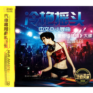

爱你错错错华语最新热门单曲
============================

|  |  |
| :--: | :-- |
| [ 爱你错错错华语最新热门单曲](https://emumo.xiami.com/album/2100229458) | **艺人**: [路童](../index.md) **语种**: 国语 **唱片公司**: 独立发行 **发行时间**: 2015年10月30日 **专辑类别**: EP, 单曲 **专辑风格**: 国语流行 Mandarin Pop **播放数**: 3917502 **收藏数**: 132 **评论数**: 5  |

## 简介

爱你错错错  
词曲：路童  
原唱：路童&amp;李泓滢  
监制：皮特 杨黎犁
 

滢：你悄悄的走 什么话也不说&nbsp;   
难道我爱你还不够多  
你说走就走 留给我寂寞   
我该如何挣脱这爱的枷锁  
童：心里没有我 我无话可说  
难道他比我爱你更多  
你的冷漠 刺痛我的心窝   
我该如何逃出这爱的漩涡  
滢：你伤害了我 你还说你爱我  
难道你的欺骗 还不够多  
曾经的海誓山盟都是错  
我的心里只爱你一个  
童：你伤害了我 你还一笑而过  
难道你的谎言 还不够多  
如果说爱你错错错  
我愿意为你一错再错  
童+滢：我愿意为你一错再错
 

 

## 曲目

## 评论

|  |  |  |  |
| :-- | :-- | :-- | :-- |
|  [虾米用户](https://emumo.xiami.com/u/252928462) 爱音乐，音乐爱我。甜美的... 2021-01-18 10:53 赞(0) 踩(0) | 
经典流行百听不厌……百年收藏
 |
|  [虾米用户](https://emumo.xiami.com/u/405034766) 有缘无份 2018-09-28 08:45 赞(1) 踩(0) | 
好听
 |
|  [虾米用户](https://emumo.xiami.com/u/327151979)  2017-10-23 00:30 赞(0) 踩(0) | 
你最喜欢听你唱爱情歌曲
 |
|  [虾米用户](https://emumo.xiami.com/u/244542531)  2017-06-05 10:20 赞(0) 踩(0) | 
听你的歌是一种享受   
 |
|  [虾米用户](https://emumo.xiami.com/u/297335172)  2017-05-21 21:39 赞(0) 踩(0) | 
    
 |
