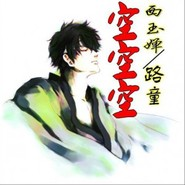

路童
============================

|  |  |
| :--: | :-- |
| [ 路童](https://i.xiami.com/lutong) | **播放数**: 19149470 **粉丝数**: 642 **评论数**: 35 **地区**: China 中国大陆 **风格**: 国语流行 Mandarin Pop  |

## 档案

## 专辑

| 名称 | 语种 | 唱片公司 | 发行时间 | 专辑类别 | 专辑风格 |
| :--: | :-- | :-- | :-- | :-- | :-- |
| [ 我在西藏等你](./albums/2103492498.md) | 国语 | 童氏唱片 | 2018年01月13日 | EP, 单曲 | 流行 Pop |
| [ 成功属于你](./albums/2102857271.md) | 国语 | 壹字唱片 | 2017年09月11日 | EP, 单曲 |  |
| [ 重庆重庆](./albums/2102768666.md) | 国语 | 方溥文化 | 2017年06月18日 | EP, 单曲 |  |
| [ 断情笔](./albums/2100335978.md) | 国语 | 童氏唱片 | 2016年05月12日 | EP, 单曲 | 国语流行 Mandarin Pop |
| [ 爱你错错错华语最新热门单曲](./albums/2100229458.md) | 国语 | 独立发行 | 2015年10月30日 | EP, 单曲 | 国语流行 Mandarin Pop |
| [ 英雄谱](./albums/1931938167.md) | 国语 | 童氏唱片 | 2015年05月17日 | EP, 单曲 |  |
| [ 情之恋](./albums/1328376998.md) | 国语 | 童氏唱片 | 2015年04月02日 | EP, 单曲 |  |
| [ 我在断桥等你](./albums/306611580.md) | 国语 | 索迪唱片 | 2014年07月28日 | EP, 单曲 |  |
| [ 有事你就对我说](./albums/1905562870.md) | 国语 | 童氏唱片 | 2014年07月16日 | EP, 单曲 |  |
| [ 孽爱](./albums/501171806.md) | 国语 | 索迪唱片 | 2014年05月25日 | EP, 单曲 |  |
| [ 伊百度传奇](./albums/1697031523.md) | 国语 | 童氏唱片 | 2014年04月01日 | EP, 单曲 |  |
| [ 一战到底](./albums/1188026350.md) | 国语 | 童氏唱片 | 2013年12月25日 | EP, 单曲 |  |
| [ 下一站](./albums/86310227.md) | 国语 | 童氏唱片 | 2013年11月26日 | EP, 单曲 |  |
| [ 缘分是天注定](./albums/1279317973.md) | 国语 | 童氏唱片 | 2013年09月08日 | EP, 单曲 |  |
| [ 三姨太](./albums/1497031535.md) | 国语 | 童氏唱片 | 2013年08月28日 | EP, 单曲 |  |
| [ 金桥荷缘](./albums/868171275.md) | 国语 | 童氏唱片 | 2013年05月08日 | EP, 单曲 |  |
| [ 我最深爱的你](./albums/1079317268.md) | 国语 | 童氏唱片 | 2013年03月16日 | EP, 单曲 |  |
| [ 谁爱我](./albums/1361493381.md) | 国语 | 童氏唱片 | 2013年02月20日 | EP, 单曲 |  |
| [ 爱情花瓣落满地](./albums/544880.md) | 国语 | 童氏唱片 | 2012年10月01日 | EP, 单曲 |  |
| [ 壮志豪情永不休](./albums/543121.md) | 国语 | 童氏唱片 | 2012年09月15日 | EP, 单曲 |  |
| [ 你是我最美的传奇](./albums/526394.md) | 国语 | 童氏唱片 | 2012年07月06日 | EP, 单曲 |  |
| [ 裸爱时代](./albums/517374.md) | 国语 | 索迪唱片 | 2012年05月28日 | EP, 单曲 |  |
| [ 男人最痴情](./albums/502982.md) | 国语 | 童氏唱片 | 2012年03月28日 | EP, 单曲 |  |
| [ 回心转意2013](./albums/498559.md) | 国语 | 童氏唱片 | 2012年03月08日 | EP, 单曲 | 国语流行 Mandarin Pop |
| [ 有一种爱不能牵手](./albums/497827.md) | 国语 | 童氏唱片 | 2012年02月28日 | EP, 单曲 |  |
| [ 朋友是天 朋友是地](./albums/497828.md) | 国语 | 童氏唱片 | 2012年02月28日 | EP, 单曲 |  |
| [ 裸爱情歌](./albums/497829.md) | 国语 | 童氏唱片 | 2012年02月14日 | EP, 单曲 |  |
| [ 空空空](./albums/493324.md) | 国语 | 童氏唱片 | 2012年02月08日 | EP, 单曲 |  |
| [ 空空空(今夜嗨不停)](./albums/493325.md) | 国语 | 索迪文化 | 2012年02月06日 | 录音室专辑 |  |
| [ 告诉你我爱你](./albums/1297030899.md) | 国语 | 童氏唱片 | 2011年09月18日 | EP, 单曲 |  |
| [ 江湖啊](./albums/435637.md) | 国语 | 童氏唱片 | 2011年04月06日 | EP, 单曲 |  |
| [ 迟来的爱](./albums/497830.md) | 国语 | 童氏唱片 | 2011年01月18日 | EP, 单曲 |  |
| [ 没有感情的爱情](./albums/497831.md) | 国语 | 童氏唱片 | 2010年08月08日 | EP, 单曲 |  |
| [ 如果你爱着我](./albums/493326.md) | 国语 | 童氏唱片 | 2008年10月25日 | EP, 单曲 |  |
| [ 薇薇](./albums/2104999895.md) | 国语 | 龙乐世纪 | 2008年01月01日 | EP, 单曲 |  |

## 评论

|  |  |  |  |
| :-- | :-- | :-- | :-- |
|  [虾米用户](https://emumo.xiami.com/u/344378859) 为了享受而唱 2020-12-16 05:33 赞(0) 踩(0) | 
李 o了 aqzzdaspw
 |
|  [虾米用户](https://emumo.xiami.com/u/344378859) 为了享受而唱 2020-12-16 05:33 赞(0) 踩(0) | 
jj
 |
|  [虾米用户](https://emumo.xiami.com/u/293692544) 你敢给我说话吗？我咬你 2019-11-19 17:43 赞(1) 踩(0) | 
好听
 |
|  [虾米用户](https://emumo.xiami.com/u/404763828)  2019-06-09 21:03 赞(1) 踩(0) | 
很喜欢，不错
 |
|  [虾米用户](https://emumo.xiami.com/u/422827359)  2019-04-07 15:32 赞(2) 踩(0) | 
很好听
 |
|  [虾米用户](https://emumo.xiami.com/u/293692544) 你敢给我说话吗？我咬你 2018-11-24 17:06 赞(1) 踩(0) | 
好听
 |
|  [虾米用户](https://emumo.xiami.com/u/406859410)  2018-11-20 07:29 赞(1) 踩(0) | 

 |
|  [虾米用户](https://emumo.xiami.com/u/293692544) 你敢给我说话吗？我咬你 2018-11-17 05:19 赞(1) 踩(0) | 
好听
 |
|  [虾米用户](https://emumo.xiami.com/u/358809641)  2018-11-05 08:38 赞(1) 踩(0) | 
好听
 |
|  [虾米用户](https://emumo.xiami.com/u/405913532) 心善則美，心純則真，人之... 2018-10-12 23:55 赞(1) 踩(0) | 
路老師來听你歌啦，支持男神哦！期待更多作品
 |
|  [虾米用户](https://emumo.xiami.com/u/195923346) 我还没想好要写什么... 2018-05-21 14:58 赞(2) 踩(0) | 
唱得刚柔并济，声线很好
 |
|  [虾米用户](https://emumo.xiami.com/u/293692544) 你敢给我说话吗？我咬你 2018-01-27 05:19 赞(1) 踩(0) | 
好听好听
 |
|  [虾米用户](https://emumo.xiami.com/u/332867249)  2017-12-27 20:46 赞(3) 踩(0) | 
   唱出了有情人的心声。
 |
|  [虾米用户](https://emumo.xiami.com/u/187537338) 曾经最美 2017-11-26 21:43 赞(2) 踩(0) | 
好听     
 |
|  [虾米用户](https://emumo.xiami.com/u/271169707) 找个爱人的啊 2017-10-04 17:35 赞(3) 踩(0) | 
  好听
 |
|  [虾米用户](https://emumo.xiami.com/u/311872780)  2017-07-14 09:36 赞(2) 踩(0) | 
真好听，百听不厌
 |
|  [虾米用户](https://emumo.xiami.com/u/254322649)  2017-06-22 21:03 赞(2) 踩(0) | 
声音很男子汉，很喜欢  
 |
|  [虾米用户](https://emumo.xiami.com/u/202176489)  2017-06-15 08:09 赞(3) 踩(0) | 
《爱你错错错》真心的好听
 |
|  [虾米用户](https://emumo.xiami.com/u/300335945)  2017-06-07 09:05 赞(2) 踩(0) | 
希望你继续出新的作品      
 |
|  [虾米用户](https://emumo.xiami.com/u/300335945)  2017-06-07 09:03 赞(3) 踩(0) | 
我喜欢听你的歌，好听，支持你         
 |
|  [虾米用户](https://emumo.xiami.com/u/290540557) 全心全意为本村的父老乡亲... 2017-05-04 21:42 赞(2) 踩(0) | 
壮志豪情
 |
|  [虾米用户](https://emumo.xiami.com/u/265891129)  2017-04-13 09:01 赞(2) 踩(0) | 
刚开始那段伴奏很好 到了唱的时候伴奏就没那么浓了
 |
|  [虾米用户](https://emumo.xiami.com/u/265891129)  2017-04-13 08:53 赞(2) 踩(0) | 
很喜欢你的歌  为什那首   情之恋没有伴奏啊  录出来感觉是在清唱
 |
|  [虾米用户](https://emumo.xiami.com/u/29537993) 高山流水 2017-02-11 22:15 赞(2) 踩(0) | 
好听
 |
|  [虾米用户](https://emumo.xiami.com/u/255058446)  2017-01-12 18:01 赞(2) 踩(0) | 
我喜欢，好听
 |
|  [虾米用户](https://emumo.xiami.com/u/244098473)  2016-12-20 21:52 赞(2) 踩(0) | 

 |
|  [虾米用户](https://emumo.xiami.com/u/204166400)  2016-12-18 19:23 赞(2) 踩(0) | 
好听呀
 |
|  [虾米用户](https://emumo.xiami.com/u/204166400)  2016-12-18 19:23 赞(2) 踩(0) | 
     
 |
|  [虾米用户](https://emumo.xiami.com/u/16135450)  2016-10-23 23:00 赞(2) 踩(0) | 
5186
 |
|  [虾米用户](https://emumo.xiami.com/u/11763865)  2016-10-20 08:35 赞(2) 踩(0) | 

 |
|  [虾米用户](https://emumo.xiami.com/u/102216118)  2016-10-03 14:06 赞(2) 踩(0) | 
我想问路童现在还回沙坪吗。
 |
|  [虾米用户](https://emumo.xiami.com/u/73404884) .职业：家具.唱歌.爱好... 2016-09-11 19:49 赞(1) 踩(0) | 
唱的太好听 
 |
|  [虾米用户](https://emumo.xiami.com/u/46768290) 此生一梦，此梦一生！ 2016-06-07 12:54 赞(1) 踩(0) | 
你写的曲比较喜欢 
 |
|  [虾米用户](https://emumo.xiami.com/u/73386340)  2015-10-29 14:37 赞(13) 踩(0) | 
我刚入驻了虾米音乐人，欢迎大家来我的个人主页，收听我的最新音乐
 |
| ⇒ |  [虾米用户](https://emumo.xiami.com/u/350671306)  2018-07-25 18:21 赞(0) 踩(0) | 
写的很好，唱的也很好，
 |
