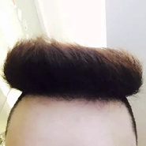

每次剪完头发都好想吐槽理发师含泪中枪
============================

|  |  |
| :--: | :-- |
| [ 每次剪完头发都好想吐槽理发师含泪中枪](https://emumo.xiami.com/album/2102880058) | **艺人**: [馒头](../index.md) **语种**: 国语 **唱片公司**: 独立发行 **发行时间**: 2017年10月25日 **专辑类别**: EP, 单曲 **专辑风格**: 流行 Pop **播放数**: 26924 **收藏数**: 34 **评论数**: 1  |

## 简介

 

世界上最遥远的距离，是我眼中的1cm和理发师眼中的1cm。
 

辛辛苦苦留半年，一剪回到解放前。
 

理发师总是让我换了一种丑法，剪之前想换个发型，剪了之后想换张脸。
 

搞得每一次理发都像一次赌博，可是却从没赢过。
 

## 曲目

## 评论

|  |  |  |
| :-- | :-- | :-- |
|  [虾米用户](https://emumo.xiami.com/u/11123510) 失眠是一种习惯 2017-10-25 19:04 赞(0) 踩(0) | 
这首不咋滴
 |
